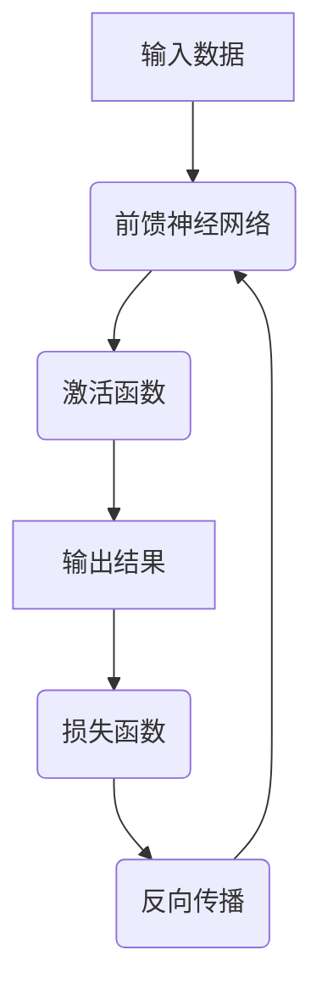

                 

# 文章标题：神经网络原理与代码实例讲解

> 关键词：神经网络，深度学习，前馈神经网络，反向传播算法，激活函数，卷积神经网络，循环神经网络，生成对抗网络，项目实战

> 摘要：
本文将深入探讨神经网络的原理，从基本概念到高级技术，层层递进，帮助读者建立全面的理解。我们将通过具体的代码实例，详细解析神经网络的实现过程，包括环境搭建、模型定义、训练与评估。文章涵盖了神经网络的发展历史、架构与组成、前馈神经网络、反向传播算法、激活函数与正则化、深度学习与卷积神经网络、循环神经网络与长短期记忆网络、生成对抗网络，以及神经网络在实际项目中的应用。

---

### 《神经网络原理与代码实例讲解》目录大纲

#### 第一部分：神经网络基础

#### 第1章：神经网络概述
##### 1.1 神经网络的发展历史
##### 1.2 神经网络的架构与组成
##### 1.3 神经网络的应用领域

#### 第2章：前馈神经网络
##### 2.1 前馈神经网络的原理
##### 2.2 神经元的激活函数
##### 2.3 前馈神经网络的训练与优化

#### 第3章：反向传播算法
##### 3.1 反向传播算法的基本原理
##### 3.2 反向传播算法的数学推导
##### 3.3 反向传播算法的优化方法

#### 第4章：激活函数与正则化
##### 4.1 激活函数的作用
##### 4.2 常见激活函数
##### 4.3 正则化技术的应用

#### 第5章：深度学习与卷积神经网络
##### 5.1 深度学习的概念与发展
##### 5.2 卷积神经网络（CNN）的原理
##### 5.3 卷积神经网络的训练与应用

#### 第6章：循环神经网络与长短期记忆网络
##### 6.1 循环神经网络（RNN）的原理
##### 6.2 长短期记忆网络（LSTM）的原理
##### 6.3 RNN与LSTM的应用案例

#### 第7章：生成对抗网络（GAN）
##### 7.1 GAN的原理与架构
##### 7.2 GAN的训练过程
##### 7.3 GAN的应用案例

#### 第8章：神经网络在实际项目中的应用
##### 8.1 项目背景与需求分析
##### 8.2 项目开发环境搭建
##### 8.3 项目代码实现与分析
##### 8.4 项目效果评估与优化

#### 附录：神经网络常用工具和库

##### 附录 A：神经网络开发工具概述
##### 附录 B：PyTorch库的使用
##### 附录 C：TensorFlow库的使用

---

### Mermaid 流程图



---

### 伪代码示例

```python
# 前馈神经网络的训练伪代码
def train_neural_network(X, Y):
    # 初始化参数
    W = initialize_weights()
    b = initialize_bias()

    for epoch in range(num_epochs):
        for x, y in data_loader(X, Y):
            # 前向传播
            z = np.dot(x, W) + b
            a = sigmoid(z)

            # 计算损失
            loss = compute_loss(a, y)

            # 反向传播
            dZ = a - y
            dW = np.dot(X.T, dZ)
            db = np.sum(dZ, axis=0)

            # 更新参数
            W -= learning_rate * dW
            b -= learning_rate * db

    return W, b
```

---

### 数学公式与讲解

#### 损失函数（均方误差）

$$
MSE = \frac{1}{n}\sum_{i=1}^{n}(y_i - \hat{y}_i)^2
$$

#### 激活函数（Sigmoid）

$$
\sigma(z) = \frac{1}{1 + e^{-z}}
$$

---

### 项目实战案例

#### 项目：手写数字识别

##### 开发环境搭建

- Python 3.8
- PyTorch 1.8

##### 数据预处理

```python
import torch
from torchvision import datasets, transforms

transform = transforms.Compose([
    transforms.ToTensor(),
    transforms.Normalize((0.5,), (0.5,))
])

train_data = datasets.MNIST(
    root='./data', 
    train=True, 
    download=True, 
    transform=transform
)

test_data = datasets.MNIST(
    root='./data', 
    train=False, 
    transform=transform
)
```

##### 模型实现

```python
import torch.nn as nn
import torch.optim as optim

class NeuralNetwork(nn.Module):
    def __init__(self):
        super(NeuralNetwork, self).__init__()
        self.fc1 = nn.Linear(784, 128)
        self.fc2 = nn.Linear(128, 64)
        self.fc3 = nn.Linear(64, 10)
    
    def forward(self, x):
        x = x.view(-1, 784)
        x = torch.relu(self.fc1(x))
        x = torch.relu(self.fc2(x))
        x = self.fc3(x)
        return x

model = NeuralNetwork()

optimizer = optim.Adam(model.parameters(), lr=0.001)
criterion = nn.CrossEntropyLoss()
```

##### 训练与评估

```python
def train_model(model, train_loader, test_loader, criterion, optimizer, num_epochs):
    model.train()
    for epoch in range(num_epochs):
        for x, y in train_loader:
            optimizer.zero_grad()
            output = model(x)
            loss = criterion(output, y)
            loss.backward()
            optimizer.step()
        
        with torch.no_grad():
            model.eval()
            correct = 0
            total = 0
            for x, y in test_loader:
                output = model(x)
                _, predicted = torch.max(output.data, 1)
                total += y.size(0)
                correct += (predicted == y).sum().item()
            print(f'Epoch [{epoch+1}/{num_epochs}], Accuracy: {100 * correct / total}%')

train_model(model, train_data, test_data, criterion, optimizer, num_epochs=10)
```

##### 代码解读与分析

- 数据预处理：将MNIST数据集转换为PyTorch张量，并进行归一化处理。
- 模型定义：定义一个简单的三层前馈神经网络。
- 训练与评估：使用随机梯度下降优化算法训练模型，并计算测试集的准确率。

---

以上就是《神经网络原理与代码实例讲解》的完整目录大纲，包括核心概念、算法原理、数学模型、项目实战等各个方面的内容。接下来，我们将逐章深入讲解神经网络的各个组成部分和实际应用。

---

### 作者信息

作者：AI天才研究院/AI Genius Institute & 禅与计算机程序设计艺术 /Zen And The Art of Computer Programming

---

接下来的部分，我们将逐一讲解神经网络的基础知识，从简单的概念到复杂的算法，帮助读者逐步建立起对神经网络的深入理解。我们将使用逻辑清晰、结构紧凑、简单易懂的专业的技术语言，确保每一位读者都能跟随我们的思路，掌握神经网络的核心内容。让我们开始吧，开启这段深度学习之旅！

