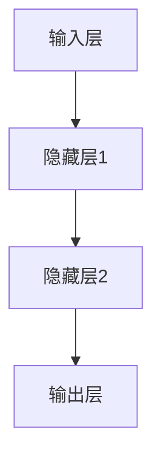
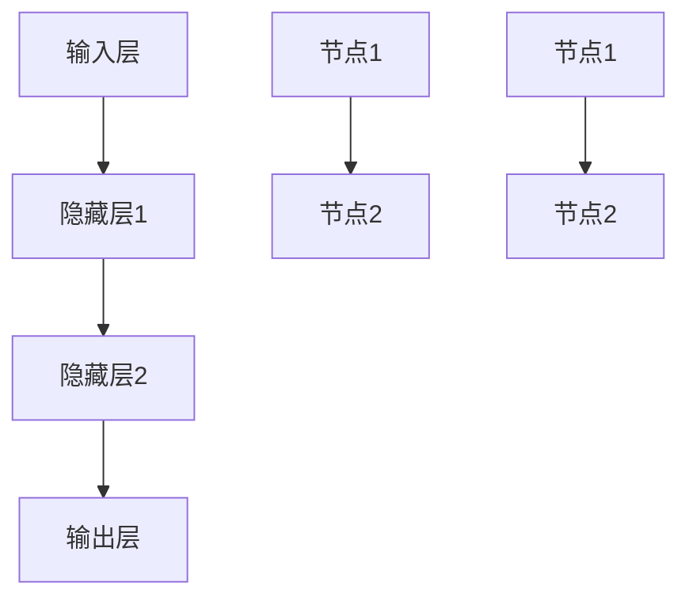
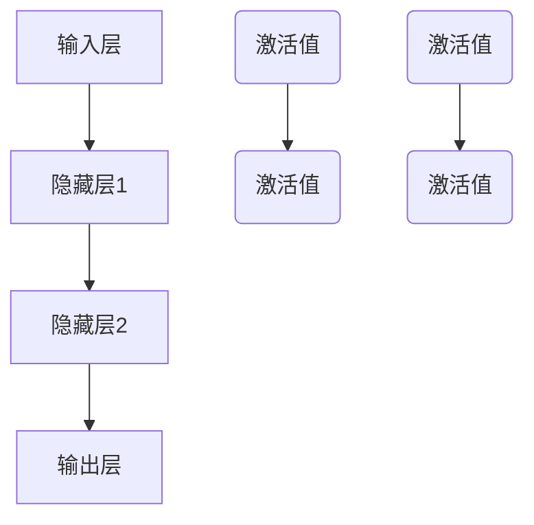

                 

# 神经网络模型的可视化与调试工具

> 关键词：神经网络，可视化，调试，工具，深度学习，反向传播

> 摘要：本文旨在探讨神经网络模型的可视化与调试工具。通过分析神经网络的基本结构、可视化与调试技术，以及实际案例，本文为深度学习研究者提供了详细的技术指南。文章首先介绍了神经网络模型的基本结构和相关算法，然后探讨了神经网络的可视化方法和调试工具。通过结合具体案例，本文展示了如何使用这些工具进行神经网络模型的分析和优化。

## 目录大纲

1. **导论**
   1.1 引言
   1.2 神经网络基础
   1.3 可视化方法简介
2. **可视化技术**
   2.1 神经网络模型可视化
   2.2 动态可视化
   2.3 可视化案例研究
3. **调试工具**
   3.1 调试技术基础
   3.2 常用调试工具
   3.3 调试案例分析
4. **集成与优化**
   4.1 可视化与调试工具的集成
   4.2 调试与优化的最佳实践
5. **高级主题**
   5.1 可视化与调试的高级技术
   5.2 开源可视化与调试工具的发展趋势
6. **附录**
   6.1 工具资源汇总
   6.2 参考文献

## 第一部分：导论

### 1.1 引言

神经网络作为深度学习的基础，已经在图像识别、自然语言处理、推荐系统等领域取得了显著的成果。然而，神经网络的复杂性和黑箱特性使得理解和分析神经网络模型变得异常困难。可视化与调试技术为解决这一问题提供了有力工具。

神经网络模型的可视化能够帮助研究者直观地理解模型的内部结构和运行机制。通过可视化，我们可以观察神经元的激活状态、权重的调整过程等，从而更深入地理解模型的行为。此外，调试工具可以帮助研究者发现并解决模型中的问题，提高模型的性能和鲁棒性。

### 1.2 神经网络基础

神经网络（Neural Network，NN）是一种模仿生物神经系统的计算模型。它由大量相互连接的神经元组成，通过输入层、隐藏层和输出层进行信息处理。

**1.2.1 神经网络的基本结构**

神经网络的基本结构可以用Mermaid流程图表示：



**1.2.2 前馈神经网络与反向传播算法**

前馈神经网络是一种信息从输入层流向输出层的网络，信息不循环。反向传播算法（Backpropagation）是一种用于训练神经网络的梯度下降方法。

反向传播算法的伪代码如下：

```python
for each layer l in the network backwards:
  for each neuron n in layer l:
    calculate the error signal delta = (expected_output - actual_output) * activation_derivative(n)
    update the weights and biases of the neuron using delta and the input values
```

**1.2.3 激活函数与优化算法**

激活函数（Activation Function）用于引入非线性因素，使得神经网络能够拟合复杂的非线性关系。常见的激活函数包括Sigmoid、ReLU、Tanh等。

优化算法（Optimization Algorithm）用于调整神经网络的权重和偏置，使得模型在训练数据上达到更好的性能。常见的优化算法包括随机梯度下降（SGD）、Adam等。

### 1.3 可视化方法简介

可视化在理解和分析神经网络模型中起着至关重要的作用。通过可视化，研究者可以直观地观察模型的内部状态，从而发现潜在的问题。

**1.3.1 可视化的意义**

可视化不仅有助于研究者理解神经网络的工作原理，还可以提高模型的可解释性。这对于提升模型的信任度和应用价值具有重要意义。

**1.3.2 数据可视化技术**

数据可视化技术包括直方图、散点图、热力图等。这些技术可以用于展示神经网络的输入数据、输出结果以及模型内部的激活状态。

**1.3.3 神经网络模型的可视化**

神经网络模型的可视化主要包括网络结构可视化、激活函数可视化和动态可视化。这些方法可以帮助研究者深入了解模型的内部机制。

## 第二部分：可视化技术

### 2.1 神经网络模型可视化

神经网络模型可视化是指将神经网络的内部结构和运行状态以图形化的方式展示出来。可视化工具可以帮助研究者直观地理解模型的运行过程。

**2.1.1 可视化工具概述**

常见的神经网络可视化工具有TensorBoard、PyTorch Visualization、NN-SVG等。这些工具具有不同的功能和特点，可以根据需求进行选择。

**2.1.2 网络结构可视化**

网络结构可视化是指展示神经网络的层次结构和连接关系。可以使用Mermaid流程图、图形化表示等方法进行展示。



**2.1.3 激活函数可视化**

激活函数可视化是指展示神经网络的激活状态。可以通过绘制激活值的分布图或热力图进行展示。



### 2.2 动态可视化

动态可视化是指展示神经网络在训练过程中的变化。通过动态可视化，研究者可以观察模型的学习过程，发现潜在的问题。

**2.2.1 动态可视化原理**

动态可视化通常基于动画技术，通过连续展示模型的内部状态来实现。可以使用JavaScript、PyTorch等工具实现动态可视化。

**2.2.2 动态可视化工具应用**

例如，可以使用TensorBoard的动画功能来展示神经网络在训练过程中的变化。

```bash
tensorboard --logdir=path/to/logdir
```

### 2.3 可视化案例研究

**2.3.1 简单网络的可视化分析**

以一个简单的多层感知机为例，使用TensorBoard进行可视化分析。

```python
import torch
import torch.nn as nn
import torch.optim as optim
from torch.utils.tensorboard import SummaryWriter

# 定义模型
model = nn.Sequential(
    nn.Linear(2, 3),
    nn.ReLU(),
    nn.Linear(3, 1),
    nn.Sigmoid()
)

# 定义损失函数和优化器
criterion = nn.BCELoss()
optimizer = optim.SGD(model.parameters(), lr=0.01)

# 模型训练
writer = SummaryWriter()
for epoch in range(100):
    # 前向传播
    outputs = model(inputs)
    loss = criterion(outputs, targets)

    # 反向传播和优化
    optimizer.zero_grad()
    loss.backward()
    optimizer.step()

    # 记录损失函数和激活值
    writer.add_scalar('Loss/train', loss.item(), epoch)
    writer.add_histogram('Activations/hidden1', model.hidden1.bias, epoch)
    writer.add_histogram('Activations/output', model.output.bias, epoch)

# 关闭日志记录
writer.close()
```

**2.3.2 复杂网络的可视化分析**

对于复杂的神经网络，可以使用NN-SVG工具生成网络结构的SVG图形。以下是一个使用NN-SVG生成复杂神经网络结构图形的示例：

```javascript
const nnsvg = require('nn-svg');

const model = {
  "layers": [
    {"type": "input", "name": "input", "size": 784},
    {"type": "fc", "name": "fc1", "size": 128, "activation": "ReLU"},
    {"type": "fc", "name": "fc2", "size": 64, "activation": "ReLU"},
    {"type": "fc", "name": "fc3", "size": 10, "activation": "Sigmoid"}
  ]
};

const svg = nnsvg.modelToSVG(model);
document.body.innerHTML = svg;
```

## 第三部分：调试工具

### 3.1 调试技术基础

调试是软件开发中必不可少的一部分。在神经网络模型开发过程中，调试技术同样重要。通过调试，研究者可以找出并解决模型中的问题，提高模型的性能。

**3.1.1 调试的重要性**

调试可以帮助研究者理解模型的行为，发现并修复错误。这对于提高模型的可靠性和鲁棒性具有重要意义。

**3.1.2 调试流程**

调试流程通常包括以下步骤：

1. 确定问题：通过分析错误信息、日志等，确定问题的可能原因。
2. 设计调试方案：根据问题的可能原因，设计调试方案。
3. 实施调试：根据调试方案，逐步查找问题。
4. 解决问题：根据调试结果，修复问题并测试验证。

**3.1.3 调试工具概述**

常见的调试工具有PyCharm、Visual Studio Code、Jupyter Notebook等。这些工具提供了丰富的调试功能，如断点调试、监控变量、单步执行等。

### 3.2 常用调试工具

**3.2.1 断点调试工具**

断点调试是一种常见的调试方法，通过在代码中的关键位置设置断点，暂停程序的执行，从而观察变量的值和程序的执行流程。

以下是一个使用PyCharm进行断点调试的示例：

```python
def my_function(x):
    x = x + 1
    print(x)
    if x > 10:
        raise ValueError("x must be less than 10")
    return x

x = 5
my_function(x)
```

在PyCharm中，可以在`print(x)`和`if x > 10:`语句前设置断点，然后运行程序。当程序执行到断点处时，会暂停执行，并显示当前变量的值。

**3.2.2 监控工具**

监控工具可以帮助研究者实时监控程序的运行状态，如内存使用情况、计算资源消耗等。

以下是一个使用Python的`psutil`库监控内存使用的示例：

```python
import psutil

def my_function():
    # 模拟内存消耗
    for _ in range(1000000):
        pass

# 获取进程内存使用情况
process = psutil.Process()
mem_info = process.memory_info()
print(f"Memory used: {mem_info.rss} bytes")

# 调用函数
my_function()

# 获取新的进程内存使用情况
new_mem_info = process.memory_info()
print(f"Memory used after function call: {new_mem_info.rss} bytes")
```

**3.2.3 性能分析工具**

性能分析工具可以帮助研究者分析程序的性能瓶颈，如计算时间、内存使用等。

以下是一个使用Python的`cProfile`库进行性能分析的示例：

```python
import cProfile
import pstats
import io

def my_function():
    # 模拟计算任务
    for _ in range(1000000):
        pass

# 执行性能分析
profiler = cProfile.Profile()
profiler.enable()
my_function()
profiler.disable()

# 输出性能分析结果
stats = pstats.Stats(profiler).sort_stats('cumulative')
stats.print_stats()
```

### 3.3 调试案例分析

**3.3.1 简单模型的调试**

以下是一个简单神经网络的调试案例：

```python
import torch
import torch.nn as nn
import torch.optim as optim

# 定义模型
model = nn.Sequential(
    nn.Linear(2, 3),
    nn.ReLU(),
    nn.Linear(3, 1),
    nn.Sigmoid()
)

# 定义损失函数和优化器
criterion = nn.BCELoss()
optimizer = optim.SGD(model.parameters(), lr=0.01)

# 调试：设置断点
# 断点1：前向传播
breakpoint()

# 调试：监控变量
inputs = torch.tensor([[0.5, 0.5]])
targets = torch.tensor([[1.0]])

outputs = model(inputs)
loss = criterion(outputs, targets)

# 调试：分析问题
if loss > 0.1:
    print("模型预测不准确，需要调整参数")

# 调试：继续训练
optimizer.zero_grad()
loss.backward()
optimizer.step()
```

**3.3.2 复杂模型的调试**

以下是一个复杂神经网络的调试案例：

```python
import torch
import torch.nn as nn
import torch.optim as optim

# 定义模型
class MyModel(nn.Module):
    def __init__(self):
        super(MyModel, self).__init__()
        self.fc1 = nn.Linear(784, 128)
        self.fc2 = nn.Linear(128, 64)
        self.fc3 = nn.Linear(64, 10)
        
    def forward(self, x):
        x = torch.relu(self.fc1(x))
        x = torch.relu(self.fc2(x))
        x = self.fc3(x)
        return x

model = MyModel()

# 定义损失函数和优化器
criterion = nn.CrossEntropyLoss()
optimizer = optim.Adam(model.parameters(), lr=0.001)

# 调试：设置断点
# 断点1：前向传播
breakpoint()

# 调试：监控变量
inputs = torch.tensor([...])  # 输入数据
targets = torch.tensor([...])  # 目标标签

outputs = model(inputs)
loss = criterion(outputs, targets)

# 调试：分析问题
if loss > 0.1:
    print("模型预测不准确，需要调整参数")

# 调试：继续训练
optimizer.zero_grad()
loss.backward()
optimizer.step()
```

## 第四部分：集成与优化

### 4.1 可视化与调试工具的集成

为了提高工作效率，可以将可视化与调试工具集成到开发环境中。例如，将TensorBoard集成到PyCharm中，可以使用以下命令安装TensorBoard插件：

```bash
conda install -c conda-forge pycharmx-tensorboard
```

安装完成后，在PyCharm中启用TensorBoard插件，即可在开发环境中使用TensorBoard进行可视化分析。

### 4.2 调试与优化的最佳实践

为了提高调试与优化效率，可以遵循以下最佳实践：

1. **及时记录**：在开发过程中，及时记录模型的运行状态和调试信息，有助于后续分析和解决问题。
2. **定期测试**：定期对模型进行测试，包括单元测试、集成测试等，以确保模型的稳定性和性能。
3. **版本控制**：使用版本控制系统（如Git）管理代码，以便在需要时回溯代码版本和调试状态。
4. **利用社区资源**：积极参与社区讨论，分享经验，学习他人的最佳实践。

### 4.3 实践指南

以下是一个基于TensorBoard和PyCharm的调试与优化实践指南：

1. **环境搭建**：安装TensorBoard插件和所需的深度学习库。
2. **数据准备**：准备训练数据和测试数据。
3. **模型定义**：定义神经网络模型，包括输入层、隐藏层和输出层。
4. **训练与可视化**：使用TensorBoard记录模型的损失函数、激活值等关键指标，并可视化网络结构。
5. **调试与优化**：使用PyCharm进行断点调试，监控变量，分析问题，并根据分析结果调整模型参数。
6. **测试与验证**：对模型进行测试，验证其性能和稳定性。

## 第五部分：高级主题

### 5.1 可视化与调试的高级技术

高级可视化与调试技术包括深度交互式可视化、自动错误检测、代码自动修复等。这些技术可以提高开发效率和模型质量。

**5.1.1 高级可视化技术**

深度交互式可视化可以使用户实时交互地探索神经网络模型，包括动态调整参数、观察模型响应等。例如，可以使用D3.js等前端库实现交互式可视化。

**5.1.2 高级调试技术**

高级调试技术包括基于机器学习的调试技术，如自动错误定位、自动代码修复等。这些技术可以利用机器学习模型，分析代码错误模式，提供智能化的调试建议。

**5.1.3 结合深度学习的可视化与调试**

结合深度学习的可视化与调试技术，可以提供更深入的分析和优化方法。例如，使用深度强化学习算法优化模型参数，提高模型的性能。

### 5.2 开源可视化与调试工具的发展趋势

开源可视化与调试工具在深度学习领域发展迅速，未来可能的发展趋势包括：

1. **性能提升**：通过优化算法和硬件加速，提高可视化与调试工具的性能。
2. **易用性增强**：提供更直观、易用的用户界面，降低使用门槛。
3. **智能化**：引入人工智能技术，实现自动错误检测、自动优化等智能功能。
4. **生态整合**：与其他开发工具和平台整合，形成统一的开发环境。

## 第六部分：附录

### 6.1 工具资源汇总

**6.1.1 主流可视化与调试工具列表**

- TensorBoard
- PyTorch Visualization
- NN-SVG
- PyCharm
- Visual Studio Code
- Jupyter Notebook

**6.1.2 调试与可视化工具资源推荐**

- 《深度学习可视化》
- 《深度学习调试技术》
- 《TensorBoard实战》

**6.1.3 深度学习与神经网络资源**

- 《深度学习》
- 《神经网络与深度学习》
- 《深度学习图模型》

### 6.2 参考文献

- Goodfellow, I., Bengio, Y., & Courville, A. (2016). *Deep Learning*.
- LeCun, Y., Bengio, Y., & Hinton, G. (2015). *Deep Learning*.
- Simonyan, K., & Zisserman, A. (2014). *Very Deep Convolutional Networks for Large-Scale Image Recognition*.
- Abadi, M., Ananthanarayanan, S., Brevdo, E., Chen, Z., Citro, C., S. Coronel, J., ... & Zheng, X. (2016). *TensorFlow: Large-scale Machine Learning on Hardware Systems*.

## 作者信息

作者：AI天才研究院/AI Genius Institute & 禅与计算机程序设计艺术 /Zen And The Art of Computer Programming

