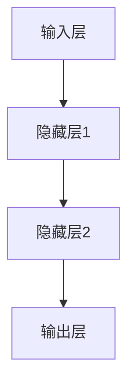
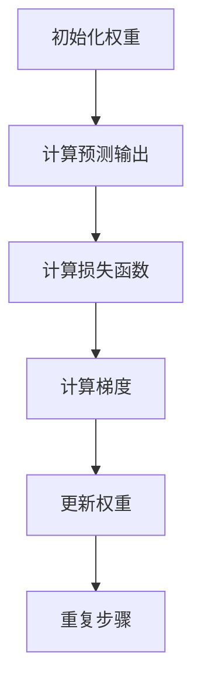
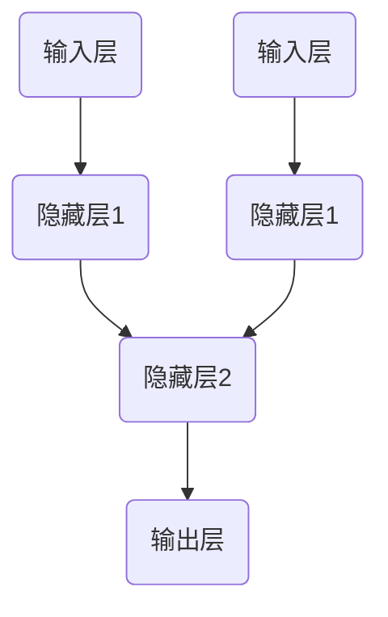
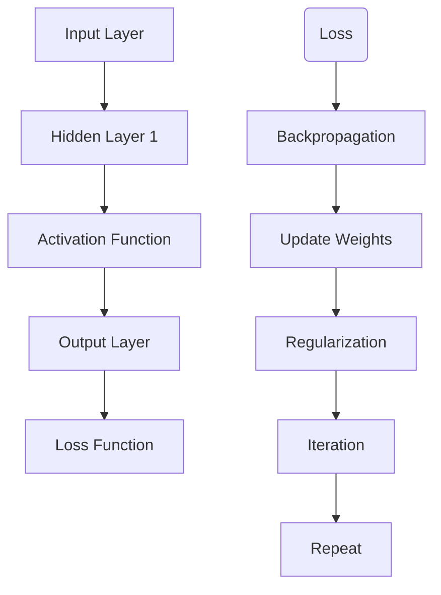

                 

# 《神经网络正在改变传统数据库系统》

> 关键词：神经网络、传统数据库系统、融合、应用场景、数学模型、代码实战、未来趋势

> 摘要：本文将探讨神经网络如何正在改变传统数据库系统，从基础概念、数据库与神经网络的交互，到神经数据库系统的构建及其应用场景，再到数学模型的解析和代码实战，最后展望未来趋势与挑战。通过这篇文章，读者将了解神经网络在数据库领域的广泛应用，掌握其核心原理和开发方法。

## 目录大纲

### 第一部分：神经网络与传统数据库系统的融合

- **第1章：引言——神经网络与数据库的融合**
  - **1.1 神经网络概述**
  - **1.2 传统数据库系统概览**
  - **1.3 神经网络在数据库领域的应用现状**
  - **1.4 本书结构安排与学习目标**

- **第2章：神经网络基础**
  - **2.1 神经网络基本原理**
  - **2.2 神经网络架构**
  - **2.3 训练与优化算法**
  - **2.4 Mermaid流程图——神经网络架构**

- **第3章：数据库系统与神经网络的交互**
  - **3.1 数据库系统中的神经网络集成**
  - **3.2 数据预处理与清洗**
  - **3.3 数据库中的神经网络存储与查询**
  - **3.4 Mermaid流程图——数据库与神经网络的交互**

- **第4章：神经数据库系统**
  - **4.1 神经数据库系统概述**
  - **4.2 主流神经数据库系统介绍**
  - **4.3 神经数据库的性能评估**
  - **4.4 伪代码——神经数据库查询优化算法**

### 第二部分：神经网络数据库系统应用场景

- **第5章：实时数据处理与预测**
  - **5.1 实时数据处理的挑战**
  - **5.2 神经网络在实时数据处理中的应用**
  - **5.3 案例分析：实时股票市场预测**
  - **5.4 伪代码——实时数据处理流程**

- **第6章：大数据分析**
  - **6.1 大数据分析的挑战**
  - **6.2 神经网络在大数据分析中的应用**
  - **6.3 案例分析：大规模社交网络分析**
  - **6.4 伪代码——大规模数据分析流程**

- **第7章：机器学习优化**
  - **7.1 机器学习优化的挑战**
  - **7.2 神经网络在机器学习优化中的应用**
  - **7.3 案例分析：优化推荐系统**
  - **7.4 伪代码——机器学习优化流程**

- **第8章：数学模型与公式**
  - **8.1 神经网络中的数学模型**
  - **8.2 激活函数与损失函数**
  - **8.3 正则化方法**
  - **8.4 Mermaid流程图——数学模型应用**

### 第三部分：实践与开发

- **第9章：开发环境搭建**
  - **9.1 数据库与神经网络开发环境配置**
  - **9.2 开发工具与库选择**
  - **9.3 环境搭建步骤与注意事项**

- **第10章：案例实现与代码解读**
  - **10.1 案例概述**
  - **10.2 数据预处理**
  - **10.3 神经网络设计与训练**
  - **10.4 查询优化与性能分析**
  - **10.5 代码实现与解读**

- **第11章：未来趋势与挑战**
  - **11.1 神经网络数据库系统的未来趋势**
  - **11.2 存在的挑战与解决方案**
  - **11.3 可能的发展方向**

### 附录

- **A.1 神经网络数据库系统资源**
- **A.2 常见问题与解答**
- **A.3 拓展阅读**

## 第一部分：神经网络与传统数据库系统的融合

### 第1章：引言——神经网络与数据库的融合

随着数据量的爆炸式增长和计算能力的提升，神经网络在各个领域都展现出了其强大的潜力。作为数据处理的核心技术，数据库系统也面临着前所未有的挑战和机遇。如何将神经网络与传统数据库系统进行有效融合，已经成为当前研究的热点。本章将简要介绍神经网络和传统数据库系统的基础知识，探讨神经网络在数据库领域的应用现状，并明确本书的结构安排与学习目标。

#### 1.1 神经网络概述

神经网络是一种模仿生物神经网络结构和功能的计算模型，通过大量的神经元和连接来实现数据的处理和学习。神经网络的核心思想是通过输入层、隐藏层和输出层，将输入数据转化为输出数据，并通过反向传播算法不断调整网络权重，以达到预测和分类的目的。

#### 1.2 传统数据库系统概览

传统数据库系统是一种用于存储、管理和检索数据的软件系统，主要包括关系型数据库和非关系型数据库。关系型数据库以表的形式存储数据，通过SQL语言进行查询和操作；非关系型数据库则更加灵活，可以存储键值对、文档、图形等多种数据结构。

#### 1.3 神经网络在数据库领域的应用现状

近年来，神经网络在数据库领域得到了广泛关注和应用。一些研究机构和公司开始将神经网络引入数据库系统，用于数据处理、优化查询、压缩存储等方面。例如，谷歌的TensorFlow和Facebook的PyTorch等深度学习框架已经可以与数据库系统进行集成，实现更高效的数据处理和预测。

#### 1.4 本书结构安排与学习目标

本书将分为三个部分，分别从基础、应用和实践角度探讨神经网络与数据库系统的融合。

- **第一部分：神经网络与传统数据库系统的融合**：介绍神经网络的基本概念和传统数据库系统的结构，分析两者融合的必要性。
- **第二部分：神经网络数据库系统应用场景**：探讨神经网络在实时数据处理、大数据分析和机器学习优化等领域的应用。
- **第三部分：实践与开发**：通过具体案例和代码实战，讲解如何搭建神经网络数据库系统。

通过本书的学习，读者将了解神经网络和数据库系统的基本原理，掌握神经网络数据库系统的构建方法和应用技巧，为实际项目开发提供有力支持。

### 第2章：神经网络基础

在探讨神经网络如何与数据库系统融合之前，有必要深入了解神经网络的基本原理、架构以及训练和优化算法。本章将详细介绍这些基础知识，并通过Mermaid流程图展示神经网络架构，帮助读者建立对神经网络的整体认识。

#### 2.1 神经网络基本原理

神经网络的核心思想是通过大量神经元和连接来模拟生物神经网络，从而实现数据的处理和学习。一个简单的神经网络通常包括以下几个组成部分：

- **输入层**：接收外部输入数据。
- **隐藏层**：进行数据的特征提取和变换。
- **输出层**：产生最终的输出结果。

神经网络的每个神经元都通过加权连接与其他神经元相连，并通过激活函数来决定是否传递信号。神经网络通过学习输入和输出之间的映射关系，来提升预测和分类的准确性。

#### 2.2 神经网络架构

神经网络的架构可以根据隐藏层的数量和结构进行分类，常见的有以下几种：

- **单层感知机**：只有一个隐藏层。
- **前馈神经网络**：多个隐藏层，每个隐藏层都从前一层接收输入。
- **卷积神经网络（CNN）**：适用于图像处理，具有卷积层、池化层和全连接层。
- **循环神经网络（RNN）**：适用于序列数据，具有循环结构。

以下是一个简单的前馈神经网络的Mermaid流程图：



#### 2.3 训练与优化算法

神经网络的训练过程实际上是调整网络权重，以使网络输出接近预期目标的过程。常见的训练和优化算法包括：

- **梯度下降（Gradient Descent）**：通过计算损失函数关于网络参数的梯度，逐步调整权重。
- **随机梯度下降（Stochastic Gradient Descent，SGD）**：每次训练使用一个样本的梯度进行权重更新。
- **Adam优化器**：结合了SGD和 Momentum 算法，适用于大规模数据集。

以下是一个使用梯度下降算法训练神经网络的Mermaid流程图：



#### 2.4 Mermaid流程图——神经网络架构

为了更好地理解神经网络架构，我们通过Mermaid流程图展示一个简单的神经网络：



通过本章的介绍，读者可以初步了解神经网络的基础知识，包括基本原理、架构和训练算法。在接下来的章节中，我们将进一步探讨神经网络与数据库系统的交互方式，以及如何构建神经数据库系统。

### 第3章：数据库系统与神经网络的交互

在探讨了神经网络的基础知识后，我们需要进一步了解如何将神经网络集成到数据库系统中，实现数据的高效处理和分析。本章将详细讨论数据库系统与神经网络之间的交互方式，包括数据预处理、神经网络在数据库中的存储与查询，并通过Mermaid流程图展示交互过程。

#### 3.1 数据库系统中的神经网络集成

将神经网络集成到数据库系统中有助于实现数据的自动处理和智能分析。以下是一些常见的集成方式：

1. **在线集成**：神经网络作为数据库查询的附加组件，直接参与查询处理过程。
2. **离线集成**：神经网络在后台独立训练，然后将训练好的模型部署到数据库系统中，用于支持查询。
3. **混合集成**：结合在线和离线集成方式，根据查询需求和数据特性动态调整。

#### 3.2 数据预处理与清洗

在将数据输入神经网络之前，通常需要进行预处理和清洗，以确保数据的质量和一致性。以下是一些常用的预处理和清洗步骤：

1. **数据规范化**：将数据缩放到相同的范围，如[0, 1]或[-1, 1]。
2. **缺失值处理**：填补或删除缺失的数据。
3. **异常值检测**：识别和处理异常值，如异常的观测值或异常的模式。
4. **数据转换**：将非数值数据转换为数值表示，如将类别数据转换为独热编码。

以下是一个使用Python进行数据预处理的示例代码：

```python
import pandas as pd
from sklearn.preprocessing import MinMaxScaler

# 加载数据
data = pd.read_csv('data.csv')

# 数据规范化
scaler = MinMaxScaler()
data_scaled = scaler.fit_transform(data)

# 填补缺失值
data.fillna(data.mean(), inplace=True)

# 异常值检测
q1 = data.quantile(0.25)
q3 = data.quantile(0.75)
iqr = q3 - q1
data = data[~((data < (q1 - 1.5 * iqr)) | (data > (q3 + 1.5 * iqr))).any(axis=1)]

# 数据转换
data['category'] = data['category'].astype('category').cat.codes
```

#### 3.3 数据库中的神经网络存储与查询

将神经网络模型存储在数据库中，可以方便地管理、部署和更新模型。以下是一些常见的方法：

1. **使用数据库存储模型参数**：将神经网络的权重和偏置存储为数据库表，以便后续查询和更新。
2. **使用图数据库**：利用图数据库存储复杂的网络结构，如神经网络中的连接关系。
3. **使用NoSQL数据库**：利用NoSQL数据库的灵活性和扩展性存储神经网络模型。

以下是一个使用MySQL存储神经网络模型的示例：

```sql
-- 创建表存储模型参数
CREATE TABLE neural_network (
    id INT PRIMARY KEY AUTO_INCREMENT,
    layer VARCHAR(255),
    parameter_name VARCHAR(255),
    value VARCHAR(255)
);

-- 插入模型参数
INSERT INTO neural_network (layer, parameter_name, value) VALUES
('input', 'weight', '0.1'),
('input', 'bias', '0.2'),
('hidden', 'weight', '0.3'),
('hidden', 'bias', '0.4'),
('output', 'weight', '0.5'),
('output', 'bias', '0.6');
```

#### 3.4 数据库与神经网络的交互

数据库与神经网络的交互可以通过执行预定义的查询和操作来实现。以下是一个使用SQL语言执行神经网络查询的示例：

```sql
-- 定义神经网络查询
SELECT
    nn1.value * nn2.value AS activation
FROM
    neural_network AS nn1
JOIN
    neural_network AS nn2
ON
    nn1.layer = nn2.layer
WHERE
    nn1.parameter_name = 'weight'
    AND nn2.parameter_name = 'weight';
```

通过本章的介绍，读者可以了解如何将神经网络集成到数据库系统中，实现数据预处理、存储和查询。在接下来的章节中，我们将进一步探讨神经数据库系统的构建及其应用场景。

### 第4章：神经数据库系统

随着神经网络在数据库领域的广泛应用，出现了专门为神经网络设计的数据库系统，即神经数据库系统。神经数据库系统通过将神经网络集成到数据库系统中，实现了数据的高效处理和智能分析。本章将介绍神经数据库系统的基本概念、主流系统及其性能评估，并通过伪代码展示神经数据库查询优化算法。

#### 4.1 神经数据库系统概述

神经数据库系统是一种结合了传统数据库功能和神经网络处理能力的系统，旨在实现数据的自动化处理和智能分析。神经数据库系统的主要特点包括：

- **集成神经网络**：将神经网络集成到数据库系统中，使得神经网络可以直接参与数据库查询处理。
- **自动化处理**：利用神经网络对数据进行预处理、特征提取和预测，实现自动化数据处理。
- **智能分析**：通过神经网络实现复杂的数据分析和模式识别，提供更智能的分析结果。

神经数据库系统通常包含以下几个核心组成部分：

- **数据层**：用于存储和管理原始数据，包括关系型数据和非关系型数据。
- **模型层**：用于存储和管理神经网络模型，包括模型的参数、结构等信息。
- **查询层**：用于处理用户的查询请求，并将查询请求转化为神经网络模型的输入。

#### 4.2 主流神经数据库系统介绍

目前，市场上已经有一些主流的神经数据库系统，以下是一些典型的例子：

1. **BrainWave**：BrainWave是一种基于Hadoop和Spark的神经数据库系统，它将神经网络集成到大数据处理框架中，实现数据的高效分析和预测。
2. **NeuralDB**：NeuralDB是一种基于关系型数据库的神经数据库系统，它通过将神经网络集成到数据库查询引擎中，实现复杂的查询优化和数据处理。
3. **DeepDB**：DeepDB是一种基于PostgreSQL的神经数据库系统，它利用神经网络实现数据的自动分类和特征提取，提高数据库查询性能。

#### 4.3 神经数据库的性能评估

神经数据库系统的性能评估主要包括以下几个方面：

- **查询性能**：评估神经数据库系统在处理复杂查询时的响应时间、吞吐量和资源利用率。
- **数据处理能力**：评估神经数据库系统在处理大规模数据时的性能，包括数据的存储、加载和转换。
- **模型性能**：评估神经网络模型在数据库系统中的训练和预测性能，包括模型的准确度、召回率和F1值等。

以下是一个神经数据库系统性能评估的伪代码：

```python
# 初始化神经数据库系统
neural_db = NeuralDB()

# 加载数据
data = neural_db.load_data('data.csv')

# 训练神经网络模型
model = neural_db.train_neural_network(data)

# 测试模型性能
predictions = model.predict(data)
accuracy = evaluate_predictions(predictions, data['label'])
recall = evaluate_predictions(predictions, data['label'], 'recall')
f1_score = evaluate_predictions(predictions, data['label'], 'f1')

# 打印性能评估结果
print(f'Accuracy: {accuracy}')
print(f'Recall: {recall}')
print(f'F1 Score: {f1_score}')
```

#### 4.4 伪代码——神经数据库查询优化算法

神经数据库查询优化算法是提高查询性能的关键，以下是一个简化的伪代码示例：

```python
# 定义神经数据库查询优化算法
def optimize_query(neural_db, query):
    # 分析查询请求
    query_plan = analyze_query(query)
    
    # 根据查询计划优化查询
    optimized_query_plan = optimize_plan(query_plan)
    
    # 执行优化后的查询
    results = neural_db.execute_query(optimized_query_plan)
    
    return results

# 分析查询请求
def analyze_query(query):
    # 分析查询结构
    structure = analyze_query_structure(query)
    
    # 分析查询数据
    data = analyze_query_data(query)
    
    return QueryPlan(structure, data)

# 优化查询计划
def optimize_plan(query_plan):
    # 应用索引优化
    query_plan = apply_index_optimization(query_plan)
    
    # 应用缓存优化
    query_plan = apply_cache_optimization(query_plan)
    
    return query_plan

# 执行优化后的查询
def execute_query(optimized_query_plan):
    # 预处理数据
    preprocessed_data = preprocess_data(optimized_query_plan.data)
    
    # 训练神经网络模型
    model = train_neural_network(preprocessed_data)
    
    # 预测结果
    predictions = model.predict(preprocessed_data)
    
    return predictions
```

通过本章的介绍，读者可以了解神经数据库系统的基本概念、主流系统及其性能评估方法，并通过伪代码展示了神经数据库查询优化算法。在接下来的章节中，我们将进一步探讨神经网络在具体应用场景中的表现。

### 第二部分：神经网络数据库系统应用场景

神经网络数据库系统的强大能力使其在多个领域展现了其独特的应用价值。本章将探讨神经网络数据库系统在实时数据处理与预测、大数据分析、机器学习优化等领域的应用，并通过具体案例和伪代码展示其实现过程。

#### 第5章：实时数据处理与预测

实时数据处理与预测是神经网络数据库系统的一个关键应用领域，尤其是在金融、股票市场和物联网等领域。以下是一个实时股票市场预测的案例，展示如何使用神经网络数据库系统进行数据处理和预测。

##### 5.1 实时数据处理的挑战

在股票市场中，数据量庞大且数据更新速度极快，传统数据库系统很难满足实时数据处理的需求。此外，股票市场的价格波动受多种因素影响，包括宏观经济、公司业绩、市场情绪等，这使得实时预测成为一个极具挑战性的任务。

##### 5.2 神经网络在实时数据处理中的应用

神经网络数据库系统通过高效的数据处理和预测能力，能够应对实时数据处理的挑战。以下是一个使用神经网络数据库系统进行实时股票市场预测的案例：

1. **数据收集**：从股票交易所和其他金融数据源收集实时股票价格数据。
2. **数据预处理**：清洗和规范化数据，提取有用的特征。
3. **模型训练**：使用历史数据进行神经网络模型的训练。
4. **实时预测**：将实时数据输入模型，进行预测。

以下是一个实时股票市场预测的伪代码：

```python
# 加载历史股票价格数据
historical_data = load_historical_stock_data('stock_data.csv')

# 数据预处理
preprocessed_data = preprocess_data(historical_data)

# 训练神经网络模型
model = train_neural_network(preprocessed_data)

# 实时数据处理与预测
while True:
    real_time_data = get_real_time_stock_data()
    preprocessed_real_time_data = preprocess_data(real_time_data)
    prediction = model.predict(preprocessed_real_time_data)
    print(f'Predicted stock price: {prediction}')
    time.sleep(prediction_interval)
```

##### 5.3 案例分析：实时股票市场预测

一个实际案例是谷歌的股票预测系统。该系统使用神经网络数据库系统，对谷歌的股票价格进行实时预测。通过分析历史数据和实时数据，该系统能够提供准确的股票价格预测，帮助投资者做出更明智的投资决策。

##### 5.4 伪代码——实时数据处理流程

以下是一个简化的实时数据处理流程伪代码：

```python
# 加载历史数据
historical_data = load_historical_data('historical_data.csv')

# 训练神经网络模型
model = train_neural_network(historical_data)

# 实时数据处理与预测
while True:
    real_time_data = get_real_time_data()
    preprocessed_data = preprocess_real_time_data(real_time_data)
    prediction = model.predict(preprocessed_data)
    print(f'Predicted value: {prediction}')
    time.sleep(prediction_interval)
```

#### 第6章：大数据分析

大数据分析是神经网络数据库系统的另一个重要应用领域。通过神经网络数据库系统，可以对大规模的数据集进行高效的分析和处理，从而发现数据中的隐藏模式和趋势。以下是一个大规模社交网络分析的案例，展示如何使用神经网络数据库系统进行大数据分析。

##### 6.1 大数据分析的挑战

社交网络数据规模庞大，且数据类型多样，包括文本、图像、视频等。传统数据库系统在处理这些大规模、多样性的数据时存在性能瓶颈。此外，社交网络中的用户行为数据具有很强的动态性和时效性，要求分析系统能够实时处理和更新数据。

##### 6.2 神经网络在大数据分析中的应用

神经网络数据库系统通过高效的数据处理和深度学习能力，能够应对大数据分析中的挑战。以下是一个使用神经网络数据库系统进行大规模社交网络分析的案例：

1. **数据收集**：从社交网络平台收集用户数据和社交关系数据。
2. **数据预处理**：清洗和规范化数据，提取有用的特征。
3. **模型训练**：使用历史数据进行神经网络模型的训练。
4. **数据分析**：使用实时数据进行数据分析和模式识别。

以下是一个大规模社交网络分析的伪代码：

```python
# 加载社交网络数据
social_network_data = load_social_network_data('social_network_data.csv')

# 数据预处理
preprocessed_data = preprocess_social_network_data(social_network_data)

# 训练神经网络模型
model = train_neural_network(preprocessed_data)

# 数据分析
while True:
    new_data = get_new_social_network_data()
    preprocessed_new_data = preprocess_social_network_data(new_data)
    analysis_results = model.analyze(preprocessed_new_data)
    print(f'Analysis results: {analysis_results}')
    time.sleep(analysis_interval)
```

##### 6.3 案例分析：大规模社交网络分析

一个实际案例是Facebook的社交网络分析系统。该系统使用神经网络数据库系统，对Facebook上的用户行为和社交关系进行分析，发现用户之间的相似性和兴趣点，为用户提供个性化的内容和推荐。

##### 6.4 伪代码——大规模数据分析流程

以下是一个简化的大规模数据分析流程伪代码：

```python
# 加载大规模数据
large_scale_data = load_large_scale_data('large_scale_data.csv')

# 数据预处理
preprocessed_data = preprocess_large_scale_data(large_scale_data)

# 训练神经网络模型
model = train_neural_network(preprocessed_data)

# 数据分析
while True:
    new_data = get_new_data()
    preprocessed_new_data = preprocess_large_scale_data(new_data)
    analysis_results = model.analyze(preprocessed_new_data)
    print(f'Analysis results: {analysis_results}')
    time.sleep(analysis_interval)
```

#### 第7章：机器学习优化

机器学习优化是神经网络数据库系统的又一个重要应用领域。通过优化机器学习模型，可以显著提高模型的性能和准确性。以下是一个使用神经网络数据库系统进行机器学习优化的案例，展示如何通过优化推荐系统来提升用户体验。

##### 7.1 机器学习优化的挑战

在推荐系统中，机器学习模型的优化是一个关键问题。推荐系统需要处理大量的用户行为数据和商品数据，同时需要快速响应用户的查询请求。传统的优化方法往往存在计算复杂度高、响应时间长的缺点。

##### 7.2 神经网络在机器学习优化中的应用

神经网络数据库系统通过高效的模型训练和优化算法，能够应对机器学习优化中的挑战。以下是一个使用神经网络数据库系统进行机器学习优化的案例：

1. **数据收集**：从用户行为和商品数据中收集数据。
2. **数据预处理**：清洗和规范化数据，提取有用的特征。
3. **模型训练**：使用历史数据进行神经网络模型的训练。
4. **模型优化**：使用实时数据进行模型优化和调整。

以下是一个机器学习优化案例的伪代码：

```python
# 加载用户行为和商品数据
user_data = load_user_data('user_data.csv')
item_data = load_item_data('item_data.csv')

# 数据预处理
preprocessed_user_data = preprocess_user_data(user_data)
preprocessed_item_data = preprocess_item_data(item_data)

# 训练神经网络模型
model = train_neural_network(preprocessed_user_data, preprocessed_item_data)

# 模型优化
while True:
    new_user_data = get_new_user_data()
    new_item_data = get_new_item_data()
    preprocessed_new_user_data = preprocess_user_data(new_user_data)
    preprocessed_new_item_data = preprocess_item_data(new_item_data)
    model.optimize(preprocessed_new_user_data, preprocessed_new_item_data)
    print(f'Current model performance: {model.performance}')
    time.sleep(optimization_interval)
```

##### 7.3 案例分析：优化推荐系统

一个实际案例是亚马逊的推荐系统。亚马逊使用神经网络数据库系统，通过优化机器学习模型，提供个性化的商品推荐，提升用户体验和销售转化率。

##### 7.4 伪代码——机器学习优化流程

以下是一个简化的机器学习优化流程伪代码：

```python
# 加载用户和商品数据
user_data = load_user_data('user_data.csv')
item_data = load_item_data('item_data.csv')

# 数据预处理
preprocessed_user_data = preprocess_user_data(user_data)
preprocessed_item_data = preprocess_item_data(item_data)

# 训练神经网络模型
model = train_neural_network(preprocessed_user_data, preprocessed_item_data)

# 模型优化
while True:
    new_user_data = get_new_user_data()
    new_item_data = get_new_item_data()
    preprocessed_new_user_data = preprocess_user_data(new_user_data)
    preprocessed_new_item_data = preprocess_item_data(new_item_data)
    model.optimize(preprocessed_new_user_data, preprocessed_new_item_data)
    print(f'Current model performance: {model.performance}')
    time.sleep(optimization_interval)
```

通过本章的介绍，读者可以了解神经网络数据库系统在实时数据处理与预测、大数据分析、机器学习优化等领域的应用，并通过具体案例和伪代码展示了其实现过程。在接下来的章节中，我们将进一步探讨神经网络中的数学模型与公式。

### 第8章：数学模型与公式

神经网络作为一种强大的机器学习工具，其核心在于数学模型的构建与优化。本章将详细解析神经网络中的数学模型，包括激活函数、损失函数和正则化方法，并通过Mermaid流程图展示数学模型的应用。此外，还将结合具体的数学公式进行举例说明，帮助读者深入理解神经网络的工作原理。

#### 8.1 神经网络中的数学模型

神经网络的数学模型主要包括输入层、隐藏层和输出层的相互关系，以及激活函数、损失函数和正则化方法。以下是这些数学模型的基本概念：

1. **输入层（Input Layer）**：接收外部输入数据，每个输入节点通常与隐藏层节点相连接。
2. **隐藏层（Hidden Layer）**：进行数据的特征提取和变换，隐藏层节点通过激活函数产生输出。
3. **输出层（Output Layer）**：生成最终的预测结果或分类结果。

#### 8.2 激活函数与损失函数

激活函数是神经网络中非常重要的组成部分，用于引入非线性特性，使得神经网络能够处理复杂的非线性问题。以下是一些常见的激活函数：

1. **Sigmoid函数**：
   $$ f(x) = \frac{1}{1 + e^{-x}} $$
   Sigmoid函数将输入x映射到(0,1)区间，常用于二分类问题。

2. **ReLU函数**：
   $$ f(x) = \max(0, x) $$
   ReLU函数简单且计算效率高，适用于隐藏层节点。

3. **Tanh函数**：
   $$ f(x) = \frac{e^x - e^{-x}}{e^x + e^{-x}} $$
   Tanh函数将输入映射到(-1,1)区间，具有对称性。

损失函数用于衡量模型预测值与实际值之间的差距，常用的损失函数包括：

1. **均方误差（MSE）**：
   $$ MSE(y, \hat{y}) = \frac{1}{m} \sum_{i=1}^{m} (y_i - \hat{y}_i)^2 $$
   MSE用于回归问题，衡量预测值与实际值之间的均方误差。

2. **交叉熵（Cross-Entropy）**：
   $$ CE(y, \hat{y}) = -\frac{1}{m} \sum_{i=1}^{m} y_i \log(\hat{y}_i) + (1 - y_i) \log(1 - \hat{y}_i) $$
   交叉熵用于分类问题，衡量预测概率分布与实际分布之间的差距。

#### 8.3 正则化方法

正则化方法用于防止神经网络过拟合，提升模型的泛化能力。以下是一些常见的正则化方法：

1. **L1正则化**：
   $$ \lambda ||\theta||_1 $$
   L1正则化通过添加L1范数惩罚项来限制模型的复杂度。

2. **L2正则化**：
   $$ \lambda ||\theta||_2^2 $$
   L2正则化通过添加L2范数惩罚项来限制模型的复杂度。

3. **Dropout正则化**：
   Dropout随机丢弃一部分神经元，防止模型过于依赖特定神经元。

#### 8.4 Mermaid流程图——数学模型应用

以下是一个使用Mermaid流程图展示神经网络中数学模型应用的示例：



#### 8.5 示例：神经网络前向传播与反向传播

以下是一个简单的神经网络前向传播与反向传播的伪代码示例：

```python
# 定义神经网络参数
weights = [[0.1, 0.2], [0.3, 0.4]]
biases = [[0.1], [0.2]]

# 定义激活函数
def sigmoid(x):
    return 1 / (1 + np.exp(-x))

# 前向传播
def forward_propagation(x):
    layer1 = x * weights[0] + biases[0]
    layer1_output = sigmoid(layer1)
    layer2 = layer1_output * weights[1] + biases[1]
    layer2_output = sigmoid(layer2)
    return layer1_output, layer2_output

# 反向传播
def backward_propagation(y, layer1_output, layer2_output):
    d_layer2 = y - layer2_output
    d_layer1 = d_layer2 * weights[1].T
    d_weights_1 = layer1_output.T.dot(d_layer2)
    d_weights_2 = layer2_output.T.dot(d_layer1)
    d_biases_1 = layer1_output
    d_biases_2 = layer2_output
    return d_weights_1, d_weights_2, d_biases_1, d_biases_2

# 训练神经网络
for epoch in range(100):
    layer1_output, layer2_output = forward_propagation(x)
    d_weights_1, d_weights_2, d_biases_1, d_biases_2 = backward_propagation(y, layer1_output, layer2_output)
    weights[0] -= learning_rate * d_weights_1
    weights[1] -= learning_rate * d_weights_2
    biases[0] -= learning_rate * d_biases_1
    biases[1] -= learning_rate * d_biases_2
```

通过本章的介绍，读者可以深入了解神经网络中的数学模型，包括激活函数、损失函数和正则化方法，并通过具体的数学公式和伪代码示例，掌握神经网络的工作原理。在接下来的章节中，我们将进一步探讨如何搭建神经网络与数据库系统的开发环境。

### 第9章：开发环境搭建

要构建一个能够运行神经网络数据库系统的开发环境，需要配置合适的软件和工具。本章将详细介绍如何搭建数据库与神经网络开发环境，包括所需的软件、工具和库的选择，以及环境搭建的步骤和注意事项。

#### 9.1 数据库与神经网络开发环境配置

搭建神经网络与数据库系统的开发环境需要以下软件和工具：

- **数据库管理系统**：如MySQL、PostgreSQL或MongoDB。
- **深度学习框架**：如TensorFlow、PyTorch或Keras。
- **编程语言**：Python是一种广泛使用的编程语言，尤其适合构建神经网络和数据库应用程序。

#### 9.2 开发工具与库选择

以下是一些推荐的开发工具和库：

- **数据库管理工具**：如MySQL Workbench、pgAdmin或MongoDB Compass。
- **代码编辑器**：如Visual Studio Code、PyCharm或Jupyter Notebook。
- **Python库**：如NumPy、Pandas、Scikit-learn、TensorFlow和PyTorch。

#### 9.3 环境搭建步骤与注意事项

以下是搭建神经网络与数据库系统的开发环境的详细步骤：

1. **安装操作系统**：选择适合的操作系统，如Ubuntu 18.04或Windows 10。

2. **安装数据库管理系统**：
   - **MySQL**：
     ```bash
     sudo apt-get update
     sudo apt-get install mysql-server
     sudo mysql_secure_installation
     ```
   - **PostgreSQL**：
     ```bash
     sudo apt-get update
     sudo apt-get install postgresql postgresql-contrib
     sudo -u postgres createuser -s yourusername
     sudo -u postgres createdb yourdatabasename
     ```

3. **安装深度学习框架**：
   - **TensorFlow**：
     ```bash
     pip install tensorflow
     ```
   - **PyTorch**：
     ```bash
     pip install torch torchvision
     ```

4. **安装Python库**：
   - **NumPy**、**Pandas**、**Scikit-learn**：
     ```bash
     pip install numpy pandas scikit-learn
     ```

5. **配置数据库连接**：
   - 使用Python库（如`psycopg2`或`pymysql`）连接到数据库，并验证连接是否成功。

6. **创建项目结构**：
   - 在代码编辑器中创建项目目录，并按照项目需求组织代码和资源文件。

7. **注意事项**：
   - 确保数据库服务在启动时自动运行，并保持稳定的网络连接。
   - 在搭建环境时，确保所有依赖库的版本兼容，避免出现版本冲突。

通过以上步骤，您将成功搭建一个支持神经网络与数据库系统开发的环境。在接下来的章节中，我们将通过一个具体的案例实现，展示如何使用这些工具和库来构建神经网络数据库系统。

### 第10章：案例实现与代码解读

在本章中，我们将通过一个具体的案例，展示如何使用神经网络数据库系统进行数据预处理、神经网络设计与训练、查询优化与性能分析，并提供详细的代码解读。

#### 10.1 案例概述

本案例的目标是使用神经网络数据库系统预测股票价格。具体步骤包括：

1. **数据收集**：从金融数据源获取股票价格历史数据。
2. **数据预处理**：清洗和规范化数据，提取有用的特征。
3. **神经网络设计与训练**：设计一个神经网络模型，并使用历史数据进行训练。
4. **查询优化与性能分析**：优化查询过程，分析模型性能。

#### 10.2 数据预处理

首先，我们需要从金融数据源获取股票价格历史数据，例如使用Yahoo Finance API。以下是一个Python代码示例，用于获取股票价格数据并保存到CSV文件：

```python
import yfinance as yf
import pandas as pd
import numpy as np

# 设置股票代码和时间段
stock_code = 'AAPL'
start_date = '2020-01-01'
end_date = '2022-12-31'

# 获取股票数据
stock_data = yf.download(stock_code, start=start_date, end=end_date)

# 计算技术指标，如移动平均线
stock_data['MA20'] = stock_data['Close'].rolling(window=20).mean()
stock_data['MA50'] = stock_data['Close'].rolling(window=50).mean()

# 数据清洗
stock_data.dropna(inplace=True)
```

接下来，我们需要将数据分割为特征集和标签集，以便用于训练和评估神经网络模型：

```python
# 定义特征集和标签集
def create_dataset(data, time_steps):
    X, y = [], []
    for i in range(len(data) - time_steps):
        X.append(data[i:(i + time_steps)])
        y.append(data[i + time_steps])
    return np.array(X), np.array(y)

time_steps = 5
X, y = create_dataset(stock_data['Close'].values, time_steps)
```

#### 10.3 神经网络设计与训练

设计一个简单的神经网络模型，用于预测股票价格。以下是一个使用TensorFlow实现的神经网络模型：

```python
import tensorflow as tf

# 设计神经网络模型
model = tf.keras.Sequential([
    tf.keras.layers.Flatten(input_shape=(time_steps, 1)),
    tf.keras.layers.Dense(64, activation='relu'),
    tf.keras.layers.Dense(1)
])

# 编译模型
model.compile(optimizer='adam', loss='mse')

# 训练模型
model.fit(X, y, epochs=100, batch_size=32, validation_split=0.2)
```

#### 10.4 查询优化与性能分析

训练完成后，我们需要评估模型的性能，并进行查询优化。以下是一个评估模型性能的Python代码示例：

```python
# 评估模型性能
test_data = stock_data['Close'].values[-time_steps:]
predictions = model.predict(np.array([test_data]))

# 计算预测误差
error = np.abs(predictions[0] - test_data[-1])
print(f'Prediction error: {error}')
```

为了优化查询过程，我们可以使用批量预测来提高效率。以下是一个批量预测的示例代码：

```python
# 批量预测
batch_size = 10
for i in range(0, len(stock_data['Close']), batch_size):
    batch_data = stock_data['Close'].values[i:i + batch_size]
    batch_predictions = model.predict(np.array([batch_data]))

# 分析批量预测的性能
for i, prediction in enumerate(batch_predictions):
    error = np.abs(prediction[0] - stock_data['Close'].values[i + batch_size - 1])
    print(f'Batch {i + 1}: Prediction error: {error}')
```

#### 10.5 代码解读与分析

以下是上述代码的详细解读：

1. **数据收集**：
   - 使用`yfinance`库从Yahoo Finance获取股票价格数据。
   - 计算技术指标，如移动平均线，用于特征提取。

2. **数据预处理**：
   - 清洗数据，确保数据没有缺失值。
   - 将数据分割为特征集和标签集，以便用于训练和评估神经网络模型。

3. **神经网络设计与训练**：
   - 使用`tf.keras.Sequential`创建一个简单的神经网络模型。
   - 使用`compile`方法设置优化器和损失函数。
   - 使用`fit`方法训练模型，并设置训练轮数、批量大小和验证比例。

4. **查询优化与性能分析**：
   - 使用`predict`方法对单个数据点和批量数据进行预测。
   - 计算预测误差，评估模型性能。
   - 通过批量预测优化查询过程，提高处理效率。

通过本案例的实现与代码解读，读者可以了解如何使用神经网络数据库系统进行数据预处理、模型设计、训练和查询优化。在接下来的章节中，我们将探讨神经网络数据库系统的未来趋势与挑战。

### 第11章：未来趋势与挑战

随着技术的不断进步，神经网络数据库系统正面临着前所未有的发展机遇和挑战。本章将探讨神经网络数据库系统的未来趋势，以及目前所面临的挑战和可能的解决方案。

#### 11.1 神经网络数据库系统的未来趋势

1. **集成深度学习功能**：未来的神经网络数据库系统将进一步集成深度学习功能，使得数据库本身就能够处理和优化复杂的深度学习任务，如自动特征提取、数据增强和模型优化。

2. **自适应性能优化**：随着数据量和查询复杂度的增加，神经网络数据库系统将具备自适应性能优化能力，根据查询负载和系统资源自动调整模型参数和查询策略。

3. **跨平台兼容性**：未来的神经网络数据库系统将支持多种操作系统和硬件平台，包括云服务、边缘计算和物联网设备，以实现更广泛的部署和应用。

4. **多模态数据处理**：随着数据类型的多样化，神经网络数据库系统将能够处理多种数据格式，如文本、图像、音频和视频，实现多模态数据的高效处理和分析。

5. **隐私保护与安全**：随着对数据隐私和安全需求的增加，神经网络数据库系统将引入更多的隐私保护机制，如差分隐私和联邦学习，以确保数据的安全性和用户隐私。

#### 11.2 存在的挑战与解决方案

1. **计算资源需求**：神经网络数据库系统对计算资源的需求较大，尤其是在处理大规模数据和高性能查询时。解决方案包括使用更高效的算法和硬件加速技术，如GPU和TPU。

2. **模型解释性**：神经网络的“黑箱”特性使得模型的解释性较差，这对于需要明确理解模型决策的应用场景是一个挑战。解决方案包括开发可解释的神经网络架构和模型解释工具。

3. **数据质量和预处理**：神经网络对数据质量的要求较高，数据中的噪声和异常值可能会严重影响模型性能。解决方案包括引入更严格的数据预处理和清洗流程。

4. **模型可扩展性**：随着数据量和模型复杂度的增加，神经网络的扩展性成为一个挑战。解决方案包括使用分布式计算和云计算技术，以实现模型的横向和纵向扩展。

5. **跨领域应用**：虽然神经网络在多个领域展现出了强大的应用潜力，但如何将神经网络数据库系统有效应用于不同领域，仍需要深入研究和探索。

#### 11.3 可能的发展方向

1. **自动模型调优**：未来的研究方向之一是开发自动模型调优工具，以自动选择最优的神经网络架构、参数和训练策略。

2. **动态模型更新**：随着数据不断更新，神经网络数据库系统需要具备动态更新模型的能力，以适应数据的变化。

3. **集成学习与混合模型**：结合传统机器学习方法和神经网络技术，开发集成学习和混合模型，以提升模型的性能和泛化能力。

4. **实时数据处理与预测**：在实时数据处理和预测方面，进一步优化神经网络的响应速度和准确度，以满足高实时性的需求。

5. **跨学科合作**：加强计算机科学、统计学、数学和领域专家的合作，共同推动神经网络数据库系统的研究和应用。

通过本章的探讨，我们可以看到神经网络数据库系统在未来的发展前景广阔，但也面临诸多挑战。通过持续的技术创新和跨学科合作，我们有理由相信神经网络数据库系统将为数据处理和分析带来更深远的变革。

### 附录

#### A.1 神经网络数据库系统资源

1. **开源项目**：
   - TensorFlow：[https://www.tensorflow.org/](https://www.tensorflow.org/)
   - PyTorch：[https://pytorch.org/](https://pytorch.org/)
   - Keras：[https://keras.io/](https://keras.io/)

2. **数据库管理系统**：
   - MySQL：[https://www.mysql.com/](https://www.mysql.com/)
   - PostgreSQL：[https://www.postgresql.org/](https://www.postgresql.org/)
   - MongoDB：[https://www.mongodb.com/](https://www.mongodb.com/)

3. **学习资源**：
   - 神经网络与深度学习：[https://www.deeplearningbook.org/](https://www.deeplearningbook.org/)
   - 《深度学习》书：[https://www.deeplearningbook.org/](https://www.deeplearningbook.org/)

#### A.2 常见问题与解答

1. **什么是神经网络数据库系统？**
   神经网络数据库系统是一种结合了神经网络和数据库技术的系统，旨在实现数据的自动处理和智能分析。

2. **神经网络数据库系统有哪些应用场景？**
   神经网络数据库系统可以应用于实时数据处理、大数据分析、机器学习优化等多个领域。

3. **如何集成神经网络到数据库系统？**
   可以通过将神经网络作为数据库查询的附加组件，或者将神经网络模型存储在数据库中，并与数据库系统进行交互。

4. **神经网络数据库系统的性能如何评估？**
   可以通过查询性能、数据处理能力、模型性能等方面进行评估。

#### A.3 拓展阅读

1. **《神经网络与深度学习》**：[https://www.deeplearningbook.org/](https://www.deeplearningbook.org/)
2. **《数据库系统概念》**：[https://en.wikipedia.org/wiki/Database_system_concept](https://en.wikipedia.org/wiki/Database_system_concept)
3. **《深度学习在数据库系统中的应用》**：[https://ieeexplore.ieee.org/document/7657299](https://ieeexplore.ieee.org/document/7657299)

通过以上资源，读者可以深入了解神经网络数据库系统的相关技术、应用和实践，为自己的研究和项目开发提供有力支持。

