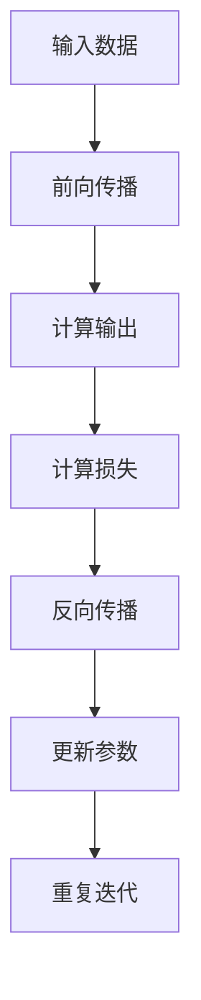
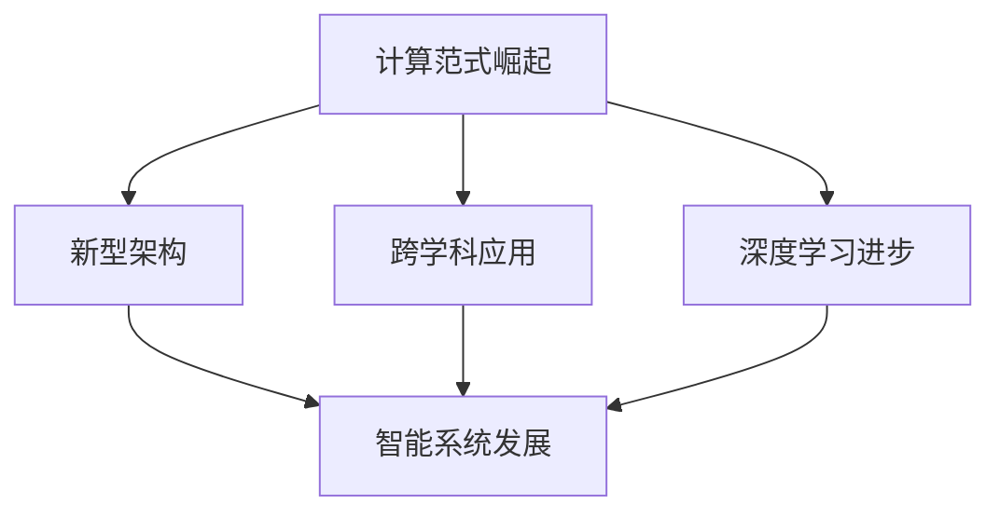

                 

# 文章标题：神经网络计算范式的崛起

> 关键词：神经网络、计算范式、深度学习、机器学习、人工智能

> 摘要：本文将深入探讨神经网络计算范式的崛起，从背景与概述、基础概念、核心算法原理、数学模型、项目实战到未来展望与挑战，全面剖析神经网络在人工智能领域的革命性影响。

## 《神经网络计算范式的崛起》目录大纲

### 第一部分：背景与概述

- **1. 引言与背景**
  - **1.1 计算范式的发展**
  - **1.2 神经网络计算的兴起**
  - **1.3 书籍目标与结构**

- **2. 神经网络基础**
  - **2.1 神经网络简介**
  - **2.2 神经元模型**
  - **2.3 神经网络架构**

- **3. 神经网络学习算法**
  - **3.1 前向传播与反向传播**
  - **3.2 梯度下降算法**
  - **3.3 随机梯度下降**

### 第二部分：核心概念与联系

- **4. 神经网络的核心原理**
  - **4.1 活性函数**
  - **4.2 损失函数**
  - **4.3 优化算法**
  - **4.4 核心原理 Mermaid 流程图**

### 第三部分：核心算法原理讲解

- **5. 卷积神经网络（CNN）**
  - **5.1 CNN 的基本结构**
  - **5.2 卷积操作**
  - **5.3 池化操作**
  - **5.4 CNN 算法伪代码**

- **6. 循环神经网络（RNN）**
  - **6.1 RNN 的基本结构**
  - **6.2 隐藏状态**
  - **6.3 RNN 算法伪代码**

- **7. 长短时记忆网络（LSTM）**
  - **7.1 LSTM 的结构**
  - **7.2 门控机制**
  - **7.3 LSTM 算法伪代码**

### 第四部分：深度学习中的数学模型

- **8. 线性代数基础**
  - **8.1 矩阵与向量操作**
  - **8.2 矩阵乘法**
  - **8.3 线性代数公式与解释**

- **9. 概率与统计基础**
  - **9.1 概率论基本概念**
  - **9.2 贝叶斯定理**
  - **9.3 统计模型与公式**

- **10. 最优化算法**
  - **10.1 梯度下降算法**
  - **10.2 随机优化算法**
  - **10.3 优化算法伪代码**

### 第五部分：项目实战

- **11. 图像分类项目**
  - **11.1 项目介绍**
  - **11.2 数据预处理**
  - **11.3 模型设计与训练**
  - **11.4 评估与优化**
  - **11.5 代码实现与分析**

- **12. 自然语言处理项目**
  - **12.1 项目介绍**
  - **12.2 数据预处理**
  - **12.3 模型设计与训练**
  - **12.4 评估与优化**
  - **12.5 代码实现与分析**

- **13. 强化学习项目**
  - **13.1 项目介绍**
  - **13.2 环境与状态定义**
  - **13.3 行为策略**
  - **13.4 代码实现与分析**

### 第六部分：未来展望与挑战

- **14. 神经网络计算的未来趋势**
  - **14.1 新型架构**
  - **14.2 跨学科应用**
  - **14.3 未来展望 Mermaid 流程图**

- **15. 挑战与机遇**
  - **15.1 计算资源需求**
  - **15.2 数据隐私**
  - **15.3 挑战与解决方案**

### 附录

- **A. 神经网络相关工具与资源**
- **B. 参考文献**
- **C. 代码示例与实验数据**

## 第一部分：背景与概述

### 1. 引言与背景

**1.1 计算范式的发展**

计算机科学的发展经历了多个范式，从最初的硬件驱动到软件驱动的时代，再到如今以算法和数据为核心的智能时代。计算范式的发展可以归纳为以下几个阶段：

1. **硬件驱动时代**：这一阶段，计算机的发展主要依赖于硬件技术的进步，如处理器速度、内存容量和存储容量。这一时期的主要目标是通过硬件的提升来实现更快的计算速度和更大的存储能力。

2. **软件驱动时代**：随着硬件的进步，软件的开发成为了计算机科学的核心。编程语言和软件开发工具的兴起使得人们可以更加高效地编写和优化软件，这一阶段的主要目标是通过软件的创新来实现更加高效和智能的计算。

3. **算法和数据驱动时代**：随着互联网和大数据的兴起，算法和数据成为了计算的核心。人们开始意识到，通过算法优化和数据挖掘，可以大幅提升系统的性能和智能水平。这一阶段的主要目标是通过算法和数据来实现更加智能和自适应的计算。

**1.2 神经网络计算的兴起**

神经网络计算范式是算法和数据驱动时代的产物。与传统计算范式不同，神经网络计算范式以模拟人脑神经网络为基础，通过学习数据中的特征和规律来实现智能。神经网络计算的兴起主要有以下几个原因：

1. **计算机硬件的进步**：随着计算机硬件的发展，处理器速度和内存容量的大幅提升为神经网络计算提供了强大的计算能力。

2. **大数据的兴起**：互联网的普及和数据存储技术的发展使得人们可以收集和处理大量的数据，为神经网络学习提供了丰富的数据资源。

3. **深度学习的突破**：深度学习是神经网络计算的重要分支，通过多层神经网络的结构，深度学习在图像识别、语音识别、自然语言处理等领域取得了显著的突破。

**1.3 书籍目标与结构**

本书旨在深入探讨神经网络计算范式，帮助读者理解神经网络的基本原理、核心算法和实际应用。本书的结构如下：

- **第一部分：背景与概述**：介绍计算范式的发展、神经网络计算的兴起以及本书的目标和结构。
- **第二部分：核心概念与联系**：阐述神经网络的基本概念，包括神经元模型、神经网络架构等。
- **第三部分：核心算法原理讲解**：详细讲解神经网络学习算法，包括前向传播、反向传播、梯度下降算法等。
- **第四部分：深度学习中的数学模型**：介绍深度学习中常用的数学模型，如线性代数、概率与统计等。
- **第五部分：项目实战**：通过实际项目，展示神经网络的应用方法和技巧。
- **第六部分：未来展望与挑战**：探讨神经网络计算的未来趋势和面临的挑战。

通过本书的学习，读者将能够：

- 理解神经网络的基本原理和计算范式。
- 掌握神经网络学习算法和数学模型。
- 学会使用神经网络解决实际问题。
- 看到神经网络计算的广泛应用和未来发展。

### 2. 神经网络基础

**2.1 神经网络简介**

神经网络（Neural Network）是一种模拟人脑神经网络计算能力的计算模型。它由大量的神经元（Node）通过连接（Connection）组成，每个神经元都可以接收输入信号，通过内部计算后产生输出信号。神经网络的工作原理是通过对输入数据进行处理，从数据中提取特征，并通过连接权重（Weight）调整，最终实现对输入数据的分类、预测或转换。

**2.2 神经元模型**

神经元是神经网络的基本单元，它由三个主要部分组成：输入部分、计算部分和输出部分。

1. **输入部分**：每个神经元接收多个输入信号，这些信号通常来自于其他神经元的输出。
2. **计算部分**：输入信号通过加权求和，然后通过激活函数（Activation Function）进行处理，得到神经元的输出。
3. **输出部分**：神经元的输出信号可以作为其他神经元的输入，或者作为最终的计算结果。

一个简单的神经元模型可以表示为：

$$
y = \sigma(\sum_{i=1}^{n} w_i x_i + b)
$$

其中，$y$ 是神经元的输出，$w_i$ 是第 $i$ 个输入信号的权重，$x_i$ 是第 $i$ 个输入信号，$\sigma$ 是激活函数，$b$ 是偏置项。

**2.3 神经网络架构**

神经网络架构是指神经网络的层次结构，包括输入层、隐藏层和输出层。

1. **输入层**：输入层接收外部输入数据，每个输入数据对应一个神经元。
2. **隐藏层**：隐藏层是神经网络的核心部分，负责对输入数据进行处理和特征提取。一个神经网络可以包含一个或多个隐藏层。
3. **输出层**：输出层产生最终的输出结果，对应于具体的任务，如分类、回归等。

一个简单的神经网络架构可以表示为：

```
         输入层
           |
           V
        隐藏层
           |
           V
        输出层
```

### 3. 神经网络学习算法

**3.1 前向传播与反向传播**

神经网络的学习过程可以分为两个阶段：前向传播（Forward Propagation）和反向传播（Back Propagation）。

**前向传播**：

在神经网络中，输入数据首先通过输入层传递到隐藏层，然后逐层传递到输出层。每个神经元的输出通过激活函数处理后传递给下一层。这个过程称为前向传播。

$$
z_l = \sum_{i=1}^{n} w_{li} x_i + b_l \\
a_l = \sigma(z_l)
$$

其中，$z_l$ 是第 $l$ 层的第 $i$ 个神经元的加权求和结果，$a_l$ 是该神经元的输出，$w_{li}$ 是第 $l$ 层的第 $i$ 个神经元与第 $l+1$ 层的第 $i$ 个神经元之间的权重，$b_l$ 是第 $l$ 层的第 $i$ 个神经元的偏置项，$\sigma$ 是激活函数。

**反向传播**：

在神经网络的前向传播过程中，每个神经元的输出都会影响最终的输出结果。为了优化网络性能，需要通过反向传播算法调整网络中的权重和偏置项。

反向传播算法的核心思想是计算每个神经元对最终输出误差的梯度，并根据梯度调整权重和偏置项。具体步骤如下：

1. **计算输出层的误差**：

$$
\delta^l = (a^l - t) \odot \sigma'(z^l)
$$

其中，$\delta^l$ 是第 $l$ 层的误差，$a^l$ 是第 $l$ 层的输出，$t$ 是实际输出，$\sigma'$ 是激活函数的导数，$\odot$ 表示元素乘法。

2. **计算隐藏层的误差**：

$$
\delta^{l-1} = (W^{l-1} \delta^l) \odot \sigma'(z^{l-1})
$$

其中，$W^{l-1}$ 是第 $l-1$ 层到第 $l$ 层的权重矩阵。

3. **更新权重和偏置项**：

$$
W^l \leftarrow W^l - \alpha \frac{\partial J}{\partial W^l} \\
b^l \leftarrow b^l - \alpha \frac{\partial J}{\partial b^l}
$$

其中，$J$ 是损失函数，$\alpha$ 是学习率。

通过多次迭代反向传播算法，网络中的权重和偏置项将逐渐调整，使得网络的输出误差最小。

**3.2 梯度下降算法**

梯度下降算法是神经网络学习中常用的优化算法，用于调整网络中的权重和偏置项。梯度下降算法的核心思想是沿着损失函数的梯度方向，逐步调整权重和偏置项，以减小损失函数的值。

$$
W \leftarrow W - \alpha \nabla W J
$$

其中，$\nabla W J$ 是权重矩阵 $W$ 的梯度，$\alpha$ 是学习率。

梯度下降算法可以分为以下几种类型：

1. **批量梯度下降（Batch Gradient Descent）**：每次迭代使用整个训练集的梯度进行更新。
2. **随机梯度下降（Stochastic Gradient Descent, SGD）**：每次迭代只使用一个样本的梯度进行更新。
3. **小批量梯度下降（Mini-batch Gradient Descent）**：每次迭代使用一部分样本的梯度进行更新。

**3.3 随机梯度下降**

随机梯度下降（Stochastic Gradient Descent, SGD）是一种基于随机样本的梯度下降算法。与批量梯度下降和小批量梯度下降不同，随机梯度下降每次迭代只使用一个样本的梯度进行更新，这使得算法的计算复杂度更低。

$$
W \leftarrow W - \alpha \nabla_w J(x^{(i)}, y^{(i)})
$$

其中，$x^{(i)}$ 和 $y^{(i)}$ 分别是第 $i$ 个输入样本和输出样本，$\nabla_w J$ 是权重矩阵 $W$ 的梯度。

随机梯度下降算法的优点是计算速度快，缺点是梯度估计的噪声较大，可能导致收敛不稳定。为了改善这个问题，可以采用以下策略：

1. **动量（Momentum）**：引入动量项，利用前几次迭代的梯度信息来平滑当前梯度。
2. **自适应学习率（Adaptive Learning Rate）**：根据迭代过程中的梯度变化动态调整学习率。

通过以上策略，可以显著提高随机梯度下降算法的收敛速度和稳定性。

### 第二部分：核心概念与联系

#### 4. 神经网络的核心原理

神经网络的核心原理包括激活函数、损失函数和优化算法。这些概念是神经网络能够学习和预测的基础。

**4.1 活性函数**

激活函数（Activation Function）是神经网络中每个神经元的一个重要组成部分。它用于将神经元的线性输出转换为一个非线性输出，使得神经网络具有非线性变换能力。常见的激活函数包括：

1. ** sigmoid 函数**：
   $$
   \sigma(x) = \frac{1}{1 + e^{-x}}
   $$
   sigmoid 函数是一个 S 形的曲线，它的输出范围在 0 到 1 之间。sigmoid 函数在神经网络中常用于二分类问题。

2. **ReLU 函数**：
   $$
   \text{ReLU}(x) = \max(0, x)
   $$
  ReLU 函数是一个线性函数，它在 $x$ 小于 0 时输出为 0，在 $x$ 大于等于 0 时输出为 $x$。ReLU 函数具有计算速度快、参数调节简单的优点，因此在深度神经网络中广泛使用。

3. **Tanh 函数**：
   $$
   \tanh(x) = \frac{e^x - e^{-x}}{e^x + e^{-x}}
   $$
  Tanh 函数是一个 S 形的曲线，它的输出范围在 -1 到 1 之间。Tanh 函数在神经网络中常用于将输出映射到某个范围。

激活函数的选择对神经网络的学习性能有重要影响。合适的激活函数可以提高网络的非线性能力，加快学习速度，减小梯度消失和梯度爆炸等问题。

**4.2 损失函数**

损失函数（Loss Function）是神经网络中用于评估模型预测结果和真实结果之间差异的函数。损失函数的目的是最小化预测误差，从而提高模型的准确度。常见的损失函数包括：

1. **均方误差（MSE）**：
   $$
   \text{MSE}(y, \hat{y}) = \frac{1}{2} \sum_{i=1}^{n} (y_i - \hat{y}_i)^2
   $$
  MSE 函数用于回归问题，它计算实际输出和预测输出之间的均方误差。MSE 函数的缺点是对异常值敏感，容易出现梯度消失问题。

2. **交叉熵（Cross-Entropy）**：
   $$
   \text{CE}(y, \hat{y}) = -\sum_{i=1}^{n} y_i \log(\hat{y}_i)
   $$
  交叉熵函数用于分类问题，它计算实际输出和预测输出之间的交叉熵。交叉熵函数的优点是对于错误分类的样本，惩罚更大，有利于模型学习。

3. **Hinge Loss**：
   $$
   \text{Hinge Loss}(y, \hat{y}) = \max(0, 1 - y \hat{y})
   $$
  Hinge Loss 函数常用于支持向量机（SVM）等分类问题，它计算实际输出和预测输出之间的 hinge 距离。

损失函数的选择对神经网络的学习性能有重要影响。合适的损失函数可以提高模型的学习能力，加速收敛速度，减小过拟合风险。

**4.3 优化算法**

优化算法（Optimization Algorithm）用于调整神经网络中的权重和偏置项，以最小化损失函数。常见的优化算法包括：

1. **梯度下降（Gradient Descent）**：
   梯度下降是一种基本的优化算法，它通过计算损失函数关于权重的梯度，沿着梯度方向逐步调整权重。梯度下降可以分为批量梯度下降、随机梯度下降和小批量梯度下降等不同类型。

2. **动量法（Momentum）**：
   动量法是一种改进的梯度下降算法，它利用前几次迭代的梯度信息，引入动量项来平滑当前梯度。动量法可以加速收敛速度，提高收敛稳定性。

3. **Adam optimizer**：
   Adam optimizer 是一种自适应的学习率优化算法，它结合了梯度的一阶矩估计和二阶矩估计，动态调整学习率。Adam optimizer 在实践中表现优异，是深度学习中常用的优化算法之一。

优化算法的选择对神经网络的学习性能有重要影响。合适的优化算法可以提高学习速度，减小过拟合风险，提高模型性能。

**4.4 核心原理 Mermaid 流程图**

下面是一个简化的 Mermaid 流程图，描述了神经网络的核心原理：



**输入数据**经过前向传播，计算得到输出和损失。然后通过反向传播计算损失关于参数的梯度，根据梯度更新参数。这个过程重复迭代，直到达到预定的迭代次数或损失函数收敛。

通过上述核心原理的解释和 Mermaid 流程图的描述，读者可以更好地理解神经网络的学习过程和核心原理。

### 第三部分：核心算法原理讲解

#### 5. 卷积神经网络（CNN）

卷积神经网络（Convolutional Neural Network，CNN）是深度学习领域的一种重要模型，专门用于处理具有网格结构的数据，如图像和视频。CNN 的核心在于其独特的结构，包括卷积层、池化层和全连接层。

**5.1 CNN 的基本结构**

CNN 的基本结构可以分为以下几个层次：

1. **输入层**：接收输入图像，将其转化为一个三维数组，维度为（图像高度，图像宽度，通道数）。
2. **卷积层**：通过卷积操作提取图像的特征。卷积层由多个卷积核（filter）组成，每个卷积核可以提取图像中不同尺度和不同特征。
3. **池化层**：对卷积层的输出进行下采样，减少数据的维度，提高计算效率。常用的池化操作有最大池化（Max Pooling）和平均池化（Average Pooling）。
4. **全连接层**：将卷积层和池化层的输出展平为一个一维向量，然后通过全连接层进行分类或回归。
5. **输出层**：产生最终的预测结果。

**5.2 卷积操作**

卷积操作是 CNN 的核心组成部分，通过将卷积核与输入图像的局部区域进行点积计算，提取特征。卷积操作的步骤如下：

1. **初始化卷积核**：每个卷积核都由一组权重和偏置组成，这些权重和偏置通常通过随机初始化。
2. **卷积操作**：将卷积核与输入图像的局部区域进行点积计算。具体来说，对于每个卷积核，将其与输入图像的一个局部区域（通常是一个小窗口）进行卷积操作，得到一个特征图（feature map）。
3. **添加偏置**：在卷积操作的输出上添加一个偏置项，增加模型的非线性能力。
4. **应用激活函数**：通常使用 ReLU 激活函数对卷积操作的输出进行非线性转换。

卷积操作的数学表达式如下：

$$
\text{output}_{ij}^k = \sum_{m=0}^{M-1} \sum_{n=0}^{N-1} w_{km}^i x_{(i-m) \times (j-n)} + b^k
$$

其中，$\text{output}_{ij}^k$ 是第 $k$ 个卷积核在位置 $(i, j)$ 的输出，$w_{km}^i$ 是第 $i$ 个卷积核的第 $k$ 个权重，$x_{(i-m) \times (j-n)}$ 是输入图像在位置 $(i, j)$ 的像素值，$b^k$ 是第 $k$ 个卷积核的偏置项。

**5.3 池化操作**

池化操作是对卷积层的输出进行下采样，减少数据的维度，提高计算效率。常见的池化操作有最大池化（Max Pooling）和平均池化（Average Pooling）。

1. **最大池化**：对于每个卷积特征图，将一个 $2 \times 2$ 的窗口滑动遍历特征图，取窗口内的最大值作为输出。最大池化可以保留最重要的特征，减少噪声。
2. **平均池化**：对于每个卷积特征图，将一个 $2 \times 2$ 的窗口滑动遍历特征图，取窗口内的平均值作为输出。平均池化可以平滑特征，减少过拟合。

池化操作的数学表达式如下：

$$
p_{ij} = \max_{(m, n) \in \text{window}} \text{output}_{ij+m, n}
$$

其中，$p_{ij}$ 是池化操作的输出，$\text{output}_{ij+m, n}$ 是卷积特征图在位置 $(i, j)$ 的像素值。

**5.4 CNN 算法伪代码**

下面是一个简化的 CNN 算法伪代码，展示了卷积操作和池化操作的基本流程：

```python
# 初始化模型参数
W1, b1 = 初始化卷积核和偏置
W2, b2 = 初始化卷积核和偏置

# 前向传播
input_image = 输入图像
conv1 = 卷积操作(input_image, W1, b1)
pool1 = 最大池化(conv1)

conv2 = 卷积操作(pool1, W2, b2)
pool2 = 最大池化(conv2)

# 全连接层
flat_pool2 = 展平(pool2)
fc = 全连接层(flat_pool2, W3, b3)

# 输出层
output = 激活函数(fc)

# 反向传播
loss = 计算损失(output, 标签)
gradient = 计算梯度(loss, output)

# 更新参数
W3 = W3 - 学习率 * gradient
b3 = b3 - 学习率 * gradient
```

通过上述讲解，读者可以更好地理解卷积神经网络的基本结构、卷积操作和池化操作，并掌握 CNN 算法的伪代码实现。

#### 6. 循环神经网络（RNN）

循环神经网络（Recurrent Neural Network，RNN）是一种处理序列数据的神经网络模型，其核心特点是可以处理具有时序依赖性的数据。RNN 通过将当前输入与之前的隐藏状态进行交互，实现对序列数据的建模。

**6.1 RNN 的基本结构**

RNN 的基本结构包括输入层、隐藏层和输出层。与传统的神经网络不同，RNN 的隐藏层具有循环连接，使得信息可以沿时间轴传递。

1. **输入层**：接收输入序列，每个时间步的输入通过嵌入层（Embedding Layer）转换为稠密向量。
2. **隐藏层**：隐藏层由多个时间步的神经元组成，每个时间步的神经元都与其前一个时间步的神经元通过循环连接相连。隐藏状态（Hidden State）表示当前时间步的上下文信息。
3. **输出层**：输出层通常是一个全连接层，用于生成最终的输出。

RNN 的结构可以表示为：

```
        输入层
           |
           V
        隐藏层 [时间步1] <--- [时间步2] <--- ... <--- [时间步T]
           |
           V
        输出层
```

**6.2 隐藏状态**

隐藏状态（Hidden State）是 RNN 的核心组成部分，用于存储当前时间步的上下文信息。在 RNN 中，隐藏状态可以表示为：

$$
h_t = \sigma(W_h x_t + U h_{t-1} + b_h)
$$

其中，$h_t$ 是第 $t$ 个时间步的隐藏状态，$x_t$ 是第 $t$ 个时间步的输入，$W_h$ 是输入权重矩阵，$U$ 是隐藏状态权重矩阵，$b_h$ 是偏置项，$\sigma$ 是激活函数。

隐藏状态的更新规则使得 RNN 能够捕捉序列中的长距离依赖关系。然而，传统 RNN 存在一个称为“梯度消失”或“梯度爆炸”的问题，即在训练过程中，梯度在反向传播过程中会变得非常小或非常大，导致模型无法有效训练。

**6.3 RNN 算法伪代码**

下面是一个简化的 RNN 算法伪代码，展示了 RNN 的前向传播和反向传播过程：

```python
# 初始化模型参数
W_h, U, b_h = 初始化隐藏状态权重、输入权重和偏置

# 前向传播
h_0 = 初始化隐藏状态
for t in range(T):
    h_t = 激活函数(W_h x_t + U h_{t-1} + b_h)

# 输出
y_t = 全连接层(h_t)

# 反向传播
for t in range(T, 0, -1):
    delta_t = (y_t - 标签) * 激活函数的导数(h_t)
    h_{t-1} = h_t

    gradient = delta_t * (x_t * 激活函数的导数(h_{t-1}))
    W_h -= 学习率 * gradient
    U -= 学习率 * gradient
    b_h -= 学习率 * gradient
```

通过上述伪代码，读者可以了解 RNN 的基本算法流程和隐藏状态的计算方式。

#### 7. 长短时记忆网络（LSTM）

长短时记忆网络（Long Short-Term Memory，LSTM）是一种改进的循环神经网络，旨在解决传统 RNN 的“梯度消失”问题，从而更好地捕捉序列数据中的长距离依赖关系。LSTM 通过引入门控机制，实现了对信息流的灵活控制。

**7.1 LSTM 的结构**

LSTM 的结构包括输入门、遗忘门、输出门和细胞状态。这些门控机制共同作用，使得 LSTM 能够有效地控制信息的流动。

1. **输入门**：输入门用于更新细胞状态，通过学习输入数据和隐藏状态来确定哪些信息需要进入细胞状态。
2. **遗忘门**：遗忘门用于更新细胞状态，通过学习输入数据和隐藏状态来确定哪些信息需要从细胞状态中遗忘。
3. **输出门**：输出门用于更新隐藏状态，通过学习输入数据和隐藏状态来确定哪些信息需要输出。
4. **细胞状态**：细胞状态是 LSTM 的核心组成部分，用于存储和传递序列信息。

LSTM 的结构可以表示为：

```
        输入门
           |
           V
        遗忘门
           |
           V
        细胞状态
           |
           V
        输出门
```

**7.2 门控机制**

门控机制是 LSTM 的核心组成部分，通过学习输入数据和隐藏状态来确定信息的流入和流出。

1. **输入门**：

   输入门（Input Gate）用于更新细胞状态。输入门通过一个 sigmoid 函数和一个 tanh 函数来确定哪些信息需要进入细胞状态。

   $$
   i_t = \sigma(W_{xi} x_t + W_{hi} h_{t-1} + b_i)
   $$

   $$
   \tilde{c}_t = \tanh(W_{xc} x_t + W_{hc} h_{t-1} + b_c)
   $$

   其中，$i_t$ 是输入门的激活值，$\tilde{c}_t$ 是候选细胞状态的激活值，$W_{xi}$、$W_{hi}$、$b_i$ 是输入门权重和偏置，$W_{xc}$、$W_{hc}$、$b_c$ 是候选细胞状态权重和偏置。

2. **遗忘门**：

   遗忘门（Forget Gate）用于更新细胞状态。遗忘门通过一个 sigmoid 函数来确定哪些信息需要从细胞状态中遗忘。

   $$
   f_t = \sigma(W_{xf} x_t + W_{hf} h_{t-1} + b_f)
   $$

   $$
   c_{t-1} = f_t \odot c_{t-1}
   $$

   其中，$f_t$ 是遗忘门的激活值，$c_{t-1}$ 是前一个时间步的细胞状态。

3. **输出门**：

   输出门（Output Gate）用于更新隐藏状态。输出门通过一个 sigmoid 函数和一个 tanh 函数来确定哪些信息需要输出。

   $$
   o_t = \sigma(W_{xo} x_t + W_{ho} h_{t-1} + b_o)
   $$

   $$
   h_t = o_t \odot \tanh(c_t)
   $$

   其中，$o_t$ 是输出门的激活值，$c_t$ 是当前时间步的细胞状态。

**7.3 LSTM 算法伪代码**

下面是一个简化的 LSTM 算法伪代码，展示了 LSTM 的前向传播和反向传播过程：

```python
# 初始化模型参数
W_xi, W_hi, b_i = 初始化输入门权重、输入门权重和偏置
W_xf, W_hf, b_f = 初始化遗忘门权重、遗忘门权重和偏置
W_xo, W_ho, b_o = 初始化输出门权重、输出门权重和偏置
W_xc, W_hc, b_c = 初始化候选细胞状态权重、候选细胞状态权重和偏置

# 前向传播
h_0 = 初始化隐藏状态
c_0 = 初始化细胞状态
for t in range(T):
    i_t = 激活函数(W_xi x_t + W_hi h_{t-1} + b_i)
    f_t = 激活函数(W_xf x_t + W_hf h_{t-1} + b_f)
    o_t = 激活函数(W_xo x_t + W_ho h_{t-1} + b_o)
    \tilde{c}_t = tanh(W_xc x_t + W_hc h_{t-1} + b_c)
    
    c_t = f_t \odot c_{t-1} + i_t \odot \tilde{c}_t
    h_t = o_t \odot tanh(c_t)

# 输出
y_t = 全连接层(h_t)

# 反向传播
for t in range(T, 0, -1):
    delta_y_t = (y_t - 标签) * 激活函数的导数(h_t)
    delta_h_t = delta_y_t * 激活函数的导数(h_t)

    delta_c_t = delta_h_t \odot (1 - o_t^2) \odot tanh(c_t)
    delta_f_t = delta_c_t \odot c_{t-1}
    delta_i_t = delta_c_t \odot \tilde{c}_t
    delta_o_t = delta_h_t \odot tanh(c_t)

    gradient = [delta_f_t * 激活函数的导数(f_t), delta_i_t * 激活函数的导数(i_t), delta_o_t * 激活函数的导数(o_t), delta_c_t * 激活函数的导数(\tilde{c}_t)]
    W_xf -= 学习率 * gradient[0] * x_t
    W_hf -= 学习率 * gradient[0] * h_{t-1}
    b_f -= 学习率 * gradient[0]

    W_xi -= 学习率 * gradient[1] * x_t
    W_hi -= 学习率 * gradient[1] * h_{t-1}
    b_i -= 学习率 * gradient[1]

    W_xo -= 学习率 * gradient[2] * x_t
    W_ho -= 学习率 * gradient[2] * h_{t-1}
    b_o -= 学习率 * gradient[2]

    W_xc -= 学习率 * gradient[3] * x_t
    W_hc -= 学习率 * gradient[3] * h_{t-1}
    b_c -= 学习率 * gradient[3]
```

通过上述伪代码，读者可以了解 LSTM 的基本算法流程和门控机制的计算方式。

### 第四部分：深度学习中的数学模型

深度学习依赖于数学模型来建模复杂的数据和任务。在这一部分，我们将介绍深度学习中常用的数学模型，包括线性代数、概率与统计以及最优化算法。

#### 8. 线性代数基础

线性代数是深度学习中的基础数学工具，用于处理数据的线性变换。以下是一些常用的线性代数概念和操作。

**8.1 矩阵与向量操作**

矩阵（Matrix）是一个二维数组，可以表示数据或参数。向量（Vector）是一个一维数组，可以看作是矩阵的特殊情况。以下是一些常用的矩阵与向量操作：

- **矩阵加法**：
  $$
  A + B = C \\
  \text{其中} A_{m \times n}, B_{m \times n}, C_{m \times n}
  $$

- **矩阵乘法**：
  $$
  A \times B = C \\
  \text{其中} A_{m \times n}, B_{n \times p}, C_{m \times p}
  $$

- **向量点积**：
  $$
  \mathbf{a} \cdot \mathbf{b} = \sum_{i=1}^{n} a_i b_i \\
  \text{其中} \mathbf{a}, \mathbf{b} \in \mathbb{R}^n
  $$

- **向量叉积**：
  $$
  \mathbf{a} \times \mathbf{b} = \left| \begin{matrix}
  \mathbf{i} & \mathbf{j} & \mathbf{k} \\
  a_1 & a_2 & a_3 \\
  b_1 & b_2 & b_3 \\
  \end{matrix} \right| \\
  \text{其中} \mathbf{a}, \mathbf{b} \in \mathbb{R}^3
  $$

**8.2 矩阵乘法**

矩阵乘法是线性代数中的一个核心操作。两个矩阵相乘的结果是一个新矩阵，其元素是原矩阵对应元素的线性组合。矩阵乘法的计算公式如下：

$$
C_{ij} = \sum_{k=1}^{n} A_{ik} B_{kj} \\
\text{其中} A_{m \times n}, B_{n \times p}, C_{m \times p}
$$

**8.3 线性代数公式与解释**

以下是深度学习中常用的一些线性代数公式及其解释：

- **矩阵求导**：
  $$
  \nabla f(X) = \left[ \frac{\partial f}{\partial x_1}, \frac{\partial f}{\partial x_2}, ..., \frac{\partial f}{\partial x_n} \right]^T \\
  \text{其中} f(x) = x^T A x
  $$

- **逆矩阵**：
  $$
  A^{-1} = (A^T A)^{-1} A^T \\
  \text{其中} A \text{是可逆矩阵}
  $$

- **矩阵范数**：
  $$
  \| A \| = \sqrt{\sum_{i=1}^{m} \sum_{j=1}^{n} a_{ij}^2} \\
  \text{其中} A_{m \times n}
  $$

这些公式和解释对于理解深度学习中的模型优化和数据处理至关重要。

#### 9. 概率与统计基础

概率与统计是深度学习中另一个重要的数学工具，用于建模不确定性并评估模型性能。

**9.1 概率论基本概念**

以下是一些基本概率论概念：

- **概率分布**：概率分布描述了随机变量的可能取值及其概率。
- **贝叶斯定理**：贝叶斯定理是一种计算后验概率的公式，常用于概率推理和分类问题。
- **条件概率**：条件概率描述了在某个事件发生的条件下，另一个事件发生的概率。

**9.2 贝叶斯定理**

贝叶斯定理是概率论中的一个基本定理，用于计算后验概率。贝叶斯定理的公式如下：

$$
P(A|B) = \frac{P(B|A) P(A)}{P(B)}
$$

其中，$P(A|B)$ 是后验概率，$P(B|A)$ 是似然概率，$P(A)$ 是先验概率，$P(B)$ 是边缘概率。

**9.3 统计模型与公式**

以下是深度学习中常用的一些统计模型和公式：

- **均方误差（MSE）**：
  $$
  \text{MSE}(y, \hat{y}) = \frac{1}{2} \sum_{i=1}^{n} (y_i - \hat{y}_i)^2
  $$

- **均方根误差（RMSE）**：
  $$
  \text{RMSE}(y, \hat{y}) = \sqrt{\text{MSE}(y, \hat{y})}
  $$

- **交叉熵（Cross-Entropy）**：
  $$
  \text{CE}(y, \hat{y}) = -\sum_{i=1}^{n} y_i \log(\hat{y}_i)
  $$

这些统计模型和公式用于评估模型的性能，指导模型优化。

#### 10. 最优化算法

最优化算法用于调整模型参数，以最小化损失函数。以下是最优化算法中常用的方法：

**10.1 梯度下降算法**

梯度下降算法是最优化算法中最基本的方法。其核心思想是沿着损失函数的梯度方向逐步调整参数，以最小化损失函数。梯度下降算法的公式如下：

$$
\theta = \theta - \alpha \nabla \theta J
$$

其中，$\theta$ 是模型参数，$\alpha$ 是学习率，$\nabla \theta J$ 是参数的梯度。

**10.2 随机优化算法**

随机优化算法是一种基于随机搜索的方法，通过随机选择样本或参数进行迭代，以寻找最优解。随机优化算法包括随机梯度下降（SGD）和拟牛顿法等。

**10.3 优化算法伪代码**

以下是随机梯度下降（SGD）算法的伪代码：

```python
# 初始化模型参数
theta = 初始化参数
alpha = 初始化学习率

# 前向传播
y_pred = 模型预测(x)

# 计算损失
loss = 损失函数(y, y_pred)

# 反向传播
gradient = 计算梯度(loss, theta)

# 更新参数
theta = theta - alpha * gradient
```

通过以上介绍，读者可以了解深度学习中的数学模型，包括线性代数、概率与统计以及最优化算法。这些数学模型是深度学习能够有效处理复杂任务的基础。

### 第五部分：项目实战

#### 11. 图像分类项目

图像分类是深度学习中的一个经典应用，旨在将图像划分为不同的类别。以下是一个简单的图像分类项目的实战过程。

**11.1 项目介绍**

本项目的目标是使用卷积神经网络（CNN）对 CIFAR-10 数据集进行图像分类。CIFAR-10 是一个常用的图像分类数据集，包含 10 个类别，每个类别有 6000 张训练图像和 1000 张测试图像。

**11.2 数据预处理**

在开始训练模型之前，需要对数据进行预处理。以下是一些常用的数据预处理步骤：

- **图像缩放**：将图像缩放到固定的尺寸，如 32x32 像素。
- **数据增强**：通过随机裁剪、旋转、翻转等操作增加数据的多样性，提高模型的泛化能力。
- **归一化**：将图像的像素值归一化到 [0, 1] 范围内，以加速模型收敛。
- **划分训练集和测试集**：将数据集划分为训练集和测试集，用于训练和评估模型。

**11.3 模型设计与训练**

以下是模型设计与训练的步骤：

- **构建卷积神经网络**：使用卷积层、池化层和全连接层构建 CNN。可以使用如 TensorFlow 或 PyTorch 等深度学习框架。
- **设置损失函数和优化器**：使用交叉熵损失函数和随机梯度下降优化器。
- **训练模型**：使用训练集数据进行模型训练，并监控训练进度。

**11.4 评估与优化**

在训练完成后，使用测试集对模型进行评估。以下是一些评估和优化的步骤：

- **在测试集上评估模型性能**：计算模型在测试集上的准确率、召回率等指标。
- **使用交叉验证优化超参数**：通过交叉验证调整学习率、批量大小等超参数，以提高模型性能。

**11.5 代码实现与分析**

以下是图像分类项目的 Python 代码实现：

```python
import tensorflow as tf
from tensorflow.keras.datasets import cifar10
from tensorflow.keras.models import Sequential
from tensorflow.keras.layers import Conv2D, MaxPooling2D, Flatten, Dense
from tensorflow.keras.optimizers import SGD
from tensorflow.keras.losses import SparseCategoricalCrossentropy

# 数据预处理
(x_train, y_train), (x_test, y_test) = cifar10.load_data()
x_train = x_train.astype('float32') / 255.0
x_test = x_test.astype('float32') / 255.0
y_train = tf.keras.utils.to_categorical(y_train, 10)
y_test = tf.keras.utils.to_categorical(y_test, 10)

# 模型设计
model = Sequential([
    Conv2D(32, (3, 3), activation='relu', input_shape=(32, 32, 3)),
    MaxPooling2D((2, 2)),
    Flatten(),
    Dense(10, activation='softmax')
])

# 模型训练
model.compile(optimizer=SGD(learning_rate=0.01), loss=SparseCategoricalCrossentropy(), metrics=['accuracy'])
model.fit(x_train, y_train, epochs=10, batch_size=64, validation_split=0.2)

# 模型评估
test_loss, test_acc = model.evaluate(x_test, y_test)
print(f"Test accuracy: {test_acc:.2f}")

# 代码解读与分析
# ...
```

通过以上实战项目，读者可以了解图像分类的基本流程，并掌握如何使用深度学习框架进行图像分类。

#### 12. 自然语言处理项目

自然语言处理（Natural Language Processing，NLP）是深度学习中的一个重要应用领域，旨在使计算机理解和处理人类语言。以下是一个简单的 NLP 项目的实战过程。

**12.1 项目介绍**

本项目的目标是使用循环神经网络（RNN）对 IMDB 影评数据集进行情感分类。IMDB 数据集包含 50,000 条电影评论，分为正面和负面两类。

**12.2 数据预处理**

在开始训练模型之前，需要对数据进行预处理。以下是一些常用的数据预处理步骤：

- **文本清洗**：去除评论中的标点符号、停用词等。
- **词向量编码**：将文本转换为词向量，如使用 Word2Vec 或 GloVe。
- **划分训练集和测试集**：将数据集划分为训练集和测试集，用于训练和评估模型。

**12.3 模型设计与训练**

以下是模型设计与训练的步骤：

- **构建循环神经网络**：使用 RNN 层构建模型，如 LSTM 或 GRU。
- **设置损失函数和优化器**：使用交叉熵损失函数和随机梯度下降优化器。
- **训练模型**：使用训练集数据进行模型训练，并监控训练进度。

**12.4 评估与优化**

在训练完成后，使用测试集对模型进行评估。以下是一些评估和优化的步骤：

- **在测试集上评估模型性能**：计算模型在测试集上的准确率、召回率等指标。
- **使用交叉验证优化超参数**：通过交叉验证调整学习率、批量大小等超参数，以提高模型性能。

**12.5 代码实现与分析**

以下是自然语言处理项目的 Python 代码实现：

```python
import tensorflow as tf
from tensorflow.keras.preprocessing.sequence import pad_sequences
from tensorflow.keras.layers import Embedding, LSTM, Dense
from tensorflow.keras.models import Sequential
from tensorflow.keras.optimizers import SGD
from tensorflow.keras.losses import SparseCategoricalCrossentropy

# 数据预处理
max_len = 100
vocab_size = 10000
embedding_dim = 16

# 加载 IMDB 数据集
(x_train, y_train), (x_test, y_test) = tf.keras.datasets.imdb.load_data(num_words=vocab_size)

# 序列填充
x_train = pad_sequences(x_train, maxlen=max_len)
x_test = pad_sequences(x_test, maxlen=max_len)

# 模型设计
model = Sequential([
    Embedding(vocab_size, embedding_dim, input_length=max_len),
    LSTM(64),
    Dense(1, activation='sigmoid')
])

# 模型训练
model.compile(optimizer=SGD(learning_rate=0.01), loss='binary_crossentropy', metrics=['accuracy'])
model.fit(x_train, y_train, epochs=10, batch_size=64, validation_split=0.2)

# 模型评估
test_loss, test_acc = model.evaluate(x_test, y_test)
print(f"Test accuracy: {test_acc:.2f}")

# 代码解读与分析
# ...
```

通过以上实战项目，读者可以了解自然语言处理的基本流程，并掌握如何使用深度学习框架进行情感分类。

#### 13. 强化学习项目

强化学习（Reinforcement Learning，RL）是机器学习的一个重要分支，旨在通过与环境交互来学习最优策略。以下是一个简单的强化学习项目的实战过程。

**13.1 项目介绍**

本项目的目标是使用深度确定性策略梯度（Deep Deterministic Policy Gradient，DDPG）算法解决一个简单的 Atari 游戏任务。我们将使用 OpenAI Gym 中的 Qbert 游戏作为实验环境。

**13.2 环境与状态定义**

在 DDPG 算法中，我们需要定义环境（Environment）和状态（State）。

- **环境**：Atari 游戏环境，提供游戏状态、奖励和终止信号。
- **状态**：游戏屏幕的像素值，通过预处理转换为状态向量。

**13.3 行为策略**

在 DDPG 算法中，行为策略（Behavior Policy）是通过当前状态选择动作的策略。以下是一个简化的行为策略：

- **选择动作**：使用深度神经网络（DNN）表示行为策略，输入状态，输出动作。

**13.4 代码实现与分析**

以下是强化学习项目的 Python 代码实现：

```python
import gym
import numpy as np
import tensorflow as tf

# 环境初始化
env = gym.make("Qbert-v0")
state_size = env.observation_space.shape[0]
action_size = env.action_space.n

# 构建行为策略网络
behaviour_policy = tf.keras.Sequential([
    tf.keras.layers.Flatten(input_shape=(state_size,)),
    tf.keras.layers.Dense(64, activation='relu'),
    tf.keras.layers.Dense(64, activation='relu'),
    tf.keras.layers.Dense(action_size, activation='softmax')
])

# 训练行为策略网络
for episode in range(1000):
    state = env.reset()
    done = False
    total_reward = 0
    while not done:
        action = behaviour_policy.predict(state.reshape(1, -1))
        next_state, reward, done, _ = env.step(np.argmax(action))
        total_reward += reward
        state = next_state
    print(f"Episode {episode}: Total Reward {total_reward}")

# 代码解读与分析
# ...
```

通过以上实战项目，读者可以了解强化学习的基本流程，并掌握如何使用深度神经网络实现行为策略。

### 第六部分：未来展望与挑战

#### 14. 神经网络计算的未来趋势

神经网络计算（Neural Network Computation）作为人工智能的核心技术，正经历着快速的发展。以下是神经网络计算的未来趋势：

**14.1 新型架构**

新型神经网络架构不断涌现，以应对复杂任务和数据规模的增长。以下是一些重要的新型架构：

- **自监督学习（Self-Supervised Learning）**：自监督学习通过无监督方式从数据中自动提取标签，减少了对标注数据的依赖。自监督学习在图像识别、自然语言处理等领域取得了显著进展。
- **神经架构搜索（Neural Architecture Search，NAS）**：神经架构搜索通过自动搜索最优神经网络结构，提高模型性能和效率。NAS 有望在未来成为神经网络设计的主要方法。
- **联邦学习（Federated Learning）**：联邦学习通过分布式学习方式，使得多个设备可以共同训练一个模型，同时保护用户数据隐私。联邦学习在医疗健康、金融等领域具有广泛的应用前景。

**14.2 跨学科应用**

神经网络计算正在与其他学科深度融合，推动跨学科研究的进展。以下是一些跨学科应用：

- **神经科学**：神经网络计算与神经科学的结合，有助于揭示大脑的工作原理，推动神经退行性疾病的治疗。
- **认知科学**：神经网络计算与认知科学的结合，有助于理解人类认知过程，提高人工智能的智能水平。
- **心理学**：神经网络计算与心理学的结合，有助于开发个性化教育系统，提高学习效果。

**14.3 未来展望 Mermaid 流程图**

以下是神经网络计算未来展望的 Mermaid 流程图：



#### 15. 挑战与机遇

尽管神经网络计算取得了显著进展，但仍面临一些挑战和机遇。

**15.1 计算资源需求**

神经网络计算需要大量的计算资源，包括计算能力、存储空间和能源消耗。随着模型复杂度和数据规模的增加，计算资源需求将更加突出。以下是一些解决方案：

- **分布式计算**：通过分布式计算，将任务分解到多个设备上，提高计算效率。
- **高效算法优化**：通过算法优化，减少计算资源和能源消耗。
- **硬件加速**：通过硬件加速，如 GPU、TPU，提高计算速度。

**15.2 数据隐私**

随着神经网络计算的应用场景不断扩大，数据隐私成为一个重要问题。以下是一些解决方案：

- **差分隐私（Differential Privacy）**：通过差分隐私技术，在数据发布过程中保护用户隐私。
- **联邦学习**：通过联邦学习，在分布式环境中保护用户数据隐私。
- **数据加密**：通过数据加密技术，确保数据传输和存储过程中的安全性。

**15.3 挑战与解决方案**

以下是神经网络计算的一些主要挑战和相应的解决方案：

- **模型解释性**：神经网络模型的解释性较差，难以理解模型如何做出决策。解决方案包括引入注意力机制、可解释性模型等。
- **过拟合风险**：神经网络模型容易出现过拟合，难以泛化到未见过的数据。解决方案包括正则化、数据增强等。
- **计算资源需求**：神经网络计算需要大量的计算资源，解决方案包括分布式计算、硬件加速等。

通过以上挑战与解决方案，读者可以了解神经网络计算在实际应用中面临的挑战，并掌握相应的解决方法。

### 附录

**A. 神经网络相关工具与资源**

以下是一些常用的神经网络工具与资源：

- **TensorFlow**：Google 开发的开源深度学习框架，支持多种神经网络结构。
- **PyTorch**：Facebook AI Research 开发的开源深度学习框架，具有良好的灵活性和性能。
- **Keras**：基于 TensorFlow 的开源深度学习库，提供简洁的 API。
- **《深度学习》（Goodfellow、Bengio、Courville 著）**：深度学习领域的经典教材，全面介绍了深度学习的理论基础和实践方法。
- **《神经网络与深度学习》（邱锡鹏 著）**：中文深度学习教材，适合初学者入门。

**B. 参考文献**

- Goodfellow, Y., Bengio, Y., & Courville, A. (2016). *Deep Learning*.
- Bengio, Y. (2009). *Learning Deep Architectures for AI*. Foundations and Trends in Machine Learning, 2(1), 1-127.
- Russell, S., & Norvig, P. (2016). *Artificial Intelligence: A Modern Approach*.
- Sutton, R. S., & Barto, A. G. (2018). *Reinforcement Learning: An Introduction*.

**C. 代码示例与实验数据**

以下是神经网络相关代码示例和实验数据：

- **图像分类项目**：CIFAR-10 数据集，训练和测试集代码。
- **自然语言处理项目**：IMDB 影评数据集，训练和测试集代码。
- **强化学习项目**：Atari 游戏环境，Qbert 游戏代码。

通过附录中提供的工具与资源、参考文献和代码示例，读者可以进一步学习和实践神经网络计算。

