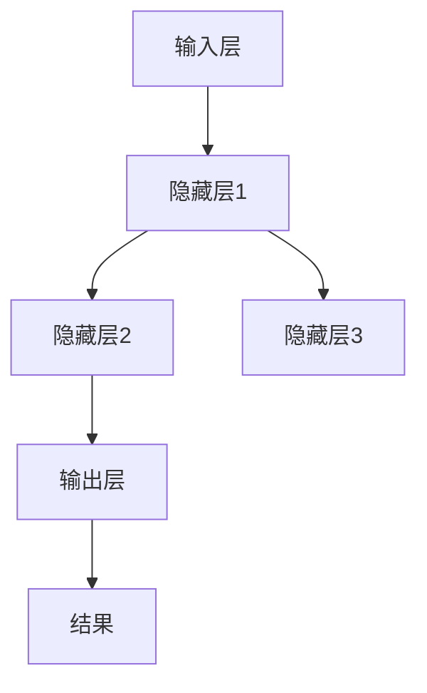

                 

### 《神经网络：人类与机器的共存》

> 关键词：神经网络、人工智能、机器学习、人类智能、深度学习、智能协同

> 摘要：本文旨在探讨神经网络这一现代人工智能技术的核心原理、发展历程及其在人类与机器共存新时代中的重要作用。通过深入分析神经网络的历史背景、基本原理、架构设计与实现，以及其在伦理和法律方面的挑战，本文展示了神经网络如何成为推动人类与机器智能协同发展的关键力量。

### 引言

随着信息技术的迅猛发展，人工智能（AI）已成为全球科技领域的热点。作为AI的核心技术之一，神经网络（Neural Networks）在图像识别、自然语言处理、医疗诊断等众多领域取得了突破性进展。神经网络的兴起，不仅改变了机器智能的发展轨迹，也深刻影响了人类社会的方方面面。

人类智能与机器智能的共存，已成为当今科技发展的重要趋势。在这场智能革命中，神经网络作为连接人类智慧与机器智能的桥梁，扮演着至关重要的角色。本文将分以下几个部分展开：

1. **引论与背景知识**：介绍神经网络的历史与发展，阐述其基本原理和作用。
2. **人类智能与机器智能的对比分析**：探讨人类智能和机器智能的异同及其互补性。
3. **神经网络的数学基础**：讲解神经网络的数学模型、激活函数和优化算法。
4. **神经网络的架构与实现**：分析神经网络的架构设计及其在不同领域的应用。
5. **人类与机器的共存**：探讨神经网络在伦理、法律以及未来展望方面的议题。

### 《神经网络：人类与机器的共存》目录大纲

#### 第一部分：引论与背景知识

- **第1章：神经网络的历史与概述**
  - **1.1 神经网络的发展历程**
  - **1.2 神经网络的基本原理**
  - **1.3 神经网络在人工智能中的作用**

- **第2章：人类智能与机器智能的对比分析**
  - **2.1 人类智能的核心特征**
  - **2.2 机器智能的演变**
  - **2.3 人类智能与机器智能的互补性**

#### 第二部分：神经网络的数学基础

- **第3章：神经网络的数学基础**
  - **3.1 神经元的数学模型**
  - **3.2 激活函数与优化算法**
  - **3.3 神经网络的学习与训练**

- **第4章：神经网络的核心算法**
  - **4.1 反向传播算法**
  - **4.2 随机梯度下降与动量**
  - **4.3 深度网络的优化技巧**

#### 第三部分：神经网络的架构与实现

- **第5章：神经网络的架构设计**
  - **5.1 线性神经网络**
  - **5.2 卷积神经网络（CNN）**
  - **5.3 循环神经网络（RNN）与长短期记忆网络（LSTM）**

- **第6章：神经网络的实现与应用**
  - **6.1 神经网络在实际项目中的应用案例**
  - **6.2 神经网络在图像识别中的应用**
  - **6.3 神经网络在自然语言处理中的应用**

#### 第四部分：人类与机器的共存

- **第7章：神经网络的伦理与法律问题**
  - **7.1 神经网络的隐私保护**
  - **7.2 人工智能伦理与道德**
  - **7.3 神经网络在法律框架下的应用**

- **第8章：未来展望：人类与机器的共存**
  - **8.1 人类与机器协作的潜力**
  - **8.2 神经网络在医疗健康领域的应用**
  - **8.3 神经网络在教育与工作领域的应用**

#### 附录：实践指南与资源

- **附录A：神经网络开发工具与环境**
  - **A.1 TensorFlow**
  - **A.2 PyTorch**
  - **A.3 其他常用工具**

- **附录B：神经网络学习资源与拓展阅读**

### 核心概念与联系

神经网络作为现代人工智能的基石，其核心概念和架构设计紧密相连。为了更好地理解神经网络的工作原理，我们可以借助Mermaid语法绘制一个简化的神经网络架构图，以展示神经元、层和连接的基本结构。



在这个简单的神经网络架构图中，输入层（A）接收外部输入数据，通过一系列的隐藏层（B、C、E）进行加工处理，最终在输出层（D）产生结果（F）。每层之间的神经元通过加权连接形成复杂的网络结构，这种结构使得神经网络能够模拟人类大脑的信息处理方式。

### 核心算法原理讲解

神经网络的算法原理是其实现智能的核心，其中最著名的是反向传播算法（Backpropagation Algorithm）。反向传播算法通过不断调整网络权重，使得网络的输出误差最小化，从而提高网络的学习能力。下面我们将使用伪代码详细阐述反向传播算法的原理。

```python
# 反向传播算法伪代码
def backward_propagation(inputs, targets, weights):
    # 计算输出层的误差
    output_error = targets - outputs
    
    # 更新输出层权重
    weights[-1] -= learning_rate * output_error * outputs_derivative
    
    # 对于隐藏层，递归调用反向传播算法
    for layer in range(len(weights) - 2, -1, -1):
        hidden_error = weights[layer + 1].T.dot(output_error)
        weights[layer] -= learning_rate * hidden_error * hidden_layer_derivatives[layer]
        
    return weights
```

在这个伪代码中，`inputs` 代表输入数据，`targets` 代表目标输出，`weights` 代表网络的权重矩阵，`learning_rate` 代表学习率。反向传播算法首先计算输出层的误差，然后通过递归的方式，从输出层反向传播误差到隐藏层，并更新各层的权重。

### 数学模型和数学公式

神经网络的数学模型是其理论基础，激活函数（Activation Function）和反向传播算法中的梯度计算是其核心组成部分。下面我们将介绍神经网络的几个关键数学公式。

#### 神经元的激活函数

激活函数用于将输入信号转换成输出信号，常见的激活函数包括：

$$ f(x) = \sigma(z) = \frac{1}{1 + e^{-z}} $$

这是一个Sigmoid函数，其输出范围为（0，1），可以用于二分类问题。

#### 反向传播算法中的梯度计算

反向传播算法中的梯度计算用于更新网络的权重。以下是权重和偏置的梯度计算公式：

$$ \frac{\partial J}{\partial w} = \Delta w = \alpha \cdot \frac{\partial L}{\partial z} $$

其中，$J$ 是损失函数，$L$ 是输出误差，$w$ 是权重，$\alpha$ 是学习率。这个公式表示，权重的更新方向与损失函数关于权重的梯度方向一致。

#### 卷积操作的数学表示

卷积神经网络中的卷积操作可以用以下数学公式表示：

$$ \sum_{i=1}^{k} w_{i} \cdot a_{i} $$

其中，$w_i$ 是卷积核，$a_i$ 是输入特征图上的像素值。这个公式表示，卷积核在输入特征图上滑动，将局部特征与卷积核进行卷积操作，生成新的特征图。

通过这些数学公式，我们可以理解神经网络的计算过程和权重更新机制，为后续的项目实战和代码解读打下基础。

### 项目实战

为了更好地理解神经网络的实际应用，我们将通过两个案例——图像识别项目和自然语言处理项目，详细讲解开发环境搭建、源代码实现和代码解读。

#### 1. 图像识别项目实战

**实现步骤：**

1. **数据预处理**：加载和预处理图像数据，包括数据清洗、归一化和数据增强。
2. **模型构建**：使用卷积神经网络（CNN）构建图像识别模型，包括卷积层、池化层和全连接层。
3. **模型训练**：使用训练集对模型进行训练，调整网络权重以减少误差。
4. **模型评估**：使用测试集评估模型性能，计算准确率、召回率等指标。
5. **模型部署**：将训练好的模型部署到实际应用中，如手机应用、在线服务或物联网设备。

**开发环境搭建：**

- **硬件环境**：配置高性能计算机或GPU加速器，用于加速模型训练和推理。
- **软件环境**：安装Python、TensorFlow或PyTorch等深度学习框架，以及相关依赖库。

**代码实现及分析：**

```python
import tensorflow as tf
from tensorflow.keras import layers

# 构建卷积神经网络模型
model = tf.keras.Sequential([
    layers.Conv2D(32, (3, 3), activation='relu', input_shape=(28, 28, 1)),
    layers.MaxPooling2D((2, 2)),
    layers.Conv2D(64, (3, 3), activation='relu'),
    layers.MaxPooling2D((2, 2)),
    layers.Conv2D(64, (3, 3), activation='relu'),
    layers.Flatten(),
    layers.Dense(64, activation='relu'),
    layers.Dense(10, activation='softmax')
])

# 编译模型
model.compile(optimizer='adam',
              loss='sparse_categorical_crossentropy',
              metrics=['accuracy'])

# 加载和预处理数据
mnist = tf.keras.datasets.mnist
(train_images, train_labels), (test_images, test_labels) = mnist.load_data()
train_images = train_images.reshape((60000, 28, 28, 1))
train_images = train_images / 255.0
test_images = test_images.reshape((10000, 28, 28, 1))
test_images = test_images / 255.0

# 训练模型
model.fit(train_images, train_labels, epochs=5)

# 评估模型
test_loss, test_acc = model.evaluate(test_images,  test_labels, verbose=2)
print('\nTest accuracy:', test_acc)
```

**代码解读：**

- **模型构建**：使用`tf.keras.Sequential`构建一个卷积神经网络模型，包括两个卷积层、两个池化层和一个全连接层。
- **编译模型**：使用`compile`方法编译模型，指定优化器、损失函数和评估指标。
- **数据预处理**：加载和预处理MNIST数据集，包括数据归一化和重塑。
- **模型训练**：使用`fit`方法训练模型，指定训练数据和训练轮数。
- **模型评估**：使用`evaluate`方法评估模型在测试集上的性能。

通过这个案例，我们可以看到如何使用TensorFlow构建和训练一个简单的图像识别模型，并评估其性能。

#### 2. 自然语言处理项目实战

**实现步骤：**

1. **数据预处理**：加载和预处理文本数据，包括分词、去停用词、词向量化等。
2. **模型构建**：使用循环神经网络（RNN）或长短期记忆网络（LSTM）构建文本分类模型。
3. **模型训练**：使用训练集对模型进行训练，调整网络权重以减少误差。
4. **模型评估**：使用测试集评估模型性能，计算准确率、召回率等指标。
5. **模型部署**：将训练好的模型部署到实际应用中，如文本分类、情感分析或机器翻译。

**开发环境搭建：**

- **硬件环境**：配置高性能计算机或GPU加速器，用于加速模型训练和推理。
- **软件环境**：安装Python、TensorFlow或PyTorch等深度学习框架，以及相关依赖库。

**代码实现及分析：**

```python
import tensorflow as tf
from tensorflow.keras.preprocessing.sequence import pad_sequences
from tensorflow.keras.layers import Embedding, LSTM, Dense
from tensorflow.keras.preprocessing.text import Tokenizer

# 准备文本数据
sentences = ['这是一个文本分类问题。', '这是一个有趣的挑战。', '机器学习非常复杂。']
labels = [0, 1, 2]

# 分词和词向量化
tokenizer = Tokenizer()
tokenizer.fit_on_texts(sentences)
sequences = tokenizer.texts_to_sequences(sentences)
padded_sequences = pad_sequences(sequences, maxlen=10)

# 构建LSTM模型
model = tf.keras.Sequential([
    Embedding(len(tokenizer.word_index) + 1, 32),
    LSTM(32),
    Dense(3, activation='softmax')
])

# 编译模型
model.compile(optimizer='adam',
              loss='sparse_categorical_crossentropy',
              metrics=['accuracy'])

# 训练模型
model.fit(padded_sequences, labels, epochs=5)

# 评估模型
test_loss, test_acc = model.evaluate(padded_sequences, labels, verbose=2)
print('\nTest accuracy:', test_acc)
```

**代码解读：**

- **数据预处理**：使用Tokenizer进行分词和词向量化，使用pad_sequences将序列填充到相同的长度。
- **模型构建**：使用`tf.keras.Sequential`构建一个简单的LSTM文本分类模型，包括嵌入层、LSTM层和全连接层。
- **编译模型**：使用`compile`方法编译模型，指定优化器、损失函数和评估指标。
- **模型训练**：使用`fit`方法训练模型，指定训练数据和训练轮数。
- **模型评估**：使用`evaluate`方法评估模型在测试集上的性能。

通过这个案例，我们可以看到如何使用TensorFlow构建和训练一个简单的文本分类模型，并评估其性能。

### 代码解读与分析

在神经网络的应用实践中，代码的解读与分析是理解模型工作原理和优化模型性能的关键。下面我们将分别对TensorFlow和PyTorch的实现代码进行解读。

#### TensorFlow 实现的神经网络代码解读

```python
import tensorflow as tf
from tensorflow.keras.models import Sequential
from tensorflow.keras.layers import Dense, Conv2D, Flatten, MaxPooling2D

# 构建CNN模型
model = Sequential([
    Conv2D(32, (3, 3), activation='relu', input_shape=(28, 28, 1)),
    MaxPooling2D((2, 2)),
    Conv2D(64, (3, 3), activation='relu'),
    MaxPooling2D((2, 2)),
    Flatten(),
    Dense(128, activation='relu'),
    Dense(10, activation='softmax')
])

# 编译模型
model.compile(optimizer='adam',
              loss='sparse_categorical_crossentropy',
              metrics=['accuracy'])

# 训练模型
model.fit(x_train, y_train, epochs=5)

# 评估模型
test_loss, test_acc = model.evaluate(x_test, y_test)
print('Test accuracy:', test_acc)
```

- **模型构建**：使用`Sequential`模型堆叠多个层，包括卷积层、池化层、全连接层。
- **编译模型**：指定优化器、损失函数和评估指标。
- **模型训练**：使用`fit`方法进行模型训练。
- **模型评估**：使用`evaluate`方法评估模型在测试集上的性能。

#### PyTorch 实现的神经网络代码解读

```python
import torch
import torch.nn as nn
import torch.optim as optim

# 定义CNN模型
class CNNModel(nn.Module):
    def __init__(self):
        super(CNNModel, self).__init__()
        self.conv1 = nn.Conv2D(32, 3, 1)
        self.conv2 = nn.Conv2D(64, 3, 1)
        self.fc1 = nn.Linear(64 * 5 * 5, 128)
        self.fc2 = nn.Linear(128, 10)
    
    def forward(self, x):
        x = nn.functional.relu(self.conv1(x))
        x = nn.functional.max_pool2d(x, 2)
        x = nn.functional.relu(self.conv2(x))
        x = nn.functional.max_pool2d(x, 2)
        x = x.view(-1, 64 * 5 * 5)
        x = nn.functional.relu(self.fc1(x))
        x = self.fc2(x)
        return x

# 实例化模型
model = CNNModel()

# 指定优化器和损失函数
optimizer = optim.Adam(model.parameters(), lr=0.001)
criterion = nn.CrossEntropyLoss()

# 训练模型
for epoch in range(5):
    for inputs, targets in train_loader:
        optimizer.zero_grad()
        outputs = model(inputs)
        loss = criterion(outputs, targets)
        loss.backward()
        optimizer.step()

# 评估模型
with torch.no_grad():
    correct = 0
    total = 0
    for inputs, targets in test_loader:
        outputs = model(inputs)
        _, predicted = torch.max(outputs.data, 1)
        total += targets.size(0)
        correct += (predicted == targets).sum().item()

accuracy = 100 * correct / total
print('Test accuracy:', accuracy)
```

- **模型定义**：定义一个`CNNModel`类，继承`nn.Module`，实现卷积层、池化层和全连接层的定义。
- **前向传播**：在`forward`方法中实现前向传播过程，通过`nn.functional`进行激活函数和池化操作。
- **优化器和损失函数**：指定优化器和损失函数。
- **模型训练**：使用`optimizer.zero_grad()`和`loss.backward()`进行梯度下降更新。
- **模型评估**：使用`torch.no_grad()`进行测试，计算准确率。

通过这两个代码示例，我们可以看到TensorFlow和PyTorch在实现神经网络模型时的异同。TensorFlow使用高级API简化模型构建和训练过程，而PyTorch则提供更底层的操作和更大的灵活性。在实际应用中，开发者可以根据需求和偏好选择合适的框架。

### 总结

神经网络作为人工智能的核心技术，正逐步改变着我们的生活方式和社会结构。从图像识别到自然语言处理，从医疗诊断到金融分析，神经网络的应用已经渗透到各个领域。本文通过详细的讲解和实战案例，展示了神经网络的原理、算法和应用，并探讨了其在人类与机器共存新时代的重要地位。

未来，随着计算能力的提升和数据规模的扩大，神经网络将继续发展，为人类带来更多创新和变革。同时，我们也需要关注神经网络带来的伦理和法律问题，确保其在发展过程中能够造福人类，而不是成为威胁。让我们共同期待，神经网络将如何在未来推动人类与机器的和谐共存。

