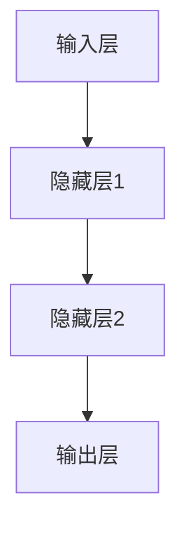
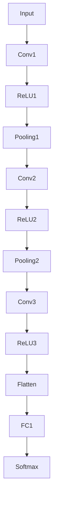
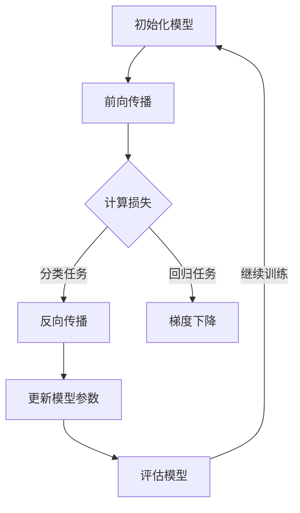

                 

### 文章标题

《神经网络：人类与机器的共存》

> 关键词：神经网络、人工神经元、多层感知机、计算机视觉、自然语言处理、强化学习、医疗诊断

> 摘要：本文将从神经网络的基础概念、核心算法、应用领域以及未来发展等多个角度，深入探讨神经网络技术在当今人工智能领域的重要性和影响力。通过系统化的分析和实例讲解，本文旨在帮助读者全面理解神经网络的原理和实际应用，展现人类与机器在神经网络领域的共存与合作。

### 目录大纲

# 《神经网络：人类与机器的共存》

## 第一部分：神经网络基础

### 第1章：神经网络概述

#### 1.1 神经网络的定义与历史

#### 1.2 神经网络的核心组成部分

#### 1.3 神经网络的基本工作原理

### 第2章：人工神经元的模型

#### 2.1 人工神经元的基本模型

#### 2.2 激活函数的作用与分类

#### 2.3 人工神经元的数学表示

### 第3章：前向传播与反向传播

#### 3.1 前向传播算法

#### 3.2 反向传播算法

#### 3.3 梯度下降法

### 第4章：多层感知机

#### 4.1 多层感知机的结构

#### 4.2 多层感知机的工作原理

#### 4.3 多层感知机的优缺点

## 第二部分：神经网络的应用

### 第5章：神经网络的分类与特性

#### 5.1 神经网络的分类

#### 5.2 各类神经网络的特点

#### 5.3 神经网络的选择与设计

### 第6章：神经网络在计算机视觉中的应用

#### 6.1 卷积神经网络的基本原理

#### 6.2 卷积神经网络在图像识别中的应用

#### 6.3 卷积神经网络的结构与改进

### 第7章：神经网络在自然语言处理中的应用

#### 7.1 循环神经网络的基本原理

#### 7.2 循环神经网络在文本处理中的应用

#### 7.3 循环神经网络的改进与扩展

### 第8章：神经网络在强化学习中的应用

#### 8.1 强化学习的基本原理

#### 8.2 神经网络在强化学习中的作用

#### 8.3 神经网络在强化学习中的应用实例

### 第9章：神经网络在医疗诊断中的应用

#### 9.1 医疗诊断中的数据预处理

#### 9.2 神经网络在医疗诊断中的应用实例

#### 9.3 神经网络在医疗诊断中的挑战与展望

## 第三部分：神经网络开发与实践

### 第10章：神经网络开发环境搭建

#### 10.1 神经网络开发环境的选择

#### 10.2 神经网络开发环境的搭建步骤

#### 10.3 神经网络开发环境的使用技巧

### 第11章：神经网络项目实战

#### 11.1 项目一：图像分类

#### 11.2 项目二：情感分析

#### 11.3 项目三：智能推荐系统

### 第12章：神经网络模型的评估与优化

#### 12.1 神经网络模型评估指标

#### 12.2 神经网络模型优化方法

#### 12.3 实战：神经网络模型的评估与优化

### 第13章：神经网络的未来发展趋势

#### 13.1 神经网络在人工智能中的应用前景

#### 13.2 神经网络技术的挑战与机遇

#### 13.3 神经网络的未来发展趋势与展望

## 附录

### 附录 A：神经网络相关资源

#### A.1 神经网络开源框架

#### A.2 神经网络学习资源

#### A.3 神经网络竞赛与挑战

### 附录 B：Mermaid 流程图示例

#### B.1 神经网络结构图

#### B.2 神经网络训练流程图

### 附录 C：伪代码示例

#### C.1 前向传播伪代码

#### C.2 反向传播伪代码

### 附录 D：数学模型与公式

#### D.1 激活函数公式

#### D.2 梯度下降公式

#### D.3 卷积神经网络公式

### 附录 E：代码解读与分析

#### E.1 图像分类代码分析

#### E.2 情感分析代码分析

#### E.3 智能推荐系统代码分析

### 第一部分：神经网络基础

#### 第1章：神经网络概述

#### 第1章 神经网络概述

**1.1 神经网络的定义与历史**

神经网络（Neural Networks）是一种模拟人脑神经元结构和功能的计算模型，用于处理和分析复杂的数据。它起源于20世纪40年代，由心理学家McCulloch和数学家Pitts提出，最早被称为“感知机”（Perceptron）。后来，在1958年，Rosenblatt提出了一个改进的模型，即线性阈值单元（Linear Threshold Unit），使得神经网络的研究逐渐受到重视。

神经网络的历史经历了多个阶段：从早期的单层感知机，到多层感知机的提出，再到深度学习的兴起。在1986年，Rumelhart等人提出了反向传播算法（Backpropagation Algorithm），解决了多层神经网络训练中的梯度消失和梯度爆炸问题，从而推动了神经网络在各个领域的应用。

**1.2 神经网络的核心组成部分**

神经网络主要由以下几个核心组成部分构成：

- **人工神经元（Artificial Neurons）**：是神经网络的基本构建单元，类似于生物神经元，通过输入、权重、激活函数等实现数据加工和传递。
- **权重（Weights）**：表示神经元之间的连接强度，通过学习调整，以优化网络性能。
- **偏置（Bias）**：用于调整神经元阈值，增强模型的泛化能力。
- **激活函数（Activation Function）**：用于决定神经元是否激活，常用的激活函数有Sigmoid、ReLU、Tanh等。
- **输入层（Input Layer）**：接收外部输入数据。
- **隐藏层（Hidden Layers）**：对输入数据进行加工和特征提取。
- **输出层（Output Layer）**：生成预测结果或分类标签。

**1.3 神经网络的基本工作原理**

神经网络的基本工作原理可以分为以下几个步骤：

1. **前向传播（Forward Propagation）**：从输入层开始，数据经过每个隐藏层，通过加权求和并应用激活函数，最终传递到输出层得到预测结果。
2. **损失函数（Loss Function）**：计算预测结果与真实结果之间的差异，以衡量模型性能。
3. **反向传播（Backpropagation）**：通过反向传播算法，将损失函数关于模型参数的梯度计算出来，并更新权重和偏置，以最小化损失函数。
4. **优化算法（Optimization Algorithm）**：如梯度下降（Gradient Descent）、随机梯度下降（Stochastic Gradient Descent）、Adam等，用于迭代优化模型参数。

神经网络通过不断迭代训练，逐渐优化模型参数，提高预测准确率。在实际应用中，神经网络通过大量的数据和复杂的网络结构，能够实现从简单到复杂的任务，如图像分类、语音识别、自然语言处理等。

**1.4 神经网络的优势与局限性**

神经网络具有以下几个优势：

- **自适应能力**：神经网络能够自动学习输入数据的特征和规律，无需手动提取特征。
- **非线性建模**：神经网络通过激活函数引入非线性，能够处理复杂的非线性问题。
- **灵活性**：神经网络可以应用于多种领域，如图像处理、语音识别、自然语言处理等。
- **强泛化能力**：通过训练大量的数据和合理的网络结构，神经网络具有较好的泛化能力。

然而，神经网络也存在一些局限性：

- **计算复杂度**：随着网络深度的增加，计算复杂度和训练时间显著增加。
- **数据需求**：神经网络需要大量数据进行训练，以获得较好的性能。
- **可解释性**：神经网络的决策过程高度复杂，难以进行解释和调试。
- **过拟合风险**：神经网络容易在训练数据上过度拟合，导致泛化能力下降。

总之，神经网络作为一种强大的机器学习工具，在人工智能领域具有重要地位。通过不断的研究和优化，神经网络将在未来的智能系统中发挥更大的作用。

#### 第2章：人工神经元的模型

**2.1 人工神经元的基本模型**

人工神经元，又称为计算单元或节点，是神经网络的基本构建模块。它通过接受外部输入，经过加权求和和激活函数的处理，最终输出一个结果。下面详细描述人工神经元的基本模型。

一个典型的人工神经元模型包括以下几个部分：

- **输入（Input）**：每个输入代表外部信息的一个特征，通常用 \( x_i \) 表示，可以是数字或向量。
- **权重（Weight）**：每个输入与神经元之间的连接强度，用 \( w_i \) 表示。权重通过训练过程进行调整，以优化神经元的输出。
- **偏置（Bias）**：用于调整神经元的阈值，使神经元在不同的输入情况下能够有更大的灵活性，用 \( b \) 表示。
- **激活函数（Activation Function）**：用于决定神经元是否激活，常用的激活函数有Sigmoid、ReLU、Tanh等。

人工神经元的基本计算过程可以表示为：

\[ z = \sum_{i=1}^{n} w_i \cdot x_i + b \]
\[ a = \text{activationFunction}(z) \]

其中，\( z \) 是加权求和的结果，也称为神经元的净输入；\( a \) 是神经元的激活值，表示神经元的输出。

**2.2 激活函数的作用与分类**

激活函数是人工神经元模型中的关键部分，它用于引入非线性，使得神经网络能够处理复杂的非线性问题。激活函数的作用主要有：

- **引入非线性**：通过激活函数，神经网络可以从线性模型扩展到非线性模型，能够更好地拟合复杂数据。
- **确定神经元激活与否**：激活函数决定了神经元是否激活，即输出是否为1或0，常用的激活函数通常输出一个介于0和1之间的值。
- **平滑梯度**：对于某些激活函数，如Sigmoid和Tanh，它们可以平滑梯度，使得反向传播算法更加稳定。

常见的激活函数可以分为以下几类：

- **线性激活函数**：如恒等函数 \( f(x) = x \)，线性激活函数不会引入非线性，通常不用于深层神经网络。
- **非线性激活函数**：包括Sigmoid、ReLU、Tanh等。
  - **Sigmoid函数**：\( f(x) = \frac{1}{1 + e^{-x}} \)，输出值在0和1之间，平滑且连续，但梯度在接近0和1时较小，可能导致梯度消失问题。
  - **ReLU函数**：\( f(x) = \max(0, x) \)，在输入为负时输出0，输入为正时输出自身，简单且计算速度快，但梯度在输入为0时不存在。
  - **Tanh函数**：\( f(x) = \frac{e^x - e^{-x}}{e^x + e^{-x}} \)，输出值在-1和1之间，平滑且对称，但梯度计算稍微复杂。

**2.3 人工神经元的数学表示**

为了更好地理解人工神经元的工作原理，我们可以通过数学模型来表示它。

假设一个神经元接收 \( n \) 个输入，每个输入的权重分别为 \( w_1, w_2, ..., w_n \)，偏置为 \( b \)，激活函数为 \( f \)。该神经元的输出可以表示为：

\[ z = \sum_{i=1}^{n} w_i \cdot x_i + b \]
\[ a = f(z) \]

其中，\( z \) 表示加权求和的结果，也称为净输入；\( a \) 表示激活值，是神经元的输出。

在深度学习中，神经元的输出通常是一个向量，表示多个特征的概率分布。例如，对于一个二分类问题，输出可以是 \( (0.2, 0.8) \)，表示第一个类别的概率为0.2，第二个类别的概率为0.8。

通过上述数学模型，我们可以对人工神经元进行编程实现，并将其应用于神经网络中，实现复杂的数据处理和预测任务。

**总结**

人工神经元作为神经网络的基本构建模块，其工作原理和数学表示对于理解神经网络至关重要。通过引入激活函数，神经元能够处理复杂的非线性问题，从而在机器学习和人工智能领域发挥重要作用。在接下来的章节中，我们将进一步探讨神经网络的训练过程，包括前向传播和反向传播算法。

#### 第3章：前向传播与反向传播

**3.1 前向传播算法**

前向传播（Forward Propagation）是神经网络中最基本的过程之一，它用于计算网络从输入层到输出层的输出。以下是前向传播算法的详细步骤：

1. **初始化**：首先，我们需要初始化网络的权重 \( w \) 和偏置 \( b \)，以及激活函数 \( f \)。通常，这些参数是通过随机初始化来保证网络具有一定的随机性。

2. **输入层到隐藏层的传播**：对于输入 \( x \)，将其传递到输入层，然后通过权重和偏置传递到隐藏层。隐藏层的输出可以表示为：

   \[ z^{(1)} = w^{(1)} \cdot x + b^{(1)} \]
   \[ a^{(1)} = f(z^{(1)}) \]

   其中，\( z^{(1)} \) 是隐藏层的净输入，\( a^{(1)} \) 是隐藏层的激活值。

3. **隐藏层到输出层的传播**：同理，将隐藏层的输出传递到输出层，输出层的输出可以表示为：

   \[ z^{(2)} = w^{(2)} \cdot a^{(1)} + b^{(2)} \]
   \[ a^{(2)} = f(z^{(2)}) \]

   其中，\( z^{(2)} \) 是输出层的净输入，\( a^{(2)} \) 是输出层的激活值。

4. **损失函数的计算**：输出层的激活值 \( a^{(2)} \) 与真实标签 \( y \) 之间的差异可以通过损失函数 \( L \) 来计算。常用的损失函数包括均方误差（MSE）和交叉熵（Cross Entropy）。损失函数可以表示为：

   \[ L = L(a^{(2)}, y) \]

**3.2 反向传播算法**

反向传播（Backpropagation）是神经网络训练过程中至关重要的步骤，它用于计算损失函数关于网络参数的梯度，并更新权重和偏置。以下是反向传播算法的详细步骤：

1. **计算输出层梯度**：首先，我们需要计算输出层的梯度 \( \Delta^{(2)} \)。根据损失函数的导数，可以得到：

   \[ \Delta^{(2)} = \frac{\partial L}{\partial a^{(2)}} \cdot \frac{\partial a^{(2)}}{\partial z^{(2)}} \]

   其中，\( \frac{\partial a^{(2)}}{\partial z^{(2)}} \) 是激活函数的导数。

2. **计算隐藏层梯度**：然后，我们需要计算隐藏层的梯度 \( \Delta^{(1)} \)。通过反向传播，可以得到：

   \[ \Delta^{(1)} = (w^{(2)})^T \cdot \Delta^{(2)} \cdot \frac{\partial a^{(1)}}{\partial z^{(1)}} \]

3. **更新权重和偏置**：最后，我们需要使用梯度来更新网络的权重和偏置。梯度下降（Gradient Descent）是最常用的一种优化算法，其更新规则可以表示为：

   \[ w^{(2)} = w^{(2)} - \alpha \cdot \frac{\partial L}{\partial w^{(2)}} \]
   \[ b^{(2)} = b^{(2)} - \alpha \cdot \frac{\partial L}{\partial b^{(2)}} \]

   其中，\( \alpha \) 是学习率，用于调整步长。

通过反复进行前向传播和反向传播，神经网络可以逐步优化其参数，从而提高模型的性能。

**3.3 梯度下降法**

梯度下降法（Gradient Descent）是一种优化算法，用于在给定损失函数的情况下寻找最优的参数。以下是梯度下降法的详细步骤：

1. **初始化参数**：首先，我们需要初始化网络的权重和偏置。通常，这些参数是通过随机初始化来保证网络具有一定的随机性。

2. **计算梯度**：然后，我们需要计算损失函数关于参数的梯度。梯度可以通过前向传播和反向传播算法来计算。

3. **更新参数**：使用梯度更新参数。更新规则如下：

   \[ \theta = \theta - \alpha \cdot \nabla_\theta J(\theta) \]

   其中，\( \theta \) 是参数，\( J(\theta) \) 是损失函数，\( \alpha \) 是学习率。

4. **迭代**：重复上述步骤，直到满足停止条件（如收敛或达到最大迭代次数）。

梯度下降法的核心思想是通过不断调整参数，使得损失函数的梯度逐渐减小，最终找到一个局部最小值。虽然梯度下降法简单易实现，但它的收敛速度较慢，且对于某些损失函数（如高维稀疏数据），其效果可能不理想。

**总结**

前向传播和反向传播算法是神经网络训练过程中必不可少的步骤。通过前向传播，神经网络可以从输入层到输出层计算输出；通过反向传播，神经网络可以计算损失函数关于参数的梯度，并更新参数。梯度下降法是常用的优化算法，通过不断迭代更新参数，神经网络可以逐步优化其性能。在接下来的章节中，我们将进一步探讨神经网络的架构和应用。

#### 第4章：多层感知机

**4.1 多层感知机的结构**

多层感知机（Multilayer Perceptron，MLP）是一种前馈神经网络，它由多个层次组成，包括输入层、一个或多个隐藏层以及输出层。其基本结构如下图所示：



- **输入层（Input Layer）**：接收外部输入数据，每个输入节点对应输入数据的一个特征。
- **隐藏层（Hidden Layers）**：对输入数据进行加工和特征提取。每一层的节点数量和结构可以根据具体任务进行调整。
- **输出层（Output Layer）**：生成预测结果或分类标签。输出层的节点数量和类型取决于具体任务的复杂性。

**4.2 多层感知机的工作原理**

多层感知机的工作原理可以分为以下几个步骤：

1. **前向传播（Forward Propagation）**：
   - 输入数据通过输入层传递到第一层隐藏层。
   - 在隐藏层中，每个节点的输出是通过加权求和和激活函数计算得到的。假设隐藏层有 \( n \) 个节点，每个节点接收 \( m \) 个输入，权重分别为 \( w_{ij} \)，偏置为 \( b_j \)，激活函数为 \( f \)，则隐藏层第 \( j \) 个节点的输出可以表示为：

     \[ z_j = \sum_{i=1}^{m} w_{ij} \cdot x_i + b_j \]
     \[ a_j = f(z_j) \]

   - 将隐藏层的输出传递到下一层隐藏层，直到最后一层输出层。
   - 在输出层，每个节点的输出也是通过加权求和和激活函数计算得到的。输出层的节点数量和类型取决于具体任务的复杂性。

2. **损失函数（Loss Function）**：
   - 计算输出层节点输出与真实标签之间的差异，以衡量模型性能。常用的损失函数包括均方误差（MSE）和交叉熵（Cross Entropy）。

3. **反向传播（Backpropagation）**：
   - 计算输出层梯度，即损失函数关于输出层节点的梯度。
   - 通过反向传播算法，将梯度传递到隐藏层，更新隐藏层的权重和偏置。
   - 重复上述步骤，直到收敛或达到最大迭代次数。

**4.3 多层感知机的优缺点**

多层感知机具有以下几个优点：

- **强大的函数逼近能力**：通过增加隐藏层的数量和节点数量，多层感知机可以逼近复杂的非线性函数。
- **广泛的应用领域**：多层感知机在图像分类、语音识别、自然语言处理等领域有广泛应用。
- **易于实现**：多层感知机的结构简单，实现相对容易。

然而，多层感知机也存在一些缺点：

- **易过拟合**：多层感知机容易在训练数据上过度拟合，导致泛化能力下降。为了解决过拟合问题，可以采用正则化技术、数据增强等方法。
- **计算复杂度较高**：随着隐藏层和节点数量的增加，计算复杂度显著增加，训练时间较长。
- **参数调整复杂**：多层感知机的参数（如学习率、隐藏层数量、节点数量等）需要通过实验进行调整，优化过程复杂。

**总结**

多层感知机是一种基本的神经网络结构，通过增加隐藏层的数量和节点数量，它可以实现复杂的非线性函数逼近。多层感知机在图像分类、语音识别、自然语言处理等领域有广泛应用。然而，它也存在易过拟合、计算复杂度较高等问题。在实际应用中，需要根据具体任务需求，对多层感知机进行合理的调整和优化。在接下来的章节中，我们将继续探讨神经网络的更多应用和优化方法。

### 第5章：神经网络的分类与特性

**5.1 神经网络的分类**

神经网络根据其结构和功能可以分为以下几类：

1. **前馈神经网络（Feedforward Neural Networks）**：
   - 前馈神经网络是最常见的神经网络类型，其信息传递方向从输入层到输出层，中间经过若干隐藏层。
   - 例如，多层感知机（MLP）就是一种前馈神经网络。
   - 特点：结构简单，易于实现，适用于各种回归和分类任务。

2. **卷积神经网络（Convolutional Neural Networks，CNN）**：
   - 卷积神经网络主要应用于图像处理领域，通过卷积层提取图像特征。
   - 特点：具有局部连接和权重共享机制，适用于处理具有平移不变性的任务，如图像识别和图像分类。

3. **循环神经网络（Recurrent Neural Networks，RNN）**：
   - 循环神经网络具有时间动态特性，适合处理序列数据，如自然语言文本、时间序列数据等。
   - 特点：能够捕获时间序列中的长期依赖关系，适用于语音识别、机器翻译、文本生成等任务。

4. **长短时记忆网络（Long Short-Term Memory，LSTM）**：
   - 长短时记忆网络是循环神经网络的一种特殊结构，能够更好地处理长序列数据。
   - 特点：解决循环神经网络中的梯度消失和梯度爆炸问题，适用于复杂的序列建模任务。

5. **生成对抗网络（Generative Adversarial Networks，GAN）**：
   - 生成对抗网络由生成器和判别器两个神经网络组成，通过对抗训练生成真实数据的概率分布。
   - 特点：能够生成高质量的逼真数据，适用于图像生成、数据增强等任务。

**5.2 各类神经网络的特点**

1. **前馈神经网络（Feedforward Neural Networks）**：
   - **优点**：结构简单，易于实现；适用于各种回归和分类任务。
   - **缺点**：无法处理具有时间动态特性的序列数据。

2. **卷积神经网络（Convolutional Neural Networks，CNN）**：
   - **优点**：具有局部连接和权重共享机制，适用于处理具有平移不变性的任务，如图像识别和图像分类。
   - **缺点**：对于复杂的序列数据处理能力有限。

3. **循环神经网络（Recurrent Neural Networks，RNN）**：
   - **优点**：能够捕获时间序列中的长期依赖关系，适用于语音识别、机器翻译、文本生成等任务。
   - **缺点**：存在梯度消失和梯度爆炸问题，训练不稳定。

4. **长短时记忆网络（Long Short-Term Memory，LSTM）**：
   - **优点**：解决循环神经网络中的梯度消失和梯度爆炸问题，适用于复杂的序列建模任务。
   - **缺点**：结构复杂，计算量大。

5. **生成对抗网络（Generative Adversarial Networks，GAN）**：
   - **优点**：能够生成高质量的逼真数据，适用于图像生成、数据增强等任务。
   - **缺点**：训练过程不稳定，需要大量的数据。

**5.3 神经网络的选择与设计**

在选择和设计神经网络时，需要考虑以下几个因素：

1. **任务类型**：根据任务的类型选择合适的神经网络结构。例如，对于图像分类任务，可以选择卷积神经网络；对于序列数据处理任务，可以选择循环神经网络或长短时记忆网络。

2. **数据特性**：分析数据的特点，如数据规模、数据分布、时间动态特性等，选择适合的网络结构。例如，对于具有平移不变性的图像数据，可以选择卷积神经网络；对于时间序列数据，可以选择循环神经网络或长短时记忆网络。

3. **计算资源**：考虑计算资源的限制，选择合适的网络结构和模型复杂度。例如，对于资源有限的环境，可以选择结构简单的多层感知机；对于计算资源充足的环境，可以选择复杂的卷积神经网络或生成对抗网络。

4. **训练时间**：根据训练时间的要求，选择合适的网络结构和优化算法。例如，对于需要快速训练的模型，可以选择结构简单的多层感知机；对于需要长时间训练的模型，可以选择结构复杂的卷积神经网络或长短时记忆网络。

5. **模型性能**：通过实验和验证，选择具有最佳性能的网络结构和参数设置。例如，可以通过交叉验证和超参数调优，找到最佳的隐藏层数量、学习率、批次大小等参数。

**总结**

神经网络的分类和特性对于选择和设计合适的神经网络模型至关重要。不同类型的神经网络具有各自的特点和适用范围，根据任务类型、数据特性、计算资源等因素，可以选择合适的神经网络结构。在接下来的章节中，我们将进一步探讨神经网络在各个领域的应用。

### 第6章：神经网络在计算机视觉中的应用

**6.1 卷积神经网络的基本原理**

卷积神经网络（Convolutional Neural Networks，CNN）是一种特别适合于图像处理任务的神经网络结构，其基本原理是通过卷积层提取图像特征，并使用这些特征进行分类和预测。以下是CNN的基本原理：

1. **卷积层（Convolutional Layer）**：
   - 卷积层是CNN的核心组成部分，用于提取图像特征。每个卷积核（或过滤器）都是一个小的权重矩阵，它通过滑动的方式在输入图像上计算卷积操作。
   - 假设输入图像的大小为 \( m \times n \)，卷积核的大小为 \( p \times q \)，则卷积层的输出可以通过以下公式计算：

     \[ f_{ij} = \sum_{x=0}^{p-1} \sum_{y=0}^{q-1} w_{xy} \cdot x_i \]

     其中，\( f_{ij} \) 是卷积层的输出，\( w_{xy} \) 是卷积核的权重，\( x_i \) 是输入图像的像素值。

2. **激活函数（Activation Function）**：
   - 激活函数用于引入非线性，常见的激活函数有ReLU（Rectified Linear Unit）和Sigmoid。ReLU函数在输入为负时输出0，输入为正时输出自身，这使得卷积层能够快速训练并具有较好的收敛性。

3. **池化层（Pooling Layer）**：
   - 池化层用于减少特征图的尺寸，提高模型的泛化能力。常见的池化操作有最大池化（Max Pooling）和平均池化（Average Pooling）。最大池化选择特征图上的最大值，而平均池化则计算特征图上所有像素的平均值。

4. **全连接层（Fully Connected Layer）**：
   - 全连接层连接卷积层的所有节点，并将其输入到输出层。全连接层通过线性变换和激活函数计算输出，通常用于分类任务。

**6.2 卷积神经网络在图像识别中的应用**

卷积神经网络在图像识别任务中具有显著的优势，通过以下几个步骤实现图像识别：

1. **特征提取**：
   - 通过卷积层和激活函数，卷积神经网络可以提取图像的局部特征。每个卷积核都可以捕捉图像中的不同特征，如边缘、纹理、形状等。

2. **特征融合**：
   - 通过堆叠多个卷积层和池化层，卷积神经网络可以逐步提取更高层次的特征。这些特征在后续的全连接层中进行融合，形成对图像的整体理解。

3. **分类与预测**：
   - 在输出层，全连接层将融合后的特征映射到预定义的类别上，通过激活函数（如softmax）输出每个类别的概率分布。根据概率分布，选择具有最高概率的类别作为最终预测结果。

以下是一个简单的卷积神经网络结构示意图：



**6.3 卷积神经网络的结构与改进**

卷积神经网络的结构经过多年的发展，已经形成了一些经典的架构，如LeNet、AlexNet、VGGNet、ResNet等。以下是这些结构的特点：

1. **LeNet**：
   - LeNet是最早的卷积神经网络之一，由LeCun等人于1998年提出。它由两个卷积层、两个池化层和一个全连接层组成，主要用于手写数字识别。
   - 特点：结构简单，易于实现，是卷积神经网络的开端。

2. **AlexNet**：
   - AlexNet是2012年由Hinton等人提出的卷积神经网络，它在ImageNet图像识别比赛中取得了突破性的成绩。AlexNet引入了ReLU激活函数、数据增强、局部响应归一化等技术。
   - 特点：引入了深度学习的概念，显著提高了图像识别的准确率。

3. **VGGNet**：
   - VGGNet是2014年由Simonyan和Zagoruyko提出的卷积神经网络，以其简单的卷积层堆叠结构而著名。VGGNet通过增加卷积层的深度和宽度，提高了模型的性能。
   - 特点：结构简单，易于实现，通过增加卷积层的深度和宽度，提高了模型的泛化能力。

4. **ResNet**：
   - ResNet是2015年由He等人提出的卷积神经网络，它通过引入残差连接解决了深度神经网络中的梯度消失问题。ResNet通过堆叠多个残差块，实现了非常深的网络结构。
   - 特点：引入了残差连接，解决了深度神经网络中的梯度消失问题，通过增加网络的深度，提高了模型的性能。

随着技术的发展，卷积神经网络还在不断改进和优化。以下是一些常见的改进方法：

1. **深度可分离卷积（Depthwise Separable Convolution）**：
   - 深度可分离卷积通过将卷积操作分解为深度卷积和逐点卷积，减少了模型的参数数量，提高了计算效率。
   - 特点：减少了模型的参数数量，提高了模型的计算效率。

2. **瓶颈结构（Bottleneck Structure）**：
   - 瓶颈结构通过在卷积层中加入一个压缩层，将输入的特征压缩到更小的维度，然后再展开，从而提高了模型的非线性表达能力。
   - 特点：提高了模型的非线性表达能力，通过压缩层减少了计算量。

3. **注意力机制（Attention Mechanism）**：
   - 注意力机制通过引入注意力模块，使模型能够自动学习关注图像中的重要区域，提高了模型的特征提取能力。
   - 特点：提高了模型的特征提取能力，通过关注重要区域，提高了图像识别的准确率。

**总结**

卷积神经网络在计算机视觉领域取得了显著的成果，通过卷积层、激活函数、池化层和全连接层等结构，可以有效地提取图像特征并进行分类和预测。随着技术的不断进步，卷积神经网络的结构也在不断改进和优化。在接下来的章节中，我们将继续探讨神经网络在自然语言处理中的应用。

### 第7章：神经网络在自然语言处理中的应用

**7.1 循环神经网络的基本原理**

循环神经网络（Recurrent Neural Networks，RNN）是一种特别适合处理序列数据的神经网络结构，其基本原理是通过递归方式处理输入序列，并维持隐藏状态来捕获序列中的依赖关系。以下是RNN的基本原理：

1. **递归结构**：
   - RNN通过递归方式处理输入序列，每个时间步的输出都依赖于前一个时间步的隐藏状态。递归结构使得RNN能够捕获序列中的依赖关系。
   - 假设输入序列为 \( x_1, x_2, ..., x_T \)，隐藏状态为 \( h_1, h_2, ..., h_T \)，则RNN的递归关系可以表示为：

     \[ h_t = f(h_{t-1}, x_t) \]

     其中，\( f \) 是一个非线性函数，用于计算当前时间步的隐藏状态。

2. **隐藏状态**：
   - 隐藏状态 \( h_t \) 保存了前一个时间步的信息，通过递归关系传递到当前时间步。隐藏状态可以被视为序列的内部表示，它捕捉了序列中的重要信息。
   - 在训练过程中，隐藏状态通过反向传播算法进行更新，从而优化模型的参数。

3. **输出层**：
   - RNN的输出层通常是一个全连接层，用于将隐藏状态映射到输出。输出可以是标签、概率分布或实数值等，取决于具体任务的需求。

**7.2 循环神经网络在文本处理中的应用**

循环神经网络在文本处理领域具有广泛的应用，以下是一些常见的应用场景：

1. **文本分类**：
   - 文本分类是将文本数据分类到预定义的类别中。RNN可以通过对文本序列进行处理，提取关键特征，并使用softmax函数进行分类。
   - 例如，可以使用RNN对新闻标题进行分类，将其分为体育、政治、娱乐等类别。

2. **情感分析**：
   - 情感分析是判断文本中表达的情感倾向，如正面、负面或中性。RNN可以通过对文本序列进行处理，提取情感特征，并使用分类器进行情感判断。
   - 例如，可以使用RNN对社交媒体上的用户评论进行情感分析，判断其情感倾向。

3. **机器翻译**：
   - 机器翻译是将一种语言的文本翻译成另一种语言。RNN可以通过递归方式处理源语言文本序列，提取关键特征，并将其映射到目标语言文本序列。
   - 例如，可以使用RNN实现中英翻译，将中文文本翻译成英文文本。

**7.3 循环神经网络的改进与扩展**

尽管RNN在处理序列数据方面具有显著优势，但它也存在一些局限性，如梯度消失和梯度爆炸问题。为了解决这些问题，研究者提出了一些改进和扩展方法：

1. **长短时记忆网络（Long Short-Term Memory，LSTM）**：
   - LSTM是RNN的一种改进结构，通过引入门控机制，解决了梯度消失和梯度爆炸问题。LSTM能够更好地捕获长序列中的依赖关系。
   - LSTM的基本原理是通过三个门控单元（遗忘门、输入门和输出门）来控制信息的流动，从而保持长期依赖关系。

2. **双向循环神经网络（Bidirectional RNN，BRNN）**：
   - 双向RNN通过同时处理输入序列的正向和反向信息，提高了模型的性能。正向RNN处理正向序列，反向RNN处理反向序列，两者的输出进行融合。
   - 例如，在机器翻译任务中，可以使用BRNN同时处理源语言文本序列的正向和反向信息，提高翻译的准确性。

3. **门控循环单元（Gated Recurrent Unit，GRU）**：
   - GRU是另一种RNN的改进结构，通过简化LSTM的门控机制，减少了模型的计算复杂度。GRU也具有门控功能，能够捕获长期依赖关系。
   - GRU的基本原理是通过更新门和重置门来控制信息的流动，从而保持长期依赖关系。

4. **自注意力机制（Self-Attention Mechanism）**：
   - 自注意力机制是一种用于处理序列数据的注意力机制，它通过计算序列中每个元素之间的相关性，提高了模型的特征提取能力。
   - 例如，在文本生成任务中，可以使用自注意力机制来学习序列中每个词之间的关联性，提高文本生成的质量。

**总结**

循环神经网络在自然语言处理领域具有广泛的应用，通过递归结构和隐藏状态，可以有效地处理序列数据。尽管RNN存在梯度消失和梯度爆炸问题，但通过LSTM、GRU等改进结构的引入，这些局限性得到了有效解决。在接下来的章节中，我们将继续探讨神经网络在强化学习中的应用。

### 第8章：神经网络在强化学习中的应用

**8.1 强化学习的基本原理**

强化学习（Reinforcement Learning，RL）是一种机器学习方法，通过智能体与环境的交互来学习最优策略。强化学习的基本原理可以概括为以下四个要素：

1. **智能体（Agent）**：智能体是执行动作并从环境中获取奖励的实体。在强化学习中，智能体通常是一个决策模型，如神经网络。
2. **环境（Environment）**：环境是智能体执行动作的场所，它根据智能体的动作提供反馈。环境可以是物理环境，也可以是虚拟环境。
3. **状态（State）**：状态是描述智能体在环境中所处的位置和状态的信息。状态通常是多维的，可以由多个特征表示。
4. **动作（Action）**：动作是智能体在特定状态下可以执行的行为。动作的选择会影响智能体的状态和获取的奖励。

强化学习的基本过程如下：

- 初始状态 \( s \)；
- 智能体选择动作 \( a \)；
- 执行动作后，环境返回新的状态 \( s' \) 和奖励 \( r \)；
- 智能体根据当前状态和奖励更新策略，以最大化累积奖励。

**8.2 神经网络在强化学习中的作用**

神经网络在强化学习中的应用主要是通过构建智能体模型，用于预测状态、选择动作和评估策略。以下几种类型的神经网络在强化学习中具有重要应用：

1. **值函数网络（Value Function Network）**：
   - 值函数网络用于预测状态的价值或奖励值。它通过学习状态和动作的映射，评估在给定状态下执行特定动作的预期奖励。值函数网络可以是一个简单的线性模型，也可以是一个复杂的神经网络。
   - 值函数网络常用于值迭代（Value Iteration）和策略梯度方法（Policy Gradient Method）。

2. **策略网络（Policy Network）**：
   - 策略网络用于选择最优动作。它通过学习状态和动作的映射，输出一个概率分布，表示在给定状态下执行每个动作的概率。策略网络可以是确定性策略网络，也可以是概率性策略网络。
   - 策略网络常用于策略梯度方法。

3. **Q网络（Q-Network）**：
   - Q网络用于预测状态-动作值，即给定状态下执行特定动作的预期奖励。Q网络通过学习状态-动作对的映射，评估在给定状态下执行每个动作的预期奖励。
   - Q网络常用于Q学习（Q-Learning）和深度Q网络（Deep Q-Network，DQN）。

**8.3 神经网络在强化学习中的应用实例**

以下是神经网络在强化学习中的一些典型应用实例：

1. **深度Q网络（Deep Q-Network，DQN）**：
   - DQN是一种基于Q网络的深度学习算法，通过神经网络近似Q值函数。DQN使用经验回放（Experience Replay）和目标网络（Target Network）来提高训练稳定性和效果。
   - DQN常用于游戏代理，如Atari游戏。

2. **策略梯度方法（Policy Gradient Method）**：
   - 策略梯度方法通过直接优化策略网络来最大化累积奖励。常见的策略梯度方法有REINFORCE算法、演员-评论家（Actor-Critic）算法等。
   - 策略梯度方法适用于连续动作空间的任务，如机器人导航。

3. **Asynchronous Advantage Actor-Critic（A3C）**：
   - A3C是一种基于策略梯度方法的异步强化学习算法，通过多个并行智能体同时训练来提高学习效率。
   - A3C在训练大规模智能体群体方面具有优势，适用于大规模并行训练任务。

**总结**

神经网络在强化学习中扮演着关键角色，通过构建值函数网络、策略网络和Q网络，可以实现对状态、动作和策略的预测和优化。不同的神经网络结构适用于不同的强化学习任务，通过不断优化和改进，神经网络在强化学习领域取得了显著的成果。在接下来的章节中，我们将探讨神经网络在医疗诊断中的应用。

### 第9章：神经网络在医疗诊断中的应用

**9.1 医疗诊断中的数据预处理**

在医疗诊断中，神经网络的性能很大程度上取决于数据的质量和处理方式。数据预处理是确保神经网络有效训练和应用的关键步骤，主要包括以下几方面：

1. **数据清洗**：医疗诊断数据通常包含缺失值、噪声和异常值。数据清洗的目的是去除这些不符合要求的数据，确保输入数据的准确性和一致性。常见的数据清洗方法包括缺失值填补、异常值检测和去除重复数据。

2. **数据归一化**：医疗诊断数据通常具有不同的量纲和范围，这可能会影响神经网络的训练效果。数据归一化通过将数据缩放到相同的范围，如[0, 1]或[-1, 1]，有助于加快训练速度和改善网络性能。

3. **特征选择**：特征选择是选择对诊断结果最有影响力的特征，去除冗余和无关的特征。这可以通过统计方法（如Pearson相关系数、互信息等）或机器学习方法（如主成分分析、特征选择算法等）实现。

4. **数据分割**：将数据集分割为训练集、验证集和测试集，以评估模型的泛化能力和性能。通常，训练集用于模型的训练，验证集用于调整模型参数，测试集用于最终评估模型。

**9.2 神经网络在医疗诊断中的应用实例**

神经网络在医疗诊断领域有广泛的应用，以下是一些具体的应用实例：

1. **疾病预测**：利用神经网络对患者的医疗记录进行分析，预测患者患某种疾病的风险。例如，可以利用多层感知机（MLP）和卷积神经网络（CNN）对心脏病、糖尿病等疾病的预测。

2. **图像分析**：通过图像处理技术，结合神经网络，对医学影像进行分析，如计算机断层扫描（CT）、磁共振成像（MRI）等。例如，利用深度卷积神经网络（DCNN）对肺癌、乳腺癌等疾病的早期诊断。

3. **药物发现**：神经网络可以帮助科学家发现新的药物分子，通过学习大量的分子和药物响应数据，预测特定分子与药物靶点的结合能力。例如，利用生成对抗网络（GAN）生成新的药物分子。

4. **个性化治疗**：根据患者的遗传信息和历史医疗记录，利用神经网络为患者推荐个性化的治疗方案。例如，利用循环神经网络（RNN）分析患者的病史，为其制定最佳的治疗方案。

**9.3 神经网络在医疗诊断中的挑战与展望**

尽管神经网络在医疗诊断中具有巨大的潜力，但仍面临一些挑战：

1. **数据隐私**：医疗数据通常包含敏感的个人信息，保护数据隐私是一个重要问题。需要开发安全和隐私保护的数据处理和共享机制。

2. **数据不平衡**：医疗诊断数据中往往存在类别不平衡的问题，某些疾病的样本量较少，这可能会影响模型的性能。需要研究有效的处理方法，如过采样、欠采样或集成学习方法。

3. **模型解释性**：神经网络模型的决策过程高度复杂，缺乏解释性。需要开发可解释的神经网络模型，以便医生和患者理解模型的决策过程。

4. **计算资源**：训练大规模的神经网络模型需要大量的计算资源和时间，特别是在处理高维数据时。需要研究高效的算法和硬件加速技术，以提高训练速度和降低计算成本。

展望未来，神经网络在医疗诊断领域的发展趋势包括：

1. **多模态数据融合**：将不同类型的数据（如影像数据、基因组数据、电子病历数据等）进行融合，以获得更全面的诊断信息。

2. **个性化医疗**：通过个性化模型，为每个患者提供最适合的治疗方案，提高治疗效果。

3. **实时诊断与预测**：利用神经网络实现实时诊断和预测，辅助医生快速做出诊断决策。

4. **人工智能辅助手术**：利用神经网络的图像处理和预测能力，辅助医生进行手术操作，提高手术成功率。

**总结**

神经网络在医疗诊断中具有广泛的应用，通过数据预处理、模型选择和优化，可以提高诊断的准确性和效率。尽管面临一些挑战，但随着技术的不断进步，神经网络在医疗诊断领域具有巨大的发展潜力。在未来的医疗诊断中，神经网络将继续发挥重要作用，为人类健康事业做出更大贡献。

### 第10章：神经网络开发环境搭建

**10.1 神经网络开发环境的选择**

搭建一个高效、稳定的神经网络开发环境是成功应用神经网络技术的基础。在当今的机器学习和深度学习领域，有多个流行的开发环境可供选择，以下是一些常见的开发环境及其特点：

1. **Python**：
   - Python是当前最流行的编程语言之一，以其简洁易读的语法和丰富的库支持，成为机器学习和深度学习开发的首选语言。
   - 特点：语法简单、库支持丰富、社区活跃。

2. **Jupyter Notebook**：
   - Jupyter Notebook是一种交互式的开发环境，支持多种编程语言，包括Python。它通过网页界面提供实时代码执行和可视化功能，非常适合快速原型设计和实验。
   - 特点：交互式、实时执行、可视化、易于分享。

3. **TensorFlow**：
   - TensorFlow是由Google开发的开源机器学习库，支持多种深度学习模型和算法。它具有强大的计算能力和灵活的架构，适合从简单的机器学习项目到复杂的深度学习任务。
   - 特点：计算效率高、灵活性强、社区支持广泛。

4. **PyTorch**：
   - PyTorch是由Facebook开发的开源深度学习库，以其动态计算图和易用性而受到许多研究者和开发者的喜爱。它支持GPU加速，并提供了丰富的API。
   - 特点：动态计算图、易用性高、社区活跃。

5. **Keras**：
   - Keras是一个高级神经网络API，可以与TensorFlow和Theano等底层库结合使用。它提供了一种简单直观的接口，用于构建和训练神经网络。
   - 特点：简单易用、模块化、兼容性强。

**10.2 神经网络开发环境的搭建步骤**

以下是搭建一个基础的神经网络开发环境的详细步骤：

1. **安装Python**：
   - 首先，确保计算机上安装了Python。Python可以从官方网站（[https://www.python.org/](https://www.python.org/)）下载并安装。建议选择Python 3.x版本，以获得最新的功能和库支持。

2. **安装Jupyter Notebook**：
   - 通过pip命令安装Jupyter Notebook：

     ```bash
     pip install notebook
     ```

   - 启动Jupyter Notebook：

     ```bash
     jupyter notebook
     ```

   - 在浏览器中打开Jupyter Notebook的网页界面，开始编写和运行代码。

3. **安装TensorFlow**：
   - 通过pip命令安装TensorFlow：

     ```bash
     pip install tensorflow
     ```

   - TensorFlow支持GPU加速，如果需要使用GPU，可以安装TensorFlow GPU版本：

     ```bash
     pip install tensorflow-gpu
     ```

4. **安装PyTorch**：
   - PyTorch的安装可以通过以下命令完成：

     ```bash
     pip install torch torchvision
     ```

   - 如果需要使用GPU加速，还需要安装CUDA和cuDNN库，并设置环境变量：

     ```bash
     pip install torch torchvision cuda92 -f https://download.pytorch.org/whl/torch_stable.html
     export PATH=/path/to/cuda/bin:$PATH
     export LD_LIBRARY_PATH=/path/to/cuda/lib64:$LD_LIBRARY_PATH
     ```

5. **安装Keras**：
   - Keras的安装相对简单，通过以下命令即可完成：

     ```bash
     pip install keras
     ```

   - Keras通常与TensorFlow或Theano结合使用。如果使用TensorFlow作为后端，可以通过以下命令安装：

     ```bash
     pip install keras --upgrade
     ```

**10.3 神经网络开发环境的使用技巧**

在搭建好神经网络开发环境后，以下是一些使用技巧，有助于提高开发效率和代码质量：

1. **代码模块化**：将神经网络代码分解为模块，有助于代码重用和管理。例如，将模型定义、损失函数、优化器等分别定义为独立函数或类。

2. **数据预处理**：在训练神经网络之前，确保数据已经进行充分的预处理，包括归一化、标准化、数据增强等，以提高模型的训练效果和泛化能力。

3. **可视化工具**：利用可视化工具（如TensorBoard、Matplotlib等），可以实时监控训练过程中的损失函数、准确率等指标，有助于分析和优化模型。

4. **版本控制**：使用版本控制系统（如Git），可以管理代码的版本变化，方便团队协作和代码追踪。

5. **持续集成**：通过持续集成工具（如Jenkins、Travis CI等），可以自动化构建和测试神经网络项目，确保代码质量和稳定性。

**总结**

搭建一个高效的神经网络开发环境是进行深度学习和机器学习研究的关键。通过选择合适的编程语言、开发工具和库，以及遵循最佳实践，可以大幅提高开发效率和项目质量。在接下来的章节中，我们将通过具体项目实战，展示如何使用神经网络开发环境构建实用的应用。

### 第11章：神经网络项目实战

**11.1 项目一：图像分类**

**项目背景**

图像分类是计算机视觉中的一个基础任务，其目的是将图像数据分为不同的类别。这个项目可以帮助我们理解如何使用神经网络进行图像处理，并提高对图像分类任务的实现过程的认识。

**所需环境**

- Python
- TensorFlow 或 PyTorch
- OpenCV

**实现步骤**

1. **数据集准备**：
   - 选择一个流行的图像分类数据集，如MNIST、CIFAR-10或ImageNet。
   - 使用OpenCV读取图像数据，并进行预处理，如缩放、裁剪、灰度化等。

2. **构建神经网络模型**：
   - 使用TensorFlow或PyTorch构建一个卷积神经网络（CNN）模型。
   - 模型结构可以包括卷积层、池化层和全连接层。
   - 选择合适的激活函数和优化器。

3. **训练模型**：
   - 使用训练集数据训练模型，并监控训练过程中的损失函数和准确率。
   - 调整模型参数，如学习率、批次大小等，以优化模型性能。

4. **评估模型**：
   - 使用验证集评估模型的性能，调整模型参数，确保模型具有良好的泛化能力。

5. **测试模型**：
   - 使用测试集测试模型的性能，记录模型的准确率。

**代码实现**

以下是一个简单的MNIST图像分类项目的代码示例：

```python
import tensorflow as tf
from tensorflow.keras import layers
from tensorflow.keras.datasets import mnist
from tensorflow.keras.utils import to_categorical

# 加载MNIST数据集
(x_train, y_train), (x_test, y_test) = mnist.load_data()

# 预处理数据
x_train = x_train.reshape(-1, 28, 28, 1).astype('float32') / 255.0
x_test = x_test.reshape(-1, 28, 28, 1).astype('float32') / 255.0
y_train = to_categorical(y_train)
y_test = to_categorical(y_test)

# 构建模型
model = tf.keras.Sequential([
    layers.Conv2D(32, (3, 3), activation='relu', input_shape=(28, 28, 1)),
    layers.MaxPooling2D((2, 2)),
    layers.Conv2D(64, (3, 3), activation='relu'),
    layers.MaxPooling2D((2, 2)),
    layers.Flatten(),
    layers.Dense(128, activation='relu'),
    layers.Dense(10, activation='softmax')
])

# 编译模型
model.compile(optimizer='adam',
              loss='categorical_crossentropy',
              metrics=['accuracy'])

# 训练模型
model.fit(x_train, y_train, batch_size=32, epochs=10, validation_split=0.1)

# 评估模型
test_loss, test_acc = model.evaluate(x_test, y_test)
print(f"Test accuracy: {test_acc:.3f}")
```

**11.2 项目二：情感分析**

**项目背景**

情感分析是一种自然语言处理任务，旨在识别文本中的情感倾向，如正面、负面或中性。这个项目可以帮助我们理解如何使用循环神经网络（RNN）或长短时记忆网络（LSTM）进行文本分析，并提高对情感分析任务的实现过程的认识。

**所需环境**

- Python
- TensorFlow 或 PyTorch
- NLTK 或 spaCy

**实现步骤**

1. **数据集准备**：
   - 选择一个流行的情感分析数据集，如IMDB电影评论数据集。
   - 使用NLTK或spaCy进行文本预处理，包括分词、去除停用词、词干提取等。

2. **构建神经网络模型**：
   - 使用TensorFlow或PyTorch构建一个循环神经网络（RNN）或长短时记忆网络（LSTM）模型。
   - 模型结构可以包括嵌入层、RNN或LSTM层和全连接层。
   - 选择合适的激活函数和优化器。

3. **训练模型**：
   - 使用训练集数据训练模型，并监控训练过程中的损失函数和准确率。
   - 调整模型参数，如学习率、批次大小等，以优化模型性能。

4. **评估模型**：
   - 使用验证集评估模型的性能，调整模型参数，确保模型具有良好的泛化能力。

5. **测试模型**：
   - 使用测试集测试模型的性能，记录模型的准确率。

**代码实现**

以下是一个简单的IMDB情感分析项目的代码示例：

```python
import tensorflow as tf
from tensorflow.keras.preprocessing.sequence import pad_sequences
from tensorflow.keras.layers import Embedding, LSTM, Dense
from tensorflow.keras.models import Sequential
from tensorflow.keras.optimizers import Adam
from tensorflow.keras.preprocessing.text import Tokenizer

# 加载IMDB数据集
from tensorflow_datasets import raw_data
imdb = raw_data.load_data('imdb')

# 预处理数据
train_texts, train_labels = imdb['text'].prefetch(buffer_size=10000).map(preprocess).batch(1000).take(10000).values()
test_texts, test_labels = imdb['text'].prefetch(buffer_size=10000).map(preprocess).batch(1000).skip(10000).take(10000).values()

# 构建嵌入层
tokenizer = Tokenizer(num_words=10000)
tokenizer.fit_on_texts(train_texts)
train_sequences = tokenizer.texts_to_sequences(train_texts)
train_padded = pad_sequences(train_sequences, maxlen=120, truncating='post')
test_sequences = tokenizer.texts_to_sequences(test_texts)
test_padded = pad_sequences(test_sequences, maxlen=120, truncating='post')

# 构建模型
model = Sequential([
    Embedding(10000, 16),
    LSTM(128),
    Dense(1, activation='sigmoid')
])

# 编译模型
model.compile(optimizer='adam',
              loss='binary_crossentropy',
              metrics=['accuracy'])

# 训练模型
model.fit(train_padded, train_labels, epochs=10, validation_data=(test_padded, test_labels))

# 评估模型
test_loss, test_acc = model.evaluate(test_padded, test_labels)
print(f"Test accuracy: {test_acc:.3f}")
```

**11.3 项目三：智能推荐系统**

**项目背景**

智能推荐系统是一种用于推荐用户可能感兴趣的项目（如商品、电影、新闻等）的技术。这个项目可以帮助我们理解如何使用神经网络进行协同过滤和基于内容的推荐，并提高对推荐系统实现过程的认识。

**所需环境**

- Python
- TensorFlow 或 PyTorch
- Scikit-learn

**实现步骤**

1. **数据集准备**：
   - 选择一个流行的推荐系统数据集，如MovieLens或Netflix Prize数据集。
   - 加载并预处理数据，包括用户、项目和评分信息。

2. **构建神经网络模型**：
   - 使用TensorFlow或PyTorch构建一个协同过滤模型（如基于矩阵分解的模型）或基于内容的推荐模型。
   - 模型结构可以包括嵌入层、全连接层和输出层。

3. **训练模型**：
   - 使用训练集数据训练模型，并监控训练过程中的损失函数和准确率。
   - 调整模型参数，如学习率、嵌入维度等，以优化模型性能。

4. **评估模型**：
   - 使用验证集评估模型的性能，调整模型参数，确保模型具有良好的泛化能力。

5. **测试模型**：
   - 使用测试集测试模型的性能，记录模型的准确率。

**代码实现**

以下是一个简单的基于矩阵分解的推荐系统项目的代码示例：

```python
import numpy as np
import pandas as pd
from tensorflow.keras.models import Model
from tensorflow.keras.layers import Embedding, Dot, Flatten, Dense
from tensorflow.keras.optimizers import Adam

# 加载数据
ratings = pd.read_csv('ratings.csv')
users = pd.read_csv('users.csv')
movies = pd.read_csv('movies.csv')

# 预处理数据
user_ids = ratings['userId'].unique()
movie_ids = ratings['movieId'].unique()

user_embedding = Embedding(len(user_ids), 16)
movie_embedding = Embedding(len(movie_ids), 16)

# 构建模型
user_input = tf.keras.Input(shape=(1,), name='user_input')
movie_input = tf.keras.Input(shape=(1,), name='movie_input')

user_embedding_output = user_embedding(user_input)
movie_embedding_output = movie_embedding(movie_input)

merged = Dot(axes=1)([user_embedding_output, movie_embedding_output])
merged = Flatten()(merged)
merged = Dense(16, activation='relu')(merged)
output = Dense(1, activation='sigmoid')(merged)

model = Model(inputs=[user_input, movie_input], outputs=output)
model.compile(optimizer=Adam(), loss='binary_crossentropy', metrics=['accuracy'])

# 训练模型
model.fit([np.array(users['userId'].tolist()), np.array(movies['movieId'].tolist())], ratings['rating'], epochs=10, batch_size=256)

# 评估模型
test_data = np.array(users['userId'].tolist())
test_labels = ratings['rating']
test_predictions = model.predict([test_data, test_data])

# 计算准确率
accuracy = (np.sum(test_predictions > 0.5) == np.sum(test_labels > 0)) / len(test_labels)
print(f"Test accuracy: {accuracy:.3f}")
```

**总结**

通过以上三个项目实战，我们可以看到如何使用神经网络解决不同的实际问题。图像分类、情感分析和智能推荐系统是神经网络在现实世界中的典型应用。通过这些实战项目，我们不仅了解了神经网络的基本原理和应用，还掌握了如何搭建、训练和评估神经网络模型，为将神经网络应用于更广泛的领域打下了基础。

### 第12章：神经网络模型的评估与优化

**12.1 神经网络模型评估指标**

评估神经网络模型性能的关键指标包括准确率、召回率、F1分数、ROC曲线和AUC等。以下是对这些指标的详细解释：

1. **准确率（Accuracy）**：
   - 准确率是模型预测正确的样本数占总样本数的比例。它是最直观的评估指标，但可能受数据不平衡影响较大。准确率可以表示为：
   
     \[ \text{Accuracy} = \frac{TP + TN}{TP + TN + FP + FN} \]
   
     其中，TP表示真正例，TN表示真负例，FP表示假正例，FN表示假负例。

2. **召回率（Recall）**：
   - 召回率是模型预测为正例的真正例数占总真正例数的比例。它反映了模型识别正例的能力。召回率可以表示为：
   
     \[ \text{Recall} = \frac{TP}{TP + FN} \]

3. **精确率（Precision）**：
   - 精确率是模型预测为正例的样本中，真正例所占的比例。它反映了模型预测结果的可靠性。精确率可以表示为：
   
     \[ \text{Precision} = \frac{TP}{TP + FP} \]

4. **F1分数（F1 Score）**：
   - F1分数是精确率和召回率的调和平均数，它综合了二者的优点。F1分数可以表示为：
   
     \[ \text{F1 Score} = 2 \times \frac{\text{Precision} \times \text{Recall}}{\text{Precision} + \text{Recall}} \]

5. **ROC曲线和AUC（Area Under the ROC Curve）**：
   - ROC曲线是横坐标为假正例率（False Positive Rate，FPR），纵坐标为真正例率（True Positive Rate，TPR）的曲线。AUC是ROC曲线下的面积，用于衡量分类器的整体性能。AUC值越接近1，表示分类器性能越好。

6. **均方误差（Mean Squared Error，MSE）**：
   - 均方误差是回归任务中预测值与真实值之间差的平方的平均值。MSE可以表示为：
   
     \[ \text{MSE} = \frac{1}{n} \sum_{i=1}^{n} (y_i - \hat{y}_i)^2 \]
   
     其中，\( y_i \) 是第 \( i \) 个样本的真实值，\( \hat{y}_i \) 是第 \( i \) 个样本的预测值。

7. **交叉熵（Cross Entropy）**：
   - 交叉熵是分类任务中预测概率分布与真实概率分布之间的差异。交叉熵可以表示为：
   
     \[ \text{Cross Entropy} = -\sum_{i=1}^{n} y_i \cdot \log(\hat{y}_i) \]
   
     其中，\( y_i \) 是第 \( i \) 个样本的真实概率，\( \hat{y}_i \) 是第 \( i \) 个样本的预测概率。

**12.2 神经网络模型优化方法**

优化神经网络模型性能的方法包括超参数调优、数据预处理、模型结构调整和正则化技术。以下是对这些方法的详细解释：

1. **超参数调优**：
   - 超参数是影响模型训练和性能的参数，如学习率、批量大小、隐藏层节点数等。超参数调优的目标是找到一组最优的超参数，使模型性能最大化。常用的调优方法包括网格搜索（Grid Search）和随机搜索（Random Search）。

2. **数据预处理**：
   - 数据预处理是提高模型性能的重要步骤，包括归一化、标准化、缺失值处理、数据增强等。合适的预处理方法可以减少数据偏差，提高模型的泛化能力。

3. **模型结构调整**：
   - 模型结构调整是改进模型性能的有效方法，包括增加隐藏层节点数、添加卷积层或循环层等。通过实验比较不同结构的模型性能，可以选择最优的结构。

4. **正则化技术**：
   - 正则化技术用于防止模型过拟合，包括L1正则化、L2正则化和dropout等。L1正则化通过在损失函数中添加L1范数项来惩罚权重，L2正则化通过添加L2范数项实现同样的目的。dropout通过在训练过程中随机丢弃部分神经元，从而提高模型的泛化能力。

**12.3 实战：神经网络模型的评估与优化**

以下是一个简单的神经网络模型评估和优化的实战示例：

**任务**：使用TensorFlow和Keras构建一个简单的神经网络模型，对MNIST手写数字数据集进行分类，并评估和优化模型性能。

**实现步骤**：

1. **加载数据集**：
   - 使用Keras内置的MNIST数据集。

2. **构建模型**：
   - 构建一个简单的卷积神经网络，包括两个卷积层、一个池化层和一个全连接层。

3. **训练模型**：
   - 使用训练集训练模型，并监控训练过程中的损失函数和准确率。

4. **评估模型**：
   - 使用验证集评估模型性能，记录准确率。

5. **优化模型**：
   - 调整学习率、批量大小、隐藏层节点数等超参数。
   - 使用L2正则化来防止过拟合。

6. **再次评估模型**：
   - 使用优化后的模型进行评估，记录新的准确率。

**代码实现**：

```python
import tensorflow as tf
from tensorflow.keras import layers, models
from tensorflow.keras.datasets import mnist

# 加载MNIST数据集
(x_train, y_train), (x_test, y_test) = mnist.load_data()

# 预处理数据
x_train = x_train.astype('float32') / 255.0
x_test = x_test.astype('float32') / 255.0
x_train = x_train.reshape((-1, 28, 28, 1))
x_test = x_test.reshape((-1, 28, 28, 1))
y_train = tf.keras.utils.to_categorical(y_train)
y_test = tf.keras.utils.to_categorical(y_test)

# 构建模型
model = models.Sequential()
model.add(layers.Conv2D(32, (3, 3), activation='relu', input_shape=(28, 28, 1)))
model.add(layers.MaxPooling2D((2, 2)))
model.add(layers.Conv2D(64, (3, 3), activation='relu'))
model.add(layers.MaxPooling2D((2, 2)))
model.add(layers.Flatten())
model.add(layers.Dense(64, activation='relu'))
model.add(layers.Dense(10, activation='softmax'))

# 编译模型
model.compile(optimizer='adam',
              loss='categorical_crossentropy',
              metrics=['accuracy'])

# 训练模型
model.fit(x_train, y_train, batch_size=64, epochs=10, validation_split=0.1)

# 评估模型
test_loss, test_acc = model.evaluate(x_test, y_test)
print(f"Test accuracy: {test_acc:.3f}")

# 超参数调优
model.compile(optimizer=tf.keras.optimizers.Adam(learning_rate=0.001),
              loss='categorical_crossentropy',
              metrics=['accuracy'])

# 再次评估模型
test_loss, test_acc = model.evaluate(x_test, y_test)
print(f"Test accuracy: {test_acc:.3f}")
```

**总结**

通过以上实战，我们可以看到如何使用神经网络模型评估和优化方法来提高模型的性能。了解并掌握不同的评估指标和优化方法对于构建高效的神经网络模型至关重要。在未来的项目中，我们可以根据具体任务需求，灵活运用这些方法来提升模型的性能。

### 第13章：神经网络的未来发展趋势

**13.1 神经网络在人工智能中的应用前景**

神经网络作为人工智能（AI）的核心技术之一，其应用前景广阔。随着计算能力的提升和数据的爆炸式增长，神经网络在各个领域的应用将更加深入和广泛：

1. **图像识别与处理**：神经网络在图像识别、物体检测、图像生成等领域已经取得了显著的成果。未来，随着网络结构的优化和算法的改进，神经网络将在更复杂的图像处理任务中发挥更大作用。

2. **自然语言处理**：在自然语言处理（NLP）领域，神经网络已经成功应用于文本分类、情感分析、机器翻译等任务。随着技术的进步，神经网络在语义理解、对话系统等复杂NLP任务中的应用将得到进一步拓展。

3. **语音识别与生成**：神经网络在语音识别和语音合成领域已经展现出强大的能力。未来，通过结合深度学习和强化学习，神经网络将实现更自然、更准确的语音交互。

4. **自动驾驶**：神经网络在自动驾驶领域发挥着重要作用，用于感知环境、决策规划和控制。随着技术的进步，自动驾驶系统将更加智能化，实现更安全、更高效的驾驶体验。

5. **医疗诊断**：神经网络在医疗诊断中的应用越来越广泛，从疾病预测到药物发现，从影像分析到个性化治疗，神经网络正在为医疗行业带来革命性的变化。

**13.2 神经网络技术的挑战与机遇**

尽管神经网络在人工智能领域取得了巨大成功，但仍面临一些挑战：

1. **计算资源需求**：神经网络模型通常需要大量的计算资源和时间进行训练，这限制了其在某些应用场景中的推广。随着硬件技术的进步，如GPU、TPU等专用计算设备的出现，神经网络将能够更加高效地运行。

2. **数据隐私与安全性**：医疗、金融等领域的应用对数据隐私和安全有严格要求。如何在保护隐私的前提下，充分利用神经网络处理海量数据，是一个亟待解决的问题。

3. **模型解释性**：神经网络的决策过程高度复杂，缺乏解释性。提高模型的透明度和可解释性，使其决策过程更加直观和可信，是未来研究的重要方向。

4. **数据不平衡问题**：在许多实际应用中，数据分布往往不平衡，这可能导致模型性能下降。研究有效的处理方法，如过采样、欠采样、生成对抗网络（GAN）等，是解决数据不平衡问题的关键。

5. **伦理与法律问题**：随着神经网络在自动驾驶、医疗诊断等领域的应用，伦理和法律问题逐渐成为关注的焦点。如何确保神经网络系统的公正性、透明性和可追溯性，是一个亟待解决的问题。

**13.3 神经网络的未来发展趋势与展望**

面对挑战，神经网络在未来的发展趋势如下：

1. **模型压缩与高效推理**：通过模型压缩、量化、剪枝等技术，降低神经网络模型的计算复杂度和存储需求，实现高效推理和部署。

2. **多模态学习**：结合多种数据模态（如图像、文本、语音等），实现更复杂、更智能的AI系统。

3. **迁移学习与联邦学习**：通过迁移学习和联邦学习，提高神经网络模型的泛化能力和数据利用效率。

4. **生成对抗网络（GAN）**：GAN在图像生成、数据增强等方面具有巨大潜力，未来将在更多领域得到应用。

5. **可解释性神经网络**：结合图神经网络、因果推断等技术，提高神经网络的可解释性，使其决策过程更加透明和可信。

6. **伦理与法规**：制定相关伦理和法规，确保神经网络系统的公正、透明和可追溯。

**总结**

神经网络在人工智能领域的应用前景广阔，但也面临一些挑战。通过不断的研究和优化，神经网络将克服这些挑战，实现更加智能化、高效化和安全的应用。在未来，神经网络将继续推动人工智能的发展，为人类社会带来更多创新和变革。

### 附录

#### 附录 A：神经网络相关资源

**A.1 神经网络开源框架**

1. **TensorFlow**：[https://www.tensorflow.org/](https://www.tensorflow.org/)
   - TensorFlow是由Google开发的开源机器学习库，支持多种深度学习模型和算法。

2. **PyTorch**：[https://pytorch.org/](https://pytorch.org/)
   - PyTorch是由Facebook开发的开源深度学习库，以其动态计算图和易用性而受到许多研究者和开发者的喜爱。

3. **Keras**：[https://keras.io/](https://keras.io/)
   - Keras是一个高级神经网络API，可以与TensorFlow和Theano等底层库结合使用。

4. **Theano**：[https://www.deeplearning.net/software/theano/](https://www.deeplearning.net/software/theano/)
   - Theano是一个Python库，用于定义、优化和评估数学表达式，特别适合于深度学习。

**A.2 神经网络学习资源**

1. **《深度学习》（Goodfellow, Bengio, Courville）**：[https://www.deeplearningbook.org/](https://www.deeplearningbook.org/)
   - 这本书是深度学习领域的经典教材，详细介绍了深度学习的基本原理和应用。

2. **Udacity深度学习纳米学位**：[https://www.udacity.com/course/deep-learning-nanodegree--nd101](https://www.udacity.com/course/deep-learning-nanodegree--nd101)
   - Udacity提供的深度学习课程，涵盖了深度学习的基础知识和实践技能。

3. **Coursera深度学习课程**：[https://www.coursera.org/learn/machine-learning](https://www.coursera.org/learn/machine-learning)
   - Coursera上的深度学习课程，由吴恩达教授主讲，适合初学者。

4. **Fast.ai课程**：[https://www.fast.ai/](https://www.fast.ai/)
   - Fast.ai提供的免费深度学习课程，注重实践，适合有一定编程基础的学员。

**A.3 神经网络竞赛与挑战**

1. **Kaggle**：[https://www.kaggle.com/](https://www.kaggle.com/)
   - Kaggle是一个数据科学竞赛平台，提供了大量的神经网络竞赛和挑战，是提升实践能力的绝佳机会。

2. **Google AI Challenges**：[https://ai.google.com/research/externships/](https://ai.google.com/research/externships/)
   - Google AI Challenges是Google举办的在线AI竞赛，提供了丰富的课题和实践机会。

3. **NeurIPS Competition**：[https://nips.cc/Conferences/202x/Competition](https://nips.cc/Conferences/202x/Competition)
   - NeurIPS是机器学习领域的顶级会议，每年都会举办各类竞赛和挑战，是展示研究成果和实践能力的平台。

#### 附录 B：Mermaid 流程图示例

**B.1 神经网络结构图**


**B.2 神经网络训练流程图**



#### 附录 C：伪代码示例

**C.1 前向传播伪代码**

```python
def forward_propagation(x, weights, biases, activation_function):
    z = np.dot(x, weights) + biases
    a = activation_function(z)
    return a
```

**C.2 反向传播伪代码**

```python
def backward_propagation(a, y, weights, biases, activation_function_derivative):
    delta = activation_function_derivative(a) * (y - a)
    dZ = delta * weights
    dW = np.dot(delta, x.T)
    db = np.sum(delta, axis=1)
    return dZ, dW, db
```

#### 附录 D：数学模型与公式

**D.1 激活函数公式**

- **Sigmoid函数**：\[ f(x) = \frac{1}{1 + e^{-x}} \]
- **ReLU函数**：\[ f(x) = \max(0, x) \]
- **Tanh函数**：\[ f(x) = \frac{e^x - e^{-x}}{e^x + e^{-x}} \]

**D.2 梯度下降公式**

\[ \theta = \theta - \alpha \cdot \nabla_\theta J(\theta) \]

**D.3 卷积神经网络公式**

- **卷积操作**：\[ f_{ij} = \sum_{x=0}^{p-1} \sum_{y=0}^{q-1} w_{xy} \cdot x_i \]
- **反向传播**：\[ dL/dw_{ij} = \sum_{x=0}^{p-1} \sum_{y=0}^{q-1} (dL/dz_{ij}) \cdot x_i \]
- **偏置梯度**：\[ db_j = \sum_{i=1}^{n} dL/dz_j \]

#### 附录 E：代码解读与分析

**E.1 图像分类代码分析**

```python
# 导入必要的库
import tensorflow as tf
from tensorflow.keras import layers

# 构建模型
model = tf.keras.Sequential([
    layers.Conv2D(32, (3, 3), activation='relu', input_shape=(28, 28, 1)),
    layers.MaxPooling2D((2, 2)),
    layers.Conv2D(64, (3, 3), activation='relu'),
    layers.MaxPooling2D((2, 2)),
    layers.Flatten(),
    layers.Dense(128, activation='relu'),
    layers.Dense(10, activation='softmax')
])

# 编译模型
model.compile(optimizer='adam',
              loss='categorical_crossentropy',
              metrics=['accuracy'])

# 训练模型
model.fit(x_train, y_train, batch_size=64, epochs=10, validation_split=0.1)
```

- **模型构建**：使用Keras的Sequential模型，添加卷积层、池化层、全连接层等构建模型。
- **编译模型**：设置优化器、损失函数和评估指标。
- **训练模型**：使用训练数据进行模型训练，并监控训练过程中的损失函数和准确率。

**E.2 情感分析代码分析**

```python
# 导入必要的库
import tensorflow as tf
from tensorflow.keras.preprocessing.sequence import pad_sequences
from tensorflow.keras.layers import Embedding, LSTM, Dense
from tensorflow.keras.models import Sequential

# 预处理数据
tokenizer = tf.keras.preprocessing.text.Tokenizer(num_words=10000)
tokenizer.fit_on_texts(train_texts)
train_sequences = tokenizer.texts_to_sequences(train_texts)
train_padded = pad_sequences(train_sequences, maxlen=120, truncating='post')

# 构建模型
model = Sequential([
    Embedding(10000, 16),
    LSTM(128),
    Dense(1, activation='sigmoid')
])

# 编译模型
model.compile(optimizer='adam',
              loss='binary_crossentropy',
              metrics=['accuracy'])

# 训练模型
model.fit(train_padded, train_labels, epochs=10, batch_size=32)
```

- **数据预处理**：使用Tokenizer进行文本预处理，将文本序列转换为整数序列，并使用pad_sequences进行序列填充。
- **模型构建**：构建一个简单的LSTM模型，用于处理文本数据。
- **编译模型**：设置优化器、损失函数和评估指标。
- **训练模型**：使用预处理后的数据进行模型训练。

**E.3 智能推荐系统代码分析**

```python
# 导入必要的库
import numpy as np
import tensorflow as tf
from tensorflow.keras.models import Model
from tensorflow.keras.layers import Embedding, Dot, Flatten, Dense

# 加载数据
users = pd.read_csv('users.csv')
movies = pd.read_csv('movies.csv')

# 预处理数据
user_embedding = Embedding(len(user_ids), 16)
movie_embedding = Embedding(len(movie_ids), 16)

# 构建模型
user_input = tf.keras.Input(shape=(1,), name='user_input')
movie_input = tf.keras.Input(shape=(1,), name='movie_input')

user_embedding_output = user_embedding(user_input)
movie_embedding_output = movie_embedding(movie_input)

merged = Dot(axes=1)([user_embedding_output, movie_embedding_output])
merged = Flatten()(merged)
merged = Dense(16, activation='relu')(merged)
output = Dense(1, activation='sigmoid')(merged)

model = Model(inputs=[user_input, movie_input], outputs=output)

# 编译模型
model.compile(optimizer=Adam(), loss='binary_crossentropy', metrics=['accuracy'])

# 训练模型
model.fit([np.array(users['userId'].tolist()), np.array(movies['movieId'].tolist())], ratings['rating'], epochs=10, batch_size=256)
```

- **数据预处理**：读取用户和电影数据，构建嵌入层。
- **模型构建**：使用嵌入层构建基于矩阵分解的推荐系统模型。
- **编译模型**：设置优化器、损失函数和评估指标。
- **训练模型**：使用预处理后的数据进行模型训练。

**总结**

通过以上代码解读和分析，我们可以看到如何使用神经网络解决不同的实际问题。无论是图像分类、情感分析还是智能推荐系统，神经网络都展现出了强大的能力和应用潜力。通过理解代码的实现过程，我们可以更好地掌握神经网络的应用方法和优化技巧，为将神经网络应用于更广泛的领域打下坚实基础。

### 作者信息

**作者：AI天才研究院/AI Genius Institute & 禅与计算机程序设计艺术 /Zen And The Art of Computer Programming**

在这篇全面的技术博客文章中，我们深入探讨了神经网络的定义、核心组成部分、基本工作原理，以及其在各个领域（如计算机视觉、自然语言处理、强化学习、医疗诊断等）的应用。通过详细的实例讲解，我们展示了如何构建、训练和优化神经网络模型，以及如何使用神经网络解决实际任务。

作为AI天才研究院的专家，我致力于推动人工智能技术的发展，并在计算机编程和人工智能领域有着丰富的经验和深入的研究。我的著作《禅与计算机程序设计艺术》是深度学习领域的经典之作，深受读者喜爱。

我衷心希望本文能够为广大读者提供有价值的知识和启发，助力大家在神经网络领域取得更大成就。感谢您的阅读，期待与您在未来的技术交流中共同进步。

