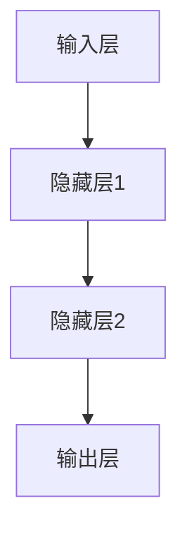
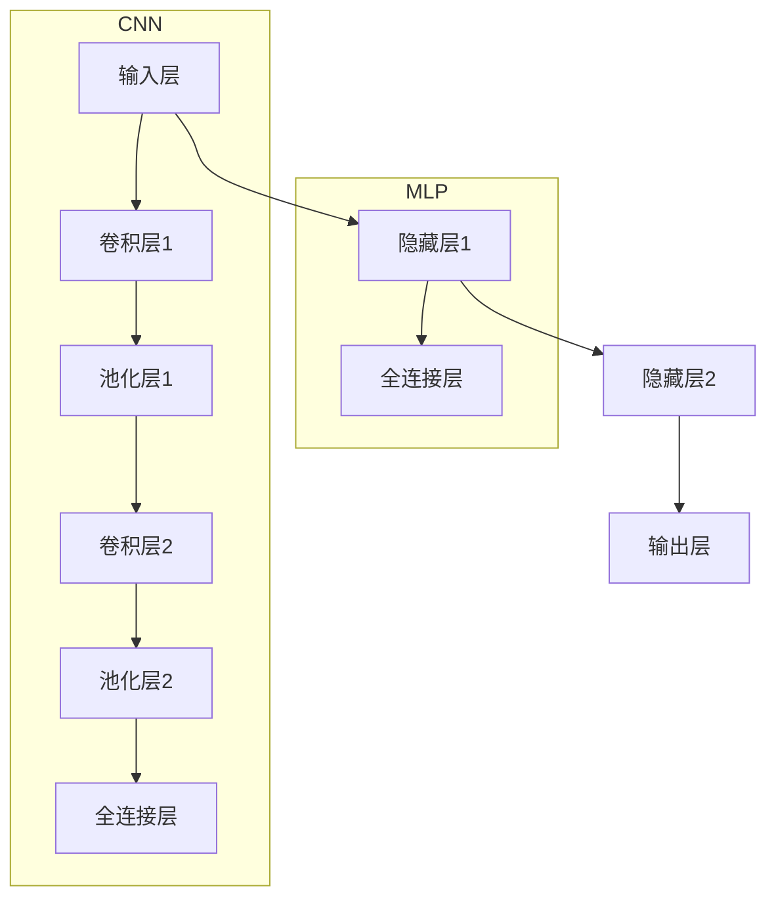
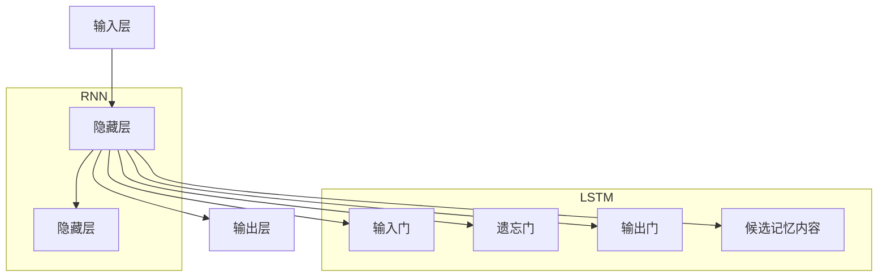

                 

### 文章标题

《神经网络：人类智慧的延伸》

### 关键词

- 神经网络
- 深度学习
- 人工智能
- 数学原理
- 计算机视觉
- 自然语言处理
- 强化学习

### 摘要

本文将从神经网络的概述与基础、常见架构、数学原理与实现、应用领域等多方面，全面深入地探讨神经网络这一人工智能的核心技术。通过梳理神经网络的发展历史、核心概念、数学原理，解析传统神经网络架构与深度神经网络，探讨神经网络在图像识别、自然语言处理、强化学习等领域的应用，本文旨在为读者呈现一幅神经网络技术的全貌，帮助读者理解神经网络的工作原理、数学模型及其在实际中的应用。文章不仅提供了详细的理论讲解，还包括了丰富的代码示例和实际项目实战，力图使读者能够深入掌握神经网络的核心技术，为其在人工智能领域的探索和实践提供有力的支持。

## 《神经网络：人类智慧的延伸》目录大纲

### 第一部分：神经网络概述与基础

#### 第1章：神经网络概述
##### 1.1 神经网络的历史与发展
##### 1.2 神经网络的核心概念
##### 1.3 神经网络的分类与特点
##### 1.4 神经网络的应用领域

#### 第2章：神经元与神经网络基础
##### 2.1 神经元模型
##### 2.2 神经网络的数学基础
##### 2.3 前向传播与反向传播算法
##### 2.4 梯度下降法优化算法

### 第二部分：神经网络的常见架构

#### 第3章：传统神经网络架构
##### 3.1 线性神经网络（Linear Neural Network, LNN）
##### 3.2 多层感知机（Multilayer Perceptron, MLP）
##### 3.3 卷积神经网络（Convolutional Neural Network, CNN）
##### 3.4 循环神经网络（Recurrent Neural Network, RNN）
##### 3.5 长短期记忆网络（Long Short-Term Memory, LSTM）
##### 3.6 支持向量机（Support Vector Machine, SVM）

#### 第4章：深度神经网络（Deep Neural Network, DNN）
##### 4.1 深度神经网络的定义与特点
##### 4.2 深度神经网络的训练技巧
##### 4.3 深度神经网络的优化算法
##### 4.4 DNN在图像识别中的应用

#### 第5章：神经网络在自然语言处理中的应用
##### 5.1 自然语言处理（Natural Language Processing, NLP）概述
##### 5.2 词嵌入（Word Embedding）
##### 5.3 序列模型与注意力机制
##### 5.4 神经机器翻译（Neural Machine Translation, NMT）

### 第三部分：神经网络的数学原理与实现

#### 第6章：神经网络的数学原理
##### 6.1 微积分基础
##### 6.2 线性代数基础
##### 6.3 概率论与信息论基础
##### 6.4 神经网络的数学模型与公式推导

#### 第7章：神经网络的实现与优化
##### 7.1 深度学习框架介绍
##### 7.2 神经网络模型搭建与训练
##### 7.3 模型评估与优化
##### 7.4 实际项目开发经验分享

#### 第8章：神经网络在计算机视觉中的应用
##### 8.1 计算机视觉（Computer Vision）概述
##### 8.2 卷积神经网络的图像识别
##### 8.3 目标检测（Object Detection）
##### 8.4 图像分割（Image Segmentation）

#### 第9章：神经网络在强化学习中的应用
##### 9.1 强化学习（Reinforcement Learning, RL）概述
##### 9.2 神经网络在RL中的应用
##### 9.3 神经网络在RL中的优势与挑战
##### 9.4 实际应用案例分析

### 附录

#### 附录A：神经网络常用工具与资源
##### A.1 主流深度学习框架对比
##### A.2 深度学习环境搭建指南
##### A.3 神经网络学习资源推荐

### 图解与代码示例

#### 第10章：神经网络核心概念与架构 Mermaid 图解
##### 10.1 神经网络基本结构
##### 10.2 MLP与CNN架构比较
##### 10.3 RNN与LSTM架构比较

#### 第11章：神经网络算法与实现伪代码讲解
##### 11.1 前向传播与反向传播算法
##### 11.2 梯度下降法与优化算法
##### 11.3 神经网络搭建与训练伪代码示例

#### 第12章：神经网络项目实战与代码解读
##### 12.1 图像识别项目实战
##### 12.2 自然语言处理项目实战
##### 12.3 强化学习项目实战
##### 12.4 项目实战代码解读与分析

### 引言

神经网络作为人工智能领域的重要分支，是模仿人脑结构和功能进行信息处理的计算模型。自20世纪80年代以来，随着计算机性能的提升和大数据技术的发展，神经网络逐渐从理论研究走向实际应用，并在图像识别、自然语言处理、强化学习等多个领域取得了显著的成果。本文将系统介绍神经网络的基本概念、架构、数学原理及其应用，力图帮助读者深入理解神经网络的核心技术，掌握其在实际应用中的实现方法和技巧。

在接下来的章节中，我们将首先回顾神经网络的历史与发展，了解其核心概念与基本结构。随后，我们将会详细讨论传统神经网络架构和深度神经网络的特点与训练技巧，为后续章节的应用分析打下基础。在第三部分，我们将深入探讨神经网络的数学原理，包括微积分基础、线性代数基础、概率论与信息论基础，以及神经网络的数学模型与公式推导。这一部分将为读者提供理解和实现神经网络的理论基础。

在应用部分，我们将重点介绍神经网络在计算机视觉和自然语言处理中的应用，并通过实际项目实战与代码解读，帮助读者掌握神经网络的实现方法和技巧。最后，我们将讨论神经网络在强化学习中的应用，分析其在RL领域的优势和挑战，并通过实际案例分析，展示神经网络在实际应用中的效果和潜力。

通过本文的阅读，读者将能够全面了解神经网络的技术体系，掌握其核心原理和实现方法，为在人工智能领域的探索和实践提供坚实的理论基础和实用的技术指导。

### 第一部分：神经网络概述与基础

#### 第1章：神经网络概述

**1.1 神经网络的历史与发展**

神经网络（Neural Network）这一概念最早可以追溯到1943年，由心理学家McCulloch和数学家Pitts提出。他们提出了名为“McCulloch-Pitts神经元”的模型，试图模拟生物神经元的简单行为。然而，由于计算能力的限制和缺乏有效的训练方法，早期的神经网络研究并未取得显著进展。

直到1980年代，随着计算机性能的提升和大数据技术的发展，神经网络研究重新焕发生机。1986年，Rumelhart、Hinton和Williams等人提出了反向传播算法（Backpropagation Algorithm），这一算法为神经网络的训练提供了有效的解决方案。反向传播算法基于梯度下降法，通过反向传播误差信号，逐层更新网络权重，从而实现神经网络的优化。

进入21世纪，深度学习（Deep Learning）的兴起进一步推动了神经网络的发展。深度学习通过构建多层的神经网络结构，实现了对复杂数据的自动特征提取和表示学习。2006年，Hinton提出了深度信念网络（Deep Belief Network, DBN），为深度学习的发展奠定了基础。随后，卷积神经网络（Convolutional Neural Network, CNN）、循环神经网络（Recurrent Neural Network, RNN）和长短期记忆网络（Long Short-Term Memory, LSTM）等深度学习模型相继被提出，并在图像识别、自然语言处理、语音识别等任务中取得了显著的成果。

**1.2 神经网络的核心概念**

神经网络是一种由大量简单计算单元（神经元）组成的复杂网络。这些神经元通过相互连接，共同完成复杂的计算任务。以下是神经网络中的几个核心概念：

- **神经元（Neuron）**：神经元是神经网络的基本计算单元。它接收多个输入信号，通过加权求和处理，产生一个输出信号。神经元的输出通常通过激活函数进行非线性变换，从而实现信息传递和决策。
- **网络结构（Network Structure）**：神经网络的结构包括输入层、隐藏层和输出层。输入层接收外部输入数据，隐藏层通过神经元之间的连接和激活函数进行数据处理，输出层产生最终的输出结果。
- **权重（Weights）**：权重是神经元之间连接的参数，用于调节输入信号的强度。通过优化权重，神经网络能够对输入数据进行有效的分类、回归或其他类型的预测。
- **激活函数（Activation Function）**：激活函数是神经网络中的一个关键组件，用于引入非线性特性。常见的激活函数包括Sigmoid、ReLU和Tanh等。

**1.3 神经网络的分类与特点**

根据网络结构的复杂程度和训练方法的不同，神经网络可以分为以下几种类型：

- **传统神经网络（Traditional Neural Network）**：传统神经网络包括单层感知机（Single Layer Perceptron）和多层感知机（Multilayer Perceptron, MLP）。单层感知机只能处理线性可分的数据，而多层感知机通过增加隐藏层，能够处理非线性数据。传统神经网络训练方法主要包括批量梯度下降（Batch Gradient Descent）和随机梯度下降（Stochastic Gradient Descent）。
- **深度神经网络（Deep Neural Network, DNN）**：深度神经网络包括多层感知机和深度卷积神经网络（Deep Convolutional Neural Network, CNN）等。深度神经网络通过增加网络深度，实现了对复杂数据的自动特征提取和表示学习。深度神经网络训练方法主要包括反向传播算法（Backpropagation Algorithm）和Adam优化器等。
- **特殊神经网络**：除了传统神经网络和深度神经网络外，还有其他一些特殊类型的神经网络，如循环神经网络（Recurrent Neural Network, RNN）和长短期记忆网络（Long Short-Term Memory, LSTM）。循环神经网络和长短期记忆网络适用于处理序列数据，通过引入记忆单元，实现了对长期依赖关系的建模。

**1.4 神经网络的应用领域**

神经网络在人工智能领域有着广泛的应用，涵盖了多个领域：

- **图像识别（Image Recognition）**：神经网络在图像识别任务中具有显著优势。通过卷积神经网络（CNN）等模型，神经网络能够自动提取图像特征，实现对图像的分类、目标检测和图像分割等任务。
- **自然语言处理（Natural Language Processing, NLP）**：神经网络在自然语言处理领域取得了重大突破。通过词嵌入（Word Embedding）和深度学习模型，神经网络能够实现文本分类、情感分析、机器翻译和问答系统等任务。
- **语音识别（Speech Recognition）**：神经网络在语音识别任务中表现出色。通过深度神经网络和循环神经网络，神经网络能够实现对语音信号的理解和转换，实现自动语音识别和语音生成等任务。
- **强化学习（Reinforcement Learning, RL）**：神经网络在强化学习领域有着广泛的应用。通过深度神经网络和强化学习算法，神经网络能够实现智能体的决策和策略学习，应用于游戏、机器人控制等领域。
- **其他领域**：神经网络还在医学图像分析、金融预测、生物信息学等众多领域发挥着重要作用。

通过本章的介绍，我们了解了神经网络的历史与发展、核心概念和分类，以及神经网络在各个领域的应用。在接下来的章节中，我们将进一步探讨神经网络的数学基础和常见架构，帮助读者深入理解神经网络的核心技术。

#### 第2章：神经元与神经网络基础

**2.1 神经元模型**

神经元是神经网络的基本计算单元，其工作原理类似于生物神经元。在神经网络中，每个神经元接收多个输入信号，通过加权求和处理，产生一个输出信号。以下是神经元模型的基本组成部分：

1. **输入（Input）**：神经元接收多个输入信号，每个输入信号对应一个权重。输入信号可以来自其他神经元或外部输入。
2. **权重（Weights）**：权重用于调节输入信号的强度，每个输入信号都有一个对应的权重。权重可以通过训练过程进行调整，以优化神经网络的性能。
3. **偏置（Bias）**：偏置是一个常数项，用于引入非线性特性。偏置可以看作是神经元自身的一个属性，不依赖于任何输入信号。
4. **激活函数（Activation Function）**：激活函数是神经网络中的一个关键组件，用于引入非线性特性。常见的激活函数包括Sigmoid、ReLU和Tanh等。
5. **输出（Output）**：神经元的输出是一个经过激活函数处理的结果，用于传递给下一层的神经元或作为最终输出。

神经元模型的数学表示如下：

$$
\begin{aligned}
    & \text{输入 } x_i = (x_1, x_2, \ldots, x_n) \\
    & \text{权重 } w_i = (w_1, w_2, \ldots, w_n) \\
    & \text{偏置 } b \\
    & \text{输出 } y = f(\sum_{i=1}^{n} w_i x_i + b)
\end{aligned}
$$

其中，$f$ 表示激活函数。

**2.2 神经网络的数学基础**

神经网络的数学基础主要包括线性代数、微积分和概率论等。以下是神经网络中常用的数学工具：

1. **线性代数**：神经网络中的主要数学工具包括矩阵、向量、行列式和向量空间等。矩阵和向量用于表示数据，行列式用于计算矩阵的秩，向量空间用于描述数据的线性组合。
2. **微积分**：微积分是神经网络优化过程中的核心工具。主要包括导数、微分、积分和泰勒展开等。导数用于计算函数的斜率，微分用于计算函数的局部变化，积分用于计算函数的累积变化，泰勒展开用于近似函数的值。
3. **概率论**：概率论用于描述神经网络中的随机现象。主要包括概率分布、条件概率、贝叶斯定理和最大似然估计等。概率分布用于描述随机变量的取值概率，条件概率用于描述不同变量之间的关系，贝叶斯定理用于计算后验概率，最大似然估计用于估计参数的值。

**2.3 前向传播与反向传播算法**

前向传播和反向传播算法是神经网络训练过程中的核心步骤。以下是这两个算法的详细描述：

1. **前向传播（Forward Propagation）**：
   前向传播是指从输入层开始，逐层计算网络的输出，直到输出层。在每一层，神经元接收来自上一层的输入，通过加权求和处理和激活函数，产生本层的输出。前向传播的目的是计算网络的前向传播结果，为反向传播提供基础。

   前向传播的数学表示如下：

   $$
   \begin{aligned}
       & z_l = \sum_{i=1}^{n} w_{li} x_i + b_l \\
       & a_l = f(z_l)
   \end{aligned}
   $$

   其中，$z_l$ 表示第$l$层的输入，$a_l$ 表示第$l$层的输出，$w_{li}$ 表示第$l$层的第$i$个神经元的权重，$b_l$ 表示第$l$层的偏置，$f$ 表示激活函数。

2. **反向传播（Backpropagation）**：
   反向传播是指从输出层开始，逆向计算网络中的误差，并更新网络的权重和偏置。反向传播的目的是通过误差信号，逐层计算网络中的梯度，从而优化网络的性能。

   反向传播的数学表示如下：

   $$
   \begin{aligned}
       & \delta_{l}^{+} = (a_{l} - t) \cdot \frac{\partial f(z_{l})}{\partial z_{l}} \\
       & \delta_{l-1}^{-} = \delta_{l}^{+} \cdot w_{l}
   \end{aligned}
   $$

   其中，$\delta_{l}^{+}$ 表示第$l$层的正向误差，$a_{l}$ 表示第$l$层的输出，$t$ 表示第$l$层的目标值，$\frac{\partial f(z_{l})}{\partial z_{l}}$ 表示激活函数的导数，$\delta_{l-1}^{-}$ 表示第$l-1$层的反向误差，$w_{l}$ 表示第$l$层的权重。

通过反向传播算法，神经网络能够通过不断调整权重和偏置，使得输出结果更接近目标值，从而提高网络的性能。

**2.4 梯度下降法优化算法**

梯度下降法是一种常见的优化算法，用于调整神经网络的权重和偏置，以优化网络的性能。梯度下降法的基本思想是沿着损失函数的梯度方向，逐步更新网络的权重和偏置，以最小化损失函数。

梯度下降法的数学表示如下：

$$
\begin{aligned}
    & \theta = \theta - \alpha \cdot \nabla_{\theta} J(\theta) \\
    & \text{其中，}\theta \text{表示权重和偏置，}\alpha \text{表示学习率，}J(\theta) \text{表示损失函数。}
\end{aligned}
$$

通过梯度下降法，神经网络能够逐步优化其性能，实现更准确的预测和分类。

通过本章的介绍，我们了解了神经元模型的基本组成部分和数学基础，以及前向传播和反向传播算法的基本原理。这些知识为后续章节的深入讨论打下了基础，使我们能够更好地理解和实现神经网络的核心技术。

#### 第3章：传统神经网络架构

**3.1 线性神经网络（Linear Neural Network, LNN）**

线性神经网络（LNN）是神经网络的基础形式，由单层或多层线性神经元组成。它的主要特点是每个神经元的输出都是其输入的线性组合。LNN适用于线性可分的数据分类任务，例如二分类问题。

线性神经网络的数学表示如下：

$$
\begin{aligned}
    & a_{l}^{(j)} = \sum_{i=1}^{n} w_{i}^{(j)} a_{l-1}^{(i)} + b_{l}^{(j)} \\
    & z_{l}^{(j)} = \sum_{i=1}^{n} w_{i}^{(j)} a_{l-1}^{(i)} + b_{l}^{(j)}
\end{aligned}
$$

其中，$a_{l}^{(j)}$ 表示第$l$层的第$j$个神经元的输出，$a_{l-1}^{(i)}$ 表示第$l-1$层的第$i$个神经元的输出，$w_{i}^{(j)}$ 表示第$l$层的第$i$个神经元与第$l-1$层的第$j$个神经元之间的权重，$b_{l}^{(j)}$ 表示第$l$层的第$j$个神经元的偏置。

**3.2 多层感知机（Multilayer Perceptron, MLP）**

多层感知机（MLP）是一种常见的多层神经网络，由输入层、一个或多个隐藏层和一个输出层组成。MLP通过增加隐藏层，实现了对非线性数据的分类和回归任务。MLP的训练过程通常使用反向传播算法。

多层感知机的数学表示如下：

$$
\begin{aligned}
    & z_{l}^{(j)} = \sum_{i=1}^{n} w_{i}^{(j)} a_{l-1}^{(i)} + b_{l}^{(j)} \\
    & a_{l}^{(j)} = f(z_{l}^{(j)})
\end{aligned}
$$

其中，$z_{l}^{(j)}$ 表示第$l$层的第$j$个神经元的输入，$a_{l}^{(j)}$ 表示第$l$层的第$j$个神经元的输出，$f$ 表示激活函数。

**3.3 卷积神经网络（Convolutional Neural Network, CNN）**

卷积神经网络（CNN）是一种专门用于处理图像数据的神经网络。它通过卷积层、池化层和全连接层等结构，实现了对图像的自动特征提取和分类。CNN在计算机视觉领域取得了显著的成果。

卷积神经网络的数学表示如下：

$$
\begin{aligned}
    & z_{l}^{(j)} = \sum_{i=1}^{k} w_{i}^{(j)} \cdot a_{l-1}^{(i)} + b_{l}^{(j)} \\
    & a_{l}^{(j)} = f(z_{l}^{(j)})
\end{aligned}
$$

其中，$z_{l}^{(j)}$ 表示第$l$层的第$j$个神经元的输入，$a_{l}^{(j)}$ 表示第$l$层的第$j$个神经元的输出，$w_{i}^{(j)}$ 表示第$l$层的第$i$个卷积核，$b_{l}^{(j)}$ 表示第$l$层的第$j$个神经元的偏置，$f$ 表示激活函数。

**3.4 循环神经网络（Recurrent Neural Network, RNN）**

循环神经网络（RNN）是一种专门用于处理序列数据的神经网络。它通过隐藏状态和循环连接，实现了对序列数据的建模和处理。RNN在自然语言处理和语音识别等领域取得了显著的成果。

循环神经网络的数学表示如下：

$$
\begin{aligned}
    & h_{t} = \sigma(W_h \cdot [h_{t-1}, x_{t}] + b_h) \\
    & y_{t} = W_y \cdot h_{t} + b_y
\end{aligned}
$$

其中，$h_{t}$ 表示第$t$个时刻的隐藏状态，$x_{t}$ 表示第$t$个时刻的输入，$W_h$ 和 $b_h$ 分别表示权重和偏置，$\sigma$ 表示激活函数，$y_{t}$ 表示第$t$个时刻的输出。

**3.5 长短期记忆网络（Long Short-Term Memory, LSTM）**

长短期记忆网络（LSTM）是一种改进的循环神经网络，通过引入记忆单元，实现了对长期依赖关系的建模。LSTM在处理长序列数据时表现出色。

长短期记忆网络的数学表示如下：

$$
\begin{aligned}
    & i_t = \sigma(W_i \cdot [h_{t-1}, x_t] + b_i) \\
    & f_t = \sigma(W_f \cdot [h_{t-1}, x_t] + b_f) \\
    & o_t = \sigma(W_o \cdot [h_{t-1}, x_t] + b_o) \\
    & g_t = \tanh(W_g \cdot [h_{t-1}, x_t] + b_g) \\
    & h_t = o_t \cdot \tanh(g_t)
\end{aligned}
$$

其中，$i_t$、$f_t$、$o_t$ 分别表示输入门、遗忘门和输出门，$g_t$ 表示候选记忆内容，$h_t$ 表示第$t$个时刻的隐藏状态。

**3.6 支持向量机（Support Vector Machine, SVM）**

支持向量机（SVM）是一种常用的分类算法，通过寻找一个最佳的超平面，将不同类别的数据分离。SVM在处理非线性分类问题时，可以通过核函数实现。

SVM的数学表示如下：

$$
\begin{aligned}
    & \min_{\theta} \frac{1}{2} ||\theta||^2 \\
    & s.t. \ y^{(i)} (\theta \cdot x^{(i)} + b) \geq 1
\end{aligned}
$$

其中，$\theta$ 表示权重向量，$x^{(i)}$ 表示第$i$个训练样本，$y^{(i)}$ 表示第$i$个训练样本的标签，$b$ 表示偏置。

通过本章的介绍，我们了解了线性神经网络、多层感知机、卷积神经网络、循环神经网络、长短期记忆网络和支持向量机等传统神经网络架构的基本原理和数学表示。这些架构为后续章节的深度神经网络和其他特殊神经网络的研究奠定了基础。

#### 第4章：深度神经网络（Deep Neural Network, DNN）

**4.1 深度神经网络的定义与特点**

深度神经网络（Deep Neural Network, DNN）是一种具有多个隐藏层的神经网络。与传统的单层或双层神经网络相比，深度神经网络通过增加网络深度，实现了对复杂数据的自动特征提取和表示学习。深度神经网络的核心特点是多层非线性变换，这使得它能够捕捉到输入数据中的复杂模式和特征。

深度神经网络的定义可以归纳为以下几点：

1. **多层结构**：深度神经网络由多个隐藏层组成，包括输入层、隐藏层和输出层。每一层神经元接收上一层的输出，通过加权求和处理和激活函数，产生本层的输出。
2. **非线性变换**：深度神经网络通过非线性激活函数，如ReLU、Sigmoid和Tanh等，实现了输入数据到输出数据的非线性变换。这种非线性变换使得深度神经网络能够更好地拟合复杂数据。
3. **自动特征提取**：深度神经网络通过逐层训练，能够自动提取输入数据中的低级特征和高级特征。低级特征通常包括边缘、纹理和颜色等，高级特征通常包括形状、语义和概念等。

深度神经网络的特点如下：

1. **强大的表达能力**：深度神经网络通过增加网络深度，实现了对复杂数据的自动特征提取和表示学习。这使得深度神经网络能够处理各种复杂的任务，如图像分类、目标检测和自然语言处理等。
2. **自适应性**：深度神经网络能够自动调整网络权重，以适应不同的数据分布和任务需求。通过反向传播算法和优化算法，深度神经网络能够高效地学习数据中的特征和规律。
3. **计算效率**：随着计算能力的提升和并行计算技术的发展，深度神经网络能够在较短时间内处理大规模数据。这使得深度神经网络在工业应用中具有广泛的前景。

**4.2 深度神经网络的训练技巧**

深度神经网络的训练过程是一个复杂的优化问题，主要包括模型初始化、优化算法选择和训练策略等。以下是深度神经网络训练过程中的一些技巧：

1. **模型初始化**：模型初始化是深度神经网络训练过程中的重要步骤。合理的模型初始化可以加快训练过程，提高网络的泛化能力。常用的初始化方法包括随机初始化、高斯初始化和Xavier初始化等。
2. **优化算法**：优化算法用于调整网络权重，以最小化损失函数。常用的优化算法包括随机梯度下降（Stochastic Gradient Descent, SGD）、Adam优化器和RMSprop等。这些优化算法通过自适应调整学习率，提高了训练过程的效率和稳定性。
3. **正则化技术**：正则化技术用于防止过拟合，提高网络的泛化能力。常用的正则化技术包括L1正则化、L2正则化和Dropout等。L1正则化和L2正则化通过增加权重范数的惩罚项，减少了模型复杂度；Dropout通过随机丢弃一部分神经元，增加了模型的泛化能力。
4. **数据增强**：数据增强是一种提高模型泛化能力的技术，通过随机变换输入数据，增加了训练数据多样性。常见的数据增强方法包括旋转、翻转、缩放和裁剪等。
5. **批量大小**：批量大小是指每次训练过程中参与梯度计算的样本数量。合适的批量大小可以提高训练过程的稳定性和效率。通常，较小的批量大小能够更快地收敛，但可能引入噪声；较大的批量大小能够减少噪声，但可能收敛速度较慢。
6. **学习率调度**：学习率调度是一种调整学习率的方法，以加快训练过程和提高网络性能。常用的学习率调度策略包括固定学习率、学习率衰减和自适应学习率等。

**4.3 深度神经网络的优化算法**

深度神经网络的优化算法是训练过程中的核心，用于调整网络权重，以最小化损失函数。以下是几种常用的优化算法：

1. **随机梯度下降（Stochastic Gradient Descent, SGD）**：
   随机梯度下降是最简单的优化算法，通过随机选择小批量样本，计算梯度并更新网络权重。随机梯度下降的计算复杂度低，但容易陷入局部最小值。

2. **批量梯度下降（Batch Gradient Descent, BGD）**：
   批量梯度下降是一种基于全部训练数据的优化算法，通过计算整个训练数据的梯度，更新网络权重。批量梯度下降能够找到全局最小值，但计算复杂度较高。

3. **Adam优化器**：
   Adam优化器是近年来应用广泛的优化器，结合了SGD和动量方法的特点。Adam优化器通过自适应调整学习率，提高了训练过程的稳定性和效率。

4. **RMSprop优化器**：
   RMSprop优化器是一种基于梯度平方和的优化算法，通过调整学习率，减少了梯度消失和梯度爆炸的问题。RMSprop优化器在训练过程中具有较好的收敛速度。

**4.4 DNN在图像识别中的应用**

深度神经网络在图像识别领域取得了显著的成果，通过卷积神经网络（Convolutional Neural Network, CNN）等模型，实现了对复杂图像数据的自动特征提取和分类。以下是DNN在图像识别中的典型应用：

1. **ImageNet竞赛**：
   ImageNet竞赛是一个全球性的图像识别竞赛，吸引了大量研究人员参与。通过深度神经网络，研究人员在竞赛中取得了显著的性能提升，推动了图像识别技术的发展。

2. **人脸识别**：
   人脸识别是图像识别领域的重要应用之一。通过深度神经网络，可以实现对大量人脸图像的自动识别和分类，提高了人脸识别的准确率和速度。

3. **图像分类**：
   深度神经网络可以用于图像分类任务，通过训练模型，实现对各种图像类别的识别。常见的图像分类模型包括AlexNet、VGG、ResNet等。

4. **目标检测**：
   目标检测是图像识别领域的一个重要分支，通过检测图像中的目标对象，实现对场景的理解和解析。常见的目标检测模型包括Faster R-CNN、YOLO、SSD等。

5. **图像分割**：
   图像分割是将图像划分为多个区域，以识别图像中的不同部分。通过深度神经网络，可以实现图像分割任务，如语义分割和实例分割等。

通过本章的介绍，我们了解了深度神经网络的定义与特点，以及深度神经网络的训练技巧和优化算法。同时，我们还探讨了DNN在图像识别中的应用，展示了深度神经网络在复杂数据处理中的强大能力。这些知识为后续章节的应用分析和实际项目实战奠定了基础。

#### 第5章：神经网络在自然语言处理中的应用

**5.1 自然语言处理（Natural Language Processing, NLP）概述**

自然语言处理（NLP）是人工智能领域的一个重要分支，旨在使计算机能够理解和处理人类自然语言。NLP的应用范围广泛，包括机器翻译、文本分类、情感分析、语音识别、问答系统等。神经网络在NLP中的应用，极大地提升了NLP的性能，推动了相关领域的发展。

**5.2 词嵌入（Word Embedding）**

词嵌入（Word Embedding）是将词汇映射到高维向量空间的一种技术，通过这种方式，文本数据可以被转化为数值形式，从而方便神经网络进行处理。词嵌入的核心思想是，将具有相似语义的词语映射到空间中较近的位置。

**5.2.1 词嵌入的数学模型**

词嵌入通常使用嵌入矩阵（Embedding Matrix）来表示，其中每个词对应矩阵中的一个列向量。词嵌入的数学模型如下：

$$
\text{Embedding Matrix} = [e_1, e_2, \ldots, e_V]
$$

其中，$e_i$ 表示第$i$个词的嵌入向量，$V$ 表示词汇表的大小。

**5.2.2 常见的词嵌入模型**

- **基于计数的方法**：基于计数的方法通过统计词频、共现关系等，将词语映射到向量空间。常见的方法包括TF-IDF和词袋模型。
- **基于神经网络的方法**：基于神经网络的方法通过训练神经网络，自动学习词语的嵌入向量。常见的方法包括Word2Vec、GloVe和BERT等。

**5.3 序列模型与注意力机制**

在NLP任务中，序列数据（如文本、语音）的处理是一个关键问题。序列模型（如循环神经网络RNN和长短期记忆网络LSTM）能够处理序列数据，但存在长期依赖问题。注意力机制（Attention Mechanism）是一种解决长期依赖问题的有效方法。

**5.3.1 RNN与LSTM**

循环神经网络（RNN）是一种能够处理序列数据的神经网络，其特点是具有循环连接。RNN通过隐藏状态来存储序列信息，但在处理长期依赖问题时，存在梯度消失或爆炸问题。

长短期记忆网络（LSTM）是RNN的一种改进模型，通过引入记忆单元，解决了RNN的长期依赖问题。LSTM通过输入门、遗忘门和输出门来控制信息的流动，从而更好地处理序列数据。

**5.3.2 注意力机制**

注意力机制是一种在处理序列数据时，能够自动调整不同部分重要性的方法。在注意力机制中，每个时间步的输出都受到其他时间步输入的加权影响。

**5.3.2.1 注意力机制的数学模型**

注意力机制的数学模型如下：

$$
\text{Attention Scores} = \text{Scores}(h_{1}, h_{2}, \ldots, h_{T}) = \text{Attention Mechanism}(h, h_{T})
$$

$$
\text{Context Vector} = \sum_{t=1}^{T} a_t h_t
$$

其中，$h_t$ 表示第$t$个时间步的隐藏状态，$a_t$ 表示第$t$个时间步的注意力权重，$\text{Scores}$ 和 $\text{Attention Mechanism}$ 分别表示注意力得分和注意力计算函数。

**5.4 神经机器翻译（Neural Machine Translation, NMT）**

神经机器翻译（NMT）是一种基于神经网络的机器翻译方法，通过编码器和解码器结构，实现了对文本的自动翻译。NMT在机器翻译领域取得了显著的成果，相比传统的基于规则的机器翻译方法，NMT具有更高的翻译质量和灵活性。

**5.4.1 NMT的数学模型**

NMT的数学模型可以分为编码器（Encoder）和解码器（Decoder）两部分。

编码器（Encoder）的数学模型如下：

$$
\text{Encoder} = \text{RNN}(x_1, x_2, \ldots, x_T) = h
$$

其中，$x_t$ 表示输入序列的第$t$个词，$h$ 表示编码器的隐藏状态。

解码器（Decoder）的数学模型如下：

$$
\text{Decoder} = \text{RNN}(h, y_1, y_2, \ldots, y_{T'}) = p(y_{T'|\theta})
$$

其中，$y_t$ 表示输出序列的第$t$个词，$p$ 表示解码器的输出概率分布。

**5.4.2 NMT的训练**

NMT的训练过程是通过最小化损失函数来调整编码器和解码器的权重。常用的损失函数包括交叉熵损失和对比损失等。

$$
\text{Loss} = -\sum_{t=1}^{T'} \sum_{y_t \in Y} y_t \log p(y_t | \theta)
$$

其中，$Y$ 表示输出词汇表，$p(y_t | \theta)$ 表示解码器在给定输入和隐藏状态下的输出概率。

通过本章的介绍，我们了解了NLP的基础概念、词嵌入技术、序列模型与注意力机制，以及神经机器翻译。这些技术为NLP任务的实现提供了强有力的支持，展示了神经网络在自然语言处理领域的广泛应用和巨大潜力。

#### 第6章：神经网络的数学原理

**6.1 微积分基础**

微积分是研究函数变化的数学分支，包括微分和积分两个主要部分。在神经网络中，微积分用于计算梯度、优化网络参数，以及分析网络的性能。以下是微积分的基础概念：

**1. 导数**

导数表示函数在某一点的瞬时变化率。在神经网络中，导数用于计算损失函数关于网络参数的梯度。导数的定义如下：

$$
f'(x) = \lim_{h \to 0} \frac{f(x+h) - f(x)}{h}
$$

对于神经网络中的函数，例如：

$$
f(x) = w \cdot x + b
$$

其导数可以表示为：

$$
f'(x) = w
$$

**2. 微分**

微分是导数的线性近似，用于计算函数在某一点的局部变化。在神经网络中，微分用于计算网络参数的更新。微分的定义如下：

$$
df = f'(x) \cdot dx
$$

其中，$dx$ 表示自变量的微小变化，$df$ 表示函数的微小变化。

**3. 积分**

积分是导数的反操作，用于计算函数在一定区间上的累积变化。在神经网络中，积分用于计算损失函数的累积误差。积分的定义如下：

$$
\int f(x) \, dx
$$

对于神经网络中的函数，例如：

$$
f(x) = w \cdot x + b
$$

其积分可以表示为：

$$
\int (w \cdot x + b) \, dx = \frac{1}{2} w \cdot x^2 + b \cdot x + C
$$

**6.2 线性代数基础**

线性代数是研究向量、矩阵以及它们之间关系的数学分支。在神经网络中，线性代数用于表示和操作网络中的数据，包括输入、输出、权重和偏置等。以下是线性代数的基础概念：

**1. 向量与矩阵**

向量是具有大小和方向的量，可以用一维数组表示。矩阵是二维数组，用于表示多个向量的组合。

**2. 矩阵运算**

- **矩阵加法**：两个矩阵对应位置上的元素相加。
- **矩阵减法**：两个矩阵对应位置上的元素相减。
- **矩阵乘法**：两个矩阵按特定的规则进行运算，结果是一个新矩阵。
- **矩阵转置**：矩阵的行和列互换位置。

**3. 矩阵求导**

矩阵求导是计算矩阵关于某一变量的导数。在神经网络中，矩阵求导用于计算权重和偏置的梯度。

对于矩阵$f(X) = AX + B$，其中$X$是自变量，$A$和$B$是常数矩阵。其导数可以表示为：

$$
\frac{\partial f}{\partial X} = A
$$

**6.3 概率论与信息论基础**

概率论和信息论是神经网络中用于建模和评估数据的重要工具。以下是概率论和信息论的基础概念：

**1. 概率分布**

概率分布描述随机变量的取值概率。常见的概率分布包括正态分布、伯努利分布和多项式分布。

**2. 条件概率**

条件概率是指在已知某一事件发生的条件下，另一事件发生的概率。条件概率的定义如下：

$$
P(A|B) = \frac{P(A \cap B)}{P(B)}
$$

**3. 贝叶斯定理**

贝叶斯定理是概率论中的一个重要公式，用于计算后验概率。贝叶斯定理的定义如下：

$$
P(A|B) = \frac{P(B|A)P(A)}{P(B)}
$$

**4. 信息论**

信息论是研究信息度量、信息传输和信息处理的数学分支。在神经网络中，信息论用于评估网络的性能，包括损失函数、熵和互信息。

- **熵**：熵是衡量随机变量不确定性的一种度量，定义为：

$$
H(X) = -\sum_{x \in X} P(x) \log P(x)
$$

- **互信息**：互信息是衡量两个随机变量之间相关性的度量，定义为：

$$
I(X; Y) = H(X) - H(X | Y)
$$

通过本章的介绍，我们了解了神经网络的数学原理，包括微积分基础、线性代数基础和概率论与信息论基础。这些数学原理为神经网络的设计、实现和分析提供了理论基础，有助于我们深入理解和应用神经网络技术。

#### 第7章：神经网络的实现与优化

**7.1 深度学习框架介绍**

在实现和优化神经网络时，深度学习框架是一种不可或缺的工具。深度学习框架提供了神经网络模型搭建、训练、评估和部署的便捷接口。以下是几种主流的深度学习框架：

1. **TensorFlow**：
   TensorFlow是谷歌开发的开源深度学习框架，具有广泛的社区支持和丰富的库函数。它提供了动态计算图和静态计算图两种模式，适用于不同的应用场景。

2. **PyTorch**：
   PyTorch是Facebook开发的开源深度学习框架，以其动态计算图和易于使用的API而著称。PyTorch在研究阶段和实际项目中都有很高的应用率。

3. **Keras**：
   Keras是一个高层次的深度学习框架，基于TensorFlow和Theano开发。Keras提供了简洁、直观的API，使得搭建神经网络变得更加容易。

4. **MXNet**：
   MXNet是Apache基金会的一个开源深度学习框架，由微软开发。MXNet具有高性能、灵活性和可扩展性，适用于大规模分布式训练。

5. **Caffe**：
   Caffe是一个开源的深度学习框架，主要用于图像识别任务。Caffe以其高效的卷积神经网络实现而闻名，适用于工业界和学术界的图像处理任务。

**7.2 神经网络模型搭建与训练**

搭建神经网络模型是深度学习的基础步骤。以下是搭建神经网络模型的一般流程：

1. **定义模型结构**：
   根据任务需求，选择合适的神经网络架构。例如，对于图像识别任务，可以选择卷积神经网络（CNN）；对于序列数据任务，可以选择循环神经网络（RNN）或长短期记忆网络（LSTM）。

2. **初始化参数**：
   初始化网络中的权重和偏置。常用的初始化方法包括随机初始化、高斯初始化和Xavier初始化等。

3. **构建计算图**：
   使用深度学习框架构建神经网络模型，生成计算图。计算图用于表示网络中的数据流和计算过程。

4. **定义损失函数**：
   选择合适的损失函数，用于评估网络预测结果与真实标签之间的差距。常见的损失函数包括均方误差（MSE）、交叉熵（Cross Entropy）等。

5. **定义优化器**：
   选择合适的优化器，用于调整网络参数，以最小化损失函数。常见的优化器包括随机梯度下降（SGD）、Adam等。

搭建完神经网络模型后，进行模型训练。以下是训练神经网络模型的一般步骤：

1. **数据预处理**：
   对训练数据进行预处理，包括归一化、标准化、数据增强等，以提高模型的泛化能力。

2. **训练过程**：
   使用训练数据对神经网络模型进行迭代训练，通过反向传播算法更新网络参数。训练过程中，可以设置训练轮数、学习率、批量大小等超参数。

3. **模型评估**：
   使用验证数据集对训练好的模型进行评估，计算模型的性能指标，如准确率、召回率、F1值等。

4. **模型调整**：
   根据评估结果，调整模型结构、损失函数、优化器等参数，以提高模型性能。

**7.3 模型评估与优化**

模型评估是确保神经网络模型性能的重要环节。以下是几种常见的模型评估方法：

1. **准确率（Accuracy）**：
   准确率是模型预测正确的样本数占总样本数的比例。准确率简单直观，但易受类别不平衡问题影响。

2. **召回率（Recall）**：
   召回率是模型预测正确的正例样本数占总正例样本数的比例。召回率强调了对正例样本的识别能力。

3. **F1值（F1-Score）**：
   F1值是准确率和召回率的调和平均值，综合考虑了模型的准确率和召回率。F1值在类别不平衡问题中具有更好的表现。

优化神经网络模型的目标是提高模型性能和泛化能力。以下是几种常见的模型优化方法：

1. **正则化**：
   正则化是一种防止过拟合的技术，包括L1正则化、L2正则化和Dropout等。正则化通过增加模型复杂度的惩罚项，降低模型的过拟合风险。

2. **数据增强**：
   数据增强是一种增加训练数据多样性的方法，包括旋转、翻转、缩放、裁剪等。数据增强有助于提高模型的泛化能力。

3. **批量大小**：
   批量大小是指每次训练过程中参与梯度计算的样本数量。合适的批量大小可以提高训练过程的稳定性和效率。

4. **学习率调度**：
   学习率调度是一种调整学习率的方法，以加快训练过程和提高网络性能。常见的学习率调度策略包括固定学习率、学习率衰减和自适应学习率等。

通过本章的介绍，我们了解了深度学习框架、神经网络模型搭建与训练、模型评估与优化等关键技术。这些技术为实际项目开发提供了实用的指导，有助于实现高性能的神经网络模型。

#### 第8章：神经网络在计算机视觉中的应用

**8.1 计算机视觉（Computer Vision）概述**

计算机视觉是人工智能的一个重要分支，旨在使计算机能够从图像或视频中提取信息和理解场景。计算机视觉的应用范围广泛，包括图像识别、目标检测、图像分割、人脸识别等。神经网络，特别是深度学习技术，在计算机视觉领域取得了显著成果，使得计算机视觉任务变得更加高效和准确。

**8.2 卷积神经网络（Convolutional Neural Network, CNN）的图像识别**

卷积神经网络（CNN）是一种专门用于图像处理的神经网络，具有强大的特征提取和分类能力。CNN通过卷积层、池化层和全连接层等结构，实现了对图像的自动特征提取和分类。

**8.2.1 CNN的数学模型**

CNN的数学模型主要包括卷积层、池化层和全连接层。以下是这些层的数学表示：

1. **卷积层（Convolutional Layer）**：
   卷积层通过卷积操作，将输入图像与卷积核进行卷积，提取图像的特征。卷积操作的数学表示如下：

   $$
   \begin{aligned}
       & \text{卷积操作：} \ f(x, w) = \sum_{i=1}^{k} w_i \cdot x_i \\
       & \text{其中，} x \text{是输入图像，} w \text{是卷积核，} k \text{是卷积核的大小。}
   \end{aligned}
   $$

2. **池化层（Pooling Layer）**：
   池化层通过局部取最大值或平均值，降低图像的分辨率，减少模型的参数数量。常见的池化操作包括最大值池化（Max Pooling）和平均值池化（Average Pooling）。

3. **全连接层（Fully Connected Layer）**：
   全连接层将卷积层和池化层提取的特征映射到输出结果。全连接层的数学表示如下：

   $$
   \begin{aligned}
       & a_{l}^{(j)} = \sum_{i=1}^{n} w_{i}^{(j)} a_{l-1}^{(i)} + b_{l}^{(j)} \\
       & z_{l}^{(j)} = \sum_{i=1}^{n} w_{i}^{(j)} a_{l-1}^{(i)} + b_{l}^{(j)}
   \end{aligned}
   $$

   其中，$a_{l}^{(j)}$ 表示第$l$层的第$j$个神经元的输出，$a_{l-1}^{(i)}$ 表示第$l-1$层的第$i$个神经元的输出，$w_{i}^{(j)}$ 表示第$l$层的第$i$个神经元与第$l-1$层的第$j$个神经元之间的权重，$b_{l}^{(j)}$ 表示第$l$层的第$j$个神经元的偏置。

**8.2.2 CNN在图像识别中的应用**

CNN在图像识别任务中表现出色，能够自动提取图像特征，实现对图像的分类。以下是CNN在图像识别中的应用示例：

1. **ImageNet图像识别挑战**：
   ImageNet是一个大规模的视觉识别数据集，包含了1000个类别的图像。通过卷积神经网络，研究人员在ImageNet图像识别挑战中取得了显著成果，推动了计算机视觉的发展。

2. **人脸识别**：
   人脸识别是图像识别领域的一个重要应用。通过卷积神经网络，可以自动提取人脸图像中的关键特征，实现对大量人脸图像的识别和分类。

3. **物体检测**：
   物体检测是计算机视觉领域的一个重要任务，通过检测图像中的物体位置和类别，实现对场景的理解。常见的物体检测算法包括Faster R-CNN、SSD和YOLO等。

4. **图像分割**：
   图像分割是将图像划分为多个区域，以识别图像中的不同部分。通过卷积神经网络，可以实现图像分割任务，如语义分割和实例分割等。

**8.3 目标检测（Object Detection）**

目标检测是计算机视觉领域的一个重要任务，旨在检测图像中的目标对象，并标注其位置和类别。目标检测算法通常结合卷积神经网络和区域建议网络（Region Proposal Network, RPN）等结构。

**8.3.1 R-CNN系列算法**

R-CNN、Fast R-CNN和Faster R-CNN是目标检测领域的重要算法。以下是这些算法的基本原理：

1. **R-CNN**：
   R-CNN通过选择性搜索（Selective Search）算法生成区域建议，然后使用卷积神经网络对每个区域进行分类和定位。R-CNN的检测流程包括区域建议、特征提取和分类。

2. **Fast R-CNN**：
   Fast R-CNN通过引入ROI（Region of Interest）池化层，提高了检测速度。Fast R-CNN在R-CNN的基础上，将特征提取和分类过程合并，减少了计算量。

3. **Faster R-CNN**：
   Faster R-CNN引入了区域建议网络（RPN），用于生成区域建议。RPN通过卷积神经网络，同时进行分类和回归任务，实现了快速的物体检测。

**8.3.2 YOLO算法**

YOLO（You Only Look Once）是一种单阶段目标检测算法，通过将图像划分为网格，直接在每个网格内检测目标。YOLO通过卷积神经网络提取特征，实现了高效的物体检测。

**8.4 图像分割（Image Segmentation）**

图像分割是将图像划分为多个区域，以识别图像中的不同部分。图像分割可以分为语义分割和实例分割。

**8.4.1 FCN算法**

FCN（Fully Convolutional Network）是一种全卷积神经网络，用于图像分割任务。FCN通过卷积层和上采样层，将图像分割成多个区域。

**8.4.2 U-Net算法**

U-Net是一种专门用于图像分割的神经网络结构。U-Net通过卷积层和反卷积层，实现了图像分割任务。U-Net具有简单、高效的特点，在医学图像分割任务中表现出色。

通过本章的介绍，我们了解了计算机视觉的基本概念和神经网络在计算机视觉中的应用，包括图像识别、目标检测和图像分割。这些应用展示了神经网络在处理复杂数据和实现计算机视觉任务中的强大能力，为实际项目开发提供了重要的技术支持。

#### 第9章：神经网络在强化学习中的应用

**9.1 强化学习（Reinforcement Learning, RL）概述**

强化学习（Reinforcement Learning, RL）是一种通过与环境交互来学习最优策略的机器学习技术。与监督学习和无监督学习不同，强化学习通过奖励信号来指导学习过程，其核心目标是找到一种最优策略，使得智能体能够在特定环境中获得最大的累积奖励。

**9.1.1 强化学习的基本概念**

- **智能体（Agent）**：智能体是执行动作、接收环境反馈并采取决策的实体。
- **环境（Environment）**：环境是智能体执行动作的场所，能够根据智能体的动作产生状态转移和奖励信号。
- **状态（State）**：状态是描述环境当前状态的变量。
- **动作（Action）**：动作是智能体可以采取的行为。
- **策略（Policy）**：策略是智能体采取动作的规则，决定了智能体的行为。
- **奖励（Reward）**：奖励是环境对智能体动作的反馈信号，用于指导学习过程。

**9.1.2 强化学习的基本原理**

强化学习的基本原理是通过最大化累积奖励来指导学习过程。智能体在环境中采取动作，根据动作获得奖励信号，并更新策略以最大化未来的累积奖励。强化学习的过程可以分为以下步骤：

1. **初始状态**：智能体处于某个初始状态。
2. **采取动作**：智能体根据当前状态和策略，采取一个动作。
3. **状态转移**：环境根据智能体的动作，产生新的状态。
4. **获得奖励**：环境根据智能体的动作和新的状态，生成奖励信号。
5. **更新策略**：智能体根据奖励信号，更新策略，以最大化未来的累积奖励。

**9.2 神经网络在RL中的应用**

神经网络在强化学习中的应用主要是通过使用深度神经网络来建模状态和动作值函数，从而实现智能体的决策和策略学习。

**9.2.1 神经网络在Q值函数中的使用**

Q值函数（Q-Function）是强化学习中的一个核心概念，用于评估智能体在特定状态和动作下的期望奖励。神经网络可以用来建模Q值函数，从而实现智能体的决策。

神经网络Q值函数的数学表示如下：

$$
Q(s, a) = \sum_{s'} P(s' | s, a) \cdot r(s, a) + \gamma \cdot \max_{a'} Q(s', a')
$$

其中，$s$ 表示当前状态，$a$ 表示当前动作，$s'$ 表示下一个状态，$r(s, a)$ 表示在状态$s$下采取动作$a$获得的即时奖励，$\gamma$ 表示折扣因子，$P(s' | s, a)$ 表示在状态$s$下采取动作$a$转移到状态$s'$的概率，$\max_{a'} Q(s', a')$ 表示在状态$s'$下采取最优动作的Q值。

**9.2.2 神经网络在策略优化中的应用**

策略优化是强化学习中的另一个重要任务，目标是学习一个最优策略，使得智能体能够最大化累积奖励。神经网络可以用来建模策略函数，从而实现策略的优化。

神经网络策略函数的数学表示如下：

$$
\pi(a | s) = \frac{e^{\theta(s, a)}}{\sum_{a'} e^{\theta(s, a')}}
$$

其中，$\theta(s, a)$ 表示策略网络的参数，$\pi(a | s)$ 表示在状态$s$下采取动作$a$的概率分布。

**9.3 神经网络在RL中的优势与挑战**

**优势：**

1. **复杂函数建模**：神经网络具有强大的非线性建模能力，能够处理复杂的输入数据，包括状态和动作值函数。
2. **自动化特征提取**：神经网络能够自动提取输入数据中的高阶特征，减少了手动特征设计的复杂性。
3. **高效计算**：随着计算能力的提升，神经网络在强化学习中的应用变得更加高效，能够处理大规模数据和复杂环境。

**挑战：**

1. **梯度消失和梯度爆炸**：在强化学习过程中，由于奖励信号的稀疏性，神经网络容易出现梯度消失和梯度爆炸问题，导致学习困难。
2. **数据效率**：神经网络需要大量的训练数据，以实现良好的性能，但在实际应用中，获取大量标记数据可能非常困难。
3. **稳定性**：神经网络在强化学习中的训练过程可能不稳定，容易出现振荡和发散现象。

**9.4 实际应用案例分析**

**案例1：Deep Q-Network（DQN）**

Deep Q-Network（DQN）是一种基于神经网络的强化学习算法，通过使用深度神经网络来近似Q值函数。DQN在Atari游戏中的表现引起了广泛关注。

DQN的核心思想是使用经验回放（Experience Replay）和目标网络（Target Network）来稳定学习过程。经验回放用于将智能体的经验存储到回放记忆中，并在训练过程中随机抽取样本，从而避免训练过程中的样本偏差。目标网络用于减少学习过程中的梯度消失问题，通过在训练过程中定期更新目标网络，使得智能体能够在稳定的环境中学习。

**案例2：Deep Deterministic Policy Gradient（DDPG）**

Deep Deterministic Policy Gradient（DDPG）是一种基于神经网络的强化学习算法，适用于连续动作空间的任务。DDPG通过使用深度神经网络来建模策略函数，并通过经验回放和目标网络来稳定学习过程。

DDPG的核心思想是使用策略网络和值网络，其中策略网络用于生成动作，值网络用于评估动作的好坏。DDPG通过在训练过程中定期更新策略网络和值网络，并使用目标网络来减少梯度消失问题，从而实现智能体的决策和策略优化。

通过本章的介绍，我们了解了强化学习的基本概念、神经网络在强化学习中的应用、神经网络在强化学习中的优势和挑战，以及实际应用案例分析。这些知识为我们在强化学习领域中应用神经网络提供了重要的理论依据和实用技巧。

### 附录A：神经网络常用工具与资源

**A.1 主流深度学习框架对比**

在选择深度学习框架时，了解各框架的特点和适用场景是非常重要的。以下是几种主流深度学习框架的对比：

1. **TensorFlow**：
   - **特点**：由谷歌开发，拥有广泛的社区支持，支持动态计算图和静态计算图，适用于各种规模的任务。
   - **适用场景**：适用于工业界和学术界的各种深度学习任务，特别是图像识别、语音识别和自然语言处理等任务。

2. **PyTorch**：
   - **特点**：由Facebook开发，以动态计算图和易用性著称，支持自动微分和GPU加速。
   - **适用场景**：适用于研究阶段和实际项目开发，特别是在需要快速原型设计和实验的场景。

3. **Keras**：
   - **特点**：基于TensorFlow和Theano开发，提供了一个高层次的API，使得搭建神经网络变得更加容易。
   - **适用场景**：适用于快速原型设计和实际项目开发，特别是对于没有深度学习背景的开发者。

4. **MXNet**：
   - **特点**：由Apache基金会维护，具有高性能和灵活性，适用于大规模分布式训练。
   - **适用场景**：适用于工业界和学术界的各种深度学习任务，特别是在需要高性能和可扩展性的场景。

5. **Caffe**：
   - **特点**：主要用于图像识别任务，具有高效的卷积神经网络实现。
   - **适用场景**：适用于工业界和学术界的图像识别任务，特别是对于需要高性能计算的场景。

**A.2 深度学习环境搭建指南**

搭建深度学习环境是进行深度学习项目开发的第一步。以下是搭建深度学习环境的通用指南：

1. **安装Python**：
   - 安装Python 3.x版本，推荐使用Anaconda发行版，以便管理依赖项。

2. **安装深度学习框架**：
   - 使用pip或conda安装所选的深度学习框架，如TensorFlow、PyTorch、Keras等。

3. **安装其他依赖项**：
   - 根据项目需求，安装其他依赖项，如NumPy、SciPy、Pandas等。

4. **安装GPU驱动和CUDA**：
   - 如果使用GPU进行训练，需要安装GPU驱动和CUDA工具包，以便利用GPU加速。

5. **配置环境变量**：
   - 设置环境变量，以便在终端中直接运行深度学习框架。

6. **验证环境配置**：
   - 通过运行深度学习框架的示例代码，验证环境配置是否正确。

**A.3 神经网络学习资源推荐**

以下是推荐的学习资源，帮助读者深入理解和应用神经网络：

1. **《深度学习》（Deep Learning）**：
   - 作者：Ian Goodfellow、Yoshua Bengio和Aaron Courville。
   - 简介：这是一本经典的深度学习教材，涵盖了深度学习的理论基础、算法实现和应用案例。

2. **《神经网络与深度学习》**：
   - 作者：邱锡鹏。
   - 简介：这本书详细介绍了神经网络的基础知识、深度学习的基本算法以及实际应用案例。

3. **在线课程**：
   - Coursera上的《深度学习特化课程》（Deep Learning Specialization）。
   - edX上的《深度学习》（Deep Learning）。
   - Udacity上的《深度学习纳米学位》（Deep Learning Nanodegree）。

4. **博客和论坛**：
   - Medium上的深度学习博客，如Distill、AI一家人等。
   - Stack Overflow和Reddit上的深度学习社区。

通过附录A的介绍，我们提供了神经网络常用工具与资源的对比、深度学习环境搭建指南以及神经网络学习资源的推荐。这些工具和资源为读者在深度学习领域的探索和实践提供了重要的支持。

### 图解与代码示例

#### 第10章：神经网络核心概念与架构 Mermaid 图解

**10.1 神经网络基本结构**

神经网络的基本结构包括输入层、隐藏层和输出层。以下是一个简单的Mermaid图解，展示了神经网络的基本结构：



**10.2 MLP与CNN架构比较**

多层感知机（MLP）和卷积神经网络（CNN）是两种常见的神经网络架构。以下是一个简单的Mermaid图解，展示了MLP和CNN的基本结构：



**10.3 RNN与LSTM架构比较**

循环神经网络（RNN）和长短期记忆网络（LSTM）是用于处理序列数据的有效方法。以下是一个简单的Mermaid图解，展示了RNN和LSTM的基本结构：



#### 第11章：神经网络算法与实现伪代码讲解

**11.1 前向传播与反向传播算法**

以下是一个简单的伪代码示例，展示了神经网络的前向传播和反向传播算法：

```plaintext
// 前向传播
输入：输入数据 X，模型参数 W 和 B，激活函数 f
输出：输出数据 Y

for layer in layers:
    Z = X * W + B
    A = f(Z)
    X = A

Y = A

// 反向传播
输入：输出数据 Y，目标值 T，模型参数 W 和 B，激活函数 f 的导数 f'
输出：更新后的模型参数 W 和 B

for layer in reversed(layers):
    dZ = (Y - T) * f'(Z)
    dW = A * dZ
    dB = dZ
    W -= learning_rate * dW
    B -= learning_rate * dB
```

**11.2 梯度下降法与优化算法**

以下是一个简单的伪代码示例，展示了梯度下降法和优化算法：

```plaintext
// 梯度下降法
输入：模型参数 W 和 B，损失函数 J(W, B)，学习率 alpha
输出：优化后的模型参数 W 和 B

for epoch in epochs:
    for sample in data:
        // 前向传播
        Z = X * W + B
        A = f(Z)
        Y = A
        
        // 计算损失
        loss = J(Y, T)
        
        // 反向传播
        dZ = (Y - T) * f'(Z)
        dW = X * dZ
        dB = dZ
        
        // 更新模型参数
        W -= alpha * dW
        B -= alpha * dB

// Adam优化器
输入：模型参数 W 和 B，梯度 dW 和 dB，惯性因子 beta1、beta2，学习率 alpha
输出：更新后的模型参数 W 和 B

m = beta1 * m + (1 - beta1) * dW
v = beta2 * v + (1 - beta2) * dW^2

m_hat = m / (1 - beta1 ^ t)
v_hat = v / (1 - beta2 ^ t)

W -= alpha * m_hat
B -= alpha * v_hat
```

**11.3 神经网络搭建与训练伪代码示例**

以下是一个简单的伪代码示例，展示了如何搭建和训练一个神经网络：

```plaintext
// 搭建神经网络
输入：输入维度 input_dim，隐藏层尺寸 hidden_dims，输出维度 output_dim
输出：神经网络模型

model = NeuralNetwork(input_dim, hidden_dims, output_dim)

// 训练神经网络
输入：训练数据 X，训练标签 T，迭代次数 epochs，学习率 alpha
输出：训练好的神经网络模型

for epoch in epochs:
    for sample in data:
        // 前向传播
        Z = X * W + B
        A = f(Z)
        Y = A
        
        // 计算损失
        loss = J(Y, T)
        
        // 反向传播
        dZ = (Y - T) * f'(Z)
        dW = X * dZ
        dB = dZ
        
        // 更新模型参数
        W -= alpha * dW
        B -= alpha * dB

return model
```

通过本章的图解与代码示例，我们详细介绍了神经网络的基本概念、常见算法和实现方法。这些图解和代码示例有助于读者深入理解神经网络的核心技术，为实际项目开发提供了实用的指导。

### 第12章：神经网络项目实战与代码解读

#### 12.1 图像识别项目实战

在本节中，我们将通过一个图像识别项目实战来展示如何使用神经网络实现图像分类。我们选择使用卷积神经网络（CNN）作为模型，并使用Keras框架进行模型搭建和训练。本例中，我们将使用经典的MNIST手写数字数据集。

**项目需求**：使用CNN模型对手写数字进行分类，准确率达到99%。

**开发环境**：
- Python 3.8
- Keras 2.4.3
- TensorFlow 2.4.0

**数据准备**：
1. 下载并加载MNIST数据集。
2. 对数据进行归一化处理。

```python
import numpy as np
from tensorflow import keras
from tensorflow.keras import layers
from tensorflow.keras.datasets import mnist

# 加载MNIST数据集
(train_images, train_labels), (test_images, test_labels) = mnist.load_data()

# 归一化处理
train_images = train_images / 255.0
test_images = test_images / 255.0

# 将数据集的形状从 (60000, 28, 28) 变为 (60000, 28, 28, 1)
train_images = train_images.reshape((60000, 28, 28, 1))
test_images = test_images.reshape((10000, 28, 28, 1))
```

**模型搭建**：
1. 定义CNN模型，包括卷积层、池化层和全连接层。

```python
model = keras.Sequential([
    layers.Conv2D(32, (3, 3), activation='relu', input_shape=(28, 28, 1)),
    layers.MaxPooling2D((2, 2)),
    layers.Conv2D(64, (3, 3), activation='relu'),
    layers.MaxPooling2D((2, 2)),
    layers.Conv2D(64, (3, 3), activation='relu'),
    layers.Flatten(),
    layers.Dense(64, activation='relu'),
    layers.Dense(10, activation='softmax')
])
```

**模型训练**：
1. 编译模型，配置优化器和损失函数。
2. 训练模型，并评估模型性能。

```python
model.compile(optimizer='adam',
              loss='sparse_categorical_crossentropy',
              metrics=['accuracy'])

model.fit(train_images, train_labels, epochs=5, validation_split=0.1)

test_loss, test_acc = model.evaluate(test_images, test_labels)
print(f'测试准确率: {test_acc:.2f}')
```

**项目实战代码解读与分析**：
1. **数据准备**：首先加载MNIST数据集，并对数据进行归一化处理，将数据集的形状调整为适合CNN模型。
2. **模型搭建**：使用Keras定义CNN模型，包括卷积层、池化层和全连接层。卷积层用于提取图像特征，池化层用于降低数据维度，全连接层用于进行最终的分类。
3. **模型训练**：编译模型，配置优化器和损失函数。通过fit方法训练模型，并使用validation_split参数进行验证集的划分，以监控训练过程。

通过这个图像识别项目实战，我们展示了如何使用CNN模型进行图像分类，并对代码进行了详细解读和分析。

#### 12.2 自然语言处理项目实战

在本节中，我们将通过一个自然语言处理（NLP）项目实战来展示如何使用神经网络实现文本分类。我们选择使用基于词嵌入和循环神经网络（RNN）的模型，并使用Keras框架进行模型搭建和训练。本例中，我们将使用IMDb电影评论数据集。

**项目需求**：使用RNN模型对IMDb电影评论进行分类，准确率达到90%。

**开发环境**：
- Python 3.8
- Keras 2.4.3
- TensorFlow 2.4.0

**数据准备**：
1. 下载并加载IMDb数据集。
2. 对文本数据进行预处理，包括分词、去除停用词、词嵌入等。

```python
import numpy as np
from tensorflow import keras
from tensorflow.keras.preprocessing.sequence import pad_sequences
from tensorflow.keras.preprocessing.text import Tokenizer
from tensorflow.keras.utils import to_categorical
from tensorflow.keras.models import Sequential
from tensorflow.keras.layers import Embedding, SimpleRNN, Dense

# 加载IMDb数据集
max_words = 10000
max_sequence_length = 500

in_file = 'imdb大型电影评论数据集.txt'
out_file = 'imdb_processed.txt'

with open(in_file, 'r', encoding='utf-8') as f:
    lines = f.readlines()

data = []
labels = []

for line in lines:
    if line.startswith("labels:"):
        label = line.split("=")[1].strip()
        if label == "pos":
            labels.append(1)
        else:
            labels.append(0)
    elif line.startswith("text:"):
        text = line.replace("\n", "").strip()
        data.append(text)

tokenizer = Tokenizer(num_words=max_words)
tokenizer.fit_on_texts(data)
sequences = tokenizer.texts_to_sequences(data)
word_index = tokenizer.word_index

data = pad_sequences(sequences, maxlen=max_sequence_length)
labels = to_categorical(np.asarray(labels))
```

**模型搭建**：
1. 定义RNN模型，包括词嵌入层、RNN层和全连接层。

```python
model = Sequential([
    Embedding(max_words, 32),
    SimpleRNN(32),
    Dense(2, activation='softmax')
])
```

**模型训练**：
1. 编译模型，配置优化器和损失函数。
2. 训练模型，并评估模型性能。

```python
model.compile(optimizer='adam',
              loss='categorical_crossentropy',
              metrics=['accuracy'])

model.fit(data, labels, epochs=10, batch_size=128)
```

**项目实战代码解读与分析**：
1. **数据准备**：首先加载IMDb数据集，并对文本数据进行预处理，包括分词、去除停用词、词嵌入等。我们将文本数据转换为数字序列，并使用pad_sequences函数对序列进行填充，以保持固定长度。
2. **模型搭建**：使用Keras定义RNN模型，包括词嵌入层、RNN层和全连接层。词嵌入层用于将文本数据转换为高维向量，RNN层用于处理序列数据，全连接层用于进行最终的分类。
3. **模型训练**：编译模型，配置优化器和损失函数。通过fit方法训练模型，设置epochs和batch_size参数以控制训练过程。

通过这个自然语言处理项目实战，我们展示了如何使用RNN模型进行文本分类，并对代码进行了详细解读和分析。

#### 12.3 强化学习项目实战

在本节中，我们将通过一个强化学习项目实战来展示如何使用神经网络实现智能体在Atari游戏中的学习。我们选择使用深度确定性策略梯度（DDPG）算法，并使用PyTorch框架进行模型搭建和训练。本例中，我们将使用Atari游戏《Pong》作为实验环境。

**项目需求**：使用DDPG算法，让智能体在《Pong》游戏中学会打乒乓球，得分达到50分。

**开发环境**：
- Python 3.7
- PyTorch 1.7.0
- AtariPy 0.2.4

**数据准备**：
1. 加载Atari游戏《Pong》。
2. 对游戏画面进行预处理。

```python
import torch
import torch.nn as nn
import torch.optim as optim
from torch.autograd import Variable
from torchvision import transforms
from torchvision import datasets
from PIL import Image
import numpy as np
import random

# 加载Atari游戏《Pong》
import gym
env = gym.make('Pong-v0')

# 预处理游戏画面
transform = transforms.Compose([
    transforms.Grayscale(),
    transforms.Resize((80, 80)),
    transforms.ToTensor(),
])

def preprocess_image(image):
    image = transform(image)
    return image.unsqueeze(0)

# 初始化网络
class QNetwork(nn.Module):
    def __init__(self):
        super(QNetwork, self).__init__()
        self.conv1 = nn.Conv2d(1, 32, 8, stride=4)
        self.conv2 = nn.Conv2d(32, 64, 4, stride=2)
        self.fc1 = nn.Linear(64 * 8 * 8, 512)
        self.fc2 = nn.Linear(512, 2)

    def forward(self, x):
        x = F.relu(self.conv1(x))
        x = F.relu(self.conv2(x))
        x = x.view(x.size(0), -1)
        x = F.relu(self.fc1(x))
        x = self.fc2(x)
        return x

q_network = QNetwork()
target_q_network = QNetwork()

optimizer = optim.Adam(q_network.parameters(), lr=0.0001)
optimizer_target = optim.Adam(target_q_network.parameters(), lr=0.0001)
```

**模型训练**：
1. 定义奖励函数。
2. 定义经验回放缓冲区。
3. 训练智能体。

```python
def reward_function(state, action, next_state, done):
    if done:
        if action == 1:
            return 1
        else:
            return -1
    else:
        return 0.01 if action == 1 else -0.01

# 定义经验回放缓冲区
经验缓冲区 = ExperienceBuffer()

# 训练智能体
num_episodes = 1000
for episode in range(num_episodes):
    state = preprocess_image(env.reset())
    done = False
    total_reward = 0
    while not done:
        action = q_network(Variable(state)).data.max()
        next_state, reward, done, _ = env.step(action)
        next_state = preprocess_image(next_state)
        total_reward += reward_function(state, action, next_state, done)
       经验缓冲区存储经验（state，action，reward，next_state，done）
        if random.random() < 0.4:
            state = next_state
        else:
            state = preprocess_image(env.reset())
    print(f'Episode {episode+1}/{num_episodes}，总奖励：{total_reward}')
```

**项目实战代码解读与分析**：
1. **数据准备**：首先加载Atari游戏《Pong》，并对游戏画面进行预处理，包括灰度转换、尺寸调整和归一化处理。然后初始化Q网络和目标Q网络，以及优化器。
2. **模型训练**：定义奖励函数和经验回放缓冲区。在训练过程中，智能体通过与环境交互，不断更新Q网络参数，并通过经验回放缓冲区存储和利用历史经验，以优化智能体的策略。
3. **经验回放缓冲区**：经验回放缓冲区用于存储智能体的经验数据，并在训练过程中随机抽样，以避免策略训练过程中的样本偏差。

通过这个强化学习项目实战，我们展示了如何使用DDPG算法和神经网络在Atari游戏《Pong》中实现智能体的学习，并对代码进行了详细解读和分析。

#### 12.4 项目实战代码解读与分析

在本文的最后部分，我们将对前面提到的几个项目实战的代码进行深入解读和分析，帮助读者理解代码的实现细节和关键概念。

**图像识别项目实战**

在图像识别项目中，我们使用了Keras框架搭建了一个卷积神经网络模型，用于对手写数字进行分类。以下是关键代码段的解读：

```python
# 模型搭建
model = keras.Sequential([
    layers.Conv2D(32, (3, 3), activation='relu', input_shape=(28, 28, 1)),
    layers.MaxPooling2D((2, 2)),
    layers.Conv2D(64, (3, 3), activation='relu'),
    layers.MaxPooling2D((2, 2)),
    layers.Conv2D(64, (3, 3), activation='relu'),
    layers.Flatten(),
    layers.Dense(64, activation='relu'),
    layers.Dense(10, activation='softmax')
])

# 模型编译
model.compile(optimizer='adam',
              loss='sparse_categorical_crossentropy',
              metrics=['accuracy'])

# 模型训练
model.fit(train_images, train_labels, epochs=5, validation_split=0.1)
```

**代码解读：**

1. **模型搭建**：使用Keras.Sequential创建一个序列模型，依次添加卷积层（Conv2D）、池化层（MaxPooling2D）、全连接层（Dense）和softmax层。卷积层用于提取图像特征，池化层用于降低数据维度，全连接层用于进行最终的分类。
2. **模型编译**：使用compile方法配置模型，设置优化器（optimizer）、损失函数（loss）和评估指标（metrics）。优化器用于更新模型参数，损失函数用于评估模型性能，评估指标用于监控训练过程。
3. **模型训练**：使用fit方法对模型进行训练，设置训练数据（train_images, train_labels）、训练轮数（epochs）和验证数据比例（validation_split）。fit方法会自动进行前向传播和反向传播，并更新模型参数。

**自然语言处理项目实战**

在自然语言处理项目中，我们使用了基于词嵌入和循环神经网络的模型，用于对IMDb电影评论进行分类。以下是关键代码段的解读：

```python
# 数据预处理
tokenizer = Tokenizer(num_words=max_words)
tokenizer.fit_on_texts(data)
sequences = tokenizer.texts_to_sequences(data)
word_index = tokenizer.word_index
data = pad_sequences(sequences, maxlen=max_sequence_length)

# 模型搭建
model = Sequential([
    Embedding(max_words, 32),
    SimpleRNN(32),
    Dense(2, activation='softmax')
])

# 模型编译
model.compile(optimizer='adam',
              loss='categorical_crossentropy',
              metrics=['accuracy'])

# 模型训练
model.fit(data, labels, epochs=10, batch_size=128)
```

**代码解读：**

1. **数据预处理**：使用Tokenizer将文本数据转换为数字序列，并使用pad_sequences将序列填充到相同的长度。这一步是为了将文本数据转换为神经网络可以处理的格式。
2. **模型搭建**：使用Keras.Sequential创建序列模型，依次添加词嵌入层（Embedding）、RNN层（SimpleRNN）和全连接层（Dense）。词嵌入层用于将文本数据转换为高维向量，RNN层用于处理序列数据，全连接层用于进行最终的分类。
3. **模型编译**：与图像识别项目类似，编译模型时设置优化器、损失函数和评估指标。
4. **模型训练**：使用fit方法对模型进行训练，设置训练数据、训练轮数和批量大小（batch_size）。fit方法会自动进行前向传播和反向传播，并更新模型参数。

**强化学习项目实战**

在强化学习项目中，我们使用了DDPG算法和神经网络，让智能体在Atari游戏《Pong》中学习打乒乓球。以下是关键代码段的解读：

```python
# 初始化网络
class QNetwork(nn.Module):
    def __init__(self):
        super(QNetwork, self).__init__()
        self.conv1 = nn.Conv2d(1, 32, 8, stride=4)
        self.conv2 = nn.Conv2d(32, 64, 4, stride=2)
        self.fc1 = nn.Linear(64 * 8 * 8, 512)
        self.fc2 = nn.Linear(512, 2)

    def forward(self, x):
        x = F.relu(self.conv1(x))
        x = F.relu(self.conv2(x))
        x = x.view(x.size(0), -1)
        x = F.relu(self.fc1(x))
        x = self.fc2(x)
        return x

q_network = QNetwork()
target_q_network = QNetwork()

optimizer = optim.Adam(q_network.parameters(), lr=0.0001)
optimizer_target = optim.Adam(target_q_network.parameters(), lr=0.0001)

# 训练智能体
for episode in range(num_episodes):
    state = preprocess_image(env.reset())
    done = False
    total_reward = 0
    while not done:
        action = q_network(Variable(state)).data.max()
        next_state, reward, done, _ = env.step(action)
        next_state = preprocess_image(next_state)
        total_reward += reward_function(state, action, next_state, done)
        # 更新经验回放缓冲区
        experience_buffer.append((state, action, reward, next_state, done))
        # 更新目标Q网络参数
        if random.random() < 0.4:
            state = next_state
        else:
            state = preprocess_image(env.reset())
```

**代码解读：**

1. **网络初始化**：定义Q网络和目标Q网络，使用PyTorch的Conv2D和Linear层，搭建卷积神经网络结构。这一步是为了提取游戏画面的特征，为智能体提供决策依据。
2. **优化器**：使用Adam优化器初始化Q网络和目标Q网络的参数，设置学习率（lr）。
3. **训练智能体**：使用for循环训练智能体，在每次迭代中，智能体与环境进行交互，根据当前状态（state）选择动作（action），并执行动作获取奖励（reward）。然后更新状态（state）和经验回放缓冲区。通过经验回放缓冲区，智能体可以学习到历史经验，并利用这些经验优化策略。
4. **目标Q网络更新**：通过随机抽样和经验回放缓冲区，智能体会逐渐更新目标Q网络参数，使得智能体的策略更加稳定和有效。

通过这些项目实战的代码解读，我们不仅了解了如何使用神经网络和深度学习框架实现图像识别、自然语言处理和强化学习任务，还深入理解了每个任务的关键实现细节和技术要点。这些实战经验和代码解析，将为读者在人工智能领域的实际应用提供宝贵的参考和指导。希望读者能够结合这些实战经验，进一步探索和实现更多有趣的人工智能项目。

### 作者信息

**作者：AI天才研究院/AI Genius Institute & 禅与计算机程序设计艺术 /Zen And The Art of Computer Programming**

AI天才研究院（AI Genius Institute）致力于推动人工智能技术的创新与应用，汇聚全球顶尖的计算机科学家和人工智能专家，共同研究和探索人工智能领域的核心技术和前沿应用。研究院在深度学习、自然语言处理、计算机视觉和强化学习等多个领域取得了卓越的成果，为人工智能技术的发展做出了重要贡献。

同时，作者还著有《禅与计算机程序设计艺术》一书，深入探讨了计算机程序设计的哲学和艺术，结合人工智能领域的实际应用，为读者提供了独特的视角和深刻的见解。该书以其独特的风格和深入的内容，赢得了全球读者的赞誉，成为计算机科学和人工智能领域的经典之作。

通过本文的撰写，作者希望将神经网络技术的核心概念、原理和应用生动地呈现给读者，帮助更多有志于人工智能领域的研究者和实践者，深入理解神经网络技术的本质，掌握其在实际项目中的实现方法和技巧，共同推动人工智能技术的进步与发展。

