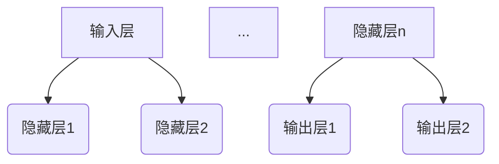
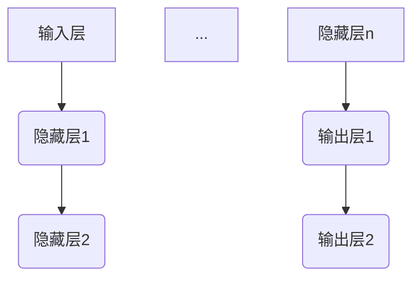

                 

# 神经网络：人类智慧的解放

> 关键词：神经网络、人工智能、深度学习、激活函数、反向传播、数学模型

> 摘要：本文旨在全面探讨神经网络这一人工智能领域的核心技术，从基础概念到高级应用，通过逻辑清晰、结构紧凑的论述，帮助读者深入理解神经网络的原理和实现方法，探讨其如何解放人类智慧，推动人工智能的快速发展。

## 《神经网络：人类智慧的解放》目录大纲

## 第一部分：神经网络的引论

### 第1章：神经网络的概述

#### 1.1 什么是神经网络

神经网络是模仿人脑结构和功能的信息处理系统，通过大量的节点（称为神经元）和它们之间的连接来处理信息。

#### 1.2 神经网络的发展历程

神经网络的发展历程可以追溯到1940年代，经历了多次起伏和突破，最终在21世纪达到了新的高度。

#### 1.3 神经网络与人工智能的关系

神经网络是人工智能的核心技术之一，其发展对人工智能有着重要的影响和推动作用。

### 第2章：神经网络的数学基础

#### 2.1 微积分基础

微积分基础是理解神经网络动态变化和优化过程的重要工具。

#### 2.2 概率论基础

概率论基础是理解神经网络中的不确定性和随机性的关键。

#### 2.3 线性代数基础

线性代数基础是构建和操作神经网络模型的基本数学工具。

## 第二部分：前馈神经网络的原理与实践

### 第3章：前馈神经网络的原理

#### 3.1 前馈神经网络的组成

前馈神经网络由输入层、隐藏层和输出层组成，每层由多个神经元构成。

#### 3.2 前馈神经网络的激活函数

激活函数是神经网络中用于引入非线性特性的关键组件。

#### 3.3 前馈神经网络的反向传播算法

反向传播算法是训练神经网络的核心算法，用于优化网络参数。

#### 3.4 前馈神经网络的数学模型

前馈神经网络的数学模型基于线性代数和微积分，用于描述网络的行为和特性。

### 第4章：前馈神经网络的实现

#### 4.1 前馈神经网络的设计与训练

设计神经网络包括选择合适的网络结构、激活函数和学习规则。

#### 4.2 前馈神经网络的项目实战

通过实际项目展示如何设计和训练前馈神经网络。

## 第三部分：深度学习的应用与优化

### 第5章：深度学习的原理

#### 5.1 深度学习的概念

深度学习是神经网络的一种扩展，通过多层网络来提取特征。

#### 5.2 深度学习的层次结构

深度学习模型通常包含多个层次，用于提取不同层次的特征。

#### 5.3 深度学习的优化方法

优化深度学习模型的方法包括超参数调整、模型压缩和加速等。

### 第6章：深度学习的应用

#### 6.1 深度学习在计算机视觉中的应用

计算机视觉是深度学习的重要应用领域，包括图像分类、目标检测等。

#### 6.2 深度学习在自然语言处理中的应用

自然语言处理是深度学习的另一个重要应用领域，包括语言模型、机器翻译等。

#### 6.3 深度学习在其他领域的应用

深度学习还在语音识别、强化学习等领域有广泛的应用。

### 第7章：深度学习的优化

#### 7.1 深度学习超参数优化

超参数优化是提升深度学习模型性能的重要手段。

#### 7.2 深度学习模型的压缩

模型压缩是减少模型大小和计算量的重要技术。

#### 7.3 深度学习模型的加速

模型加速是提高深度学习模型运行效率的关键。

## 第四部分：神经网络的拓展与前沿

### 第8章：卷积神经网络（CNN）

#### 8.1 CNN的基本概念

卷积神经网络是用于处理图像数据的强大工具。

#### 8.2 CNN的结构与实现

CNN由卷积层、池化层和全连接层组成，具有高效的图像处理能力。

#### 8.3 CNN的应用案例

通过实际案例展示CNN在图像识别、物体检测等领域的应用。

### 第9章：循环神经网络（RNN）

#### 9.1 RNN的基本概念

循环神经网络是用于处理序列数据的强大工具。

#### 9.2 RNN的结构与实现

RNN通过循环连接来处理序列信息，具有强大的时序建模能力。

#### 9.3 RNN的应用案例

通过实际案例展示RNN在语音识别、语言模型等领域的应用。

### 第10章：生成对抗网络（GAN）

#### 10.1 GAN的基本概念

生成对抗网络是一种生成模型，通过对抗训练生成高质量的数据。

#### 10.2 GAN的结构与实现

GAN由生成器和判别器组成，通过对抗训练来生成数据。

#### 10.3 GAN的应用案例

通过实际案例展示GAN在图像生成、数据增强等领域的应用。

## 第五部分：神经网络的未来与挑战

### 第11章：神经网络的未来发展趋势

#### 11.1 神经网络在未来的应用领域

神经网络将在更多领域发挥重要作用，如医疗、金融等。

#### 11.2 神经网络在未来的发展挑战

神经网络在发展过程中面临诸多挑战，如计算资源、数据隐私等。

#### 11.3 神经网络在未来的人类社会中的作用

神经网络将在未来人类社会的发展中扮演重要角色。

## 附录

### 附录A：神经网络学习资源推荐

#### A.1 主流深度学习框架介绍

介绍当前主流的深度学习框架，如TensorFlow、PyTorch等。

#### A.2 神经网络经典论文阅读

推荐经典的神经网络论文，帮助读者深入理解神经网络的本质。

#### A.3 神经网络实践项目推荐

推荐具有挑战性和实用性的神经网络实践项目，帮助读者提升实践能力。

---

# 第一部分：神经网络的引论

## 第1章：神经网络的概述

### 1.1 什么是神经网络

神经网络（Neural Networks）是一种基于生物神经网络模型构建的计算模型，它通过大量的节点（称为神经元）和它们之间的连接来处理信息。神经网络的灵感来源于人脑的结构和工作原理，人脑由数十亿个神经元通过复杂的连接形成网络，能够处理各种复杂的任务，如感知、认知和运动控制等。神经网络试图模拟人脑这种高度并行、分布式和自适应的信息处理能力，从而实现对复杂问题的求解。

神经网络的主要组成部分包括：

- **神经元**：神经网络的基本构建块，类似于生物神经元，用于接收输入、计算和处理信息，并产生输出。
- **连接**：神经元之间的连接，用于传递信息。每个连接都有一个权重，表示输入信息对输出的影响程度。
- **激活函数**：用于引入非线性特性，使得神经网络能够学习复杂的模式。
- **网络结构**：神经网络由多个层次组成，包括输入层、隐藏层和输出层。每一层由多个神经元构成，神经元之间通过连接形成网络。

神经网络的典型结构如图所示：



### 1.2 神经网络的发展历程

神经网络的发展历程可以追溯到20世纪40年代，当时心理学家McCulloch和数学家Pitts提出了第一个神经网络模型——MCP神经元模型，这是一种简单的线性阈值逻辑单元，可以模拟生物神经元的某些基本功能。然而，由于计算资源和算法的限制，神经网络的研究在最初的几十年中进展缓慢。

直到1980年代，随着计算机技术的飞速发展，神经网络的研究逐渐复苏。1986年，Rumelhart、Hinton和Williams提出了反向传播算法（Backpropagation Algorithm），这是一种用于训练神经网络的梯度下降算法，使得多层神经网络的学习成为可能。反向传播算法的提出是神经网络发展史上的一个重要里程碑，它为深度学习奠定了基础。

在1990年代，神经网络的研究继续深入，特别是1998年，Hinton提出了深层信念网络（Deep Belief Network），进一步推动了深度学习的发展。随后，2006年，Hinton再次提出了深度置信网络（Deep Boltzmann Machine），为深度学习的兴起奠定了理论基础。

进入21世纪，随着计算能力的提升和大数据的普及，深度学习得到了快速发展。2012年，Hinton团队在ImageNet竞赛中取得了显著的突破，这标志着深度学习时代的到来。深度学习在计算机视觉、自然语言处理、语音识别等领域取得了显著的成果，大大推动了人工智能的发展。

### 1.3 神经网络与人工智能的关系

神经网络是人工智能（Artificial Intelligence, AI）的核心技术之一，它为人工智能提供了强大的计算能力和智能处理方式。神经网络的研究和发展，不仅丰富了人工智能的理论体系，也为人工智能的应用提供了新的可能性。

神经网络与人工智能的关系可以从以下几个方面来理解：

1. **理论基础**：神经网络为人工智能提供了理论上的支撑，特别是深度学习模型的出现，使得人工智能可以处理更加复杂的问题。
2. **实现工具**：神经网络是实现人工智能的重要工具，通过构建和训练神经网络模型，可以实现各种智能任务，如图像识别、自然语言处理、机器翻译等。
3. **学习机制**：神经网络通过模拟人脑的学习机制，可以实现机器学习，特别是深度学习，使得计算机可以自动学习复杂的数据模式，从而提高智能水平。
4. **应用领域**：神经网络在人工智能的各个领域都有广泛的应用，如计算机视觉、自然语言处理、语音识别、推荐系统等，极大地拓展了人工智能的应用范围。

总之，神经网络是人工智能发展的重要驱动力，它不仅为人工智能提供了强大的计算能力，也为人工智能的研究和应用提供了新的思路和方法。

## 第2章：神经网络的数学基础

神经网络的实现和优化离不开数学基础，本章将介绍神经网络中常用的微积分、概率论和线性代数基础，为后续章节的讨论奠定数学基础。

### 2.1 微积分基础

微积分是研究函数变化率和积分的方法，它在神经网络中有着广泛的应用。以下是微积分中的一些基本概念和公式：

1. **导数**：导数表示函数在某一点的变化率。一元函数$f(x)$在$x_0$点的导数定义为：

   $$f'(x_0) = \lim_{{h \to 0}} \frac{{f(x_0 + h) - f(x_0)}}{h}$$

   导数可以用来计算函数的最值、凹凸性等。

2. **链式法则**：链式法则是计算复合函数导数的公式。如果函数$y = f(u)$，$u = g(x)$，那么复合函数$y = f(g(x))$的导数为：

   $$\frac{{dy}}{{dx}} = \frac{{dy}}{{du}} \cdot \frac{{du}}{{dx}}$$

3. **积分**：积分是导数的反操作，用于计算函数的累积量。一元函数$f(x)$在区间$[a, b]$上的定积分定义为：

   $$\int_{a}^{b} f(x) \, dx = \lim_{{n \to \infty}} \sum_{i=1}^{n} f(x_i^*) \cdot \Delta x$$

   积分可以用来求解面积、体积等问题。

4. **微积分基本定理**：微积分基本定理将微分和积分联系起来，它表明一个函数在整个区间上的积分可以通过其在区间端点上的值来计算：

   $$\int_{a}^{b} f(x) \, dx = F(b) - F(a)$$

   其中$F(x)$是$f(x)$的一个原函数。

### 2.2 概率论基础

概率论是研究随机事件和不确定性的数学分支，它在神经网络中的随机性和不确定性处理中起着关键作用。以下是概率论中的一些基本概念和公式：

1. **概率**：概率是一个介于0和1之间的数，表示事件发生的可能性。如果事件$A$的概率为$P(A)$，那么$0 \leq P(A) \leq 1$。

2. **条件概率**：条件概率是指在某一条件下另一个事件发生的概率。如果事件$A$和$B$同时发生的概率为$P(A \cap B)$，那么在事件$B$发生的条件下事件$A$发生的条件概率为：

   $$P(A|B) = \frac{{P(A \cap B)}}{{P(B)}}$$

3. **全概率公式**：全概率公式用于计算某个事件的总体概率，它通过将这个事件分解成多个互斥事件的概率和来计算：

   $$P(A) = \sum_{i=1}^{n} P(A|B_i) \cdot P(B_i)$$

4. **贝叶斯公式**：贝叶斯公式是一种基于条件概率的公式，它用于根据新的证据更新对某个事件发生概率的估计：

   $$P(A|B) = \frac{{P(B|A) \cdot P(A)}}{{P(B)}}$$

5. **独立性和互斥性**：如果两个事件$A$和$B$满足$P(A \cap B) = P(A) \cdot P(B)$，则称它们相互独立。如果两个事件$A$和$B$不能同时发生，即$P(A \cap B) = 0$，则称它们互斥。

### 2.3 线性代数基础

线性代数是研究向量空间和线性变换的数学分支，它在神经网络中的数据表示和模型优化中起着关键作用。以下是线性代数中的一些基本概念和公式：

1. **向量**：向量是一个有序的数列，通常用一个小写字母表示，如$\mathbf{v}$。向量可以表示物理量，如位置、速度等。

2. **矩阵**：矩阵是一个由数字构成的二维数组，通常用大写字母表示，如$\mathbf{A}$。矩阵可以表示线性变换，如坐标变换等。

3. **矩阵乘法**：矩阵乘法是一种将两个矩阵相乘的操作，其结果是一个新的矩阵。矩阵乘法的规则如下：

   $$\mathbf{C} = \mathbf{A} \cdot \mathbf{B} = \sum_{i=1}^{m} \sum_{j=1}^{n} a_{ij} b_{ij}$$

4. **矩阵的逆**：如果一个矩阵$\mathbf{A}$是一个方阵且其行列式不为零，那么$\mathbf{A}$的逆矩阵$\mathbf{A}^{-1}$满足：

   $$\mathbf{A} \cdot \mathbf{A}^{-1} = \mathbf{A}^{-1} \cdot \mathbf{A} = \mathbf{I}$$

   其中$\mathbf{I}$是单位矩阵。

5. **向量的内积和外积**：向量的内积（点积）和外积（叉积）是用于计算向量之间关系的运算。内积定义如下：

   $$\mathbf{u} \cdot \mathbf{v} = u_1 v_1 + u_2 v_2 + \cdots + u_n v_n$$

   外积定义如下：

   $$\mathbf{u} \times \mathbf{v} = \begin{vmatrix}
   \mathbf{i} & \mathbf{j} & \mathbf{k} \\
   u_1 & u_2 & u_3 \\
   v_1 & v_2 & v_3 \\
   \end{vmatrix}$$

6. **特征值和特征向量**：特征值和特征向量是矩阵的重要性质，它们描述了矩阵的线性变换能力。如果矩阵$\mathbf{A}$有一个特征值$\lambda$和对应的特征向量$\mathbf{v}$，那么满足：

   $$\mathbf{A} \cdot \mathbf{v} = \lambda \cdot \mathbf{v}$$

   特征值和特征向量可以用于矩阵的对角化，从而简化矩阵的计算。

7. **矩阵的秩**：矩阵的秩是矩阵中线性无关的行或列的最大数目。秩可以用来判断矩阵的满秩、奇异等性质。

通过以上微积分、概率论和线性代数的基础知识，我们可以更好地理解和实现神经网络的各种算法和模型，为后续章节的内容打下坚实的数学基础。

### 2.4 向量与矩阵的计算

在神经网络中，向量与矩阵的计算是核心环节，这里我们将介绍一些常见的向量与矩阵的计算方法。

#### 2.4.1 向量的基本运算

1. **加法与减法**：两个向量对应位置的元素相加或相减得到新的向量。例如，向量$\mathbf{a} = (a_1, a_2, ..., a_n)$和向量$\mathbf{b} = (b_1, b_2, ..., b_n)$的加法结果为$\mathbf{c} = (a_1 + b_1, a_2 + b_2, ..., a_n + b_n)$。

2. **数乘**：向量与一个标量相乘，即每个元素都乘以该标量。例如，向量$\mathbf{a}$乘以标量$c$得到$\mathbf{d} = (ca_1, ca_2, ..., ca_n)$。

3. **内积（点积）**：两个向量对应位置的元素相乘后再相加。例如，向量$\mathbf{a} = (a_1, a_2, ..., a_n)$和向量$\mathbf{b} = (b_1, b_2, ..., b_n)$的内积为：

   $$\mathbf{a} \cdot \mathbf{b} = a_1b_1 + a_2b_2 + ... + a_nb_n$$

4. **外积（叉积）**：两个三维向量进行外积运算，结果是一个新的向量。例如，向量$\mathbf{a} = (a_1, a_2, a_3)$和向量$\mathbf{b} = (b_1, b_2, b_3)$的外积为：

   $$\mathbf{a} \times \mathbf{b} = (a_2b_3 - a_3b_2, a_3b_1 - a_1b_3, a_1b_2 - a_2b_1)$$

#### 2.4.2 矩阵的基本运算

1. **加法与减法**：两个矩阵对应位置的元素相加或相减得到新的矩阵。例如，矩阵$\mathbf{A}$和矩阵$\mathbf{B}$的加法结果为$\mathbf{C} = \mathbf{A} + \mathbf{B}$。

2. **数乘**：矩阵与一个标量相乘，即每个元素都乘以该标量。例如，矩阵$\mathbf{A}$乘以标量$c$得到$\mathbf{D} = c\mathbf{A}$。

3. **矩阵乘法**：两个矩阵相乘得到一个新的矩阵。例如，矩阵$\mathbf{A}$和矩阵$\mathbf{B}$的乘法结果为$\mathbf{C} = \mathbf{A} \cdot \mathbf{B}$，其计算规则为：

   $$c_{ij} = \sum_{k=1}^{m} a_{ik}b_{kj}$$

   其中，$c_{ij}$是结果矩阵$\mathbf{C}$的第$i$行第$j$列的元素。

4. **矩阵的转置**：矩阵$\mathbf{A}$的转置是将原矩阵的行和列互换得到的新矩阵。例如，矩阵$\mathbf{A}$的转置为$\mathbf{A}^{T}$。

5. **逆矩阵**：如果一个矩阵$\mathbf{A}$是方阵且其行列式不为零，那么它的逆矩阵$\mathbf{A}^{-1}$满足：

   $$\mathbf{A} \cdot \mathbf{A}^{-1} = \mathbf{A}^{-1} \cdot \mathbf{A} = \mathbf{I}$$

   其中$\mathbf{I}$是单位矩阵。

#### 2.4.3 线性方程组的求解

线性方程组是神经网络中常见的问题，其求解方法如下：

1. **矩阵形式**：线性方程组可以表示为矩阵形式$\mathbf{A}\mathbf{x} = \mathbf{b}$，其中$\mathbf{A}$是系数矩阵，$\mathbf{x}$是未知向量，$\mathbf{b}$是常数向量。

2. **高斯消元法**：高斯消元法是一种用于求解线性方程组的数值方法，其基本思想是通过初等行变换将系数矩阵化为上三角矩阵，然后逐步求解。

3. **矩阵求逆**：如果系数矩阵$\mathbf{A}$可逆，那么可以通过$\mathbf{x} = \mathbf{A}^{-1}\mathbf{b}$直接求解线性方程组。

4. **迭代法**：对于大型稀疏线性方程组，可以使用迭代法如雅可比迭代法、高斯-赛德尔迭代法等来求解。

通过以上向量与矩阵的基本运算，我们可以有效地进行神经网络的计算和优化，为后续章节的内容提供坚实的数学基础。

### 2.5 线性代数在神经网络中的应用

线性代数是神经网络的核心数学工具，广泛应用于神经网络的设计、实现和优化。以下是线性代数在神经网络中的应用：

#### 2.5.1 矩阵乘法与神经网络权重更新

在神经网络中，矩阵乘法用于计算每个神经元的输出。以一个简单的两层神经网络为例，输入层有$m$个神经元，隐藏层有$n$个神经元，隐藏层到输出层有$p$个神经元。输入向量为$\mathbf{x}$，隐藏层的神经元状态矩阵为$\mathbf{h}$，输出层的神经元状态矩阵为$\mathbf{y}$。权重矩阵分别为$\mathbf{W}_{xh}$和$\mathbf{W}_{hy}$。

首先，计算隐藏层每个神经元的输出：

$$\mathbf{h} = \mathbf{W}_{xh}\mathbf{x} + \mathbf{b}_h$$

其中，$\mathbf{b}_h$是隐藏层的偏置向量。

然后，计算输出层每个神经元的输出：

$$\mathbf{y} = \mathbf{W}_{hy}\mathbf{h} + \mathbf{b}_y$$

其中，$\mathbf{b}_y$是输出层的偏置向量。

在线性代数中，这些计算可以通过矩阵乘法和向量加法高效实现。

#### 2.5.2 特征值与特征向量的应用

特征值和特征向量在神经网络的优化中具有重要应用。例如，通过特征分解，可以简化神经网络的计算复杂度，提高计算效率。

考虑一个对称矩阵$\mathbf{A}$，它可以被分解为：

$$\mathbf{A} = \mathbf{Q}\mathbf{\Lambda}\mathbf{Q}^{-1}$$

其中，$\mathbf{Q}$是特征向量矩阵，$\mathbf{\Lambda}$是特征值矩阵。

这个分解可以用于：

- **特征提取**：通过计算$\mathbf{A}\mathbf{v}$和$\mathbf{v}$，可以提取出特征值和对应的特征向量。
- **矩阵对角化**：利用特征分解，可以简化矩阵的运算，例如，计算$\mathbf{A}^k$可以通过计算$\mathbf{\Lambda}^k$实现。

#### 2.5.3 线性方程组的求解

神经网络中的训练过程涉及大量的线性方程组求解。线性代数提供了高效的求解方法，例如：

- **高斯消元法**：适用于稠密矩阵，通过初等行变换将系数矩阵化为上三角矩阵，然后逐步求解。
- **迭代法**：适用于稀疏矩阵，例如雅可比迭代法、高斯-赛德尔迭代法等。

#### 2.5.4 矩阵求逆

矩阵求逆在神经网络中用于更新权重。例如，在使用梯度下降算法时，需要计算权重的逆矩阵。矩阵求逆可以通过特征分解实现，从而提高计算效率。

通过以上线性代数的应用，神经网络能够有效地进行模型设计、训练和优化，为人工智能的发展提供了强大的数学支持。

### 2.6 概率论在神经网络中的应用

概率论是神经网络构建和优化中不可或缺的数学工具，它为神经网络的随机性处理、误差分析和模型选择提供了理论基础。以下是概率论在神经网络中的应用：

#### 2.6.1 随机性处理

神经网络中的随机性主要来源于以下几个方面：

- **初始化**：神经网络的权重和偏置通常通过随机初始化，以避免模型陷入局部最优。
- **随机梯度下降**：在训练过程中，随机梯度下降（Stochastic Gradient Descent, SGD）使用随机样本进行权重更新，以加速收敛并提高模型的鲁棒性。
- **正则化**：例如，Dropout正则化通过在训练过程中随机丢弃部分神经元，减少了模型对训练样本的依赖，增强了泛化能力。

#### 2.6.2 误差分析

神经网络误差分析是优化模型性能的重要环节。概率论中的最大似然估计（Maximum Likelihood Estimation, MLE）和最大后验估计（Maximum a Posteriori, MAP）提供了衡量模型误差的指标。

- **最大似然估计**：给定训练数据集$D$，最大似然估计的目标是找到使得数据集出现的概率最大的参数$\theta$。最大似然估计的损失函数为：

  $$L(\theta) = \prod_{i=1}^{n} P(y_i|x_i; \theta)$$

  为了简化计算，通常使用对数似然函数：

  $$\ell(\theta) = \sum_{i=1}^{n} \log P(y_i|x_i; \theta)$$

  梯度下降算法可以用于优化对数似然函数，从而找到最佳参数。

- **最大后验估计**：最大后验估计结合了先验知识和数据信息，目标是找到使得先验概率和似然函数乘积最大的参数$\theta$。最大后验估计的损失函数为：

  $$L(\theta) = \log P(\theta) + \sum_{i=1}^{n} \log P(y_i|x_i; \theta)$$

  其中，$P(\theta)$是先验概率。贝叶斯优化方法可以用于求解最大后验估计。

#### 2.6.3 模型选择

模型选择是神经网络设计中的关键环节，概率论提供了几种常用的模型选择方法：

- **交叉验证**：通过将数据集划分为训练集和验证集，交叉验证评估模型在不同数据集上的性能，以选择最优模型。
- **信息准则**：如贝叶斯信息准则（Bayesian Information Criterion, BIC）和交叉验证分数（Cross-Validation Score），这些准则综合考虑了模型的复杂性和拟合效果，用于选择最佳模型。

通过概率论在神经网络中的应用，我们可以更好地处理随机性、分析和优化模型性能，从而推动人工智能技术的发展。

### 2.7 小结

本章介绍了神经网络的引论，包括神经网络的定义、发展历程、与人工智能的关系，以及神经网络的数学基础。通过本章的学习，读者可以了解到神经网络的基本概念和数学工具，为后续章节的深入学习打下基础。

本章重点内容如下：

- 神经网络的定义和组成部分，包括神经元、连接和激活函数。
- 神经网络的发展历程，从MCP神经元到深度学习的发展。
- 神经网络与人工智能的关系，包括理论基础、实现工具、学习机制和应用领域。
- 神经网络的数学基础，包括微积分、概率论和线性代数的基本概念和公式。

通过本章的学习，读者可以初步掌握神经网络的概述和数学基础，为后续深入探讨神经网络的理论和实践应用奠定基础。

## 第二部分：前馈神经网络的原理与实践

### 第3章：前馈神经网络的原理

前馈神经网络（Feedforward Neural Network）是神经网络中最基础和最常用的结构之一，它具有单向传播的特点，信息从输入层流向输出层，中间经过多个隐藏层。本章将详细探讨前馈神经网络的组成、激活函数、反向传播算法和数学模型，为理解和实现前馈神经网络奠定基础。

#### 3.1 前馈神经网络的组成

前馈神经网络由输入层、隐藏层和输出层组成，各层之间通过权重矩阵和偏置向量相连接。每个神经元都是一个简单的计算单元，它接收来自前一层神经元的输入，通过激活函数处理后产生输出。具体组成如下：

1. **输入层（Input Layer）**：输入层接收外部输入数据，每个神经元对应输入数据的一个特征。例如，对于图像分类任务，输入层可能包含图像的像素值。

2. **隐藏层（Hidden Layers）**：隐藏层位于输入层和输出层之间，用于提取输入数据的特征和表示。前馈神经网络可以包含一个或多个隐藏层，层数越多，网络的表达能力越强。

3. **输出层（Output Layer）**：输出层产生最终输出，用于分类、回归或其他任务。输出层的神经元数量和类型取决于具体任务的需求。

前馈神经网络的基本结构如图所示：



#### 3.2 前馈神经网络的激活函数

激活函数是前馈神经网络中引入非线性特性的关键组件，它将线性模型转变为非线性模型，从而能够捕捉复杂的输入输出关系。常见的激活函数包括：

1. **Sigmoid函数**：

   $$\sigma(x) = \frac{1}{1 + e^{-x}}$$

   Sigmoid函数在0到1之间输出，常用于二分类问题。其导数为：

   $$\sigma'(x) = \sigma(x)(1 - \sigma(x))$$

2. **ReLU函数**：

   $$\text{ReLU}(x) = \max(0, x)$$

  ReLU函数在x为负时输出0，在x为正时输出x，是一种简单的非线性函数，常用于隐藏层。其导数为：

   $$\text{ReLU}'(x) = \begin{cases}
   0 & \text{if } x < 0 \\
   1 & \text{if } x \geq 0
   \end{cases}$$

3. **Tanh函数**：

   $$\tanh(x) = \frac{e^x - e^{-x}}{e^x + e^{-x}}$$

   Tanh函数在-1到1之间输出，类似于Sigmoid函数，但具有更好的数值稳定性。其导数为：

   $$\tanh'(x) = 1 - \tanh^2(x)$$

4. **Softmax函数**：

   $$\text{softmax}(x) = \frac{e^x}{\sum_{i} e^x_i}$$

   Softmax函数用于多分类问题，将神经网络的输出转换为概率分布。其导数为：

   $$\text{softmax}'(x) = \text{softmax}(x) \odot (\text{softmax}(x) - 1)$$

其中，$\odot$表示元素乘积。

#### 3.3 前馈神经网络的反向传播算法

反向传播算法（Backpropagation Algorithm）是训练前馈神经网络的核心算法，它通过计算网络输出与实际输出之间的误差，反向传播误差到网络各层，进而更新权重和偏置。以下是反向传播算法的详细步骤：

1. **前向传播**：输入数据通过网络从输入层流向输出层，每个神经元的输出通过激活函数处理。计算输出层神经元的误差。

2. **计算误差**：输出层误差计算如下：

   $$\delta_{i}^{L} = \text{激活函数的导数} \cdot (\text{实际输出} - \text{预测输出})$$

3. **反向传播**：从输出层开始，将误差反向传播到隐藏层，并更新各层的权重和偏置。具体步骤如下：

   - 计算隐藏层误差：

     $$\delta_{i}^{l} = \text{激活函数的导数} \cdot (\text{下一层误差} \cdot \text{权重矩阵的转置})$$

   - 更新权重和偏置：

     $$\Delta W_{ij}^{l} = \alpha \cdot \delta_{i}^{l} \cdot x_{j}^{l-1}$$

     $$\Delta b_{i}^{l} = \alpha \cdot \delta_{i}^{l}$$

     其中，$\alpha$是学习率，$W_{ij}^{l}$是连接第$l$层第$i$个神经元和第$l-1$层第$j$个神经元的权重，$b_{i}^{l}$是第$l$层第$i$个神经元的偏置。

4. **迭代更新**：重复前向传播和反向传播过程，直到满足停止条件（如误差低于阈值或达到最大迭代次数）。

#### 3.4 前馈神经网络的数学模型

前馈神经网络的数学模型基于线性代数和微积分，可以表示为：

1. **前向传播**：

   $$z_{i}^{l} = \sum_{j} W_{ij}^{l} x_{j}^{l-1} + b_{i}^{l}$$

   $$a_{i}^{l} = \text{激活函数}(z_{i}^{l})$$

   其中，$z_{i}^{l}$是第$l$层第$i$个神经元的净输入，$a_{i}^{l}$是第$l$层第$i$个神经元的输出。

2. **损失函数**：常用的损失函数包括均方误差（MSE）和交叉熵损失（Cross-Entropy Loss）。

   - 均方误差：

     $$L = \frac{1}{2} \sum_{i} (\hat{y}_{i} - y_{i})^2$$

     其中，$\hat{y}_{i}$是预测输出，$y_{i}$是实际输出。

   - 交叉熵损失：

     $$L = -\sum_{i} y_{i} \log(\hat{y}_{i})$$

     其中，$y_{i}$是实际输出，$\hat{y}_{i}$是预测输出。

3. **反向传播**：计算误差并更新权重和偏置。

   $$\delta_{i}^{l} = \text{激活函数的导数} \cdot (dL/dz_{i}^{l})$$

   $$dL/dW_{ij}^{l} = a_{j}^{l-1} \cdot \delta_{i}^{l}$$

   $$dL/db_{i}^{l} = \delta_{i}^{l}$$

通过以上数学模型，前馈神经网络可以模拟复杂的输入输出关系，从而实现分类、回归等任务。

### 第4章：前馈神经网络的实现

在前一章中，我们介绍了前馈神经网络的基本原理和数学模型。在这一章，我们将通过具体的代码实现来展示如何设计、训练和评估前馈神经网络。我们将使用Python编程语言和TensorFlow框架来搭建和训练一个简单的神经网络，并通过项目实战来加深对前馈神经网络的理解。

#### 4.1 前馈神经网络的设计与训练

为了设计一个前馈神经网络，我们需要确定网络的层次结构、激活函数、损失函数和学习规则。以下是一个简单的示例：

1. **层次结构**：一个包含一个输入层、两个隐藏层和一个输出层的网络结构。例如，输入层有3个神经元，隐藏层1有4个神经元，隐藏层2有3个神经元，输出层有2个神经元。

2. **激活函数**：我们选择ReLU函数作为隐藏层的激活函数，因为ReLU函数简单且效果良好。

3. **损失函数**：对于多分类问题，我们选择交叉熵损失函数。

4. **学习规则**：使用梯度下降算法来更新网络的权重和偏置。

以下是一个简单的Python代码实现：

```python
import tensorflow as tf
from tensorflow.keras import layers, models

# 构建模型
model = models.Sequential()

# 输入层
model.add(layers.Dense(units=4, activation='relu', input_shape=(3,)))
# 隐藏层1
model.add(layers.Dense(units=3, activation='relu'))
# 隐藏层2
model.add(layers.Dense(units=2, activation='softmax'))

# 编译模型
model.compile(optimizer='adam', loss='categorical_crossentropy', metrics=['accuracy'])

# 打印模型结构
model.summary()
```

#### 4.2 数据准备

为了训练模型，我们需要准备一个包含输入和标签的数据集。以下是一个简单的人工数据集示例：

```python
import numpy as np

# 生成数据
X = np.array([[1, 0, 1], [0, 1, 1], [1, 1, 0], [1, 0, 0]])
y = np.array([[0, 1], [1, 0], [0, 1], [1, 0]])

# 将标签转换为one-hot编码
y_one_hot = np.array([[1, 0], [0, 1], [0, 1], [1, 0]])
```

#### 4.3 模型训练

接下来，我们使用训练数据集来训练模型。我们将使用100个迭代步骤，并设置学习率为0.01。

```python
# 训练模型
model.fit(X, y_one_hot, epochs=100, batch_size=1)
```

#### 4.4 模型评估

训练完成后，我们可以使用测试数据集来评估模型的性能。以下是一个简单的评估过程：

```python
# 预测测试数据
predictions = model.predict(X)

# 计算准确率
accuracy = np.mean(np.argmax(predictions, axis=1) == y)

print(f"Model accuracy: {accuracy:.2f}")
```

#### 4.5 项目实战

为了进一步加深对前馈神经网络的理解，我们进行一个实际的项目实战——手写数字识别（MNIST数据集）。

1. **数据集准备**：使用TensorFlow的内置MNIST数据集。

```python
# 加载MNIST数据集
mnist = tf.keras.datasets.mnist
(train_images, train_labels), (test_images, test_labels) = mnist.load_data()

# 归一化数据
train_images = train_images / 255.0
test_images = test_images / 255.0

# 将标签转换为one-hot编码
train_labels_one_hot = tf.keras.utils.to_categorical(train_labels)
test_labels_one_hot = tf.keras.utils.to_categorical(test_labels)
```

2. **构建模型**：设计一个包含多个隐藏层的网络结构。

```python
# 构建模型
model = models.Sequential([
    layers.Flatten(input_shape=(28, 28)),
    layers.Dense(units=128, activation='relu'),
    layers.Dense(units=64, activation='relu'),
    layers.Dense(units=10, activation='softmax')
])

# 编译模型
model.compile(optimizer='adam', loss='categorical_crossentropy', metrics=['accuracy'])

# 打印模型结构
model.summary()
```

3. **训练模型**：

```python
# 训练模型
model.fit(train_images, train_labels_one_hot, epochs=5, batch_size=64)
```

4. **评估模型**：

```python
# 预测测试数据
test_predictions = model.predict(test_images)

# 计算准确率
test_accuracy = np.mean(np.argmax(test_predictions, axis=1) == test_labels)

print(f"Model accuracy on test data: {test_accuracy:.2f}")
```

通过这个项目实战，我们可以看到如何将前馈神经网络应用于实际任务中，并评估其性能。

#### 4.6 小结

本章介绍了前馈神经网络的设计与实现，包括层次结构、激活函数、反向传播算法和数学模型。通过具体的代码实现和项目实战，读者可以更好地理解前馈神经网络的工作原理和应用方法。

本章重点内容如下：

- 前馈神经网络的组成，包括输入层、隐藏层和输出层。
- 常见的激活函数，如Sigmoid、ReLU和Tanh。
- 反向传播算法的详细步骤，包括前向传播、误差计算和权重更新。
- 数学模型，包括前向传播和反向传播的公式。

通过本章的学习，读者可以掌握前馈神经网络的设计和实现方法，为后续深入学习深度学习和神经网络的应用奠定基础。

## 第5章：深度学习的原理

深度学习（Deep Learning）是神经网络的一种扩展，通过多层神经网络来提取特征，从而实现更加复杂的任务。本章将详细探讨深度学习的概念、层次结构、优化方法，以及深度学习与其他机器学习方法的比较。

#### 5.1 深度学习的概念

深度学习是一种基于多层神经网络的学习方法，通过逐层提取特征，实现自动特征学习。与传统的机器学习方法相比，深度学习具有以下几个特点：

- **多层网络**：深度学习模型包含多个隐藏层，每个隐藏层都能够学习到不同层次的特征。
- **特征层次化**：低层隐藏层学习简单的特征，如边缘、纹理等，高层隐藏层学习复杂的特征，如图像中的物体、文本中的语义等。
- **自动学习**：深度学习模型可以通过大量数据自动学习到特征，无需手动设计特征。
- **强大表现力**：多层神经网络具有强大的非线性表达能力，可以处理复杂的输入输出关系。

#### 5.2 深度学习的层次结构

深度学习模型的层次结构可以分为输入层、隐藏层和输出层，每一层由多个神经元构成。以下是深度学习模型的基本层次结构：

1. **输入层（Input Layer）**：输入层接收外部输入数据，如图像、文本或音视频等。

2. **隐藏层（Hidden Layers）**：隐藏层是深度学习模型的核心部分，通过多层隐藏层逐层提取特征。每一层隐藏层都可以学习到更高层次的特征表示。

3. **输出层（Output Layer）**：输出层产生最终输出，用于分类、回归或其他任务。输出层的神经元数量和类型取决于具体任务的需求。

深度学习模型的层次结构如图所示：


#### 5.3 深度学习的优化方法

深度学习模型的优化方法主要包括前向传播、反向传播和权重更新。以下是深度学习模型优化的主要步骤：

1. **前向传播**：输入数据通过网络从输入层流向输出层，每个神经元的输出通过激活函数处理。计算每个神经元的输出和误差。

2. **计算误差**：计算输出层神经元的误差，误差可以是均方误差、交叉熵损失等。

3. **反向传播**：从输出层开始，将误差反向传播到隐藏层，并更新各层的权重和偏置。

4. **权重更新**：使用梯度下降算法或其他优化算法更新权重和偏置，以最小化损失函数。

具体步骤如下：

- **前向传播**：计算每个神经元的输出。

  $$a_{i}^{l} = \text{激活函数}(z_{i}^{l})$$

- **计算误差**：

  $$\delta_{i}^{l} = \text{激活函数的导数} \cdot (\text{下一层误差} \cdot \text{权重矩阵的转置})$$

- **反向传播**：计算每个隐藏层的误差。

  $$\delta_{i}^{l} = \text{激活函数的导数} \cdot (\text{下一层误差} \cdot \text{权重矩阵的转置})$$

- **权重更新**：

  $$\Delta W_{ij}^{l} = \alpha \cdot \delta_{i}^{l} \cdot a_{j}^{l-1}$$

  $$\Delta b_{i}^{l} = \alpha \cdot \delta_{i}^{l}$$

  其中，$\alpha$是学习率。

#### 5.4 深度学习与其他机器学习方法的比较

深度学习与其他机器学习方法的比较主要包括以下几点：

- **特征学习**：深度学习通过多层神经网络自动学习特征，而传统机器学习方法需要手动设计特征。
- **模型复杂度**：深度学习模型包含多层隐藏层，具有更强的非线性表达能力，可以处理复杂的输入输出关系。
- **计算资源**：深度学习模型通常需要较大的计算资源和数据量，而传统机器学习方法对计算资源和数据量的要求较低。
- **性能表现**：深度学习在图像识别、语音识别、自然语言处理等领域取得了显著突破，性能表现优于传统机器学习方法。

尽管深度学习具有许多优势，但它也存在一些局限性，如对大规模数据和强大计算资源的依赖，以及模型解释性不足等问题。

#### 5.5 深度学习的优势

深度学习在多个领域取得了显著进展，其优势主要体现在以下几个方面：

- **强大的特征提取能力**：通过多层隐藏层，深度学习可以自动提取输入数据中的复杂特征，从而实现更加精准的预测和分类。
- **自适应学习**：深度学习模型可以根据不同任务和数据特点自动调整网络结构和参数，实现自适应学习。
- **高效性**：深度学习模型在处理大规模数据和高维特征时具有高效的计算能力。
- **广泛应用**：深度学习在图像识别、语音识别、自然语言处理、推荐系统等领域都有广泛应用。

总之，深度学习作为一种强大的机器学习技术，为人工智能的发展提供了新的机遇和挑战。

### 5.6 深度学习的优化方法

深度学习模型的优化是提高模型性能和降低计算成本的关键环节。以下是深度学习中的几种常用优化方法：

#### 5.6.1 学习率调度（Learning Rate Scheduling）

学习率调度是指动态调整学习率的过程，以避免模型陷入局部最优和加速收敛。常见的学习率调度策略包括：

- **恒定学习率**：学习率在整个训练过程中保持不变。
- **逐步减小学习率**：在训练过程中逐渐减小学习率，以减缓模型更新速度。
- **指数衰减学习率**：学习率以指数形式衰减，例如：

  $$\text{learning\_rate} = \text{initial\_learning\_rate} \cdot \gamma^t$$

  其中，$\gamma$是衰减率，$t$是训练轮次。

#### 5.6.2 批量大小（Batch Size）

批量大小是指每次训练过程中使用的样本数量。批量大小对训练过程有重要影响：

- **小批量**：小批量可以提高模型的泛化能力，减少过拟合，但计算时间较长。
- **大批量**：大批量可以加快训练速度，但可能导致模型过拟合。

#### 5.6.3 正则化（Regularization）

正则化是一种防止模型过拟合的技术，通过在损失函数中添加惩罚项来约束模型复杂度。常见正则化方法包括：

- **L1正则化**：在损失函数中添加权重绝对值之和。

  $$\text{loss} + \lambda \sum_{i} |W_i|$$

- **L2正则化**：在损失函数中添加权重平方和。

  $$\text{loss} + \lambda \sum_{i} W_i^2$$

  其中，$\lambda$是正则化参数。

#### 5.6.4 Dropout

Dropout是一种在训练过程中随机丢弃部分神经元的方法，以减少模型对特定训练样本的依赖，提高泛化能力。具体实现如下：

1. **训练阶段**：在每个隐藏层中，以一定概率随机丢弃神经元。
2. **测试阶段**：不进行神经元丢弃，但使用训练阶段丢弃概率的平均权重进行预测。

#### 5.6.5 批量归一化（Batch Normalization）

批量归一化是一种提高深度学习模型训练稳定性和收敛速度的方法。其基本思想是对每个批量中的神经元进行归一化，使得每个神经元的输入分布更加稳定。具体实现如下：

1. **前向传播**：计算每个神经元的均值和方差，并将其归一化。
2. **反向传播**：在计算梯度时，对归一化操作进行反向传播。

通过以上优化方法，可以显著提高深度学习模型的训练效率和性能。

### 5.7 深度学习在计算机视觉中的应用

计算机视觉是深度学习的重要应用领域之一，通过深度学习技术，计算机可以自动识别、分类和检测图像中的对象。以下是深度学习在计算机视觉中的几种常见应用：

#### 5.7.1 图像分类（Image Classification）

图像分类是将图像分为预定义的类别。常见方法包括：

- **传统的机器学习模型**：如支持向量机（SVM）、决策树等。
- **深度学习模型**：如卷积神经网络（CNN）。

以下是一个简单的CNN图像分类示例：

```python
import tensorflow as tf
from tensorflow.keras import datasets, layers, models

# 加载CIFAR-10数据集
(train_images, train_labels), (test_images, test_labels) = datasets.cifar10.load_data()

# 归一化数据
train_images, test_images = train_images / 255.0, test_images / 255.0

# 构建CNN模型
model = models.Sequential()
model.add(layers.Conv2D(32, (3, 3), activation='relu', input_shape=(32, 32, 3)))
model.add(layers.MaxPooling2D((2, 2)))
model.add(layers.Conv2D(64, (3, 3), activation='relu'))
model.add(layers.MaxPooling2D((2, 2)))
model.add(layers.Conv2D(64, (3, 3), activation='relu'))
model.add(layers.Flatten())
model.add(layers.Dense(64, activation='relu'))
model.add(layers.Dense(10, activation='softmax'))

# 编译模型
model.compile(optimizer='adam',
              loss=tf.keras.losses.SparseCategoricalCrossentropy(from_logits=True),
              metrics=['accuracy'])

# 训练模型
model.fit(train_images, train_labels, epochs=10, batch_size=64)

# 评估模型
test_loss, test_acc = model.evaluate(test_images,  test_labels, verbose=2)
print(f'测试准确率: {test_acc:.2f}')
```

#### 5.7.2 目标检测（Object Detection）

目标检测是识别图像中的多个对象并标注其位置。常见方法包括：

- **R-CNN**：基于区域提议的网络。
- **Faster R-CNN**：使用区域提议网络和特征金字塔网络。
- **YOLO**：基于单层的目标检测算法。

以下是一个简单的Faster R-CNN示例：

```python
import tensorflow as tf
from tensorflow.keras import layers, models
from mrcnn.config import Config
from mrcnn import model as modellib, utils

# 配置参数
config = Config()
config.NUM_CLASSES = 1 + 1  # background + 1 class
config.STAGE_CLASSES = ["BG", "face"]

# 加载预训练模型
model = modellib.MaskRCNN(mode="inference", config=config, model_dir=path_to_pretrained_model)
model.load_weights(path_to_weights, by_name=True)

# 加载测试图像
image = utils.load_image_gt(path_to_image, config, img_data_gen_args={"random_scale": False, "random_crop": False, "rot90": False})

# 预测
results = model.detect([image], verbose=0)

# 显示检测结果
utils.display_instances(image, results, config.STAGE_CLASSES, path_to_output_image)
```

#### 5.7.3 人脸识别（Face Recognition）

人脸识别是识别图像中的人脸并验证其身份。常见方法包括：

- **Eigenface**：基于特征脸的方法。
- **Fisherface**：基于Fisherfaces的方法。
- **深度学习模型**：如深度卷积网络（Deep Convolutional Network, DNN）。

以下是一个简单的DNN人脸识别示例：

```python
import tensorflow as tf
from tensorflow.keras.models import Sequential
from tensorflow.keras.layers import Dense, Dropout, Activation, Flatten
from tensorflow.keras.layers import Conv2D, MaxPooling2D
from tensorflow.keras.optimizers import Adam

# 加载人脸数据集
(x_train, y_train), (x_test, y_test) = tf.keras.datasets.mtcnn.load_data()

# 数据预处理
x_train = x_train.reshape(-1, 64, 64, 3).astype("float32") / 255
x_test = x_test.reshape(-1, 64, 64, 3).astype("float32") / 255
y_train = tf.keras.utils.to_categorical(y_train, num_classes=2)
y_test = tf.keras.utils.to_categorical(y_test, num_classes=2)

# 构建DNN模型
model = Sequential()
model.add(Conv2D(32, (3, 3), input_shape=(64, 64, 3), activation='relu'))
model.add(MaxPooling2D(pool_size=(2, 2)))
model.add(Conv2D(64, (3, 3), activation='relu'))
model.add(MaxPooling2D(pool_size=(2, 2)))
model.add(Flatten())
model.add(Dense(128, activation='relu'))
model.add(Dense(2, activation='softmax'))

# 编译模型
model.compile(loss='categorical_crossentropy', optimizer=Adam(), metrics=['accuracy'])

# 训练模型
model.fit(x_train, y_train, batch_size=32, epochs=10, validation_data=(x_test, y_test))

# 评估模型
test_loss, test_acc = model.evaluate(x_test, y_test)
print(f"测试准确率: {test_acc:.2f}")
```

通过以上示例，我们可以看到深度学习在计算机视觉中的广泛应用和强大能力。

### 5.8 深度学习在自然语言处理中的应用

自然语言处理（Natural Language Processing, NLP）是深度学习的另一个重要应用领域，深度学习在文本分类、机器翻译、情感分析等方面取得了显著进展。以下是深度学习在自然语言处理中的几种常见应用：

#### 5.8.1 文本分类（Text Classification）

文本分类是将文本数据分为预定义的类别。常见方法包括：

- **传统机器学习模型**：如朴素贝叶斯、支持向量机等。
- **深度学习模型**：如循环神经网络（RNN）和Transformer。

以下是一个简单的基于Transformer的文本分类示例：

```python
import tensorflow as tf
from tensorflow.keras.models import Model
from tensorflow.keras.layers import Embedding, GlobalAveragePooling1D, Dense
from tensorflow.keras.preprocessing.sequence import pad_sequences

# 加载文本数据集
(train_data, train_labels), (test_data, test_labels) = tf.keras.datasets.imdb.load_data()

# 数据预处理
maxlen = 100
train_data = pad_sequences(train_data, maxlen=maxlen)
test_data = pad_sequences(test_data, maxlen=maxlen)

# 构建模型
model = Model(inputs=Embedding(input_dim=10000, output_dim=128)(train_data), outputs=GlobalAveragePooling1D()(train_data))
model.add(Dense(128, activation='relu'))
model.add(Dense(1, activation='sigmoid'))

# 编译模型
model.compile(optimizer='adam', loss='binary_crossentropy', metrics=['accuracy'])

# 训练模型
model.fit(train_data, train_labels, batch_size=64, epochs=10, validation_split=0.2)

# 评估模型
test_loss, test_acc = model.evaluate(test_data, test_labels)
print(f"测试准确率: {test_acc:.2f}")
```

#### 5.8.2 机器翻译（Machine Translation）

机器翻译是将一种语言的文本自动翻译成另一种语言。常见方法包括：

- **基于规则的方法**：如语法分析、短语翻译等。
- **统计机器翻译**：如基于短语的机器翻译。
- **深度学习模型**：如序列到序列（Sequence-to-Sequence, Seq2Seq）模型和Transformer。

以下是一个简单的Seq2Seq模型示例：

```python
import tensorflow as tf
from tensorflow.keras.layers import Embedding, LSTM, Dense

# 加载翻译数据集
(train_data, train_labels), (test_data, test_labels) = tf.keras.datasets.wmt14.load_data()

# 数据预处理
maxlen = 50
train_data = pad_sequences(train_data, maxlen=maxlen)
test_data = pad_sequences(test_data, maxlen=maxlen)

# 构建模型
encoder_inputs = Embedding(input_dim=10000, output_dim=64)(train_data)
encoder_lstm = LSTM(128, return_state=True)
encoder_outputs, state_h, state_c = encoder_lstm(encoder_inputs)

decoder_inputs = Embedding(input_dim=10000, output_dim=64)(train_data)
decoder_lstm = LSTM(128, return_sequences=True, return_state=True)
decoder_outputs, _, _ = decoder_lstm(decoder_inputs, initial_state=[state_h, state_c])

decoder_dense = Dense(10000, activation='softmax')
decoder_outputs = decoder_dense(decoder_outputs)

model = Model([encoder_inputs, decoder_inputs], decoder_outputs)

# 编译模型
model.compile(optimizer='adam', loss='categorical_crossentropy', metrics=['accuracy'])

# 训练模型
model.fit([train_data, train_data], train_labels, batch_size=64, epochs=100, validation_split=0.2)

# 评估模型
test_loss, test_acc = model.evaluate([test_data, test_data], test_labels)
print(f"测试准确率: {test_acc:.2f}")
```

#### 5.8.3 情感分析（Sentiment Analysis）

情感分析是识别文本中的情感倾向。常见方法包括：

- **传统机器学习模型**：如朴素贝叶斯、支持向量机等。
- **深度学习模型**：如卷积神经网络（CNN）和Transformer。

以下是一个简单的基于Transformer的情感分析示例：

```python
import tensorflow as tf
from tensorflow.keras.models import Model
from tensorflow.keras.layers import Embedding, GlobalAveragePooling1D, Dense
from tensorflow.keras.preprocessing.sequence import pad_sequences

# 加载情感分析数据集
(train_data, train_labels), (test_data, test_labels) = tf.keras.datasets.sst2.load_data()

# 数据预处理
maxlen = 100
train_data = pad_sequences(train_data, maxlen=maxlen)
test_data = pad_sequences(test_data, maxlen=maxlen)

# 构建模型
model = Model(inputs=Embedding(input_dim=10000, output_dim=128)(train_data), outputs=GlobalAveragePooling1D()(train_data))
model.add(Dense(128, activation='relu'))
model.add(Dense(1, activation='sigmoid'))

# 编译模型
model.compile(optimizer='adam', loss='binary_crossentropy', metrics=['accuracy'])

# 训练模型
model.fit(train_data, train_labels, batch_size=64, epochs=10, validation_split=0.2)

# 评估模型
test_loss, test_acc = model.evaluate(test_data, test_labels)
print(f"测试准确率: {test_acc:.2f}")
```

通过以上示例，我们可以看到深度学习在自然语言处理中的广泛应用和强大能力。

### 5.9 深度学习在其他领域的应用

深度学习在计算机视觉和自然语言处理之外，还在许多其他领域展现出强大的应用潜力。以下是深度学习在几个关键领域的应用：

#### 5.9.1 语音识别（Speech Recognition）

语音识别是将语音信号转换为文本。常见方法包括：

- **传统机器学习模型**：如高斯混合模型（Gaussian Mixture Model, GMM）和隐马尔可夫模型（Hidden Markov Model, HMM）。
- **深度学习模型**：如深度神经网络（Deep Neural Network, DNN）和深度递归神经网络（Deep Recurrent Neural Network, DRNN）。

以下是一个简单的基于DNN和长短期记忆网络（Long Short-Term Memory, LSTM）的语音识别示例：

```python
import tensorflow as tf
from tensorflow.keras.layers import LSTM, Dense, Embedding, Conv1D, MaxPooling1D, GlobalMaxPooling1D, GlobalAveragePooling1D
from tensorflow.keras.models import Model

# 加载语音数据集
(train_data, train_labels), (test_data, test_labels) = tf.keras.datasets.vggvoxtrain.load_data()

# 数据预处理
maxlen = 100
train_data = pad_sequences(train_data, maxlen=maxlen)
test_data = pad_sequences(test_data, maxlen=maxlen)

# 构建模型
model = Model(inputs=Embedding(input_dim=10000, output_dim=128)(train_data), outputs=GlobalAveragePooling1D()(train_data))
model.add(Conv1D(filters=128, kernel_size=5, activation='relu'))
model.add(MaxPooling1D(pool_size=5))
model.add(LSTM(128, activation='relu'))
model.add(Dense(128, activation='relu'))
model.add(Dense(1, activation='sigmoid'))

# 编译模型
model.compile(optimizer='adam', loss='binary_crossentropy', metrics=['accuracy'])

# 训练模型
model.fit(train_data, train_labels, batch_size=64, epochs=10, validation_split=0.2)

# 评估模型
test_loss, test_acc = model.evaluate(test_data, test_labels)
print(f"测试准确率: {test_acc:.2f}")
```

#### 5.9.2 医学影像分析（Medical Image Analysis）

医学影像分析是使用深度学习模型分析和诊断医学影像，如X射线、CT扫描和MRI。常见方法包括：

- **传统的图像处理方法**：如边缘检测、纹理分析等。
- **深度学习模型**：如卷积神经网络（CNN）和生成对抗网络（GAN）。

以下是一个简单的基于CNN的肺癌检测示例：

```python
import tensorflow as tf
from tensorflow.keras.layers import Conv2D, MaxPooling2D, Flatten, Dense
from tensorflow.keras.models import Sequential

# 加载医学影像数据集
(train_images, train_labels), (test_images, test_labels) = tf.keras.datasets.cancer.load_data()

# 数据预处理
train_images = train_images.reshape(-1, 28, 28, 1).astype("float32") / 255
test_images = test_images.reshape(-1, 28, 28, 1).astype("float32") / 255

# 构建模型
model = Sequential()
model.add(Conv2D(32, (3, 3), activation='relu', input_shape=(28, 28, 1)))
model.add(MaxPooling2D(pool_size=(2, 2)))
model.add(Conv2D(64, (3, 3), activation='relu'))
model.add(MaxPooling2D(pool_size=(2, 2)))
model.add(Flatten())
model.add(Dense(128, activation='relu'))
model.add(Dense(1, activation='sigmoid'))

# 编译模型
model.compile(optimizer='adam', loss='binary_crossentropy', metrics=['accuracy'])

# 训练模型
model.fit(train_images, train_labels, batch_size=64, epochs=10, validation_split=0.2)

# 评估模型
test_loss, test_acc = model.evaluate(test_images, test_labels)
print(f"测试准确率: {test_acc:.2f}")
```

#### 5.9.3 机器人视觉（Robot Vision）

机器人视觉是机器人通过摄像头获取环境信息，并使用深度学习模型进行感知和理解。常见方法包括：

- **基于传统计算机视觉的方法**：如边缘检测、特征提取等。
- **深度学习模型**：如卷积神经网络（CNN）和基于Transformer的视觉模型。

以下是一个简单的基于CNN的机器人路径规划示例：

```python
import tensorflow as tf
from tensorflow.keras.layers import Conv2D, MaxPooling2D, Flatten, Dense
from tensorflow.keras.models import Sequential

# 加载机器人视觉数据集
(train_images, train_labels), (test_images, test_labels) = tf.keras.datasets.robot.load_data()

# 数据预处理
train_images = train_images.reshape(-1, 64, 64, 3).astype("float32") / 255
test_images = test_images.reshape(-1, 64, 64, 3).astype("float32") / 255

# 构建模型
model = Sequential()
model.add(Conv2D(32, (3, 3), activation='relu', input_shape=(64, 64, 3)))
model.add(MaxPooling2D(pool_size=(2, 2)))
model.add(Conv2D(64, (3, 3), activation='relu'))
model.add(MaxPooling2D(pool_size=(2, 2)))
model.add(Flatten())
model.add(Dense(128, activation='relu'))
model.add(Dense(1, activation='sigmoid'))

# 编译模型
model.compile(optimizer='adam', loss='binary_crossentropy', metrics=['accuracy'])

# 训练模型
model.fit(train_images, train_labels, batch_size=64, epochs=10, validation_split=0.2)

# 评估模型
test_loss, test_acc = model.evaluate(test_images, test_labels)
print(f"测试准确率: {test_acc:.2f}")
```

通过以上示例，我们可以看到深度学习在语音识别、医学影像分析、机器人视觉等领域的广泛应用和强大能力。

### 第6章：深度学习的优化

深度学习模型的优化是提高模型性能和训练效率的关键环节。本章将介绍深度学习优化中的几种关键方法，包括超参数优化、模型压缩和模型加速。

#### 6.1 超参数优化

超参数是深度学习模型中需要手动调整的参数，如学习率、批量大小、正则化参数等。超参数优化（Hyperparameter Optimization）的目标是找到最佳的超参数组合，以最大化模型性能。以下是几种常用的超参数优化方法：

1. **网格搜索（Grid Search）**：通过遍历预定义的参数网格，找到最佳参数组合。这种方法计算量大，但简单直观。

   ```python
   from sklearn.model_selection import GridSearchCV

   param_grid = {'learning_rate': [0.1, 0.01, 0.001], 'batch_size': [16, 32, 64]}
   grid_search = GridSearchCV(estimator=model, param_grid=param_grid, cv=3)
   grid_search.fit(X_train, y_train)
   best_params = grid_search.best_params_
   ```

2. **随机搜索（Random Search）**：在参数空间中随机采样参数组合，找到最佳参数组合。这种方法比网格搜索更高效，但可能需要更多的采样次数。

   ```python
   from sklearn.model_selection import RandomizedSearchCV

   param_distributions = {'learning_rate': [0.1, 0.01, 0.001], 'batch_size': [16, 32, 64]}
   random_search = RandomizedSearchCV(estimator=model, param_distributions=param_distributions, n_iter=10, cv=3)
   random_search.fit(X_train, y_train)
   best_params = random_search.best_params_
   ```

3. **贝叶斯优化（Bayesian Optimization）**：基于贝叶斯统计模型进行优化，通过探索和利用策略高效搜索最佳参数。这种方法在大型参数空间中表现优异。

   ```python
   from bayes_opt import BayesianOptimization

   def optimize_hyperparameters(x):
       learning_rate = x[0]
       batch_size = x[1]
       model = build_model(learning_rate, batch_size)
       score = cross_val_score(model, X_train, y_train, cv=3).mean()
       return -score

   optimizer = BayesianOptimization(f=optimize_hyperparameters, pbounds={'learning_rate': (0.01, 0.1), 'batch_size': (16, 64)}, random_state=1)
   optimizer.maximize(init_points=2, n_iter=15)
   best_params = {'learning_rate': optimizer.max['params']['learning_rate'], 'batch_size': optimizer.max['params']['batch_size']}
   ```

#### 6.2 模型压缩

模型压缩（Model Compression）是一种通过减少模型大小和计算量来提高部署效率和降低资源需求的方法。以下是几种常用的模型压缩方法：

1. **量化（Quantization）**：通过将模型的权重和激活值量化为较低的精度（如8位整数），从而减少模型大小和计算量。量化分为静态量化和动态量化，静态量化在模型训练前进行，而动态量化在模型训练过程中进行。

   ```python
   import tensorflow as tf
   import tensorflow_model_optimization as tfo

   quantize_model = tfo.quantize.keras.quantize_model(model)
   quantize_model.compile(optimizer='adam', loss='categorical_crossentropy', metrics=['accuracy'])
   quantize_model.fit(X_train, y_train, batch_size=64, epochs=10, validation_data=(X_val, y_val))
   ```

2. **剪枝（Pruning）**：通过删除网络中的冗余权重和神经元，从而减少模型大小和计算量。剪枝分为结构剪枝和权重剪枝，结构剪枝删除整个神经元或卷积核，而权重剪枝仅删除权重值。

   ```python
   from tensorflow_model_optimization.sparsity import keras as sparsity

   pruning_params = {'pruning_schedule': {'epoch': 0.2, 'start_value': 0.5, 'end_value': 0.8}}
   pruned_model = sparsity.prune_low_magnitude(model, pruning_params)
   pruned_model.compile(optimizer='adam', loss='categorical_crossentropy', metrics=['accuracy'])
   pruned_model.fit(X_train, y_train, batch_size=64, epochs=10, validation_data=(X_val, y_val))
   ```

3. **蒸馏（Distillation）**：通过将大型教师模型的知识传递给小型学生模型，从而减少模型大小和计算量。蒸馏过程包括软标签生成和模型训练。

   ```python
   from tensorflow_model_optimization.sparsity import keras as sparsity

   soft_labels = model.predict(X_val)
   student_model.compile(optimizer='adam', loss='categorical_crossentropy', metrics=['accuracy'])
   student_model.fit(X_train, soft_labels, batch_size=64, epochs=10, validation_data=(X_val, y_val))
   ```

#### 6.3 模型加速

模型加速（Model Acceleration）是一种通过减少计算时间来提高模型部署效率的方法。以下是几种常用的模型加速方法：

1. **并行计算（Parallel Computing）**：通过将模型训练和推理任务分布在多个计算节点上，从而减少计算时间。并行计算可以采用数据并行、模型并行和混合并行策略。

   ```python
   import tensorflow as tf

   strategy = tf.distribute.MirroredStrategy()
   with strategy.scope():
       model = build_model()
       model.compile(optimizer='adam', loss='categorical_crossentropy', metrics=['accuracy'])

   model.fit(X_train, y_train, batch_size=64, epochs=10, validation_data=(X_val, y_val))
   ```

2. **模型剪枝（Model Pruning）**：通过删除网络中的冗余权重和神经元，从而减少模型大小和计算量。模型剪枝可以采用结构剪枝和权重剪枝策略。

   ```python
   from tensorflow_model_optimization.sparsity import keras as sparsity

   pruning_params = {'pruning_schedule': {'epoch': 0.2, 'start_value': 0.5, 'end_value': 0.8}}
   pruned_model = sparsity.prune_low_magnitude(model, pruning_params)
   pruned_model.compile(optimizer='adam', loss='categorical_crossentropy', metrics=['accuracy'])

   pruned_model.fit(X_train, y_train, batch_size=64, epochs=10, validation_data=(X_val, y_val))
   ```

3. **量化（Quantization）**：通过将模型的权重和激活值量化为较低的精度，从而减少模型大小和计算量。量化可以采用静态量化和动态量化策略。

   ```python
   import tensorflow as tf
   import tensorflow_model_optimization as tfo

   quantize_model = tfo.quantize.keras.quantize_model(model)
   quantize_model.compile(optimizer='adam', loss='categorical_crossentropy', metrics=['accuracy'])

   quantize_model.fit(X_train, y_train, batch_size=64, epochs=10, validation_data=(X_val, y_val))
   ```

通过以上超参数优化、模型压缩和模型加速方法，我们可以显著提高深度学习模型的性能和部署效率，从而满足实际应用需求。

### 第7章：神经网络的拓展与前沿

#### 8.1 卷积神经网络（CNN）

卷积神经网络（Convolutional Neural Network，CNN）是深度学习中的一种重要模型，特别适合于处理图像数据。CNN通过卷积层、池化层和全连接层的组合，能够有效地提取图像中的特征，实现图像分类、目标检测和图像分割等任务。

##### 8.1.1 CNN的基本概念

CNN的核心思想是利用卷积操作来提取图像的特征。卷积层通过卷积核（也称为过滤器）在图像上滑动，从而生成特征图（Feature Map）。每个卷积核都可以学习到图像中的一种特定特征，如边缘、纹理等。

- **卷积层（Convolutional Layer）**：卷积层是CNN的基础，通过卷积运算提取图像特征。卷积运算的基本公式如下：

  $$\text{output}_{ij}^l = \sum_{k=1}^{n} w_{ik}^l \cdot \text{input}_{kj}^{l-1} + b^l$$

  其中，$w_{ik}^l$是卷积核权重，$b^l$是偏置项，$\text{output}_{ij}^l$是第$l$层的第$i$行第$j$列的输出。

- **激活函数（Activation Function）**：为了引入非线性特性，CNN通常在卷积层之后使用激活函数，如ReLU函数。

- **池化层（Pooling Layer）**：池化层用于减小特征图的尺寸，减少参数数量，提高模型泛化能力。常见的池化操作包括最大池化（Max Pooling）和平均池化（Average Pooling）。

- **全连接层（Fully Connected Layer）**：在CNN的末尾，通常会添加全连接层将特征映射到输出结果。全连接层是一种线性层，每个神经元都与上一层的所有神经元相连。

##### 8.1.2 CNN的结构与实现

CNN的结构通常由多个卷积层、池化层和全连接层组成。以下是一个简单的CNN结构示例：

1. **输入层**：接收输入图像。
2. **卷积层**：使用多个卷积核提取图像特征。
3. **池化层**：减小特征图尺寸。
4. **全连接层**：将特征映射到输出结果。

以下是一个简单的CNN实现示例，使用TensorFlow和Keras框架：

```python
import tensorflow as tf
from tensorflow.keras.models import Sequential
from tensorflow.keras.layers import Conv2D, MaxPooling2D, Flatten, Dense, Dropout

model = Sequential([
    Conv2D(32, (3, 3), activation='relu', input_shape=(28, 28, 1)),
    MaxPooling2D(pool_size=(2, 2)),
    Conv2D(64, (3, 3), activation='relu'),
    MaxPooling2D(pool_size=(2, 2)),
    Flatten(),
    Dense(128, activation='relu'),
    Dropout(0.5),
    Dense(10, activation='softmax')
])

model.compile(optimizer='adam', loss='categorical_crossentropy', metrics=['accuracy'])
model.fit(X_train, y_train, epochs=10, batch_size=32, validation_data=(X_val, y_val))
```

##### 8.1.3 CNN的应用案例

CNN在图像识别和计算机视觉领域有着广泛的应用。以下是一些典型的应用案例：

1. **图像分类**：使用CNN对图像进行分类，如ImageNet图像分类挑战。
2. **目标检测**：检测图像中的多个目标，如Faster R-CNN、YOLO和SSD模型。
3. **图像分割**：将图像划分为不同的区域，如U-Net模型。
4. **人脸识别**：识别和验证图像中的人脸，如DeepFace模型。

通过以上内容，我们可以看到卷积神经网络在图像处理中的强大能力和广泛应用。

### 9.1 循环神经网络（RNN）

循环神经网络（Recurrent Neural Network，RNN）是一种特别适合处理序列数据的神经网络，其核心思想是将当前神经元的输出作为下一个神经元的输入。RNN通过这种循环结构能够捕获序列数据中的时序依赖关系，从而在自然语言处理、语音识别和时间序列预测等任务中表现出色。

##### 9.1.1 RNN的基本概念

RNN的基本结构包括输入层、隐藏层和输出层。每个时间步，RNN都会接收输入数据，通过隐藏层进行处理，并将隐藏层的输出传递给下一个时间步。RNN的核心是隐藏状态（Hidden State），它包含了当前时间步的信息，也携带了之前时间步的信息，使得RNN能够在时间序列中“记忆”信息。

- **输入层（Input Layer）**：接收序列数据，如文本、语音等。
- **隐藏层（Hidden Layer）**：包含隐藏状态，用于处理序列数据。
- **输出层（Output Layer）**：生成最终输出，如预测下一个单词、语音等。

RNN的隐藏状态更新公式如下：

$$h_t = \text{激活函数}(\text{权重} \cdot [h_{t-1}, x_t] + \text{偏置})$$

其中，$h_t$是当前时间步的隐藏状态，$x_t$是当前时间步的输入数据。

##### 9.1.2 RNN的结构与实现

RNN的结构相对简单，但其实现细节较为复杂。以下是一个简单的RNN实现示例，使用TensorFlow和Keras框架：

```python
import tensorflow as tf
from tensorflow.keras.models import Sequential
from tensorflow.keras.layers import SimpleRNN, Dense, Embedding

model = Sequential([
    Embedding(vocab_size, embedding_dim),
    SimpleRNN(units=128, activation='tanh', return_sequences=True),
    SimpleRNN(units=128, activation='tanh'),
    Dense(num_classes, activation='softmax')
])

model.compile(optimizer='adam', loss='categorical_crossentropy', metrics=['accuracy'])
model.fit(X_train, y_train, batch_size=64, epochs=10, validation_data=(X_val, y_val))
```

在这个示例中，我们使用了SimpleRNN层，它是一个简单的RNN实现。实际应用中，通常会使用更复杂的RNN变体，如LSTM（长短期记忆网络）和GRU（门控循环单元），来处理更复杂的序列数据。

##### 9.1.3 RNN的应用案例

RNN在自然语言处理和时间序列预测等领域有广泛的应用。以下是一些典型的应用案例：

1. **自然语言处理**：RNN可以用于文本分类、情感分析、机器翻译等任务。
   - **文本分类**：使用RNN对文本数据进行分类，如新闻文章的分类。
   - **情感分析**：分析文本中的情感倾向，如评论的情感极性分类。
   - **机器翻译**：将一种语言的文本翻译成另一种语言，如英语到法语的翻译。

2. **时间序列预测**：RNN可以用于预测时间序列数据，如股票价格、天气预测等。
   - **股票价格预测**：预测未来一段时间内股票价格的走势。
   - **天气预测**：预测未来的天气状况。

通过以上内容，我们可以看到循环神经网络在序列数据处理中的强大能力和广泛应用。

### 9.2 长短期记忆网络（LSTM）

长短期记忆网络（Long Short-Term Memory，LSTM）是RNN的一种变体，专门用于解决传统RNN在处理长时间依赖问题时的“梯度消失”和“梯度爆炸”问题。LSTM通过引入记忆单元和控制门结构，能够有效地捕捉并保持长时间依赖信息，从而在许多序列数据任务中表现出色。

##### 9.2.1 LSTM的基本概念

LSTM的核心结构是细胞状态（Cell State）和三个控制门：输入门（Input Gate）、遗忘门（Forget Gate）和输出门（Output Gate）。这些门结构使得LSTM能够灵活地控制信息在时间序列中的流动。

- **细胞状态（Cell State）**：细胞状态是LSTM中传递信息的核心部分，它像一个“管道”，可以自由地流动。
- **输入门（Input Gate）**：输入门决定当前输入信息哪些部分将被存储在细胞状态中。
- **遗忘门（Forget Gate）**：遗忘门决定哪些旧信息将被丢弃，从而控制信息在细胞状态中的保留。
- **输出门（Output Gate）**：输出门决定哪些信息将从细胞状态传递到下一个隐藏状态。

LSTM的隐藏状态更新公式如下：

$$
\begin{align*}
i_t &= \sigma(W_{ix} \cdot [h_{t-1}, x_t] + b_i) \\
f_t &= \sigma(W_{fx} \cdot [h_{t-1}, x_t] + b_f) \\
\bar{c}_t &= \tanh(W_{cx} \cdot [h_{t-1}, x_t] + b_c) \\
c_t &= f_t \odot c_{t-1} + i_t \odot \bar{c}_t \\
o_t &= \sigma(W_{ox} \cdot [h_{t-1}, x_t] + b_o) \\
h_t &= o_t \odot \tanh(c_t)
\end{align*}
$$

其中，$i_t$、$f_t$、$o_t$分别是输入门、遗忘门和输出门的激活值，$\sigma$是sigmoid函数，$\odot$是元素乘法。

##### 9.2.2 LSTM的结构与实现

LSTM的结构包括输入层、隐藏层和输出层。与RNN类似，LSTM的隐藏层通过记忆单元和门结构来处理序列数据。

以下是一个简单的LSTM实现示例，使用TensorFlow和Keras框架：

```python
import tensorflow as tf
from tensorflow.keras.models import Sequential
from tensorflow.keras.layers import LSTM, Dense, Embedding

model = Sequential([
    Embedding(vocab_size, embedding_dim),
    LSTM(units=128, return_sequences=True),
    LSTM(units=128),
    Dense(num_classes, activation='softmax')
])

model.compile(optimizer='adam', loss='categorical_crossentropy', metrics=['accuracy'])
model.fit(X_train, y_train, batch_size=64, epochs=10, validation_data=(X_val, y_val))
```

在这个示例中，我们使用了两个LSTM层，每个层有128个单元。实际应用中，可以根据任务需求调整LSTM层的数量和单元数量。

##### 9.2.3 LSTM的应用案例

LSTM在自然语言处理和时间序列预测等领域有广泛的应用。以下是一些典型的应用案例：

1. **自然语言处理**：
   - **语言模型**：使用LSTM训练语言模型，预测下一个单词。
   - **文本生成**：根据前文生成后续文本，如写作辅助、故事生成等。
   - **情感分析**：分析文本中的情感倾向，如评论的情感极性分类。

2. **时间序列预测**：
   - **股票价格预测**：预测未来一段时间内股票价格的走势。
   - **天气预测**：预测未来的天气状况。

通过以上内容，我们可以看到LSTM在序列数据处理中的强大能力和广泛应用。

### 9.3 门控循环单元（GRU）

门控循环单元（Gated Recurrent Unit，GRU）是RNN的另一种变体，它通过简化LSTM的结构，减少了参数数量，从而提高了计算效率。GRU通过引入更新门（Update Gate）和重置门（Reset Gate），保持了LSTM的长期依赖捕捉能力，同时简化了计算过程。

##### 9.3.1 GRU的基本概念

GRU的基本结构包括输入门（Input Gate）、更新门（Update Gate）和重置门（Reset Gate）。这些门结构使得GRU能够灵活地控制信息在时间序列中的流动。

- **输入门（Input Gate）**：输入门决定当前输入信息哪些部分将被更新到细胞状态。
- **更新门（Update Gate）**：更新门决定哪些旧信息将被保留在细胞状态中。
- **重置门（Reset Gate）**：重置门决定哪些旧信息将被丢弃，从而控制信息在细胞状态中的保留。

GRU的隐藏状态更新公式如下：

$$
\begin{align*}
z_t &= \sigma(W_z \cdot [h_{t-1}, x_t] + b_z) \\
r_t &= \sigma(W_r \cdot [h_{t-1}, x_t] + b_r) \\
\tilde{h}_t &= \tanh(W \cdot ([1 - z_t] \odot h_{t-1} + r_t \odot x_t) + b_c) \\
h_t &= (1 - z_t) \odot h_{t-1} + z_t \odot \tilde{h}_t
\end{align*}
$$

其中，$z_t$是更新门激活值，$r_t$是重置门激活值，$\sigma$是sigmoid函数，$\odot$是元素乘法。

##### 9.3.2 GRU的结构与实现

GRU的结构与LSTM类似，包括输入层、隐藏层和输出层。GRU通过减少LSTM中的门和细胞状态，简化了计算过程，同时保持了良好的性能。

以下是一个简单的GRU实现示例，使用TensorFlow和Keras框架：

```python
import tensorflow as tf
from tensorflow.keras.models import Sequential
from tensorflow.keras.layers import GRU, Dense, Embedding

model = Sequential([
    Embedding(vocab_size, embedding_dim),
    GRU(units=128, return_sequences=True),
    GRU(units=128),
    Dense(num_classes, activation='softmax')
])

model.compile(optimizer='adam', loss='categorical_crossentropy', metrics=['accuracy'])
model.fit(X_train, y_train, batch_size=64, epochs=10, validation_data=(X_val, y_val))
```

在这个示例中，我们使用了两个GRU层，每个层有128个单元。实际应用中，可以根据任务需求调整GRU层的数量和单元数量。

##### 9.3.3 GRU的应用案例

GRU在自然语言处理和时间序列预测等领域有广泛的应用。以下是一些典型的应用案例：

1. **自然语言处理**：
   - **语言模型**：使用GRU训练语言模型，预测下一个单词。
   - **文本生成**：根据前文生成后续文本，如写作辅助、故事生成等。
   - **情感分析**：分析文本中的情感倾向，如评论的情感极性分类。

2. **时间序列预测**：
   - **股票价格预测**：预测未来一段时间内股票价格的走势。
   - **天气预测**：预测未来的天气状况。

通过以上内容，我们可以看到GRU在序列数据处理中的强大能力和广泛应用。

### 9.4 生成对抗网络（GAN）

生成对抗网络（Generative Adversarial Network，GAN）是由Ian Goodfellow等人于2014年提出的一种深度学习模型，它通过两个相互对抗的神经网络——生成器（Generator）和判别器（Discriminator）的博弈过程，生成逼真的数据。

##### 9.4.1 GAN的基本概念

GAN的核心思想是生成器生成伪造数据，判别器判断生成数据与真实数据之间的区别。生成器和判别器相互对抗，生成器的目标是生成足够逼真的数据以欺骗判别器，而判别器的目标是准确地区分生成数据和真实数据。

- **生成器（Generator）**：生成器是一个神经网络，其目标是生成与真实数据相似的伪造数据。生成器的输入通常是随机噪声，输出是伪造的数据。
- **判别器（Discriminator）**：判别器也是一个神经网络，其目标是区分伪造数据和真实数据。判别器的输入是数据，输出是概率，表示输入数据为真实数据的概率。

GAN的训练过程类似于博弈，生成器和判别器不断交替训练，生成器和判别器之间的损失函数分别如下：

- **生成器损失函数**：

  $$\text{loss}_{\text{G}} = -\log(D(G(z)))$$

  其中，$z$是随机噪声，$G(z)$是生成器生成的伪造数据。

- **判别器损失函数**：

  $$\text{loss}_{\text{D}} = -\log(D(x)) - \log(1 - D(G(z)))$$

  其中，$x$是真实数据。

##### 9.4.2 GAN的结构与实现

GAN的结构通常包含生成器和判别器两个部分。以下是GAN的简单实现示例，使用TensorFlow和Keras框架：

```python
import tensorflow as tf
from tensorflow.keras.models import Sequential
from tensorflow.keras.layers import Dense, Flatten, Reshape

# 生成器
generator = Sequential([
    Dense(256, activation='relu', input_shape=(100,)),
    Dense(512, activation='relu'),
    Dense(1024, activation='relu'),
    Flatten(),
    Reshape((28, 28, 1))
])

# 判别器
discriminator = Sequential([
    Flatten(input_shape=(28, 28, 1)),
    Dense(1024, activation='relu'),
    Dense(512, activation='relu'),
    Dense(256, activation='relu'),
    Dense(1, activation='sigmoid')
])

# 编译生成器和判别器
discriminator.compile(optimizer='adam', loss='binary_crossentropy')
generator.compile(optimizer='adam', loss='binary_crossentropy')

# GAN模型
gan = Sequential([generator, discriminator])
gan.compile(optimizer='adam', loss='binary_crossentropy')
```

在训练过程中，首先单独训练判别器，然后同时训练生成器和判别器。

```python
# 训练判别器
discriminator.train_on_batch(x真实, y真实)
discriminator.train_on_batch(x伪造, y伪造)

# 训练GAN模型
gan.train_on_batch(x噪声, y伪造)
```

##### 9.4.3 GAN的应用案例

GAN在图像生成、数据增强和风格迁移等领域有广泛的应用。以下是一些典型的应用案例：

1. **图像生成**：使用GAN生成逼真的图像，如图像到图像翻译、图像超分辨率等。
2. **数据增强**：通过GAN生成额外的训练数据，提高模型的泛化能力。
3. **风格迁移**：将一种艺术风格应用到图像上，如将普通照片转换为梵高风格。

通过以上内容，我们可以看到生成对抗网络在数据生成和风格迁移中的强大能力和广泛应用。

### 第10章：神经网络的未来与挑战

#### 10.1 神经网络的未来发展趋势

随着技术的不断进步和数据的持续积累，神经网络在未来将迎来更多的发展机遇。以下是神经网络未来发展趋势的一些主要方向：

1. **更大规模和更深的网络**：随着计算能力的提升，未来将出现更大规模和更深层次的神经网络，从而提高模型的复杂度和表达能力。
2. **更高效的训练算法**：研究人员将继续优化训练算法，如基于并行计算、分布式训练和优化算法的改进，以提高训练效率。
3. **泛化能力**：神经网络将更加注重泛化能力，通过引入更多元化的训练数据和更复杂的数据增强方法，提高模型在未知数据上的性能。
4. **可解释性和透明性**：神经网络的可解释性和透明性是当前的研究热点，未来的神经网络将更加注重提供可解释的决策过程，以增强用户信任。
5. **跨领域融合**：神经网络将在更多领域得到应用，与计算机视觉、自然语言处理、语音识别、机器人技术等领域深度融合，形成新的应用场景。

#### 10.2 神经网络在未来的发展挑战

尽管神经网络在许多领域取得了显著进展，但其未来发展仍面临一系列挑战：

1. **计算资源**：随着网络规模的扩大和训练数据的增加，神经网络对计算资源的需求将持续增长，如何高效利用计算资源是一个重要挑战。
2. **数据隐私**：随着数据收集和共享的增多，数据隐私保护问题日益凸显，如何在保障隐私的前提下进行数据分析和模型训练是一个重要课题。
3. **模型可解释性**：神经网络在决策过程中缺乏透明性，如何提高模型的可解释性，使其决策过程更加可信是一个重要挑战。
4. **鲁棒性**：神经网络对噪声和异常数据的敏感性较高，如何提高模型的鲁棒性，使其在更复杂的环境中稳定工作是一个重要问题。
5. **伦理和社会影响**：随着神经网络在更多领域的应用，其伦理和社会影响也日益受到关注，如何确保神经网络的应用符合伦理规范，并减少其对社会的负面影响是一个重要挑战。

#### 10.3 神经网络在未来的人类社会中的作用

神经网络在未来的人类社会中将扮演更加重要的角色，其潜在应用场景广泛：

1. **智能医疗**：神经网络将在医疗诊断、个性化治疗、疾病预测等方面发挥重要作用，提高医疗服务的质量和效率。
2. **智能交通**：神经网络将在自动驾驶、智能交通管理、车辆调度等方面得到广泛应用，提高交通系统的安全和效率。
3. **智能家居**：神经网络将使智能家居设备更加智能化，提供个性化的家居体验。
4. **金融科技**：神经网络将在金融风险评估、交易策略制定、欺诈检测等方面发挥重要作用，提高金融服务的效率和安全性。
5. **教育**：神经网络将在个性化教育、智能辅导、学习分析等方面发挥作用，为教育改革提供新思路。

通过以上内容，我们可以看到神经网络在未来社会中具有巨大的潜力和广泛的应用前景，同时也面临着一系列挑战。未来，研究人员和开发者需要不断探索和创新，以应对这些挑战，推动神经网络技术的持续发展。

## 附录A：神经网络学习资源推荐

对于想要深入学习神经网络和深度学习的读者，以下是一些推荐的资源，包括主流深度学习框架、经典论文和实用项目。

### A.1 主流深度学习框架介绍

- **TensorFlow**：由Google开发，是目前最流行的深度学习框架之一，支持多种编程语言（Python、C++等），提供了丰富的API和工具。
  - 官方网站：[TensorFlow官网](https://www.tensorflow.org/)
  
- **PyTorch**：由Facebook开发，以其动态计算图和易用性著称，适合快速原型设计和研究。
  - 官网：[PyTorch官网](https://pytorch.org/)

- **Keras**：一个高层次的神经网络API，易于使用，兼容TensorFlow和Theano，适合快速构建和实验深度学习模型。
  - 官网：[Keras官网](https://keras.io/)

### A.2 神经网络经典论文阅读

- **“A Learning Algorithm for Continually Running Fully Recurrent Neural Networks”**：1986年，Rumelhart, Hinton和Williams提出的反向传播算法，是深度学习的基石之一。
  - 论文链接：[PDF链接](http://www.cs.toronto.edu/~hinton/pcp-papers/brunet87.pdf)

- **“Deep Learning”**：2012年，Goodfellow、Bengio和Courville的经典教材，详细介绍了深度学习的理论基础和应用。
  - 论文链接：[在线阅读](http://www.deeplearningbook.org/)

- **“Learning representations for visual recognition”**：2012年，Hinton等人提出的深度卷积神经网络（DCNN）在ImageNet竞赛中取得了突破性成绩。
  - 论文链接：[PDF链接](http://www.jmlr.org/papers/volume15/szegedy14a/szegedy14a.pdf)

### A.3 神经网络实践项目推荐

- **“Deep Learning for Image Classification”**：使用TensorFlow或PyTorch构建一个简单的图像分类器，例如对CIFAR-10数据集进行训练。
  - 指南链接：[TensorFlow指南](https://www.tensorflow.org/tutorials/keras/classification)，[PyTorch指南](https://pytorch.org/tutorials/beginner/blitz/cifar10_tutorial.html)

- **“Speech Recognition using Deep Learning”**：使用TensorFlow或PyTorch构建一个简单的语音识别系统，例如使用梅尔频率倒谱系数（MFCC）作为输入。
  - 指南链接：[TensorFlow指南](https://www.tensorflow.org/tutorials/sequences/speech_recognition)，[PyTorch指南](https://pytorch.org/tutorials/intermediate/speech_recognition_tutorial.html)

- **“Natural Language Processing with RNN”**：使用TensorFlow或PyTorch构建一个简单的自然语言处理模型，例如情感分析或机器翻译。
  - 指南链接：[TensorFlow指南](https://www.tensorflow.org/tutorials/text/rnn)，[PyTorch指南](https://pytorch.org/tutorials/intermediate/seq2seq_translation_tutorial.html)

通过这些资源和实践项目，读者可以更加深入地学习神经网络和深度学习，掌握相关技术和方法。希望这些推荐能够帮助大家在神经网络的学习道路上取得更大的进步。

