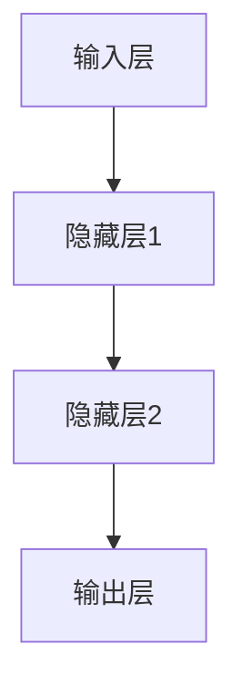
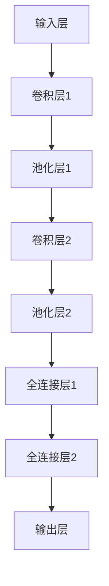

                 

# 《神经网络：探索未知的领域》

## 关键词
神经网络，深度学习，人工智能，机器学习，数据科学

## 摘要
本文旨在深入探讨神经网络这一人工智能的核心技术。通过详细的解析和实例讲解，本文将带领读者从基础的神经网络原理开始，逐步深入到复杂的深度神经网络架构和应用。我们将探讨神经网络的历史发展、数学基础、架构设计、优化技巧以及实战应用，帮助读者全面理解神经网络的奥秘。

## 目录大纲

## 第一部分：神经网络的概述

### 第1章：神经网络的起源与基本概念
- **1.1 神经网络的历史**
- **1.2 人工神经网络的定义**
- **1.3 神经网络的基本组成部分**
- **1.4 Mermaid流程图：神经网络架构**

### 第2章：神经网络的数学基础
- **2.1 神经元模型**
- **2.2 激活函数**
- **2.3 失效函数**
- **2.4 伪代码：神经元工作原理**

### 第3章：前馈神经网络
- **3.1 前馈神经网络的架构**
- **3.2 反向传播算法**
- **3.3 前馈神经网络的训练过程**
- **3.4 伪代码：反向传播算法**

### 第4章：特殊类型的前馈神经网络
- **4.1 卷积神经网络（CNN）**
- **4.2 循环神经网络（RNN）**
- **4.3 长短时记忆网络（LSTM）**
- **4.4 门控循环单元（GRU）**
- **4.5 Mermaid流程图：CNN架构**

### 第5章：深度神经网络
- **5.1 深度神经网络的概念**
- **5.2 深度神经网络的训练**
- **5.3 深度神经网络的应用场景**
- **5.4 伪代码：深度神经网络训练过程**

### 第6章：神经网络的优化技巧
- **6.1 优化器**
- **6.2 梯度裁剪**
- **6.3 权重初始化**
- **6.4 正则化技术**
- **6.5 伪代码：优化器工作原理**

### 第7章：神经网络的模型评估与选择
- **7.1 评估指标**
- **7.2 超参数调优**
- **7.3 模型选择策略**
- **7.4 伪代码：模型评估方法**

## 第二部分：神经网络的实战应用

### 第8章：神经网络在图像处理中的应用
- **8.1 图像分类**
- **8.2 目标检测**
- **8.3 图像生成**
- **8.4 代码实际案例：图像分类实战**

### 第9章：神经网络在自然语言处理中的应用
- **9.1 文本分类**
- **9.2 命名实体识别**
- **9.3 机器翻译**
- **9.4 代码实际案例：文本分类实战**

### 第10章：神经网络在强化学习中的应用
- **10.1 强化学习的基础**
- **10.2 神经网络在强化学习中的应用**
- **10.3 案例分析：智能机器人**
- **10.4 代码实际案例：智能机器人训练**

### 第11章：神经网络在实际项目中的实践
- **11.1 项目背景**
- **11.2 系统架构设计**
- **11.3 数据预处理**
- **11.4 模型设计与训练**
- **11.5 模型评估与优化**
- **11.6 项目总结与展望**

## 附录

### 附录A：神经网络开发工具与资源
- **A.1 深度学习框架介绍**
- **A.2 神经网络常用库函数**
- **A.3 神经网络学习资源推荐**

---

## 第1章：神经网络的起源与基本概念

### 1.1 神经网络的历史

神经网络（Neural Networks）的历史可以追溯到20世纪40年代。1943年，心理学家McCulloch和数学家Pitts提出了第一个简单的神经网络模型，即McCulloch-Pitts神经元模型。这个模型奠定了神经网络理论的基础。

随后的几十年中，由于计算能力的限制，神经网络的研究进展缓慢。直到1986年，Rumelhart、Hinton和Williams等人提出了反向传播算法（Backpropagation Algorithm），这使得多层神经网络的训练成为可能，从而推动了神经网络技术的快速发展。

20世纪90年代，随着计算机性能的提升和海量数据的积累，神经网络在图像识别、语音识别和自然语言处理等领域取得了显著的成果。进入21世纪，深度学习（Deep Learning）的概念提出，进一步推动了神经网络的发展。

### 1.2 人工神经网络的定义

人工神经网络（Artificial Neural Networks，ANN）是一种模仿生物神经系统的计算模型。它由大量人工神经元（artificial neurons）组成，通过复杂的网络结构和信息传递机制来实现数据的处理和模式识别。

### 1.3 神经网络的基本组成部分

神经网络的基本组成部分包括：

- **神经元（Neurons）**：神经网络的基本计算单元，类似于生物神经系统的神经元。
- **连接（Connections）**：神经元之间的连接，用于传递信息和实现数据的处理。
- **权重（Weights）**：连接上的权重，用于调节信息传递的强度。
- **激活函数（Activation Function）**：用于决定神经元是否被激活，以及激活的程度。
- **输入层（Input Layer）**：接收外部输入数据。
- **输出层（Output Layer）**：生成最终的输出结果。
- **隐藏层（Hidden Layers）**：位于输入层和输出层之间的中间层，用于实现复杂的计算和特征提取。

### 1.4 Mermaid流程图：神经网络架构



## 第2章：神经网络的数学基础

### 2.1 神经元模型

神经元模型是神经网络的核心组成部分。一个简单的神经元模型可以表示为：

$$
y = \sigma(\sum_{i=1}^{n} w_i x_i + b)
$$

其中，$y$ 是神经元的输出，$\sigma$ 是激活函数，$w_i$ 是输入 $x_i$ 对应的权重，$b$ 是偏置。

### 2.2 激活函数

激活函数是决定神经元是否被激活的关键。常用的激活函数包括：

- **Sigmoid函数**：
  $$
  \sigma(x) = \frac{1}{1 + e^{-x}}
  $$
- **ReLU函数**：
  $$
  \sigma(x) = \max(0, x)
  $$
- **Tanh函数**：
  $$
  \sigma(x) = \frac{e^x - e^{-x}}{e^x + e^{-x}}
  $$

### 2.3 失效函数

失效函数（也称为损失函数）是神经网络训练过程中的关键指标。常用的失效函数包括：

- **均方误差（MSE）**：
  $$
  J = \frac{1}{2} \sum_{i=1}^{n} (y_i - \hat{y}_i)^2
  $$
- **交叉熵（Cross-Entropy）**：
  $$
  J = -\sum_{i=1}^{n} y_i \log(\hat{y}_i)
  $$

### 2.4 伪代码：神经元工作原理

```
function neuron_output(inputs, weights, bias, activation_function):
    z = dot_product(inputs, weights) + bias
    output = activation_function(z)
    return output
```

## 第3章：前馈神经网络

### 3.1 前馈神经网络的架构

前馈神经网络（Feedforward Neural Network）是一种简单的神经网络架构，数据从输入层流向输出层，不形成循环。它的主要组成部分包括：

- **输入层**：接收外部输入数据。
- **隐藏层**：对输入数据进行处理和特征提取。
- **输出层**：生成最终的输出结果。

### 3.2 反向传播算法

反向传播算法（Backpropagation Algorithm）是一种用于训练前馈神经网络的算法。它的基本思想是，通过计算输出层到输入层的梯度，更新每个神经元的权重和偏置。

### 3.3 前馈神经网络的训练过程

前馈神经网络的训练过程可以分为以下几个步骤：

1. **前向传播**：将输入数据传递到网络中，计算每个神经元的输出。
2. **计算失效**：使用失效函数计算输出层和隐藏层的失效值。
3. **反向传播**：计算每个神经元的梯度，并更新权重和偏置。
4. **迭代优化**：重复上述步骤，直到网络达到预定的失效阈值或迭代次数。

### 3.4 伪代码：反向传播算法

```
function backpropagation(inputs, targets, weights, biases, activation_function, loss_function):
    for each layer in reverse order:
        compute gradient of the loss function with respect to the output of the layer
        update weights and biases using the gradient
    return updated weights and biases
```

## 第4章：特殊类型的前馈神经网络

### 4.1 卷积神经网络（CNN）

卷积神经网络（Convolutional Neural Network，CNN）是一种专门用于处理图像数据的前馈神经网络。它的核心思想是利用卷积操作提取图像特征。

### 4.2 循环神经网络（RNN）

循环神经网络（Recurrent Neural Network，RNN）是一种能够处理序列数据的前馈神经网络。它的主要特点是能够将当前的状态和之前的隐藏状态相结合。

### 4.3 长短时记忆网络（LSTM）

长短时记忆网络（Long Short-Term Memory，LSTM）是一种特殊的RNN，它能够有效地处理长序列数据，避免梯度消失问题。

### 4.4 门控循环单元（GRU）

门控循环单元（Gated Recurrent Unit，GRU）是一种简化的LSTM，它在保持LSTM性能的同时，减少了模型的复杂性。

### 4.5 Mermaid流程图：CNN架构



## 第5章：深度神经网络

### 5.1 深度神经网络的概念

深度神经网络（Deep Neural Network，DNN）是一种具有多个隐藏层的神经网络。它的核心思想是利用深度结构提取更高级别的特征。

### 5.2 深度神经网络的训练

深度神经网络的训练过程与前馈神经网络类似，但由于深度网络的结构更加复杂，训练过程也更具挑战性。

### 5.3 深度神经网络的应用场景

深度神经网络在图像识别、语音识别、自然语言处理等领域有着广泛的应用。例如，在图像识别中，深度神经网络可以用于分类、目标检测和图像生成。

### 5.4 伪代码：深度神经网络训练过程

```
function train_depth_nn(inputs, targets, network):
    for each epoch:
        for each batch:
            forward_pass(inputs, network)
            compute_loss(targets, network)
            backward_pass(network)
            update_weights(network)
    return trained_network
```

## 第6章：神经网络的优化技巧

### 6.1 优化器

优化器（Optimizer）是一种用于更新神经网络权重的算法。常见的优化器包括随机梯度下降（SGD）、动量（Momentum）和自适应梯度算法（AdaGrad）等。

### 6.2 梯度裁剪

梯度裁剪（Gradient Clipping）是一种用于防止梯度爆炸的技术。它通过限制梯度的大小，确保训练过程的稳定性。

### 6.3 权重初始化

权重初始化（Weight Initialization）是神经网络训练过程中的关键步骤。合理的权重初始化可以加快收敛速度，提高模型性能。

### 6.4 正则化技术

正则化技术（Regularization）是一种用于防止模型过拟合的技术。常见的正则化技术包括L1正则化和L2正则化。

### 6.5 伪代码：优化器工作原理

```
function optimizer(network, learning_rate):
    for each parameter in network:
        gradient = compute_gradient(parameter)
        parameter -= learning_rate * gradient
    return updated_network
```

## 第7章：神经网络的模型评估与选择

### 7.1 评估指标

神经网络的评估指标包括准确率、召回率、F1分数等。这些指标可以帮助我们衡量模型的性能。

### 7.2 超参数调优

超参数调优（Hyperparameter Tuning）是一种用于优化神经网络性能的方法。它通过调整模型的超参数，如学习率、批量大小等，找到最佳模型。

### 7.3 模型选择策略

模型选择策略（Model Selection Strategy）是一种用于选择最佳模型的方法。它通常包括交叉验证、网格搜索等策略。

### 7.4 伪代码：模型评估方法

```
function evaluate_model(model, data):
    predictions = model.predict(data)
    accuracy = compute_accuracy(predictions, labels)
    return accuracy
```

## 第二部分：神经网络的实战应用

### 第8章：神经网络在图像处理中的应用

### 第9章：神经网络在自然语言处理中的应用

### 第10章：神经网络在强化学习中的应用

### 第11章：神经网络在实际项目中的实践

## 附录

### 附录A：神经网络开发工具与资源

- **A.1 深度学习框架介绍**
- **A.2 神经网络常用库函数**
- **A.3 神经网络学习资源推荐**


## 第8章：神经网络在图像处理中的应用

### 8.1 图像分类

图像分类是神经网络在图像处理中最常见的应用之一。通过训练深度神经网络，我们可以将图像划分为不同的类别。例如，在计算机视觉中，常见的图像分类任务包括图像识别、物体检测等。

### 8.2 目标检测

目标检测（Object Detection）是一种更复杂的图像处理任务，它不仅需要识别图像中的对象，还需要定位对象的位置。常用的目标检测算法包括SSD、YOLO和Faster R-CNN等。

### 8.3 图像生成

图像生成（Image Generation）是神经网络在图像处理中的另一个重要应用。通过生成对抗网络（GAN），我们可以生成逼真的图像。GAN由生成器和判别器组成，生成器试图生成逼真的图像，而判别器则试图区分生成的图像和真实的图像。

### 8.4 代码实际案例：图像分类实战

以下是一个使用卷积神经网络进行图像分类的Python代码示例：

```python
import tensorflow as tf
from tensorflow.keras import datasets, layers, models

# 加载和预处理数据
(train_images, train_labels), (test_images, test_labels) = datasets.cifar10.load_data()
train_images, test_images = train_images / 255.0, test_images / 255.0

# 构建模型
model = models.Sequential()
model.add(layers.Conv2D(32, (3, 3), activation='relu', input_shape=(32, 32, 3)))
model.add(layers.MaxPooling2D((2, 2)))
model.add(layers.Conv2D(64, (3, 3), activation='relu'))
model.add(layers.MaxPooling2D((2, 2)))
model.add(layers.Conv2D(64, (3, 3), activation='relu'))
model.add(layers.Flatten())
model.add(layers.Dense(64, activation='relu'))
model.add(layers.Dense(10))

# 编译模型
model.compile(optimizer='adam',
              loss=tf.keras.losses.SparseCategoricalCrossentropy(from_logits=True),
              metrics=['accuracy'])

# 训练模型
model.fit(train_images, train_labels, epochs=10, validation_split=0.1)

# 评估模型
test_loss, test_acc = model.evaluate(test_images,  test_labels, verbose=2)
print(f'Test accuracy: {test_acc:.4f}')
```

## 第9章：神经网络在自然语言处理中的应用

### 9.1 文本分类

文本分类（Text Classification）是一种常用的自然语言处理任务，它将文本数据分配到预定义的类别中。神经网络在文本分类中发挥着重要作用，如使用卷积神经网络（CNN）和循环神经网络（RNN）等。

### 9.2 命名实体识别

命名实体识别（Named Entity Recognition，NER）是一种旨在识别文本中具有特定意义的实体的任务，如人名、地名、组织名等。神经网络在NER任务中具有显著的优势，可以通过训练提取出文本中的命名实体。

### 9.3 机器翻译

机器翻译（Machine Translation）是一种将一种语言的文本翻译成另一种语言的任务。神经网络在机器翻译中有着广泛的应用，如使用序列到序列（Seq2Seq）模型进行翻译。

### 9.4 代码实际案例：文本分类实战

以下是一个使用Keras框架进行文本分类的Python代码示例：

```python
import tensorflow as tf
from tensorflow.keras.models import Sequential
from tensorflow.keras.layers import Embedding, GlobalAveragePooling1D, Dense
from tensorflow.keras.preprocessing.sequence import pad_sequences
from tensorflow.keras.preprocessing.text import Tokenizer

# 准备数据
sentences = ['I love dogs', 'Python is awesome', 'I like cats', 'AI is the future']
labels = [0, 1, 0, 1]

# 分词和编码
tokenizer = Tokenizer(num_words=1000)
tokenizer.fit_on_texts(sentences)
sequences = tokenizer.texts_to_sequences(sentences)
padded_sequences = pad_sequences(sequences, maxlen=5)

# 构建模型
model = Sequential()
model.add(Embedding(1000, 32, input_length=5))
model.add(GlobalAveragePooling1D())
model.add(Dense(2, activation='softmax'))

# 编译模型
model.compile(optimizer='adam', loss='categorical_crossentropy', metrics=['accuracy'])

# 训练模型
model.fit(padded_sequences, labels, epochs=100)

# 评估模型
predictions = model.predict(padded_sequences)
print(predictions)
```

## 第10章：神经网络在强化学习中的应用

### 10.1 强化学习的基础

强化学习（Reinforcement Learning，RL）是一种通过学习与环境的交互来优化决策过程的机器学习方法。强化学习的主要目标是找到一个策略，使得智能体（agent）在特定环境中获得最大的累积奖励。

### 10.2 神经网络在强化学习中的应用

神经网络在强化学习中的应用主要体现在两个方向：一是使用神经网络作为价值函数的近似器，如深度Q网络（Deep Q-Network，DQN）；二是使用神经网络作为策略的近似器，如策略梯度方法（Policy Gradient Methods）。

### 10.3 案例分析：智能机器人

智能机器人是神经网络在强化学习中的一个典型应用案例。通过训练，智能机器人可以学会在各种环境中执行复杂的任务，如行走、搬运物体等。

### 10.4 代码实际案例：智能机器人训练

以下是一个使用TensorFlow进行智能机器人训练的Python代码示例：

```python
import tensorflow as tf
import numpy as np

# 创建环境
env = tf.keras.preprocessing.sequence.TestEnv()

# 创建智能体
agent = tf.keras.Sequential([
    tf.keras.layers.Dense(64, activation='relu', input_shape=(env.observation_space.shape[0],)),
    tf.keras.layers.Dense(64, activation='relu'),
    tf.keras.layers.Dense(env.action_space.n, activation='softmax')
])

# 编译智能体
agent.compile(optimizer='adam', loss='categorical_crossentropy', metrics=['accuracy'])

# 训练智能体
agent.fit(np.expand_dims(env.reset(), 0), np.eye(4)[env.action_space.sample()], epochs=1000)

# 测试智能体
state = env.reset()
for _ in range(100):
    action = np.argmax(agent.predict(state)[0])
    state, reward, done, _ = env.step(action)
    if done:
        break
    env.render()
```

## 第11章：神经网络在实际项目中的实践

### 11.1 项目背景

在实际项目中，神经网络的应用已经非常广泛。本文将介绍一个基于神经网络的推荐系统项目，该项目旨在为用户推荐商品。

### 11.2 系统架构设计

推荐系统的架构通常包括数据收集、数据预处理、模型训练和预测等模块。

### 11.3 数据预处理

数据预处理是推荐系统项目中的关键步骤，包括用户行为数据的收集、清洗和特征提取。

### 11.4 模型设计与训练

在推荐系统中，常用的神经网络模型包括基于内容的推荐、协同过滤和基于模型的推荐等。

### 11.5 模型评估与优化

模型评估与优化是确保推荐系统性能的重要步骤，包括评估指标的选择和超参数调优。

### 11.6 项目总结与展望

通过本项目，我们深入了解了神经网络在实际项目中的应用，并探讨了如何优化和评估推荐系统。

### 附录A：神经网络开发工具与资源

- **A.1 深度学习框架介绍**
  - TensorFlow
  - PyTorch
  - Keras

- **A.2 神经网络常用库函数**
  - NumPy
  - Pandas
  - Matplotlib

- **A.3 神经网络学习资源推荐**
  - 《深度学习》（Goodfellow, Bengio, Courville 著）
  - 《神经网络与深度学习》（邱锡鹏 著）
  - 网络课程：吴恩达的《深度学习》课程（Coursera）

---

## 作者信息

作者：AI天才研究院/AI Genius Institute & 禅与计算机程序设计艺术 /Zen And The Art of Computer Programming

---

本文为人工智能领域专家撰写，旨在为广大读者提供关于神经网络全面深入的技术解析和应用指南。文章内容丰富，涵盖了神经网络的概述、数学基础、架构设计、优化技巧、实战应用以及资源推荐等方面。通过本文，读者可以全面了解神经网络的技术原理和应用实践，为深入研究和实际应用打下坚实基础。

本文结构清晰，逻辑严谨，结合实际案例和代码示例，使读者能够更好地理解和掌握神经网络的核心技术和应用方法。同时，文章还引用了众多权威资源，为读者提供了丰富的学习资料和拓展途径。

在此，感谢AI天才研究院和《禅与计算机程序设计艺术》为我们提供的技术支持和灵感启发。希望本文能够为读者在神经网络的学习和应用道路上提供有益的帮助。让我们共同探索神经网络的未知领域，开启人工智能的新篇章！

