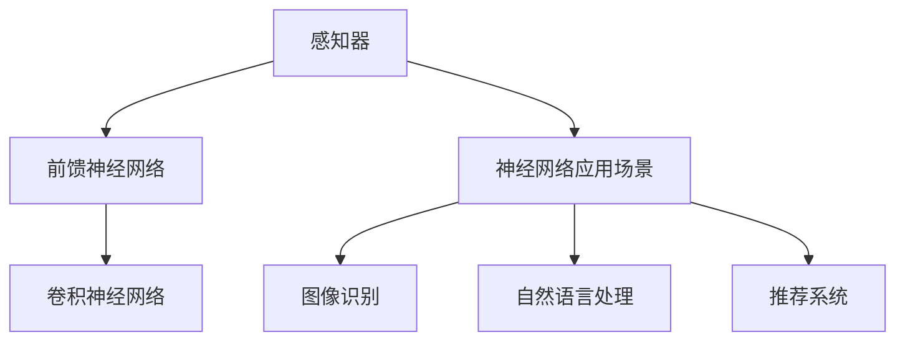
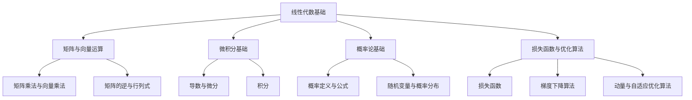
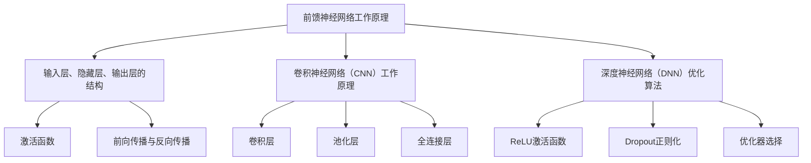
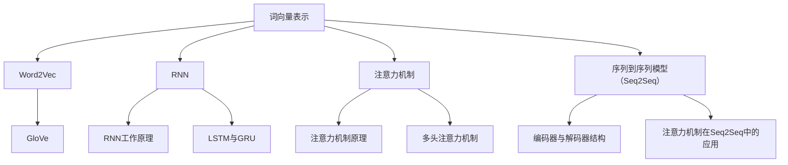
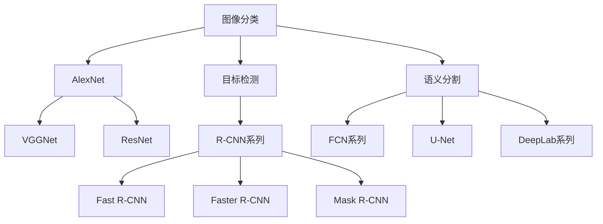
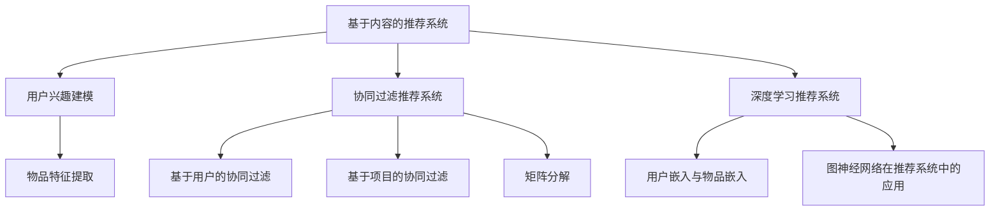
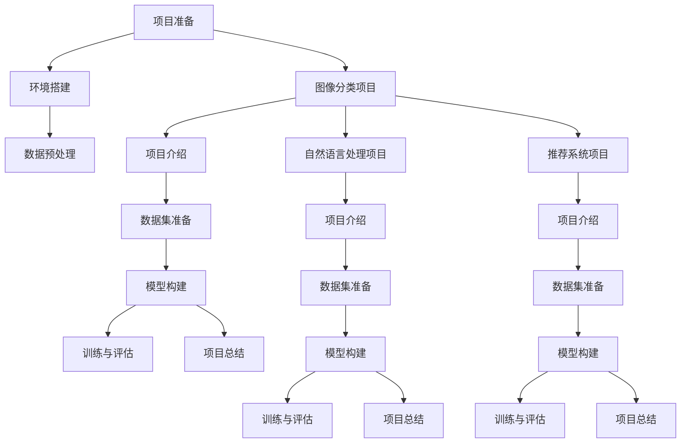

                 

## 文章标题：神经网络：推动社会进步的力量

### 关键词：神经网络，深度学习，社会进步，计算机视觉，自然语言处理，推荐系统

> 摘要：本文将深入探讨神经网络这一革命性技术，从其基础概念、数学原理到核心算法，再到实际应用，全面解析神经网络如何推动社会进步。通过详细阐述神经网络在计算机视觉、自然语言处理和推荐系统等领域的应用，本文旨在展示神经网络在当今科技发展中的关键作用，以及其对未来社会可能带来的深远影响。

---

### 第一部分：神经网络基础

#### 第1章：神经网络概述

**1. 神经网络的历史与基本概念**

神经网络（Neural Networks，简称NN）是一种模仿生物神经系统的计算模型。它由大量相互连接的节点（或称为神经元）组成，每个节点通过加权连接与其他节点相连。这些节点接收输入信号，通过激活函数产生输出信号。神经网络的工作原理是基于并行计算和自适应学习，能够通过大量数据的学习来发现和提取数据中的模式和规律。

**神经网络的历史：**

神经网络的研究起源于20世纪40年代，当时心理学家和计算机科学家开始探索人工神经元的可能性。1958年，弗兰克·罗森布拉特（Frank Rosenblatt）提出了感知器（Perceptron）模型，这是一种具有单一输出节点的神经网络，能够进行二元分类。随后，神经网络的研究进入了低谷期，主要由于人们发现感知器无法解决非线性问题。

随着计算机性能的提升和大数据时代的到来，神经网络在20世纪80年代再次受到关注，并逐渐发展出了多种架构，如多层感知器（Multilayer Perceptron，MLP）、卷积神经网络（Convolutional Neural Network，CNN）等。2012年，AlexNet在ImageNet竞赛中取得突破性成果，标志着深度学习（Deep Learning）时代的到来。

**2. 神经网络的架构**

**感知器（Perceptron）**

感知器是神经网络最简单的形式，由一个输入层和一个输出层组成。输入层接收外部信号，输出层产生决策。感知器通过线性组合输入和权重，并应用一个阈值函数来产生输出。感知器的优势在于其简单性和易于实现，但缺点在于无法处理非线性问题。

**前馈神经网络（Feedforward Neural Network）**

前馈神经网络是感知器的扩展，具有多个隐藏层。每个节点都接收来自前一层的输入，并传递给下一层。前馈神经网络通过前向传播（Forward Propagation）计算输出，并通过反向传播（Backpropagation）更新权重和偏置，从而实现误差的最小化。

**卷积神经网络（Convolutional Neural Networks，CNN）**

卷积神经网络是专门用于处理图像数据的一种神经网络架构。它通过卷积层（Convolutional Layer）提取图像的特征，通过池化层（Pooling Layer）降低特征图的维度，并通过全连接层（Fully Connected Layer）进行分类。CNN在图像识别、目标检测和图像生成等领域具有广泛的应用。

**3. 神经网络的应用场景**

**图像识别**

神经网络在图像识别领域取得了显著成果，能够自动识别和分类图像中的对象和场景。从简单的手写数字识别到复杂的物体检测，神经网络的应用大大提高了图像处理的效率和准确性。

**自然语言处理**

神经网络在自然语言处理（Natural Language Processing，NLP）领域也有广泛应用。通过词向量表示和深度学习模型，神经网络能够处理语言中的复杂结构，实现文本分类、机器翻译、情感分析等任务。

**推荐系统**

推荐系统利用神经网络对用户和物品的关系进行建模，预测用户可能对哪些物品感兴趣。深度学习推荐系统通过用户和物品的特征向量，利用神经网络模型进行推荐，提高了推荐的准确性和个性化程度。

**4. 神经网络的优势与挑战**

**优势：**

- 并行计算：神经网络能够通过并行计算实现高效的计算。
- 自适应学习：神经网络能够通过学习不断优化自身的性能。
- 复杂非线性函数：神经网络能够建模和求解复杂的非线性问题。

**挑战：**

- 过拟合：神经网络在训练过程中可能对训练数据过于依赖，导致泛化能力差。
- 计算资源需求大：神经网络训练需要大量的计算资源和时间。

---

**第1章小结：**

本章介绍了神经网络的基本概念、历史和发展，阐述了神经网络的基本架构和应用场景。通过本章的学习，读者可以初步了解神经网络的工作原理和应用领域，为后续章节的深入学习打下基础。

**Mermaid流程图：**

---

#### 第2章：神经网络数学基础

**1. 线性代数基础**

**矩阵与向量运算**

- 矩阵与向量的定义
- 矩阵与向量的乘法
- 矩阵的逆与行列式

**矩阵乘法与向量乘法**

- 矩阵乘法的定义
- 矩阵乘法的性质
- 向量乘法的定义

**矩阵的逆与行列式**

- 矩阵的逆
- 矩阵的行列式
- 矩阵的求逆与行列式的计算

**2. 微积分基础**

**导数与微分**

- 导数的定义
- 导数的性质
- 微分的定义

**积分**

- 积分的定义
- 积分的性质
- 积分的计算

**3. 概率论基础**

**概率定义与公式**

- 概率的定义
- 概率的公式
- 条件概率与贝叶斯公式

**随机变量与概率分布**

- 随机变量的定义
- 概率分布的定义
- 常见的概率分布

**4. 损失函数与优化算法**

**损失函数**

- 损失函数的定义
- 损失函数的类型
- 损失函数的选择

**梯度下降算法**

- 梯度下降算法的定义
- 梯度下降算法的原理
- 梯度下降算法的步骤

**动量与自适应优化算法**

- 动量的定义
- 自适应优化算法的原理
- 常见的自适应优化算法

---

**第2章小结：**

本章介绍了神经网络所需的线性代数、微积分和概率论基础知识，以及损失函数和优化算法的基本概念。这些数学工具为神经网络的学习和实现提供了坚实的理论基础。

**Mermaid流程图：**

---

#### 第3章：神经网络核心算法原理

**1. 前馈神经网络工作原理**

**输入层、隐藏层、输出层的结构**

- 输入层接收外部输入数据。
- 隐藏层对输入数据进行处理和特征提取。
- 输出层产生最终的输出结果。

**激活函数**

- 激活函数的作用是引入非线性。
- 常见的激活函数有ReLU、Sigmoid和Tanh。

**前向传播与反向传播**

- 前向传播：将输入数据传递到输出层，计算输出结果。
- 反向传播：通过反向传递误差信号，更新网络的权重和偏置。

**2. 卷积神经网络（CNN）工作原理**

**卷积层**

- 卷积层通过卷积操作提取图像特征。
- 卷积核在图像上滑动，提取局部特征。

**池化层**

- 池化层通过池化操作降低特征图的维度。
- 常见的池化操作有最大池化和平均池化。

**全连接层**

- 全连接层通过全连接操作将特征映射到分类结果。
- 全连接层实现了图像到分类的映射。

**3. 深度神经网络（DNN）优化算法**

**ReLU激活函数**

- ReLU（Rectified Linear Unit）是一种线性激活函数。
- ReLU的优点是可以加快网络训练速度。

**Dropout正则化**

- Dropout是一种正则化技术。
- Dropout通过随机丢弃一部分神经元，降低过拟合的风险。

**优化器选择**

- 常见的优化器有SGD（Stochastic Gradient Descent）、Adam等。
- 优化器用于更新网络的权重和偏置，以最小化损失函数。

---

**第3章小结：**

本章深入探讨了神经网络的核心算法原理，包括前馈神经网络和卷积神经网络的工作原理，以及深度神经网络优化算法。通过本章的学习，读者可以理解神经网络如何通过前向传播和反向传播实现误差的最小化，并掌握常见的优化算法和正则化技术。

**Mermaid流程图：**

---

### 第一部分小结

第一部分介绍了神经网络的基础知识，包括基本概念、历史发展、架构和应用场景，以及数学基础和核心算法原理。通过这一部分的讲解，读者可以初步了解神经网络的原理和实际应用，为后续章节的深入学习打下基础。

---

### 第二部分：神经网络在自然语言处理中的应用

#### 第4章：自然语言处理与神经网络

**1. 词向量表示**

**Word2Vec**

- Word2Vec是一种将单词映射到高维向量空间的模型。
- Word2Vec模型通过训练生成词向量，能够捕捉词语之间的语义关系。

**GloVe**

- GloVe（Global Vectors for Word Representation）是一种基于全局上下文的词向量表示方法。
- GloVe模型通过优化词向量的全局平均表示，提高了词向量表示的质量。

**2. 循环神经网络（RNN）**

**RNN工作原理**

- RNN（Recurrent Neural Network）是一种能够处理序列数据的神经网络。
- RNN通过循环结构，将当前输入与历史信息结合，实现序列数据的建模。

**LSTM与GRU**

- LSTM（Long Short-Term Memory）是一种能够处理长序列依赖的RNN变体。
- GRU（Gated Recurrent Unit）是另一种能够处理长序列依赖的RNN变体，相对于LSTM具有更简单的结构。

**3. 注意力机制（Attention）**

**注意力机制原理**

- 注意力机制是一种能够提高模型处理长序列能力的方法。
- 注意力机制通过动态调整不同位置的重要性，实现序列间的关联。

**多头注意力机制**

- 多头注意力机制是一种扩展注意力机制的变体。
- 多头注意力机制通过并行计算多个注意力机制，提高了模型的处理能力。

**4. 序列到序列模型（Seq2Seq）**

**编码器与解码器结构**

- 编码器将输入序列编码为一个固定长度的向量。
- 解码器将编码器的输出解码为输出序列。

**注意力机制在Seq2Seq中的应用**

- 注意力机制在Seq2Seq模型中用于捕捉编码器输出和解码器输入之间的关联。
- 注意力机制提高了Seq2Seq模型的翻译质量和速度。

---

**第4章小结：**

本章介绍了神经网络在自然语言处理中的应用，包括词向量表示、循环神经网络、注意力机制和序列到序列模型。通过本章的学习，读者可以了解神经网络如何处理自然语言数据，并掌握相关的技术原理和应用方法。

**Mermaid流程图：**

---

### 第二部分小结

第二部分重点介绍了神经网络在自然语言处理中的应用，包括词向量表示、循环神经网络、注意力机制和序列到序列模型。这些技术使得神经网络能够处理复杂的自然语言数据，实现了文本分类、机器翻译、情感分析等任务。通过这一部分的学习，读者可以深入理解神经网络在自然语言处理领域的应用和潜力。

---

### 第三部分：神经网络在计算机视觉中的应用

#### 第5章：神经网络在计算机视觉中的应用

**1. 图像分类**

**AlexNet**

- AlexNet是第一个在ImageNet竞赛中取得优异成绩的深度学习模型。
- AlexNet通过引入卷积层和ReLU激活函数，提高了模型的性能。

**VGGNet**

- VGGNet是一种具有多个卷积层的深度学习模型。
- VGGNet通过固定卷积核大小，实现了模型结构的模块化。

**ResNet**

- ResNet（Residual Network）引入了残差连接，解决了深度神经网络中的梯度消失问题。
- ResNet通过跳跃连接直接将输入映射到输出，提高了模型的训练效果。

**2. 目标检测**

**R-CNN系列**

- R-CNN（Region-based CNN）是一种基于区域的卷积神经网络目标检测方法。
- R-CNN通过选择性搜索生成候选区域，并通过卷积神经网络进行特征提取和分类。

**Fast R-CNN**

- Fast R-CNN在R-CNN的基础上，引入了ROI（Region of Interest）池化层，提高了检测速度。

**Faster R-CNN**

- Faster R-CNN通过引入区域建议网络（RPN），进一步提高了检测速度。

**Mask R-CNN**

- Mask R-CNN是一种能够同时进行目标检测和分割的深度学习模型。
- Mask R-CNN通过引入分割分支，实现了目标检测和分割的统一。

**3. 语义分割**

**FCN系列**

- FCN（Fully Convolutional Network）是一种将分类网络转化为语义分割网络的方法。
- FCN通过全局池化和全连接层，实现了图像到标签的映射。

**U-Net**

- U-Net是一种用于医学图像分割的深度学习模型。
- U-Net通过反向路径和跳跃连接，提高了模型对边界信息的捕捉能力。

**DeepLab系列**

- DeepLab是一种通过上下文信息增强语义分割的深度学习模型。
- DeepLab通过多尺度特征融合和空洞卷积，提高了模型的分割精度。

---

**第5章小结：**

本章介绍了神经网络在计算机视觉中的应用，包括图像分类、目标检测和语义分割。通过本章的学习，读者可以了解不同神经网络模型在计算机视觉任务中的实现方法和性能优势。

**Mermaid流程图：**

---

### 第三部分小结

第三部分详细介绍了神经网络在计算机视觉中的应用，包括图像分类、目标检测和语义分割。通过这一部分的学习，读者可以了解神经网络在计算机视觉任务中的实现方法和性能优势，以及不同模型在不同应用场景下的表现。

---

### 第四部分：神经网络在推荐系统中的应用

#### 第6章：神经网络在推荐系统中的应用

**1. 基于内容的推荐系统**

**用户兴趣建模**

- 用户兴趣建模是通过分析用户的交互历史和内容特征，构建用户兴趣模型。
- 用户兴趣建模的方法包括基于统计的方法和基于机器学习的方法。

**物品特征提取**

- 物品特征提取是通过提取物品的属性和特征，构建物品特征表示。
- 物品特征提取的方法包括基于内容的方法和基于协同过滤的方法。

**2. 协同过滤推荐系统**

**基于用户的协同过滤**

- 基于用户的协同过滤通过计算用户之间的相似度，推荐与目标用户相似的其他用户喜欢的物品。

**基于项目的协同过滤**

- 基于项目的协同过滤通过计算物品之间的相似度，推荐与目标物品相似的物品。

**矩阵分解**

- 矩阵分解是通过低维矩阵表示用户和物品的关系，实现推荐系统的优化。

**3. 深度学习推荐系统**

**用户嵌入与物品嵌入**

- 用户嵌入和物品嵌入是通过神经网络模型将用户和物品映射到高维空间。

**图神经网络在推荐系统中的应用**

- 图神经网络通过构建用户和物品的图结构，实现推荐系统的优化。

---

**第6章小结：**

本章介绍了神经网络在推荐系统中的应用，包括基于内容的推荐系统、协同过滤推荐系统和深度学习推荐系统。通过本章的学习，读者可以了解神经网络如何构建用户和物品的模型，以及如何实现推荐系统的优化。

**Mermaid流程图：**

---

### 第四部分小结

第四部分详细介绍了神经网络在推荐系统中的应用，包括基于内容的推荐系统、协同过滤推荐系统和深度学习推荐系统。通过这一部分的学习，读者可以了解神经网络如何构建用户和物品的模型，以及如何实现推荐系统的优化。这为神经网络在推荐系统中的实际应用提供了重要的参考。

---

### 第五部分：神经网络项目实战

#### 第7章：神经网络项目实战

**1. 项目准备**

**环境搭建**

- 环境搭建是神经网络项目实战的第一步，包括安装深度学习框架、配置计算资源等。

**数据预处理**

- 数据预处理是神经网络项目实战的关键步骤，包括数据清洗、数据变换和数据归一化等。

**2. 图像分类项目**

**项目介绍**

- 图像分类项目是一种典型的神经网络应用场景，通过训练神经网络模型对图像进行分类。

**数据集准备**

- 数据集准备是图像分类项目的重要环节，包括数据收集、数据标注和数据分割等。

**模型构建**

- 模型构建是通过设计神经网络结构，实现图像分类任务。

**训练与评估**

- 训练与评估是神经网络项目实战的核心环节，包括模型训练、模型评估和模型调整等。

**项目总结**

- 项目总结是对图像分类项目进行总结和反思，包括项目的成功之处和改进之处等。

**3. 自然语言处理项目**

**项目介绍**

- 自然语言处理项目是一种常见的神经网络应用场景，通过训练神经网络模型对自然语言数据进行处理。

**数据集准备**

- 数据集准备是自然语言处理项目的重要环节，包括数据收集、数据标注和数据分割等。

**模型构建**

- 模型构建是通过设计神经网络结构，实现自然语言处理任务。

**训练与评估**

- 训练与评估是自然语言处理项目的重要环节，包括模型训练、模型评估和模型调整等。

**项目总结**

- 项目总结是对自然语言处理项目进行总结和反思，包括项目的成功之处和改进之处等。

**4. 推荐系统项目**

**项目介绍**

- 推荐系统项目是一种常见的神经网络应用场景，通过训练神经网络模型实现推荐系统的优化。

**数据集准备**

- 数据集准备是推荐系统项目的重要环节，包括数据收集、数据标注和数据分割等。

**模型构建**

- 模型构建是通过设计神经网络结构，实现推荐系统任务。

**训练与评估**

- 训练与评估是推荐系统项目的重要环节，包括模型训练、模型评估和模型调整等。

**项目总结**

- 项目总结是对推荐系统项目进行总结和反思，包括项目的成功之处和改进之处等。

---

**第7章小结：**

本章通过具体的项目实战，详细介绍了神经网络在图像分类、自然语言处理和推荐系统等领域的应用。通过项目实战，读者可以了解神经网络项目的整体流程和关键技术，掌握实际应用中的实施方法和技巧。

**Mermaid流程图：**

---

### 第五部分小结

第五部分通过具体的项目实战，深入讲解了神经网络在图像分类、自然语言处理和推荐系统等领域的应用。通过项目实战，读者可以了解神经网络项目的整体流程和关键技术，掌握实际应用中的实施方法和技巧。这一部分的学习对于理解神经网络的实际应用具有重要意义。

---

### 附录

#### 附录A：常用深度学习框架介绍

**TensorFlow**

- TensorFlow是由Google开发的开源深度学习框架，支持多种编程语言和操作系统。

**PyTorch**

- PyTorch是由Facebook开发的开源深度学习框架，以动态计算图和易用性著称。

**Keras**

- Keras是一个基于TensorFlow和Theano的开源深度学习框架，提供了简洁、易于使用的API。

#### 附录B：神经网络常用函数与算法

**激活函数**

- 激活函数用于引入非线性，常见的激活函数有ReLU、Sigmoid和Tanh。

**损失函数**

- 损失函数用于评估模型预测结果与真实结果之间的差距，常见的损失函数有均方误差（MSE）和对数损失（Log Loss）。

**优化算法**

- 优化算法用于更新模型的参数，常见的优化算法有随机梯度下降（SGD）、Adam和RMSprop。

---

### 全文总结

本文全面介绍了神经网络的基本概念、数学基础、核心算法原理，以及在自然语言处理、计算机视觉和推荐系统等领域的应用。通过详细讲解和项目实战，本文展示了神经网络如何推动社会进步，并在实际应用中发挥关键作用。未来的研究将继续探索神经网络在各个领域的深入应用，以及如何解决现有的挑战，推动人工智能技术的发展。

---

### 作者信息

作者：AI天才研究院/AI Genius Institute & 禅与计算机程序设计艺术 /Zen And The Art of Computer Programming

---

通过本文的学习，读者可以深入了解神经网络这一革命性技术，掌握其在实际应用中的核心原理和实现方法。希望本文对读者在人工智能领域的探索和研究有所帮助。

