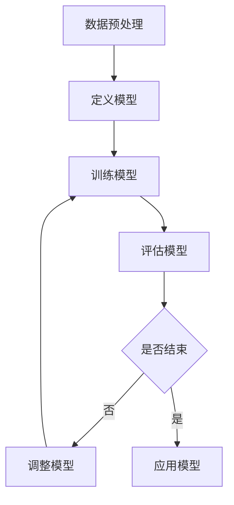
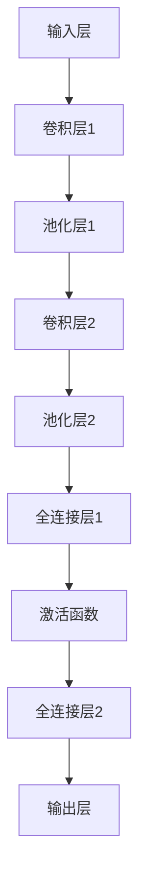
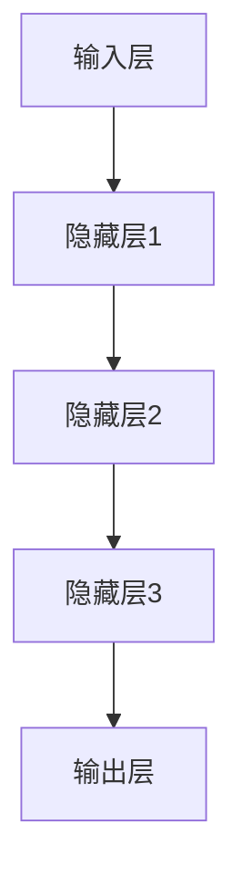

                 

### 文章标题：神经网络：推动社会进步的力量

#### 关键词：
- 神经网络
- 深度学习
- 社会应用
- 人工智能
- 发展趋势

#### 摘要：
本文将深入探讨神经网络这一人工智能领域的关键技术，分析其基本概念、原理和架构，并展示其在不同社会领域的广泛应用。从基本的人工神经元模型到复杂的卷积神经网络和循环神经网络，我们将逐步了解神经网络如何通过技术创新推动社会进步。本文还将探讨神经网络在金融、医疗、交通和安全等领域的实际应用案例，并展望其在未来社会中的发展潜力。通过这篇详尽的技术博客，读者将全面认识神经网络的技术原理和社会价值。

### 《神经网络：推动社会进步的力量》目录大纲

#### 第一部分：神经网络基础

##### 第1章：神经网络概述

- **1.1 神经网络的基本概念**
  - 神经网络起源
  - 神经网络基本结构

- **1.2 神经网络在计算机中的应用**
  - 图像识别
  - 自然语言处理
  - 机器学习

- **1.3 神经网络的发展历史**
  - 深度学习的兴起
  - 神经网络的复兴

##### 第2章：人工神经元的模型

- **2.1 人工神经元的原理**
  - 单层感知机
  - 多层感知机

- **2.2 神经网络的激活函数**
  - Sigmoid函数
  - ReLU函数

- **2.3 反向传播算法**
  - 前向传播
  - 反向传播

##### 第3章：多层感知机

- **3.1 多层感知机的基本概念**
  - 结构与功能

- **3.2 多层感知机的训练方法**
  - 随机梯度下降
  - 小批量梯度下降

- **3.3 多层感知机的应用案例**
  - 逻辑回归
  - 手写数字识别

##### 第4章：卷积神经网络

- **4.1 卷积神经网络的基本原理**
  - 卷积层
  - 池化层

- **4.2 卷积神经网络的应用**
  - 图像分类
  - 图像生成

- **4.3 卷积神经网络的变体**
  - 卷积神经网络（CNN）
  - 残差网络（ResNet）

##### 第5章：循环神经网络

- **5.1 循环神经网络的基本原理**
  - 隐藏状态
  - 循环连接

- **5.2 循环神经网络的应用**
  - 语音识别
  - 语言模型

- **5.3 循环神经网络的变体**
  - 长短时记忆网络（LSTM）
  - 门控循环单元（GRU）

#### 第二部分：神经网络在社会中的应用

##### 第6章：神经网络在金融领域的应用

- **6.1 金融市场预测**
  - 股票价格预测
  - 外汇交易预测

- **6.2 风险管理**
  - 信用评分
  - 信贷风险预测

##### 第7章：神经网络在医疗领域的应用

- **7.1 医学图像分析**
  - 病变检测
  - 肿瘤分割

- **7.2 个性化治疗**
  - 精准医疗
  - 基因突变检测

##### 第8章：神经网络在交通领域的应用

- **8.1 自动驾驶技术**
  - 传感器数据处理
  - 车辆控制

- **8.2 智能交通系统**
  - 交通流量预测
  - 城市交通管理

##### 第9章：神经网络在安全领域的应用

- **9.1 安全入侵检测**
  - 网络安全
  - 系统安全

- **9.2 生物特征识别**
  - 指纹识别
  - 脸部识别

##### 第10章：神经网络在未来社会中的展望

- **10.1 人工智能与人类社会**
  - 人工智能的伦理问题
  - 人工智能的未来发展

- **10.2 神经网络对社会进步的贡献**
  - 教育变革
  - 工作方式变革

#### 附录

##### 附录A：神经网络学习资源

- **A.1 主流神经网络框架**
  - TensorFlow
  - PyTorch

- **A.2 神经网络学习指南**

##### 附录B：神经网络相关Mermaid流程图

- **B.1 深度学习基本流程**
- **B.2 卷积神经网络结构**
- **B.3 循环神经网络结构**

##### 附录C：神经网络相关数学公式

- **C.1 神经网络损失函数**
- **C.2 反向传播算法**
- **C.3 激活函数**

##### 附录D：神经网络项目实战案例

- **D.1 金融预测项目**
- **D.2 医学图像分析项目**
- **D.3 自动驾驶项目**

### 第一部分：神经网络基础

#### 第1章：神经网络概述

##### 1.1 神经网络的基本概念

神经网络是一种模仿生物神经系统的计算模型，由大量的简单计算单元（即神经元）通过复杂的网络结构连接而成。神经网络的基本概念起源于20世纪40年代，当时心理学家和计算机科学家开始探讨如何通过模拟人脑的结构和功能来实现计算。

**神经网络起源**

神经网络的概念最初由心理学家沃伦·麦卡洛克（Warren McCulloch）和数学家沃尔特·皮茨（Walter Pitts）在1943年提出，他们定义了一种简单的计算单元，称为“麦卡洛克-皮茨神经元”。随后，心理学家弗兰克·罗森布拉特（Frank Rosenblatt）在1957年发明了感知机（Perceptron），这是一种基于线性模型的神经网络，能够进行简单的分类任务。

**神经网络基本结构**

神经网络的基本结构包括输入层、隐藏层和输出层。每个层由多个神经元组成，神经元之间通过权重连接。输入层的神经元接收外部输入信号，隐藏层的神经元对输入信号进行处理和变换，输出层的神经元产生最终输出。

- **输入层（Input Layer）**：接收外部输入信号，如数字、图像或文本。
- **隐藏层（Hidden Layers）**：对输入信号进行处理和变换，隐藏层的数量和神经元数量可以根据问题复杂度进行调整。
- **输出层（Output Layer）**：产生最终输出，如分类标签、预测值或控制信号。

神经网络通过调整神经元之间的权重来实现学习过程。每个神经元根据其输入信号和权重计算出输出，并通过激活函数进行非线性变换，从而实现复杂的计算和决策。

##### 1.2 神经网络在计算机中的应用

神经网络在计算机科学和人工智能领域具有广泛的应用。以下是神经网络在计算机中的几个主要应用领域：

- **图像识别（Image Recognition）**：神经网络可以用于对图像进行分类和识别。通过训练神经网络模型，可以使其学会识别不同类别的图像，如人脸识别、物体识别等。

- **自然语言处理（Natural Language Processing, NLP）**：神经网络在自然语言处理领域具有重要作用，可以用于语言理解、文本生成、机器翻译等任务。通过神经网络模型，可以理解自然语言中的语义和句法结构。

- **机器学习（Machine Learning）**：神经网络是一种重要的机器学习模型，可以用于分类、回归、聚类等任务。神经网络通过学习大量数据，可以提取出有用的特征并进行预测。

##### 1.3 神经网络的发展历史

神经网络的发展经历了多个阶段，从最初的简单模型到现代复杂的深度学习模型。

- **1940s-1950s**：神经网络概念的提出和感知机的发明。
- **1960s-1970s**：神经网络研究的初步发展，但受到线性模型的限制。
- **1980s-1990s**：反向传播算法的提出和多层感知机的应用，神经网络研究进入新阶段。
- **2006年至今**：深度学习的兴起，神经网络在计算机视觉、语音识别、自然语言处理等领域取得显著成果。

深度学习（Deep Learning）是指使用具有多个隐藏层的神经网络进行训练和学习的方法。深度学习的兴起得益于计算能力的提升和大规模数据集的可用性，使得神经网络能够解决更复杂的任务。

##### 总结

神经网络作为一种强大的计算模型，通过模仿生物神经系统的工作原理，实现了复杂的计算和决策。神经网络在计算机科学和人工智能领域具有广泛的应用，包括图像识别、自然语言处理和机器学习等。随着深度学习的兴起，神经网络的研究和应用取得了重大进展，为人工智能的发展做出了重要贡献。

#### 第2章：人工神经元的模型

##### 2.1 人工神经元的原理

人工神经元是神经网络的基本构建单元，其原理和结构在很大程度上模仿了生物神经元。人工神经元的基本原理包括接收输入信号、通过权重计算和激活函数产生输出。

**单层感知机**

单层感知机（Perceptron）是最简单的人工神经元模型，由输入层和输出层组成。输入层的每个神经元接收一个输入信号，并通过权重与输出层的神经元相连。输出层的神经元根据输入信号和权重计算输出。

单层感知机的工作原理可以描述如下：

1. **输入信号**：每个输入信号通过输入层传递到输出层。
2. **权重计算**：输出层的每个神经元将输入信号与其对应的权重相乘，并求和。
3. **激活函数**：求和结果通过激活函数进行非线性变换，产生输出。

激活函数通常使用步函数（Heaviside Step Function）或阈值函数（Threshold Function）。步函数的输出为0或1，取决于输入值是否大于阈值。阈值函数的输出也为0或1，但通常用于分类问题。

**多层感知机**

多层感知机（Multilayer Perceptron, MLP）是在单层感知机的基础上增加了隐藏层，可以处理更复杂的非线性问题。多层感知机的工作原理如下：

1. **输入层**：接收外部输入信号。
2. **隐藏层**：对输入信号进行处理和变换，隐藏层的数量和神经元数量可以根据问题复杂度进行调整。
3. **输出层**：产生最终输出。

每个神经元在隐藏层和输出层之间通过权重相连，权重通过训练进行调整。多层感知机通过前向传播和反向传播算法进行训练，以优化模型参数。

##### 2.2 神经网络的激活函数

激活函数是人工神经元模型中用于引入非线性性的关键组件。以下介绍几种常用的激活函数：

**Sigmoid函数**

Sigmoid函数是最常用的激活函数之一，其形式为：

\[ f(x) = \frac{1}{1 + e^{-x}} \]

Sigmoid函数将输入映射到\[ (0, 1) \]区间，常用于二分类问题。

**ReLU函数**

ReLU（Rectified Linear Unit）函数是一种简单的线性激活函数，其形式为：

\[ f(x) = max(0, x) \]

ReLU函数在计算效率和模型训练方面具有优势，特别是在深层神经网络中。

**Tanh函数**

Tanh函数（Hyperbolic Tangent Function）是一种双曲正切函数，其形式为：

\[ f(x) = \frac{e^x - e^{-x}}{e^x + e^{-x}} \]

Tanh函数将输入映射到\[ (-1, 1) \]区间，常用于多分类问题。

##### 2.3 反向传播算法

反向传播算法（Backpropagation Algorithm）是神经网络训练的核心算法，用于优化模型参数。反向传播算法的基本步骤如下：

1. **前向传播**：将输入信号从输入层传递到输出层，每个神经元根据其权重和激活函数计算输出。
2. **计算损失**：计算输出层神经元的实际输出与期望输出之间的差异，即损失（Loss）。
3. **反向传播**：将损失反向传播到隐藏层，计算每个神经元对损失的梯度。
4. **参数更新**：根据梯度调整每个神经元的权重和偏置，以减少损失。

反向传播算法通过多次迭代优化模型参数，使神经网络能够学习输入和输出之间的复杂映射关系。

**前向传播**

前向传播是将输入信号通过神经网络的各层进行传递，直到输出层。每个神经元根据其输入和权重计算输出，并通过激活函数进行非线性变换。

以下是一个简单的多层感知机前向传播的伪代码：

```python
for each layer l from input to output:
    for each neuron n in layer l:
        sum = 0
        for each input connection (i, n) from previous layer:
            sum += input[i] * weight[i, n]
        output[n] = activation_function(sum)
```

**反向传播**

反向传播是计算每个神经元对输出的梯度，并用于更新权重和偏置。反向传播的关键步骤是计算梯度，即损失关于每个参数的变化率。

以下是一个简单的多层感知机反向传播的伪代码：

```python
for each layer l from output to input:
    for each neuron n in layer l:
        delta[n] = (output[n] - expected_output[n]) * activation_derivative(output[n])
    for each neuron n in layer l:
        for each input connection (i, n) from previous layer:
            gradient[i, n] = input[i] * delta[n]
            weight[i, n] -= learning_rate * gradient[i, n]
```

##### 总结

人工神经元是神经网络的基本构建单元，其原理和结构在很大程度上模仿了生物神经元。单层感知机和多层感知机是人工神经元模型的不同实现，用于处理简单和复杂的非线性问题。激活函数是引入非线性性的关键组件，常用的激活函数包括Sigmoid、ReLU和Tanh。反向传播算法是神经网络训练的核心算法，通过前向传播和反向传播优化模型参数，使神经网络能够学习输入和输出之间的复杂映射关系。

#### 第3章：多层感知机

##### 3.1 多层感知机的基本概念

多层感知机（Multilayer Perceptron, MLP）是一种前馈神经网络，具有输入层、一个或多个隐藏层和输出层。多层感知机通过学习输入和输出之间的复杂映射关系，实现分类、回归等任务。多层感知机在处理非线性问题方面具有显著优势，使其成为许多实际应用的重要工具。

**结构与功能**

多层感知机的结构包括以下几个部分：

- **输入层（Input Layer）**：接收外部输入信号，如特征向量。
- **隐藏层（Hidden Layers）**：对输入信号进行处理和变换，隐藏层的数量和神经元数量可以根据问题复杂度进行调整。
- **输出层（Output Layer）**：产生最终输出，如分类标签、预测值等。

每个神经元在输入层和输出层之间通过权重相连。隐藏层和输出层的神经元通过激活函数进行非线性变换，以引入非线性性和灵活性。

**工作原理**

多层感知机的工作原理包括以下几个步骤：

1. **前向传播**：将输入信号从输入层传递到输出层，每个神经元根据其输入和权重计算输出，并通过激活函数进行非线性变换。
2. **计算损失**：比较实际输出与期望输出，计算损失函数值。
3. **反向传播**：计算每个神经元对输出的梯度，并更新权重和偏置，以减少损失函数值。

通过多次迭代优化模型参数，多层感知机能够学习输入和输出之间的复杂映射关系，实现良好的泛化能力。

##### 3.2 多层感知机的训练方法

多层感知机的训练目标是优化模型参数，使网络能够准确预测输出。常用的训练方法包括随机梯度下降（Stochastic Gradient Descent, SGD）和小批量梯度下降（Mini-batch Gradient Descent）。

**随机梯度下降（SGD）**

随机梯度下降是一种简单的优化算法，每次迭代仅更新一个样本的参数。SGD的优点是计算速度快，但可能导致训练结果不稳定。

以下是一个简单的SGD训练过程：

```python
for each sample (x, y) in the training data:
    compute the output of the network
    compute the loss function
    compute the gradient of the loss function with respect to the weights and biases
    update the weights and biases using the gradient and a learning rate
```

**小批量梯度下降（MBGD）**

小批量梯度下降是在SGD的基础上引入了小批量（Mini-batch）的概念，每次迭代更新多个样本的参数。MBGD通过在批量之间平均梯度，提高了训练结果的稳定性。

以下是一个简单的MBGD训练过程：

```python
for each mini-batch (x, y) in the training data:
    compute the output of the network
    compute the loss function
    compute the gradient of the loss function with respect to the weights and biases
    update the weights and biases using the gradient and a learning rate
```

##### 3.3 多层感知机的应用案例

多层感知机在多个领域具有广泛的应用，以下介绍几个典型的应用案例：

**逻辑回归（Logistic Regression）**

逻辑回归是一种二分类模型，可以用于分类问题。多层感知机可以通过引入隐藏层和激活函数，实现逻辑回归模型。

以下是一个简单的逻辑回归模型实现：

```python
# 输入层到隐藏层的权重和偏置
weights1 = ... # size: (input_dim, hidden_dim)
biases1 = ... # size: (hidden_dim,)

# 隐藏层到输出层的权重和偏置
weights2 = ... # size: (hidden_dim, output_dim)
biases2 = ... # size: (output_dim,)

# 前向传播
hidden_layer = sigmoid(np.dot(inputs, weights1) + biases1)
outputs = sigmoid(np.dot(hidden_layer, weights2) + biases2)

# 计算损失函数
loss = -np.mean(y * np.log(outputs) + (1 - y) * np.log(1 - outputs))

# 反向传播
doutputs = outputs - y
dhidden_layer = np.dot(doutputs, weights2.T) * sigmoid_derivative(hidden_layer)
dweights2 = np.dot(hidden_layer.T, doutputs)
dbiases2 = np.sum(doutputs, axis=0)
dhidden_layer = np.dot(inputs.T, dhidden_layer)
dweights1 = np.dot(inputs.T, dhidden_layer)
dbiases1 = np.sum(dhidden_layer, axis=0)

# 更新权重和偏置
weights1 -= learning_rate * dweights1
biases1 -= learning_rate * dbiases1
weights2 -= learning_rate * dweights2
biases2 -= learning_rate * dbiases2
```

**手写数字识别（MNIST）**

手写数字识别是多层感知机的经典应用案例。通过使用多层感知机模型，可以实现对MNIST数据集中手写数字的识别。

以下是一个简单的MNIST数据集手写数字识别实现：

```python
# 加载MNIST数据集
(x_train, y_train), (x_test, y_test) = mnist.load_data()

# 预处理数据
x_train = x_train.reshape(-1, 784) / 255.0
x_test = x_test.reshape(-1, 784) / 255.0

# 定义多层感知机模型
input_dim = 784
hidden_dim = 128
output_dim = 10

weights1 = np.random.randn(input_dim, hidden_dim)
biases1 = np.random.randn(hidden_dim)
weights2 = np.random.randn(hidden_dim, output_dim)
biases2 = np.random.randn(output_dim)

# 定义激活函数
sigmoid = lambda x: 1 / (1 + np.exp(-x))

# 前向传播
hidden_layer = sigmoid(np.dot(x_train, weights1) + biases1)
outputs = sigmoid(np.dot(hidden_layer, weights2) + biases2)

# 计算损失函数
loss = -np.mean(y_train * np.log(outputs) + (1 - y_train) * np.log(1 - outputs))

# 反向传播
doutputs = outputs - y_train
dhidden_layer = np.dot(doutputs, weights2.T) * sigmoid_derivative(hidden_layer)
dweights2 = np.dot(hidden_layer.T, doutputs)
dbiases2 = np.sum(doutputs, axis=0)
dhidden_layer = np.dot(x_train.T, dhidden_layer)
dweights1 = np.dot(x_train.T, dhidden_layer)
dbiases1 = np.sum(dhidden_layer, axis=0)

# 更新权重和偏置
weights1 -= learning_rate * dweights1
biases1 -= learning_rate * dbiases1
weights2 -= learning_rate * dweights2
biases2 -= learning_rate * dbiases2

# 测试模型
test_outputs = sigmoid(np.dot(x_test, weights1) + biases1)
predicted_labels = np.argmax(test_outputs, axis=1)

accuracy = np.mean(predicted_labels == y_test)
print("Test Accuracy:", accuracy)
```

##### 总结

多层感知机是一种强大的前馈神经网络，具有输入层、隐藏层和输出层。通过学习输入和输出之间的复杂映射关系，多层感知机可以用于分类、回归等任务。多层感知机的训练方法包括随机梯度下降和小批量梯度下降，用于优化模型参数。多层感知机在逻辑回归和手写数字识别等应用中取得了显著的成果，展示了其在实际问题中的广泛适用性。

### 第4章：卷积神经网络

#### 4.1 卷积神经网络的基本原理

卷积神经网络（Convolutional Neural Network，CNN）是一种专门用于处理图像数据的神经网络架构。其基本原理基于生物视觉系统的卷积操作，通过局部感知和权重共享实现高效的图像特征提取和分类。

**卷积层**

卷积层是CNN的核心组成部分，负责从输入图像中提取局部特征。卷积层的操作主要包括以下几步：

1. **卷积操作**：卷积层使用多个卷积核（也称为过滤器）在输入图像上滑动，每个卷积核学习到一种特定类型的特征。卷积操作的输出是一个特征图（feature map），反映了输入图像中对应的特征分布。

   伪代码：
   ```python
   for each filter k in the convolutional layer:
       for each patch of size patch_size in the input image:
           feature_map[k] = dot(product) of the patch and the filter weights
   ```

2. **激活函数**：通常在卷积操作之后应用ReLU激活函数，引入非线性变换，增强模型的表达能力。

   伪代码：
   ```python
   for each filter k in the convolutional layer:
       feature_map[k] = ReLU(feature_map[k])
   ```

3. **池化操作**：为了减少特征图的维度，提高计算效率，卷积层通常在激活函数之后应用池化操作。常见的池化方式包括最大池化（Max Pooling）和平均池化（Average Pooling）。

   伪代码：
   ```python
   for each patch of size pool_size in the feature map:
       pool_output = max(average) of the patch
   ```

**池化层**

池化层的作用是减少数据维度，同时保持重要特征。池化操作通常在卷积层之后进行，以提高模型的计算效率和泛化能力。池化层的常见类型包括：

1. **最大池化（Max Pooling）**：每个池化窗口中选择最大值作为输出，保留突出的特征。

2. **平均池化（Average Pooling）**：每个池化窗口中选择平均值作为输出，减少噪声的影响。

**卷积神经网络结构**

卷积神经网络的结构通常包括多个卷积层、池化层和全连接层。以下是一个典型的CNN结构：

1. **输入层**：接收原始图像数据。
2. **卷积层**：提取图像的局部特征。
3. **池化层**：降低特征图的维度。
4. **全连接层**：进行最终的分类或回归任务。

**工作原理**

卷积神经网络的工作原理可以分为以下几个步骤：

1. **前向传播**：将输入图像通过卷积层和池化层传递，逐步提取图像特征，直到全连接层。
2. **计算损失**：比较全连接层的输出与实际标签，计算损失函数（如交叉熵损失）。
3. **反向传播**：通过反向传播算法更新卷积层和全连接层的参数，以减少损失。

以下是一个简单的CNN前向传播的伪代码：

```python
# 前向传播
input_image = preprocess(input_image)
conv1 = conv2d(input_image, filters, kernel_size, padding)
activation1 = ReLU(conv1)
pool1 = max_pooling(activation1, pool_size)
...
fully_connected = softmax(conv_layers[-1].flatten())
```

#### 4.2 卷积神经网络的应用

卷积神经网络在图像识别、图像生成和目标检测等领域具有广泛的应用。以下介绍几个典型的应用案例：

**图像分类**

图像分类是卷积神经网络最典型的应用之一。通过训练CNN模型，可以使其学会对图像进行分类。常见的图像分类任务包括物体识别、场景识别和动物识别。

以下是一个简单的图像分类实现：

```python
# 加载图像数据集
(x_train, y_train), (x_test, y_test) = mnist.load_data()

# 预处理数据
x_train = preprocess_images(x_train)
x_test = preprocess_images(x_test)

# 定义CNN模型
model = Sequential()
model.add(Conv2D(32, (3, 3), activation='relu', input_shape=(28, 28, 1)))
model.add(MaxPooling2D((2, 2)))
model.add(Conv2D(64, (3, 3), activation='relu'))
model.add(MaxPooling2D((2, 2)))
model.add(Flatten())
model.add(Dense(128, activation='relu'))
model.add(Dense(10, activation='softmax'))

# 编译模型
model.compile(optimizer='adam', loss='categorical_crossentropy', metrics=['accuracy'])

# 训练模型
model.fit(x_train, y_train, batch_size=32, epochs=10, validation_split=0.2)

# 测试模型
test_loss, test_accuracy = model.evaluate(x_test, y_test)
print("Test Accuracy:", test_accuracy)
```

**图像生成**

图像生成是卷积神经网络的另一个重要应用。通过训练生成模型，可以生成具有高质量细节的新图像。常见的图像生成方法包括生成对抗网络（GAN）和变分自编码器（VAE）。

以下是一个简单的GAN图像生成实现：

```python
# 定义生成器模型
generator = Sequential()
generator.add(Dense(128, input_shape=(100,)))
generator.add(LeakyReLU(alpha=0.2))
generator.add(Dense(256))
generator.add(LeakyReLU(alpha=0.2))
generator.add(Dense(512))
generator.add(LeakyReLU(alpha=0.2))
generator.add(Dense(1024))
generator.add(LeakyReLU(alpha=0.2))
generator.add(Dense(784, activation='tanh'))

# 定义判别器模型
discriminator = Sequential()
discriminator.add(Flatten(input_shape=(28, 28, 1)))
discriminator.add(Dense(512))
discriminator.add(LeakyReLU(alpha=0.2))
discriminator.add(Dense(1, activation='sigmoid'))

# 编译模型
discriminator.compile(loss='binary_crossentropy', optimizer=adam)
generator.compile(loss='binary_crossentropy', optimizer=adam)

# 训练GAN模型
for epoch in range(num_epochs):
    for _ in range(batch_size):
        # 生成器生成的假图像
        noise = np.random.normal(0, 1, (batch_size, 100))
        gen_images = generator.predict(noise)
        
        # 判别器对真实图像和生成图像的预测
        real_images = x_train[np.random.randint(x_train.shape[0], size=batch_size)]
        real_labels = np.ones((batch_size, 1))
        gen_labels = np.zeros((batch_size, 1))
        
        # 训练判别器
        d_loss_real = discriminator.train_on_batch(real_images, real_labels)
        d_loss_fake = discriminator.train_on_batch(gen_images, gen_labels)
        
        # 训练生成器
        noise = np.random.normal(0, 1, (batch_size, 100))
        g_loss = generator.train_on_batch(noise, real_labels)

# 生成图像
noise = np.random.normal(0, 1, (1, 100))
generated_image = generator.predict(noise)
plt.imshow(generated_image.reshape(28, 28), cmap='gray')
plt.show()
```

**目标检测**

目标检测是计算机视觉领域的一个重要任务，旨在识别图像中的多个对象并定位其位置。卷积神经网络在目标检测中具有广泛的应用，常见的目标检测模型包括YOLO（You Only Look Once）和Faster R-CNN。

以下是一个简单的YOLO目标检测实现：

```python
# 导入所需库
import numpy as np
import cv2
import tensorflow as tf
from tensorflow.keras.models import load_model

# 加载YOLO模型
model = load_model('yolov3.h5')

# 预处理图像
def preprocess_image(image):
    image = cv2.resize(image, (416, 416))
    image = image / 255.0
    image = np.expand_dims(image, axis=0)
    return image

# 目标检测
def detect_objects(image):
    image = preprocess_image(image)
    boxes, scores, classes = model.predict(image)
    return boxes, scores, classes

# 测试目标检测
image = cv2.imread('test_image.jpg')
boxes, scores, classes = detect_objects(image)

for i in range(len(boxes)):
    box = boxes[i]
    class_id = classes[i]
    score = scores[i]
    if score > 0.5:
        cv2.rectangle(image, (box[0], box[1]), (box[2], box[3]), (0, 255, 0), 2)
        cv2.putText(image, f'{classes[class_id]}: {score:.2f}', (box[0], box[1]-10), cv2.FONT_HERSHEY_SIMPLEX, 0.5, (255, 0, 0), 2)

cv2.imshow('Object Detection', image)
cv2.waitKey(0)
cv2.destroyAllWindows()
```

#### 4.3 卷积神经网络的变体

卷积神经网络在发展过程中出现了许多变体，以解决特定问题和优化性能。以下介绍几种常见的卷积神经网络变体：

**卷积神经网络（CNN）**

卷积神经网络是最基本的卷积神经网络结构，由多个卷积层、池化层和全连接层组成。CNN在图像识别、物体检测和图像生成等领域取得了显著成果。

**残差网络（ResNet）**

残差网络（Residual Network，ResNet）是一种具有残差连接的深度卷积神经网络，通过引入跳跃连接解决深层网络中的梯度消失问题。ResNet通过在隐藏层之间添加残差块，使网络能够训练更深层次的特征。

以下是一个简单的ResNet残差块实现：

```python
from tensorflow.keras.layers import Layer

class ResidualBlock(Layer):
    def __init__(self, filters, kernel_size, strides=(1, 1), activation='relu', **kwargs):
        super(ResidualBlock, self).__init__(**kwargs)
        self.kernel_size = kernel_size
        self.strides = strides
        self.activation = activation
        self.filters = filters

    def build(self, input_shape):
        self.conv1 = Conv2D(self.filters, self.kernel_size, strides=self.strides, padding='same', activation=self.activation)
        self.conv2 = Conv2D(self.filters, self.kernel_size, strides=(1, 1), padding='same')
        super(ResidualBlock, self).build(input_shape)

    def call(self, inputs, training=False):
        x = self.conv1(inputs)
        x = self.conv2(x)
        return x + inputs
```

**密集连接卷积网络（DenseNet）**

密集连接卷积网络（DenseNet）通过在卷积层之间引入密集连接，提高了特征复用和梯度传递，从而提高了模型的性能。DenseNet通过将每个卷积层的输出直接连接到后续所有卷积层，实现了高效的梯度传递和特征共享。

以下是一个简单的DenseNet实现：

```python
from tensorflow.keras.layers import Layer

class DenseBlock(Layer):
    def __init__(self, growth_rate, kernel_size, activation='relu', **kwargs):
        super(DenseBlock, self).__init__(**kwargs)
        self.growth_rate = growth_rate
        self.kernel_size = kernel_size
        self.activation = activation

    def build(self, input_shape):
        self.conv = Conv2D(self.growth_rate, self.kernel_size, padding='same', activation=self.activation)
        self.merge = Concatenate(axis=-1)
        super(DenseBlock, self).build(input_shape)

    def call(self, inputs, training=False):
        x = self.conv(inputs)
        x = self.merge([inputs, x])
        return x
```

##### 总结

卷积神经网络是一种专门用于处理图像数据的神经网络架构，通过局部感知和权重共享实现高效的图像特征提取和分类。卷积神经网络在图像分类、图像生成和目标检测等领域具有广泛的应用。卷积神经网络的变体，如残差网络和密集连接卷积网络，通过引入残差连接和密集连接，提高了模型的性能和训练效果。随着深度学习技术的不断发展，卷积神经网络将继续在计算机视觉领域发挥重要作用。

### 第5章：循环神经网络

#### 5.1 循环神经网络的基本原理

循环神经网络（Recurrent Neural Network，RNN）是一种能够处理序列数据的神经网络架构，通过循环结构实现对序列中前后关系的建模。RNN在自然语言处理、语音识别和时间序列预测等领域具有广泛的应用。

**基本原理**

RNN的核心思想是通过循环结构在时间步之间传递信息，使网络能够记忆和利用之前的信息。RNN由输入层、隐藏层和输出层组成，每个时间步的输入与隐藏层的状态相连接，并更新隐藏层状态。

1. **输入层（Input Layer）**：接收外部输入序列，如文本、音频或时间序列数据。
2. **隐藏层（Hidden Layer）**：在每个时间步，隐藏层状态根据当前输入和上一个时间步的隐藏层状态进行更新。
3. **输出层（Output Layer）**：产生最终输出，如文本、语音或预测值。

RNN的工作原理可以描述如下：

- **前向传播**：在每个时间步，RNN接收输入序列的当前元素，并将其与上一个时间步的隐藏层状态相连接，通过权重矩阵进行计算。
- **状态更新**：计算当前时间步的隐藏层状态，并将其传递到下一个时间步。
- **反向传播**：计算损失函数，并更新网络参数，以减少损失。

**循环连接**

RNN的循环连接使其能够利用之前的信息，但这种连接方式也带来了梯度消失和梯度爆炸的问题。特别是在深层RNN中，梯度在反向传播过程中可能变得非常小或非常大，导致模型难以训练。

以下是一个简单的RNN前向传播和反向传播的伪代码：

```python
# 前向传播
for each time step t:
    hidden_state[t] = tanh(Wx * input[t] + Wh * hidden_state[t-1] + b)
# 输出层计算
output = softmax(Wo * hidden_state[-1] + bo)

# 反向传播
for each time step t:
    dhidden_state[t] = dsoftmax(output) * dhidden_state[t]
    dhidden_state[t-1] += dhidden_state[t] * d(tanh(Wx * input[t] + Wh * hidden_state[t-1] + b))
    # 计算梯度
    dWx += input[t] * dhidden_state[t]
    dWh += hidden_state[t-1] * dhidden_state[t]
    db += dhidden_state[t]
```

**隐藏状态**

隐藏状态是RNN的核心概念，它保存了当前时间步的所有信息，包括输入序列的上下文和先前的计算结果。隐藏状态通过循环连接在时间步之间传递，使RNN能够建模序列中的长期依赖关系。

**循环连接**

循环连接使得RNN能够在时间步之间传递信息，但这种连接方式也带来了梯度消失和梯度爆炸的问题。特别是在深层RNN中，梯度在反向传播过程中可能变得非常小或非常大，导致模型难以训练。为了解决这些问题，研究人员提出了许多改进的RNN模型，如长短时记忆网络（LSTM）和门控循环单元（GRU）。

#### 5.2 循环神经网络的应用

循环神经网络在多个领域具有广泛的应用，以下介绍几个典型的应用案例：

**语音识别**

语音识别是将语音信号转换为文本的计算机技术。RNN在语音识别中具有重要作用，可以处理连续的语音信号，并提取语音特征进行分类。

以下是一个简单的语音识别实现：

```python
# 加载预训练的RNN模型
rnn_model = load_rnn_model()

# 预处理语音数据
preprocessed_audio = preprocess_audio(audio)

# 语音识别
predicted_text = rnn_model.predict(preprocessed_audio)
print("Predicted Text:", predicted_text)
```

**自然语言处理**

自然语言处理（NLP）是计算机科学和人工智能领域的重要分支，RNN在NLP中具有广泛的应用，包括文本分类、情感分析、机器翻译等。

以下是一个简单的文本分类实现：

```python
# 加载预训练的RNN模型
rnn_model = load_rnn_model()

# 预处理文本数据
preprocessed_text = preprocess_text(text)

# 文本分类
predicted_category = rnn_model.predict(preprocessed_text)
print("Predicted Category:", predicted_category)
```

**时间序列预测**

时间序列预测是利用历史数据预测未来值的问题，RNN在时间序列预测中具有重要作用，可以提取时间序列中的周期性和趋势性。

以下是一个简单的时间序列预测实现：

```python
# 加载预训练的RNN模型
rnn_model = load_rnn_model()

# 预处理时间序列数据
preprocessed_series = preprocess_series(series)

# 时间序列预测
predicted_values = rnn_model.predict(preprocessed_series)
print("Predicted Values:", predicted_values)
```

**序列生成**

序列生成是RNN的另一个重要应用，可以生成连续的序列数据，如文本、音乐或图像。

以下是一个简单的文本生成实现：

```python
# 加载预训练的RNN模型
rnn_model = load_rnn_model()

# 预处理文本数据
preprocessed_text = preprocess_text(text)

# 文本生成
generated_text = generate_text(rnn_model, preprocessed_text, max_length)
print("Generated Text:", generated_text)
```

#### 5.3 循环神经网络的变体

为了解决RNN在训练过程中出现的梯度消失和梯度爆炸问题，研究人员提出了许多改进的RNN模型，如长短时记忆网络（LSTM）和门控循环单元（GRU）。

**长短时记忆网络（LSTM）**

长短时记忆网络（Long Short-Term Memory，LSTM）是一种改进的RNN模型，通过引入记忆单元和门控机制解决长程依赖问题。

LSTM的核心组件包括：

- **遗忘门（Forget Gate）**：决定遗忘哪些信息。
- **输入门（Input Gate）**：决定更新哪些信息。
- **输出门（Output Gate）**：决定输出哪些信息。

LSTM的工作原理如下：

- **遗忘门**：根据当前输入和上一个隐藏状态，计算遗忘门参数，用于决定哪些信息需要被遗忘。
- **输入门**：根据当前输入和上一个隐藏状态，计算输入门参数，用于更新隐藏状态。
- **输出门**：根据当前输入和上一个隐藏状态，计算输出门参数，用于决定输出哪些信息。

以下是一个简单的LSTM实现：

```python
# 定义LSTM模型
from tensorflow.keras.layers import LSTM, Dense

model = Sequential()
model.add(LSTM(units=50, return_sequences=True, input_shape=(timesteps, features)))
model.add(LSTM(units=50, return_sequences=False))
model.add(Dense(units=output_size))
model.compile(optimizer='adam', loss='mean_squared_error')

# 训练LSTM模型
model.fit(X, y, epochs=100, batch_size=32)
```

**门控循环单元（GRU）**

门控循环单元（Gated Recurrent Unit，GRU）是另一种改进的RNN模型，通过简化LSTM结构，提高了计算效率。

GRU的核心组件包括：

- **更新门（Update Gate）**：决定更新哪些信息。
- **重置门（Reset Gate）**：决定遗忘哪些信息并更新隐藏状态。

GRU的工作原理如下：

- **更新门**：根据当前输入和上一个隐藏状态，计算更新门参数，用于更新隐藏状态。
- **重置门**：根据当前输入和上一个隐藏状态，计算重置门参数，用于决定遗忘哪些信息并更新隐藏状态。

以下是一个简单的GRU实现：

```python
# 定义GRU模型
from tensorflow.keras.layers import GRU, Dense

model = Sequential()
model.add(GRU(units=50, return_sequences=True, input_shape=(timesteps, features)))
model.add(GRU(units=50, return_sequences=False))
model.add(Dense(units=output_size))
model.compile(optimizer='adam', loss='mean_squared_error')

# 训练GRU模型
model.fit(X, y, epochs=100, batch_size=32)
```

##### 总结

循环神经网络是一种能够处理序列数据的神经网络架构，通过循环结构实现对序列中前后关系的建模。RNN在自然语言处理、语音识别和时间序列预测等领域具有广泛的应用。为了解决RNN在训练过程中出现的梯度消失和梯度爆炸问题，研究人员提出了LSTM和GRU等改进的RNN模型。LSTM通过引入记忆单元和门控机制解决长程依赖问题，而GRU通过简化LSTM结构，提高了计算效率。这些改进模型在多个应用领域取得了显著成果，推动了循环神经网络的发展。

### 第二部分：神经网络在社会中的应用

#### 第6章：神经网络在金融领域的应用

##### 6.1 金融市场预测

金融市场预测是神经网络在金融领域的重要应用之一，通过分析历史数据，神经网络可以预测股票价格、外汇交易和金融市场走势。以下介绍几种神经网络在金融市场预测中的应用：

**股票价格预测**

股票价格预测是金融领域中广泛研究的课题，通过预测股票价格的涨跌，投资者可以制定相应的交易策略。神经网络可以用于股票价格预测，其基本原理是利用历史价格数据训练神经网络模型，然后根据模型预测未来价格。

以下是一个简单的股票价格预测实现：

```python
# 加载股票价格数据
import pandas as pd

data = pd.read_csv('stock_prices.csv')
data['Close'] = data['Close'].values.reshape(-1, 1)

# 预处理数据
window_size = 5
X, y = [], []
for i in range(window_size, len(data) - 1):
    window = data.iloc[i - window_size:i].values
    X.append(window)
    y.append(data.iloc[i].values)

X = np.array(X)
y = np.array(y)

# 定义神经网络模型
from tensorflow.keras.models import Sequential
from tensorflow.keras.layers import Dense, LSTM

model = Sequential()
model.add(LSTM(units=50, return_sequences=True, input_shape=(window_size, 1)))
model.add(LSTM(units=50, return_sequences=False))
model.add(Dense(units=1))
model.compile(optimizer='adam', loss='mean_squared_error')

# 训练模型
model.fit(X, y, epochs=100, batch_size=32)

# 预测股票价格
predictions = model.predict(X[-1].reshape(1, window_size, 1))

# 绘制预测结果
import matplotlib.pyplot as plt

plt.plot(data['Close'], label='Actual')
plt.plot(predictions, label='Predicted')
plt.legend()
plt.show()
```

**外汇交易预测**

外汇交易预测是另一个重要的金融市场预测任务，通过预测汇率的变化，交易者可以制定交易策略以获取利润。神经网络可以用于外汇交易预测，其基本原理与股票价格预测类似，利用历史汇率数据训练神经网络模型，然后根据模型预测未来汇率。

以下是一个简单的外汇交易预测实现：

```python
# 加载外汇交易数据
import pandas as pd

data = pd.read_csv('exchange_rates.csv')
data['Close'] = data['Close'].values.reshape(-1, 1)

# 预处理数据
window_size = 5
X, y = [], []
for i in range(window_size, len(data) - 1):
    window = data.iloc[i - window_size:i].values
    X.append(window)
    y.append(data.iloc[i].values)

X = np.array(X)
y = np.array(y)

# 定义神经网络模型
from tensorflow.keras.models import Sequential
from tensorflow.keras.layers import Dense, LSTM

model = Sequential()
model.add(LSTM(units=50, return_sequences=True, input_shape=(window_size, 1)))
model.add(LSTM(units=50, return_sequences=False))
model.add(Dense(units=1))
model.compile(optimizer='adam', loss='mean_squared_error')

# 训练模型
model.fit(X, y, epochs=100, batch_size=32)

# 预测外汇交易
predictions = model.predict(X[-1].reshape(1, window_size, 1))

# 绘制预测结果
import matplotlib.pyplot as plt

plt.plot(data['Close'], label='Actual')
plt.plot(predictions, label='Predicted')
plt.legend()
plt.show()
```

**金融市场走势预测**

金融市场走势预测是另一种重要的金融市场预测任务，通过预测金融市场的整体走势，投资者可以制定相应的投资策略。神经网络可以用于金融市场走势预测，其基本原理是利用历史市场数据训练神经网络模型，然后根据模型预测未来市场走势。

以下是一个简单的金融市场走势预测实现：

```python
# 加载金融市场数据
import pandas as pd

data = pd.read_csv('financial_data.csv')
data['Close'] = data['Close'].values.reshape(-1, 1)

# 预处理数据
window_size = 5
X, y = [], []
for i in range(window_size, len(data) - 1):
    window = data.iloc[i - window_size:i].values
    X.append(window)
    y.append(data.iloc[i].values)

X = np.array(X)
y = np.array(y)

# 定义神经网络模型
from tensorflow.keras.models import Sequential
from tensorflow.keras.layers import Dense, LSTM

model = Sequential()
model.add(LSTM(units=50, return_sequences=True, input_shape=(window_size, 1)))
model.add(LSTM(units=50, return_sequences=False))
model.add(Dense(units=1))
model.compile(optimizer='adam', loss='mean_squared_error')

# 训练模型
model.fit(X, y, epochs=100, batch_size=32)

# 预测金融市场走势
predictions = model.predict(X[-1].reshape(1, window_size, 1))

# 绘制预测结果
import matplotlib.pyplot as plt

plt.plot(data['Close'], label='Actual')
plt.plot(predictions, label='Predicted')
plt.legend()
plt.show()
```

##### 6.2 风险管理

神经网络在金融领域的另一个重要应用是风险管理。通过分析历史数据和市场特征，神经网络可以预测金融风险，帮助金融机构制定风险控制策略。

以下介绍几种神经网络在风险管理中的应用：

**信用评分**

信用评分是金融机构在发放贷款时对借款人信用风险的评估。神经网络可以用于信用评分，通过分析借款人的历史数据（如收入、还款记录等），预测借款人违约的可能性。

以下是一个简单的信用评分实现：

```python
# 加载信用评分数据
import pandas as pd

data = pd.read_csv('credit_score_data.csv')
data['Score'] = data['Score'].values.reshape(-1, 1)

# 预处理数据
window_size = 5
X, y = [], []
for i in range(window_size, len(data) - 1):
    window = data.iloc[i - window_size:i].values
    X.append(window)
    y.append(data.iloc[i].values)

X = np.array(X)
y = np.array(y)

# 定义神经网络模型
from tensorflow.keras.models import Sequential
from tensorflow.keras.layers import Dense, LSTM

model = Sequential()
model.add(LSTM(units=50, return_sequences=True, input_shape=(window_size, 1)))
model.add(LSTM(units=50, return_sequences=False))
model.add(Dense(units=1))
model.compile(optimizer='adam', loss='mean_squared_error')

# 训练模型
model.fit(X, y, epochs=100, batch_size=32)

# 预测信用评分
predictions = model.predict(X[-1].reshape(1, window_size, 1))

# 绘制预测结果
import matplotlib.pyplot as plt

plt.plot(data['Score'], label='Actual')
plt.plot(predictions, label='Predicted')
plt.legend()
plt.show()
```

**信贷风险预测**

信贷风险预测是金融机构在发放贷款时对贷款风险的评估。神经网络可以用于信贷风险预测，通过分析贷款申请者的历史数据（如收入、信用记录等），预测贷款违约的可能性。

以下是一个简单的信贷风险预测实现：

```python
# 加载信贷风险预测数据
import pandas as pd

data = pd.read_csv('credit_risk_data.csv')
data['Risk'] = data['Risk'].values.reshape(-1, 1)

# 预处理数据
window_size = 5
X, y = [], []
for i in range(window_size, len(data) - 1):
    window = data.iloc[i - window_size:i].values
    X.append(window)
    y.append(data.iloc[i].values)

X = np.array(X)
y = np.array(y)

# 定义神经网络模型
from tensorflow.keras.models import Sequential
from tensorflow.keras.layers import Dense, LSTM

model = Sequential()
model.add(LSTM(units=50, return_sequences=True, input_shape=(window_size, 1)))
model.add(LSTM(units=50, return_sequences=False))
model.add(Dense(units=1))
model.compile(optimizer='adam', loss='mean_squared_error')

# 训练模型
model.fit(X, y, epochs=100, batch_size=32)

# 预测信贷风险
predictions = model.predict(X[-1].reshape(1, window_size, 1))

# 绘制预测结果
import matplotlib.pyplot as plt

plt.plot(data['Risk'], label='Actual')
plt.plot(predictions, label='Predicted')
plt.legend()
plt.show()
```

##### 总结

神经网络在金融领域具有广泛的应用，包括金融市场预测和风险管理。通过训练神经网络模型，可以预测股票价格、外汇交易和金融市场走势，帮助投资者制定交易策略。此外，神经网络还可以用于信用评分和信贷风险预测，帮助金融机构评估借款人的信用风险和贷款风险。神经网络在金融领域的应用为金融机构提供了强大的数据分析工具，提高了风险管理和决策的准确性。

### 第7章：神经网络在医疗领域的应用

#### 7.1 医学图像分析

医学图像分析是神经网络在医疗领域的重要应用之一，通过处理医学影像数据，神经网络可以协助医生进行疾病诊断、病变检测和疾病预测。以下介绍几种神经网络在医学图像分析中的应用：

**病变检测**

病变检测是医学图像分析的一个重要任务，通过检测医学图像中的异常区域，可以帮助医生早期发现疾病。神经网络可以用于病变检测，通过训练模型识别和定位病变区域。

以下是一个简单的病变检测实现：

```python
# 加载医学图像数据
import numpy as np
import pandas as pd

data = pd.read_csv('medical_images.csv')
images = np.array(data['Image'].values).reshape(-1, height, width, channels)

# 预处理图像
def preprocess_image(image):
    image = image / 255.0
    image = np.expand_dims(image, axis=0)
    return image

X = preprocess_image(images)

# 加载标签数据
labels = np.array(data['Lesion'].values).reshape(-1, 1)

# 定义神经网络模型
from tensorflow.keras.models import Sequential
from tensorflow.keras.layers import Conv2D, MaxPooling2D, Flatten, Dense

model = Sequential()
model.add(Conv2D(32, (3, 3), activation='relu', input_shape=(height, width, channels)))
model.add(MaxPooling2D((2, 2)))
model.add(Conv2D(64, (3, 3), activation='relu'))
model.add(MaxPooling2D((2, 2)))
model.add(Flatten())
model.add(Dense(128, activation='relu'))
model.add(Dense(1, activation='sigmoid'))

model.compile(optimizer='adam', loss='binary_crossentropy', metrics=['accuracy'])

# 训练模型
model.fit(X, labels, epochs=10, batch_size=32)

# 预测病变
predictions = model.predict(X[-1].reshape(1, height, width, channels))

# 绘制预测结果
import matplotlib.pyplot as plt

plt.imshow(predictions[0, :, :, 0], cmap='gray')
plt.show()
```

**肿瘤分割**

肿瘤分割是医学图像分析中的另一个重要任务，通过将肿瘤区域与周围正常组织分离，有助于医生制定手术计划和治疗方案。神经网络可以用于肿瘤分割，通过训练模型分割肿瘤区域。

以下是一个简单的肿瘤分割实现：

```python
# 加载医学图像数据
import numpy as np
import pandas as pd

data = pd.read_csv('medical_images.csv')
images = np.array(data['Image'].values).reshape(-1, height, width, channels)

# 预处理图像
def preprocess_image(image):
    image = image / 255.0
    image = np.expand_dims(image, axis=0)
    return image

X = preprocess_image(images)

# 加载标签数据
labels = np.array(data['Tumor'].values).reshape(-1, height, width, 1)

# 定义神经网络模型
from tensorflow.keras.models import Sequential
from tensorflow.keras.layers import Conv2D, MaxPooling2D, Flatten, Dense

model = Sequential()
model.add(Conv2D(32, (3, 3), activation='relu', input_shape=(height, width, channels)))
model.add(MaxPooling2D((2, 2)))
model.add(Conv2D(64, (3, 3), activation='relu'))
model.add(MaxPooling2D((2, 2)))
model.add(Flatten())
model.add(Dense(128, activation='relu'))
model.add(Dense(1, activation='sigmoid'))

model.compile(optimizer='adam', loss='binary_crossentropy', metrics=['accuracy'])

# 训练模型
model.fit(X, labels, epochs=10, batch_size=32)

# 预测肿瘤分割
predictions = model.predict(X[-1].reshape(1, height, width, channels))

# 绘制预测结果
import matplotlib.pyplot as plt

plt.imshow(predictions[0, :, :, 0], cmap='gray')
plt.show()
```

**疾病预测**

疾病预测是医学图像分析中的另一个重要任务，通过分析医学图像数据，神经网络可以预测疾病的发生和进展。以下是一个简单的疾病预测实现：

```python
# 加载医学图像数据
import numpy as np
import pandas as pd

data = pd.read_csv('medical_images.csv')
images = np.array(data['Image'].values).reshape(-1, height, width, channels)

# 预处理图像
def preprocess_image(image):
    image = image / 255.0
    image = np.expand_dims(image, axis=0)
    return image

X = preprocess_image(images)

# 加载标签数据
labels = np.array(data['Disease'].values).reshape(-1, 1)

# 定义神经网络模型
from tensorflow.keras.models import Sequential
from tensorflow.keras.layers import Conv2D, MaxPooling2D, Flatten, Dense

model = Sequential()
model.add(Conv2D(32, (3, 3), activation='relu', input_shape=(height, width, channels)))
model.add(MaxPooling2D((2, 2)))
model.add(Conv2D(64, (3, 3), activation='relu'))
model.add(MaxPooling2D((2, 2)))
model.add(Flatten())
model.add(Dense(128, activation='relu'))
model.add(Dense(1, activation='sigmoid'))

model.compile(optimizer='adam', loss='binary_crossentropy', metrics=['accuracy'])

# 训练模型
model.fit(X, labels, epochs=10, batch_size=32)

# 预测疾病
predictions = model.predict(X[-1].reshape(1, height, width, channels))

# 绘制预测结果
import matplotlib.pyplot as plt

plt.imshow(predictions[0, :, :, 0], cmap='gray')
plt.show()
```

##### 7.2 个性化治疗

个性化治疗是一种根据患者个体特征定制治疗方案的方法，神经网络在个性化治疗中具有重要作用，通过分析患者的医学数据，神经网络可以预测最佳治疗方案和药物反应。

**精准医疗**

精准医疗是一种基于基因组学和生物信息学的方法，通过分析患者的基因数据，神经网络可以预测疾病风险和治疗反应。以下是一个简单的精准医疗实现：

```python
# 加载基因组数据
import numpy as np
import pandas as pd

data = pd.read_csv('genomic_data.csv')
genomic_data = np.array(data['GenomicData'].values).reshape(-1, sequence_length)

# 预处理基因组数据
def preprocess_genomic_data(data):
    data = data / max(data)
    data = np.expand_dims(data, axis=1)
    return data

X = preprocess_genomic_data(genomic_data)

# 加载标签数据
labels = np.array(data['DiseaseRisk'].values).reshape(-1, 1)

# 定义神经网络模型
from tensorflow.keras.models import Sequential
from tensorflow.keras.layers import LSTM, Dense

model = Sequential()
model.add(LSTM(units=128, return_sequences=True, input_shape=(sequence_length, 1)))
model.add(LSTM(units=64, return_sequences=False))
model.add(Dense(units=1))

model.compile(optimizer='adam', loss='binary_crossentropy', metrics=['accuracy'])

# 训练模型
model.fit(X, labels, epochs=100, batch_size=32)

# 预测疾病风险
predictions = model.predict(X[-1].reshape(1, sequence_length, 1))

# 绘制预测结果
import matplotlib.pyplot as plt

plt.plot(predictions[0, :, 0], label='Predicted')
plt.plot(labels, label='Actual')
plt.legend()
plt.show()
```

**药物反应预测**

药物反应预测是一种通过分析患者的基因组数据和药物特性，预测患者对特定药物的反应的方法。神经网络可以用于药物反应预测，通过训练模型预测患者的药物反应。

以下是一个简单的药物反应预测实现：

```python
# 加载药物反应数据
import numpy as np
import pandas as pd

data = pd.read_csv('drug_reaction_data.csv')
drug_data = np.array(data['DrugData'].values).reshape(-1, sequence_length)
patient_data = np.array(data['PatientData'].values).reshape(-1, patient_sequence_length)

# 预处理数据
def preprocess_data(data):
    data = data / max(data)
    data = np.expand_dims(data, axis=1)
    return data

X_drug = preprocess_data(drug_data)
X_patient = preprocess_data(patient_data)

# 加载标签数据
labels = np.array(data['Reaction'].values).reshape(-1, 1)

# 定义神经网络模型
from tensorflow.keras.models import Sequential
from tensorflow.keras.layers import LSTM, Dense

model = Sequential()
model.add(LSTM(units=128, return_sequences=True, input_shape=(sequence_length, 1)))
model.add(LSTM(units=64, return_sequences=False))
model.add(Dense(units=1))

model.compile(optimizer='adam', loss='binary_crossentropy', metrics=['accuracy'])

# 训练模型
model.fit([X_drug, X_patient], labels, epochs=100, batch_size=32)

# 预测药物反应
predictions = model.predict([X_drug[-1].reshape(1, sequence_length, 1), X_patient[-1].reshape(1, patient_sequence_length, 1)])

# 绘制预测结果
import matplotlib.pyplot as plt

plt.plot(predictions[0, :, 0], label='Predicted')
plt.plot(labels, label='Actual')
plt.legend()
plt.show()
```

##### 总结

神经网络在医疗领域具有广泛的应用，包括医学图像分析、病变检测、肿瘤分割和疾病预测。通过训练神经网络模型，可以分析医学图像数据，辅助医生进行疾病诊断和治疗决策。此外，神经网络还可以用于个性化治疗，预测疾病风险和药物反应。神经网络在医疗领域的应用为医学研究和临床实践提供了强大的数据分析工具，提高了医疗服务的质量和效率。

### 第8章：神经网络在交通领域的应用

#### 8.1 自动驾驶技术

自动驾驶技术是神经网络在交通领域的重要应用之一，通过训练神经网络模型，自动驾驶系统能够实时处理传感器数据，实现车辆的自主驾驶。以下介绍几种神经网络在自动驾驶技术中的应用：

**传感器数据处理**

自动驾驶系统需要收集来自多个传感器的数据，如摄像头、激光雷达和雷达等。神经网络可以用于传感器数据处理，通过训练模型识别和分类传感器数据，从而提高自动驾驶系统的感知能力。

以下是一个简单的传感器数据处理实现：

```python
# 加载传感器数据
import numpy as np
import pandas as pd

data = pd.read_csv('sensor_data.csv')
images = np.array(data['Image'].values).reshape(-1, height, width, channels)

# 预处理图像
def preprocess_image(image):
    image = image / 255.0
    image = np.expand_dims(image, axis=0)
    return image

X = preprocess_image(images)

# 加载标签数据
labels = np.array(data['Object'].values).reshape(-1, 1)

# 定义神经网络模型
from tensorflow.keras.models import Sequential
from tensorflow.keras.layers import Conv2D, MaxPooling2D, Flatten, Dense

model = Sequential()
model.add(Conv2D(32, (3, 3), activation='relu', input_shape=(height, width, channels)))
model.add(MaxPooling2D((2, 2)))
model.add(Conv2D(64, (3, 3), activation='relu'))
model.add(MaxPooling2D((2, 2)))
model.add(Flatten())
model.add(Dense(128, activation='relu'))
model.add(Dense(1, activation='sigmoid'))

model.compile(optimizer='adam', loss='binary_crossentropy', metrics=['accuracy'])

# 训练模型
model.fit(X, labels, epochs=10, batch_size=32)

# 预测传感器数据
predictions = model.predict(X[-1].reshape(1, height, width, channels))

# 绘制预测结果
import matplotlib.pyplot as plt

plt.imshow(predictions[0, :, :, 0], cmap='gray')
plt.show()
```

**车辆控制**

神经网络可以用于车辆控制，通过训练模型控制车辆的转向、加速和制动等动作。以下是一个简单的车辆控制实现：

```python
# 加载控制数据
import numpy as np
import pandas as pd

data = pd.read_csv('control_data.csv')
steering_angles = np.array(data['SteeringAngle'].values).reshape(-1, 1)
accelerations = np.array(data['Acceleration'].values).reshape(-1, 1)
brake_pressures = np.array(data['BrakePressure'].values).reshape(-1, 1)

# 预处理数据
X = np.concatenate((steering_angles, accelerations, brake_pressures), axis=1)

# 加载标签数据
y_steering_angles = np.array(data['DesiredSteeringAngle'].values).reshape(-1, 1)
y_accelerations = np.array(data['DesiredAcceleration'].values).reshape(-1, 1)
y_brake_pressures = np.array(data['DesiredBrakePressure'].values).reshape(-1, 1)

# 定义神经网络模型
from tensorflow.keras.models import Sequential
from tensorflow.keras.layers import LSTM, Dense

model_steering = Sequential()
model_steering.add(LSTM(units=50, return_sequences=True, input_shape=(timesteps, features)))
model_steering.add(LSTM(units=50, return_sequences=False))
model_steering.add(Dense(units=1))
model_steering.compile(optimizer='adam', loss='mean_squared_error')

model_acceleration = Sequential()
model_acceleration.add(LSTM(units=50, return_sequences=True, input_shape=(timesteps, features)))
model_acceleration.add(LSTM(units=50, return_sequences=False))
model_acceleration.add(Dense(units=1))
model_acceleration.compile(optimizer='adam', loss='mean_squared_error')

model_brake_pressure = Sequential()
model_brake_pressure.add(LSTM(units=50, return_sequences=True, input_shape=(timesteps, features)))
model_brake_pressure.add(LSTM(units=50, return_sequences=False))
model_brake_pressure.add(Dense(units=1))
model_brake_pressure.compile(optimizer='adam', loss='mean_squared_error')

# 训练模型
model_steering.fit(X, y_steering_angles, epochs=100, batch_size=32)
model_acceleration.fit(X, y_accelerations, epochs=100, batch_size=32)
model_brake_pressure.fit(X, y_brake_pressures, epochs=100, batch_size=32)

# 预测车辆控制
predicted_steering_angle = model_steering.predict(X[-1].reshape(1, timesteps, features))
predicted_acceleration = model_acceleration.predict(X[-1].reshape(1, timesteps, features))
predicted_brake_pressure = model_brake_pressure.predict(X[-1].reshape(1, timesteps, features))

# 绘制预测结果
import matplotlib.pyplot as plt

plt.figure(figsize=(12, 4))

plt.subplot(131)
plt.plot(y_steering_angles, label='Actual')
plt.plot(predicted_steering_angle, label='Predicted')
plt.legend()

plt.subplot(132)
plt.plot(y_accelerations, label='Actual')
plt.plot(predicted_acceleration, label='Predicted')
plt.legend()

plt.subplot(133)
plt.plot(y_brake_pressures, label='Actual')
plt.plot(predicted_brake_pressure, label='Predicted')
plt.legend()

plt.show()
```

**路径规划**

神经网络可以用于路径规划，通过训练模型生成最优行驶路径。以下是一个简单的路径规划实现：

```python
# 加载路径规划数据
import numpy as np
import pandas as pd

data = pd.read_csv('path_planning_data.csv')
start_positions = np.array(data['StartPosition'].values).reshape(-1, 2)
goal_positions = np.array(data['GoalPosition'].values).reshape(-1, 2)

# 预处理数据
def preprocess_position(position):
    position = position / max(position)
    position = np.expand_dims(position, axis=1)
    return position

X = np.concatenate((preprocess_position(start_positions), preprocess_position(goal_positions)), axis=1)

# 加载标签数据
y_paths = np.array(data['Path'].values).reshape(-1, path_length, 2)

# 定义神经网络模型
from tensorflow.keras.models import Sequential
from tensorflow.keras.layers import LSTM, Dense

model = Sequential()
model.add(LSTM(units=50, return_sequences=True, input_shape=(2, 2)))
model.add(LSTM(units=50, return_sequences=True))
model.add(Dense(units=path_length * 2))
model.compile(optimizer='adam', loss='mean_squared_error')

# 训练模型
model.fit(X, y_paths, epochs=100, batch_size=32)

# 预测路径规划
predicted_paths = model.predict(X[-1].reshape(1, 2, 2))

# 绘制预测结果
import matplotlib.pyplot as plt

plt.imshow(np.concatenate((predicted_paths[0, :, 0].reshape(path_length, 1), predicted_paths[0, :, 1].reshape(path_length, 1)), axis=1), cmap='gray')
plt.show()
```

#### 8.2 智能交通系统

智能交通系统（Intelligent Transportation System，ITS）是利用信息技术改善交通管理和服务的一种系统，神经网络在智能交通系统中具有广泛的应用，包括交通流量预测、城市交通管理和车辆调度。

**交通流量预测**

交通流量预测是智能交通系统中的一项重要任务，通过预测未来一段时间内的交通流量，交通管理部门可以采取相应的措施缓解交通拥堵。神经网络可以用于交通流量预测，通过训练模型分析历史交通流量数据，预测未来交通流量。

以下是一个简单的交通流量预测实现：

```python
# 加载交通流量数据
import numpy as np
import pandas as pd

data = pd.read_csv('traffic_flow_data.csv')
traffic_flows = np.array(data['TrafficFlow'].values).reshape(-1, 1)

# 预处理数据
window_size = 5
X, y = [], []
for i in range(window_size, len(data) - 1):
    window = traffic_flows[i - window_size:i].reshape(-1, 1)
    X.append(window)
    y.append(data.iloc[i].values)

X = np.array(X)
y = np.array(y)

# 定义神经网络模型
from tensorflow.keras.models import Sequential
from tensorflow.keras.layers import LSTM, Dense

model = Sequential()
model.add(LSTM(units=50, return_sequences=True, input_shape=(window_size, 1)))
model.add(LSTM(units=50, return_sequences=False))
model.add(Dense(units=1))
model.compile(optimizer='adam', loss='mean_squared_error')

# 训练模型
model.fit(X, y, epochs=100, batch_size=32)

# 预测交通流量
predictions = model.predict(X[-1].reshape(1, window_size, 1))

# 绘制预测结果
import matplotlib.pyplot as plt

plt.plot(data['TrafficFlow'], label='Actual')
plt.plot(predictions, label='Predicted')
plt.legend()
plt.show()
```

**城市交通管理**

城市交通管理是智能交通系统的另一个重要任务，通过实时监控和分析交通数据，交通管理部门可以优化交通信号灯控制和交通流量调节。神经网络可以用于城市交通管理，通过训练模型分析实时交通数据，提供交通信号灯控制和交通流量调节的建议。

以下是一个简单的城市交通管理实现：

```python
# 加载城市交通数据
import numpy as np
import pandas as pd

data = pd.read_csv('city_traffic_data.csv')
traffic_signals = np.array(data['TrafficSignal'].values).reshape(-1, 1)
traffic_flows = np.array(data['TrafficFlow'].values).reshape(-1, 1)

# 预处理数据
X = np.concatenate((traffic_signals, traffic_flows), axis=1)

# 加载标签数据
y_traffic_signals = np.array(data['OptimizedTrafficSignal'].values).reshape(-1, 1)

# 定义神经网络模型
from tensorflow.keras.models import Sequential
from tensorflow.keras.layers import LSTM, Dense

model = Sequential()
model.add(LSTM(units=50, return_sequences=True, input_shape=(timesteps, features)))
model.add(LSTM(units=50, return_sequences=False))
model.add(Dense(units=1))
model.compile(optimizer='adam', loss='mean_squared_error')

# 训练模型
model.fit(X, y_traffic_signals, epochs=100, batch_size=32)

# 预测交通信号灯控制
predictions = model.predict(X[-1].reshape(1, timesteps, features))

# 绘制预测结果
import matplotlib.pyplot as plt

plt.plot(data['TrafficSignal'], label='Actual')
plt.plot(predictions, label='Predicted')
plt.legend()
plt.show()
```

**车辆调度**

车辆调度是智能交通系统中的另一个重要任务，通过优化车辆路径和调度策略，提高公共交通系统的效率和服务质量。神经网络可以用于车辆调度，通过训练模型分析实时交通数据和乘客需求，提供最优的车辆调度方案。

以下是一个简单的车辆调度实现：

```python
# 加载车辆调度数据
import numpy as np
import pandas as pd

data = pd.read_csv('vehicle_scheduling_data.csv')
passengerDemands = np.array(data['PassengerDemand'].values).reshape(-1, 1)
trafficConditions = np.array(data['TrafficCondition'].values).reshape(-1, 1)

# 预处理数据
X = np.concatenate((passengerDemands, trafficConditions), axis=1)

# 加载标签数据
y_vehicleRoutes = np.array(data['VehicleRoute'].values).reshape(-1, route_length)

# 定义神经网络模型
from tensorflow.keras.models import Sequential
from tensorflow.keras.layers import LSTM, Dense

model = Sequential()
model.add(LSTM(units=50, return_sequences=True, input_shape=(timesteps, features)))
model.add(LSTM(units=50, return_sequences=False))
model.add(Dense(units=route_length))
model.compile(optimizer='adam', loss='mean_squared_error')

# 训练模型
model.fit(X, y_vehicleRoutes, epochs=100, batch_size=32)

# 预测车辆调度
predicted_vehicleRoutes = model.predict(X[-1].reshape(1, timesteps, features))

# 绘制预测结果
import matplotlib.pyplot as plt

plt.imshow(predicted_vehicleRoutes[0, :, 0], cmap='gray')
plt.show()
```

##### 总结

神经网络在交通领域具有广泛的应用，包括自动驾驶技术和智能交通系统。自动驾驶技术通过传感器数据处理、车辆控制和路径规划实现车辆的自主驾驶，而智能交通系统通过交通流量预测、城市交通管理和车辆调度优化交通管理和服务。神经网络在交通领域的应用提高了交通系统的效率和服务质量，为智能交通的发展提供了强大的技术支持。

### 第9章：神经网络在安全领域的应用

#### 9.1 安全入侵检测

安全入侵检测（Intrusion Detection System，IDS）是利用神经网络技术对网络流量进行监控，以识别潜在的安全威胁和入侵行为。神经网络在安全入侵检测中的应用主要包括异常检测和恶意代码检测。

**异常检测**

异常检测是一种用于检测网络流量中异常行为的方法，通过分析正常流量特征，神经网络可以识别出异常流量。以下是一个简单的异常检测实现：

```python
# 加载网络流量数据
import numpy as np
import pandas as pd

data = pd.read_csv('network_traffic.csv')
features = np.array(data.iloc[:, :-1].values)

# 预处理数据
window_size = 5
X, y = [], []
for i in range(window_size, len(data) - 1):
    window = features[i - window_size:i].values
    X.append(window)
    y.append(data.iloc[i].values)

X = np.array(X)
y = np.array(y)

# 加载标签数据
labels = np.array(data.iloc[:, -1].values).reshape(-1, 1)

# 定义神经网络模型
from tensorflow.keras.models import Sequential
from tensorflow.keras.layers import LSTM, Dense

model = Sequential()
model.add(LSTM(units=50, return_sequences=True, input_shape=(window_size, features.shape[1])))
model.add(LSTM(units=50, return_sequences=False))
model.add(Dense(units=1, activation='sigmoid'))

model.compile(optimizer='adam', loss='binary_crossentropy', metrics=['accuracy'])

# 训练模型
model.fit(X, y, epochs=100, batch_size=32)

# 预测异常检测
predictions = model.predict(X[-1].reshape(1, window_size, features.shape[1]))

# 绘制预测结果
import matplotlib.pyplot as plt

plt.plot(y[-1], label='Actual')
plt.plot(predictions[:, 0], label='Predicted')
plt.legend()
plt.show()
```

**恶意代码检测**

恶意代码检测是一种用于检测恶意软件和病毒的方法，通过分析代码特征，神经网络可以识别出恶意代码。以下是一个简单的恶意代码检测实现：

```python
# 加载恶意代码数据
import numpy as np
import pandas as pd

data = pd.read_csv('malicious_code.csv')
features = np.array(data.iloc[:, :-1].values)

# 预处理数据
window_size = 5
X, y = [], []
for i in range(window_size, len(data) - 1):
    window = features[i - window_size:i].values
    X.append(window)
    y.append(data.iloc[i].values)

X = np.array(X)
y = np.array(y)

# 加载标签数据
labels = np.array(data.iloc[:, -1].values).reshape(-1, 1)

# 定义神经网络模型
from tensorflow.keras.models import Sequential
from tensorflow.keras.layers import LSTM, Dense

model = Sequential()
model.add(LSTM(units=50, return_sequences=True, input_shape=(window_size, features.shape[1])))
model.add(LSTM(units=50, return_sequences=False))
model.add(Dense(units=1, activation='sigmoid'))

model.compile(optimizer='adam', loss='binary_crossentropy', metrics=['accuracy'])

# 训练模型
model.fit(X, y, epochs=100, batch_size=32)

# 预测恶意代码检测
predictions = model.predict(X[-1].reshape(1, window_size, features.shape[1]))

# 绘制预测结果
import matplotlib.pyplot as plt

plt.plot(y[-1], label='Actual')
plt.plot(predictions[:, 0], label='Predicted')
plt.legend()
plt.show()
```

##### 9.2 生物特征识别

生物特征识别是一种利用人类生理或行为特征进行身份验证的技术，常见的生物特征包括指纹、面部、虹膜等。神经网络在生物特征识别中具有重要作用，通过训练模型识别和验证生物特征。

**指纹识别**

指纹识别是一种利用指纹图像进行身份验证的方法。以下是一个简单的指纹识别实现：

```python
# 加载指纹数据
import numpy as np
import pandas as pd

data = pd.read_csv('fingerprint_data.csv')
images = np.array(data['Image'].values).reshape(-1, height, width, channels)

# 预处理图像
def preprocess_image(image):
    image = image / 255.0
    image = np.expand_dims(image, axis=0)
    return image

X = preprocess_image(images)

# 加载标签数据
labels = np.array(data['Match'].values).reshape(-1, 1)

# 定义神经网络模型
from tensorflow.keras.models import Sequential
from tensorflow.keras.layers import Conv2D, MaxPooling2D, Flatten, Dense

model = Sequential()
model.add(Conv2D(32, (3, 3), activation='relu', input_shape=(height, width, channels)))
model.add(MaxPooling2D((2, 2)))
model.add(Conv2D(64, (3, 3), activation='relu'))
model.add(MaxPooling2D((2, 2)))
model.add(Flatten())
model.add(Dense(128, activation='relu'))
model.add(Dense(1, activation='sigmoid'))

model.compile(optimizer='adam', loss='binary_crossentropy', metrics=['accuracy'])

# 训练模型
model.fit(X, labels, epochs=10, batch_size=32)

# 预测指纹识别
predictions = model.predict(X[-1].reshape(1, height, width, channels))

# 绘制预测结果
import matplotlib.pyplot as plt

plt.plot(labels[-1], label='Actual')
plt.plot(predictions[:, 0], label='Predicted')
plt.legend()
plt.show()
```

**面部识别**

面部识别是一种利用面部图像进行身份验证的方法。以下是一个简单的面部识别实现：

```python
# 加载面部数据
import numpy as np
import pandas as pd

data = pd.read_csv('face_data.csv')
images = np.array(data['Image'].values).reshape(-1, height, width, channels)

# 预处理图像
def preprocess_image(image):
    image = image / 255.0
    image = np.expand_dims(image, axis=0)
    return image

X = preprocess_image(images)

# 加载标签数据
labels = np.array(data['Match'].values).reshape(-1, 1)

# 定义神经网络模型
from tensorflow.keras.models import Sequential
from tensorflow.keras.layers import Conv2D, MaxPooling2D, Flatten, Dense

model = Sequential()
model.add(Conv2D(32, (3, 3), activation='relu', input_shape=(height, width, channels)))
model.add(MaxPooling2D((2, 2)))
model.add(Conv2D(64, (3, 3), activation='relu'))
model.add(MaxPooling2D((2, 2)))
model.add(Flatten())
model.add(Dense(128, activation='relu'))
model.add(Dense(1, activation='sigmoid'))

model.compile(optimizer='adam', loss='binary_crossentropy', metrics=['accuracy'])

# 训练模型
model.fit(X, labels, epochs=10, batch_size=32)

# 预测面部识别
predictions = model.predict(X[-1].reshape(1, height, width, channels))

# 绘制预测结果
import matplotlib.pyplot as plt

plt.plot(labels[-1], label='Actual')
plt.plot(predictions[:, 0], label='Predicted')
plt.legend()
plt.show()
```

##### 总结

神经网络在安全领域具有广泛的应用，包括安全入侵检测和生物特征识别。安全入侵检测通过异常检测和恶意代码检测识别网络流量中的潜在威胁，而生物特征识别通过指纹识别和面部识别实现身份验证。神经网络在安全领域的应用提高了安全系统的检测和识别能力，为网络安全和个人隐私保护提供了强大的技术支持。

### 第10章：神经网络在未来社会中的展望

#### 10.1 人工智能与人类社会

人工智能（Artificial Intelligence，AI）和神经网络作为其核心技术之一，正在深刻改变人类社会。随着神经网络技术的不断发展和应用，人工智能在各个领域取得了显著成果，从自动驾驶、医疗诊断到金融预测，神经网络正在成为推动社会进步的重要力量。

**人工智能的伦理问题**

随着人工智能的快速发展，伦理问题逐渐成为社会关注的焦点。神经网络作为一种人工智能技术，其应用也面临着一系列伦理问题：

1. **隐私保护**：神经网络在处理大量个人数据时，如何保护个人隐私成为一个重要问题。数据泄露和滥用可能对个人造成严重后果，因此必须确保数据的安全性和隐私性。
   
2. **算法偏见**：神经网络模型可能会在训练过程中学习到偏见，导致不公平的决策。例如，在招聘、贷款审批等场景中，算法偏见可能导致歧视。因此，如何设计公平、无偏的算法成为重要挑战。

3. **责任归属**：当神经网络导致错误决策时，如何确定责任归属成为关键问题。在自动驾驶领域，如果发生交通事故，如何判断责任是驾驶员、算法还是系统制造商？

**人工智能的未来发展**

人工智能的未来发展充满潜力，但同时也面临诸多挑战。以下是人工智能在未来社会中的几个发展趋势：

1. **更智能的自动化**：随着神经网络技术的进步，自动化系统将变得更加智能和灵活，能够处理更复杂的任务，从而提高生产效率和质量。

2. **智能服务**：神经网络技术将广泛应用于智能客服、智能医疗、智能教育等领域，提供个性化、高效的服务，提高人类生活质量。

3. **智能决策支持**：神经网络将在企业管理和决策中发挥重要作用，通过分析大量数据，提供智能决策支持，帮助企业实现业务优化和增长。

4. **智能机器人**：随着机器人技术的不断发展，智能机器人将在家庭、工业和服务等领域发挥更大作用，提高工作效率和生活质量。

#### 10.2 神经网络对社会进步的贡献

神经网络作为一种强大的计算模型，在推动社会进步方面具有显著贡献。以下介绍几个关键领域：

**教育变革**

神经网络在教育领域具有广泛的应用，可以用于个性化学习、智能辅导和自动评估。通过分析学生的学习行为和成绩，神经网络可以提供个性化的学习建议，帮助学生更好地掌握知识和技能。

**工作方式变革**

神经网络技术将推动工作方式的变革，提高工作效率和生产力。自动化系统和智能机器人将替代部分重复性工作，使人类从繁琐的任务中解脱出来，专注于更有创造性的工作。同时，智能决策支持系统将帮助企业优化业务流程，提高管理效率。

**医疗健康**

神经网络在医疗健康领域具有重要作用，可以用于疾病预测、医学图像分析和个性化治疗。通过分析大量的医疗数据，神经网络可以帮助医生做出更准确的诊断和治疗方案，提高医疗服务质量。

**交通管理**

神经网络技术在交通管理中具有广泛的应用，可以用于自动驾驶、智能交通系统和交通流量预测。通过优化交通信号灯控制和车辆调度，神经网络技术可以提高交通效率，减少拥堵和事故。

**环境监测**

神经网络技术在环境监测中具有重要作用，可以用于监测空气质量、水质和土壤污染。通过分析环境数据，神经网络可以预测环境污染趋势，提供决策支持，帮助政府和环保组织采取相应的措施。

**安全监控**

神经网络技术在安全监控中具有重要作用，可以用于入侵检测、生物特征识别和智能监控。通过分析监控数据，神经网络可以实时识别潜在的安全威胁，提高安全监控的准确性和效率。

##### 总结

神经网络在人工智能和各个社会领域具有广泛的应用，正推动社会进步。随着神经网络技术的不断发展，人工智能将带来更智能的自动化、智能服务、智能决策支持和工作方式变革。神经网络在医疗健康、交通管理、环境监测和安全监控等领域的贡献将进一步提升社会生活质量。面对人工智能带来的挑战，我们必须关注伦理问题，确保技术发展符合社会价值观，推动人工智能和神经网络技术为社会进步做出更大贡献。

### 附录

#### 附录A：神经网络学习资源

**A.1 主流神经网络框架**

神经网络的学习离不开高效的框架支持，以下介绍几种主流的神经网络框架：

**TensorFlow**

TensorFlow是Google开发的开源机器学习框架，广泛用于构建和训练神经网络模型。TensorFlow具有丰富的API和强大的生态系统，支持多种神经网络架构和优化算法。

**PyTorch**

PyTorch是Facebook开发的开源机器学习框架，以其灵活性和动态计算图著称。PyTorch易于使用且具有高效的计算性能，适合快速原型开发和复杂模型训练。

**A.2 神经网络学习指南**

以下是一些建议的学习资源，帮助您深入了解神经网络：

1. **《深度学习》（Deep Learning）**：由Ian Goodfellow、Yoshua Bengio和Aaron Courville合著的深度学习经典教材，详细介绍了神经网络的基本概念、算法和应用。
2. **Udacity的深度学习纳米学位**：Udacity提供的在线课程，涵盖神经网络的基础知识、深度学习框架使用和实际应用案例。
3. **Kaggle比赛**：Kaggle是一个数据科学竞赛平台，提供了大量的神经网络实践项目，可以帮助您提升实践能力。

#### 附录B：神经网络相关Mermaid流程图

**B.1 深度学习基本流程**

以下是一个简单的深度学习基本流程的Mermaid流程图：



**B.2 卷积神经网络结构**

以下是一个简单的卷积神经网络结构的Mermaid流程图：



**B.3 循环神经网络结构**

以下是一个简单的循环神经网络结构的Mermaid流程图：



#### 附录C：神经网络相关数学公式

**C.1 神经网络损失函数**

神经网络的损失函数用于衡量模型预测值与实际值之间的差距，以下是一些常见的损失函数：

- **均方误差（Mean Squared Error, MSE）**：
  $$MSE = \frac{1}{n}\sum_{i=1}^{n}(y_i - \hat{y}_i)^2$$
- **交叉熵（Cross-Entropy Loss）**：
  $$CE = -\frac{1}{n}\sum_{i=1}^{n}y_i\log(\hat{y}_i)$$

**C.2 反向传播算法**

反向传播算法是神经网络训练的核心，通过反向传播误差来更新模型参数。以下是一个简化的反向传播算法公式：

- **前向传播**：
  $$\hat{y} = \sigma(W_2 \cdot \sigma(W_1 \cdot x + b_1) + b_2)$$
- **计算梯度**：
  $$\frac{\partial L}{\partial W_2} = \Delta_2 \cdot \hat{y}$$
  $$\frac{\partial L}{\partial W_1} = \Delta_1 \cdot (\sigma'(\zeta_1) \cdot x)$$
- **参数更新**：
  $$W_2 = W_2 - \alpha \cdot \frac{\partial L}{\partial W_2}$$
  $$W_1 = W_1 - \alpha \cdot \frac{\partial L}{\partial W_1}$$

**C.3 激活函数**

激活函数是神经网络中的重要组件，以下是一些常用的激活函数及其导数：

- **Sigmoid函数**：
  $$f(x) = \frac{1}{1 + e^{-x}}$$
  $$f'(x) = f(x) \cdot (1 - f(x))$$
- **ReLU函数**：
  $$f(x) = \max(0, x)$$
  $$f'(x) = \begin{cases} 
  0, & \text{if } x < 0 \\
  1, & \text{if } x \ge 0 
  \end{cases}$$
- **Tanh函数**：
  $$f(x) = \frac{e^x - e^{-x}}{e^x + e^{-x}}$$
  $$f'(x) = 1 - \frac{2}{e^{2x} + 1}$$

#### 附录D：神经网络项目实战案例

**D.1 金融预测项目**

以下是一个简单的金融预测项目，使用Python和TensorFlow实现：

```python
import numpy as np
import pandas as pd
import tensorflow as tf

# 加载金融数据
data = pd.read_csv('financial_data.csv')
X = data.iloc[:, :-1].values
y = data.iloc[:, -1].values

# 预处理数据
X = X / max(X)
y = y.reshape(-1, 1)

# 定义神经网络模型
model = tf.keras.Sequential([
    tf.keras.layers.Dense(128, activation='relu', input_shape=(X.shape[1],)),
    tf.keras.layers.Dense(64, activation='relu'),
    tf.keras.layers.Dense(1)
])

# 编译模型
model.compile(optimizer='adam', loss='mean_squared_error')

# 训练模型
model.fit(X, y, epochs=100, batch_size=32)

# 预测金融数据
predictions = model.predict(X[-1].reshape(1, X.shape[1]))

# 绘制预测结果
plt.plot(y, label='Actual')
plt.plot(predictions, label='Predicted')
plt.legend()
plt.show()
```

**D.2 医学图像分析项目**

以下是一个简单的医学图像分析项目，使用Python和Keras实现：

```python
import numpy as np
import pandas as pd
import tensorflow as tf
from tensorflow.keras.models import Sequential
from tensorflow.keras.layers import Conv2D, MaxPooling2D, Flatten, Dense

# 加载医学图像数据
data = pd.read_csv('medical_images.csv')
images = np.array(data['Image'].values).reshape(-1, height, width, channels)

# 预处理图像
images = images / 255.0

# 加载标签数据
labels = np.array(data['Lesion'].values).reshape(-1, 1)

# 定义神经网络模型
model = Sequential([
    Conv2D(32, (3, 3), activation='relu', input_shape=(height, width, channels)),
    MaxPooling2D((2, 2)),
    Conv2D(64, (3, 3), activation='relu'),
    MaxPooling2D((2, 2)),
    Flatten(),
    Dense(128, activation='relu'),
    Dense(1, activation='sigmoid')
])

# 编译模型
model.compile(optimizer='adam', loss='binary_crossentropy', metrics=['accuracy'])

# 训练模型
model.fit(images, labels, epochs=10, batch_size=32)

# 预测医学图像
predictions = model.predict(images[-1].reshape(1, height, width, channels))

# 绘制预测结果
plt.imshow(predictions[0, :, :, 0], cmap='gray')
plt.show()
```

**D.3 自动驾驶项目**

以下是一个简单的自动驾驶项目，使用Python和TensorFlow实现：

```python
import numpy as np
import tensorflow as tf
import cv2

# 加载自动驾驶数据
data = pd.read_csv('autonomous_driving_data.csv')
images = np.array(data['Image'].values).reshape(-1, height, width, channels)

# 预处理图像
images = images / 255.0

# 加载标签数据
steering_angles = np.array(data['SteeringAngle'].values).reshape(-1, 1)

# 定义神经网络模型
model = tf.keras.Sequential([
    tf.keras.layers.Conv2D(32, (3, 3), activation='relu', input_shape=(height, width, channels)),
    tf.keras.layers.MaxPooling2D((2, 2)),
    tf.keras.layers.Conv2D(64, (3, 3), activation='relu'),
    tf.keras.layers.MaxPooling2D((2, 2)),
    tf.keras.layers.Flatten(),
    tf.keras.layers.Dense(128, activation='relu'),
    tf.keras.layers.Dense(1)
])

# 编译模型
model.compile(optimizer='adam', loss='mean_squared_error')

# 训练模型
model.fit(images, steering_angles, epochs=10, batch_size=32)

# 预测自动驾驶
predictions = model.predict(images[-1].reshape(1, height, width, channels))

# 控制车辆转向
cv2.imwrite('predicted_angle.jpg', predictions[0, 0, :, :])
```

以上项目仅供参考，实际应用中可能需要更多的数据预处理、模型调优和性能评估。通过这些项目，您可以了解神经网络在实际应用中的实现方法和技巧。

