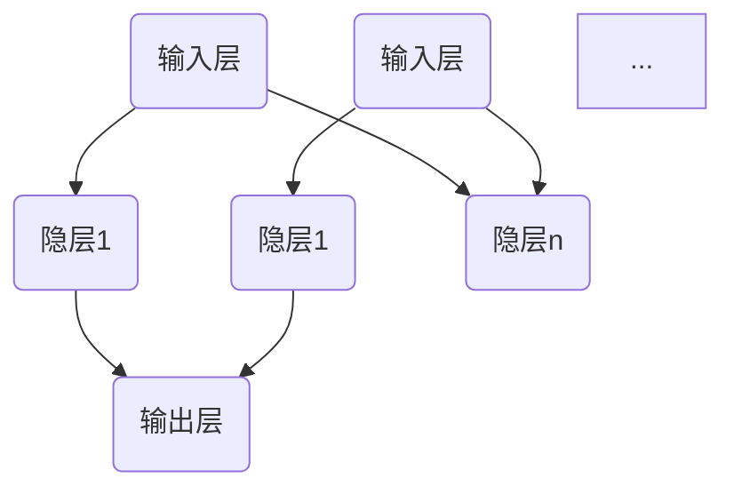
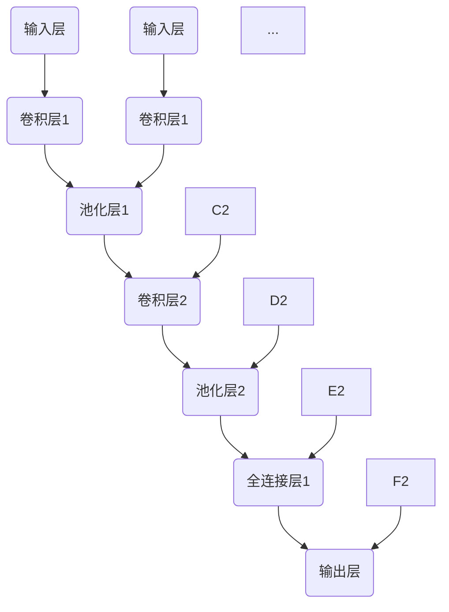
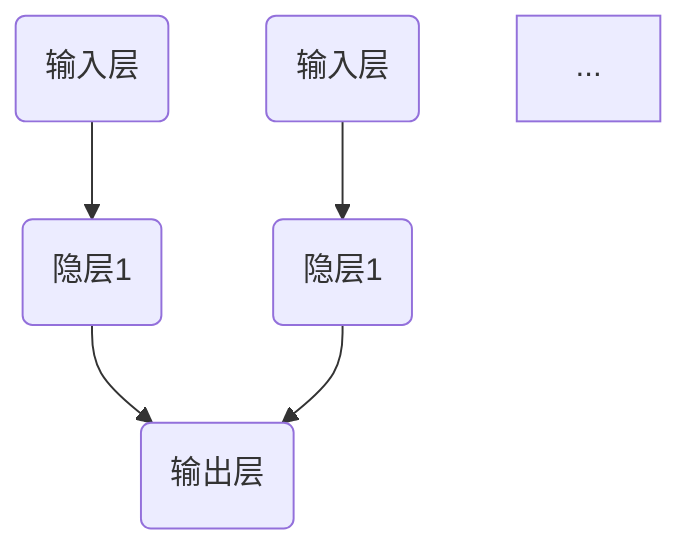
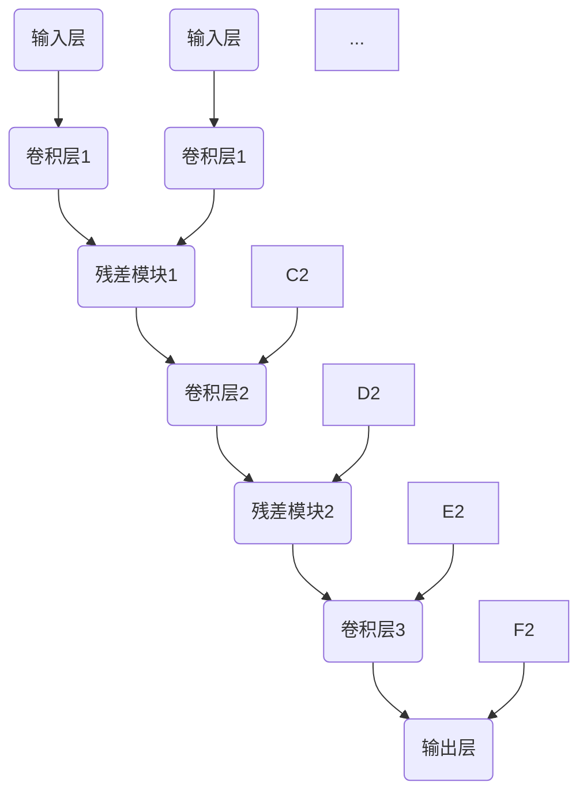
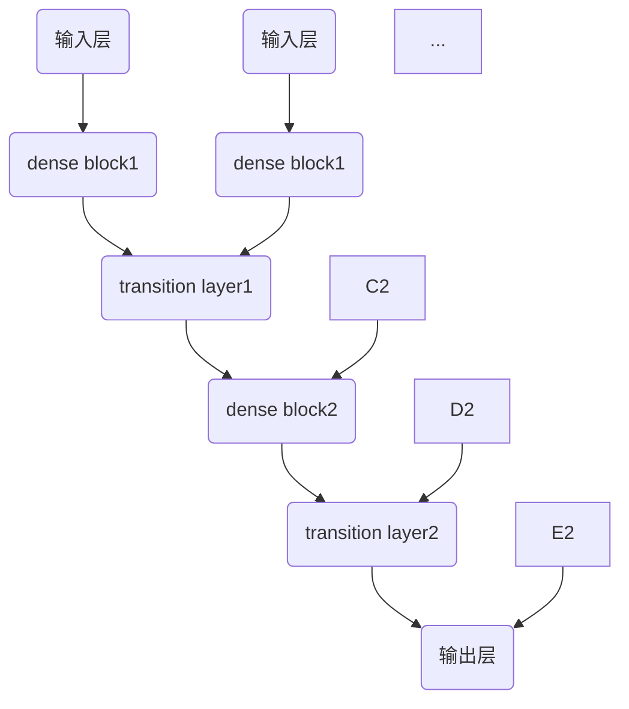

                 


# 神经网络：推动社会进步的力量

> 关键词：神经网络、深度学习、人工智能、机器学习、计算机视觉、自然语言处理

> 摘要：本文将从神经网络的基本概念、训练与优化方法、深度神经网络以及神经网络的扩展与应用四个方面，系统地介绍神经网络在计算机科学和社会中的应用，探讨神经网络如何推动社会进步。

## 第一部分：神经网络基础知识

### 第1章：神经网络的基本概念

#### 1.1 神经网络的定义和结构

神经网络（Neural Network）是一种模仿生物神经系统的计算模型，由大量相互连接的简单处理单元（神经元）组成，用于模拟和解决复杂的计算问题。神经网络的基本结构包括神经元和连接。

- **神经元**：神经元是神经网络的基本计算单元，类似于生物神经元。每个神经元接收多个输入信号，通过加权求和处理后，输出一个激活信号。
- **连接**：连接（或边）表示神经元之间的相互作用。每个连接都有一个权重，用于调整输入信号的强度。

一个简单的神经网络模型通常包括输入层、隐层和输出层：

1. **输入层**：接收外部输入信号，传递给下一层的神经元。
2. **隐层**：对输入信号进行加工处理，提取特征信息。
3. **输出层**：产生最终输出结果。

#### 1.2 前馈神经网络

前馈神经网络（Feedforward Neural Network）是一种信息单向流动的神经网络，信息从输入层经过隐层，最终传递到输出层。前馈神经网络具有以下特点：

1. **无循环结构**：前馈神经网络的连接方向是固定的，信息只能从前一层传递到后一层，不能反向传播。
2. **信息单向流动**：前馈神经网络的信息流动方向是固定的，输入信号经过各个隐层后，最终产生输出信号。
3. **易于并行计算**：由于前馈神经网络的信息流动方向固定，可以方便地实现并行计算，提高计算效率。

前馈神经网络的结构示意图如下：



#### 1.3 神经元的数学模型

神经元的数学模型描述了神经元在计算过程中的数学运算。一个简单的神经元模型可以表示为：

\[ z = \sum_{i=1}^{n} w_i x_i + b \]

其中，\( z \) 表示神经元的输出，\( w_i \) 表示第 \( i \) 个输入的权重，\( x_i \) 表示第 \( i \) 个输入的值，\( b \) 表示偏置。

为了得到神经元的激活值，需要对 \( z \) 应用激活函数。常见的激活函数包括 Sigmoid、ReLU 和 Tanh：

1. **Sigmoid 函数**：\( \sigma(z) = \frac{1}{1 + e^{-z}} \)
2. **ReLU 函数**：\( \text{ReLU}(z) = \max(0, z) \)
3. **Tanh 函数**：\( \tanh(z) = \frac{e^z - e^{-z}}{e^z + e^{-z}} \)

这些激活函数可以用于将线性运算映射到非线性运算，从而提高神经网络的表示能力。

### 第2章：神经网络的训练与优化

#### 2.1 反向传播算法

反向传播算法（Backpropagation Algorithm）是一种用于训练神经网络的常用算法，通过计算输出误差来更新权重和偏置。反向传播算法的基本思想是：首先，将输入数据传递到神经网络的前向传播阶段，得到输出结果；然后，计算输出结果与真实标签之间的误差；最后，通过反向传播误差，更新网络中的权重和偏置。

反向传播算法的具体步骤如下：

1. **前向传播**：将输入数据 \( x \) 传递到神经网络，计算输出 \( y \)。
2. **计算误差**：计算输出 \( y \) 与真实标签 \( t \) 之间的误差 \( \delta \)。
3. **反向传播**：从输出层开始，将误差反向传播到输入层，更新网络中的权重和偏置。

反向传播算法的伪代码如下：

```python
for each epoch:
    for each training sample (x, t):
        # 前向传播
        y = forward_propagation(x)
        # 计算误差
        delta = compute_error(y, t)
        # 反向传播
        backward_propagation(delta)
    end for
end for
```

#### 2.2 梯度下降法

梯度下降法（Gradient Descent）是一种优化算法，通过计算目标函数的梯度来更新参数。在神经网络中，目标函数通常是损失函数，用于衡量预测结果与真实结果之间的差距。梯度下降法的基本思想是：沿着目标函数的梯度方向更新参数，以最小化目标函数。

梯度下降法的基本步骤如下：

1. **初始化参数**：随机初始化网络中的权重和偏置。
2. **计算梯度**：计算目标函数关于参数的梯度。
3. **更新参数**：沿着梯度方向更新参数，通常采用如下更新公式：

\[ \theta_{\text{new}} = \theta_{\text{old}} - \alpha \cdot \nabla_{\theta} J(\theta) \]

其中，\( \theta \) 表示参数，\( \alpha \) 表示学习率，\( \nabla_{\theta} J(\theta) \) 表示目标函数的梯度。

梯度下降法的伪代码如下：

```python
# 初始化参数
theta = initialize_parameters()

# 设置学习率
alpha = 0.01

# 迭代更新参数
for epoch in range(num_epochs):
    for x, t in training_data:
        # 计算梯度
        grad = compute_gradient(x, t, theta)
        # 更新参数
        theta = theta - alpha * grad
```

#### 2.3 随机梯度下降（SGD）

随机梯度下降（Stochastic Gradient Descent，SGD）是一种特殊的梯度下降法，每次更新参数时使用随机选取的一小部分数据。SGD相对于传统梯度下降法有以下优点：

1. **训练速度较快**：由于每次更新参数时只使用一部分数据，SGD可以更快地更新参数。
2. **适用于大规模数据集**：SGD适用于大规模数据集，可以在有限内存下训练。

随机梯度下降的基本步骤如下：

1. **随机选择训练样本**：从训练数据中随机选择一个样本。
2. **计算梯度**：计算当前样本的梯度。
3. **更新参数**：使用当前样本的梯度更新参数。

随机梯度下降的伪代码如下：

```python
# 初始化参数
theta = initialize_parameters()

# 设置学习率
alpha = 0.01

# 迭代更新参数
for epoch in range(num_epochs):
    # 随机选择训练样本
    x, t = random_sample(training_data)
    # 计算梯度
    grad = compute_gradient(x, t, theta)
    # 更新参数
    theta = theta - alpha * grad
```

### 第3章：深度神经网络

#### 3.1 深度神经网络的基本结构

深度神经网络（Deep Neural Network，DNN）是由多个隐层组成的神经网络，可以学习复杂的非线性特征。深度神经网络的基本结构包括输入层、多个隐层和输出层。

1. **输入层**：接收外部输入信号，传递给下一层的神经元。
2. **隐层**：对输入信号进行加工处理，提取特征信息。每个隐层都可以包含多个神经元。
3. **输出层**：产生最终输出结果。

深度神经网络的结构示意图如下：


#### 3.2 卷积神经网络（CNN）

卷积神经网络（Convolutional Neural Network，CNN）是一种适用于图像处理任务的神经网络，通过卷积层提取图像特征。CNN的基本结构包括卷积层、池化层和全连接层。

1. **卷积层**：卷积层通过卷积运算提取图像特征。卷积运算使用一个可训练的卷积核，对输入图像进行卷积操作，得到特征图。
2. **池化层**：池化层用于降低特征图的维度，减少参数数量。常见的池化操作包括最大池化和平均池化。
3. **全连接层**：全连接层将卷积层和池化层提取的特征映射到输出层，实现分类、目标检测等任务。

CNN的结构示意图如下：



#### 3.3 循环神经网络（RNN）

循环神经网络（Recurrent Neural Network，RNN）是一种适用于序列数据处理任务的神经网络，通过循环结构处理序列信息。RNN的基本结构包括输入层、隐层和输出层。

1. **输入层**：接收外部输入信号，传递给下一层的神经元。
2. **隐层**：对输入信号进行加工处理，提取特征信息。隐层的输出会反馈到自身，形成循环结构。
3. **输出层**：产生最终输出结果。

RNN的结构示意图如下：



RNN的循环结构使其能够处理序列数据，但同时也存在梯度消失和梯度爆炸问题，这限制了其训练深度。

## 第二部分：神经网络的扩展与应用

### 第4章：神经网络的扩展

#### 4.1 残差网络（ResNet）

残差网络（Residual Network，ResNet）通过引入残差模块，解决了深度神经网络中的梯度消失和梯度爆炸问题，使得可以训练更深的网络结构。ResNet的基本结构包括多层卷积层和残差模块。

1. **卷积层**：卷积层用于提取图像特征。
2. **残差模块**：残差模块包括两个卷积层和一个跳过连接。跳过连接使得梯度可以跨越多个卷积层，缓解了梯度消失和梯度爆炸问题。

ResNet的结构示意图如下：



#### 4.2 蒸汽机网络（DenseNet）

蒸汽机网络（DenseNet）通过增加连接，使信息在网络中的流动更加充分，提高了模型的性能。DenseNet的基本结构包括多个 dense block 和 transition layer。

1. **dense block**：dense block 由多个卷积层组成，每个卷积层的输出都会与前一层的输出相连接。
2. **transition layer**：transition layer 用于减少网络的深度，降低计算复杂度。

DenseNet的结构示意图如下：



#### 4.3 自注意力机制（Attention Mechanism）

自注意力机制（Self-Attention Mechanism）通过计算序列中每个元素的重要性，提高了模型的表示能力。自注意力机制的基本思想是将每个元素映射到一个向量，然后计算它们之间的相似性，用于加权聚合序列信息。

自注意力机制的数学模型可以表示为：

\[ \text{Attention}(X) = \text{softmax}\left(\frac{QK^T}{\sqrt{d_k}}\right)V \]

其中，\( Q \) 和 \( K \) 分别表示查询向量和键向量，\( V \) 表示值向量，\( d_k \) 表示键向量的维度。自注意力机制可以应用于多种任务，如文本分类、机器翻译等。

### 第5章：神经网络在计算机视觉中的应用

#### 5.1 图像分类

图像分类（Image Classification）是一种将图像分为不同类别的任务，神经网络通过学习图像特征来实现分类。常见的神经网络模型包括 LeNet、AlexNet、VGG、ResNet 等。

1. **LeNet**：LeNet 是一种简单的卷积神经网络，由两个卷积层和一个全连接层组成。LeNet 在手写数字识别任务上取得了显著的性能。
2. **AlexNet**：AlexNet 是一种深度卷积神经网络，由五个卷积层和一个全连接层组成。AlexNet 在 ImageNet 图像分类挑战中取得了领先的成绩。
3. **VGG**：VGG 是一种深度卷积神经网络，由多个卷积层和池化层组成。VGG 通过使用较小的卷积核（3x3）和较小的滤波器数量，实现了较高的分类性能。
4. **ResNet**：ResNet 是一种深度残差网络，通过引入残差模块解决了梯度消失和梯度爆炸问题。ResNet 可以训练非常深的网络结构，取得了显著的性能提升。

图像分类的流程如下：

1. **预处理**：将图像数据转换为固定尺寸的像素矩阵。
2. **卷积层**：通过卷积操作提取图像特征。
3. **池化层**：通过池化操作降低特征图的维度。
4. **全连接层**：将卷积层和池化层提取的特征映射到输出层，实现分类。

#### 5.2 目标检测

目标检测（Object Detection）是一种同时定位和分类图像中多个目标的方法，神经网络通过学习图像特征实现目标检测。常见的目标检测算法包括 R-CNN、Fast R-CNN、Faster R-CNN、SSD、YOLO 等。

1. **R-CNN**：R-CNN 是一种基于区域提议的目标检测算法，通过提取图像区域和分类器实现目标检测。
2. **Fast R-CNN**：Fast R-CNN 对 R-CNN 进行了改进，通过共享卷积特征图提高了检测速度。
3. **Faster R-CNN**：Faster R-CNN 引入了区域提议网络（RPN），进一步提高了检测速度和性能。
4. **SSD**：SSD 是一种基于多尺度卷积神经网络的目标检测算法，通过在不同尺度上提取特征实现多尺度目标检测。
5. **YOLO**：YOLO 是一种基于全卷积神经网络的目标检测算法，通过将目标检测问题转化为回归问题实现高效检测。

目标检测的流程如下：

1. **预处理**：将图像数据转换为固定尺寸的像素矩阵。
2. **卷积层**：通过卷积操作提取图像特征。
3. **区域提议**：通过区域提议网络生成多个可能包含目标的区域。
4. **分类与回归**：对每个区域进行分类和目标位置回归。
5. **非极大值抑制（NMS）**：对检测结果进行非极大值抑制，去除重叠的检测框。

#### 5.3 图像分割

图像分割（Image Segmentation）是一种将图像分割为不同区域的方法，神经网络通过学习图像特征实现图像分割。常见的神经网络模型包括 FCN、U-Net、SegNet、DeepLab 等。

1. **FCN**：FCN 是一种基于卷积神经网络的图像分割算法，通过将卷积神经网络的全连接层替换为卷积层，实现像素级别的分类。
2. **U-Net**：U-Net 是一种基于卷积神经网络的图像分割算法，具有对称的结构，通过上采样和下采样的组合，实现像素级别的分类。
3. **SegNet**：SegNet 是一种基于卷积神经网络的图像分割算法，通过使用卷积层和反卷积层实现特征融合和上采样。
4. **DeepLab**：DeepLab 是一种基于卷积神经网络的图像分割算法，通过引入深度可分离卷积和空洞卷积，提高图像分割的精度。

图像分割的流程如下：

1. **预处理**：将图像数据转换为固定尺寸的像素矩阵。
2. **卷积层**：通过卷积操作提取图像特征。
3. **上采样**：通过上采样操作将特征图恢复到原始图像的大小。
4. **分类**：对每个像素进行分类，生成分割结果。

### 第6章：神经网络在自然语言处理中的应用

#### 6.1 语言模型

语言模型（Language Model）是一种用于预测下一个单词或词组的模型，神经网络通过学习大规模语料库来生成语言模型。常见的神经网络模型包括 n-gram 模型、RNN、LSTM、GRU 等。

1. **n-gram 模型**：n-gram 模型是一种基于马尔可夫假设的语言模型，通过统计相邻单词的概率来预测下一个单词。
2. **RNN**：循环神经网络（Recurrent Neural Network，RNN）是一种适用于序列数据处理任务的神经网络，通过循环结构处理序列信息。
3. **LSTM**：长短时记忆网络（Long Short-Term Memory，LSTM）是一种特殊的 RNN，通过引入记忆单元和门控机制，解决 RNN 的长短期依赖问题。
4. **GRU**：门控循环单元（Gated Recurrent Unit，GRU）是一种简化版的 LSTM，通过引入更新门和控制门，实现更高效的序列处理。

语言模型的训练过程如下：

1. **预处理**：将文本数据转换为词向量表示。
2. **构建模型**：构建神经网络模型，包括输入层、隐层和输出层。
3. **训练模型**：通过反向传播算法训练模型，优化参数。
4. **评估模型**：使用验证集评估模型性能，调整模型参数。

#### 6.2 文本分类

文本分类（Text Classification）是一种将文本分为不同类别的任务，神经网络通过学习文本特征实现分类。常见的神经网络模型包括 Logistic Regression、SVM、朴素贝叶斯、神经网络等。

1. **Logistic Regression**：逻辑回归是一种简单且常用的文本分类模型，通过计算文本特征的概率分布来实现分类。
2. **SVM**：支持向量机（Support Vector Machine，SVM）是一种基于最大间隔的文本分类模型，通过求解最优超平面来实现分类。
3. **朴素贝叶斯**：朴素贝叶斯是一种基于贝叶斯定理的文本分类模型，通过计算文本特征的条件概率来实现分类。
4. **神经网络**：神经网络是一种适用于文本分类的深度学习模型，通过学习文本特征和类别之间的关系来实现分类。

文本分类的流程如下：

1. **预处理**：将文本数据转换为词向量表示。
2. **特征提取**：从词向量中提取文本特征。
3. **构建模型**：构建神经网络模型，包括输入层、隐层和输出层。
4. **训练模型**：通过反向传播算法训练模型，优化参数。
5. **评估模型**：使用验证集评估模型性能，调整模型参数。

#### 6.3 机器翻译

机器翻译（Machine Translation）是一种将一种语言的文本自动翻译成另一种语言的文本，神经网络通过学习双语的平行语料库实现翻译。常见的神经网络模型包括 RNN、LSTM、Seq2Seq、注意力机制等。

1. **RNN**：循环神经网络（Recurrent Neural Network，RNN）是一种适用于序列数据处理任务的神经网络，通过循环结构处理序列信息。
2. **LSTM**：长短时记忆网络（Long Short-Term Memory，LSTM）是一种特殊的 RNN，通过引入记忆单元和门控机制，解决 RNN 的长短期依赖问题。
3. **Seq2Seq**：序列到序列（Sequence-to-Sequence，Seq2Seq）模型是一种基于 RNN 的机器翻译模型，通过编码器和解码器结构实现端到端的序列转换。
4. **注意力机制**：注意力机制（Attention Mechanism）通过计算输入序列和输出序列的相似性，提高了机器翻译模型的性能。

机器翻译的流程如下：

1. **预处理**：将源语言和目标语言的文本数据转换为词向量表示。
2. **编码器**：使用 RNN 或 LSTM 编码器将源语言文本转换为固定长度的编码表示。
3. **解码器**：使用 RNN 或 LSTM 解码器将编码表示解码为目标语言文本。
4. **训练模型**：通过反向传播算法训练模型，优化参数。
5. **评估模型**：使用验证集评估模型性能，调整模型参数。

### 第7章：神经网络的实际应用案例

#### 7.1 人工智能助理

人工智能助理是一种基于神经网络的智能对话系统，可以实现与用户的自然对话。常见的应用场景包括智能客服、语音助手等。人工智能助理的构建过程如下：

1. **语音识别**：使用神经网络模型将语音信号转换为文本。
2. **自然语言处理**：使用神经网络模型对文本进行语义理解和意图识别。
3. **对话生成**：使用神经网络模型生成自然流畅的对话回复。

具体实现步骤如下：

1. **构建语音识别模型**：使用卷积神经网络（CNN）或循环神经网络（RNN）进行语音信号的处理和识别。
2. **构建自然语言处理模型**：使用长短时记忆网络（LSTM）或门控循环单元（GRU）进行文本的语义理解和意图识别。
3. **构建对话生成模型**：使用生成式神经网络模型，如生成对抗网络（GAN）或变分自编码器（VAE），生成自然流畅的对话回复。

#### 7.2 自动驾驶

自动驾驶是一种基于神经网络的智能驾驶系统，可以实现车辆的自主驾驶。常见的应用场景包括自动驾驶汽车、无人机等。自动驾驶的构建过程如下：

1. **环境感知**：使用神经网络模型对周围环境进行感知，包括道路、车辆、行人等。
2. **决策规划**：使用神经网络模型进行路径规划和决策，包括车道保持、速度控制、障碍物避让等。
3. **控制执行**：使用神经网络模型将决策转化为具体的控制指令，如方向盘转动、油门控制等。

具体实现步骤如下：

1. **构建环境感知模型**：使用卷积神经网络（CNN）或循环神经网络（RNN）对图像和传感器数据进行处理和识别。
2. **构建决策规划模型**：使用深度神经网络（DNN）或强化学习（RL）进行路径规划和决策。
3. **构建控制执行模型**：使用神经网络模型将决策转化为具体的控制指令，如 PID 控制器。

#### 7.3 医疗诊断

医疗诊断是一种基于神经网络的智能医疗系统，可以实现疾病的预测和诊断。常见的应用场景包括疾病预测、图像分析等。医疗诊断的构建过程如下：

1. **数据预处理**：对医疗数据进行预处理，包括数据清洗、归一化等。
2. **特征提取**：使用神经网络模型对医疗数据提取特征，如图像特征、基因特征等。
3. **模型训练**：使用训练数据训练神经网络模型，包括深度学习模型和传统机器学习模型。
4. **模型评估**：使用验证数据评估模型性能，调整模型参数。

具体实现步骤如下：

1. **构建特征提取模型**：使用卷积神经网络（CNN）或循环神经网络（RNN）对医疗数据进行特征提取。
2. **构建疾病预测模型**：使用深度学习模型（如 DNN、LSTM）或传统机器学习模型（如 SVM、逻辑回归）进行疾病预测。
3. **构建图像分析模型**：使用卷积神经网络（CNN）或循环神经网络（RNN）对医学图像进行分析和诊断。

## 附录

### 附录A：神经网络常用工具和库

#### A.1 TensorFlow

TensorFlow 是一款由 Google 开发的开源机器学习框架，广泛应用于神经网络的研究和应用。TensorFlow 提供了丰富的预训练模型和 API，支持多种编程语言，如 Python、C++ 等。

主要特点：

1. **动态计算图**：TensorFlow 采用动态计算图，可以在运行时构建和执行计算图。
2. **高效的分布式计算**：TensorFlow 支持分布式计算，可以在多台计算机上进行训练和推理。
3. **丰富的预训练模型**：TensorFlow 提供了大量的预训练模型，如文本分类、图像分类、机器翻译等。

#### A.2 PyTorch

PyTorch 是一款由 Facebook 开发的开源机器学习框架，以动态计算图为核心，适用于研究型和工程型应用。PyTorch 提供了简洁的 API，易于实现和调试。

主要特点：

1. **动态计算图**：PyTorch 采用动态计算图，支持在运行时构建和执行计算图。
2. **灵活的 API**：PyTorch 提供了灵活的 API，可以方便地构建神经网络模型。
3. **强大的研究工具**：PyTorch 提供了丰富的研究工具，如自动微分、可视化等。

#### A.3 Keras

Keras 是一款基于 TensorFlow 和 Theano 的开源神经网络库，提供了简洁的 API，方便快速搭建和训练神经网络。Keras 支持多种后端框架，如 TensorFlow、Theano 等。

主要特点：

1. **简洁的 API**：Keras 提供了简洁的 API，可以方便地搭建和训练神经网络。
2. **支持多种后端框架**：Keras 支持多种后端框架，如 TensorFlow、Theano 等，可以方便地切换和使用不同的后端。
3. **丰富的预训练模型**：Keras 提供了大量的预训练模型，如文本分类、图像分类、机器翻译等。

