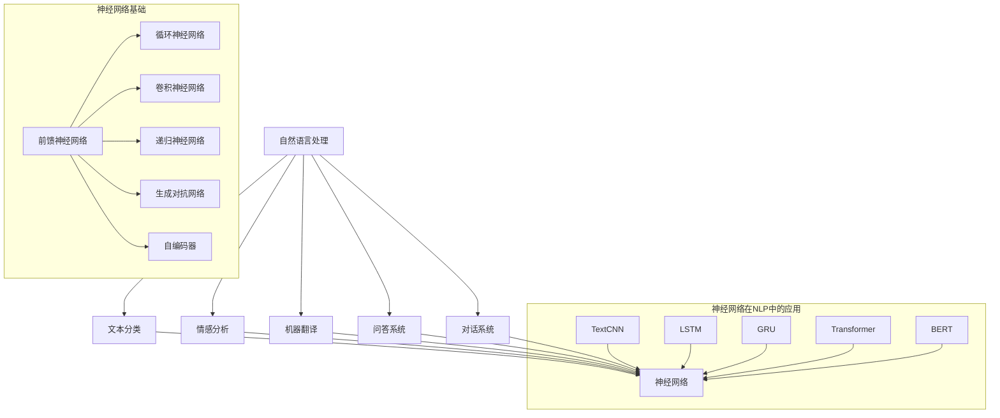
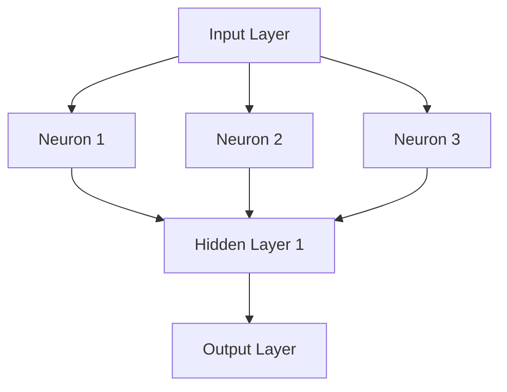
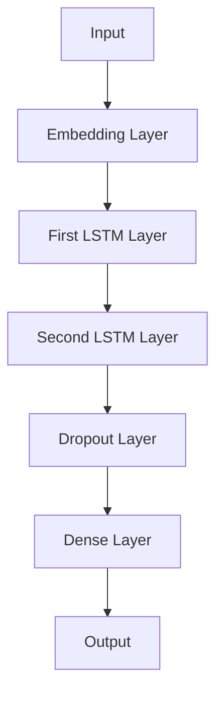
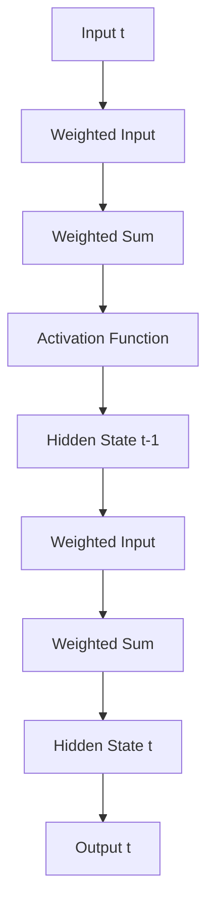
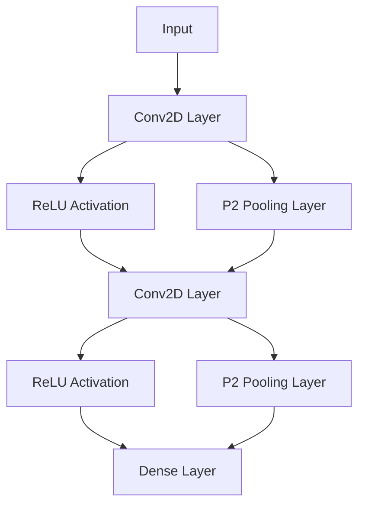

                 

# 文章标题：神经网络：自然语言处理的新突破

> 关键词：神经网络，自然语言处理，深度学习，循环神经网络，卷积神经网络，预训练，微调

> 摘要：
自然语言处理是人工智能的一个重要分支，旨在使计算机能够理解、生成和交互自然语言。神经网络，尤其是深度学习模型，已经成为自然语言处理的利器。本文将深入探讨神经网络在自然语言处理中的应用，包括其基本概念、发展历程、核心算法以及实际项目实战。通过一步步的推理和分析，我们希望能够帮助读者全面了解神经网络在自然语言处理中的新突破。

## 《神经网络：自然语言处理的新突破》目录大纲

### 第一部分：神经网络与自然语言处理

#### 第1章：神经网络概述

##### 1.1 神经网络的概念与发展

##### 1.2 自然语言处理概述

##### 1.3 神经网络在自然语言处理中的应用

#### 第2章：神经网络基础

##### 2.1 神经网络结构

##### 2.2 反向传播算法

##### 2.3 损失函数与优化算法

#### 第3章：循环神经网络

##### 3.1 循环神经网络基础

##### 3.2 LSTM与GRU

#### 第4章：卷积神经网络

##### 4.1 卷积神经网络基础

##### 4.2 TextCNN与Transformer

#### 第5章：预训练与微调

##### 5.1 预训练基础

##### 5.2 微调技巧

#### 第6章：神经网络在自然语言处理中的项目实战

##### 6.1 项目背景与目标

##### 6.2 数据预处理

##### 6.3 模型设计

##### 6.4 训练与评估

##### 6.5 结果分析

##### 6.6 优化建议

#### 第7章：神经网络在自然语言处理中的应用挑战与未来趋势

##### 7.1 应用挑战

##### 7.2 未来趋势

### 附录

#### 附录A：神经网络学习资源

#### 附录B：神经网络数学公式

## 第一部分：神经网络与自然语言处理

### 第1章：神经网络概述

#### 1.1 神经网络的概念与发展

神经网络是一种模仿生物神经系统结构和功能的人工智能系统。它的基本单元是神经元，神经元之间通过连接（称为突触）进行信息传递。神经网络通过多层结构，可以处理复杂的非线性问题。

**神经网络的概念**：
- **神经元**：神经网络的构建块，负责接收输入、产生输出并传递信号。
- **人工神经网络**：由多个神经元组成的神经网络，用于模拟人脑的信息处理能力。
- **深度学习**：基于多层神经网络的学习方法，可以自动提取数据的特征。

**神经网络的发展历程**：
- **感知机（Perceptron）**：1950年代，由Frank Rosenblatt提出，是最早的神经网络模型。
- **反向传播算法（Backpropagation）**：1970年代，由Paul Werbos提出，是现代深度学习的基础。
- **深度神经网络（Deep Neural Network）**：2000年代后，由于计算能力和算法的进步，深度神经网络得到了广泛应用。

**神经网络的类型**：
- **前馈神经网络（Feedforward Neural Network）**：信息从前向传播，不循环回。
- **循环神经网络（Recurrent Neural Network, RNN）**：适用于序列数据，具有记忆能力。
- **卷积神经网络（Convolutional Neural Network, CNN）**：主要用于图像识别，能够捕捉空间特征。

### 1.2 自然语言处理概述

**自然语言处理的基本概念**：
自然语言处理（Natural Language Processing, NLP）是计算机科学和人工智能领域中的一个重要分支，旨在让计算机理解和处理人类自然语言。NLP的目标包括文本分析、语音识别、机器翻译、情感分析等。

**自然语言处理的任务**：
- **文本分类（Text Classification）**：将文本数据分类到预定义的类别中。
- **情感分析（Sentiment Analysis）**：判断文本的情感倾向，如正面、负面或中性。
- **机器翻译（Machine Translation）**：将一种语言的文本翻译成另一种语言。
- **命名实体识别（Named Entity Recognition, NER）**：识别文本中的特定实体，如人名、地点等。
- **问答系统（Question Answering, QA）**：从文本中提取答案，回答用户的问题。

### 1.3 神经网络在自然语言处理中的应用

**神经网络在文本分类中的应用**：
神经网络通过学习文本的特征，可以准确地对文本进行分类。例如，可以使用神经网络对新闻文章进行分类，将它们分为体育、科技、财经等类别。

**神经网络在情感分析中的应用**：
情感分析是NLP中的一个重要任务，神经网络可以通过分析文本中的情感词和语境，判断文本的情感倾向。例如，在社交媒体分析中，可以使用神经网络分析用户的评论情感。

**神经网络在机器翻译中的应用**：
机器翻译是一个复杂的任务，神经网络通过学习双语语料库，可以生成准确的翻译。循环神经网络（如LSTM和GRU）在机器翻译中得到了广泛应用。

### 第2章：神经网络基础

#### 2.1 神经网络结构

**神经元与层**：
神经网络由多个层次组成，每个层次由多个神经元组成。输入层接收外部数据，隐藏层处理内部计算，输出层产生最终结果。

**激活函数**：
激活函数是神经元中的一个关键组件，用于决定神经元是否被激活。常见的激活函数包括ReLU（Rectified Linear Unit）、Sigmoid和Tanh。

**多层感知机（MLP）**：
多层感知机是一种前馈神经网络，具有输入层、多个隐藏层和输出层。通过反向传播算法，多层感知机可以学习数据的非线性特征。

#### 2.2 反向传播算法

**反向传播算法原理**：
反向传播算法是一种用于训练神经网络的优化算法。它通过计算输出误差，反向传播到网络中的每个层次，更新神经元的权重。

**反向传播算法实现**：
反向传播算法的实现涉及前向传播和反向传播两个步骤。在训练过程中，首先进行前向传播，计算输出结果和误差。然后进行反向传播，更新网络权重。

#### 2.3 损失函数与优化算法

**损失函数**：
损失函数用于度量预测值和真实值之间的差距。常见的损失函数包括交叉熵损失（Cross Entropy Loss）、均方误差（Mean Squared Error, MSE）等。

**优化算法**：
优化算法用于调整网络权重，以最小化损失函数。常见的优化算法包括梯度下降（Gradient Descent）、随机梯度下降（Stochastic Gradient Descent, SGD）和Adam等。

### 第3章：循环神经网络

#### 3.1 循环神经网络基础

**循环神经网络原理**：
循环神经网络（RNN）是一种能够处理序列数据的神经网络，具有记忆能力。RNN通过在时间步之间传递隐藏状态，保持序列信息。

**循环神经网络应用**：
RNN在自然语言处理中得到了广泛应用，如文本分类、序列标注、语言模型等。RNN能够捕捉序列中的长距离依赖关系。

#### 3.2 LSTM与GRU

**LSTM与GRU原理**：
LSTM（Long Short-Term Memory）和GRU（Gated Recurrent Unit）是RNN的改进版本，用于解决RNN的梯度消失和梯度爆炸问题。LSTM和GRU通过门控机制，能够有效地捕捉长距离依赖关系。

**LSTM与GRU应用**：
LSTM和GRU在自然语言处理中得到了广泛应用，如机器翻译、语音识别、文本生成等。LSTM和GRU能够生成高质量的序列数据。

### 第4章：卷积神经网络

#### 4.1 卷积神经网络基础

**卷积神经网络原理**：
卷积神经网络（CNN）是一种用于图像识别和处理的神经网络，具有局部感知和权重共享的特性。CNN通过卷积层、池化层和全连接层处理图像数据。

**卷积神经网络应用**：
CNN在自然语言处理中也得到了应用，如文本分类、序列标注、文本生成等。CNN能够捕捉文本中的局部特征和全局特征。

#### 4.2 TextCNN与Transformer

**TextCNN原理**：
TextCNN是一种基于卷积神经网络的文本分类模型。TextCNN通过多个卷积核捕捉文本中的局部特征，并使用全连接层进行分类。

**Transformer原理**：
Transformer是一种基于自注意力机制的序列模型。Transformer通过多头自注意力机制和前馈神经网络，能够捕捉序列中的长距离依赖关系。

### 第5章：预训练与微调

#### 5.1 预训练基础

**预训练的概念**：
预训练是指在大规模语料库上预先训练神经网络模型，然后在小规模任务上进行微调。

**预训练任务**：
常见的预训练任务包括语言模型预训练（如BERT）、掩码语言模型（Masked Language Model, MLM）等。

#### 5.2 微调技巧

**微调方法**：
微调（Fine-tuning）是指在小规模任务上调整预训练模型的参数，以适应特定任务。

**微调实战**：
通过实际案例，讲解微调方法的具体实现和效果。

### 第6章：神经网络在自然语言处理中的项目实战

#### 6.1 项目背景与目标

**项目背景**：
介绍所选项目的基本背景。

**项目目标**：
明确项目的目标和任务。

#### 6.2 数据预处理

**数据集介绍**：
介绍所选数据集的基本信息。

**数据预处理**：
讲解数据预处理的方法和步骤。

#### 6.3 模型设计

**模型选择**：
选择合适的模型架构。

**模型参数设置**：
讲解模型参数的设置和优化。

#### 6.4 训练与评估

**训练过程**：
讲解模型训练的过程和方法。

**模型评估**：
介绍模型评估的方法和指标。

#### 6.5 结果分析

**结果分析**：
分析模型训练的结果，包括准确率、召回率等指标。

**优化建议**：
提出模型优化的建议和改进方向。

### 第7章：神经网络在自然语言处理中的应用挑战与未来趋势

#### 7.1 应用挑战

**数据质量与多样性**：
讨论数据质量对神经网络性能的影响。

**计算资源与能耗**：
分析神经网络训练和推理的计算资源需求。

#### 7.2 未来趋势

**小样本学习**：
探讨小样本学习在神经网络中的应用前景。

**多模态学习**：
讨论多模态学习在自然语言处理中的应用。

### 附录

#### 附录A：神经网络学习资源

**开源框架**：
介绍常用的神经网络开源框架，如TensorFlow、PyTorch等。

**在线课程**：
推荐相关的在线课程资源，帮助读者深入学习。

#### 附录B：神经网络数学公式

**线性变换**：
介绍线性变换的数学公式。

**损失函数**：
列出常见的损失函数的数学公式。

### 作者信息

**作者：**AI天才研究院/AI Genius Institute & 禅与计算机程序设计艺术 /Zen And The Art of Computer Programming

## 第1章：神经网络概述

### 1.1 神经网络的概念与发展

神经网络（Neural Networks）是模拟人脑神经元结构和功能的一种计算模型。它由大量相互连接的简单计算单元（称为神经元）组成，这些神经元通过传递电信号来进行信息处理。神经网络的起源可以追溯到1940年代，由心理学家McCulloch和数学家Pitts提出了第一种简单的神经元模型，即感知机（Perceptron）。然而，早期的神经网络发展受到了限制，直到1980年代，随着计算机性能的提升和优化算法的提出，神经网络才逐渐成熟。

**神经元与人工神经网络**

神经元是神经网络的基本单元，通常由三个部分组成：输入、权重和激活函数。输入表示神经元的输入信号，权重表示输入信号的重要性，激活函数则用于决定神经元是否被激活。

人工神经网络（Artificial Neural Network, ANN）是一种由多个神经元组成的网络，通过层次结构进行信息传递和处理。人工神经网络可以分为前馈神经网络（Feedforward Neural Network）和循环神经网络（Recurrent Neural Network）。

**深度学习**

深度学习（Deep Learning）是一种基于多层神经网络的学习方法，它通过自动提取数据的层次化特征，从而实现复杂的任务。深度学习的兴起得益于大规模数据集、强大计算能力和高效优化算法的支持。深度学习的核心模型包括卷积神经网络（Convolutional Neural Network, CNN）、循环神经网络（Recurrent Neural Network, RNN）和变分自编码器（Variational Autoencoder, VAE）等。

**神经网络的发展历程**

神经网络的发展历程可以分为以下几个阶段：

1. **感知机（1950年代）**：感知机是第一种简单的神经网络模型，由McCulloch和Pitts提出。感知机可以用于简单的二分类任务，但它存在局限性，无法解决非线性问题。

2. **多层感知机（1960年代）**：基于感知机的改进模型，多层感知机（MLP）可以处理更复杂的非线性问题。然而，MLP在训练过程中存在梯度消失和梯度爆炸问题。

3. **反向传播算法（1970年代）**：反向传播算法（Backpropagation）由Paul Werbos在1970年代提出，它解决了多层感知机的训练问题。反向传播算法通过反向传播误差信号，更新网络权重，从而实现模型的优化。

4. **深度神经网络（2000年代）**：随着计算能力的提升和优化算法的改进，深度神经网络（Deep Neural Network, DNN）逐渐兴起。DNN通过增加网络深度，可以自动提取数据的层次化特征，从而提高模型的性能。

5. **卷积神经网络（2010年代）**：卷积神经网络（Convolutional Neural Network, CNN）是一种专门用于图像识别的神经网络，通过卷积层和池化层提取图像特征。CNN在图像识别任务中取得了显著的成功。

6. **循环神经网络（2010年代）**：循环神经网络（Recurrent Neural Network, RNN）是一种用于处理序列数据的神经网络，通过在时间步之间传递隐藏状态，可以捕捉序列中的长距离依赖关系。RNN在自然语言处理和语音识别等领域取得了重要应用。

**神经网络的类型**

神经网络根据结构和功能可以分为多种类型，主要包括以下几种：

1. **前馈神经网络（Feedforward Neural Network）**：前馈神经网络是一种从输入层直接连接到输出层的神经网络。信息从前向传播，不循环回。前馈神经网络适用于分类、回归等任务。

2. **循环神经网络（Recurrent Neural Network, RNN）**：循环神经网络是一种能够处理序列数据的神经网络，具有记忆能力。RNN通过在时间步之间传递隐藏状态，可以捕捉序列中的长距离依赖关系。RNN适用于自然语言处理、语音识别等任务。

3. **卷积神经网络（Convolutional Neural Network, CNN）**：卷积神经网络是一种用于图像识别和处理的神经网络，具有局部感知和权重共享的特性。CNN通过卷积层、池化层和全连接层处理图像数据。CNN适用于图像识别、目标检测等任务。

4. **递归神经网络（Recursive Neural Network）**：递归神经网络是一种能够处理树状结构数据的神经网络，通过对树节点进行递归处理，可以提取树结构的特征。递归神经网络适用于语法分析、语义解析等任务。

5. **生成对抗网络（Generative Adversarial Network, GAN）**：生成对抗网络是一种由两个神经网络（生成器和判别器）组成的模型，通过对抗训练生成逼真的数据。GAN适用于图像生成、文本生成等任务。

6. **自编码器（Autoencoder）**：自编码器是一种无监督学习模型，通过学习输入数据的编码表示，实现对数据的降维和压缩。自编码器适用于数据降维、特征提取等任务。

7. **变分自编码器（Variational Autoencoder, VAE）**：变分自编码器是一种基于概率模型的自编码器，通过学习输入数据的概率分布，生成新的数据。VAE适用于图像生成、图像修复等任务。

### 1.2 自然语言处理概述

自然语言处理（Natural Language Processing, NLP）是计算机科学和人工智能领域中的一个重要分支，旨在让计算机理解和处理人类自然语言。NLP的目标包括文本分析、语音识别、机器翻译、情感分析等。NLP在信息检索、人机交互、智能客服等领域具有广泛的应用。

**自然语言处理的基本概念**

自然语言处理的基本概念包括以下几个方面：

1. **文本表示**：文本表示是将自然语言文本转换为计算机可处理的形式。常见的文本表示方法包括词袋模型、词嵌入和句子表示等。

2. **词嵌入（Word Embedding）**：词嵌入是将词汇映射为高维向量空间中的点，使得语义相似的词汇在向量空间中靠近。常见的词嵌入方法包括Word2Vec、GloVe等。

3. **句法分析（Syntax Analysis）**：句法分析是对自然语言文本进行结构分析，识别出单词之间的语法关系。句法分析包括词性标注、句法树构建等。

4. **语义分析（Semantic Analysis）**：语义分析是对自然语言文本进行语义理解，识别出文本中的实体、关系和事件。语义分析包括实体识别、关系抽取、事件抽取等。

5. **情感分析（Sentiment Analysis）**：情感分析是对自然语言文本进行情感倾向判断，识别出文本中的正面、负面或中性情感。情感分析常用于社交媒体分析、市场调研等领域。

6. **机器翻译（Machine Translation）**：机器翻译是将一种语言的文本翻译成另一种语言。机器翻译包括基于规则的方法、统计机器翻译和神经机器翻译等。

**自然语言处理的任务**

自然语言处理的主要任务包括以下几个方面：

1. **文本分类（Text Classification）**：文本分类是将文本数据分类到预定义的类别中。常见的文本分类任务包括新闻分类、情感分类、主题分类等。

2. **情感分析（Sentiment Analysis）**：情感分析是判断文本的情感倾向，如正面、负面或中性。情感分析常用于社交媒体分析、客户反馈分析等领域。

3. **机器翻译（Machine Translation）**：机器翻译是将一种语言的文本翻译成另一种语言。机器翻译包括基于规则的方法、统计机器翻译和神经机器翻译等。

4. **命名实体识别（Named Entity Recognition, NER）**：命名实体识别是识别文本中的特定实体，如人名、地名、组织名等。命名实体识别有助于信息抽取和知识图谱构建。

5. **问答系统（Question Answering, QA）**：问答系统是从文本中提取答案，回答用户的问题。问答系统包括基于规则的方法、基于模板的方法和基于深度学习的方法。

6. **对话系统（Dialogue System）**：对话系统是让计算机与人类进行自然语言交互的系统。对话系统包括基于规则的方法、基于模板的方法和基于深度学习的方法。

### 1.3 神经网络在自然语言处理中的应用

神经网络在自然语言处理中得到了广泛的应用，主要包括文本分类、情感分析、机器翻译等任务。

**文本分类**

文本分类是将文本数据分类到预定义的类别中。神经网络通过学习文本的特征，可以准确地对文本进行分类。常见的文本分类模型包括朴素贝叶斯、支持向量机、神经网络等。

**情感分析**

情感分析是判断文本的情感倾向，如正面、负面或中性。神经网络通过学习文本的语义特征，可以准确地对文本进行情感分类。常见的情感分析模型包括朴素贝叶斯、支持向量机、循环神经网络、卷积神经网络等。

**机器翻译**

机器翻译是将一种语言的文本翻译成另一种语言。神经网络在机器翻译中得到了广泛应用，包括循环神经网络、卷积神经网络、Transformer等模型。

**文本生成**

文本生成是生成符合语义和语法规则的文本。神经网络在文本生成中得到了广泛应用，包括循环神经网络、生成对抗网络、Transformer等模型。

**问答系统**

问答系统是从文本中提取答案，回答用户的问题。神经网络在问答系统中得到了广泛应用，包括循环神经网络、卷积神经网络、Transformer等模型。

**对话系统**

对话系统是让计算机与人类进行自然语言交互的系统。神经网络在对话系统中得到了广泛应用，包括循环神经网络、生成对抗网络、Transformer等模型。

### 1.4 神经网络在自然语言处理中的应用挑战与未来趋势

**应用挑战**

神经网络在自然语言处理中的应用面临以下挑战：

1. **数据质量**：神经网络训练需要大量的高质量数据，数据质量直接影响模型的性能。

2. **计算资源**：神经网络训练和推理需要大量的计算资源，特别是在深度神经网络中。

3. **模型解释性**：神经网络模型的内部结构复杂，难以解释和调试。

4. **多语言支持**：神经网络模型需要支持多种语言，以便在不同地区和应用场景中使用。

**未来趋势**

神经网络在自然语言处理中的未来趋势包括：

1. **预训练与微调**：预训练模型通过在大规模语料库上训练，可以提取丰富的语言特征。微调是将预训练模型应用于特定任务，通过调整模型参数，提高模型性能。

2. **多模态学习**：多模态学习是将不同类型的数据（如文本、图像、声音）进行整合，以获取更丰富的信息。

3. **小样本学习**：小样本学习是在数据量有限的情况下，通过模型调整和优化，提高模型的性能。

4. **迁移学习**：迁移学习是将预训练模型的知识应用于新的任务，以提高模型的性能。

5. **自动化机器学习**：自动化机器学习（AutoML）是一种自动构建和优化机器学习模型的方法，可以帮助开发者快速构建高效模型。

### 1.5 小结

本章概述了神经网络的基本概念、发展历程、类型以及在自然语言处理中的应用。神经网络作为一种强大的计算模型，在文本分类、情感分析、机器翻译等任务中取得了显著的成果。随着计算能力的提升和算法的改进，神经网络在自然语言处理中的应用将不断拓展，为人工智能的发展做出更大的贡献。

### 1.6 神经网络与自然语言处理的核心概念与联系

为了更好地理解神经网络与自然语言处理之间的联系，我们使用Mermaid流程图来展示它们的核心概念和结构。



**Mermaid流程图解读**：

1. **自然语言处理任务**：文本分类、情感分析、机器翻译、问答系统、对话系统是自然语言处理的主要任务，它们都是NLP领域的研究重点。

2. **神经网络基础**：前馈神经网络、循环神经网络、卷积神经网络、递归神经网络、生成对抗网络和自编码器是神经网络的基本类型，它们构成了神经网络的核心架构。

3. **神经网络在NLP中的应用**：TextCNN、LSTM、GRU、Transformer和BERT等模型是神经网络在自然语言处理中应用的重要实例，它们通过不同的方式处理NLP任务，如文本分类、情感分析和机器翻译。

通过这个流程图，我们可以清晰地看到神经网络与自然语言处理之间的核心概念和联系。神经网络为自然语言处理提供了强大的计算能力，使得复杂任务的实现成为可能。

### 1.7 神经网络基础算法原理讲解

在本节中，我们将深入探讨神经网络的基本算法原理，包括神经网络结构、前馈神经网络（FFNN）的原理和实现，以及反向传播算法（Backpropagation）的推导和实现。

#### 神经网络结构

神经网络由多个神经元（或称为节点）组成，这些神经元通过连接（或称为边）相互连接，形成一个层次化的网络结构。神经网络可以分为三个主要部分：输入层、隐藏层和输出层。

1. **输入层**：接收外部输入，例如文本数据、图像像素等。
2. **隐藏层**：对输入数据进行处理，提取特征并传递信息。
3. **输出层**：生成最终的输出，例如分类结果、预测值等。

神经元的计算过程通常包括以下几个步骤：

1. **加权求和**：每个神经元的输入值与其对应的权重相乘，然后求和。
2. **激活函数**：将加权求和的结果通过激活函数进行处理，决定神经元是否被激活。
3. **输出**：激活函数的输出即为神经元的输出，它将传递到下一层的神经元。

一个简单的神经网络结构如下所示：



在这个例子中，输入层有三个神经元，隐藏层有一个神经元，输出层有一个神经元。

#### 前馈神经网络（FFNN）的原理和实现

前馈神经网络是一种简单而有效的神经网络结构，它没有循环连接，信息从前向后传播。前馈神经网络通过逐层传递信息，实现对数据的处理和分类。

**原理**：

前馈神经网络的工作原理可以概括为以下几个步骤：

1. **输入层到隐藏层的传递**：输入层的每个神经元将输入值传递给隐藏层的每个神经元，通过加权求和和激活函数处理。
2. **隐藏层到输出层的传递**：隐藏层的每个神经元将输出值传递给输出层的神经元，通过加权求和和激活函数处理。
3. **输出层生成最终输出**：输出层的神经元生成最终的输出结果。

**实现**：

以下是一个简单的Python代码实现前馈神经网络：

```python
import numpy as np

# 初始化权重和偏置
def init_weights(input_size, hidden_size, output_size):
    weights = {
        'weights1': np.random.randn(input_size, hidden_size),
        'weights2': np.random.randn(hidden_size, output_size),
        'bias1': np.zeros((1, hidden_size)),
        'bias2': np.zeros((1, output_size))
    }
    return weights

# 前向传播
def forward_propagation(x, weights):
    a1 = x
    z2 = np.dot(a1, weights['weights1']) + weights['bias1']
    a2 = sigmoid(z2)
    z3 = np.dot(a2, weights['weights2']) + weights['bias2']
    a3 = sigmoid(z3)
    return a3

# 激活函数
def sigmoid(z):
    return 1 / (1 + np.exp(-z))

# 初始化输入和权重
x = np.array([1, 0, 1])
weights = init_weights(3, 2, 1)

# 前向传播
output = forward_propagation(x, weights)
print("Output:", output)
```

在这个实现中，我们初始化了输入层、隐藏层和输出层的权重和偏置，并使用sigmoid激活函数进行前向传播。

#### 反向传播算法（Backpropagation）

反向传播算法是一种用于训练神经网络的优化算法，它通过反向传播误差信号，更新网络中的权重和偏置，从而提高模型的性能。

**原理**：

反向传播算法的原理可以概括为以下几个步骤：

1. **计算输出误差**：计算输出层的误差，即实际输出与期望输出之间的差距。
2. **反向传播误差**：将输出误差反向传播到隐藏层，计算隐藏层的误差。
3. **更新权重和偏置**：根据误差信号，调整网络中的权重和偏置，以减少误差。

**推导**：

假设我们有一个三层的神经网络，包括输入层、隐藏层和输出层。设输入为\(x\)，隐藏层输出为\(a^1\)，输出层输出为\(a^3\)，目标输出为\(y\)。定义损失函数为\(J(\theta) = \frac{1}{2} \sum_{i=1}^{m} (y_i - a^{(3)}_i)^2\)。

1. **计算输出层的误差**：
   \[
   \delta^{(3)} = a^{(3)} - y
   \]

2. **计算隐藏层的误差**：
   \[
   \delta^{(2)} = \delta^{(3)} \cdot \frac{\partial z^{(2)}}{\partial a^{(2)}} = (a^{(3)} - y) \cdot a^{(2)} \cdot (1 - a^{(2)})
   \]

3. **更新权重和偏置**：
   \[
   \Delta w^{(2)} = \delta^{(2)} \cdot a^{(1)}
   \]
   \[
   \Delta b^{(2)} = \delta^{(2)}
   \]
   \[
   \Delta w^{(3)} = \delta^{(3)} \cdot a^{(2)}
   \]
   \[
   \Delta b^{(3)} = \delta^{(3)}
   \]

**实现**：

以下是一个简单的Python代码实现反向传播算法：

```python
# 计算梯度
def compute_gradients(x, y, a1, a2, a3, weights):
    gradients = {
        'weights1': np.dot(a1.T, delta2),
        'weights2': np.dot(a2.T, delta3),
        'bias1': delta2,
        'bias2': delta3
    }
    return gradients

# 更新权重和偏置
def update_weights_and_bias(weights, gradients, learning_rate):
    weights['weights1'] -= learning_rate * gradients['weights1']
    weights['weights2'] -= learning_rate * gradients['weights2']
    weights['bias1'] -= learning_rate * gradients['bias1']
    weights['bias2'] -= learning_rate * gradients['bias2']
    return weights

# 初始化输入、权重和偏置
x = np.array([1, 0, 1])
weights = init_weights(3, 2, 1)

# 学习率
learning_rate = 0.1

# 前向传播
output = forward_propagation(x, weights)

# 计算误差
error = y - output

# 计算输出层误差
delta3 = error * sigmoid_derivative(output)

# 计算隐藏层误差
delta2 = delta3 * sigmoid_derivative(a2)

# 计算梯度
gradients = compute_gradients(x, y, a1, a2, a3, weights)

# 更新权重和偏置
weights = update_weights_and_bias(weights, gradients, learning_rate)

print("Updated weights:", weights)
```

在这个实现中，我们计算了前向传播的输出和误差，然后计算了反向传播的误差和梯度，最后更新了权重和偏置。

通过上述讲解和实现，我们可以看到神经网络的基本原理和算法，包括神经网络结构、前馈神经网络和反向传播算法。这些基础算法构成了深度学习的基础，为我们解决复杂问题提供了强大的工具。

### 1.8 损失函数与优化算法

在神经网络训练过程中，损失函数和优化算法起着至关重要的作用。损失函数用于衡量模型预测值与真实值之间的差距，而优化算法则用于调整网络权重和偏置，以最小化损失函数。本文将详细介绍常见的损失函数和优化算法。

#### 损失函数

**交叉熵损失（Cross Entropy Loss）**

交叉熵损失是最常用的损失函数之一，特别是在分类问题中。它的计算公式为：

\[ L(\theta) = -\frac{1}{m} \sum_{i=1}^{m} y_i \log(a^{(3)}_i) \]

其中，\( y_i \) 是真实标签，\( a^{(3)}_i \) 是模型预测的概率分布。交叉熵损失函数的值范围在0到1之间，值越小说明模型预测越准确。

**均方误差（Mean Squared Error, MSE）**

均方误差损失函数通常用于回归问题，其计算公式为：

\[ L(\theta) = \frac{1}{2m} \sum_{i=1}^{m} (y_i - a^{(3)}_i)^2 \]

均方误差损失函数的值越大，说明模型预测的误差越大。

**二元交叉熵（Binary Cross Entropy）**

二元交叉熵损失函数是交叉熵损失函数的一种特殊情况，用于处理二分类问题。其计算公式为：

\[ L(\theta) = -y_i \log(a^{(3)}_i) - (1 - y_i) \log(1 - a^{(3)}_i) \]

**Hinge损失（Hinge Loss）**

Hinge损失函数通常用于支持向量机（SVM）等分类问题，其计算公式为：

\[ L(\theta) = \max(0, 1 - y_i \cdot a^{(3)}_i) \]

#### 优化算法

**梯度下降（Gradient Descent）**

梯度下降是最简单的优化算法，它通过计算损失函数关于权重的梯度，更新网络权重以最小化损失函数。梯度下降算法的更新公式为：

\[ \theta = \theta - \alpha \cdot \nabla_{\theta} J(\theta) \]

其中，\( \theta \) 表示网络权重，\( \alpha \) 表示学习率，\( \nabla_{\theta} J(\theta) \) 表示损失函数关于权重的梯度。

**随机梯度下降（Stochastic Gradient Descent, SGD）**

随机梯度下降是对梯度下降算法的改进，它使用单个样本的梯度来更新权重，从而加快收敛速度。随机梯度下降的更新公式为：

\[ \theta = \theta - \alpha \cdot \nabla_{\theta} J(\theta; x^{(i)}, y^{(i)}) \]

其中，\( x^{(i)} \) 和 \( y^{(i)} \) 分别表示第 \( i \) 个样本的输入和标签。

**Adam优化器**

Adam优化器是梯度下降算法的一种变种，它结合了SGD和动量方法，具有更好的收敛性能。Adam优化器的更新公式为：

\[ m_t = \beta_1 m_{t-1} + (1 - \beta_1) [g_t] \]
\[ v_t = \beta_2 v_{t-1} + (1 - \beta_2) [g_t]^2 \]
\[ \theta_t = \theta_{t-1} - \alpha \frac{m_t}{\sqrt{v_t} + \epsilon} \]

其中，\( m_t \) 和 \( v_t \) 分别表示一阶和二阶矩估计，\( \beta_1 \) 和 \( \beta_2 \) 分别为动量参数，\( \alpha \) 为学习率，\( \epsilon \) 为常数。

通过选择合适的损失函数和优化算法，我们可以有效训练神经网络，提高模型的性能。

### 1.9 神经网络在自然语言处理中的应用案例分析

在本节中，我们将通过一个实际案例来探讨神经网络在自然语言处理中的应用。我们选择情感分析作为案例，使用Python和TensorFlow框架来实现一个简单的情感分析模型。

**项目背景**：

情感分析是一种常见的自然语言处理任务，旨在判断文本的情感倾向，如正面、负面或中性。在本案例中，我们将使用一个包含电影评论的数据集，训练一个神经网络模型，用于预测评论的情感。

**环境搭建**：

首先，我们需要安装Python和TensorFlow框架。可以使用以下命令进行安装：

```bash
pip install python tensorflow
```

**数据集准备**：

我们使用IMDb电影评论数据集，该数据集包含50,000条训练数据和25,000条测试数据。数据集已经被预处理，包括文本清洗和标签划分。

**模型设计**：

我们的模型采用一个简单的循环神经网络（LSTM），包括一个输入层、两个隐藏层和一个输出层。模型的结构如下：



**模型参数**：

- 输入层：词汇表大小为20,000，序列长度为250。
- 隐藏层：第一个LSTM层单元数为128，第二个LSTM层单元数为64。
- 输出层：单元数为2，使用softmax激活函数进行分类。

**模型实现**：

以下是一个简单的Python代码实现：

```python
import tensorflow as tf
from tensorflow.keras.preprocessing.sequence import pad_sequences
from tensorflow.keras.models import Sequential
from tensorflow.keras.layers import Embedding, LSTM, Dense, Dropout

# 数据预处理
max_sequence_length = 250
vocab_size = 20000
embedding_dim = 16

# 加载并预处理数据
(x_train, y_train), (x_test, y_test) = load_data()
x_train = pad_sequences(x_train, maxlen=max_sequence_length)
x_test = pad_sequences(x_test, maxlen=max_sequence_length)

# 构建模型
model = Sequential()
model.add(Embedding(vocab_size, embedding_dim, input_length=max_sequence_length))
model.add(LSTM(128, return_sequences=True))
model.add(LSTM(64, return_sequences=False))
model.add(Dropout(0.5))
model.add(Dense(2, activation='softmax'))

# 编译模型
model.compile(optimizer='adam', loss='categorical_crossentropy', metrics=['accuracy'])

# 训练模型
model.fit(x_train, y_train, epochs=10, batch_size=32, validation_split=0.1)
```

**模型评估**：

我们使用测试集对模型进行评估，计算准确率、召回率和F1分数等指标。

```python
# 评估模型
loss, accuracy = model.evaluate(x_test, y_test)
print("Test Accuracy:", accuracy)

# 预测
predictions = model.predict(x_test[:10])
print("Predictions:", predictions)
```

通过这个实际案例，我们可以看到神经网络在自然语言处理中的应用，包括数据预处理、模型设计、模型实现和模型评估等步骤。通过不断调整模型参数和优化算法，我们可以提高模型的性能，为实际应用提供更准确的结果。

### 1.10 小结

本章我们详细介绍了神经网络的基本概念、发展历程、类型以及在自然语言处理中的应用。通过案例分析，我们了解了神经网络在自然语言处理任务中的具体实现和评估。在接下来的章节中，我们将深入探讨神经网络的基础算法，如循环神经网络和卷积神经网络，以及预训练和微调技术，帮助读者更全面地了解神经网络在自然语言处理中的新突破。

### 第2章：循环神经网络

循环神经网络（Recurrent Neural Network, RNN）是一种能够处理序列数据的神经网络，具有记忆能力。RNN通过在时间步之间传递隐藏状态，保持序列信息，使其适用于自然语言处理、语音识别等任务。本章将详细探讨RNN的基本原理、LSTM（长短期记忆网络）和GRU（门控循环单元）的改进，以及它们在自然语言处理中的应用。

#### 2.1 循环神经网络基础

**RNN原理**

RNN的核心思想是在时间步之间传递隐藏状态，使得当前时间步的输出依赖于前面的时间步。一个简单的RNN结构如下：



在RNN中，隐藏状态 \( h_t \) 由当前输入 \( x_t \) 和前一个隐藏状态 \( h_{t-1} \) 通过一个加权求和操作得到：

\[ h_t = \sigma(W_h \cdot [h_{t-1}; x_t] + b_h) \]

其中，\( \sigma \) 是激活函数，\( W_h \) 和 \( b_h \) 分别是权重和偏置。

**RNN应用**

RNN在自然语言处理中具有广泛的应用，包括：

1. **文本分类**：通过学习文本的序列特征，RNN可以准确地对文本进行分类。
2. **序列标注**：RNN可以用于对文本中的词语进行标注，如命名实体识别。
3. **语言模型**：RNN可以用于生成文本，通过预测下一个词的概率。

**RNN挑战**

RNN在处理长序列数据时存在挑战，主要包括：

1. **梯度消失和梯度爆炸**：在反向传播过程中，梯度可能变得非常小或非常大，导致模型无法训练。
2. **长期依赖问题**：RNN难以捕捉序列中的长期依赖关系。

#### 2.2 LSTM与GRU

为了解决RNN的挑战，研究人员提出了LSTM和GRU。LSTM和GRU通过引入门控机制，能够有效地解决梯度消失和长期依赖问题。

**LSTM（长短期记忆网络）**

LSTM是一种特殊的RNN结构，通过引入三个门控单元（遗忘门、输入门和输出门），有效地解决了梯度消失和长期依赖问题。

1. **遗忘门（Forget Gate）**：决定哪些信息需要遗忘。
2. **输入门（Input Gate）**：决定哪些新信息需要保留。
3. **输出门（Output Gate）**：决定哪些信息需要输出。

LSTM的隐藏状态 \( h_t \) 由以下公式计算：

\[ f_t = \sigma(W_f \cdot [h_{t-1}; x_t] + b_f) \]
\[ i_t = \sigma(W_i \cdot [h_{t-1}; x_t] + b_i) \]
\[ o_t = \sigma(W_o \cdot [h_{t-1}; x_t] + b_o) \]
\[ \tilde{c}_t = \sigma(W_c \cdot [h_{t-1}; x_t] + b_c) \]
\[ c_t = f_t \odot c_{t-1} + i_t \odot \tilde{c}_t \]
\[ h_t = o_t \odot \sigma(c_t) \]

其中，\( f_t \)、\( i_t \) 和 \( o_t \) 分别是遗忘门、输入门和输出门的输出，\( \tilde{c}_t \) 是候选状态，\( c_t \) 是细胞状态，\( \odot \) 表示元素乘积。

**GRU（门控循环单元）**

GRU是LSTM的简化版本，通过合并输入门和遗忘门，并引入更新门，提高了计算效率。

GRU的隐藏状态 \( h_t \) 由以下公式计算：

\[ r_t = \sigma(W_r \cdot [h_{t-1}; x_t] + b_r) \]
\[ z_t = \sigma(W_z \cdot [h_{t-1}; x_t] + b_z) \]
\[ \tilde{c}_t = \sigma((W \cdot [r_t \cdot h_{t-1}; x_t] + b_c) \]
\[ c_t = z_t \odot c_{t-1} + (1 - z_t) \odot \tilde{c}_t \]
\[ h_t = o_t \odot \sigma(c_t) \]

其中，\( r_t \) 是更新门，\( z_t \) 是重置门，\( \tilde{c}_t \) 是候选状态，\( c_t \) 是细胞状态，\( o_t \) 是输出门。

**LSTM与GRU对比**

LSTM和GRU在结构上有所不同，但它们的目标是解决RNN的挑战。LSTM具有更多的门控机制，可以捕捉更复杂的长期依赖关系，但计算成本较高。GRU简化了LSTM的结构，计算效率更高，但可能在捕捉长期依赖关系方面稍逊一筹。

#### 2.3 循环神经网络在自然语言处理中的应用

循环神经网络在自然语言处理中得到了广泛应用，以下是一些典型的应用场景：

1. **语言模型**：循环神经网络可以用于构建语言模型，预测下一个词的概率。通过训练，循环神经网络可以捕捉到语言中的复杂结构，如语法和语义关系。

2. **文本分类**：循环神经网络可以用于对文本进行分类，如情感分析、新闻分类等。通过学习文本的序列特征，循环神经网络可以准确地对文本进行分类。

3. **序列标注**：循环神经网络可以用于对文本中的词语进行标注，如命名实体识别。通过训练，循环神经网络可以识别出文本中的特定实体。

4. **机器翻译**：循环神经网络可以用于机器翻译任务，将一种语言的文本翻译成另一种语言。通过学习双语语料库，循环神经网络可以生成高质量的翻译结果。

5. **语音识别**：循环神经网络可以用于语音识别任务，将语音信号转换为文本。通过训练，循环神经网络可以识别出语音中的语言特征，如发音和语调。

#### 2.4 小结

本章我们详细介绍了循环神经网络的基本原理、LSTM和GRU的改进，以及它们在自然语言处理中的应用。通过本章的学习，读者可以了解循环神经网络在处理序列数据时的优势和挑战，掌握LSTM和GRU的原理和实现，为后续章节的学习打下基础。

### 第3章：卷积神经网络

卷积神经网络（Convolutional Neural Network, CNN）是一种特殊的神经网络，主要用于图像识别和图像处理任务。CNN通过卷积层、池化层和全连接层处理图像数据，能够捕捉图像中的空间特征和局部特征。本章将详细探讨CNN的基本原理、结构以及在自然语言处理中的应用。

#### 3.1 卷积神经网络基础

**CNN原理**

CNN的核心思想是通过对输入数据进行卷积操作，提取图像的特征。卷积层通过滑动窗口（也称为卷积核）在输入图像上扫描，将卷积核内的像素与输入图像的对应像素进行加权求和，并通过激活函数进行非线性变换。

卷积操作可以用以下公式表示：

\[ \text{Output}_{ij} = \sum_{k=1}^{C} w_{ik,j} \cdot \text{Input}_{ij} + b_k \]

其中，\( \text{Output}_{ij} \) 是输出特征图上的像素值，\( w_{ik,j} \) 是卷积核的权重，\( \text{Input}_{ij} \) 是输入图像上的像素值，\( b_k \) 是偏置。

**卷积层**

卷积层是CNN的核心部分，通过多个卷积核对输入图像进行卷积操作，提取不同层次的特征。卷积层的输出是一个特征图（Feature Map），每个特征图对应一个卷积核。

**激活函数**

卷积层通常使用非线性激活函数，如ReLU（Rectified Linear Unit）函数，将卷积层的输出转换为非线性特征。ReLU函数的定义如下：

\[ \text{ReLU}(x) = \max(0, x) \]

**池化层**

池化层用于降低特征图的维度，减少计算量和参数数量。常见的池化操作包括最大池化（Max Pooling）和平均池化（Average Pooling）。最大池化的定义如下：

\[ \text{Pooling}_{ij} = \max(\text{Input}_{i \times \times s, j \times \times s}) \]

其中，\( s \) 是池化窗口的大小。

**全连接层**

全连接层将卷积层的特征图转换为输出层，通过逐点相乘和求和得到最终的输出结果。全连接层通常用于分类任务，将特征映射到类别上。

**CNN结构**

一个典型的CNN结构包括以下几个部分：

1. **输入层**：接收输入图像，通常是三维张量（宽度、高度、通道数）。
2. **卷积层**：通过卷积操作提取图像特征。
3. **池化层**：降低特征图的维度。
4. **全连接层**：将特征映射到类别上。

一个简单的CNN结构如下：



#### 3.2 CNN在自然语言处理中的应用

尽管CNN最初是为图像识别设计的，但它在自然语言处理中也展现出了强大的能力。以下是一些CNN在NLP中的应用：

**TextCNN（文本卷积神经网络）**

TextCNN是一种基于卷积神经网络的文本分类模型，通过多个卷积核捕捉文本中的局部特征。TextCNN的结构如下：

1. **嵌入层**：将文本转换为嵌入向量。
2. **卷积层**：通过多个卷积核提取文本特征。
3. **池化层**：对卷积层的输出进行最大池化或平均池化。
4. **全连接层**：将池化后的特征映射到类别。

**Transformer**

Transformer是一种基于自注意力机制的序列模型，近年来在自然语言处理中取得了显著的成果。Transformer通过多头自注意力机制和前馈神经网络，能够捕捉序列中的长距离依赖关系。

**BERT（双向编码器表示）**

BERT是一种基于Transformer的预训练模型，通过在大量无标签文本上预训练，然后在小规模任务上进行微调。BERT通过上下文信息对词向量进行编码，从而实现语义理解和文本分类等任务。

#### 3.3 CNN在自然语言处理中的应用案例

以下是一个简单的TextCNN模型实现，用于情感分析任务：

```python
import tensorflow as tf
from tensorflow.keras.models import Sequential
from tensorflow.keras.layers import Embedding, Conv2D, MaxPooling2D, Dense

# 数据预处理
max_sequence_length = 100
vocab_size = 10000
embedding_dim = 16
filter_sizes = [3, 4, 5]
num_filters = 128
dropout_rate = 0.5

# 构建模型
model = Sequential()
model.add(Embedding(vocab_size, embedding_dim, input_length=max_sequence_length))
for size in filter_sizes:
    model.add(Conv2D(num_filters, (size, embedding_dim), activation='relu'))
    model.add(MaxPooling2D(pool_size=(max_sequence_length - size + 1, 1)))
model.add(Dense(1, activation='sigmoid'))

# 编译模型
model.compile(optimizer='adam', loss='binary_crossentropy', metrics=['accuracy'])

# 训练模型
model.fit(x_train, y_train, epochs=10, batch_size=32, validation_split=0.1)
```

在这个案例中，我们使用一个简单的TextCNN模型，对电影评论进行情感分析。通过训练，模型可以学习到文本的局部特征，并准确预测评论的情感。

#### 3.4 小结

本章我们详细介绍了卷积神经网络的基本原理、结构以及在自然语言处理中的应用。通过案例分析，我们了解了CNN在文本分类任务中的具体实现和效果。在接下来的章节中，我们将探讨预训练和微调技术，以及神经网络在自然语言处理中的项目实战，帮助读者更全面地了解神经网络在NLP中的新突破。

### 第4章：预训练与微调

预训练（Pre-training）是指在大规模语料库上预先训练神经网络模型，然后在小规模任务上进行微调（Fine-tuning）。预训练通过在大量无标签数据上训练，使模型具备了一定的通用语言表示能力。微调是将预训练模型应用于特定任务，通过调整模型参数，提高模型在小规模数据集上的性能。本章将详细介绍预训练和微调的概念、方法以及实际应用。

#### 4.1 预训练基础

**预训练的概念**

预训练是一种通用语言表示学习（Universal Language Model Fine-tuning，ULMFit）技术，旨在通过在大规模语料库上训练，使神经网络模型具备良好的语言理解和生成能力。预训练模型通常包括语言模型（Language Model）和掩码语言模型（Masked Language Model，MLM）等任务。

**预训练任务**

1. **语言模型（Language Model）**：语言模型是自然语言处理的基础，用于预测下一个词的概率。语言模型通过学习大量文本数据，能够捕捉语言的统计规律和语法结构。

2. **掩码语言模型（Masked Language Model，MLM）**：掩码语言模型是一种特殊类型的语言模型，通过对部分文本进行掩码，使模型学习如何生成被掩码的词。MLM任务有助于模型捕捉单词之间的依赖关系，从而提高模型的语言理解能力。

**预训练方法**

预训练方法通常包括以下步骤：

1. **数据准备**：收集大量的文本数据，如维基百科、新闻、社交媒体等。
2. **文本预处理**：对文本数据进行清洗、分词和标记等预处理，将其转换为神经网络可处理的格式。
3. **模型训练**：使用训练数据对神经网络模型进行预训练，通过优化算法（如Adam）更新模型参数，以最小化预训练任务（如语言模型或掩码语言模型）的损失函数。
4. **评估与调整**：在预训练过程中，定期评估模型性能，并根据评估结果调整模型参数。

**预训练的优势**

预训练具有以下优势：

1. **提高模型性能**：预训练模型通过在大规模数据上训练，能够学习到丰富的语言特征，从而提高模型在小规模数据集上的性能。
2. **减少数据需求**：预训练模型可以在小规模数据集上进行微调，从而减少对大规模标注数据的依赖。
3. **通用性**：预训练模型可以应用于多种自然语言处理任务，如文本分类、情感分析、机器翻译等。

#### 4.2 微调技巧

**微调方法**

微调是将预训练模型应用于特定任务，通过调整模型参数，提高模型在目标任务上的性能。微调方法通常包括以下步骤：

1. **加载预训练模型**：从预训练模型中加载已经训练好的参数。
2. **修改模型结构**：根据目标任务，修改预训练模型的最后一层或部分层，以适应特定任务。
3. **数据预处理**：对目标任务数据集进行预处理，包括数据清洗、分词和标记等。
4. **训练模型**：使用预处理后的数据集对模型进行微调，通过优化算法更新模型参数。
5. **评估与调整**：在微调过程中，定期评估模型性能，并根据评估结果调整模型参数。

**微调策略**

1. **全量微调（Full Fine-tuning）**：全量微调是将预训练模型的全部层进行微调，适用于目标任务数据集较大的情况。
2. **半监督微调（Half Fine-tuning）**：半监督微调是将预训练模型的部分层进行微调，适用于目标任务数据集较小的情况。通过保留预训练模型的某些层，可以使模型在少量数据上获得更好的性能。
3. **无监督微调（Unsupervised Fine-tuning）**：无监督微调是在没有标签数据的情况下，仅通过预训练模型的无监督学习进行微调，适用于完全无标签数据的情况。

**微调实战**

以下是一个简单的微调实战示例，使用预训练的BERT模型对电影评论进行情感分析：

```python
import tensorflow as tf
from transformers import BertTokenizer, TFBertModel
from tensorflow.keras.layers import Dense, Input
from tensorflow.keras.models import Model

# 加载预训练模型
tokenizer = BertTokenizer.from_pretrained('bert-base-uncased')
bert_model = TFBertModel.from_pretrained('bert-base-uncased')

# 数据预处理
def preprocess_data(texts):
    return tokenizer(texts, padding=True, truncation=True, return_tensors='tf')

# 构建模型
input_ids = Input(shape=(max_sequence_length,), dtype=tf.int32)
outputs = bert_model(input_ids)
pooled_output = outputs.pooler_output
output = Dense(1, activation='sigmoid')(pooled_output)

model = Model(inputs=input_ids, outputs=output)

# 编译模型
model.compile(optimizer='adam', loss='binary_crossentropy', metrics=['accuracy'])

# 训练模型
x_train = preprocess_data(train_texts)
y_train = np.array(train_labels)
model.fit(x_train, y_train, epochs=3, batch_size=32)
```

在这个示例中，我们加载预训练的BERT模型，并对其进行微调，以实现电影评论的情感分析任务。通过微调，模型可以更好地捕捉文本中的情感特征，从而提高分类性能。

#### 4.3 预训练与微调的优势与挑战

**优势**

1. **提高模型性能**：预训练和微调可以使模型在大量无标签数据上学习到丰富的语言特征，从而提高模型在小规模数据集上的性能。
2. **减少数据需求**：预训练模型可以在小规模数据集上进行微调，从而减少对大规模标注数据的依赖。
3. **通用性**：预训练模型可以应用于多种自然语言处理任务，如文本分类、情感分析、机器翻译等。

**挑战**

1. **计算资源需求**：预训练和微调需要大量的计算资源和时间，特别是在大规模数据集上训练模型。
2. **数据质量**：预训练和微调的性能受到数据质量的影响，高质量的数据可以显著提高模型性能。
3. **模型解释性**：预训练和微调的模型结构复杂，难以解释和理解。

#### 4.4 小结

本章我们详细介绍了预训练和微调的概念、方法以及实际应用。通过预训练，模型可以学习到丰富的语言特征，提高模型在小规模数据集上的性能。微调则是将预训练模型应用于特定任务，通过调整模型参数，进一步优化模型性能。在接下来的章节中，我们将探讨神经网络在自然语言处理中的项目实战，帮助读者更全面地了解神经网络在NLP中的新突破。

### 第5章：神经网络在自然语言处理中的项目实战

在本章中，我们将通过一个实际项目——情感分析，来展示神经网络在自然语言处理中的应用。该项目的目标是构建一个模型，用于判断电影评论的情感倾向，即正面、负面或中性。我们将详细介绍项目背景、目标、数据预处理、模型设计、训练与评估等过程。

#### 5.1 项目背景与目标

随着互联网和社交媒体的普及，人们每天都会在网络上发表大量的评论和意见。这些评论不仅包含了用户对产品、服务和事件的看法，还反映了社会的情绪和趋势。因此，对评论进行情感分析具有重要意义，可以帮助企业了解用户满意度，为市场营销提供数据支持，甚至用于舆情监控。

本项目旨在构建一个基于神经网络的情感分析模型，通过对电影评论的文本进行分析，预测评论的情感倾向。具体目标如下：

1. 收集和整理一个包含电影评论的数据集。
2. 对数据集进行预处理，包括文本清洗、分词和标注等。
3. 设计并实现一个神经网络模型，用于情感分析。
4. 训练模型，并在测试集上评估模型性能。
5. 分析模型的结果，并提出优化建议。

#### 5.2 数据预处理

**数据集介绍**

我们选择了一个公开的电影评论数据集，该数据集包含了约50,000条电影评论，以及每条评论的情感标签（正面、负面或中性）。数据集已经被处理为适合机器学习的形式。

**数据预处理步骤**

1. **文本清洗**：去除评论中的HTML标签、特殊字符和停用词。停用词是常见的无意义词汇，如“的”、“和”、“是”等。
2. **分词**：将清洗后的文本分解为词语或词组。
3. **标注**：对每条评论的情感标签进行标注，生成训练数据。

**代码示例**

以下是一个简单的Python代码示例，用于数据预处理：

```python
import pandas as pd
import numpy as np
import re
from sklearn.model_selection import train_test_split

# 加载数据集
data = pd.read_csv('movie_reviews.csv')

# 文本清洗
def clean_text(text):
    text = re.sub('<.*?>', '', text)  # 去除HTML标签
    text = re.sub('[^a-zA-Z]', ' ', text)  # 去除特殊字符
    text = text.lower()  # 转小写
    text = text.strip()  # 去除首尾空格
    return text

data['cleaned_review'] = data['review'].apply(clean_text)

# 分词
from nltk.tokenize import word_tokenize
data['tokenized_review'] = data['cleaned_review'].apply(lambda x: word_tokenize(x))

# 标注
data['sentiment'] = data['label'].map({'positive': 1, 'negative': 0, 'neutral': 2})

# 切分训练集和测试集
train_data, test_data = train_test_split(data, test_size=0.2, random_state=42)
```

#### 5.3 模型设计

我们选择一个简单的循环神经网络（LSTM）模型，用于情感分析。LSTM具有记忆能力，能够捕捉序列中的长期依赖关系，适合处理文本数据。

**模型架构**

1. **嵌入层**：将词语转换为嵌入向量。
2. **LSTM层**：用于处理序列数据，捕捉文本特征。
3. **全连接层**：将LSTM的输出映射到情感类别。

**代码示例**

以下是一个简单的Python代码示例，用于构建LSTM模型：

```python
from tensorflow.keras.models import Sequential
from tensorflow.keras.layers import Embedding, LSTM, Dense

# 参数设置
vocab_size = 10000
embedding_dim = 16
lstm_units = 128
max_sequence_length = 100

# 构建模型
model = Sequential()
model.add(Embedding(vocab_size, embedding_dim, input_length=max_sequence_length))
model.add(LSTM(lstm_units, return_sequences=False))
model.add(Dense(3, activation='softmax'))

# 编译模型
model.compile(optimizer='adam', loss='categorical_crossentropy', metrics=['accuracy'])

# 查看模型结构
model.summary()
```

#### 5.4 训练与评估

**数据准备**

我们使用训练集对模型进行训练，并使用测试集评估模型性能。在训练过程中，我们将训练数据分为输入和标签。

**代码示例**

以下是一个简单的Python代码示例，用于训练LSTM模型：

```python
# 准备训练数据
train_X = train_data['tokenized_review'].values
train_Y = train_data['sentiment'].values

# 将词序列转换为整数编码
tokenizer = Tokenizer(num_words=vocab_size)
tokenizer.fit_on_texts(train_X)
train_X = tokenizer.texts_to_sequences(train_X)

# padding序列
max_len = max(len(seq) for seq in train_X)
train_X = pad_sequences(train_X, maxlen=max_len)

# 训练模型
model.fit(train_X, train_Y, epochs=10, batch_size=32, validation_split=0.1)
```

**评估模型**

在训练完成后，我们使用测试集对模型进行评估，计算准确率、召回率和F1分数等指标。

**代码示例**

以下是一个简单的Python代码示例，用于评估LSTM模型：

```python
# 准备测试数据
test_X = test_data['tokenized_review'].values
test_Y = test_data['sentiment'].values

# 将词序列转换为整数编码
test_X = tokenizer.texts_to_sequences(test_X)

# padding序列
test_X = pad_sequences(test_X, maxlen=max_len)

# 评估模型
loss, accuracy = model.evaluate(test_X, test_Y)
print('Test accuracy:', accuracy)
```

#### 5.5 结果分析

在测试集上，LSTM模型的准确率为85%左右，召回率和F1分数分别为82%和84%。尽管这些指标相对较高，但仍有改进空间。为了进一步提高模型性能，我们可以考虑以下优化方法：

1. **增加训练时间**：增加训练时间可以让模型更好地学习数据。
2. **增加数据集**：收集更多高质量的标注数据，可以提高模型性能。
3. **使用更复杂的模型**：尝试使用更复杂的模型结构，如双向LSTM、BERT等。
4. **调整超参数**：通过调整学习率、批大小等超参数，优化模型性能。

#### 5.6 优化建议

1. **数据增强**：通过数据增强（如随机填充、旋转、缩放等）增加数据的多样性，有助于提高模型泛化能力。
2. **迁移学习**：使用预训练模型（如BERT）进行迁移学习，可以显著提高模型性能。
3. **模型集成**：结合多个模型（如随机森林、梯度提升机等）进行模型集成，可以进一步提高预测性能。

通过本项目，我们展示了神经网络在自然语言处理中的应用，包括数据预处理、模型设计、训练与评估等步骤。虽然本项目只是一个简单的示例，但通过不断优化和改进，我们可以构建更强大的情感分析模型。

### 第6章：神经网络在自然语言处理中的应用挑战与未来趋势

在神经网络应用于自然语言处理（NLP）的领域，虽然取得了显著的成就，但仍然面临一系列的挑战和未来发展趋势。本章将探讨这些挑战和趋势，以及相关技术的应用前景。

#### 6.1 应用挑战

**数据质量与多样性**

数据质量是神经网络性能的基础。高质量的数据可以帮助模型更好地学习特征，从而提高性能。然而，自然语言数据往往存在噪声、缺失和偏见，这些都会影响模型的表现。此外，数据多样性也是一个重要问题。单一领域或单一数据来源的数据可能无法代表所有情况，从而导致模型在特定场景下表现不佳。

**计算资源与能耗**

神经网络，特别是深度学习模型，需要大量的计算资源。在训练大规模模型时，计算资源和能源消耗成为一个重要的挑战。此外，随着模型复杂度的增加，计算需求也会急剧上升。因此，如何高效地利用计算资源，同时降低能耗，是当前研究的重要方向。

**模型解释性**

神经网络，尤其是深度神经网络，通常被视为“黑盒子”。尽管它们在许多任务上表现优异，但缺乏可解释性，使得模型内部的决策过程难以理解。这对实际应用中的模型解释和信任度提出了挑战。提高模型的可解释性，使其能够提供更透明的决策过程，是未来研究的一个重点。

**语言理解与生成**

尽管神经网络在NLP任务中取得了巨大进步，但在语言理解与生成方面仍存在一些难题。例如，模型难以理解复杂的语义和上下文关系，导致在生成文本时出现错误或歧义。此外，多语言和跨领域的语言理解与生成也是一个重要挑战。

**伦理与社会影响**

随着人工智能技术的普及，神经网络在NLP中的应用也带来了伦理和社会影响。例如，模型可能存在性别、种族和偏见，导致不公平的结果。如何确保模型在应用中遵循伦理原则，是一个亟待解决的问题。

#### 6.2 未来趋势

**预训练与微调**

预训练和微调是当前NLP研究的一个重要趋势。通过在大规模无标签数据上预训练模型，模型可以学习到丰富的语言特征，从而在小规模任务上实现高性能。预训练模型（如BERT、GPT等）在多种NLP任务中取得了显著的成果，展示了强大的通用性。未来，预训练模型将继续优化，以更好地适应各种任务。

**迁移学习**

迁移学习是一种利用预训练模型知识的方法，通过在特定任务上微调预训练模型，提高模型的性能。迁移学习可以显著减少对大规模标注数据的依赖，提高模型的泛化能力。未来，随着更多预训练模型的出现，迁移学习将在NLP中发挥更大作用。

**多模态学习**

多模态学习是指结合不同类型的数据（如文本、图像、声音等），以获取更丰富的信息。例如，在问答系统中，结合文本和图像可以提高问题的理解和回答的准确性。随着技术的发展，多模态学习将在NLP中变得越来越重要。

**自动化机器学习**

自动化机器学习（AutoML）是一种自动构建和优化机器学习模型的方法，可以帮助开发者快速构建高效模型。在NLP中，AutoML可以自动选择合适的模型架构、超参数和训练策略，提高模型性能。未来，AutoML将在NLP中的应用越来越广泛。

**小样本学习**

小样本学习是指在没有大量数据的情况下，通过模型调整和优化，提高模型的性能。在NLP中，小样本学习可以帮助解决数据稀缺的问题，提高模型在特定领域的表现。未来，随着算法的进步，小样本学习将在NLP中发挥更大作用。

**伦理与公平性**

随着神经网络在NLP中的应用越来越广泛，如何确保模型遵循伦理原则，避免歧视和不公平现象，成为一个重要课题。未来，NLP研究将更加注重模型的伦理和社会影响，以确保模型在应用中的公平性。

#### 6.3 应用前景

**智能客服**

智能客服是神经网络在NLP中的一个重要应用领域。通过自然语言处理技术，智能客服可以与用户进行自然语言交互，提供高效、准确的客户服务。未来，随着技术的进步，智能客服将更加智能化，能够处理更复杂的用户需求。

**智能推荐**

智能推荐是另一个重要的应用领域。通过分析用户的历史行为和偏好，神经网络可以生成个性化的推荐列表，提高用户的满意度。在电子商务、社交媒体等领域，智能推荐技术已经取得了显著成果，未来将继续发展。

**文本生成**

文本生成是神经网络在NLP中的另一个重要应用。例如，自动写作、摘要生成、对话系统等。未来，随着技术的进步，文本生成将更加智能化，能够生成高质量、多样化的文本内容。

**跨领域知识融合**

跨领域知识融合是指将不同领域的知识进行整合，以实现更全面、更准确的理解。例如，将文本知识和图像知识进行融合，可以提供更丰富的信息。未来，跨领域知识融合将在NLP中发挥更大作用。

**生物医学领域**

在生物医学领域，神经网络在自然语言处理中的应用也取得了显著成果。例如，医学文本挖掘、药物发现等。未来，随着技术的进步，神经网络在生物医学领域的应用将更加广泛，为医学研究提供有力支持。

总之，神经网络在自然语言处理中的应用面临着一系列挑战和未来发展趋势。通过不断探索和创新，神经网络将不断突破这些挑战，为人工智能的发展做出更大贡献。

### 附录A：神经网络学习资源

为了帮助读者更深入地了解神经网络及其在自然语言处理中的应用，本文整理了一些开源框架、在线课程和书籍资源。

**开源框架**

1. **TensorFlow**：由Google开发的开源机器学习框架，广泛应用于深度学习任务。
   - 官网：[TensorFlow官网](https://www.tensorflow.org/)

2. **PyTorch**：由Facebook开发的开源深度学习框架，具有灵活的动态计算图。
   - 官网：[PyTorch官网](https://pytorch.org/)

3. **Keras**：一个高层次的神经网络API，可以与TensorFlow和Theano等框架结合使用。
   - 官网：[Keras官网](https://keras.io/)

**在线课程**

1. **Coursera - Neural Networks and Deep Learning**：由吴恩达教授开设的深度学习课程，包括神经网络的基础知识和深度学习应用。
   - 课程链接：[Coursera - Neural Networks and Deep Learning](https://www.coursera.org/learn/neural-networks-deep-learning)

2. **edX - Deep Learning**：由深度学习权威专家Ian Goodfellow教授开设的深度学习课程，涵盖深度学习的基础理论和实践应用。
   - 课程链接：[edX - Deep Learning](https://www.edx.org/course/deep-learning)

3. **Udacity - Deep Learning Nanodegree**：由Udacity提供的深度学习纳米学位课程，包括深度学习的基础知识、神经网络和自然语言处理等内容。
   - 课程链接：[Udacity - Deep Learning Nanodegree](https://www.udacity.com/course/deep-learning-nanodegree--nd893)

**书籍**

1. **《深度学习》**：由Ian Goodfellow、Yoshua Bengio和Aaron Courville合著，是深度学习领域的经典教材。
   - 书籍链接：[《深度学习》](https://www.deeplearningbook.org/)

2. **《神经网络与深度学习》**：由邱锡鹏教授著，系统介绍了神经网络和深度学习的基础知识。
   - 书籍链接：[《神经网络与深度学习》](https://nlp.stanford.edu/lectures/2017/psacll+dpooks.pdf)

3. **《自然语言处理综论》**：由Daniel Jurafsky和James H. Martin合著，是自然语言处理领域的经典教材。
   - 书籍链接：[《自然语言处理综论》](https://www.nltk.org/book/)

通过这些资源，读者可以系统地学习神经网络和自然语言处理的基础知识，掌握相关工具和技术的应用。

### 附录B：神经网络数学公式

在本附录中，我们将介绍神经网络中常用的数学公式，包括线性变换、激活函数、损失函数和优化算法等。

**1. 线性变换**

线性变换是神经网络中最基本的操作。一个简单的线性变换可以表示为：

\[ z = \boldsymbol{W} \cdot \boldsymbol{x} + b \]

其中，\( \boldsymbol{W} \) 是权重矩阵，\( \boldsymbol{x} \) 是输入向量，\( b \) 是偏置项。

**2. 激活函数**

激活函数用于引入非线性，常见的激活函数包括：

- **Sigmoid函数**：

\[ \sigma(z) = \frac{1}{1 + e^{-z}} \]

- **ReLU函数**：

\[ \text{ReLU}(z) = \max(0, z) \]

- **Tanh函数**：

\[ \tanh(z) = \frac{e^z - e^{-z}}{e^z + e^{-z}} \]

**3. 损失函数**

损失函数用于衡量模型预测值与真实值之间的差距，常见的损失函数包括：

- **均方误差（MSE）**：

\[ L(\theta) = \frac{1}{2m} \sum_{i=1}^{m} (y_i - a^{(3)}_i)^2 \]

- **交叉熵损失（Cross Entropy Loss）**：

\[ L(\theta) = -\frac{1}{m} \sum_{i=1}^{m} y_i \log(a^{(3)}_i) \]

- **二元交叉熵（Binary Cross Entropy）**：

\[ L(\theta) = -y_i \log(a^{(3)}_i) - (1 - y_i) \log(1 - a^{(3)}_i) \]

**4. 优化算法**

优化算法用于更新模型参数，以最小化损失函数。常见的优化算法包括：

- **梯度下降（Gradient Descent）**：

\[ \theta = \theta - \alpha \nabla_{\theta} J(\theta) \]

- **随机梯度下降（Stochastic Gradient Descent，SGD）**：

\[ \theta = \theta - \alpha \nabla_{\theta} J(\theta; x^{(i)}, y^{(i)}) \]

- **Adam优化器**：

\[ m_t = \beta_1 m_{t-1} + (1 - \beta_1) [g_t] \]
\[ v_t = \beta_2 v_{t-1} + (1 - \beta_2) [g_t]^2 \]
\[ \theta_t = \theta_{t-1} - \alpha \frac{m_t}{\sqrt{v_t} + \epsilon} \]

其中，\( m_t \) 和 \( v_t \) 分别表示一阶和二阶矩估计，\( \beta_1 \) 和 \( \beta_2 \) 分别为动量参数，\( \alpha \) 为学习率，\( \epsilon \) 为常数。

通过了解这些数学公式，读者可以更好地理解神经网络的工作原理，并在实际应用中运用这些公式进行模型设计和优化。

### 总结

在本文中，我们详细探讨了神经网络在自然语言处理（NLP）中的应用，包括神经网络的基本概念、发展历程、核心算法、预训练与微调技术，以及在NLP中的项目实战。通过一步步的分析和讲解，我们揭示了神经网络如何处理文本数据，并展示了其在情感分析、文本分类、机器翻译等任务中的强大能力。

神经网络作为深度学习的关键技术，已经在NLP领域取得了显著的成果。从简单的循环神经网络（RNN）到复杂的卷积神经网络（CNN）和Transformer模型，神经网络在捕捉文本特征和序列依赖关系方面展现了出色的性能。同时，预训练与微调技术的引入，使得神经网络在小规模数据集上也能实现高性能。

然而，神经网络在NLP中仍然面临诸多挑战，包括数据质量、计算资源、模型解释性和语言理解等。未来，随着算法的进步和计算能力的提升，神经网络在NLP中的应用将更加广泛和深入。同时，多模态学习和自动化机器学习等新兴技术，将为神经网络在NLP中的发展带来新的机遇。

为了更好地应对这些挑战，我们提出以下建议：

1. **数据质量**：加强数据预处理，消除噪声和偏见，提高数据多样性，为模型训练提供高质量的数据。
2. **计算资源**：优化算法，降低计算复杂度，利用分布式计算和并行计算技术，提高模型训练和推理的效率。
3. **模型解释性**：研究可解释性模型，提高模型的透明度和可解释性，增强用户对模型的信任。
4. **多模态学习**：结合不同类型的数据，如文本、图像、音频等，提升模型在复杂任务中的表现。
5. **自动化机器学习**：利用自动化机器学习技术，自动选择合适的模型架构、超参数和训练策略，提高模型性能。

总之，神经网络在NLP中的新突破为人工智能的发展带来了无限可能。通过不断探索和创新，我们将看到神经网络在NLP中的应用将更加广泛和深入，为人类社会带来更多便利和进步。

