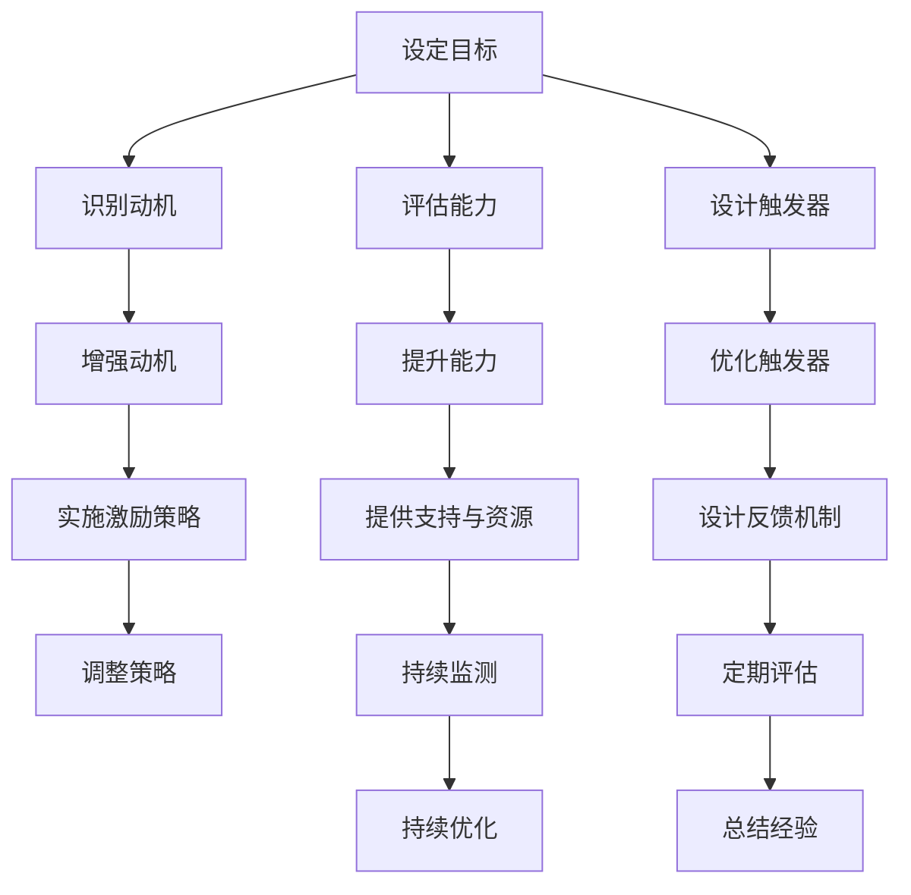

                 

## 文章标题: 福格行为模型在团队建设中的应用

### 关键词：福格行为模型、团队建设、动机、能力、触发器、反馈机制

### 摘要：
本文深入探讨了福格行为模型在团队建设中的应用，通过对其基本概念、工作原理以及与传统行为改变方法的对比，揭示了该模型在提高团队协作能力和领导力发展方面的优势。文章进一步结合实际案例，详细阐述了如何将福格行为模型应用于团队建设、领导力发展和跨部门合作，为企业管理者提供了一套科学、实用的策略。最后，文章提出了实施福格行为模型的策略和效果评估方法，为读者提供了完整的应用指南。

### 引言

团队建设是现代企业成功的关键之一。在一个高度竞争和快速变化的市场环境中，企业需要高效、灵活的团队来应对各种挑战。然而，如何有效地建设和管理团队，提高团队的整体协作能力和执行力，一直是企业管理者面临的难题。传统的团队建设方法往往侧重于技能培训和激励机制，但往往忽视了团队成员的内在动机和能力。这就导致了团队建设的效果往往不尽如人意，团队协作的效能难以达到预期。

福格行为模型（BJ Fogg Behavior Model）提供了一个全新的视角来理解和改变人类行为。该模型由斯坦福大学行为科学家BJ Fogg提出，旨在解释和预测人们的行为，以及如何设计环境和激励策略来引导和改变这些行为。福格行为模型认为，行为的发生取决于三个要素：动机、能力和触发器。只有当这三个要素同时满足时，行为才会发生。

本文将首先介绍福格行为模型的基本概念和原理，分析其与传统行为改变方法的区别，并探讨其在个人行为改变中的应用。接着，文章将深入探讨福格行为模型在团队建设、领导力发展和跨部门合作中的应用，结合实际案例进行详细说明。最后，文章将提出福格行为模型在团队建设中的实施策略和效果评估方法，为企业管理者提供实用的操作指南。

### 第一部分：福格行为模型概述

#### 第1章：福格行为模型概念与原理

##### 1.1 福格行为模型的基本概念

福格行为模型是一种基于行为科学原理的行为预测和改变模型，由斯坦福大学行为科学家BJ Fogg提出。该模型的核心思想是：行为的发生取决于三个要素——动机、能力和触发器。只有当这三个要素同时满足时，行为才会发生。

- **动机（Motivation）**：动机是指个体产生某种行为的内在驱动力。它可以来自个体的需求、兴趣、愿望等。动机是行为发生的首要条件。
  
- **能力（Ability）**：能力是指个体完成某种行为所需的外在条件，包括知识、技能、资源等。如果个体缺乏必要的能力，即使有动机，行为也无法实现。

- **触发器（Trigger）**：触发器是促使个体实施行为的即时刺激。它可以是提醒、机会、外部事件等。触发器是行为发生的即时条件。

##### 1.2 行为、动机、能力与触发器的关系

福格行为模型认为，行为、动机、能力和触发器之间存在着紧密的相互作用关系。

- **动机是行为的内在驱动力，决定了个体是否有意愿进行某种行为。**
- **能力是行为的外在条件，决定了个体是否具备实施某种行为的可能性。**
- **触发器是行为的即时刺激，促使个体在合适的时机采取行动。**

当这三个要素同时满足时，行为就会发生。具体来说：

- 如果只有动机，而没有能力和触发器，个体可能感到困惑或无力行动。
- 如果只有能力和触发器，而没有动机，个体可能不会采取行动。
- 如果只有动机和能力，而没有触发器，个体可能无法及时采取行动。

##### 1.3 福格行为模型与传统行为改变方法对比

传统的行为改变方法，如行为训练、激励计划等，往往侧重于外部因素的改变，而忽视了内在动机和能力的培养。这些方法虽然在某些情况下能取得一定的效果，但往往难以持久。相比之下，福格行为模型更关注内在动机和能力的培养，通过设计和优化环境来引导和改变行为。

- **传统方法**：
  - **行为训练**：通过反复练习来培养行为习惯。
  - **激励计划**：通过奖励和惩罚来激发个体的行为。

- **福格行为模型**：
  - **动机激励**：通过理解个体的内在需求，激发其动机。
  - **能力提升**：通过提供必要的知识和资源，提升个体的能力。
  - **触发器设计**：通过设计合适的触发器，引导个体在合适的时机采取行动。

##### 1.4 福格行为模型在个人行为改变中的应用

福格行为模型不仅在团队建设和组织管理中具有广泛应用，在个人行为改变方面也表现出强大的效果。以下是一个具体的案例：

**案例：减肥**

假设一个人想要减肥，他/她可以按照福格行为模型进行以下操作：

1. **设定目标**：明确减肥的目标，如每月减重2公斤。

2. **动机激励**：找出减肥背后的动机，如提升健康水平、改善外貌等。

3. **能力提升**：学习健康饮食和锻炼的知识和技能，掌握减肥的方法。

4. **触发器设计**：设定每周的锻炼计划和饮食计划，作为触发器。

通过以上步骤，个体可以逐步养成健康的生活习惯，实现减肥目标。

##### 总结

福格行为模型提供了一个系统化的框架来理解和改变人类行为。通过关注动机、能力和触发器这三个要素，管理者可以更有效地设计和优化团队建设策略，提高团队协作能力。本文接下来将进一步探讨福格行为模型在组织中的应用，结合实际案例进行深入分析。

#### 第2章：福格行为模型在组织中的应用

福格行为模型不仅在个人行为改变中表现出色，在组织管理和团队建设中同样具有广泛的应用价值。通过将动机、能力和触发器这三个要素应用于组织内部，管理者可以更有效地激发团队成员的积极性，提高团队的整体协作能力和执行力。以下将详细探讨福格行为模型在团队建设中的核心原则及其在组织中的应用策略。

##### 2.1 福格行为模型在团队建设中的核心原则

福格行为模型在团队建设中的应用，主要基于以下几个核心原则：

- **共同目标**：共同的目标是团队协作的基础。只有当团队成员明确共同的目标，并为此共同努力时，团队协作才能高效进行。

- **激励与支持**：激励和支持是激发团队成员动机的重要手段。管理者需要通过多种方式，如奖励、认可、培训等，来激励团队成员，并为其提供必要的支持。

- **沟通与反馈**：有效的沟通和反馈机制是团队协作的润滑剂。通过建立良好的沟通渠道和反馈机制，团队成员可以及时了解彼此的工作进展，发现问题并共同解决。

##### 2.2 利用福格行为模型提升团队协作能力

为了提升团队协作能力，管理者可以按照福格行为模型的三个要素——动机、能力和触发器，采取以下策略：

- **提高团队成员的动机**：
  - **了解个体需求**：管理者需要了解团队成员的内在需求，如职业发展、工作成就、团队氛围等，从而设计出有针对性的激励机制。
  - **设定合理目标**：设定具体、可实现的短期和长期目标，帮助团队成员明确努力的方向，激发其内在动机。
  - **提供反馈与认可**：定期给予团队成员反馈，认可其工作成果，增强其成就感和归属感。

- **增强团队成员的能力**：
  - **培训与发展**：为团队成员提供专业的培训和发展机会，提升其专业技能和知识水平。
  - **资源支持**：确保团队成员拥有完成任务的必要资源和工具，如技术支持、时间安排等。
  - **知识共享**：鼓励团队成员之间分享知识和经验，提高整个团队的能力水平。

- **创建有效的触发器和上下文**：
  - **设定明确的任务和期限**：为团队成员设定明确的任务和期限，作为触发器，促使其在规定的时间内完成任务。
  - **优化工作环境**：为团队成员创造一个舒适、高效的工作环境，减少干扰，提高工作效率。
  - **制定协同工作流程**：建立规范的工作流程和协作机制，确保团队成员之间的工作协调和配合。

- **设计有效的反馈机制**：
  - **定期评估与反馈**：定期对团队成员的工作进行评估，并提供具体的反馈意见，帮助他们了解自己的工作表现和改进方向。
  - **鼓励双向沟通**：鼓励团队成员之间进行开放、坦诚的沟通，分享工作心得和问题，共同寻找解决方案。
  - **激励改进与成长**：通过奖励机制，激励团队成员在工作中不断改进和成长，提高整体协作能力。

##### 2.3 福格行为模型在领导力发展中的应用

福格行为模型在领导力发展中的应用，主要侧重于如何通过激励、支持和引导，提高团队成员的动机和能力，从而提升领导者的领导效能。以下是一些具体的应用策略：

- **明确领导角色与责任**：领导者需要明确自己的角色和责任，为团队成员提供明确的指导和支持。

- **建立积极的工作环境**：领导者需要营造一个积极、开放的工作环境，鼓励团队成员之间的沟通和合作。

- **激励员工的创新与成长**：领导者需要通过多种方式，如奖励、培训、认可等，激励员工的创新意识和成长动力。

- **培养团队文化**：领导者需要培养一种积极向上的团队文化，如诚信、合作、创新等，激发团队成员的内在动机。

##### 2.4 福格行为模型在跨部门合作中的实践

跨部门合作是现代企业中常见的情况，如何通过福格行为模型优化跨部门合作，提高整体协同效应，是一个重要课题。以下是一些具体的应用策略：

- **建立跨部门沟通机制**：通过定期会议、工作坊等形式，促进跨部门之间的沟通和协作。

- **设定共同目标**：确保跨部门团队明确共同的目标和愿景，提高协作的积极性。

- **提供资源支持**：为跨部门团队提供必要的资源和工具，确保他们能够顺利完成任务。

- **设计激励机制**：通过奖励机制，激励跨部门团队成员积极参与合作，提高整体协作效果。

##### 总结

福格行为模型为团队建设提供了一种系统化的方法，通过关注动机、能力和触发器这三个关键要素，管理者可以更有效地激发团队成员的积极性，提高团队的整体协作能力和执行力。本文接下来将通过实际案例，进一步探讨福格行为模型在团队建设、领导力发展和跨部门合作中的应用。

### 第3章：成功的团队建设案例

在本章中，我们将通过两个具体的案例，深入探讨福格行为模型在团队建设中的应用。这两个案例分别来自于一个初创公司和一家大型企业的项目团队，展示了如何通过福格行为模型，有效提升团队协作能力和执行力。

#### 案例一：初创公司如何运用福格行为模型打造高效团队

某初创公司在成立初期，面临团队成员分散、沟通不畅、工作效率低下等问题。为了提升团队协作能力，公司决定采用福格行为模型进行团队建设。以下是具体的实施过程：

1. **设定共同目标**：
   - 初创公司明确了公司的长期愿景和短期目标，如开发一款创新的产品，并在市场获得竞争优势。
   - 公司将这个目标传达给每一位团队成员，确保他们明确自己的职责和贡献。

2. **提高团队成员的动机**：
   - 公司通过了解团队成员的个人需求，设计了一系列激励机制，如绩效奖金、股权激励等，以激发他们的内在动机。
   - 定期组织团队建设活动，如团队拓展训练、团建聚餐等，增强团队成员之间的凝聚力。

3. **增强团队成员的能力**：
   - 公司为团队成员提供了专业的培训机会，包括产品知识、技术技能等，提升他们的专业能力。
   - 通过内部知识共享平台，鼓励团队成员之间分享经验和心得，提高整体团队的知识储备。

4. **创建有效的触发器和上下文**：
   - 公司制定了详细的项目计划和任务分配，确保每位团队成员明确自己的工作内容和进度。
   - 通过项目管理工具，如JIRA、Trello等，实时跟踪项目进展，确保团队成员之间的工作协调和配合。

5. **设计有效的反馈机制**：
   - 公司建立了定期的团队会议制度，团队成员可以在这个平台上分享工作进展、遇到的问题以及改进措施。
   - 公司还设立了绩效评估机制，对团队成员的工作表现进行定期评估，并提供具体的反馈和建议。

通过以上措施，初创公司的团队协作能力和执行力显著提升，项目进展顺利，产品开发取得了显著成果。

#### 案例二：如何通过福格行为模型提升项目团队的执行力

某大型企业的项目团队在执行一个关键项目时，遇到了团队成员缺乏主动性、工作进展缓慢等问题。为了提升项目团队的执行力，企业决定引入福格行为模型，具体实施过程如下：

1. **设定共同目标**：
   - 企业明确了项目的目标和关键里程碑，如按时完成产品开发、达到预期的市场表现等。
   - 企业将这个目标传达给每一位团队成员，确保他们了解项目的整体进度和重要性。

2. **提高团队成员的动机**：
   - 企业通过设定合理的绩效奖金和晋升机会，激发团队成员的工作积极性。
   - 企业定期组织项目进展汇报会，让团队成员了解项目的进展和成果，增强他们的成就感和归属感。

3. **增强团队成员的能力**：
   - 企业为团队成员提供了专业的技能培训，包括项目管理、技术技能等，提升他们的专业能力。
   - 企业还建立了内部知识库，鼓励团队成员分享经验和最佳实践，提高整体团队的知识储备。

4. **创建有效的触发器和上下文**：
   - 企业制定了详细的项目计划和里程碑计划，确保每位团队成员明确自己的工作任务和时间节点。
   - 企业引入了项目管理工具，如Microsoft Project、Trello等，实时跟踪项目进展，确保团队成员之间的工作协调和配合。

5. **设计有效的反馈机制**：
   - 企业建立了定期的项目评审会议，团队成员可以在这个平台上分享工作进展、遇到的问题以及改进措施。
   - 企业还设立了绩效评估机制，对团队成员的工作表现进行定期评估，并提供具体的反馈和建议。

通过以上措施，项目团队的执行力得到了显著提升，项目按计划顺利完成，并取得了预期的市场表现。

##### 总结

通过以上两个案例，我们可以看到，福格行为模型在团队建设中的应用，为初创公司和大型企业的项目团队提供了有效的解决方案。通过设定共同目标、提高动机、增强能力、创建触发器和设计反馈机制，团队协作能力和执行力得到了显著提升。这些实践证明，福格行为模型是一种科学、实用的团队建设方法，值得企业在实际管理中广泛应用。

### 第4章：领导力发展的实践

领导力是团队成功的关键因素之一。有效的领导者能够激发团队成员的潜力，提升团队的协作能力和执行力。在本章中，我们将结合福格行为模型，探讨如何通过提高动机、增强能力和设计有效的激励机制，成为一名更有效的领导者。

#### 第4.1节：如何利用福格行为模型成为一名更有效的领导者

福格行为模型提供了一个系统化的方法来理解和提升领导力。以下是一些具体的实践策略：

1. **了解团队成员的需求**：
   - 领导者需要通过沟通和观察，了解团队成员的个人需求和职业目标。
   - 通过了解团队成员的需求，领导者可以设计出有针对性的激励机制，激发他们的内在动机。

2. **设定清晰的期望和目标**：
   - 领导者需要明确团队的共同目标，并将这些目标分解为具体的、可衡量的任务。
   - 通过设定明确的期望和目标，领导者可以帮助团队成员明确自己的努力方向，提高工作动力。

3. **提供必要的资源和支持**：
   - 领导者需要确保团队成员具备完成任务所需的资源和工具。
   - 这包括提供技术支持、培训机会和职业发展路径等，帮助团队成员提升能力。

4. **设计有效的触发器和上下文**：
   - 领导者可以通过设定里程碑和关键时间节点，作为触发器，促使团队成员在规定的时间内完成任务。
   - 同时，领导者需要营造一个积极、支持性的工作环境，减少干扰，提高工作效率。

5. **建立反馈机制**：
   - 领导者需要建立定期的反馈机制，与团队成员分享工作进展和成果。
   - 通过反馈，领导者可以帮助团队成员了解自己的工作表现，发现问题并共同解决。

#### 案例一：如何利用福格行为模型提升领导力

某公司的项目经理李明在管理一个跨部门项目时，遇到了团队成员积极性不高、工作进度缓慢的问题。为了提升领导力，他决定采用福格行为模型进行改进。以下是他的具体做法：

1. **了解团队成员的需求**：
   - 李明通过一对一的沟通，了解团队成员的个人需求和职业目标。
   - 他发现，团队成员普遍希望获得更多的职业发展机会和培训机会。

2. **设定清晰的期望和目标**：
   - 李明明确了项目的目标和关键里程碑，并与团队成员分享。
   - 他将项目目标分解为具体的任务，并为每个任务设定了明确的时间节点。

3. **提供必要的资源和支持**：
   - 李明为团队成员提供了专业的培训机会，并确保他们具备完成任务的必要资源。
   - 他还建立了内部知识库，鼓励团队成员分享经验和最佳实践。

4. **设计有效的触发器和上下文**：
   - 李明设定了项目的里程碑和关键时间节点，作为触发器，促使团队成员在规定的时间内完成任务。
   - 他还营造了一个积极、支持性的工作环境，减少了外部干扰，提高了工作效率。

5. **建立反馈机制**：
   - 李明建立了定期的团队会议制度，团队成员可以在这个平台上分享工作进展和问题。
   - 他还设立了绩效评估机制，对团队成员的工作表现进行定期评估，并提供具体的反馈和建议。

通过以上措施，李明的领导力得到了显著提升，团队成员的积极性和工作效率也得到了提高，项目按计划顺利完成。

#### 案例二：福格行为模型在企业管理中的实际应用

某大型企业的CEO王总在管理公司时，发现团队成员之间存在沟通不畅、工作效率低下的问题。为了提升领导力和团队效能，他决定引入福格行为模型。以下是他的具体做法：

1. **了解团队成员的需求**：
   - 王总通过组织座谈会和问卷调查，了解团队成员的需求和期望。
   - 他发现，团队成员普遍希望获得更多的职业发展机会和激励措施。

2. **设定清晰的期望和目标**：
   - 王总明确了公司的愿景和战略目标，并与团队成员分享。
   - 他将公司目标分解为具体的业务指标和项目计划，并为每个计划设定了明确的时间节点。

3. **提供必要的资源和支持**：
   - 王总为团队成员提供了专业的培训机会，并确保他们具备完成任务的必要资源。
   - 他还建立了内部知识库，鼓励团队成员分享经验和最佳实践。

4. **设计有效的触发器和上下文**：
   - 王总设定了公司的关键里程碑和绩效评估时间节点，作为触发器，促使团队成员在规定的时间内完成任务。
   - 他还营造了一个积极、支持性的企业文化，减少了外部干扰，提高了工作效率。

5. **建立反馈机制**：
   - 王总建立了定期的团队会议制度，团队成员可以在这个平台上分享工作进展和问题。
   - 他还设立了绩效评估机制，对团队成员的工作表现进行定期评估，并提供具体的反馈和建议。

通过以上措施，王总的领导力得到了显著提升，团队成员的积极性和工作效率也得到了提高，公司业绩实现了稳步增长。

##### 总结

通过以上两个案例，我们可以看到，福格行为模型在领导力发展中的应用，为企业管理者提供了一种系统化的方法，通过关注动机、能力和触发器这三个关键要素，可以更有效地提升领导力，激发团队成员的积极性，提高团队的整体效能。这些实践证明，福格行为模型是一种科学、实用的领导力发展方法，值得企业管理者广泛应用。

### 第5章：跨部门合作的优化

跨部门合作是现代企业中常见且重要的一项工作。然而，由于部门之间的利益、目标和沟通方式的差异，跨部门合作往往面临诸多挑战，如沟通不畅、协作不力、协调困难等。为了优化跨部门合作，提高整体协同效应，本文将结合福格行为模型，探讨如何通过有效的策略和措施，促进跨部门合作。

#### 第5.1节：跨部门沟通的策略

沟通是跨部门合作的基础。以下是一些优化跨部门沟通的具体策略：

1. **建立明确的沟通机制**：
   - 企业应建立一套明确的沟通机制，包括定期会议、邮件沟通、即时通讯工具等，确保信息传递的及时性和准确性。

2. **强化跨部门沟通的培训**：
   - 企业应定期为员工提供跨部门沟通的培训，提高员工的沟通技巧和协作能力。

3. **设立专门的协调人员**：
   - 企业可以设立专门的跨部门协调人员，负责协调各部门之间的工作，解决沟通中的问题。

4. **制定统一的沟通标准**：
   - 企业应制定一套统一的沟通标准和模板，如邮件格式、会议议程等，确保跨部门沟通的一致性和规范性。

5. **利用技术手段提高沟通效率**：
   - 企业可以利用现代化的沟通工具，如视频会议、即时通讯软件、项目管理平台等，提高沟通效率。

#### 第5.2节：协同工作的激励机制

激励机制是激发跨部门合作积极性的关键。以下是一些优化协同工作的激励机制：

1. **设定共同目标**：
   - 企业应设定跨部门的共同目标，确保各部门在工作中相互支持、协同配合。

2. **设立团队奖励**：
   - 企业可以设立团队奖励机制，对在跨部门合作中表现突出的团队或个人进行奖励。

3. **提供职业发展机会**：
   - 企业应提供跨部门的职业发展机会，激励员工积极参与跨部门工作，提升个人能力和职业素养。

4. **营造协作文化**：
   - 企业应积极营造协作文化，鼓励员工相互支持、相互帮助，形成良好的跨部门合作氛围。

5. **定期评估与反馈**：
   - 企业应定期对跨部门合作的成效进行评估，提供具体的反馈和建议，帮助团队改进工作。

#### 第5.3节：解决跨部门冲突的方法

跨部门合作中难免会出现冲突，以下是一些解决跨部门冲突的具体方法：

1. **建立冲突解决机制**：
   - 企业应建立一套冲突解决机制，包括冲突报告、调解、决策等环节，确保冲突得到及时解决。

2. **加强沟通与协调**：
   - 企业应加强跨部门之间的沟通与协调，及时发现和解决潜在冲突。

3. **明确职责和权限**：
   - 企业应明确各部门的职责和权限，避免因职责不清导致的冲突。

4. **建立信任关系**：
   - 企业应通过多种方式，如团队建设活动、跨部门会议等，建立各部门之间的信任关系。

5. **提供心理辅导**：
   - 企业可以提供心理辅导服务，帮助员工调整心态，缓解冲突带来的压力。

#### 案例一：在一个大型企业中如何运用福格行为模型促进跨部门合作

某大型企业在进行新项目开发时，由于涉及到多个部门，如研发、市场、技术支持等，跨部门合作显得尤为重要。为了优化跨部门合作，企业决定引入福格行为模型。以下是企业的具体做法：

1. **设定共同目标**：
   - 企业明确了新项目的共同目标，如按时完成产品开发、达到预期的市场表现等。
   - 企业将这个目标传达给所有相关部门，确保他们明确自己的职责和贡献。

2. **提高团队成员的动机**：
   - 企业为相关部门提供了合理的激励机制，如项目奖金、团队绩效奖励等，激发他们的工作积极性。

3. **增强团队成员的能力**：
   - 企业为相关部门提供了专业的培训机会，包括项目管理、技术技能等，提升他们的专业能力。

4. **创建有效的触发器和上下文**：
   - 企业制定了详细的项目计划和里程碑，作为触发器，确保各部门在规定的时间内完成任务。
   - 企业还建立了项目管理平台，确保各部门之间的工作协调和配合。

5. **设计有效的反馈机制**：
   - 企业建立了定期的项目评审会议，各部门可以在这个平台上分享工作进展、遇到的问题以及改进措施。
   - 企业还设立了绩效评估机制，对各部门的工作表现进行定期评估，并提供具体的反馈和建议。

通过以上措施，企业的跨部门合作得到了显著优化，项目进展顺利，成功完成了新产品的开发。

#### 案例二：福格行为模型在跨国团队协作中的实践

某跨国公司在进行全球市场拓展时，面临跨国团队协作的挑战。为了优化跨国团队协作，公司决定引入福格行为模型。以下是公司的具体做法：

1. **设定共同目标**：
   - 公司明确了全球市场拓展的共同目标，如提高市场份额、提升品牌影响力等。
   - 公司将这个目标传达给所有跨国团队，确保他们明确自己的职责和贡献。

2. **提高团队成员的动机**：
   - 公司为跨国团队提供了全球绩效奖金、职业发展机会等激励机制，激发他们的工作积极性。

3. **增强团队成员的能力**：
   - 公司为跨国团队提供了跨文化培训、领导力培训等，提升他们的专业能力和跨文化沟通能力。

4. **创建有效的触发器和上下文**：
   - 公司制定了详细的项目计划和里程碑，作为触发器，确保跨国团队在规定的时间内完成任务。
   - 公司还建立了跨国项目管理平台，确保跨国团队之间的工作协调和配合。

5. **设计有效的反馈机制**：
   - 公司建立了定期的跨国团队评审会议，跨国团队可以在这个平台上分享工作进展、遇到的问题以及改进措施。
   - 公司还设立了绩效评估机制，对跨国团队的工作表现进行定期评估，并提供具体的反馈和建议。

通过以上措施，公司的跨国团队协作得到了显著优化，成功实现了全球市场拓展的目标。

##### 总结

通过以上两个案例，我们可以看到，福格行为模型在跨部门合作中的应用，为企业在优化跨部门沟通、协同工作和解决冲突方面提供了有效的策略和措施。通过设定共同目标、提高动机、增强能力和设计有效的触发器和反馈机制，企业可以显著提升跨部门合作的效率和质量。这些实践证明，福格行为模型是一种科学、实用的跨部门合作优化方法，值得企业在实际管理中广泛应用。

### 第三部分：实施与评估

#### 第6章：福格行为模型实施策略

为了将福格行为模型有效地应用于团队建设和组织管理，管理者需要制定一套详细的实施策略。以下是一些关键的步骤和注意事项：

##### 6.1 制定明确的行动计划

实施福格行为模型的第一步是制定一个明确的行动计划。这个计划应该包括以下几个方面：

1. **目标设定**：明确团队或组织的长期和短期目标，确保这些目标具体、可衡量、可实现、相关性强和时间限定期。

2. **责任分配**：为每个目标和任务分配具体的责任人，确保每个人都知道自己的职责和期望。

3. **时间表**：为每个任务设定明确的时间节点，制定一个详细的项目计划，确保团队能够按照计划执行。

4. **资源规划**：确保团队成员拥有完成任务的必要资源，包括人力、技术和资金等。

##### 6.2 选择合适的实施工具

为了有效地实施福格行为模型，管理者需要选择合适的工具和平台。以下是一些常用的工具：

1. **项目管理工具**：如JIRA、Trello、Asana等，用于任务分配、进度跟踪和团队协作。

2. **沟通工具**：如Slack、Microsoft Teams、Zoom等，用于团队沟通和协调。

3. **反馈机制**：建立反馈机制，如定期的团队会议、绩效评估工具等，用于收集和反馈团队成员的工作表现。

4. **培训和知识共享平台**：如LinkedIn Learning、内部培训系统等，用于提升团队成员的能力。

##### 6.3 监测与调整策略

在实施福格行为模型的过程中，管理者需要持续监测实施效果，并根据实际情况进行调整。以下是一些具体的监测和调整方法：

1. **定期评估**：定期对团队成员的工作表现进行评估，包括动机、能力和触发器的满足情况。

2. **反馈收集**：通过定期的反馈会议、调查问卷等形式，收集团队成员对实施效果的反馈。

3. **数据分析**：利用数据分析工具，对团队成员的行为数据进行分析，识别问题并提出改进措施。

4. **调整策略**：根据监测和反馈结果，及时调整实施策略，确保团队建设和组织管理的有效性。

##### 总结

通过制定明确的行动计划、选择合适的实施工具和持续监测与调整策略，管理者可以有效地实施福格行为模型，提升团队协作能力和执行力。这些策略不仅适用于团队建设，也可以应用于其他组织管理领域，为企业的发展提供有力的支持。

#### 第7章：评估福格行为模型的效果

评估福格行为模型的效果是确保其成功实施的关键环节。以下将详细探讨评估指标的选择、数据分析的方法以及改进与持续优化。

##### 7.1 评估指标的选择

为了准确评估福格行为模型的效果，管理者需要选择合适的评估指标。这些指标应能够全面反映动机、能力、触发器以及团队协作和执行力等方面的改进。以下是一些常用的评估指标：

1. **任务完成率**：衡量团队在预定时间内完成任务的比率，反映触发器的有效性和团队执行力的提升。

2. **员工满意度**：通过调查问卷、访谈等方式，了解团队成员对工作环境和团队合作满意度的变化，反映动机和激励机制的改进。

3. **绩效指标**：包括个人和团队的关键绩效指标（KPI），如销售额、项目成功率、工作效率等，反映能力提升的效果。

4. **知识共享程度**：通过记录知识共享活动的频率和质量，衡量团队成员之间的协作和知识传递情况。

5. **创新和改进建议**：统计团队成员提出的创新和改进建议的数量和质量，反映团队积极性和创造力的提升。

##### 7.2 数据分析的方法

在收集到相关数据后，管理者需要利用数据分析的方法，对这些数据进行整理和分析，以评估福格行为模型的效果。以下是一些常用的数据分析方法：

1. **描述性统计分析**：通过计算平均数、中位数、标准差等统计量，了解数据的基本特征和趋势。

2. **相关性分析**：通过计算变量之间的相关系数，分析动机、能力、触发器与任务完成率、员工满意度等指标之间的相关性，找出关键影响因素。

3. **回归分析**：利用回归模型，分析自变量（动机、能力、触发器等）对因变量（任务完成率、员工满意度等）的影响，确定影响程度和显著性。

4. **时间序列分析**：通过分析数据在不同时间点的变化趋势，评估福格行为模型实施的长期效果。

##### 7.3 改进与持续优化

评估福格行为模型的效果不仅仅是为了了解当前的执行情况，更重要的是通过评估结果，找出存在的问题和改进空间，进行持续优化。以下是一些改进和优化的方法：

1. **识别问题**：通过数据分析，找出影响团队协作和执行力的关键因素，如沟通不畅、资源不足、激励机制不完善等。

2. **采取纠正措施**：针对发现的问题，采取相应的纠正措施，如加强培训、改进沟通机制、优化资源分配等。

3. **反馈机制**：建立持续的反馈机制，将评估结果及时反馈给团队成员，并鼓励他们提出改进建议。

4. **持续监测**：在实施改进措施后，持续监测团队的工作表现，评估改进效果，确保持续优化。

5. **学习和分享**：将成功经验和改进措施进行总结和分享，形成最佳实践，应用于其他团队和项目。

##### 总结

评估福格行为模型的效果是确保其成功实施和持续改进的关键。通过选择合适的评估指标、利用数据分析方法和采取持续优化的措施，管理者可以有效地评估和提升团队建设和组织管理的效能，为企业的发展提供强有力的支持。

### 附录

#### 附录A：福格行为模型相关资源

为了更好地理解和应用福格行为模型，以下是一些推荐的参考书籍、文章、在线工具和平台，以及实践指南和案例集。

- **参考书籍**：
  - 《福格行为模型：改变行为，实现目标》（BJ Fogg著）
  - 《行为设计学：塑造人们行为的五大策略》（Richard L. Petty著）
  - 《行为心理学：人类行为的科学解释》（Daniel Kahneman著）

- **文章和论文**：
  - “The Fogg Behavior Model”（BJ Fogg）
  - “Behavioral Design: The Architecture of Everyday Life”（Dan Ariely）
  - “Motivation, Ability, and Trigger: The Fogg Behavior Model”（APA Journal）

- **在线工具和平台**：
  - Fogg Behavior Model Calculator：在线计算工具，用于评估和设计行为触发器。
  - BehaviorMatrix：行为设计工具，用于创建和优化行为策略。

- **实践指南和案例集**：
  - “Behavior Design Guide”（Behavioural Insights Team）
  - “The Behavior Change Playbook”（Behavioral Science Club）

#### 附录B：福格行为模型应用流程图

以下是福格行为模型的应用流程图，展示了如何将动机、能力和触发器这三个要素结合起来，设计行为改变策略。



#### 附录C：福格行为模型伪代码示例

以下是一个简单的福格行为模型伪代码示例，用于说明如何检测动机、激励策略、能力提升和反馈机制。

```plaintext
// 动机检测与激励策略
function detectMotivation(user) {
    motivationScore = calculateMotivationScore(user)
    if (motivationScore > threshold) {
        applyIncentive(user)
    } else {
        provideMotivationalContent(user)
    }
}

// 能力评估与提升方法
function evaluateAbility(user) {
    abilityScore = calculateAbilityScore(user)
    if (abilityScore < threshold) {
        provideTraining(user)
    } else {
        confirmReadyForTask(user)
    }
}

// 触发器设计与上下文优化
function designTrigger(context) {
    trigger = generateTrigger(context)
    if (context.matchesConditions()) {
        scheduleTrigger(trigger)
    } else {
        adjustContext(context)
    }
}

// 反馈机制的设计与实现
function implementFeedbackMechanism(user) {
    feedback = collectFeedback(user)
    if (feedback.includesImprovementTips()) {
        applyFeedbackTips(user)
    } else {
        encourageContinuousFeedback(user)
    }
}
```

通过以上附录内容，读者可以更全面地了解福格行为模型的理论和实践应用，为实际工作中的行为改变和团队建设提供参考和指导。作者：AI天才研究院/AI Genius Institute & 禅与计算机程序设计艺术 /Zen And The Art of Computer Programming。

