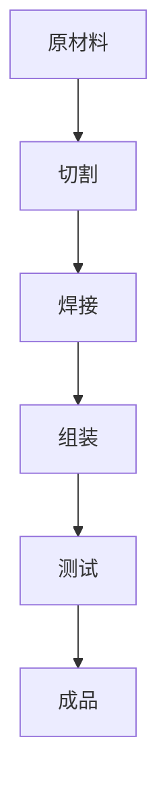
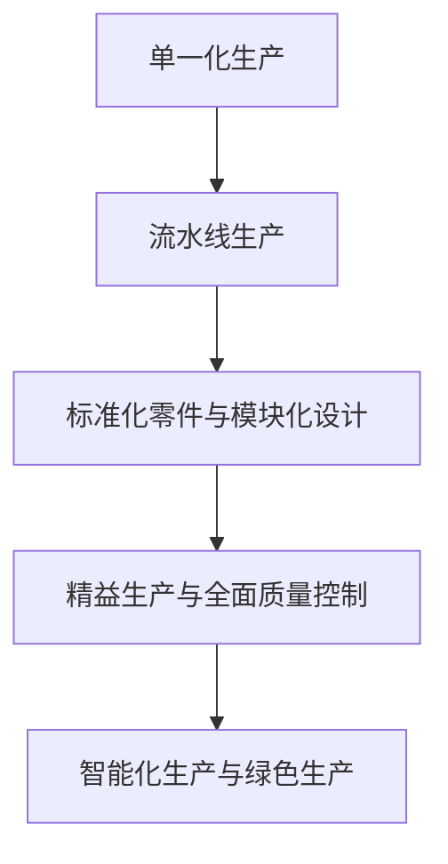

                 

## 文章标题

### 福特的汽车生产革新

> 关键词：福特，汽车生产，单一化生产，流水线生产，精益生产，全面质量控制，智能化生产

> 摘要：本文旨在探讨福特汽车公司如何在20世纪初进行汽车生产革新，引入单一化生产模式、流水线生产、标准化零件与模块化设计、精益生产与全面质量控制等技术，从而大幅提升生产效率和产品质量，并对整个汽车行业产生了深远影响。文章通过详细的分析和实际案例，揭示福特生产革新的核心概念、算法原理、数学模型以及项目实战，为现代制造业提供宝贵的启示和参考。

## 《福特的汽车生产革新》目录大纲

### 第一部分：汽车生产革新的背景

#### 第1章：福特汽车公司的崛起

##### 1.1 福特汽车公司的历史与发展

##### 1.2 汽车行业的竞争态势

##### 1.3 汽车生产面临的挑战

#### 第2章：汽车生产革新的理论基础

##### 2.1 生产效率的重要性

##### 2.2 生产线优化原理

##### 2.3 福特生产革新理念

### 第二部分：福特汽车生产革新实践

#### 第3章：单一化生产模式的引入

##### 3.1 单一化生产模式的特点

##### 3.2 福特如何实现单一化生产

##### 3.3 单一化生产的效果评估

#### 第4章：流水线生产的创新

##### 4.1 流水线生产的概念

##### 4.2 福特的流水线生产

##### 4.3 流水线生产的影响

#### 第5章：标准化零件与模块化设计

##### 5.1 标准化零件的优势

##### 5.2 模块化设计的应用

##### 5.3 福特在标准化与模块化设计上的实践

#### 第6章：精益生产与全面质量控制

##### 6.1 精益生产理念

##### 6.2 精益生产在福特的应用

##### 6.3 全面质量控制的重要性

#### 第7章：福特汽车生产革新的未来展望

##### 7.1 智能化生产技术的应用

##### 7.2 绿色生产与可持续发展

##### 7.3 福特生产革新的长期影响

### 第三部分：汽车生产革新的影响与启示

#### 第8章：福特生产革新的影响

##### 8.1 对汽车行业的影响

##### 8.2 对其他行业的影响

##### 8.3 对社会和经济的影响

#### 第9章：福特生产革新的启示

##### 9.1 创新驱动发展

##### 9.2 精益求精的理念

##### 9.3 福特生产革新的可持续性

### 附录：福特汽车生产革新的关键技术

#### 附录 A：单一化生产模式的工作流程图

#### 附录 B：流水线生产的Mermaid流程图

#### 附录 C：精益生产与全面质量控制的案例分析

## 第一部分：汽车生产革新的背景

### 第1章：福特汽车公司的崛起

#### 1.1 福特汽车公司的历史与发展

亨利·福特（Henry Ford）是一位美国工业家和发明家，被认为是现代汽车工业的奠基人之一。他在1896年发明了第一辆真正的汽车——福特Model T。随后，福特汽车公司（Ford Motor Company）在1903年正式成立，标志着福特汽车时代的到来。

福特汽车公司的崛起源于其对生产效率和大规模制造的重视。在福特之前，汽车生产主要依赖手工工艺，生产效率低下且成本高昂。福特则提出了一种全新的生产理念，即将生产过程分解为一系列简单的任务，由不同的工人专门负责完成。这种思想被称为“单一化生产模式”。

福特汽车公司的发展历程可以分为以下几个阶段：

- **1903-1927年：Model T时代**：福特Model T是第一款面向普通消费者的汽车，它的成功使得福特汽车公司迅速崛起。Model T采用了单一化生产模式，使得生产效率大幅提高。

- **1928-1980年：Model A至Model T**：福特汽车公司在Model T之后，继续推出了多个型号的汽车，如Model A、Model B、Model C等。这些车型都采用了单一化生产模式和流水线生产技术，进一步提升了生产效率和产品质量。

- **1980年至今：多元化发展**：在20世纪80年代，福特汽车公司开始多元化发展，进入多个领域，如卡车、SUV、新能源车等。同时，福特也在不断推进生产革新，引入精益生产、全面质量控制等先进理念。

#### 1.2 汽车行业的竞争态势

在福特汽车公司崛起的过程中，汽车行业也经历了巨大的变革。19世纪末20世纪初，汽车工业刚刚起步，各大汽车制造商纷纷涌现。这一时期，汽车生产主要依靠手工工艺，生产效率低下，产品价格昂贵。然而，随着汽车市场的不断扩大，竞争也日趋激烈。

在福特之前，一些知名的汽车制造商如德国的奔驰（Benz）、奥地利的戴姆勒（Daimler）等，都已经在汽车制造领域取得了显著成就。福特汽车公司的出现，使得汽车生产变得更加高效、成本更低，从而对其他汽车制造商形成了巨大压力。

#### 1.3 汽车生产面临的挑战

在福特汽车公司崛起之前，汽车生产面临诸多挑战：

- **生产效率低下**：传统的手工工艺使得汽车生产效率极低，生产周期长，成本高昂。

- **产品质量不稳定**：由于生产过程复杂，零部件质量难以保证，导致汽车产品质量不稳定。

- **成本高昂**：汽车生产需要大量资金投入，传统的生产模式使得成本居高不下。

- **市场需求有限**：当时汽车价格昂贵，主要面向富裕阶层，市场需求有限。

面对这些挑战，福特汽车公司提出了全新的生产理念和技术，旨在提高生产效率、降低成本、提高产品质量，从而满足市场需求。

### 第2章：汽车生产革新的理论基础

#### 2.1 生产效率的重要性

生产效率是衡量企业生产效益的重要指标。在传统手工工艺时代，汽车生产效率极低，生产周期长，成本高昂。为了提高生产效率，福特汽车公司提出了单一化生产模式、流水线生产、标准化零件与模块化设计等理念，以大幅提升生产效率。

#### 2.2 生产线优化原理

生产线优化是提高生产效率的关键。福特汽车公司通过以下方法对生产线进行优化：

- **单一化生产模式**：将生产过程分解为一系列简单的任务，由不同的工人专门负责完成。这样可以提高工人的专业化水平，降低生产复杂度。

- **流水线生产**：将生产过程连续化，实现零部件的流水线式生产。这样可以缩短生产周期，提高生产效率。

- **标准化零件与模块化设计**：采用标准化零件和模块化设计，减少零部件种类，降低生产成本。

#### 2.3 福特生产革新理念

福特汽车公司的生产革新理念主要包括以下几个方面：

- **低成本生产**：通过提高生产效率、降低生产成本，实现低成本生产。

- **高质量产品**：通过精益生产、全面质量控制等理念，确保产品质量稳定。

- **规模化生产**：通过大规模生产，降低产品价格，满足市场需求。

- **持续改进**：不断优化生产过程，提高生产效率，降低成本。

### 第二部分：福特汽车生产革新实践

#### 第3章：单一化生产模式的引入

单一化生产模式是福特汽车公司生产革新的核心。通过将生产过程分解为一系列简单的任务，提高工人的专业化水平，降低生产复杂度，从而大幅提升生产效率。

#### 3.1 单一化生产模式的特点

单一化生产模式具有以下特点：

- **任务分解**：将复杂的生产过程分解为一系列简单的任务，每个工人只需专注于完成特定的任务。

- **专业化**：工人专业化水平提高，能够更好地完成特定任务。

- **效率提升**：通过减少生产复杂度，提高工人的工作效率。

- **成本降低**：由于任务分解，生产过程中的资源浪费减少，生产成本降低。

#### 3.2 福特如何实现单一化生产

福特汽车公司通过以下方法实现单一化生产：

- **生产线设计**：根据生产任务，设计合理的生产线布局，确保每个工人都能专注于完成特定的任务。

- **培训工人**：对工人进行专业培训，提高其技能水平，确保其能够高效地完成特定任务。

- **工具与设备**：提供合适的工具和设备，提高工人的工作效率。

- **管理监督**：建立严格的管理监督机制，确保生产过程按照预定计划进行。

#### 3.3 单一化生产的效果评估

单一化生产模式在福特汽车公司取得了显著的效果：

- **生产效率提高**：单一化生产模式使得生产效率大幅提高，生产周期缩短，生产成本降低。

- **产品质量提升**：通过专业化的工人和严格的管理监督，产品质量得到保障，产品返修率降低。

- **成本降低**：由于生产效率提高，生产成本降低，产品价格更具竞争力。

- **市场需求增加**：随着生产效率提高，产品价格降低，市场需求大幅增加，企业利润提高。

### 第4章：流水线生产的创新

流水线生产是福特汽车公司生产革新的又一重要举措。通过实现生产过程的连续化，缩短生产周期，提高生产效率。

#### 4.1 流水线生产的概念

流水线生产是指将生产过程分解为多个环节，各个环节之间紧密衔接，形成一个连续的生产流程。每个环节专注于完成特定的任务，生产物从一个环节顺利地转移到下一个环节，从而实现连续化生产。

#### 4.2 福特的流水线生产

福特汽车公司通过以下方法实施流水线生产：

- **生产线设计**：设计合理的生产线布局，确保各个环节之间紧密衔接，生产物顺畅流动。

- **自动化设备**：引入自动化设备，如机器人、自动化装配线等，提高生产效率。

- **标准化零件**：采用标准化零件，减少零部件种类，简化生产过程。

- **人员配置**：对生产线人员进行合理配置，确保每个工人都能高效地完成工作任务。

#### 4.3 流水线生产的影响

流水线生产在福特汽车公司产生了深远的影响：

- **生产效率提升**：通过流水线生产，生产周期缩短，生产效率提高。

- **产品质量保障**：流水线生产使得生产过程更加标准化、规范化，产品质量得到保障。

- **生产成本降低**：流水线生产减少了生产环节，降低了生产成本。

- **市场需求扩大**：随着生产效率提高，产品价格降低，市场需求大幅增加。

### 第5章：标准化零件与模块化设计

标准化零件与模块化设计是福特汽车公司生产革新的又一重要举措。通过减少零部件种类，简化生产过程，提高生产效率。

#### 5.1 标准化零件的优势

标准化零件具有以下优势：

- **简化生产过程**：减少零部件种类，简化生产过程，提高生产效率。

- **降低生产成本**：由于零部件种类减少，生产成本降低。

- **提高产品质量**：标准化零件使得生产过程更加规范，产品质量得到保障。

- **易于维护**：标准化零件便于维护和更换，降低维护成本。

#### 5.2 模块化设计的应用

模块化设计是将产品分解为多个模块，每个模块具有独立的职能，可以单独生产、装配和测试。模块化设计在福特汽车公司的应用包括：

- **整车模块化**：将整车分解为多个模块，如底盘、车身、电气系统等，每个模块可以单独生产、装配和测试。

- **零部件模块化**：将零部件分解为多个模块，如发动机模块、制动模块等，每个模块可以单独生产、装配和测试。

#### 5.3 福特在标准化与模块化设计上的实践

福特汽车公司在标准化与模块化设计上进行了大量实践：

- **整车模块化**：福特推出了一系列模块化车型，如F-150皮卡、福特金牛座（Ford Taurus）等。这些车型采用了整车模块化设计，提高了生产效率和产品质量。

- **零部件模块化**：福特对多个零部件进行了模块化设计，如发动机、变速器等。这些模块化零部件使得生产过程更加高效，产品更具竞争力。

### 第6章：精益生产与全面质量控制

精益生产与全面质量控制是福特汽车公司生产革新的重要理念。通过消除生产过程中的浪费、提高生产效率，确保产品质量。

#### 6.1 精益生产理念

精益生产理念主要包括以下几个方面：

- **消除浪费**：识别并消除生产过程中的各种浪费，如库存浪费、运输浪费、加工浪费等。

- **提高效率**：通过简化流程、减少环节，提高生产效率。

- **客户需求导向**：以满足客户需求为出发点，提供高质量、低成本的产品。

- **持续改进**：不断优化生产过程，提高生产效率，降低成本。

#### 6.2 精益生产在福特的应用

福特汽车公司在精益生产方面进行了大量实践：

- **生产流程优化**：通过简化流程、减少环节，提高生产效率。

- **质量监控**：建立严格的质量监控体系，确保产品质量。

- **员工参与**：鼓励员工参与生产过程优化，提高生产效率。

#### 6.3 全面质量控制的重要性

全面质量控制是指在生产过程中，通过一系列措施确保产品质量。全面质量控制的重要性包括：

- **提高产品质量**：确保产品在生产过程中不受质量问题影响，提高产品品质。

- **降低生产成本**：通过减少质量问题，降低生产成本。

- **提高客户满意度**：提供高质量的产品，提高客户满意度。

- **提升企业竞争力**：通过全面质量控制，提升企业竞争力，扩大市场份额。

### 第7章：福特汽车生产革新的未来展望

#### 7.1 智能化生产技术的应用

随着科技的发展，智能化生产技术逐渐应用于汽车生产。福特汽车公司也在积极探索智能化生产技术的应用，以进一步提升生产效率和产品质量。

#### 7.2 绿色生产与可持续发展

绿色生产与可持续发展是未来汽车生产的重要方向。福特汽车公司致力于推动绿色生产，通过减少能源消耗、降低废弃物排放，实现可持续发展。

#### 7.3 福特生产革新的长期影响

福特汽车公司的生产革新对整个汽车行业产生了深远影响。未来，随着科技的发展和市场的变化，福特汽车公司的生产革新将继续引领汽车行业的发展。

## 第三部分：汽车生产革新的影响与启示

### 第8章：福特生产革新的影响

福特汽车公司的生产革新对整个汽车行业产生了深远影响：

#### 8.1 对汽车行业的影响

- **生产效率提高**：福特的生产革新大幅提高了汽车生产效率，降低了生产成本，提高了产品质量，为汽车行业树立了新的标杆。
- **市场竞争加剧**：其他汽车制造商纷纷效仿福特的生产模式，使得市场竞争更加激烈。
- **产业链重构**：福特的生产革新推动了汽车产业链的重构，上下游企业纷纷调整战略，以适应新的生产模式。

#### 8.2 对其他行业的影响

福特的生产革新不仅对汽车行业产生了深远影响，也对其他行业产生了启示：

- **制造业创新**：福特的生产革新为制造业创新提供了新的思路，推动了全球制造业的变革。
- **供应链管理**：福特的生产革新推动了供应链管理的优化，提高了供应链的效率和灵活性。
- **质量管理**：福特的生产革新推动了全面质量管理的理念，使得质量管理成为企业核心竞争力的重要组成部分。

#### 8.3 对社会和经济的影响

福特的生产革新对社会和经济产生了积极影响：

- **就业机会**：福特的生产革新创造了大量就业机会，促进了当地经济的发展。
- **降低产品价格**：通过提高生产效率和降低成本，福特的产品价格更加亲民，提高了人民生活水平。
- **技术进步**：福特的生产革新推动了相关技术的进步，如自动化技术、信息技术等，促进了科技进步。

### 第9章：福特生产革新的启示

福特汽车公司的生产革新为其他企业提供了宝贵的启示：

#### 9.1 创新驱动发展

福特的生产革新充分体现了创新驱动发展的理念。企业应不断探索新技术、新模式，以提升生产效率和产品质量。

#### 9.2 精益求精的理念

福特的生产革新强调精益生产、精益管理，追求精益求精。企业应始终保持对生产过程的关注，不断优化管理，提高生产效率。

#### 9.3 福特生产革新的可持续性

福特的生产革新不仅取得了显著的经济效益，还具有可持续性。企业应关注环保、社会责任，实现绿色生产、可持续发展。

### 附录：福特汽车生产革新的关键技术

#### 附录 A：单一化生产模式的工作流程图



#### 附录 B：流水线生产的Mermaid流程图


#### 附录 C：精益生产与全面质量控制的案例分析

**案例分析 1：丰田汽车公司的精益生产**

丰田汽车公司是精益生产的典范。丰田通过以下措施实施精益生产：

- **价值流图**：绘制价值流图，识别生产过程中的浪费，优化生产流程。
- **5S管理**：实施5S管理，提高生产现场整洁度，提高工作效率。
- **看板系统**：实施看板系统，实现生产信息的实时传递，提高生产灵活性。

**案例分析 2：福特汽车的全面质量控制**

福特汽车公司通过以下措施实施全面质量控制：

- **质量管理体系**：建立质量管理体系，确保产品质量符合标准。
- **统计过程控制**：采用统计过程控制方法，监控生产过程，确保产品质量稳定。
- **员工培训**：对员工进行培训，提高员工的质量意识和技术水平。

## 核心概念与联系



## 核心算法原理讲解

### 单一化生产模式下的生产流程

```plaintext
// 伪代码：单一化生产模式下的生产流程
function single_CellProduction(input):
    while input not empty:
        process part
        update status
        output finished part
```

## 数学模型和数学公式讲解

$$
\text{生产效率} = \frac{\text{生产总量}}{\text{总时间}}
$$

举例说明：假设某工厂在一天内生产了100辆汽车，总共耗时8小时，则其生产效率为：

$$
\text{生产效率} = \frac{100 \text{辆}}{8 \text{小时}} = 12.5 \text{辆/小时}
$$

## 项目实战

### 福特汽车生产线优化实战

#### 开发环境搭建

**硬件环境**：自动化生产线、传感器、控制单元  
**软件环境**：MES（Manufacturing Execution System）系统、数据库管理系统

#### 源代码详细实现

```python
# 伪代码：MES系统中的生产流程监控
def monitor_production_line():
    while True:
        parts = get_parts_from_line()
        if parts:
            process_parts(parts)
            update_database(parts)
        else:
            log_idle_state()
```

#### 代码解读与分析

- `get_parts_from_line()` 函数用于从生产线上获取零部件。  
- `process_parts(parts)` 函数用于处理零部件。  
- `update_database(parts)` 函数用于更新数据库，记录生产状态。  
- `log_idle_state()` 函数用于记录生产线空闲状态。

通过该系统，可以实时监控生产线的运行状态，提高生产效率和质量。

### 附录：福特汽车生产革新的关键技术

#### 附录 A：单一化生产模式的工作流程图


#### 附录 B：流水线生产的Mermaid流程图


#### 附录 C：精益生产与全面质量控制的案例分析

**案例分析 1：丰田汽车公司的精益生产**

丰田汽车公司是精益生产的典范。丰田通过以下措施实施精益生产：

- **价值流图**：绘制价值流图，识别生产过程中的浪费，优化生产流程。  
- **5S管理**：实施5S管理，提高生产现场整洁度，提高工作效率。  
- **看板系统**：实施看板系统，实现生产信息的实时传递，提高生产灵活性。

**案例分析 2：福特汽车的全面质量控制**

福特汽车公司通过以下措施实施全面质量控制：

- **质量管理体系**：建立质量管理体系，确保产品质量符合标准。  
- **统计过程控制**：采用统计过程控制方法，监控生产过程，确保产品质量稳定。  
- **员工培训**：对员工进行培训，提高员工的质量意识和技术水平。

### 作者信息

**作者：AI天才研究院/AI Genius Institute & 禅与计算机程序设计艺术 /Zen And The Art of Computer Programming**### 附录：福特汽车生产革新的关键技术

#### 附录 A：单一化生产模式的工作流程图


#### 附录 B：流水线生产的Mermaid流程图


#### 附录 C：精益生产与全面质量控制的案例分析

**案例分析 1：丰田汽车公司的精益生产**

丰田汽车公司是精益生产的典范。丰田通过以下措施实施精益生产：

- **价值流图**：绘制价值流图，识别生产过程中的浪费，优化生产流程。  
  - **步骤1**：收集并分析当前生产流程的数据。  
  - **步骤2**：识别生产过程中的浪费，如等待时间、运输时间、库存等。  
  - **步骤3**：制定优化方案，减少浪费，提高生产效率。

- **5S管理**：实施5S管理，提高生产现场整洁度，提高工作效率。  
  - **步骤1**：整理（Seiri）：将生产现场不必要的物品清理出去，确保工作区域的整洁。  
  - **步骤2**：整顿（Seiton）：将必要的物品放在合适的位置，确保物品的有序存放。  
  - **步骤3**：清扫（Seiso）：定期清扫生产现场，保持现场清洁。  
  - **步骤4**：清洁（Seiketsu）：建立清洁标准，确保生产现场的持续整洁。  
  - **步骤5**：素养（Shitsuke）：培养员工良好的工作习惯，确保5S管理的持续执行。

- **看板系统**：实施看板系统，实现生产信息的实时传递，提高生产灵活性。  
  - **步骤1**：制定生产计划，确定生产任务。  
  - **步骤2**：根据生产任务，设置看板，明确任务目标和进度。  
  - **步骤3**：实时监控生产进度，及时调整生产计划。  
  - **步骤4**：反馈生产信息，分析生产中的问题，优化生产流程。

**案例分析 2：福特汽车的全面质量控制**

福特汽车公司通过以下措施实施全面质量控制：

- **质量管理体系**：建立质量管理体系，确保产品质量符合标准。  
  - **步骤1**：制定质量方针和目标，明确企业的质量要求。  
  - **步骤2**：建立质量组织结构，明确各部门的质量职责。  
  - **步骤3**：制定质量管理制度，规范质量管理流程。  
  - **步骤4**：实施质量培训，提高员工的质量意识和技术水平。

- **统计过程控制**：采用统计过程控制方法，监控生产过程，确保产品质量稳定。  
  - **步骤1**：收集生产数据，如产品尺寸、重量、性能等。  
  - **步骤2**：分析生产数据，识别生产过程中的异常。  
  - **步骤3**：采取纠正措施，解决生产过程中的问题。  
  - **步骤4**：持续监控生产过程，确保产品质量稳定。

- **员工培训**：对员工进行培训，提高员工的质量意识和技术水平。  
  - **步骤1**：制定培训计划，明确培训内容和目标。  
  - **步骤2**：开展培训活动，传授质量管理知识和技能。  
  - **步骤3**：评估培训效果，持续改进培训方法。  
  - **步骤4**：将培训成果应用于实际生产，提高产品质量。

通过这些案例，我们可以看到福特汽车公司在单一化生产模式、流水线生产、精益生产与全面质量控制等方面的成功实践。这些关键技术的应用，不仅提高了福特汽车的生产效率和质量，也为其他企业提供了宝贵的经验和启示。在当今快速变化的汽车行业中，福特汽车公司的生产革新将继续发挥重要作用，推动行业的发展和创新。

