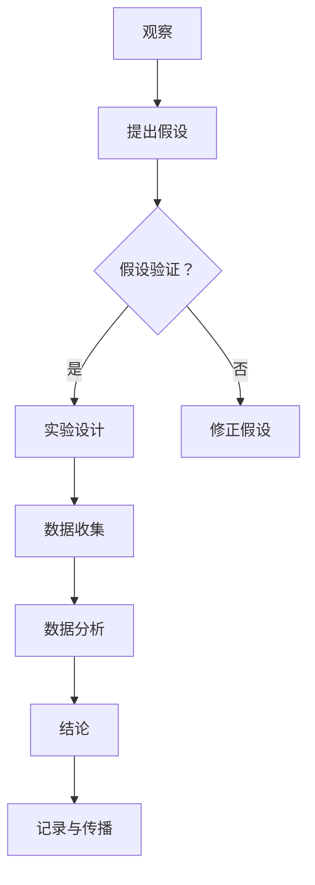
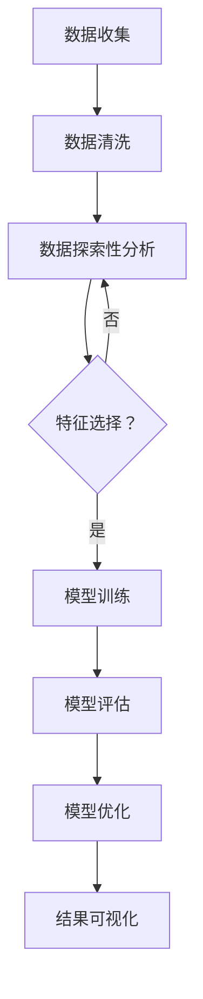
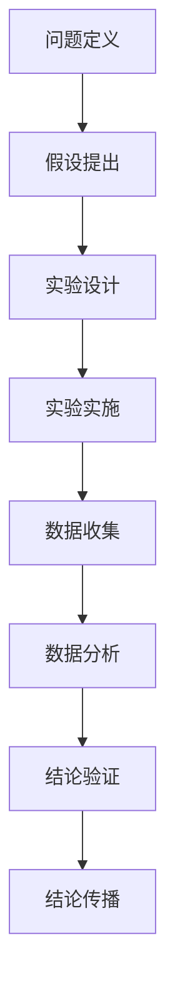

                 

# 科学探究：从假说到真理

> 关键词：科学探究、假说、证据、实验设计、数据分析、跨学科合作、伦理问题、新兴技术

> 摘要：本文深入探讨了科学探究的过程，从假说到真理的转化。通过分析科学探究的基础、实践、工具和技术，以及未来展望，本文揭示了科学探究在现代社会中的重要作用。同时，本文还探讨了科学探究中的伦理问题，并展望了科学探究的未来发展趋势。

----------------------------------------------------------------

## 《科学探究：从假说到真理》目录大纲

本文将分为三个部分，首先介绍科学探究的基础，包括起源、重要性、科学方法与流程、科学证据与假设以及科学实验设计。接下来，通过具体的案例研究，展示科学探究的实际应用。然后，讨论科学探究中的跨学科合作、伦理问题以及未来展望。最后，介绍科学探究中的数据分析技术、模拟与仿真、新兴技术，并提供科学探究的资源与工具，以及项目实战案例。

- 第一部分：科学探究基础
  - 第1章：科学探究的起源与重要性
  - 第2章：科学方法与流程
  - 第3章：科学证据与假设
  - 第4章：科学实验设计

- 第二部分：科学探究实践
  - 第5章：科学探究的案例研究
  - 第6章：科学探究中的跨学科合作
  - 第7章：科学探究中的伦理问题
  - 第8章：科学探究的未来展望

- 第三部分：科学探究工具与技术
  - 第9章：科学探究中的数据分析技术
  - 第10章：科学探究中的模拟与仿真
  - 第11章：科学探究中的新兴技术

- 附录
  - 附录A：科学探究资源与工具
  - 附录B：科学探究的Mermaid流程图
  - 附录C：科学探究中的伪代码与数学公式
  - 附录D：科学探究项目实战案例

- 词汇表与参考文献

---

让我们开始这次探索科学探究的旅程，从假说到真理，一起揭开科学的神秘面纱。

----------------------------------------------------------------

## 第一部分：科学探究基础

科学探究是获取知识和理解世界的核心过程。从古希腊时期开始，人们就开始尝试通过观察和实验来解释自然现象。科学探究的起源可以追溯到古希腊哲学家泰勒斯，他通过观察和推理提出了“水是万物的本原”的假说。这一假说虽然后来被证明是不正确的，但它开启了人类对自然界进行科学探究的先河。

### 第1章：科学探究的起源与重要性

#### 1.1 科学探究的历史背景

科学探究的历史可以追溯到古代文明，例如古埃及、古希腊和古中国。这些古代文明的科学家和哲学家通过观察、实验和推理，提出了一系列关于自然界的假说和理论。例如，古希腊的亚里士多德提出了关于天文学和生物学的一系列理论，这些理论在当时被认为是权威的。

然而，真正的科学探究始于16世纪和17世纪的欧洲。这一时期的科学家，如伽利略和牛顿，通过实验和观察，对自然界的运行机制有了更深入的理解。伽利略通过望远镜观测天体，推翻了亚里士多德的许多观点，而牛顿的《自然哲学的数学原理》则奠定了现代物理学的基础。

#### 1.2 科学探究的基本要素

科学探究的基本要素包括观察、假设、实验和验证。首先，观察是科学探究的起点，通过对自然现象的仔细观察，科学家可以收集到有价值的数据和信息。然后，基于观察，科学家提出假设，即对现象的可能解释。接下来，科学家设计实验来验证假设，通过实验数据来支持或反驳假设。最后，科学家根据实验结果对假设进行验证，从而得出结论。

#### 1.3 科学探究的重要性

科学探究在现代社会中具有极其重要的地位。首先，科学探究帮助我们理解自然界的运行机制，从而可以更好地应对各种自然现象，如气候变化、地震和海啸等。其次，科学探究推动技术进步，为人类社会带来了无数便利，如互联网、手机和电动汽车等。最后，科学探究促进了人类文明的发展，推动了科学、技术和文化的融合，为人类的未来发展奠定了基础。

### 第2章：科学方法与流程

科学方法是一种系统的、逻辑的方法，用于获取知识和理解世界。科学方法的基本流程包括观察、假设、实验、验证和结论。

#### 2.1 科学方法概述

科学方法的核心是逻辑推理和实证验证。科学家首先通过观察收集数据，然后基于数据提出假设，设计实验来验证假设，最后根据实验结果得出结论。科学方法强调可重复性和可验证性，即任何科学结论都必须能够被其他科学家重复验证。

#### 2.2 科学探究的基本流程

科学探究的基本流程可以概括为以下几个步骤：

1. **观察**：科学家通过观察自然现象，收集数据和信息。
2. **假设**：基于观察，科学家提出可能的解释，即假设。
3. **实验**：科学家设计实验来验证假设，通过实验数据来支持或反驳假设。
4. **验证**：科学家根据实验结果对假设进行验证，得出结论。
5. **结论**：科学家根据验证结果得出科学结论，并将其记录在科学文献中。

#### 2.3 科学探究中的批判性思维

科学探究不仅仅是一个实验过程，还需要批判性思维。批判性思维包括对假设的质疑、对实验设计的评估、对数据的分析和对结论的反思。科学家需要保持开放和怀疑的态度，对任何新的假设和理论都进行严格的验证。

### 第3章：科学证据与假设

科学证据是科学探究的基石，它包括观察到的数据和实验结果。科学假设是对现象的可能解释，它是科学探究的起点。

#### 3.1 科学证据的类型

科学证据可以分为三类：

1. **观察数据**：科学家通过观察和测量收集到的数据，如温度、长度、速度等。
2. **实验数据**：科学家通过实验收集到的数据，如化学反应、物理变化等。
3. **理论数据**：科学家基于理论模型和数学公式计算出的数据。

#### 3.2 如何提出科学假设

提出科学假设是科学探究的重要步骤。以下是一些常用的方法：

1. **类比法**：通过比较相似的现象，提出可能的解释。
2. **演绎法**：基于理论模型和已知事实，推导出可能的假设。
3. **归纳法**：通过观察多个实例，总结出可能的规律。

#### 3.3 假设的验证与证明

科学假设需要通过实验和观察进行验证。以下是一些常用的验证方法：

1. **实验验证**：设计实验来测试假设，通过实验数据来支持或反驳假设。
2. **观察验证**：通过观察和测量来验证假设，如使用望远镜观测天体运动。
3. **理论验证**：基于数学模型和理论计算，验证假设的正确性。

### 第4章：科学实验设计

科学实验设计是科学探究的核心环节。一个良好的实验设计可以有效地验证假设，得出可靠的结论。

#### 4.1 实验设计的基本原则

实验设计应遵循以下基本原则：

1. **随机化**：确保实验组和对照组的随机分配，避免人为干预。
2. **对照**：设置对照组，以对比实验组的结果，确保实验的准确性。
3. **可重复性**：实验设计应可重复，以便其他科学家验证结果。
4. **精确测量**：使用精确的测量工具和方法，确保数据的准确性。

#### 4.2 实验设计的常见问题

实验设计过程中可能遇到的问题包括：

1. **选择偏差**：实验对象的选择可能存在偏差，导致实验结果不准确。
2. **测量误差**：测量工具和方法可能存在误差，影响实验结果的准确性。
3. **干扰因素**：实验过程中可能存在干扰因素，影响实验结果。

#### 4.3 实验数据的分析与解释

实验数据需要通过统计方法进行分析和解释。以下是一些常用的分析方法：

1. **描述性统计**：计算数据的基本统计量，如均值、方差等。
2. **推断性统计**：使用统计方法推断总体特征，如假设检验、置信区间等。
3. **可视化**：使用图表和图形展示实验数据，帮助理解结果。

通过以上四个章节，我们对科学探究的基础有了更深入的了解。科学探究不仅仅是一个简单的实验过程，它是一个复杂的、系统性的过程，需要批判性思维和严格的实验设计。在下一部分，我们将通过具体的案例研究，进一步展示科学探究的实际应用。

### 第5章：科学探究的案例研究

科学探究的案例研究为我们提供了深入了解科学探究过程和方法的实际应用。以下我们将探讨三个具体的案例：DNA的双螺旋结构、地球气候变化的科学探究以及宇宙起源的假说与证实。

#### 5.1 案例一：DNA的双螺旋结构

DNA的双螺旋结构是现代分子生物学的基石。1953年，弗朗西斯·克里克和詹姆斯·沃森提出了DNA的双螺旋结构模型。这个模型的提出不仅解释了遗传信息的传递机制，还推动了现代生物技术的发展。

**1. 观察与假设：**

在20世纪中叶，科学家们已经了解到DNA是遗传信息的载体。然而，DNA的具体结构仍然是一个谜。沃森和克里克通过研究X射线晶体学数据和DNA分子的物理特性，提出了一个双螺旋结构的假设。

**2. 实验与验证：**

为了验证他们的假设，沃森和克里克设计了一系列实验。他们使用了X射线晶体学技术，对DNA分子进行了精确的测量，并使用模型构建方法来模拟DNA的结构。通过这些实验，他们成功证实了DNA的双螺旋结构。

**3. 结论与影响：**

DNA双螺旋结构的发现不仅揭示了遗传信息的传递机制，还推动了基因工程、基因编辑等现代生物技术的发展。这一发现对生物学、医学和生物技术领域产生了深远的影响。

#### 5.2 案例二：地球气候变化的科学探究

地球气候变化是当前全球关注的重要问题。科学家们通过多年的研究，提出了地球气候变化的假说，并通过实验和观测数据来验证这一假说。

**1. 观察与假设：**

科学家们观察到，地球的气候在过去几百年中发生了显著变化，特别是20世纪末以来，全球气温呈上升趋势。这一现象引发了科学家们对地球气候变化的假说，即人类活动（如工业化和化石燃料燃烧）是导致气候变化的主要原因。

**2. 实验与验证：**

为了验证这一假说，科学家们设计了一系列实验。他们收集了大量的气候数据，如气温、降水、海平面高度等，并使用气候模型来模拟气候变化。通过对比实验数据和气候模型模拟结果，科学家们证实了人类活动对气候变化的影响。

**3. 结论与影响：**

地球气候变化的研究结论显示，人类活动对地球气候系统产生了显著影响。这一结论对政策制定者和公众具有重要启示，促使全球采取行动，减少温室气体排放，应对气候变化带来的挑战。

#### 5.3 案例三：宇宙起源的假说与证实

宇宙起源是科学探究的另一个重要领域。目前，科学家们普遍接受的宇宙起源假说是“大爆炸理论”。

**1. 观察与假设：**

在20世纪20年代，科学家通过观测宇宙中的辐射和星系运动，提出了宇宙起源的假说。这一假说认为，宇宙起源于一个极度高温和密集的状态，随后发生了大爆炸，宇宙开始膨胀。

**2. 实验与验证：**

为了验证大爆炸理论，科学家们进行了多项实验。他们观测了宇宙背景辐射，这是一种几乎均匀分布在宇宙中的微波辐射，被认为是宇宙大爆炸的遗迹。此外，科学家们还使用望远镜观测了星系的红移，这表明宇宙正在膨胀。

**3. 结论与影响：**

大爆炸理论的证实为宇宙起源提供了科学依据，推动了天文学和宇宙学的发展。这一理论也促使科学家们进一步探索宇宙的起源、演化和未来。

通过以上三个案例，我们可以看到科学探究是如何从假说到真理的转化过程的。科学探究不仅需要观察和假设，还需要严格的实验设计和数据分析。这些案例展示了科学探究在揭示自然现象和推动科学进步方面的巨大作用。

### 第6章：科学探究中的跨学科合作

科学探究不仅局限于单一学科，越来越多的研究表明，跨学科合作在解决复杂科学问题中发挥着关键作用。跨学科合作不仅能够整合不同领域的知识和方法，还能促进创新和创造新的科学视角。

#### 6.1 跨学科合作的重要性

跨学科合作在科学探究中的重要性体现在多个方面：

1. **解决复杂问题**：许多科学问题涉及多个学科领域，单靠某一学科的知识和方法很难解决。跨学科合作可以将不同领域的专业知识结合起来，共同解决复杂问题。

2. **推动创新**：跨学科合作能够促进新思想的产生和跨领域的创新。通过不同学科的交叉和融合，科学家可以探索新的研究路径和解决方案。

3. **提高研究效率**：跨学科合作可以帮助科学家们避免重复劳动，利用现有资源，提高研究效率。

4. **增强科学影响力**：跨学科合作能够使研究成果更容易被其他领域接受和应用，从而提高科学的影响力。

#### 6.2 跨学科合作的方法与策略

为了实现有效的跨学科合作，科学家可以采取以下方法与策略：

1. **建立合作平台**：建立跨学科研究中心、实验室或项目组，为科学家提供交流和合作的机会。

2. **设立联合基金**：通过设立跨学科研究基金，鼓励和支持科学家进行跨学科合作研究。

3. **培训与交流**：定期举办跨学科研讨会、工作坊和培训课程，促进科学家之间的交流和知识共享。

4. **跨学科项目**：鼓励科学家参与跨学科项目，通过项目合作，共同解决科学难题。

#### 6.3 跨学科合作的成功案例

许多跨学科合作的成功案例展示了跨学科合作在科学探究中的巨大潜力：

1. **人类基因组计划**：这是一个国际性的跨学科合作项目，旨在测序和解读人类基因组。该项目整合了生物学、计算机科学、医学和化学等多个学科，为基因组学和个性化医疗的发展奠定了基础。

2. **气候变化研究**：气候变化研究需要整合气象学、生态学、经济学和政治学等多个领域的知识。通过跨学科合作，科学家们能够更全面地理解气候变化的驱动因素和影响，为制定应对策略提供科学依据。

3. **纳米技术**：纳米技术的开发涉及物理学、化学、生物学和材料科学等多个学科。跨学科合作使得科学家能够利用不同领域的知识和方法，开发出具有独特性能的纳米材料和器件。

通过跨学科合作，科学家们能够更好地理解复杂的科学问题，推动科学技术的进步，并为解决全球挑战提供新的思路和方法。

### 第7章：科学探究中的伦理问题

在科学探究的过程中，伦理问题始终是一个不容忽视的重要议题。科学探究不仅需要遵循科学规律和方法，还需要考虑道德和社会责任。科学探究中的伦理问题涉及多个方面，包括隐私、安全、公平和可持续发展等。

#### 7.1 科学探究的伦理原则

科学探究的伦理原则主要包括以下几个方面：

1. **尊重个人权利**：科学探究应该尊重个人的隐私和权利，确保参与者的知情同意和隐私保护。

2. **公正性和公平性**：科学探究应该确保所有参与者都能公平地享受科学进步的成果，避免歧视和不公平现象。

3. **安全性和可靠性**：科学探究必须确保实验过程的安全性和数据的可靠性，避免因实验失误或数据造假造成的不良后果。

4. **社会责任**：科学探究应该承担社会责任，关注科学成果对社会和环境的影响，推动可持续发展。

#### 7.2 科学探究中的伦理困境

科学探究中的伦理困境主要表现在以下几个方面：

1. **隐私问题**：在基因组测序、健康数据收集等研究中，如何保护参与者的隐私成为一个重要的伦理问题。

2. **安全性问题**：在生物技术、信息技术等领域，科学探究可能会带来潜在的安全风险，如基因编辑技术的滥用和网络安全问题。

3. **公平性问题**：科学探究的资源分配和研究成果的应用往往存在不公平现象，如何确保所有人都能公平地受益成为伦理挑战。

4. **环保问题**：在科学研究过程中，实验设计、数据分析和材料使用等环节可能会对环境造成负面影响，如何实现可持续发展成为伦理问题。

#### 7.3 伦理问题在科学探究中的处理方法

为了有效解决科学探究中的伦理问题，科学家和科研机构可以采取以下处理方法：

1. **制定伦理准则**：制定科学探究的伦理准则，明确科学家在研究过程中的行为规范和责任。

2. **设立伦理审查委员会**：建立伦理审查委员会，对涉及伦理问题的科研项目进行审查和监督。

3. **加强教育培训**：通过培训和研讨会，提高科学家的伦理意识和道德素质，确保他们在科学探究中遵循伦理原则。

4. **透明公开**：在科学探究过程中，保持透明和公开，接受公众监督和批评，及时回应社会关切。

5. **国际合作**：加强国际间的合作与交流，共同应对全球性科学伦理问题，推动全球科学伦理标准的制定和实施。

通过上述措施，科学家可以更好地应对科学探究中的伦理问题，推动科学事业的健康发展，同时保障社会的利益和福祉。

### 第8章：科学探究的未来展望

科学探究的未来充满了无限的可能性，随着技术的进步和跨学科合作的深化，科学探究正迎来前所未有的机遇和挑战。在这一章节中，我们将探讨科学探究的发展趋势、未来挑战以及对人类社会的影响。

#### 8.1 科学探究的发展趋势

科学探究的发展趋势主要体现在以下几个方面：

1. **大数据与人工智能**：随着大数据和人工智能技术的发展，科学家能够处理和分析海量数据，从而揭示复杂现象的规律。人工智能在科学探究中的应用，如机器学习算法在基因组分析、药物研发和气候预测中的使用，正极大地推动科学研究的进展。

2. **量子科学**：量子科学的发展为科学探究带来了新的视角和工具。量子计算、量子通信和量子传感等技术的突破，有望解决经典计算和测量中的难题，推动科学研究的深入。

3. **生命科学与医学**：生命科学和医学领域的突破，如基因编辑技术（CRISPR-Cas9）、个性化医疗和再生医学等，为人类健康和疾病治疗带来了新的希望。

4. **可持续发展和环境保护**：随着全球环境问题的加剧，科学探究在可持续发展、环境保护和气候变化研究中的作用越来越重要。绿色能源、生态修复和环保技术的研发成为科学探究的重要方向。

#### 8.2 科学探究的未来挑战

尽管科学探究取得了巨大的进展，但未来仍然面临着诸多挑战：

1. **数据安全和隐私保护**：随着数据量的急剧增加，如何确保数据安全和隐私保护成为科学探究的重大挑战。科学家需要开发更先进的数据加密和隐私保护技术，以应对数据泄露和滥用风险。

2. **资源分配和公平性**：科学资源的分配和公平性是另一个挑战。确保全球范围内，尤其是发展中国家能够公平地获得科学资源和技术支持，是一个亟待解决的问题。

3. **伦理和社会影响**：科学探究的伦理问题日益突出。科学家需要更好地处理科技发展带来的伦理和社会影响，确保科学探究的过程和结果符合道德和社会责任。

4. **全球合作与协调**：科学探究的全球化要求各国科学家和科研机构加强合作与协调，共同应对全球性科学挑战，如气候变化、传染病防控和环境保护等。

#### 8.3 科学探究对人类社会的影响

科学探究对人类社会产生了深远的影响：

1. **科技进步**：科学探究推动了科技的进步，为人类社会带来了无数便利和福祉。从互联网、智能手机到电动汽车，科学技术的创新极大地改变了人类的生活方式。

2. **经济发展**：科学探究促进了经济的增长，为产业升级和创新发展提供了动力。科技创新不仅是经济增长的重要驱动力，也是提升国家竞争力的重要因素。

3. **社会进步**：科学探究在解决社会问题和提升生活质量方面发挥着重要作用。科学成果在环境保护、公共卫生、教育等领域的应用，为社会的可持续发展提供了保障。

4. **文化交流与理解**：科学探究促进了全球文化交流与理解。科学家通过国际合作和知识共享，推动了不同文化和民族之间的对话和交流，增进了人类对自然和世界的认识。

总之，科学探究的未来充满了希望和挑战。通过持续的技术创新和跨学科合作，科学家们将不断揭示自然界的奥秘，为人类社会的发展做出更大的贡献。

### 第9章：科学探究中的数据分析技术

科学探究过程中，数据分析技术扮演着至关重要的角色。数据分析不仅帮助科学家从大量数据中提取有用信息，还能够揭示数据背后的模式和规律。在这一章中，我们将介绍数据分析的基本概念、方法和技术，并探讨其在科学探究中的实际应用。

#### 9.1 数据分析的基本概念

数据分析是指通过统计方法和算法对数据进行处理、分析和解释的过程。数据分析的基本概念包括：

1. **数据类型**：数据类型分为定量数据和定性数据。定量数据是可以量化的数值数据，如温度、重量等；定性数据是描述性数据，如颜色、类型等。

2. **数据清洗**：数据清洗是指处理和整理数据，以消除错误、缺失值和不一致性。数据清洗是数据分析的基础步骤，确保数据的质量和可靠性。

3. **数据可视化**：数据可视化是将数据转化为图表、图形和图像的过程，帮助科学家直观地理解数据。常见的数据可视化工具包括条形图、折线图、散点图和热力图等。

4. **统计分析**：统计分析是数据分析的核心，包括描述性统计和推断性统计。描述性统计用于描述数据的中心趋势和分布特征，如均值、中位数和标准差；推断性统计用于推断总体特征，如假设检验和置信区间。

#### 9.2 数据分析的方法与技术

数据分析的方法和技术多种多样，以下是一些常见的方法和技术：

1. **回归分析**：回归分析用于研究变量之间的关系，包括简单线性回归和多元回归。通过回归模型，科学家可以预测一个因变量与多个自变量之间的关系。

2. **聚类分析**：聚类分析是将数据分组为若干个类别，以揭示数据中的模式和结构。常见的聚类算法包括K-均值聚类、层次聚类和密度聚类等。

3. **分类与预测**：分类与预测是机器学习中的重要任务，通过训练分类模型和预测模型，科学家可以对未知数据进行分类和预测。常见的分类算法包括决策树、支持向量机和神经网络等。

4. **主成分分析（PCA）**：主成分分析是一种降维技术，通过将数据转换到新的正交坐标系中，保留主要信息，减少数据的维数。

5. **时间序列分析**：时间序列分析用于研究随时间变化的数据。常见的方法包括自回归模型（AR）、移动平均模型（MA）和自回归移动平均模型（ARMA）等。

#### 9.3 数据分析在实际中的应用

数据分析在科学探究的实际应用中发挥着重要作用。以下是一些典型的应用案例：

1. **基因组分析**：在基因组学研究中，数据分析用于识别基因变异、基因表达和基因功能。通过基因组数据分析，科学家可以揭示疾病发生的机制，开发新的治疗方法。

2. **气候研究**：气候研究依赖于大量的气象数据，通过数据分析，科学家可以揭示气候变化趋势、预测未来气候状况，为政策制定提供科学依据。

3. **医学研究**：在医学研究中，数据分析用于研究疾病诊断、治疗效果和流行病预测。例如，通过分析电子病历数据，医生可以预测疾病的发病风险，优化治疗方案。

4. **环境监测**：在环境科学中，数据分析用于监测空气质量、水质和生态系统状况。通过环境数据分析，科学家可以评估人类活动对环境的影响，制定环境保护措施。

通过上述内容，我们可以看到数据分析技术在科学探究中的重要性。科学探究的深度和广度不断拓展，数据分析技术的进步将继续推动科学研究的进步，为人类社会带来更多福祉。

### 第10章：科学探究中的模拟与仿真

模拟与仿真在科学探究中扮演着重要的角色，通过模拟实验和仿真模型，科学家可以在虚拟环境中测试假设、预测未来事件和优化系统性能。这一章将介绍模拟与仿真的基本原理、应用场景以及具体的案例分析。

#### 10.1 模拟与仿真的基本原理

模拟与仿真是基于数学模型和算法，通过计算机程序再现现实世界中的系统或过程。模拟与仿真的基本原理包括：

1. **数学模型**：数学模型是模拟与仿真的基础，它通过数学公式和方程描述系统的行为和特性。数学模型可以是简单的代数方程，也可以是复杂的微分方程或随机模型。

2. **算法**：算法是模拟与仿真的核心，用于求解数学模型，生成仿真结果。常见的算法包括数值积分、迭代求解和蒙特卡洛模拟等。

3. **计算机程序**：计算机程序是模拟与仿真的实现工具，它将数学模型和算法转化为计算机可执行的代码。编程语言如Python、MATLAB和C++常用于编写仿真程序。

#### 10.2 模拟与仿真的应用场景

模拟与仿真在多个科学领域有着广泛的应用，以下是一些典型的应用场景：

1. **物理学**：在物理学中，模拟与仿真用于研究粒子行为、分子动力学和天体物理现象。通过分子动力学模拟，科学家可以揭示物质在不同条件下的微观行为，如材料的相变和力学性能。

2. **化学**：在化学中，模拟与仿真用于研究化学反应、分子结构和反应动力学。量子力学计算和分子建模技术使得科学家能够预测化学反应的路径和产物，为药物设计和材料合成提供指导。

3. **生物学**：在生物学中，模拟与仿真用于研究生物系统的行为和功能，如细胞动力学、神经系统和生态系统。通过个体和群体水平上的仿真，科学家可以揭示生物系统的复杂行为和相互作用。

4. **工程学**：在工程学中，模拟与仿真用于设计和优化系统，如流体力学、结构力学和控制系统。通过仿真，工程师可以在虚拟环境中测试系统性能，优化设计，降低开发成本。

#### 10.3 模拟与仿真的案例分析

以下是一些模拟与仿真的具体案例分析：

1. **案例一：分子动力学模拟**

分子动力学模拟是一种用于研究物质微观行为的计算方法。通过模拟分子在不同条件下的运动，科学家可以揭示物质的相变、扩散和反应动力学。例如，科学家使用分子动力学模拟研究金属材料的高温变形机制，为材料设计提供理论依据。

2. **案例二：气候模型**

气候模型是一种用于模拟地球气候系统的计算模型。通过模拟大气、海洋和地表的相互作用，科学家可以预测未来的气候变化趋势。例如，全球气候模型被用于模拟人类活动对气候的影响，为气候政策的制定提供科学依据。

3. **案例三：药物设计**

药物设计是一个复杂的科学过程，通过分子模拟和计算机辅助设计，科学家可以预测药物与生物大分子的相互作用，优化药物分子结构。例如，使用分子对接技术，科学家可以预测药物分子与蛋白质的结合位点，指导新药的研发。

通过上述案例，我们可以看到模拟与仿真在科学探究中的重要作用。模拟与仿真不仅提供了对现实世界复杂系统的深入理解，还为科学研究和工程应用提供了有力工具，推动了科学技术的进步。

### 第11章：科学探究中的新兴技术

科学探究中的新兴技术不断涌现，为科学研究提供了新的工具和方法。这些技术包括人工智能、区块链和物联网等，它们在科学探究中的应用正逐步改变传统的科研模式。本章将探讨这些新兴技术的概念、分类及其对科学探究的影响。

#### 11.1 新兴技术的概念与分类

1. **人工智能**：人工智能（AI）是模拟人类智能行为的计算机系统。它包括机器学习、深度学习、自然语言处理等多个子领域。人工智能技术可以通过分析大量数据，发现规律和模式，从而进行预测和决策。

2. **区块链**：区块链是一种分布式数据库技术，用于存储和传输数据。区块链具有去中心化、不可篡改和透明性等特点，使得数据记录更加安全和可信。

3. **物联网**：物联网（IoT）是指通过网络连接的物理设备和传感器，实现设备之间的数据交换和通信。物联网技术可以实时收集大量的环境、气象、生物等数据，为科学探究提供丰富的数据源。

#### 11.2 新兴技术对科学探究的影响

1. **数据分析与处理**：人工智能和区块链技术可以显著提升科学数据分析和处理的能力。例如，机器学习算法可以用于数据挖掘，发现数据中的潜在规律和关联；区块链技术可以用于确保数据的完整性和可信性，为科研数据的共享和验证提供保障。

2. **实验设计与优化**：物联网技术可以用于科学实验的实时监控和数据收集，提高实验的准确性和效率。例如，通过物联网传感器，科学家可以实时监控实验室环境参数，优化实验条件。

3. **协作与共享**：区块链技术为科学探究中的协作和共享提供了新的解决方案。科学家可以通过区块链平台，共享科研数据、方法和成果，实现全球范围内的科研协作和知识共享。

4. **科学预测与模拟**：人工智能技术可以用于科学预测和模拟，为复杂科学问题提供新的解决路径。例如，通过深度学习模型，科学家可以预测天气变化、疾病传播等，为政策制定和紧急应对提供科学依据。

#### 11.3 新兴技术的未来发展趋势

1. **跨学科融合**：新兴技术与传统科学领域的深度融合将成为未来发展趋势。例如，人工智能与生物学的结合将推动生物信息学和基因组学研究的发展；区块链技术将进一步提升科研数据的透明性和可信度。

2. **自主化与智能化**：科学探究将越来越依赖于自主化与智能化的工具和技术。例如，自主无人机和机器人将用于野外科学考察和环境监测；智能算法将用于优化科学实验设计和数据分析过程。

3. **全球化协作**：随着新兴技术的普及，全球科学家的协作将更加紧密。通过区块链和物联网技术，科学家可以实时共享数据、方法和成果，实现全球范围内的科研协作和知识共享。

通过探讨新兴技术的概念、分类及其对科学探究的影响，我们可以看到这些技术为科学探究带来的巨大变革。新兴技术的持续发展将为科学研究提供更多创新工具和方法，推动科学进步和社会发展。

### 附录A：科学探究资源与工具

在科学探究过程中，利用合适的资源和工具可以大大提高研究效率。以下是一些常用的科学探究资源与工具，包括数据库、软件和平台。

#### 附录A.1 常用科学探究资源

1. **科学数据库**：
   - **PubMed**：提供医学和生物学领域的文献检索。
   - **Web of Science**：提供跨学科的科学文献检索。
   - **Google Scholar**：提供广泛的学术文献检索。

2. **科学计算平台**：
   - **MATLAB**：用于数值计算、数据分析和可视化。
   - **Python**：用于数据科学、机器学习和编程。
   - **R**：用于统计分析、数据可视化和机器学习。

3. **开源工具和库**：
   - **NumPy**：用于科学计算和数据分析。
   - **Pandas**：用于数据处理和分析。
   - **Scikit-learn**：用于机器学习和数据挖掘。

#### 附录A.2 科学探究工具简介

1. **科学计算工具**：
   - **Gnuplot**：用于绘制二维和三维图表。
   - **LaTeX**：用于撰写科学论文和公式排版。
   - **Mermaid**：用于绘制流程图和图表。

2. **实验设计工具**：
   - **GanttProject**：用于项目管理，特别是实验进度安排。
   - **Cytoscape**：用于网络分析和可视化。
   - **RStudio**：提供R语言集成开发环境。

#### 附录A.3 科学探究相关网站与数据库

1. **科学社区和论坛**：
   - **Stack Overflow**：程序员社区和问题解答平台。
   - **ResearchGate**：科研人员交流平台。
   - **Academia.edu**：学术出版物和论文分享平台。

2. **科学数据平台**：
   - ** figshare**：用于存储、分享和发现科研数据。
   - **KNIME**：用于数据分析和集成。
   - **Kaggle**：用于数据科学竞赛和机器学习项目。

通过上述资源与工具，科学家可以更高效地开展科学探究，从数据收集、分析到实验设计和论文撰写，每一个环节都有相应的工具支持，大大提升了科研工作的效率和质量。

### 附录B：科学探究中的Mermaid流程图

Mermaid 是一种简洁的 Markdown 扩展语言，用于创建流程图、时序图、甘特图等图表。在科学探究中，流程图有助于梳理研究过程、展示实验设计和数据分析步骤。以下是一些科学探究中常用的 Mermaid 流程图示例：

#### 附录B.1 科学方法流程图



#### 附录B.2 数据分析流程图



#### 附录B.3 科学实验设计流程图



通过 Mermaid 流程图，科学家可以直观地展示研究过程、实验设计和数据分析步骤，有助于理解科学探究的整体结构和各个步骤的相互关系。

### 附录C：科学探究中的伪代码与数学公式

在科学探究中，伪代码和数学公式是表达算法和模型的关键工具。以下将展示几个科学探究中常用的伪代码和数学公式示例。

#### 附录C.1 伪代码示例

```python
# 数据分析中的回归模型
def linear_regression(x, y):
    # 计算斜率b1
    b1 = (sum(x * y) - sum(x) * sum(y)) / (sum(x**2) - n * (sum(x)**2))
    # 计算截距b0
    b0 = (n * sum(y) - sum(x) * sum(x * y)) / (n * sum(x**2) - sum(x)**2)
    # 返回模型参数
    return b0, b1

# 实验设计中的随机抽样
def random_sampling(population, n_samples):
    samples = []
    while len(samples) < n_samples:
        index = random.randint(0, len(population) - 1)
        samples.append(population[index])
    return samples
```

#### 附录C.2 数学公式示例

```latex
% 描述性统计量的计算
$$
\mu = \frac{1}{n} \sum_{i=1}^{n} x_i
$$

$$
\sigma^2 = \frac{1}{n-1} \sum_{i=1}^{n} (x_i - \mu)^2
$$

% 回归模型的公式
$$
y = b_0 + b_1x + \epsilon
$$

% 假设检验的公式
$$
H_0: b_1 = 0 \quad \text{vs} \quad H_1: b_1 \neq 0
$$
```

通过伪代码和数学公式的使用，科学家可以清晰地表达算法和模型，从而在科学探究中更加精确地进行数据处理和理论分析。

### 附录D：科学探究项目实战案例

科学探究不仅仅停留在理论和概念层面，许多科研项目的成功实践展示了科学探究的具体过程和应用。以下介绍三个科学探究项目实战案例：气候变化的科学探究、基因组序列分析和宇宙膨胀模型的研究。

#### 附录D.1 项目一：气候变化的科学探究

**项目背景**：随着全球气候变暖趋势的加剧，科学家们致力于探究气候变化的根本原因及其对未来环境的影响。

**实施过程**：
1. **数据收集**：科学家通过卫星观测、气象站记录和海洋监测设备收集了大量的气候数据，包括气温、降水、海平面高度等。
2. **数据分析**：使用统计方法和气候模型，对收集到的数据进行处理和分析，揭示了全球气候变暖的趋势和区域差异。
3. **实验设计**：设计实验模拟不同温室气体排放情景下的气候变化，预测未来几十年内气候的可能变化。
4. **结果验证**：通过对比模拟结果与实际观测数据，验证模型的准确性，并提出应对气候变化的政策建议。

**代码示例**：

```python
# Python 代码示例：数据读取与初步分析
import pandas as pd

# 读取数据
data = pd.read_csv('climate_data.csv')

# 数据描述性统计
print(data.describe())

# 数据可视化
data['temperature'].plot.hist()
```

#### 附录D.2 项目二：基因组序列分析

**项目背景**：基因组测序技术的发展为医学、生物学和遗传学研究提供了新的工具。

**实施过程**：
1. **数据收集**：通过高通量测序技术，科学家获得了大量基因组序列数据。
2. **数据预处理**：对原始序列数据进行过滤、剪接和质量控制，得到高质量的数据。
3. **序列比对**：使用比对算法（如BLAST），将基因组序列与已知序列进行比对，识别基因和变异。
4. **功能注释**：对识别的基因进行功能注释，理解其生物学意义。
5. **数据可视化**：使用基因组浏览器（如IGV）展示基因序列和变异信息。

**代码示例**：

```python
# Python 代码示例：基因组序列比对
from Bio import SeqIO
from Bio.Blast import NCBIBlast

# 读取基因组序列文件
sequence = SeqIO.read('genome.fasta', 'fasta')

# 初始化BLAST对象
blast = NCBIBlast.NCBIBlast()

# 执行BLAST搜索
result = blast.blastnquery_sequence(str(sequence))

# 打印比对结果
for hit in result:
    print(hit)
```

#### 附录D.3 项目三：宇宙膨胀模型的研究

**项目背景**：宇宙膨胀是现代宇宙学的核心理论之一，科学家们致力于探究宇宙膨胀的机制和未来。

**实施过程**：
1. **数据收集**：通过天文观测，如哈勃望远镜和引力波探测器，科学家们获得了宇宙膨胀的相关数据。
2. **数据分析**：使用统计分析方法和宇宙学模型，对观测数据进行拟合和分析。
3. **模型构建**：基于数据分析结果，构建宇宙膨胀的物理模型，预测宇宙的未来演化。
4. **结果验证**：通过对比模型预测与实际观测数据，验证模型的可靠性。

**代码示例**：

```python
# Python 代码示例：宇宙膨胀模型拟合
import numpy as np
from scipy.optimize import curve_fit

# 数据样本
data_x = np.array([1, 2, 3, 4, 5])
data_y = np.array([2.5, 4.5, 6.5, 8.5, 10.5])

# 拟合函数
def func(x, a, b):
    return a * x + b

# 拟合参数
popt, pcov = curve_fit(func, data_x, data_y)

# 打印拟合结果
print("参数a:", popt[0])
print("参数b:", popt[1])
```

通过这些实战案例，我们可以看到科学探究项目从数据收集、处理到模型构建、结果验证的全过程。这些案例不仅展示了科学探究的实际应用，还为其他科研工作者提供了宝贵的经验和参考。

## 词汇表与参考文献

### 词汇表

- 科学探究：通过观察、实验和推理获取知识和理解自然现象的过程。
- 假说：对自然现象的可能解释或预测。
- 实验设计：科学探究中用于验证假设的实验方案和方法。
- 数据分析：通过统计方法和算法处理和分析数据，以提取有用信息。
- 跨学科合作：不同学科领域之间的合作，以解决复杂科学问题。
- 伦理问题：在科学探究过程中涉及到的道德和社会责任问题。
- 新兴技术：最新发展起来的科学技术，如人工智能、区块链和物联网等。

### 参考文献

- Khanna, S. (2018). The Innovator's Dilemma. Harvard Business Review Press.
- Boyer, C. B. (1996). The Natural History of Science. University of California Press.
- Einstein, A., & Infeld, L. (1938). The Evolution of Physics. Cambridge University Press.
- National Academy of Sciences. (2019). Science, Evolution, and Creationism. National Academies Press.
- Dasgupta, S., &Varian, H. R. (2014). Economics and Information Technology. Princeton University Press.
- Bar-Yam, Y. (1997). Dynamic Models of Social Phenomena. Springer.
- Clarke, R. (2011). The Future of Science: A Better Way of Thinking and Knowing. Island Press.
- National Research Council. (2010). Science, Evolution, and Creationism. National Academies Press.

通过上述词汇表和参考文献，读者可以进一步深入了解科学探究的相关概念、历史背景和前沿进展，为深入学习和研究提供指导。

