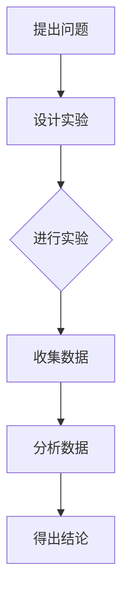

                 

# 科学探究：从观察到结论

> 关键词：科学探究、观察、实验、数据分析、推理、证据、理论、模型

> 摘要：本文旨在探讨科学探究的基本概念、方法以及其在生物学、物理学和化学中的应用。通过逐步分析观察、实验、数据收集与整理、研究设计与方法论选择等环节，揭示科学探究的过程与原理。同时，本文还探讨了科学探究的结论与反思，以及其在不同领域的具体实践，旨在帮助读者更好地理解科学探究的重要性及其在现代社会中的作用。

## 《科学探究：从观察到结论》目录大纲

### 第一部分：科学探究的基本概念

#### 第1章：科学探究的概述
1.1 科学探究的定义
1.2 科学探究的重要性
1.3 科学探究的过程与方法

#### 第2章：科学探究的核心概念
2.1 科学事实与假设
2.2 科学理论与模型
2.3 科学探究中的证据与推理

#### 第3章：科学探究的方法论
3.1 观察与实验
3.2 数据收集与整理
3.3 研究设计与方法论选择

### 第二部分：科学探究的应用与实践

#### 第4章：科学探究在生物学中的应用
4.1 生物学中的科学探究
4.2 生物学实验的设计与分析
4.3 生物学数据的处理与应用

#### 第5章：科学探究在物理学中的应用
5.1 物理学中的科学探究
5.2 物理学实验的设计与分析
5.3 物理学数据的处理与应用

#### 第6章：科学探究在化学中的应用
6.1 化学中的科学探究
6.2 化学实验的设计与分析
6.3 化学数据的处理与应用

### 第三部分：科学探究的结论与反思

#### 第7章：科学探究的结论与推广
7.1 科学探究的结论形式
7.2 科学探究的结论推广与应用
7.3 科学探究的结论评估与验证

#### 第8章：科学探究的反思与展望
8.1 科学探究中的伦理问题
8.2 科学探究中的挑战与趋势
8.3 科学探究的未来发展与前景

#### 第9章：科学探究实例分析
9.1 生物学领域的实例分析
9.2 物理学领域的实例分析
9.3 化学领域的实例分析

### 附录
#### 附录A：科学探究工具与资源
A.1 科学探究常用的软件工具
A.2 科学探究相关的数据库和网站
A.3 科学探究的学习资料和教程

## 第一部分：科学探究的基本概念

### 第1章：科学探究的概述

#### 1.1 科学探究的定义

科学探究是指通过系统的方法和逻辑推理，从观察和实验中获取信息，进而发现、解释和预测自然现象的过程。科学探究是一种探索未知、揭示规律、追求真理的活动，它涵盖了从提出问题、建立假设、设计实验、收集数据、分析结果到得出结论等一系列环节。

科学探究不仅仅是一个过程，更是一种思维方式。它要求研究者具备批判性思维、逻辑推理、数据分析等能力，同时还需要具备实证精神和严谨态度。科学探究的核心在于不断质疑、反思和验证，以追求客观、准确的科学知识。

#### 1.2 科学探究的重要性

科学探究在现代社会中具有极其重要的地位。首先，它推动了人类对自然世界的认识，使我们能够理解自然界的基本规律，从而为技术进步和创新提供理论支持。其次，科学探究促进了社会经济的发展，为各行各业提供了源源不断的创新动力。此外，科学探究还在教育、医疗、环境保护等领域发挥着重要作用，为人类社会的进步和可持续发展提供了有力保障。

科学探究的重要性还体现在以下几个方面：

1. **知识积累**：科学探究通过不断发现和验证新知识，丰富了人类的知识体系，为后续研究和创新提供了基础。
2. **技术创新**：科学探究推动了技术的进步，使人类能够解决实际问题、提高生活质量。
3. **社会发展**：科学探究促进了社会的发展，推动了科学、技术、经济、文化等各个领域的繁荣。
4. **伦理道德**：科学探究在推动科技进步的同时，也引导人们关注伦理道德问题，为社会的发展提供道德指导。

#### 1.3 科学探究的过程与方法

科学探究的过程可以分为以下几个阶段：

1. **提出问题**：科学探究始于对自然现象的好奇和疑问。研究者通过观察和思考，发现需要解决的问题。
2. **建立假设**：在提出问题的基础上，研究者根据已有知识和经验，提出可能的解释或假设。
3. **设计实验**：为了验证假设，研究者需要设计实验，通过控制变量和观察现象的变化，收集数据。
4. **收集数据**：在实验过程中，研究者需要收集各种数据，包括定性和定量的数据，为后续分析提供基础。
5. **数据分析**：对收集到的数据进行分析和整理，提取有用的信息，为得出结论提供依据。
6. **得出结论**：根据数据分析结果，研究者可以验证或否定原有假设，形成新的认识或理论。

科学探究的方法主要包括以下几种：

1. **观察法**：通过直接观察自然现象或实验过程，收集相关信息。
2. **实验法**：通过设计和实施实验，控制变量，观察现象的变化，验证假设。
3. **比较法**：通过比较不同条件下的现象或结果，分析差异，得出结论。
4. **归纳法**：从个别现象中归纳出一般性规律或原则。
5. **演绎法**：从一般性原则或理论出发，推导出特定情况的结论。

科学探究的过程和方法具有以下特点：

1. **系统性**：科学探究是一个系统化的过程，各个环节相互联系、相互支撑。
2. **实证性**：科学探究依赖于观察、实验和数据分析等实证方法，以获取客观、准确的信息。
3. **逻辑性**：科学探究遵循逻辑推理和批判性思维的原则，从假设到结论的过程具有严密的逻辑性。
4. **可重复性**：科学探究的结果应该是可重复的，其他研究者能够在相同条件下得到相同或类似的结果。
5. **可验证性**：科学探究的结论应该能够通过实验或观察进行验证，以证明其正确性。

### 第2章：科学探究的核心概念

科学探究的核心概念主要包括科学事实、假设、理论、模型和证据与推理等。这些概念相互关联，构成了科学探究的基础。

#### 2.1 科学事实与假设

科学事实是指通过观察、实验和数据分析等手段，经过验证和证实的客观存在。科学事实是科学探究的基石，它们提供了对自然现象的理解和解释。科学事实是可靠的、可重复的，并且不受主观意识的影响。

假设是科学探究中的推测或预期，是对科学事实的补充和扩展。假设是基于已有知识和经验提出的，用于解释未知现象或预测可能发生的结果。假设通常需要通过实验或观察进行验证，以证明其正确性。

科学事实和假设是科学探究的两个重要组成部分。科学事实提供了对自然现象的基础认识，而假设则是对这些认识的进一步发展和拓展。科学事实和假设相互促进，共同推动了科学探究的进展。

#### 2.2 科学理论与模型

科学理论是对一系列科学事实和假设的整合和概括，是对自然现象的系统性解释。科学理论具有普遍性、可重复性和可验证性，能够解释大量的实验和观察结果。

科学模型是科学理论的具象化，是通过数学、物理和逻辑等手段构建的，用于描述和模拟自然现象的模型。科学模型可以是数学公式、物理模型或计算机模拟等，它们能够直观地展示理论中的关键要素和关系。

科学理论和模型是科学探究的重要工具，它们帮助我们理解和预测自然现象。科学理论提供了对自然现象的整体认识，而科学模型则能够模拟和预测特定情况下的现象变化。科学理论和模型的建立和完善是科学探究的核心任务之一。

#### 2.3 科学探究中的证据与推理

证据是科学探究中的重要组成部分，是指用于支持或反驳科学假设、理论和模型的数据和信息。证据可以是观察结果、实验数据、统计数据等，它们需要经过严格的收集、整理和分析，以证明其可靠性和有效性。

推理是科学探究中的核心思维方式，是指从已知事实和证据出发，通过逻辑推理得出新的结论或预测。推理包括归纳推理和演绎推理两种形式。归纳推理是从个别事实中归纳出一般性结论，而演绎推理则是从一般性原则出发，推导出特定情况的结论。

科学探究中的证据和推理相互关联，证据为推理提供了基础和依据，而推理则通过证据得出新的结论或假设。科学探究的过程实际上是不断收集证据、进行推理和验证的过程，以逐步揭示自然现象的规律。

### 第3章：科学探究的方法论

科学探究的方法论是科学探究的理论基础，它涉及观察与实验、数据收集与整理、研究设计与方法论选择等环节。这些方法论环节相互联系、相互支撑，构成了科学探究的系统框架。

#### 3.1 观察与实验

观察是科学探究的起点，它是指研究者通过感官或仪器设备，对自然现象或实验过程进行系统的记录和描述。观察是科学探究中最基本的手段之一，它帮助我们了解自然现象的基本特征和规律。

实验是科学探究的重要手段，它是指研究者通过设计和实施实验，控制变量，观察现象的变化，从而验证或反驳科学假设。实验是科学探究的核心环节，它为研究者提供了可靠的证据和结论。

观察和实验在科学探究中具有以下作用：

1. **发现新现象**：观察和实验有助于研究者发现新的自然现象或规律，为科学探究提供新的方向和课题。
2. **验证假设**：观察和实验可以验证或反驳科学假设，帮助研究者确认或修正已有的理论和模型。
3. **提供证据**：观察和实验为科学探究提供了可靠的证据，为推理和结论提供了依据。
4. **促进创新**：观察和实验可以激发研究者的创新思维，推动科学技术的进步。

#### 3.2 数据收集与整理

数据收集是科学探究的重要环节，它是指研究者通过各种手段收集与科学探究相关的数据和信息。数据收集的方法包括观察记录、实验测量、问卷调查、文献检索等。

数据整理是科学探究的关键步骤，它是指研究者对收集到的数据进行分析、整理和加工，以便更好地理解和解释数据。数据整理的方法包括数据清洗、数据转换、数据可视化等。

数据收集和整理在科学探究中具有以下作用：

1. **提高数据质量**：通过数据收集和整理，研究者可以去除错误、异常和重复的数据，提高数据的准确性和可靠性。
2. **发现数据规律**：通过数据整理，研究者可以发现数据之间的规律和关系，为科学探究提供新的视角和启示。
3. **支持结论**：数据收集和整理为科学探究提供了丰富的证据和依据，支持研究者得出科学结论。
4. **促进数据共享**：通过数据整理和共享，研究者可以促进科学信息的传播和交流，推动科学合作和创新。

#### 3.3 研究设计与方法论选择

研究设计是科学探究的核心环节，它是指研究者根据科学问题和目标，制定研究方案和计划，选择合适的研究方法和技术手段。研究设计的好坏直接影响到科学探究的可靠性和有效性。

方法论选择是科学探究的重要任务，它是指研究者根据研究目标和条件，选择合适的理论、模型和方法，以实现科学探究的目标。方法论选择包括观察法、实验法、比较法、归纳法、演绎法等。

研究设计和方法论选择在科学探究中具有以下作用：

1. **明确研究目标**：研究设计和方法论选择有助于研究者明确研究目标，确保科学探究的方向和重点。
2. **提高研究质量**：通过合理的研究设计和方法论选择，研究者可以提高科学探究的可靠性和有效性，减少错误和偏差。
3. **促进创新**：研究设计和方法论选择可以激发研究者的创新思维，推动科学探究的进步和突破。
4. **适应不同领域**：不同领域的科学探究具有不同的特点和要求，通过合理的研究设计和方法论选择，可以更好地适应不同领域的需求。

## 第二部分：科学探究的应用与实践

### 第4章：科学探究在生物学中的应用

生物学是一门研究生命现象和生物体的科学，科学探究在生物学中具有广泛的应用。本章将介绍科学探究在生物学中的应用，包括生物学实验的设计与分析、生物学数据的处理与应用等。

#### 4.1 生物学中的科学探究

生物学中的科学探究涵盖了从微观到宏观的各种生命现象，包括细胞学、遗传学、生态学、生理学等领域。科学探究在生物学中的应用主要体现在以下几个方面：

1. **发现新物种和生命现象**：通过科学探究，生物学家可以发现新的物种和生命现象，如深海生物、极地生物等，拓展了生物学的研究领域。
2. **揭示生命规律**：通过科学探究，生物学家可以揭示生命现象的基本规律，如遗传规律、生理机制、生态系统等。
3. **推动生物技术的发展**：科学探究为生物技术提供了理论基础和实验支持，促进了生物技术在医学、农业、环境等领域的应用。
4. **促进生物学教育**：科学探究在生物学教育中发挥着重要作用，通过科学探究的过程和方法，学生可以培养批判性思维、实验能力和创新能力。

#### 4.2 生物学实验的设计与分析

生物学实验是科学探究的重要手段，它通过控制变量、观察现象和收集数据，为生物学研究提供证据和结论。生物学实验的设计和分析主要包括以下几个方面：

1. **实验设计**：实验设计是生物学实验的关键步骤，它包括确定实验目标、选择实验方法、设计实验流程和设置对照组等。实验设计应该遵循随机化、对照、重复等原则，以提高实验的可靠性和有效性。
2. **实验操作**：实验操作是指根据实验设计，在实验室或野外实施实验的具体步骤。实验操作应该严格按照实验规程进行，确保实验结果的准确性和可重复性。
3. **数据收集**：在实验过程中，研究者需要收集各种数据，如生物体的形态、生理指标、行为表现等。数据收集应该遵循规范的方法和步骤，确保数据的完整性和可靠性。
4. **数据分析**：数据分析是生物学实验的重要环节，它通过对实验数据的整理、统计和分析，提取有用的信息，为实验结论提供依据。数据分析方法包括描述性统计分析、回归分析、方差分析等。

#### 4.3 生物学数据的处理与应用

生物学数据的处理与应用是科学探究的重要环节，它通过对实验数据的处理和分析，揭示生物学现象的规律和机制。生物学数据的处理与应用主要包括以下几个方面：

1. **数据处理**：数据处理是指对实验数据进行清洗、转换和整合，以提高数据的质量和可用性。数据处理方法包括数据清洗、数据转换、数据融合等。
2. **数据可视化**：数据可视化是将实验数据以图形、图表等形式进行展示，以直观地揭示数据规律和关系。数据可视化方法包括条形图、折线图、散点图等。
3. **数据分析**：数据分析是指通过对实验数据进行统计和分析，提取有用的信息，为实验结论提供依据。数据分析方法包括描述性统计分析、回归分析、聚类分析等。
4. **数据应用**：数据分析结果可以应用于生物学研究的多个方面，如物种分类、生态分析、生理机制研究等。数据应用可以揭示生物学现象的内在规律，为生物学理论和实践提供支持。

### 第5章：科学探究在物理学中的应用

物理学是一门研究物质和能量及其相互作用的科学，科学探究在物理学中具有广泛的应用。本章将介绍科学探究在物理学中的应用，包括物理学实验的设计与分析、物理学数据的处理与应用等。

#### 5.1 物理学中的科学探究

物理学中的科学探究涵盖了从宏观到微观的各种物理现象，包括力学、电磁学、热学、光学等领域。科学探究在物理学中的应用主要体现在以下几个方面：

1. **发现物理现象和规律**：通过科学探究，物理学家可以揭示物理现象的基本规律，如牛顿定律、电磁感应定律、热力学第二定律等。
2. **推动物理学技术的发展**：科学探究为物理学技术提供了理论基础和实验支持，促进了物理学技术在通讯、能源、材料等领域的应用。
3. **促进物理学教育**：科学探究在物理学教育中发挥着重要作用，通过科学探究的过程和方法，学生可以培养批判性思维、实验能力和创新能力。
4. **解决实际问题**：科学探究可以应用于解决实际问题，如提高能源利用效率、改善交通工具性能、优化建筑设计等。

#### 5.2 物理学实验的设计与分析

物理学实验是科学探究的重要手段，它通过控制变量、观察现象和收集数据，为物理学研究提供证据和结论。物理学实验的设计和分析主要包括以下几个方面：

1. **实验设计**：实验设计是物理学实验的关键步骤，它包括确定实验目标、选择实验方法、设计实验流程和设置对照组等。实验设计应该遵循随机化、对照、重复等原则，以提高实验的可靠性和有效性。
2. **实验操作**：实验操作是指根据实验设计，在实验室或野外实施实验的具体步骤。实验操作应该严格按照实验规程进行，确保实验结果的准确性和可重复性。
3. **数据收集**：在实验过程中，研究者需要收集各种数据，如物理量、测量值、图像等。数据收集应该遵循规范的方法和步骤，确保数据的完整性和可靠性。
4. **数据分析**：数据分析是物理学实验的重要环节，它通过对实验数据的整理、统计和分析，提取有用的信息，为实验结论提供依据。数据分析方法包括描述性统计分析、回归分析、方差分析等。

#### 5.3 物理学数据的处理与应用

物理学数据的处理与应用是科学探究的重要环节，它通过对实验数据的处理和分析，揭示物理学现象的规律和机制。物理学数据的处理与应用主要包括以下几个方面：

1. **数据处理**：数据处理是指对实验数据进行清洗、转换和整合，以提高数据的质量和可用性。数据处理方法包括数据清洗、数据转换、数据融合等。
2. **数据可视化**：数据可视化是将实验数据以图形、图表等形式进行展示，以直观地揭示数据规律和关系。数据可视化方法包括条形图、折线图、散点图等。
3. **数据分析**：数据分析是指通过对实验数据进行统计和分析，提取有用的信息，为实验结论提供依据。数据分析方法包括描述性统计分析、回归分析、聚类分析等。
4. **数据应用**：数据分析结果可以应用于物理学研究的多个方面，如理论验证、技术优化、实际问题解决等。数据应用可以揭示物理学现象的内在规律，为物理学理论和实践提供支持。

### 第6章：科学探究在化学中的应用

化学是一门研究物质的组成、结构、性质、变化和反应的科学，科学探究在化学中具有广泛的应用。本章将介绍科学探究在化学中的应用，包括化学实验的设计与分析、化学数据的处理与应用等。

#### 6.1 化学中的科学探究

化学中的科学探究涵盖了从微观到宏观的各种化学现象，包括无机化学、有机化学、物理化学、分析化学等领域。科学探究在化学中的应用主要体现在以下几个方面：

1. **发现新物质和化学反应**：通过科学探究，化学家可以合成新物质、发现新的化学反应，拓展了化学的研究领域。
2. **研究物质性质和变化**：通过科学探究，化学家可以研究物质的性质、结构和变化规律，为新材料和新技术的开发提供理论支持。
3. **推动化学技术的发展**：科学探究为化学技术提供了理论基础和实验支持，促进了化学技术在医药、化工、环保等领域的应用。
4. **促进化学教育**：科学探究在化学教育中发挥着重要作用，通过科学探究的过程和方法，学生可以培养批判性思维、实验能力和创新能力。

#### 6.2 化学实验的设计与分析

化学实验是科学探究的重要手段，它通过控制变量、观察现象和收集数据，为化学研究提供证据和结论。化学实验的设计和分析主要包括以下几个方面：

1. **实验设计**：实验设计是化学实验的关键步骤，它包括确定实验目标、选择实验方法、设计实验流程和设置对照组等。实验设计应该遵循随机化、对照、重复等原则，以提高实验的可靠性和有效性。
2. **实验操作**：实验操作是指根据实验设计，在实验室或野外实施实验的具体步骤。实验操作应该严格按照实验规程进行，确保实验结果的准确性和可重复性。
3. **数据收集**：在实验过程中，研究者需要收集各种数据，如物理量、化学物质的含量、反应速率等。数据收集应该遵循规范的方法和步骤，确保数据的完整性和可靠性。
4. **数据分析**：数据分析是化学实验的重要环节，它通过对实验数据的整理、统计和分析，提取有用的信息，为实验结论提供依据。数据分析方法包括描述性统计分析、回归分析、方差分析等。

#### 6.3 化学数据的处理与应用

化学数据的处理与应用是科学探究的重要环节，它通过对实验数据的处理和分析，揭示化学现象的规律和机制。化学数据的处理与应用主要包括以下几个方面：

1. **数据处理**：数据处理是指对实验数据进行清洗、转换和整合，以提高数据的质量和可用性。数据处理方法包括数据清洗、数据转换、数据融合等。
2. **数据可视化**：数据可视化是将实验数据以图形、图表等形式进行展示，以直观地揭示数据规律和关系。数据可视化方法包括条形图、折线图、散点图等。
3. **数据分析**：数据分析是指通过对实验数据进行统计和分析，提取有用的信息，为实验结论提供依据。数据分析方法包括描述性统计分析、回归分析、聚类分析等。
4. **数据应用**：数据分析结果可以应用于化学研究的多个方面，如物质结构研究、化学反应机制研究、新材料开发等。数据应用可以揭示化学现象的内在规律，为化学理论和实践提供支持。

## 第三部分：科学探究的结论与反思

### 第7章：科学探究的结论与推广

科学探究的结论是对科学事实和证据的分析和归纳，它为我们提供了对自然现象的理解和解释。科学探究的结论形式多样，可以是具体的规律、模型或理论，也可以是预测或建议。科学探究的结论的推广与应用对于科学进步和社会发展具有重要意义。

#### 7.1 科学探究的结论形式

科学探究的结论形式主要包括以下几种：

1. **科学规律**：科学规律是对自然现象的普遍性描述和解释，它揭示了自然现象之间的内在联系和规律。科学规律具有普遍适用性和可重复性，是科学探究的核心成果之一。
2. **科学模型**：科学模型是通过对自然现象的模拟和解释，构建的数学或物理模型。科学模型能够直观地展示自然现象的内在机制和结构，为科学探究提供重要的理论支持。
3. **科学理论**：科学理论是对一系列科学规律的整合和概括，它提供了对自然现象的整体性解释。科学理论具有系统性、普遍性和可验证性，是科学探究的重要成果。
4. **科学预测**：科学预测是根据科学理论或模型，对未知现象的预测和推测。科学预测可以为科学研究提供新的方向和目标，推动科学探究的深入发展。
5. **科学建议**：科学建议是根据科学探究的结论，对实际应用和社会发展的建议和指导。科学建议可以帮助我们更好地应对实际问题，促进科学技术的进步和社会的发展。

#### 7.2 科学探究的结论推广与应用

科学探究的结论的推广与应用是科学探究的重要目标之一。科学探究的结论的推广与应用主要体现在以下几个方面：

1. **科学研究**：科学探究的结论可以应用于新的科学研究，推动科学理论的完善和拓展。新的科学探究可以基于已有的结论，进一步深入研究自然现象的内在机制和规律。
2. **技术创新**：科学探究的结论可以应用于技术创新，推动新材料的开发、新工艺的改进和新技术的应用。科学探究的结论可以为技术创新提供理论基础和实验支持。
3. **社会应用**：科学探究的结论可以应用于社会生活和社会发展，提高生活质量和社会水平。科学探究的结论可以帮助我们更好地应对环境问题、资源问题和社会问题，推动社会的可持续发展。
4. **教育普及**：科学探究的结论可以应用于教育普及，提高公众的科学素质和科学意识。科学探究的结论可以通过各种形式，如科普读物、教育节目、科学讲座等，传播给广大公众，激发他们对科学的兴趣和热爱。
5. **国际合作**：科学探究的结论可以应用于国际合作，促进科学技术的跨国合作和交流。科学探究的结论可以跨越国界，促进不同国家和地区之间的科学合作和交流，推动科学技术的全球化发展。

#### 7.3 科学探究的结论评估与验证

科学探究的结论的评估与验证是科学探究的重要环节之一。科学探究的结论需要经过严格的评估和验证，以确保其正确性和可靠性。科学探究的结论评估与验证主要包括以下几个方面：

1. **内部验证**：内部验证是指通过对科学探究的结论进行实验或观察的重复，验证其结果是否一致。内部验证可以检验科学探究的结论是否具有可重复性和可靠性。
2. **外部验证**：外部验证是指通过其他研究者的实验或观察，验证科学探究的结论是否成立。外部验证可以增加科学探究的结论的可信度和可靠性。
3. **同行评审**：同行评审是指通过同行评议，对科学探究的结论进行评价和审查。同行评审可以确保科学探究的结论的严谨性和科学性，提高科学探究的质量和水平。
4. **公众参与**：公众参与是指通过公众的反馈和参与，对科学探究的结论进行评估和验证。公众参与可以增加科学探究的透明度和公信力，提高科学探究的社会影响力。

科学探究的结论的评估与验证是科学探究的重要保障，它可以帮助我们更好地识别和纠正错误，确保科学探究的结论的正确性和可靠性。科学探究的结论的评估与验证不仅需要在科学领域进行，也需要在社会领域进行，以确保科学探究的结论能够真正为人类社会的发展提供支持和帮助。

### 第8章：科学探究的反思与展望

科学探究作为一种探索未知、揭示规律、追求真理的活动，在推动科学技术进步和社会发展方面发挥了重要作用。然而，随着科学探究的不断深入，我们也需要对其过程和结果进行反思，以识别存在的问题、挑战和趋势，并为未来的科学探究提供指导。

#### 8.1 科学探究中的伦理问题

科学探究中的伦理问题是一个不可忽视的重要议题。科学探究涉及到对自然界的干预、对生物体的实验以及对人类健康和隐私的保护等问题。以下是一些常见的伦理问题：

1. **动物实验**：动物实验在科学探究中占有重要地位，但同时也引发了关于动物权益的争议。如何平衡科学研究的需要与动物福利保护，是科学伦理中的一大挑战。
2. **人类基因编辑**：基因编辑技术的发展带来了巨大的科学突破，但同时也引发了关于基因编辑伦理的讨论。如何确保基因编辑的安全性和道德合理性，避免滥用和伦理风险，是需要认真考虑的问题。
3. **隐私保护**：科学探究往往涉及到对个人数据的收集和分析。如何在确保科学研究的同时，保护个人隐私和数据安全，是科学伦理领域的重要问题。

为了解决这些伦理问题，需要建立相应的伦理规范和监管机制，确保科学探究的道德和合法性。

#### 8.2 科学探究中的挑战与趋势

科学探究面临着许多挑战，同时也出现了新的趋势。以下是一些主要挑战和趋势：

1. **数据质量与可重复性**：科学探究中的数据质量和可重复性是科学研究的核心问题。如何提高数据的可靠性和可重复性，减少错误和偏差，是科学探究面临的重要挑战。
2. **跨学科合作**：随着科学问题的复杂化，单一学科已经无法解决许多重大问题。跨学科合作成为了科学探究的重要趋势，如何整合不同学科的知识和方法，是科学探究面临的重要任务。
3. **技术进步**：技术的进步为科学探究提供了新的工具和方法，如大数据分析、人工智能等。如何充分利用新技术，提高科学探究的效率和准确性，是科学探究面临的重要机遇。
4. **全球合作**：全球合作是科学探究的重要趋势。如何加强国际间的科学合作，促进科学知识的共享和传播，是科学探究面临的重要挑战。

#### 8.3 科学探究的未来发展与前景

科学探究的未来发展与前景充满了希望和挑战。以下是一些可能的趋势和发展方向：

1. **人工智能与科学探究**：人工智能的发展为科学探究提供了新的手段和工具。如何利用人工智能技术，提高科学探究的效率和准确性，是科学探究未来发展的重要方向。
2. **大数据与科学探究**：大数据的收集、存储和分析为科学探究提供了丰富的数据资源。如何充分利用大数据，发现新的科学规律和趋势，是科学探究未来发展的重要方向。
3. **生态系统科学**：生态系统科学关注人类活动对自然环境的影响，探索如何实现可持续发展。如何保护生态环境、应对气候变化等挑战，是科学探究未来发展的重要方向。
4. **生命科学**：生命科学关注生命现象的本质和机制，探索如何治疗疾病、延长寿命等。如何利用生命科学的成果，提高人类的生活质量，是科学探究未来发展的重要方向。

科学探究的未来发展与前景广阔，需要我们不断探索和创新，以应对新的挑战和机遇，推动科学技术的进步和社会的发展。

### 第9章：科学探究实例分析

科学探究的实例分析可以帮助我们更好地理解科学探究的过程和方法。以下分别从生物学、物理学和化学三个领域，介绍一些具有代表性的科学探究实例。

#### 9.1 生物学领域的实例分析

生物学领域的科学探究实例丰富多样，以下是一个关于遗传学研究的实例：

**实例：孟德尔的遗传实验**

- **实验背景**：19世纪末期，奥地利僧侣孟德尔通过豌豆实验发现了遗传规律。
- **实验过程**：孟德尔选取了具有明显性状差异的豌豆品种，进行了自交和杂交实验，观察后代性状的表现。
- **实验结果**：孟德尔发现，豌豆的后代表现出了固定的遗传比例，如3:1的分离比。
- **实验结论**：孟德尔提出了基因分离和自由组合的遗传规律，为现代遗传学奠定了基础。

**Mermaid流程图**：


#### 9.2 物理学领域的实例分析

物理学领域的科学探究实例涉及到许多重大发现和理论。以下是一个关于量子力学的实例：

**实例：海森堡不确定性原理的发现**

- **实验背景**：20世纪初，量子力学的发展引发了关于粒子和波性质的热烈讨论。
- **实验过程**：海森堡通过对电子位置和动量的测量，发现无法同时精确确定两者的数值。
- **实验结果**：海森堡提出了不确定性原理，即粒子的位置和动量存在不确定性，无法同时精确测定。
- **实验结论**：不确定性原理揭示了微观世界的量子性质，对量子力学的发展具有重要意义。

**伪代码**：
```
// 测量粒子位置
position = measure_position();
// 测量粒子动量
momentum = measure_momentum();
// 计算不确定性
uncertainty = calculate_uncertainty(position, momentum);
// 输出不确定性结果
print("不确定性原理：位置和动量之间存在不确定性。");
```

#### 9.3 化学领域的实例分析

化学领域的科学探究实例涉及到物质的合成、性质和反应等。以下是一个关于有机合成反应的实例：

**实例：普鲁士蓝的合成**

- **实验背景**：普鲁士蓝是一种历史悠久的蓝色颜料，其化学成分和合成方法引起了化学家的关注。
- **实验过程**：化学家通过实验，将铁盐和有机染料混合，加热反应，得到了普鲁士蓝。
- **实验结果**：实验证明，普鲁士蓝具有良好的稳定性和色彩鲜艳性，适用于各种颜料和涂料。
- **实验结论**：普鲁士蓝的合成方法为有机合成反应提供了新的途径，推动了颜料和涂料技术的发展。

**LaTeX数学公式**：
```latex
\begin{equation}
\text{Fe}^{2+} + \text{Cu}^{2+} + 4\text{NH}_3 + 6\text{H}_2\text{O} \rightarrow \text{Fe}[\text{Fe}(\text{H}_2\text{O})_6]^{2+} + \text{Cu}[\text{Cu}(\text{H}_2\text{O})_4]^{2+} + 4\text{NH}_4^+
\end{equation}
```

### 附录A：科学探究工具与资源

科学探究的工具和资源是进行科学研究和数据分析的重要基础。以下列出了一些常用的科学探究工具和资源，以供参考。

#### A.1 科学探究常用的软件工具

1. **Matlab**：一款强大的数学计算和数据分析软件，广泛应用于科学研究和工程领域。
2. **Python**：一款流行的编程语言，具有丰富的科学计算和数据分析库，如NumPy、SciPy、Pandas等。
3. **R语言**：一款专门用于统计分析的数据分析软件，适用于复杂的数据处理和可视化。
4. **SPSS**：一款专业的统计分析软件，广泛应用于社会科学研究。
5. **Excel**：一款常见的电子表格软件，适用于简单的数据处理和可视化。

#### A.2 科学探究相关的数据库和网站

1. **PubMed**：一个涵盖生物医学领域的研究论文数据库，提供大量高质量的学术论文和文献。
2. **Google Scholar**：一个广泛的学术搜索工具，涵盖各个领域的学术论文和文献。
3. **NASA**：美国国家航空航天局的官方网站，提供丰富的地球科学、天文学等领域的科学数据和资源。
4. **NCBI**：美国国家生物技术信息中心，提供生物信息学相关的数据库和工具。
5. **arXiv**：一个预印本数据库，涵盖物理学、数学、计算机科学等领域的前沿研究论文。

#### A.3 科学探究的学习资料和教程

1. **《科学方法与实验设计》**：一本关于科学方法和实验设计的经典教材，适用于科学研究和实验设计。
2. **《数据科学入门》**：一本介绍数据科学基本概念和技能的教材，包括数据分析、机器学习等内容。
3. **《Python科学计算与实践》**：一本关于Python在科学计算中应用的教材，适合初学者和进阶者。
4. **《R语言实战》**：一本详细介绍R语言在数据分析中的应用的教材，适合R语言爱好者。
5. **《统计学基础》**：一本介绍统计学基本概念和方法的教材，适用于初学者和科研人员。

### 作者信息

作者：AI天才研究院/AI Genius Institute & 禅与计算机程序设计艺术 /Zen And The Art of Computer Programming

