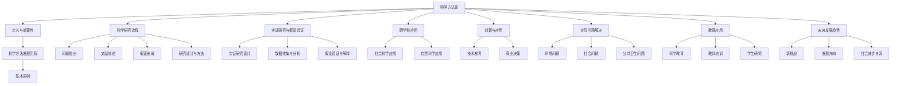

                 

## 科学方法论：从假说到验证

> 关键词：科学方法论、假说验证、实证研究、跨学科应用、创新思维、教育应用

> 摘要：本文旨在探讨科学方法论在从假说到验证的全过程中所发挥的关键作用。通过对科学研究的基本原则、流程、实证研究和跨学科应用等方面的详细分析，本文揭示了科学方法论在现代信息技术和复杂问题解决中的重要性。同时，本文还探讨了科学方法论在教育中的应用以及未来发展趋势，为读者提供了全面的科学方法论知识框架和实际应用指导。

---

### 目录大纲

- **第一部分：科学方法论的基础**
  - **第1章：科学方法论概述**
    - **1.1 科学的定义与重要性**
    - **1.2 科学方法的发展历程**
    - **1.3 科学方法论的基本原则**
  - **第2章：科学研究的流程**
    - **2.1 研究问题的提出**
    - **2.2 文献综述**
    - **2.3 假设的形成**
    - **2.4 研究设计与方法**
  - **第3章：实证研究与假设验证**
    - **3.1 实证研究的设计**
    - **3.2 数据收集与分析**
    - **3.3 假设的验证与解释**
- **第二部分：科学方法论的高级应用**
  - **第4章：科学方法论在跨学科中的应用**
    - **4.1 跨学科研究的挑战与机遇**
    - **4.2 科学方法论在社会科学中的应用**
    - **4.3 科学方法论在自然科学中的应用**
  - **第5章：科学方法论在创新与研究中的应用**
    - **5.1 创新思维与科学方法论**
    - **5.2 科学方法论在技术发明中的应用**
    - **5.3 科学方法论在商业决策中的应用**
  - **第6章：科学方法论在解决实际问题中的应用**
    - **6.1 科学方法论在环境问题中的应用**
    - **6.2 科学方法论在社会问题中的应用**
    - **6.3 科学方法论在公共卫生问题中的应用**
  - **第7章：科学方法论的教育应用**
    - **7.1 科学方法论与科学教育**
    - **7.2 科学方法论在教师培训中的应用**
    - **7.3 科学方法论在学生研究中的应用**
- **第三部分：科学方法论的未来发展趋势**
  - **第8章：科学方法论的未来发展趋势**
    - **8.1 科学方法论的新挑战**
    - **8.2 科学方法论的未来发展方向**
    - **8.3 科学方法论与社会进步的关系**
- **附录**
  - **附录A：科学方法论相关资源**
  - **附录B：科学方法论核心概念流程图**
  - **附录C：科学方法论核心算法伪代码**
  - **附录D：科学方法论项目实战案例**

---

### 科学方法论概述

科学方法论是科学研究的理论基础和工具，它涉及如何提出假设、设计实验、收集和分析数据，以及如何验证假设的有效性。科学方法论不仅帮助我们理解和解释自然现象，还推动了技术的进步和人类文明的不断发展。

#### 1.1 科学的定义与重要性

科学是一种系统性、实证性的知识体系，它通过观察、实验和推理来解释自然现象和解决问题。科学的重要性在于它提供了一种可靠的方法来验证和证伪假设，从而为决策提供依据。

科学具有以下几个特征：
- **客观性**：科学强调事实和证据的重要性，以客观的数据为基础。
- **系统性**：科学方法通过系统的步骤来解决问题，从观察开始，到假设提出，再到实验设计和数据分析。
- **可重复性**：科学实验和结果是可重复的，其他人可以验证和复制实验结果。

#### 1.2 科学方法的发展历程

科学方法的发展可以追溯到古希腊时期，但真正的科学方法是在文艺复兴时期和启蒙运动时期形成的。以下是一些关键的发展阶段：

- **观察和实验**：伽利略和培根等科学先驱强调了实验的重要性，并通过观察和实验来验证假设。
- **假设和理论**：牛顿的万有引力定律和达尔文的进化论都是基于假设和理论的科学成果。
- **数学和逻辑**：笛卡尔的解析几何和逻辑学为科学方法提供了数学和逻辑工具。
- **实证主义**：实证主义哲学强调通过经验和实证数据来建立科学知识。

#### 1.3 科学方法论的基本原则

科学方法论遵循以下基本原则：

- **可重复性**：实验和观察必须是可重复的，以确保结果的可靠性。
- **可证伪性**：科学假设必须能够被证伪，即存在某种实验或观察结果可以证明假设是错误的。
- **系统性**：科学研究应该遵循系统的方法论，包括假设的提出、实验设计、数据收集、分析和假设验证。
- **客观性**：科学研究应该尽量排除主观偏见，以客观事实为基础。

科学方法论为科学研究提供了坚实的框架和工具，它确保了科学知识的可靠性和有效性。在接下来的章节中，我们将详细探讨科学研究的流程、实证研究和跨学科应用等方面，以深入理解科学方法论的重要性。

---

### 科学研究的流程

科学研究是一个系统化的过程，它包括多个关键步骤，从研究问题的提出到假设的形成，再到研究设计和方法的实施。以下是科学研究的典型流程：

#### 2.1 研究问题的提出

科学研究始于一个明确的研究问题。这个问题通常源于对现有知识的不足或对未解现象的好奇。研究问题的提出可以来源于以下几个方面：

- **理论问题**：对现有理论的补充或修正，例如“量子力学能否解释黑体辐射？”
- **实际问题**：对实际问题的解决，如“如何提高太阳能电池的效率？”
- **现象观察**：对自然现象的观察和解释，如“为什么有些动物能在极寒环境中生存？”

为了确保研究问题具有科学性，它需要满足以下几个条件：

- **明确性**：问题表述要清晰明确，避免模糊不清。
- **可研究性**：问题应在现有科学知识和技术条件下可以进行研究和验证。
- **重要性**：问题应具有一定的学术价值或实际应用意义。

#### 2.2 文献综述

在提出研究问题之后，进行文献综述是科学研究的重要一步。文献综述的目的是了解当前领域的研究现状、主要发现和未解决的问题。以下是文献综述的关键步骤：

- **确定研究范围**：根据研究问题，确定相关的研究领域和文献来源。
- **搜索文献**：使用学术数据库和图书馆资源，检索与研究主题相关的文献。
- **筛选文献**：根据研究需求和文献质量，筛选出最相关的文献。
- **总结与评估**：总结每篇文献的主要观点、方法和结果，评估其对当前研究的贡献。

文献综述不仅帮助研究者了解研究背景和前沿动态，还为提出假设和设计研究方案提供了依据。

#### 2.3 假设的形成

假设是科学研究的核心，它是基于现有知识和观察提出的一个可以验证或反驳的陈述。假设的形成通常涉及以下步骤：

- **提出初步假设**：根据文献综述和已有知识，初步提出一个假设。
- **验证假设的可测试性**：确保假设是可测试的，即可以通过实验或观察来验证或反驳。
- **明确假设的边界条件**：定义假设适用的条件和限制，避免过度泛化。
- **形成可操作化的假设**：将假设转化为具体的研究问题和可测量的指标。

科学假设必须满足以下条件：

- **可证伪性**：假设必须能够被证伪，即存在某种实验或观察结果可以证明假设是错误的。
- **一致性**：假设应与现有科学知识相一致，不应违背已知的科学原理。
- **简洁性**：假设应尽量简洁，避免不必要的复杂性和冗余。

#### 2.4 研究设计与方法

研究设计是科学研究的关键环节，它决定了研究的有效性、可靠性和可重复性。研究设计通常包括以下几个方面：

- **选择研究类型**：根据研究问题的性质，选择合适的研究类型，如实验研究、观察研究或调查研究。
- **确定样本和实验组**：选择研究对象和样本，并设计实验组和对照组，以确保实验的公正性和有效性。
- **定义实验操作**：明确实验的步骤和操作，包括实验条件、变量控制和数据收集方法。
- **数据收集与分析方法**：选择合适的数据收集工具和分析方法，如问卷、实验测量或统计分析。

研究设计需要遵循以下几个原则：

- **随机化**：确保实验组和对照组在实验开始时处于相同的初始状态，减少偏倚。
- **对照**：设立对照组，以比较实验组和对照组的差异，排除其他因素的影响。
- **可重复性**：设计应确保实验可以重复，以验证研究结果的可靠性。
- **可解释性**：设计应使研究结果具有可解释性和科学意义。

通过以上步骤，科学研究的过程从问题的提出到假设的形成再到研究设计的实施，形成了一个完整的科学方法论框架。在接下来的章节中，我们将进一步探讨实证研究和假设验证的方法，以深入理解科学方法论的实际应用。

---

### 实证研究与假设验证

实证研究是科学方法论的核心环节，它通过设计和实施实验来验证假设的有效性。实证研究的成功依赖于科学的实验设计、严谨的数据收集与分析方法，以及合理的假设验证过程。

#### 3.1 实证研究的设计

实证研究的设计是确保研究有效性和可靠性的基础。以下是实证研究设计的关键步骤：

1. **明确研究目标**：确定研究的主要目标，即要验证的假设和要解决的问题。
2. **选择研究方法**：根据研究目标和假设，选择合适的研究方法，如实验设计、观察研究或调查问卷。
3. **确定样本**：选择具有代表性的样本，样本量应足够大，以确保结果的统计显著性。
4. **设计实验组和对照组**：为了验证假设，通常需要设立实验组和对照组。实验组接受特定的处理或干预，而对照组不接受该处理，以观察处理效果。
5. **控制变量**：确保实验组和对照组在除研究变量之外的所有条件上保持一致，以排除其他因素的干扰。
6. **定义实验操作**：详细描述实验的步骤和操作，包括实验条件、时间安排和数据收集方法。

#### 3.2 数据收集与分析

数据收集和分析是实证研究的关键环节。以下是数据收集和分析的基本步骤：

1. **数据收集**：根据研究设计，使用合适的数据收集工具，如问卷、实验设备或观察记录表，收集相关数据。
2. **数据清洗**：对收集到的数据进行初步处理，包括剔除异常值、填补缺失值和进行数据标准化。
3. **数据存储**：将清洗后的数据存储在数据库中，以便后续分析和查询。
4. **数据分析**：使用统计软件或编程工具，对收集到的数据进行分析。常用的分析方法包括描述性统计分析、回归分析、假设检验和聚类分析等。

数据收集和分析需要遵循以下原则：

- **准确性**：确保数据收集过程准确无误，避免误差和遗漏。
- **可靠性**：确保数据分析方法的可靠性，使用公认的统计方法和工具。
- **一致性**：确保数据在不同时间点和不同条件下的一致性和可比性。

#### 3.3 假设的验证与解释

假设验证是实证研究的核心任务，通过实验结果来检验假设的有效性。以下是假设验证的基本步骤：

1. **设定检验标准**：根据研究问题和假设，设定具体的检验标准和显著性水平（如α值）。
2. **进行假设检验**：使用统计方法，对实验结果进行假设检验，如t检验、卡方检验或回归分析等。
3. **解释结果**：根据假设检验的结果，判断假设是否得到支持。如果假设得到支持，说明实验结果与假设一致；如果假设未得到支持，说明实验结果与假设不一致。
4. **讨论结果**：结合研究结果和文献综述，对实验结果进行解释和讨论，探讨其意义和影响。

在假设验证过程中，以下几点需要注意：

- **显著性水平**：显著性水平（如α值）反映了结果出现的概率，通常设定为0.05或0.01。
- **统计功效**：统计功效（1-β）反映了假设检验正确拒绝错误假设的能力。
- **结果解释**：解释结果时，应结合实验设计和数据收集方法，全面分析结果的可靠性和有效性。

通过实证研究的设计、数据收集和分析，科学方法论确保了假设的验证和研究的可靠性。在接下来的章节中，我们将探讨科学方法论在跨学科中的应用，以及其在解决实际问题中的重要性。

---

### 科学方法论在跨学科中的应用

科学方法论作为一种系统化的研究方法，不仅适用于单一学科的研究，还在跨学科研究中发挥了重要作用。跨学科研究通过整合不同领域的知识和方法，为解决复杂问题提供了新的视角和工具。

#### 4.1 跨学科研究的挑战与机遇

跨学科研究的挑战主要体现在以下几个方面：

- **知识体系差异**：不同学科拥有不同的知识体系和理论框架，导致跨学科研究中的概念和术语差异。
- **研究方法不一致**：各学科的研究方法和技术手段有所不同，如何整合这些方法成为跨学科研究的重要问题。
- **数据来源和格式**：不同学科的数据来源和格式可能不同，如何整合和标准化这些数据也是跨学科研究的一个难题。

然而，跨学科研究也带来了许多机遇：

- **综合视角**：跨学科研究能够提供更全面的视角，帮助研究者从多个角度理解复杂问题。
- **知识创新**：跨学科研究有助于新知识的产生，促进不同领域之间的知识交流和融合。
- **解决复杂问题**：许多复杂问题需要多学科的知识和技能才能有效解决，跨学科研究为此提供了可能。

#### 4.2 科学方法论在社会科学中的应用

科学方法论在社会科学中的应用极为广泛，涵盖了经济学、心理学、社会学、政治学等领域。以下是科学方法论在社会科学中的几个典型应用：

- **经济研究**：经济学研究经常使用实证方法来验证理论假设，如利用回归分析和假设检验来分析市场行为。
- **心理学研究**：心理学研究通过实验设计和统计分析来验证心理理论和假设，如通过双盲实验来研究药物对心理状态的影响。
- **社会学研究**：社会学研究通过观察、访谈和调查问卷等方法，分析社会结构和行为模式，如利用社会网络分析方法研究社会关系。
- **政治学研究**：政治学研究利用定量和定性方法来分析政策效果和政治行为，如通过民意调查和统计分析来评估公共政策的影响。

科学方法论在社会科学中的应用遵循以下原则：

- **数据驱动**：强调数据在研究过程中的核心地位，通过收集和分析数据来验证假设。
- **系统性**：采用系统化的方法来设计和实施研究，确保研究的科学性和可靠性。
- **可重复性**：确保研究结果可重复，以验证研究的可靠性。

#### 4.3 科学方法论在自然科学中的应用

科学方法论在自然科学中的应用同样重要，涵盖了物理学、化学、生物学、地球科学等领域。以下是科学方法论在自然科学中的几个典型应用：

- **物理学研究**：物理学研究通过实验和理论计算来验证物理定律和假设，如利用粒子加速器进行实验来验证量子力学理论。
- **化学研究**：化学研究通过实验和化学分析方法来探索化学反应和分子结构，如通过核磁共振光谱分析分子结构。
- **生物学研究**：生物学研究通过实验和分子生物学技术来研究生物过程和基因表达，如通过基因编辑技术验证基因功能。
- **地球科学研究**：地球科学研究通过地质勘探、卫星遥感等技术来研究地球结构和环境变化，如利用地震数据分析地震波传播。

科学方法论在自然科学中的应用遵循以下原则：

- **实验验证**：强调实验在科学发现中的核心地位，通过实验来验证理论和假设。
- **理论分析**：结合理论分析和计算模型，为实验结果提供解释和预测。
- **数据整合**：整合不同数据源和测量方法，提供全面的科学解释。

通过科学方法论在跨学科中的应用，不同学科的研究者能够共同面对复杂问题，推动知识的进步和技术的创新。在接下来的章节中，我们将探讨科学方法论在创新与研究中的应用，以及其在解决实际问题中的具体案例。

---

### 科学方法论在创新与研究中的应用

科学方法论不仅在传统学科研究中起着核心作用，也在现代创新和研究领域扮演了关键角色。通过系统化的科学方法，研究人员能够更有效地发现新知识、发明新技术，并解决复杂的实际问题。

#### 5.1 创新思维与科学方法论

创新思维是指通过创造性思考和系统性方法来提出新想法、解决问题的能力。科学方法论为创新思维提供了坚实的框架，通过以下方式促进创新：

- **系统性思考**：科学方法论强调系统性和逻辑性，帮助研究人员从多个角度分析和解决问题。
- **迭代过程**：科学方法论中的实验和验证过程允许研究者不断迭代和改进想法，通过反复试验和验证找到最佳解决方案。
- **跨学科整合**：科学方法论鼓励跨学科合作，将不同领域的知识和技术整合起来，产生新的创新点。

#### 5.2 科学方法论在技术发明中的应用

科学方法论在技术发明中起着至关重要的作用，通过以下步骤推动技术创新：

1. **需求分析**：首先，识别和定义技术需求，明确技术发明要解决的问题和目标。
2. **文献回顾**：进行全面的文献回顾，了解现有技术和相关研究的进展，为创新提供理论基础。
3. **概念提出**：基于需求分析和文献回顾，提出初步的创新概念，包括可能的解决方案和技术路线。
4. **实验验证**：设计实验来验证概念的有效性和可行性，通过实验结果不断优化和改进技术方案。
5. **原型制作**：制作技术原型，进行实地测试和验证，确保技术方案的实用性和可靠性。
6. **商业化推广**：将成功的技术原型转化为实际产品，进行商业化推广和应用。

#### 5.3 科学方法论在商业决策中的应用

科学方法论在商业决策中的应用，有助于企业更科学地评估市场机会、制定战略和优化运营。以下是科学方法论在商业决策中的几个关键步骤：

1. **市场分析**：通过数据收集和分析，了解市场需求、竞争态势和消费者行为。
2. **战略规划**：基于市场分析结果，制定企业的长期和短期战略规划，明确业务目标和发展方向。
3. **风险评估**：评估潜在的商业风险，包括市场风险、技术风险和财务风险，并制定相应的风险管理策略。
4. **决策模型构建**：利用数学模型和统计分析方法，构建决策模型，为不同战略方案的选择提供量化依据。
5. **决策实施与监控**：实施决策并持续监控，通过数据反馈和绩效评估，及时调整和优化战略决策。

科学方法论在商业决策中的应用，不仅提高了决策的科学性和准确性，还增强了企业的竞争力和创新能力。通过系统化和数据驱动的决策过程，企业能够更有效地应对市场变化和挑战。

#### 5.4 科学方法论在技术创新中的实际案例

为了更好地理解科学方法论在创新中的应用，以下是一个实际案例：

**案例：电动汽车电池技术的创新**

- **需求分析**：随着全球对减少碳排放和应对能源危机的需求日益增加，电动汽车市场迅速扩张，但对电池技术的需求也在不断提升。
- **文献回顾**：研究人员回顾了现有的电池技术，包括锂离子电池、钠离子电池和固态电池等，了解不同技术的优缺点。
- **概念提出**：基于文献回顾，提出开发新型高效、安全、可持续的电池技术作为创新点。
- **实验验证**：设计并实施实验，评估新型电池材料的性能，包括能量密度、循环寿命和安全性能。
- **原型制作**：基于实验结果，制作电池原型，进行实车测试和性能评估。
- **商业化推广**：成功验证后，与汽车制造商合作，将新型电池技术商业化，应用于电动汽车中，推动电动汽车市场的发展。

通过这个案例，我们可以看到科学方法论在技术发明和创新中的具体应用，从需求分析到实验验证，再到商业化推广，每一个步骤都严格遵循科学方法论的原则，确保了技术的创新性和实用性。

科学方法论在创新和研究中的应用，不仅推动了技术的进步，也为解决复杂的社会和商业问题提供了有力的工具。在接下来的章节中，我们将探讨科学方法论在解决实际问题中的应用，以及其在教育领域的重要作用。

---

### 科学方法论在解决实际问题中的应用

科学方法论作为一种系统化和实证性的研究方法，在解决各种实际问题时具有显著的优势。从环境问题到社会问题，再到公共卫生问题，科学方法论为问题的诊断、分析、解决和评估提供了科学依据和有效途径。

#### 6.1 科学方法论在环境问题中的应用

环境问题是全球关注的焦点，科学方法论在解决环境问题中发挥了重要作用。以下是科学方法论在环境问题中的应用：

1. **环境监测**：通过科学方法进行环境监测，收集水质、空气质量、土壤成分等数据，为环境问题的诊断提供基础。
2. **原因分析**：利用科学方法论，对环境问题进行原因分析，如通过数据分析和模型模拟，确定污染源、污染途径和污染影响。
3. **解决方案设计**：基于监测数据和原因分析，设计针对性的解决方案，如污染物处理、排放控制、生态修复等。
4. **效果评估**：通过科学方法评估解决方案的效果，如监测污染物浓度变化、生态恢复情况等，确保解决方案的有效性和可持续性。

**案例：酸雨问题的解决**

- **监测数据收集**：通过监测设备收集大气中的二氧化硫和氮氧化物浓度数据。
- **原因分析**：通过数据分析，确定酸雨的主要来源是燃煤电厂和交通运输。
- **解决方案设计**：制定减少排放的政策，如提高燃烧效率、使用清洁能源、限制车辆排放等。
- **效果评估**：通过持续监测，评估解决方案的效果，如酸雨频率和强度的减少，生态系统的恢复等。

#### 6.2 科学方法论在社会问题中的应用

社会问题涉及广泛，包括贫困、犯罪、教育不平等、种族歧视等。科学方法论为社会问题的诊断和解决提供了科学依据：

1. **问题诊断**：通过调查、访谈和统计数据，对问题进行详细诊断，确定问题的范围、程度和影响因素。
2. **原因分析**：利用科学方法论，对问题的原因进行深入分析，如通过社会调查和统计模型，揭示社会问题的深层次原因。
3. **干预措施设计**：基于诊断和原因分析，设计针对性的干预措施，如政策调整、教育改革、社区支持等。
4. **效果评估**：通过科学方法，评估干预措施的效果，如通过统计数据、问卷调查和实地观察，分析干预措施对社会问题的改善程度。

**案例：贫困问题的解决**

- **问题诊断**：通过调查和统计数据，确定贫困人口的分布、贫困程度和贫困原因。
- **原因分析**：通过社会调查和统计分析，揭示贫困的深层次原因，如教育水平低、就业机会少、社会保障不足等。
- **干预措施设计**：制定扶贫政策，如提供教育机会、就业培训、社会保障等。
- **效果评估**：通过持续监测和评估，分析扶贫政策的效果，如贫困人口减少、生活水平提高等。

#### 6.3 科学方法论在公共卫生问题中的应用

公共卫生问题涉及疾病预防、健康教育、疾病控制等方面。科学方法论在公共卫生问题中的应用具有重要意义：

1. **疾病监测**：通过科学方法进行疾病监测，收集传染病、慢性病等疾病数据，为疾病预防和控制提供基础。
2. **病因分析**：利用科学方法论，对疾病的病因进行深入分析，如通过流行病学调查和基因研究，揭示疾病的风险因素和病因。
3. **预防措施设计**：基于病因分析，设计针对性的预防措施，如疫苗接种、健康教育、环境改善等。
4. **效果评估**：通过科学方法，评估预防措施的效果，如通过监测疾病发生率、健康指标等，分析预防措施的成效。

**案例：流感疫情的应对**

- **疾病监测**：通过监测系统，实时收集流感病例数据，确定疫情范围和流行趋势。
- **病因分析**：通过流行病学调查和基因测序，分析流感的传播途径和变异情况。
- **预防措施设计**：制定疫苗接种计划、健康宣传策略、公共卫生干预措施等。
- **效果评估**：通过监测疫苗接种率和疫情控制效果，评估预防措施的实施效果。

科学方法论在解决实际问题的过程中，通过系统的数据收集、分析、验证和评估，确保了问题解决的科学性和有效性。在未来的发展中，科学方法论将继续发挥关键作用，推动社会进步和人类福祉。

---

### 科学方法论的教育应用

科学方法论在教育领域中的应用具有重要意义，它不仅能够提高学生的科学素养和创新能力，还能促进教师的教学质量和专业发展。以下是科学方法论在教育中的具体应用和其重要性。

#### 7.1 科学方法论与科学教育

科学方法论是科学教育的重要组成部分，它通过系统的教学方法和实践活动，培养学生的科学思维和创新能力。以下是科学方法论在科学教育中的应用：

1. **科学探究活动**：通过实验、观察和调查等探究活动，学生能够亲身体验科学研究的全过程，从问题提出到假设验证，再到结论得出。
2. **科学思维训练**：科学方法论强调逻辑思维、批判性思维和系统性思维，通过科学探究活动，学生能够培养这些重要的思维能力。
3. **跨学科整合**：科学方法论鼓励跨学科合作，将不同领域的知识和方法整合起来，培养学生的综合能力和创新思维。

**案例：初中科学探究课程**

- **实验设计**：学生通过设计实验来探究物体浮沉的条件，从假设提出到实验操作，再到数据收集和分析。
- **批判性思维**：学生通过讨论和辩论，评估不同实验方法的优缺点，培养批判性思维能力。
- **跨学科整合**：学生将科学知识与其他学科的知识相结合，如数学中的比例关系和物理中的浮力原理，进行综合应用。

#### 7.2 科学方法论在教师培训中的应用

科学方法论在教师培训中的应用，有助于提高教师的教学水平和专业素养。以下是科学方法论在教师培训中的几个关键方面：

1. **教学策略培训**：通过科学方法论的教学策略培训，教师能够掌握系统化的教学方法，如问题导向学习、合作学习和项目式学习等。
2. **课程设计能力提升**：科学方法论帮助教师设计更具有科学性和启发性的课程，从课程目标的制定到教学内容的组织，再到教学评价的设定。
3. **专业发展支持**：科学方法论为教师的持续专业发展提供了工具和方法，通过参与科学方法论相关的研讨会、工作坊和培训课程，教师能够不断提升自身的教学能力。

**案例：科学教师研讨会**

- **教学策略分享**：教师们分享各自在科学教学中的成功经验和方法，通过讨论和交流，共同提升教学水平。
- **案例分析**：教师们分析具体的教学案例，探讨如何运用科学方法论来设计教学活动，提高学生的学习效果。
- **教学反思**：教师们反思自身的教学实践，通过科学方法论的角度，分析教学中的问题和改进方向。

#### 7.3 科学方法论在学生研究中的应用

科学方法论在学生研究中的应用，不仅能够培养学生的科学探究能力，还能提高学生的研究素养。以下是科学方法论在学生研究中的应用：

1. **研究设计**：学生通过科学方法论，设计研究方案，包括研究问题的提出、假设的形成、研究方法的选择等。
2. **数据收集与分析**：学生利用科学方法论，收集和分析数据，通过实验、调查和统计分析等方法，验证研究假设。
3. **研究报告撰写**：学生运用科学方法论，撰写研究报告，包括研究背景、方法、结果和讨论等，确保研究报告的科学性和逻辑性。

**案例：高中学生科学项目**

- **研究设计**：学生选择研究课题，如“校园空气质量监测”，制定研究计划，包括数据收集方法、实验步骤等。
- **数据收集与分析**：学生使用便携式空气质量检测仪，收集校园不同区域的空气数据，通过统计分析，评估空气质量状况。
- **研究报告撰写**：学生撰写研究报告，详细描述研究过程、结果和结论，并通过图表和数据，支持研究报告的科学性。

科学方法论在教育中的应用，不仅提高了学生的科学素养和创新能力，还促进了教师的教学质量和专业发展。在未来的教育发展中，科学方法论将继续发挥重要作用，为培养具有创新能力和批判性思维的人才提供有力支持。

---

### 科学方法论的未来发展趋势

随着科技和社会的快速发展，科学方法论面临着新的挑战和机遇。未来，科学方法论将在以下几个方面实现重要的发展：

#### 8.1 科学方法论的新挑战

1. **数据爆炸**：随着数据量的急剧增加，如何有效管理和分析大数据成为科学方法论面临的新挑战。数据挖掘、机器学习和人工智能等技术的发展，为科学方法论提供了新的工具，但同时也提出了更高的要求。
2. **跨学科整合**：科学方法论需要应对日益复杂的跨学科研究需求，如何整合不同学科的知识和方法，实现真正的跨学科合作，是未来科学方法论需要解决的重要问题。
3. **可重复性问题**：在科学研究中，如何确保实验和结果的可重复性，避免“伪科学”和“重复发表”，是科学方法论面临的严峻挑战。

#### 8.2 科学方法论的未来发展方向

1. **数据驱动科学**：未来的科学研究将更加依赖于数据驱动的方法，通过大数据分析和机器学习，实现更精准和高效的研究。
2. **系统科学方法**：系统科学方法将进一步提升，通过复杂的系统模拟和建模，深入理解复杂系统的运行机制和相互作用。
3. **跨学科研究平台**：未来将建立更多的跨学科研究平台，促进不同学科之间的合作与交流，推动科学知识的集成和创新。

#### 8.3 科学方法论与社会进步的关系

科学方法论不仅是科学研究的工具，也是推动社会进步的重要力量。以下是科学方法论与社会进步的几个关键方面：

1. **技术创新**：科学方法论在技术创新中发挥着核心作用，推动新技术和新产品的开发，为社会进步提供动力。
2. **政策制定**：科学方法论为政策制定提供科学依据，通过数据分析和模型预测，帮助政府制定更科学、有效的政策。
3. **社会问题解决**：科学方法论在解决社会问题中具有重要作用，通过系统的分析和实证研究，推动社会问题的诊断和解决。

未来，科学方法论将继续发展，应对新的挑战，推动科学进步和社会发展。在新的技术和社会背景下，科学方法论将不断创新，为人类社会的进步提供更强大的支持和动力。

---

### 附录

#### 附录A：科学方法论相关资源

- **重要科学方法论书籍**：
  - 《科学方法论入门》（作者：罗伯特·K·默顿）
  - 《科学方法论导论》（作者：保罗·克里普克）
  - 《科学哲学导论》（作者：迈克尔·托多罗夫）

- **科学方法论相关的期刊和网站**：
  - 《科学》（Science）
  - 《自然》（Nature）
  - 《科学方法论与社会科学》（Journal of the History of the Behavioral Sciences）
  - [科学方法论在线资源库](https://www.sciencebulletin.org/)

- **科学方法论研究项目与组织**：
  - 美国科学促进会（AAAS）
  - 欧洲科学基金会（European Science Foundation）
  - 国际科学方法论协会（International Society for Science and Technology Studies）

#### 附录B：科学方法论核心概念流程图



#### 附录C：科学方法论核心算法伪代码

```python
# 数据收集与分析伪代码
def data_collection_and_analysis():
    # 初始化数据收集工具
    tools = ["问卷", "实验设备", "观察记录表"]
    
    # 收集数据
    data = collect_data(tools)
    
    # 数据清洗
    cleaned_data = clean_data(data)
    
    # 数据存储
    store_data(cleaned_data)
    
    # 数据分析
    analysis_results = analyze_data(cleaned_data)
    
    return analysis_results

# 假设验证与解释伪代码
def hypothesis_validation_and_explanation(hypothesis, data):
    # 设定检验标准
    significance_level = 0.05
    
    # 进行假设检验
    test_results = hypothesis_test(hypothesis, data, significance_level)
    
    # 解释结果
    if test_results["p_value"] < significance_level:
        print("假设得到支持")
    else:
        print("假设未得到支持")
    
    # 讨论结果
    discuss_results(test_results)
```

#### 附录D：科学方法论项目实战案例

- **案例1：环境问题的科学方法论解决**
  - **项目背景**：随着工业化和城市化的快速发展，空气污染成为严重的环境问题，影响人类健康和生态系统的平衡。
  - **研究方法**：通过科学方法论，设计并实施一个空气污染监测和治理项目。
  - **数据收集**：使用便携式空气质量检测仪，定期收集城市不同区域的空气数据。
  - **数据分析**：利用数据分析软件，对空气数据进行统计分析和模式识别，确定污染源和污染途径。
  - **解决方案**：制定污染治理措施，如改进工业排放标准、推广清洁能源、加强公共交通等。
  - **效果评估**：通过持续监测，评估治理措施的效果，如空气质量改善、呼吸系统疾病发病率下降等。

- **案例2：社会问题的科学方法论解决**
  - **项目背景**：社会不平等和贫困问题在一些地区仍然存在，影响社会稳定和人的全面发展。
  - **研究方法**：通过科学方法论，进行社会问题的诊断和干预。
  - **数据收集**：通过问卷调查和实地访谈，收集社会不平等和贫困问题的相关数据。
  - **数据分析**：利用统计分析方法，分析数据，确定社会问题的程度和影响因素。
  - **解决方案**：制定社会干预措施，如教育援助、就业培训、社会保障等。
  - **效果评估**：通过监测和评估，分析干预措施的效果，如贫困率下降、教育水平提高等。

- **案例3：公共卫生问题的科学方法论解决**
  - **项目背景**：新冠疫情的爆发，对全球公共卫生体系提出了巨大挑战。
  - **研究方法**：通过科学方法论，进行疫情监测、防控策略制定和效果评估。
  - **数据收集**：通过流行病学调查和实时数据监测，收集疫情相关数据。
  - **数据分析**：利用数据分析方法，分析疫情发展趋势和影响因素。
  - **解决方案**：制定防疫措施，如隔离政策、疫苗接种计划、健康宣传等。
  - **效果评估**：通过监测疫情数据和公共卫生指标，评估防疫措施的效果，如感染率下降、疫苗接种覆盖率提高等。

这些案例展示了科学方法论在解决实际问题中的应用，通过系统的数据收集、分析、验证和评估，确保了问题解决的科学性和有效性。

### 作者信息

作者：AI天才研究院/AI Genius Institute & 禅与计算机程序设计艺术 /Zen And The Art of Computer Programming

---

通过本文的详细探讨，我们深入理解了科学方法论从假说到验证的全过程，以及它在科学研究、跨学科应用、创新研究、解决实际问题和教育领域中的重要作用。科学方法论不仅为科学研究提供了系统化的框架和工具，还推动了技术的进步和社会的发展。在未来的发展中，科学方法论将继续发挥关键作用，为解决复杂问题和推动社会进步提供强有力的支持。我们希望通过本文，能够激发读者对科学方法论的兴趣和思考，共同推动科学事业的发展。

