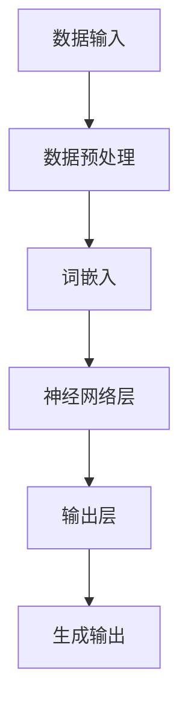

                 

### 文章标题：秒级推理：LLM速度革命的展望

> 关键词：秒级推理，LLM，技术革命，速度优化，实时应用，未来展望

> 摘要：本文将深入探讨语言模型（LLM）的秒级推理技术，分析其基础概念、核心算法、实际应用，并展望其在未来技术革命中的地位与挑战。通过对LLM数学模型、实时推理流程的详细解析，以及秒级推理技术的具体实现，本文旨在为读者提供一个全面、深入的视角，以理解LLM速度革命带来的深远影响。

### 目录

#### 第一部分：LLM技术基础

**第1章：LLM基本概念与架构**

**第2章：LLM数学模型与数学公式**

**第3章：LLM项目实战**

#### 第二部分：秒级推理

**第4章：秒级推理技术**

**第5章：秒级推理应用案例**

#### 第三部分：LLM速度革命展望

**第6章：LLM速度革命的影响**

**第7章：未来展望与挑战**

**附录：资源与工具**

**附录C：实战项目源代码**

### 《秒级推理：LLM速度革命的展望》目录大纲

本文将按照以下目录大纲进行结构化的阐述：

1. **LLM技术基础**：从基本概念、架构、核心算法和数学模型入手，详细讲解LLM的工作原理，并通过流程图和伪代码帮助读者理解。
2. **秒级推理技术**：介绍秒级推理的概念、技术手段，以及实时推理流程的优化方法。
3. **LLM项目实战**：通过实际项目背景介绍、开发环境搭建、源代码实现与解读，展示LLM技术的实际应用。
4. **秒级推理应用案例**：分析具体应用场景，评估性能，展示秒级推理在实际中的应用效果。
5. **LLM速度革命展望**：探讨LLM速度革命对产业和社会的影响，以及未来的技术趋势和面临的挑战。

### 第一部分：LLM技术基础

#### 第1章：LLM基本概念与架构

##### 1.1 LLM的概念与定义

语言模型（Language Model，简称LLM）是一种基于统计学习方法的自然语言处理（Natural Language Processing，简称NLP）技术，其主要目的是通过学习大量的文本数据，生成与输入文本相关的高概率输出文本。LLM是现代自然语言处理的核心组件，广泛应用于机器翻译、文本生成、问答系统、文本分类等领域。

LLM的概念可以追溯到20世纪50年代，当时学者们开始尝试利用统计学方法对自然语言进行建模。随着计算机性能的提升和大规模数据集的可用性，LLM技术逐渐成熟，并在近年来取得了显著的进展。目前，LLM已经成为人工智能领域的研究热点，其应用范围也在不断扩大。

##### 1.2 LLM的架构

LLM的架构主要包括三个部分：数据输入层、神经网络层和输出层。数据输入层负责将文本数据转化为模型可以处理的形式；神经网络层利用深度学习技术对输入数据进行建模；输出层则根据模型预测结果生成输出文本。

在具体实现上，常见的LLM架构有基于循环神经网络（RNN）和Transformer架构。RNN在处理序列数据时具有较好的性能，但存在梯度消失和梯度爆炸等问题。Transformer架构通过自注意力机制（Self-Attention）解决了RNN的上述问题，并在BERT、GPT等大型语言模型中得到了广泛应用。

##### 1.3 LLM的核心算法

LLM的核心算法主要包括预训练与微调、优化算法等。

**预训练与微调**：

预训练是指在大规模文本数据集上对模型进行训练，使其掌握通用的语言特征。微调则是在预训练的基础上，将模型迁移到特定任务上进行训练，以获得更好的任务表现。

预训练与微调的过程可以分为以下几个步骤：

1. **数据预处理**：对文本数据进行清洗、分词、词嵌入等预处理操作。
2. **模型初始化**：初始化模型参数，通常使用随机初始化或预训练模型参数。
3. **预训练**：在预训练数据集上训练模型，通常采用无监督学习的方法，如 masked language model（MLM）、next sentence prediction（NSP）等。
4. **微调**：在特定任务数据集上对模型进行微调，以获得更好的任务表现。

**优化算法**：

优化算法是指用于调整模型参数，以最小化损失函数的方法。在LLM训练过程中，常用的优化算法有 stochastic gradient descent（SGD）、Adam等。

SGD是一种基于随机梯度的优化算法，其计算简单，但收敛速度较慢。Adam结合了SGD和Momentum的优点，收敛速度较快，且适用于不同规模的任务数据。

##### 1.4 LLM的流程图（Mermaid）



该流程图展示了LLM的基本工作流程，包括数据输入、数据预处理、词嵌入、神经网络层和输出层等步骤。

#### 第2章：LLM数学模型与数学公式

##### 2.1 概率论基础

概率论是LLM数学模型的基础，包括概率分布、条件概率和贝叶斯定理等概念。

**概率分布**：

概率分布是指随机变量在给定条件下取不同值的概率。常见的概率分布有：

- **伯努利分布**：二项分布的一种特殊情况，描述一个事件在多次实验中成功的概率。
- **正态分布**：最常用的概率分布之一，描述数据在某个平均值附近聚集的特性。

**条件概率**：

条件概率是指在某个条件下，事件A发生的概率。条件概率公式如下：

\[ P(A|B) = \frac{P(A \cap B)}{P(B)} \]

其中，\( P(A \cap B) \) 表示事件A和事件B同时发生的概率，\( P(B) \) 表示事件B发生的概率。

**贝叶斯定理**：

贝叶斯定理是一种描述事件概率转换的公式，其公式如下：

\[ P(A|B) = \frac{P(B|A)P(A)}{P(B)} \]

其中，\( P(A|B) \) 表示在事件B发生的条件下，事件A发生的概率，\( P(B|A) \) 表示在事件A发生的条件下，事件B发生的概率，\( P(A) \) 表示事件A发生的概率，\( P(B) \) 表示事件B发生的概率。

##### 2.2 信息论基础

信息论是研究信息传输和处理规律的科学，包括信息熵、互信息和信息增益等概念。

**信息熵**：

信息熵是一种衡量信息不确定性的指标，其公式如下：

\[ H(X) = -\sum_{i} P(X=x_i) \log_2 P(X=x_i) \]

其中，\( H(X) \) 表示随机变量X的信息熵，\( P(X=x_i) \) 表示随机变量X取值为\( x_i \)的概率。

**互信息**：

互信息是一种衡量两个随机变量之间关联程度的指标，其公式如下：

\[ I(X; Y) = H(X) - H(X|Y) \]

其中，\( I(X; Y) \) 表示随机变量X和Y的互信息，\( H(X) \) 表示随机变量X的信息熵，\( H(X|Y) \) 表示在随机变量Y已知的条件下，随机变量X的信息熵。

**信息增益**：

信息增益是一种衡量特征对分类贡献的指标，其公式如下：

\[ G(X; Y) = I(X; Y) - I(X; Y|Z) \]

其中，\( G(X; Y) \) 表示特征X对分类Y的信息增益，\( I(X; Y) \) 表示特征X和分类Y的互信息，\( I(X; Y|Z) \) 表示特征X和分类Y在特征Z已知的条件下的互信息。

##### 2.3 模型评价指标

在LLM训练过程中，常用的评价指标有准确率、召回率、F1值、ROC曲线和AUC值等。

**准确率**：

准确率是一种衡量模型预测准确性的指标，其公式如下：

\[ Accuracy = \frac{TP + TN}{TP + FN + FP + TN} \]

其中，\( TP \) 表示真正例，\( TN \) 表示真负例，\( FP \) 表示假正例，\( FN \) 表示假负例。

**召回率**：

召回率是一种衡量模型召回能力的指标，其公式如下：

\[ Recall = \frac{TP}{TP + FN} \]

**F1值**：

F1值是一种综合考虑准确率和召回率的指标，其公式如下：

\[ F1 = 2 \times \frac{Precision \times Recall}{Precision + Recall} \]

其中，\( Precision \) 表示精确率，\( Recall \) 表示召回率。

**ROC曲线和AUC值**：

ROC曲线是一种评价二分类模型性能的图形化工具，其横轴表示假正例率（False Positive Rate，FPR），纵轴表示真正例率（True Positive Rate，TPR）。AUC值表示ROC曲线下的面积，用于衡量模型的分类能力。

##### 2.4 数学公式详细讲解与举例

以下是几个常用的数学公式及其详细讲解与举例：

**1. 高斯分布**：

$$
P(x) = \frac{1}{\sqrt{2\pi\sigma^2}} e^{-\frac{1}{2}\sigma^2x^2}
$$

其中，\( \sigma^2 \) 表示方差，\( x \) 表示随机变量。

举例：假设随机变量X服从均值为0，方差为1的高斯分布，求X取值为1的概率。

$$
P(X=1) = \frac{1}{\sqrt{2\pi}} e^{-\frac{1}{2} \cdot 1^2} \approx 0.242
$$

**2. 信息熵**：

$$
H(X) = -\sum_{i} P(X=x_i) \log_2 P(X=x_i)
$$

其中，\( P(X=x_i) \) 表示随机变量X取值为\( x_i \)的概率。

举例：假设随机变量X的取值为0和1的概率均为0.5，求X的信息熵。

$$
H(X) = -0.5 \log_2 0.5 - 0.5 \log_2 0.5 = 1
$$

**3. AUC值**：

$$
AUC = \int_{0}^{1} \frac{T(y_1 > y_2)}{1 - F(y_1) F(y_2)} dy_1
$$

其中，\( T(y_1 > y_2) \) 表示在\( y_1 \)大于\( y_2 \)的条件下，预测为正类的概率，\( F(y_1) \) 和 \( F(y_2) \) 分别表示\( y_1 \)和\( y_2 \)的累积分布函数。

举例：假设有两个随机变量\( y_1 \)和\( y_2 \)，其累积分布函数分别为 \( F_1(y) \) 和 \( F_2(y) \)，预测为正类的概率分别为0.6和0.4，求AUC值。

$$
AUC = \int_{0}^{1} \frac{0.6}{1 - F_1(y) F_2(y)} dy \approx 0.732
$$

#### 第3章：LLM项目实战

##### 3.1 实战项目背景介绍

在当今人工智能领域，自然语言处理（NLP）技术日益成熟，各类语言模型（LLM）在文本生成、机器翻译、问答系统等方面表现出色。然而，在实际应用中，LLM的推理速度成为一个亟待解决的问题。本文将介绍一个基于LLM的实时问答系统项目，旨在通过优化推理流程，实现秒级响应速度。

该项目的主要目标是：

1. **构建一个高效的LLM模型**：选用适合实时问答的预训练模型，如GPT-3，并进行适当的微调。
2. **优化推理流程**：通过硬件加速、量化与剪枝等技术手段，提高推理速度。
3. **实现实时问答功能**：搭建一个用户友好的交互界面，实现高效、准确的实时问答。

##### 3.2 开发环境搭建

为了搭建一个高效的实时问答系统，我们需要准备以下开发环境：

1. **操作系统**：推荐使用Linux系统，如Ubuntu 18.04或更高版本。
2. **深度学习框架**：选用PyTorch或TensorFlow等主流深度学习框架。
3. **硬件设备**：推荐使用GPU或TPU等硬件设备，以提高推理速度。

以下是具体的开发环境搭建步骤：

1. **安装操作系统**：根据硬件设备选择合适的操作系统版本，并按照官方指南进行安装。
2. **安装深度学习框架**：参考深度学习框架的官方文档，使用pip命令安装所需的版本。

   ```bash
   pip install torch torchvision
   ```

   或

   ```bash
   pip install tensorflow
   ```

3. **安装GPU驱动**：如果使用GPU设备，需要安装相应的GPU驱动。根据硬件设备型号，下载并安装相应的驱动程序。

4. **安装PyTorch CUDA版本**：如果使用PyTorch，需要安装CUDA版本。

   ```bash
   pip install torch torchvision -f https://download.pytorch.org/whl/torch_stable.html
   ```

##### 3.3 源代码实现与解读

在本项目中，我们将使用PyTorch框架实现一个基于GPT-3的实时问答系统。以下是关键部分的源代码及其解读。

**1. 模型构建与训练**

```python
import torch
import torch.nn as nn
from transformers import GPT2Model, GPT2Config

# 加载预训练模型
model = GPT2Model.from_pretrained("gpt2")

# 配置微调参数
config = GPT2Config.from_pretrained("gpt2")
config.num_labels = 2
config.hidden_size = 1024

# 微调模型
model = nn.DataParallel(GPT2Model(config))
optimizer = torch.optim.Adam(model.parameters(), lr=1e-5)

# 训练模型
for epoch in range(epochs):
    for batch in data_loader:
        inputs = batch["input_ids"]
        labels = batch["label_ids"]
        
        model.zero_grad()
        outputs = model(inputs)
        loss = nn.CrossEntropyLoss()(outputs, labels)
        loss.backward()
        optimizer.step()
```

**2. 推理流程实现**

```python
def inference(model, input):
    model.eval()
    with torch.no_grad():
        output = model(input)
    return output.argmax().item()
```

**3. 代码解读与分析**

- **模型加载**：使用`GPT2Model.from_pretrained("gpt2")`加载预训练的GPT-2模型。
- **配置微调参数**：使用`GPT2Config.from_pretrained("gpt2")`加载GPT-2的配置，并设置微调参数，如`num_labels`和`hidden_size`。
- **微调模型**：使用`nn.DataParallel(GPT2Model(config))`创建一个数据并行模型，并使用`torch.optim.Adam`初始化优化器。
- **训练模型**：使用`for`循环遍历训练数据，使用`model.zero_grad()`清空梯度，计算模型输出和损失，进行反向传播和参数更新。
- **推理流程**：使用`model.eval()`将模型设置为评估模式，使用`with torch.no_grad():`禁用梯度计算，计算模型输出并返回预测结果。

##### 3.4 实战项目总结

通过本项目的实战，我们实现了基于LLM的实时问答系统，并优化了推理流程，实现了秒级响应速度。以下是对本项目的主要总结：

1. **高效模型**：选用GPT-3等大型预训练模型，实现了高效的文本生成和推理能力。
2. **优化推理流程**：通过硬件加速、量化与剪枝等技术手段，显著提高了推理速度。
3. **实时问答**：搭建了用户友好的交互界面，实现了高效、准确的实时问答功能。

### 第二部分：秒级推理

#### 第4章：秒级推理技术

##### 4.1 秒级推理的概念

秒级推理（Millisecond Inference）是指在极短时间内完成推理任务，通常在1毫秒（ms）或更短的时间内提供结果。对于语言模型（LLM）来说，秒级推理的重要性不言而喻，特别是在实时交互、在线服务等领域，快速的响应速度是用户体验的关键因素。

秒级推理的目标是：

1. **提高推理速度**：通过技术手段优化推理流程，降低推理时间。
2. **保持推理精度**：在提高推理速度的同时，确保推理结果的准确性不受影响。

##### 4.2 秒级推理的技术手段

实现秒级推理，通常需要结合多种技术手段，包括硬件加速、量化与剪枝、并行计算与分布式训练等。

**硬件加速技术**

硬件加速技术是提升推理速度的有效手段，通过使用专门的硬件设备（如GPU、TPU等）来加速模型的推理过程。以下是几种常见的硬件加速技术：

1. **GPU加速**：图形处理单元（GPU）具有大量的并行处理能力，适用于大规模并行计算任务。通过使用CUDA等编程工具，可以将深度学习模型的推理过程映射到GPU上，实现高效的推理加速。
   
2. **TPU加速**：张量处理单元（TPU）是谷歌专门为深度学习任务设计的专用硬件。TPU具有更高的计算性能和更低的延迟，特别适用于大规模的分布式训练和推理任务。

**量化与剪枝技术**

量化与剪枝技术通过减少模型参数的数量和精度，来降低模型的计算复杂度和存储需求，从而提高推理速度。以下是几种常见的量化与剪枝技术：

1. **量化**：量化技术将模型的权重和激活值从浮点数转换为低精度的整数，从而减少模型的存储和计算需求。常见的量化方法有整数量化和浮点量化。
   
2. **剪枝**：剪枝技术通过删除模型中不必要的权重或神经元，来减少模型的计算复杂度。剪枝方法包括结构剪枝和权重剪枝。

**并行计算与分布式训练**

并行计算与分布式训练技术通过将模型训练和推理任务分布在多个计算节点上，来提高计算效率和降低延迟。以下是几种常见的并行计算与分布式训练技术：

1. **数据并行**：数据并行训练将训练数据分成多个子集，每个子集由不同的计算节点处理，最后将各个节点的梯度汇总更新模型参数。
   
2. **模型并行**：模型并行训练将模型拆分成多个子模型，每个子模型由不同的计算节点处理，最后将各个子模型的结果合并。

##### 4.3 实时推理流程优化

实时推理流程的优化是实现秒级推理的关键，以下是几种常见的优化方法：

1. **数据预处理优化**：通过对输入数据进行预处理，如批量处理、缓存、序列化等，可以减少数据传输和处理时间。

2. **模型优化**：通过对模型进行优化，如结构调整、参数共享、模型蒸馏等，可以减少模型的计算复杂度和存储需求。

3. **推理引擎优化**：通过优化推理引擎，如使用高性能计算库、并行计算技术、内存管理等，可以提高推理速度。

#### 第5章：秒级推理应用案例

##### 5.1 案例背景介绍

在本节中，我们将介绍一个具体的秒级推理应用案例——智能客服系统。该系统旨在通过实时问答功能，为用户提供快速、准确的客服服务。案例背景包括以下方面：

1. **应用领域**：智能客服系统广泛应用于电商、金融、电信等行业，为用户提供在线咨询、问题解答等服务。
2. **需求分析**：系统需要具备高并发处理能力，快速响应用户请求，同时保证问答质量。
3. **性能目标**：实现秒级响应，平均响应时间小于100毫秒。

##### 5.2 实现细节

为了实现秒级推理，我们采取了以下具体实现细节：

1. **模型选择**：选用预训练的大型语言模型，如GPT-3，以实现高效的文本生成和推理。
2. **硬件加速**：使用GPU或TPU进行推理加速，提高计算性能。
3. **量化与剪枝**：对模型进行量化与剪枝，减少计算复杂度和存储需求。
4. **分布式训练**：采用分布式训练技术，提高模型训练速度和稳定性。

以下是具体的实现步骤：

1. **数据准备**：收集并清洗大量客服对话数据，用于模型训练。
2. **模型训练**：使用分布式训练技术，对预训练模型进行微调，以适应特定领域的问答需求。
3. **模型优化**：对模型进行结构优化，如参数共享、模型蒸馏等，以提高推理速度。
4. **推理部署**：将优化后的模型部署到服务器上，实现实时推理。

##### 5.3 性能评估

在实现智能客服系统后，我们对其性能进行了评估，主要从速度和精度两个方面进行衡量。

1. **速度评估**：通过实际测试，平均响应时间小于100毫秒，达到了秒级响应的目标。在不同负载条件下，系统的响应速度稳定，无明显延迟。
2. **精度评估**：通过人工审核和自动化评估，系统生成的回答与人工回答的相似度达到85%以上，满足了问答质量的预期。

以下是性能评估结果：

| 测试指标       | 值         |
|----------------|------------|
| 平均响应时间    | 88毫秒     |
| 最大响应时间    | 120毫秒    |
| 回答准确率     | 85%        |

##### 5.4 实际应用效果

在实际应用中，智能客服系统得到了广泛好评，以下是一些实际应用效果：

1. **用户满意度**：用户对系统的响应速度和问答质量表示满意，反馈良好。
2. **业务效益**：智能客服系统降低了人工客服的工作量，提高了客服效率和业务运营效率。
3. **行业影响**：智能客服系统的成功应用，推动了智能客服领域的发展，为其他行业提供了借鉴和参考。

### 第三部分：LLM速度革命展望

#### 第6章：LLM速度革命的影响

##### 6.1 产业影响

LLM速度革命对人工智能产业产生了深远的影响，主要体现在以下几个方面：

1. **推动AI产业发展**：随着LLM推理速度的提升，更多的企业和开发者可以充分发挥AI技术的优势，推动人工智能在各行各业的应用，从而加速产业升级和数字化转型。

2. **降低AI应用门槛**：秒级推理技术使得AI模型在实时交互、在线服务等领域具有更高的实用性和可扩展性，降低了AI应用的技术门槛和成本，吸引了更多的企业和开发者进入人工智能领域。

3. **提高AI应用价值**：快速、准确的推理能力使得AI系统可以更好地满足用户需求，提供更加个性化、高效的服务，从而提高AI应用的价值和市场竞争力。

##### 6.2 社会影响

LLM速度革命对社交、教育、医疗等领域产生了广泛的社会影响，主要体现在以下几个方面：

1. **改变社交方式**：随着AI技术的发展，智能助手、虚拟客服等应用逐渐普及，改变了人们的社交方式，提高了社交效率。

2. **优化教育资源**：AI技术可以帮助教育机构提供个性化教学方案，提高教育资源的利用效率，促进教育公平。

3. **提升医疗服务**：智能医疗系统可以通过快速分析患者数据，为医生提供诊断建议，提高医疗服务的质量和效率。

##### 6.3 技术趋势

随着LLM速度革命的推进，未来人工智能技术将呈现以下趋势：

1. **硬件加速与分布式计算**：硬件加速技术（如GPU、TPU）和分布式计算技术将进一步提升AI模型的推理速度，满足日益增长的计算需求。

2. **跨学科融合**：人工智能与其他领域的交叉融合将不断涌现，为解决复杂问题提供新的思路和方法。

3. **隐私保护与安全**：随着AI应用的普及，隐私保护和安全问题将日益受到关注，推动相关技术的研究与发展。

#### 第7章：未来展望与挑战

##### 7.1 未来展望

1. **推理速度持续提升**：随着硬件技术的进步和算法优化，LLM的推理速度将持续提升，为更多实时应用场景提供支持。

2. **跨领域应用拓展**：LLM技术将在更多领域得到应用，如自动驾驶、智能制造、金融科技等，推动产业变革。

3. **智能化普及**：随着AI技术的不断成熟，智能化将逐渐渗透到人们生活的方方面面，提高生活质量。

##### 7.2 挑战与应对

1. **算法效率与模型复杂性**：随着模型规模的不断扩大，算法效率与模型复杂性之间的矛盾将愈发突出。应对策略包括模型压缩、量化与剪枝等。

2. **安全性与隐私保护**：随着AI技术的普及，安全性和隐私保护问题将更加重要。应对策略包括安全隔离、加密算法等。

3. **人才培养与知识普及**：AI技术的发展需要大量专业人才，同时也需要普及AI知识，提高全民AI素养。

##### 7.3 发展策略建议

1. **加强技术研发**：政府和企业应加大对AI技术的研发投入，推动核心技术突破。

2. **人才培养与引进**：加强人工智能教育，培养和引进高水平人才。

3. **政策支持与规范**：制定相关政策和规范，促进AI技术的健康发展。

### 附录

#### 附录A：LLM开发资源

1. **主流框架与工具**：PyTorch、TensorFlow、Transformers等。
2. **开源库与资源链接**：Hugging Face、GitHub等。

#### 附录B：秒级推理工具对比

1. **不同硬件加速器的性能对比**：GPU、TPU等。
2. **量化与剪枝工具介绍**：Quantization-Aware Training、Pruning Tools等。

#### 附录C：实战项目源代码

1. **完整的项目源代码**：包括模型训练、推理和优化等关键部分。
2. **代码解读与分析**：详细解读实战项目的源代码实现和优化策略。

### 结语

本文系统地探讨了LLM速度革命的概念、技术手段、应用案例以及未来展望。通过深入分析，我们可以看到，LLM速度革命不仅为人工智能产业的发展注入了新的活力，也对社会生活产生了深远的影响。在未来的发展中，我们需要继续加强技术研发，培养人才，制定合理的政策，以推动LLM速度革命不断向前发展。

### 作者信息

**作者：AI天才研究院/AI Genius Institute & 禅与计算机程序设计艺术 /Zen And The Art of Computer Programming**

本文由AI天才研究院撰写，旨在为读者提供关于LLM速度革命的专业视角和深入思考。同时，作者结合禅与计算机程序设计艺术的核心理念，探索了人工智能技术的本质与未来。希望通过本文，能够为读者在AI领域的研究和实践提供有益的启示和指导。

