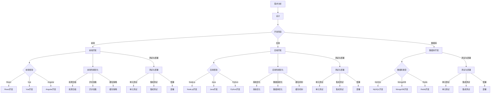

                 

# 《程序员副业：移动应用开发》

## 关键词
移动应用开发、程序员副业、前端开发、后端开发、数据库、实战项目、性能优化、应用发布与运营

## 摘要
本文旨在为程序员提供一份全面深入的移动应用开发指南，帮助他们在副业中探索移动应用开发的广阔天地。文章分为八个部分，从移动应用开发的基础概念、技术栈，到前端、后端、数据库开发，再到实战项目、性能优化、应用发布与运营，以及未来趋势与展望，全面覆盖了移动应用开发的各个方面。文章采用逻辑清晰、结构紧凑、简单易懂的专业的技术语言，让读者能够系统地掌握移动应用开发的核心知识和实践技能。

## 第一部分：移动应用开发基础

### 第1章：移动应用开发概述

#### 1.1 移动应用开发的定义与重要性

移动应用开发是指为智能手机、平板电脑等移动设备设计、开发应用程序的过程。随着移动互联网的快速发展，移动应用已经成为人们生活中不可或缺的一部分，具有极高的商业价值和社会影响力。

- **定义**：
  移动应用是指专门为智能手机、平板电脑等移动设备设计的软件应用程序，它们可以通过应用程序商店下载和安装。

- **重要性**：
  移动应用开发的重要性体现在以下几个方面：

1. **提高用户体验**：移动应用提供了更好的用户体验，用户可以随时随地访问所需的信息和服务。
2. **商业机会**：企业和开发者可以通过移动应用开发来拓展市场，提升品牌知名度，增加收入。
3. **数字化转型**：对于企业而言，移动应用开发是实现数字化转型的重要途径，可以提高运营效率，降低成本。

#### 1.2 移动应用开发的主要类型

移动应用开发主要可以分为以下三种类型：

- **原生应用**：使用特定移动平台的编程语言（如iOS的Swift/Objective-C、Android的Java/Kotlin）开发的移动应用。优点是性能优异，用户体验良好。
- **混合应用**：结合了Web应用和原生应用的特点，使用HTML5、CSS3和JavaScript等技术开发的移动应用。优点是开发成本低，跨平台性好。
- **Web应用**：通过浏览器访问的移动应用，使用Web技术（如HTML、CSS、JavaScript）开发。优点是易于维护和更新，无需安装。

#### 1.3 移动应用开发的技术栈

移动应用开发的技术栈包括前端、后端和数据库技术：

- **前端技术**：
  - HTML、CSS、JavaScript是移动应用开发的基础技术。
  - 前端框架如React、Vue、Angular可以简化开发流程，提高开发效率。

- **后端技术**：
  - 后端技术包括Node.js、Java、Python、Ruby等，用于处理业务逻辑和数据存储。
  - 后端框架如Express、Spring、Django可以提供更高级的API和功能支持。

- **数据库技术**：
  - 关系型数据库如MySQL、PostgreSQL用于结构化数据存储。
  - 非关系型数据库如MongoDB、Redis用于存储非结构化数据和缓存。

#### 1.4 移动应用开发的流程

移动应用开发的流程通常包括以下几个阶段：

- **需求分析**：明确应用的功能需求和非功能需求。
- **设计**：设计应用的界面和交互流程。
- **开发**：编写代码，实现应用的功能。
- **测试**：进行功能测试、性能测试和兼容性测试。
- **部署**：将应用部署到移动设备或应用商店。
- **维护**：持续优化和更新应用，修复bug。

### 第二部分：移动应用前端开发

#### 第2章：移动应用前端开发

##### 2.1 前端开发基础

###### 2.1.1 HTML基础

HTML（HyperText Markup Language）是构建网页的结构基础，定义了网页的结构和内容。

- **HTML标签**：
  - `<html>`：定义文档的根元素。
  - `<head>`：包含文档的元数据。
  - `<title>`：定义文档的标题。
  - `<body>`：包含文档的内容。

- **HTML属性**：
  - `id`：为元素设置唯一的标识。
  - `class`：为元素设置类名。
  - `src`：指定元素的源文件。

###### 2.1.2 CSS基础

CSS（Cascading Style Sheets）用于设置网页元素的样式。

- **CSS选择器**：
  - 类型选择器：通过元素类型选择元素。
  - 类选择器：通过元素的类名选择元素。
  - ID选择器：通过元素的ID选择元素。

- **CSS属性**：
  - `color`：设置文本颜色。
  - `font-size`：设置文本大小。
  - `margin`：设置外边距。
  - `padding`：设置内边距。

###### 2.1.3 JavaScript基础

JavaScript是一种客户端脚本语言，用于增强网页的交互性和动态效果。

- **JavaScript语法**：
  - 变量声明和赋值。
  - 数据类型和运算符。
  - 控制结构：条件语句和循环语句。

- **JavaScript数据类型**：
  - 基本数据类型：String、Number、Boolean、Null、Undefined。
  - 复杂数据类型：Object、Array。

- **JavaScript函数**：
  - 函数声明和调用。
  - 函数参数和返回值。
  - 闭包和高阶函数。

##### 2.2 前端框架介绍

移动应用前端开发可以使用多种前端框架来提高开发效率和代码质量：

###### 2.2.1 React基础

React是由Facebook推出的一种用于构建用户界面的JavaScript库。它通过组件化开发，实现高效的UI更新和状态管理。

- **React组件**：
  - 函数组件和类组件。
  - 组件的状态和属性。
  - 组件的生命周期。

- **React状态管理**：
  - 使用useState和useReducer管理组件状态。
  - 使用Context和Redux实现全局状态管理。

- **React路由**：
  - 使用React Router实现单页面应用的页面跳转。

###### 2.2.2 Vue基础

Vue是一个用于构建用户界面的渐进式JavaScript框架。它提供了简洁的API和灵活的组件系统。

- **Vue指令**：
  - `v-model`：实现表单数据的双向绑定。
  - `v-if`和`v-show`：条件渲染。
  - `v-for`：遍历数组或对象。
  - `v-bind`：动态绑定属性。

- **Vue组件**：
  - 组件的定义和注册。
  - 组件的通信。
  - 组件的生命周期。

- **Vue路由**：
  - 使用Vue Router实现单页面应用的页面跳转。

###### 2.2.3 Angular基础

Angular是一个由Google维护的开源JavaScript框架，用于构建复杂的单页面应用程序。

- **Angular模块**：
  - 模块的定义和注册。
  - 模块之间的依赖关系。

- **Angular组件**：
  - 组件的定义和注册。
  - 组件的模板和样式。
  - 组件的输入属性和输出事件。

- **Angular服务**：
  - 服务的定义和注入。
  - 服务的单例模式。

### 第三部分：移动应用后端开发

#### 第3章：移动应用后端开发

##### 3.1 后端开发基础

###### 3.1.1 Node.js基础

Node.js是一个基于Chrome V8引擎的JavaScript运行环境，用于构建高效、可扩展的后端服务。

- **Node.js特点**：
  - 非阻塞、事件驱动。
  - 使用JavaScript进行编程。
  - 支持多种后端技术。

- **Node.js模块系统**：
  - CommonJS模块。
  - ES6模块。

- **Node.js异步编程**：
  - 回调函数。
  - Promise。
  - async/await。

###### 3.1.2 Java基础

Java是一种高级、面向对象的编程语言，广泛应用于企业级后端开发。

- **Java语法**：
  - 类和对象。
  - 继承和多态。
  - 接口和抽象类。

- **Java集合**：
  - List、Set、Map。
  - ArrayList、LinkedList、HashMap。

- **Java多线程**：
  - 线程的创建和销毁。
  - 线程同步和通信。

###### 3.1.3 Python基础

Python是一种简洁、易读的编程语言，广泛应用于数据科学、Web开发等领域。

- **Python语法**：
  - 变量和数据类型。
  - 控制结构：条件语句和循环语句。
  - 函数和模块。

- **Python函数**：
  - 函数的定义和调用。
  - 闭包和高阶函数。

- **Python模块**：
  - 内置模块和第三方模块。

##### 3.2 后端框架介绍

移动应用后端开发可以使用多种后端框架来提高开发效率和代码质量：

###### 3.2.1 Node.js框架

Node.js拥有丰富的后端框架，其中Express和NestJS是常用的框架。

- **Express框架**：
  - 路由和中间件。
  - 错误处理和响应。
  - 数据库集成。

- **NestJS框架**：
  - 容器和服务管理。
  - 控制器和服务。
  - 鉴权和授权。

###### 3.2.2 Java框架

Java后端框架包括Spring、Spring Boot和MyBatis等。

- **Spring框架**：
  - 依赖注入和AOP。
  - MVC模式。
  - 数据库集成。

- **Spring Boot框架**：
  - 自动配置和起步依赖。
  - 日志和监控。
  - 安全和权限。

- **MyBatis框架**：
  - 映射器接口和动态SQL。
  - SQL执行和结果处理。

###### 3.2.3 Python框架

Python后端框架包括Django和Flask等。

- **Django框架**：
  - 模型-视图-模板。
  - 表单和用户认证。
  - 缓存和分页。

- **Flask框架**：
  - 路由和视图函数。
  - 模板引擎。
  - 扩展和插件。

### 第四部分：移动应用数据库开发

#### 第4章：移动应用数据库开发

##### 4.1 数据库基础

数据库是移动应用数据存储和管理的重要组成部分。移动应用开发中常用的数据库技术包括关系型数据库和非关系型数据库。

###### 4.1.1 关系型数据库

关系型数据库（RDBMS）使用表格结构存储数据，并通过SQL（Structured Query Language）进行数据操作。

- **数据库基本概念**：
  - 数据库（Database）：存储数据的容器。
  - 表（Table）：存储数据的结构化集合。
  - 字段（Column）：表中的数据列。
  - 记录（Row）：表中的一行数据。

- **SQL语句**：
  - DDL（数据定义语言）：创建、修改和删除数据库对象。
  - DML（数据操作语言）：插入、更新和删除数据。
  - DCL（数据控制语言）：授予权限和管理数据库。

- **数据库设计**：
  - 实体-关系模型（ER模型）：表示数据实体及其关系。
  - 约束和规范化：确保数据的完整性和一致性。

###### 4.1.2 非关系型数据库

非关系型数据库（NoSQL）不同于关系型数据库，它们使用不同的数据模型和存储方式，适用于不同的应用场景。

- **MongoDB基础**：
  - 文档存储：以JSON文档的形式存储数据。
  - 数据模型：集合（Collection）、文档（Document）。
  - 查询和索引：基于文档内容的查询和索引支持。

- **Redis基础**：
  - 键值存储：以键值对的形式存储数据。
  - 数据结构：字符串、列表、集合、哈希。
  - 缓存：用于提高数据访问速度。

##### 4.2 数据库操作

在移动应用开发中，数据库操作是必不可少的一环。以下是常用的数据库操作方法：

###### 4.2.1 MySQL操作

MySQL是一种广泛使用的关系型数据库管理系统。

- **MySQL安装与配置**：
  - 系统要求：Linux、Windows、macOS。
  - 安装步骤：使用yum、apt-get或手动安装。
  - 配置文件：my.cnf。

- **MySQL数据库操作**：
  - 创建和删除数据库。
  - 创建和删除表。
  - 数据的插入、查询和更新。

- **MySQL数据查询**：
  - 简单查询：基于条件的单表查询。
  - 复杂查询：多表查询、子查询、聚合函数。

###### 4.2.2 MongoDB操作

MongoDB是一种文档型数据库，适用于存储非结构化数据。

- **MongoDB安装与配置**：
  - 系统要求：Linux、Windows、macOS。
  - 安装步骤：使用yum、apt-get或手动安装。
  - 配置文件：mongod.conf。

- **MongoDB数据库操作**：
  - 创建和删除数据库。
  - 创建和删除集合。
  - 插入、查询、更新和删除文档。

- **MongoDB数据查询**：
  - 简单查询：基于条件的文档查询。
  - 复杂查询：嵌套查询、数组查询。
  - 数据聚合：对文档进行分组和聚合操作。

###### 4.2.3 Redis操作

Redis是一种高性能的键值存储数据库，常用于缓存和实时数据存储。

- **Redis安装与配置**：
  - 系统要求：Linux、Windows、macOS。
  - 安装步骤：使用yum、apt-get或手动安装。
  - 配置文件：redis.conf。

- **Redis数据类型**：
  - 字符串：存储简单的键值对。
  - 列表：存储有序的字符串元素。
  - 集合：存储无序的字符串元素。
  - 哈希：存储键值对。
  - 缓存：提高数据访问速度。

- **Redis数据操作**：
  - 设置和获取数据。
  - 删除和更新数据。
  - Redis集群操作：实现分布式缓存。

### 第五部分：移动应用开发实战

#### 第5章：移动应用开发实战

##### 5.1 实战项目一：天气应用

###### 5.1.1 项目需求分析

天气应用是一个典型的移动应用，用户可以通过应用查询特定城市的实时天气信息。项目需求包括：

- 功能需求：
  - 用户输入城市名称。
  - 应用显示当前天气信息。
  - 应用提供天气预警功能。

- 非功能需求：
  - 应用应具有良好的用户体验。
  - 应用应支持多种语言。
  - 应用应具有跨平台兼容性。

###### 5.1.2 技术选型

- 前端技术：
  - HTML、CSS、JavaScript。
  - React框架。

- 后端技术：
  - Node.js。
  - Express框架。

- 数据库技术：
  - MySQL。

###### 5.1.3 项目开发

- 前端开发：
  - 设计界面和交互。
  - 编写React组件。
  - 处理用户输入和查询。

- 后端开发：
  - 编写API接口。
  - 处理天气数据查询。
  - 集成MySQL数据库。

- 数据库开发：
  - 设计数据库表结构。
  - 存储和查询天气数据。

###### 5.1.4 项目测试与部署

- 单元测试：
  - 测试前端组件。
  - 测试后端API。

- 集成测试：
  - 测试前后端联调。
  - 测试数据库查询。

- 项目部署：
  - 部署到本地服务器。
  - 部署到云服务器。
  - 配置域名和SSL。

##### 5.2 实战项目二：待办事项应用

###### 5.2.1 项目需求分析

待办事项应用是一个用于记录和管理用户待办事项的移动应用。项目需求包括：

- 功能需求：
  - 用户可以添加、删除和编辑待办事项。
  - 应用应提供分类功能，方便用户管理事项。
  - 应用应支持多用户登录，实现事项共享。

- 非功能需求：
  - 应用应具有良好的用户体验。
  - 应用应支持数据同步和备份。
  - 应用应具有高并发处理能力。

###### 5.2.2 技术选型

- 前端技术：
  - HTML、CSS、JavaScript。
  - Vue框架。

- 后端技术：
  - Java。
  - Spring Boot框架。

- 数据库技术：
  - MySQL。

###### 5.2.3 项目开发

- 前端开发：
  - 设计界面和交互。
  - 编写Vue组件。
  - 处理用户输入和查询。

- 后端开发：
  - 编写API接口。
  - 处理待办事项操作。
  - 集成MySQL数据库。

- 数据库开发：
  - 设计数据库表结构。
  - 存储和查询待办事项数据。

###### 5.2.4 项目测试与部署

- 单元测试：
  - 测试前端组件。
  - 测试后端API。

- 集成测试：
  - 测试前后端联调。
  - 测试数据库查询。

- 项目部署：
  - 部署到本地服务器。
  - 部署到云服务器。
  - 配置域名和SSL。

### 第六部分：移动应用性能优化

#### 第6章：移动应用性能优化

##### 6.1 性能优化基础

移动应用性能优化是提高用户体验和提升应用竞争力的关键。性能优化包括前端和后端两个层面。

###### 6.1.1 前端性能优化

前端性能优化主要关注页面加载速度和用户体验。

- **资源压缩**：
  - CSS和JavaScript文件的压缩。
  - 图片的压缩。

- **异步加载**：
  - 异步加载JavaScript文件。
  - 异步加载CSS文件。

- **缓存策略**：
  - 浏览器缓存。
  - CDN缓存。
  - HTTP缓存。

###### 6.1.2 后端性能优化

后端性能优化主要关注服务器的响应速度和处理能力。

- **系统优化**：
  - 服务器硬件优化。
  - 服务器软件优化。

- **数据库优化**：
  - 索引优化。
  - 查询优化。

- **缓存机制**：
  - 应用层缓存。
  - 分布式缓存。

##### 6.2 具体优化案例

###### 6.2.1 前端性能优化案例

- **实例分析**：
  - 分析页面加载时间。
  - 找出性能瓶颈。

- **优化措施**：
  - 压缩资源文件。
  - 异步加载资源。
  - 使用缓存策略。

###### 6.2.2 后端性能优化案例

- **实例分析**：
  - 分析服务器响应时间。
  - 找出性能瓶颈。

- **优化措施**：
  - 优化数据库查询。
  - 使用缓存机制。
  - 调整服务器配置。

### 第七部分：移动应用发布与运营

#### 第7章：移动应用发布与运营

##### 7.1 应用发布流程

移动应用发布是让用户使用应用的关键步骤。发布流程包括应用商店发布和自定义发布两种方式。

###### 7.1.1 应用商店发布

- **应用商店的选择**：
  - iOS应用商店（App Store）。
  - Android应用商店（Google Play Store）。

- **应用商店的发布流程**：
  - 准备应用文件。
  - 提交审核。
  - 等待审核通过。
  - 发布应用。

###### 7.1.2 自定义发布

- **自定义发布流程**：
  - 准备应用文件。
  - 部署到服务器。
  - 配置域名和SSL。
  - 发布应用。

- **自定义发布注意事项**：
  - 确保应用安全。
  - 确保应用稳定性和可靠性。

##### 7.2 应用运营与推广

移动应用的运营与推广是提升用户数量和活跃度的关键。

###### 7.2.1 应用运营

- **用户数据分析**：
  - 用户行为分析。
  - 用户留存率分析。

- **应用更新策略**：
  - 定期更新功能。
  - 解决用户反馈的问题。
  - 提高用户体验。

###### 7.2.2 应用推广

- **网络推广**：
  - 社交媒体推广。
  - SEO优化。
  - 广告推广。

- **社交媒体推广**：
  - 微信公众号。
  - 微博。
  - 抖音。

- **KOL推广**：
  - 选择合适的KOL。
  - 合作内容和推广形式。
  - 监控推广效果。

### 第八部分：移动应用开发趋势与展望

#### 第8章：移动应用开发趋势与展望

##### 8.1 移动应用开发趋势

移动应用开发正面临以下趋势：

- **5G技术**：
  - 提供更低延迟、更高速度的网络连接，提升应用性能。

- **物联网**：
  - 通过连接各种智能设备，扩展应用场景，实现更广泛的数据交互。

- **人工智能**：
  - 引入人工智能技术，实现个性化推荐、智能客服等功能。

##### 8.2 未来展望

未来移动应用开发将呈现以下趋势：

- **应用场景的多元化**：
  - 应用将更广泛地应用于各种场景，如智能家居、智能医疗等。

- **开发效率和用户体验的提升**：
  - 新技术将提高开发效率和用户体验，降低开发成本。

- **数据安全和隐私保护**：
  - 数据安全和隐私保护将成为开发的重要关注点。

### 附录

#### 附录 A：开发工具与资源

- **前端开发工具**：
  - VS Code。
  - WebStorm。

- **后端开发工具**：
  - IntelliJ IDEA。
  - Eclipse。

- **数据库工具**：
  - MySQL Workbench。
  - MongoDB Shell。

- **移动应用开发教程与指南**：
  - Udemy。
  - Coursera。

#### 附录 B：技术栈与框架

- **前端技术栈**：
  - React。
  - Vue。
  - Angular。

- **后端技术栈**：
  - Node.js。
  - Java。
  - Python。

- **数据库技术栈**：
  - MySQL。
  - MongoDB。
  - Redis。

#### 附录 C：开发实践与案例

- **实战项目总结**：
  - 天气应用开发。
  - 待办事项应用开发。

- **经验分享与建议**：
  - 项目管理的最佳实践。
  - 开发团队的协作技巧。
  - 性能优化的实践经验。

### 总结

移动应用开发为程序员提供了丰富的机会和挑战。通过本文的介绍，读者可以系统地了解移动应用开发的基础知识、技术栈、实战项目、性能优化、应用发布与运营，以及未来趋势与展望。希望本文能够为程序员在副业中探索移动应用开发提供有力的支持和指导。

### 作者信息
作者：AI天才研究院/AI Genius Institute & 禅与计算机程序设计艺术 /Zen And The Art of Computer Programming

----------------------------------------------------------------

# Mermaid 流程图



### 核心算法原理讲解

#### 前端状态管理

前端状态管理是移动应用开发中的一个关键概念，它涉及到如何在整个应用中追踪和更新数据状态。在React应用中，状态管理通常通过`useState`和`useReducer`钩子来实现。

- **useState**：用于简化的状态管理，适合小型应用。它允许你为一个组件的状态设置一个状态变量，并定义如何更新它。
  
  ```javascript
  const [count, setCount] = useState(0);
  
  const handleClick = () => {
    setCount(count + 1);
  };
  ```

- **useReducer**：用于更复杂的状态管理，它提供了一个更灵活的更新机制，允许你传递一个 reducer 函数来处理状态更新。

  ```javascript
  const initialState = { count: 0, step: 1 };
  
  function reducer(state, action) {
    switch (action.type) {
      case 'increment': 
        return { count: state.count + action.step };
      case 'decrement':
        return { count: state.count - action.step };
      default:
        throw new Error();
    }
  }
  
  const [state, dispatch] = useReducer(reducer, initialState);
  
  const handleIncrement = () => {
    dispatch({ type: 'increment', step: 1 });
  };
  
  const handleDecrement = () => {
    dispatch({ type: 'decrement', step: 1 });
  };
  ```

#### 后端RESTful API设计

RESTful API是用于构建网络应用程序的架构风格和设计原则，它基于HTTP协议，使用统一的接口和资源表示。以下是设计RESTful API的一些核心原则：

- **统一接口**：API应该使用统一的接口来处理不同的资源和操作。这通常包括使用标准的HTTP方法（GET、POST、PUT、DELETE）来执行不同的操作。
  
  ```http
  GET /users    // 获取所有用户
  POST /users  // 创建新用户
  GET /users/1 // 获取用户ID为1的用户
  PUT /users/1 // 更新用户ID为1的用户
  DELETE /users/1 // 删除用户ID为1的用户
  ```

- **状态转移**：API应该通过状态转移来响应客户端请求，而不是通过重定向。这意味着响应状态码（如200、201、404、500）应该清晰地传达操作结果。

- **无状态**：API应该是无状态的，即每个请求都应该独立处理，不应依赖于之前的请求。这有助于确保API的可扩展性和可靠性。

- **可缓存**：API响应应该可以被缓存，以提高性能和减少服务器负载。这通常通过在响应头中设置适当的缓存策略来实现。

- **HATEOAS**：HATEOAS（超媒体作为应用状态引擎）是一种设计原则，它通过在响应中包括链接和元数据，允许客户端自动发现和导航API。

  ```json
  {
    "users": [
      {
        "id": 1,
        "name": "John Doe",
        "links": {
          "self": "http://example.com/users/1",
          "profile": "http://example.com/users/1/profile"
        }
      }
    ]
  }
  ```

#### 数据库查询优化

数据库查询优化是提高应用性能的关键步骤之一。以下是几个常用的查询优化技术：

- **索引**：在常用的查询字段上创建索引，可以显著提高查询速度。索引可以加快数据的检索速度，但也会增加插入、更新和删除操作的成本。
  
  ```sql
  CREATE INDEX idx_user_email ON users (email);
  ```

- **查询重写**：通过重写查询，可以使用更高效的算法或访问路径来提高查询性能。例如，使用覆盖索引（Covering Index）可以避免读取整个索引。

- **连接优化**：对于复杂的查询，如JOIN操作，可以优化连接策略，减少数据访问量。使用合适的JOIN类型（如INNER JOIN、LEFT JOIN）和条件可以减少不必要的计算。

- **分析查询执行计划**：使用EXPLAIN语句分析查询执行计划，可以了解数据库如何执行查询，并识别性能瓶颈。

  ```sql
  EXPLAIN SELECT * FROM orders o JOIN customers c ON o.customer_id = c.id;
  ```

#### 数学模型和公式

在移动应用开发中，理解和使用数学模型和公式是解决实际问题的有效方法。以下是几个常见的数学模型和公式：

- **线性回归**：线性回归模型用于预测一个变量的值，基于另一个或多个变量的线性组合。

  公式：
  $$ y = \beta_0 + \beta_1x + \epsilon $$
  其中，$y$ 是因变量，$x$ 是自变量，$\beta_0$ 和 $\beta_1$ 是模型参数，$\epsilon$ 是误差项。

  举例：
  假设我们想要预测销售额（$y$）基于广告支出（$x$），可以使用线性回归模型来拟合数据并预测未来的销售额。

- **时间序列分析**：时间序列分析用于分析时间相关的数据序列，并预测未来的趋势。

  公式：
  $$ y_t = \beta_0 + \beta_1t + \beta_2w_t + \epsilon_t $$
  其中，$y_t$ 是时间序列在时刻 $t$ 的值，$w_t$ 是趋势项，$\beta_0$、$\beta_1$ 和 $\beta_2$ 是模型参数，$\epsilon_t$ 是误差项。

  举例：
  假设我们想要预测某个网站的用户访问量，可以使用时间序列分析模型来拟合历史数据并预测未来的访问量。

- **机器学习分类算法**：机器学习分类算法用于将数据分类到不同的类别中，常见的算法包括逻辑回归、决策树、随机森林等。

  公式（逻辑回归）：
  $$ P(y=1) = \frac{1}{1 + e^{-(\beta_0 + \beta_1x)}} $$
  其中，$P(y=1)$ 是预测类别1的概率，$x$ 是特征值，$\beta_0$ 和 $\beta_1$ 是模型参数。

  举例：
  假设我们想要预测用户是否会对某个产品进行购买，可以使用逻辑回归模型来拟合用户数据并预测购买概率。

### 项目实战：代码实际案例和详细解释说明

#### 开发环境搭建

为了完成一个简单的移动应用，我们需要搭建一个合适的开发环境。以下是使用Node.js和React搭建开发环境的步骤：

1. **安装Node.js**：

   访问 Node.js 官网下载并安装 Node.js。安装完成后，通过命令行检查 Node.js 和 npm（Node.js 的包管理器）是否正确安装。

   ```shell
   node -v
   npm -v
   ```

2. **创建React应用**：

   使用 `create-react-app` 命令创建一个新的React应用。

   ```shell
   npx create-react-app weather-app
   cd weather-app
   ```

3. **安装依赖**：

   在项目中安装必要的依赖包，如React Router和Axios。

   ```shell
   npm install react-router-dom axios
   ```

#### 源代码详细实现和代码解读

以下是天气应用的核心源代码，我们将逐行解释代码的功能和实现细节。

```jsx
import React, { useState, useEffect } from "react";
import axios from "axios";
import { BrowserRouter as Router, Route, Switch } from "react-router-dom";

function App() {
  const [city, setCity] = useState("");
  const [weather, setWeather] = useState(null);

  useEffect(() => {
    if (city) {
      const fetchWeather = async () => {
        const response = await axios.get(
          `https://api.openweathermap.org/data/2.5/weather?q=${city}&appid=YOUR_API_KEY`
        );
        setWeather(response.data);
      };
      fetchWeather();
    }
  }, [city]);

  const handleCityChange = (e) => {
    setCity(e.target.value);
  };

  return (
    <div className="App">
      <h1>天气应用</h1>
      <input type="text" placeholder="输入城市名称" onChange={handleCityChange} />
      {weather && (
        <div>
          <h2>{weather.name}</h2>
          <h3>{weather.main.temp}°C</h3>
          <p>{weather.weather[0].description}</p>
        </div>
      )}
    </div>
  );
}

export default App;
```

- **依赖引入**：

  我们首先引入了 React、useState、useEffect 和 axios，以及 React Router 的相关组件。

- **城市和天气状态**：

  使用 `useState` 钩子初始化城市（city）和天气（weather）状态。城市状态用于存储用户输入的城市名称，天气状态用于存储从API获取的天气数据。

- **useEffect 钩子**：

  `useEffect` 钩子用于在组件挂载后执行副作用操作。在这里，我们检查城市状态是否为空，如果非空则发起API请求获取天气数据。

- **handleCityChange 函数**：

  `handleCityChange` 函数用于更新城市状态。当用户在输入框中输入城市名称时，该函数会被触发，更新城市状态。

- **渲染**：

  我们首先渲染一个输入框，用于用户输入城市名称。当用户提交输入时，`handleCityChange` 函数会被调用，更新城市状态。

  如果天气状态存在（即用户输入了城市名称并获取到了天气数据），我们将渲染天气信息，包括城市名称、温度和天气描述。

#### 代码解读与分析

1. **API 请求**：

   我们使用 Axios 发起 GET 请求，获取指定城市的天气数据。请求的URL包含了城市的名称和我们的API密钥。Axios 返回一个 Promise，我们使用 `async/await` 语法来处理这个 Promise，获取天气数据并更新天气状态。

   ```javascript
   const fetchWeather = async () => {
     const response = await axios.get(
       `https://api.openweathermap.org/data/2.5/weather?q=${city}&appid=YOUR_API_KEY`
     );
     setWeather(response.data);
   };
   ```

2. **渲染天气信息**：

   当天气状态存在时，我们使用 JSX 渲染天气信息。这里使用了 `null` 和 `&&` 运算符来避免渲染未定义的天气信息。

   ```jsx
   {weather && (
     <div>
       <h2>{weather.name}</h2>
       <h3>{weather.main.temp}°C</h3>
       <p>{weather.weather[0].description}</p>
     </div>
   )}
   ```

3. **React Router**：

   如果需要添加路由功能，我们可以使用 React Router。这允许我们为不同的页面定义路由，并在用户导航时更新当前组件的状态。

   ```jsx
   <Router>
     <Switch>
       <Route path="/" exact component={App} />
       {/* 其他路由 */}
     </Switch>
   </Router>
   ```

#### 实战总结与经验分享

1. **项目管理**：

   在开发过程中，良好的项目管理是成功的关键。使用版本控制系统（如Git）来管理代码变更，定期进行代码审查，以及制定清晰的项目计划和时间表。

2. **代码质量**：

   保持代码的可读性和可维护性。遵循代码规范，编写清晰的注释，以及使用合适的代码结构和命名习惯。

3. **性能优化**：

   关注应用性能，尤其是在处理大量数据和复杂逻辑时。使用异步加载、代码分割、资源压缩等技术来优化性能。

4. **用户体验**：

   设计直观、易用的用户界面，确保应用在多种设备和网络环境下都能良好运行。

### 附录

#### 附录 A：开发工具与资源

- **前端开发工具**：
  - VS Code。
  - WebStorm。

- **后端开发工具**：
  - IntelliJ IDEA。
  - Eclipse。

- **数据库工具**：
  - MySQL Workbench。
  - MongoDB Shell。

- **移动应用开发教程与指南**：
  - Udemy。
  - Coursera。

#### 附录 B：技术栈与框架

- **前端技术栈**：
  - React。
  - Vue。
  - Angular。

- **后端技术栈**：
  - Node.js。
  - Java。
  - Python。

- **数据库技术栈**：
  - MySQL。
  - MongoDB。
  - Redis。

#### 附录 C：开发实践与案例

- **实战项目总结**：
  - 天气应用开发。
  - 待办事项应用开发。

- **经验分享与建议**：
  - 项目管理的最佳实践。
  - 开发团队的协作技巧。
  - 性能优化的实践经验。

### 总结

本文全面介绍了移动应用开发的基础知识、技术栈、实战项目、性能优化、应用发布与运营，以及未来趋势与展望。通过详细的代码案例和算法原理讲解，读者可以更好地理解和应用移动应用开发的实践技能。希望本文能为程序员在副业中探索移动应用开发提供有力支持和指导。

### 作者信息

作者：AI天才研究院/AI Genius Institute & 禅与计算机程序设计艺术 /Zen And The Art of Computer Programming

