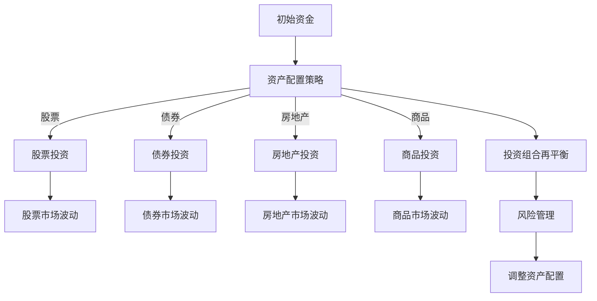

                 

### 文章标题：程序员如何建立多元投资组合

> 关键词：程序员、多元投资组合、资产配置、风险管理、人工智能、区块链

> 摘要：本文旨在探讨程序员如何通过建立多元投资组合来提高个人财富的稳定性和增长潜力。文章将首先介绍多元投资组合的概念及其与传统投资方式的区别，随后深入探讨资产类别与投资工具的选择，提供具体策略和风险管理的建议。通过实际案例和计算机技术应用的结合，本文将帮助程序员更科学地构建和管理投资组合，实现财富的稳健增长。

### 第一部分：程序员如何建立多元投资组合的基础

#### 第1章：多元投资组合概述

1.1 多元投资组合的概念

多元投资组合（Diversified Portfolio）是一种通过将资金分配到不同的资产类别（如股票、债券、房地产、商品等）和不同市场（如国内、国际市场）来实现风险分散的投资策略。这种策略的核心思想是通过投资组合中的不同资产类别之间的相互抵消，降低单一资产波动带来的风险。

1.2 多元投资组合的优势与挑战

优势：
- 风险分散：通过投资不同资产类别，可以降低单一资产类别带来的特定风险。
- 增加收益潜力：不同资产类别的不同表现可以相互补充，增加整体投资组合的收益潜力。
- 提高资金利用率：通过合理配置资产，可以最大化资金的使用效率。

挑战：
- 资源分散：多元投资组合需要管理多个资产类别，这可能增加管理和监控的难度。
- 信息成本：了解和研究多种资产类别和市场信息可能需要更多的资源和时间。
- 交易成本：频繁交易可能带来额外的交易成本。

1.3 多元投资组合与传统投资方式对比

传统投资方式通常将所有资金集中在某一类资产上，如仅投资股票或债券。这种方式的风险高度集中，一旦市场发生波动，投资者可能会面临较大损失。相比之下，多元投资组合通过分散投资，可以有效降低这种单一风险。

1.4 多元投资组合的历史与发展

多元投资组合策略的历史可以追溯到20世纪50年代，当时哈里·马科维茨（Harry Markowitz）提出了现代投资组合理论（MPT），这是多元投资组合理论的基础。自那时以来，随着金融市场的不断发展和投资者需求的变化，多元投资组合策略也得到了不断优化和完善。

### 第2章：核心概念与联系

2.1 风险分散与资产配置

风险分散是多元投资组合的核心原则之一。通过在不同资产类别之间分配资金，投资者可以降低单一资产类别波动带来的风险。资产配置（Asset Allocation）是实现风险分散的关键手段，它涉及将资金分配到不同资产类别的过程。

**Mermaid流程图：**



2.2 有效市场假说

有效市场假说（Efficient Market Hypothesis, EMH）是一种关于金融市场效率的理论。根据这一假说，股票市场的价格已经反映了所有可用信息，因此投资者无法通过分析历史价格或公开信息来获得超额收益。这一理论对多元投资组合策略有重要影响，因为它强调了分散投资的重要性，以避免过度依赖单一资产类别。

2.3 资产类别与投资工具

资产类别是指投资的不同领域或形式，常见的资产类别包括股票、债券、房地产、商品、外汇等。每种资产类别都有其独特的市场特性和风险收益特征。

投资工具是实现资产配置的具体手段，包括：

- 股票：通过购买公司股份参与企业利润分享。
- 债券：购买债务工具，获取固定利息收入。
- 房地产：通过购买、租赁或开发房地产获取收益。
- 商品：通过买卖大宗商品（如黄金、原油等）获取价格波动的收益。
- 外汇：通过买卖不同货币对获取汇率波动的收益。

选择合适的资产类别和投资工具是构建多元投资组合的关键，需要根据个人风险偏好、资金状况和市场环境进行综合考虑。

#### 第3章：多元化投资组合策略

#### 第3章：资产类别与投资工具

在构建多元投资组合时，了解和选择合适的资产类别与投资工具至关重要。本文将详细探讨股票、债券、房地产、商品期货与外汇等常见的资产类别和投资工具，并分析其特点、投资策略以及风险与收益。

#### 3.1 股票投资

3.1.1 股票市场概述

股票投资是最常见的资产类别之一，通过购买公司股票，投资者成为公司的部分股东，并享有公司盈利和资产增值带来的收益。全球主要的股票市场包括纽约证券交易所（NYSE）、纳斯达克（NASDAQ）、伦敦证券交易所（LSE）和中国上海证券交易所（SSE）等。

3.1.2 股票投资策略

股票投资策略多种多样，包括价值投资、成长投资、技术分析等。价值投资侧重于寻找被市场低估的优质股票，而成长投资则关注具有高速增长潜力的公司。技术分析则利用股票价格和交易量的历史数据来预测未来的市场走势。

- **价值投资策略：** 以格雷厄姆（Benjamin Graham）和巴菲特（Warren Buffett）为代表的价值投资强调通过分析公司的基本面，如盈利能力、财务状况、市场占有率等来选择投资标的。价值投资的核心理念是“买低卖高”，即以低于公司内在价值的价格购买股票，待市场认识其价值后卖出获取收益。

- **成长投资策略：** 以彼得·林奇（Peter Lynch）为代表的成长投资强调投资于具有高速增长潜力的公司，这些公司通常在市场中被高估。成长投资的关键在于识别公司的增长潜力，并对其长期表现保持信心。

- **技术分析策略：** 通过分析股票的历史价格和交易量数据，技术分析师试图预测股票的未来价格走势。常用的技术分析工具包括趋势线、移动平均线、相对强弱指数（RSI）等。

3.1.3 股票分析工具与技术

股票分析工具包括财务报表、市场指标、新闻资讯等。财务报表如利润表、资产负债表和现金流量表是评估公司基本面的重要工具。市场指标如市盈率（P/E）、市净率（P/B）和股息收益率（Dividend Yield）等用于评估股票的估值水平。

- **财务报表分析：** 通过分析公司的利润表，可以了解公司的收入、利润和成本情况。资产负债表则展示了公司的资产、负债和所有者权益。现金流量表反映了公司的现金流入和流出情况。

- **市场指标分析：** 市盈率（P/E）反映了股票价格与公司盈利之间的关系，市净率（P/B）则反映了股票价格与公司净资产之间的关系。股息收益率（Dividend Yield）表示股票的股息收益与股票价格的比例。

- **新闻资讯分析：** 新闻和资讯可以提供公司经营状况、行业趋势和市场情绪等信息，对投资决策具有重要影响。

#### 3.2 债券投资

3.2.1 债券市场概述

债券投资是一种相对稳健的投资方式，通过购买债券，投资者获得固定的利息收入和本金返还。债券市场是全球最大的金融市场之一，包括政府债券、企业债券、地方政府债券等。

3.2.2 债券投资策略

债券投资策略主要包括购买短期、中长期债券以及高收益债券等。投资者可以根据自己的风险承受能力和资金需求选择合适的债券投资策略。

- **短期债券策略：** 短期债券通常风险较低，适合资金流动性要求较高的投资者。短期债券的收益率相对较低，但风险较小，适合作为投资组合中的稳定收益来源。

- **中长期债券策略：** 长期债券的收益率通常高于短期债券，但风险也相应较高。投资者可以通过投资长期债券来获取更高的收益，但需注意债券利率风险和信用风险。

- **高收益债券策略：** 高收益债券（High Yield Bonds）通常具有较高的收益率，但风险也较高。这些债券通常由财务状况较为脆弱的企业发行，投资者需具备一定的风险承受能力。

3.2.3 债券风险分析

债券投资存在多种风险，包括利率风险、信用风险、流动性风险等。利率风险是指债券价格与市场利率变动之间的关系，市场利率上升时，债券价格通常会下降。信用风险是指债券发行人无法按时支付利息或本金的风险。流动性风险是指债券买卖不易，可能影响投资者的及时变现能力。

- **利率风险：** 债券价格与市场利率呈反向关系，当市场利率上升时，债券价格下降，投资者需注意债券价格波动带来的潜在损失。

- **信用风险：** 投资者应选择信用评级较高的债券，降低信用违约风险。

- **流动性风险：** 投资者应选择流动性较好的债券，以便在需要时快速变现。

#### 3.3 房地产投资

3.3.1 房地产市场概述

房地产投资是指通过购买、租赁或开发房地产来获取收益。房地产投资市场包括住宅、商业地产、工业地产等不同类型。房地产投资具有以下特点：

- **收益稳定性：** 房地产投资通常提供稳定的租金收入和资产增值。

- **价值保值：** 房地产通常被视为抵御通货膨胀的有效工具。

- **投资周期长：** 房地产投资通常涉及较长的投资周期，需耐心等待收益实现。

3.3.2 房地产投资策略

房地产投资策略包括直接投资和间接投资两种方式。直接投资是指购买房产并出租或出售，而间接投资则是通过房地产投资信托基金（REITs）或其他房地产相关金融产品来参与房地产投资。

- **直接投资策略：** 直接投资可以提供较高的收益，但需投入大量资金和管理精力。投资者应选择地段优越、租客稳定的房产进行投资。

- **间接投资策略：** 间接投资通过REITs等金融产品参与房地产投资，具有较低的资金门槛和更便捷的管理。投资者应关注REITs的收益率、管理水平及市场表现。

3.3.3 房地产投资的风险管理

房地产投资存在多种风险，包括市场风险、利率风险、运营风险等。投资者应采取有效措施进行风险管理。

- **市场风险：** 投资者应关注房地产市场周期，避免在高点投资。

- **利率风险：** 利率上升可能导致租金收入下降，投资者应考虑利率变化对投资收益的影响。

- **运营风险：** 投资者应确保租客稳定，并采取有效的物业管理和租金收缴措施。

#### 3.4 商品期货与外汇投资

3.4.1 商品期货市场概述

商品期货是一种衍生金融工具，通过买卖标准化合约来约定未来某一时间点的商品交割。商品期货市场包括农产品、能源、金属等不同品种。投资者可以通过期货交易获取商品价格波动的收益。

3.4.2 外汇市场概述

外汇市场是全球最大的金融市场之一，涉及不同国家货币的买卖。投资者可以通过外汇交易获取汇率波动的收益。外汇市场具有24小时交易、高杠杆、流动性高等特点。

3.4.3 投资策略与风险管理

商品期货与外汇投资具有高风险高收益的特点，投资者应采取科学合理的投资策略和风险管理措施。

- **投资策略：**
  - **趋势交易策略：** 根据商品价格或汇率的趋势进行买卖，适用于较长时间跨度。
  - **套利交易策略：** 通过在不同市场或品种之间进行套利，获取无风险收益。
  - **风险管理策略：** 设置止损、控制仓位、分散投资等，降低风险。

- **风险管理措施：**
  - **止损策略：** 当价格达到预设的止损点时自动平仓，避免更大的损失。
  - **分散投资：** 投资不同品种、不同市场的商品或货币，降低单一风险。
  - **资金管理：** 严格控制投资资金，避免过度杠杆导致巨额损失。

通过以上对股票、债券、房地产、商品期货与外汇投资的详细分析，程序员可以更好地理解这些资产类别和投资工具的特点，从而在构建多元投资组合时做出更加科学和合理的决策。

### 第4章：投资组合构建与风险管理

#### 第4章：投资组合构建与风险管理

构建一个有效的投资组合不仅需要选择合适的资产类别和投资工具，还需要进行科学的风险管理和投资组合的动态调整。本章将详细讨论投资组合构建的原则、投资组合的再平衡以及风险管理策略。

#### 4.1 投资组合构建原则

投资组合构建是一个系统化的过程，需要考虑以下原则：

- **风险分散：** 通过投资多个不同的资产类别，可以降低单一资产波动带来的风险。风险分散的目标是确保在市场波动时，投资组合的整体风险不会过高。

- **收益最大化：** 投资组合的目的是实现资产的稳定增值。投资者应选择具有高收益潜力的资产类别和投资工具，同时注意风险控制。

- **流动性管理：** 投资者应确保投资组合具有一定的流动性，以便在需要时能够快速变现，满足资金需求。

- **风险承受能力：** 投资者应根据自身的风险承受能力来选择资产配置，避免承担过高的风险。

- **长期投资：** 长期投资可以平滑市场的短期波动，实现资产增值。投资者应避免频繁交易，减少交易成本。

#### 4.2 投资组合的再平衡

投资组合的再平衡是指定期对投资组合中的资产权重进行调整，以维持预定的风险收益目标。再平衡的目的是确保投资组合的配置与初始设定一致。

- **定期再平衡：** 投资者应定期对投资组合进行再平衡，例如每年或每季度。通过定期再平衡，可以确保投资组合的配置不会因市场波动而偏离目标。

- **触发再平衡：** 当投资组合中的资产比例偏离设定比例超过一定阈值时，应进行再平衡。例如，当股票投资比例超过预定比例的5%时，应进行相应调整。

- **再平衡策略：** 再平衡策略可以是买入低估资产、卖出高估资产，或者直接调整资产权重。投资者应根据自己的投资目标和市场情况选择合适的再平衡策略。

#### 4.3 风险管理策略

风险管理是投资组合管理的重要组成部分，有效的风险管理策略可以降低投资组合的波动性，提高资产的稳定性。

- **分散投资：** 分散投资是降低风险的最基本策略。通过投资多个不同的资产类别和投资工具，可以降低单一市场或资产类别波动带来的影响。

- **止损策略：** 设置止损点可以在价格达到预设的阈值时自动平仓，避免更大的损失。止损策略需要投资者根据市场情况和投资目标进行合理设置。

- **分散投资工具：** 不仅要在资产类别上进行分散，还可以在投资工具上进行分散。例如，在股票投资中，可以选择不同的行业和市值范围的股票进行投资。

- **风险管理模型：** 使用风险管理模型可以帮助投资者评估投资组合的风险水平，并制定相应的风险管理策略。常用的风险管理模型包括VaR（Value at Risk）和CVaR（Conditional Value at Risk）。

- **动态调整：** 风险管理不是一次性的过程，而是一个动态调整的过程。投资者应密切关注市场变化，及时调整投资组合，以适应新的市场环境。

### **伪代码：**

```python
def risk_management(portfolio):
    calculate_volatility(portfolio)
    if volatility > max_risk:
        rebalance_portfolio(portfolio)
    return portfolio

def calculate_volatility(portfolio):
    # 计算投资组合的波动率
    # ...
    return volatility

def rebalance_portfolio(portfolio):
    # 根据波动率调整投资组合
    # ...
    return rebalanced_portfolio
```

通过以上投资组合构建与风险管理策略，程序员可以更好地管理个人投资组合，实现资产的稳定增值。

### 第三部分：多元投资组合的实战案例与策略优化

#### 第5章：实战案例：构建程序员投资组合

在了解了多元投资组合的理论和实践方法后，接下来我们将通过一个具体的案例，展示如何为程序员构建一个实际的投资组合。该案例将包括投资需求分析、投资组合构建以及调整与优化的全过程。

5.1 程序员投资需求分析

程序员的职业特点决定了他们通常具备较高的收入潜力，但同时也面临较大的生活和工作压力。因此，程序员的投资需求应综合考虑以下几个方面：

- **收入稳定性：** 程序员通常有稳定的薪资收入，这是构建投资组合的基础。
- **风险承受能力：** 程序员往往对风险有一定的容忍度，尤其是在投资初期，他们更愿意承担一定的风险以追求更高的收益。
- **投资时间：** 程序员的工作繁忙，可能没有太多时间关注投资，因此投资组合应具备一定的自动化管理能力。
- **资金流动性：** 由于生活和工作上的不确定性，程序员需要确保投资组合中有一部分资产具有较好的流动性，以便在需要时快速变现。

5.2 案例投资组合构建

基于以上需求分析，我们可以为程序员构建一个多元化的投资组合，包括以下资产类别和投资工具：

- **股票投资：** 投资者可以将40%的资金投入股票市场，选择具有高增长潜力的科技股和行业龙头股。
- **债券投资：** 将30%的资金投资于国债和企业债，以获取稳定的利息收入，同时降低整体投资组合的风险。
- **房地产投资：** 将20%的资金投资于房地产投资信托基金（REITs），通过分散投资获取稳定的租金收入和资产增值。
- **商品期货与外汇投资：** 将10%的资金投资于商品期货和外汇市场，以利用市场波动获取收益。

在具体构建投资组合时，应关注以下几点：

- **资产配置：** 根据投资者的风险承受能力和市场环境，合理分配资金到不同资产类别。
- **投资工具选择：** 选择合适的投资平台和工具，如股票交易所、债券交易平台、REITs基金和期货交易平台。
- **风险管理：** 设定止损点和风险控制策略，确保投资组合的稳定性和安全性。

5.3 案例投资组合的调整与优化

投资组合不是一成不变的，应随着市场环境和投资者需求的变化进行动态调整和优化。以下是一些调整与优化的建议：

- **定期再平衡：** 每季度或每年对投资组合进行再平衡，确保资产配置符合初始设定。
- **风险控制：** 根据市场波动和风险变化，调整投资策略和风险控制措施，如调整股票投资比例、增加债券投资以降低风险等。
- **技术分析：** 利用技术分析工具对市场趋势和资产表现进行监控，及时调整投资组合。
- **情景分析：** 定期进行市场情景分析，模拟不同市场情景下的投资组合表现，为调整提供依据。

通过以上步骤，程序员的实际投资组合可以得到有效的构建和优化，从而实现资产的稳健增长。

#### 第6章：策略优化与风险管理

在构建和调整多元投资组合的过程中，策略优化和风险管理是确保投资组合稳定性和收益性的关键环节。本章将详细探讨数据驱动的投资策略、情景分析与模拟，以及持续优化的方法。

6.1 数据驱动的投资策略

数据驱动的投资策略是利用大数据和机器学习技术来分析和预测市场趋势，从而优化投资决策。以下是一些关键步骤：

- **数据收集与处理：** 收集历史价格数据、市场指标、公司财务报表等数据，并进行数据清洗和预处理，确保数据的准确性和一致性。

- **风险模型构建：** 利用机器学习算法（如回归分析、支持向量机、神经网络等）构建风险预测模型，评估不同资产类别和市场情景下的风险水平。

- **投资决策支持系统：** 开发投资决策支持系统（IDS），根据实时数据和风险模型提供投资建议，辅助投资者做出科学的决策。

6.2 情景分析与模拟

情景分析是模拟不同的市场情景，预测投资组合在这些情景下的表现。以下是一些情景分析和模拟的方法：

- **历史模拟：** 使用历史数据进行模拟，评估投资组合在不同市场波动下的表现。这种方法可以帮助投资者了解投资组合的潜在风险和收益。

- **蒙特卡洛模拟：** 通过随机模拟不同市场情景，生成大量可能的收益路径，评估投资组合的预期收益和风险。蒙特卡洛模拟特别适用于处理复杂的投资组合和不确定性较高的市场。

- **情景规划：** 制定详细的情景规划，包括可能的市场情况、投资组合调整策略等，为实际投资提供指导。

6.3 持续优化策略

投资组合的优化是一个动态过程，需要定期进行评估和调整。以下是一些持续优化策略：

- **定期评估：** 定期对投资组合的表现进行评估，分析收益和风险，识别需要改进的领域。

- **技术升级：** 随着技术的发展，不断更新和改进数据分析和机器学习模型，提高预测的准确性和投资决策的质量。

- **反馈机制：** 建立有效的反馈机制，根据市场表现和投资者反馈，及时调整投资策略和风险管理措施。

通过数据驱动的投资策略、情景分析与模拟以及持续优化的方法，投资者可以更科学地管理投资组合，实现资产的稳定增值。

### 第四部分：多元投资组合中的计算机技术应用

#### 第7章：区块链与投资

区块链技术作为一种分布式账本技术，近年来在金融领域得到了广泛应用。本章将探讨区块链在投资领域的应用，包括数字货币投资和智能合约在投资策略中的应用，并分析其带来的风险与挑战。

7.1 区块链技术概述

区块链是一种去中心化的分布式数据库技术，通过加密算法确保数据的安全性和不可篡改性。区块链的基本特点是：

- **去中心化：** 区块链不依赖于中心化的机构，所有数据都由网络中的节点共同维护。
- **透明性：** 区块链上的数据对所有参与者可见，提高了信息的透明度。
- **不可篡改性：** 数据一旦被记录在区块链上，就不可篡改，确保了数据的真实性。

7.2 区块链在投资领域的应用

区块链技术在投资领域主要有以下应用：

- **数字货币投资：** 数字货币如比特币、以太坊等通过区块链技术进行发行和交易。投资者可以通过购买数字货币来参与市场，享受价格波动带来的收益。

- **智能合约：** 智能合约是区块链上自动执行合约条款的计算机程序。投资者可以利用智能合约进行自动化投资管理，如自动执行投资策略、交易管理等。

7.2.1 数字货币投资

数字货币投资具有高收益和高风险的特点。投资者在投资数字货币时需要考虑以下几个方面：

- **市场风险：** 数字货币市场波动较大，投资者需密切关注市场动态，合理控制仓位。
- **监管风险：** 不同国家和地区对数字货币的监管政策不同，投资者需了解相关法律法规，避免违规操作。
- **技术风险：** 数字货币依赖于区块链技术，技术故障或漏洞可能导致资产损失。

7.2.2 智能合约与投资策略

智能合约在投资策略中的应用主要包括以下几个方面：

- **自动化交易：** 智能合约可以自动化执行交易指令，如根据价格信号自动买入或卖出资产。
- **资金管理：** 智能合约可以自动化资金分配和再平衡，提高投资效率。
- **合规性管理：** 智能合约可以确保投资策略符合法律法规，降低合规风险。

然而，智能合约也存在一定的风险和挑战：

- **代码漏洞：** 智能合约的代码若存在漏洞，可能导致资金损失。
- **交易费用：** 区块链交易需要支付一定的手续费，对小额交易可能影响收益。
- **监管不确定性：** 区块链技术在投资领域的监管政策尚不明确，投资者需关注政策变化。

通过以上分析，区块链技术为投资组合带来了新的机遇和挑战。投资者在应用区块链技术时需谨慎评估风险，并采取有效的风险管理措施。

#### 第8章：人工智能在投资组合管理中的应用

8.1 人工智能概述

人工智能（Artificial Intelligence，AI）是计算机科学的一个分支，旨在通过模拟人类智能行为来实现自动化和智能化。AI技术主要包括机器学习、深度学习、自然语言处理等。在投资组合管理中，人工智能的应用可以帮助投资者更准确地预测市场趋势、优化投资策略和风险管理。

8.2 机器学习在投资组合管理中的应用

机器学习在投资组合管理中的应用主要体现在以下几个方面：

- **风险评估：** 利用机器学习算法分析大量历史数据，预测市场风险和资产波动。通过风险评估模型，投资者可以实时了解投资组合的风险水平，并采取相应的风险管理措施。

- **投资策略优化：** 机器学习可以帮助投资者发现市场中的潜在投资机会，优化投资策略。例如，通过分析市场数据和历史交易记录，机器学习算法可以预测哪些资产具有更高的收益潜力，从而优化资产配置。

- **交易执行：** 机器学习可以自动化交易执行过程，提高交易效率。通过实时数据分析，机器学习算法可以快速做出交易决策，执行交易指令。

8.2.1 风险评估模型

风险评估是投资组合管理的核心任务之一。机器学习算法可以通过以下步骤构建风险评估模型：

- **数据收集：** 收集历史价格数据、市场指标、公司财务报表等数据，并进行数据清洗和预处理。

- **特征工程：** 从原始数据中提取有用的特征，如价格趋势、成交量、财务指标等。

- **模型训练：** 使用训练数据集训练机器学习模型，例如回归模型、决策树、神经网络等。

- **模型评估：** 通过验证数据集评估模型的准确性和可靠性，调整模型参数以提高预测精度。

- **实时预测：** 将训练好的模型应用于实时数据，预测市场风险和资产波动。

8.2.2 投资决策支持系统

投资决策支持系统（Investment Decision Support System，IDSS）是利用人工智能技术为投资者提供投资决策支持的平台。IDSS的主要功能包括：

- **数据挖掘：** 从大量市场数据中挖掘有价值的信息，如潜在投资机会、市场趋势等。

- **风险预测：** 利用机器学习算法预测市场风险，为投资者提供风险预警。

- **策略推荐：** 根据投资者的风险偏好和市场情况，推荐合适的投资策略。

- **实时监控：** 实时监控投资组合的表现，提供调整建议。

通过人工智能在投资组合管理中的应用，投资者可以更准确地预测市场趋势、优化投资策略和风险管理，从而实现资产的稳健增长。

8.3 人工智能投资组合管理的挑战与未来趋势

尽管人工智能在投资组合管理中具有巨大潜力，但其应用也面临一些挑战：

- **数据质量：** 机器学习模型的准确性依赖于高质量的数据。数据的不完整、错误或噪声可能导致模型预测不准确。

- **模型解释性：** 许多机器学习模型（如深度神经网络）具有高度的复杂性和非线性，难以解释其决策过程，这可能导致投资者对模型的信任度降低。

- **监管合规：** 人工智能投资策略可能涉及复杂的算法和自动化交易，需要确保其符合相关法律法规和监管要求。

未来，人工智能在投资组合管理中的应用将呈现以下趋势：

- **模型优化：** 随着算法和计算能力的提升，人工智能模型将不断优化，提高预测精度和投资效率。

- **跨界融合：** 人工智能将与大数据、云计算等新技术相结合，实现更全面、更智能的投资决策支持。

- **监管科技（RegTech）：** 人工智能技术将被应用于监管合规，提高监管效率和透明度。

- **个性化投资：** 人工智能将帮助投资者更精准地了解自己的风险偏好和投资目标，提供个性化的投资策略。

通过不断优化和创新发展，人工智能将为投资组合管理带来更多机遇和可能性。

### 附录

#### 附录A：投资组合管理工具与资源

在构建和优化多元投资组合的过程中，投资者可以利用多种工具和资源来提高决策效率和投资效果。以下是一些常用的投资组合管理工具和资源：

**A.1 在线投资平台**

- **Robinhood**：一个简单易用的在线投资平台，适合初学者进行股票和债券投资。
- **Webull**：提供丰富的投资工具和实时市场数据，适合经验丰富的投资者进行股票交易。
- **E-Trade**：提供全面的在线投资平台，包括股票、基金、债券等多种投资工具。

**A.2 投资组合分析工具**

- **Google Finance**：提供详细的市场数据、公司财报和投资组合分析工具，方便投资者进行数据分析和决策。
- **Yahoo Finance**：包含丰富的市场信息和财务数据，支持投资组合分析和模拟。
- **TradingView**：提供强大的图表分析和技术分析工具，帮助投资者进行市场趋势分析和交易决策。

**A.3 投资报告与资讯资源**

- **Morningstar**：提供全面的投资报告、基金评级和市场分析，帮助投资者做出明智的投资决策。
- **Bloomberg**：提供实时金融新闻、市场数据和分析工具，是专业投资者的重要资讯来源。
- **Investopedia**：提供丰富的投资知识和教育资源，适合投资者学习和提升投资技能。

#### 附录B：数学模型与公式

在投资组合管理中，数学模型和公式用于评估和优化投资组合的风险与收益。以下是一些常用的数学模型与公式：

**B.1 马可夫链模型**

马可夫链是一种用于预测未来状态的随机模型。在投资组合管理中，可以用于预测资产价格状态转移。

$$
P_{ij} = \frac{p_{ij}}{\sum_{k=1}^{n} p_{ik}}
$$

其中，\(P_{ij}\) 表示从状态 \(i\) 转移到状态 \(j\) 的概率，\(p_{ij}\) 为状态转移概率。

**B.2 投资组合的期望收益率和标准差计算**

- **期望收益率（Expected Return）：**

$$
E(R) = \sum_{i=1}^{n} w_i R_i
$$

其中，\(E(R)\) 为投资组合的期望收益率，\(w_i\) 为资产 \(i\) 的权重，\(R_i\) 为资产 \(i\) 的预期收益率。

- **标准差（Standard Deviation）：**

$$
\sigma^2 = \sum_{i=1}^{n} w_i^2 \sigma_i^2 + 2\sum_{i=1}^{n} \sum_{j=i+1}^{n} w_i w_j \rho_{ij} \sigma_i \sigma_j
$$

其中，\(\sigma^2\) 为投资组合的方差，\(\sigma_i^2\) 为资产 \(i\) 的方差，\(\rho_{ij}\) 为资产 \(i\) 与资产 \(j\) 的相关系数。

这些公式和模型在投资组合管理中用于评估风险和收益，帮助投资者做出更科学的投资决策。

#### 附录C：实战代码解读与分析

**C.1 投资组合优化算法实现**

以下是一个简单的投资组合优化算法实现，用于根据给定的预期收益率和风险约束，寻找最优资产配置。

```python
import numpy as np

def optimize_portfolio(returns, risk_tol=0.1):
    n_assets = len(returns)
    w = np.array([1/n_assets] * n_assets)  # 等权重分配
    c = np.eye(n_assets)  # 相关系数为1

    # 计算方差和协方差矩阵
    sigma = np.diag(np.array([np.std(r) for r in returns])) * c
    cov_matrix = sigma * c

    # 最小化方差目标函数
    def objective(w):
        return np.dot(np.dot(w.T, cov_matrix), w)

    # 约束条件
    constraints = [
        {'type': 'eq', 'fun': lambda w: np.sum(w) - 1},
        {'type': 'ineq', 'fun': lambda w: w - risk_tol * np.sqrt(np.diag(cov_matrix @ w))}
    ]

    # 最优化
    result = scipy.optimize.minimize(objective, w, method='SLSQP', constraints=constraints)

    return result.x

# 示例数据
returns = [0.15, 0.12, 0.10, 0.08]  # 四种资产的预期收益率

# 优化投资组合
optimal_weights = optimize_portfolio(returns)

print("最优资产权重：", optimal_weights)
```

**C.2 数据分析工具使用示例（Python中的Pandas和NumPy）**

以下示例展示了如何使用Pandas和NumPy对投资组合数据进行处理和分析。

```python
import pandas as pd
import numpy as np

# 示例数据：包含资产收益率的历史数据
data = {
    'Asset A': [0.03, 0.02, 0.01, 0.05],
    'Asset B': [0.04, 0.03, 0.02, 0.06],
    'Asset C': [0.02, 0.01, 0.03, 0.04],
    'Asset D': [0.01, 0.02, 0.04, 0.03]
}

# 创建DataFrame
df = pd.DataFrame(data)

# 计算期望收益率
expected_returns = df.mean()

# 计算标准差
std_dev = df.std()

# 打印结果
print("期望收益率：", expected_returns)
print("标准差：", std_dev)

# 计算协方差矩阵
cov_matrix = df.cov()

# 打印协方差矩阵
print("协方差矩阵：")
print(cov_matrix)
```

通过这些实战代码，投资者可以更方便地对投资组合进行数据处理和分析，从而做出更科学的投资决策。

### 总结

本文系统地探讨了程序员如何建立多元投资组合，从基础概念到实际案例，再到计算机技术的应用，提供了一套完整的投资组合管理框架。通过多元化投资组合，程序员可以有效地分散风险，提高资产的稳定性和增长潜力。同时，本文介绍了风险管理和策略优化的方法，以及区块链和人工智能等新兴技术在投资组合管理中的应用，为程序员提供了丰富的工具和资源。

建立多元投资组合不仅需要理论知识的支持，更需要实践中的不断摸索和调整。建议读者结合自身情况和市场环境，逐步构建和优化自己的投资组合。同时，持续关注市场动态和技术发展，以适应不断变化的投资环境。

**作者：** AI天才研究院 / AI Genius Institute & 禅与计算机程序设计艺术 / Zen And The Art of Computer Programming

通过本文的学习和实践，希望读者能够在投资领域取得更加显著的成果，实现财富的稳健增长。在未来的道路上，不断探索、不断学习，必将收获更多的成功和幸福。

