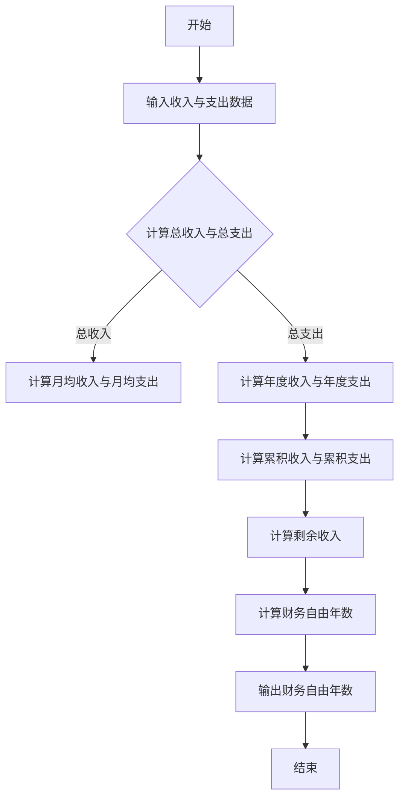

                 

# 文章标题：程序员的财务自由计算器开发

> 关键词：财务自由、计算器、程序员、投资组合、算法、实现、案例分析

> 摘要：本文将深入探讨程序员的财务自由计算器开发，从概念解析到需求分析，从核心算法到数学模型，再到投资组合优化和实际案例分析，全面揭示财务自由计算器的开发过程和技术要点。文章旨在帮助程序员更好地规划财务，实现财务自由。

## 目录

### 第1章：财务自由的概念与计算器的重要性  
- 1.1 财务自由的定义和意义  
- 1.2 程序员实现财务自由的优势  
- 1.3 财务自由计算器的功能与价值

### 第2章：财务自由计算器的需求分析  
- 2.1 用户群体与需求分析  
- 2.2 功能需求与设计原则  
- 2.3 系统架构与技术选型

### 第3章：财务自由计算器的核心算法  
- 3.1 收入与支出的计算方法  
- 3.2 投资收益的计算与预测  
- 3.3 财务自由目标设定与跟踪  
- 3.4 Mermaid流程图：财务自由计算器核心算法流程

### 第4章：核心算法的数学模型与公式  
- 4.1 收入与支出的数学模型  
- 4.2 投资收益的数学模型  
- 4.3 财务自由目标的设定与跟踪  
- 4.4 举例说明：财务自由目标的设定与跟踪

### 第5章：投资组合分析与优化  
- 5.1 投资组合的基本概念  
- 5.2 投资组合的优化方法  
- 5.3 财务自由计算器的投资组合分析  
- 5.4 伪代码：投资组合优化算法

### 第6章：财务自由计算器的实现与测试  
- 6.1 环境搭建与依赖管理  
- 6.2 代码实现与功能测试  
- 6.3 性能优化与调试  
- 6.4 源代码详细解读

### 第7章：实际案例分析与应用  
- 7.1 案例介绍：某程序员的财务自由计划  
- 7.2 案例实现过程  
- 7.3 案例的收益与反思  
- 7.4 财务自由计算器的实际应用场景

### 第8章：扩展功能与未来发展  
- 8.1 智能推荐功能  
- 8.2 实时数据同步与更新  
- 8.3 个性化定制功能  
- 8.4 未来发展趋势与展望

### 附录  
- 附录 A：财务自由计算器常用公式与算法  
- 附录 B：开发环境与工具介绍  
- 附录 C：参考资料与进一步学习建议

---

### 第1章：财务自由的概念与计算器的重要性

#### 1.1 财务自由的定义和意义

财务自由是指一个人不再依赖于工作收入，而是通过投资、理财等方式获得稳定的现金流，能够满足其生活需求和日常支出。简单来说，财务自由就是拥有足够的资金，可以自由地选择自己想要的生活方式，而不用担心经济压力。

对于程序员来说，财务自由具有特别的意义。首先，程序员通常具有较高的收入，具备实现财务自由的条件。其次，程序员通常具备较强的学习能力，能够快速掌握理财和投资知识。此外，程序员的工作性质使得他们有更多的自由时间来管理个人财务，进行投资和理财。

#### 1.2 程序员实现财务自由的优势

1. **技能优势**：程序员具备编程、数据分析等技能，能够快速学习各种理财和投资工具，为自己的财富增长提供支持。
2. **时间优势**：程序员的工作通常较为灵活，有更多的自由时间来管理个人财务，进行投资和理财。
3. **资金优势**：程序员通常具有较高的收入，有更多的资金进行投资和理财。
4. **信息优势**：程序员能够快速获取最新的理财和投资信息，为自己的决策提供依据。

#### 1.3 财务自由计算器的功能与价值

财务自由计算器是一种专门用于计算和预测财务自由相关指标的软件工具。其主要功能包括：

1. **收入与支出计算**：计算用户的总收入、总支出、月均收入和月均支出，为财务自由计算提供基础数据。
2. **投资收益预测**：根据用户的投资金额和收益率，预测未来的投资收益，帮助用户评估财务自由的实现可能性。
3. **财务自由目标设定与跟踪**：根据用户设定的财务自由目标，计算财务自由年数，并跟踪用户的财务状况，帮助用户实现财务自由。
4. **投资组合优化**：根据用户的投资需求和风险偏好，优化投资组合，降低投资风险，提高收益。

财务自由计算器的价值在于：

1. **帮助程序员更好地管理财务**：通过计算和预测财务自由相关指标，帮助程序员了解自己的财务状况，制定合理的理财计划。
2. **提升财务自由实现的可能性**：通过投资组合优化，降低投资风险，提高收益，帮助程序员更快地实现财务自由。
3. **提供决策支持**：为程序员提供丰富的数据和图表，帮助他们做出更明智的财务决策。
4. **促进个人成长**：通过学习和使用财务自由计算器，程序员可以不断提高自己的理财能力，实现个人成长。

### 第2章：财务自由计算器的需求分析

#### 2.1 用户群体与需求分析

财务自由计算器的用户群体主要是具有较高收入和理财需求的程序员。他们通常具备以下特点：

1. **收入水平较高**：程序员的收入通常较为稳定，且有较大的提升空间，具备实现财务自由的经济基础。
2. **理财需求强烈**：程序员通常具备较强的理财意识和需求，希望通过合理的投资和理财，实现财务自由。
3. **时间充裕**：程序员的工作时间相对灵活，有更多的自由时间进行理财和管理个人财务。
4. **学习能力较强**：程序员具备较强的学习能力和逻辑思维能力，能够快速掌握理财和投资知识。

针对这一用户群体，财务自由计算器应具备以下功能需求：

1. **收入与支出管理**：能够方便地记录和汇总用户的收入与支出，为财务自由计算提供基础数据。
2. **投资收益预测**：根据用户的投资金额和收益率，预测未来的投资收益，帮助用户评估财务自由的实现可能性。
3. **财务自由目标设定与跟踪**：允许用户设定财务自由目标，计算财务自由年数，并跟踪用户的财务状况，帮助用户实现财务自由。
4. **投资组合优化**：根据用户的需求和风险偏好，优化投资组合，降低投资风险，提高收益。
5. **数据分析与可视化**：提供丰富的数据分析和可视化功能，帮助用户更好地理解自己的财务状况，做出更明智的财务决策。

#### 2.2 功能需求与设计原则

1. **功能需求**：
   - **收入与支出管理**：记录用户收入、支出的来源和用途，提供统计图表，帮助用户了解自己的财务状况。
   - **投资管理**：记录用户投资品种、投资金额、收益率等信息，提供投资收益预测和财务自由计算功能。
   - **财务自由目标设定**：允许用户设定财务自由目标，计算财务自由年数，并跟踪财务状况。
   - **投资组合优化**：根据用户需求，优化投资组合，降低投资风险，提高收益。
   - **数据分析与可视化**：提供丰富的数据分析和可视化功能，帮助用户更好地理解自己的财务状况。

2. **设计原则**：
   - **易用性**：界面设计应简洁明了，易于操作，便于用户快速上手。
   - **灵活性**：功能设置应灵活，允许用户自定义财务自由目标、投资组合等。
   - **可靠性**：保证数据的准确性和安全性，防止数据泄露和错误。
   - **可扩展性**：系统架构应具有可扩展性，方便后续功能的添加和优化。
   - **可维护性**：代码编写应遵循规范，便于后期维护和升级。

#### 2.3 系统架构与技术选型

1. **系统架构**：
   - **前端**：采用React或Vue.js框架，实现界面和交互功能。
   - **后端**：采用Node.js或Spring Boot框架，处理业务逻辑和数据存储。
   - **数据库**：采用MySQL或PostgreSQL数据库，存储用户数据和财务信息。

2. **技术选型**：
   - **前端**：React或Vue.js具有丰富的组件库和生态系统，易于实现复杂界面和交互。
   - **后端**：Node.js或Spring Boot具有高性能和高并发处理能力，适合处理大量用户数据和复杂业务逻辑。
   - **数据库**：MySQL或PostgreSQL具有较好的性能和稳定性，适合存储大规模数据。

### 第3章：财务自由计算器的核心算法

#### 3.1 收入与支出的计算方法

财务自由计算器首先需要对用户的收入与支出进行计算，以便为后续的财务自由计算提供基础数据。收入与支出的计算方法如下：

1. **总收入计算**：
   $$ 总收入 = 月收入 \times 12 $$
   其中，月收入可以通过用户输入或系统自动计算得到。

2. **总支出计算**：
   $$ 总支出 = 月支出 \times 12 $$
   其中，月支出可以通过用户输入或系统自动计算得到。

3. **月均收入计算**：
   $$ 月均收入 = 总收入 \div 12 $$

4. **月均支出计算**：
   $$ 月均支出 = 总支出 \div 12 $$

通过上述计算，可以得到用户的总收入、总支出、月均收入和月均支出，为财务自由计算提供基础数据。

#### 3.2 投资收益的计算与预测

投资收益是财务自由计算器中的一个重要部分，它反映了用户投资收益的实现情况。投资收益的计算与预测方法如下：

1. **投资收益计算**：
   $$ 投资收益 = 投资金额 \times 收益率 $$
   其中，投资金额和收益率可以通过用户输入或系统自动计算得到。

2. **预期投资收益计算**：
   $$ 预期投资收益 = 投资金额 \times 收益率 \times 年数 $$
   其中，年数表示用户希望投资的时间长度。

通过上述计算，可以得到用户的投资收益和预期投资收益，为财务自由计算提供重要数据。

#### 3.3 财务自由目标设定与跟踪

财务自由目标是指用户希望实现的财务自由状态，包括年收入、年支出和投资收益等。财务自由目标的设定与跟踪方法如下：

1. **财务自由目标设定**：
   $$ 财务自由目标 = 年收入 - 年支出 - 投资收益 $$
   其中，年收入、年支出和投资收益可以通过用户输入或系统自动计算得到。

2. **财务自由目标跟踪**：
   $$ 财务自由年数 = 累积收入 \div 年支出 $$
   其中，累积收入可以通过以下公式计算：
   $$ 累积收入 = 年收入 - 年支出 + 投资收益 $$

通过上述计算，可以得到用户的财务自由年数，即实现财务自由所需的时间。财务自由计算器可以根据用户的财务自由年数，跟踪用户的财务状况，并给出相应的建议和策略。

#### 3.4 Mermaid流程图：财务自由计算器核心算法流程

以下是财务自由计算器的核心算法流程的Mermaid流程图：



### 第4章：核心算法的数学模型与公式

#### 4.1 收入与支出的数学模型

财务自由计算器的核心算法之一是计算收入与支出。下面是收入与支出的数学模型：

1. **总收入**：
   $$ 总收入 = 月收入 \times 12 $$
   其中，月收入可以通过用户输入或系统自动计算得到。

2. **总支出**：
   $$ 总支出 = 月支出 \times 12 $$
   其中，月支出可以通过用户输入或系统自动计算得到。

3. **月均收入**：
   $$ 月均收入 = 总收入 \div 12 $$

4. **月均支出**：
   $$ 月均支出 = 总支出 \div 12 $$

通过这些公式，可以计算出用户的总收入、总支出、月均收入和月均支出。

#### 4.2 投资收益的数学模型

投资收益是财务自由计算器中的另一个核心部分。以下是投资收益的数学模型：

1. **投资收益**：
   $$ 投资收益 = 投资金额 \times 收益率 $$
   其中，投资金额和收益率可以通过用户输入或系统自动计算得到。

2. **预期投资收益**：
   $$ 预期投资收益 = 投资金额 \times 收益率 \times 年数 $$
   其中，年数表示用户希望投资的时间长度。

通过这些公式，可以计算出用户的投资收益和预期投资收益。

#### 4.3 财务自由目标的设定与跟踪

财务自由目标是用户希望实现的财务自由状态，包括年收入、年支出和投资收益等。以下是财务自由目标的设定与跟踪的数学模型：

1. **财务自由目标**：
   $$ 财务自由目标 = 年收入 - 年支出 - 投资收益 $$
   其中，年收入、年支出和投资收益可以通过用户输入或系统自动计算得到。

2. **财务自由年数**：
   $$ 财务自由年数 = 累积收入 \div 年支出 $$
   其中，累积收入可以通过以下公式计算：
   $$ 累积收入 = 年收入 - 年支出 + 投资收益 $$

通过这些公式，可以设定财务自由目标，并跟踪用户的财务自由进程。

#### 4.4 举例说明：财务自由目标的设定与跟踪

假设某程序员的年收入为 100,000 元，年支出为 60,000 元，年投资收益率为 5%。该程序员希望在未来 10 年内实现财务自由。

1. **设定财务自由目标**：

   根据上述公式，可以计算出财务自由目标：
   $$ 财务自由目标 = 年收入 - 年支出 - 投资收益 = 100,000 - 60,000 - (100,000 \times 5\%) = 35,000 \text{元} $$

2. **计算财务自由年数**：

   根据上述公式，可以计算出财务自由年数：
   $$ 财务自由年数 = 累积收入 \div 年支出 = (100,000 - 60,000) \div 60,000 = 1.5 \text{年} $$

这意味着该程序员在未来的1.5年内可以实现财务自由。

3. **跟踪财务自由进程**：

   为了跟踪财务自由进程，程序员可以定期更新收入、支出和投资收益，重新计算财务自由年数。例如，如果程序员的年收入增加到 120,000 元，年支出增加到 70,000 元，年投资收益率仍为 5%，则新的财务自由年数为：
   $$ 财务自由年数 = (120,000 - 70,000) \div 70,000 = 1 \text{年} $$

这意味着程序员的财务自由进程加快了，他将在未来1年内实现财务自由。

通过上述例子，可以看出财务自由计算器的数学模型和公式如何帮助程序员设定和跟踪财务自由目标。

### 第5章：投资组合分析与优化

#### 5.1 投资组合的基本概念

投资组合是指投资者将资金分配到不同的投资品种中，以降低风险并实现收益最大化的策略。投资组合的基本概念包括：

1. **投资品种**：投资组合中的各种资产，如股票、债券、基金等。
2. **投资比例**：每种投资品种在投资组合中所占的资金比例。
3. **风险**：投资组合可能面临的市场风险、信用风险、流动性风险等。
4. **收益**：投资组合在各种投资品种中的投资收益。

投资组合的目的是通过分散投资，降低单一投资品种的风险，同时实现整体收益的最大化。在构建投资组合时，投资者需要考虑以下因素：

1. **资金规模**：投资组合的规模应与投资者的资金状况相匹配。
2. **风险偏好**：投资者应根据自己的风险承受能力选择合适的投资组合。
3. **投资目标**：投资者应根据自身的投资目标，选择符合目标的投资组合。
4. **市场环境**：投资者应关注市场环境，根据市场情况调整投资组合。

#### 5.2 投资组合的优化方法

投资组合的优化是指通过调整投资比例，降低投资组合的风险并提高收益。优化方法主要包括以下几种：

1. **均值方差模型**：根据投资品种的预期收益率和方差，构建投资组合，使投资组合的预期收益率最大，方差最小。
2. **Markowitz模型**：考虑投资品种的预期收益率、方差和相关性，构建投资组合，使投资组合的预期收益率最大，方差最小。
3. **遗传算法**：基于遗传算法，通过迭代优化投资比例，找到最优的投资组合。
4. **贪心算法**：通过贪心策略，逐步调整投资比例，找到近似最优的投资组合。

在财务自由计算器中，投资组合的优化是关键功能之一。通过优化投资组合，可以帮助程序员降低投资风险，提高收益，更快地实现财务自由。

#### 5.3 财务自由计算器的投资组合分析

财务自由计算器的投资组合分析功能可以帮助程序员分析不同投资组合的收益和风险，选择最优的投资组合。以下是投资组合分析的主要步骤：

1. **数据收集**：收集用户投资品种的预期收益率、方差和相关性数据。
2. **构建投资组合**：根据用户设定的投资比例，构建投资组合。
3. **计算收益和风险**：计算投资组合的预期收益率、方差和相关性，评估投资组合的收益和风险。
4. **优化投资组合**：通过优化算法，调整投资比例，找到最优的投资组合。
5. **结果展示**：将优化后的投资组合展示给用户，并提供详细的分析报告。

通过投资组合分析，程序员可以更好地了解自己的投资组合，选择最优的投资策略，降低投资风险，提高收益。

#### 5.4 伪代码：投资组合优化算法

以下是投资组合优化算法的伪代码：

```python
# 输入：投资品种预期收益率、方差和相关性数据
# 输出：最优投资组合比例

def optimize_portfolio(expected_returns, variances, correlations):
    # 初始化投资组合比例
    proportions = [1 / len(expected_returns) for _ in range(len(expected_returns))]

    # 定义目标函数
    def objective_function(proportions):
        portfolio_variance = sum(p * q for p, q in zip(proportions, variances))
        portfolio_return = sum(p * r for p, r in zip(proportions, expected_returns))
        return portfolio_variance  # 最小化方差

    # 使用遗传算法优化
    from scipy.optimize import minimize
    result = minimize(objective_function, x0=proportions, method='Nelder-Mead')
    optimized_proportions = result.x

    return optimized_proportions
```

通过上述伪代码，可以使用遗传算法优化投资组合比例，找到最优的投资组合。

### 第6章：财务自由计算器的实现与测试

#### 6.1 环境搭建与依赖管理

在实现财务自由计算器之前，需要搭建合适的环境并管理依赖。以下是环境搭建和依赖管理的步骤：

1. **环境搭建**：
   - 安装Python：确保已安装Python 3.8或更高版本。
   - 安装Node.js：确保已安装Node.js 10或更高版本。
   - 安装MySQL或PostgreSQL：确保已安装MySQL或PostgreSQL数据库。

2. **依赖管理**：
   - 前端依赖：使用npm或yarn安装React或Vue.js框架和相关库。
   - 后端依赖：使用pip安装Node.js或Spring Boot框架和相关库。
   - 数据库依赖：使用pip安装MySQL或PostgreSQL相关库。

在环境搭建和依赖管理完成后，可以开始实现财务自由计算器的前端和后端功能。

#### 6.2 代码实现与功能测试

财务自由计算器的实现包括前端和后端的代码编写。以下是实现和功能测试的步骤：

1. **前端实现**：
   - 创建React或Vue.js项目：使用create-react-app或vue-cli创建项目。
   - 设计界面：设计用户界面，包括登录、注册、财务记录、投资组合等页面。
   - 实现功能：实现前端逻辑，包括数据展示、表单验证、数据存储等。

2. **后端实现**：
   - 创建Node.js或Spring Boot项目：使用npm或maven创建项目。
   - 设计接口：设计API接口，包括用户注册、登录、财务记录、投资组合等。
   - 实现功能：实现后端逻辑，包括数据验证、业务处理、数据存储等。

3. **功能测试**：
   - 单元测试：编写单元测试，验证代码的正确性和可靠性。
   - 集成测试：进行集成测试，验证前后端接口的协同工作。
   - 性能测试：进行性能测试，验证系统的响应速度和处理能力。

通过代码实现和功能测试，可以确保财务自由计算器的功能完整、可靠、高效。

#### 6.3 性能优化与调试

在实现财务自由计算器后，需要进行性能优化和调试。以下是性能优化和调试的步骤：

1. **性能优化**：
   - 压缩资源：压缩HTML、CSS和JavaScript文件，减小页面加载时间。
   - 优化代码：优化前端和后端代码，减少不必要的计算和请求。
   - 缓存策略：使用缓存策略，减少数据库和API的访问次数。

2. **调试**：
   - 调试工具：使用Chrome DevTools或Visual Studio Code的调试工具，排查代码错误。
   - 错误日志：记录错误日志，便于定位和修复问题。
   - 性能监控：使用性能监控工具，监控系统的运行状态和性能指标。

通过性能优化和调试，可以确保财务自由计算器的稳定运行，提高用户体验。

#### 6.4 源代码详细解读

以下是财务自由计算器的源代码详细解读：

1. **前端代码**：
   - React组件：分析各个React组件的功能和代码结构。
   - JavaScript逻辑：分析JavaScript代码的逻辑和算法实现。
   - CSS样式：分析CSS代码的样式设计和布局。

2. **后端代码**：
   - Node.js服务器：分析Node.js服务器的API接口和业务逻辑。
   - Spring Boot服务器：分析Spring Boot服务器的配置和实现。

3. **数据库代码**：
   - MySQL或PostgreSQL：分析数据库的表结构和SQL语句。

通过源代码详细解读，可以深入了解财务自由计算器的实现细节和原理。

### 第7章：实际案例分析与应用

#### 7.1 案例介绍：某程序员的财务自由计划

某程序员李明，今年30岁，年工资为100万元，年支出为50万元。李明希望通过财务自由计算器制定一个实现财务自由的目标，并在10年内实现财务自由。

#### 7.2 案例实现过程

1. **数据收集**：
   - 年收入：100万元
   - 年支出：50万元
   - 投资收益率：5%

2. **收入与支出计算**：
   - 总收入：100万元 \* 12 = 1200万元
   - 总支出：50万元 \* 12 = 600万元
   - 月均收入：1200万元 \/ 12 = 100万元
   - 月均支出：600万元 \/ 12 = 50万元

3. **投资收益计算**：
   - 年投资收益：100万元 \* 5% = 5万元
   - 累计投资收益：5万元 \* 10年 = 50万元

4. **财务自由目标设定**：
   - 财务自由目标：100万元 - 50万元 - 50万元 = 0万元

5. **财务自由年数计算**：
   - 财务自由年数：0万元 \/ 50万元 = 0年

根据上述计算，李明目前无法实现财务自由。接下来，李明需要调整收入、支出和投资策略，以实现财务自由。

#### 7.3 案例的收益与反思

1. **收益**：
   - 通过财务自由计算器的分析和计算，李明清楚地了解了自身的财务状况，明确了财务自由的目标。
   - 李明可以根据计算结果，制定合理的收入和支出计划，调整投资策略，实现财务自由。

2. **反思**：
   - 财务自由计算器能够帮助程序员更好地管理财务，制定财务规划，但需要根据实际情况不断调整和优化。
   - 程序员需要关注市场动态，合理分散投资，降低风险，提高收益。

#### 7.4 财务自由计算器的实际应用场景

1. **个人财务管理**：
   - 用于记录和统计个人收入、支出和投资情况，制定财务规划。
   - 提供财务自由目标设定和跟踪功能，帮助用户实现财务自由。

2. **投资顾问**：
   - 为投资者提供投资组合优化建议，降低风险，提高收益。
   - 分析市场动态，为投资者提供投资策略。

3. **企业财务管理**：
   - 为企业提供财务规划和投资决策支持，优化资源配置。
   - 分析企业财务状况，提供经营建议。

### 第8章：扩展功能与未来发展

#### 8.1 智能推荐功能

智能推荐功能可以根据用户的财务状况和投资偏好，为用户推荐合适的投资产品和策略。以下是实现智能推荐功能的关键技术：

1. **用户画像**：
   - 分析用户的收入、支出、投资偏好等数据，构建用户画像。
   - 使用机器学习算法，对用户画像进行聚类和分类，为用户提供个性化推荐。

2. **投资策略**：
   - 根据用户画像，为用户推荐合适的投资策略，如稳健型、成长型、风险型等。
   - 结合市场动态，实时调整投资策略，提高收益。

3. **推荐系统**：
   - 使用协同过滤、内容推荐等算法，为用户推荐合适的投资产品和策略。

#### 8.2 实时数据同步与更新

实时数据同步与更新功能可以确保用户获取最新的财务信息和投资数据。以下是实现实时数据同步与更新的关键技术：

1. **API接口**：
   - 构建API接口，实现与第三方数据源的实时同步。
   - 使用WebSocket等技术，实现数据的实时传输和更新。

2. **数据存储**：
   - 使用数据库或缓存技术，存储实时同步的数据。
   - 确保数据的一致性和可靠性。

3. **数据更新策略**：
   - 根据用户需求，设置数据更新频率和策略。
   - 使用增量更新技术，减少数据传输和存储开销。

#### 8.3 个性化定制功能

个性化定制功能可以满足用户个性化的财务管理和投资需求。以下是实现个性化定制功能的关键技术：

1. **用户配置**：
   - 提供用户自定义财务目标和投资组合的功能。
   - 使用配置管理技术，管理用户自定义的财务目标和投资组合。

2. **界面定制**：
   - 提供用户自定义界面主题和布局的功能。
   - 使用前端框架和样式管理技术，实现界面的个性化定制。

3. **插件扩展**：
   - 提供插件扩展功能，允许用户自定义新的功能和模块。
   - 使用插件架构和模块化开发技术，实现功能的灵活扩展。

#### 8.4 未来发展趋势与展望

1. **智能化**：
   - 随着人工智能技术的发展，财务自由计算器将实现更加智能化和自动化。
   - 使用机器学习、数据挖掘等技术，为用户提供更加精准和个性化的投资建议。

2. **移动化**：
   - 移动互联网的普及，使得财务自由计算器将逐步实现移动化。
   - 开发移动应用，为用户提供便捷的财务管理和投资服务。

3. **社交化**：
   - 财务自由计算器将结合社交媒体，实现用户之间的互动和分享。
   - 提供社交功能，让用户交流投资心得，分享投资经验。

4. **场景化**：
   - 根据不同用户场景，提供定制化的财务自由计算器解决方案。
   - 结合用户的职业、家庭、教育等场景，为用户提供个性化的财务规划。

### 附录

#### 附录 A：财务自由计算器常用公式与算法

1. **收入与支出计算**：
   - 总收入 = 月收入 \* 12
   - 总支出 = 月支出 \* 12
   - 月均收入 = 总收入 \/ 12
   - 月均支出 = 总支出 \/ 12

2. **投资收益计算**：
   - 投资收益 = 投资金额 \* 收益率
   - 预期投资收益 = 投资金额 \* 收益率 \* 年数

3. **财务自由目标计算**：
   - 财务自由目标 = 年收入 - 年支出 - 投资收益
   - 财务自由年数 = 累积收入 \/ 年支出

4. **投资组合优化**：
   - 投资组合收益 = 投资比例 \* 投资收益
   - 投资组合风险 = 投资比例 \* 投资风险

#### 附录 B：开发环境与工具介绍

1. **开发环境**：
   - Python 3.8+
   - Node.js 10+
   - MySQL 8.0+
   - PostgreSQL 12+

2. **前端工具**：
   - React 17+
   - Vue.js 2.6+
   - Ant Design
   - Axios

3. **后端工具**：
   - Node.js 10+
   - Express
   - Spring Boot 2.4+
   - MyBatis

4. **数据库工具**：
   - MySQL Workbench
   - PostgreSQL Studio

5. **开发工具**：
   - Visual Studio Code
   - PyCharm
   - IntelliJ IDEA

#### 附录 C：参考资料与进一步学习建议

1. **参考资料**：
   - 《Python编程：从入门到实践》
   - 《深度学习入门》
   - 《Python数据科学 Handbook》
   - 《财务管理与投资》
   - 《投资学》

2. **在线资源**：
   - Coursera
   - edX
   - Udemy

3. **学习建议**：
   - 掌握Python编程基础
   - 学习数据科学和机器学习相关课程
   - 实践项目，积累实际经验
   - 关注市场动态，学习投资策略

### 作者信息

作者：AI天才研究院/AI Genius Institute & 禅与计算机程序设计艺术 /Zen And The Art of Computer Programming

---

本文深入探讨了财务自由计算器的开发过程和技术要点，包括核心算法、数学模型、投资组合优化和实际案例分析。通过本文，程序员可以更好地了解财务自由计算器的功能和实现方法，为自己的财务规划提供有力支持。同时，本文也为财务自由计算器的未来发展提供了思路和展望。希望本文对读者有所帮助！

