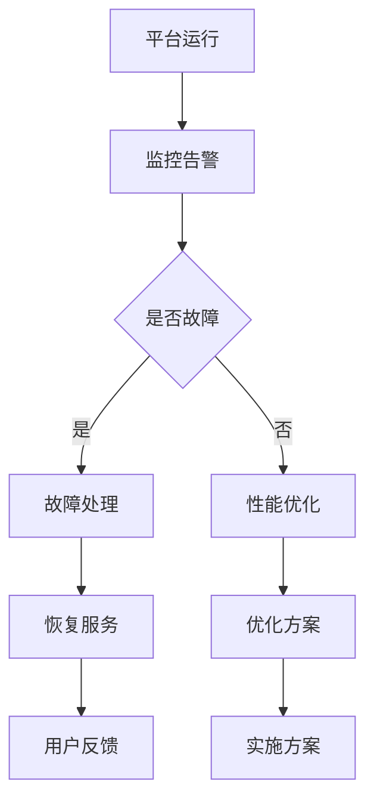

                 

# 《稳定性与运维服务：Lepton AI重点保障平台稳定性与用户体验》

> 关键词：稳定性、运维服务、用户体验、平台架构、故障检测、自适应调度

> 摘要：本文将深入探讨Lepton AI平台在稳定性与运维服务方面的重点保障措施，分析稳定性与用户体验之间的关系，详细讲解平台架构、核心算法原理、数学模型以及项目实战，旨在为读者提供全面、深入的了解和指导。

## 第一部分：基础理论

### 第1章：稳定性与运维服务概述

#### 1.1 稳定性的重要性

稳定性是平台正常运行的基础，它直接关系到用户的体验和平台的口碑。一个稳定可靠的平台能够在面对各种突发情况时保持正常运行，从而保证用户服务的连续性和可靠性。

#### 1.2 运维服务的定义与职责

运维服务是指为保障平台稳定运行而进行的一系列操作和管理活动。其职责包括监控、故障处理、性能优化、安全性保障等。

#### 1.3 运维服务在Lepton AI平台中的应用

在Lepton AI平台，运维服务贯穿整个开发、测试和上线过程，通过自动化工具和人工干预相结合的方式，保障平台的高可用性和稳定性。

### 第2章：Lepton AI平台架构概述

#### 2.1 Lepton AI平台简介

Lepton AI平台是一款基于人工智能技术的服务平台，旨在为用户提供高效、稳定、智能的服务体验。

#### 2.2 平台架构的核心组件

平台架构的核心组件包括计算资源管理、数据存储、网络通信、API服务等。

#### 2.3 平台架构的稳定性要求

平台架构在设计时需要考虑高可用性、高性能、易扩展性等稳定性要求。

### 第3章：核心概念与联系

#### 3.1 稳定性与用户体验的关系

稳定性直接影响用户体验，一个稳定可靠的平台能够为用户提供流畅、高效的服务。

#### 3.2 Mermaid流程图：平台稳定性保障流程

使用Mermaid工具绘制平台稳定性保障流程图，展示运维服务在保障平台稳定性中的作用。



#### 3.3 关键技术与工具

本文将介绍在稳定性保障过程中使用的关键技术和工具，如监控工具、故障处理工具、性能优化工具等。

## 第二部分：核心算法原理讲解

### 第4章：核心算法原理讲解

#### 4.1 故障检测算法

##### 4.1.1 基于历史数据的故障预测

使用历史数据对故障进行预测，通过分析故障发生的时间、频率、类型等特征，构建预测模型。

##### 4.1.2 基于实时数据的故障检测

实时采集平台运行数据，通过对比阈值、异常检测等方法，发现潜在故障。

##### 4.1.3 故障检测算法伪代码实现

```python
def detect_fault(data):
    # 数据预处理
    processed_data = preprocess(data)
    
    # 故障预测
    prediction = predict_fault(processed_data)
    
    # 故障检测
    if prediction > threshold:
        return "Fault Detected"
    else:
        return "No Fault"
```

#### 4.2 自适应调度算法

##### 4.2.1 调度算法的目标与挑战

调度算法的目标是在有限的资源下，最大化平台的吞吐量和用户体验。挑战在于应对动态变化的负载和故障。

##### 4.2.2 自适应调度算法原理

自适应调度算法根据实时数据动态调整资源分配，以提高平台的稳定性和性能。

##### 4.2.3 自适应调度算法伪代码实现

```python
def adaptive_schedule(loads, resources):
    # 数据预处理
    processed.loads = preprocess(loads)
    
    # 资源分配
    assigned_resources = allocate_resources(processed.loads, resources)
    
    # 调度决策
    schedule = make_schedule(assigned_resources)
    
    return schedule
```

## 第三部分：数学模型与数学公式

### 第5章：数学模型与数学公式

#### 5.1 稳定性的数学模型

##### 5.1.1 系统可靠性的数学模型

系统可靠性可以表示为成功运行的时间占总运行时间的比例，即 \( R(t) = \frac{t - f(t)}{t} \)，其中 \( f(t) \) 表示故障发生时间。

##### 5.1.2 故障率的数学模型

故障率可以表示为单位时间内故障发生的次数，即 \( \lambda = \frac{1}{R(t)} \)。

##### 5.1.3 系统可用性的数学模型

系统可用性可以表示为在任意给定时间段内，系统能够正常运行的概率，即 \( A(t) = P(R(t) > 0) \)。

#### 5.2 用户体验的数学模型

##### 5.2.1 响应时间的数学模型

响应时间可以表示为用户请求到达系统并得到响应的时间，即 \( T(r) = \frac{r}{c} \)，其中 \( r \) 表示请求处理时间，\( c \) 表示处理能力。

##### 5.2.2 错误率的数学模型

错误率可以表示为请求处理失败的概率，即 \( F(r) = 1 - R(t) \)。

##### 5.2.3 用户满意度的数学模型

用户满意度可以表示为用户对系统响应时间和错误率的评价，即 \( S(u) = \frac{T(r) - F(r)}{T(r) + F(r)} \)。

## 第四部分：项目实战

### 第6章：项目实战

#### 6.1 Lepton AI平台稳定性保障实战

##### 6.1.1 实战目标

通过实施稳定性保障措施，提高Lepton AI平台的高可用性和稳定性。

##### 6.1.2 实战环境搭建

搭建模拟Lepton AI平台的测试环境，包括计算资源、数据存储和网络设备。

##### 6.1.3 实战实现过程

详细描述实现故障检测、自适应调度等算法的过程，以及如何通过监控和告警系统来保障平台稳定性。

#### 6.2 Lepton AI用户体验优化实战

##### 6.2.1 实战目标

通过优化平台性能和响应时间，提高用户满意度和体验。

##### 6.2.2 实战环境搭建

搭建模拟Lepton AI平台的测试环境，包括计算资源、数据存储和网络设备。

##### 6.2.3 实战实现过程

详细描述实现响应时间优化、错误率降低等算法的过程，以及如何通过性能监控和调优来提高用户体验。

## 第二部分：高级实践

### 第7章：高级故障检测与预测

#### 7.1 基于机器学习的故障预测

##### 7.1.1 机器学习在故障预测中的应用

介绍机器学习算法在故障预测中的应用，如决策树、支持向量机等。

##### 7.1.2 常见的机器学习算法及其应用

详细介绍常见的机器学习算法，如线性回归、逻辑回归、神经网络等，并分析其在故障预测中的应用。

#### 7.2 基于深度学习的故障检测

##### 7.2.1 深度学习在故障检测中的应用

介绍深度学习算法在故障检测中的应用，如卷积神经网络、循环神经网络等。

##### 7.2.2 常见的深度学习模型及其应用

详细介绍常见的深度学习模型，如CNN、RNN、LSTM等，并分析其在故障检测中的应用。

### 第8章：高级调度算法与优化

#### 8.1 负载均衡算法

##### 8.1.1 负载均衡的基本概念

介绍负载均衡的基本概念，如负载均衡器、负载均衡策略等。

##### 8.1.2 常见的负载均衡算法

详细介绍常见的负载均衡算法，如轮询、随机、最小连接数等。

#### 8.2 灰色预测算法

##### 8.2.1 灰色预测算法的基本原理

介绍灰色预测算法的基本原理，如灰色序列、灰色预测模型等。

##### 8.2.2 灰色预测算法在调度中的应用

详细介绍灰色预测算法在调度中的应用，如负载预测、资源分配等。

### 第9章：平台稳定性与用户体验的综合优化

#### 9.1 平台稳定性与用户体验的关系分析

分析平台稳定性与用户体验之间的关系，如故障率、响应时间、错误率等指标对用户体验的影响。

#### 9.2 综合优化策略

提出平台稳定性与用户体验的综合优化策略，如故障预测与调度优化、响应时间与错误率平衡等。

##### 9.2.1 故障预测与调度优化的结合

详细介绍故障预测与调度优化的结合方法，如实时负载预测、动态调度策略等。

##### 9.2.2 响应时间与错误率的平衡

分析响应时间与错误率的平衡关系，提出优化策略，如资源分配、调度算法改进等。

### 第10章：未来发展趋势与展望

#### 10.1 稳定性与运维服务的未来发展

展望稳定性与运维服务的未来发展，如新兴技术、发展趋势等。

#### 10.2 AI在稳定性与运维服务中的应用前景

分析AI在稳定性与运维服务中的应用前景，如故障预测、自动化运维等。

#### 10.3 挑战与机遇

讨论稳定性与运维服务面临的挑战与机遇，如技术变革、市场需求等。

## 附录

### 附录 A：常见故障处理与优化案例

#### A.1 故障处理流程

介绍常见故障处理流程，如故障识别、故障定位、故障处理等。

#### A.2 故障处理案例分析

分析实际故障处理案例，如网络故障、计算资源不足等，并给出解决方案。

### 附录 B：参考文献与推荐阅读

#### B.1 相关书籍推荐

推荐与稳定性与运维服务相关的书籍，如《系统可靠性工程》、《运维之美》等。

#### B.2 学术论文推荐

推荐与稳定性与运维服务相关的学术论文，如《基于机器学习的故障预测方法研究》、《深度学习在故障检测中的应用》等。

#### B.3 在线资源推荐

推荐与稳定性与运维服务相关的在线资源，如博客、论坛、视频教程等。

### 作者

作者：AI天才研究院/AI Genius Institute & 禅与计算机程序设计艺术 /Zen And The Art of Computer Programming

