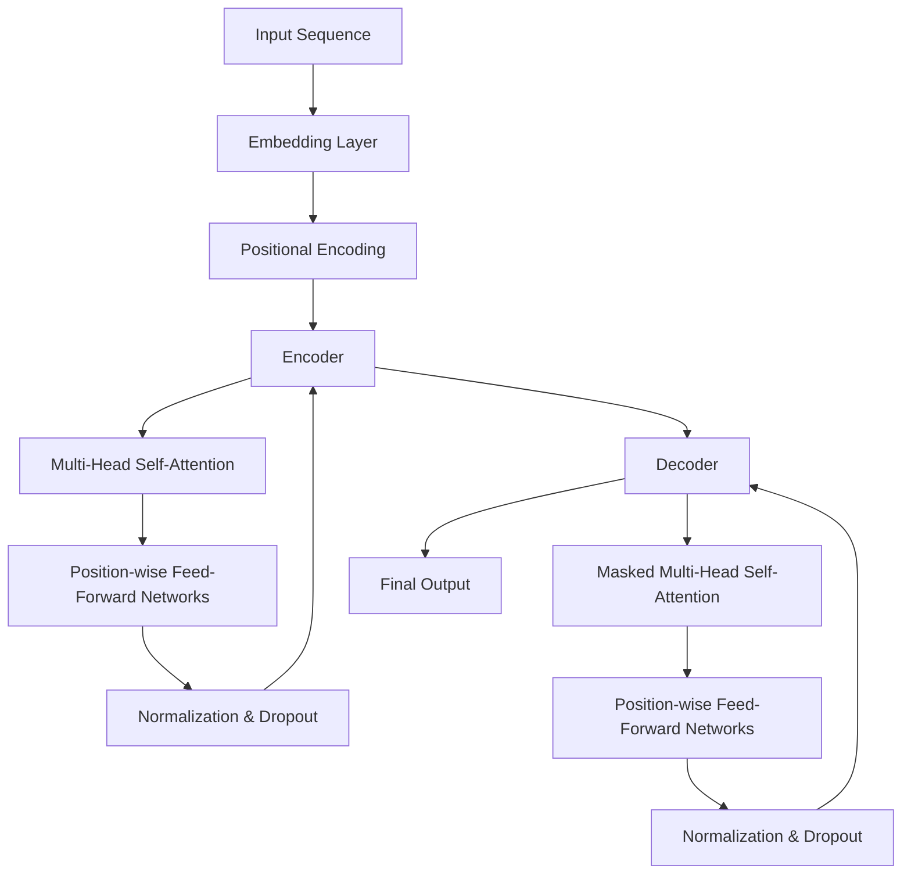

                 

# 突破Transformer:探索AI的下一代基础架构

> 关键词：Transformer、深度学习、自然语言处理、计算机视觉、AI开发、优化、挑战、未来发展趋势

> 摘要：Transformer架构自提出以来，以其卓越的性能和广泛的应用领域，成为人工智能领域的里程碑。本文将深入探讨Transformer的基础理论与架构，解析其核心算法原理与数学基础，展示Transformer在各种深度学习任务中的应用，分析其在AI开发中面临的挑战及未来发展趋势，为读者提供一个全面而深入的视角。

## 第一部分：突破Transformer的基础理论与架构

### 第1章：Transformer架构与原理

#### 1.1 Transformer介绍

Transformer模型是由Google在2017年提出的一种基于自注意力机制的深度神经网络架构。它在自然语言处理领域取得了显著的成功，并在多个基准测试中超越了传统的循环神经网络（RNN）和卷积神经网络（CNN）。Transformer的核心思想是通过全局的自注意力机制来捕捉输入序列中的长距离依赖关系，而无需像RNN那样依赖序列的顺序。

Transformer与传统的RNN和CNN模型的对比：

- **RNN**：依赖于序列的顺序进行操作，能够处理变长的序列数据，但存在梯度消失和梯度爆炸问题。
- **CNN**：擅长处理图像数据，通过卷积操作提取空间特征，但难以处理序列数据。
- **Transformer**：引入了自注意力机制，能够处理长距离依赖关系，同时具有并行计算的优势。

#### 1.2 Transformer核心组成部分

Transformer模型由以下几个核心组成部分构成：

- **自注意力机制（Self-Attention）**：通过计算输入序列中每个元素与其他元素之间的关联性，实现多层次的依赖关系捕捉。
- **位置编码（Positional Encoding）**：由于Transformer本身不具有处理顺序信息的能力，位置编码用于引入序列的位置信息。
- **多头注意力（Multi-Head Attention）**：通过多个独立的自注意力机制，提高模型的表达能力。
- **编码器与解码器结构**：编码器用于提取输入序列的特征，解码器用于生成输出序列。

#### 1.3 Transformer的Mermaid流程图

### 第2章：Transformer数学基础与核心算法

#### 2.1 线性代数基础

线性代数是理解Transformer的核心，以下是几个关键的线性代数概念：

- **矩阵与向量操作**：矩阵与向量的乘法、加法、转置等操作是构建Transformer的基础。
- **矩阵乘法**：矩阵乘法用于计算输入序列的嵌入向量。
- **矩阵求导**：在训练过程中，需要计算梯度以更新模型参数。

#### 2.2 自注意力机制原理

自注意力机制是Transformer的核心组件之一，其基本原理如下：

- **自注意力计算公式**：
  $$ \text{Attention}(Q, K, V) = \text{softmax}\left(\frac{QK^T}{\sqrt{d_k}}\right) V $$
  其中，$Q$、$K$ 和 $V$ 分别代表查询、键和值矩阵，$d_k$ 为键向量的维度。

- **自注意力权重计算**：通过计算查询向量 $Q$ 与键向量 $K$ 的点积，并应用softmax函数得到权重。

- **自注意力机制的计算过程**：每个输入序列元素都会与所有其他元素进行关联计算，从而生成新的特征向量。

#### 2.3 多头注意力机制

多头注意力机制通过多个独立的自注意力机制来提高模型的表达能力：

- **多头注意力概念**：将输入序列分成多个头，每个头独立计算注意力权重，最后将结果合并。
- **多头注意力的计算过程**：每个头计算一组权重，然后使用这些权重分别计算注意力得分，并将结果合并。

- **多头注意力的优势与局限**：
  - **优势**：提高模型的表示能力，捕捉更复杂的依赖关系。
  - **局限**：计算成本增加，需要更多的参数。

#### 2.4 位置编码方法

位置编码是Transformer处理序列信息的关键组件，其方法如下：

- **位置编码的作用**：为序列中的每个元素引入位置信息，使模型能够理解序列的顺序。
- **位置编码的常见方法**：正弦编码和余弦编码，它们将位置信息编码到不同的频率上。
- **位置编码的引入过程**：将位置编码添加到输入序列的嵌入向量中，使模型在自注意力机制中考虑位置信息。

### 第3章：Transformer变种与优化

#### 3.1 Transformer的变体

Transformer架构在提出后，出现了多个变体，主要包括：

- **BERT模型**：预训练后进行微调，广泛应用于自然语言理解任务。
- **GPT模型**：预训练生成模型，擅长生成文本和对话。
- **T5模型**：Transformer-based Text-To-Text Transfer Transformer，可以处理多种NLP任务。

#### 3.2 Transformer优化技术

为了提高Transformer模型的表现，研究者提出了多种优化技术，包括：

- **Layer Normalization**：在每一层后加入归一化，缓解内部协变量转移问题。
- **Position-wise Feed-Forward Networks**：在每个位置应用前馈神经网络，提高模型的表达能力。
- **Layer Scheduling**：逐步增加模型的深度和宽度，避免训练初期过拟合。
- **Reduction of Model Complexity**：通过剪枝、量化等方法减少模型参数，提高计算效率。

#### 3.3 Transformer在实际应用中的挑战与解决方案

在实际应用中，Transformer面临以下挑战：

- **计算效率**：模型复杂度高，导致计算成本高。
- **模型可解释性**：复杂的模型结构使得理解其决策过程变得困难。
- **参数共享与训练时间优化**：共享参数可以加速训练，但可能影响模型性能。

针对这些挑战，研究者提出了以下解决方案：

- **计算效率**：使用更高效的硬件、优化算法和模型结构。
- **模型可解释性**：开发可视化工具和方法，提高模型的可解释性。
- **参数共享与训练时间优化**：采用预训练和微调策略，减少训练时间。

## 第二部分：Transformer在深度学习应用中的实践

### 第4章：Transformer在自然语言处理中的应用

#### 4.1 Transformer在机器翻译中的应用

Transformer在机器翻译中取得了显著的成功，其基本模型如下：

- **编码器**：将源语言序列编码为固定长度的向量。
- **解码器**：将目标语言序列逐步解码，生成翻译结果。

**基于Transformer的机器翻译模型**：

1. **编码器**：输入序列经过嵌入层和位置编码后，通过多层自注意力机制提取特征。
2. **解码器**：输入序列经过嵌入层和位置编码后，通过自注意力和交叉注意力机制生成预测序列。

**常见机器翻译任务与挑战**：

- **机器翻译**：将一种语言的句子翻译成另一种语言。
- **命名实体识别**：识别句子中的命名实体。
- **语义角色标注**：为句子中的词汇标注语义角色。

#### 4.2 Transformer在文本分类中的应用

文本分类是自然语言处理中的重要任务，Transformer在文本分类中也表现出色：

- **基于Transformer的文本分类模型**：将文本序列编码为向量，并通过分类器输出分类结果。
- **文本分类任务与挑战**：情感分析、主题分类、文本相似度计算等。

**常见文本分类任务与挑战**：

- **情感分析**：判断文本表达的情感倾向。
- **主题分类**：将文本归类到预定的主题类别。
- **文本相似度计算**：评估两个文本之间的相似度。

#### 4.3 Transformer在生成文本中的应用

生成文本是Transformer的另一个重要应用领域：

- **基于Transformer的文本生成模型**：通过解码器生成文本序列。
- **文本生成任务与挑战**：自动写作、对话生成、故事创作等。

**常见文本生成任务与挑战**：

- **自动写作**：生成文章、报告、邮件等文本内容。
- **对话生成**：生成自然、流畅的对话。
- **故事创作**：生成故事情节、角色对话等。

### 第5章：Transformer在计算机视觉中的应用

#### 5.1 Vision Transformer（ViT）

Vision Transformer（ViT）是Transformer在计算机视觉领域的重要应用，其基本思想是将图像分解为若干个固定大小的块，然后将其视为序列处理。

- **Vision Transformer的架构**：
  1. **图像预处理**：将图像分解为固定大小的块。
  2. **嵌入层**：对图像块进行嵌入编码。
  3. **自注意力机制**：通过自注意力机制提取图像特征。
  4. **分类头**：将特征映射到分类结果。

- **Vision Transformer在图像分类中的应用**：通过训练，ViT可以实现对图像分类任务的出色表现。

#### 5.2 Transformer在图像生成中的应用

Transformer在图像生成中也有广泛应用，其基本模型如下：

- **基于Transformer的图像生成模型**：通过编码器和解码器生成图像。
- **图像生成任务与挑战**：图像修复、图像超分辨率、图像合成等。

**常见图像生成任务与挑战**：

- **图像修复**：填充图像中的损坏区域。
- **图像超分辨率**：提高图像的分辨率。
- **图像合成**：生成新的图像内容。

#### 5.3 Transformer在视频处理中的应用

Transformer在视频处理中也表现出强大的潜力：

- **基于Transformer的视频分类模型**：将视频序列编码为固定长度的向量，并进行分类。
- **视频处理任务与挑战**：视频分类、视频分割、动作识别等。

**常见视频处理任务与挑战**：

- **视频分类**：对视频内容进行分类。
- **视频分割**：将视频分割为不同的片段。
- **动作识别**：识别视频中的动作。

## 第三部分：Transformer在AI开发中的挑战与未来方向

### 第6章：Transformer在AI开发中的挑战

#### 6.1 计算资源需求

Transformer模型的计算复杂度高，导致计算资源需求大。为了应对这一挑战，研究者提出了以下优化策略：

- **模型压缩**：通过剪枝、量化等方法减少模型参数。
- **硬件加速**：使用GPU、TPU等硬件加速模型训练和推理。
- **分布式训练**：通过分布式计算降低单机计算资源的压力。

#### 6.2 模型可解释性与透明度

模型可解释性是AI领域的重要挑战之一。Transformer模型的复杂性使得其决策过程难以解释。为了提高模型的可解释性，研究者提出了以下方法：

- **可视化工具**：开发可视化工具，帮助用户理解模型的结构和决策过程。
- **注意力机制分析**：分析自注意力机制，揭示模型关注的关键特征。
- **模型压缩与简化**：通过压缩和简化模型结构，提高模型的可理解性。

#### 6.3 隐私保护与数据安全

随着AI技术的广泛应用，数据隐私和安全成为重要问题。Transformer模型在处理敏感数据时，需要特别注意以下几点：

- **数据加密**：对敏感数据进行加密，确保数据在传输和存储过程中的安全性。
- **差分隐私**：采用差分隐私技术，降低模型训练过程中的隐私泄露风险。
- **联邦学习**：通过联邦学习，实现数据的分布式训练，减少数据集中的风险。

### 第7章：Transformer的未来发展趋势

#### 7.1 Transformer的扩展与应用

Transformer架构在提出后，逐渐扩展到其他领域，如计算机视觉、音频处理等。未来，Transformer将继续在更多领域展现其潜力。

- **计算机视觉**：Vision Transformer（ViT）和Image Transformer（InT）等模型将进一步推动计算机视觉的发展。
- **音频处理**：Transformer在语音识别、音乐生成等领域也有广泛应用。

#### 7.2 Transformer的优化与创新

为了提高Transformer的性能和效率，研究者不断提出新的优化方法和创新架构：

- **高效自注意力机制**：设计更高效的自注意力计算方法，降低计算成本。
- **层次化Transformer**：通过引入层次化结构，提高模型的表达能力。
- **自适应注意力**：根据任务需求，动态调整注意力机制，提高模型适应性。

#### 7.3 Transformer在AI伦理与法规方面的挑战

随着AI技术的快速发展，Transformer模型在AI伦理和法规方面也面临挑战：

- **数据隐私**：如何确保模型训练和部署过程中的数据隐私。
- **算法公平性**：如何确保模型在不同人群中的公平性。
- **透明度和可解释性**：如何提高模型的可解释性，使其更容易被公众接受。

为了应对这些挑战，研究者提出了以下策略：

- **透明化报告**：发布详细的模型训练和测试报告，提高模型透明度。
- **监管框架**：建立适用于AI技术的监管框架，确保模型的应用符合伦理和法规要求。
- **AI伦理委员会**：成立AI伦理委员会，负责评估和监督AI技术的应用。

### 附录

#### 附录A：Transformer相关资源与工具

- **主流Transformer框架与库**：包括PyTorch、TensorFlow、MXNet等。
- **Transformer模型的训练与部署工具**：如Hugging Face、Transformers库等。
- **Transformer相关的学术资源与论文**：包括Google论文《Attention Is All You Need》等。

#### 附录B：Transformer代码实例解析

- **Transformer编码器与解码器代码实例**：展示Transformer编码器和解码器的实现过程。
- **Transformer模型在自然语言处理任务中的实现与代码解读**：详细解释Transformer模型在自然语言处理任务中的应用，包括编码器和解码器的配置、损失函数的选择等。

## 作者信息

作者：AI天才研究院/AI Genius Institute & 禅与计算机程序设计艺术 /Zen And The Art of Computer Programming

---

这篇文章深入探讨了Transformer架构的基础理论与实际应用，分析了其在AI开发中面临的挑战和未来发展趋势。通过逐步分析和推理，本文为读者提供了一个全面而深入的视角，有助于更好地理解和应用这一重要的深度学习架构。在未来的研究中，Transformer将继续推动AI技术的进步，为解决复杂问题提供强有力的工具。

