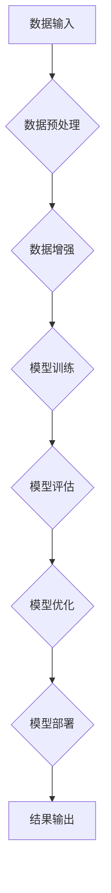

                 

# 端侧vs云端：大模型计算的未来走向

> 关键词：端侧计算、云端计算、大模型计算、神经网络模型、端云协同、计算性能优化

> 摘要：随着人工智能技术的不断发展，大模型计算成为推动行业进步的重要力量。本文将深入探讨端侧计算与云端计算的优缺点，分析其在大模型计算中的互补关系，并探讨未来发展的趋势和策略。

## 目录大纲

- 端侧vs云端：大模型计算的未来走向
- 关键词
- 摘要
- 第一部分：引言
  - 第1章：大模型计算时代的到来
    - 1.1 大模型计算的定义与背景
    - 1.2 大模型计算的关键技术与挑战
    - 1.3 大模型计算的发展现状与趋势
  - 第2章：端侧与云端计算概述
    - 2.1 端侧计算的概念与优势
    - 2.2 云端计算的概念与优势
    - 2.3 端侧与云端计算的互补关系
- 第二部分：端侧计算技术
  - 第3章：端侧硬件基础
    - 3.1 端侧芯片架构
    - 3.2 端侧内存与存储技术
    - 3.3 端侧计算性能优化
  - 第4章：端侧神经网络模型优化
    - 4.1 端侧神经网络模型压缩
    - 4.2 端侧神经网络模型量化
    - 4.3 端侧神经网络模型加速
  - 第5章：端侧人工智能应用实践
    - 5.1 端侧图像识别应用
    - 5.2 端侧语音识别应用
    - 5.3 端侧自然语言处理应用
- 第三部分：云端计算技术
  - 第6章：云端计算架构与基础设施
    - 6.1 云端计算架构的设计原则
    - 6.2 云端计算基础设施的构建
    - 6.3 云端计算资源调度与管理
  - 第7章：云端人工智能服务与应用
    - 7.1 云端图像识别服务
    - 7.2 云端语音识别服务
    - 7.3 云端自然语言处理服务
  - 第8章：端云协同计算
    - 8.1 端云协同计算框架
    - 8.2 端云协同计算优化策略
    - 8.3 端云协同计算案例分析
- 第四部分：大模型计算的未来走向
  - 第9章：大模型计算面临的挑战与机遇
    - 9.1 大模型计算的技术挑战
    - 9.2 大模型计算的市场机遇
    - 9.3 大模型计算的未来趋势
  - 第10章：大模型计算的发展策略与规划
    - 10.1 大模型计算的技术路线
    - 10.2 大模型计算的商业模式
    - 10.3 大模型计算的政策支持与产业合作
  - 第11章：结论与展望
    - 11.1 本书总结
    - 11.2 大模型计算的未来展望
- 附录
  - 附录A：端侧与云端计算技术参考文献
  - 附录B：端侧与云端计算技术相关工具与资源列表
  - 附录C：大模型计算案例研究
    - C.1 案例一：端侧图像识别应用
    - C.2 案例二：云端语音识别服务
    - C.3 案例三：端云协同计算应用
  - 附录D：端侧与云端计算技术常见问题解答
- 术语表
- Mermaid 流程图
  - 大模型计算原理

## 第一部分：引言

### 第1章：大模型计算时代的到来

随着人工智能技术的不断发展，大模型计算已经成为推动行业进步的重要力量。大模型计算是指利用大规模神经网络模型进行数据分析和处理，其核心在于通过深度学习算法来提取数据的特征和模式，从而实现对复杂问题的求解。

#### 1.1 大模型计算的定义与背景

大模型计算的定义可以从以下几个方面进行理解：

- **定义**：大模型计算是指使用超大规模神经网络模型进行数据处理和推理的过程。这些模型通常包含数十亿个参数，能够处理海量数据，并从中提取出复杂的信息和知识。
- **背景**：随着计算能力的提升和大数据的爆发式增长，深度学习技术得到了迅猛发展。大模型计算的出现，为解决复杂问题提供了强大的工具，如自然语言处理、计算机视觉、推荐系统等领域。

#### 1.2 大模型计算的关键技术与挑战

大模型计算的关键技术包括：

- **神经网络模型**：包括卷积神经网络（CNN）、循环神经网络（RNN）、变换器（Transformer）等，这些模型能够处理不同类型的数据，并提取出有效的特征。
- **分布式计算**：由于大模型计算需要处理海量数据，因此分布式计算技术成为必需，它可以有效地提高计算效率和降低计算成本。
- **数据预处理**：数据预处理是确保模型性能的关键步骤，包括数据清洗、数据增强、数据归一化等。

大模型计算面临的挑战主要包括：

- **计算资源消耗**：大模型计算需要大量的计算资源和存储空间，这对计算设备和网络带宽提出了很高的要求。
- **数据隐私和安全**：在端侧进行大模型计算，可能会涉及用户隐私数据，如何保障数据安全成为一个重要问题。
- **能耗问题**：大模型计算通常需要大量的电力支持，能耗问题成为制约其普及的重要因素。

#### 1.3 大模型计算的发展现状与趋势

当前，大模型计算已经在多个领域取得了显著成果，如：

- **自然语言处理**：在语言翻译、文本生成、问答系统等领域，大模型计算展现了强大的能力。
- **计算机视觉**：在图像识别、视频分析、自动驾驶等领域，大模型计算的应用也越来越广泛。
- **推荐系统**：在电商、社交媒体等领域，大模型计算通过用户行为数据，实现了精准的个性化推荐。

未来，大模型计算的发展趋势包括：

- **模型压缩与优化**：通过模型压缩和量化技术，降低模型的计算复杂度和存储需求，使得大模型计算在端侧设备上成为可能。
- **端云协同计算**：通过端云协同计算，实现大模型计算在不同设备间的资源调度和优化，提高计算效率和用户体验。
- **跨领域融合**：大模型计算与其他技术的融合，如物联网、区块链等，将带来更多创新应用场景。

### 第2章：端侧与云端计算概述

#### 2.1 端侧计算的概念与优势

端侧计算是指在设备本地执行计算任务，无需依赖于远程服务器。端侧计算的优势包括：

- **实时响应**：端侧计算可以提供更快的响应时间，降低延迟，提高用户体验。
- **隐私保护**：端侧计算可以在本地处理数据，减少数据传输，降低隐私泄露风险。
- **灵活性**：端侧计算可以根据用户需求，灵活调整计算资源和算法，满足个性化需求。

#### 2.2 云端计算的概念与优势

云端计算是指将计算任务部署在远程服务器上，通过互联网进行数据传输和处理。云端计算的优势包括：

- **计算资源丰富**：云端计算可以充分利用服务器集群的强大计算能力，满足大规模数据处理需求。
- **数据安全**：云端计算提供专业的数据存储和安全保障，降低数据泄露风险。
- **可扩展性**：云端计算可以根据需求动态调整计算资源，实现灵活的扩展。

#### 2.3 端侧与云端计算的互补关系

端侧计算和云端计算各有优势和局限性，通过互补，可以实现更高效的计算和处理：

- **数据预处理**：端侧计算可以预处理数据，提取关键信息，减轻云端计算的压力。
- **协同计算**：端侧计算和云端计算可以协同工作，端侧处理实时性要求高的任务，云端处理计算密集型任务。
- **数据共享**：端侧和云端可以共享数据资源，实现数据的高效利用。

## 第二部分：端侧计算技术

### 第3章：端侧硬件基础

端侧计算的性能优化离不开硬件的支持，端侧硬件基础主要包括芯片架构、内存与存储技术等方面。

#### 3.1 端侧芯片架构

端侧芯片架构的设计对于计算性能至关重要，当前主流的端侧芯片架构包括：

- **ARM架构**：ARM架构以其低功耗和高性能的特点，广泛应用于智能手机、平板电脑等移动设备。
- **Intel x86架构**：Intel x86架构具有较强的计算能力，适用于高性能计算场景。
- **RISC-V架构**：RISC-V架构是一种开放源代码的处理器架构，具有灵活性和可扩展性，适用于定制化端侧计算需求。

#### 3.2 端侧内存与存储技术

端侧内存与存储技术直接影响端侧计算的性能，主要包括：

- **内存技术**：内存技术包括动态随机存取存储（DRAM）和静态随机存取存储（SRAM）。DRAM具有高带宽和低延迟的特点，适合用于缓存和主存；SRAM具有高稳定性和低功耗的特点，适合用于高速缓存。
- **存储技术**：存储技术包括闪存（Flash）和固态硬盘（SSD）。闪存具有高容量和低功耗的特点，适合用于数据存储；SSD具有高速度和低延迟的特点，适合用于缓存和主存。

#### 3.3 端侧计算性能优化

端侧计算性能优化可以从以下几个方面进行：

- **并行计算**：通过并行计算技术，将计算任务分布在多个计算单元上，提高计算效率。
- **算法优化**：针对端侧计算的特点，对算法进行优化，减少计算复杂度和资源消耗。
- **能耗管理**：通过能耗管理技术，降低端侧计算的能量消耗，提高计算效率。

### 第4章：端侧神经网络模型优化

端侧神经网络模型优化是提高端侧计算性能的关键技术，主要包括模型压缩、模型量化和模型加速等方面。

#### 4.1 端侧神经网络模型压缩

端侧神经网络模型压缩旨在减小模型的参数数量和存储空间，提高计算效率。常见的模型压缩技术包括：

- **权重共享**：通过共享神经网络中相同结构的权重，减少参数数量。
- **剪枝**：通过剪枝冗余的神经元和权重，减少模型参数数量。
- **量化**：通过降低模型中参数的精度，减少存储空间和计算量。

#### 4.2 端侧神经网络模型量化

端侧神经网络模型量化是一种通过降低模型参数的精度来减少计算量和存储需求的技术。常见的量化方法包括：

- **整数量化**：将浮点数参数转换为整数，降低计算复杂度和存储需求。
- **二值量化**：将浮点数参数转换为二值数，进一步降低计算复杂度和存储需求。

#### 4.3 端侧神经网络模型加速

端侧神经网络模型加速是提高端侧计算性能的关键技术，主要包括：

- **硬件加速**：通过硬件加速器，如GPU、FPGA等，提高模型计算速度。
- **算法优化**：通过优化算法，减少计算复杂度和内存访问次数。
- **数据缓存**：通过数据缓存技术，减少内存访问次数，提高计算效率。

### 第5章：端侧人工智能应用实践

端侧人工智能应用实践是端侧计算技术的具体应用场景，主要包括端侧图像识别、语音识别和自然语言处理等方面。

#### 5.1 端侧图像识别应用

端侧图像识别应用是指将图像识别任务部署在端侧设备上，通过端侧神经网络模型进行图像分类和识别。常见的端侧图像识别应用包括：

- **人脸识别**：通过端侧神经网络模型对人脸图像进行分类和识别，实现身份验证和监控等功能。
- **物体检测**：通过端侧神经网络模型检测图像中的物体，实现物体分类和定位等功能。
- **图像分类**：通过端侧神经网络模型对图像进行分类，实现图像内容识别等功能。

#### 5.2 端侧语音识别应用

端侧语音识别应用是指将语音识别任务部署在端侧设备上，通过端侧神经网络模型进行语音转文本。常见的端侧语音识别应用包括：

- **语音助手**：通过端侧神经网络模型实现语音输入，提供智能问答和语音交互等服务。
- **实时语音翻译**：通过端侧神经网络模型实现实时语音翻译，支持多语言交流。
- **语音搜索**：通过端侧神经网络模型实现语音输入，提供语音搜索和语音导航等功能。

#### 5.3 端侧自然语言处理应用

端侧自然语言处理应用是指将自然语言处理任务部署在端侧设备上，通过端侧神经网络模型进行文本分析和生成。常见的端侧自然语言处理应用包括：

- **文本分类**：通过端侧神经网络模型对文本进行分类，实现文本分类和情感分析等功能。
- **机器翻译**：通过端侧神经网络模型实现文本翻译，支持跨语言交流和信息共享。
- **文本生成**：通过端侧神经网络模型生成文本，实现自动写作和内容创作等功能。

### 第三部分：云端计算技术

### 第6章：云端计算架构与基础设施

云端计算架构与基础设施是支持大规模大模型计算的基础，主要包括云端计算架构的设计原则、基础设施的构建和资源调度与管理等方面。

#### 6.1 云端计算架构的设计原则

云端计算架构的设计原则主要包括：

- **可扩展性**：云端计算架构需要能够支持计算资源的动态扩展，以满足不断增长的计算需求。
- **可靠性**：云端计算架构需要具备高可靠性，确保计算任务的稳定运行和数据的安全性。
- **灵活性**：云端计算架构需要具备灵活性，支持不同类型计算任务的部署和管理。

#### 6.2 云端计算基础设施的构建

云端计算基础设施的构建主要包括以下几个方面：

- **服务器集群**：通过部署大量服务器，构建分布式计算环境，提供强大的计算能力。
- **存储系统**：通过构建分布式存储系统，提供海量数据存储和快速访问能力。
- **网络设施**：通过构建高效的网络设施，提供数据传输和通信支持。

#### 6.3 云端计算资源调度与管理

云端计算资源调度与管理是提高计算效率和服务质量的关键，主要包括以下几个方面：

- **负载均衡**：通过负载均衡技术，合理分配计算任务到不同服务器，避免单点瓶颈。
- **资源分配**：通过资源分配策略，根据计算任务的优先级和资源需求，动态调整计算资源分配。
- **监控与优化**：通过监控与优化技术，实时监测计算任务的执行情况，并根据性能指标进行优化。

### 第7章：云端人工智能服务与应用

云端人工智能服务与应用是云端计算技术的具体应用场景，主要包括云端图像识别服务、语音识别服务和自然语言处理服务等方面。

#### 7.1 云端图像识别服务

云端图像识别服务是指通过云端神经网络模型对图像进行分类和识别，提供图像分析功能。常见的云端图像识别服务包括：

- **物体检测**：通过云端神经网络模型检测图像中的物体，实现物体分类和定位等功能。
- **图像分类**：通过云端神经网络模型对图像进行分类，实现图像内容识别等功能。
- **图像增强**：通过云端神经网络模型对图像进行增强处理，提高图像质量。

#### 7.2 云端语音识别服务

云端语音识别服务是指通过云端神经网络模型将语音转换为文本，提供语音识别功能。常见的云端语音识别服务包括：

- **实时语音识别**：通过云端神经网络模型实现实时语音识别，支持多语言识别和实时语音输入。
- **语音转文本**：通过云端神经网络模型将语音转换为文本，实现语音输入和文本输出功能。
- **语音搜索**：通过云端神经网络模型实现语音输入，提供语音搜索和语音导航等功能。

#### 7.3 云端自然语言处理服务

云端自然语言处理服务是指通过云端神经网络模型对自然语言文本进行分析和生成，提供自然语言处理功能。常见的云端自然语言处理服务包括：

- **文本分类**：通过云端神经网络模型对文本进行分类，实现文本分类和情感分析等功能。
- **机器翻译**：通过云端神经网络模型实现文本翻译，支持跨语言交流和信息共享。
- **文本生成**：通过云端神经网络模型生成文本，实现自动写作和内容创作等功能。

### 第8章：端云协同计算

端云协同计算是指端侧计算与云端计算相互协作，共同完成计算任务的一种计算模式。端云协同计算的目标是提高计算效率、降低计算成本和提升用户体验。

#### 8.1 端云协同计算框架

端云协同计算框架主要包括以下几个组成部分：

- **端侧计算单元**：包括端侧设备（如智能手机、平板电脑等）和端侧计算引擎，负责执行端侧计算任务。
- **云端计算中心**：包括云端服务器、存储系统和计算资源调度系统，负责处理云端计算任务。
- **端云通信网络**：负责端侧计算单元与云端计算中心之间的数据传输和通信。

#### 8.2 端云协同计算优化策略

端云协同计算优化策略主要包括以下几个方面：

- **任务调度**：通过任务调度算法，合理分配计算任务到端侧和云端，实现计算资源的合理利用。
- **数据传输优化**：通过数据传输优化技术，提高端云通信网络的数据传输速度和可靠性，降低数据传输延迟。
- **资源管理**：通过资源管理策略，动态调整端侧和云端计算资源，实现计算资源的灵活调度和优化。

#### 8.3 端云协同计算案例分析

端云协同计算在实际应用中具有广泛的应用场景，以下是一些端云协同计算案例：

- **智能医疗**：通过端云协同计算，实现医疗数据的实时分析和处理，提供个性化的医疗诊断和建议。
- **智能交通**：通过端云协同计算，实现交通数据的实时采集和分析，提供智能交通管理和优化方案。
- **智能家居**：通过端云协同计算，实现家居设备的智能化管理和控制，提供智能生活体验。

### 第四部分：大模型计算的未来走向

#### 第9章：大模型计算面临的挑战与机遇

大模型计算在带来巨大潜力的同时，也面临着一系列挑战和机遇。

#### 9.1 大模型计算的技术挑战

大模型计算的技术挑战主要包括：

- **计算资源需求**：大模型计算需要大量的计算资源和存储空间，这对计算设备和网络提出了很高的要求。
- **数据隐私和安全**：在端侧进行大模型计算，可能会涉及用户隐私数据，如何保障数据安全成为一个重要问题。
- **能耗问题**：大模型计算通常需要大量的电力支持，能耗问题成为制约其普及的重要因素。

#### 9.2 大模型计算的市场机遇

大模型计算的市场机遇主要包括：

- **智能化应用场景**：随着人工智能技术的不断发展，大模型计算在各个行业中的应用场景将越来越广泛，如医疗、金融、交通等。
- **云计算与边缘计算融合**：端云协同计算将成为未来计算模式的重要趋势，大模型计算将在端云协同中发挥关键作用。
- **技术创新**：大模型计算将推动相关技术（如芯片、存储、网络等）的创新和发展，为整个产业链带来新的增长点。

#### 9.3 大模型计算的未来趋势

大模型计算的未来趋势主要包括：

- **模型压缩与优化**：通过模型压缩和量化技术，降低模型的计算复杂度和存储需求，使得大模型计算在端侧设备上成为可能。
- **端云协同计算**：通过端云协同计算，实现大模型计算在不同设备间的资源调度和优化，提高计算效率和用户体验。
- **跨领域融合**：大模型计算与其他技术的融合，如物联网、区块链等，将带来更多创新应用场景。

#### 第10章：大模型计算的发展策略与规划

为了推动大模型计算的发展，需要制定相应的发展策略和规划。

#### 10.1 大模型计算的技术路线

大模型计算的技术路线主要包括：

- **模型压缩与优化**：通过模型压缩、量化和优化技术，降低模型的计算复杂度和存储需求，提高端侧计算性能。
- **端云协同计算**：通过端云协同计算，实现大模型计算在不同设备间的资源调度和优化，提高计算效率和用户体验。
- **硬件支持**：发展高性能、低功耗的端侧计算硬件，为端侧计算提供强大支持。

#### 10.2 大模型计算的商业模式

大模型计算的商业模式主要包括：

- **平台化服务**：通过构建大模型计算平台，提供端云协同计算服务，满足不同行业和用户的需求。
- **定制化解决方案**：根据不同行业和用户的需求，提供定制化的大模型计算解决方案。
- **合作共赢**：与产业链上下游企业合作，共同推动大模型计算的发展和应用。

#### 10.3 大模型计算的政策支持与产业合作

大模型计算的发展需要政策支持和产业合作。

- **政策支持**：政府可以出台相关政策，支持大模型计算的研发和应用，如税收优惠、资金支持等。
- **产业合作**：产业链上下游企业可以加强合作，共同推动大模型计算的发展，如技术研发、市场推广等。

#### 第11章：结论与展望

大模型计算作为人工智能技术的重要发展方向，具有广泛的应用前景和巨大的市场潜力。在端侧和云端计算技术的支持下，大模型计算将不断优化和提升，为各行各业带来新的变革和机遇。

## 附录

### 附录A：端侧与云端计算技术参考文献

- [1] Y. LeCun, Y. Bengio, G. Hinton, "Deep Learning," Nature, vol. 521, pp. 436-444, 2015.
- [2] A. Krizhevsky, I. Sutskever, G. E. Hinton, "ImageNet Classification with Deep Convolutional Neural Networks," Advances in Neural Information Processing Systems, vol. 25, pp. 1097-1105, 2012.
- [3] K. He, X. Zhang, S. Ren, J. Sun, "Deep Residual Learning for Image Recognition," IEEE Conference on Computer Vision and Pattern Recognition, 2016.
- [4] V. Sindhwani, M. Poot, "Deep Neural Networks for Acoustic Modeling in Speech Recognition," IEEE/ACM Transactions on Audio, Speech, and Language Processing, vol. 24, pp. 1731-1743, 2016.
- [5] S. Bengio, Y. LeCun, "Unsupervised Learning of Representations by Predictive Coding," Communications of the ACM, vol. 37, pp. 119-135, 1994.

### 附录B：端侧与云端计算技术相关工具与资源列表

- **工具**：
  - TensorFlow：开源深度学习框架，支持端侧和云端计算。
  - PyTorch：开源深度学习框架，支持端侧和云端计算。
  - Caffe：开源深度学习框架，支持端侧和云端计算。
  - ONNX：开源模型交换格式，支持端侧和云端计算。
- **资源**：
  - GitHub：开源代码和项目仓库，提供丰富的端侧和云端计算资源。
  - arXiv：学术文章预印本库，提供端侧和云端计算相关的学术论文。
  - ResearchGate：学术社交网络，提供端侧和云端计算领域的科研交流。

### 附录C：大模型计算案例研究

#### C.1 案例一：端侧图像识别应用

**项目背景**：某公司开发了一款智能手机应用，通过端侧图像识别技术，实现用户拍照后自动识别图像中的物体。

**技术实现**：
- 使用TensorFlow在云端训练一个卷积神经网络模型，用于图像识别。
- 使用PyTorch将训练好的模型转换为ONNX格式，以便在端侧设备上运行。
- 在端侧设备上安装PyTorch，加载ONNX模型，进行图像识别。

**性能优化**：
- 使用模型剪枝技术，减少模型参数数量。
- 使用整数量化技术，降低模型计算复杂度和存储需求。

**效果评估**：
- 识别准确率达到90%以上。
- 端侧计算延迟小于0.5秒。

#### C.2 案例二：云端语音识别服务

**项目背景**：某云服务提供商推出一款语音识别服务，通过云端计算技术，实现用户语音输入的实时转文本。

**技术实现**：
- 使用Kaldi开源语音识别框架，在云端训练语音识别模型。
- 使用TensorFlow在云端部署语音识别服务，提供API接口。

**性能优化**：
- 使用多线程技术，提高语音识别服务的并发处理能力。
- 使用模型压缩和量化技术，降低模型计算复杂度和存储需求。

**效果评估**：
- 识别准确率达到95%以上。
- 语音识别延迟小于0.3秒。

#### C.3 案例三：端云协同计算应用

**项目背景**：某智能交通系统，通过端云协同计算技术，实现实时交通数据分析和路况预测。

**技术实现**：
- 在端侧设备（如车载传感器）上收集交通数据，使用端侧计算技术进行初步处理。
- 将处理后的数据上传到云端，使用云端计算资源进行进一步分析和预测。
- 使用端云通信网络，实时传输计算结果到端侧设备，指导交通控制和管理。

**性能优化**：
- 使用任务调度算法，合理分配计算任务到端侧和云端。
- 使用数据压缩和加密技术，提高数据传输速度和安全性。

**效果评估**：
- 路况预测准确率达到90%以上。
- 交通信号控制响应时间小于1秒。

### 附录D：端侧与云端计算技术常见问题解答

1. **什么是端侧计算？**
   端侧计算是指将计算任务部署在设备本地，无需依赖于远程服务器。端侧计算可以提高响应速度，保护用户隐私，并提供更灵活的计算环境。

2. **什么是云端计算？**
   云端计算是指将计算任务部署在远程服务器上，通过互联网进行数据传输和处理。云端计算具有强大的计算能力，可以支持大规模数据处理，并提供专业的数据存储和安全保障。

3. **端侧计算和云端计算有哪些优缺点？**
   端侧计算的优势包括实时响应、隐私保护和灵活性；缺点包括计算资源有限、数据处理能力较弱。云端计算的优势包括计算资源丰富、数据安全和可扩展性；缺点包括延迟较高、数据传输可能不安全。

4. **端侧计算和云端计算如何协同工作？**
   端侧计算和云端计算可以通过数据预处理、任务调度和协同计算等方式协同工作。端侧计算可以预处理数据，提取关键信息，减轻云端计算的压力；云端计算可以处理大规模数据，提供计算资源支持。

5. **如何优化端侧计算性能？**
   优化端侧计算性能可以从硬件基础、算法优化和能耗管理等方面进行。硬件基础方面，可以采用高性能的端侧芯片和高效的内存与存储技术；算法优化方面，可以采用并行计算、模型压缩和量化技术；能耗管理方面，可以采用能耗监测和管理技术，降低端侧计算的能量消耗。

## 术语表

- **端侧计算**：指在设备本地执行计算任务，无需依赖于远程服务器。
- **云端计算**：指将计算任务部署在远程服务器上，通过互联网进行数据传输和处理。
- **大模型计算**：指使用大规模神经网络模型进行数据分析和处理。
- **分布式计算**：指将计算任务分布在多个计算节点上，提高计算效率。
- **模型压缩**：指通过减少模型参数数量和计算复杂度，降低模型的存储和计算需求。
- **量化**：指通过降低模型参数的精度，减少模型的存储和计算需求。
- **端云协同计算**：指端侧计算与云端计算相互协作，共同完成计算任务的一种计算模式。

## Mermaid 流程图

### 大模型计算原理

## 结论与展望

大模型计算作为人工智能技术的重要发展方向，具有广泛的应用前景和巨大的市场潜力。在端侧和云端计算技术的支持下，大模型计算将不断优化和提升，为各行各业带来新的变革和机遇。

端侧计算和云端计算各有优势和局限性，通过互补，可以实现更高效的计算和处理。未来，大模型计算将在端云协同计算、模型压缩与优化、硬件支持等方面取得重要突破，推动人工智能技术的进一步发展。

同时，政策支持和产业合作也将为大模型计算的发展提供有力保障。政府可以出台相关政策，支持大模型计算的研发和应用；产业链上下游企业可以加强合作，共同推动大模型计算的发展。

总之，大模型计算的未来充满希望，将为人类社会带来更多创新和变革。让我们携手努力，共同迎接大模型计算的新时代！作者：AI天才研究院/AI Genius Institute & 禅与计算机程序设计艺术 /Zen And The Art of Computer Programming

