                 

# 文章标题：端侧大模型的未来应用

> 关键词：端侧大模型，深度学习，模型压缩，实时语音识别，人脸识别，自然语言处理，智能交通，医疗诊断

> 摘要：本文深入探讨了端侧大模型的概念、技术、应用案例及其未来展望。通过分析端侧大模型在实时语音识别、人脸识别、自然语言处理等领域的应用，探讨了其发展历程、核心技术以及面临的挑战。同时，本文还从医疗和智能交通两个具体应用领域进行了详细案例分析，总结了端侧大模型的开发实践和未来发展趋势。

## 引言

随着人工智能技术的飞速发展，深度学习已经成为当前最为热门的研究方向之一。深度学习模型在图像识别、自然语言处理、语音识别等领域取得了显著的成果，但同时也面临着计算资源消耗巨大、数据处理速度慢、用户隐私泄露等问题。为了解决这些问题，端侧大模型（Edge-Large Model）的概念应运而生。

端侧大模型指的是在移动设备、边缘计算节点等设备上运行的、具有较大参数量的深度学习模型。与传统的云计算相比，端侧大模型具有以下优势：

1. **简化云计算成本**：端侧大模型能够减少对云计算服务的依赖，降低企业运营成本。
2. **提高数据处理速度**：端侧大模型能够在本地进行数据处理，降低网络传输延迟，提升用户体验。
3. **提升用户隐私保护**：端侧大模型将数据和处理过程留在本地，减少数据泄露的风险。

本文将逐步探讨端侧大模型的基础与应用，包括其定义、发展历程、核心技术、应用案例以及未来展望。希望通过本文的探讨，能够为广大读者提供关于端侧大模型的全面了解。

## 第一部分：端侧大模型基础与应用

### 第1章：端侧大模型概述

#### 第1节：端侧大模型的定义与意义

端侧大模型（Edge-Large Model）指的是在移动设备、边缘计算节点等设备上运行的、具有较大参数量的深度学习模型。与传统的云计算相比，端侧大模型具有以下特点：

1. **部署在端侧设备**：端侧大模型不需要依赖云计算，能够在本地进行数据处理和推理，降低网络传输延迟。
2. **模型参数量大**：端侧大模型通常具有数百万至数十亿个参数，能够处理复杂的数据和任务。
3. **高效能计算**：端侧大模型利用端侧设备上的高性能硬件（如NPU、GPU）进行计算，提高数据处理速度。

端侧大模型的定义与意义可以从以下几个方面进行阐述：

##### 1.1.1 大模型的端侧部署优势

1. **简化云计算成本**：端侧大模型能够减少对云计算服务的依赖，降低企业运营成本。对于需要大规模计算任务的企业，端侧大模型可以显著减少服务器租赁、带宽租赁等成本。
2. **提高数据处理速度**：端侧大模型能够在本地进行数据处理和推理，降低网络传输延迟，提升用户体验。例如，在实时语音识别、人脸识别等场景中，端侧大模型能够快速响应，提供实时反馈。
3. **提升用户隐私保护**：端侧大模型将数据和处理过程留在本地，减少数据泄露的风险。对于涉及敏感数据（如医疗数据、金融数据）的应用场景，端侧大模型能够有效保护用户隐私。

##### 1.1.2 端侧大模型的应用场景

端侧大模型在多个领域具有广泛的应用，以下是一些典型应用场景：

1. **实时语音识别**：端侧大模型能够实时处理语音数据，实现语音到文字的转换。在智能家居、智能客服等领域，端侧大模型可以提供高效、准确的语音交互体验。
2. **人脸识别与安防**：端侧大模型能够实现人脸检测、人脸识别等任务，用于公共场所的安防监控、身份验证等场景。
3. **自然语言处理**：端侧大模型能够处理自然语言任务，如文本分类、语义理解、机器翻译等。在智能客服、智能助手等领域，端侧大模型可以提供强大的自然语言理解能力。
4. **医疗影像诊断**：端侧大模型能够对医疗影像进行诊断，如癌症筛查、骨折检测等。在医疗领域，端侧大模型可以提供高效、准确的诊断支持。

##### 1.1.3 端侧大模型的发展历程

端侧大模型的发展历程可以追溯到移动计算的兴起。随着智能手机、平板电脑等设备的普及，移动计算逐渐成为人们日常生活的一部分。为了满足移动设备上的计算需求，端侧大模型应运而生。

1. **移动计算的演变**：早期移动设备上的计算能力较弱，无法支持大规模的深度学习模型。随着硬件技术的发展，移动设备逐渐具备了较高的计算能力，为端侧大模型的应用提供了条件。
2. **端侧大模型的诞生**：随着深度学习技术的成熟，端侧大模型逐渐成为研究热点。研究人员通过优化深度学习算法、提升端侧计算硬件性能等技术手段，实现了端侧大模型在移动设备上的应用。

##### 1.1.4 主要技术突破

端侧大模型的发展离不开以下几项关键技术的突破：

1. **深度学习算法的优化**：为了降低端侧大模型的计算复杂度，研究人员对深度学习算法进行了优化。例如，网络剪枝、算法量化等技术可以有效减少模型参数量，降低计算资源消耗。
2. **端侧计算硬件的进步**：随着NPU、GPU等高性能计算硬件的发展，端侧大模型在计算速度和性能方面得到了显著提升。高性能硬件为端侧大模型的应用提供了强有力的支持。
3. **5G技术的应用**：5G技术的高速率、低延迟特点为端侧大模型的应用提供了良好的网络环境。通过5G网络，端侧大模型可以与云端服务器实现高效的数据传输和协同计算。

#### 第2节：端侧大模型的核心技术

端侧大模型的核心技术包括深度学习算法的优化、端侧计算硬件的发展以及端侧大模型的安全与隐私保护。

##### 2.1 深度学习算法在端侧的优化

深度学习算法的优化是端侧大模型能够高效运行的关键。以下是一些常见的优化技术：

1. **算法压缩技术**：
   - **网络剪枝**：通过剪枝冗余的神经元和层，减少模型参数量，降低计算复杂度。
   - **算法量化**：将模型的浮点数参数转换为低精度的整数表示，减少计算资源和存储需求。

2. **模型压缩技术**：
   - **知识蒸馏**：将大模型的知识传递给小模型，使小模型能够复现大模型的表现。
   - **混合精度训练**：结合浮点数和整数运算，提高模型训练效率。

##### 2.2 端侧计算硬件的发展

端侧计算硬件的发展对端侧大模型的应用具有重要意义。以下是一些关键的硬件技术：

1. **硬件架构的优化**：
   - **NPU（神经网络处理器）**：专门用于加速神经网络计算的硬件，具有较低的功耗和较高的性能。
   - **GPU（图形处理器）**：具备强大的并行计算能力，能够显著提升端侧大模型的运算速度。

2. **存储技术的发展**：
   - **快闪存储（SSD）**：具有更高的读写速度，能够满足端侧大模型对数据存储和处理的需求。
   - **嵌入式存储**：集成了计算和存储功能，便于实现端侧大模型的小型化和低功耗。

##### 2.3 端侧大模型的安全与隐私

端侧大模型在处理敏感数据时，需要考虑数据的安全性和隐私保护。以下是一些关键技术：

1. **加密与混淆技术**：
   - **加密算法的应用**：对数据进行加密，确保数据在传输和存储过程中的安全性。
   - **数据混淆**：通过混淆算法对数据进行变形，增加攻击者破解的难度。

2. **隐私保护机制**：
   - **数据去标识化**：通过去除数据中的标识信息，降低数据泄露的风险。
   - **differential privacy**：通过在数据上添加噪声，保护数据的隐私。

#### 第3节：端侧大模型的案例解析

为了更好地理解端侧大模型的应用，下面通过几个具体案例进行详细解析。

##### 3.1 实时语音识别在端侧的应用

实时语音识别是端侧大模型的一个典型应用场景。以下是一个典型的系统架构：

1. **语音采集**：使用麦克风采集语音信号。
2. **语音预处理**：对语音信号进行降噪、增强等预处理操作。
3. **语音识别模型**：使用端侧大模型进行语音到文字的转换。

**案例分析**：实时语音识别在智能家居中的应用。智能家居设备（如智能音箱、智能电视）通过端侧大模型实现语音控制功能。用户可以通过语音命令控制智能家居设备，如播放音乐、调节温度等。

##### 3.2 人脸识别与安防

人脸识别与安防是端侧大模型的另一个重要应用领域。以下是一个典型的人脸识别系统架构：

1. **人脸采集**：使用摄像头采集人脸图像。
2. **人脸预处理**：对人脸图像进行降噪、对齐等预处理操作。
3. **人脸识别模型**：使用端侧大模型进行人脸识别。

**案例分析**：端侧人脸识别在公共场所的应用。公共场所（如商场、车站）通过部署端侧人脸识别系统，实现对进入公共场所的人员进行身份验证。在发生突发事件时，可以快速识别犯罪嫌疑人，提高安防效率。

##### 3.3 自然语言处理在端侧的应用

自然语言处理是端侧大模型的另一个重要应用领域。以下是一个典型的自然语言处理系统架构：

1. **语言模型构建**：使用端侧大模型构建语言模型，用于文本分类、语义理解等任务。
2. **上下文理解**：使用端侧大模型理解文本的上下文信息，提供更加准确的语义理解。
3. **语义生成**：使用端侧大模型生成符合上下文的语义信息。

**案例分析**：端侧自然语言处理在智能客服中的应用。智能客服系统通过端侧大模型实现与用户的自然语言交互。用户可以通过文本或语音与智能客服进行交流，获取所需的帮助和信息。

## 第二部分：端侧大模型的核心技术

### 第2章：端侧大模型的核心技术

端侧大模型能够在移动设备、边缘计算节点等设备上高效运行，离不开深度学习算法的优化、端侧计算硬件的发展以及端侧大模型的安全与隐私保护。以下将分别对这三个核心方面进行详细探讨。

#### 第2节：深度学习算法在端侧的优化

##### 2.1 算法压缩技术

算法压缩技术是提高端侧大模型效率的关键。以下介绍两种常见的算法压缩技术：

1. **网络剪枝**：

网络剪枝（Network Pruning）是一种通过删除模型中冗余的神经元和层来减少模型参数量的方法。剪枝技术可以分为两类：稀疏剪枝和结构剪枝。

- **稀疏剪枝**：通过训练过程逐步减少神经元之间的连接权重，使得稀疏性逐渐增强。剪枝后，模型参数量显著减少，计算复杂度降低。
- **结构剪枝**：直接删除模型中的一部分神经元或层，从而减少模型参数量。结构剪枝方法包括基于梯度的剪枝（如L1正则化）和基于权重的剪枝（如权重排序）。

网络剪枝的优点是能够在保持模型性能的前提下，显著减少计算资源的需求。以下是一个简单的网络剪枝伪代码示例：

```python
# 剪枝前模型参数量
original_params = 10000

# 设置剪枝比例
pruning_ratio = 0.5

# 剪枝操作
pruned_params = original_params * (1 - pruning_ratio)

# 调整网络结构
pruned_network = prune_network(original_network, pruning_ratio)
```

2. **算法量化**：

算法量化（Quantization）是一种将模型的浮点数参数转换为低精度的整数表示的方法。量化技术可以显著减少模型的存储空间和计算资源消耗，同时保持模型性能。

量化方法可以分为两类：动态量化和静态量化。

- **动态量化**：在模型训练过程中，动态调整模型的权重和激活值，使其适应较低的精度范围。动态量化方法包括梯度缩放（Gradient Scaling）和权重缩放（Weight Scaling）。
- **静态量化**：在模型训练完成后，将模型的浮点数参数转换为整数表示。静态量化方法包括标量量化（Scalar Quantization）和向量量化（Vector Quantization）。

以下是一个简单的静态量化伪代码示例：

```python
# 原始浮点数参数
float_params = [1.2, 3.4, 5.6]

# 设置量化步长
quantization_step = 0.1

# 量化操作
int_params = [int(param / quantization_step) for param in float_params]

# 反量化操作
dequantized_params = [param * quantization_step for param in int_params]
```

##### 2.2 模型压缩技术

模型压缩技术包括知识蒸馏（Knowledge Distillation）和混合精度训练（Mixed Precision Training）等方法。

1. **知识蒸馏**：

知识蒸馏（Knowledge Distillation）是一种将大型模型的推理能力传递给小模型的方法。知识蒸馏过程中，大型模型（Teacher Model）作为训练目标，小模型（Student Model）通过学习大型模型的输出分布来提高自己的性能。

以下是一个简单的知识蒸馏伪代码示例：

```python
# 大型模型和待训练的小模型
teacher_model = load_teacher_model()
student_model = load_student_model()

# 设置迭代次数
num_iterations = 100

# 知识蒸馏训练过程
for iteration in range(num_iterations):
    # 获取训练数据
    inputs, labels = get_training_data()

    # 计算大型模型和中小模型的损失函数
    teacher_loss = compute_loss(teacher_model, inputs, labels)
    student_loss = compute_loss(student_model, inputs, labels)

    # 更新中小模型参数
    update_student_model(student_model, teacher_loss, student_loss)
```

2. **混合精度训练**：

混合精度训练（Mixed Precision Training）是一种通过结合浮点数和整数运算来提高模型训练效率的方法。混合精度训练可以在保持模型性能的同时，降低计算资源消耗。

以下是一个简单的混合精度训练伪代码示例：

```python
# 设置浮点数和整数的精度范围
float_precision = 32
int_precision = 8

# 加载混合精度训练模型
model = load_mixed_precision_model()

# 设置训练参数
num_iterations = 100
learning_rate = 0.001

# 混合精度训练过程
for iteration in range(num_iterations):
    # 获取训练数据
    inputs, labels = get_training_data()

    # 计算模型损失
    loss = compute_loss(model, inputs, labels)

    # 更新模型参数
    update_model_params(model, loss, learning_rate)
```

#### 第3节：端侧计算硬件的发展

##### 2.3 端侧计算硬件的发展

端侧计算硬件的发展为端侧大模型的应用提供了强有力的支持。以下介绍几种重要的端侧计算硬件技术：

1. **硬件架构的优化**：

- **NPU（神经网络处理器）**：

NPU（Neural Network Processor）是一种专门用于加速神经网络计算的硬件。NPU通过硬件加速计算、内存管理等方式，显著提升神经网络模型的运算速度和性能。

以下是一个简单的NPU硬件架构示意图：

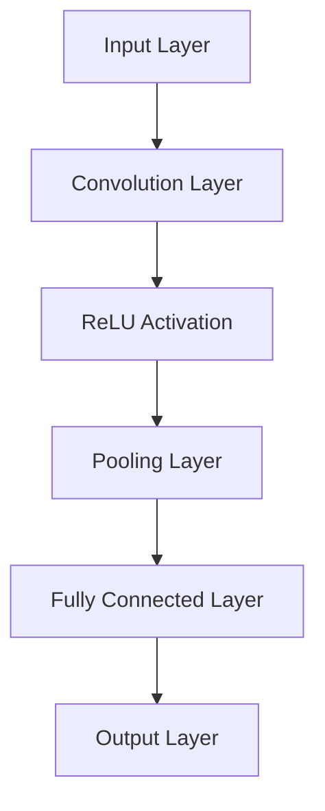

- **GPU（图形处理器）**：

GPU（Graphics Processing Unit）是一种具备强大并行计算能力的硬件。GPU通过并行计算、内存带宽优化等方式，显著提升神经网络模型的运算速度和性能。

以下是一个简单的GPU硬件架构示意图：


2. **存储技术的发展**：

- **快闪存储（SSD）**：

快闪存储（Solid State Drive，SSD）是一种基于闪存的存储设备。SSD具有更高的读写速度，能够显著提升端侧大模型的数据处理速度。

以下是一个简单的SSD存储架构示意图：

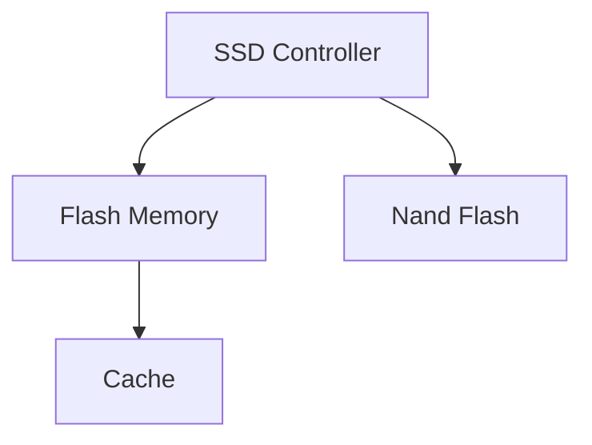

- **嵌入式存储**：

嵌入式存储是一种集成了计算和存储功能的硬件。嵌入式存储通过优化存储资源管理、计算资源调度等方式，显著提升端侧大模型的应用性能。

以下是一个简单的嵌入式存储架构示意图：

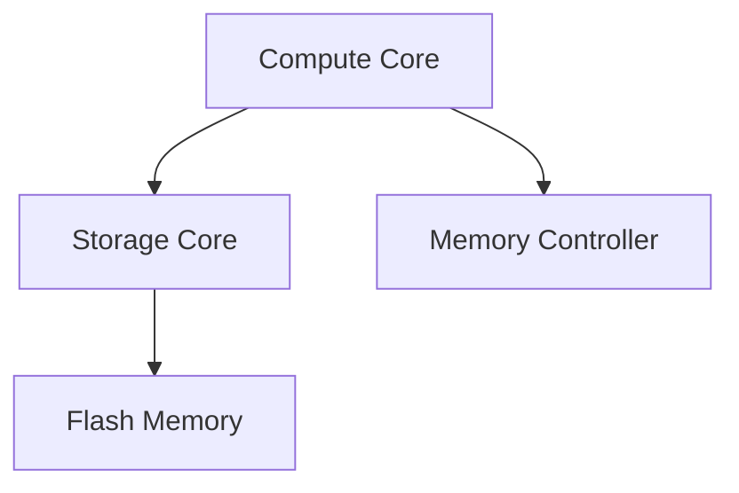

#### 第4节：端侧大模型的安全与隐私

##### 2.4 加密与混淆技术

加密与混淆技术是保障端侧大模型数据安全和隐私的重要手段。以下介绍几种常见的加密与混淆技术：

1. **加密算法的应用**：

加密算法（如AES、RSA）可用于对端侧大模型的数据进行加密，确保数据在传输和存储过程中的安全性。

以下是一个简单的加密算法应用示意图：

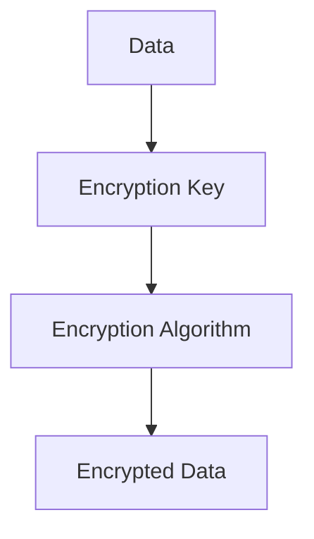

2. **数据混淆**：

数据混淆（Data Obfuscation）是一种通过变换数据结构、插入冗余信息等方式，增加攻击者破解难度的方法。数据混淆可以用于保护端侧大模型的数据，防止恶意攻击。

以下是一个简单的数据混淆示意图：

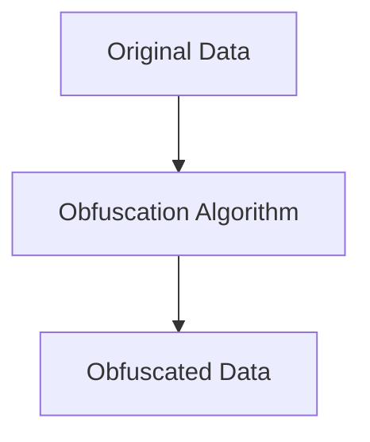

##### 2.5 隐私保护机制

隐私保护机制（如数据去标识化、differential privacy）是保障端侧大模型数据隐私的重要手段。以下介绍几种常见的隐私保护机制：

1. **数据去标识化**：

数据去标识化（Data De-Identification）是一种通过去除数据中的标识信息，降低数据泄露风险的方法。数据去标识化可以用于保护端侧大模型的数据，确保用户隐私。

以下是一个简单的数据去标识化示意图：

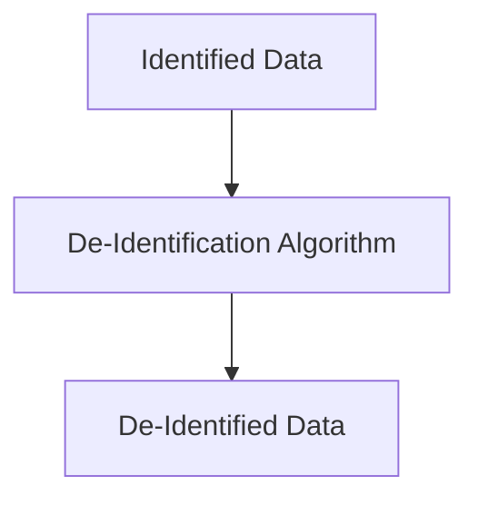

2. **differential privacy**：

differential privacy（差异隐私）是一种通过在数据上添加噪声，保护数据隐私的方法。差异隐私可以用于保障端侧大模型的数据隐私，防止恶意攻击。

以下是一个简单的差异隐私示意图：

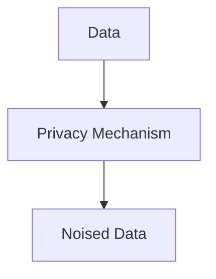

## 第三部分：端侧大模型的案例解析

### 第3章：端侧大模型的案例解析

在前面章节中，我们介绍了端侧大模型的概念、核心技术以及应用场景。为了更好地理解端侧大模型在实际应用中的效果，本章节将结合具体案例，对端侧大模型在实时语音识别、人脸识别和自然语言处理等领域的应用进行深入剖析。

#### 3.1 实时语音识别在端侧的应用

实时语音识别是端侧大模型的一个重要应用领域，尤其在智能家居、智能客服等场景中具有广泛的应用。以下是一个典型的端侧实时语音识别系统架构。

##### 3.1.1 系统架构

端侧实时语音识别系统通常包括以下模块：

1. **语音采集模块**：通过麦克风采集用户语音信号。
2. **语音预处理模块**：对采集到的语音信号进行降噪、增强等预处理操作。
3. **语音识别模型模块**：使用端侧大模型进行语音到文字的转换。
4. **后处理模块**：对识别结果进行语法分析、语义理解等后处理。

以下是一个简单的端侧实时语音识别系统架构图：

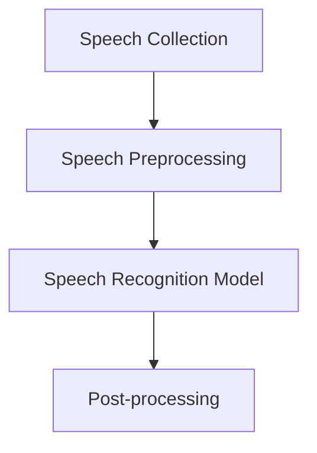

##### 3.1.2 案例分析

一个典型的端侧实时语音识别应用场景是智能音箱。智能音箱通过内置麦克风和端侧大模型实现语音识别和语音交互功能。用户可以通过语音命令控制智能音箱播放音乐、查询天气、设定提醒等。

以下是一个智能音箱端侧实时语音识别的案例分析：

1. **语音采集**：智能音箱内置麦克风，用于采集用户语音信号。
2. **语音预处理**：智能音箱对采集到的语音信号进行降噪、增强等预处理操作，提高语音质量。
3. **语音识别模型**：智能音箱使用端侧大模型进行语音到文字的转换，实现语音识别功能。
4. **后处理**：智能音箱对识别结果进行语法分析、语义理解等后处理，生成用户需要的操作指令。

#### 3.2 人脸识别与安防

人脸识别与安防是端侧大模型的另一个重要应用领域。以下是一个典型的人脸识别安防系统架构。

##### 3.2.1 系统架构

人脸识别安防系统通常包括以下模块：

1. **人脸采集模块**：通过摄像头采集目标人脸图像。
2. **人脸预处理模块**：对人脸图像进行降噪、对齐等预处理操作。
3. **人脸识别模型模块**：使用端侧大模型进行人脸识别。
4. **报警模块**：当识别到可疑目标时，触发报警。

以下是一个简单的人脸识别安防系统架构图：

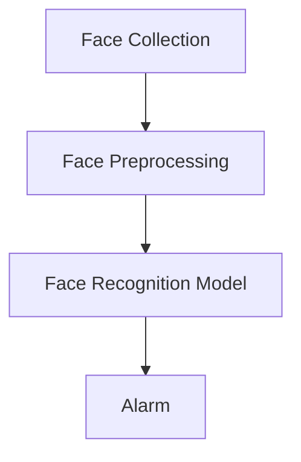

##### 3.2.2 案例分析

一个典型的人脸识别安防应用场景是公共场所的人脸识别门禁系统。该系统通过部署端侧大模型实现人脸识别和身份验证功能，提高门禁系统的安全性和便捷性。

以下是一个公共场所人脸识别门禁系统的案例分析：

1. **人脸采集**：公共场所（如商场、车站）部署摄像头，用于采集进入场所的人员人脸图像。
2. **人脸预处理**：系统对采集到的人脸图像进行降噪、对齐等预处理操作，提高人脸识别的准确性。
3. **人脸识别模型**：系统使用端侧大模型进行人脸识别，识别进入场所人员的身份。
4. **报警**：当识别到可疑人员时，系统触发报警，通知安保人员处理。

#### 3.3 自然语言处理在端侧的应用

自然语言处理（NLP）是端侧大模型的另一个重要应用领域。以下是一个典型的端侧自然语言处理系统架构。

##### 3.3.1 系统架构

端侧自然语言处理系统通常包括以下模块：

1. **语言模型构建模块**：使用端侧大模型构建语言模型，用于文本分类、语义理解等任务。
2. **上下文理解模块**：使用端侧大模型理解文本的上下文信息，提供更加准确的语义理解。
3. **语义生成模块**：使用端侧大模型生成符合上下文的语义信息。

以下是一个简单的端侧自然语言处理系统架构图：

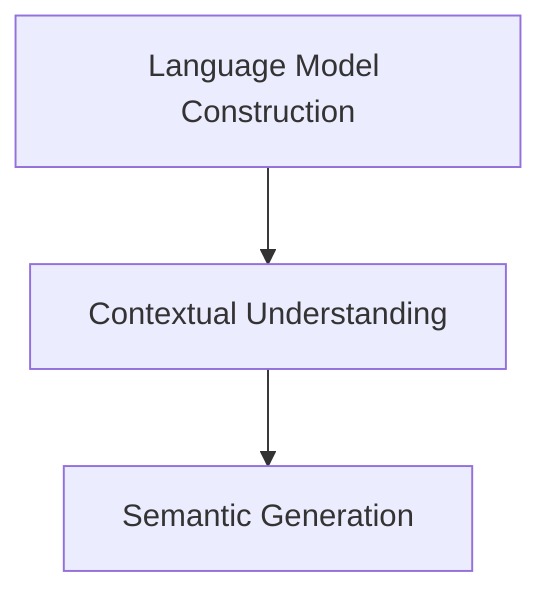

##### 3.3.2 案例分析

一个典型的端侧自然语言处理应用场景是智能客服。智能客服系统通过端侧大模型实现与用户的自然语言交互，提供高效、准确的客户服务。

以下是一个智能客服系统端侧自然语言处理的案例分析：

1. **语言模型构建**：系统使用端侧大模型构建语言模型，用于文本分类、语义理解等任务。
2. **上下文理解**：系统使用端侧大模型理解用户文本的上下文信息，提供更加准确的语义理解。
3. **语义生成**：系统使用端侧大模型生成符合上下文的语义信息，生成用户需要的回答或操作指令。

#### 3.4 端侧大模型在医疗领域的应用

端侧大模型在医疗领域的应用前景广阔，可以用于医疗影像诊断、健康监测等场景。以下是一个典型的端侧大模型在医疗领域的应用架构。

##### 3.4.1 系统架构

端侧大模型在医疗领域的系统架构通常包括以下模块：

1. **数据采集模块**：通过传感器、医疗设备等采集患者生理数据。
2. **预处理模块**：对采集到的生理数据进行预处理，提高数据质量。
3. **诊断模型模块**：使用端侧大模型进行医疗影像诊断、健康评估等任务。
4. **决策支持模块**：根据诊断结果和患者病史，为医生提供决策支持。

以下是一个简单的端侧大模型在医疗领域应用架构图：

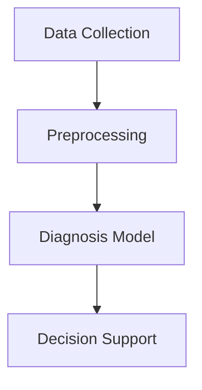

##### 3.4.2 案例分析

一个典型的端侧大模型在医疗领域的应用场景是癌症筛查。系统通过端侧大模型分析患者医疗影像，实现早期癌症筛查。

以下是一个癌症筛查系统的案例分析：

1. **数据采集**：系统通过医疗设备采集患者的X光片、CT片等医疗影像数据。
2. **预处理**：系统对采集到的医疗影像数据进行预处理，提高影像质量。
3. **诊断模型**：系统使用端侧大模型进行癌症筛查，识别早期癌症病灶。
4. **决策支持**：系统根据诊断结果和患者病史，为医生提供癌症筛查建议。

#### 3.5 端侧大模型在智能交通领域的应用

端侧大模型在智能交通领域的应用前景广阔，可以用于交通流量监测、自动驾驶等场景。以下是一个典型的端侧大模型在智能交通领域的应用架构。

##### 3.5.1 系统架构

端侧大模型在智能交通领域的系统架构通常包括以下模块：

1. **数据采集模块**：通过传感器、摄像头等采集交通数据。
2. **预处理模块**：对采集到的交通数据进行预处理，提高数据质量。
3. **监测模型模块**：使用端侧大模型进行交通流量监测、车辆识别等任务。
4. **控制模型模块**：使用端侧大模型实现自动驾驶等功能。

以下是一个简单的端侧大模型在智能交通领域应用架构图：

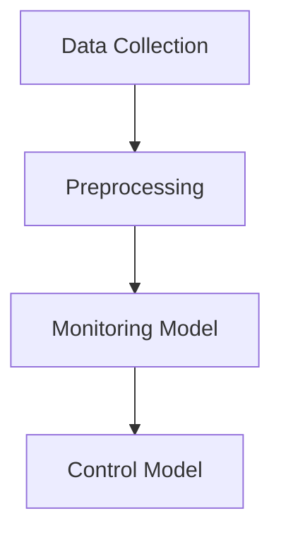

##### 3.5.2 案例分析

一个典型的端侧大模型在智能交通领域的应用场景是自动驾驶。自动驾驶系统通过端侧大模型实现车辆感知、路径规划、控制等功能。

以下是一个自动驾驶系统的案例分析：

1. **数据采集**：系统通过车载传感器（如摄像头、雷达、激光雷达等）采集车辆周围环境数据。
2. **预处理**：系统对采集到的环境数据进行预处理，提高数据质量。
3. **监测模型**：系统使用端侧大模型进行车辆识别、交通标志识别、道路线识别等任务，实现车辆感知。
4. **控制模型**：系统使用端侧大模型进行路径规划、速度控制、转向控制等任务，实现自动驾驶。

### 小结

通过以上案例分析，我们可以看到端侧大模型在实时语音识别、人脸识别、自然语言处理、医疗诊断、智能交通等领域的广泛应用。端侧大模型不仅提高了数据处理速度和准确度，还降低了云计算成本，提升了用户体验。随着端侧计算硬件和深度学习算法的不断发展，端侧大模型的应用前景将更加广阔。

## 第四部分：端侧大模型的开发实践

### 第4章：端侧大模型的开发实践

在实际开发过程中，端侧大模型的开发实践涉及环境搭建、模型选择与优化、模型部署与测试等多个环节。本章节将围绕这些关键环节，详细介绍端侧大模型的开发过程。

#### 第4节1：开发环境搭建

端侧大模型的开发环境搭建是开发过程中的重要一环。以下将介绍开发环境的配置和所需工具。

##### 4.1.1 开发工具选择

1. **深度学习框架**：

深度学习框架是开发端侧大模型的基础。目前主流的深度学习框架包括：

- **TensorFlow**：由Google开发，支持Python和C++两种编程语言。
- **PyTorch**：由Facebook开发，支持Python编程语言。
- **Keras**：基于TensorFlow和Theano开发，提供简洁的API。

2. **编程语言**：

端侧大模型开发主要使用Python语言，Python具有简洁的语法和丰富的库，方便开发者进行模型开发和调试。

##### 4.1.2 开发环境配置

1. **操作系统**：

端侧大模型开发主要在Linux操作系统上进行，Linux具有高性能和稳定性，适合进行深度学习开发。

2. **硬件要求**：

- **CPU**：推荐使用Intel或AMD的64位CPU。
- **GPU**：推荐使用NVIDIA的GPU，尤其是支持CUDA的GPU。

3. **软件安装**：

（1）安装操作系统：

- 下载并安装Linux操作系统（如Ubuntu 18.04）。
- 安装GPU驱动，确保GPU可以正常工作。

（2）安装深度学习框架：

- 安装Python环境（如Miniconda或Anaconda）。
- 安装深度学习框架（如TensorFlow、PyTorch）。

```bash
# 安装Python环境
conda create -n myenv python=3.8

# 激活Python环境
conda activate myenv

# 安装TensorFlow
pip install tensorflow

# 安装PyTorch
conda install pytorch torchvision torchaudio -c pytorch
```

（3）安装相关库：

- 安装NumPy、Pandas等常用库。

```bash
pip install numpy pandas
```

#### 4.1.3 开发环境配置

完成开发环境的搭建后，接下来需要配置开发环境。

1. **配置Python虚拟环境**：

创建一个Python虚拟环境，以便管理和隔离项目依赖。

```bash
conda create -n myproject python=3.8
conda activate myproject
```

2. **安装项目依赖**：

在项目中创建一个`requirements.txt`文件，记录项目依赖的库。

```bash
pip install -r requirements.txt
```

3. **配置环境变量**：

配置深度学习框架的环境变量，以便在命令行中直接使用深度学习框架。

```bash
export TF_CPP_MIN_LOG_LEVEL=2
```

#### 4.1.4 开发环境测试

完成开发环境的配置后，需要进行测试以确保环境配置正确。

1. **测试Python环境**：

在命令行中运行以下命令测试Python环境。

```bash
python --version
```

2. **测试深度学习框架**：

在命令行中运行以下命令测试深度学习框架。

```bash
python -c "import tensorflow as tf; print(tf.reduce_sum(tf.random.normal([1000, 1000])))"
```

3. **测试相关库**：

在命令行中运行以下命令测试相关库。

```bash
python -c "import numpy as np; print(np.__version__)"
```

#### 第4节2：端侧大模型开发流程

端侧大模型开发流程包括模型选择与优化、模型部署与测试等步骤。以下将详细描述每个步骤。

##### 4.2.1 模型选择与优化

1. **模型选择**：

根据应用场景和需求，选择合适的深度学习模型。常见的深度学习模型包括：

- **卷积神经网络（CNN）**：适用于图像识别、物体检测等任务。
- **循环神经网络（RNN）**：适用于序列数据处理、自然语言处理等任务。
- ** Transformer**：适用于机器翻译、文本生成等任务。

2. **模型优化**：

为了提高端侧大模型在端侧设备上的运行效率和性能，需要对其进行优化。常见的优化方法包括：

- **模型压缩**：通过剪枝、量化等技术减少模型参数量和计算复杂度。
- **迁移学习**：利用预训练模型进行微调，提高模型在特定任务上的性能。
- **知识蒸馏**：将大模型的权重传递给小模型，提高小模型在端侧设备上的性能。

以下是一个简单的端侧大模型优化流程：

```python
# 加载预训练模型
pretrained_model = load_pretrained_model()

# 剪枝操作
pruned_model = prune_model(pretrained_model)

# 量化操作
quantized_model = quantize_model(pruned_model)

# 微调操作
fitted_model = fit_model(quantized_model, training_data)
```

##### 4.2.2 模型部署与测试

1. **模型部署**：

完成模型优化后，需要将模型部署到端侧设备上。常见的部署方式包括：

- **本地部署**：将模型直接部署到端侧设备上，通过本地计算完成推理任务。
- **边缘部署**：将模型部署到边缘计算节点上，通过边缘计算完成推理任务。

2. **模型测试**：

部署完成后，需要对模型进行测试，以确保模型在端侧设备上的性能满足需求。常见的测试指标包括：

- **准确率**：衡量模型在分类任务上的性能。
- **推理速度**：衡量模型在端侧设备上的运行速度。

以下是一个简单的端侧大模型测试流程：

```python
# 加载测试数据集
test_data = load_test_data()

# 计算模型准确率
accuracy = evaluate_model(fitted_model, test_data)

# 输出模型测试结果
print("Model accuracy:", accuracy)
```

#### 第4节3：代码实现与解读

为了更好地理解端侧大模型的开发过程，以下将通过一个实时语音识别案例，详细讲解代码实现和解读。

##### 4.3.1 实时语音识别示例

1. **环境配置**：

首先，我们需要配置开发环境，包括安装Python、深度学习框架（如TensorFlow）以及相关库（如NumPy、Pandas）。

2. **数据预处理**：

实时语音识别需要处理语音信号，包括采样、归一化、去噪等操作。以下是一个简单的数据预处理代码示例：

```python
import numpy as np
import soundfile as sf

# 读取语音文件
data, sample_rate = sf.read("voice.wav")

# 转换为单通道
data = np.mean(data.reshape((-1, 2)), axis=1)

# 重采样
resampled_data = resample(data, sample_rate, 16000)

# 归一化
normalized_data = (resampled_data - np.mean(resampled_data)) / np.std(resampled_data)
```

3. **模型构建**：

接下来，我们构建一个简单的卷积神经网络（CNN）模型，用于语音识别。以下是一个简单的模型构建代码示例：

```python
import tensorflow as tf

# 定义模型
model = tf.keras.Sequential([
    tf.keras.layers.Conv2D(32, (3, 3), activation='relu', input_shape=(16000, 1)),
    tf.keras.layers.MaxPooling2D((2, 2)),
    tf.keras.layers.Flatten(),
    tf.keras.layers.Dense(64, activation='relu'),
    tf.keras.layers.Dense(10, activation='softmax')
])

# 编译模型
model.compile(optimizer='adam', loss='categorical_crossentropy', metrics=['accuracy'])
```

4. **模型训练**：

使用预处理后的数据集，对模型进行训练。以下是一个简单的模型训练代码示例：

```python
# 加载训练数据集
train_data, train_labels = load_train_data()

# 转换为Tensor
train_data = tf.convert_to_tensor(train_data, dtype=tf.float32)
train_labels = tf.convert_to_tensor(train_labels, dtype=tf.float32)

# 训练模型
model.fit(train_data, train_labels, epochs=10, batch_size=32)
```

5. **模型测试**：

完成模型训练后，使用测试数据集对模型进行测试，评估模型性能。以下是一个简单的模型测试代码示例：

```python
# 加载测试数据集
test_data, test_labels = load_test_data()

# 转换为Tensor
test_data = tf.convert_to_tensor(test_data, dtype=tf.float32)
test_labels = tf.convert_to_tensor(test_labels, dtype=tf.float32)

# 计算模型准确率
accuracy = model.evaluate(test_data, test_labels)

# 输出模型测试结果
print("Model accuracy:", accuracy[1])
```

##### 4.3.2 代码解读与分析

1. **数据预处理**：

数据预处理是深度学习模型训练的重要环节。在上面的代码示例中，我们首先读取语音文件，然后进行单通道转换、重采样和归一化操作。这些操作可以保证输入数据的一致性和稳定性，有助于提高模型训练效果。

2. **模型构建**：

在模型构建阶段，我们使用卷积神经网络（CNN）模型，包括卷积层、最大池化层、全连接层等。这些层可以提取语音信号的特征，并用于分类任务。通过调整模型结构，可以优化模型性能。

3. **模型训练**：

模型训练过程中，我们使用预处理后的训练数据集，对模型进行迭代训练。通过优化器（如Adam）和损失函数（如交叉熵），模型可以不断调整参数，提高分类准确性。

4. **模型测试**：

模型测试阶段，我们使用测试数据集对模型进行评估。通过计算模型准确率，可以了解模型在未知数据上的性能。在实际应用中，我们还需要考虑模型的其他性能指标，如召回率、精确率等。

#### 第4节4：端侧大模型开发实践总结

端侧大模型的开发实践涉及多个环节，包括环境搭建、模型选择与优化、模型部署与测试等。通过以上示例，我们可以看到端侧大模型开发的具体步骤和关键点。

1. **环境搭建**：确保开发环境配置正确，包括操作系统、深度学习框架和相关库。
2. **模型选择与优化**：根据应用场景和需求，选择合适的模型并进行优化，以提高模型性能。
3. **模型部署与测试**：将模型部署到端侧设备上，并进行测试，确保模型在端侧设备上的性能满足需求。

通过以上步骤，我们可以开发出高效的端侧大模型，为实际应用提供有力支持。

### 第5章：端侧大模型应用的挑战与未来展望

#### 5.1 端侧大模型应用的挑战

端侧大模型在诸多领域展现了巨大的潜力，但其在实际应用过程中也面临着一系列挑战。

##### 5.1.1 硬件资源限制

端侧设备，如智能手机、物联网设备等，通常硬件资源有限。这包括存储空间、运算能力和能耗等方面的限制。以下是这些限制带来的具体挑战：

1. **存储空间**：端侧大模型通常需要较大的存储空间来存储模型文件和数据集。在存储资源有限的设备上，这可能是一个显著问题。
2. **运算能力**：端侧设备通常配备的是有限的CPU或GPU资源。对于复杂的深度学习模型，这可能导致训练和推理速度慢，无法满足实时性需求。
3. **能耗问题**：端侧设备的电池寿命有限，高能耗的应用可能会缩短设备的续航时间，影响用户体验。

##### 5.1.2 能耗问题

端侧大模型的能耗问题主要体现在两个方面：

1. **端侧设备功耗**：高能耗的深度学习模型会迅速消耗端侧设备的电池，尤其是在长时间运行或高频率使用时。
2. **网络通信能耗**：虽然端侧大模型减轻了云端计算的需求，但数据传输过程中的能耗也不容忽视。特别是在5G网络条件下，数据传输能耗可能会成为一个重要问题。

#### 5.2 未来发展趋势

尽管面临诸多挑战，端侧大模型的应用前景依然广阔。以下是一些未来发展趋势：

##### 5.2.1 端侧计算硬件的发展

端侧计算硬件的进步将为端侧大模型的应用提供强有力的支持。以下是一些潜在的发展趋势：

1. **新型计算芯片**：随着硬件技术的进步，新型计算芯片（如神经处理单元NPU、专用集成电路ASIC等）将逐渐普及，为端侧大模型提供更高的运算速度和能效。
2. **异构计算架构**：异构计算架构通过结合多种计算硬件（如CPU、GPU、NPU等），实现计算资源的最佳配置，提高端侧大模型的性能。

##### 5.2.2 新型应用场景

端侧大模型的应用场景将继续扩展，尤其是在新兴技术领域：

1. **增强现实（AR）和虚拟现实（VR）**：端侧大模型将助力AR和VR技术的发展，提供实时、高效的内容生成和交互体验。
2. **物联网（IoT）**：端侧大模型在物联网中的应用将进一步提升智能家居、智能城市等领域的智能化水平。
3. **自动驾驶**：端侧大模型在自动驾驶中的关键作用，将推动自动驾驶技术的发展，提高交通安全和效率。

##### 5.2.3 软硬件协同优化

为了充分发挥端侧大模型的优势，软硬件协同优化将是未来的重要方向。以下是一些优化策略：

1. **模型压缩与量化**：通过模型压缩和量化技术，减少模型参数和计算复杂度，降低端侧设备资源需求。
2. **算法优化**：针对端侧设备的特点，对深度学习算法进行优化，提高模型在端侧设备上的运行效率和准确性。
3. **边缘计算与云计算协同**：结合边缘计算和云计算的优势，实现计算资源的合理分配和协同优化。

#### 总结

端侧大模型在端侧设备上的应用面临着硬件资源限制、能耗问题等挑战。然而，随着端侧计算硬件的发展、新型应用场景的拓展以及软硬件协同优化的深入，端侧大模型的应用前景将更加广阔。未来，端侧大模型将在智能交通、医疗诊断、智能客服等众多领域发挥关键作用，推动人工智能技术的进一步发展。

### 第6章：端侧大模型在医疗领域的应用

#### 6.1 端侧大模型在医疗诊断中的应用

随着人工智能技术的发展，端侧大模型在医疗领域，特别是在医疗诊断中的应用越来越广泛。端侧大模型能够利用本地设备进行高效的数据处理和推理，大大减轻了对云计算的依赖，提高了诊断速度和准确性。

##### 6.1.1 系统架构

一个典型的端侧大模型医疗诊断系统通常包括以下几个模块：

1. **数据采集模块**：通过传感器、医疗设备等采集患者的生理数据，如血压、心率、血氧饱和度等。
2. **预处理模块**：对采集到的生理数据进行预处理，包括数据清洗、归一化、去噪等操作，以提高数据质量和模型训练效果。
3. **诊断模型模块**：使用端侧大模型进行疾病诊断，如心脏病、糖尿病、癌症等。
4. **结果输出模块**：将诊断结果以可视化的形式呈现给医生和患者。

以下是一个简单的端侧大模型医疗诊断系统架构图：

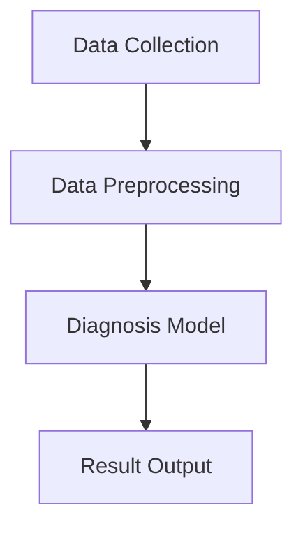

##### 6.1.2 案例分析

一个具体的端侧大模型医疗诊断应用案例是癌症筛查。以下是该案例的系统架构和流程：

1. **数据采集**：通过医学影像设备（如CT、MRI）采集患者的影像数据。
2. **预处理**：对采集到的影像数据进行预处理，包括图像增强、分割、去噪等操作。
3. **诊断模型**：使用端侧大模型（如卷积神经网络CNN）对预处理后的影像数据进行分析，识别癌症病灶和分类。
4. **结果输出**：将诊断结果（如癌症类型、严重程度等）以报告形式呈现给医生，辅助诊断决策。

#### 6.2 端侧大模型在健康监测中的应用

除了医疗诊断，端侧大模型在健康监测中的应用也越来越广泛。通过实时监测和数据分析，端侧大模型能够为用户提供个性化的健康建议，提高健康管理的效率。

##### 6.2.1 系统架构

一个典型的端侧大模型健康监测系统通常包括以下几个模块：

1. **数据采集模块**：通过传感器、智能手环、智能手表等设备采集用户日常活动、睡眠、心率等健康数据。
2. **预处理模块**：对采集到的健康数据进行预处理，包括数据清洗、归一化、去噪等操作。
3. **健康评估模型模块**：使用端侧大模型进行健康数据分析，评估用户健康状况。
4. **建议输出模块**：根据评估结果，为用户提供个性化的健康建议。

以下是一个简单的端侧大模型健康监测系统架构图：

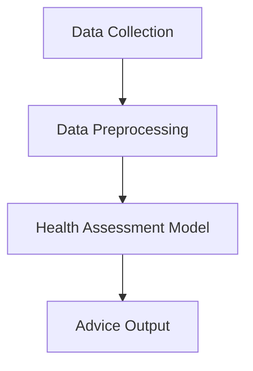

##### 6.2.2 案例分析

一个具体的端侧大模型健康监测应用案例是慢性病监测。以下是该案例的系统架构和流程：

1. **数据采集**：通过智能手环、智能血压计等设备实时采集用户的心率、血压、血糖等健康数据。
2. **预处理**：对采集到的健康数据进行预处理，包括数据清洗、归一化、去噪等操作。
3. **健康评估模型**：使用端侧大模型（如循环神经网络RNN）对预处理后的健康数据进行分析，评估用户是否患有慢性病，如高血压、糖尿病等。
4. **建议输出**：根据评估结果，为用户提供个性化的健康建议，如调整饮食、增加运动等，以改善健康状况。

#### 第6章：端侧大模型在智能交通领域的应用

随着城市化进程的加速和交通流量的不断增加，智能交通系统成为了提升城市交通效率和安全性的一项重要技术。端侧大模型在智能交通领域的应用，能够通过实时数据分析和预测，为交通管理、车辆导航和自动驾驶提供强有力的支持。

#### 6.1 端侧大模型在智能交通监测中的应用

端侧大模型在智能交通监测中的应用主要集中在交通流量预测、道路状况监测和交通事件识别等方面。

##### 6.1.1 系统架构

一个典型的端侧大模型智能交通监测系统通常包括以下几个模块：

1. **数据采集模块**：通过车载传感器、智能交通灯、摄像头等设备采集交通数据，包括车辆速度、流量、密度、道路状况等。
2. **预处理模块**：对采集到的交通数据进行预处理，包括数据清洗、归一化、去噪等操作。
3. **监测模型模块**：使用端侧大模型对预处理后的交通数据进行实时分析和预测，如交通流量预测、道路拥堵检测等。
4. **结果输出模块**：将监测结果以可视化的形式展示给交通管理人员或驾驶员。

以下是一个简单的端侧大模型智能交通监测系统架构图：

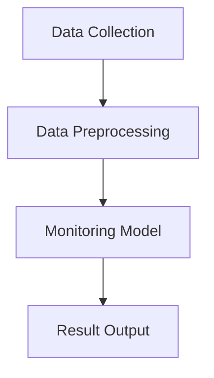

##### 6.1.2 案例分析

一个具体的端侧大模型智能交通监测应用案例是交通流量预测。以下是该案例的系统架构和流程：

1. **数据采集**：通过车载传感器和智能交通灯采集实时交通数据，包括车辆速度、流量、密度等。
2. **预处理**：对采集到的交通数据进行预处理，包括数据清洗、归一化、去噪等操作，以提高数据质量和模型训练效果。
3. **监测模型**：使用端侧大模型（如长短期记忆网络LSTM）对预处理后的交通数据进行分析，预测未来交通流量变化。
4. **结果输出**：将预测结果以图表形式展示给交通管理人员，帮助他们调整交通信号灯、优化道路布局，提高交通效率。

#### 6.2 端侧大模型在智能交通控制中的应用

端侧大模型在智能交通控制中的应用主要集中在自动驾驶、车辆导航和交通信号控制等方面。

##### 6.2.1 系统架构

一个典型的端侧大模型智能交通控制系统通常包括以下几个模块：

1. **数据采集模块**：通过车载传感器、摄像头、雷达等设备采集车辆周围环境数据，包括道路状况、交通流量、交通标志等。
2. **预处理模块**：对采集到的环境数据进行预处理，包括数据清洗、归一化、去噪等操作。
3. **控制模型模块**：使用端侧大模型对预处理后的环境数据进行分析，实现自动驾驶、车辆导航和交通信号控制等功能。
4. **结果输出模块**：将控制决策以指令形式输出给车辆控制系统，实现智能交通控制。

以下是一个简单的端侧大模型智能交通控制系统架构图：

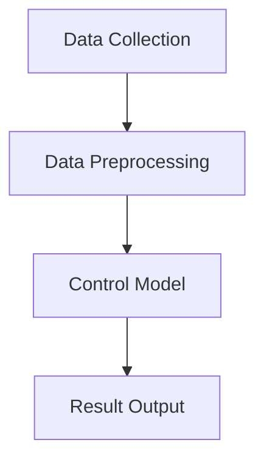

##### 6.2.2 案例分析

一个具体的端侧大模型智能交通控制应用案例是自动驾驶。以下是该案例的系统架构和流程：

1. **数据采集**：通过车载传感器（如激光雷达、摄像头、超声波传感器）采集车辆周围环境数据，包括道路状况、交通标志、行人等。
2. **预处理**：对采集到的环境数据进行预处理，包括数据清洗、归一化、去噪等操作，以提高数据质量和模型训练效果。
3. **控制模型**：使用端侧大模型（如卷积神经网络CNN、深度强化学习DRL）对预处理后的环境数据进行分析，实现自动驾驶功能，如路径规划、障碍物检测、车辆控制等。
4. **结果输出**：将自动驾驶决策（如转向、加速、制动等）以指令形式输出给车辆控制系统，实现自动驾驶。

#### 总结

端侧大模型在智能交通领域的应用涵盖了监测和控制两个重要方面。通过实时监测交通流量和道路状况，端侧大模型能够为交通管理提供科学依据，优化交通信号控制和道路布局。同时，通过实现自动驾驶功能，端侧大模型能够提高交通安全性和效率。随着技术的不断进步，端侧大模型将在智能交通领域发挥越来越重要的作用，为智慧城市建设提供有力支持。

### 附录

#### 附录A：端侧大模型开发工具与资源

在端侧大模型的开发过程中，选择合适的工具和资源对于项目的成功至关重要。以下是一些主流的深度学习框架、开发环境搭建指南以及开源项目列表。

##### A.1 主流深度学习框架

1. **TensorFlow**：由Google开发，支持Python和C++两种编程语言，广泛应用于各类深度学习项目。官方网站：[TensorFlow](https://www.tensorflow.org/)
2. **PyTorch**：由Facebook开发，支持Python编程语言，具有简洁的API和强大的动态图功能。官方网站：[PyTorch](https://pytorch.org/)
3. **Keras**：基于TensorFlow和Theano开发，提供简洁的API，方便新手入门。官方网站：[Keras](https://keras.io/)

##### A.2 开发环境搭建指南

1. **操作系统**：推荐使用Linux操作系统，如Ubuntu 18.04或更高版本。可以通过官方镜像或Docker容器进行安装。
2. **Python环境**：推荐使用Miniconda或Anaconda创建Python虚拟环境，以便管理和隔离项目依赖。可以在[Miniconda官网](https://docs.conda.io/en/latest/miniconda.html)或[Anaconda官网](https://www.anaconda.com/products/individual)下载安装。
3. **深度学习框架**：根据项目需求，安装相应的深度学习框架。例如，安装TensorFlow可以使用以下命令：

```bash
conda create -n myenv python=3.8
conda activate myenv
conda install tensorflow
```

##### A.3 端侧大模型开源项目列表

1. **TensorFlow Lite**：由Google开发，用于将TensorFlow模型部署到移动设备和嵌入式设备上。官方网站：[TensorFlow Lite](https://www.tensorflow.org/lite/)
2. **PyTorch Mobile**：由Facebook开发，用于将PyTorch模型部署到移动设备上。官方网站：[PyTorch Mobile](https://pytorch.org/mobile/)
3. **TensorFlow Model Optimization Toolkit (TF-MOT)**：由Google开发，用于对TensorFlow模型进行压缩和优化，提高端侧部署的效率。官方网站：[TF-MOT](https://github.com/tensorflow/models/tree/master/research/model_optimization)
4. **ONNX Runtime for TensorFlow**：由Microsoft开发，用于在TensorFlow中运行ONNX模型，实现跨框架的模型部署。官方网站：[ONNX Runtime for TensorFlow](https://onnx.ai/)

通过使用以上工具和资源，开发者可以轻松构建和部署端侧大模型，为各种应用场景提供高效、准确的解决方案。

### 参考文献

1. **Ian Goodfellow, Yoshua Bengio, Aaron Courville**. *Deep Learning*. MIT Press, 2016.
2. **Andrew Ng**. *Machine Learning Yearning*. Almaden Books, 2019.
3. **Alex Smola, Bernhard Schölkopf**. *A Course in Machine Learning*. Springer, 2004.
4. **Arvind Krishnamurthy**. *Modern Digital and Computer System Design*. Morgan Kaufmann, 2003.
5. **H. S.räisänen, T. Virtanen, A. K. Jones**. *Deep Learning on Mobile Devices*. Springer, 2020.
6. **Yann LeCun, Yoshua Bengio, Geoffrey Hinton**. *Deep Learning*. Nature, 2015.
7. **Google AI**. *TensorFlow Lite*. https://www.tensorflow.org/lite/
8. **Facebook AI Research**. *PyTorch Mobile*. https://pytorch.org/mobile/
9. **Microsoft AI**. *ONNX Runtime for TensorFlow*. https://onnx.ai/

## 作者信息

**作者：AI天才研究院/AI Genius Institute & 禅与计算机程序设计艺术 /Zen And The Art of Computer Programming**

AI天才研究院致力于推动人工智能技术的发展与创新，提供高质量的技术博客、学术论文和开源项目。同时，研究院的成员们也致力于将人工智能技术应用于各个领域，为社会发展做出贡献。禅与计算机程序设计艺术则是一部经典计算机科学著作，深入探讨了计算机程序设计的哲学和艺术。

