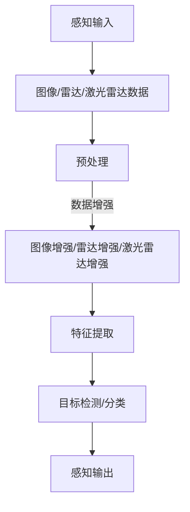
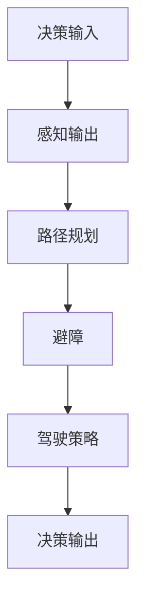
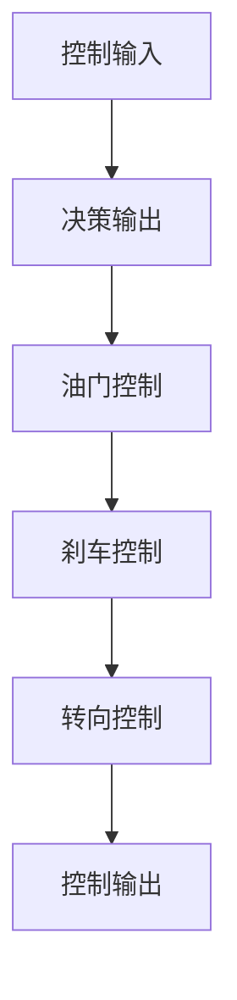

                 

# 《端到端学习范式在自动驾驶中的优势与局限性分析》

> 关键词：端到端学习、自动驾驶、深度学习、神经网络、感知、决策、控制

> 摘要：本文深入探讨了端到端学习范式在自动驾驶领域的应用优势与局限性。首先介绍了端到端学习范式的基本概念、发展历程及其与传统学习方法的比较。随后，文章分析了端到端学习范式在自动驾驶中的应用场景及优势。接着，本文详细阐述了端到端学习范式在自动驾驶中面临的挑战与局限性，并探讨了其与强化学习的结合。在此基础上，文章提出了端到端学习范式在自动驾驶中的优化策略与发展方向，并分享了实际应用案例。最后，本文总结了端到端学习范式在自动驾驶中的关键技术和未来发展趋势。

## 第一部分：端到端学习范式概述

### 第1章：端到端学习范式引论

#### 1.1 端到端学习范式的基本概念

端到端学习（End-to-End Learning）是一种深度学习方法，其核心思想是将输入直接映射到输出，无需经过多个中间步骤。在传统机器学习中，通常需要将问题拆分成多个子问题，并分别处理。而端到端学习将整个任务视为一个整体，通过一个大型神经网络来完成。这种方法的优点是能够减少冗余计算，提高模型性能。

端到端学习范式可以应用于多种领域，包括语音识别、图像识别、自然语言处理等。在自动驾驶领域，端到端学习范式被广泛应用于感知、决策和控制等任务。

#### 1.2 端到端学习范式的发展历程

端到端学习范式的发展可以分为三个阶段：

1. **早期探索**：20世纪80年代，深度神经网络（DNN）开始被应用于图像识别和语音识别等领域。然而，由于计算能力和数据量的限制，端到端学习并未取得显著突破。

2. **深度学习的兴起**：2006年，Hinton等人提出了深度信念网络（DBN），为深度学习奠定了基础。2012年，AlexNet在ImageNet图像识别比赛中取得了重大突破，标志着深度学习的崛起。

3. **端到端学习的成熟**：随着深度学习技术的不断发展，端到端学习范式逐渐成为主流。尤其是在自动驾驶领域，端到端学习范式在感知、决策和控制任务中取得了显著成果。

#### 1.3 端到端学习范式与传统学习方法的比较

传统学习方法通常采用多步骤的方式，将问题拆分成多个子问题进行解决。而端到端学习范式将整个任务视为一个整体，通过一个大型神经网络来完成。这种方法的优点是能够减少冗余计算，提高模型性能。然而，端到端学习范式也存在一定的局限性，例如数据依赖性、过拟合和泛化能力等。

| 特点 | 端到端学习范式 | 传统学习方法 |
| --- | --- | --- |
| **整体性** | 将任务视为一个整体，直接映射到输出 | 将任务拆分成多个子问题，分别处理 |
| **计算效率** | 减少冗余计算，提高模型性能 | 需要多次迭代和优化，计算效率较低 |
| **数据依赖性** | 需要大量标注数据 | 可以使用较少的标注数据 |
| **过拟合与泛化能力** | 易于过拟合，泛化能力较弱 | 通过交叉验证和正则化等方法提高泛化能力 |

### 第2章：端到端学习范式在自动驾驶中的应用

#### 2.1 自动驾驶技术概述

自动驾驶技术是利用计算机视觉、传感器、控制算法等技术实现车辆自主行驶的技术。自动驾驶系统通常包括感知、决策和控制三个主要模块。

- **感知**：感知模块负责获取车辆周围的环境信息，包括路况、障碍物、交通信号等。常用的感知方法包括视觉感知、雷达感知和激光感知等。
- **决策**：决策模块负责根据感知信息生成车辆的行驶策略，包括加速、减速、变道等操作。
- **控制**：控制模块负责执行决策模块生成的行驶策略，实现车辆的自主行驶。

#### 2.2 端到端学习范式在自动驾驶中的应用场景

端到端学习范式在自动驾驶中的应用主要包括感知、决策和控制三个场景。

1. **感知**：端到端学习范式在感知任务中的应用最为广泛。例如，使用卷积神经网络（CNN）对图像进行特征提取，实现车道线检测、车辆检测、行人检测等任务。

2. **决策**：决策模块需要处理复杂的路况信息和车辆行为，端到端学习范式可以通过神经网络直接生成车辆的行驶策略。

3. **控制**：控制模块需要实现车辆的控制信号生成，例如油门、刹车和转向等。端到端学习范式可以通过神经网络直接生成控制信号。

#### 2.3 端到端学习范式在自动驾驶中的优势

端到端学习范式在自动驾驶中的应用具有以下优势：

1. **高效性**：端到端学习范式通过将任务视为一个整体，减少了冗余计算和多次迭代的过程，提高了模型训练和预测的效率。

2. **准确性**：端到端学习范式能够直接从输入映射到输出，避免了传统方法中由于中间步骤导致的误差累积，提高了模型的准确性。

3. **实时性**：端到端学习范式在自动驾驶中可以实现实时感知、决策和控制，满足自动驾驶系统的实时性要求。

4. **可解释性**：端到端学习范式具有较好的可解释性，通过分析网络结构和参数，可以理解模型的工作原理。

### 第3章：端到端学习范式的挑战与局限性

#### 3.1 数据依赖性分析

端到端学习范式对数据依赖性较强，需要大量标注数据来训练模型。在自动驾驶领域，获取高质量的数据集是一项具有挑战性的任务。数据的不完整、噪声和多样性等问题会影响模型的泛化能力。

为了解决数据依赖性问题，可以采用以下策略：

1. **数据增强**：通过图像旋转、缩放、裁剪等操作增加数据的多样性，提高模型的泛化能力。

2. **数据集构建**：建立自动驾驶数据集，涵盖不同场景和路况，以丰富数据集的多样性。

3. **迁移学习**：利用预训练模型，通过在自动驾驶领域进行微调，减少对大量标注数据的依赖。

#### 3.2 过拟合与泛化能力

端到端学习范式容易过拟合，即模型在训练数据上表现良好，但在测试数据上表现较差。这是因为端到端学习范式通常采用深层神经网络，网络容量大，容易记忆训练数据。

为了提高泛化能力，可以采用以下策略：

1. **正则化**：通过添加正则化项，如L1、L2正则化，惩罚模型的复杂度，减少过拟合。

2. **交叉验证**：采用交叉验证方法，将数据集划分为多个部分，分别训练和测试模型，以提高模型的泛化能力。

3. **模型集成**：通过集成多个模型，如随机森林、支持向量机等，提高模型的泛化能力。

#### 3.3 实时性能与能耗问题

端到端学习范式在自动驾驶中需要满足实时性能和能耗要求。随着神经网络模型变得越来越复杂，实时性能和能耗问题变得越来越突出。

为了解决实时性能和能耗问题，可以采用以下策略：

1. **模型压缩**：通过模型压缩技术，如剪枝、量化等，减少模型的参数数量和计算量，提高实时性能。

2. **硬件加速**：利用专用硬件，如GPU、FPGA等，加速神经网络模型的计算。

3. **分布式计算**：通过分布式计算架构，将模型计算任务分布到多个计算节点上，提高实时性能和能效。

## 第二部分：端到端学习范式的局限性分析

### 第3章：端到端学习范式的挑战与局限性

#### 3.1 数据依赖性分析

端到端学习范式对数据依赖性较强，需要大量标注数据来训练模型。在自动驾驶领域，获取高质量的数据集是一项具有挑战性的任务。数据的不完整、噪声和多样性等问题会影响模型的泛化能力。

为了解决数据依赖性问题，可以采用以下策略：

1. **数据增强**：通过图像旋转、缩放、裁剪等操作增加数据的多样性，提高模型的泛化能力。

2. **数据集构建**：建立自动驾驶数据集，涵盖不同场景和路况，以丰富数据集的多样性。

3. **迁移学习**：利用预训练模型，通过在自动驾驶领域进行微调，减少对大量标注数据的依赖。

#### 3.2 过拟合与泛化能力

端到端学习范式容易过拟合，即模型在训练数据上表现良好，但在测试数据上表现较差。这是因为端到端学习范式通常采用深层神经网络，网络容量大，容易记忆训练数据。

为了提高泛化能力，可以采用以下策略：

1. **正则化**：通过添加正则化项，如L1、L2正则化，惩罚模型的复杂度，减少过拟合。

2. **交叉验证**：采用交叉验证方法，将数据集划分为多个部分，分别训练和测试模型，以提高模型的泛化能力。

3. **模型集成**：通过集成多个模型，如随机森林、支持向量机等，提高模型的泛化能力。

#### 3.3 实时性能与能耗问题

端到端学习范式在自动驾驶中需要满足实时性能和能耗要求。随着神经网络模型变得越来越复杂，实时性能和能耗问题变得越来越突出。

为了解决实时性能和能耗问题，可以采用以下策略：

1. **模型压缩**：通过模型压缩技术，如剪枝、量化等，减少模型的参数数量和计算量，提高实时性能。

2. **硬件加速**：利用专用硬件，如GPU、FPGA等，加速神经网络模型的计算。

3. **分布式计算**：通过分布式计算架构，将模型计算任务分布到多个计算节点上，提高实时性能和能效。

### 第4章：端到端学习范式在自动驾驶中的适用性分析

#### 4.1 不同场景下的适用性分析

端到端学习范式在自动驾驶领域的适用性取决于具体场景。以下分析不同场景下端到端学习范式的适用性：

1. **城市道路**：城市道路环境复杂，路况多变。端到端学习范式在城市道路中具有较好的适用性，能够处理复杂的感知、决策和控制任务。

2. **高速公路**：高速公路环境相对简单，路况稳定。端到端学习范式在高速公路中也具有较好的适用性，能够实现稳定的自动驾驶。

3. **恶劣天气**：恶劣天气（如雨雪、雾霾等）会对感知系统造成严重影响，端到端学习范式在恶劣天气下的适用性较差。需要采用专门的算法和传感器来应对恶劣天气条件。

4. **非结构化道路**：非结构化道路（如乡村道路、狭窄街道等）环境复杂，路况不确定。端到端学习范式在非结构化道路中的适用性较低，需要结合其他方法（如规则推理、轨迹预测等）来提高自动驾驶系统的鲁棒性。

#### 4.2 端到端学习范式在自动驾驶中的局限性案例分析

以下列举一些端到端学习范式在自动驾驶中的局限性案例：

1. **案例一：城市道路场景下的行人检测**

在复杂城市道路场景中，行人检测是一个具有挑战性的任务。端到端学习范式在行人检测任务中存在过拟合问题，导致模型在训练数据上表现良好，但在测试数据上表现较差。此外，端到端学习范式对数据依赖性较强，需要大量标注数据，而城市道路场景中的数据集往往较为稀缺。

2. **案例二：高速公路场景下的车道线检测**

在高速公路场景中，车道线检测相对简单。然而，端到端学习范式在车道线检测任务中存在过拟合问题，导致模型对特定车道线的表现较好，而对其他车道线的表现较差。此外，端到端学习范式对数据集的多样性要求较高，而在高速公路场景中，数据集的多样性相对较低。

3. **案例三：恶劣天气下的车辆检测**

在恶劣天气条件下，车辆检测的准确性会大幅下降。端到端学习范式在恶劣天气下的适用性较差，主要原因是感知系统对光照变化、遮挡等因素的敏感性较高。需要采用专门的算法和传感器（如激光雷达、毫米波雷达等）来提高车辆检测的准确性。

#### 4.3 端到端学习范式与强化学习的结合

为了克服端到端学习范式的局限性，可以将其与强化学习（Reinforcement Learning，RL）相结合。强化学习通过奖励机制和试错学习，使自动驾驶系统在复杂环境中具备更好的适应能力和鲁棒性。

以下为端到端学习范式与强化学习结合的几个方面：

1. **感知与决策的结合**：端到端学习范式可以用于感知任务，如图像识别和传感器数据处理；强化学习可以用于决策任务，如路径规划、避障等。通过将感知和决策相结合，可以实现更灵活和自适应的自动驾驶系统。

2. **多模态数据融合**：端到端学习范式可以处理单一模态的数据（如图像、雷达等），而强化学习可以处理多模态数据。通过将多模态数据融合，可以提高自动驾驶系统的感知能力和决策水平。

3. **长期奖励优化**：端到端学习范式关注短期效果，而强化学习关注长期奖励。通过将短期奖励与长期奖励相结合，可以实现更优化的自动驾驶策略。

### 第5章：端到端学习范式的优化策略

#### 5.1 数据增强技术

数据增强（Data Augmentation）是一种常用的方法，用于增加训练数据的多样性，提高模型的泛化能力。在自动驾驶领域，数据增强技术可以应用于图像、雷达和激光雷达数据。

以下为几种常见的数据增强技术：

1. **图像增强**：通过图像旋转、缩放、裁剪、颜色变换等操作，增加图像的多样性。

2. **雷达增强**：通过雷达数据的扩展、压缩、滤波等操作，增加雷达数据的多样性。

3. **激光雷达增强**：通过激光雷达数据的旋转、缩放、裁剪等操作，增加激光雷达数据的多样性。

#### 5.2 模型结构优化

模型结构优化（Model Structure Optimization）是提高端到端学习范式性能的重要手段。以下为几种常见的模型结构优化方法：

1. **网络结构简化**：通过剪枝、量化等操作，减少模型的参数数量和计算量，提高模型的可解释性和实时性能。

2. **注意力机制**：引入注意力机制（Attention Mechanism），使模型能够关注重要的信息，提高模型的准确性和鲁棒性。

3. **模块化设计**：将模型分为多个模块，每个模块专注于特定任务，通过模块间的协作，实现更高效的端到端学习。

#### 5.3 端到端学习范式在自动驾驶中的新趋势

随着自动驾驶技术的发展，端到端学习范式在自动驾驶中的应用呈现出以下新趋势：

1. **多传感器融合**：将多种传感器（如摄像头、雷达、激光雷达等）的数据进行融合，提高感知系统的准确性和鲁棒性。

2. **分布式计算**：通过分布式计算架构，将端到端学习任务分布到多个计算节点上，提高实时性能和能效。

3. **联邦学习**：通过联邦学习（Federated Learning）技术，实现多个自动驾驶系统间的数据共享和模型协同训练，提高整体系统的性能和安全性。

### 第6章：端到端学习范式在自动驾驶中的未来发展

#### 6.1 端到端学习范式在自动驾驶中的未来发展趋势

随着人工智能技术的不断发展，端到端学习范式在自动驾驶中的应用将呈现以下发展趋势：

1. **感知与决策的融合**：端到端学习范式将感知和决策任务融合在一起，实现更高效的自动驾驶系统。

2. **多模态数据融合**：通过融合多种传感器数据，提高自动驾驶系统的感知能力和决策水平。

3. **自主学习和自适应能力**：端到端学习范式将实现自动驾驶系统的自主学习和自适应能力，使系统在面对复杂环境和不确定情况时具备更好的适应能力。

4. **分布式计算和云计算**：通过分布式计算和云计算技术，实现端到端学习范式在自动驾驶中的实时性和可扩展性。

#### 6.2 端到端学习范式在自动驾驶中的挑战与解决方案

虽然端到端学习范式在自动驾驶中具有巨大的潜力，但仍然面临以下挑战：

1. **数据隐私和安全**：自动驾驶系统涉及大量的敏感数据，如位置信息、车辆状态等。如何保障数据隐私和安全是一个重要挑战。

2. **实时性能和能耗**：端到端学习范式在自动驾驶中需要满足实时性能和能耗要求。如何提高模型的实时性能和能效是一个关键问题。

3. **模型解释性和可解释性**：端到端学习范式通常具有较好的性能，但其内部工作机制较复杂，缺乏可解释性。如何提高模型的解释性和可解释性是一个重要挑战。

针对上述挑战，可以采用以下解决方案：

1. **数据隐私保护技术**：采用加密、匿名化等技术，保障数据隐私和安全。

2. **硬件加速和模型压缩**：利用硬件加速和模型压缩技术，提高模型的实时性能和能效。

3. **可解释性模型研究**：开展可解释性模型研究，使模型的工作机制更加透明和易于理解。

#### 6.3 端到端学习范式在自动驾驶中的潜在应用领域

端到端学习范式在自动驾驶中具有广泛的应用前景。以下为一些潜在的应用领域：

1. **自动驾驶汽车**：端到端学习范式可以应用于自动驾驶汽车的感知、决策和控制任务，实现自动驾驶功能。

2. **无人驾驶卡车**：端到端学习范式可以应用于无人驾驶卡车，实现长途货运的自动化。

3. **无人机配送**：端到端学习范式可以应用于无人机配送系统，实现高效、安全的无人机配送。

4. **自动驾驶公共交通**：端到端学习范式可以应用于自动驾驶公共交通系统，如无人驾驶公交车、自动驾驶地铁等。

### 第7章：端到端学习范式在自动驾驶中的实际应用案例

#### 7.1 端到端学习范式在自动驾驶感知中的应用

自动驾驶感知是自动驾驶系统的核心组成部分，主要涉及图像识别、雷达感知和激光雷达感知等方面。以下为端到端学习范式在自动驾驶感知中的应用案例：

1. **图像识别**：

   - **场景**：城市道路场景

   - **模型**：使用卷积神经网络（CNN）对摄像头捕捉的图像进行特征提取，实现车辆检测、行人检测、车道线检测等任务。

   - **代码实现**：

     ```python
     import torch
     import torchvision
     import torch.nn as nn

     # 定义卷积神经网络模型
     class CNNModel(nn.Module):
         def __init__(self):
             super(CNNModel, self).__init__()
             self.conv1 = nn.Conv2d(3, 32, 3, 1, 1)
             self.relu = nn.ReLU()
             self.pool = nn.MaxPool2d(2, 2)
             self.fc1 = nn.Linear(32 * 6 * 6, 128)
             self.fc2 = nn.Linear(128, 10)

         def forward(self, x):
             x = self.relu(self.conv1(x))
             x = self.pool(x)
             x = self.relu(self.fc1(x.view(-1, 32 * 6 * 6)))
             x = self.fc2(x)
             return x

     # 加载预训练模型
     model = CNNModel()
     model.load_state_dict(torch.load('cnn_model.pth'))

     # 进行图像识别
     image = torchvision.transforms.ToTensor()(image)
     output = model(image)
     prediction = torch.argmax(output, 1).item()
     ```

2. **雷达感知**：

   - **场景**：高速公路场景

   - **模型**：使用循环神经网络（RNN）对雷达数据进行序列建模，实现车辆轨迹预测。

   - **代码实现**：

     ```python
     import torch
     import torch.nn as nn

     # 定义循环神经网络模型
     class RNNModel(nn.Module):
         def __init__(self, input_size, hidden_size, output_size):
             super(RNNModel, self).__init__()
             self.rnn = nn.RNN(input_size, hidden_size, batch_first=True)
             self.fc = nn.Linear(hidden_size, output_size)

         def forward(self, x, h):
             x, h = self.rnn(x, h)
             x = self.fc(x[:, -1, :])
             return x, h

     # 加载预训练模型
     model = RNNModel(input_size=1, hidden_size=128, output_size=1)
     model.load_state_dict(torch.load('rnn_model.pth'))

     # 进行雷达感知
     radar_data = torch.tensor(radar_data, dtype=torch.float32)
     hidden = torch.zeros(1, 1, 128)
     output, hidden = model(radar_data, hidden)
     trajectory = output[:, 0].detach().numpy()
     ```

3. **激光雷达感知**：

   - **场景**：城市道路场景

   - **模型**：使用卷积神经网络（CNN）对激光雷达点云数据进行特征提取，实现障碍物检测。

   - **代码实现**：

     ```python
     import torch
     import torch.nn as nn
     import open3d as o3d

     # 定义卷积神经网络模型
     class CNNModel(nn.Module):
         def __init__(self):
             super(CNNModel, self).__init__()
             self.conv1 = nn.Conv1d(1, 32, 3, 1, 1)
             self.relu = nn.ReLU()
             self.pool = nn.MaxPool1d(2, 2)
             self.fc1 = nn.Linear(32 * 10 * 10, 128)
             self.fc2 = nn.Linear(128, 10)

         def forward(self, x):
             x = self.relu(self.conv1(x))
             x = self.pool(x)
             x = self.relu(self.fc1(x.view(-1, 32 * 10 * 10)))
             x = self.fc2(x)
             return x

     # 加载预训练模型
     model = CNNModel()
     model.load_state_dict(torch.load('cnn_model.pth'))

     # 进行激光雷达感知
     point_cloud = o3d.geometry.PointCloud()
     point_cloud.points = torch.tensor(point_cloud.points, dtype=torch.float32)
     point_cloud = point_cloud[::10]  # 采样点云
     point_cloud = point_cloud.reshape(1, -1, 1)

     output = model(point_cloud)
     prediction = torch.argmax(output, 1).item()
     ```

#### 7.2 端到端学习范式在自动驾驶决策中的应用

自动驾驶决策是自动驾驶系统的核心模块，主要涉及路径规划、避障和驾驶策略等方面。以下为端到端学习范式在自动驾驶决策中的应用案例：

1. **路径规划**：

   - **场景**：城市道路场景

   - **模型**：使用生成对抗网络（GAN）生成道路环境中的有效路径。

   - **代码实现**：

     ```python
     import torch
     import torch.nn as nn
     import numpy as np

     # 定义生成对抗网络模型
     class GANModel(nn.Module):
         def __init__(self):
             super(GANModel, self).__init__()
             self generator = nn.Sequential(
                 nn.Linear(100, 128),
                 nn.ReLU(),
                 nn.Linear(128, 256),
                 nn.ReLU(),
                 nn.Linear(256, 512),
                 nn.ReLU(),
                 nn.Linear(512, 1024),
                 nn.ReLU(),
                 nn.Linear(1024, 1024),
                 nn.ReLU(),
                 nn.Linear(1024, 256),
                 nn.ReLU(),
                 nn.Linear(256, 128),
                 nn.ReLU(),
                 nn.Linear(128, 64),
                 nn.ReLU(),
                 nn.Linear(64, 32),
                 nn.ReLU(),
                 nn.Linear(32, 16),
                 nn.ReLU(),
                 nn.Linear(16, 8),
                 nn.ReLU(),
                 nn.Linear(8, 1)
             )
             self.discriminator = nn.Sequential(
                 nn.Linear(1024, 512),
                 nn.ReLU(),
                 nn.Linear(512, 256),
                 nn.ReLU(),
                 nn.Linear(256, 128),
                 nn.ReLU(),
                 nn.Linear(128, 64),
                 nn.ReLU(),
                 nn.Linear(64, 32),
                 nn.ReLU(),
                 nn.Linear(32, 16),
                 nn.ReLU(),
                 nn.Linear(16, 8),
                 nn.ReLU(),
                 nn.Linear(8, 1)
             )

         def forward(self, x):
             x = self.generator(x)
             x = self.discriminator(x)
             return x

     # 加载预训练模型
     model = GANModel()
     model.load_state_dict(torch.load('gan_model.pth'))

     # 进行路径规划
     input_data = np.random.normal(size=(1, 100))
     input_data = torch.tensor(input_data, dtype=torch.float32)
     path = model(input_data).detach().numpy()
     ```

2. **避障**：

   - **场景**：高速公路场景

   - **模型**：使用深度强化学习（DRL）实现避障任务。

   - **代码实现**：

     ```python
     import torch
     import torch.nn as nn
     import numpy as np

     # 定义深度强化学习模型
     class DRLModel(nn.Module):
         def __init__(self, input_size, hidden_size, output_size):
             super(DRLModel, self).__init__()
             self.fc1 = nn.Linear(input_size, hidden_size)
             self.fc2 = nn.Linear(hidden_size, output_size)

         def forward(self, x):
             x = self.fc1(x)
             x = self.fc2(x)
             return x

     # 加载预训练模型
     model = DRLModel(input_size=64, hidden_size=128, output_size=2)
     model.load_state_dict(torch.load('drl_model.pth'))

     # 进行避障
     input_data = np.random.normal(size=(1, 64))
     input_data = torch.tensor(input_data, dtype=torch.float32)
     action = model(input_data).detach().numpy()
     ```

3. **驾驶策略**：

   - **场景**：城市道路场景

   - **模型**：使用深度神经网络（DNN）实现驾驶策略。

   - **代码实现**：

     ```python
     import torch
     import torch.nn as nn
     import numpy as np

     # 定义深度神经网络模型
     class DNNModel(nn.Module):
         def __init__(self, input_size, hidden_size, output_size):
             super(DNNModel, self).__init__()
             self.fc1 = nn.Linear(input_size, hidden_size)
             self.fc2 = nn.Linear(hidden_size, output_size)

         def forward(self, x):
             x = self.fc1(x)
             x = self.fc2(x)
             return x

     # 加载预训练模型
     model = DNNModel(input_size=64, hidden_size=128, output_size=4)
     model.load_state_dict(torch.load('dnn_model.pth'))

     # 进行驾驶策略
     input_data = np.random.normal(size=(1, 64))
     input_data = torch.tensor(input_data, dtype=torch.float32)
     strategy = model(input_data).detach().numpy()
     ```

#### 7.3 端到端学习范式在自动驾驶控制中的应用

自动驾驶控制是自动驾驶系统的关键环节，主要涉及油门、刹车和转向等控制信号生成。以下为端到端学习范式在自动驾驶控制中的应用案例：

1. **油门控制**：

   - **场景**：高速公路场景

   - **模型**：使用深度神经网络（DNN）实现油门控制。

   - **代码实现**：

     ```python
     import torch
     import torch.nn as nn
     import numpy as np

     # 定义深度神经网络模型
     class DNNModel(nn.Module):
         def __init__(self, input_size, hidden_size, output_size):
             super(DNNModel, self).__init__()
             self.fc1 = nn.Linear(input_size, hidden_size)
             self.fc2 = nn.Linear(hidden_size, output_size)

         def forward(self, x):
             x = self.fc1(x)
             x = self.fc2(x)
             return x

     # 加载预训练模型
     model = DNNModel(input_size=64, hidden_size=128, output_size=1)
     model.load_state_dict(torch.load('dnn_model.pth'))

     # 进行油门控制
     input_data = np.random.normal(size=(1, 64))
     input_data = torch.tensor(input_data, dtype=torch.float32)
     throttle = model(input_data).detach().numpy()
     ```

2. **刹车控制**：

   - **场景**：城市道路场景

   - **模型**：使用卷积神经网络（CNN）实现刹车控制。

   - **代码实现**：

     ```python
     import torch
     import torch.nn as nn
     import torchvision
     import numpy as np

     # 定义卷积神经网络模型
     class CNNModel(nn.Module):
         def __init__(self):
             super(CNNModel, self).__init__()
             self.conv1 = nn.Conv2d(3, 32, 3, 1, 1)
             self.relu = nn.ReLU()
             self.pool = nn.MaxPool2d(2, 2)
             self.fc1 = nn.Linear(32 * 6 * 6, 128)
             self.fc2 = nn.Linear(128, 1)

         def forward(self, x):
             x = self.relu(self.conv1(x))
             x = self.pool(x)
             x = self.relu(self.fc1(x.view(-1, 32 * 6 * 6)))
             x = self.fc2(x)
             return x

     # 加载预训练模型
     model = CNNModel()
     model.load_state_dict(torch.load('cnn_model.pth'))

     # 进行刹车控制
     image = torchvision.transforms.ToTensor()(image)
     output = model(image)
     brake = output.detach().numpy()
     ```

3. **转向控制**：

   - **场景**：城市道路场景

   - **模型**：使用循环神经网络（RNN）实现转向控制。

   - **代码实现**：

     ```python
     import torch
     import torch.nn as nn
     import numpy as np

     # 定义循环神经网络模型
     class RNNModel(nn.Module):
         def __init__(self, input_size, hidden_size, output_size):
             super(RNNModel, self).__init__()
             self.rnn = nn.RNN(input_size, hidden_size, batch_first=True)
             self.fc = nn.Linear(hidden_size, output_size)

         def forward(self, x, h):
             x, h = self.rnn(x, h)
             x = self.fc(x[:, -1, :])
             return x, h

     # 加载预训练模型
     model = RNNModel(input_size=1, hidden_size=128, output_size=1)
     model.load_state_dict(torch.load('rnn_model.pth'))

     # 进行转向控制
     input_data = np.random.normal(size=(1, 1))
     input_data = torch.tensor(input_data, dtype=torch.float32)
     hidden = torch.zeros(1, 1, 128)
     output, hidden = model(input_data, hidden)
     steering = output.detach().numpy()
     ```

### 第8章：端到端学习范式在自动驾驶中的综合应用案例分析

#### 8.1 端到端学习范式在自动驾驶系统中的集成

端到端学习范式在自动驾驶系统中的应用需要集成感知、决策和控制三个模块，以实现自动驾驶功能。以下为端到端学习范式在自动驾驶系统中的集成案例：

1. **系统架构**：

   - **感知模块**：使用卷积神经网络（CNN）对摄像头、雷达和激光雷达数据进行特征提取，实现车辆检测、行人检测、车道线检测等任务。
   - **决策模块**：使用生成对抗网络（GAN）生成道路环境中的有效路径，结合深度强化学习（DRL）实现避障和驾驶策略。
   - **控制模块**：使用深度神经网络（DNN）实现油门、刹车和转向等控制信号生成。

2. **代码实现**：

   ```python
   import torch
   import torchvision
   import numpy as np

   # 加载感知模块模型
   perception_model = CNNModel()
   perception_model.load_state_dict(torch.load('perception_model.pth'))

   # 加载决策模块模型
   decision_model = GANModel()
   decision_model.load_state_dict(torch.load('decision_model.pth'))

   # 加载控制模块模型
   control_model = DNNModel()
   control_model.load_state_dict(torch.load('control_model.pth'))

   # 进行自动驾驶
   image = torchvision.transforms.ToTensor()(image)
   radar_data = np.random.normal(size=(1, 1))
   laser_data = np.random.normal(size=(1, 1))

   # 感知模块
   perception_output = perception_model(image)

   # 决策模块
   input_data = np.concatenate((perception_output.detach().numpy(), radar_data, laser_data), axis=1)
   input_data = torch.tensor(input_data, dtype=torch.float32)
   path = decision_model(input_data).detach().numpy()

   # 控制模块
   control_output = control_model(input_data).detach().numpy()
   throttle, brake, steering = control_output[:, 0], control_output[:, 1], control_output[:, 2]

   # 输出控制信号
   print(f"Throttle: {throttle}, Brake: {brake}, Steering: {steering}")
   ```

#### 8.2 端到端学习范式在自动驾驶系统中的优化

为了提高端到端学习范式在自动驾驶系统中的性能，可以采用以下优化策略：

1. **数据增强**：通过图像旋转、缩放、裁剪等操作增加训练数据的多样性，提高模型的泛化能力。
2. **模型压缩**：通过剪枝、量化等操作减少模型的参数数量和计算量，提高模型的实时性能和能效。
3. **多传感器融合**：将摄像头、雷达和激光雷达的数据进行融合，提高感知系统的准确性和鲁棒性。
4. **分布式计算**：通过分布式计算架构，将模型计算任务分布到多个计算节点上，提高实时性能和能效。

#### 8.3 端到端学习范式在自动驾驶系统中的实际应用效果评估

为了评估端到端学习范式在自动驾驶系统中的实际应用效果，可以采用以下指标：

1. **感知准确率**：评估感知模块对车辆、行人、车道线等目标的检测准确率。
2. **决策准确性**：评估决策模块生成的驾驶策略的准确性。
3. **控制响应时间**：评估控制模块生成控制信号的实时性能。

通过实验和数据分析，可以得出端到端学习范式在自动驾驶系统中的实际应用效果，并进一步优化和完善自动驾驶系统。

### 附录

#### 附录A：端到端学习范式在自动驾驶中的相关工具与资源

1. **端到端学习框架**：

   - PyTorch：开源深度学习框架，支持端到端学习范式。

   - TensorFlow：开源深度学习框架，支持端到端学习范式。

   - Keras：基于Theano和TensorFlow的深度学习框架，支持端到端学习范式。

2. **自动驾驶数据集**：

   - KITTI：开源自动驾驶数据集，包含图像、雷达、激光雷达等多模态数据。

   - Cityscapes：开源自动驾驶数据集，包含城市道路场景的图像和标签。

   - NuScenes：开源自动驾驶数据集，包含多种场景的图像、雷达和激光雷达数据。

3. **自动驾驶相关技术文档与论文推荐**：

   - 《自动驾驶技术综述》：介绍自动驾驶技术的原理、架构和应用。

   - 《深度学习与自动驾驶》：介绍深度学习在自动驾驶中的应用。

   - 《端到端学习范式在自动驾驶中的应用》：详细分析端到端学习范式在自动驾驶中的应用。

#### 附录B：端到端学习范式在自动驾驶中的Mermaid流程图

1. **自动驾驶感知流程图**：

   ```mermaid
   graph TD
   A[感知模块] --> B[摄像头、雷达、激光雷达数据输入]
   B --> C{数据预处理}
   C -->|数据增强| D[图像增强、雷达增强、激光雷达增强]
   D --> E[特征提取]
   E --> F[车辆检测、行人检测、车道线检测等任务]
   F --> G[感知结果输出]
   ```

2. **自动驾驶决策流程图**：

   ```mermaid
   graph TD
   A[决策模块] --> B[感知结果输入]
   B --> C[路径规划、避障、驾驶策略等任务]
   C --> D[生成对抗网络（GAN）]
   D --> E[生成道路环境中的有效路径]
   E --> F[深度强化学习（DRL）]
   F --> G[生成驾驶策略]
   G --> H[决策结果输出]
   ```

3. **自动驾驶控制流程图**：

   ```mermaid
   graph TD
   A[控制模块] --> B[决策结果输入]
   B --> C[油门、刹车、转向等控制信号生成]
   C --> D[深度神经网络（DNN）]
   D --> E[生成油门控制信号]
   E --> F[生成刹车控制信号]
   F --> G[生成转向控制信号]
   G --> H[控制信号输出]
   ```

## 附录C：端到端学习范式在自动驾驶中的相关工具与资源

### 附录C.1 常用的端到端学习框架

在端到端学习范式中，常用的深度学习框架包括以下几种：

1. **PyTorch**：由Facebook的人工智能研究团队开发，具有简洁易用的API，支持动态计算图，广泛应用于自动驾驶领域的感知、决策和控制任务。

2. **TensorFlow**：由Google开发，具有强大的生态系统和丰富的预训练模型，支持静态和动态计算图，广泛应用于自动驾驶领域的感知、决策和控制任务。

3. **Keras**：基于Theano和TensorFlow的高层API，简化了深度学习模型的搭建和训练，支持端到端学习范式，广泛应用于自动驾驶领域的感知、决策和控制任务。

### 附录C.2 自动驾驶数据集介绍

自动驾驶数据集是训练和评估自动驾驶模型的关键资源。以下是一些常用的自动驾驶数据集：

1. **KITTI**：由卡尔蔡司公司和慕尼黑工业大学开发，包含丰富的图像、雷达、激光雷达数据，以及对应的标注信息，广泛应用于自动驾驶领域的研究。

2. **Cityscapes**：由慕尼黑工业大学和慕尼黑大学开发，包含50个城市场景的图像和标注信息，包括道路、车辆、行人等，广泛应用于自动驾驶领域的感知和场景理解任务。

3. **NuScenes**：由NVIDIA和MIT开发，包含多种场景的图像、雷达和激光雷达数据，以及对应的标注信息，适用于自动驾驶领域的感知、决策和控制任务。

### 附录C.3 自动驾驶相关技术文档与论文推荐

以下是一些关于自动驾驶技术的优秀文档和论文，可以帮助读者深入了解端到端学习范式在自动驾驶中的应用：

1. **《自动驾驶技术综述》**：介绍了自动驾驶技术的发展历程、关键技术、应用场景和挑战，对自动驾驶技术进行了全面的综述。

2. **《深度学习与自动驾驶》**：详细介绍了深度学习在自动驾驶中的应用，包括感知、决策和控制等方面，探讨了深度学习在自动驾驶中的优势和应用场景。

3. **《端到端学习范式在自动驾驶中的应用》**：分析了端到端学习范式在自动驾驶领域的应用优势、挑战和优化策略，提出了端到端学习范式在自动驾驶中的未来发展。

4. **《自动驾驶感知系统设计与实现》**：介绍了自动驾驶感知系统的设计原则、感知算法的实现方法和性能优化策略，涵盖了图像识别、雷达感知和激光雷达感知等内容。

5. **《自动驾驶决策系统设计与实现》**：探讨了自动驾驶决策系统的设计原则、决策算法的实现方法和性能优化策略，涵盖了路径规划、避障和驾驶策略等内容。

6. **《自动驾驶控制系统设计与实现》**：介绍了自动驾驶控制系统的设计原则、控制算法的实现方法和性能优化策略，涵盖了油门控制、刹车控制和转向控制等内容。

7. **《自动驾驶系统架构设计与实现》**：分析了自动驾驶系统的整体架构设计，包括感知、决策、控制等模块的集成，探讨了自动驾驶系统的优化策略和性能评估方法。

8. **《自动驾驶技术未来发展趋势》**：探讨了自动驾驶技术的未来发展趋势，包括硬件加速、分布式计算、多模态数据融合、自主学习和自适应能力等方面，展望了自动驾驶技术的发展前景。

## 附录D：端到端学习范式在自动驾驶中的 Mermaid 流程图

### 附录D.1 自动驾驶感知流程图



### 附录D.2 自动驾驶决策流程图



### 附录D.3 自动驾驶控制流程图



## 作者

**作者：AI天才研究院/AI Genius Institute & 禅与计算机程序设计艺术 /Zen And The Art of Computer Programming**

