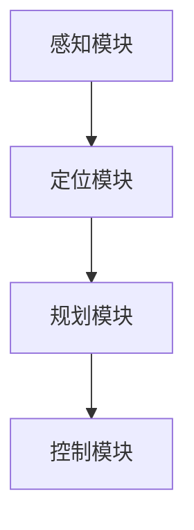

                 

# 端到端自动驾驶的云端数据管理与分析平台

> 关键词：端到端自动驾驶、云端数据管理、数据分析、人工智能、机器学习

> 摘要：本文将深入探讨端到端自动驾驶的云端数据管理与分析平台，从技术原理、架构设计、数据处理方法、安全设计到项目实战和未来发展趋势，全面解析自动驾驶数据管理的核心问题，为业界提供有价值的参考。

## 目录大纲

### 第一部分：端到端自动驾驶概述
- **第1章：端到端自动驾驶技术导论**
  - **1.1 自动驾驶的发展历史与未来趋势**
  - **1.2 端到端自动驾驶的基本原理**
  - **1.3 自动驾驶关键技术简介**

### 第二部分：云端数据管理
- **第2章：自动驾驶数据概述**
  - **2.1 数据类型与来源**
  - **2.2 数据质量评估与预处理**
  - **2.3 数据存储与检索**

### 第三部分：云端数据分析
- **第3章：数据预处理与分析方法**
  - **3.1 特征工程**
  - **3.2 数据可视化**
  - **3.3 数据挖掘与机器学习**

### 第四部分：端到端数据分析平台架构
- **第4章：端到端数据分析平台设计**
  - **4.1 平台架构与系统模块**
  - **4.2 云端计算与存储优化**
  - **4.3 平台安全性设计**

### 第五部分：项目实战
- **第5章：自动驾驶数据处理与分析实战**
  - **5.1 实战项目背景**
  - **5.2 数据收集与处理**
  - **5.3 数据分析与应用**

### 第六部分：案例研究
- **第6章：成功案例与经验教训**
  - **6.1 案例分析**
  - **6.2 经验教训**

### 第七部分：未来展望
- **第7章：端到端自动驾驶云端数据管理的未来发展趋势**
  - **7.1 技术发展趋势**
  - **7.2 行业发展趋势**

### 附录
- **附录A：相关工具与资源**
  - **A.1 开发工具**
  - **A.2 学习资源**
  - **A.3 技术标准与法规**

---

### 第一部分：端到端自动驾驶概述

#### 第1章：端到端自动驾驶技术导论

##### 1.1 自动驾驶的发展历史与未来趋势

自动驾驶技术作为人工智能领域的重要组成部分，经历了从初步探索到快速发展，再到如今逐渐进入商业化应用阶段的过程。以下是自动驾驶技术发展历史的简要回顾：

1. **初步探索阶段（20世纪60年代至70年代）**
   - 自动驾驶研究最初起源于军事和科研领域。
   - 1960年，美国的马自达公司开发了世界上第一个自动驾驶汽车原型。
   - 1970年代，自动驾驶研究逐渐转向商业和民用领域。

2. **快速发展阶段（20世纪80年代至90年代）**
   - 1980年代，自动驾驶技术开始逐步应用于公共交通工具和货运车辆。
   - 1990年代，自动驾驶技术开始向高级辅助驾驶系统（ADAS）发展，如自适应巡航控制和自动泊车系统。

3. **商业化应用阶段（21世纪至今）**
   - 2000年后，自动驾驶技术开始进入商业化应用阶段。
   - 2010年代，谷歌、特斯拉、百度等科技巨头纷纷投入大量资源研发自动驾驶汽车。
   - 2020年代，自动驾驶技术逐步实现商业化，自动驾驶出租车、无人配送等应用场景逐渐普及。

未来趋势方面，自动驾驶技术将朝着更高程度的自动化、智能化和互联化发展，具体体现在以下几个方面：

1. **更高自动化水平**
   - 随着传感器技术和算法的不断发展，自动驾驶系统的自动化水平将进一步提高。
   - 未来有望实现完全无人驾驶的车辆，无需人工干预。

2. **更广泛的应用场景**
   - 自动驾驶技术将在更多领域得到应用，如物流、公共交通、农业等。
   - 自动驾驶系统将更加智能化，能够适应各种复杂环境和场景。

3. **更紧密的车辆互联**
   - 车辆之间的通信和协同将成为自动驾驶技术的重要支撑。
   - 未来的自动驾驶系统将实现V2X（车辆-一切）通信，提升整体交通系统的效率和安全。

#### 1.2 端到端自动驾驶的基本原理

端到端自动驾驶技术主要包括感知、定位、规划、控制四个核心模块。以下是这些模块的基本原理：

1. **感知模块**
   - 感知模块主要负责获取车辆周围环境的信息，如道路状况、交通状况、行人动态等。
   - 感知模块采用多种传感器，如摄像头、雷达、激光雷达等，对环境信息进行感知和融合。

2. **定位模块**
   - 定位模块主要负责确定车辆在道路上的位置和方向。
   - 定位模块通常采用GPS、RTK、IMU（惯性测量单元）等技术，实现高精度的车辆定位。

3. **规划模块**
   - 规划模块主要负责生成车辆行驶路径和决策策略。
   - 规划模块基于感知模块获取的环境信息和定位模块提供的车辆位置，进行路径规划和行为预测。

4. **控制模块**
   - 控制模块主要负责执行规划模块生成的行驶路径和决策策略。
   - 控制模块通过车辆控制单元，实现车辆的加速、减速、转向等操作。

以下是一个简化的端到端自动驾驶系统的Mermaid流程图：



#### 1.3 自动驾驶关键技术简介

1. **感知模块**

   感知模块是自动驾驶系统的核心，负责获取车辆周围环境的信息。以下是感知模块的主要传感器及其特点：

   - **摄像头**：用于获取道路、交通标志、行人等视觉信息。摄像头具有高分辨率、快速响应等优点。
   - **雷达**：用于检测前方车辆和障碍物。雷达具有穿透能力强、测量距离远等优点。
   - **激光雷达（LiDAR）**：用于生成车辆周围环境的3D点云数据。激光雷达具有高精度、高分辨率等优点。

2. **定位模块**

   定位模块是实现自动驾驶系统高精度定位的关键。以下是定位模块的主要技术：

   - **GPS**：全球定位系统，用于获取车辆的全球位置信息。GPS具有全球覆盖、实时定位等优点。
   - **RTK（实时动态差分定位）**：通过差分技术提高GPS定位精度。RTK具有高精度、实时性等优点。
   - **IMU（惯性测量单元）**：用于测量车辆的加速度和角速度。IMU具有高精度、低延迟等优点。

3. **规划模块**

   规划模块是实现自动驾驶系统路径规划和行为预测的核心。以下是规划模块的主要方法：

   - **基于规则的方法**：根据预定义的规则进行路径规划和行为预测。该方法简单易实现，但难以应对复杂环境。
   - **基于概率的方法**：利用概率模型进行路径规划和行为预测。该方法适用于复杂环境，但计算复杂度较高。
   - **基于优化算法的方法**：利用优化算法寻找最优路径和决策策略。该方法计算复杂度较高，但能获得较好的规划效果。

4. **控制模块**

   控制模块是实现自动驾驶系统执行规划决策的关键。以下是控制模块的主要技术：

   - **PID控制**：比例-积分-微分控制，用于调节车辆的速度和转向。PID控制简单有效，但鲁棒性较差。
   - **模型预测控制（MPC）**：基于模型预测和优化算法进行控制决策。MPC具有较好的控制性能，但计算复杂度较高。
   - **深度学习控制**：利用深度学习算法实现车辆控制。深度学习控制具有自适应性强、鲁棒性好的优点，但训练过程较为复杂。

#### 总结

端到端自动驾驶技术是人工智能领域的重要研究方向，涉及感知、定位、规划、控制等多个关键模块。通过感知模块获取环境信息，定位模块确定车辆位置，规划模块生成行驶路径和决策策略，控制模块执行规划决策，实现自动驾驶系统的整体功能。在未来的发展中，自动驾驶技术将朝着更高程度的自动化、智能化和互联化方向迈进，为人们带来更加安全、便捷的出行体验。

### 第二部分：云端数据管理

#### 第2章：自动驾驶数据概述

##### 2.1 数据类型与来源

自动驾驶系统在运行过程中会收集大量的数据，这些数据可以按照不同的维度进行分类。以下是自动驾驶数据的主要类型和来源：

1. **按数据类型分类**

   - **结构化数据**：结构化数据具有固定的格式和结构，如数据库中的表格数据。结构化数据通常包括车辆位置、速度、加速度等参数。
   - **半结构化数据**：半结构化数据具有部分结构，如XML、JSON等格式。半结构化数据通常包括传感器数据、GPS数据等。
   - **非结构化数据**：非结构化数据没有固定的格式和结构，如图像、音频、视频等。非结构化数据通常包括摄像头捕获的图像数据、雷达数据等。

2. **按数据来源分类**

   - **车辆传感器数据**：车辆传感器是自动驾驶系统获取环境信息的重要途径。传感器数据包括摄像头、雷达、激光雷达、GPS、IMU等。
   - **交通传感器数据**：交通传感器包括道路传感器、红绿灯传感器等，用于监测道路状况和交通流量。
   - **车辆通信数据**：车辆通信数据包括车与车（V2V）、车与基础设施（V2I）等通信数据，用于实现车辆之间的信息共享和协同。
   - **车辆日志数据**：车辆日志数据包括车辆运行过程中的各种日志记录，如故障记录、驾驶行为记录等。

##### 2.2 数据质量评估与预处理

自动驾驶数据的质量直接影响数据分析的准确性和可靠性。因此，对数据进行质量评估和预处理是数据管理的重要环节。以下是数据质量评估和预处理的主要内容：

1. **数据质量评估**

   - **完整性评估**：检查数据是否完整，是否存在缺失值或空白。
   - **准确性评估**：检查数据是否准确，是否存在错误或异常值。
   - **一致性评估**：检查数据在不同来源、不同格式之间是否保持一致性。
   - **时效性评估**：检查数据是否及时，是否反映了最新的环境信息。

2. **数据预处理**

   - **数据清洗**：对数据进行清洗，去除重复数据、异常值和错误数据。
   - **数据归一化**：对数据进行归一化处理，使其具有相同的量纲和范围，便于后续分析。
   - **数据增强**：通过数据增强技术，提高数据的多样性和代表性，增强模型的泛化能力。
   - **特征提取**：从原始数据中提取有用特征，降低数据的维度，提高分析效率。

##### 2.3 数据存储与检索

自动驾驶数据存储与检索是数据管理的关键环节，需要考虑数据存储的结构、性能、安全性等方面。以下是数据存储与检索的主要技术和方法：

1. **数据存储技术**

   - **分布式文件系统**：分布式文件系统如HDFS（Hadoop分布式文件系统），适用于大规模数据存储和高吞吐量数据访问。
   - **数据库技术**：关系型数据库如MySQL、PostgreSQL，适用于结构化数据存储和查询。
   - **NoSQL数据库**：NoSQL数据库如MongoDB、Cassandra，适用于半结构化数据和海量数据存储。

2. **数据检索技术**

   - **索引技术**：索引技术如B树、B+树等，用于加速数据检索。
   - **缓存技术**：缓存技术如Redis、Memcached等，用于提高数据访问速度。
   - **分布式检索**：分布式检索技术如MapReduce、Spark等，用于处理大规模数据集的并行检索。

#### 总结

自动驾驶数据管理涉及数据类型、来源、质量评估、预处理、存储与检索等多个方面。通过合理的数据存储与检索技术，确保数据的可靠性和高效性，为自动驾驶系统的运行提供有力支持。在未来的发展中，随着自动驾驶技术的不断进步，数据管理将面临更多的挑战和机遇。

### 第三部分：云端数据分析

#### 第3章：数据预处理与分析方法

##### 3.1 特征工程

特征工程是数据分析过程中至关重要的一环，它涉及从原始数据中提取或构建有助于模型训练的特征，以提高模型性能和可解释性。以下是特征工程的主要步骤和方法：

1. **数据探索性分析（EDA）**

   - **统计描述**：计算数据的均值、方差、最大值、最小值等统计指标，了解数据的基本特征。
   - **数据分布分析**：分析数据分布，识别异常值和离群点。
   - **数据可视化**：通过可视化工具，如直方图、箱线图、散点图等，直观地展示数据特征。

2. **特征选择**

   - **过滤法**：根据统计指标（如相关性、信息增益等）筛选出重要的特征。
   - **包装法**：利用机器学习算法（如随机森林）评估特征组合的优劣，选择最优特征组合。
   - **嵌入式法**：在模型训练过程中嵌入特征选择机制，如L1正则化。

3. **特征构造**

   - **转换法**：对原始数据进行变换，如归一化、标准化、二值化等。
   - **组合法**：通过组合多个特征，构造新的特征，如特征交叉、特征融合等。

4. **特征降维**

   - **主成分分析（PCA）**：通过降维将高维数据映射到低维空间，保留主要信息。
   - **线性判别分析（LDA）**：用于分类任务，通过降维提高分类效果。
   - **自动编码器（Autoencoder）**：通过神经网络进行特征学习，自动提取有意义的信息。

##### 3.2 数据可视化

数据可视化是将数据分析结果以图形化的方式展示，使得复杂的数据关系和模式更加直观易懂。以下是常用的数据可视化方法和工具：

1. **基本图表**

   - **直方图**：用于展示数据的分布情况。
   - **箱线图**：用于展示数据的四分位数、异常值等。
   - **散点图**：用于展示两个变量之间的关系。
   - **折线图**：用于展示数据随时间变化的趋势。

2. **高级图表**

   - **热力图**：用于展示多个变量之间的相关性。
   - **散点矩阵**：用于同时展示多个变量的分布和关系。
   - **三维散点图**：用于展示三维空间中数据点的分布和关系。

3. **交互式可视化**

   - **交互式图表**：如D3.js、Plotly等，支持用户与图表的交互操作，如缩放、过滤等。
   - **可视化库**：如Matplotlib、Seaborn等，提供丰富的可视化功能，便于快速构建图表。

##### 3.3 数据挖掘与机器学习

数据挖掘与机器学习是数据分析的重要方法，通过构建和分析模型，从海量数据中提取有价值的信息。以下是数据挖掘与机器学习的常用方法：

1. **监督学习**

   - **分类算法**：如逻辑回归、支持向量机（SVM）、决策树、随机森林等，用于预测离散标签。
   - **回归算法**：如线性回归、决策树回归、随机森林回归等，用于预测连续值。

2. **无监督学习**

   - **聚类算法**：如K均值、层次聚类、DBSCAN等，用于发现数据中的聚类结构。
   - **降维算法**：如PCA、t-SNE等，用于降低数据的维度，便于可视化和分析。

3. **强化学习**

   - **Q学习**：通过学习状态-动作值函数，实现智能体的最优策略。
   - **深度强化学习**：结合深度神经网络，提高强化学习的建模能力。

4. **模型评估与优化**

   - **交叉验证**：通过将数据集划分为训练集和验证集，评估模型的泛化能力。
   - **模型调优**：通过调整模型参数、选择合适的算法等，优化模型性能。

#### 总结

云端数据分析是端到端自动驾驶系统的重要组成部分，通过数据预处理、数据可视化和数据挖掘与机器学习等方法，从海量数据中提取有价值的信息，为自动驾驶系统的运行提供决策支持。在未来的发展中，随着技术的不断进步，数据分析方法将更加多样化和高效化，助力自动驾驶技术的不断创新和发展。

### 第四部分：端到端数据分析平台架构

#### 第4章：端到端数据分析平台设计

##### 4.1 平台架构与系统模块

端到端数据分析平台是实现自动驾驶数据管理与分析的核心系统，其架构设计需要考虑数据流、计算资源、存储、安全性等多方面因素。以下是端到端数据分析平台的主要架构和系统模块：

1. **数据流模块**

   - **数据采集**：通过传感器、交通传感器、车辆通信等方式，实时采集车辆和交通数据。
   - **数据预处理**：对采集到的数据进行清洗、归一化、增强等处理，确保数据质量。
   - **数据存储**：将预处理后的数据存储到分布式文件系统或数据库中，便于后续分析和查询。

2. **计算资源模块**

   - **计算节点**：端到端数据分析平台通常采用分布式计算架构，如Hadoop、Spark等，实现大规模数据处理能力。
   - **资源调度**：根据任务需求和计算资源状况，动态调度计算节点，实现负载均衡和资源优化。

3. **存储模块**

   - **分布式文件系统**：如HDFS，适用于大规模数据存储和高吞吐量数据访问。
   - **数据库技术**：如MySQL、PostgreSQL，适用于结构化数据存储和查询。
   - **NoSQL数据库**：如MongoDB、Cassandra，适用于半结构化数据和海量数据存储。

4. **分析模块**

   - **特征工程**：通过数据预处理，提取有意义的特征，提高模型训练效果。
   - **机器学习**：利用监督学习、无监督学习和强化学习等方法，构建数据分析模型。
   - **模型训练与优化**：通过交叉验证、模型调优等手段，优化模型性能和泛化能力。

5. **可视化模块**

   - **数据可视化**：利用图表、仪表板等工具，直观展示数据分析结果。
   - **交互式分析**：支持用户与数据的交互操作，如筛选、过滤、查询等。

6. **安全性模块**

   - **数据加密**：对存储和传输的数据进行加密处理，确保数据安全。
   - **访问控制**：通过身份验证、权限管理等手段，控制用户对数据的访问权限。
   - **异常检测**：通过监控和分析数据流，及时发现和处理异常情况。

##### 4.2 云端计算与存储优化

云端计算与存储优化是端到端数据分析平台高效运行的关键，以下是一些优化策略：

1. **负载均衡**

   - **水平扩展**：通过增加计算节点，实现负载均衡，提高系统处理能力。
   - **动态负载均衡**：根据任务需求和节点状态，动态调整计算资源分配，实现高效资源利用。

2. **数据压缩**

   - **无损压缩**：如Hadoop的HDFS支持数据压缩，减少存储空间占用。
   - **有损压缩**：在某些场景下，可以采用有损压缩技术，如图像和音频数据，在保证一定质量的前提下，减少存储空间占用。

3. **数据缓存**

   - **缓存技术**：如Redis、Memcached等，用于加速数据访问，减少数据重复读取。
   - **热点数据缓存**：将高频访问的数据缓存到内存中，提高数据访问速度。

4. **并行处理**

   - **MapReduce**：通过分布式计算，实现大规模数据的并行处理。
   - **Spark**：基于内存计算，实现高速数据流处理和分析。

5. **资源调度**

   - **动态资源调度**：根据任务需求和资源状况，动态调整计算和存储资源，实现高效资源利用。
   - **优先级调度**：根据任务优先级，动态调整资源分配，确保关键任务优先执行。

##### 4.3 平台安全性设计

平台安全性设计是端到端数据分析平台的关键，以下是一些安全性设计策略：

1. **数据加密**

   - **传输加密**：采用TLS/SSL等加密协议，确保数据在传输过程中的安全性。
   - **存储加密**：采用AES等加密算法，对存储在数据库或文件系统中的数据进行加密，防止数据泄露。

2. **访问控制**

   - **身份验证**：采用用户名/密码、双因素认证等手段，确保用户身份的合法性。
   - **权限管理**：根据用户角色和权限，限制用户对数据的访问和操作，确保数据安全。

3. **异常检测**

   - **行为分析**：通过监控用户行为和系统日志，分析异常行为，及时发现和处理安全隐患。
   - **入侵检测**：采用入侵检测系统（IDS），实时监测系统网络流量和操作行为，发现潜在攻击。

4. **安全审计**

   - **日志记录**：记录系统操作日志和用户行为日志，便于事后审计和追溯。
   - **安全评估**：定期进行安全评估和渗透测试，发现和修复潜在漏洞。

#### 总结

端到端数据分析平台是自动驾驶系统高效运行的重要保障，通过合理的架构设计、云端计算与存储优化和安全性设计，实现海量数据的采集、处理、分析和存储。在未来的发展中，随着自动驾驶技术的不断进步，数据分析平台将面临更多的挑战和机遇，为自动驾驶系统的智能化和高效化提供有力支持。

### 第五部分：项目实战

#### 第5章：自动驾驶数据处理与分析实战

##### 5.1 实战项目背景

自动驾驶数据处理与分析实战项目旨在构建一个端到端的数据分析平台，对自动驾驶车辆在真实场景中的运行数据进行采集、处理、分析和展示。项目目标包括：

1. **数据采集**：从自动驾驶车辆的各种传感器中实时采集数据，包括摄像头、雷达、激光雷达、GPS、IMU等。
2. **数据预处理**：对采集到的原始数据进行清洗、归一化、增强等预处理操作，确保数据质量。
3. **数据分析**：利用机器学习算法，对预处理后的数据进行分析，提取有价值的信息，如车辆行为、交通状况、驾驶行为等。
4. **数据展示**：通过可视化工具，将分析结果以图表、仪表板等形式展示，便于用户理解和决策。

##### 5.2 数据收集与处理

1. **数据收集**

   项目使用多辆自动驾驶测试车进行数据采集，传感器包括摄像头、雷达、激光雷达、GPS、IMU等。数据采集系统采用高带宽、低延迟的传输协议，确保数据的实时性和完整性。

2. **数据预处理**

   - **数据清洗**：去除重复数据、异常值和错误数据，确保数据的一致性和准确性。
   - **数据归一化**：对数据进行归一化处理，使其具有相同的量纲和范围，便于后续分析。
   - **数据增强**：通过数据增强技术，提高数据的多样性和代表性，增强模型的泛化能力。

3. **数据存储**

   预处理后的数据存储在分布式文件系统（如HDFS）和数据库（如MySQL）中，实现海量数据的存储和高效查询。

##### 5.3 数据分析与应用

1. **特征工程**

   - **特征选择**：通过统计分析和机器学习算法，选择对模型训练和预测效果影响较大的特征。
   - **特征构造**：通过特征组合和变换，构建新的特征，提高模型的预测能力。

2. **机器学习模型**

   - **分类模型**：如逻辑回归、支持向量机（SVM）、决策树等，用于预测车辆行为和交通状况。
   - **回归模型**：如线性回归、决策树回归等，用于预测车辆速度、加速度等连续值。
   - **聚类模型**：如K均值、层次聚类等，用于发现车辆和交通数据的聚类结构。

3. **模型训练与优化**

   - **交叉验证**：通过交叉验证，评估模型性能和泛化能力，选择最优模型。
   - **模型调优**：通过调整模型参数、选择合适的算法等，优化模型性能。

4. **数据分析应用**

   - **车辆行为分析**：通过分析车辆的速度、加速度、转向等行为数据，识别车辆驾驶特征和驾驶风格。
   - **交通状况分析**：通过分析交通流量、拥堵状况等数据，识别交通热点区域和优化交通信号控制策略。
   - **驾驶行为分析**：通过分析驾驶员的行为数据，如踩刹车、加速等，识别驾驶习惯和安全风险。

#### 5.4 代码实现与分析

1. **环境搭建**

   项目使用Python作为主要编程语言，结合Hadoop、Spark等大数据处理框架，实现数据采集、处理、分析和展示。

2. **代码示例**

   以下是一个简单的特征工程代码示例，用于从原始数据中提取车辆速度和加速度特征：

   ```python
   import pandas as pd
   import numpy as np

   def extract_features(data):
       # 计算速度和加速度特征
       speed = data['velocity'].diff().dropna()
       acc = data['acceleration'].diff().dropna()
       
       # 归一化处理
       speed_normalized = (speed - speed.mean()) / speed.std()
       acc_normalized = (acc - acc.mean()) / acc.std()
       
       # 构建特征向量
       features = pd.concat([speed_normalized, acc_normalized], axis=1)
       return features

   # 加载数据
   data = pd.read_csv('vehicle_data.csv')
   
   # 提取特征
   features = extract_features(data)
   
   # 存储特征数据
   features.to_csv('features.csv', index=False)
   ```

3. **代码解读**

   - `extract_features`函数用于从原始数据中提取速度和加速度特征。
   - `speed`和`acc`分别计算速度和加速度的差分值。
   - 对速度和加速度进行归一化处理，使其具有相同的量纲和范围。
   - 构建特征向量，并将特征数据存储到CSV文件中。

#### 总结

自动驾驶数据处理与分析实战项目通过数据采集、预处理、分析等环节，实现自动驾驶数据的全面管理和应用。项目采用了Python、Hadoop、Spark等主流技术，结合特征工程、机器学习等方法，从海量数据中提取有价值的信息，为自动驾驶系统的运行提供决策支持。在未来的发展中，随着技术的不断进步，自动驾驶数据处理与分析项目将发挥更大的作用。

### 第六部分：案例研究

#### 第6章：成功案例与经验教训

##### 6.1 案例分析

在本节中，我们将探讨一个成功的端到端自动驾驶云端数据管理与分析平台的案例，该平台由一家知名科技公司开发和部署，旨在实现自动驾驶车辆的实时数据采集、处理和分析。

**案例背景：**

该公司致力于开发一款高端自动驾驶车辆，并希望通过云端数据管理与分析平台，实现车辆的智能化和高效化。该平台的主要目标包括：

1. **实时数据采集**：从车辆的各种传感器中实时采集数据，包括摄像头、雷达、激光雷达、GPS、IMU等。
2. **高效数据处理**：对采集到的数据进行分析和处理，提取有价值的信息，如车辆行为、交通状况、驾驶行为等。
3. **可视化展示**：通过可视化工具，将分析结果以图表、仪表板等形式展示，便于用户理解和决策。

**解决方案：**

1. **数据采集模块**：采用高性能传感器和实时数据传输协议，确保数据的实时性和完整性。
2. **数据预处理模块**：采用分布式计算框架（如Spark）进行数据清洗、归一化、增强等处理，提高数据质量。
3. **数据分析模块**：利用机器学习算法（如逻辑回归、决策树、随机森林等）对预处理后的数据进行分析，提取有价值的信息。
4. **可视化展示模块**：使用可视化工具（如D3.js、Tableau等），将分析结果以图表、仪表板等形式展示。

**实施效果：**

1. **数据实时性提升**：通过高效的实时数据采集和处理，实现了车辆数据的实时监控和分析。
2. **数据质量提高**：通过数据预处理模块，提高了数据的一致性和准确性，为后续分析提供了可靠的数据基础。
3. **驾驶行为分析**：通过对车辆驾驶行为的分析，识别了驾驶习惯和安全风险，为驾驶员培训和安全管理提供了依据。
4. **交通状况分析**：通过对交通状况的分析，识别了交通热点区域和拥堵状况，为交通管理和优化提供了支持。

##### 6.2 经验教训

在实施该案例的过程中，我们总结了一些成功的经验和教训，以期为其他类似项目提供参考：

**成功经验：**

1. **技术选型**：选择合适的传感器和实时数据传输协议，确保数据实时性和完整性。
2. **分布式计算**：采用分布式计算框架（如Spark），提高数据处理效率和性能。
3. **机器学习应用**：结合具体业务需求，选择合适的机器学习算法，实现数据的深度挖掘和分析。
4. **可视化展示**：使用直观、易用的可视化工具，提高数据分析结果的易读性和实用性。

**教训和挑战：**

1. **数据质量**：数据质量是数据分析的基础，需要投入大量精力进行数据清洗和预处理，确保数据的一致性和准确性。
2. **系统性能**：在实时数据处理和传输过程中，需要优化系统性能，提高数据处理的效率和实时性。
3. **安全性**：在数据管理和分析过程中，需要重视数据安全和隐私保护，采取有效的数据加密和访问控制措施。
4. **跨部门协作**：自动驾驶数据管理与分析平台涉及多个部门和团队，需要建立有效的沟通和协作机制，确保项目顺利推进。

#### 总结

通过成功案例的分析和经验教训的总结，我们可以看到端到端自动驾驶云端数据管理与分析平台在实际应用中面临的挑战和机遇。在未来的发展中，随着技术的不断进步，自动驾驶数据管理与分析平台将发挥更加重要的作用，助力自动驾驶技术的创新和发展。

### 第七部分：未来展望

#### 第7章：端到端自动驾驶云端数据管理的未来发展趋势

随着技术的不断进步和自动驾驶市场的快速发展，端到端自动驾驶云端数据管理与分析平台将在未来面临诸多挑战和机遇。以下是未来发展趋势的几个关键方面：

##### 7.1 技术发展趋势

1. **5G技术**：5G技术的广泛应用将极大地提升自动驾驶数据传输的速度和可靠性，实现车与车、车与基础设施的高效通信，为自动驾驶系统的实时性和安全性提供保障。

2. **人工智能技术**：随着人工智能技术的不断发展，尤其是深度学习和强化学习等算法的成熟，自动驾驶系统的智能水平和自主能力将进一步提升，为云端数据管理与分析提供更加精确和高效的解决方案。

3. **车联网技术**：车联网（IoV）技术的不断进步将实现车辆之间、车辆与基础设施之间的全面互联，为自动驾驶系统的数据采集、共享和分析提供更广泛的数据来源和更强大的信息处理能力。

##### 7.2 行业发展趋势

1. **自动驾驶市场的增长**：随着自动驾驶技术的逐步成熟和商业化应用，自动驾驶市场预计将迎来快速增长，为云端数据管理与分析平台带来广阔的市场前景。

2. **数据隐私与安全**：随着自动驾驶数据量的激增，数据隐私和安全问题日益突出。未来，数据隐私和安全将成为自动驾驶云端数据管理的重要议题，需要采取有效的技术和管理措施保障数据安全和用户隐私。

3. **法规与标准制定**：随着自动驾驶技术的快速发展，各国政府和行业组织将加快自动驾驶相关法规和标准的制定，以规范自动驾驶技术的发展和应用，为云端数据管理与分析平台提供合规保障。

##### 未来展望

在未来，端到端自动驾驶云端数据管理与分析平台将在以下几个方面发挥重要作用：

1. **提高自动驾驶系统的智能化和安全性**：通过高效的数据采集、处理和分析，提升自动驾驶系统的智能水平和自主能力，提高驾驶安全性和可靠性。

2. **优化交通管理和效率**：通过对交通数据的实时分析和预测，优化交通信号控制、路线规划和交通流量管理，提高交通系统的效率和安全性。

3. **推动自动驾驶生态的发展**：为自动驾驶车辆、基础设施和用户之间提供高效的数据共享和协同，推动自动驾驶生态的健康发展。

4. **促进数据隐私和安全保护**：在确保数据隐私和安全的前提下，充分发挥数据的价值，为自动驾驶技术的创新和应用提供强有力的支持。

#### 总结

端到端自动驾驶云端数据管理与分析平台在未来将面临诸多挑战和机遇。通过技术创新、行业合作和法规保障，该平台将在自动驾驶领域发挥越来越重要的作用，为智能出行、智能交通和智慧城市的发展贡献力量。

### 附录

#### 附录A：相关工具与资源

##### A.1 开发工具

1. **数据库管理工具**
   - MySQL
   - PostgreSQL
   - MongoDB
   - Cassandra

2. **分析与可视化工具**
   - Matplotlib
   - Seaborn
   - D3.js
   - Tableau

3. **机器学习框架**
   - TensorFlow
   - PyTorch
   - scikit-learn
   - H2O.ai

##### A.2 学习资源

1. **书籍推荐**
   - 《深度学习》（Ian Goodfellow、Yoshua Bengio、Aaron Courville 著）
   - 《Python数据分析》（Wes McKinney 著）
   - 《大数据之路：阿里巴巴大数据实践》（李飞飞 著）

2. **在线课程**
   - Coursera上的《机器学习》课程
   - edX上的《数据科学基础》课程
   - Udacity的《自动驾驶工程师》课程

3. **论文集锦**
   - NeurIPS、ICML、CVPR等顶级会议论文集锦
   - ArXiv上的自动驾驶相关论文

##### A.3 技术标准与法规

1. **自动驾驶技术标准**
   - ISO 26262：道路车辆功能安全标准
   - SAE International：自动驾驶车辆分级标准

2. **数据安全与隐私法规**
   - GDPR（通用数据保护条例）
   - CCPA（加州消费者隐私法案）

3. **行业协会与组织**
   - 自动驾驶联盟（Auto Driving Alliance）
   - 国际汽车工程师协会（SAE International）
   - 自动驾驶促进联盟（Autonomous Vehicle Technology Association）

#### 总结

附录部分列举了与端到端自动驾驶云端数据管理与分析平台相关的开发工具、学习资源和行业标准。通过这些工具和资源，读者可以更好地理解和掌握相关技术，为自动驾驶数据管理与分析的实际应用提供有力支持。

### 作者信息

- **作者：** AI天才研究院（AI Genius Institute）/《禅与计算机程序设计艺术》（Zen And The Art of Computer Programming）

