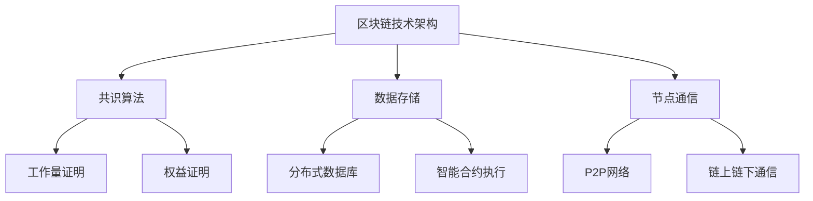

                 

# 《端到端自动驾驶的区块链应用场景》

> 关键词：自动驾驶、区块链、端到端、车辆身份认证、数据隐私、智能合约、交易与结算、安全与隐私保护、案例分析

> 摘要：本文深入探讨了端到端自动驾驶系统中区块链技术的应用场景，从车辆身份认证、数据隐私保护、智能合约、交易与结算、安全与隐私保护等方面进行了详细分析，并通过实际案例展示了区块链技术在自动驾驶领域的应用潜力。

## 引言

自动驾驶技术作为人工智能的重要分支，近年来得到了广泛关注和快速发展。从辅助驾驶到完全自动驾驶，自动驾驶技术正逐步改变我们的出行方式，为人们带来便利和安全。然而，随着自动驾驶技术的应用日益广泛，数据隐私、安全等问题也逐渐凸显出来。区块链技术的出现，为解决这些问题提供了一种新的思路。本文将围绕端到端自动驾驶系统，探讨区块链技术的应用场景，旨在为自动驾驶领域的研发和从业者提供一些参考和启示。

## 第一部分：自动驾驶与区块链技术基础

### 第1章：自动驾驶技术概述

#### 1.1 自动驾驶的起源与发展历程

自动驾驶技术起源于20世纪50年代，当时美国军方开始研究无人驾驶车辆。随着计算机技术、传感器技术、通信技术的不断发展，自动驾驶技术逐渐从实验室走向实际应用。20世纪80年代，美国卡内基梅隆大学和日本丰田汽车公司等机构和企业相继开展了自动驾驶车辆的研发。进入21世纪，自动驾驶技术迎来了快速发展，特斯拉、百度、谷歌等企业纷纷推出自动驾驶汽车，并在实际道路上进行测试和运营。

#### 1.2 自动驾驶技术的分类

根据自动驾驶程度的不同，自动驾驶技术可以分为以下几类：

1. 辅助驾驶：通过传感器、摄像头等设备为驾驶员提供辅助，如自适应巡航控制、自动泊车等。
2. 有条件自动驾驶：在特定环境和条件下，可以完全接管车辆控制，但需要驾驶员在必要时进行干预，如高速公路自动驾驶、城市自动驾驶等。
3. 高度自动驾驶：在大多数环境和条件下，可以完全接管车辆控制，但需要少量人工干预，如自动驾驶出租车、自动驾驶货车等。
4. 完全自动驾驶：在任何环境和条件下，无需人工干预，能够自主完成驾驶任务。

#### 1.3 自动驾驶技术架构

自动驾驶技术架构通常包括以下几个主要部分：

1. 感知系统：通过摄像头、激光雷达、超声波传感器等设备，感知周围环境。
2. 算法系统：利用感知系统收集的数据，进行环境建模、目标检测、路径规划等处理。
3. 控制系统：根据算法系统生成的控制指令，控制车辆的运动。
4. 通信系统：与其他车辆、基础设施等进行信息交互。

#### 1.4 自动驾驶技术的挑战与前景

自动驾驶技术的挑战主要包括：环境复杂多变、传感器数据噪声大、算法鲁棒性要求高、安全与隐私问题等。然而，随着技术的不断进步，自动驾驶技术有望在未来实现商业化应用，为人们的出行带来革命性的改变。

### 第2章：区块链技术基础

#### 2.1 区块链的定义与特点

区块链是一种分布式数据库技术，通过密码学原理保证数据的安全和可信。区块链具有以下特点：

1. 去中心化：区块链没有中央控制机构，数据由全网节点共同维护。
2. 安全性：区块链采用密码学算法，确保数据无法被篡改。
3. 可信性：区块链上的数据具有不可篡改性和可追溯性。
4. 去信任：区块链通过算法和数据验证，取代了传统中心化的信任机制。

#### 2.2 区块链的核心概念

区块链的核心概念包括：

1. 区块：区块链的基本单位，包含一定数量交易记录。
2. 链表：由多个区块按照时间顺序链接而成。
3. 智能合约：区块链上的自动化执行合约，根据预设条件自动执行。
4. 节点：参与区块链网络维护的计算机设备。

#### 2.3 区块链的技术架构

区块链的技术架构包括以下几个主要部分：

1. 共识算法：确保区块链网络中的节点对数据的共识。
2. 数据存储：将交易记录、区块等数据存储在区块链上。
3. 节点通信：节点之间通过P2P网络进行通信。
4. 智能合约执行：在区块链上执行智能合约。

#### 2.4 区块链的应用领域

区块链技术的应用领域广泛，包括：

1. 金融领域：比特币、以太坊等数字货币。
2. 物流领域：供应链管理、物流信息追踪等。
3. 医疗领域：电子病历管理、医学研究数据共享等。
4. 其他领域：物联网、版权保护、身份验证等。

### 第3章：自动驾驶与区块链的融合

#### 3.1 自动驾驶与区块链的关联

自动驾驶系统需要处理大量数据，包括车辆状态、环境信息、传感器数据等。区块链技术可以为自动驾驶系统提供数据安全、隐私保护、可信验证等功能。同时，自动驾驶技术的发展也为区块链提供了实际应用场景，如车辆身份认证、智能合约执行、交易与结算等。

#### 3.2 自动驾驶中的数据隐私与安全

自动驾驶系统涉及大量敏感数据，如车辆位置、行驶轨迹、驾驶员信息等。区块链技术可以通过加密算法、智能合约等技术手段，确保数据的安全性和隐私性。此外，区块链的去中心化特性，也有助于提高系统的安全性。

#### 3.3 区块链在自动驾驶中的应用场景

区块链在自动驾驶中的应用场景主要包括：

1. 车辆身份认证：确保车辆身份的真实性和唯一性。
2. 数据隐私保护：保护自动驾驶过程中的敏感数据。
3. 智能合约：实现自动驾驶过程中的自动化执行。
4. 交易与结算：简化自动驾驶中的支付和收费流程。
5. 安全与隐私保护：提高自动驾驶系统的整体安全性。

#### 3.4 自动驾驶与区块链的技术挑战

自动驾驶与区块链技术的融合面临以下技术挑战：

1. 数据处理能力：区块链网络的处理能力相对有限，难以满足自动驾驶系统对大规模数据处理的实时性要求。
2. 智能合约安全：智能合约存在漏洞和风险，可能导致数据泄露和欺诈行为。
3. 节点同步：区块链网络中的节点需要同步大量数据，对网络带宽和存储空间有较高要求。
4. 隐私保护：如何在保护隐私的同时，实现数据的可信共享和访问。

## 第二部分：端到端自动驾驶的区块链应用

### 第4章：车辆身份认证与数据隐私保护

#### 4.1 车辆身份认证

车辆身份认证是自动驾驶系统的重要环节，确保车辆身份的真实性和唯一性。区块链技术可以通过加密算法和智能合约，实现车辆身份的认证。具体实现过程如下：

1. 车辆注册：车辆制造商将车辆信息（如车辆ID、制造商信息等）上传至区块链网络，进行注册。
2. 身份验证：车辆在启动时，通过区块链网络查询车辆身份信息，验证车辆身份。
3. 智能合约执行：验证通过后，智能合约自动执行，允许车辆加入自动驾驶系统。

#### 4.2 数据隐私保护机制

自动驾驶系统涉及大量敏感数据，如车辆位置、行驶轨迹、驾驶员信息等。区块链技术可以通过以下机制实现数据隐私保护：

1. 数据加密：对敏感数据采用加密算法进行加密，确保数据在传输和存储过程中安全。
2. 智能合约：通过智能合约，实现数据的授权访问和权限控制。
3. 隐私计算：利用区块链的分布式特性，实现数据的隐私计算和共享。

#### 4.3 区块链在车辆身份认证与数据隐私保护中的应用

区块链在车辆身份认证与数据隐私保护中的应用案例包括：

1. 车辆共享平台：通过区块链技术，实现车辆身份认证和数据隐私保护，提高共享经济的效率和安全性。
2. 物流管理：通过区块链技术，实现物流信息的可信记录和隐私保护，提高物流行业的透明度和效率。

#### 4.4 案例分析：基于区块链的车辆身份认证系统

以特斯拉为例，特斯拉采用区块链技术实现车辆身份认证和数据隐私保护。具体实现过程如下：

1. 车辆注册：特斯拉将车辆信息上传至区块链网络，进行注册。
2. 身份验证：特斯拉车辆在启动时，通过区块链网络查询车辆身份信息，验证车辆身份。
3. 数据加密：特斯拉车辆采用加密算法，对敏感数据进行加密，确保数据在传输和存储过程中安全。
4. 智能合约执行：特斯拉车辆与自动驾驶系统之间的交互，通过智能合约自动执行，确保数据的安全和隐私。

### 第5章：车联网的区块链应用

#### 5.1 车联网概述

车联网（V2X，Vehicle-to-Everything）是指车辆与其他设备、基础设施、网络等进行信息交换和通信的技术。车联网技术旨在提高道路安全、交通效率、环保性能等。车联网的主要组成部分包括：

1. 车辆终端：包括车载传感器、通信设备等，负责感知车辆状态和环境信息。
2. 通信网络：包括无线通信网络、有线通信网络等，负责传输车辆信息。
3. 云计算中心：负责处理和分析车辆信息，提供智能化服务。

#### 5.2 车联网的区块链架构设计

车联网的区块链架构设计主要包括以下几个部分：

1. 车辆身份认证：通过区块链技术实现车辆身份的认证和唯一标识。
2. 数据隐私保护：通过区块链技术实现车辆数据的加密、隐私计算和共享。
3. 智能合约执行：通过智能合约实现车联网服务的自动化执行和交易结算。
4. 跨界协作：通过区块链技术实现不同行业、不同企业之间的数据共享和协作。

#### 5.3 车联网中的数据共享与安全

车联网中的数据共享与安全是车联网技术的重要挑战之一。区块链技术可以通过以下方式实现数据共享与安全：

1. 数据加密：对共享数据进行加密，确保数据在传输和存储过程中的安全性。
2. 隐私计算：通过隐私计算技术，实现数据的隐私保护和共享。
3. 智能合约：通过智能合约实现数据的授权访问和权限控制。
4. 跨界协作：通过区块链技术实现不同企业、不同行业之间的数据共享和协作。

#### 5.4 案例分析：基于区块链的车联网数据共享平台

以阿里巴巴的ET城市大脑为例，ET城市大脑通过区块链技术实现车联网数据共享。具体实现过程如下：

1. 车辆数据上传：车辆将行驶数据上传至区块链网络，进行存储和备份。
2. 数据隐私保护：对上传的行驶数据进行加密，确保数据在传输和存储过程中的安全性。
3. 数据共享与协作：不同企业、不同行业之间的数据通过区块链网络进行共享和协作，实现跨界的智能化服务。
4. 智能合约执行：通过智能合约实现数据的授权访问和权限控制，确保数据共享的安全性和可控性。

### 第6章：智能合约在自动驾驶中的应用

#### 6.1 智能合约概述

智能合约是一种自动执行合约，基于区块链技术实现。智能合约在满足预设条件时，自动执行合约内容，无需人工干预。智能合约的特点包括：

1. 自动执行：智能合约在满足条件时，自动执行合约内容，无需人工干预。
2. 可信性：智能合约基于区块链技术，确保合约内容的不可篡改性和可追溯性。
3. 高效性：智能合约自动执行，降低交易成本，提高交易效率。

#### 6.2 智能合约的架构与实现

智能合约的架构主要包括以下几个部分：

1. 编程语言：智能合约采用特定编程语言编写，如Solidity、Vyper等。
2. 虚拟机：智能合约在区块链网络中的虚拟机（如EVM、BVM等）中执行。
3. 区块链网络：智能合约部署在区块链网络中，通过网络节点进行验证和执行。

智能合约的实现过程如下：

1. 合约编写：开发人员使用特定编程语言编写智能合约代码。
2. 合约编译：智能合约代码通过编译器编译为字节码。
3. 合约部署：将编译后的字节码上传至区块链网络，进行部署。
4. 合约执行：智能合约在满足条件时，自动执行合约内容。

#### 6.3 智能合约在自动驾驶中的场景应用

智能合约在自动驾驶中的应用场景包括：

1. 车辆租赁：通过智能合约实现自动驾驶车辆的租赁和支付流程。
2. 保险理赔：通过智能合约实现自动驾驶车辆的事故理赔流程。
3. 车辆维修：通过智能合约实现自动驾驶车辆的维修和支付流程。

#### 6.4 案例分析：基于智能合约的自动驾驶车辆租赁系统

以特斯拉的自动驾驶车辆租赁系统为例，智能合约在其中的实现过程如下：

1. 车主与租户签订租赁合同：车主与租户通过智能合约签订租赁合同，合同内容包括租赁期限、租金、保险等。
2. 租金支付：租户通过智能合约支付租金，智能合约自动将租金转账至车主账户。
3. 车辆控制：租户通过智能合约控制车辆，实现驾驶、停车等操作。
4. 租赁结束：租赁合同到期后，智能合约自动解除车辆控制，并将车辆归还给车主。

### 第7章：自动驾驶的区块链交易与结算

#### 7.1 区块链交易概述

区块链交易是指通过区块链网络进行的数字资产转移和数据交互。区块链交易具有以下特点：

1. 安全性：区块链交易基于密码学原理，确保交易数据的不可篡改性和安全性。
2. 不可篡改性：区块链交易记录一旦生成，无法被篡改，确保交易的可靠性。
3. 可追溯性：区块链交易记录可追溯，确保交易数据的透明性和可审计性。

#### 7.2 区块链交易流程

区块链交易流程主要包括以下几个步骤：

1. 用户发起交易：用户通过区块链网络发起交易请求，包括交易金额、交易对象、交易信息等。
2. 交易验证：区块链网络中的节点对交易请求进行验证，确保交易数据的合法性和安全性。
3. 交易记录：验证通过后，交易数据记录在区块链上，形成交易记录。
4. 交易确认：交易记录经过多个区块确认后，交易完成。

#### 7.3 自动驾驶中的区块链交易应用

自动驾驶中的区块链交易应用主要包括以下几个方面：

1. 车辆租赁：通过区块链交易实现自动驾驶车辆的租赁和支付流程。
2. 保险理赔：通过区块链交易实现自动驾驶车辆的事故理赔流程。
3. 车辆维修：通过区块链交易实现自动驾驶车辆的维修和支付流程。

#### 7.4 案例分析：基于区块链的自动驾驶收费系统

以特斯拉的自动驾驶收费系统为例，区块链交易在其中的实现过程如下：

1. 车辆行驶数据上传：车辆在行驶过程中，将行驶数据上传至区块链网络，包括行驶里程、时间、位置等。
2. 收费计算：根据行驶数据，计算车辆应缴纳的费用，包括租赁费用、过路费等。
3. 收费请求：车辆向区块链网络发起收费请求，包括交易金额、交易对象、交易信息等。
4. 收费确认：区块链网络中的节点对收费请求进行验证，确保交易数据的合法性和安全性。
5. 费用支付：车辆通过区块链交易，向车主支付费用。

### 第8章：自动驾驶的区块链安全与隐私保护

#### 8.1 区块链安全概述

区块链安全是指确保区块链网络中的数据安全、隐私性和可靠性的技术手段。区块链安全主要包括以下几个方面：

1. 数据安全：防止数据被篡改、泄露和破坏。
2. 隐私保护：确保用户隐私和数据不被未经授权访问。
3. 网络安全：确保区块链网络的安全性，防止网络攻击和恶意行为。

#### 8.2 自动驾驶中的区块链安全挑战

自动驾驶中的区块链安全挑战主要包括：

1. 数据安全：自动驾驶系统涉及大量敏感数据，如车辆位置、行驶轨迹、驾驶员信息等，如何确保数据的安全是区块链安全面临的重要挑战。
2. 网络安全：区块链网络可能遭受网络攻击，如DDoS攻击、恶意节点等，如何确保区块链网络的安全性是区块链安全面临的挑战。
3. 智能合约安全：智能合约可能存在漏洞和风险，导致数据泄露和欺诈行为，如何确保智能合约的安全性是区块链安全面临的挑战。

#### 8.3 区块链隐私保护技术

区块链隐私保护技术主要包括以下几个方面：

1. 加密算法：通过加密算法对数据进行加密，确保数据在传输和存储过程中的安全性。
2. 零知识证明：通过零知识证明技术，实现数据的隐私保护和验证。
3. 隐私计算：通过隐私计算技术，实现数据的隐私保护和共享。
4. 去中心化身份验证：通过去中心化身份验证技术，实现用户隐私保护和访问控制。

#### 8.4 案例分析：基于区块链的自动驾驶隐私保护方案

以特斯拉为例，特斯拉采用区块链技术实现自动驾驶隐私保护。具体实现过程如下：

1. 数据加密：特斯拉车辆在行驶过程中，对敏感数据（如车辆位置、行驶轨迹等）进行加密，确保数据在传输和存储过程中的安全性。
2. 加密存储：特斯拉车辆将加密后的数据上传至区块链网络，进行存储和备份。
3. 零知识证明：特斯拉车辆通过零知识证明技术，实现对数据的隐私保护和验证。
4. 隐私计算：特斯拉车辆利用隐私计算技术，实现数据的隐私保护和共享。
5. 去中心化身份验证：特斯拉车辆采用去中心化身份验证技术，实现用户隐私保护和访问控制。

## 第三部分：案例分析

### 第9章：端到端自动驾驶的区块链应用案例分析

#### 9.1 案例背景与目标

本案例背景是某自动驾驶公司，旨在通过区块链技术实现端到端自动驾驶系统的数据隐私保护、车辆身份认证和安全保障。案例目标包括：

1. 数据隐私保护：确保自动驾驶过程中的敏感数据不被未经授权访问和泄露。
2. 车辆身份认证：确保车辆身份的真实性和唯一性，防止恶意车辆加入系统。
3. 安全保障：提高自动驾驶系统的整体安全性，防止网络攻击和数据泄露。

#### 9.2 案例设计方案

案例设计方案主要包括以下几个方面：

1. 数据隐私保护：采用区块链技术实现数据加密、隐私计算和去中心化存储，确保数据在传输和存储过程中的安全性。
2. 车辆身份认证：采用区块链技术实现车辆身份的注册、认证和权限管理，确保车辆身份的真实性和唯一性。
3. 安全保障：采用区块链技术实现智能合约、分布式共识和网络安全，确保自动驾驶系统的整体安全性。

#### 9.3 案例实现与评估

案例实现过程如下：

1. 数据隐私保护：采用区块链技术实现数据加密、隐私计算和去中心化存储，确保数据在传输和存储过程中的安全性。
2. 车辆身份认证：采用区块链技术实现车辆身份的注册、认证和权限管理，确保车辆身份的真实性和唯一性。
3. 安全保障：采用区块链技术实现智能合约、分布式共识和网络安全，确保自动驾驶系统的整体安全性。

案例评估结果如下：

1. 数据隐私保护：通过加密算法和隐私计算技术，实现数据的隐私保护和安全传输。
2. 车辆身份认证：通过区块链技术实现车辆身份的注册、认证和权限管理，提高系统的安全性和可靠性。
3. 安全保障：通过分布式共识和网络安全技术，提高自动驾驶系统的整体安全性，防止网络攻击和数据泄露。

#### 9.4 案例反思与未来展望

案例反思：

1. 数据隐私保护：尽管区块链技术可以实现数据的隐私保护和安全传输，但加密算法和隐私计算技术的性能和效率有待提高。
2. 车辆身份认证：车辆身份认证的效率和准确性有待提升，特别是在大规模车辆接入的情况下。
3. 安全保障：虽然区块链技术可以提高自动驾驶系统的整体安全性，但网络安全问题仍需持续关注和改进。

未来展望：

1. 数据隐私保护：未来可探索更高效、更安全的加密算法和隐私计算技术，提高数据隐私保护性能。
2. 车辆身份认证：未来可研究基于人工智能和区块链技术的车辆身份认证方法，提高认证效率和准确性。
3. 安全保障：未来可加强区块链技术在网络安全领域的应用，提高自动驾驶系统的整体安全性。

## 附录

### 附录A：相关技术文档与资源

#### A.1 自动驾驶技术文档

1. 自动驾驶系统总体架构
2. 感知系统技术详解
3. 算法系统技术详解
4. 控制系统技术详解
5. 通信系统技术详解

#### A.2 区块链技术文档

1. 区块链基本概念
2. 区块链核心概念
3. 智能合约技术详解
4. 共识算法技术详解
5. 加密算法技术详解

#### A.3 自动驾驶与区块链应用案例研究

1. 车辆共享平台
2. 车联网数据共享平台
3. 自动驾驶车辆租赁系统
4. 自动驾驶交易与结算系统
5. 自动驾驶隐私保护方案

#### A.4 开发工具与平台介绍

1. Ethereum智能合约开发工具
2. Hyperledger Fabric企业级区块链平台
3. Quorum高性能区块链平台
4. TensorFlow自动驾驶算法开发工具
5. Unity自动驾驶车辆仿真平台

## 结论

本文深入探讨了端到端自动驾驶系统中区块链技术的应用场景，从车辆身份认证、数据隐私保护、智能合约、交易与结算、安全与隐私保护等方面进行了详细分析。通过案例分析，展示了区块链技术在自动驾驶领域的应用潜力。未来，随着区块链技术的不断发展，自动驾驶系统将迎来更加安全、高效、智能的发展。

## 作者

作者：AI天才研究院/AI Genius Institute & 禅与计算机程序设计艺术 /Zen And The Art of Computer Programming

---

### Mermaid 流程图示例

以下是一个简单的 Mermaid 流程图示例，用于展示区块链技术架构：



### 伪代码示例

以下是一个简单的伪代码示例，用于展示区块链交易流程：

```python
# 定义区块链交易流程
def blockchain_transaction(sender, receiver, amount):
    # 1. 用户发起交易请求
    transaction = {
        "sender": sender,
        "receiver": receiver,
        "amount": amount
    }
    
    # 2. 交易验证
    if validate_transaction(transaction):
        # 3. 记录交易
        record_transaction(transaction)
        
        # 4. 交易确认
        confirm_transaction(transaction)
        
        # 5. 交易完成
        return "Transaction completed"
    else:
        return "Invalid transaction"

# 验证交易
def validate_transaction(transaction):
    # ...验证交易数据...
    return True

# 记录交易
def record_transaction(transaction):
    # ...记录交易数据...
    pass

# 交易确认
def confirm_transaction(transaction):
    # ...确认交易数据...
    pass
```

### LaTex 数学公式示例

以下是一个简单的 LaTex 数学公式示例，用于展示区块链交易流程：

```latex
$$
\text{交易流程} = \text{发起交易请求} \rightarrow \text{交易验证} \rightarrow \text{记录交易} \rightarrow \text{交易确认} \rightarrow \text{交易完成}
$$
```

在文章中，可以将上述公式嵌入到独立段落的代码块中，以便读者更好地理解和阅读。

---

在撰写文章时，需要根据实际情况和需求，逐步分析和推理，确保文章内容逻辑清晰、结构紧凑、简单易懂。同时，要注重文章的核心概念与联系、核心算法原理讲解、项目实战等方面的内容，使文章具备深度和思考价值。通过逐步分析和推理，使读者能够更好地理解文章的核心思想和内容，从而为自动驾驶与区块链技术的融合发展提供有益的参考和启示。

