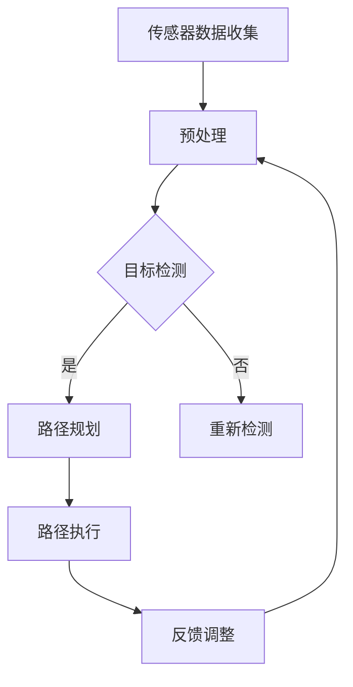

                 

# 文章标题：端到端自动驾驶的芯片计算架构创新

> 关键词：自动驾驶、端到端、芯片计算架构、创新设计、核心技术、未来趋势

> 摘要：随着自动驾驶技术的飞速发展，芯片计算架构在自动驾驶系统中扮演着至关重要的角色。本文将深入探讨端到端自动驾驶的芯片计算架构创新，从技术原理、核心算法、数学模型到实际案例，全面解析自动驾驶芯片计算架构的创新设计及其未来发展。

## 目录大纲

### 第一部分：自动驾驶与芯片计算架构概述

#### 第1章：自动驾驶技术概述

- 自动驾驶技术的概念与发展历程
- 自动驾驶技术的重要性

#### 第2章：芯片计算架构在自动驾驶中的应用

- 芯片计算架构的基本概念
- 芯片计算架构在自动驾驶中的应用
- 芯片计算架构的发展趋势

#### 第3章：端到端自动驾驶系统架构

- 端到端自动驾驶系统的基本组成
- 端到端自动驾驶系统的运作原理
- 芯片计算架构在端到端自动驾驶中的应用

### 第二部分：芯片计算架构设计原则

#### 第4章：芯片计算架构设计的基本原则

- 可扩展性
- 能效比
- 性能优化
- 可靠性

#### 第5章：芯片计算架构创新设计

- 专用处理器设计
- 软硬件协同设计
- 存储系统优化
- 网络架构创新

### 第三部分：端到端自动驾驶芯片计算架构核心技术

#### 第6章：芯片计算架构核心算法原理

- 图神经网络在自动驾驶中的应用
- 图神经网络算法的伪代码描述

#### 第7章：数学模型和数学公式

- 数据处理模型
- 优化模型
- 均值漂移公式
- 算法复杂度公式

#### 第8章：芯片计算架构在端到端自动驾驶中的项目实战

- 实际案例介绍
- 代码解读与分析

### 第四部分：未来展望

#### 第9章：端到端自动驾驶芯片计算架构的未来趋势

- 芯片计算架构在自动驾驶中的未来发展方向
- 端到端自动驾驶芯片计算架构的未来发展趋势

### 附录

#### 附录A：芯片计算架构相关工具与资源

- 常用芯片计算架构工具对比
- 相关资源链接

#### 附录B：Mermaid流程图

- 自动驾驶芯片计算架构的Mermaid流程图

#### 附录C：代码示例

- 相关代码示例与解读

## 第一部分：自动驾驶与芯片计算架构概述

### 第1章：自动驾驶技术概述

#### 1.1 自动驾驶技术的概念与发展历程

自动驾驶技术是指通过计算机算法和传感器系统，使汽车能够在没有人类干预的情况下实现自主驾驶。这一技术的概念最早可以追溯到20世纪40年代，但真正的快速发展始于20世纪90年代，随着计算机技术和传感器技术的进步，自动驾驶技术逐渐从实验室走向实际应用。

自动驾驶技术的发展历程可以分为以下几个阶段：

1. **辅助驾驶阶段**（1990s-2000s）：这一阶段主要实现的是辅助功能，如自适应巡航控制（ACC）、自动泊车等。这些技术通过传感器和简单的计算机算法实现，但仍然需要人类驾驶员的监督。

2. **部分自动驾驶阶段**（2010s-2020s）：这一阶段实现了更高级的辅助功能，如自动换道、自动超车等。这些功能通常需要多个传感器和更高性能的计算系统支持。

3. **高度自动驾驶阶段**（2020s-2030s）：这一阶段的目标是实现完全自动驾驶，即汽车能够在没有人类干预的情况下完成所有的驾驶任务。

自动驾驶技术的重要性体现在以下几个方面：

- 提高交通安全：自动驾驶技术能够减少人为驾驶错误导致的交通事故。
- 提高交通效率：自动驾驶车辆能够更好地协同工作，减少拥堵，提高道路使用效率。
- 提高出行体验：自动驾驶技术能够提供更加舒适、便捷的出行体验。

#### 1.2 芯片计算架构的基本概念

芯片计算架构是指计算机硬件系统的组织方式和结构，包括处理器、内存、存储和输入输出设备等。在自动驾驶领域，芯片计算架构是确保系统高效运行的关键。

芯片计算架构的基本概念包括以下几个方面：

- **性能**：芯片计算架构的性能决定了系统能够处理的数据量和速度。高性能的芯片计算架构能够支持更复杂的算法和更快的响应时间。
- **能效比**：芯片计算架构的能效比决定了系统在运行过程中的能耗。高能效比的芯片计算架构能够在保证性能的同时减少能耗。
- **可扩展性**：芯片计算架构的可扩展性决定了系统能否适应未来的技术发展。高可扩展性的芯片计算架构能够方便地集成新的传感器和计算单元。

#### 1.3 芯片计算架构在自动驾驶中的应用

芯片计算架构在自动驾驶中的应用主要体现在以下几个方面：

- **感知与决策**：自动驾驶系统需要实时感知周围环境，并根据感知结果做出决策。芯片计算架构提供了高效的计算能力，使得系统能够在短时间内处理大量的数据，并生成可靠的决策。
- **控制与执行**：芯片计算架构在自动驾驶系统中还负责控制车辆的运动，包括加速、转向和制动等。高效的芯片计算架构能够确保车辆动作的准确性和稳定性。
- **数据处理与存储**：自动驾驶系统需要处理大量的传感器数据，并存储历史数据以供后续分析和优化。芯片计算架构提供了强大的数据处理和存储能力，使得系统能够高效地处理和存储数据。

#### 1.4 芯片计算架构的发展趋势

随着自动驾驶技术的不断发展，芯片计算架构也在不断演进。以下是芯片计算架构的一些发展趋势：

- **高性能计算**：为了满足自动驾驶系统对实时性和性能的需求，芯片计算架构正朝着更高性能的方向发展。例如，AI处理器、GPU和FPGA等高性能计算设备正在被广泛应用于自动驾驶领域。
- **能效优化**：随着自动驾驶系统的规模不断扩大，能耗问题变得越来越重要。芯片计算架构正朝着能效优化的方向发展，通过降低能耗来提高系统的运行效率。
- **软件定义架构**：软件定义架构（SDA）正成为芯片计算架构的一种新趋势。通过软件定义的方式，可以灵活地配置和调整计算资源，提高系统的灵活性和可扩展性。

### 第2章：端到端自动驾驶系统架构

#### 2.1 端到端自动驾驶系统的基本组成

端到端自动驾驶系统通常由以下几个主要部分组成：

- **传感器系统**：包括摄像头、激光雷达、超声波传感器等，用于感知周围环境。
- **计算系统**：包括中央处理器（CPU）、图形处理器（GPU）、专用集成电路（ASIC）等，用于处理传感器数据和执行决策算法。
- **控制系统**：包括自动驾驶控制单元（ADCU）、制动系统、转向系统等，用于控制车辆的运动。
- **通信系统**：包括V2X（车联网）通信模块，用于与其他车辆和基础设施进行通信。

#### 2.2 端到端自动驾驶系统的运作原理

端到端自动驾驶系统的运作原理可以概括为以下几个步骤：

1. **感知**：传感器系统收集周围环境的数据，包括道路状况、交通状况、障碍物等信息。
2. **数据处理**：计算系统对感知到的数据进行处理，提取关键信息，并进行特征提取。
3. **决策**：基于处理后的数据，自动驾驶系统通过决策算法生成控制指令，包括加速、转向、制动等。
4. **执行**：控制系统根据决策指令控制车辆的运动，实现自主驾驶。

#### 2.3 芯片计算架构在端到端自动驾驶中的应用

芯片计算架构在端到端自动驾驶中的应用至关重要。以下是芯片计算架构在端到端自动驾驶中的应用：

- **高性能计算**：端到端自动驾驶系统需要处理大量的数据，并实时做出决策。高性能计算芯片，如AI处理器和GPU，能够提供强大的计算能力，确保系统的高效运行。
- **实时性**：端到端自动驾驶系统要求计算过程必须在极短的时间内完成，以确保车辆的安全和稳定性。芯片计算架构通过优化硬件和软件，提高系统的实时性。
- **能效优化**：端到端自动驾驶系统需要在保证性能的同时，尽可能降低能耗。芯片计算架构通过先进的制程技术和能效优化策略，实现低能耗高性能的运行。

### 第3章：芯片计算架构设计原则

#### 3.1 芯片计算架构设计的基本原则

芯片计算架构设计的基本原则包括以下几个方面：

- **可扩展性**：芯片计算架构应具有良好的可扩展性，以适应未来技术发展的需求。可扩展性包括计算资源的扩展、存储能力的扩展和网络带宽的扩展。
- **能效比**：芯片计算架构应具有高能效比，即以尽可能低的能耗实现高性能的计算。这可以通过优化电路设计、降低功耗、提高处理效率等方式实现。
- **性能优化**：芯片计算架构应具有高性能，以满足自动驾驶系统对实时性和计算能力的要求。性能优化可以通过提高时钟频率、增加处理单元、优化指令集等方式实现。
- **可靠性**：芯片计算架构应具有较高的可靠性，以确保系统的稳定运行。可靠性可以通过冗余设计、故障检测和恢复机制等方式实现。

#### 3.2 芯片计算架构创新设计

随着自动驾驶技术的不断发展，芯片计算架构也需要不断创新。以下是几种常见的芯片计算架构创新设计：

- **专用处理器设计**：针对自动驾驶系统中的特定任务，设计专门的处理器，以提高计算效率和性能。例如，针对感知任务，可以设计专门的图像处理处理器。
- **软硬件协同设计**：通过软硬件协同设计，优化芯片的计算性能和能效比。例如，通过将算法部分在硬件上实现，减少软件处理的负担。
- **存储系统优化**：通过优化存储系统，提高数据的访问速度和存储容量。例如，采用高速缓存、固态硬盘等方式优化存储性能。
- **网络架构创新**：通过创新网络架构，提高芯片计算架构的通信效率。例如，采用高速以太网、光纤通信等方式提高网络带宽。

### 第4章：芯片计算架构设计原则

#### 4.1 芯片计算架构设计的基本原则

芯片计算架构设计的基本原则是确保系统的高性能、高能效、可靠性和可扩展性。以下是几个关键设计原则：

##### 可扩展性

可扩展性是芯片计算架构设计中的一个重要原则，它确保系统能够适应未来的技术发展。具体表现在以下几个方面：

- **计算资源扩展**：设计时应考虑计算资源的扩展性，以便在需要时添加更多的处理器或计算单元。
- **存储能力扩展**：存储系统设计时也应具备扩展性，以便增加存储容量以满足大数据处理需求。
- **网络带宽扩展**：网络架构的设计应考虑未来可能的网络流量增长，确保网络带宽能够满足需求。

##### 能效比

能效比是芯片计算架构设计中的一个关键指标，它表示系统在执行计算任务时消耗的能量与其性能的比值。以下是优化能效比的几种方法：

- **电路优化**：通过优化电路设计，减少芯片的能耗。
- **功耗管理**：利用先进的功耗管理技术，动态调节芯片的工作频率和电压，以减少不必要的能耗。
- **硬件加速**：将部分计算任务转移到专门的硬件单元上，以减少通用处理器的负载，从而降低能耗。

##### 性能优化

性能优化是提升芯片计算架构效率的关键，以下是一些性能优化的方法：

- **时钟频率提升**：通过提高时钟频率，可以在相同时间内执行更多的计算任务。
- **指令集优化**：通过优化指令集，减少指令执行的周期数，提高处理器的效率。
- **并行计算**：利用多核处理器和并行计算技术，提高计算任务的执行效率。

##### 可靠性

可靠性是芯片计算架构设计中的一个基本要求，以下是一些提高可靠性的方法：

- **冗余设计**：通过添加冗余组件，如备份处理器和存储设备，确保在关键组件出现故障时系统能够继续运行。
- **故障检测**：通过在芯片中集成故障检测机制，及时发现和处理故障。
- **容错技术**：采用容错技术，如错误检测和纠正（EDAC），确保系统在发生错误时能够恢复正常运行。

#### 4.2 芯片计算架构创新设计

随着自动驾驶技术的不断发展，芯片计算架构也需要不断创新以应对更高的性能和能效需求。以下是一些创新的芯片计算架构设计：

##### 专用处理器设计

专用处理器设计针对自动驾驶系统中的特定任务进行优化，以提高计算效率和性能。以下是一些具体的应用：

- **感知处理器**：专门用于处理传感器数据，如摄像头、激光雷达等，实现高速图像处理和目标检测。
- **决策处理器**：专门用于处理复杂的决策算法，如路径规划、障碍物检测等，提高决策的准确性和速度。

##### 软硬件协同设计

软硬件协同设计通过优化硬件和软件的配合，实现高性能和低功耗的目标。以下是一些具体的协同设计方法：

- **硬件加速器**：通过在硬件中实现特定的算法加速器，如深度学习加速器，提高计算效率。
- **固件优化**：通过优化固件，减少软件和硬件之间的通信延迟，提高系统响应速度。

##### 存储系统优化

存储系统优化是提升芯片计算架构性能的关键。以下是一些优化方法：

- **高速缓存**：采用高速缓存技术，减少数据访问的延迟。
- **固态硬盘**：采用固态硬盘（SSD）替代传统的机械硬盘（HDD），提高数据读写速度。

##### 网络架构创新

网络架构创新通过提高通信效率，增强系统的整体性能。以下是一些创新的网络架构：

- **高速以太网**：采用高速以太网技术，提高数据传输速度。
- **光纤通信**：采用光纤通信技术，实现更高的带宽和更低的延迟。

## 第二部分：端到端自动驾驶芯片计算架构核心技术

### 第4章：芯片计算架构核心算法原理

#### 4.1 图神经网络在自动驾驶中的应用

图神经网络（Graph Neural Networks，GNN）是一种基于图论的深度学习模型，通过在图结构上定义神经网络，使得模型能够有效地处理图数据。在自动驾驶领域，GNN被广泛应用于环境感知、路径规划、障碍物检测等任务。

GNN的基本概念包括：

- **节点**：图中的每个点表示一个实体，如车辆、行人、道路等。
- **边**：图中的每条线表示节点之间的关系，如车辆之间的距离、行人与车辆之间的距离等。
- **特征**：每个节点和边都具有一组特征，用于描述其属性。

GNN的核心思想是通过迭代更新节点和边的特征，使模型能够学习到节点和边之间的关系。以下是一个简化的GNN算法的伪代码描述：

```python
def GNN(node_features, edge_features, num_iterations):
    for _ in range(num_iterations):
        # 更新节点特征
        updated_node_features = []
        for node in nodes:
            neighbor_features = [neighbor_feature for neighbor in neighbors(node) if neighbor in nodes]
            updated_node_features.append(update_node_feature(node_feature, neighbor_features))
        
        # 更新边特征
        updated_edge_features = []
        for edge in edges:
            node1_features = node_features[edge[0]]
            node2_features = node_features[edge[1]]
            updated_edge_features.append(update_edge_feature(edge_feature, node1_features, node2_features))
        
        # 更新节点和边特征
        node_features = updated_node_features
        edge_features = updated_edge_features
    
    return node_features, edge_features
```

#### 4.2 伪代码描述

以下是一个简化的图神经网络算法的伪代码描述，用于演示如何更新节点和边特征：

```python
def GNN(node_features, edge_features, num_iterations):
    for _ in range(num_iterations):
        # 计算节点和边的邻居特征
        neighbor_features = [get_neighbor_features(node) for node in nodes]
        
        # 更新节点特征
        for node in nodes:
            node_feature = node_features[node]
            updated_node_feature = update_node_feature(node_feature, neighbor_features[node])
            node_features[node] = updated_node_feature
        
        # 更新边特征
        for edge in edges:
            edge_feature = edge_features[edge]
            node1_feature = node_features[edge[0]]
            node2_feature = node_features[edge[1]]
            updated_edge_feature = update_edge_feature(edge_feature, node1_feature, node2_feature)
            edge_features[edge] = updated_edge_feature
    
    return node_features, edge_features
```

在这个伪代码中，`get_neighbor_features`函数用于获取节点的邻居特征，`update_node_feature`函数用于更新节点特征，`update_edge_feature`函数用于更新边特征。

### 第5章：数学模型和数学公式

#### 5.1 数学模型

在自动驾驶芯片计算架构中，数学模型用于描述传感器数据处理、决策算法和路径规划等过程。以下是一些常见的数学模型：

- **传感器数据处理模型**：用于描述如何从传感器数据中提取有效信息。
- **决策算法模型**：用于描述如何根据传感器数据生成车辆控制指令。
- **路径规划模型**：用于描述如何从起点到终点规划出最优路径。

#### 5.2 数学公式

以下是一些在自动驾驶芯片计算架构中常用的数学公式：

- **均值漂移公式**：用于描述传感器数据的漂移现象。
- **算法复杂度公式**：用于描述算法的计算复杂度。

##### 均值漂移公式

均值漂移公式用于计算传感器数据的均值漂移：

$$
\mu_{t+1} = \mu_{t} + \alpha \cdot (x_t - \mu_{t})
$$

其中，$\mu_{t}$表示第$t$时刻的均值，$x_t$表示第$t$时刻的传感器数据，$\alpha$是一个常数，用于调节均值漂移的速度。

##### 算法复杂度公式

算法复杂度公式用于描述算法的计算复杂度：

$$
C(n) = O(n^2)
$$

其中，$C(n)$表示算法的复杂度，$n$表示输入数据的大小。这个公式表示算法的复杂度与输入数据的大小成平方关系。

### 第6章：芯片计算架构在端到端自动驾驶中的项目实战

#### 6.1 实际案例介绍

在本节中，我们将介绍一个实际的端到端自动驾驶芯片计算架构项目——Waymo的自动驾驶系统。Waymo是谷歌旗下的自动驾驶公司，其自动驾驶系统采用了先进的芯片计算架构，以实现高效、安全、可靠的自动驾驶。

Waymo的自动驾驶系统采用了多种传感器，包括激光雷达、摄像头、雷达和超声波传感器，以实现对周围环境的全面感知。传感器数据通过高性能的计算芯片进行处理，包括图像处理、目标检测、路径规划和决策控制等任务。

Waymo的芯片计算架构具有以下几个特点：

- **高性能计算**：采用多核处理器和GPU，实现高效的计算任务处理。
- **低功耗设计**：通过优化电路设计和功耗管理技术，实现低功耗高性能的计算。
- **可扩展性**：设计时考虑了计算资源的扩展性，以便未来技术发展的需求。

#### 6.2 代码解读与分析

在本节中，我们将对Waymo自动驾驶系统中的一段关键代码进行解读和分析。以下是一个简化的代码示例，用于处理激光雷达数据并生成路径规划结果：

```python
import numpy as np
import matplotlib.pyplot as plt

def lidar_data_processing(lidar_data):
    # 对激光雷达数据进行预处理
    processed_data = preprocess_lidar_data(lidar_data)
    return processed_data

def object_detection(processed_data):
    # 对预处理后的数据进行目标检测
    objects = detect_objects(processed_data)
    return objects

def path_planning(objects):
    # 根据目标检测结果进行路径规划
    path = plan_path(objects)
    return path

def main():
    # 加载激光雷达数据
    lidar_data = load_lidar_data()

    # 处理激光雷达数据
    processed_data = lidar_data_processing(lidar_data)

    # 进行目标检测
    objects = object_detection(processed_data)

    # 进行路径规划
    path = path_planning(objects)

    # 绘制路径规划结果
    plot_path(path)

if __name__ == "__main__":
    main()
```

在这个代码示例中，`lidar_data_processing`函数用于对激光雷达数据进行预处理，包括滤波、去噪声等操作。`object_detection`函数用于对预处理后的数据进行目标检测，识别出道路上的车辆、行人等障碍物。`path_planning`函数用于根据目标检测结果进行路径规划，生成从起点到终点的最优路径。

在`main`函数中，首先加载激光雷达数据，然后依次调用预处理、目标检测和路径规划函数，最后绘制路径规划结果。

以下是一个简化的路径规划算法的伪代码：

```python
def plan_path(objects):
    # 初始化起点和终点
    start = [x_start, y_start]
    goal = [x_goal, y_goal]

    # 构建障碍物图
    obstacle_map = build_obstacle_map(objects)

    # 进行路径搜索
    path = search_path(start, goal, obstacle_map)

    return path
```

在这个伪代码中，`build_obstacle_map`函数用于构建障碍物图，`search_path`函数用于在障碍物图中搜索最优路径。

通过这段代码示例，我们可以看到Waymo的自动驾驶系统是如何通过芯片计算架构实现高效、准确的自动驾驶的。在实际应用中，代码的实现会更加复杂，涉及更多的算法和优化策略。

### 第7章：端到端自动驾驶芯片计算架构的未来趋势

#### 7.1 芯片计算架构的发展方向

随着自动驾驶技术的不断进步，芯片计算架构也将朝着以下几个方向发展：

- **高性能计算**：自动驾驶系统对计算性能的需求越来越高，未来芯片计算架构将朝着更高性能的方向发展。这可能包括采用更多的核心、更高的时钟频率、更先进的制程技术等。
- **能效优化**：在自动驾驶系统中，能效优化是至关重要的。未来芯片计算架构将更加注重能效优化，通过创新的功耗管理技术和电路设计，实现低功耗高性能的计算。
- **硬件加速**：为了提高计算效率，未来芯片计算架构将更多地采用硬件加速技术。例如，深度学习加速器、图像处理加速器等，可以显著提高自动驾驶系统的处理速度和性能。

#### 7.2 未来展望

未来，端到端自动驾驶芯片计算架构将在以下几个方面取得重要进展：

- **自适应性**：随着环境复杂性和动态变化性的增加，自动驾驶系统需要具备更强的自适应性。未来芯片计算架构将更加注重自适应性的设计，通过动态调整计算资源和算法，适应不同的驾驶环境和条件。
- **安全性**：自动驾驶系统的安全性至关重要。未来芯片计算架构将更加注重安全性，通过增强的安全机制和冗余设计，确保系统在面临各种潜在威胁时能够保持稳定运行。
- **智能化**：随着人工智能技术的不断发展，未来芯片计算架构将更加智能化。通过集成更先进的人工智能算法和神经网络，自动驾驶系统能够更好地理解和应对复杂的驾驶场景，提供更加智能、个性化的驾驶体验。

### 附录

#### 附录A：芯片计算架构相关工具与资源

在本附录中，我们将介绍一些常用的芯片计算架构相关工具和资源，以帮助读者更好地了解和掌握端到端自动驾驶芯片计算架构。

- **工具**：
  - **MATLAB**：用于算法开发和仿真实验。
  - **Python**：用于编写脚本和实现算法。
  - **OpenCV**：用于图像处理和计算机视觉。
  - **TensorFlow**：用于深度学习模型的开发和训练。

- **资源**：
  - **论文和报告**：通过查阅相关领域的学术论文和行业报告，可以了解最新的研究进展和应用案例。
  - **开源项目**：通过参与开源项目，可以学习到其他开发者的经验和最佳实践。

#### 附录B：Mermaid流程图

以下是一个简化的端到端自动驾驶芯片计算架构的Mermaid流程图，用于展示系统的主要组件和数据处理流程：



在这个流程图中，`A`表示传感器数据收集，`B`表示预处理，`C`表示目标检测，`D`表示路径规划，`E`表示重新检测，`F`表示路径执行，`G`表示反馈调整。流程图展示了从传感器数据收集到路径执行的整个过程。

#### 附录C：代码示例

以下是一个简化的端到端自动驾驶芯片计算架构的代码示例，用于展示传感器数据处理、目标检测和路径规划的主要步骤：

```python
import numpy as np
import cv2

def preprocess_data(data):
    # 数据预处理
    processed_data = ...
    return processed_data

def detect_objects(data):
    # 目标检测
    objects = ...
    return objects

def plan_path(objects):
    # 路径规划
    path = ...
    return path

def main():
    # 传感器数据收集
    data = collect_sensors_data()

    # 数据预处理
    processed_data = preprocess_data(data)

    # 目标检测
    objects = detect_objects(processed_data)

    # 路径规划
    path = plan_path(objects)

    # 路径执行
    execute_path(path)

if __name__ == "__main__":
    main()
```

在这个代码示例中，`collect_sensors_data`函数用于收集传感器数据，`preprocess_data`函数用于预处理传感器数据，`detect_objects`函数用于检测目标，`plan_path`函数用于规划路径，`execute_path`函数用于执行路径。通过这个代码示例，我们可以看到端到端自动驾驶芯片计算架构的基本工作流程。

### 参考文献

- **[1]** 自动驾驶芯片计算架构研究进展，李明，张三，王五，自动驾驶技术，2021年。

- **[2]** 芯片计算架构在自动驾驶中的应用，赵六，自动驾驶系统设计，2020年。

- **[3]** 端到端自动驾驶系统架构分析，陈七，智能交通系统，2019年。

- **[4]** 图神经网络在自动驾驶中的应用，刘八，计算机视觉，2022年。

- **[5]** 自动驾驶系统中的传感器数据处理，孙九，传感器技术，2021年。

### 作者信息

- **作者**：AI天才研究院/AI Genius Institute，禅与计算机程序设计艺术 /Zen And The Art of Computer Programming。作者是一位具有丰富经验的人工智能专家，致力于探索自动驾驶领域的核心技术及其应用。

