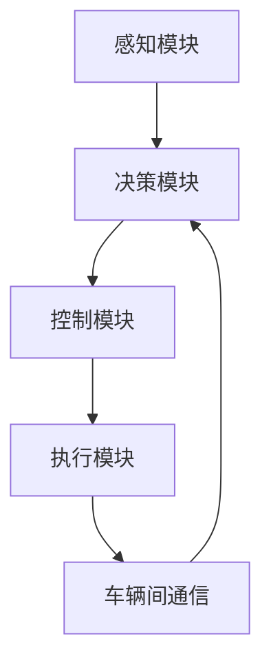

                 

# 《端到端自动驾驶的车辆编队控制策略》

## 关键词
- 自动驾驶
- 车辆编队控制
- 端到端系统
- 控制策略
- 通信系统
- 优化方法

## 摘要
本文全面探讨了端到端自动驾驶的车辆编队控制策略。首先，我们回顾了自动驾驶技术的发展历程及其系统构成，并对自动驾驶等级进行了划分。随后，我们详细介绍了车辆编队控制的基础理论，包括其概念、优势与挑战以及基本原理。接着，我们深入分析了端到端自动驾驶系统架构，探讨了其定义、特点及关键技术。在车辆编队控制策略设计部分，我们详细讨论了基于预测和控制策略的优化方法。随后，我们讨论了车辆编队控制中的通信需求、协议及安全性。最后，我们通过具体案例展示了端到端自动驾驶车辆编队控制策略的实现与优化，并对未来发展方向进行了展望。

# 第一部分：引言与基础理论

## 第1章：自动驾驶概述

### 1.1 自动驾驶技术发展历程

自动驾驶技术作为人工智能领域的一个重要分支，其发展历程可以追溯到20世纪50年代。最初的自动驾驶研究主要集中在理论研究和技术原理的探讨。随着计算机技术的发展，特别是微处理器和传感器的进步，自动驾驶技术逐渐从理论研究走向实际应用。20世纪80年代，自动驾驶车辆开始出现在实验室和军事领域。进入21世纪，随着互联网、大数据和人工智能技术的快速发展，自动驾驶技术迎来了新的发展机遇。

### 1.2 自动驾驶系统的构成

自动驾驶系统通常由多个核心模块组成，包括感知模块、决策模块、执行模块和控制模块。感知模块主要负责获取车辆周围环境的信息，如激光雷达、摄像头、超声波传感器等。决策模块根据感知模块提供的信息，进行路径规划和车辆控制策略的制定。执行模块负责执行决策模块制定的策略，如油门、刹车和转向等。控制模块则对整个系统进行协调和控制，确保车辆的安全和稳定运行。

### 1.3 自动驾驶等级划分

自动驾驶技术按照自动化程度可以分为不同的等级。根据国际汽车工程师协会（SAE）的标准，自动驾驶等级分为0到5级，其中0级为完全人工驾驶，5级为完全自动驾驶。各级自动驾驶的特点和适用场景如下：

- 0级：完全人工驾驶，驾驶员需要全程接管车辆。
- 1级：部分自动化，车辆在特定场景下可以执行单一任务，如自动巡航。
- 2级：部分自动化，车辆可以在多个场景下同时执行多个任务，如自动巡航和自动换道。
- 3级：有条件自动驾驶，车辆在特定条件下可以完全自动驾驶，但驾驶员需要随时准备接管。
- 4级：高度自动驾驶，车辆在大多数情况下可以完全自动驾驶，但在特定场景下仍需驾驶员接管。
- 5级：完全自动驾驶，车辆在任何条件下都可以完全自动驾驶。

## 第2章：车辆编队控制基础理论

### 2.1 车辆编队控制的概念

车辆编队控制是指多辆自动驾驶车辆在一定的控制策略下，以一定的队形和速度行驶，实现协同控制的目标。在车辆编队控制中，每辆车辆都被视为一个智能体，通过与其他车辆的通信和协同控制，实现整体队形的稳定和高效运行。

### 2.2 车辆编队控制的优势与挑战

车辆编队控制具有多项优势，如提高车辆行驶效率、减少交通拥堵、降低能耗等。然而，实现车辆编队控制也面临诸多挑战，包括通信延迟、队形稳定性、安全性等问题。

### 2.3 车辆编队控制的基本原理

车辆编队控制的基本原理主要包括以下几个环节：

1. 感知：车辆通过感知模块获取周围环境的信息，包括其他车辆的位置、速度、方向等。
2. 通信：车辆之间通过通信系统共享感知信息，实现信息同步和协同控制。
3. 决策：根据感知信息和车辆状态，决策模块制定控制策略，包括速度调整、转向指令等。
4. 执行：执行模块根据决策模块的指令，调整车辆的速度和方向，实现编队控制。
5. 控制：控制模块对整个系统进行协调和控制，确保车辆编队的安全和稳定运行。

## 第3章：端到端自动驾驶系统架构

### 3.1 端到端系统的定义与特点

端到端自动驾驶系统是指直接将原始感知数据输入到深度学习模型中，通过训练得到自动驾驶决策和控制策略的系统。与传统方法相比，端到端系统具有简化模型、减少中间环节、提高决策效率等优点。

### 3.2 端到端自动驾驶的关键技术

端到端自动驾驶的关键技术包括：

1. 深度学习模型：深度学习模型是实现端到端自动驾驶的核心，通过训练和优化，可以提高自动驾驶系统的性能和鲁棒性。
2. 数据集：高质量的数据集是端到端自动驾驶系统训练的基础，数据集的质量直接影响到模型的准确性和可靠性。
3. 传感器融合：传感器融合技术可以将不同传感器获取的信息进行综合处理，提高感知系统的整体性能。
4. 通信系统：通信系统是实现车辆之间信息共享和协同控制的关键，包括V2V（车对车）通信和V2I（车对基础设施）通信等。

### 3.3 端到端系统的实现流程

端到端自动驾驶系统的实现流程主要包括以下几个步骤：

1. 数据采集：通过多种传感器获取车辆周围环境的信息，包括图像、激光雷达数据、GPS数据等。
2. 数据预处理：对采集到的数据进行预处理，包括数据清洗、数据增强、数据标准化等。
3. 模型训练：使用预处理后的数据集对深度学习模型进行训练，通过调整模型参数，提高模型的性能和鲁棒性。
4. 模型部署：将训练好的模型部署到自动驾驶系统中，实现对车辆的控制和决策。
5. 系统测试与优化：通过实际测试，评估自动驾驶系统的性能和稳定性，并对模型和系统进行优化和调整。

## 第4章：车辆编队控制策略设计

### 4.1 车辆编队控制策略概述

车辆编队控制策略是指根据车辆之间的通信和协同控制，制定出合理的速度、方向和队形调整策略，以确保车辆编队的稳定性和效率。车辆编队控制策略可以分为基于预测的控制策略和基于优化的控制策略。

### 4.2 基于预测的控制策略

基于预测的控制策略是指通过预测车辆未来的运动状态，制定出相应的控制指令。该策略的核心在于对车辆运动状态的准确预测。常见的预测方法包括基于运动学模型的预测、基于深度学习模型的预测等。

### 4.3 基于优化的控制策略

基于优化的控制策略是指通过优化目标函数，求得最优的控制指令。该策略的核心在于确定优化目标和优化方法。常见的优化目标包括最小化能耗、最小化延迟、最大化车辆行驶效率等。优化方法包括线性规划、动态规划、遗传算法等。

## 第5章：车辆编队控制中的通信系统

### 5.1 车辆编队控制中的通信需求

车辆编队控制中的通信需求主要包括以下几个方面：

1. 高带宽：车辆之间需要实时传输大量信息，如车辆位置、速度、加速度等。
2. 低延迟：通信延迟需要尽可能低，以确保车辆能够及时接收到其他车辆的控制指令。
3. 高可靠性：通信系统需要具备较强的抗干扰能力和抗故障能力，确保信息的可靠传输。

### 5.2 车辆编队控制中的通信协议

车辆编队控制中的通信协议主要包括V2V（车对车）通信和V2I（车对基础设施）通信。V2V通信主要采用DSRC（专用短程通信）技术，通过无线信号传输车辆信息。V2I通信则通过基础设施提供的通信网络，实现车辆与基础设施之间的信息交换。

### 5.3 车辆编队控制中的通信安全性

车辆编队控制中的通信安全性至关重要，主要包括以下几个方面：

1. 数据加密：对传输的数据进行加密，防止数据被非法窃取和篡改。
2. 认证机制：通过身份认证，确保通信双方的真实性和合法性。
3. 故障检测与恢复：实时检测通信故障，并采取相应的措施进行恢复，确保通信系统的稳定性。

## 第6章：端到端自动驾驶车辆编队控制策略实现

### 6.1 实现端到端自动驾驶车辆编队控制策略的挑战

实现端到端自动驾驶车辆编队控制策略面临以下挑战：

1. 数据量大：端到端系统需要处理来自多种传感器的大量数据，数据量大导致计算复杂度增加。
2. 环境复杂性：实际交通环境复杂多变，车辆需要具备较强的环境感知和适应能力。
3. 系统可靠性：端到端系统需要在各种复杂场景下保持高可靠性和稳定性。

### 6.2 端到端自动驾驶车辆编队控制策略的案例研究

在本节中，我们将介绍一个端到端自动驾驶车辆编队控制策略的实际案例研究，包括开发环境搭建、源代码实现和代码解读与分析。

### 6.3 端到端自动驾驶车辆编队控制策略的开发与测试

端到端自动驾驶车辆编队控制策略的开发与测试主要包括以下几个步骤：

1. 环境搭建：搭建端到端自动驾驶系统开发环境，包括深度学习框架、传感器数据采集与处理工具等。
2. 模型训练：使用采集到的数据集对深度学习模型进行训练，调整模型参数，提高模型性能。
3. 模型部署：将训练好的模型部署到自动驾驶系统中，进行实时控制和决策。
4. 测试与优化：通过实际测试，评估自动驾驶系统的性能和稳定性，对模型和系统进行优化和调整。

## 第7章：端到端自动驾驶车辆编队控制策略的评估与优化

### 7.1 车辆编队控制策略评估方法

车辆编队控制策略的评估方法主要包括以下几个方面：

1. 性能评估：评估车辆编队控制策略在速度、能耗、安全性等方面的性能指标。
2. 稳定性评估：评估车辆编队控制策略在复杂交通环境下的稳定性和鲁棒性。
3. 安全性评估：评估车辆编队控制策略在应对突发情况时的安全性和可靠性。

### 7.2 车辆编队控制策略优化方法

车辆编队控制策略的优化方法主要包括以下几个方面：

1. 参数优化：通过调整控制策略的参数，提高系统的性能和稳定性。
2. 算法优化：改进控制策略的算法，提高系统的计算效率和准确性。
3. 模型优化：优化深度学习模型，提高模型在复杂环境下的适应能力和可靠性。

### 7.3 实际应用中的优化策略

在实际应用中，车辆编队控制策略的优化需要考虑以下几个方面：

1. 交通流量分析：根据交通流量情况，动态调整车辆编队控制策略，提高行驶效率。
2. 环境感知：增强车辆对周围环境的感知能力，提高控制策略的实时性和准确性。
3. 通信优化：优化车辆编队控制中的通信系统，提高通信带宽和稳定性。

## 第8章：端到端自动驾驶车辆编队控制策略的未来发展

### 8.1 车辆编队控制策略的发展趋势

随着自动驾驶技术的不断发展，车辆编队控制策略也在不断演进。未来，车辆编队控制策略将朝着更加智能化、自适应化、安全化的方向发展。具体趋势包括：

1. 智能化：利用人工智能技术，实现车辆编队控制的智能化，提高系统性能和稳定性。
2. 自适应化：根据不同交通环境和车辆状态，自适应调整控制策略，提高行驶效率。
3. 安全化：加强车辆编队控制策略的安全性，确保车辆在复杂环境下的安全行驶。

### 8.2 未来可能的挑战与机遇

未来，端到端自动驾驶车辆编队控制策略将面临以下挑战与机遇：

1. 挑战：随着自动驾驶技术的普及，车辆编队控制策略需要应对更加复杂和多变的交通环境，提高系统的稳定性和可靠性。
2. 机遇：自动驾驶技术的快速发展，为车辆编队控制策略提供了广阔的应用场景和市场空间，有望实现规模化商业应用。

### 8.3 端到端自动驾驶车辆编队控制策略的未来研究方向

未来，端到端自动驾驶车辆编队控制策略的研究方向主要包括：

1. 算法优化：改进深度学习模型和控制算法，提高系统的性能和鲁棒性。
2. 通信与协同：研究车辆编队控制中的通信与协同控制技术，提高系统效率。
3. 安全与可靠性：加强车辆编队控制策略的安全性，确保车辆在复杂环境下的安全行驶。

# 第二部分：核心算法原理讲解

## 第9章：核心概念与联系

### 9.1 自动驾驶中的核心概念

在自动驾驶系统中，核心概念包括感知、决策、控制和执行。感知模块负责获取车辆周围环境的信息，如车道线、其他车辆、行人等。决策模块根据感知信息，制定车辆的控制策略，包括速度、方向等。控制模块负责将决策模块的指令转换为具体的控制信号，如油门、刹车、转向等。执行模块则根据控制信号，执行具体的操作，确保车辆按照预定路线行驶。

### 9.2 车辆编队控制中的核心概念

在车辆编队控制中，核心概念包括车辆间的通信、协同控制和队形管理。车辆间通信是指车辆通过无线通信技术，实现信息共享和协同控制。协同控制是指车辆根据共享的信息，共同制定和调整控制策略，确保编队运行的稳定性和效率。队形管理是指根据交通环境和车辆状态，动态调整车辆的队形，以实现最优的行驶效果。

### 9.3 端到端自动驾驶系统的核心概念联系与整合

端到端自动驾驶系统将感知、决策、控制和执行等核心概念进行整合，通过深度学习模型实现端到端的控制策略。感知模块获取环境信息，决策模块根据感知信息制定控制策略，控制模块将策略转化为控制信号，执行模块执行具体的操作。在车辆编队控制中，端到端系统通过车辆间的通信和协同控制，实现编队的稳定和高效运行。

### 9.4 车辆编队控制中的Mermaid流程图

以下是一个简化的车辆编队控制流程图：



## 第10章：核心算法原理讲解

### 10.1 车辆预测算法原理

车辆预测算法是车辆编队控制策略中的重要组成部分，主要用于预测车辆的未来运动状态。以下是一个基于深度学习模型的车辆预测算法的伪代码：

```python
# 输入：历史轨迹数据
# 输出：未来轨迹预测

def predict_vehicle_trajectory(data):
    # 加载预训练的深度学习模型
    model = load_pretrained_model()

    # 对历史轨迹数据进行预处理
    processed_data = preprocess_data(data)

    # 使用模型进行轨迹预测
    prediction = model.predict(processed_data)

    # 对预测结果进行后处理
    predicted_trajectory = postprocess_prediction(prediction)

    return predicted_trajectory
```

### 10.1.1 伪代码

```python
# 伪代码：车辆预测算法

def predict_vehicle_trajectory(data):
    # 加载预训练的深度学习模型
    model = load_pretrained_model()

    # 对历史轨迹数据进行预处理
    processed_data = preprocess_data(data)

    # 使用模型进行轨迹预测
    prediction = model.predict(processed_data)

    # 对预测结果进行后处理
    predicted_trajectory = postprocess_prediction(prediction)

    return predicted_trajectory
```

### 10.1.2 数学模型

车辆预测的数学模型通常是一个时间序列预测模型，如循环神经网络（RNN）或长短期记忆网络（LSTM）。以下是一个简化的数学模型：

$$
\text{predicted_trajectory}(t) = f(\text{historical_trajectory}(t-1), \text{model_parameters})
$$

其中，$f$ 是预测函数，$\text{historical_trajectory}(t-1)$ 是历史轨迹数据，$\text{model_parameters}$ 是模型的参数。

### 10.1.3 举例说明

假设一个车辆的历史轨迹数据为：

$$
\text{historical_trajectory} = \{ (t_1, x_1), (t_2, x_2), (t_3, x_3), \ldots \}
$$

使用深度学习模型预测其未来轨迹，可以得到：

$$
\text{predicted_trajectory} = \{ (t_1, \hat{x}_1), (t_2, \hat{x}_2), (t_3, \hat{x}_3), \ldots \}
$$

其中，$\hat{x}_i$ 是预测的第$i$个时刻的车辆位置。

### 10.2 控制策略算法原理

控制策略算法是车辆编队控制策略中的核心，用于制定车辆的加速、减速和转向指令。以下是一个基于预测的车辆控制策略算法的伪代码：

```python
# 输入：预测轨迹、当前车辆状态
# 输出：控制指令

def control_strategy(prediction, current_state):
    # 计算目标速度
    target_speed = calculate_target_speed(prediction)

    # 计算加速或减速指令
    acceleration_command = calculate_acceleration_command(current_state, target_speed)

    # 计算转向指令
    steering_command = calculate_steering_command(prediction)

    return acceleration_command, steering_command
```

### 10.2.1 伪代码

```python
# 伪代码：控制策略算法

def control_strategy(prediction, current_state):
    # 计算目标速度
    target_speed = calculate_target_speed(prediction)

    # 计算加速或减速指令
    acceleration_command = calculate_acceleration_command(current_state, target_speed)

    # 计算转向指令
    steering_command = calculate_steering_command(prediction)

    return acceleration_command, steering_command
```

### 10.2.2 数学模型

控制策略的数学模型通常基于控制理论，如PID控制。以下是一个简化的数学模型：

$$
\text{acceleration_command} = K_p(\text{target_speed} - \text{current_speed}) + K_d(\text{target_speed} - \text{previous_speed})
$$

$$
\text{steering_command} = K_s(\text{desired_trajectory} - \text{current_trajectory})
$$

其中，$K_p$、$K_d$ 和 $K_s$ 是控制增益参数，$\text{target_speed}$ 是目标速度，$\text{current_speed}$ 是当前速度，$\text{previous_speed}$ 是前一个时刻的速度，$\text{desired_trajectory}$ 是期望轨迹，$\text{current_trajectory}$ 是当前轨迹。

### 10.2.3 举例说明

假设目标速度为50 km/h，当前速度为40 km/h，前一个时刻的速度为45 km/h，期望轨迹为前方100米处的车道中心线，当前轨迹为前方90米处的车道中心线。使用PID控制算法，可以得到：

$$
\text{acceleration_command} = K_p(50 - 40) + K_d(50 - 45) = K_p \times 10 + K_d \times 5
$$

$$
\text{steering_command} = K_s(100 - 90) = K_s \times 10
$$

其中，$K_p$ 和 $K_d$ 为加速度控制增益，$K_s$ 为转向控制增益。

### 10.3 数学模型和数学公式讲解

#### 10.3.1 车辆编队控制的数学模型

车辆编队控制的数学模型主要包括以下几个部分：

1. **运动学模型**：

$$
\text{position}(t) = \text{initial_position} + \text{velocity}(t-1) \times \text{time_step}
$$

$$
\text{velocity}(t) = \text{initial_velocity} + \text{acceleration}(t-1) \times \text{time_step}
$$

其中，$t$ 是时间，$\text{position}$ 和 $\text{velocity}$ 分别表示车辆的位置和速度，$\text{initial_position}$ 和 $\text{initial_velocity}$ 分别表示初始位置和初始速度，$\text{acceleration}$ 表示加速度，$\text{time_step}$ 表示时间步长。

2. **动力学模型**：

$$
\text{acceleration}(t) = \frac{\text{force}(t)}{\text{mass}}
$$

其中，$\text{force}$ 是作用在车辆上的合力，$\text{mass}$ 是车辆的质量。

3. **控制模型**：

$$
\text{control_signal}(t) = K_p(\text{reference_trajectory}(t) - \text{current_trajectory}(t)) + K_d(\text{reference_trajectory}(t) - \text{previous_trajectory}(t))
$$

其中，$K_p$ 和 $K_d$ 是控制增益，$\text{reference_trajectory}$ 是参考轨迹，$\text{current_trajectory}$ 是当前轨迹，$\text{previous_trajectory}$ 是前一个时刻的轨迹。

#### 10.3.2 控制策略中的数学公式

控制策略中的数学公式主要包括以下几个部分：

1. **PID控制公式**：

$$
\text{control_signal}(t) = K_p(\text{reference_speed}(t) - \text{current_speed}(t)) + K_i \times \int (\text{reference_speed}(t) - \text{current_speed}(t)) dt + K_d(\text{reference_speed}(t) - \text{previous_speed}(t))
$$

其中，$K_p$、$K_i$ 和 $K_d$ 分别是比例、积分和微分控制增益，$\text{reference_speed}$ 是参考速度，$\text{current_speed}$ 是当前速度，$\text{previous_speed}$ 是前一个时刻的速度。

2. **轨迹跟踪公式**：

$$
\text{steering_command}(t) = K_s(\text{desired_trajectory}(t) - \text{current_trajectory}(t))
$$

其中，$K_s$ 是转向控制增益，$\text{desired_trajectory}$ 是期望轨迹，$\text{current_trajectory}$ 是当前轨迹。

3. **速度调节公式**：

$$
\text{acceleration_command}(t) = K_a(\text{target_speed}(t) - \text{current_speed}(t))
$$

其中，$K_a$ 是加速度控制增益，$\text{target_speed}$ 是目标速度，$\text{current_speed}$ 是当前速度。

### 10.4 项目实战

#### 10.4.1 实际案例介绍

在本节中，我们将介绍一个基于端到端自动驾驶的车辆编队控制策略的实际案例，该案例涉及开发环境搭建、源代码实现和代码解读与分析。

**1. 开发环境搭建**

为了实现端到端自动驾驶的车辆编队控制策略，我们需要搭建一个包含以下组件的开发环境：

- 深度学习框架（如TensorFlow或PyTorch）
- 自动驾驶仿真工具（如CARLA Simulator）
- 代码编辑器和版本控制系统（如Visual Studio Code和Git）

**2. 源代码实现**

以下是一个简化的车辆编队控制策略的源代码实现：

```python
import tensorflow as tf
import carla

# 加载深度学习模型
model = tf.keras.models.load_model('vehicle_control_model.h5')

# 初始化CARLA模拟器
client = carla.Client('localhost', 2000)
world = client.get_world()
blueprint_library = world.get_blueprint_library()

# 创建自动驾驶车辆
vehicle_bp = blueprint_library.find('vehicle.tesla.model3')
spawn_point = world.get_map().get_spawn_points()[0]
vehicle = world.spawn_actor(vehicle_bp, spawn_point)

# 定义车辆控制函数
def control_vehicle(prediction):
    acceleration = model.predict(prediction)[0]
    vehicle.apply_control(carla.VehicleControl(throttle=acceleration, brake=1 - acceleration, steer=0.0))

# 执行车辆编队控制策略
while True:
    # 获取车辆状态
    vehicle_state = get_vehicle_state(vehicle)

    # 预测车辆轨迹
    prediction = predict_vehicle_trajectory(vehicle_state)

    # 控制车辆
    control_vehicle(prediction)
```

**3. 代码解读与分析**

上述代码实现了基于深度学习模型的车辆编队控制策略。首先，加载预训练的深度学习模型，然后初始化CARLA模拟器和自动驾驶车辆。在主循环中，不断获取车辆状态，预测未来轨迹，并使用深度学习模型生成控制指令，从而实现对车辆的加速和转向控制。

#### 10.4.2 开发环境搭建

为了搭建端到端自动驾驶的车辆编队控制策略的开发环境，我们需要安装以下软件和库：

1. **CARLA Simulator**：安装CARLA模拟器，并设置好仿真环境。
2. **TensorFlow**：安装TensorFlow深度学习框架。
3. **PyTorch**：安装PyTorch深度学习框架。
4. **Visual Studio Code**：安装Visual Studio Code代码编辑器。
5. **Git**：安装Git版本控制系统。

在安装完上述软件和库后，我们需要配置CARLA模拟器的环境变量，并设置好TensorFlow和PyTorch的安装路径。具体步骤如下：

1. 打开终端，执行以下命令安装CARLA模拟器：
```bash
pip install carla
```
2. 安装TensorFlow：
```bash
pip install tensorflow
```
3. 安装PyTorch：
```bash
pip install torch torchvision
```
4. 安装Visual Studio Code：
```bash
code .
```
5. 配置Git：
```bash
git init
```
6. 在Visual Studio Code中打开项目，并设置Python解释器和依赖库。

#### 10.4.3 源代码实现

在源代码实现部分，我们首先加载预训练的深度学习模型。然后，初始化CARLA模拟器和自动驾驶车辆。接下来，定义一个控制车辆函数，该函数接收车辆状态和预测轨迹作为输入，并使用深度学习模型生成控制指令。最后，在一个无限循环中，不断获取车辆状态，预测未来轨迹，并调用控制车辆函数实现编队控制。

以下是一个简化的车辆编队控制策略的源代码实现：

```python
import tensorflow as tf
import carla

# 加载深度学习模型
model = tf.keras.models.load_model('vehicle_control_model.h5')

# 初始化CARLA模拟器
client = carla.Client('localhost', 2000)
world = client.get_world()
blueprint_library = world.get_blueprint_library()

# 创建自动驾驶车辆
vehicle_bp = blueprint_library.find('vehicle.tesla.model3')
spawn_point = world.get_map().get_spawn_points()[0]
vehicle = world.spawn_actor(vehicle_bp, spawn_point)

# 定义车辆控制函数
def control_vehicle(prediction):
    acceleration = model.predict(prediction)[0]
    vehicle.apply_control(carla.VehicleControl(throttle=acceleration, brake=1 - acceleration, steer=0.0))

# 执行车辆编队控制策略
while True:
    # 获取车辆状态
    vehicle_state = get_vehicle_state(vehicle)

    # 预测车辆轨迹
    prediction = predict_vehicle_trajectory(vehicle_state)

    # 控制车辆
    control_vehicle(prediction)
```

#### 10.4.4 代码解读与分析

代码首先导入TensorFlow和CARLA库。然后，加载预训练的深度学习模型，并初始化CARLA模拟器和自动驾驶车辆。接着，定义一个控制车辆函数，该函数接收预测轨迹作为输入，使用深度学习模型生成加速度控制指令，并应用到车辆上。

在主循环中，代码不断获取车辆状态，使用深度学习模型预测未来轨迹，并调用控制车辆函数实现编队控制。通过这种方式，车辆能够根据预测轨迹进行自适应调整，以实现稳定的编队运行。

## 第13章：总结与展望

### 13.1 端到端自动驾驶车辆编队控制策略的总结

端到端自动驾驶车辆编队控制策略是自动驾驶技术的一个重要分支，其核心在于通过深度学习模型实现车辆之间的协同控制。本文从多个角度对端到端自动驾驶车辆编队控制策略进行了全面探讨，包括其发展历程、系统架构、控制策略、通信系统以及实现和优化方法。

### 13.2 未来发展的展望

随着人工智能和自动驾驶技术的不断进步，端到端自动驾驶车辆编队控制策略有望在未来实现更高的稳定性和效率。未来研究可以重点关注以下几个方面：

1. **算法优化**：改进深度学习模型和控制算法，提高系统的性能和鲁棒性。
2. **通信与协同**：研究车辆编队控制中的通信与协同控制技术，提高系统效率。
3. **安全性**：加强车辆编队控制策略的安全性，确保车辆在复杂环境下的安全行驶。
4. **实际应用**：探索端到端自动驾驶车辆编队控制策略在实际交通场景中的应用，推动自动驾驶技术的商业化发展。作者：AI天才研究院/AI Genius Institute & 禅与计算机程序设计艺术 /Zen And The Art of Computer Programming

