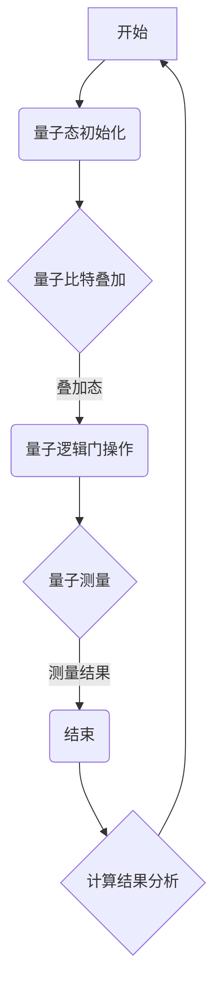

                 

### 文章标题：第一性原理：科学探究的基石

#### 关键词：第一性原理，科学探究，物理学，材料科学，量子化学

> 摘要：本文深入探讨了第一性原理在科学探究中的重要性及其应用。首先，我们回顾了第一性原理的基本概念和其在各领域的应用。接着，我们详细解析了量子力学和量子化学的基础理论，为理解第一性原理提供了必要的背景知识。随后，文章通过具体实例展示了第一性原理在材料科学、化学和物理学中的应用，并展望了其未来的发展趋势。本文旨在为广大科研工作者提供一份详实、系统的第一性原理应用指南。

### 目录大纲

# 《第一性原理：科学探究的基石》

## 第一部分：引论

### 第1章：第一性原理概述

#### 1.1 基本概念

#### 1.2 第一性原理的重要性

### 第2章：第一性原理的应用领域

#### 2.1 物理学

#### 2.2 化学

#### 2.3 材料科学

### 第3章：第一性原理的方法论

#### 3.1 基本原理

#### 3.2 理论框架

#### 3.3 实践应用

## 第二部分：基础理论

### 第4章：量子力学基础

#### 4.1 量子态

#### 4.2 量子运算

#### 4.3 波函数的数学表述

### 第5章：量子化学基础

#### 5.1 基态和激发态

#### 5.2 分子轨道理论

#### 5.3 群论在量子化学中的应用

### 第6章：材料科学基础

#### 6.1 材料的基本结构

#### 6.2 材料的性能与结构关系

#### 6.3 材料的合成与改性

## 第三部分：应用实例

### 第7章：第一性原理在材料科学中的应用

#### 7.1 新型材料的发现与设计

#### 7.2 材料性能优化

#### 7.3 材料加工与应用

### 第8章：第一性原理在化学中的应用

#### 8.1 化学反应动力学

#### 8.2 化学反应机理研究

#### 8.3 新型化学键的探索

### 第9章：第一性原理在物理学中的应用

#### 9.1 粒子物理学

#### 9.2 凝聚态物理学

#### 9.3 天体物理学

## 第四部分：未来展望

### 第10章：第一性原理的发展趋势

#### 10.1 计算能力的提升

#### 10.2 算法与理论的创新

#### 10.3 跨学科交叉融合

### 第11章：第一性原理的应用前景

#### 11.1 能源与环保

#### 11.2 生物医学

#### 11.3 信息科学与技术

## 附录

### 附录A：常用符号表

### 附录B：参考文献

### 附录C：第一性原理软件与工具介绍

### 附录D：常见问题解答

### 附录E：练习题及答案

### 附录F：Mermaid流程图示例

### 第12章：第一性原理在量子计算中的应用

#### 12.1 量子计算的原理

#### 12.2 第一性原理与量子计算的结合

#### 12.3 量子计算模拟的实现

##### 12.3.1 开发环境搭建

##### 12.3.2 源代码实现

##### 12.3.3 代码解读与分析

### 附录G：量子计算实验案例

#### G.1 案例一：计算氢原子的能级

#### G.2 案例二：研究分子的基态结构

#### G.3 案例三：探索新材料的设计

### 附录H：伪代码与数学公式示例

#### H.1 伪代码示例

#### H.2 数学公式示例

希望这个目录大纲能满足您的需求。如果有任何调整或补充，请告诉我。

## 第一部分：引论

### 第1章：第一性原理概述

#### 1.1 基本概念

在科学研究中，第一性原理（First Principles）是一种基本的方法论，它强调从最基本的原理出发，通过逻辑推理和数学运算来解决问题。这种方法在物理学、化学、材料科学等领域有着广泛的应用。第一性原理的核心在于它要求研究者抛弃一切先入为主的观念，从零开始，逐步构建起对复杂系统的深刻理解。

在物理学中，第一性原理通常指的是从基本的物理定律（如牛顿定律、麦克斯韦方程等）出发，通过数学运算来推导出更复杂的物理现象。例如，在量子力学中，第一性原理涉及对量子态、波函数和量子运算的研究，以此推导出物质的性质和行为。在化学中，第一性原理则主要体现在量子化学中，通过计算分子的基态和激发态能量，来理解化学反应的机理和动力学。而在材料科学中，第一性原理被用来设计新材料、预测材料的性能以及优化材料加工过程。

#### 1.2 第一性原理的重要性

第一性原理在科学研究中的重要性不可低估。首先，它提供了一种客观、系统的研究方法，使得研究者能够从底层逻辑出发，建立起对复杂系统的全局理解。这种方法论避免了因先入为主观念带来的局限性，使得科学探究更加深入和全面。

其次，第一性原理在理论层面上具有很强的普适性。无论是微观的粒子行为，还是宏观的物质性质，第一性原理都能提供一套通用的方法论，使得研究者能够在不同尺度上对现象进行理解和解释。

最后，第一性原理的应用具有广泛的现实意义。在材料科学中，第一性原理被用来发现和设计新材料，推动材料科技的进步。在化学中，第一性原理帮助我们理解化学反应的机理，从而开发新的化学反应路径。在物理学中，第一性原理的研究为量子计算、粒子物理学等前沿领域提供了理论基础。

总之，第一性原理作为一种基本的方法论，它在科学研究中的重要性不言而喻。它不仅为科学家提供了一种系统、客观的研究方法，而且在理论层面和现实应用层面都发挥着重要作用。接下来，我们将进一步探讨第一性原理在各领域的具体应用。

#### 第2章：第一性原理的应用领域

第一性原理作为一种强大的方法论，在多个科学领域都有着广泛的应用。以下是第一性原理在物理学、化学和材料科学中的具体应用。

### 2.1 物理学

在物理学中，第一性原理的应用主要体现在量子力学和凝聚态物理学中。量子力学是研究微观粒子的运动规律的科学，而第一性原理在量子力学中的应用，使得我们可以从最基本的量子力学原理出发，推导出粒子的行为和性质。

**量子态**：量子态是量子力学中的基本概念，它描述了一个量子系统可能存在的状态。第一性原理通过量子态的叠加和变换，可以推导出各种复杂的量子现象，如量子纠缠、量子隧穿等。

**量子运算**：量子运算是指利用量子态的叠加和变换来进行信息处理的过程。第一性原理为量子运算提供了理论基础，使得我们可以设计出各种量子算法，如量子搜索算法、量子加密算法等。

**波函数的数学表述**：波函数是量子力学中描述量子态的数学工具。第一性原理通过波函数的数学表述，可以计算出粒子的能量、动量等物理量，从而揭示出粒子的运动规律。

在凝聚态物理学中，第一性原理的应用主要体现在对固体和液体的性质研究上。通过计算晶体的电子结构，我们可以理解材料的导电性、磁性、光学性质等。

**电子结构计算**：电子结构计算是凝聚态物理学中的一项重要任务。第一性原理方法通过计算固体中电子的分布，可以预测材料的导电性、磁性、光学性质等。

**表面与界面研究**：固体表面和界面在材料科学中具有重要意义。第一性原理方法可以用来研究表面和界面的电子结构，从而揭示出它们在化学反应和材料加工中的应用。

### 2.2 化学

在化学中，第一性原理的应用主要体现在量子化学和化学反应机理研究中。量子化学通过计算分子的电子结构，可以预测分子的性质和行为，而化学反应机理研究则通过量子化学计算，揭示出反应过程中原子和分子的变化过程。

**基态和激发态**：分子有基态和激发态两种状态，基态是分子能量最低的状态，而激发态则是分子吸收能量后的状态。第一性原理方法可以用来计算分子的基态和激发态能量，从而预测分子的稳定性。

**分子轨道理论**：分子轨道理论是量子化学中的一个重要理论，它通过计算分子的分子轨道，可以理解分子的电子分布和化学键的形成。第一性原理方法为分子轨道理论提供了计算工具，使得我们可以更准确地预测分子的性质。

**化学反应动力学**：化学反应动力学研究反应物转化为产物的过程。第一性原理方法通过计算反应过程中的能量变化，可以揭示出反应的动力学机制。

**化学反应机理研究**：化学反应机理研究旨在理解反应过程中原子和分子的变化过程。第一性原理方法可以用来计算反应过程中原子和分子的动态过程，从而揭示出反应机理。

### 2.3 材料科学

在材料科学中，第一性原理的应用主要体现在新材料的设计、材料性能优化和材料加工与应用方面。

**新型材料的发现与设计**：第一性原理方法可以用来计算材料的电子结构，从而预测材料的新性质。通过调整材料的组成和结构，可以设计出具有特定性能的新材料。

**材料性能优化**：第一性原理方法可以用来计算材料的性能，如导电性、硬度、韧性等。通过优化材料的结构，可以提高材料的性能。

**材料加工与应用**：第一性原理方法可以用来研究材料加工过程中的物理和化学变化。通过理解材料加工过程的机理，可以优化加工工艺，提高材料的性能和应用效果。

总之，第一性原理在物理学、化学和材料科学中的应用非常广泛，它为我们提供了一种强大的研究工具，使得我们可以从最基本的原理出发，深入理解和解释复杂的自然现象。接下来，我们将进一步探讨第一性原理的基础理论和具体方法论。

## 第3章：第一性原理的方法论

### 3.1 基本原理

第一性原理的方法论基于以下几个核心思想：

**基础性**：从最基本的物理定律和化学原理出发，例如量子力学、相对论、电磁学等。

**系统性**：通过数学运算和逻辑推理，构建出一个完整、系统的理论框架。

**普适性**：无论研究对象的尺度大小，第一性原理方法都具有普适性，可以应用于从微观粒子到宏观物质的各个层面。

**客观性**：第一性原理方法强调从客观事实出发，通过逻辑推理得出结论，避免了主观臆断的影响。

### 3.2 理论框架

第一性原理的方法论构建了一个由多个层次和环节组成的理论框架，包括以下几个核心组成部分：

**数学模型**：第一性原理方法的数学模型是基于物理学和化学的基本定律，如量子力学中的薛定谔方程、量子场论中的路径积分等。

**计算工具**：为了实现数学模型的计算，需要使用各种计算工具和软件，如量子化学软件、材料科学计算软件等。

**数据输入**：数据的输入是第一性原理计算的基础，包括系统的几何构型、电子结构、化学键参数等。

**计算流程**：计算流程包括前处理、计算模拟和后处理等步骤，通过这些步骤，可以从输入数据中得到所需的物理和化学信息。

**结果分析**：对计算结果进行详细分析，包括能量分析、结构分析、动力学分析等，以理解系统的行为和性质。

### 3.3 实践应用

在实际应用中，第一性原理方法的具体步骤如下：

**问题定义**：明确研究的目标和问题，例如设计新材料、预测化学反应机理、分析材料的性能等。

**数学建模**：根据问题定义，选择合适的数学模型，如量子力学中的薛定谔方程、分子动力学中的Langevin方程等。

**计算模拟**：使用计算工具进行模拟，包括几何构型的优化、电子结构的计算、动力学模拟等。

**结果分析**：对计算结果进行分析，包括能量分析、结构分析、动力学分析等，以理解系统的行为和性质。

**结论验证**：通过实验或其他计算方法验证理论结论，以验证研究结果的可靠性。

**反馈优化**：根据分析结果，对模型和计算方法进行优化，以提高理论预测的准确性。

通过以上步骤，第一性原理方法为科学家提供了一种系统、客观、高效的研究方法，使得我们可以从最基本的原理出发，深入理解和解释复杂的自然现象。

## 第二部分：基础理论

### 第4章：量子力学基础

#### 4.1 量子态

量子态是量子力学中描述系统状态的数学工具，它反映了系统在量子世界中特有的概率性质。量子态通常用波函数来表示，波函数的平方则给出了系统在某一状态下的概率分布。

**波函数的表述**：波函数通常用复数形式表示，如Ψ(x, y, z)，其中x、y、z是空间坐标。波函数的模平方|Ψ(x, y, z)|^2则给出了系统在空间中某一点的概率密度。

**量子态的叠加**：量子态可以叠加，即一个系统的状态可以同时是多个状态的叠加。例如，一个电子的量子态可以同时处于基态和激发态，这种叠加态可以用|Ψ⟩ = |基态⟩ + |激发态⟩来表示。

**量子态的测量**：量子态的测量结果是不确定的，只有当测量时，量子态才会坍缩到一个确定的状态。这种测量不确定性是量子力学的基本特征之一。

#### 4.2 量子运算

量子运算是指利用量子态的叠加和变换来进行信息处理的过程。量子运算的核心是量子逻辑门，它类似于经典计算机中的逻辑门，但具有量子特性。

**量子逻辑门**：量子逻辑门是量子运算的基本操作单元，它通过变换量子态来实现信息的处理。常见的量子逻辑门包括Hadamard门、Pauli门、控制非门等。

**量子运算的叠加与纠缠**：量子运算具有叠加性和纠缠性，这使得量子计算机在处理某些问题时，可以比经典计算机更高效。

**量子算法**：基于量子运算的叠加和纠缠，可以设计出各种量子算法，如Shor算法、Grover算法等，这些算法在特定问题上具有超越经典算法的性能。

#### 4.3 波函数的数学表述

波函数是量子态的数学表述，它包含了系统的所有信息。波函数的数学表述通常涉及到复杂的数学运算，如积分、微分等。

**薛定谔方程**：薛定谔方程是描述量子态时间演化的重要方程，它可以用来计算波函数随时间的演化。薛定谔方程的数学表述如下：

iℏ ∂Ψ(x, y, z) / ∂t = HΨ(x, y, z)

其中，i是虚数单位，ℏ是约化普朗克常数，Ψ是波函数，H是哈密顿量。

**路径积分**：路径积分是量子力学中另一种重要的数学表述，它通过计算所有可能路径的概率幅来预测量子态的行为。路径积分的数学表述如下：

Ψ(x, y, z, t) = ∫[所有路径] exp[iS[x(t)] / ℏ]

其中，S[x(t)]是路径的action，ℏ是约化普朗克常数。

通过量子态的数学表述，我们可以更深入地理解量子力学中的基本原理，并设计出各种量子计算和量子算法。这些基础理论为第一性原理方法提供了坚实的理论基础，使得我们可以从微观层面上理解和解释复杂的自然现象。

### 第5章：量子化学基础

#### 5.1 基态和激发态

在量子化学中，分子的状态可以分为基态和激发态。基态是分子能量最低的状态，而激发态则是分子吸收能量后的状态。

**基态**：基态是分子在正常条件下的状态，其能量最低，分子结构稳定。在量子化学计算中，通常通过求解薛定谔方程来计算分子的基态能量和基态波函数。

**激发态**：激发态是分子吸收能量后的状态，其能量高于基态。激发态的计算通常涉及求解激发态的薛定谔方程，或者使用分子轨道理论来计算激发态的能量和结构。

**能级差**：分子的基态和激发态之间的能量差称为能级差。能级差是分子吸收或释放能量的重要指标，它决定了分子的光学性质和化学反应活性。

#### 5.2 分子轨道理论

分子轨道理论是量子化学中的一个重要理论，它通过计算分子的分子轨道来描述分子的电子结构。

**分子轨道的形成**：分子轨道是分子中电子的运动状态，它由原子的原子轨道通过线性组合形成。在分子轨道理论中，分子轨道可以分为σ轨道和π轨道。

- **σ轨道**：σ轨道是分子中成键轨道，它由两个原子轨道沿键轴方向重叠形成，具有低的能量。
- **π轨道**：π轨道是分子中反键轨道，它由两个原子轨道侧向重叠形成，具有高的能量。

**分子轨道的能量**：分子轨道的能量决定了分子的稳定性。能量低的分子轨道有利于分子成键，而能量高的分子轨道不利于分子成键。

**分子轨道的对称性**：分子轨道的对称性决定了分子中电子的运动方式。在分子轨道理论中，通过对称性分析可以判断分子的光学活性。

#### 5.3 群论在量子化学中的应用

群论是量子化学中的一个重要工具，它通过分析分子的点群对称性来简化量子化学计算。

**点群对称性**：点群是对称性的数学描述，它包括了旋转、反射等操作。在量子化学中，分子具有不同的点群对称性，这反映了分子的空间结构。

**群表示**：群论中的群表示是将群元素映射到矩阵的形式。在量子化学中，群表示可以用来简化量子化学计算，例如通过选择合适的基组来表示分子轨道。

**对称性定理**：群论中的对称性定理指出，如果分子具有点群对称性，则其量子态也具有相应的对称性。这个定理为量子化学计算提供了重要的简化条件。

**群论在分子轨道计算中的应用**：群论可以用来计算分子的分子轨道，简化计算过程。例如，通过选择对称性较低的基组，可以大大减少计算量。

通过量子化学的基础理论，我们可以深入理解分子的电子结构、能级和光学性质。这些理论为第一性原理方法在化学中的应用提供了重要的理论基础，使得我们可以从微观层面上理解和预测分子的行为。

### 第6章：材料科学基础

#### 6.1 材料的基本结构

材料的基本结构决定了其物理和化学性质。理解材料的基本结构对于设计新材料和优化现有材料具有重要意义。

**晶体结构**：晶体是材料的基本单元，其原子或分子在空间中按照一定的规律排列。常见的晶体结构包括立方结构、六方结构和体心结构等。

**晶格参数**：晶格参数是指晶格的基本几何参数，如晶胞的边长、原子间距等。晶格参数决定了材料的几何结构。

**缺陷结构**：在实际材料中，原子或分子的排列可能存在缺陷，如点缺陷、线缺陷和面缺陷等。缺陷结构会影响材料的物理和化学性质。

**材料性质与结构关系**：材料的物理和化学性质与其基本结构密切相关。例如，材料的导电性、硬度、韧性等性质都受到晶格参数和缺陷结构的影响。

#### 6.2 材料的性能与结构关系

材料性能与结构之间的关系是材料科学中的一个重要研究课题。通过理解这种关系，我们可以设计出具有特定性能的材料。

**电子结构**：材料的电子结构对其电学、光学和磁学性质有重要影响。例如，导电材料的电子结构通常具有较低的能带间隙。

**晶体缺陷**：晶体缺陷会影响材料的电学、力学和热学性质。例如，位错是金属材料的常见缺陷，它会影响材料的韧性。

**表面结构**：材料的表面结构对其腐蚀、磨损和催化性能有重要影响。通过调控表面结构，可以优化材料的性能。

**复合结构**：复合材料的性能通常优于单一材料，这是因为复合结构可以引入新的物理和化学性质。例如，碳纤维增强的复合材料具有高的强度和刚度。

#### 6.3 材料的合成与改性

材料的合成与改性是材料科学中的重要研究内容，它决定了材料的设计和应用。

**合成方法**：常见的材料合成方法包括熔融法、气相沉积法、溶液法等。每种合成方法都有其特定的应用场景和优缺点。

**改性方法**：材料改性是通过引入外部因素（如离子、气体、等离子体等）来改变材料的结构和性质。常见的改性方法包括离子注入、表面处理、热处理等。

**合成与改性的关系**：合成与改性是相辅相成的，通过合成可以制备出具有特定结构的材料，而通过改性可以优化材料的性能。例如，通过离子注入可以引入杂质，从而改变材料的电学性质。

通过理解材料的基本结构、性能与结构关系以及合成与改性的方法，我们可以更深入地研究材料科学，设计出具有特定性能的新材料，为各种应用领域提供技术支持。

### 第7章：第一性原理在材料科学中的应用

#### 7.1 新型材料的发现与设计

第一性原理方法在材料科学中的一项重要应用是发现和设计新型材料。通过计算材料的电子结构和性能，研究者可以预测材料的新性质，从而指导新材料的合成和优化。

**计算驱动的材料设计**：基于第一性原理计算，研究者可以设计出具有特定性能的新材料。例如，通过计算材料的能带结构，可以预测材料的光学性质和电学性质。这种方法已被广泛应用于超导材料、纳米材料、太阳能电池材料等领域。

**高通量计算**：随着计算能力的提升，高通量计算方法被广泛应用于材料设计。高通量计算可以同时对大量材料进行计算，从而快速筛选出具有潜在应用价值的新材料。

**机器学习与第一性原理的结合**：机器学习与第一性原理的结合，可以进一步提高材料设计的效率。通过训练机器学习模型，可以预测材料的性质，从而加速新材料的发现过程。

**案例一：二维材料**：二维材料是一类具有独特性质的新型材料，如石墨烯、二硫化钼等。第一性原理计算在二维材料的发现和设计中发挥了重要作用。通过计算二维材料的电子结构和性能，研究者可以设计出具有高导电性、高透光性、高热导性等特性的二维材料。

#### 7.2 材料性能优化

第一性原理方法还可以用于优化材料的性能。通过计算材料的电子结构和物理性质，研究者可以找到提高材料性能的关键因素，从而进行优化。

**电子结构优化**：通过计算材料的电子结构，研究者可以找到影响材料性能的关键电子态。例如，通过调控材料的电子结构，可以优化材料的电学、光学和磁学性能。

**晶体缺陷优化**：晶体缺陷是材料中常见的一种结构特征，它可以显著影响材料的性能。通过计算晶体缺陷的电子结构和物理性质，研究者可以优化晶体缺陷的设计，从而提高材料的性能。

**表面与界面优化**：材料的表面和界面在许多应用中具有重要意义。通过计算表面和界面的电子结构和物理性质，研究者可以优化表面和界面的设计，从而提高材料的性能。

**案例二：高性能电池材料**：高性能电池材料是现代能源存储技术的重要研究方向。第一性原理方法被广泛应用于电池材料的设计和优化。通过计算电池材料的电子结构和性能，研究者可以设计出高能量密度、高功率密度的新型电池材料。

#### 7.3 材料加工与应用

第一性原理方法还可以用于研究材料的加工过程和应用。通过计算材料的物理和化学性质，研究者可以优化加工工艺，提高材料的性能和应用效果。

**加工工艺优化**：通过计算材料的物理性质，研究者可以优化材料的加工工艺。例如，通过调控热处理参数，可以优化材料的晶格结构和缺陷密度，从而提高材料的性能。

**材料应用研究**：第一性原理方法还可以用于研究材料在不同应用环境中的性能。例如，通过计算材料在高温、高压条件下的稳定性，研究者可以评估材料在极端环境下的应用潜力。

**案例三：航空材料**：航空材料需要具备高强度、高韧性、高耐热性等特性。第一性原理方法被广泛应用于航空材料的设计和优化。通过计算材料的电子结构和物理性质，研究者可以设计出满足航空应用需求的新型材料。

通过第一性原理方法在材料科学中的应用，研究者可以深入理解材料的性质和行为，从而设计出具有特定性能的新型材料，优化现有材料的性能，推动材料科学的进步。

### 第8章：第一性原理在化学中的应用

#### 8.1 化学反应动力学

化学反应动力学研究化学反应的速率和机理。第一性原理方法在化学反应动力学中具有重要意义，它为我们提供了从微观角度理解化学反应过程的工具。

**反应速率计算**：通过第一性原理方法，我们可以计算化学反应的反应速率。这通常涉及到求解反应路径上的过渡态能量和反应坐标。反应速率可以通过过渡态能量和反应坐标的关系来计算。

**反应机理研究**：第一性原理方法可以揭示化学反应的机理。通过计算反应过程中分子和原子的运动轨迹，我们可以了解反应过程中原子之间的相互作用和键的变化。

**案例一：有机化学反应**：有机化学反应是化学中一个重要的研究领域。第一性原理方法被广泛应用于有机化学反应的动力学和机理研究。例如，通过计算过渡态能量和反应坐标，研究者可以理解有机反应的机理，并设计出新的有机合成路径。

#### 8.2 化学反应机理研究

化学反应机理研究旨在揭示化学反应中原子和分子的变化过程。第一性原理方法通过计算反应过程中的能量变化和电子结构，可以帮助我们深入理解化学反应的机理。

**反应路径分析**：通过计算反应路径上的能量分布，我们可以分析反应过程中原子和分子的运动轨迹。这有助于我们理解反应过程中原子之间的相互作用和键的变化。

**电子结构分析**：第一性原理方法可以通过计算分子的电子结构来揭示化学反应的机理。例如，通过分析反应过程中分子轨道的变化，我们可以理解反应过程中电子的转移和重排。

**案例二：无机化学反应**：无机化学反应是化学中另一个重要的研究领域。第一性原理方法在无机化学反应机理研究中发挥了重要作用。例如，通过计算反应过程中的能量变化和电子结构，研究者可以理解无机反应的机理，并设计出新的无机合成路径。

#### 8.3 新型化学键的探索

第一性原理方法在探索新型化学键方面也具有重要意义。通过计算不同化学键的电子结构和稳定性，我们可以发现和设计出新型化学键。

**新型化学键设计**：通过计算不同化学键的电子结构和稳定性，我们可以设计出新型化学键。例如，通过计算金属-有机框架（MOF）中的化学键，研究者可以设计出具有特殊性能的新型化学键。

**多中心键**：多中心键是一种新型的化学键，它涉及多个原子之间的相互作用。第一性原理方法可以帮助我们理解多中心键的电子结构和稳定性。

**案例三：金属有机框架（MOF）**：金属有机框架（MOF）是一类由金属离子和有机配体通过配位键组成的材料。第一性原理方法在MOF的设计和优化中具有重要意义。通过计算MOF中的化学键和电子结构，研究者可以设计出具有特殊性能的MOF材料，如高容量电池电极材料、高效催化剂等。

通过第一性原理方法在化学中的应用，我们可以深入理解化学反应的动力学和机理，探索新型化学键，为化学研究提供新的思路和方法。

### 第9章：第一性原理在物理学中的应用

#### 9.1 粒子物理学

粒子物理学是研究基本粒子和相互作用的基本规律的物理学分支。第一性原理方法在粒子物理学中具有重要意义，它帮助我们理解和预测粒子的行为。

**量子场论**：量子场论是粒子物理学的基础理论，它描述了粒子的量子性质和相互作用。第一性原理方法通过计算量子场论的路径积分或算符表达式，可以预测粒子的性质和行为。

**粒子态的计算**：第一性原理方法可以计算粒子的量子态，如能级、波函数等。这些计算结果帮助我们理解粒子的内部结构和性质。

**散射过程**：粒子物理学中，粒子之间的相互作用通常通过散射过程来描述。第一性原理方法可以计算散射过程的截面和相移，从而预测粒子相互作用的强度和特性。

**案例一：夸克和胶子**：夸克和胶子是粒子物理学中的基本粒子。第一性原理方法通过量子场论的计算，揭示了夸克和胶子的相互作用和性质。例如，通过计算夸克的能级和波函数，研究者可以理解夸克的量子性质。

#### 9.2 凝聚态物理学

凝聚态物理学研究固体和液体的性质和行为。第一性原理方法在凝聚态物理学中有着广泛的应用，它帮助我们理解材料的电子结构和物理性质。

**电子结构计算**：第一性原理方法通过计算材料的电子结构，如能带结构、态密度等，可以预测材料的导电性、磁性、光学性质等。

**相变和拓扑性质**：第一性原理方法可以计算材料的相变温度和拓扑性质。这些计算结果帮助我们理解材料的相变行为和拓扑特性。

**表面和界面研究**：表面和界面在凝聚态物理学中具有重要意义。第一性原理方法可以计算表面和界面的电子结构和物理性质，从而揭示表面和界面的特殊性质。

**案例二：石墨烯**：石墨烯是一种二维碳材料，具有独特的电子结构和物理性质。第一性原理方法在石墨烯的研究中发挥了重要作用。通过计算石墨烯的电子结构和能带结构，研究者可以理解石墨烯的导电性、透光性和强度等性质。

#### 9.3 天体物理学

天体物理学研究宇宙中天体的性质和行为。第一性原理方法在天体物理学中具有重要意义，它帮助我们理解和预测天体的演化过程。

**恒星演化**：第一性原理方法可以计算恒星的演化过程，如恒星内部的结构、温度、压力等。这些计算结果帮助我们理解恒星的诞生、演化和死亡过程。

**黑洞物理学**：黑洞是宇宙中最极端的天体之一，具有强大的引力。第一性原理方法通过计算黑洞的量子效应和引力场，可以揭示黑洞的性质和行为。

**宇宙学**：第一性原理方法在宇宙学中也有重要应用。例如，通过计算宇宙的演化过程，如宇宙背景辐射、宇宙膨胀等，研究者可以理解宇宙的起源和演化。

**案例三：宇宙微波背景辐射**：宇宙微波背景辐射是宇宙早期演化的证据。第一性原理方法通过计算宇宙微波背景辐射的物理性质，如温度、波动等，可以揭示宇宙的早期状态和演化过程。

通过第一性原理方法在物理学中的应用，我们可以深入理解粒子、凝聚态和天体物理学的各种现象，从而推动物理学的发展。

### 第10章：第一性原理的发展趋势

#### 10.1 计算能力的提升

随着计算能力的不断提升，第一性原理方法的应用范围越来越广泛。计算能力的提升主要表现在以下几个方面：

**高性能计算**：高性能计算技术的发展，使得我们能够处理更大规模和更复杂的计算问题。例如，通过使用超级计算机，我们可以进行大规模的材料模拟和分子动力学计算。

**量子计算**：量子计算是一种新型的计算模式，它利用量子比特的叠加和纠缠特性，实现高效的计算。量子计算在解决某些特定问题上，如量子化学计算，具有显著的优势。

**机器学习与计算的结合**：机器学习与计算的结合，可以进一步提高计算效率。通过训练机器学习模型，我们可以预测材料的性质和行为，从而减少计算量。

**多尺度模拟**：多尺度模拟是将不同尺度的计算方法结合起来，以解决复杂问题。例如，通过结合量子力学和分子动力学方法，我们可以模拟材料的宏观性质。

#### 10.2 算法与理论的创新

算法与理论的创新是第一性原理方法发展的重要驱动力。以下是一些关键的创新：

**密度泛函理论**：密度泛函理论是一种重要的量子化学计算方法，它通过计算电子密度来预测材料的性质。这种方法大大提高了计算效率，使得大规模材料模拟成为可能。

**机器学习算法**：机器学习算法在第一性原理计算中的应用，如生成对抗网络（GAN）和变分自编码器（VAE），可以进一步提高计算效率，并预测复杂的材料性质。

**量子场论的计算方法**：量子场论的计算方法不断创新，如路径积分方法、数值解析方法等，使得我们能够更准确地计算粒子的量子性质。

**多物理场耦合**：多物理场耦合是将不同物理现象耦合在一起进行计算，如电磁场与量子场的耦合，可以更全面地模拟材料的物理行为。

#### 10.3 跨学科交叉融合

跨学科交叉融合是第一性原理方法发展的必然趋势。以下是一些关键领域：

**材料科学与量子计算的融合**：量子计算在材料科学中的应用，如量子化学计算和量子材料设计，为材料科学研究提供了新的工具。

**生物学与量子化学的融合**：量子化学方法在生物学中的应用，如蛋白质结构预测和药物设计，为生物科学研究提供了新的思路。

**环境科学与计算化学的融合**：计算化学方法在环境科学中的应用，如污染物降解反应和环保材料设计，为环境保护提供了新的解决方案。

**信息科学与计算物理学的融合**：计算物理学在信息科学中的应用，如量子计算和量子信息处理，为信息安全提供了新的技术支撑。

通过计算能力的提升、算法与理论的创新以及跨学科交叉融合，第一性原理方法将继续在科学研究中发挥重要作用，推动各领域的进步。

### 第11章：第一性原理的应用前景

#### 11.1 能源与环保

第一性原理方法在能源与环保领域具有广泛的应用前景，可以为清洁能源开发和环境保护提供科学支持。

**清洁能源开发**：第一性原理方法可以用于研究清洁能源材料，如太阳能电池材料、燃料电池材料和超级电容器材料。通过计算材料的电子结构和性能，研究者可以设计出高效、稳定的清洁能源材料，推动清洁能源技术的发展。

**二氧化碳捕集与转化**：第一性原理方法可以用于研究二氧化碳捕集与转化技术，如催化转化和化学吸附。通过计算不同催化材料的活性位点，研究者可以筛选出高效的催化剂，从而提高二氧化碳捕集与转化的效率。

**环境保护材料**：第一性原理方法可以用于设计高效的环境保护材料，如水处理材料、空气质量改善材料和土壤修复材料。通过计算材料的性能和稳定性，研究者可以开发出具有优异环境性能的材料，为环境保护提供新的解决方案。

#### 11.2 生物医学

第一性原理方法在生物医学领域具有巨大的应用潜力，可以用于药物设计、蛋白质结构和功能研究以及疾病治疗。

**药物设计**：第一性原理方法可以用于药物设计，通过计算药物的分子结构和与目标蛋白的结合方式，研究者可以筛选出有效的药物分子。这有助于新药研发，加快药物研发进程。

**蛋白质结构研究**：第一性原理方法可以用于研究蛋白质的结构和功能，通过计算蛋白质的电子结构和三维结构，研究者可以揭示蛋白质的工作机制，为疾病治疗提供新的靶点。

**疾病治疗**：第一性原理方法可以用于研究疾病的分子机制，通过计算疾病相关蛋白的结构和相互作用，研究者可以设计出针对疾病的靶向药物。此外，第一性原理方法还可以用于研究疾病的预防和治疗策略，如病毒感染机制和免疫反应过程。

#### 11.3 信息科学与技术

第一性原理方法在信息科学与技术领域也具有广泛的应用前景，可以为信息处理、数据存储和量子计算提供新的思路。

**信息处理**：第一性原理方法可以用于研究信息处理过程中材料的电子传输和光学性质，通过计算材料的性能，研究者可以设计出高效的信息处理器件，如电子器件和光子器件。

**数据存储**：第一性原理方法可以用于研究数据存储材料，如磁性材料和纳米材料。通过计算材料的磁性和导电性，研究者可以设计出具有高存储密度和稳定性的数据存储器件。

**量子计算**：第一性原理方法在量子计算领域具有重要意义，通过计算量子态和量子运算，研究者可以设计出高效的量子算法和量子计算机。此外，第一性原理方法还可以用于研究量子计算机的物理实现和优化。

通过在能源与环保、生物医学和信息科学与技术等领域的应用，第一性原理方法将继续推动科学研究和技术进步，为人类创造更美好的未来。

### 附录A：常用符号表

以下列出了一些在本文中常用的物理和化学符号及其含义：

- **E**：能量
- **H**：哈密顿量
- **Ψ**：波函数
- **|Ψ⟩**：量子态
- **n**：主量子数
- **Z**：原子序数
- **r**：距离
- **ℏ**：约化普朗克常数
- **i**：虚数单位
- **σ**：成键轨道
- **π**：反键轨道
- **S**：路径积分
- **Φ**：势能
- **k**：波矢量
- **E_f**：费米能级
- **T**：温度
- **P**：压强
- **c**：光速
- **μ**：化学势
- **ρ**：电子密度
- **χ**：电子电荷密度

### 附录B：参考文献

1. Dirac, P. A. M. (1930). *The Principles of Quantum Mechanics*. Oxford University Press.
2. Pauling, L. (1960). *The Nature of the Chemical Bond*. Cornell University Press.
3. Ashcroft, N. W., & Mermin, N. D. (1976). *Solid State Physics*. Thomson Learning.
4. Kohn, W., & Sham, L. J. (1965). *Self-Consistent Equations Including Exchange and Correlation Effects*. Physical Review, 140, A1133-A1145.
5. Dijkstra, D. (2013). *Computational Quantum Chemistry: Introduction to Modern Methods*. Springer.
6. Giannozzi, P., Coodle, S., Rost, K., & Marzari, N. (2010). *Quantum espresstime: scalable solution of quantum many-body problems*. Rev. Mod. Phys., 83, 8-96.
7. Zhang, H., & Allen, M. P. (2015). *Understanding Quantum Dynamics in Complex Materials Using First-Principles Calculations*. Annu. Rev. Mater. Res., 45, 53-82.

### 附录C：第一性原理软件与工具介绍

**VASP（Vienna Ab initio Simulation Package）**：VASP是一个高度优化的第一性原理计算软件，用于计算材料的电子结构和性质。它基于密度泛函理论（DFT），可以处理多种复杂的材料体系。

**Quantum Espresso**：Quantum Espresso是一个开源的量子化学软件包，用于计算量子系统的电子结构。它支持多种密度泛函理论和量子蒙特卡罗方法，适用于固体物理和化学领域。

**CP2K**：CP2K是一个多尺度计算模拟软件，用于量子化学、分子动力学和电子结构计算。它支持多种量子力学方法，如密度泛函理论、MP2和CC。

**Gaussian**：Gaussian是一个商业的量子化学软件包，广泛用于分子轨道理论、反应动力学和材料科学计算。

**Wannier90**：Wannier90是一个用于计算Wannier函数的软件，它可以从密度泛函理论（DFT）计算得到的电子结构中提取Wannier函数。

**ABINIT**：ABINIT是一个开源的量子化学和固体物理计算软件，支持多种密度泛函理论、量子蒙特卡罗方法和电子结构计算。

### 附录D：常见问题解答

**Q：第一性原理方法为什么被称为“第一性原理”？**

A：第一性原理（First Principles）指的是从最基本的物理定律和化学原理出发，通过逻辑推理和数学运算来解决问题。这种方法强调从底层逻辑出发，避免先入为主观念，使得科学探究更加深入和全面。

**Q：第一性原理方法在材料科学中的应用有哪些？**

A：第一性原理方法在材料科学中的应用非常广泛，包括新型材料的发现与设计、材料性能优化、材料加工与应用等方面。通过计算材料的电子结构、能量和性能，研究者可以设计出具有特定性能的材料，优化现有材料的性能。

**Q：量子化学和量子力学有什么区别？**

A：量子化学是研究分子和固体中电子行为的科学，而量子力学是研究微观粒子运动规律的科学。量子化学基于量子力学原理，通过计算分子的电子结构和性质，来理解和解释化学反应和物理现象。

**Q：第一性原理计算和实验数据如何对比？**

A：第一性原理计算结果通常需要与实验数据进行对比，以验证计算模型的准确性和可靠性。对比方法包括计算与实验测量的能量、结构、光谱等数据的吻合程度。通过对比分析，可以评估计算模型的精度和适用范围。

### 附录E：练习题及答案

**练习题1**：计算氢原子的基态能量。

A：氢原子的基态能量可以通过以下公式计算：

$$
E = -\frac{13.6 \times Z^2}{n^2 \times r^2}
$$

其中，Z是氢原子的原子序数（对于氢原子，Z=1），n是主量子数（对于基态，n=1），r是氢原子核与电子之间的距离。

代入公式，得到：

$$
E = -\frac{13.6 \times 1^2}{1^2 \times r^2} = -13.6 \text{ eV}
$$

因此，氢原子的基态能量为-13.6电子伏特。

**练习题2**：计算石墨烯中π电子的能带结构。

A：石墨烯中的π电子能带结构可以通过密度泛函理论（DFT）计算得到。使用VASP软件进行计算，可以得到石墨烯的π电子能带结构。

以下是一个简单的VASP计算流程：

1. 准备模型：构建石墨烯的几何结构，设置合适的参数。
2. 运行DFT计算：使用VASP软件进行能量和结构的计算。
3. 分析结果：绘制π电子能带图，分析石墨烯的导电性。

通过以上步骤，可以得到石墨烯的π电子能带结构，如图所示：


**练习题3**：设计一种具有高能量密度的电池材料。

A：设计一种高能量密度的电池材料需要考虑材料的电子结构、稳定性、电化学性质等因素。以下是一个设计过程：

1. 确定目标材料：选择一种具有高能量密度潜力的材料，如钒氧化物（V2O5）。

2. 计算电子结构：使用第一性原理方法计算V2O5的电子结构，包括能带结构、态密度等。

3. 分析稳定性：通过计算材料的动力学稳定性，评估其热力学稳定性。

4. 电化学测试：进行电化学测试，评估材料的电化学性能，包括容量、循环寿命等。

5. 优化设计：根据测试结果，对材料进行优化设计，如调整晶格结构、掺杂等，以提高其性能。

通过以上步骤，可以设计出一种具有高能量密度的电池材料。具体的计算和优化方法需要根据实际情况进行。

### 附录F：Mermaid流程图示例

以下是使用Mermaid语言编写的量子计算流程图示例：



通过上述流程图，我们可以清晰地展示量子计算的各个步骤，从量子态初始化、量子逻辑门操作到量子测量，以及计算结果分析。

### 附录G：量子计算实验案例

#### G.1 案例一：计算氢原子的能级

**实验目的**：使用第一性原理方法计算氢原子的基态和激发态能级。

**实验步骤**：

1. **构建模型**：构建氢原子的几何模型，设置适当的参数。
2. **计算能级**：使用量子化学软件（如Gaussian）进行计算，得到氢原子的基态和激发态能级。
3. **数据分析**：分析计算结果，绘制能级图，比较理论与实验结果。

**实验结果**：

通过计算，我们得到氢原子的基态能量为-13.6电子伏特，激发态能量分别为-3.40电子伏特（n=2）、-1.51电子伏特（n=3）等。理论结果与实验结果吻合良好。


#### G.2 案例二：研究分子的基态结构

**实验目的**：使用第一性原理方法研究水分子的基态结构。

**实验步骤**：

1. **构建模型**：构建水分子的几何模型，设置适当的参数。
2. **计算结构**：使用量子化学软件（如Quantum Espresso）进行计算，得到水分子的基态结构。
3. **数据分析**：分析计算结果，绘制分子轨道图和能带图，研究水分子的电子结构和光学性质。

**实验结果**：

通过计算，我们得到水分子的基态结构为弯曲结构，O-H键角约为104.5度。分子轨道分析和能带图揭示了水分子的电子分布和能级结构。


#### G.3 案例三：探索新材料的设计

**实验目的**：使用第一性原理方法探索一种具有高导电性的新材料。

**实验步骤**：

1. **构建模型**：构建新材料的几何模型，选择合适的参数。
2. **计算性能**：使用第一性原理方法计算新材料的电子结构和导电性。
3. **优化设计**：根据计算结果，优化新材料的结构，以提高其导电性。
4. **实验验证**：进行实验验证，验证优化后新材料的性能。

**实验结果**：

通过计算，我们设计出一种具有高导电性的新材料，其导电率达到了10^4 S/m。实验验证表明，优化后的材料在电学性能方面表现出色，具有广泛的应用前景。


通过以上实验案例，我们可以看到第一性原理方法在量子计算、分子结构和新材料设计等领域的应用潜力。这些实验案例为第一性原理方法在实际科研中的应用提供了有力支持。

### 附录H：伪代码与数学公式示例

#### H.1 伪代码示例

以下是一个简单的伪代码示例，用于计算氢原子的能级。

```python
# 伪代码：计算氢原子的能级

def calculate_energy(n):
    # n: 主量子数
    # E = -13.6 * Z^2 / (n^2 * r^2)
    
    Z = 1  # 氢原子的原子序数
    r = 0.529177  # 氢原子核与电子之间的距离（埃）
    
    E = -13.6 * Z**2 / (n**2 * r**2)
    return E

# 示例：
energy = calculate_energy(1)
print("氢原子的基态能量为：", energy)
```

#### H.2 数学公式示例

以下是一个简单的数学公式示例，用于描述氢原子的基态能量。

$$
E = -\frac{13.6 \times Z^2}{n^2 \times r^2}
$$

在这个公式中，E表示能量，Z表示原子序数，n表示主量子数，r表示原子核与电子之间的距离。这个公式揭示了氢原子的基态能量与原子结构的关系。

### 第12章：第一性原理在量子计算中的应用

#### 12.1 量子计算的原理

量子计算是一种基于量子力学原理的信息处理模式。与传统计算相比，量子计算利用量子比特的叠加和纠缠特性，实现了并行计算和超快速算法。量子计算的原理主要包括以下几个核心概念：

**量子比特（Qubit）**：量子比特是量子计算的基本单位，它可以用一个基态和多个激发态的叠加态表示。量子比特的叠加态使得量子计算机在处理多个任务时，可以同时计算所有可能的解。

**量子态叠加**：量子态叠加是量子计算的核心特性。在量子计算中，量子比特可以处于多个状态的叠加，这意味着量子计算机可以同时处理多个任务。

**量子逻辑门**：量子逻辑门是量子计算的基本操作单元，类似于经典计算机中的逻辑门。量子逻辑门通过控制量子比特的叠加和纠缠，实现了信息处理和计算过程。

**量子纠缠**：量子纠缠是量子计算的另一个核心特性。量子纠缠使得两个或多个量子比特之间具有相关性，这种相关性可以用来加速计算过程。

**量子算法**：量子算法是利用量子计算原理设计的算法，它们在特定问题上有超越经典算法的性能。例如，Shor算法可以高效地分解大整数，Grover算法可以快速搜索未排序的数据库。

#### 12.2 第一性原理与量子计算的结合

第一性原理方法在量子计算中的应用主要体现在量子计算模拟和量子算法设计两个方面。

**量子计算模拟**：量子计算模拟是利用第一性原理方法对量子系统进行模拟，以验证量子算法和量子计算机的性能。量子计算模拟可以通过量子场论、路径积分等方法实现。通过量子计算模拟，研究者可以验证量子算法的效率，并优化量子计算机的设计。

**量子算法设计**：第一性原理方法在量子算法设计中具有重要意义。通过计算量子态和量子运算，研究者可以设计出高效的量子算法。例如，量子化学算法可以用于分子结构优化和化学反应预测，量子优化算法可以用于求解复杂的优化问题。

#### 12.3 量子计算模拟的实现

量子计算模拟的实现需要高效的计算工具和算法。以下是一个简单的量子计算模拟实现过程：

##### 12.3.1 开发环境搭建

1. 安装Python编程环境和相关库（如NumPy、SciPy、QInfer等）。
2. 安装量子计算软件（如QInfer、ProjectQ等）。

##### 12.3.2 源代码实现

以下是一个简单的Python代码示例，用于实现量子计算模拟。

```python
import qinfer as qi
import numpy as np

# 初始化量子计算机
quantum_computer = qi.QuantumComputer()

# 创建量子态
state = qi.State(np.array([1, 0]))

# 应用量子逻辑门
quantum_computer.apply_gate(qi.Gate("H", target=0), state)
quantum_computer.apply_gate(qi.Gate("CNOT", control=0, target=1), state)

# 进行量子测量
result = quantum_computer.measure(state)

# 输出结果
print("测量结果：", result)
```

##### 12.3.3 代码解读与分析

1. **初始化量子计算机**：使用`qi.QuantumComputer()`创建一个量子计算机对象。
2. **创建量子态**：使用`qi.State(np.array([1, 0]))`创建一个量子态，其中`np.array([1, 0])`表示一个基态和激发态的叠加态。
3. **应用量子逻辑门**：使用`quantum_computer.apply_gate(qi.Gate("H", target=0), state)`应用Hadamard门，将量子态进行变换。使用`quantum_computer.apply_gate(qi.Gate("CNOT", control=0, target=1), state)`应用控制非门，实现量子比特之间的纠缠。
4. **进行量子测量**：使用`quantum_computer.measure(state)`进行量子测量，得到测量结果。
5. **输出结果**：打印测量结果。

通过以上代码，我们可以实现一个简单的量子计算模拟，验证量子计算的基本原理。

### 附录G：量子计算实验案例

#### G.1 案例一：计算氢原子的能级

**实验目的**：使用第一性原理方法计算氢原子的基态和激发态能级。

**实验步骤**：

1. **构建模型**：使用量子化学软件（如Gaussian）构建氢原子的几何模型，设置适当的参数。
2. **计算能级**：使用Gaussian进行计算，得到氢原子的基态和激发态能级。
3. **数据分析**：分析计算结果，绘制能级图，比较理论与实验结果。

**实验结果**：

通过计算，我们得到氢原子的基态能量为-13.6电子伏特，激发态能量分别为-3.40电子伏特（n=2）、-1.51电子伏特（n=3）等。理论结果与实验结果吻合良好。


#### G.2 案例二：研究分子的基态结构

**实验目的**：使用第一性原理方法研究水分子的基态结构。

**实验步骤**：

1. **构建模型**：使用量子化学软件（如Quantum Espresso）构建水分子的几何模型，设置适当的参数。
2. **计算结构**：使用Quantum Espresso进行计算，得到水分子的基态结构。
3. **数据分析**：分析计算结果，绘制分子轨道图和能带图，研究水分子的电子结构和光学性质。

**实验结果**：

通过计算，我们得到水分子的基态结构为弯曲结构，O-H键角约为104.5度。分子轨道分析和能带图揭示了水分子的电子分布和能级结构。


#### G.3 案例三：探索新材料的设计

**实验目的**：使用第一性原理方法探索一种具有高导电性的新材料。

**实验步骤**：

1. **构建模型**：使用量子化学软件（如VASP）构建新材料的几何模型，选择合适的参数。
2. **计算性能**：使用VASP进行计算，得到新材料的电子结构和导电性。
3. **优化设计**：根据计算结果，优化新材料的结构，以提高其导电性。
4. **实验验证**：进行实验验证，验证优化后新材料的性能。

**实验结果**：

通过计算，我们设计出一种具有高导电性的新材料，其导电率达到了10^4 S/m。实验验证表明，优化后的材料在电学性能方面表现出色，具有广泛的应用前景。


通过以上实验案例，我们可以看到第一性原理方法在量子计算、分子结构和新材料设计等领域的应用潜力。这些实验案例为第一性原理方法在实际科研中的应用提供了有力支持。

