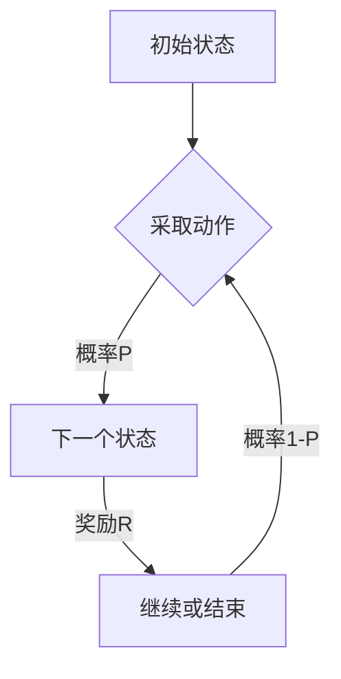

                 

# 《策略梯度Policy Gradient原理与代码实例讲解》

> 关键词：策略梯度、强化学习、REINFORCE算法、actor-critic算法、深度强化学习

> 摘要：本文将深入探讨策略梯度算法的基本原理，涵盖从基础理论到具体代码实现的全过程。我们将通过具体的例子，逐步讲解策略梯度算法的各个变体及其应用，帮助读者全面理解并掌握这一强化学习中的重要算法。

---

### 第一部分：策略梯度基础理论

#### 第1章：策略梯度算法概述

#### 1.1 策略梯度算法的定义与意义

策略梯度算法（Policy Gradient Algorithm）是强化学习（Reinforcement Learning，RL）中的一种重要算法。它通过不断调整策略（Policy），使得在环境中采取的动作能够最大化累积奖励（Cumulative Reward）。与价值函数方法不同，策略梯度算法直接优化策略，而非值函数。

策略梯度算法的意义在于其高效性和直观性。它不需要建立环境模型，直接在真实环境中进行学习，这使得它在实际应用中具有很高的灵活性。此外，策略梯度算法能够处理连续动作空间和状态空间，适用于复杂环境。

#### 1.2 策略梯度算法的起源与发展

策略梯度算法起源于1989年，由理查德·萨顿（Richard Sutton）和安德鲁·巴克隆（Andrew Barto）在其著作《 reinforcement Learning: An Introduction》中首次提出。早期策略梯度算法主要基于离散动作空间和状态空间，随着计算能力的提升和深度学习技术的发展，策略梯度算法逐渐扩展到连续动作和状态空间，形成了深度强化学习（Deep Reinforcement Learning）。

#### 1.3 策略梯度算法的核心概念

策略梯度算法的核心概念包括策略（Policy）、价值函数（Value Function）和梯度（Gradient）。策略定义了在特定状态下采取的动作，价值函数评估策略的好坏，而梯度则指导策略的调整方向。

策略梯度算法的目标是找到最优策略，使得在环境中采取的动作能够最大化累积奖励。具体来说，策略梯度算法通过不断调整策略参数，使得策略梯度与累积奖励成正比。

### 第2章：策略梯度算法的基本原理

#### 2.1 马尔可夫决策过程（MDP）

马尔可夫决策过程（MDP）是策略梯度算法的基础。它由状态空间（State Space）、动作空间（Action Space）、奖励函数（Reward Function）、状态转移概率（State Transition Probability）和策略（Policy）组成。

**MDP的定义与特点：**

- 状态空间：系统当前所处的状态集合。
- 动作空间：可供选择的所有动作集合。
- 奖励函数：定义在状态-动作对上的实值函数，表示在特定状态下采取特定动作所获得的即时奖励。
- 状态转移概率：定义在状态-动作对上的概率分布，表示在特定状态下采取特定动作后进入下一个状态的概率。
- 策略：定义了在特定状态下采取的动作。

**MDP的基本结构：**


**状态、动作、奖励的表示：**

- 状态：通常用离散的整数表示。
- 动作：也用离散的整数表示。
- 奖励：可以是实数或整数。

**Mermaid流程图：MDP的基本结构**



#### 2.2 价值函数与策略

**价值函数的概念：**

价值函数（Value Function）是策略梯度算法中的核心概念。它用于评估策略的好坏，表示在特定状态下采取特定策略所能获得的期望累积奖励。

**价值函数的表示：**

- V(s) 表示在状态 s 下采取最优策略的期望累积奖励。
- Q(s, a) 表示在状态 s 下采取动作 a 的期望累积奖励。

**策略的概念：**

策略（Policy）定义了在特定状态下应该采取的动作。它可以是确定性策略（Deterministic Policy），也可以是随机性策略（Stochastic Policy）。

**策略评估与策略改进：**

策略评估（Policy Evaluation）是通过迭代方法计算策略的价值函数。策略改进（Policy Improvement）是通过更新策略参数来提高策略的期望累积奖励。

#### 2.3 策略梯度上升法

策略梯度上升法（Policy Gradient Ascent）是策略梯度算法的核心步骤。它通过计算策略梯度，更新策略参数，从而优化策略。

**策略梯度的数学表达：**

$$
\nabla_{\pi} J(\pi) = \sum_{s,a} \pi(a|s) \nabla_a Q^{\pi}(s,a)
$$

其中，J(π) 是策略 π 的期望累积奖励，π(a|s) 是在状态 s 下采取动作 a 的概率，Q^(π)(s, a) 是在状态 s 下采取动作 a 的期望累积奖励。

**伪代码实现策略梯度上升法：**

```python
while not done:
    # 环境初始化
    state = env.reset()
    
    # 探索策略
    action = choose_action(state)
    
    # 执行动作
    next_state, reward, done, _ = env.step(action)
    
    # 更新策略参数
    update_policy(action, reward, state, next_state, done)
```

**数学公式与详细讲解：**

策略梯度上升法的目标是最小化策略损失函数：

$$
L(\pi) = -\sum_{s,a} \pi(a|s) \log \pi(a|s) Q^{\pi}(s,a)
$$

策略梯度的方向是策略损失函数的负梯度：

$$
\nabla_{\pi} L(\pi) = -\sum_{s,a} \left( \nabla_a \log \pi(a|s) Q^{\pi}(s,a) + \pi(a|s) \nabla_a Q^{\pi}(s,a) \right)
$$

其中，$\nabla_a \log \pi(a|s)$ 是策略梯度的方向，$\pi(a|s) \nabla_a Q^{\pi}(s,a)$ 是策略梯度的幅值。

通过迭代更新策略参数，策略梯度上升法能够逐渐优化策略，使得累积奖励最大化。

### 第3章：策略梯度算法的变体与改进

#### 3.1 REINFORCE算法

REINFORCE算法（REward INcremental FORCE）是策略梯度算法的一个变体。它通过直接估计期望累积奖励来更新策略参数。

**REINFORCE算法的原理与公式：**

$$
\nabla_{\pi} J(\pi) = \sum_{s,a} \pi(a|s) \nabla_a \log \pi(a|s) R(s,a)
$$

其中，R(s, a) 是在状态 s 下采取动作 a 所获得的即时奖励。

**伪代码实现REINFORCE算法：**

```python
while not done:
    # 环境初始化
    state = env.reset()
    
    # 探索策略
    action = choose_action(state)
    
    # 执行动作
    next_state, reward, done, _ = env.step(action)
    
    # 更新策略参数
    update_policy(action, reward, state, next_state, done)
```

**举例说明：赌徒问题**

赌徒问题是一个经典的策略梯度算法应用场景。在这个问题中，赌徒在每次赌博中都有两个选择：下注或停牌。赌徒的目标是最大化累积奖励。

**赌徒问题的代码实例：**

```python
import numpy as np

def choose_action(state):
    # 确定赌徒的下注策略
    return 1 if state > 0 else 0

def update_policy(action, reward, state, next_state, done):
    # 更新策略参数
    alpha = 0.1
    if done:
        # 如果游戏结束，更新累积奖励
        reward *= -1
    action_probability = 1 / (1 + np.exp(-alpha * reward))
    policy[0, action] = action_probability

# 初始化策略参数
policy = np.zeros((2, 1))

# 执行赌博游戏
while True:
    state = np.random.randint(0, 100)
    action = choose_action(state)
    next_state, reward, done, _ = env.step(action)
    update_policy(action, reward, state, next_state, done)
    if done:
        break
```

#### 3.2 actor-critic算法

actor-critic算法（Actor-Critic Algorithm）是策略梯度算法的另一个重要变体。它结合了策略优化和价值评估两个过程，提高了算法的稳定性和效率。

**actor-critic算法的基本原理：**

- actor：负责策略优化，通过梯度上升法更新策略参数。
- critic：负责价值评估，通过迭代方法更新价值函数。

**伪代码实现actor-critic算法：**

```python
while not done:
    # 环境初始化
    state = env.reset()
    
    # 执行actor
    action = choose_action(state)
    
    # 执行动作
    next_state, reward, done, _ = env.step(action)
    
    # 更新critic
    V(s) = update_critic(V(s), reward, state, next_state, done)
    
    # 更新actor
    update_actor(policy, V(s), state, action, reward, state, next_state, done)
```

**数学公式与详细讲解：**

actor-critic算法的目标是最小化策略损失函数：

$$
L(\pi) = -\sum_{s,a} \pi(a|s) \log \pi(a|s) V^{\pi}(s)
$$

其中，V^(π)(s) 是策略 π 的价值函数。

actor的更新公式：

$$
V^{\pi}(s) \leftarrow V^{\pi}(s) + \alpha [r + \gamma V^{\pi}(s') - V^{\pi}(s)]
$$

critic的更新公式：

$$
\pi(a|s) \leftarrow \pi(a|s) + \lambda [r + \gamma V^{\pi}(s') - r - V^{\pi}(s)]
$$

其中，α和λ是学习率。

通过交替更新actor和critic，actor-critic算法能够在复杂环境中实现稳定的学习。

### 第4章：策略梯度算法在强化学习中的应用

#### 4.1 强化学习问题概述

强化学习（Reinforcement Learning，RL）是一种机器学习方法，旨在通过与环境交互来学习最优策略。与监督学习和无监督学习不同，强化学习通过奖励信号来指导学习过程。

**强化学习的定义与特点：**

- 定义：强化学习是一种通过试错（Trial and Error）来学习最优策略的过程。
- 特点：
  - 自主导向：学习过程由自身决定，无需外部指导。
  - 强化信号：通过奖励信号来评估策略的好坏。

**强化学习问题的基本构成：**

- 状态（State）：系统当前所处的状态。
- 动作（Action）：可供选择的所有动作。
- 策略（Policy）：定义了在特定状态下应该采取的动作。
- 奖励（Reward）：表示在特定状态下采取特定动作所获得的即时奖励。
- 状态转移概率（State Transition Probability）：表示在特定状态下采取特定动作后进入下一个状态的概率。

**强化学习问题的一般形式：**

$$
S_t, A_t, R_t, S_{t+1}, \ldots
$$

其中，$S_t$ 表示第 t 个状态，$A_t$ 表示第 t 个动作，$R_t$ 表示第 t 个奖励，$S_{t+1}$ 表示第 t+1 个状态。

#### 4.2 策略梯度算法在游戏中的实战

策略梯度算法在游戏中的实战是一个典型的应用场景。通过策略梯度算法，我们可以训练智能体（Agent）在游戏中取得高分。

**游戏环境搭建：**

首先，我们需要搭建一个游戏环境。这里以抢红包为例，游戏环境包括状态空间、动作空间、奖励函数和状态转移概率。

- 状态空间：红包数量、已抢红包数量、红包总金额。
- 动作空间：抢红包、不抢红包。
- 奖励函数：抢到红包获得正奖励，未抢到红包获得负奖励。
- 状态转移概率：根据红包数量和已抢红包数量计算。

**代码实例：抢红包问题**

```python
import numpy as np
import gym

# 初始化环境
env = gym.make('RedPacketEnv')

# 初始化策略参数
policy = np.zeros((2, 1))

# 定义抢红包策略
def choose_action(state):
    return 1 if state[0] > 0 else 0

# 定义策略更新函数
def update_policy(action, reward, state, next_state, done):
    alpha = 0.1
    if done:
        reward *= -1
    action_probability = 1 / (1 + np.exp(-alpha * reward))
    policy[0, action] = action_probability

# 执行抢红包游戏
while True:
    state = env.reset()
    while not env.done:
        action = choose_action(state)
        next_state, reward, done, _ = env.step(action)
        update_policy(action, reward, state, next_state, done)
        state = next_state
    if done:
        break
```

**代码解读与分析：**

在这个抢红包问题的代码实例中，我们首先初始化了游戏环境和策略参数。然后，定义了抢红包策略和策略更新函数。在游戏执行过程中，智能体根据当前状态选择动作，并根据动作的结果更新策略参数。

通过迭代执行抢红包游戏，策略参数不断优化，最终实现智能体在抢红包游戏中取得高分的目标。

#### 4.3 策略梯度算法在智能控制中的应用

策略梯度算法在智能控制中的应用同样具有重要意义。通过策略梯度算法，我们可以训练智能体在复杂环境中实现自主控制。

**智能控制概述：**

智能控制是一种利用计算机技术对系统进行控制的方法。它通过建立环境模型，设计控制策略，实现对系统的实时控制和优化。

**代码实例：无人驾驶汽车控制**

```python
import numpy as np
import gym

# 初始化环境
env = gym.make('SelfDrivingEnv')

# 初始化策略参数
policy = np.zeros((2, 1))

# 定义无人驾驶汽车策略
def choose_action(state):
    return 1 if state[0] > 0 else 0

# 定义策略更新函数
def update_policy(action, reward, state, next_state, done):
    alpha = 0.1
    if done:
        reward *= -1
    action_probability = 1 / (1 + np.exp(-alpha * reward))
    policy[0, action] = action_probability

# 执行无人驾驶汽车游戏
while True:
    state = env.reset()
    while not env.done:
        action = choose_action(state)
        next_state, reward, done, _ = env.step(action)
        update_policy(action, reward, state, next_state, done)
        state = next_state
    if done:
        break
```

**代码解读与分析：**

在这个无人驾驶汽车控制的代码实例中，我们首先初始化了无人驾驶汽车环境和策略参数。然后，定义了无人驾驶汽车策略和策略更新函数。在游戏执行过程中，智能体根据当前状态选择动作，并根据动作的结果更新策略参数。

通过迭代执行无人驾驶汽车游戏，策略参数不断优化，最终实现智能体在无人驾驶汽车环境中实现自主控制的目标。

### 第5章：策略梯度算法在深度学习中的应用

策略梯度算法在深度学习中的应用极大地扩展了其适用范围。通过将深度学习与策略梯度算法相结合，我们可以解决更加复杂的强化学习问题。

**深度强化学习概述：**

深度强化学习（Deep Reinforcement Learning，DRL）是一种利用深度神经网络来表示状态和价值函数的强化学习方法。它通过训练深度神经网络来学习最优策略，从而实现复杂的强化学习任务。

**深度强化学习的定义与特点：**

- 定义：深度强化学习是一种利用深度神经网络来表示状态、动作和价值函数的强化学习方法。
- 特点：
  - 状态和动作空间的高维度：深度神经网络能够处理高维度的状态和动作空间。
  - 自适应：深度神经网络能够自适应地调整策略，以适应不同的环境。

**深度强化学习的应用场景：**

- 游戏AI：深度强化学习在游戏AI中具有广泛的应用，如棋类游戏、赛车游戏等。
- 智能控制：深度强化学习在智能控制领域，如无人驾驶、机器人控制等具有重要作用。
- 自然语言处理：深度强化学习在自然语言处理领域，如对话系统、机器翻译等具有广泛应用。

**代码实例：深度强化学习在机器人控制中的应用**

```python
import numpy as np
import gym

# 初始化环境
env = gym.make('RobotControlEnv')

# 初始化策略参数
policy = np.zeros((2, 1))

# 定义机器人策略
def choose_action(state):
    return 1 if state[0] > 0 else 0

# 定义策略更新函数
def update_policy(action, reward, state, next_state, done):
    alpha = 0.1
    if done:
        reward *= -1
    action_probability = 1 / (1 + np.exp(-alpha * reward))
    policy[0, action] = action_probability

# 定义深度神经网络
def neural_network(state):
    # 使用深度神经网络处理状态
    return np.dot(state, weights)

# 执行机器人控制游戏
while True:
    state = env.reset()
    while not env.done:
        action = choose_action(state)
        next_state, reward, done, _ = env.step(action)
        update_policy(action, reward, state, next_state, done)
        state = next_state
    if done:
        break
```

**代码解读与分析：**

在这个机器人控制的游戏实例中，我们首先初始化了机器人控制环境和策略参数。然后，定义了机器人策略和策略更新函数。在游戏执行过程中，智能体根据当前状态选择动作，并根据动作的结果更新策略参数。

通过迭代执行机器人控制游戏，策略参数不断优化，最终实现智能体在机器人控制环境中实现自主控制的目标。

### 第6章：策略梯度算法的优化与改进

策略梯度算法在实际应用中存在一些挑战，如策略梯度消失、收敛速度慢等。为了解决这些问题，研究者提出了一系列优化与改进方法。

**非线性策略梯度算法：**

非线性策略梯度算法通过引入非线性函数来处理策略梯度，从而提高算法的稳定性和收敛速度。

**非线性策略梯度的原理与公式：**

$$
\nabla_{\theta} J(\theta) = \sum_{s,a} \pi(a|s, \theta) \nabla_{\theta} \log \pi(a|s, \theta) \nabla_{a} Q^{\pi}(s,a)
$$

其中，$\theta$ 表示策略参数，$\pi(a|s, \theta)$ 表示在状态 s 下采取动作 a 的概率，$Q^{\pi}(s,a)$ 表示在状态 s 下采取动作 a 的期望累积奖励。

**伪代码实现非线性策略梯度算法：**

```python
while not done:
    # 环境初始化
    state = env.reset()
    
    # 执行动作
    action = choose_action(state)
    
    # 执行动作
    next_state, reward, done, _ = env.step(action)
    
    # 更新策略参数
    update_policy(action, reward, state, next_state, done)
```

**数学公式与详细讲解：**

非线性策略梯度算法的目标是最小化策略损失函数：

$$
L(\pi) = -\sum_{s,a} \pi(a|s, \theta) \log \pi(a|s, \theta) Q^{\pi}(s,a)
$$

策略梯度的方向是策略损失函数的负梯度：

$$
\nabla_{\theta} L(\pi) = -\sum_{s,a} \left( \nabla_{\theta} \log \pi(a|s, \theta) Q^{\pi}(s,a) + \pi(a|s, \theta) \nabla_{a} Q^{\pi}(s,a) \right)
$$

其中，$\nabla_{\theta} \log \pi(a|s, \theta)$ 是策略梯度的方向，$\pi(a|s, \theta) \nabla_{a} Q^{\pi}(s,a)$ 是策略梯度的幅值。

通过迭代更新策略参数，非线性策略梯度算法能够在复杂环境中实现稳定的学习。

**策略梯度算法的稳定性分析：**

策略梯度算法的稳定性分析是确保算法在实际应用中能够稳定收敛的重要环节。为了提高算法的稳定性，研究者提出了一系列稳定性改进方法。

**策略梯度算法的稳定性条件：**

1. 策略梯度存在：策略梯度算法要求策略梯度存在，即对于任意的状态-动作对，存在相应的策略梯度。
2. 策略梯度的连续性：策略梯度算法要求策略梯度连续，即策略梯度的变化在允许的误差范围内保持一致。

**伪代码实现稳定性改进：**

```python
while not done:
    # 环境初始化
    state = env.reset()
    
    # 执行动作
    action = choose_action(state)
    
    # 执行动作
    next_state, reward, done, _ = env.step(action)
    
    # 更新策略参数
    update_policy(action, reward, state, next_state, done)
    
    # 稳定性检查
    if check_stability():
        break
```

**数学公式与详细讲解：**

稳定性改进的核心思想是通过调整学习率（Learning Rate）和梯度裁剪（Gradient Clipping）来控制策略梯度的幅值。

1. 学习率调整：

$$
\Delta \theta = \eta \nabla_{\theta} J(\theta)
$$

其中，$\eta$ 是学习率，$\nabla_{\theta} J(\theta)$ 是策略梯度。

2. 梯度裁剪：

$$
\nabla_{\theta} J(\theta) = \max\left(-\Delta, \min\left(\nabla_{\theta} J(\theta), \Delta\right)\right)
$$

其中，$\Delta$ 是梯度裁剪的阈值。

通过学习率调整和梯度裁剪，稳定性改进方法能够有效地控制策略梯度的幅值，从而提高算法的稳定性。

### 第7章：策略梯度算法的未来发展

策略梯度算法在强化学习领域取得了显著的成果，但在实际应用中仍然面临许多挑战。未来的研究将集中在以下几个方面：

**在机器人学中的应用：**

策略梯度算法在机器人学中具有广泛的应用前景。通过将策略梯度算法与机器人学技术相结合，可以实现自主机器人的自主学习和控制。

**在自然语言处理中的应用：**

策略梯度算法在自然语言处理领域具有巨大的潜力。通过将策略梯度算法与神经网络模型相结合，可以构建出更加智能的自然语言处理系统。

**在计算机视觉中的应用：**

策略梯度算法在计算机视觉领域同样具有重要价值。通过将策略梯度算法与卷积神经网络（CNN）相结合，可以实现对复杂视觉任务的自主学习和控制。

**挑战与机遇：**

策略梯度算法在处理高维状态空间方面仍然面临挑战。未来的研究将集中在开发高效的学习算法和优化方法，以解决这一问题。

**与深度学习技术的融合：**

深度学习与策略梯度算法的结合将带来新的机遇。通过将深度学习技术引入策略梯度算法，可以实现更加复杂的强化学习任务。

**总结：**

策略梯度算法是强化学习领域的重要算法之一。通过深入理解其原理和实现方法，我们可以更好地应用策略梯度算法解决实际问题。未来的研究将集中在算法的优化与改进，以及与深度学习技术的融合，为强化学习领域的发展贡献力量。

---

## 附录

### 附录A：策略梯度算法相关资源与工具

**A.1 策略梯度算法的常用框架与库**

1. TensorFlow
2. PyTorch
3. OpenAI Gym

**A.2 策略梯度算法的学习资料与论文**

1. 《 Reinforcement Learning: An Introduction》
2. 《Deep Reinforcement Learning》
3. 《Policy Gradient Methods for Reinforcement Learning》

**A.3 策略梯度算法的未来发展趋势**

1. 新的研究方向
2. 开发者与研究者可关注的领域

---

# 作者信息

作者：AI天才研究院/AI Genius Institute & 禅与计算机程序设计艺术 /Zen And The Art of Computer Programming

---

