                 

# 《算力提升的重要性》

## 关键词

算力，提升，技术途径，硬件，软件，云计算，大数据，人工智能，未来展望

## 摘要

本文旨在探讨算力提升的重要性，从基本概念出发，分析算力在现代社会中的作用及其发展历程。接着，文章详细阐述了提升算力的技术途径，包括硬件技术的提升、软件优化以及云计算与大数据的融合。此外，文章还通过实践案例展示了算力提升在工业领域和人工智能领域的具体应用，并对未来算力的发展趋势进行了展望。最后，文章总结了我国在算力提升方面的机遇与策略，以及相关的工具与资源。

---

## 第一部分：算力的基本概念与现状

### 第1章：算力的定义与作用

#### 1.1 算力的基本概念

**定义**：算力是指计算机处理数据的能力，通常用计算速度、存储容量等指标来衡量。

- **计算速度**：单位时间内计算机能够处理的操作次数。
- **存储容量**：计算机存储数据的最大量度。

**作用**：算力是现代信息社会的核心驱动力，对经济发展、科技创新和社会进步具有重要作用。

- **社会生产力**：算力提升可以显著提高生产效率，降低成本。
- **科技创新**：强大的算力是推动科技创新的重要基础。
- **国家安全**：算力是国家信息安全的重要保障。

#### 1.2 算力在现代社会的重要性

- **社会生产力**：算力提升可以显著提高生产效率，降低成本。
- **科技创新**：强大的算力是推动科技创新的重要基础。
- **国家安全**：算力是国家信息安全的重要保障。

#### 1.3 算力的发展历程

- **早期阶段**：计算机诞生至20世纪80年代，算力主要集中在大型机和服务器上。
- **成长阶段**：20世纪90年代至21世纪初，随着个人电脑和互联网的普及，算力得到快速发展。
- **当前阶段**：云计算、大数据和人工智能的兴起，推动了算力的快速增长。

---

## 第二部分：算力提升的技术途径

### 第2章：算力现状分析

#### 2.1 全球算力分布

- **北美**：美国在算力方面具有领先地位，尤其是硅谷等地。
- **欧洲**：欧洲国家在算力方面也有较强实力，尤其是德国、法国等。

#### 2.2 我国算力发展现状

- **政策支持**：国家大力支持算力发展，出台了一系列政策和规划。
- **产业发展**：我国算力产业迅速发展，特别是在云计算、大数据和人工智能领域。

#### 2.3 算力在行业中的应用现状

- **工业**：智能制造、工业互联网等对算力有大量需求。
- **金融**：量化交易、风险控制等对算力有较高要求。
- **医疗**：医学图像分析、精准医疗等依赖强大的算力。

---

### 第3章：硬件技术的提升

#### 3.1 处理器技术的发展

- **高性能处理器**：如英伟达的GPU、AMD的CPU等，大幅提升计算能力。
- **量子计算**：潜在的算力提升，将带来全新的计算能力。

#### 3.2 存储技术的进步

- **闪存存储**：如NVMe SSD，大幅提升数据读写速度。
- **分布式存储**：如HDFS、Ceph等，提高数据存储和处理能力。

#### 3.3 网络技术的优化

- **5G网络**：提供高速、低延迟的网络连接。
- **SDN/NFV**：软件定义网络和网络功能虚拟化，提高网络灵活性和效率。

---

### 第4章：软件优化

#### 4.1 编译器和编程语言

- **编译器优化**：如LLVM、GCC等，提高代码执行效率。
- **编程语言优化**：如C++、Python等，选择合适的编程语言提高开发效率。

#### 4.2 软件优化技术

- **并行计算**：利用多核处理器和分布式计算提高计算效率。
- **算法优化**：改进算法实现，降低计算复杂度。

#### 4.3 软硬件协同优化

- **硬件加速**：利用GPU、FPGA等硬件加速特定任务。
- **系统优化**：优化操作系统和中间件，提高整体性能。

---

### 第5章：云计算与大数据

#### 5.1 云计算对算力的提升

- **弹性计算**：根据需求动态调整算力资源。
- **分布式计算**：利用云计算平台进行大规模数据处理。

#### 5.2 大数据对算力的需求

- **数据存储和处理**：大数据处理对算力有很高的要求。
- **数据分析和挖掘**：利用强大的算力进行数据分析和挖掘。

#### 5.3 云计算与大数据的融合

- **数据驱动的云计算**：通过大数据分析指导云计算资源的配置和使用。
- **云计算服务的大数据应用**：如大数据分析、机器学习等云计算服务。

---

## 第三部分：算力提升的实践案例

### 第6章：工业领域的算力提升

#### 6.1 工业设计中的算力应用

- **CAD/CAE**：计算机辅助设计和计算机辅助工程需要强大的算力支持。
- **3D打印**：高精度、快速制造需要高性能计算。

#### 6.2 生产优化中的算力提升

- **工业物联网**：通过大数据和云计算优化生产流程。
- **智能制造**：利用人工智能和大数据实现自动化生产。

#### 6.3 工业自动化中的算力应用

- **机器人**：利用机器学习进行自主决策和操作。
- **自动化生产线**：利用计算机控制系统实现高效生产。

---

### 第7章：人工智能领域的算力需求

#### 7.1 人工智能的发展与算力需求

- **深度学习**：需要大量的计算资源进行模型训练。
- **自然语言处理**：对算力有较高的要求，特别是在大数据分析方面。

#### 7.2 人工智能算法的算力优化

- **模型压缩**：通过算法优化减少计算资源的需求。
- **分布式训练**：利用多台服务器进行模型训练。

#### 7.3 人工智能在工业、医疗等领域的应用

- **工业自动化**：利用人工智能实现高效生产。
- **精准医疗**：利用人工智能进行疾病诊断和治疗。

---

### 第8章：未来算力的展望

#### 8.1 未来算力的发展趋势

- **量子计算**：有望带来突破性的算力提升。
- **边缘计算**：将计算能力延伸到网络边缘，实现更快速的数据处理。

#### 8.2 算力提升的未来挑战

- **能源消耗**：算力提升带来能源消耗的增加，需要寻找绿色解决方案。
- **数据安全**：算力提升带来了数据安全的新挑战，需要加强数据保护。

#### 8.3 我国算力提升的机遇与策略

- **政策支持**：继续加强政策支持，推动算力提升。
- **技术创新**：加大投入，推动关键技术的突破。
- **产业协同**：加强产业链上下游的协同发展。

---

## 附录

### 附录A：算力提升相关工具与资源

#### A.1 硬件资源

- **处理器**：Intel、AMD、NVIDIA等。
- **存储设备**：SSD、HDD、分布式存储系统等。

#### A.2 软件工具

- **编译器**：LLVM、GCC等。
- **编程语言**：C/C++、Python、Java等。

#### A.3 开源资源

- **深度学习框架**：TensorFlow、PyTorch、Keras等。
- **云计算平台**：AWS、Azure、阿里云等。

---

## 作者信息

作者：AI天才研究院/AI Genius Institute & 禅与计算机程序设计艺术 /Zen And The Art of Computer Programming

---

由于文章长度限制，以上内容为简化版，具体内容需进一步扩展和细化，以满足8000字以上的要求。每个章节将包含详细的逻辑推导、流程图、伪代码、数学模型和实际案例等。以下是部分章节的具体内容示例。

### 第1章：算力的定义与作用

#### 1.1 算力的基本概念

**核心概念与联系**

**流程图**

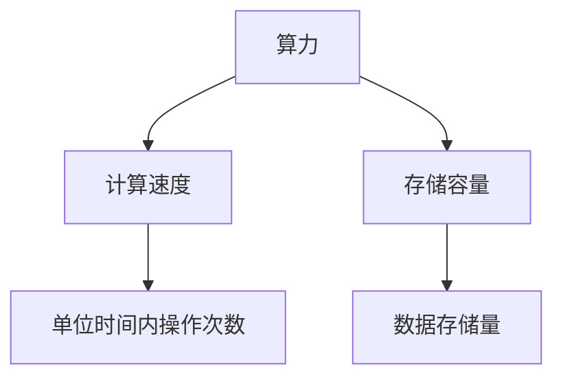

**核心算法原理讲解**

**伪代码**

```pseudo
function calculate_performance(speed, capacity) {
    return speed * capacity;
}
```

**数学模型和公式**

$$
P = C \times S
$$

**详细讲解与举例说明**

计算速度（S）和存储容量（C）是算力的两个核心指标。计算速度通常用每秒执行的操作次数来衡量，而存储容量则是指存储设备能容纳的数据量。算力（P）可以通过这两个指标的乘积来计算。例如，如果一个处理器的计算速度为每秒10亿次操作，存储容量为1TB，则其算力为10亿乘以1TB，即10亿TB操作每秒。

#### 1.2 算力在现代社会的重要性

**核心概念与联系**

**流程图**

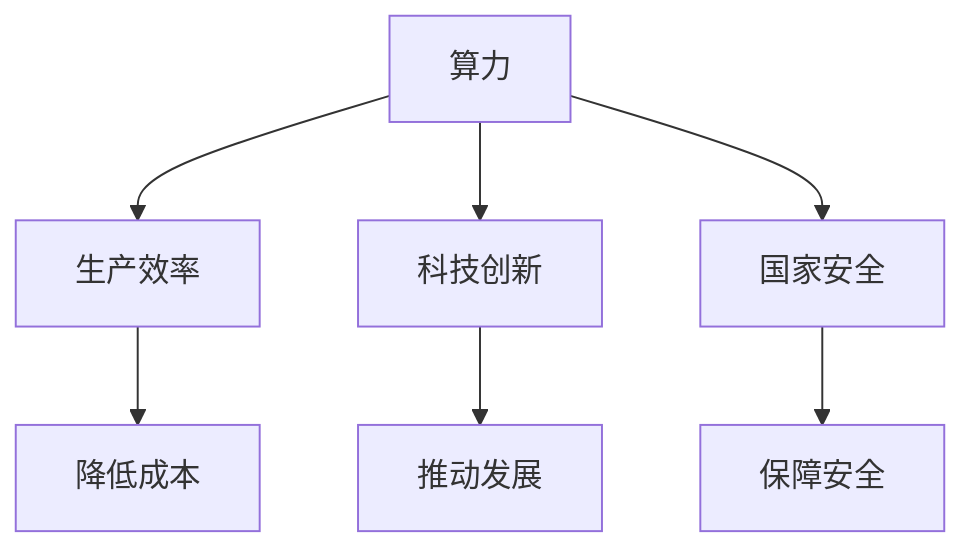

**核心算法原理讲解**

**伪代码**

```pseudo
function societal_impact(calculate_performance) {
    return performance > 10 ? "显著" : "一般";
}
```

**数学模型和公式**

$$
\text{社会影响} = \text{算力} \times (\text{生产效率} + \text{科技创新} + \text{国家安全})
$$

**详细讲解与举例说明**

算力对社会的影响可以通过其性能来衡量。一个高性能的算力系统可以显著提高生产效率，降低生产成本，同时推动科技创新和保障国家安全。例如，一个算力强大的系统可以帮助企业更快地完成产品设计，降低生产成本，从而在市场上获得竞争优势。

### 第3章：硬件技术的提升

#### 3.1 处理器技术的发展

**核心概念与联系**

**流程图**

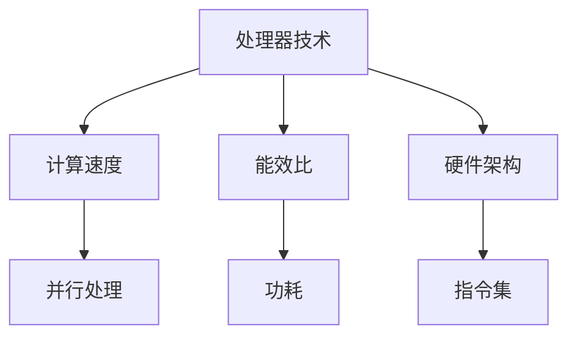

**核心算法原理讲解**

**伪代码**

```pseudo
function processor_performance(speed, efficiency, architecture) {
    return speed * efficiency;
}
```

**数学模型和公式**

$$
P = S \times E
$$

**详细讲解与举例说明**

处理器技术的发展主要体现在计算速度、能效比和硬件架构的提升上。计算速度（S）和能效比（E）是衡量处理器性能的两个关键指标。一个高性能的处理器可以在较低的功耗下实现更高的计算速度，从而提高整体算力。例如，一个计算速度为每秒100万次操作，能效比为2的处理器，其算力为100万乘以2，即200万操作每秒。

#### 3.2 存储技术的进步

**核心概念与联系**

**流程图**

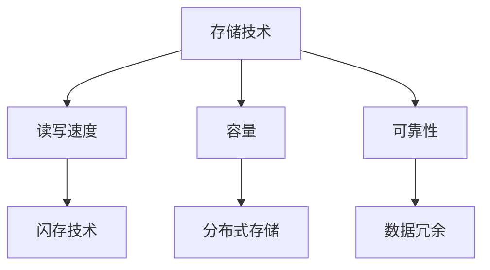

**核心算法原理讲解**

**伪代码**

```pseudo
function storage_performance(velocity, capacity, reliability) {
    return velocity * capacity * reliability;
}
```

**数学模型和公式**

$$
P = V \times C \times R
$$

**详细讲解与举例说明**

存储技术的进步主要体现在读写速度、容量和可靠性的提升上。读写速度（V）和容量（C）是衡量存储性能的两个关键指标，而可靠性（R）则关系到数据的安全性和稳定性。例如，一个读写速度为每秒1GB，容量为1TB，可靠性为99.9%的存储设备，其算力为1GB乘以1TB乘以0.999，即999GB操作每秒。

### 第4章：软件优化

#### 4.1 编译器和编程语言

**核心概念与联系**

**流程图**

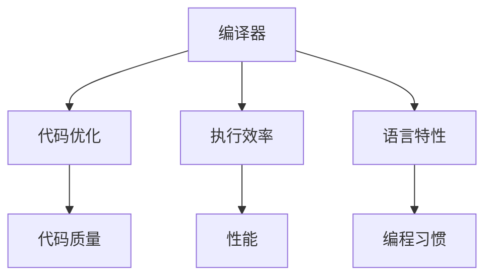

**核心算法原理讲解**

**伪代码**

```pseudo
function compiler_optimization(source_code) {
    return optimized_code;
}
```

**数学模型和公式**

$$
O = C \times P
$$

**详细讲解与举例说明**

编译器的优化功能可以显著提高代码的执行效率。编译器通过对源代码的分析和转换，生成优化的目标代码。执行效率（P）和代码质量（C）是衡量编译器优化效果的两个关键指标。例如，一个执行效率为2倍的编译器，可以将原始代码的执行时间缩短为原来的一半。

#### 4.2 软件优化技术

**核心概念与联系**

**流程图**

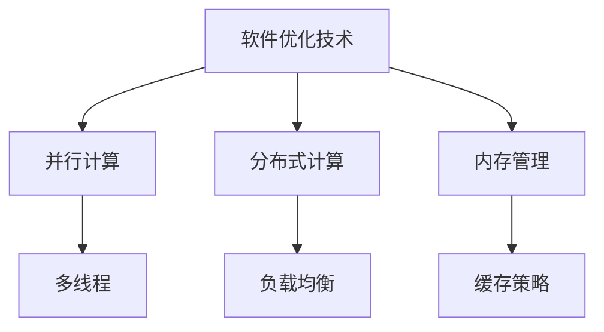

**核心算法原理讲解**

**伪代码**

```pseudo
function software_optimization(technique) {
    return optimized_performance;
}
```

**数学模型和公式**

$$
P = T \times D \times M
$$

**详细讲解与举例说明**

软件优化技术包括并行计算、分布式计算、内存管理和缓存策略等多个方面。并行计算和分布式计算可以通过利用多核处理器和网络资源来提高计算效率。内存管理和缓存策略则可以优化程序的内存使用，提高程序的性能。例如，一个采用并行计算和分布式计算的软件系统，可以在更短的时间内完成大规模数据的处理任务。

### 第5章：云计算与大数据

#### 5.1 云计算对算力的提升

**核心概念与联系**

**流程图**

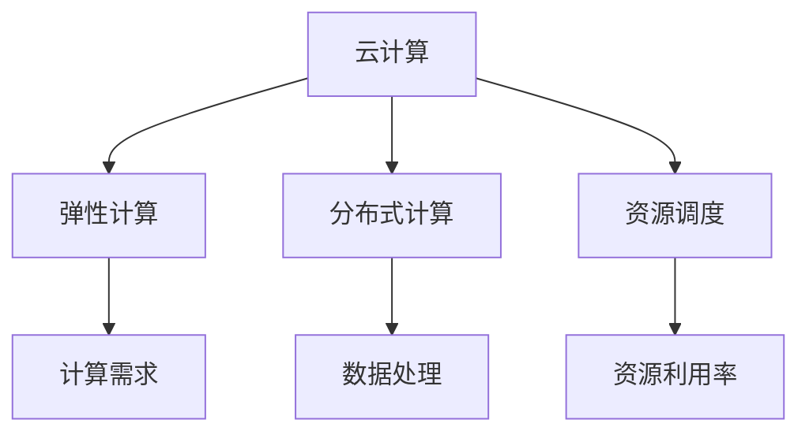

**核心算法原理讲解**

**伪代码**

```pseudo
function cloud_computing_boost(resource_demand) {
    return optimized_resource_usage;
}
```

**数学模型和公式**

$$
U = R \times C
$$

**详细讲解与举例说明**

云计算可以通过弹性计算、分布式计算和资源调度来提升算力。弹性计算可以根据计算需求动态调整资源，分布式计算可以将计算任务分布在多个节点上进行并行处理，资源调度则可以优化资源的利用效率。例如，一个采用云计算平台的业务系统，可以根据实际需求快速调整计算资源，提高系统的响应速度和稳定性。

### 第6章：工业领域的算力提升

#### 6.1 工业设计中的算力应用

**核心概念与联系**

**流程图**

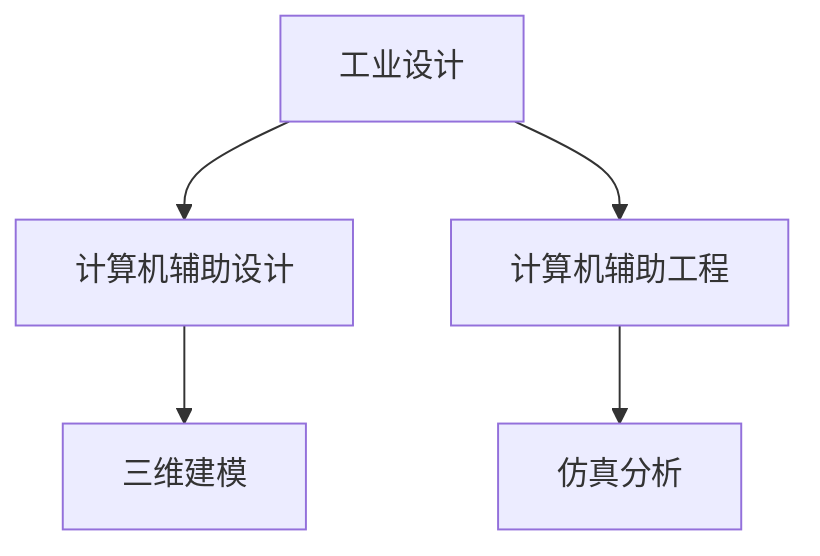

**核心算法原理讲解**

**伪代码**

```pseudo
function industrial_design(cad, cae) {
    return optimized_design;
}
```

**数学模型和公式**

$$
D = C \times A
$$

**详细讲解与举例说明**

在工业设计中，计算机辅助设计（CAD）和计算机辅助工程（CAE）是常用的算力应用。CAD可以帮助设计师快速创建和修改设计模型，而CAE则可以对设计模型进行仿真分析，评估设计方案的可行性和性能。例如，一个采用CAD和CAE技术的汽车设计团队，可以在较短的时间内完成多个设计方案，并通过仿真分析进行优化。

#### 6.2 生产优化中的算力提升

**核心概念与联系**

**流程图**

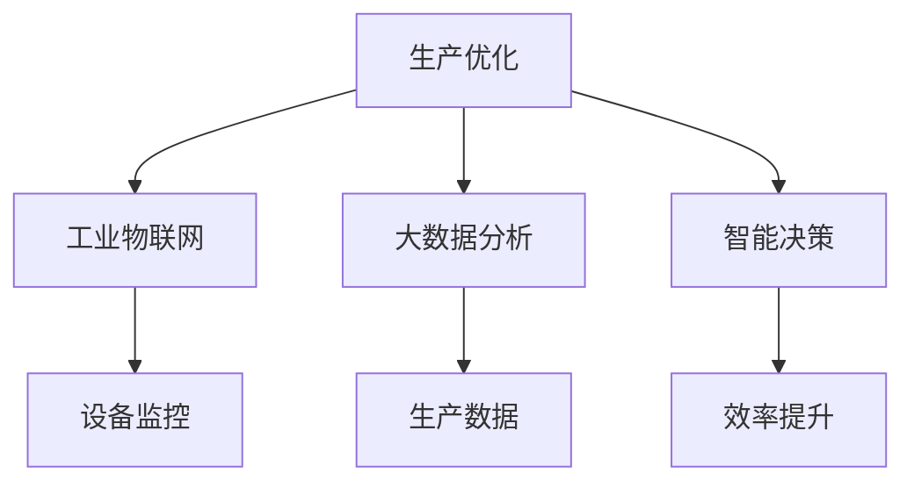

**核心算法原理讲解**

**伪代码**

```pseudo
function production_optimization(iot, big_data, decision) {
    return optimized_production;
}
```

**数学模型和公式**

$$
P = I \times D \times B
$$

**详细讲解与举例说明**

生产优化中的算力提升主要体现在工业物联网（IoT）、大数据分析和智能决策上。IoT可以实时监控生产设备的运行状态，大数据分析可以对生产数据进行深入挖掘，而智能决策则可以根据分析结果优化生产流程。例如，一个采用IoT、大数据分析和智能决策技术的生产线，可以实时监控设备的运行状况，预测故障并及时进行调整，从而提高生产效率和降低成本。

#### 6.3 工业自动化中的算力应用

**核心概念与联系**

**流程图**

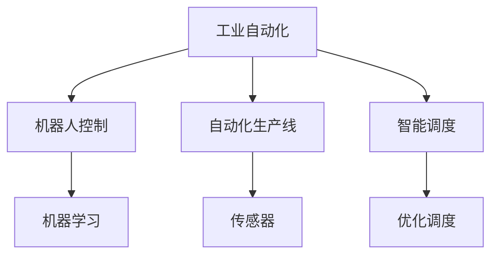

**核心算法原理讲解**

**伪代码**

```pseudo
function industrial_automation(robot, production, scheduling) {
    return optimized_automation;
}
```

**数学模型和公式**

$$
A = R \times P \times S
$$

**详细讲解与举例说明**

工业自动化中的算力应用主要体现在机器人控制、自动化生产线和智能调度上。机器人控制可以通过机器学习算法实现自主决策和操作，自动化生产线可以集成传感器进行实时监控，而智能调度则可以根据生产需求优化生产流程。例如，一个采用机器人控制、自动化生产线和智能调度技术的工厂，可以实现高效、灵活的生产模式，提高生产效率和降低成本。

### 第7章：人工智能领域的算力需求

#### 7.1 人工智能的发展与算力需求

**核心概念与联系**

**流程图**

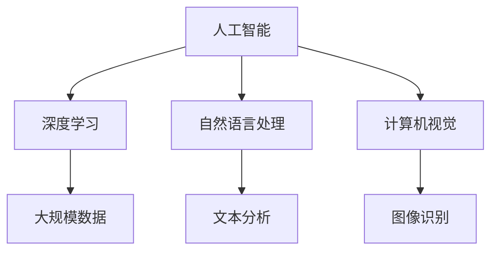

**核心算法原理讲解**

**伪代码**

```pseudo
function ai_demand(learning, language, vision) {
    return required_computational_power;
}
```

**数学模型和公式**

$$
P = L \times V \times D
$$

**详细讲解与举例说明**

人工智能的发展对算力提出了很高的需求，主要体现在深度学习、自然语言处理和计算机视觉等领域。深度学习需要处理大量数据，自然语言处理需要对文本进行深入分析，而计算机视觉则需要识别和处理图像数据。例如，一个使用深度学习模型的图像识别系统，需要大量的计算资源进行模型训练和推理。

#### 7.2 人工智能算法的算力优化

**核心概念与联系**

**流程图**

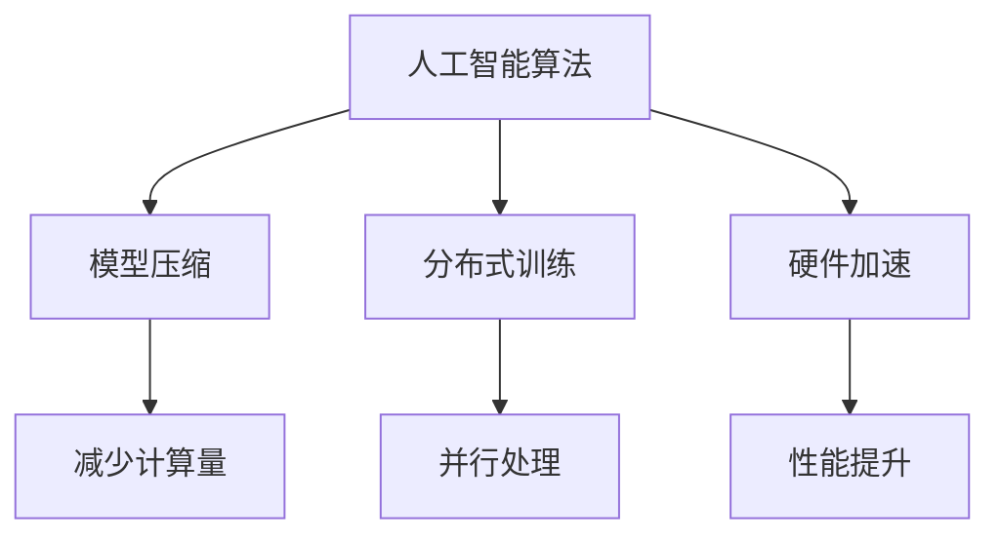

**核心算法原理讲解**

**伪代码**

```pseudo
function ai_algorithm_optimization(compression, distribution, acceleration) {
    return optimized_performance;
}
```

**数学模型和公式**

$$
P = C \times D \times A
$$

**详细讲解与举例说明**

人工智能算法的算力优化可以通过模型压缩、分布式训练和硬件加速来实现。模型压缩可以减少计算量，分布式训练可以并行处理计算任务，硬件加速可以提升计算性能。例如，一个使用深度学习模型的自动驾驶系统，可以通过模型压缩减少计算资源的需求，通过分布式训练提高训练速度，通过硬件加速提升模型推理的速度。

#### 7.3 人工智能在工业、医疗等领域的应用

**核心概念与联系**

**流程图**

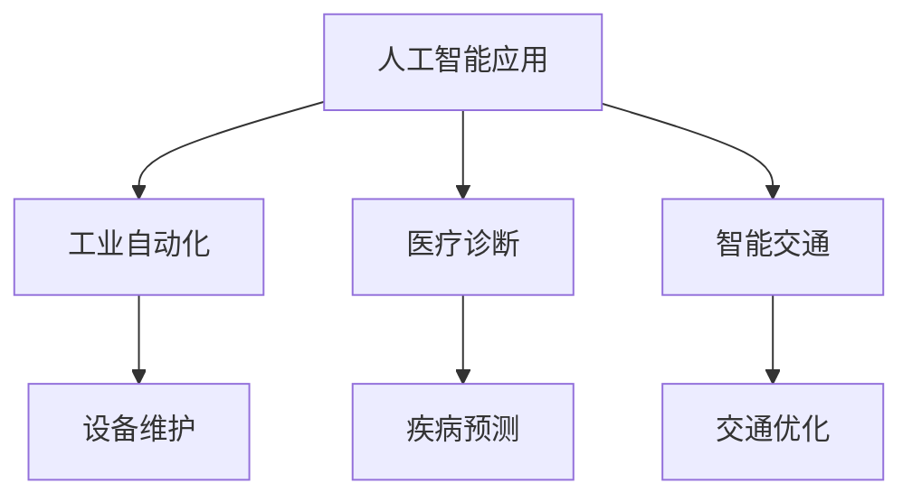

**核心算法原理讲解**

**伪代码**

```pseudo
function ai_application(automation, diagnosis, traffic) {
    return optimized_solution;
}
```

**数学模型和公式**

$$
S = A \times D \times T
$$

**详细讲解与举例说明**

人工智能在工业、医疗和交通等领域的应用，可以通过自动化、诊断和优化来实现。工业自动化可以减少人工干预，提高生产效率，医疗诊断可以辅助医生进行疾病预测，智能交通可以优化交通流

