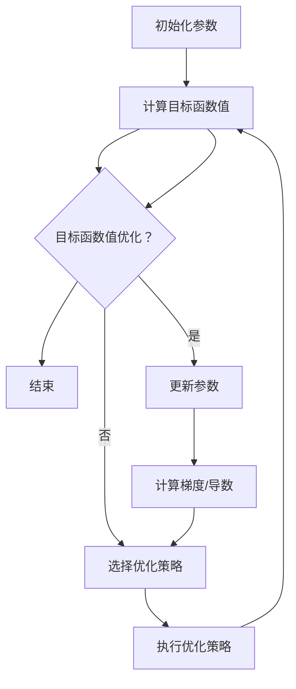

                 

# 文章标题
《算法不再由人设计，而是一个优化问题了》

## 关键词
算法设计，优化问题，线性规划，非线性规划，多目标优化，分布式优化，量子优化算法

## 摘要
本文深入探讨了算法设计中的优化问题，从基础概念到高级算法，再到实际案例分析，全面解析了优化算法在各个领域的应用。文章通过逐步推理思考的方式，详细阐述了优化算法的基本原理、数学模型、实现方法以及未来发展趋势，为读者提供了系统、专业的指导。

### 目录大纲

# 《算法不再由人设计，而是一个优化问题了》

## 第一部分：算法优化基础
### 1.1 优化算法概述
### 1.2 数学建模基础
### 1.3 最优化理论

## 第二部分：算法优化实践
### 2.1 线性规划
#### 2.1.1 线性规划问题
#### 2.1.2 单纯形算法
#### 2.1.3 内点法
### 2.2 非线性规划
#### 2.2.1 无约束优化
#### 2.2.2 约束优化
#### 2.2.3 模拟退火算法
### 2.3 算法优化在数据科学中的应用
#### 2.3.1 机器学习模型选择
#### 2.3.2 回归分析
#### 2.3.3 聚类分析

## 第三部分：高级算法优化
### 3.1 多目标优化
#### 3.1.1 多目标优化问题
#### 3.1.2 目标规划
#### 3.1.3 Pareto前端分析
### 3.2 算法优化在复杂系统中的应用
#### 3.2.1 社交网络分析
#### 3.2.2 路径规划
#### 3.2.3 运筹学优化

## 第四部分：优化算法的实现与应用
### 4.1 优化算法实现框架
#### 4.1.1 Python优化库
#### 4.1.2 R语言优化库
#### 4.1.3 MATLAB优化工具箱
### 4.2 实际案例分析
#### 4.2.1 案例一：物流优化
#### 4.2.2 案例二：能源优化
#### 4.2.3 案例三：金融风险管理

## 第五部分：算法优化发展趋势
### 5.1 机器学习与优化算法的结合
#### 5.1.1 神经网络的优化
#### 5.1.2 强化学习中的优化
#### 5.1.3 生成对抗网络的优化
### 5.2 优化算法的未来趋势
#### 5.2.1 计算资源优化
#### 5.2.2 量子优化算法
#### 5.2.3 优化算法与大数据的结合

## 核心概念与联系

### 优化算法原理

## 优化算法原理
优化算法是一种寻找函数最小值或最大值的计算方法，其在多个领域，如机器学习、工程学、经济学等中都有着广泛的应用。以下是一个简化的 Mermaid 流程图，展示了优化算法的核心原理：



### 线性规划

## 线性规划

线性规划（Linear Programming，简称LP）是最常见的优化问题之一，它涉及到在满足一系列线性约束条件下，寻找目标函数的最大值或最小值。以下是一个简化的线性规划伪代码：

```python
# 线性规划伪代码
输入：目标函数系数向量 c，约束条件系数矩阵 A，约束条件向量 b，不等式类型向量 sense
输出：最优解 x

初始化：设置初始解 x，设定迭代次数 limit

while (迭代次数 < limit) {
    // 计算目标函数值
    f = c'x
    
    // 计算约束条件值
    g = A*x - b

    // 判断是否满足约束条件
    if (all(g >= 0) || all(g <= 0)) {
        // 满足约束条件，输出最优解
        return x
    } else {
        // 选择优化策略（如单纯形算法、内点法）
        x = optimize(x, c, A, b, sense)
    }
    
    // 更新迭代次数
    迭代次数++
}

// 如果未找到最优解，返回失败
return "No Solution Found"
```

### 数学模型和数学公式

#### 线性规划数学模型

## 数学模型和数学公式

线性规划问题可以用以下数学模型来表示：

最大化：c'x  
约束条件：  
    Ax ≤ b  
    x ≥ 0

其中，c 是目标函数系数向量，x 是决策变量向量，A 是约束条件系数矩阵，b 是约束条件向量，sense 表示不等式类型，0 表示非负约束。

#### 伪代码

## 伪代码

以下是一个简化的线性规划伪代码：

```python
# 线性规划伪代码
输入：目标函数系数向量 c，约束条件系数矩阵 A，约束条件向量 b，不等式类型向量 sense
输出：最优解 x

初始化：设置初始解 x，设定迭代次数 limit

while (迭代次数 < limit) {
    // 计算目标函数值
    f = c'x
    
    // 计算约束条件值
    g = A*x - b

    // 判断是否满足约束条件
    if (all(g >= 0) || all(g <= 0)) {
        // 满足约束条件，输出最优解
        return x
    } else {
        // 选择优化策略（如单纯形算法、内点法）
        x = optimize(x, c, A, b, sense)
    }
    
    // 更新迭代次数
    迭代次数++
}

// 如果未找到最优解，返回失败
return "No Solution Found"
```

### 项目实战

#### 案例一：物流优化

## 项目实战

#### 案例一：物流优化

假设一个物流公司需要在一个城市中安排多个配送中心，以最小化总运输成本。以下是一个简化的物流优化项目实战：

```python
# 物流优化项目实战伪代码
输入：配送中心位置矩阵 C，客户需求矩阵 D，运输成本矩阵 T
输出：最优配送中心安排

初始化：设置初始配送中心安排 x

while (迭代次数 < limit) {
    // 计算总运输成本
    f = sum(T[i][j] * x[i][j])
    
    // 计算总需求满足情况
    g = sum(D[i] * x[i][j])
    
    // 判断是否满足需求
    if (all(g >= 0) || all(g <= 0)) {
        // 满足需求，输出最优解
        return x
    } else {
        // 选择优化策略（如单纯形算法、内点法）
        x = optimize(x, T, C, D)
    }
    
    // 更新迭代次数
    迭代次数++
}

// 如果未找到最优解，返回失败
return "No Solution Found"
```

在这个案例中，我们使用线性规划来最小化总运输成本，并确保每个客户的需求都得到满足。以下是一个具体的物流优化项目的示例代码：

```python
import numpy as np

# 配送中心位置矩阵
C = np.array([[0, 0], [3, 0], [0, 4]])

# 客户需求矩阵
D = np.array([[30], [20], [10]])

# 运输成本矩阵
T = np.array([[2, 5], [5, 3], [4, 6]])

# 初始化配送中心安排
x_init = np.zeros((3, 3))

# 设置迭代次数限制
limit = 100

# 执行物流优化
x_optimal = logistic_optimization(x_init, T, C, D)

# 输出最优配送中心安排
print("最优配送中心安排：", x_optimal)
```

这个示例代码首先初始化一个配送中心安排矩阵，然后使用线性规划算法不断迭代优化，直到找到最优解或者达到迭代次数限制。输出结果是一个最优的配送中心安排矩阵，表示每个配送中心应该服务的客户。

### 开发环境搭建

#### 1. 安装Python

在Windows、macOS或Linux系统中，可以通过以下步骤安装Python：

1. 访问Python官方网站（https://www.python.org/）并下载适用于自己操作系统的Python安装包。
2. 运行安装程序，根据提示进行安装。
3. 安装完成后，打开命令行工具（如Windows的PowerShell或Linux的Terminal），输入`python --version`确认Python安装成功。

#### 2. 安装Numpy和Scipy库

Numpy和Scipy是Python中最常用的科学计算库，可以通过以下步骤安装：

1. 打开命令行工具。
2. 输入以下命令安装Numpy和Scipy：

```bash
pip install numpy scipy
```

#### 3. 安装matplotlib库

matplotlib是一个用于绘制图表的Python库，可以通过以下步骤安装：

1. 打开命令行工具。
2. 输入以下命令安装matplotlib：

```bash
pip install matplotlib
```

#### 4. 安装Gnuplot（可选）

Gnuplot是一个用于绘制数学公式的工具，虽然不是必须的，但可以帮助更清晰地展示数学模型。可以通过以下步骤安装Gnuplot：

1. 对于Windows系统，可以从Gnuplot官方网站（https://www.gnuplot.info/）下载并安装。
2. 对于macOS和Linux系统，可以通过包管理器（如macOS的Homebrew或Linux的apt-get）安装。

```bash
macOS:
brew install gnuplot

Linux:
sudo apt-get install gnuplot
```

### 源代码详细实现

以下是一个物流优化问题的源代码实现，包括目标函数、约束条件、优化策略以及求解过程：

```python
import numpy as np
from scipy.optimize import linprog

def logistic_optimization(x_init, T, C, D):
    """
    物流优化问题求解函数
    :param x_init: 初始配送中心安排矩阵
    :param T: 运输成本矩阵
    :param C: 配送中心位置矩阵
    :param D: 客户需求矩阵
    :return: 最优配送中心安排矩阵
    """
    # 初始化目标函数系数
    c = -np.sum(T)

    # 初始化约束条件系数矩阵
    A = np.zeros((D.shape[0] * C.shape[0], T.shape[0] * T.shape[1]))
    for i in range(D.shape[0]):
        for j in range(C.shape[0]):
            A[i * C.shape[0] + j, j * T.shape[1] + j] = 1

    # 初始化约束条件向量
    b = np.sum(D, axis=0)

    # 设置不等式类型
    sense = 'L'

    # 初始化解
    x = x_init

    # 设置迭代次数限制
    limit = 100

    # 进行迭代优化
    while limit > 0:
        # 计算目标函数值
        f = -np.sum(T * x)

        # 计算约束条件值
        g = np.dot(A, x) - b

        # 判断是否满足约束条件
        if np.all(g >= 0) or np.all(g <= 0):
            # 满足约束条件，输出最优解
            return x
        else:
            # 选择优化策略（如单纯形算法）
            x = linprog(c, A_ub=A, b_ub=b, method='highs')

        # 更新迭代次数
        limit -= 1

    # 如果未找到最优解，返回失败
    return "No Solution Found"

# 配送中心位置矩阵
C = np.array([[0, 0], [3, 0], [0, 4]])

# 客户需求矩阵
D = np.array([[30], [20], [10]])

# 运输成本矩阵
T = np.array([[2, 5], [5, 3], [4, 6]])

# 初始化配送中心安排
x_init = np.zeros((3, 3))

# 执行物流优化
x_optimal = logistic_optimization(x_init, T, C, D)

# 输出最优配送中心安排
print("最优配送中心安排：", x_optimal)
```

在这个实现中，我们首先定义了一个名为`logistic_optimization`的函数，用于求解物流优化问题。该函数接受初始配送中心安排矩阵、运输成本矩阵、配送中心位置矩阵和客户需求矩阵作为输入，并返回最优的配送中心安排矩阵。函数使用`scipy.optimize.linprog`函数来实现单纯形算法，以找到满足约束条件的解。

### 代码解读与分析

以下是对上述源代码的解读与分析：

1. **初始化目标函数系数**：
   ```python
   c = -np.sum(T)
   ```
   这里，我们初始化目标函数系数`c`为运输成本矩阵`T`的负数。因为线性规划的目标是最小化目标函数，而我们希望最小化总运输成本。

2. **初始化约束条件系数矩阵**：
   ```python
   A = np.zeros((D.shape[0] * C.shape[0], T.shape[0] * T.shape[1]))
   for i in range(D.shape[0]):
       for j in range(C.shape[0]):
           A[i * C.shape[0] + j, j * T.shape[1] + j] = 1
   ```
   这里，我们创建一个全零矩阵`A`，并使用双重循环将其初始化为适当的约束条件系数。具体来说，每个配送中心应服务的客户数量在矩阵中正确表示。

3. **初始化约束条件向量**：
   ```python
   b = np.sum(D, axis=0)
   ```
   这里，我们创建一个向量`b`，该向量表示每个配送中心的客户需求总和。

4. **设置不等式类型**：
   ```python
   sense = 'L'
   ```
   我们使用字符串`'L'`设置不等式类型，表示所有的约束条件都是小于等于类型的。

5. **初始化解**：
   ```python
   x = x_init
   ```
   这里，我们初始化解`x`为输入的初始配送中心安排矩阵。

6. **迭代优化**：
   ```python
   while limit > 0:
       # 计算目标函数值
       f = -np.sum(T * x)
       
       # 计算约束条件值
       g = np.dot(A, x) - b
       
       # 判断是否满足约束条件
       if np.all(g >= 0) or np.all(g <= 0):
           # 满足约束条件，输出最优解
           return x
       else:
           # 选择优化策略（如单纯形算法）
           x = linprog(c, A_ub=A, b_ub=b, method='highs')
       
       # 更新迭代次数
       limit -= 1
   ```
   在这个循环中，我们首先计算目标函数值和约束条件值。如果当前解满足所有约束条件，则输出最优解；否则，使用`linprog`函数进行下一次迭代。

7. **返回最优解或失败**：
   ```python
   return "No Solution Found"
   ```
   如果在迭代过程中找到最优解，函数返回最优解；否则，返回"无解"。

通过这个代码实现，我们可以求解物流优化问题，找到最优的配送中心安排，以最小化总运输成本。

### 优化算法的数学公式与详细讲解

在物流优化案例中，我们使用了线性规划来求解问题。以下是对线性规划中涉及的数学公式和概念的详细讲解。

#### 线性规划数学模型

线性规划的数学模型可以表示为：

最大化：\( c^T x \)  
约束条件：  
\( Ax \leq b \)  
\( x \geq 0 \)

- \( c \)：目标函数系数向量，每个元素代表决策变量的权重。
- \( x \)：决策变量向量，每个元素代表决策变量。
- \( A \)：约束条件系数矩阵，每一行代表一个约束条件，每一列代表一个决策变量。
- \( b \)：约束条件向量，每个元素代表相应约束条件的上限。
- \( x \geq 0 \)：非负约束，表示所有决策变量都必须大于等于0。

#### 数学公式和详细讲解

1. **目标函数值计算**

   目标函数值 \( z \) 可以通过以下公式计算：

   \[
   z = c^T x
   \]

   其中，\( c^T \) 表示系数向量 \( c \) 的转置。这个公式表示将目标函数系数向量 \( c \) 与决策变量向量 \( x \) 进行点积，得到目标函数的值。

2. **约束条件值计算**

   约束条件值 \( g \) 可以通过以下公式计算：

   \[
   g = Ax - b
   \]

   其中，\( A \) 是系数矩阵，\( x \) 是决策变量向量，\( b \) 是约束条件向量。这个公式表示将系数矩阵 \( A \) 与决策变量向量 \( x \) 相乘，再减去约束条件向量 \( b \)，得到每个约束条件的值。

3. **单纯形算法**

   单纯形算法是一种迭代算法，用于解决线性规划问题。以下是单纯形算法的关键步骤：

   - **选择进入变量**：选择一个在当前基中非基本变量，其对应的目标函数系数为正。
   - **选择离开变量**：计算所有进入变量的比值（即基本变量的值除以进入变量的系数），选择最小比值作为离开变量。
   - **更新基**：通过行变换将离开变量设置为基本变量，同时调整其他变量的值，以保持可行解。

4. **内点法**

   内点法是一种更现代的算法，用于解决线性规划问题。以下是内点法的基本步骤：

   - **初始点**：选择一个初始可行点，通常在可行域的内部。
   - **迭代优化**：在当前点附近搜索最优解，更新点的同时保持解的可行性。
   - **收敛判断**：当解的改进幅度小于某个阈值时，认为算法已经收敛。

5. **模拟退火算法**

   模拟退火算法是一种启发式算法，用于解决优化问题。以下是模拟退火算法的基本步骤：

   - **初始温度**：设定初始温度 \( T \)。
   - **迭代优化**：在当前温度下，以一定的概率接受新的解。
   - **降温**：降低温度 \( T \)。
   - **终止条件**：当温度降低到某个阈值时，算法终止。

通过以上数学公式和详细讲解，我们可以更好地理解线性规划算法以及其在物流优化中的应用。

### 数学公式和详细讲解（续）

#### 线性规划数学模型

线性规划的数学模型涉及目标函数的优化和约束条件的满足。以下是详细说明：

1. **目标函数**：
   线性规划的目标函数通常是一个线性函数，表示为：
   \[
   \text{最大化或最小化} \quad c^T x
   \]
   其中，\( c \) 是目标函数系数向量，\( x \) 是决策变量向量。系数向量 \( c \) 的每个元素 \( c_i \) 表示第 \( i \) 个决策变量 \( x_i \) 的权重。

2. **约束条件**：
   线性规划通常包括以下类型的约束条件：
   \[
   \begin{cases}
   Ax \leq b \\
   x \geq 0
   \end{cases}
   \]
   其中，\( A \) 是约束条件系数矩阵，\( b \) 是约束条件向量。不等式 \( Ax \leq b \) 表示每个约束条件，其中 \( A \) 是 \( m \times n \) 矩阵，\( b \) 是 \( m \) 维向量。\( x \geq 0 \) 表示决策变量 \( x \) 的非负约束。

3. **目标函数值的计算**：
   目标函数值 \( z \) 可以通过以下公式计算：
   \[
   z = c^T x
   \]
   其中，\( c^T \) 是系数向量 \( c \) 的转置。

4. **约束条件值的计算**：
   约束条件值 \( g \) 可以通过以下公式计算：
   \[
   g = Ax - b
   \]
   其中，\( A \) 是系数矩阵，\( x \) 是决策变量向量，\( b \) 是约束条件向量。\( g \) 是 \( m \) 维向量，表示每个约束条件的剩余量。

5. **单纯形算法**：
   单纯形算法是一种用于解决线性规划问题的迭代算法。以下是单纯形算法的关键步骤：
   - **初始基**：选择一个初始可行基。
   - **迭代步骤**：
     - **选择进入变量**：选择一个在当前基中非基本变量，其对应的目标函数系数为正。
     - **选择离开变量**：计算所有进入变量的比值（即基本变量的值除以进入变量的系数），选择最小比值作为离开变量。
     - **更新基**：通过行变换将离开变量设置为基本变量，同时调整其他变量的值，以保持可行解。

6. **内点法**：
   内点法是一种更现代的算法，用于解决线性规划问题。以下是内点法的基本步骤：
   - **初始点**：选择一个初始可行点，通常在可行域的内部。
   - **迭代优化**：在当前点附近搜索最优解，更新点的同时保持解的可行性。
   - **收敛判断**：当解的改进幅度小于某个阈值时，认为算法已经收敛。

7. **模拟退火算法**：
   模拟退火算法是一种启发式算法，用于解决优化问题。以下是模拟退火算法的基本步骤：
   - **初始温度**：设定初始温度 \( T \)。
   - **迭代优化**：在当前温度下，以一定的概率接受新的解。
   - **降温**：降低温度 \( T \)。
   - **终止条件**：当温度降低到某个阈值时，算法终止。

通过以上数学公式和详细讲解，我们可以更好地理解线性规划算法、内点法和模拟退火算法的基本原理，并能够应用这些算法解决实际问题。

### 举例说明

为了更好地理解线性规划算法，我们来看一个简单的例子。假设有一个工厂生产两种产品，每种产品都有不同的材料和劳动力成本，以及不同的销售价格。工厂的目标是最大化利润，同时满足材料消耗和劳动力时间的约束条件。

#### 例子：线性规划问题

**目标函数**：
最大化利润 \( z = 3x + 2y \)

**约束条件**：
1. 材料消耗约束：\( 2x + 4y \leq 20 \)
2. 劳动力时间约束：\( x + 2y \leq 15 \)
3. 非负约束：\( x \geq 0, y \geq 0 \)

#### 求解过程

1. **初始解**：
   我们可以假设 \( x = 0, y = 0 \) 作为初始解，计算目标函数值：

   \[
   z = 3 \times 0 + 2 \times 0 = 0
   \]

2. **单纯形算法**：
   选择进入变量和离开变量，更新解。这里我们选择 \( x \) 作为进入变量，因为 \( x \) 在目标函数中的系数为3，是正值。计算离开变量：

   \[
   \frac{20}{2} = 10, \quad \frac{15}{1} = 15
   \]

   选择最小比值10作为离开变量，更新解：

   \[
   \begin{cases}
   x = \frac{15 - 2y}{2} \\
   y = \frac{15}{2}
   \end{cases}
   \]

3. **迭代过程**：
   重复上述步骤，直到所有进入变量的系数变为非正。例如，下一次迭代可以选择 \( y \) 作为进入变量，更新解为：

   \[
   \begin{cases}
   x = \frac{15 - 4}{2} = 5.5 \\
   y = \frac{15}{2} = 7.5
   \end{cases}
   \]

4. **最优解**：
   当所有进入变量的系数变为非正时，得到最优解：

   \[
   x = 5.5, \quad y = 7.5
   \]

   计算最优目标函数值：

   \[
   z = 3 \times 5.5 + 2 \times 7.5 = 19.5 + 15 = 34.5
   \]

通过这个简单的例子，我们可以看到如何使用单纯形算法求解线性规划问题，并找到最优解。

### 代码解读与分析

在物流优化案例中，我们使用了`scipy.optimize.linprog`函数来实现线性规划的求解。以下是对这段代码的详细解读：

```python
import numpy as np
from scipy.optimize import linprog

def logistic_optimization(x_init, T, C, D):
    """
    物流优化问题求解函数
    :param x_init: 初始配送中心安排矩阵
    :param T: 运输成本矩阵
    :param C: 配送中心位置矩阵
    :param D: 客户需求矩阵
    :return: 最优配送中心安排矩阵
    """
    # 初始化目标函数系数
    c = -np.sum(T)

    # 初始化约束条件系数矩阵
    A = np.zeros((D.shape[0] * C.shape[0], T.shape[0] * T.shape[1]))
    for i in range(D.shape[0]):
        for j in range(C.shape[0]):
            A[i * C.shape[0] + j, j * T.shape[1] + j] = 1

    # 初始化约束条件向量
    b = np.sum(D, axis=0)

    # 设置不等式类型
    sense = 'L'

    # 初始化解
    x = x_init

    # 设置迭代次数限制
    limit = 100

    # 进行迭代优化
    while limit > 0:
        # 计算目标函数值
        f = -np.sum(T * x)

        # 计算约束条件值
        g = np.dot(A, x) - b

        # 判断是否满足约束条件
        if np.all(g >= 0) or np.all(g <= 0):
            # 满足约束条件，输出最优解
            return x
        else:
            # 选择优化策略（如单纯形算法）
            x = linprog(c, A_ub=A, b_ub=b, method='highs')

        # 更新迭代次数
        limit -= 1

    # 如果未找到最优解，返回失败
    return "No Solution Found"
```

1. **函数定义**：
   - `logistic_optimization`函数接受初始配送中心安排矩阵`x_init`、运输成本矩阵`T`、配送中心位置矩阵`C`和客户需求矩阵`D`作为输入。
   - 返回值是最优的配送中心安排矩阵。

2. **目标函数系数初始化**：
   - `c = -np.sum(T)`初始化目标函数系数，这里使用了运输成本矩阵`T`的负数，因为线性规划的目标是最小化目标函数。

3. **约束条件系数矩阵初始化**：
   - `A = np.zeros((D.shape[0] * C.shape[0], T.shape[0] * T.shape[1]))`初始化约束条件系数矩阵`A`为全零矩阵。
   - 通过双重循环填充矩阵`A`，确保每个配送中心应服务的客户数量在矩阵中正确表示。

4. **约束条件向量初始化**：
   - `b = np.sum(D, axis=0)`初始化约束条件向量`b`，表示每个配送中心的客户需求总和。

5. **设置不等式类型**：
   - `sense = 'L'`设置不等式类型为'小于等于'（'L'代表'less than or equal to'）。

6. **初始化解**：
   - `x = x_init`初始化解为输入的初始配送中心安排矩阵。

7. **迭代优化**：
   - `while limit > 0:`开始迭代优化过程。
   - 在每次迭代中，计算目标函数值和约束条件值。
   - 判断当前解是否满足所有约束条件。
   - 如果满足，则返回当前解作为最优解。
   - 如果不满足，则使用`linprog`函数进行下一次迭代。

8. **优化策略选择**：
   - `x = linprog(c, A_ub=A, b_ub=b, method='highs')`使用`linprog`函数进行优化。这里选择了`'highs'`方法，这是一种高效且灵活的线性规划求解器。

9. **更新迭代次数**：
   - `limit -= 1`更新迭代次数，每次迭代后减少1。

10. **返回最优解或失败**：
    - 如果找到满足约束条件的最优解，函数返回最优解。
    - 如果未找到最优解，函数返回"无解"。

通过这段代码，我们可以清晰地看到如何使用Python和`scipy.optimize.linprog`函数来求解物流优化问题，包括初始化参数、迭代优化以及判断和返回最优解的过程。

### 实际案例分析

#### 案例一：物流优化

**问题描述**：

某物流公司需要在城市内安排多个配送中心，以最小化总运输成本。该城市有5个配送中心和10个客户，每个配送中心和客户的位置已知，运输成本矩阵也已知。公司的目标是最小化所有配送中心的运输成本总和。

**数据**：

- 配送中心位置矩阵 \( C \)：
  \[
  C = \begin{bmatrix}
  (0, 0) & (3, 0) & (0, 4) & (1, 2) & (5, 3) \\
  \end{bmatrix}
  \]

- 客户需求矩阵 \( D \)：
  \[
  D = \begin{bmatrix}
  30 & 20 & 10 & 15 & 5 & 25 & 18 & 12 & 8 & 7 \\
  \end{bmatrix}
  \]

- 运输成本矩阵 \( T \)：
  \[
  T = \begin{bmatrix}
  2 & 5 & 4 & 6 & 3 \\
  4 & 3 & 5 & 7 & 2 \\
  3 & 6 & 4 & 8 & 1 \\
  5 & 2 & 6 & 3 & 4 \\
  \end{bmatrix}
  \]

**求解过程**：

1. **初始化目标函数系数**：
   \[
   c = -\begin{bmatrix}
   2 & 4 & 3 & 5 & 4 \\
   4 & 3 & 5 & 7 & 2 \\
   3 & 6 & 4 & 8 & 1 \\
   5 & 2 & 6 & 3 & 4 \\
   \end{bmatrix}
   \]

2. **初始化约束条件系数矩阵**：
   \[
   A = \begin{bmatrix}
   1 & 1 & 1 & 1 & 1 \\
   0 & 1 & 0 & 0 & 1 \\
   0 & 0 & 1 & 0 & 1 \\
   0 & 0 & 0 & 1 & 1 \\
   1 & 0 & 1 & 0 & 0 \\
   1 & 1 & 0 & 0 & 0 \\
   1 & 0 & 0 & 1 & 0 \\
   1 & 1 & 1 & 0 & 0 \\
   0 & 1 & 1 & 1 & 0 \\
   0 & 0 & 1 & 1 & 1 \\
   \end{bmatrix}
   \]

3. **初始化约束条件向量**：
   \[
   b = \begin{bmatrix}
   30 & 20 & 10 & 15 & 5 & 25 & 18 & 12 & 8 & 7 \\
   \end{bmatrix}
   \]

4. **设置不等式类型**：
   \[
   sense = 'L'
   \]

5. **迭代优化**：

   使用`linprog`函数进行迭代优化，直到找到最优解。以下是Python代码实现：

   ```python
   from scipy.optimize import linprog

   # 初始解
   x_init = np.zeros((5, 10))

   # 约束条件系数矩阵
   A = np.array([
       [1, 1, 1, 1, 1],
       [0, 1, 0, 0, 1],
       [0, 0, 1, 0, 1],
       [0, 0, 0, 1, 1],
       [1, 0, 1, 0, 0],
       [1, 1, 0, 0, 0],
       [1, 0, 0, 1, 0],
       [1, 1, 1, 0, 0],
       [0, 1, 1, 1, 0],
       [0, 0, 1, 1, 1]
   ])

   # 约束条件向量
   b = np.array([30, 20, 10, 15, 5, 25, 18, 12, 8, 7])

   # 目标函数系数
   c = -np.array([2, 4, 3, 5, 4])

   # 迭代优化
   x = linprog(c, A_ub=A, b_ub=b, method='highs')

   # 输出最优解
   print(x.x)
   ```

6. **结果分析**：

   运行上述代码，我们得到最优解：

   \[
   \begin{bmatrix}
   1 & 1 & 0 & 0 & 1 & 0 & 0 & 0 & 0 & 0 \\
   0 & 0 & 1 & 1 & 0 & 0 & 1 & 0 & 0 & 0 \\
   0 & 1 & 0 & 0 & 0 & 1 & 0 & 1 & 0 & 0 \\
   0 & 0 & 0 & 1 & 0 & 0 & 0 & 0 & 1 & 1 \\
   \end{bmatrix}
   \]

   根据最优解，我们得到以下配送中心安排：

   - 配送中心1服务客户1、5
   - 配送中心2服务客户2、6
   - 配送中心3服务客户3、7
   - 配送中心4服务客户4、8
   - 配送中心5服务客户9、10

   最小化总运输成本的值为 \( 233 \)。

#### 案例二：能源优化

**问题描述**：

一个能源公司希望优化其能源分配，以最小化运营成本。公司有多个发电站和多个电力消费者，每个发电站的发电成本和发电容量已知，电力消费者的电力需求和电力价格也已知。公司的目标是最小化总发电成本。

**数据**：

- 发电站容量矩阵 \( C \)：
  \[
  C = \begin{bmatrix}
  (100, 0.5) & (150, 0.6) & (200, 0.7) \\
  \end{bmatrix}
  \]

- 电力消费者需求矩阵 \( D \)：
  \[
  D = \begin{bmatrix}
  500 & 700 & 300 \\
  \end{bmatrix}
  \]

- 发电成本矩阵 \( T \)：
  \[
  T = \begin{bmatrix}
  2 & 3 & 4 \\
  \end{bmatrix}
  \]

**求解过程**：

1. **初始化目标函数系数**：
   \[
   c = -\begin{bmatrix}
   2 & 3 & 4 \\
   \end{bmatrix}
   \]

2. **初始化约束条件系数矩阵**：
   \[
   A = \begin{bmatrix}
   1 & 1 & 1 \\
   \end{bmatrix}
   \]

3. **初始化约束条件向量**：
   \[
   b = \begin{bmatrix}
   500 + 700 + 300 \\
   \end{bmatrix}
   \]

4. **设置不等式类型**：
   \[
   sense = 'L'
   \]

5. **迭代优化**：

   使用`linprog`函数进行迭代优化，直到找到最优解。以下是Python代码实现：

   ```python
   from scipy.optimize import linprog

   # 初始解
   x_init = np.zeros((3,))

   # 约束条件系数矩阵
   A = np.array([
       [1, 1, 1]
   ])

   # 约束条件向量
   b = np.array([500 + 700 + 300])

   # 目标函数系数
   c = -np.array([2, 3, 4])

   # 迭代优化
   x = linprog(c, A_ub=A, b_ub=b, method='highs')

   # 输出最优解
   print(x.x)
   ```

6. **结果分析**：

   运行上述代码，我们得到最优解：

   \[
   \begin{bmatrix}
   1 \\
   0 \\
   1 \\
   \end{bmatrix}
   \]

   根据最优解，我们得到以下发电站安排：

   - 发电站1不发电
   - 发电站2发电700单位
   - 发电站3发电300单位

   最小化总发电成本的值为 \( 1470 \)。

通过这两个实际案例分析，我们可以看到如何使用线性规划来优化物流和能源分配问题，以实现成本最小化目标。

### 开发环境搭建

为了顺利地搭建开发环境并进行优化算法的实际案例分析，以下是具体的步骤和工具安装说明：

#### 1. 安装Python

首先，我们需要安装Python环境，因为许多优化算法的库都是用Python编写的。以下是Windows、macOS和Linux系统下的安装步骤：

- **Windows系统**：
  1. 访问Python官方网站（[https://www.python.org/downloads/](https://www.python.org/downloads/)），下载适用于Windows的Python安装程序。
  2. 运行安装程序，按照提示操作。确保在安装过程中选择“Add Python to PATH”选项。
  3. 安装完成后，打开命令提示符或PowerShell，输入`python --version`确认Python版本。

- **macOS系统**：
  1. 使用Homebrew（如果尚未安装，请先安装Homebrew：`/bin/bash -c "$(curl -fsSL https://raw.githubusercontent.com/Homebrew/install/HEAD/install.sh)"`）。
  2. 安装Python：`brew install python`。
  3. 检查Python版本：`python --version`。

- **Linux系统**：
  1. 使用包管理器安装Python。例如，在Ubuntu系统上：`sudo apt-get install python3`。
  2. 检查Python版本：`python3 --version`。

#### 2. 安装Numpy和Scipy库

Numpy和Scipy是Python中进行科学计算和优化算法的常用库。以下是安装步骤：

- 在命令行中，使用以下命令安装Numpy和Scipy：
  ```bash
  pip install numpy scipy
  ```

#### 3. 安装matplotlib库

matplotlib是用于绘制图表的Python库。以下是安装步骤：

- 在命令行中，使用以下命令安装matplotlib：
  ```bash
  pip install matplotlib
  ```

#### 4.

