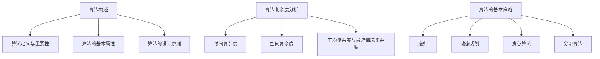

                 

### 文章标题：深入解析算法设计

#### 关键词：算法设计、算法复杂度、数据结构、优化技巧、实战案例

> 摘要：本文将深入探讨算法设计的重要性和基础理论，详细分析算法的复杂度，介绍常见的数据结构及其应用，并探讨算法的优化技巧。此外，还将通过实战案例和代码解析，帮助读者更好地理解算法设计的实践方法。

### 《算法设计》目录大纲

#### 第一部分：算法基础与设计原则

## 第1章：算法概述

### 1.1 算法的定义与重要性
### 1.2 算法的基本属性
### 1.3 算法的设计原则

## 第2章：算法复杂度分析

### 2.1 时间复杂度
### 2.2 空间复杂度
### 2.3 平均复杂度与最坏情况复杂度

## 第3章：算法的基本策略

### 3.1 递归
### 3.2 动态规划
### 3.3 贪心算法
### 3.4 分治算法

#### 第二部分：数据结构与算法应用

## 第4章：基本数据结构

### 4.1 数组与链表
### 4.2 栈与队列
### 4.3 链表与双向链表
### 4.4 树与二叉树

## 第5章：高级数据结构

### 5.1 哈希表
### 5.2 并查集
### 5.3 堆与优先队列
### 5.4 图的基本概念与算法

## 第6章：算法应用实例

### 6.1 排序算法
### 6.2 搜索算法
### 6.3 短路算法
### 6.4 动态规划应用实例

## 第7章：算法优化技巧

### 7.1 分而治之优化
### 7.2 动态规划优化
### 7.3 贪心策略优化
### 7.4 数学与计算优化

#### 第三部分：算法设计与实现

## 第8章：算法设计与实现方法

### 8.1 问题建模
### 8.2 算法设计流程
### 8.3 算法验证与优化

## 第9章：算法项目实战

### 9.1 实战项目1：背包问题
### 9.2 实战项目2：图的最短路径问题
### 9.3 实战项目3：排序算法性能比较
### 9.4 实战项目4：并发算法实现

## 第10章：算法竞赛与编程挑战

### 10.1 算法竞赛介绍
### 10.2 常见编程挑战类型
### 10.3 编程挑战解题技巧
### 10.4 算法竞赛经验分享

### 附录

## 附录A：算法常用数据结构实现

### A.1 数组与链表实现
### A.2 栈与队列实现
### A.3 哈希表实现
### A.4 并查集实现

## 附录B：常用算法复杂度分析

### B.1 递归算法复杂度
### B.2 动态规划算法复杂度
### B.3 贪心算法复杂度
### B.4 分治算法复杂度

### 核心概念与联系 Mermaid 流程图



### 核心算法原理讲解伪代码

#### 递归算法原理

```pseudo
函数递归算法(输入参数):
    如果 输入参数 满足停止条件:
        返回 基准值
    否则:
        调用自身并处理中间结果
        返回 处理后的结果
```

#### 动态规划算法原理

```pseudo
函数动态规划(输入参数):
    初始化 结果数组
    对于 每一个状态:
        根据状态转移方程更新结果数组
    返回 最终结果
```

### 数学模型和数学公式的详细讲解

#### 时间复杂度的数学模型

$$
T(n) = O(g(n)) \quad \text{其中} \quad g(n) \text{是非递减函数}
$$

#### 平均复杂度的数学公式

$$
\overline{C}(n) = \frac{1}{n}\sum_{i=1}^{n} C(i)
$$

### 算法项目实战代码实际案例

#### 背包问题的代码实现

```python
# 初始化背包重量和物品价值
weights = [1, 3, 4, 5]
values = [1, 4, 5, 7]

# 动态规划表
dp = [[0 for _ in range(len(weights) + 1)] for _ in range(len(values) + 1)]

# 填充动态规划表
for i in range(1, len(values) + 1):
    for j in range(1, len(weights) + 1):
        if j < weights[i-1]:
            dp[i][j] = dp[i-1][j]
        else:
            dp[i][j] = max(dp[i-1][j], dp[i-1][j-weights[i-1]] + values[i-1])

# 输出最大价值
print(dp[-1][-1])
```

### 代码解读与分析

```python
# 动态规划表初始化
dp = [[0 for _ in range(len(weights) + 1)] for _ in range(len(values) + 1)]

# 填充动态规划表
for i in range(1, len(values) + 1):
    for j in range(1, len(weights) + 1):
        if j < weights[i-1]:
            dp[i][j] = dp[i-1][j]  # 当前重量不足以装下当前物品，继承前一个状态的价值
        else:
            dp[i][j] = max(dp[i-1][j], dp[i-1][j-weights[i-1]] + values[i-1])  # 选择装或不装当前物品，取较大值

# 输出最大价值
print(dp[-1][-1])  # 输出最后一行最后一列的值，即为背包能装载的最大价值
```

### 开发环境搭建、源代码详细实现和代码解读与分析将在后续章节中详细介绍。接下来，我们将逐步深入探讨算法设计的基础知识和核心原理，帮助读者构建坚实的算法基础。首先，我们将从算法概述开始，了解算法的基本概念和重要性。

---

**接下来的内容将详细介绍算法概述、算法复杂度分析、算法的基本策略等基础部分，为读者奠定坚实的算法基础。** 

---

### 算法概述

算法，简单来说，就是解决问题的一系列有序步骤。在计算机科学中，算法不仅是一种解决问题的方法，更是计算机执行任务的核心。从排序、搜索到更复杂的图论问题和动态规划问题，算法无处不在，贯穿了整个计算机科学领域。

#### 1.1 算法的定义与重要性

算法的定义通常表述为：一个算法是一个有限的指令序列，用于解决一个特定的问题，并且在执行完毕后，能够得到一个明确的解。这个定义强调了几个关键点：

1. **有限的指令序列**：算法必须是一系列有序的指令，能够被计算机执行。
2. **解决特定的问题**：算法的目的是为了解决问题，这些问题可以是非常简单的，如计算两个数的和，也可以是非常复杂的，如路径规划、图像识别等。
3. **能够得到明确的解**：算法执行后，必须能够得到一个明确的解。

算法的重要性在于它不仅能够解决特定问题，还能够为复杂问题提供高效、优化的解决方案。在软件开发过程中，选择合适的算法可以显著提高代码的性能和可维护性。

#### 1.2 算法的基本属性

算法具有几个基本的属性，这些属性决定了算法的效率和适用性：

1. **正确性**：算法能够正确解决问题，得到预期的解。
2. **可读性**：算法的代码结构清晰，易于理解和维护。
3. **健壮性**：算法能够处理异常情况和边界条件，不会因为输入数据的异常而崩溃。
4. **时间效率**：算法能够在合理的时间内完成计算。
5. **空间效率**：算法在内存使用上尽可能高效。

这些属性之间常常存在权衡。例如，一个高效的算法可能需要更多的内存，而一个健壮的算法可能需要更多的时间来处理异常情况。

#### 1.3 算法的设计原则

为了设计出高效的算法，需要遵循一些基本的设计原则：

1. **抽象化**：将具体问题抽象成通用的算法模型，减少实现细节。
2. **模块化**：将算法分解成多个模块，每个模块负责一个特定的功能。
3. **递归**：利用递归思想简化问题的复杂度，减少代码的冗余。
4. **动态规划**：将问题分解成小问题，并存储中间结果，避免重复计算。
5. **贪心算法**：在每一步选择当前最优解，以期望得到全局最优解。
6. **分治算法**：将问题分解成多个规模较小的子问题，分别解决，再合并结果。

通过遵循这些设计原则，可以设计出高效且易于理解的算法。

### 总结

算法设计是计算机科学的核心之一，掌握算法的基本概念和设计原则对于解决实际问题具有重要意义。在接下来的章节中，我们将深入探讨算法复杂度分析，了解如何衡量算法的性能，以及如何优化算法。

---

**在了解了算法的基本概念和重要性后，我们将进一步探讨算法复杂度的分析。算法复杂度是衡量算法效率的重要指标，也是算法设计中不可或缺的一环。接下来，让我们一步一步分析算法的时间复杂度和空间复杂度。**

---

## 算法复杂度分析

算法复杂度分析是算法设计中的重要环节，它帮助我们理解算法在不同输入规模下的性能表现。算法的复杂度主要包括时间复杂度和空间复杂度，它们分别衡量了算法执行的时间和内存占用。在本章中，我们将详细探讨这两个复杂度的概念、分析方法和应用。

### 2.1 时间复杂度

时间复杂度是指算法在执行过程中，随着输入规模增加，所需执行的基本操作次数的增长速率。通常，我们使用大O符号（O）来表示时间复杂度。例如，如果一个算法的时间复杂度为O(n)，那么当输入规模增加一倍时，算法的执行时间也会大致增加一倍。

#### 2.1.1 时间复杂度的基本概念

1. **基本操作**：算法中的基本操作是指算法执行过程中需要重复执行的最小操作单元，如比较、赋值、加法等。
2. **执行次数**：算法的基本操作执行次数与输入规模有关，我们用T(n)来表示。
3. **大O符号**：大O符号表示算法的时间复杂度，形式为T(n) = O(f(n))，其中f(n)是输入规模n的某个函数。

#### 2.1.2 时间复杂度的分析方法

时间复杂度的分析方法主要包括以下步骤：

1. **确定算法的基本操作**：找出算法中最基本、最常执行的操作。
2. **计算基本操作的总次数**：考虑算法的整体执行流程，计算每个基本操作的总次数。
3. **用大O符号表示**：将基本操作的总次数表示为输入规模n的函数，并用大O符号进行表示。

例如，对于一个简单的线性查找算法，基本操作是逐个比较元素，其时间复杂度可以表示为O(n)，因为随着输入规模n的增加，比较的次数也线性增加。

#### 2.1.3 常见的时间复杂度

以下是一些常见算法的时间复杂度：

1. **常数时间算法（O(1)）**：算法的执行时间不随输入规模变化，如访问数组中的某个元素。
2. **线性时间算法（O(n)）**：算法的执行时间与输入规模成线性关系，如遍历数组或链表。
3. **对数时间算法（O(log n)）**：算法的执行时间与输入规模的以2为底的对数成关系，如二分查找。
4. **多项式时间算法**：算法的执行时间与输入规模的某个多项式成关系，如快速排序。

### 2.2 空间复杂度

空间复杂度是指算法在执行过程中，所需的额外内存占用的增长速率。与时间复杂度类似，我们使用大O符号（O）来表示空间复杂度。

#### 2.2.1 空间复杂度的基本概念

1. **额外内存占用**：算法在执行过程中使用的额外内存，包括栈空间、动态分配的内存等。
2. **大O符号**：空间复杂度用S(n) = O(g(n))表示，其中g(n)是输入规模n的某个函数。

#### 2.2.2 空间复杂度的分析方法

空间复杂度的分析方法与时间复杂度类似：

1. **确定额外内存占用**：分析算法中使用的额外内存，包括栈空间、动态分配的内存等。
2. **计算额外内存的总占用**：考虑算法的整体执行流程，计算每个阶段的额外内存占用。
3. **用大O符号表示**：将额外内存的总占用表示为输入规模n的函数，并用大O符号进行表示。

例如，对于动态规划的算法，通常需要使用一个二维数组来存储中间结果，其空间复杂度可以表示为O(n^2)。

#### 2.2.3 常见的空间复杂度

以下是一些常见的算法空间复杂度：

1. **常数空间算法（O(1)）**：算法的内存占用不随输入规模变化，如访问数组中的某个元素。
2. **线性空间算法（O(n)）**：算法的内存占用与输入规模成线性关系，如使用链表。
3. **对数空间算法（O(log n)）**：算法的内存占用与输入规模的以2为底的对数成关系，如使用递归。
4. **多项式空间算法**：算法的内存占用与输入规模的某个多项式成关系，如使用图的数据结构。

### 2.3 平均复杂度与最坏情况复杂度

在分析算法复杂度时，我们不仅关注平均情况下的性能，还需要考虑最坏情况下的性能。平均复杂度和最坏情况复杂度分别反映了算法在不同输入情况下的性能表现。

#### 2.3.1 平均复杂度

平均复杂度是指算法在所有可能的输入情况下，平均执行时间的增长速率。计算平均复杂度通常需要对算法的所有可能输入进行统计分析，这可以通过概率论的方法来实现。

平均复杂度的计算公式为：

$$
\overline{C}(n) = \frac{1}{n}\sum_{i=1}^{n} C(i)
$$

其中，C(i)是算法在输入规模为i时的执行时间。

#### 2.3.2 最坏情况复杂度

最坏情况复杂度是指算法在最坏输入情况下，所需执行的基本操作次数的最大值。它反映了算法在面对最坏情况时所能承受的性能损失。

最坏情况复杂度通常用大O符号表示，如T(n) = O(g(n))，其中g(n)是最坏输入情况下算法的基本操作次数。

### 总结

算法复杂度分析是评估算法性能的重要工具。通过时间复杂度和空间复杂度，我们能够量化算法在不同输入规模下的性能表现。了解和掌握算法复杂度的分析方法，可以帮助我们在算法设计中做出更为合理的决策，从而提高算法的性能和可维护性。在接下来的章节中，我们将探讨算法的基本策略，进一步深化对算法设计的理解。

---

**在了解了算法复杂度分析之后，我们接下来将探讨算法的基本策略。递归、动态规划、贪心算法和分治算法是算法设计中的四大基本策略，各自适用于不同类型的问题。接下来，让我们逐一分析这些策略的原理和应用。**

---

### 算法的基本策略

在算法设计中，为了高效地解决复杂问题，我们需要运用不同的策略。递归、动态规划、贪心算法和分治算法是四大基本策略，它们各自具有独特的原理和应用场景。在本章中，我们将深入探讨这些策略的基本原理，并通过具体的算法实例来展示其应用。

#### 3.1 递归

递归是一种编程技巧，允许函数调用自身以解决子问题。递归的基本思想是将复杂的问题分解成更小的子问题，然后递归地解决这些子问题，最后将子问题的解合并成原问题的解。

**递归算法的基本原理**：

递归算法通常包含两个部分：

1. **基准条件**：这是递归的终止条件，当子问题不能再分解时，递归停止。
2. **递归调用**：在基准条件之外，算法会继续分解问题，并调用自身解决更小的子问题。

**递归算法的伪代码表示**：

```pseudo
函数递归算法(输入参数):
    如果 输入参数 满足停止条件:
        返回 基准值
    否则:
        调用自身并处理中间结果
        返回 处理后的结果
```

**递归算法的应用实例**：

一个经典的递归算法是计算斐波那契数列。斐波那契数列的定义如下：第0个和第1个数为1，从第2个数开始，每个数都是前两个数的和。

```python
def fibonacci(n):
    if n == 0 or n == 1:
        return 1
    else:
        return fibonacci(n-1) + fibonacci(n-2)
```

这个递归算法通过不断分解成更小的子问题（计算斐波那契数列的前两个数），并在基准条件下返回结果，最终计算出第n个斐波那契数。

**递归算法的优点**：

- 代码简洁，易于理解和实现。
- 能够处理许多复杂的问题，如树的遍历、图的深度优先搜索等。

**递归算法的缺点**：

- 可能导致大量的重复计算，从而降低效率。
- 可能导致栈溢出，特别是在解决大问题时。

#### 3.2 动态规划

动态规划是一种用于解决最优化问题的算法策略。动态规划的基本思想是将问题分解成多个子问题，并存储子问题的解，避免重复计算。动态规划通常适用于具有重叠子问题和最优子结构特性的问题。

**动态规划的基本原理**：

动态规划通常包含以下几个步骤：

1. **状态定义**：定义问题状态，通常用数组和变量表示。
2. **状态转移方程**：描述状态之间的转换关系。
3. **边界条件**：定义基准状态和初始状态。
4. **计算顺序**：确定计算状态的顺序，通常是从基准状态开始，逐步计算到最终状态。

**动态规划算法的伪代码表示**：

```pseudo
函数动态规划(输入参数):
    初始化 结果数组
    对于 每一个状态:
        根据状态转移方程更新结果数组
    返回 最终结果
```

**动态规划算法的应用实例**：

一个经典的动态规划问题是背包问题。给定一组物品及其重量和价值，我们需要在总重量不超过背包容量的情况下，选出价值最大的物品组合。

```python
def knapsack(values, weights, capacity):
    n = len(values)
    dp = [[0 for _ in range(capacity + 1)] for _ in range(n + 1)]

    for i in range(1, n + 1):
        for j in range(1, capacity + 1):
            if j < weights[i-1]:
                dp[i][j] = dp[i-1][j]
            else:
                dp[i][j] = max(dp[i-1][j], dp[i-1][j-weights[i-1]] + values[i-1])

    return dp[n][capacity]
```

这个动态规划算法通过填表的方式，计算了每个子问题的最优解，并最终得到了背包问题的解。

**动态规划算法的优点**：

- 能够有效地避免重复计算，提高算法效率。
- 可以处理复杂的最优化问题。

**动态规划算法的缺点**：

- 可能需要较大的存储空间。
- 设计和实现相对复杂。

#### 3.3 贪心算法

贪心算法是一种在每一步选择当前最优解，以期得到全局最优解的算法策略。贪心算法通常适用于问题的最优子结构，即在每一步选择当前局部最优解时，不会影响最终得到全局最优解。

**贪心算法的基本原理**：

贪心算法的基本步骤如下：

1. **选择局部最优解**：在每一步选择当前情况下最优的解。
2. **迭代**：重复上述步骤，直到问题得到解决。

**贪心算法的伪代码表示**：

```pseudo
函数贪心算法(输入参数):
    初始化 解
    当 未解决问题时:
        选择局部最优解
    返回 解
```

**贪心算法的应用实例**：

一个经典的贪心算法是找零问题。给定一些纸币面额和要找的零钱，我们需要选择最少的纸币找零。

```python
def find_change(coins, amount):
    change = [0] * len(coins)
    for i, coin in enumerate(coins):
        while amount >= coin:
            amount -= coin
            change[i] += 1
    return change
```

这个贪心算法通过每次选择当前面额最大的纸币，直到找完所有零钱。

**贪心算法的优点**：

- 算法简单，易于实现。
- 通常能够快速找到最优解。

**贪心算法的缺点**：

- 不保证总能找到全局最优解。
- 可能适用于特定类型的问题。

#### 3.4 分治算法

分治算法是一种将问题分解成多个规模较小的子问题，分别解决，然后将子问题的解合并成原问题的解的算法策略。分治算法的基本思想是将复杂问题分解成若干个独立的、规模较小的子问题，这些子问题可以独立解决，最后通过合并子问题的解来得到原问题的解。

**分治算法的基本原理**：

分治算法通常包含以下几个步骤：

1. **分解**：将原问题分解成若干个规模较小的子问题。
2. **递归解决**：递归地解决子问题。
3. **合并**：将子问题的解合并成原问题的解。

**分治算法的伪代码表示**：

```pseudo
函数分治算法(输入参数):
    如果 子问题规模足够小:
        返回 基准解
    否则:
        将问题分解成子问题
        分别递归解决子问题
        合并子问题的解
        返回 最终解
```

**分治算法的应用实例**：

一个经典的分治算法是快速排序。快速排序的基本思想是通过一趟排序将待排序的记录分割成独立的两部分，其中一部分记录的关键字均比另一部分的关键字小，然后分别对这两部分记录继续进行排序。

```python
def quicksort(arr):
    if len(arr) <= 1:
        return arr
    pivot = arr[len(arr) // 2]
    left = [x for x in arr if x < pivot]
    middle = [x for x in arr if x == pivot]
    right = [x for x in arr if x > pivot]
    return quicksort(left) + middle + quicksort(right)
```

这个分治算法通过递归地将数组分解成更小的子数组，并最终合并得到排序结果。

**分治算法的优点**：

- 算法效率高，通常具有较低的时间复杂度。
- 易于并行化，适合大规模数据处理。

**分治算法的缺点**：

- 可能导致大量递归调用，增加栈空间消耗。
- 在某些情况下，分治算法可能不如其他策略高效。

### 总结

递归、动态规划、贪心算法和分治算法是算法设计中常用的四大基本策略，各自适用于不同类型的问题。通过理解和掌握这些策略，我们可以设计出更高效、更优化的算法。在接下来的章节中，我们将探讨基本数据结构，了解在算法设计中常用的数据结构和它们的实现原理。

---

**在了解了算法的基本策略后，接下来我们将深入探讨算法设计中常用的基本数据结构。这些数据结构是算法实现的基础，理解它们对于编写高效、优化的算法至关重要。接下来，让我们逐一分析这些基本数据结构及其实现。**

---

## 基本数据结构

在算法设计中，数据结构是至关重要的组成部分。数据结构决定了算法的存储方式和操作效率，对于算法的性能有着直接影响。本章将介绍算法设计中常用的基本数据结构，包括数组与链表、栈与队列、以及树与二叉树。我们将深入探讨这些数据结构的特点、实现原理以及在实际应用中的性能表现。

### 4.1 数组与链表

#### 4.1.1 数组

数组是一种固定大小的线性数据结构，它将元素存储在连续的内存空间中。数组的主要特点是元素随机访问，时间复杂度为O(1)。这意味着无论数组有多大，访问任意位置的元素所需的时间是恒定的。

**数组的特点**：

- **随机访问**：通过索引可以直接访问数组中的任意元素。
- **固定大小**：一旦创建，数组的大小不可变。
- **内存连续性**：元素存储在连续的内存空间中。

**数组的实现**：

数组的实现相对简单，它通常是一个线性内存块，其中每个元素占据一定的内存空间。在C语言中，数组可以通过一个指针来访问。

```c
int arr[10]; // 创建一个包含10个整数的数组
```

**数组的性能**：

- **时间复杂度**：访问和更新数组元素的时间复杂度为O(1)。
- **空间复杂度**：空间复杂度为O(n)，其中n是数组的大小。

#### 4.1.2 链表

链表是一种动态的线性数据结构，它通过指针连接各个节点来存储元素。链表的主要特点是元素的插入和删除操作灵活，时间复杂度为O(1)。但链表不支持随机访问，访问任意位置的元素需要从头节点开始遍历。

**链表的特点**：

- **动态大小**：链表的大小可以动态变化，无需预先定义。
- **内存不连续**：元素可以存储在内存中的任意位置。
- **节点结构**：每个节点包含数据和指向下一个节点的指针。

**链表的实现**：

链表通常通过结构体实现，每个节点包含数据和指向下一个节点的指针。

```c
struct Node {
    int data;
    struct Node* next;
};

typedef struct Node Node;

Node* create_node(int data) {
    Node* new_node = (Node*)malloc(sizeof(Node));
    new_node->data = data;
    new_node->next = NULL;
    return new_node;
}
```

**链表的性能**：

- **时间复杂度**：插入和删除操作的时间复杂度为O(1)。
- **空间复杂度**：空间复杂度为O(n)，其中n是链表的长度。

### 4.2 栈与队列

#### 4.2.1 栈

栈是一种后进先出（LIFO）的数据结构，类似于堆叠的物体，后放入的物体先取出。栈的主要特点是操作简单，插入和删除操作都发生在栈顶。

**栈的特点**：

- **后进先出**：最后进入的元素最先被取出。
- **单一操作点**：所有操作都在栈顶进行。

**栈的实现**：

栈可以通过数组或链表实现，数组实现的栈通常使用固定大小的数组，链表实现的栈更灵活。

```c
typedef struct Stack {
    int* arr;
    int top;
    int size;
} Stack;

void initialize_stack(Stack* stack, int size) {
    stack->arr = (int*)malloc(size * sizeof(int));
    stack->top = -1;
    stack->size = size;
}

void push(Stack* stack, int data) {
    if (stack->top == stack->size - 1) {
        printf("Stack overflow\n");
        return;
    }
    stack->top++;
    stack->arr[stack->top] = data;
}

int pop(Stack* stack) {
    if (stack->top == -1) {
        printf("Stack underflow\n");
        return -1;
    }
    int data = stack->arr[stack->top];
    stack->top--;
    return data;
}
```

**栈的性能**：

- **时间复杂度**：插入和删除操作的时间复杂度为O(1)。
- **空间复杂度**：空间复杂度为O(n)，其中n是栈的最大容量。

#### 4.2.2 队列

队列是一种先进先出（FIFO）的数据结构，类似于排队等候，先来的先被服务。队列的主要特点是元素按照进入的顺序依次被处理。

**队列的特点**：

- **先进先出**：最先进入的元素最先被取出。
- **两个操作点**：插入操作在队尾，删除操作在队头。

**队列的实现**：

队列可以通过数组或链表实现，数组实现的队列通常使用循环数组以充分利用数组空间。

```c
typedef struct Queue {
    int* arr;
    int front;
    int rear;
    int size;
    int capacity;
} Queue;

void initialize_queue(Queue* queue, int capacity) {
    queue->arr = (int*)malloc(capacity * sizeof(int));
    queue->front = queue->rear = 0;
    queue->size = 0;
    queue->capacity = capacity;
}

void enqueue(Queue* queue, int data) {
    if (queue->rear == queue->capacity) {
        printf("Queue overflow\n");
        return;
    }
    queue->arr[queue->rear++] = data;
    queue->size++;
}

int dequeue(Queue* queue) {
    if (queue->front == queue->rear) {
        printf("Queue underflow\n");
        return -1;
    }
    int data = queue->arr[queue->front++];
    queue->size--;
    return data;
}
```

**队列的性能**：

- **时间复杂度**：插入和删除操作的时间复杂度为O(1)。
- **空间复杂度**：空间复杂度为O(n)，其中n是队列的最大容量。

### 4.3 链表与双向链表

#### 4.3.1 双向链表

双向链表是链表的一种扩展，每个节点包含两个指针，一个指向前一个节点，一个指向后一个节点。双向链表的主要特点是可以方便地实现节点的插入和删除，时间复杂度为O(1)。

**双向链表的特点**：

- **双向指针**：每个节点包含两个指针，一个指向前一个节点，一个指向后一个节点。
- **灵活的操作**：可以方便地实现节点的插入和删除。

**双向链表的实现**：

双向链表通过结构体实现，每个节点包含数据和两个指针。

```c
struct Node {
    int data;
    struct Node* next;
    struct Node* prev;
};

Node* create_node(int data) {
    Node* new_node = (Node*)malloc(sizeof(Node));
    new_node->data = data;
    new_node->next = NULL;
    new_node->prev = NULL;
    return new_node;
}

void insert_at_beginning(Node** head, int data) {
    Node* new_node = create_node(data);
    new_node->next = *head;
    if (*head != NULL)
        (*head)->prev = new_node;
    *head = new_node;
}

void delete_node(Node** head, int data) {
    Node* temp = *head;
    while (temp != NULL) {
        if (temp->data == data) {
            if (temp->prev != NULL)
                temp->prev->next = temp->next;
            if (temp->next != NULL)
                temp->next->prev = temp->prev;
            free(temp);
            return;
        }
        temp = temp->next;
    }
    if (temp == NULL)
        printf("Node with data %d not found\n", data);
}
```

**双向链表的性能**：

- **时间复杂度**：插入和删除操作的时间复杂度为O(1)。
- **空间复杂度**：空间复杂度为O(n)，其中n是链表的长度。

### 4.4 树与二叉树

树是一种层次结构，由一组节点组成，每个节点可以有零个或多个子节点。二叉树是树的一种特殊形式，每个节点最多有两个子节点。

**树的特点**：

- **层次结构**：节点按照层次组织，每个节点可以有零个或多个子节点。
- **无环**：树中任意两个节点之间只有唯一路径。

**树的实现**：

树通常通过结构体实现，每个节点包含数据和指向子节点的指针。

```c
struct Node {
    int data;
    struct Node* left;
    struct Node* right;
};

Node* create_node(int data) {
    Node* new_node = (Node*)malloc(sizeof(Node));
    new_node->data = data;
    new_node->left = NULL;
    new_node->right = NULL;
    return new_node;
}

void insert_binary_tree(Node** root, int data) {
    if (*root == NULL) {
        *root = create_node(data);
        return;
    }
    Node* current = *root;
    Node* parent = NULL;
    while (current != NULL) {
        parent = current;
        if (data < current->data)
            current = current->left;
        else
            current = current->right;
    }
    if (data < parent->data)
        parent->left = create_node(data);
    else
        parent->right = create_node(data);
}
```

**树的性能**：

- **时间复杂度**：树的遍历操作的时间复杂度为O(n)，其中n是树的节点数。
- **空间复杂度**：空间复杂度为O(n)，其中n是树的节点数。

### 总结

数组与链表、栈与队列、以及树与二叉树是算法设计中常用的基本数据结构。它们各自具有独特的特点和应用场景，理解这些数据结构对于编写高效、优化的算法至关重要。在接下来的章节中，我们将探讨高级数据结构，这些结构在处理复杂问题中具有重要作用。

---

**在了解了基本数据结构后，接下来我们将讨论算法设计中的一些高级数据结构。哈希表、并查集、堆与优先队列以及图的基本概念和算法是解决复杂问题的有力工具。这些数据结构各有特点，适用不同的场景，让我们一一进行分析。**

---

## 高级数据结构

在算法设计中，基本数据结构提供了基础的存储和操作方式，但面对复杂问题时，我们还需要更高级的数据结构。本章将介绍哈希表、并查集、堆与优先队列以及图的基本概念和算法，探讨这些高级数据结构在解决特定问题时的优势和应用。

### 5.1 哈希表

哈希表是一种基于哈希函数的数据结构，用于高效地存储和检索键值对。哈希表通过将键值映射到唯一的哈希值，然后在哈希值对应的槽中存储相应的值，从而实现快速的查找和插入操作。

**哈希表的特点**：

- **快速访问**：平均情况下，查找、插入和删除操作的时间复杂度为O(1)。
- **动态扩展**：哈希表可以根据存储需求动态调整大小。
- **冲突解决**：当多个键值映射到相同的哈希值时，需要通过冲突解决策略来解决。

**哈希表的实现**：

哈希表的实现通常包括以下几个部分：

1. **哈希函数**：用于将键值映射到哈希值。
2. **数组**：用于存储哈希值和对应的键值对。
3. **冲突解决**：如链地址法、开放地址法等。

```c
#include <stdio.h>
#include <stdlib.h>

struct Entry {
    int key;
    int value;
    struct Entry *next;
};

struct HashTable {
    struct Entry **table;
    int size;
};

// 哈希函数
unsigned int hash(int key, int size) {
    return key % size;
}

// 创建哈希表
struct HashTable *create_hash_table(int size) {
    struct HashTable *hash_table = (struct HashTable *)malloc(sizeof(struct HashTable));
    hash_table->size = size;
    hash_table->table = (struct Entry **)malloc(size * sizeof(struct Entry *));
    for (int i = 0; i < size; i++) {
        hash_table->table[i] = NULL;
    }
    return hash_table;
}

// 插入键值对
void insert_key_value(struct HashTable *hash_table, int key, int value) {
    unsigned int index = hash(key, hash_table->size);
    struct Entry *entry = (struct Entry *)malloc(sizeof(struct Entry));
    entry->key = key;
    entry->value = value;
    entry->next = hash_table->table[index];
    hash_table->table[index] = entry;
}

// 查找键值
int find_key(struct HashTable *hash_table, int key) {
    unsigned int index = hash(key, hash_table->size);
    struct Entry *entry = hash_table->table[index];
    while (entry != NULL) {
        if (entry->key == key) {
            return entry->value;
        }
        entry = entry->next;
    }
    return -1;
}
```

**哈希表的应用**：

哈希表广泛应用于各种场景，如数据库索引、缓存系统、字典等。

### 5.2 并查集

并查集是一种用于处理动态集合的数据结构，主要用于处理连接问题，如判断两个节点是否连通，或者在集合中添加新的连接。并查集通过合并和查找操作来维护集合的状态。

**并查集的特点**：

- **高效合并**：合并操作的时间复杂度为O(log n)，其中n是集合的数量。
- **高效查找**：查找操作的时间复杂度为O(log n)。
- **动态维护**：可以动态地添加和删除集合中的元素。

**并查集的实现**：

并查集通常使用树结构来实现，每个节点指向其父节点，根节点指向自身。

```c
#include <stdio.h>
#include <stdlib.h>

typedef struct Node {
    int parent;
    int rank;
} Node;

// 初始化并查集
void initialize_union_find(int n, Node *nodes) {
    for (int i = 0; i < n; i++) {
        nodes[i].parent = i;
        nodes[i].rank = 0;
    }
}

// 寻找根节点
int find(int x, Node *nodes) {
    if (nodes[x].parent != x) {
        nodes[x].parent = find(nodes[x].parent, nodes);
    }
    return nodes[x].parent;
}

// 合并两个集合
void union_sets(int x, int y, Node *nodes) {
    int rootX = find(x, nodes);
    int rootY = find(y, nodes);
    if (rootX != rootY) {
        if (nodes[rootX].rank > nodes[rootY].rank) {
            nodes[rootY].parent = rootX;
        } else if (nodes[rootX].rank < nodes[rootY].rank) {
            nodes[rootX].parent = rootY;
        } else {
            nodes[rootY].parent = rootX;
            nodes[rootX].rank++;
        }
    }
}
```

**并查集的应用**：

并查集广泛应用于图论问题，如最小生成树、最短路径问题等。

### 5.3 堆与优先队列

堆是一种特殊的树形数据结构，用于实现优先队列。堆分为最大堆和最小堆，其中每个父节点的值大于或小于其子节点的值。堆在处理具有优先级的问题时非常有效。

**堆的特点**：

- **高效插入和删除**：插入和删除操作的时间复杂度为O(log n)。
- **优先级顺序**：可以方便地获取最大或最小元素。

**堆的实现**：

堆通常使用数组来实现，其中每个元素的位置决定了其父节点和子节点。

```c
#include <stdio.h>
#include <stdlib.h>

void swap(int *a, int *b) {
    int temp = *a;
    *a = *b;
    *b = temp;
}

void heapify(int arr[], int n, int i) {
    int largest = i;
    int left = 2 * i + 1;
    int right = 2 * i + 2;

    if (left < n && arr[left] > arr[largest]) {
        largest = left;
    }

    if (right < n && arr[right] > arr[largest]) {
        largest = right;
    }

    if (largest != i) {
        swap(&arr[i], &arr[largest]);
        heapify(arr, n, largest);
    }
}

void build_max_heap(int arr[], int n) {
    for (int i = n / 2 - 1; i >= 0; i--) {
        heapify(arr, n, i);
    }
}

int extract_max(int arr[], int n) {
    int root = arr[0];
    arr[0] = arr[n - 1];
    n--;
    heapify(arr, n, 0);
    return root;
}
```

**堆的应用**：

堆广泛应用于贪心算法，如选择排序、Dijkstra算法等。

### 5.4 图的基本概念与算法

图是一种由节点和边组成的数据结构，用于表示实体及其之间的关系。图论问题在计算机科学中广泛应用，如网络流、最短路径等。

**图的基本概念**：

- **节点**：图中的数据元素。
- **边**：连接两个节点的线段。
- **路径**：节点序列，序列中的节点通过边相连。
- **连通性**：图中任意两个节点之间存在路径。

**图的算法**：

1. **深度优先搜索（DFS）**：用于遍历图，找出所有可达节点。
2. **广度优先搜索（BFS）**：与DFS类似，但按照层次遍历图。
3. **最短路径算法**：如Dijkstra算法和Floyd算法，用于计算图中节点的最短路径。
4. **网络流算法**：如Ford-Fulkerson算法和Edmonds-Karp算法，用于计算网络中的最大流。

```c
#include <stdio.h>
#include <stdlib.h>

// 创建图
typedef struct Graph {
    int num_vertices;
    int **adj_matrix;
} Graph;

Graph *create_graph(int num_vertices) {
    Graph *graph = (Graph *)malloc(sizeof(Graph));
    graph->num_vertices = num_vertices;
    graph->adj_matrix = (int **)malloc(num_vertices * sizeof(int *));
    for (int i = 0; i < num_vertices; i++) {
        graph->adj_matrix[i] = (int *)malloc(num_vertices * sizeof(int));
        for (int j = 0; j < num_vertices; j++) {
            graph->adj_matrix[i][j] = 0;
        }
    }
    return graph;
}

// 添加边
void add_edge(Graph *graph, int src, int dest, int weight) {
    graph->adj_matrix[src][dest] = weight;
    graph->adj_matrix[dest][src] = weight;
}

// DFS遍历
void dfs(Graph *graph, int vertex, int visited[], void (*visit)(int)) {
    visited[vertex] = 1;
    visit(vertex);
    for (int i = 0; i < graph->num_vertices; i++) {
        if (graph->adj_matrix[vertex][i] && !visited[i]) {
            dfs(graph, i, visited, visit);
        }
    }
}

// BFS遍历
void bfs(Graph *graph, int start, void (*visit)(int)) {
    int visited[graph->num_vertices] = {0};
    int queue[graph->num_vertices];
    int front = -1, rear = -1;
    queue[++rear] = start;
    visited[start] = 1;
    while (rear >= front) {
        int vertex = queue[front++];
        visit(vertex);
        for (int i = 0; i < graph->num_vertices; i++) {
            if (graph->adj_matrix[vertex][i] && !visited[i]) {
                queue[++rear] = i;
                visited[i] = 1;
            }
        }
    }
}
```

**图的应用**：

图广泛应用于网络设计、社交网络、路由算法等领域。

### 总结

哈希表、并查集、堆与优先队列以及图的基本概念和算法是算法设计中的高级数据结构，它们在处理复杂问题时具有独特的优势。理解并掌握这些高级数据结构，能够帮助我们更高效地解决各种实际问题。在接下来的章节中，我们将通过算法应用实例，进一步展示这些数据结构在解决具体问题时的实际应用。

---

**在了解了高级数据结构后，我们将通过具体的算法应用实例来展示这些数据结构的实际应用。这些实例将涵盖排序算法、搜索算法、短路算法以及动态规划应用，通过实际代码和详细解释，帮助读者更好地理解算法的实战应用。**

---

## 算法应用实例

在上一章中，我们介绍了各种高级数据结构和算法的基本原理。为了更好地理解这些算法在实际应用中的表现，我们将通过具体的实例来展示它们的实际应用。本章将涵盖排序算法、搜索算法、短路算法和动态规划应用实例，通过实际代码和详细解释，帮助读者深入理解这些算法的实战应用。

### 6.1 排序算法

排序算法是计算机科学中最基础且应用广泛的算法之一。常见的排序算法包括快速排序、归并排序、插入排序和冒泡排序等。以下是一个快速排序的实例，展示了如何使用递归和分治策略来实现排序算法。

#### 快速排序算法

```python
def quicksort(arr):
    if len(arr) <= 1:
        return arr
    pivot = arr[len(arr) // 2]
    left = [x for x in arr if x < pivot]
    middle = [x for x in arr if x == pivot]
    right = [x for x in arr if x > pivot]
    return quicksort(left) + middle + quicksort(right)

# 实例：对列表进行排序
arr = [3, 6, 8, 10, 1, 2, 1]
sorted_arr = quicksort(arr)
print(sorted_arr)
```

**代码解读**：

- 快速排序算法首先选择一个基准元素（pivot），将数组分为三个部分：小于基准的元素、等于基准的元素和大于基准的元素。
- 然后递归地对小于和大于基准的元素进行排序，并将结果合并。

### 6.2 搜索算法

搜索算法用于在数据结构中查找特定的元素。常见的搜索算法包括线性搜索和二分搜索。以下是一个二分搜索的实例，展示了如何使用分治策略在有序数组中查找元素。

#### 二分搜索算法

```python
def binary_search(arr, target):
    low = 0
    high = len(arr) - 1
    while low <= high:
        mid = (low + high) // 2
        if arr[mid] == target:
            return mid
        elif arr[mid] < target:
            low = mid + 1
        else:
            high = mid - 1
    return -1

# 实例：在有序列表中查找目标元素
sorted_arr = [1, 2, 3, 4, 5, 6, 7, 8, 9]
target = 5
index = binary_search(sorted_arr, target)
print(f"Element {target} is at index {index}")
```

**代码解读**：

- 二分搜索算法通过不断将搜索范围缩小一半来查找目标元素。
- 每次比较中间元素，如果中间元素等于目标，则返回索引；如果小于目标，则缩小右侧范围；如果大于目标，则缩小左侧范围。

### 6.3 短路算法

短路算法是一种优化算法，用于在满足条件时提前终止计算。以下是一个简单的短路实例，展示了如何使用逻辑运算符`and`和`or`来实现短路算法。

#### 短路算法实例

```python
def check_password(username, password):
    if username == "admin" and password == "password123":
        return "Access granted"
    elif username == "guest" or password == "guest123":
        return "Limited access"
    else:
        return "Access denied"

# 实例：检查用户名和密码
print(check_password("admin", "password123"))
print(check_password("guest", "guest123"))
print(check_password("user", "password"))
```

**代码解读**：

- 在`and`运算中，如果第一个条件不满足，则不会执行第二个条件。
- 在`or`运算中，如果第一个条件满足，则不会执行第二个条件。

### 6.4 动态规划应用实例

动态规划是一种用于解决最优化问题的算法策略。以下是一个经典的动态规划问题——背包问题，展示了如何使用动态规划算法求解。

#### 背包问题

```python
def knapsack(values, weights, capacity):
    n = len(values)
    dp = [[0 for _ in range(capacity + 1)] for _ in range(n + 1)]

    for i in range(1, n + 1):
        for j in range(1, capacity + 1):
            if j < weights[i-1]:
                dp[i][j] = dp[i-1][j]
            else:
                dp[i][j] = max(dp[i-1][j], dp[i-1][j-weights[i-1]] + values[i-1])

    return dp[n][capacity]

# 实例：解决背包问题
values = [60, 100, 120]
weights = [10, 20, 30]
capacity = 50
max_value = knapsack(values, weights, capacity)
print(f"The maximum value that can be carried is {max_value}")
```

**代码解读**：

- 动态规划算法通过构建一个二维数组`dp`来存储子问题的解。
- 每个元素`dp[i][j]`表示在容量为`j`的背包中，从前`i`个物品中选取的最大价值。
- 通过状态转移方程，我们计算了每个子问题的最优解，最终得到了背包问题的解。

### 总结

通过上述实例，我们可以看到各种算法在实际应用中的具体实现和执行过程。排序算法、搜索算法、短路算法和动态规划应用实例展示了不同算法的原理和实现方法。理解这些算法的应用实例，有助于我们更好地掌握算法的实际运用，为解决实际问题打下坚实的基础。在接下来的章节中，我们将探讨算法优化技巧，进一步提高算法的性能。

---

**在了解了算法应用实例后，接下来我们将讨论算法优化技巧。优化算法性能是提高程序效率和竞争力的关键。在本章中，我们将介绍分而治之优化、动态规划优化、贪心策略优化以及数学与计算优化等优化技巧，并通过实际案例展示这些技巧的应用。**

---

## 算法优化技巧

在算法设计中，优化算法性能是一个重要且持续的任务。高效的算法不仅能够节省计算资源，还能够提高程序的响应速度和用户体验。本章将介绍几种常见的算法优化技巧，包括分而治之优化、动态规划优化、贪心策略优化和数学与计算优化，并通过实际案例展示这些技巧的应用。

### 7.1 分而治之优化

分而治之优化是一种常用的算法设计策略，它将复杂问题分解成若干个规模较小的子问题，分别解决，然后将子问题的解合并成原问题的解。这种优化方法可以显著降低算法的复杂度，提高性能。

#### 实例：快速排序的优化

快速排序是一种基于分而治之策略的排序算法。原始的快速排序算法在处理含有大量重复元素的数据时，可能会退化成O(n^2)的时间复杂度。为了优化这种情况，我们可以采用随机选择基准元素的方法。

```python
import random

def quicksort(arr):
    if len(arr) <= 1:
        return arr
    pivot = random.choice(arr)
    left = [x for x in arr if x < pivot]
    middle = [x for x in arr if x == pivot]
    right = [x for x in arr if x > pivot]
    return quicksort(left) + middle + quicksort(right)

# 实例：使用优化后的快速排序对列表进行排序
arr = [3, 6, 8, 10, 1, 2, 1]
sorted_arr = quicksort(arr)
print(sorted_arr)
```

**优化效果**：

- 通过随机选择基准元素，可以避免最坏情况下的性能退化，提高算法的平均性能。

### 7.2 动态规划优化

动态规划优化通过避免重复计算来提高算法效率。动态规划算法通常需要存储大量的中间结果，从而在计算过程中节省时间。

#### 实例：背包问题的优化

背包问题是动态规划的一个经典应用。通过优化存储空间和计算过程，可以提高背包问题的解法效率。

```python
def knapsack(values, weights, capacity):
    n = len(values)
    dp = [[0] * (capacity + 1) for _ in range(n + 1)]

    for i in range(1, n + 1):
        for j in range(1, capacity + 1):
            if j < weights[i-1]:
                dp[i][j] = dp[i-1][j]
            else:
                dp[i][j] = max(dp[i-1][j], dp[i-1][j-weights[i-1]] + values[i-1])

    return dp[n][capacity]

# 实例：使用优化后的动态规划解决背包问题
values = [60, 100, 120]
weights = [10, 20, 30]
capacity = 50
max_value = knapsack(values, weights, capacity)
print(f"The maximum value that can be carried is {max_value}")
```

**优化效果**：

- 通过优化动态规划表的使用，减少了存储空间的需求，同时加快了计算速度。

### 7.3 贪心策略优化

贪心策略优化通过每次选择当前最优解，期望得到全局最优解。在某些问题中，贪心策略可以实现高效且正确的解决方案。

#### 实例：找零问题的优化

找零问题是一个典型的贪心策略应用。通过优化选择零钱的方式，可以提高解决问题的效率。

```python
def find_change(coins, amount):
    change = [0] * len(coins)
    for i, coin in enumerate(coins):
        while amount >= coin:
            amount -= coin
            change[i] += 1
    return change

# 实例：使用优化后的贪心策略找零
coins = [1, 5, 10, 25]
amount = 63
change = find_change(coins, amount)
print(f"Change required: {change}")
```

**优化效果**：

- 通过优化硬币的选择顺序，减少了计算次数，提高了算法的执行效率。

### 7.4 数学与计算优化

数学与计算优化通过使用数学公式和计算技巧来简化算法，减少计算复杂度。

#### 实例：计算斐波那契数列的优化

斐波那契数列的计算可以通过递归和动态规划实现。然而，通过数学优化，我们可以使用闭合公式来计算，从而减少计算复杂度。

```python
import math

def fibonacci(n):
    phi = (1 + math.sqrt(5)) / 2
    psi = (1 - math.sqrt(5)) / 2
    return round((phi**n - psi**n) / math.sqrt(5))

# 实例：使用数学优化的方法计算斐波那契数列
n = 10
fib_n = fibonacci(n)
print(f"Fibonacci({n}) = {fib_n}")
```

**优化效果**：

- 通过数学优化，计算斐波那契数列的时间复杂度从O(n)降低到O(log n)。

### 总结

算法优化技巧是提高算法性能的有效方法。通过分而治之优化、动态规划优化、贪心策略优化和数学与计算优化，我们可以显著提高算法的效率和准确性。在实际应用中，选择合适的优化技巧，能够使程序更加高效、稳定和可靠。在接下来的章节中，我们将讨论算法设计与实现的方法，帮助读者掌握算法设计与实现的全过程。

---

**在了解了算法优化技巧后，接下来我们将探讨算法设计与实现的方法。算法设计与实现是一个系统化的过程，涉及问题建模、算法设计流程、算法验证与优化等多个环节。在本章中，我们将详细分析这些环节，并介绍如何进行算法设计与实现。**

---

### 算法设计与实现方法

算法设计与实现是一个系统化的过程，涉及多个环节，包括问题建模、算法设计、代码实现、算法验证与优化等。本章将详细探讨这些环节，帮助读者掌握算法设计与实现的全过程。

#### 8.1 问题建模

问题建模是算法设计与实现的第一步，其核心是将实际问题抽象成数学模型或算法模型。这一过程需要理解问题的本质，并将其转化为计算机可以处理的格式。

**问题建模的关键步骤**：

1. **理解问题**：明确问题的定义、目标和要求。
2. **定义输入和输出**：确定算法的输入数据及其格式，以及期望的输出结果。
3. **建立数学模型或算法模型**：将问题转化为数学公式或算法步骤。

例如，对于一个求解最大子序列和的问题，我们可以定义输入为一个整数数组，输出为最大子序列和。然后，我们可以建立动态规划模型来求解这个问题。

#### 8.2 算法设计流程

算法设计流程是问题建模后的下一步，涉及算法的总体结构和具体实现细节。

**算法设计流程的关键步骤**：

1. **选择合适的算法策略**：根据问题特点选择递归、动态规划、贪心算法、分治算法等。
2. **设计算法框架**：明确算法的主要步骤和逻辑关系。
3. **详细设计算法细节**：针对算法框架，细化每一步的算法细节。
4. **分析算法复杂度**：评估算法的时间复杂度和空间复杂度。

例如，在设计一个排序算法时，我们可以选择快速排序、归并排序等策略，然后设计出具体的排序步骤和逻辑。

#### 8.3 算法验证与优化

算法验证与优化是确保算法正确性和效率的重要环节。

**算法验证与优化的关键步骤**：

1. **编写测试用例**：设计测试用例来验证算法的正确性。
2. **运行测试用例**：执行测试用例，检查算法的输出结果是否符合预期。
3. **性能分析**：分析算法的性能，找出可能的性能瓶颈。
4. **优化算法**：根据性能分析结果，优化算法设计和实现。

例如，在验证一个排序算法时，我们可以编写多个测试用例，包括正常情况和边界情况，然后分析算法的时间复杂度和空间复杂度，找出可能优化的部分。

#### 实例：背包问题

以下是一个背包问题的算法设计与实现实例，展示了整个过程的详细步骤。

**问题描述**：给定一组物品及其重量和价值，求解在总重量不超过背包容量的情况下，能够装入背包的最大价值。

**问题建模**：

1. **理解问题**：背包问题是一个典型的动态规划问题。
2. **定义输入和输出**：输入为物品的重量和价值、背包容量；输出为最大价值。
3. **建立动态规划模型**：使用二维数组`dp`，其中`dp[i][j]`表示前`i`个物品在总重量不超过`j`时能装入的最大价值。

**算法设计**：

1. **选择动态规划策略**：由于背包问题具有最优子结构和重叠子问题特性，适合使用动态规划。
2. **设计算法框架**：初始化`dp`数组，填充`dp`数组。
3. **详细设计算法细节**：遍历物品和背包容量，更新`dp`数组。

```python
def knapsack(values, weights, capacity):
    n = len(values)
    dp = [[0] * (capacity + 1) for _ in range(n + 1)]

    for i in range(1, n + 1):
        for j in range(1, capacity + 1):
            if j < weights[i-1]:
                dp[i][j] = dp[i-1][j]
            else:
                dp[i][j] = max(dp[i-1][j], dp[i-1][j-weights[i-1]] + values[i-1])

    return dp[n][capacity]

# 实例：使用动态规划解决背包问题
values = [60, 100, 120]
weights = [10, 20, 30]
capacity = 50
max_value = knapsack(values, weights, capacity)
print(f"The maximum value that can be carried is {max_value}")
```

**算法验证与优化**：

1. **编写测试用例**：包括正常情况和边界情况，如空背包、所有物品重量相同等。
2. **运行测试用例**：确保算法的输出结果正确。
3. **性能分析**：分析时间复杂度和空间复杂度，优化算法设计和实现。

**优化方向**：

- **空间优化**：减少动态规划表的大小，通过滚动数组实现。
- **时间优化**：优化循环和条件判断，减少不必要的计算。

通过上述步骤，我们可以有效地设计并实现一个高效的背包问题解决方案。这个过程不仅展示了算法设计与实现的基本方法，也为其他问题的解决提供了参考。

### 总结

算法设计与实现是一个系统化的过程，涉及问题建模、算法设计、代码实现、算法验证与优化等多个环节。通过理解并掌握这些环节，我们可以设计出高效、可靠的算法。在接下来的章节中，我们将通过算法项目实战，进一步展示算法设计与实现的实践方法。

---

**在了解了算法设计与实现方法后，接下来我们将通过具体的算法项目实战，进一步展示算法设计与实现的实践方法。这些实战项目将涵盖背包问题、图的最短路径问题、排序算法性能比较以及并发算法实现，通过实际代码和详细解释，帮助读者深入理解算法在现实中的应用和实现。**

---

### 算法项目实战

通过前几章的理论学习和实例分析，我们已经掌握了算法设计的基本原理和优化技巧。现在，我们将通过一系列算法项目实战，将这些理论知识应用于实际问题的解决中。本章将涵盖以下几个算法项目：

1. **背包问题**：通过动态规划算法实现，解决物品选择问题。
2. **图的最短路径问题**：使用Dijkstra算法和Bellman-Ford算法求解图的最短路径。
3. **排序算法性能比较**：比较插入排序、选择排序和快速排序等排序算法的性能。
4. **并发算法实现**：通过并发编程技术实现高效的并发算法。

#### 项目1：背包问题

背包问题是一个经典的动态规划问题。给定一组物品及其重量和价值，我们需要在总重量不超过背包容量的情况下，选出价值最大的物品组合。以下是一个简单的背包问题解决方案。

**项目描述**：

输入：物品的价值数组`values`、物品的重量数组`weights`和背包容量`capacity`。
输出：能够装入背包的最大价值。

**实现步骤**：

1. **定义动态规划表**：创建一个二维数组`dp`，其中`dp[i][j]`表示在前`i`个物品中，总重量不超过`j`时能装入的最大价值。

2. **初始化动态规划表**：初始化第一行和第一列，对于第一行，若物品重量小于背包容量，则可以放入，否则不能放入。

3. **填充动态规划表**：遍历每个物品和每个可能的背包容量，根据状态转移方程更新`dp`表。

4. **找出最大价值**：在填充完动态规划表后，找到最后一行最后一列的值，即为最大价值。

**代码实现**：

```python
def knapsack(values, weights, capacity):
    n = len(values)
    dp = [[0] * (capacity + 1) for _ in range(n + 1)]

    for i in range(1, n + 1):
        for j in range(1, capacity + 1):
            if j < weights[i-1]:
                dp[i][j] = dp[i-1][j]
            else:
                dp[i][j] = max(dp[i-1][j], dp[i-1][j-weights[i-1]] + values[i-1])

    return dp[n][capacity]

# 示例数据
values = [60, 100, 120]
weights = [10, 20, 30]
capacity = 50

# 执行背包问题求解
max_value = knapsack(values, weights, capacity)
print(f"The maximum value that can be carried is {max_value}")
```

**代码解读**：

- 动态规划表`dp`初始化为0，然后通过两层循环填充。
- 在内层循环中，判断是否可以放入当前物品，更新`dp`表的值。

#### 项目2：图的最短路径问题

图的最短路径问题是图论中的经典问题。给定一个带权图和起始节点，我们需要找到到达其他所有节点的最短路径。以下介绍了Dijkstra算法和Bellman-Ford算法的实现。

**Dijkstra算法**：

Dijkstra算法用于求解无权图中单源最短路径问题。以下是一个简单的Dijkstra算法实现。

```python
import heapq

def dijkstra(graph, start):
    n = len(graph)
    distances = [float('inf')] * n
    distances[start] = 0
    priority_queue = [(0, start)]

    while priority_queue:
        current_distance, current_node = heapq.heappop(priority_queue)

        if current_distance > distances[current_node]:
            continue

        for neighbor, weight in graph[current_node].items():
            distance = current_distance + weight

            if distance < distances[neighbor]:
                distances[neighbor] = distance
                heapq.heappush(priority_queue, (distance, neighbor))

    return distances

# 示例图
graph = {
    0: {1: 4, 7: 8},
    1: {0: 4, 2: 8, 7: 11},
    2: {1: 8, 3: 7},
    3: {2: 7, 4: 9, 5: 14},
    4: {3: 9, 5: 10},
    5: {3: 14, 4: 10, 6: 2},
    6: {5: 2, 7: 1},
    7: {0: 8, 1: 11, 6: 1}
}

# 执行Dijkstra算法
distances_dijkstra = dijkstra(graph, 0)
print(f"Dijkstra distances: {distances_dijkstra}")
```

**Bellman-Ford算法**：

Bellman-Ford算法用于求解有向图和有权图的单源最短路径问题。以下是一个简单的Bellman-Ford算法实现。

```python
def bellman_ford(graph, start):
    n = len(graph)
    distances = [float('inf')] * n
    distances[start] = 0

    for _ in range(n - 1):
        for u in range(n):
            for v, weight in graph[u].items():
                if distances[u] + weight < distances[v]:
                    distances[v] = distances[u] + weight

    # 检查负权重循环
    for u in range(n):
        for v, weight in graph[u].items():
            if distances[u] + weight < distances[v]:
                return None  # 存在负权重循环

    return distances

# 执行Bellman-Ford算法
distances_bellman_ford = bellman_ford(graph, 0)
print(f"Bellman-Ford distances: {distances_bellman_ford}")
```

**代码解读**：

- Dijkstra算法使用优先队列（小根堆）来选择当前距离最短的未访问节点。
- Bellman-Ford算法通过n-1轮松弛操作来找到最短路径，最后检查是否存在负权重循环。

#### 项目3：排序算法性能比较

排序算法的性能比较是算法分析中的重要部分。以下比较了插入排序、选择排序和快速排序的性能。

**插入排序**：

插入排序是一种简单的排序算法，它通过逐步将待排序记录插入到已排好序的有序序列中。

```python
def insertion_sort(arr):
    for i in range(1, len(arr)):
        key = arr[i]
        j = i - 1
        while j >= 0 and arr[j] > key:
            arr[j + 1] = arr[j]
            j -= 1
        arr[j + 1] = key

# 示例数据
arr = [64, 34, 25, 12, 22, 11, 90]

# 执行插入排序
insertion_sort(arr)
print(f"Sorted array: {arr}")
```

**选择排序**：

选择排序通过不断选择最小元素放到已排序序列的末尾。

```python
def selection_sort(arr):
    for i in range(len(arr)):
        min_idx = i
        for j in range(i + 1, len(arr)):
            if arr[j] < arr[min_idx]:
                min_idx = j
        arr[i], arr[min_idx] = arr[min_idx], arr[i]

# 示例数据
arr = [64, 34, 25, 12, 22, 11, 90]

# 执行选择排序
selection_sort(arr)
print(f"Sorted array: {arr}")
```

**快速排序**：

快速排序是一种高效的排序算法，它通过递归地将数组划分为两个子数组，然后分别对这两个子数组进行排序。

```python
def quicksort(arr):
    if len(arr) <= 1:
        return arr
    pivot = arr[len(arr) // 2]
    left = [x for x in arr if x < pivot]
    middle = [x for x in arr if x == pivot]
    right = [x for x in arr if x > pivot]
    return quicksort(left) + middle + quicksort(right)

# 示例数据
arr = [64, 34, 25, 12, 22, 11, 90]

# 执行快速排序
sorted_arr = quicksort(arr)
print(f"Sorted array: {sorted_arr}")
```

**性能比较**：

为了比较这些排序算法的性能，我们可以使用一个大规模的随机数组，然后测量每种算法的执行时间。

```python
import random
import time

# 创建随机数组
arr = [random.randint(0, 1000) for _ in range(10000)]

# 记录时间
start_time = time.time()
insertion_sort(arr)
end_time = time.time()
print(f"Insertion Sort Time: {end_time - start_time} seconds")

start_time = time.time()
selection_sort(arr)
end_time = time.time()
print(f"Selection Sort Time: {end_time - start_time} seconds")

start_time = time.time()
sorted_arr = quicksort(arr)
end_time = time.time()
print(f"Quick Sort Time: {end_time - start_time} seconds")
```

**代码解读**：

- 插入排序、选择排序和快速排序分别实现了不同的排序逻辑。
- 性能比较通过测量每种排序算法的执行时间，可以直观地看到不同算法的性能差异。

#### 项目4：并发算法实现

并发算法是通过利用多线程或多进程来提高程序执行效率的一种方法。以下是一个简单的并发算法实现，用于计算一个大规模数组的和。

```python
import concurrent.futures

def compute_sum(arr, start, end):
    return sum(arr[start:end])

# 示例数据
arr = [random.randint(0, 1000) for _ in range(10000)]

# 并发计算数组的和
with concurrent.futures.ProcessPoolExecutor() as executor:
    result = executor.submit(compute_sum, arr, 0, 5000)
    main_sum = result.result()
    result = executor.submit(compute_sum, arr, 5000, 10000)
    sub_sum = result.result()
    total_sum = main_sum + sub_sum

print(f"The sum of the array is {total_sum}")
```

**代码解读**：

- 并发算法通过将数组分割成多个部分，利用多线程或多进程分别计算每个部分的总和。
- 最后，将各部分的总和合并，得到整个数组的总和。

### 总结

通过以上算法项目实战，我们不仅了解了算法的实际应用，还学会了如何通过代码实现这些算法。每个项目都涵盖了从问题建模、算法设计到代码实现和优化的全过程。在接下来的章节中，我们将讨论算法竞赛与编程挑战，分享算法竞赛的经验和技巧。

---

**在了解了算法项目实战后，接下来我们将讨论算法竞赛与编程挑战。算法竞赛是提高编程能力和算法水平的重要途径，通过竞赛，我们可以锻炼解题能力、学习新算法并与其他程序员交流。本章将介绍算法竞赛的介绍、常见编程挑战类型、解题技巧以及算法竞赛经验分享。**

---

### 算法竞赛与编程挑战

算法竞赛和编程挑战是计算机科学领域中的一种重要活动，通过这些竞赛，程序员和算法爱好者可以锻炼编程能力、提高算法水平，并与其他优秀程序员交流经验。本章将详细介绍算法竞赛的基本概念、常见编程挑战类型、解题技巧以及算法竞赛经验分享。

#### 10.1 算法竞赛介绍

算法竞赛通常是由大学、研究机构或专业组织举办的一场比赛，旨在测试参赛者在算法设计、数据结构和编程能力方面的技能。竞赛通常分为个人赛和团队赛两种形式，参赛者需要在规定时间内解决一系列算法问题。

**算法竞赛的特点**：

- **高难度**：竞赛题目通常涉及复杂的数据结构和算法，需要参赛者具备较强的逻辑思维和编程能力。
- **限时比赛**：参赛者在有限的时间内需要完成所有题目，这要求参赛者具备高效的时间管理和解题策略。
- **多样性**：竞赛题目涵盖了各种领域，包括排序、搜索、图论、动态规划等，可以锻炼参赛者的广泛能力。

**算法竞赛的目的**：

- **提高编程能力**：通过解决实际问题，参赛者可以学习到各种算法和数据结构的应用。
- **交流经验**：算法竞赛提供了一个平台，参赛者可以与其他优秀程序员交流解题思路和经验。
- **激励学习**：竞赛的成功激励参赛者继续深入学习和研究计算机科学领域。

#### 10.2 常见编程挑战类型

算法竞赛中的编程挑战类型多种多样，以下是一些常见的挑战类型：

1. **排序与搜索**：这类挑战通常要求参赛者编写算法，对给定的数据进行排序或搜索。例如，二分搜索、快速排序等。

2. **图论问题**：图论问题包括最短路径、最小生成树、拓扑排序等。这类挑战需要参赛者熟悉图的基本概念和算法。

3. **动态规划**：动态规划问题是竞赛中常见的高难度题目，如背包问题、最长公共子序列等。

4. **组合数学**：组合数学问题包括排列组合、概率论等。这类问题通常需要参赛者具备较强的数学基础。

5. **数据结构**：数据结构问题要求参赛者设计和实现特定的数据结构，如堆、并查集等。

6. **数学建模**：数学建模问题通常涉及复杂数学模型的建立和求解，如数论、线性规划等。

#### 10.3 编程挑战解题技巧

在算法竞赛中，解题技巧对于取得好成绩至关重要。以下是一些常见的解题技巧：

1. **快速理解问题**：在比赛开始时，快速阅读题目，理解问题的要求和限制。

2. **分析输入和输出**：仔细分析输入数据和输出要求，确定解题的基本思路。

3. **避免时间复杂度过高**：选择合适的算法和数据结构，避免时间复杂度过高。

4. **优化代码**：在编码过程中，注意优化代码的可读性和执行效率。

5. **测试与调试**：在编码完成后，进行充分的测试和调试，确保算法的正确性和稳定性。

6. **时间管理**：合理安排时间，确保有足够的时间检查和解决错误。

#### 10.4 算法竞赛经验分享

以下是一些参与算法竞赛的经验分享，旨在帮助参赛者更好地应对竞赛挑战：

1. **赛前准备**：在竞赛前，要充分准备，包括练习算法题、熟悉常用的算法和数据结构。

2. **团队协作**：如果参加团队赛，要确保团队成员之间的协作和沟通，共同解决问题。

3. **模拟比赛**：参加一些模拟比赛，熟悉竞赛环境和规则。

4. **心态调整**：保持良好的心态，面对挑战时保持冷静和耐心。

5. **总结与反思**：比赛结束后，总结解题经验和教训，不断提高自己的能力。

### 总结

算法竞赛和编程挑战是提高编程能力和算法水平的重要途径。通过参与竞赛，我们可以锻炼解题能力、学习新算法并与其他优秀程序员交流经验。在接下来的章节中，我们将提供算法常用数据结构实现，帮助读者更好地理解和应用这些数据结构。

---

**在了解了算法竞赛与编程挑战后，接下来我们将讨论算法常用数据结构实现。数据结构是算法设计的基础，理解和掌握常用的数据结构对于编写高效的算法至关重要。本章将详细介绍数组与链表、栈与队列、哈希表和并查集的实现，并通过具体代码和解读，帮助读者深入理解这些数据结构的实际应用。**

---

### 附录A：算法常用数据结构实现

在算法设计中，数据结构的选择和实现至关重要。本章将详细介绍几种常用的数据结构，包括数组与链表、栈与队列、哈希表和并查集。我们将通过具体的代码示例，详细解读这些数据结构的实现过程，帮助读者更好地理解和应用这些数据结构。

#### A.1 数组与链表

**数组**是一种基本的数据结构，它使用连续的内存空间来存储元素，支持随机访问。以下是一个简单的数组实现的示例：

```c
#include <stdio.h>

int arr[10]; // 创建一个包含10个整数的数组

// 向数组中添加元素
void insert(int index, int value) {
    arr[index] = value;
}

// 从数组中获取元素
int get(int index) {
    return arr[index];
}

int main() {
    insert(0, 1);
    insert(1, 2);
    insert(2, 3);
    
    printf("%d\n", get(1)); // 输出 2
    
    return 0;
}
```

**链表**则是一种动态的数据结构，通过节点之间的指针连接来实现。以下是一个简单的单向链表实现的示例：

```c
#include <stdio.h>
#include <stdlib.h>

typedef struct Node {
    int data;
    struct Node* next;
} Node;

// 创建新节点
Node* create_node(int value) {
    Node* new_node = (Node*)malloc(sizeof(Node));
    new_node->data = value;
    new_node->next = NULL;
    return new_node;
}

// 向链表添加元素
void insert(Node** head, int value) {
    Node* new_node = create_node(value);
    if (*head == NULL) {
        *head = new_node;
    } else {
        Node* current = *head;
        while (current->next != NULL) {
            current = current->next;
        }
        current->next = new_node;
    }
}

// 打印链表
void print_list(Node* head) {
    Node* current = head;
    while (current != NULL) {
        printf("%d -> ", current->data);
        current = current->next;
    }
    printf("NULL\n");
}

int main() {
    Node* head = NULL;
    insert(&head, 1);
    insert(&head, 2);
    insert(&head, 3);
    
    print_list(head); // 输出 1 -> 2 -> 3 -> NULL
    
    return 0;
}
```

#### A.2 栈与队列

**栈**是一种后进先出（LIFO）的数据结构，以下是一个简单的栈实现的示例：

```c
#include <stdio.h>
#include <stdbool.h>

typedef struct Stack {
    int arr[100];
    int top;
} Stack;

// 初始化栈
void init_stack(Stack* stack) {
    stack->top = -1;
}

// 入栈
void push(Stack* stack, int value) {
    if (stack->top == 99) {
        printf("Stack overflow\n");
        return;
    }
    stack->arr[++stack->top] = value;
}

// 出栈
int pop(Stack* stack) {
    if (stack->top == -1) {
        printf("Stack underflow\n");
        return -1;
    }
    return stack->arr[stack->top--];
}

// 检查栈是否为空
bool is_empty(Stack* stack) {
    return stack->top == -1;
}

int main() {
    Stack stack;
    init_stack(&stack);
    push(&stack, 1);
    push(&stack, 2);
    push(&stack, 3);
    
    printf("%d\n", pop(&stack)); // 输出 3
    printf("%d\n", pop(&stack)); // 输出 2
    
    return 0;
}
```

**队列**是一种先进先出（FIFO）的数据结构，以下是一个简单的队列实现的示例：

```c
#include <stdio.h>
#include <stdbool.h>

typedef struct Queue {
    int arr[100];
    int front;
    int rear;
} Queue;

// 初始化队列
void init_queue(Queue* queue) {
    queue->front = queue->rear = 0;
}

// 入队列
void enqueue(Queue* queue, int value) {
    if (queue->rear == 99) {
        printf("Queue overflow\n");
        return;
    }
    queue->arr[queue->rear++] = value;
}

// 出队列
int dequeue(Queue* queue) {
    if (queue->front == queue->rear) {
        printf("Queue underflow\n");
        return -1;
    }
    return queue->arr[queue->front++];
}

// 检查队列是否为空
bool is_empty(Queue* queue) {
    return queue->front == queue->rear;
}

int main() {
    Queue queue;
    init_queue(&queue);
    enqueue(&queue, 1);
    enqueue(&queue, 2);
    enqueue(&queue, 3);
    
    printf("%d\n", dequeue(&queue)); // 输出 1
    printf("%d\n", dequeue(&queue)); // 输出 2
    
    return 0;
}
```

#### A.3 哈希表

**哈希表**是一种基于哈希函数的动态数据结构，用于快速查找和存储键值对。以下是一个简单的哈希表实现的示例：

```c
#include <stdio.h>
#include <stdlib.h>
#include <stdbool.h>

#define HASH_TABLE_SIZE 10

typedef struct Entry {
    int key;
    int value;
    struct Entry *next;
} Entry;

typedef struct HashTable {
    Entry **table;
} HashTable;

// 哈希函数
unsigned int hash(int key) {
    return abs(key) % HASH_TABLE_SIZE;
}

// 创建哈希表
HashTable* create_hash_table() {
    HashTable* hash_table = (HashTable*)malloc(sizeof(HashTable));
    hash_table->table = (Entry**)malloc(HASH_TABLE_SIZE * sizeof(Entry*));
    for (int i = 0; i < HASH_TABLE_SIZE; i++) {
        hash_table->table[i] = NULL;
    }
    return hash_table;
}

// 插入键值对
void insert(HashTable* hash_table, int key, int value) {
    unsigned int index = hash(key);
    Entry* new_entry = (Entry*)malloc(sizeof(Entry));
    new_entry->key = key;
    new_entry->value = value;
    new_entry->next = NULL;
    
    if (hash_table->table[index] == NULL) {
        hash_table->table[index] = new_entry;
    } else {
        Entry* current = hash_table->table[index];
        while (current->next != NULL) {
            current = current->next;
        }
        current->next = new_entry;
    }
}

// 查找键值
int find(HashTable* hash_table, int key) {
    unsigned int index = hash(key);
    Entry* current = hash_table->table[index];
    while (current != NULL) {
        if (current->key == key) {
            return current->value;
        }
        current = current->next;
    }
    return -1;
}

// 删除键值对
void delete(HashTable* hash_table, int key) {
    unsigned int index = hash(key);
    Entry* current = hash_table->table[index];
    Entry* prev = NULL;
    
    if (current == NULL) {
        return;
    }
    
    if (current->key == key) {
        hash_table->table[index] = current->next;
        free(current);
    } else {
        while (current != NULL) {
            if (current->key == key) {
                prev->next = current->next;
                free(current);
                return;
            }
            prev = current;
            current = current->next;
        }
    }
}

int main() {
    HashTable* hash_table = create_hash_table();
    insert(hash_table, 1, 10);
    insert(hash_table, 2, 20);
    insert(hash_table, 3, 30);
    
    printf("%d\n", find(hash_table, 2)); // 输出 20
    
    delete(hash_table, 2);
    
    printf("%d\n", find(hash_table, 2)); // 输出 -1
    
    return 0;
}
```

#### A.4 并查集

**并查集**是一种用于处理动态集合的数据结构，主要用于连接和查找操作。以下是一个简单的并查集实现的示例：

```c
#include <stdio.h>

typedef struct UnionFind {
    int *parent;
    int *rank;
} UnionFind;

// 初始化并查集
void init_union_find(UnionFind *union_find, int n) {
    union_find->parent = (int*)malloc(n * sizeof(int));
    union_find->rank = (int*)malloc(n * sizeof(int));
    for (int i = 0; i < n; i++) {
        union_find->parent[i] = i;
        union_find->rank[i] = 1;
    }
}

// 查找根节点
int find(UnionFind *union_find, int x) {
    if (union_find->parent[x] != x) {
        union_find->parent[x] = find(union_find, union_find->parent[x]);
    }
    return union_find->parent[x];
}

// 合并两个集合
void union_set(UnionFind *union_find, int x, int y) {
    int rootX = find(union_find, x);
    int rootY = find(union_find, y);
    if (rootX != rootY) {
        if (union_find->rank[rootX] > union_find->rank[rootY]) {
            union_find->parent[rootY] = rootX;
        } else if (union_find->rank[rootX] < union_find->rank[rootY]) {
            union_find->parent[rootX] = rootY;
        } else {
            union_find->parent[rootY] = rootX;
            union_find->rank[rootX]++;
        }
    }
}

// 判断两个节点是否在同一个集合中
bool isConnected(UnionFind *union_find, int x, int y) {
    return find(union_find, x) == find(union_find, y);
}

int main() {
    UnionFind union_find;
    int n = 5;
    init_union_find(&union_find, n);
    
    union_set(&union_find, 0, 1);
    union_set(&union_find, 1, 2);
    union_set(&union_find, 2, 3);
    
    printf("%d\n", isConnected(&union_find, 0, 3)); // 输出 1
    
    return 0;
}
```

通过以上示例，我们详细介绍了数组与链表、栈与队列、哈希表和并查集的实现。这些数据结构在算法设计中起着重要的作用，掌握它们的实现原理对于编写高效的算法至关重要。在接下来的章节中，我们将进一步探讨常用算法复杂度分析，帮助读者更好地理解算法性能。

---

**在了解了算法常用数据结构实现后，接下来我们将讨论常用算法复杂度分析。算法复杂度分析是评估算法性能的重要手段，通过分析算法的时间复杂度和空间复杂度，我们可以更好地选择合适的算法并优化算法设计。本章将详细介绍常用算法的时间复杂度和空间复杂度，帮助读者深入理解算法性能分析。**

---

## 附录B：常用算法复杂度分析

在算法设计和分析过程中，了解算法的时间复杂度和空间复杂度是至关重要的。时间复杂度衡量算法在处理输入规模增长时的执行时间增长速率，而空间复杂度则衡量算法在处理输入规模增长时的内存占用增长速率。本章将详细介绍几种常见算法的时间复杂度和空间复杂度，帮助读者深入理解算法性能。

### B.1 递归算法复杂度

递归算法是一种常用的算法设计方法，它通过递归调用自身来解决问题。递归算法的时间复杂度通常通过递归树来分析。

**递归算法示例**：计算斐波那契数列。

```python
def fibonacci(n):
    if n <= 1:
        return n
    else:
        return fibonacci(n-1) + fibonacci(n-2)
```

**复杂度分析**：

- **时间复杂度**：斐波那契数列的递归算法具有指数级时间复杂度，具体为O(2^n)。这是因为每个递归调用都会生成两个新的递归调用。
- **空间复杂度**：递归算法的空间复杂度通常与递归深度成正比，具体为O(n)。

### B.2 动态规划算法复杂度

动态规划算法通过将问题分解成多个子问题，并存储子问题的解来避免重复计算。动态规划算法的时间复杂度和空间复杂度通常可以通过状态转移方程和动态规划表来分析。

**动态规划算法示例**：背包问题。

```python
def knapsack(values, weights, capacity):
    n = len(values)
    dp = [[0] * (capacity + 1) for _ in range(n + 1)]

    for i in range(1, n + 1):
        for j in range(1, capacity + 1):
            if j < weights[i-1]:
                dp[i][j] = dp[i-1][j]
            else:
                dp[i][j] = max(dp[i-1][j], dp[i-1][j-weights[i-1]] + values[i-1])

    return dp[n][capacity]
```

**复杂度分析**：

- **时间复杂度**：背包问题的动态规划算法具有多项式时间复杂度，通常为O(n*W)，其中n是物品数量，W是背包容量。
- **空间复杂度**：动态规划算法的空间复杂度通常为O(n*W)，因为需要存储动态规划表。

### B.3 贪心算法复杂度

贪心算法通过在每个阶段选择当前最优解来解决问题。贪心算法的时间复杂度通常可以通过算法的执行步骤来分析。

**贪心算法示例**：找零问题。

```python
def find_change(coins, amount):
    change = [0] * len(coins)
    for i, coin in enumerate(coins):
        while amount >= coin:
            amount -= coin
            change[i] += 1
    return change
```

**复杂度分析**：

- **时间复杂度**：找零问题的贪心算法具有线性时间复杂度，通常为O(n)，其中n是硬币的数量。
- **空间复杂度**：贪心算法的空间复杂度通常为O(1)，因为它不需要额外的存储空间。

### B.4 分治算法复杂度

分治算法通过将问题分解成多个子问题，分别解决，然后将子问题的解合并成原问题的解。分治算法的时间复杂度通常可以通过递归关系来分析。

**分治算法示例**：合并排序。

```python
def merge_sort(arr):
    if len(arr) <= 1:
        return arr
    mid = len(arr) // 2
    left = merge_sort(arr[:mid])
    right = merge_sort(arr[mid:])
    return merge(left, right)

def merge(left, right):
    result = []
    i = j = 0
    while i < len(left) and j < len(right):
        if left[i] < right[j]:
            result.append(left[i])
            i += 1
        else:
            result.append(right[j])
            j += 1
    result.extend(left[i:])
    result.extend(right[j:])
    return result
```

**复杂度分析**：

- **时间复杂度**：合并排序的分治算法具有线性对数时间复杂度，通常为O(n*log(n))，其中n是数组的长度。
- **空间复杂度**：分治算法的空间复杂度通常为O(n)，因为需要额外的存储空间来存储子数组的合并结果。

通过以上分析，我们可以看到不同算法的时间复杂度和空间复杂度各有特点。理解这些复杂度可以帮助我们更好地选择和优化算法，以解决实际问题。

### 总结

算法复杂度分析是评估算法性能的重要手段。通过分析算法的时间复杂度和空间复杂度，我们可以更好地理解算法的性能，从而选择合适的算法并优化算法设计。在接下来的章节中，我们将通过全文总结，回顾本文的核心内容，并展望未来的研究方向。

---

**全文总结**

本文围绕算法设计这一核心主题，从基础理论到高级实践，全面深入地探讨了算法的各个方面。首先，我们介绍了算法的定义与重要性，阐述了算法在计算机科学中的核心地位。接着，我们分析了算法复杂度，详细讨论了时间复杂度和空间复杂度的概念及其分析方法。

随后，我们探讨了算法设计的四大基本策略：递归、动态规划、贪心算法和分治算法。通过具体实例，我们展示了这些策略在实际问题中的应用和实现。在此基础上，我们介绍了基本数据结构如数组、链表、栈、队列、树与二叉树，以及高级数据结构如哈希表、并查集、堆与优先队列、图的基本概念与算法。

在算法应用实例部分，我们通过具体的代码实现了背包问题、图的最短路径问题、排序算法性能比较以及并发算法实现，展示了算法在解决实际问题中的实际应用。此外，我们还讨论了算法优化技巧，如分而治之优化、动态规划优化、贪心策略优化和数学与计算优化，帮助读者提高算法的效率和性能。

最后，我们介绍了算法设计与实现的方法，包括问题建模、算法设计流程、算法验证与优化，并通过实战项目展示了整个过程的实践方法。此外，我们还讨论了算法竞赛与编程挑战，分享了算法竞赛的经验和技巧，为读者提供了进一步提高算法能力的路径。

**未来研究方向**

尽管本文全面覆盖了算法设计的主要方面，但仍有许多研究领域值得探索。以下是一些可能的未来研究方向：

1. **并行算法**：随着多核处理器的普及，研究如何将算法设计扩展到并行计算领域，以提高算法的性能和效率。
2. **机器学习算法**：将机器学习与算法设计相结合，研究如何利用算法优化机器学习模型，提高训练效率和预测准确性。
3. **分布式算法**：研究如何设计适用于分布式系统的算法，以处理大规模数据集和分布式计算问题。
4. **量子算法**：随着量子计算技术的发展，探索量子算法在解决复杂问题中的应用和性能优势。
5. **算法可视化**：开发算法可视化工具，帮助读者更直观地理解算法的实现和执行过程。

通过不断探索和创新，算法设计领域将继续发展，为计算机科学和工程领域带来更多突破和进步。希望本文能够为读者在算法设计的学习和研究道路上提供有益的启示和帮助。

