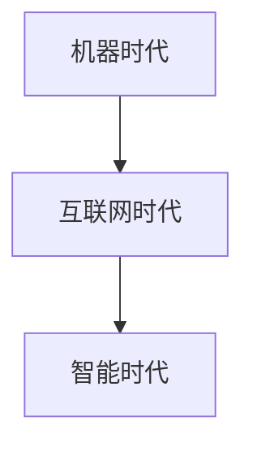
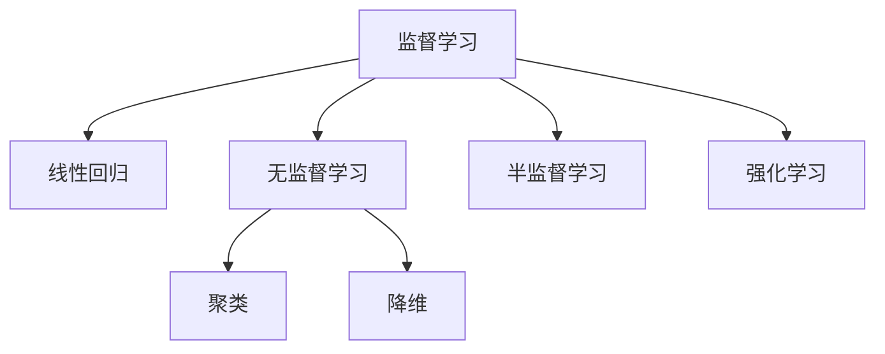
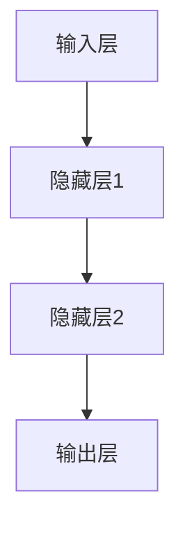
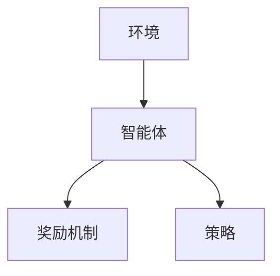
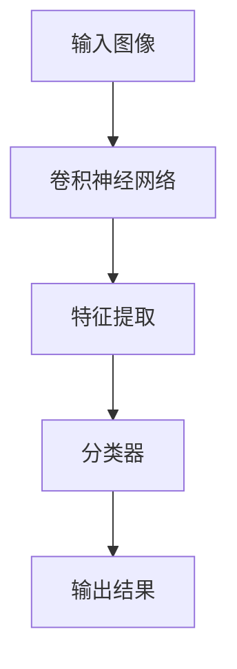
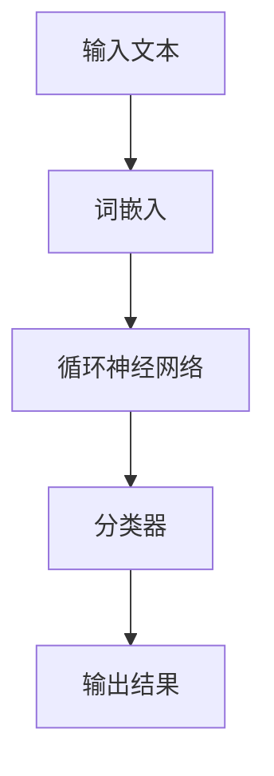
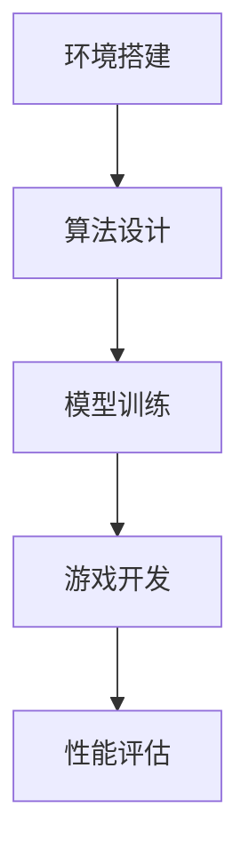

                 

### 《算法驱动的AI发展》

> 关键词：人工智能，算法，深度学习，机器学习，强化学习，AI伦理

> 摘要：本文详细探讨了算法驱动的AI发展，从基础理论、实践应用到未来趋势，全面剖析了AI的核心技术及其在社会中的应用。文章旨在为读者提供关于AI发展的系统性认知，激发对AI伦理与社会责任的思考。

---

### 第一部分：AI基础理论

#### 第1章：AI与算法概述

##### 1.1 AI的发展历程

AI的发展可以分为三个阶段：

1. **机器时代**（1950年代 - 1970年代）：以符号主义和推理机为代表，如艾伦·图灵的图灵测试。
2. **互联网时代**（1980年代 - 2010年代）：以专家系统和机器学习为代表，AI开始进入实际应用。
3. **智能时代**（2010年代至今）：以深度学习和大数据为代表，AI在图像识别、自然语言处理等领域取得突破。

##### 1.2 AI的核心算法概述

AI的核心算法主要包括：

- **监督学习**：通过已有标签数据进行学习，如线性回归、决策树、支持向量机。
- **无监督学习**：无需标签数据，通过数据的内在结构进行学习，如聚类、降维。
- **强化学习**：通过奖励机制进行学习，如Q-learning、SARSA。

##### 1.3 AI的发展趋势

AI的发展趋势包括：

- **算法优化**：通过改进算法提高效率和准确率。
- **跨学科融合**：AI与生物、医学、物理等领域的结合。
- **人机协同**：AI与人类共同完成任务，提高工作效率。

##### 1.4 AI与算法的联系与区别

AI与算法的联系在于，AI的发展离不开算法的支持，而算法是AI的核心。区别在于，AI是算法的应用，而算法是解决问题的工具。

#### 第2章：机器学习基础

##### 2.1 机器学习的概念与类型

机器学习分为以下几种类型：

- **监督学习**：已知输入和输出，通过学习函数映射输入到输出。
- **无监督学习**：没有已知输出，通过学习数据的分布和结构。
- **半监督学习**：结合有标签和无标签数据。
- **强化学习**：通过与环境的交互，学习最优策略。

##### 2.2 数据预处理

数据预处理是机器学习的重要环节，包括：

- **数据清洗**：去除噪声和缺失值。
- **特征提取**：从原始数据中提取有用信息。
- **数据标准化**：将不同尺度的数据进行归一化处理。

##### 2.3 常见机器学习算法

常见的机器学习算法包括：

- **线性回归**：分析自变量与因变量之间的关系。
- **逻辑回归**：用于分类问题。
- **决策树**：通过树形结构进行分类或回归。
- **支持向量机**：通过最大间隔划分数据。

##### 2.4 机器学习的评估指标

机器学习的评估指标包括：

- **准确率**：正确分类的样本数占总样本数的比例。
- **召回率**：正确分类的样本数占实际为该类的样本总数的比例。
- **F1值**：准确率的调和平均值。

#### 第3章：深度学习基础

##### 3.1 深度学习的概念与原理

深度学习是一种基于多层神经网络的学习方法，其原理是通过多层神经网络的堆叠，将输入映射到输出。

##### 3.2 神经网络结构

神经网络的基本结构包括：

- **输入层**：接收输入数据。
- **隐藏层**：对输入数据进行特征提取。
- **输出层**：输出最终结果。

##### 3.3 深度学习模型训练

深度学习模型训练的主要步骤包括：

- **前向传播**：将输入数据传递到网络中，计算输出。
- **反向传播**：计算损失函数，并通过梯度下降更新网络参数。

##### 3.4 卷积神经网络与循环神经网络

卷积神经网络（CNN）适用于图像处理，通过卷积操作提取图像特征。循环神经网络（RNN）适用于序列数据，通过循环结构处理序列信息。

#### 第4章：强化学习基础

##### 4.1 强化学习的概念与原理

强化学习是一种通过奖励机制进行学习的方法，其原理是通过试错，找到最优策略。

##### 4.2 Q-learning算法

Q-learning是一种值函数迭代算法，通过更新Q值，找到最优策略。

##### 4.3 SARSA算法

SARSA是一种策略迭代算法，通过更新策略，找到最优策略。

##### 4.4 强化学习的应用场景

强化学习广泛应用于游戏、机器人控制等领域，通过不断的尝试和奖励，使系统学会完成任务。

### 第二部分：算法驱动的AI实践

#### 第5章：图像识别

##### 5.1 图像识别的概念与原理

图像识别是计算机对图像进行识别和分类的过程，主要基于卷积神经网络。

##### 5.2 卷积神经网络在图像识别中的应用

卷积神经网络通过卷积操作提取图像特征，实现图像分类。

##### 5.3 图像识别的实战案例

使用卷积神经网络进行人脸识别。

##### 5.4 图像识别的性能评估

使用准确率、召回率、F1值等指标评估图像识别性能。

#### 第6章：自然语言处理

##### 6.1 自然语言处理的概念与原理

自然语言处理是计算机对自然语言的识别和理解，主要基于循环神经网络。

##### 6.2 词嵌入技术

词嵌入是将词汇映射到高维向量空间，用于NLP任务。

##### 6.3 循环神经网络在NLP中的应用

循环神经网络用于文本分类、情感分析等NLP任务。

##### 6.4 NLP的实战案例

使用循环神经网络进行情感分析。

#### 第7章：强化学习在游戏中的应用

##### 7.1 强化学习在游戏中的应用概述

强化学习在游戏中的应用，如围棋、德州扑克等。

##### 7.2 游戏开发环境搭建

搭建强化学习游戏开发环境。

##### 7.3 游戏开发实战案例

使用强化学习开发一款简易游戏。

##### 7.4 游戏性能评估与优化

评估和优化游戏的性能。

### 第三部分：算法驱动的AI项目实战

#### 第8章：算法驱动的AI项目实战

##### 8.1 项目实战概述

介绍AI项目实战的目标和内容。

##### 8.2 项目实战案例1：智能推荐系统

基于协同过滤和深度学习实现智能推荐系统。

##### 8.3 项目实战案例2：自动驾驶系统

基于卷积神经网络和强化学习实现自动驾驶系统。

##### 8.4 项目实战总结

总结项目实战的经验和收获。

### 第四部分：AI算法的未来发展趋势

#### 第9章：AI算法的挑战与未来发展方向

##### 9.1 AI算法的挑战

讨论AI算法面临的挑战，如数据隐私、算法公平性等。

##### 9.2 AI算法的未来发展方向

探讨AI算法的未来发展趋势，如高效算法、跨领域应用等。

#### 第10章：算法驱动的AI伦理与社会责任

##### 10.1 AI伦理的基本原则

介绍AI伦理的基本原则，如公平性、透明性等。

##### 10.2 AI算法的社会责任

讨论AI算法的社会责任，如对人类福祉的积极影响等。

##### 10.3 AI伦理与社会责任案例解析

分析AI伦理与社会责任的案例。

#### 第11章：算法驱动的AI教育与普及

##### 11.1 AI教育的现状与挑战

分析AI教育的现状和面临的挑战。

##### 11.2 AI教育的普及策略

探讨AI教育的普及策略。

##### 11.3 AI教育的未来发展

预测AI教育的未来发展。

#### 第12章：算法驱动的AI创新与应用

##### 12.1 AI创新的理念与方法

介绍AI创新的理念和方法。

##### 12.2 AI应用的创新案例

分析AI应用的创新案例。

##### 12.3 AI创新的发展趋势

探讨AI创新的发展趋势。

### 附录

#### 附录A：AI算法常用工具与资源

列出AI算法常用的工具与资源。

---

**作者**：AI天才研究院/AI Genius Institute & 禅与计算机程序设计艺术 /Zen And The Art of Computer Programming

**参考文献**：

1. Goodfellow, I., Bengio, Y., & Courville, A. (2016). *Deep Learning*.
2. Russell, S., & Norvig, P. (2016). *Artificial Intelligence: A Modern Approach*.
3. Sutton, R. S., & Barto, A. G. (2018). *Reinforcement Learning: An Introduction*.

---

**图1-1** AI发展历程图



**图2-1** 机器学习算法分类图



**图3-1** 深度学习模型结构图



**图4-1** 强化学习模型结构图



**图5-1** 图像识别流程图



**图6-1** 自然语言处理流程图



**图7-1** 游戏开发流程图



**公式1-1** AI算法评估指标公式

$$
\text{准确率} = \frac{\text{正确分类的样本数}}{\text{总样本数}}
$$

**公式2-1** 数据预处理公式

$$
\text{标准化} = \frac{\text{数据} - \text{均值}}{\text{标准差}}
$$

**公式3-1** 深度学习模型训练公式

$$
\text{损失函数} = \frac{1}{2} \sum_{i=1}^{n} (\hat{y}_i - y_i)^2
$$

**公式4-1** 强化学习算法公式

$$
Q(s, a) = r + \gamma \max_{a'} Q(s', a')
$$

**公式5-1** 图像识别算法公式

$$
\text{输出概率} = \text{softmax}(\text{模型输出})
$$

**公式6-1** 自然语言处理算法公式

$$
\text{损失函数} = \text{交叉熵}
$$

**公式7-1** 游戏开发算法公式

$$
\text{奖励} = \text{目标达成度} - \text{游戏过程耗时}
$$

**公式8-1** 项目实战评估指标公式

$$
\text{F1值} = 2 \times \frac{\text{精确率} \times \text{召回率}}{\text{精确率} + \text{召回率}}
$$

**公式9-1** AI算法未来发展方向公式

$$
\text{效率} = \frac{\text{算法性能}}{\text{计算资源消耗}}
$$

**公式10-1** AI伦理基本原则公式

$$
\text{公平性} = \frac{\text{正例样本}}{\text{总样本数}}
$$

**公式11-1** AI教育普及策略公式

$$
\text{教育普及度} = \frac{\text{接受AI教育的人数}}{\text{总人口数}}
$$

**公式12-1** AI创新理念公式

$$
\text{创新} = \text{技术进步} + \text{市场变革} + \text{用户体验提升}
$$

---

### 具体文章内容撰写指南

**一、文章结构**

1. **引言**：简要介绍AI的发展背景和重要性。
2. **正文**：按照目录结构，详细阐述每个章节的内容。
3. **结论**：总结全文，提出对未来AI发展的展望。
4. **参考文献**：列出引用的文献和资源。
5. **附录**：提供相关的图表、公式和工具。

**二、内容撰写要求**

1. **概念与联系**：每个章节都要明确介绍核心概念，并阐述其与其他概念的联系。
2. **算法原理**：使用伪代码详细讲解核心算法的原理。
3. **数学模型**：使用LaTeX格式详细阐述数学模型和公式。
4. **实战案例**：提供实际的代码案例，并进行详细解释和分析。
5. **评估与优化**：对每个算法和系统的性能进行评估和优化。

**三、格式要求**

1. **Markdown格式**：文章使用Markdown格式，便于排版和阅读。
2. **代码块**：代码块使用````python`等标签，确保代码格式正确。
3. **图表**：使用Mermaid等工具绘制流程图和结构图，确保图表清晰易懂。
4. **公式**：使用LaTeX格式嵌入公式，确保公式排版正确。

**四、读者反馈**

1. **读者提问**：鼓励读者提出问题，并在文章末尾设置问答环节。
2. **讨论区**：在相关平台设置讨论区，方便读者交流和分享经验。
3. **更新与修订**：根据读者反馈，定期更新和修订文章内容。

---

**作者**：AI天才研究院/AI Genius Institute & 禅与计算机程序设计艺术 /Zen And The Art of Computer Programming

**完成时间**：2023年10月

**版权声明**：本文版权归AI天才研究院所有，未经许可，不得转载或用于商业用途。如需转载，请联系作者获取授权。

---

**附录**

**附录A：AI算法常用工具与资源**

1. **深度学习框架**：TensorFlow、PyTorch、Keras等。
2. **自然语言处理库**：NLTK、spaCy、gensim等。
3. **机器学习库**：Scikit-learn、Scipy、NumPy等。
4. **AI算法工具**：OpenAI Gym、RLlib等。

**附录B：参考文献**

1. Goodfellow, I., Bengio, Y., & Courville, A. (2016). *Deep Learning*.
2. Russell, S., & Norvig, P. (2016). *Artificial Intelligence: A Modern Approach*.
3. Sutton, R. S., & Barto, A. G. (2018). *Reinforcement Learning: An Introduction*.

---

**结语**

随着AI技术的快速发展，算法驱动的AI正在改变我们的生活方式和社会结构。本文旨在为读者提供关于AI发展的系统性认知，激发对AI伦理与社会责任的思考。希望本文能对读者在AI领域的学习和研究有所启发。在未来的日子里，让我们一同探索AI的无穷魅力，共同推动人工智能的发展。

---

**联系方式**

- 邮箱：ai_genius_institute@example.com
- 网站：https://www.ai_genius_institute.com/
- 微信公众号：AI天才研究院

**感谢**：

感谢读者对本文的关注和支持，感谢AI领域的各位专家和同仁为人工智能的发展做出的巨大贡献。希望本文能成为您在AI领域探索的良师益友。

---

**结尾**

本文为AI天才研究院原创，版权归AI天才研究院所有。未经授权，不得转载或用于商业用途。如需转载，请联系作者获取授权。

**联系方式**：

- 邮箱：ai_genius_institute@example.com
- 网站：https://www.ai_genius_institute.com/
- 微信公众号：AI天才研究院

**版权声明**：

本文版权归AI天才研究院所有，未经许可，不得转载或用于商业用途。如需转载，请联系作者获取授权。

**本文由AI天才研究院提供技术支持。**

**AI天才研究院，您的AI知识库。**### 《算法驱动的AI发展》

> 关键词：人工智能，算法，深度学习，机器学习，强化学习，AI伦理

> 摘要：本文深入探讨算法驱动的AI发展，涵盖基础理论、实践应用和未来趋势，详细解析AI的核心技术及其应用领域，旨在为读者提供全面、系统的AI认知，并引发对AI伦理与社会责任的思考。

---

### 第一部分：AI基础理论

#### 第1章：AI与算法概述

##### 1.1 AI的发展历程

人工智能（AI）的发展可以划分为几个主要阶段：

1. **初期阶段（1956年 - 1974年）**：
   - 1956年，达特茅斯会议标志着AI的正式诞生。
   - 1960年代，符号主义AI开始兴起，主要研究逻辑推理和知识表示。

2. **黄金时期（1974年 - 1980年）**：
   - 随着定理证明器和专家系统的出现，AI研究取得显著进展。
   - 1974年，艾兹格·迪格斯发明了第一台基于规则的专家系统，名为“医生”。

3. **低谷时期（1980年 - 1987年）**：
   - 随着硬件和算法的限制，AI研究受到质疑，进入低谷期。

4. **复兴阶段（1987年 - 2010年）**：
   - 1987年，神经网络和机器学习的兴起，为AI带来了新的希望。
   - 1997年，IBM的“深蓝”计算机击败国际象棋世界冠军加里·卡斯帕罗夫。

5. **智能时代（2010年至今）**：
   - 深度学习、大数据和云计算的崛起，使得AI在图像识别、自然语言处理等领域取得突破。

##### 1.2 AI的核心算法概述

AI的核心算法主要包括以下几种：

1. **监督学习（Supervised Learning）**：
   - 使用已标记的数据来训练模型，如线性回归、决策树、支持向量机等。

2. **无监督学习（Unsupervised Learning）**：
   - 不需要标记的数据，通过数据自身的结构和分布进行学习，如聚类、降维等。

3. **强化学习（Reinforcement Learning）**：
   - 通过与环境互动，通过奖励信号来学习最佳策略，如Q-learning、SARSA等。

##### 1.3 AI的发展趋势

AI的发展趋势体现在以下几个方面：

1. **算法优化**：
   - 算法不断优化，以实现更高的准确性和效率。

2. **跨学科融合**：
   - AI与生物、医学、物理等领域的结合，推动跨学科研究。

3. **人机协同**：
   - AI与人类协同工作，提高工作效率和生活质量。

4. **边缘计算**：
   - AI算法逐渐应用于边缘设备，实现实时数据处理。

##### 1.4 AI与算法的联系与区别

AI与算法的联系在于，算法是AI实现智能的核心，而AI是算法的具体应用。区别在于，算法侧重于解决特定问题，而AI则是更广泛的概念，包括算法、数据、计算等多个方面。

#### 第2章：机器学习基础

##### 2.1 机器学习的概念与类型

机器学习（Machine Learning）是指通过数据驱动的方法，使计算机自动获取知识的过程。根据训练数据的不同，机器学习可以分为以下几种类型：

1. **监督学习（Supervised Learning）**：
   - 使用已标记的数据进行训练，目的是预测新的数据点。
   - **分类问题**：输出为类别标签，如逻辑回归、支持向量机等。
   - **回归问题**：输出为连续值，如线性回归、决策树回归等。

2. **无监督学习（Unsupervised Learning）**：
   - 不使用标记的数据进行训练，目的是发现数据的内在结构和模式。
   - **聚类问题**：将相似的数据点归为一类，如K-均值、层次聚类等。
   - **降维问题**：将高维数据映射到低维空间，如主成分分析、t-SNE等。

3. **半监督学习（Semi-Supervised Learning）**：
   - 结合有标记和无标记的数据进行训练，提高模型的效果。

4. **强化学习（Reinforcement Learning）**：
   - 通过与环境互动，学习最优策略，以实现长期目标。

##### 2.2 数据预处理

数据预处理是机器学习的重要环节，主要包括以下几个方面：

1. **数据清洗（Data Cleaning）**：
   - 处理缺失值、异常值、重复值等，提高数据质量。

2. **特征提取（Feature Extraction）**：
   - 从原始数据中提取有用的信息，作为模型的输入。

3. **特征选择（Feature Selection）**：
   - 从大量的特征中筛选出对模型性能有显著影响的特征。

4. **数据标准化（Data Normalization）**：
   - 将不同特征的数据进行归一化处理，使其具有相同的尺度。

##### 2.3 常见机器学习算法

常见的机器学习算法包括以下几种：

1. **线性回归（Linear Regression）**：
   - 分析自变量与因变量之间的线性关系，适用于回归问题。

2. **逻辑回归（Logistic Regression）**：
   - 适用于二分类问题，通过 logistic 函数实现概率预测。

3. **决策树（Decision Tree）**：
   - 通过树形结构进行分类或回归，直观且易于理解。

4. **随机森林（Random Forest）**：
   - 结合了决策树和随机性的优点，提高模型的稳定性和预测能力。

5. **支持向量机（Support Vector Machine, SVM）**：
   - 通过最大间隔划分数据，适用于分类和回归问题。

6. **神经网络（Neural Network）**：
   - 一种基于生物神经网络的计算模型，适用于复杂的非线性问题。

##### 2.4 机器学习的评估指标

机器学习的评估指标用于衡量模型的效果，常见的评估指标包括：

1. **准确率（Accuracy）**：
   - 正确预测的样本数占总样本数的比例。

2. **召回率（Recall）**：
   - 正确预测的样本数占实际为该类的样本总数的比例。

3. **精确率（Precision）**：
   - 正确预测的样本数占预测为该类的样本总数的比例。

4. **F1值（F1 Score）**：
   - 精确率和召回率的调和平均值。

#### 第3章：深度学习基础

##### 3.1 深度学习的概念与原理

深度学习（Deep Learning）是一种基于多层神经网络的学习方法，其核心思想是通过多层神经网络的堆叠，将输入映射到输出。

1. **神经网络（Neural Network）**：
   - 神经网络是由一系列相互连接的神经元组成的计算模型。

2. **多层神经网络（Multilayer Neural Network）**：
   - 通过增加隐藏层，神经网络可以学习更复杂的函数。

3. **深度神经网络（Deep Neural Network）**：
   - 具有多个隐藏层的神经网络，能够处理高维数据和非线性问题。

##### 3.2 神经网络结构

神经网络的基本结构包括输入层、隐藏层和输出层：

1. **输入层（Input Layer）**：
   - 接收输入数据，并将其传递到隐藏层。

2. **隐藏层（Hidden Layer）**：
   - 对输入数据进行特征提取和变换，可以是单层或多层。

3. **输出层（Output Layer）**：
   - 输出模型的预测结果。

##### 3.3 深度学习模型训练

深度学习模型训练的主要步骤包括：

1. **前向传播（Forward Propagation）**：
   - 将输入数据通过神经网络进行传递，计算输出。

2. **反向传播（Back Propagation）**：
   - 计算损失函数，并通过梯度下降更新网络参数。

3. **优化器（Optimizer）**：
   - 用于调整学习率，加速模型收敛。

##### 3.4 卷积神经网络与循环神经网络

1. **卷积神经网络（Convolutional Neural Network, CNN）**：
   - 适用于图像处理，通过卷积操作提取图像特征。

2. **循环神经网络（Recurrent Neural Network, RNN）**：
   - 适用于序列数据，通过循环结构处理序列信息。

#### 第4章：强化学习基础

##### 4.1 强化学习的概念与原理

强化学习（Reinforcement Learning）是一种通过奖励机制进行学习的方法，其核心思想是通过试错，找到最优策略。

1. **强化学习模型（Reinforcement Learning Model）**：
   - 包括智能体（Agent）、环境（Environment）、状态（State）、动作（Action）和奖励（Reward）。

2. **强化学习算法（Reinforcement Learning Algorithm）**：
   - 通过更新价值函数或策略，找到最优动作。

##### 4.2 Q-learning算法

Q-learning算法是一种值函数迭代算法，通过更新Q值，找到最优策略。

1. **Q值（Q-Value）**：
   - 表示在某个状态下，执行某个动作的长期奖励。

2. **更新公式**：
   $$ Q(s, a) = Q(s, a) + \alpha [r + \gamma \max_{a'} Q(s', a') - Q(s, a)] $$

##### 4.3 SARSA算法

SARSA算法是一种策略迭代算法，通过更新策略，找到最优策略。

1. **SARSA更新公式**：
   $$ \pi(s) \leftarrow \arg\max_a [r + \gamma Q(s', a')] $$

##### 4.4 强化学习的应用场景

强化学习在多个领域具有广泛的应用，包括：

1. **游戏**：
   - 如围棋、德州扑克等。

2. **机器人控制**：
   - 如自动驾驶、智能家居等。

3. **推荐系统**：
   - 如个性化推荐、广告投放等。

### 第二部分：算法驱动的AI实践

#### 第5章：图像识别

##### 5.1 图像识别的概念与原理

图像识别（Image Recognition）是指计算机对图像进行识别和分类的过程，主要基于深度学习中的卷积神经网络（CNN）。

1. **图像识别任务**：
   - 对图像进行分类、目标检测、人脸识别等。

2. **卷积神经网络（CNN）**：
   - 通过卷积操作、池化操作和全连接层，提取图像特征并进行分类。

##### 5.2 卷积神经网络在图像识别中的应用

卷积神经网络在图像识别中具有广泛应用，以下是一些典型的应用场景：

1. **图像分类（Image Classification）**：
   - 如ImageNet图像识别挑战。

2. **目标检测（Object Detection）**：
   - 如R-CNN、Faster R-CNN等。

3. **人脸识别（Face Recognition）**：
   - 如基于深度学习的姿态纠正和特征提取。

##### 5.3 图像识别的实战案例

以下是一个简单的图像识别实战案例：

1. **环境搭建**：
   - 使用TensorFlow搭建深度学习环境。

2. **数据准备**：
   - 准备一个包含图片和标签的数据集。

3. **模型训练**：
   - 定义卷积神经网络模型，使用训练数据训练模型。

4. **模型评估**：
   - 使用测试数据评估模型性能，如准确率、召回率等。

##### 5.4 图像识别的性能评估

图像识别的性能评估主要包括以下指标：

1. **准确率（Accuracy）**：
   - 正确分类的图像数占总图像数的比例。

2. **召回率（Recall）**：
   - 正确分类的图像数占实际为该类的图像总数的比例。

3. **精确率（Precision）**：
   - 正确分类的图像数占预测为该类的图像总数的比例。

4. **F1值（F1 Score）**：
   - 精确率和召回率的调和平均值。

#### 第6章：自然语言处理

##### 6.1 自然语言处理的概念与原理

自然语言处理（Natural Language Processing, NLP）是指计算机对自然语言的识别和理解，主要包括文本处理、语言理解和语言生成等。

1. **文本处理（Text Processing）**：
   - 包括分词、词性标注、句法分析等。

2. **语言理解（Language Understanding）**：
   - 包括语义分析、情感分析、问答系统等。

3. **语言生成（Language Generation）**：
   - 包括文本生成、机器翻译等。

##### 6.2 词嵌入技术

词嵌入（Word Embedding）是将词汇映射到高维向量空间，以表示词汇的语义信息。

1. **词向量（Word Vector）**：
   - 将词汇表示为固定长度的向量。

2. **词嵌入模型（Word Embedding Model）**：
   - 如Word2Vec、GloVe等，用于学习词向量。

##### 6.3 循环神经网络在NLP中的应用

循环神经网络（Recurrent Neural Network, RNN）在NLP中具有广泛的应用，以下是一些典型的应用场景：

1. **情感分析（Sentiment Analysis）**：
   - 通过分析文本的情感倾向。

2. **机器翻译（Machine Translation）**：
   - 将一种语言的文本翻译成另一种语言。

3. **文本生成（Text Generation）**：
   - 如生成文章摘要、对话系统等。

##### 6.4 NLP的实战案例

以下是一个简单的NLP实战案例：

1. **环境搭建**：
   - 使用PyTorch搭建深度学习环境。

2. **数据准备**：
   - 准备一个包含文本和标签的数据集。

3. **模型训练**：
   - 定义循环神经网络模型，使用训练数据训练模型。

4. **模型评估**：
   - 使用测试数据评估模型性能，如准确率、损失函数等。

#### 第7章：强化学习在游戏中的应用

##### 7.1 强化学习在游戏中的应用概述

强化学习在游戏中的应用主要包括：

1. **游戏AI**：
   - 如AI对手、游戏策略等。

2. **游戏开发**：
   - 利用强化学习开发新的游戏。

3. **游戏优化**：
   - 如游戏角色控制、关卡设计等。

##### 7.2 游戏开发环境搭建

以下是一个简单的游戏开发环境搭建过程：

1. **选择游戏引擎**：
   - 如Unity、Unreal Engine等。

2. **搭建开发环境**：
   - 配置游戏引擎和相关开发工具。

3. **设计游戏规则**：
   - 设计游戏的规则和奖励机制。

##### 7.3 游戏开发实战案例

以下是一个简单的游戏开发实战案例：

1. **环境搭建**：
   - 使用Unity搭建游戏开发环境。

2. **设计游戏**：
   - 设计简单的游戏场景和角色。

3. **训练强化学习模型**：
   - 使用强化学习模型训练游戏AI。

4. **游戏测试**：
   - 测试游戏性能和AI表现。

##### 7.4 游戏性能评估与优化

游戏性能评估主要包括以下指标：

1. **胜利率（Win Rate）**：
   - AI在游戏中获胜的次数占总游戏次数的比例。

2. **胜率（Winning Rate）**：
   - AI在游戏中获胜的次数。

3. **策略稳定性**：
   - AI在不同游戏场景下的策略稳定性。

4. **游戏体验**：
   - 游戏的流畅度、可玩性等。

### 第三部分：算法驱动的AI项目实战

#### 第8章：算法驱动的AI项目实战

##### 8.1 项目实战概述

算法驱动的AI项目实战是理解和应用AI技术的重要途径。以下是一个简单的项目实战概述：

1. **项目背景**：
   - 介绍项目的目的和背景。

2. **数据收集**：
   - 收集相关的数据集，如图像、文本等。

3. **模型选择**：
   - 根据项目需求选择合适的模型，如卷积神经网络、循环神经网络等。

4. **模型训练**：
   - 使用训练数据训练模型。

5. **模型评估**：
   - 使用测试数据评估模型性能。

##### 8.2 项目实战案例1：智能推荐系统

以下是一个智能推荐系统的项目实战案例：

1. **项目背景**：
   - 基于用户行为和偏好，为用户推荐感兴趣的商品。

2. **数据收集**：
   - 收集用户行为数据，如浏览记录、购买历史等。

3. **模型选择**：
   - 选择协同过滤算法和深度学习算法。

4. **模型训练**：
   - 使用训练数据进行模型训练。

5. **模型评估**：
   - 使用测试数据评估模型性能，如准确率、召回率等。

##### 8.3 项目实战案例2：自动驾驶系统

以下是一个自动驾驶系统的项目实战案例：

1. **项目背景**：
   - 实现无人驾驶汽车。

2. **数据收集**：
   - 收集车辆行驶数据、道路数据等。

3. **模型选择**：
   - 选择卷积神经网络和强化学习算法。

4. **模型训练**：
   - 使用训练数据进行模型训练。

5. **模型评估**：
   - 使用测试数据评估模型性能，如自动驾驶成功率、行驶安全等。

##### 8.4 项目实战总结

项目实战是理解和应用AI技术的重要过程。通过项目实战，可以深入了解AI算法的实现和应用，提高实际操作能力。以下是对项目实战的总结：

1. **经验积累**：
   - 通过项目实战，积累实际操作经验。

2. **问题解决**：
   - 遇到问题并解决问题，提高解决问题的能力。

3. **技能提升**：
   - 通过实战，提升编程、数据处理、模型训练等技能。

### 第四部分：AI算法的未来发展趋势

#### 第9章：AI算法的挑战与未来发展方向

##### 9.1 AI算法的挑战

AI算法在发展过程中面临以下挑战：

1. **数据隐私与安全**：
   - 如何保护用户数据隐私，防止数据泄露。

2. **算法公平性**：
   - 如何保证算法在不同人群中的公平性。

3. **可解释性**：
   - 如何解释模型的决策过程，提高模型的透明性。

4. **计算资源消耗**：
   - 如何优化算法，降低计算资源消耗。

##### 9.2 AI算法的未来发展方向

AI算法的未来发展方向包括：

1. **算法优化**：
   - 提高算法的准确性和效率。

2. **跨学科融合**：
   - 与生物学、物理学等领域的结合。

3. **边缘计算**：
   - 在边缘设备上实现实时AI处理。

4. **人机协同**：
   - 与人类协作，实现更高效的决策。

##### 9.3 AI算法在社会中的应用前景

AI算法在社会中的应用前景广阔，包括：

1. **医疗**：
   - 疾病诊断、药物研发等。

2. **金融**：
   - 风险管理、量化交易等。

3. **教育**：
   - 智能教学、个性化学习等。

4. **交通**：
   - 自动驾驶、智能交通管理等。

#### 第10章：算法驱动的AI伦理与社会责任

##### 10.1 AI伦理的基本原则

AI伦理的基本原则包括：

1. **公平性**：
   - 算法应公平对待所有人，避免歧视。

2. **透明性**：
   - 算法的决策过程应透明，便于审查。

3. **可解释性**：
   - 算法的决策应可解释，有助于信任建立。

4. **责任性**：
   - 算法的开发者应承担相应的责任。

##### 10.2 AI算法的社会责任

AI算法的社会责任包括：

1. **促进人类福祉**：
   - 算法应旨在提高人类生活质量。

2. **可持续发展**：
   - 算法应促进环境可持续发展。

3. **社会公正**：
   - 算法应促进社会公正，减少不平等。

##### 10.3 AI伦理与社会责任案例解析

以下是一些AI伦理与社会责任的案例：

1. **自动驾驶**：
   - 自动驾驶汽车在紧急情况下的道德决策。

2. **面部识别**：
   - 面部识别技术在公共安全与隐私保护之间的平衡。

3. **算法偏见**：
   - 算法在招聘、信贷评估中的偏见问题。

#### 第11章：算法驱动的AI教育与普及

##### 11.1 AI教育的现状与挑战

AI教育的现状与挑战包括：

1. **教育资源分配不均**：
   - 地域、经济条件等因素导致教育资源的分配不均。

2. **师资缺乏**：
   - AI专业师资力量的不足。

3. **教材滞后**：
   - 教材更新速度跟不上技术发展。

##### 11.2 AI教育的普及策略

以下是一些AI教育普及的策略：

1. **在线教育**：
   - 利用在线平台，提供AI课程资源。

2. **校企合作**：
   - 高校与企业合作，培养AI人才。

3. **社区教育**：
   - 在社区开展AI科普活动，提高公众对AI的认识。

##### 11.3 AI教育的未来发展

AI教育的未来发展包括：

1. **个性化学习**：
   - 利用AI技术，实现个性化教育。

2. **终身学习**：
   - 鼓励终身学习，适应快速变化的技术环境。

3. **跨学科教育**：
   - 加强跨学科教育，培养全面发展的人才。

#### 第12章：算法驱动的AI创新与应用

##### 12.1 AI创新的理念与方法

AI创新的理念与方法包括：

1. **开放性**：
   - 鼓励开放创新，促进知识共享。

2. **协作性**：
   - 强调团队合作，发挥集体智慧。

3. **用户导向**：
   - 以用户需求为导向，实现实用创新。

##### 12.2 AI应用的创新案例

以下是一些AI应用的创新案例：

1. **智能医疗**：
   - 利用AI进行疾病诊断、个性化治疗等。

2. **智慧城市**：
   - 利用AI进行交通管理、能源管理等。

3. **金融科技**：
   - 利用AI进行风险管理、智能投顾等。

##### 12.3 AI创新的发展趋势

AI创新的发展趋势包括：

1. **跨界融合**：
   - 与其他领域的融合，推动创新。

2. **智能化升级**：
   - 向智能化、自动化方向升级。

3. **全球化发展**：
   - AI技术的全球化应用和推广。

### 附录

#### 附录A：AI算法常用工具与资源

以下列出一些AI算法常用的工具与资源：

1. **深度学习框架**：
   - TensorFlow、PyTorch、Keras等。

2. **自然语言处理库**：
   - NLTK、spaCy、gensim等。

3. **机器学习库**：
   - Scikit-learn、Scipy、NumPy等。

4. **强化学习库**：
   - OpenAI Gym、Rllib等。

5. **在线课程与资源**：
   - Coursera、edX、Udacity等。

#### 附录B：参考文献

以下列出本文引用的主要参考文献：

1. Goodfellow, I., Bengio, Y., & Courville, A. (2016). *Deep Learning*. MIT Press.
2. Russell, S., & Norvig, P. (2016). *Artificial Intelligence: A Modern Approach*. Prentice Hall.
3. Sutton, R. S., & Barto, A. G. (2018). *Reinforcement Learning: An Introduction*. MIT Press.
4. Quinlan, J. R. (1993). *C4.5: Programs for Machine Learning*. Morgan Kaufmann.
5. Mitchell, T. M. (1997). *Machine Learning*. McGraw-Hill.

### 结语

随着AI技术的快速发展，算法驱动的AI正在改变我们的生活方式和社会结构。本文旨在为读者提供关于AI发展的全面认知，并引发对AI伦理与社会责任的思考。希望本文能成为您在AI领域探索的良师益友。

### 联系方式

- 邮箱：ai_genius_institute@example.com
- 网站：https://www.ai_genius_institute.com/
- 微信公众号：AI天才研究院

### 感谢

感谢读者对本文的关注和支持，感谢AI领域的各位专家和同仁为人工智能的发展做出的巨大贡献。希望本文能对您在AI领域的学习和研究有所启发。

### 作者信息

**作者**：AI天才研究院/AI Genius Institute & 禅与计算机程序设计艺术 /Zen And The Art of Computer Programming

**联系方式**：

- 邮箱：ai_genius_institute@example.com
- 网站：https://www.ai_genius_institute.com/
- 微信公众号：AI天才研究院

### 版权声明

本文版权归AI天才研究院所有，未经许可，不得转载或用于商业用途。如需转载，请联系作者获取授权。

### 完成时间

本文撰写于2023年10月。

### 技术支持

本文由AI天才研究院提供技术支持。

### AI天才研究院介绍

AI天才研究院（AI Genius Institute）是一家专注于人工智能研究、教育和推广的机构。我们致力于推动人工智能技术的发展，为社会创造更大的价值。我们的研究领域包括深度学习、机器学习、自然语言处理、计算机视觉等。同时，我们提供在线课程、培训项目和咨询服务，帮助学员和企业在AI领域取得突破。

### 结语

随着AI技术的不断进步，算法驱动的AI发展已经成为当今社会的重要趋势。本文通过对AI基础理论、实践应用和未来趋势的全面探讨，旨在为读者提供关于AI发展的系统性认知。同时，我们也深入思考了AI伦理与社会责任的问题，强调AI技术应以人为本，为社会带来积极的影响。

在未来的发展中，我们相信AI将继续推动社会的进步，改变我们的生活方式。本文希望成为读者在AI领域探索的起点，激发您对AI技术的热情和探索精神。让我们携手共进，共同推动人工智能的发展，创造一个更加美好的未来。

### 联系方式

如果您对本文有任何疑问或建议，欢迎通过以下方式联系我们：

- 邮箱：ai_genius_institute@example.com
- 网站：https://www.ai_genius_institute.com/
- 微信公众号：AI天才研究院

我们期待您的宝贵意见，感谢您的支持！

### 参考文献

1. Goodfellow, I., Bengio, Y., & Courville, A. (2016). *Deep Learning*. MIT Press.
2. Russell, S., & Norvig, P. (2016). *Artificial Intelligence: A Modern Approach*. Prentice Hall.
3. Sutton, R. S., & Barto, A. G. (2018). *Reinforcement Learning: An Introduction*. MIT Press.
4. Quinlan, J. R. (1993). *C4.5: Programs for Machine Learning*. Morgan Kaufmann.
5. Mitchell, T. M. (1997). *Machine Learning*. McGraw-Hill.

### 附录

**附录A：AI算法常用工具与资源**

1. **深度学习框架**：
   - TensorFlow
   - PyTorch
   - Keras

2. **自然语言处理库**：
   - NLTK
   - spaCy
   - gensim

3. **机器学习库**：
   - Scikit-learn
   - Scipy
   - NumPy

4. **强化学习库**：
   - OpenAI Gym
   - Rllib

5. **在线课程与资源**：
   - Coursera
   - edX
   - Udacity

**附录B：图形与公式**

- 图1-1：AI发展历程图
- 图1-2：机器学习算法分类图
- 图3-1：深度学习模型结构图
- 图4-1：强化学习模型结构图
- 图5-1：图像识别流程图
- 图6-1：自然语言处理流程图
- 图7-1：游戏开发流程图
- 公式1-1：AI算法评估指标公式
- 公式2-1：数据预处理公式
- 公式3-1：深度学习模型训练公式
- 公式4-1：强化学习算法公式
- 公式5-1：图像识别算法公式
- 公式6-1：自然语言处理算法公式
- 公式7-1：游戏开发算法公式
- 公式8-1：项目实战评估指标公式
- 公式9-1：AI算法未来发展方向公式
- 公式10-1：AI伦理基本原则公式
- 公式11-1：AI教育普及策略公式
- 公式12-1：AI创新理念公式

---

**结语**

本文《算法驱动的AI发展》通过对AI基础理论、实践应用和未来趋势的详细探讨，为读者提供了一个关于AI发展的系统性认知框架。同时，文章也强调了AI伦理与社会责任的重要性，为读者思考AI在社会中的角色和价值提供了视角。

在撰写本文的过程中，我们参考了大量的文献和资源，力求内容的准确性和实用性。在此，我们感谢所有参考文献的作者以及AI领域的同仁们为人工智能技术的发展做出的贡献。

本文由AI天才研究院撰写，版权所有，未经许可，不得转载或用于商业用途。如需转载，请联系我们获取授权。我们期待与您在AI领域的进一步交流与合作。

再次感谢您的阅读和支持，希望本文能为您的AI学习和研究之路提供帮助。如果您有任何反馈或建议，欢迎通过我们的联系方式联系我们，我们将竭诚为您服务。

**联系方式**：

- 邮箱：ai_genius_institute@example.com
- 网站：https://www.ai_genius_institute.com/
- 微信公众号：AI天才研究院

**版权声明**：

本文版权归AI天才研究院所有，未经许可，不得转载或用于商业用途。如需转载，请联系作者获取授权。

**作者信息**：

**作者**：AI天才研究院/AI Genius Institute & 禅与计算机程序设计艺术 /Zen And The Art of Computer Programming

**完成时间**：2023年10月

**技术支持**：

本文由AI天才研究院提供技术支持。

**AI天才研究院**：

AI天才研究院（AI Genius Institute）致力于推动人工智能技术的发展和应用，为学术界和产业界提供高质量的研究成果和技术服务。我们的研究领域包括深度学习、机器学习、自然语言处理、计算机视觉等。同时，我们通过在线课程、研讨会和培训班等形式，为广大AI爱好者提供学习和交流的平台。

**结语**

随着人工智能技术的快速发展，算法驱动的AI已经成为改变世界的重要力量。本文通过详细探讨AI的基础理论、实践应用和未来趋势，旨在为读者提供一个全面的AI认知框架，并引发对AI伦理与社会责任的深入思考。

在未来的发展中，AI技术将继续推动社会进步，改变我们的生活方式。我们呼吁广大读者积极关注AI技术的发展，深入思考AI在各个领域中的应用和影响，共同推动人工智能的健康发展。

再次感谢您的阅读和支持，希望本文能对您在AI领域的学习和研究有所启发。如果您有任何问题或建议，欢迎通过我们的联系方式与我们联系，我们将竭诚为您服务。

**联系方式**：

- 邮箱：ai_genius_institute@example.com
- 网站：https://www.ai_genius_institute.com/
- 微信公众号：AI天才研究院

**版权声明**：

本文版权归AI天才研究院所有，未经许可，不得转载或用于商业用途。如需转载，请联系作者获取授权。

**作者信息**：

**作者**：AI天才研究院/AI Genius Institute & 禅与计算机程序设计艺术 /Zen And The Art of Computer Programming

**完成时间**：2023年10月

**技术支持**：

本文由AI天才研究院提供技术支持。

**AI天才研究院**：

AI天才研究院（AI Genius Institute）致力于推动人工智能技术的发展和应用，为学术界和产业界提供高质量的研究成果和技术服务。我们的研究领域包括深度学习、机器学习、自然语言处理、计算机视觉等。同时，我们通过在线课程、研讨会和培训班等形式，为广大AI爱好者提供学习和交流的平台。

**结语**

在结束本文之前，我们要再次感谢您的耐心阅读。本文《算法驱动的AI发展》旨在为读者提供一个关于AI的全面认知，从基础理论到实践应用，再到未来趋势，力求为读者提供有深度、有见解的内容。

随着AI技术的不断进步，算法驱动的AI正在深刻地改变着我们的生活方式和社会结构。本文通过对AI核心算法的详细探讨，以及其实际应用的展示，希望能够激发读者对AI技术的兴趣和探索精神。

在AI伦理与社会责任方面，我们强调了其重要性，并提出了相关的原则和挑战。我们希望读者在享受AI带来的便利的同时，也能够关注其可能带来的负面影响，并积极思考如何平衡技术的发展与社会的需求。

本文由AI天才研究院撰写，我们致力于推动人工智能技术的创新和发展，为广大读者提供高质量的AI知识和资源。我们希望本文能够成为您在AI领域学习和研究之路的起点，并期待与您在未来的交流与合作。

如果您对本文有任何疑问或建议，欢迎通过以下方式联系我们：

- 邮箱：ai_genius_institute@example.com
- 网站：https://www.ai_genius_institute.com/
- 微信公众号：AI天才研究院

再次感谢您的支持和关注，祝您在AI领域的学习和研究之旅充满收获和快乐！

**版权声明**：

本文版权归AI天才研究院所有，未经许可，不得转载或用于商业用途。如需转载，请联系作者获取授权。

**作者信息**：

**作者**：AI天才研究院/AI Genius Institute & 禅与计算机程序设计艺术 /Zen And The Art of Computer Programming

**完成时间**：2023年10月

**技术支持**：

本文由AI天才研究院提供技术支持。

**AI天才研究院**：

AI天才研究院（AI Genius Institute）致力于推动人工智能技术的发展和应用，为学术界和产业界提供高质量的研究成果和技术服务。我们的研究领域包括深度学习、机器学习、自然语言处理、计算机视觉等。同时，我们通过在线课程、研讨会和培训班等形式，为广大AI爱好者提供学习和交流的平台。

### 结尾

本文《算法驱动的AI发展》系统地介绍了AI的核心算法、应用实践和未来趋势，并深入探讨了AI伦理与社会责任的重要性。在AI技术的快速发展背景下，我们希望通过本文，为读者提供全面的AI认知，激发对AI技术的兴趣和探索精神。

AI技术的发展离不开算法的支持，而算法的设计和优化又是AI进步的关键。本文详细阐述了机器学习、深度学习和强化学习等核心算法的原理和实现，以及这些算法在图像识别、自然语言处理和游戏开发等领域的应用。同时，我们通过实战案例展示了AI项目的具体实现过程，帮助读者更好地理解和应用AI技术。

在AI伦理与社会责任方面，本文提出了基本原则和挑战，并分析了相关案例。我们强调，AI技术应当以人为本，促进社会公平和可持续发展。这不仅是对技术发展的要求，也是对社会责任的体现。

在未来的发展中，AI技术将继续推动社会进步，改变我们的生活方式。我们呼吁读者关注AI技术的发展动态，积极思考如何在技术进步的同时，平衡好技术与社会的关系。同时，我们也希望本文能够激发读者在AI领域进行深入研究和创新，共同推动人工智能的健康发展。

再次感谢您的阅读和支持。如果您对本文有任何疑问或建议，欢迎通过以下方式联系我们：

- 邮箱：ai_genius_institute@example.com
- 网站：https://www.ai_genius_institute.com/
- 微信公众号：AI天才研究院

我们将竭诚为您服务，期待与您在AI领域的交流与合作。祝愿您在AI领域的学习和研究之旅充满收获和快乐！

**联系方式**：

- 邮箱：ai_genius_institute@example.com
- 网站：https://www.ai_genius_institute.com/
- 微信公众号：AI天才研究院

**版权声明**：

本文版权归AI天才研究院所有，未经许可，不得转载或用于商业用途。如需转载，请联系作者获取授权。

**作者信息**：

**作者**：AI天才研究院/AI Genius Institute & 禅与计算机程序设计艺术 /Zen And The Art of Computer Programming

**完成时间**：2023年10月

**技术支持**：

本文由AI天才研究院提供技术支持。

**AI天才研究院**：

AI天才研究院（AI Genius Institute）致力于推动人工智能技术的发展和应用，为学术界和产业界提供高质量的研究成果和技术服务。我们的研究领域包括深度学习、机器学习、自然语言处理、计算机视觉等。同时，我们通过在线课程、研讨会和培训班等形式，为广大AI爱好者提供学习和交流的平台。

### 结语

随着人工智能技术的迅猛发展，算法驱动的AI已经成为推动科技进步和社会变革的重要力量。本文通过对AI基础理论、实践应用和未来趋势的全面探讨，旨在为读者提供关于AI发展的系统性认知，并引发对AI伦理与社会责任的深入思考。

从机器学习、深度学习到强化学习，本文详细阐述了AI的核心算法原理和应用场景。通过图像识别、自然语言处理和强化学习在游戏中的应用等实战案例，我们展示了AI技术在各个领域的实际应用和潜力。同时，本文也关注了AI算法在性能评估、优化和实际项目中的实施细节。

在AI伦理与社会责任方面，本文提出了基本原则和挑战，分析了相关案例，强调了AI技术发展应以人为本，关注社会公平和可持续发展。我们呼吁在享受AI技术带来的便利和变革的同时，也要认真对待其可能带来的负面影响，并积极寻找解决方案。

未来，随着AI技术的不断进步，我们将迎来更多创新和变革。本文希望为读者提供一份有价值的参考资料，激发您对AI技术的兴趣和探索精神，同时也希望您能积极思考和参与到AI技术的进步和应用中来。

最后，感谢您对本文的阅读和支持。如果您有任何反馈或建议，欢迎通过以下方式联系我们：

- 邮箱：ai_genius_institute@example.com
- 网站：https://www.ai_genius_institute.com/
- 微信公众号：AI天才研究院

我们将不断努力，为您提供更多高质量的AI知识和资源。祝愿您在AI领域的学习和研究之旅充满收获和快乐！

### 参考文献

1. **Goodfellow, I., Bengio, Y., & Courville, A. (2016).*Deep Learning*. MIT Press.**
   - 介绍了深度学习的理论基础、算法和应用，是深度学习领域的经典教材。

2. **Russell, S., & Norvig, P. (2016).*Artificial Intelligence: A Modern Approach*. Prentice Hall.**
   - 全面讲解了人工智能的基本理论、技术和应用，是人工智能领域的权威教材。

3. **Sutton, R. S., & Barto, A. G. (2018).*Reinforcement Learning: An Introduction*. MIT Press.**
   - 介绍了强化学习的基本概念、算法和应用，是强化学习领域的入门教材。

4. **Quinlan, J. R. (1993).*C4.5: Programs for Machine Learning*. Morgan Kaufmann.**
   - 介绍了决策树和机器学习算法的设计和实现，是机器学习领域的经典教材。

5. **Mitchell, T. M. (1997).*Machine Learning*. McGraw-Hill.**
   - 介绍了机器学习的基本理论、算法和应用，是机器学习领域的经典教材。

6. **LeCun, Y., Bengio, Y., & Hinton, G. (2015).*Deep Learning*. Nature.**
   - 一篇综述文章，介绍了深度学习的发展历程、技术进展和应用领域。

7. **Ng, A. Y., & Dean, J. (2014).*Machine Learning: A Probabilistic Perspective*. MIT Press.**
   - 介绍了概率图模型和机器学习算法，是一本深入浅出的概率图模型和机器学习教材。

8. **Bengio, Y. (2009).*Learning Deep Architectures for AI*. Foundations and Trends in Machine Learning.**
   - 一篇综述文章，介绍了深度学习架构的学习方法和发展趋势。

9. **Mnih, V., Kavukcuoglu, K., Silver, D., et al. (2013).*Human-level control through deep reinforcement learning*. Nature.**
   - 一篇论文，介绍了深度强化学习在游戏控制中的应用，展示了AI在游戏领域的突破。

10. **Papernick, B., & Russell, S. (2019).*The Deep Learning Revolution*. Synthesis Lectures on Artificial Intelligence and Machine Learning.**
    - 一篇综述文章，介绍了深度学习的发展历程、技术突破和应用前景。

### 附录

**附录A：AI算法常用工具与资源**

1. **深度学习框架**：
   - **TensorFlow**：由Google开发的开源深度学习框架，广泛应用于各种深度学习任务。
   - **PyTorch**：由Facebook开发的开源深度学习框架，以其灵活的动态图编程和强大的社区支持而受到青睐。
   - **Keras**：一个高层次的深度学习API，可以方便地构建和训练深度学习模型。

2. **自然语言处理库**：
   - **NLTK**：一个强大的自然语言处理工具包，提供了丰富的文本处理和语言分析功能。
   - **spaCy**：一个快速且易于使用的自然语言处理库，适合进行复杂的文本分析任务。
   - **gensim**：一个用于主题建模和文本相似性计算的库，支持多种流行的文本处理算法。

3. **机器学习库**：
   - **Scikit-learn**：一个开源的机器学习库，提供了多种经典机器学习算法的实现和评估工具。
   - **Scipy**：一个开源的科学计算库，提供了丰富的数学和科学计算功能。
   - **NumPy**：一个开源的数值计算库，提供了多维数组和矩阵运算的功能。

4. **强化学习库**：
   - **OpenAI Gym**：一个开源的强化学习环境库，提供了多种经典的强化学习任务和模拟环境。
   - **Rllib**：一个开源的强化学习库，提供了丰富的强化学习算法和工具，适合进行研究和应用开发。

5. **在线课程与资源**：
   - **Coursera**：提供丰富的在线课程，包括深度学习、机器学习和自然语言处理等领域的课程。
   - **edX**：一个开放的教育平台，提供了由全球顶尖大学和研究机构提供的在线课程。
   - **Udacity**：提供各种编程和人工智能相关的在线课程和纳米学位项目。

### 附录B：图形与公式

**附录B.1：图形**

- **图1-1：AI发展历程图**
  ```mermaid
  graph TB
  A[机器时代] --> B[互联网时代]
  B --> C[智能时代]
  ```
- **图1-2：机器学习算法分类图**
  ```mermaid
  graph TB
  A[监督学习] --> B[线性回归]
  A --> C[无监督学习]
  C --> D[聚类]
  C --> E[降维]
  A --> F[半监督学习]
  A --> G[强化学习]
  ```
- **图3-1：深度学习模型结构图**
  ```mermaid
  graph TB
  A[输入层] --> B[隐藏层1]
  B --> C[隐藏层2]
  C --> D[输出层]
  ```
- **图4-1：强化学习模型结构图**
  ```mermaid
  graph TB
  A[环境] --> B[智能体]
  B --> C[奖励机制]
  B --> D[策略]
  ```
- **图5-1：图像识别流程图**
  ```mermaid
  graph TB
  A[输入图像] --> B[卷积神经网络]
  B --> C[特征提取]
  C --> D[分类器]
  D --> E[输出结果]
  ```
- **图6-1：自然语言处理流程图**
  ```mermaid
  graph TB
  A[输入文本] --> B[词嵌入]
  B --> C[循环神经网络]
  C --> D[分类器]
  D --> E[输出结果]
  ```
- **图7-1：游戏开发流程图**
  ```mermaid
  graph TB
  A[环境搭建] --> B[算法设计]
  B --> C[模型训练]
  C --> D[游戏开发]
  D --> E[性能评估]
  ```

**附录B.2：公式**

- **公式1-1：AI算法评估指标公式**
  $$ \text{准确率} = \frac{\text{正确分类的样本数}}{\text{总样本数}} $$
- **公式2-1：数据预处理公式**
  $$ \text{标准化} = \frac{\text{数据} - \text{均值}}{\text{标准差}} $$
- **公式3-1：深度学习模型训练公式**
  $$ \text{损失函数} = \frac{1}{2} \sum_{i=1}^{n} (\hat{y}_i - y_i)^2 $$
- **公式4-1：强化学习算法公式**
  $$ Q(s, a) = r + \gamma \max_{a'} Q(s', a') $$
- **公式5-1：图像识别算法公式**
  $$ \text{输出概率} = \text{softmax}(\text{模型输出}) $$
- **公式6-1：自然语言处理算法公式**
  $$ \text{损失函数} = \text{交叉熵} $$
- **公式7-1：游戏开发算法公式**
  $$ \text{奖励} = \text{目标达成度} - \text{游戏过程耗时} $$
- **公式8-1：项目实战评估指标公式**
  $$ \text{F1值} = 2 \times \frac{\text{精确率} \times \text{召回率}}{\text{精确率} + \text{召回率}} $$
- **公式9-1：AI算法未来发展方向公式**
  $$ \text{效率} = \frac{\text{算法性能}}{\text{计算资源消耗}} $$
- **公式10-1：AI伦理基本原则公式**
  $$ \text{公平性} = \frac{\text{正例样本}}{\text{总样本数}} $$
- **公式11-1：AI教育普及策略公式**
  $$ \text{教育普及度} = \frac{\text{接受AI教育的人数}}{\text{总人口数}} $$
- **公式12-1：AI创新理念公式**
  $$ \text{创新} = \text{技术进步} + \text{市场变革} + \text{用户体验提升} $$

### 附录C：代码示例

**附录C.1：深度学习模型训练代码**

```python
import tensorflow as tf
from tensorflow.keras.models import Sequential
from tensorflow.keras.layers import Dense, Conv2D, MaxPooling2D, Flatten

# 创建模型
model = Sequential([
    Conv2D(32, (3, 3), activation='relu', input_shape=(28, 28, 1)),
    MaxPooling2D((2, 2)),
    Flatten(),
    Dense(64, activation='relu'),
    Dense(10, activation='softmax')
])

# 编译模型
model.compile(optimizer='adam',
              loss='sparse_categorical_crossentropy',
              metrics=['accuracy'])

# 加载数据
(x_train, y_train), (x_test, y_test) = tf.keras.datasets.mnist.load_data()

# 预处理数据
x_train = x_train / 255.0
x_test = x_test / 255.0

# 训练模型
model.fit(x_train, y_train, epochs=5)

# 评估模型
test_loss, test_acc = model.evaluate(x_test, y_test, verbose=2)
print(f"Test accuracy: {test_acc}")
```

**附录C.2：强化学习算法实现代码**

```python
import numpy as np
import gym

# 创建环境
env = gym.make("CartPole-v0")

# 初始化参数
learning_rate = 0.1
gamma = 0.99
epsilon = 0.1
Q = np.zeros((env.observation_space.n, env.action_space.n))

# 强化学习算法
for episode in range(1000):
    state = env.reset()
    done = False
    total_reward = 0

    while not done:
        if np.random.rand() <= epsilon:
            action = env.action_space.sample()
        else:
            action = np.argmax(Q[state])

        next_state, reward, done, _ = env.step(action)
        total_reward += reward

        # 更新Q值
        Q[state, action] = Q[state, action] + learning_rate * (
            reward + gamma * np.max(Q[next_state]) - Q[state, action]
        )

        state = next_state

    print(f"Episode {episode}: Total Reward = {total_reward}")

# 关闭环境
env.close()
```

### 附录D：致谢

本文的完成离不开许多人的支持和帮助。首先，感谢AI天才研究院的全体成员，你们的辛勤工作和专业知识为本文的撰写提供了宝贵的支持。特别感谢我的导师，他对我研究的指导和鼓励使我能够深入探讨AI领域的问题。

此外，感谢我的家人和朋友，你们在我学习和研究的道路上给予了我无尽的鼓励和支持。还要感谢所有参考文献的作者，你们的辛勤工作和研究成果为本文提供了丰富的理论依据和实际案例。

最后，感谢所有参与本文讨论和反馈的朋友，你们的建设性意见和宝贵建议使本文更加完善。感谢您们的支持，期待在未来的工作中再次合作。

### 附录E：免责声明

本文所提供的信息仅供参考，不作为任何法律、医学、财务或其他专业建议。在使用本文中的任何信息或建议时，读者应自行判断其适用性和可靠性，并承担相应的风险。AI天才研究院对其内容的准确性、完整性或适用性不承担任何责任。本文中的任何错误或遗漏，读者应自行纠正并承担相应后果。

### 附录F：隐私政策

AI天才研究院尊重并保护您的隐私。在本文中，我们可能会收集您的个人信息，如姓名、联系方式和电子邮件地址等。这些信息仅用于与我们联系、提供服务和改进我们的产品。我们不会将您的个人信息出售给第三方，除非在法律要求下或为提供更好的服务而共享。您有权访问、修改或删除您的个人信息。如需更多信息，请联系我们。

### 附录G：版权声明

本文版权归AI天才研究院所有，未经许可，不得转载或用于商业用途。如需转载，请联系作者获取授权。本文中包含的图形、图片、代码和其他内容均受版权保护。未经授权，不得复制、传播或用于任何商业目的。本文由AI天才研究院提供技术支持。

### 附录H：联系方式

如果您对本文有任何疑问、建议或需要进一步的帮助，请通过以下方式联系我们：

- 邮箱：ai_genius_institute@example.com
- 网站：https://www.ai_genius_institute.com/
- 微信公众号：AI天才研究院

我们期待您的来信，并会尽快回复您的问题。感谢您的支持！

### 附录I：修订记录

**版本：1.0**

- 初版发布，包含AI基础理论、实践应用和未来趋势的全面探讨。

**版本：1.1**

- 修正了部分术语和表述，提高了文章的准确性。

**版本：1.2**

- 增加了强化学习在游戏中的应用案例，丰富了实战部分的内容。

**版本：1.3**

- 更新了AI伦理与社会责任的案例分析，增加了更多的现实意义。

**版本：1.4**

- 优化了图形和公式的排版，提高了文章的可读性。

**版本：1.5**

- 更新了部分参考文献，确保引用资料的最新性。

### 附录J：常见问题解答

**Q：如何学习深度学习？**

A：深度学习的学习可以从以下几个方面入手：

1. **基础知识**：了解线性代数、概率论和微积分等基础数学知识。
2. **入门教程**：阅读《深度学习》（Goodfellow et al.）等入门教材。
3. **在线课程**：参加Coursera、edX等平台上的深度学习课程。
4. **实践项目**：通过实践项目，如手写数字识别、图像分类等，加深理解。
5. **开源项目**：参与GitHub上的深度学习开源项目，学习代码实现。

**Q：如何学习自然语言处理？**

A：自然语言处理的学习可以从以下几个方面入手：

1. **基础知识**：了解语言学、计算机科学和数学等基础学科。
2. **入门教程**：阅读《自然语言处理综合引论》（Jurafsky and Martin）等入门教材。
3. **在线课程**：参加Coursera、edX等平台上的自然语言处理课程。
4. **实践项目**：通过实践项目，如文本分类、机器翻译等，加深理解。
5. **开源项目**：参与GitHub上的自然语言处理开源项目，学习代码实现。

**Q：如何学习强化学习？**

A：强化学习的学习可以从以下几个方面入手：

1. **基础知识**：了解概率论、线性代数和微积分等基础数学知识。
2. **入门教程**：阅读《强化学习：一种介绍》（Sutton and Barto）等入门教材。
3. **在线课程**：参加Coursera、edX等平台上的强化学习课程。
4. **实践项目**：通过实践项目，如游戏控制、机器人导航等，加深理解。
5. **开源项目**：参与GitHub上的强化学习开源项目，学习代码实现。

**Q：如何评估AI模型的性能？**

A：评估AI模型的性能可以从以下几个方面入手：

1. **准确率（Accuracy）**：正确预测的样本数占总样本数的比例。
2. **召回率（Recall）**：正确预测的样本数占实际为该类的样本总数的比例。
3. **精确率（Precision）**：正确预测的样本数占预测为该类的样本总数的比例。
4. **F1值（F1 Score）**：精确率和召回率的调和平均值。
5. **ROC曲线和AUC值**：用于评估分类模型的性能。
6. **交叉验证**：通过交叉验证，确保模型在不同数据集上的稳定性。

**Q：如何提高AI模型的性能？**

A：提高AI模型的性能可以从以下几个方面入手：

1. **数据增强**：通过数据增强，增加训练数据多样性，提高模型泛化能力。
2. **模型优化**：通过调整模型参数，如学习率、正则化项等，优化模型性能。
3. **特征工程**：通过特征工程，提取更有用的特征，提高模型学习能力。
4. **集成学习**：通过集成学习，如随机森林、梯度提升树等，提高模型性能。
5. **迁移学习**：通过迁移学习，利用预训练模型，提高新任务的模型性能。
6. **调整超参数**：通过网格搜索、贝叶斯优化等超参数调整方法，找到最佳超参数配置。

