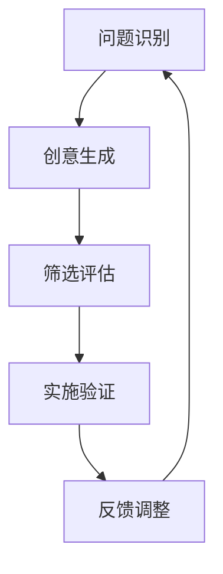

                 

# 管理者如何培养创新思维

> 关键词：创新思维、管理者、商业策略、团队管理、产品开发

> 摘要：本文将探讨管理者如何培养创新思维，以提升企业在竞争激烈的市场中的竞争力。我们将从创新的重要性、核心概念、培养方法、应用实践、案例分析以及未来趋势等方面进行详细分析，旨在为管理者提供实用的创新思维培养策略。

### 引言

#### 创新的重要性

在当今快速变化和高度竞争的商业环境中，创新已成为企业生存和发展的关键。对于管理者来说，培养创新思维不仅有助于提升企业竞争力，还能推动团队和个人成长。创新思维不仅关乎技术和产品，还涉及到管理理念、商业模式、组织架构等多个层面。

#### 创新的定义与分类

创新可以定义为引入新的思想、方法或产品，从而改变现有的运营方式或市场格局。根据创新的性质，我们可以将其分为破坏性创新、持续性创新和颠覆性创新。破坏性创新通常涉及颠覆现有市场格局的新产品或服务，而持续性创新则是在现有产品或服务上进行的改进。

#### 创新在商业环境中的价值

创新在商业环境中具有多重价值，包括：

1. **提升竞争力**：创新可以帮助企业超越竞争对手，满足客户需求，赢得市场份额。
2. **增加营收**：通过创新产品或服务，企业可以实现新的收入来源，提升整体营收。
3. **增强员工满意度**：创新可以激发员工的工作热情和创造力，提高团队整体效率。
4. **塑造品牌形象**：持续的创新能够树立企业的领先品牌形象，增强客户信任和忠诚度。

### 第一部分：管理者如何培养创新思维

#### 第1章：创新思维的核心概念

##### 1.1 创意与创新的区别

创意和创新的区别在于，创意是新的想法或概念，而创新则是将这些想法转化为实际的产品、服务或过程。创意可能只是停留在脑海中的构思，而创新则是通过实施和验证使其变为现实。

##### 1.2 创新思维的五个关键要素

创新思维包括以下五个关键要素：

1. **开放性**：开放性是指对新的想法、方法和观点持开放态度，不断接受和探索。
2. **关联性**：关联性是指能够将看似无关的事物联系起来，发现新的解决方案。
3. **适应性**：适应性是指在面对变化和不确定性时，能够灵活调整思维方式和策略。
4. **持久性**：持久性是指对于创新项目保持长期投入和关注，不断迭代和完善。
5. **系统性**：系统性是指将创新视为一个整体过程，包括创意生成、实施、评估和改进。

##### 1.3 创新思维的理论基础

创新思维的理论基础包括：

1. **认知心理学**：认知心理学研究人类的思维过程和决策行为，为创新提供了理论基础。
2. **组织行为学**：组织行为学研究组织内部的行为和动力，为培养创新文化提供了指导。
3. **战略管理**：战略管理强调通过创新来实现长期竞争优势，为创新提供了战略方向。

#### 第2章：创新思维的培养方法

##### 2.1 培养创新思维的方法

培养创新思维的方法包括：

1. **多角度思考**：从不同的角度和层面审视问题，发现新的解决方案。
2. **跨界思维**：结合不同领域的知识，产生创新的思维火花。
3. **实践与反思**：通过实践验证想法，不断反思和调整，提升创新能力。

##### 2.2 如何激发创新潜力

激发创新潜力的方法包括：

1. **创造宽松的环境**：为员工提供自由思考和尝试的空间，鼓励创新。
2. **鼓励失败**：将失败视为创新过程的一部分，鼓励员工勇于尝试。
3. **提供资源和支持**：为创新项目提供足够的资源和支持，确保其顺利实施。

##### 2.3 增强创新思维的工具

增强创新思维的工具包括：

1. **头脑风暴**：通过集体讨论，快速产生大量的创意。
2. **思维导图**：将创意和思路可视化，帮助梳理和整合思维。
3. **SWOT分析**：通过分析优势、劣势、机会和威胁，制定创新策略。

#### 第3章：创新思维的应用实践

##### 3.1 创新思维在团队管理中的应用

创新思维在团队管理中的应用包括：

1. **建立创新文化**：通过培养创新文化，激发团队的创新潜力。
2. **设立创新目标**：为团队设定明确的创新目标，确保创新活动的有序进行。
3. **激励创新行为**：通过奖励和认可，鼓励团队成员参与创新。

##### 3.2 创新思维在产品开发中的应用

创新思维在产品开发中的应用包括：

1. **用户调研**：通过用户调研，了解用户需求和痛点，制定创新产品策略。
2. **迭代开发**：通过迭代开发，不断优化产品，提升用户体验。
3. **跨界合作**：与其他领域的专家合作，引入新的思路和技术。

##### 3.3 创新思维在商业战略中的应用

创新思维在商业战略中的应用包括：

1. **市场分析**：通过市场分析，发现新的商机和潜力。
2. **商业模式创新**：通过创新商业模式，实现企业的可持续发展。
3. **战略调整**：根据市场变化和竞争态势，及时调整商业战略。

#### 第4章：创新思维的案例分析

##### 4.1 成功的案例介绍

在本章中，我们将介绍一些成功的企业和创新案例，包括：

- 苹果公司的iPhone
- 亚马逊的Kindle电子书阅读器
- 特斯拉的电动汽车

##### 4.2 案例分析

通过对这些案例的分析，我们将探讨成功企业的创新思维策略和实践方法。

##### 4.3 案例启示与借鉴

本章将总结案例中的启示，为管理者提供可借鉴的创新思维策略和实践经验。

#### 第5章：创新思维的发展趋势

##### 5.1 创新思维的未来趋势

在本章中，我们将探讨创新思维的未来趋势，包括：

- 人工智能在创新中的应用
- 跨界融合带来的创新机会
- 可持续发展对创新思维的影响

##### 5.2 技术革新对创新思维的影响

技术革新对创新思维的影响包括：

- 新技术的引入和创新思维的变革
- 技术进步对创新模式的改变
- 技术与创新的融合趋势

##### 5.3 管理者如何引领创新思维的发展

在本章中，我们将讨论管理者如何引领创新思维的发展，包括：

- 培养创新型人才
- 构建创新型企业文化
- 制定创新战略和规划

### 第二部分：创新思维的核心概念与联系

#### 第6章：创新思维的核心概念原理和架构

##### 6.1 创新思维的核心概念

创新思维的核心概念包括：

- 创新过程
- 创新文化
- 创新团队
- 创新战略

##### 6.2 创新思维的基本架构

创新思维的基本架构包括：

1. **问题识别**：发现和定义问题。
2. **创意生成**：产生新的想法和解决方案。
3. **筛选评估**：评估创意的可行性和潜在价值。
4. **实施验证**：将创意转化为实际的产品或服务。

##### 6.3 Mermaid流程图展示



#### 第7章：创新思维的核心算法原理讲解

##### 8.1 创造性思维算法

创造性思维算法包括：

1. **头脑风暴法**：通过集体讨论，快速产生大量的创意。
2. **思维导图法**：将创意和思路可视化，帮助梳理和整合思维。
3. **SWOT分析法**：通过分析优势、劣势、机会和威胁，制定创新策略。

##### 8.2 模拟退火算法

模拟退火算法是一种启发式搜索算法，其基本原理如下：

1. **初始状态**：设定初始解。
2. **迭代过程**：在每次迭代中，随机选择一个新的解，并计算其与当前解之间的差异。
3. **接受准则**：根据差异值和当前温度，决定是否接受新解。
4. **温度更新**：在迭代过程中逐渐降低温度，以避免陷入局部最优。

伪代码如下：

```python
initialize T
while T > T_min:
    for i in range(1, max_iterations):
        new_solution = generate_random_solution()
        difference = calculate_difference(current_solution, new_solution)
        if accept_difference(difference, T):
            current_solution = new_solution
    T = T * cooling_rate
return current_solution
```

##### 8.3 伪代码详细阐述

伪代码详细阐述如下：

1. **初始化**：设定初始温度 `T`。
2. **迭代过程**：在每次迭代中，生成一个随机的新解 `new_solution`，并计算其与当前解 `current_solution` 之间的差异 `difference`。
3. **接受准则**：根据差异值 `difference` 和当前温度 `T`，决定是否接受新解。接受准则通常基于概率，概率越高，越可能接受新解。
4. **温度更新**：在每次迭代后，根据预定的冷却率 `cooling_rate` 逐渐降低温度 `T`，以避免陷入局部最优。
5. **结束条件**：当温度降低到最小温度 `T_min` 时，结束迭代过程，返回当前解 `current_solution`。

### 第三部分：创新思维的数学模型和数学公式

#### 第9章：创新思维的数学模型

##### 9.1 数学模型的基本原理

创新思维的数学模型旨在通过数学方法描述创新过程，分析创新效果。基本原理包括：

1. **熵变原理**：熵变原理描述创新过程中信息量的变化，反映创新的复杂程度。
2. **反馈循环原理**：反馈循环原理描述创新过程中的迭代和反馈机制，反映创新的持续性和发展性。

##### 9.2 数学公式及其讲解

在本节中，我们将介绍创新思维的几个关键数学公式，并对其进行详细讲解。

1. **创新效率公式**：

$$
E = \frac{I}{T}
$$

其中，`E` 表示创新效率，`I` 表示创新成果，`T` 表示创新投入。该公式描述了创新成果与投入之间的关系，反映了创新资源的利用效率。

2. **熵变公式**：

$$
\Delta S = \frac{\Delta I}{T}
$$

其中，`ΔS` 表示熵变，`ΔI` 表示信息量的变化，`T` 表示温度。该公式描述了创新过程中信息量的变化，反映了创新的复杂程度。

3. **反馈循环公式**：

$$
F = \frac{I}{T} + \frac{\Delta I}{T^2}
$$

其中，`F` 表示反馈循环强度，`I` 表示创新成果，`ΔI` 表示信息量的变化，`T` 表示温度。该公式描述了创新过程中的反馈循环机制，反映了创新的持续性和发展性。

##### 9.3 数学公式举例说明

以下是一个创新思维数学模型的例子，用于分析一个企业在某个领域的创新活动。

1. **创新效率计算**：

假设一个企业在一年内完成了10个创新项目，每个项目平均投入1000小时，创新成果为提高销售额10%。根据创新效率公式：

$$
E = \frac{10}{1000} = 0.01
$$

即创新效率为0.01，表示每个小时的创新投入能够带来0.01的创新成果。

2. **熵变计算**：

假设在创新过程中，企业信息量增加了50%。根据熵变公式：

$$
\Delta S = \frac{50}{1000} = 0.05
$$

即熵变为0.05，表示创新过程中信息量增加了5%。

3. **反馈循环计算**：

假设在创新过程中，企业反馈循环强度为0.1。根据反馈循环公式：

$$
F = \frac{0.1}{1000} + \frac{50}{1000^2} = 0.0001 + 0.00005 = 0.00015
$$

即反馈循环强度为0.00015，表示创新过程中每个小时的创新投入能够带来0.00015的反馈循环效果。

### 第四部分：创新思维的项目实战

#### 第10章：创新思维的项目实战

##### 10.1 实战项目背景

在本章中，我们将介绍一个实际的创新思维项目，并详细阐述项目的背景、目标、实施过程和成果。

项目背景：某互联网公司希望开发一款基于人工智能的智能推荐系统，以提升用户满意度和平台竞争力。

项目目标：通过创新思维，设计并实现一个高效、准确、用户友好的智能推荐系统。

##### 10.2 开发环境搭建

为了实现项目目标，我们需要搭建一个合适的开发环境。以下是开发环境的搭建步骤：

1. **硬件配置**：配置高性能服务器和计算资源，确保系统稳定运行。
2. **软件环境**：安装Python、TensorFlow、Keras等开发工具和框架。
3. **数据集**：收集和整理用户数据，包括用户行为、偏好和反馈等。

##### 10.3 源代码详细实现和解读

在本节中，我们将详细介绍智能推荐系统的源代码实现和解读。

1. **数据预处理**：

```python
import pandas as pd
from sklearn.preprocessing import StandardScaler

# 读取用户数据
data = pd.read_csv('user_data.csv')
# 数据清洗和预处理
scaler = StandardScaler()
data[['feature1', 'feature2', 'feature3']] = scaler.fit_transform(data[['feature1', 'feature2', 'feature3']])
```

2. **模型训练**：

```python
from tensorflow.keras.models import Sequential
from tensorflow.keras.layers import Dense, Dropout

# 构建神经网络模型
model = Sequential()
model.add(Dense(128, activation='relu', input_shape=(num_features,)))
model.add(Dropout(0.5))
model.add(Dense(64, activation='relu'))
model.add(Dropout(0.5))
model.add(Dense(1, activation='sigmoid'))

# 编译模型
model.compile(optimizer='adam', loss='binary_crossentropy', metrics=['accuracy'])

# 训练模型
model.fit(x_train, y_train, epochs=10, batch_size=64, validation_data=(x_val, y_val))
```

3. **模型评估**：

```python
from sklearn.metrics import accuracy_score

# 评估模型
predictions = model.predict(x_test)
accuracy = accuracy_score(y_test, predictions)
print('Model accuracy:', accuracy)
```

##### 10.4 代码解读与分析

在本节中，我们将对源代码进行详细解读，分析关键代码的功能和作用。

1. **数据预处理**：

- 读取用户数据，并进行数据清洗和预处理，包括缺失值处理、异常值处理和特征标准化等。
- 特征标准化是为了消除不同特征之间的量纲差异，使得模型训练更加稳定。

2. **模型训练**：

- 构建神经网络模型，包括输入层、隐藏层和输出层。
- 使用ReLU激活函数和Dropout层，增强模型的泛化能力。
- 编译模型，设置优化器和损失函数，准备训练。
- 训练模型，使用训练集进行迭代训练，并使用验证集进行模型评估。

3. **模型评估**：

- 使用测试集对模型进行评估，计算准确率，评估模型性能。

通过这个项目实战，我们可以看到创新思维在项目开发中的应用，包括数据预处理、模型设计和评估等环节。创新思维帮助我们在面对复杂问题时，能够快速找到解决方案，实现项目的成功。

### 第五部分：总结与展望

#### 第11章：总结与展望

##### 11.1 创新思维的重要性总结

创新思维在企业管理中具有至关重要的地位，它能够帮助企业应对市场变化、提升竞争力、实现可持续发展。创新思维的重要性体现在以下几个方面：

1. **提升企业竞争力**：通过创新思维，企业能够开发出更具竞争力的产品和服务，赢得市场份额。
2. **激发员工潜能**：创新思维能够激发员工的创造力和积极性，提高团队整体绩效。
3. **推动企业变革**：创新思维有助于企业适应市场变化，实现商业模式和组织结构的变革。
4. **实现可持续发展**：创新思维能够帮助企业实现技术创新、管理创新和商业模式创新，推动企业的长期发展。

##### 11.2 创新思维的现状与挑战

当前，企业普遍认识到创新思维的重要性，但在实际应用中仍面临一些挑战：

1. **创新资源不足**：许多企业缺乏足够的创新资源和投入，难以开展大规模的创新项目。
2. **创新文化缺失**：一些企业缺乏创新文化，员工缺乏创新的动力和空间。
3. **创新能力不足**：企业缺乏创新人才和专业的创新团队，难以实现创新目标。
4. **创新过程不规范**：一些企业的创新过程缺乏规范和有效的管理，导致创新效率低下。

##### 11.3 未来创新思维的发展趋势

未来，创新思维的发展趋势将呈现以下几个方面：

1. **人工智能与创新的融合**：人工智能技术将深度融入创新思维，为创新提供更强大的工具和方法。
2. **跨界创新的兴起**：企业将更加注重跨界合作，融合不同领域的知识和技术，实现创新突破。
3. **创新文化的建设**：企业将更加重视创新文化的建设，为员工提供自由思考和创新的氛围。
4. **创新生态的构建**：企业将构建创新生态，与外部合作伙伴共同推动创新，实现共赢。

### 附录

#### 附录A：创新思维相关资源与工具

##### A.1 创新思维相关书籍推荐

1. **《创新者的窘境》**：作者克莱顿·克里斯坦森，阐述了破坏性创新的理论和实践。
2. **《精益创业》**：作者埃里克·莱斯，介绍了精益创业的方法论，强调快速迭代和用户反馈。
3. **《创新者的基因》**：作者史蒂夫·布兰克，揭示了创新者的思维模式和习惯。

##### A.2 创新思维在线课程推荐

1. **哈佛大学开放课程《创新思维》**：介绍了创新思维的基本原理和方法。
2. **Coursera《产品创新设计》**：讲解了产品创新设计的方法和流程。
3. **网易云课堂《创新思维与设计思维》**：结合设计思维，探讨创新思维的实践应用。

##### A.3 创新思维工具介绍

1. **思维导图**：一种可视化工具，可以帮助梳理和整合创新思维。
2. **头脑风暴**：一种集体讨论的方法，用于快速产生创意。
3. **SWOT分析**：一种战略分析工具，用于评估创新项目的优势和劣势。

### 作者信息

作者：AI天才研究院/AI Genius Institute & 禅与计算机程序设计艺术 /Zen And The Art of Computer Programming

