                 

# 管理者如何应对快速变化的商业环境

## 关键词

快速变化、商业环境、管理者、战略调整、技术创新、组织变革、人才管理、数字化转型、全球化策略

## 摘要

本文旨在探讨在快速变化的商业环境中，管理者如何有效应对挑战，把握机遇。文章首先分析了商业环境快速变化的原因，包括技术革新、全球经济形势变化等，接着探讨了快速变化商业环境对管理者的挑战，如战略决策难度增加、组织结构调整需求等。随后，文章提出了管理者应对快速变化商业环境的策略，包括战略调整与市场定位、组织变革与创新、风险管理与决策等。此外，文章还详细讨论了技术驱动下的商业创新、人才管理与组织发展、数字化转型与商业模式创新、创新管理与创业孵化、全球化背景下的商业策略等方面。最后，通过案例分析和工具方法介绍，为管理者提供了具体的实践指导。

### 第一部分：管理者如何应对快速变化的商业环境概述

在当今的商业环境中，变化已经成为常态。无论是技术领域的突破，还是全球经济形势的变化，都使得商业环境变得日益复杂和不可预测。对于管理者来说，如何有效应对快速变化的商业环境，已经成为一个重要的课题。本文将从以下几个方面展开论述：

1. **快速变化商业环境的本质与挑战**：分析商业环境快速变化的原因，包括技术革新、全球经济形势变化等，探讨这种变化对管理者带来的挑战。

2. **管理者应对快速变化商业环境的策略**：提出一系列策略，如战略调整与市场定位、组织变革与创新、风险管理与决策等，帮助管理者应对快速变化的商业环境。

3. **技术驱动下的商业创新**：探讨人工智能、大数据等技术如何驱动商业创新，以及管理者如何利用这些技术提升企业的竞争力。

4. **人才管理与组织发展**：分析人才对组织竞争力的重要性，提出人才吸引与保留、激励机制设计、培训与发展等策略。

5. **数字化转型与商业模式创新**：探讨数字化转型的概念与价值，以及如何通过数字化商业模式创新提升企业的竞争力。

6. **创新管理与创业孵化**：分析创新管理的基本原则，探讨创业孵化的实践与支持政策。

7. **全球化背景下的商业策略**：探讨全球化商业环境的特点，以及跨国经营策略和品牌全球化策略。

通过上述分析，本文旨在为管理者提供一套系统的、实用的应对策略，帮助他们在快速变化的商业环境中取得成功。

### 第1章：快速变化商业环境的本质与挑战

#### 1.1 商业环境快速变化的原因

商业环境的快速变化主要可以归因于以下几个因素：

##### 1.1.1 技术革新推动商业变革

##### 1.1.1.1 数字化技术的应用

数字化技术的广泛应用，如互联网、移动互联网、云计算、大数据等，极大地改变了商业运行的方式。例如，电子商务的兴起，使得传统商业模式受到了巨大冲击。企业可以通过电商平台直接与消费者互动，降低中间环节，提高运营效率。

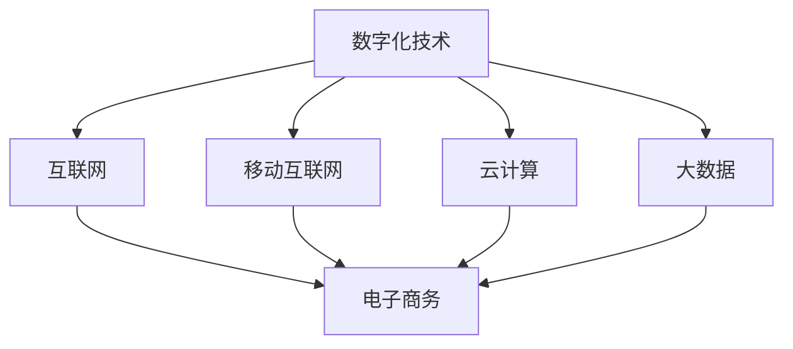

##### 1.1.1.2 人工智能与大数据的影响

人工智能和大数据技术的快速发展，使得企业能够更好地理解消费者需求，优化业务流程，提高决策效率。例如，通过大数据分析，企业可以识别潜在客户，制定更精准的营销策略。人工智能的应用，如智能客服、自动化生产等，也极大地提升了企业的运营效率。

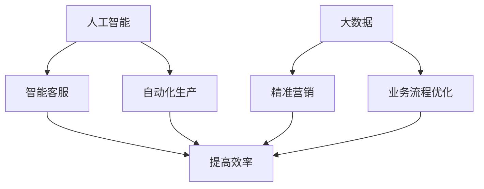

##### 1.1.2 全球经济形势的变化

##### 1.1.2.1 全球化与逆全球化的影响

全球化推动了国际贸易和投资，使得企业可以更加便捷地进入国际市场。然而，逆全球化的趋势也在加剧，贸易保护主义、地缘政治紧张等因素，都对全球化进程产生了影响。例如，中美贸易战就使得一些企业重新考虑供应链布局，以降低贸易风险。

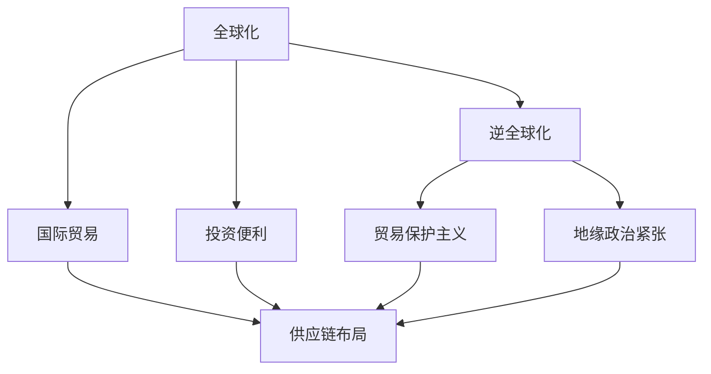

##### 1.1.2.2 贸易摩擦与供应链重构

贸易摩擦的加剧，尤其是中美贸易战，使得企业不得不面对供应链重构的挑战。一些企业开始将生产设施转移到其他地区，以减少贸易摩擦带来的风险。例如，苹果公司就曾考虑将部分生产线转移到印度或其他亚洲国家。

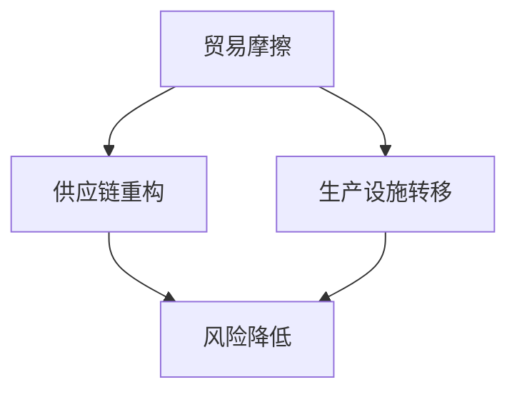

#### 1.2 快速变化商业环境对管理者的挑战

在快速变化的商业环境中，管理者面临着一系列的挑战：

##### 1.2.1 战略决策的难度增加

商业环境的快速变化，使得市场预测变得更加困难，管理者需要面对更多的不确定性和风险。例如，疫情的爆发使得全球经济受到了巨大的冲击，许多企业的战略计划不得不进行调整。

##### 1.2.1.1 市场预测的困难

在快速变化的商业环境中，市场预测的难度大大增加。传统的市场预测方法可能无法准确预测市场的变化，管理者需要采用更加灵活和创新的预测方法。

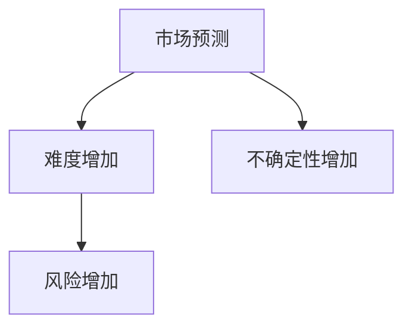

##### 1.2.1.2 竞争对手的不确定性

商业环境的快速变化，使得竞争对手的行为变得更加难以预测。一些新兴企业可能会通过技术创新或市场策略，迅速崛起，成为行业领导者。例如，滴滴出行在短时间内，就颠覆了传统出租车行业。

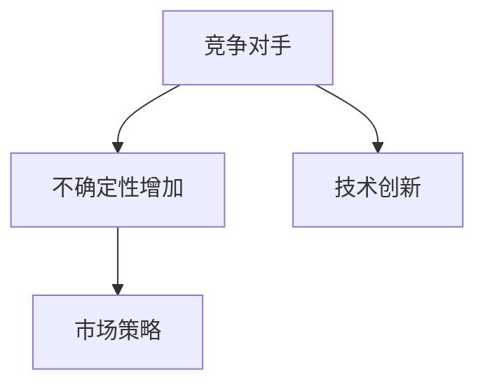

##### 1.2.2 组织结构的调整需求

商业环境的快速变化，要求组织结构也需要进行相应的调整。传统的层级式组织结构，可能无法适应快速变化的商业环境，管理者需要采用更加灵活的组织结构，如模块化组织结构，以应对市场变化。

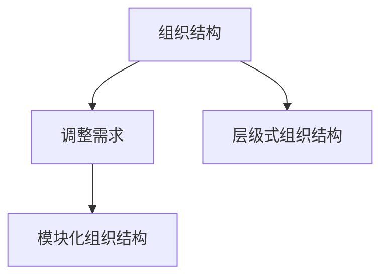

##### 1.2.2.1 模块化组织与跨界合作

模块化组织结构，可以将企业划分为多个独立的模块，每个模块负责特定的业务领域。这种组织结构，可以提升企业的灵活性和响应速度。同时，跨界合作也成为应对快速变化商业环境的重要策略，企业可以通过与外部合作伙伴的合作，共同应对市场变化。

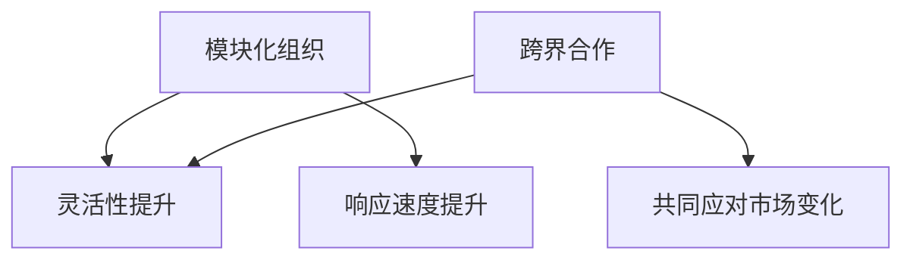

##### 1.2.2.2 垂直整合与水平整合的平衡

在快速变化的商业环境中，管理者需要平衡垂直整合与水平整合的关系。垂直整合，可以提升企业的控制力，但可能会降低灵活性；水平整合，可以提高灵活性，但可能会降低控制力。管理者需要在两者之间找到平衡点，以应对快速变化的商业环境。

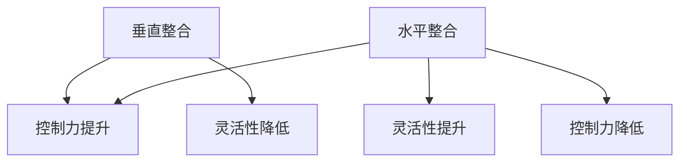

##### 1.2.3 创新能力的提升

在快速变化的商业环境中，创新能力成为企业持续发展的关键。管理者需要提升企业的创新能力，以适应市场的变化。这包括对技术创新的认知，创新激励机制的设计等。

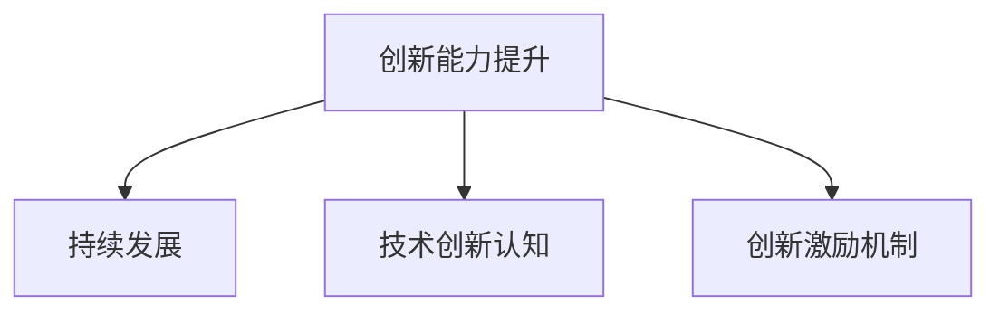

通过以上分析，我们可以看到，快速变化的商业环境，给管理者带来了许多挑战。然而，通过采取相应的策略，如战略调整、组织变革、技术创新等，管理者可以应对这些挑战，把握市场机遇，实现企业的持续发展。

### 第2章：管理者应对快速变化商业环境的策略

在快速变化的商业环境中，管理者需要采取一系列策略来应对挑战，确保企业的持续发展和竞争力。以下将从战略调整与市场定位、组织变革与创新、风险管理与决策等方面，详细探讨管理者应对快速变化商业环境的策略。

#### 2.1 战略调整与市场定位

在快速变化的商业环境中，战略调整与市场定位至关重要。管理者需要根据市场变化和竞争态势，调整企业的战略方向和目标。

##### 2.1.1 市场细分与定位

市场细分是战略调整的重要步骤，通过将市场划分为不同的细分市场，企业可以更加精准地满足不同客户群体的需求。以下是一个市场细分与定位的示例：

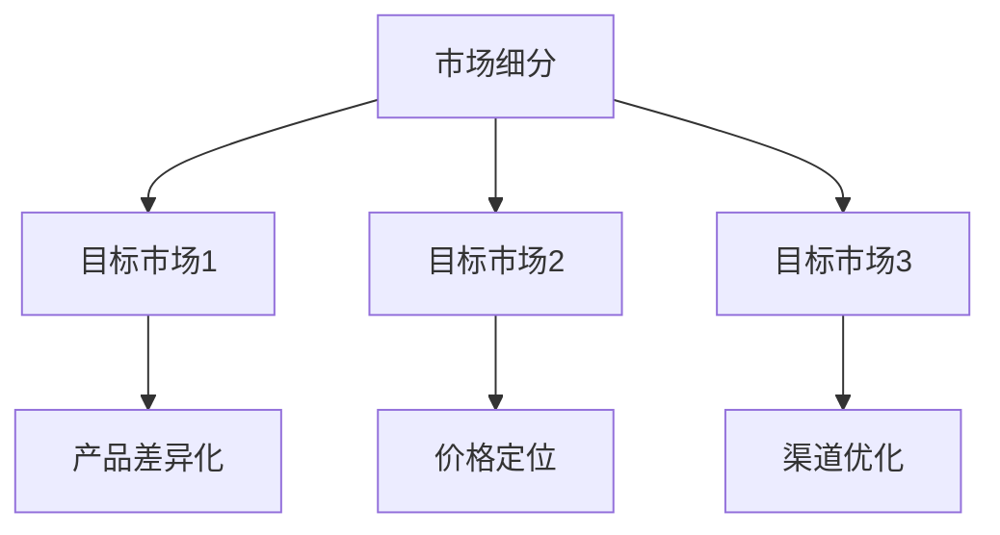

在市场细分的基础上，企业需要明确自己的目标市场，制定相应的市场定位策略。例如，对于目标市场1，企业可以采取产品差异化策略，通过提供独特的产品或服务来吸引客户；对于目标市场2，企业可以采取价格定位策略，通过提供有竞争力的价格来吸引客户；对于目标市场3，企业可以采取渠道优化策略，通过选择最合适的销售渠道来提高市场覆盖率。

##### 2.1.2 竞争策略的选择

在快速变化的商业环境中，管理者需要根据自身的资源和能力，选择合适的竞争策略。以下是一些常见的竞争策略：

- 成本领先策略：通过降低成本来提供具有竞争力的价格，吸引价格敏感的客户。
- 差异化策略：通过提供独特的产品或服务，满足客户的不同需求，形成竞争优势。
- 焦点策略：专注于某一细分市场，提供专业的产品或服务，成为该领域的领导者。

以下是一个竞争策略选择的示例：

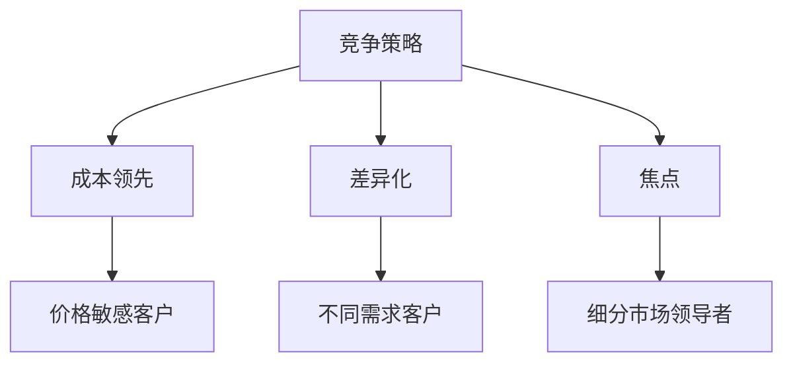

通过以上策略，企业可以在快速变化的商业环境中，找到自己的定位，提升市场竞争力。

#### 2.2 组织变革与创新

在快速变化的商业环境中，组织变革和创新是管理者应对挑战的关键。以下将从模块化组织结构的应用、创新机制的建设、跨界合作与生态构建等方面，探讨组织变革与创新的策略。

##### 2.2.1 模块化组织结构的应用

模块化组织结构是将企业划分为多个独立的模块，每个模块负责特定的业务领域。这种组织结构具有高度灵活性，能够快速响应市场变化。

以下是一个模块化组织结构的示例：

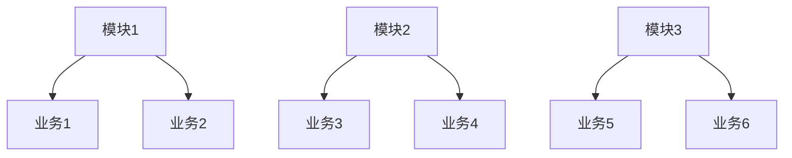

通过模块化组织结构，企业可以更好地适应市场变化，提高运营效率。

##### 2.2.2 创新机制的建设

创新机制的建设是提升企业创新能力的重要手段。以下是一个创新机制建设的基本框架：

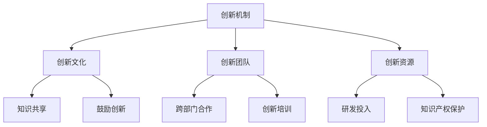

通过创新机制的建设，企业可以激发员工的创新潜能，推动企业的持续创新。

##### 2.2.3 跨界合作与生态构建

在快速变化的商业环境中，跨界合作和生态构建成为企业管理者应对挑战的重要策略。以下是一个跨界合作与生态构建的示例：

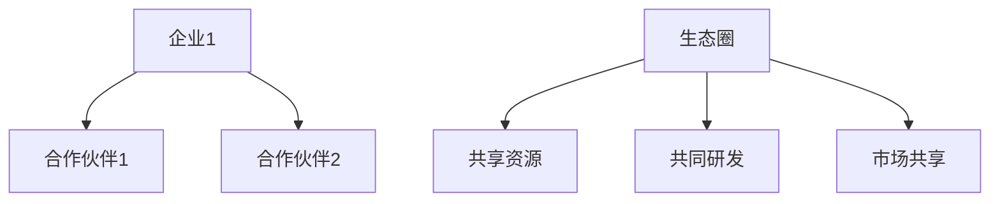

通过跨界合作和生态构建，企业可以拓展业务领域，提升整体竞争力。

#### 2.3 风险管理与决策

在快速变化的商业环境中，风险管理是管理者不可忽视的重要任务。以下将从风险识别与评估、决策制定与执行、应急预案的制定等方面，探讨风险管理的策略。

##### 2.3.1 风险识别与评估

风险识别与评估是风险管理的第一步。以下是一个风险识别与评估的基本框架：

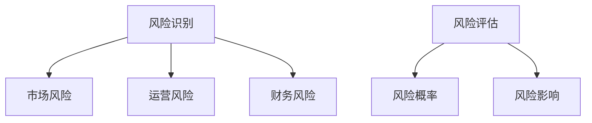

通过风险识别与评估，企业可以了解可能面临的风险，并制定相应的应对策略。

##### 2.3.2 决策制定与执行

在风险管理中，决策制定与执行至关重要。以下是一个决策制定与执行的基本框架：

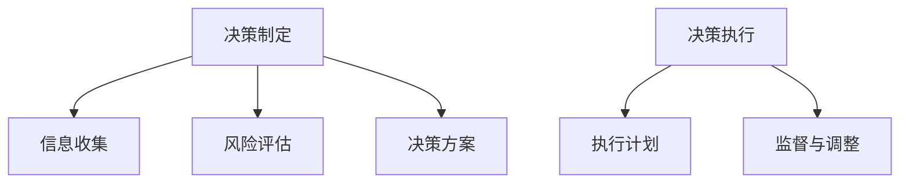

通过科学决策和有效执行，企业可以降低风险，实现预期目标。

##### 2.3.3 应急预案的制定

应急预案是企业在面对突发风险时的重要保障。以下是一个应急预案的基本框架：

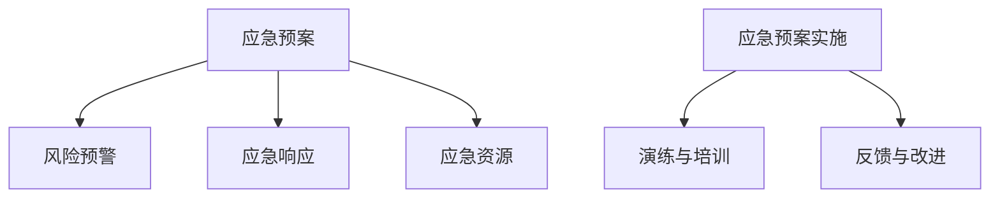

通过制定和实施应急预案，企业可以提升应对突发风险的能力，保障企业的稳定运营。

通过以上策略，管理者可以更好地应对快速变化的商业环境，确保企业的持续发展和竞争力。

### 第3章：技术驱动下的商业创新

在快速变化的商业环境中，技术驱动成为推动商业创新的重要力量。人工智能、大数据等技术的发展，不仅改变了企业的运营方式，也创造了全新的商业模式。本章将探讨技术驱动的商业创新，包括技术趋势分析、技术驱动的商业模式创新、技术驱动的业务流程优化等方面。

#### 3.1 技术趋势分析

##### 3.1.1 人工智能技术的发展

人工智能（AI）技术的快速发展，已经在各行各业中得到了广泛应用。以下是一些关键的人工智能技术及其在商业中的应用案例：

- **自然语言处理（NLP）**：NLP技术可以用于智能客服、语音识别和文本分析等领域。例如，阿里巴巴的智能客服系统“阿里小蜜”，可以自动解答用户问题，提高客户满意度。

- **机器学习**：机器学习技术可以用于预测分析、推荐系统和图像识别等领域。例如，亚马逊的推荐系统，通过分析用户的历史购买数据，为用户推荐相关商品。

- **计算机视觉**：计算机视觉技术可以用于图像识别、自动驾驶和安防监控等领域。例如，特斯拉的自动驾驶系统，通过计算机视觉技术，实现车辆的自动驾驶。

以下是一个人工智能技术的应用流程图：

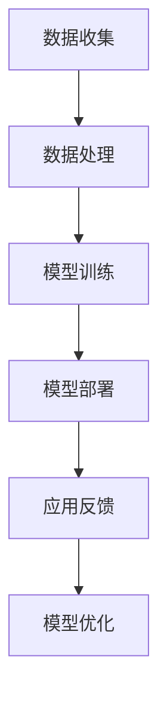

##### 3.1.2 大数据的商业价值

大数据技术的应用，使得企业能够从海量数据中提取有价值的信息，从而优化业务决策。以下是一些大数据的基础设施及其在决策分析中的应用：

- **数据存储与管理**：企业需要高效的数据存储与管理系统，如Hadoop和Spark，来处理和分析海量数据。

- **数据分析工具**：数据分析工具，如Python的Pandas库和R语言，可以帮助企业进行数据的统计分析。

- **数据可视化**：数据可视化工具，如Tableau和PowerBI，可以帮助企业将数据以图形化的形式展示，便于理解和分析。

以下是一个大数据分析的应用流程图：

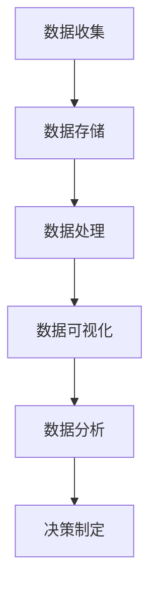

#### 3.2 技术驱动的商业模式创新

技术驱动下的商业模式创新，为企业提供了无限的可能性。以下探讨几种常见的商业模式创新：

##### 3.2.1 平台化商业模式的构建

平台化商业模式，通过搭建一个开放的平台，连接供应商、消费者和其他合作伙伴，实现资源的共享和协同。以下是一个平台化商业模式的基本框架：

```mermaid
graph TD
A[平台] --> B[供应商]
A --> C[消费者]
A --> D[合作伙伴]
B --> E[交易]
C --> E
D --> E
```

例如，阿里巴巴的淘宝平台，通过连接卖家和买家，实现了在线交易的便捷性。

##### 3.2.2 生态系统建设的策略

生态系统建设，是企业通过构建一个多元化的生态系统，实现资源的共享和协同。以下是一个生态系统建设的基本框架：

```mermaid
graph TD
A[核心企业] --> B[上游供应商]
A --> C[下游客户]
A --> D[服务提供商]
B --> E[协同创新]
C --> E
D --> E
```

例如，腾讯的微信生态，通过连接各种服务提供商，为用户提供一站式服务。

#### 3.3 技术驱动的业务流程优化

技术驱动下的业务流程优化，可以帮助企业提升运营效率，降低成本。以下探讨几种常见的业务流程优化方法：

##### 3.3.1 业务流程再造（BPR）

业务流程再造（Business Process Reengineering，BPR），是一种通过彻底重新设计业务流程，以实现显著性能提升的方法。以下是一个BPR的基本框架：

```mermaid
graph TD
A[现状分析] --> B[目标设定]
B --> C[流程重构]
C --> D[实施与监控]
```

例如，美国零售巨头沃尔玛，通过BPR，实现了供应链的优化，大幅提升了运营效率。

##### 3.3.2 数字化运营与自动化

数字化运营与自动化，通过引入数字化工具和自动化技术，实现业务流程的自动化和智能化。以下是一个数字化运营与自动化的基本框架：

```mermaid
graph TD
A[数字化工具引入] --> B[业务流程自动化]
B --> C[数据监控与分析]
C --> D[智能决策支持]
```

例如，制造业企业通过引入物联网和自动化生产线，实现了生产过程的智能化和自动化。

通过以上分析，我们可以看到，技术驱动的商业创新，不仅改变了企业的运营方式，也为企业提供了无限的可能性。管理者需要紧跟技术发展趋势，积极探索和利用新技术，实现商业模式的创新和业务流程的优化，提升企业的竞争力。

### 第4章：人才管理与组织发展

在快速变化的商业环境中，人才管理成为企业可持续发展的关键。人才是推动企业创新、应对市场变化和实现战略目标的核心资源。本章将探讨人才管理的核心原则、策略和实践，包括人才战略的重要性、人才结构的优化、培训与发展的策略、组织文化的建设等方面。

#### 4.1 人才战略的重要性

##### 4.1.1 人才对组织竞争力的贡献

人才是企业竞争力的核心因素。一个优秀的人才团队不仅能够提升企业的创新能力，还能够推动企业的业务增长和市场拓展。以下是人才对组织竞争力的几个关键贡献：

1. **创新能力**：人才是创新的核心驱动力。拥有高素质的员工，企业能够更快地研发新产品、优化现有产品和开发新的业务模式。

2. **业务增长**：人才能够帮助企业开拓新市场、挖掘新的商业机会，推动业务的持续增长。

3. **组织效能**：人才能够提升企业的运营效率，通过改进流程、提高质量和降低成本，实现企业的目标。

以下是一个人才对组织竞争力贡献的示意图：

```mermaid
graph TD
A[创新能力] --> B[业务增长]
A --> C[组织效能]
B --> D[市场份额提升]
C --> D
```

##### 4.1.2 人才吸引与保留的策略

在快速变化的商业环境中，吸引和保留优秀人才成为企业的重要挑战。以下是一些有效的人才吸引与保留策略：

1. **提供有竞争力的薪酬和福利**：高薪酬和良好的福利制度是吸引和留住人才的重要手段。

2. **职业发展机会**：为员工提供明确的职业发展路径和培训机会，激发员工的职业发展动力。

3. **企业文化**：构建积极向上的企业文化，营造良好的工作氛围，增强员工的归属感。

4. **工作与生活的平衡**：提供灵活的工作时间和远程工作机会，帮助员工实现工作与生活的平衡。

以下是一个人才吸引与保留策略的示意图：

```mermaid
graph TD
A[有竞争力的薪酬福利] --> B[职业发展机会]
A --> C[企业文化]
A --> D[工作与生活平衡]
B --> E[员工满意度提升]
C --> E
D --> E
```

##### 4.1.3 人才激励机制的设计

激励机制是留住和激发员工潜力的重要手段。以下是一些有效的人才激励机制：

1. **绩效考核**：通过绩效考核制度，公正地评价员工的工作绩效，激励员工不断提升。

2. **奖金和奖励**：设立奖金和奖励制度，对业绩突出和个人贡献显著的员工进行奖励。

3. **股权激励**：通过股权激励，让员工分享企业的成功和成长，增强员工的长期承诺。

4. **认可和表彰**：定期对员工的贡献进行认可和表彰，提升员工的自信心和自豪感。

以下是一个人才激励机制的设计示意图：

```mermaid
graph TD
A[绩效考核] --> B[奖金奖励]
A --> C[股权激励]
A --> D[认可表彰]
B --> E[员工积极性提升]
C --> E
D --> E
```

#### 4.2 人才结构的优化

##### 4.2.1 人才结构的分析

优化人才结构是提升组织效能的重要步骤。以下是一个人才结构分析的基本框架：

1. **能力分析**：评估员工的能力，确定其是否具备完成工作任务所需的技能和知识。

2. **绩效分析**：分析员工的绩效表现，识别高绩效员工和低绩效员工。

3. **潜力分析**：评估员工的潜力和发展空间，确定其是否具有成为未来领导者的潜力。

以下是一个人才结构分析的基本流程图：

```mermaid
graph TD
A[能力分析] --> B[绩效分析]
A --> C[潜力分析]
B --> D[高绩效员工识别]
C --> D
```

##### 4.2.2 人才结构的优化方案

为了优化人才结构，企业可以采取以下策略：

1. **多元化招聘**：通过多元化招聘，吸引不同背景和技能的员工，提升团队的整体能力。

2. **内部培养**：通过内部培养计划，提升现有员工的能力和潜力，确保企业的人才储备。

3. **人才流动**：通过人才流动，调整员工的工作岗位和职责，激发员工的工作热情和创新能力。

4. **绩效激励**：通过绩效激励，鼓励员工提升绩效，实现个人和团队的共同成长。

以下是一个人才结构优化方案的示意图：

```mermaid
graph TD
A[多元化招聘] --> B[内部培养]
A --> C[人才流动]
A --> D[绩效激励]
B --> E[团队能力提升]
C --> E
D --> E
```

#### 4.3 培训与发展的策略

##### 4.3.1 培训体系的建设

建立完善的培训体系是提升员工能力和职业素养的重要保障。以下是一个培训体系建设的基本框架：

1. **培训需求分析**：评估员工的培训需求，确定培训目标和内容。

2. **培训内容规划**：根据培训需求，规划培训内容，包括技能培训、知识培训和管理培训等。

3. **培训实施与评估**：实施培训计划，并对培训效果进行评估，确保培训目标的达成。

以下是一个培训体系建设的基本流程图：

```mermaid
graph TD
A[培训需求分析] --> B[培训内容规划]
A --> C[培训实施与评估]
```

##### 4.3.2 职业发展规划

职业发展规划是帮助员工实现职业成长的重要手段。以下是一个职业发展规划的基本框架：

1. **职业目标设定**：与员工共同设定职业目标，明确职业发展的方向。

2. **技能提升计划**：根据职业目标，制定技能提升计划，包括培训、实践和经验积累等。

3. **职业发展评估**：定期评估职业发展进度，调整发展计划，确保职业目标的实现。

以下是一个职业发展规划的基本流程图：

```mermaid
graph TD
A[职业目标设定] --> B[技能提升计划]
A --> C[职业发展评估]
```

#### 4.4 组织文化的建设

组织文化是企业的灵魂，对员工的行为和态度产生深远影响。以下是一个组织文化建设的基本框架：

##### 4.4.1 组织价值观的塑造

1. **价值观传播**：通过企业使命、愿景和价值观的传播，使员工认同并践行企业的核心价值观。

2. **行为规范**：制定明确的行为规范，规范员工的行为，营造积极向上的企业文化。

##### 4.4.2 组织氛围的营造

1. **沟通机制**：建立有效的沟通机制，促进信息共享和员工之间的互动，增强团队凝聚力。

2. **员工关怀**：关心员工的成长和福祉，提供丰富的福利和关怀，提升员工的归属感和满意度。

##### 4.4.3 组织文化的传播与强化

1. **文化活动**：通过举办各类文化活动，传播和强化组织文化，提升员工的认同感和归属感。

2. **领导示范**：领导者的行为和态度对组织文化具有示范作用，领导者应积极践行组织文化，为员工树立榜样。

通过以上分析，我们可以看到，人才管理与组织发展是企业在快速变化的商业环境中取得成功的关键。通过制定有效的人才战略、优化人才结构、建设培训体系、规划职业发展、塑造组织价值观和营造良好的组织氛围，企业可以提升员工的素质和能力，激发员工的潜力，实现组织的持续发展和竞争优势。

### 第5章：数字化转型与商业模式创新

在当今的商业环境中，数字化转型已经成为企业提升竞争力、实现可持续发展的重要途径。数字化转型不仅涉及到技术的应用，更涉及到商业模式的创新。本章将探讨数字化转型与商业模式创新的概念、价值、方法以及实际案例。

#### 5.1 数字化转型的概念与价值

##### 5.1.1 数字化转型的定义

数字化转型是指企业通过利用数字技术，对传统的业务流程、运营模式和组织结构进行重构，以实现业务增长、效率提升和客户体验优化的过程。数字化转型不仅仅是技术层面的变革，更是一种全方位、系统性的变革。

##### 5.1.2 数字化转型的核心要素

数字化转型涉及多个核心要素，包括：

1. **数据驱动**：以数据为核心，通过数据收集、分析和利用，指导企业的决策和运营。

2. **技术融合**：将各种数字技术，如人工智能、大数据、云计算等，与企业的业务流程深度融合。

3. **组织变革**：推动企业的组织结构和文化变革，以适应数字化时代的要求。

4. **客户体验**：以客户为中心，通过数字化手段提升客户体验，增强客户黏性。

##### 5.1.3 数字化转型的商业价值

数字化转型为企业带来了显著的商业价值，包括：

1. **提升运营效率**：通过自动化和智能化，减少人力成本，提高生产效率。

2. **增强客户体验**：通过数字化手段，提供个性化、实时化的客户服务，提升客户满意度。

3. **开拓新市场**：通过数字化转型，企业可以更好地了解市场需求，开拓新的市场机会。

4. **创新商业模式**：数字化转型为企业提供了创新的商业模式，如共享经济、平台经济等。

#### 5.2 数字化商业模式创新

##### 5.2.1 数字化商业模式的类型

数字化商业模式创新包括多种类型，以下是一些常见的数字化商业模式：

1. **互联网商业模式**：通过互联网技术，提供在线服务和产品，如电子商务、在线教育等。

2. **平台商业模式**：搭建一个开放的平台，连接供需双方，实现资源的共享和协同，如淘宝、滴滴等。

3. **大数据商业模式**：通过大数据分析，为企业提供决策支持和商业洞察，如数据驱动的市场营销、风险控制等。

4. **人工智能商业模式**：利用人工智能技术，提供智能化的产品和服务，如智能客服、自动驾驶等。

##### 5.2.2 数字化商业模式创新的方法

企业可以通过以下方法实现数字化商业模式创新：

1. **重构业务流程**：通过数字化转型，重新设计业务流程，提高运营效率。

2. **重构客户关系**：通过数字化手段，建立与客户的深度互动，提升客户体验。

3. **跨界合作**：与不同领域的合作伙伴进行跨界合作，共同开发新的商业模式。

4. **数字化产品和服务**：开发基于数字化技术的产品和服务，满足客户的新需求。

#### 5.3 数字化转型的案例分析

##### 5.3.1 成功的数字化转型案例

以下是一些成功的数字化转型案例：

1. **阿里巴巴的数字化转型**

阿里巴巴通过互联网和大数据技术，实现了从传统零售到电子商务的转型。通过搭建淘宝、天猫等电商平台，阿里巴巴成功地将线下客户转移到线上，实现了业务的快速增长。

2. **亚马逊的数字化转型**

亚马逊通过云计算和大数据技术，构建了强大的物流和供应链体系。通过提供便捷的购物体验和个性化的推荐服务，亚马逊在电子商务领域取得了巨大的成功。

##### 5.3.2 失败的数字化转型案例

以下是一些失败的数字化转型案例：

1. **传统制造业的数字化转型**

一些传统制造业企业在数字化转型的过程中，缺乏战略规划和执行力，导致项目失败。例如，一些企业仅仅引入了数字化设备，但没有重构业务流程，导致效率提升不明显。

2. **金融行业的数字化转型**

一些金融机构在数字化转型的过程中，过于依赖外部技术合作伙伴，忽视了内部管理和运营的优化。导致项目实施过程中，出现了数据安全、系统稳定性等问题，影响了用户体验。

#### 5.4 数字化转型与商业模式创新的未来趋势

随着技术的不断进步，数字化转型与商业模式创新将呈现以下趋势：

1. **智能化**：人工智能技术的应用将进一步提升数字化转型的智能化水平，为企业提供更精准的决策支持和业务优化方案。

2. **生态化**：企业将更多地与其他企业、政府、学术机构等建立合作，共同构建生态系统，实现资源的共享和协同。

3. **个性化**：通过大数据和人工智能技术，企业将能够更好地了解客户需求，提供个性化的产品和服务。

4. **平台化**：平台商业模式将继续发展，企业将更多地通过搭建平台，实现跨界合作和资源整合。

通过以上分析，我们可以看到，数字化转型与商业模式创新是企业应对快速变化商业环境的重要手段。通过成功的数字化转型案例，我们可以了解到数字化转型的核心要素和成功的关键；通过失败的数字化转型案例，我们可以吸取教训，避免在数字化转型的过程中出现类似的问题。未来，随着技术的不断进步，数字化转型与商业模式创新将为企业带来更多的机遇和挑战。

### 第6章：创新管理与创业孵化

在快速变化的商业环境中，创新管理是企业保持竞争力、实现可持续发展的关键。创新管理不仅包括技术创新，还涵盖了商业模式创新、组织创新等多方面的内容。本章将探讨创新管理的基本原则、策略和实践，包括创业孵化的实践和创业孵化平台的构建等方面。

#### 6.1 创新管理的基本原则

##### 6.1.1 创新管理的目标

创新管理的目标主要包括：

1. **提高创新能力**：通过构建良好的创新体系和激励机制，提高企业的创新能力，推动企业的持续发展。

2. **实现成果转化**：将创新成果有效地转化为商业价值，提升企业的市场竞争力和盈利能力。

3. **提升组织效能**：通过创新管理，优化业务流程，提高组织的运作效率。

##### 6.1.2 创新管理的策略

创新管理的策略包括以下几个方面：

1. **资源配置策略**：合理分配创新资源，确保创新项目有足够的资金、人力和技术支持。

2. **文化建设策略**：营造创新文化，鼓励员工敢于尝试、勇于创新，形成积极向上的创新氛围。

3. **组织架构策略**：调整组织架构，建立跨部门、跨领域的创新团队，促进信息的共享和协作。

4. **激励机制策略**：设计合理的激励机制，激励员工参与创新活动，提高创新成果的转化率。

#### 6.2 创业孵化的实践

##### 6.2.1 创业孵化平台的建设

创业孵化平台是支持创新创业的重要载体，其建设主要包括以下几个方面：

1. **平台类型**：创业孵化平台可以分为综合型孵化器、专业型孵化器、大学科技园等类型，应根据企业的需求和特点选择合适的平台。

2. **功能定位**：创业孵化平台应具备项目孵化、技术研发、市场推广、投融资对接等功能，为创业企业提供全方位的支持。

3. **政策支持**：政府应出台相关政策，支持创业孵化平台的建设和发展，如税收优惠、租金减免、研发经费补贴等。

##### 6.2.2 创业孵化的支持政策

创业孵化的支持政策主要包括以下几个方面：

1. **资金支持**：政府和企业应设立创业基金，为创业项目提供资金支持，缓解创业企业的资金压力。

2. **人才支持**：政府和企业应加强对创业人才的培养和引进，为创业企业提供专业人才支持。

3. **技术支持**：政府和企业应推动技术研发和创新，为创业企业提供技术支持，提升企业的创新能力。

4. **市场支持**：政府和企业应搭建市场推广平台，帮助创业企业拓展市场，提升企业的市场竞争力。

#### 6.3 创业案例分享与解析

##### 6.3.1 成功创业案例

以下是一个成功的创业案例：

**案例一：字节跳动的创业历程**

字节跳动成立于2012年，是一家以内容创造和分发为主的企业。其创始人张一鸣在创业初期，通过技术创新和精准的内容推荐，迅速积累了大量用户。随着业务的不断发展，字节跳动成功推出了多款热门应用，如抖音、今日头条等，实现了从创业到巨头企业的跨越。

**成功原因分析**：

1. **技术创新**：字节跳动通过大数据和人工智能技术，实现了精准的内容推荐，提升了用户体验。

2. **市场定位**：字节跳动准确抓住了移动互联网时代的需求，快速占领了市场。

3. **持续创新**：字节跳动在创业过程中，始终保持对市场的敏锐洞察，不断进行产品创新和业务拓展。

##### 6.3.2 失败创业案例

以下是一个失败的创业案例：

**案例二：某智能家居创业公司的失败原因**

某智能家居创业公司在2016年成立，旨在通过智能家居产品改善人们的生活质量。然而，在短短几年后，该公司就面临倒闭。导致其失败的主要原因包括：

1. **市场定位不准确**：公司没有准确把握市场需求，产品功能与用户需求不符。

2. **技术研发不足**：公司技术研发投入不足，产品功能不稳定，用户体验差。

3. **商业模式不清**：公司没有明确的商业模式，盈利模式模糊，导致资金链断裂。

**失败原因分析**：

1. **市场调研不足**：在创业初期，公司没有进行充分的市场调研，对市场需求缺乏了解。

2. **技术实力不足**：公司在技术研发方面投入不足，缺乏核心技术和竞争力。

3. **管理不善**：公司在管理方面存在诸多问题，如内部沟通不畅、决策失误等。

通过以上分析，我们可以看到，成功的创业离不开技术创新、市场定位和持续创新；而失败的创业则通常是由于市场调研不足、技术研发不足和管理不善等问题。管理者在创新管理和创业孵化过程中，应重视这些关键因素，以提高创业的成功率。

### 第7章：全球化背景下的商业策略

在全球化的背景下，商业环境变得更加复杂和多元化。企业需要制定有效的全球化策略，以应对全球市场的挑战和机遇。本章将探讨全球化商业环境的特点、跨国经营策略、全球化品牌建设以及具体的全球化案例。

#### 7.1 全球化商业环境的特点

全球化商业环境具有以下几个显著特点：

##### 7.1.1 全球市场的多元化

随着全球化进程的加快，全球市场的多样性越来越明显。消费者需求、文化背景和法律法规在不同地区存在巨大差异，企业需要根据不同市场的特点制定相应的策略。

##### 7.1.2 全球供应链的挑战与机遇

全球供应链的建立使得企业能够获取全球范围内的资源和技术，但同时也带来了物流、贸易保护主义和供应链中断等挑战。企业需要优化供应链管理，提高供应链的灵活性和韧性。

##### 7.1.3 跨文化管理的复杂性

跨国经营涉及到不同文化的融合和管理，文化差异可能导致沟通障碍、团队冲突等问题。企业需要培养跨文化管理能力，建立多元文化的团队。

#### 7.2 跨国经营策略

企业在全球化过程中，可以采取以下几种跨国经营策略：

##### 7.2.1 外包模式

外包模式是指企业将某些业务活动外包给其他企业或地区，以降低成本和提高效率。例如，许多企业将生产制造业务外包给东南亚国家，以利用当地的低成本劳动力。

##### 7.2.2 联合开发模式

联合开发模式是指企业与其他企业或研究机构合作，共同开发新产品或新技术。这种模式可以共享资源、风险和收益，提高创新能力和市场竞争力。

##### 7.2.3 并购模式

并购模式是指企业通过收购其他企业来扩大市场份额、获取技术和资源。例如，阿里巴巴通过收购淘宝网和天猫，迅速占领了中国的电子商务市场。

#### 7.3 全球化品牌建设

全球化品牌建设是企业在全球市场上建立和巩固品牌形象的重要策略。以下是一些关键策略：

##### 7.3.1 品牌全球化的重要性

品牌全球化可以帮助企业扩大市场份额，提高品牌影响力。一个全球知名的品牌能够增强企业的竞争力，吸引全球消费者。

##### 7.3.2 品牌定位与差异化

品牌定位是全球化品牌建设的基础。企业需要根据不同市场的特点，制定合适的品牌定位策略。差异化策略可以帮助企业在全球市场上脱颖而出，形成独特的品牌形象。

##### 7.3.3 品牌传播与推广

品牌传播和推广是全球化品牌建设的重要环节。企业需要通过多渠道、多平台的营销活动，将品牌信息传递给全球消费者。社交媒体、线上广告和线下活动都是有效的品牌推广手段。

#### 7.4 全球化品牌建设案例

以下是一些成功的全球化品牌建设案例：

##### 7.4.1 案例一：苹果的全球化发展

苹果是一家全球知名的科技公司，其成功离不开全球化品牌建设。苹果通过创新的产品设计、高品质的制造和全球化的营销策略，建立了强大的品牌影响力。苹果的产品在全球范围内都受到消费者的青睐，品牌价值也不断提升。

**成功原因**：

1. **创新产品**：苹果不断推出创新产品，满足全球消费者的需求。

2. **高品质制造**：苹果严格控制产品质量，确保产品的高品质。

3. **全球化营销**：苹果通过多渠道、多平台的营销活动，将品牌信息传递给全球消费者。

##### 7.4.2 案例二：耐克的全球化品牌建设

耐克是一家全球知名的运动品牌，其全球化品牌建设也取得了显著成效。耐克通过体育明星代言、品牌合作和全球营销策略，建立了强大的品牌形象。耐克的产品在全球范围内都有很高的认可度，品牌价值也在不断提升。

**成功原因**：

1. **体育明星代言**：耐克与众多体育明星合作，提高了品牌的知名度和认可度。

2. **品牌合作**：耐克与全球各大体育组织合作，提升品牌形象。

3. **全球营销**：耐克通过多渠道、多平台的营销活动，将品牌信息传递给全球消费者。

通过以上分析，我们可以看到，全球化背景下的商业策略对于企业的成功至关重要。企业需要根据全球市场的特点，制定合适的跨国经营策略和品牌建设策略，以提高全球竞争力。同时，通过成功的全球化案例，我们可以学到一些宝贵的经验和教训，为企业的全球化发展提供参考。

### 附录

#### 附录 A：快速变化商业环境下的工具与方法

在快速变化的商业环境中，管理者需要借助一系列工具和方法来应对挑战，以下介绍几种常用的工具和方法。

##### A.1 商业环境分析工具

1. **PEST分析**：PEST分析是一种用于分析外部环境因素的方法，包括政治（Political）、经济（Economic）、社会（Social）和技术（Technological）四个方面。通过PEST分析，管理者可以全面了解外部环境对企业的影响。

2. **SWOT分析**：SWOT分析是一种用于评估企业内部优势（Strengths）、劣势（Weaknesses）、机会（Opportunities）和威胁（Threats）的方法。通过SWOT分析，管理者可以明确企业的战略方向和改进措施。

3. **5力模型**：5力模型是由迈克尔·波特提出的一种用于分析行业竞争力的工具，包括行业竞争者、潜在进入者、供应商、买家和替代品五个方面。通过5力模型，管理者可以评估行业的竞争态势和企业的市场地位。

##### A.2 管理工具与方法

1. **平衡计分卡**：平衡计分卡是一种用于战略管理和绩效评估的方法，包括财务、客户、内部业务流程和学习与成长四个方面。通过平衡计分卡，管理者可以全面衡量企业的绩效，并制定相应的改进措施。

2. **目标管理（MBO）**：目标管理是一种通过设定明确的目标，激励员工实现企业目标的方法。通过MBO，管理者可以与员工共同制定目标，提高员工的积极性和工作效率。

3. **丰田生产方式（TPS）**：丰田生产方式是一种以消除浪费、提高生产效率为核心的管理方法。通过TPS，管理者可以优化生产流程，降低成本，提高产品质量。

#### 附录 B：参考资料

以下是一些推荐的参考资料，供读者进一步学习和了解快速变化商业环境的管理策略。

1. **《商业环境分析》**：作者：斯蒂芬·罗宾斯
   - 内容简介：本书系统地介绍了商业环境分析的方法和应用，包括PEST分析、SWOT分析和5力模型等。

2. **《竞争战略》**：作者：迈克尔·波特
   - 内容简介：本书提出了竞争战略的五个基本因素，包括成本领先、差异化、市场集中等，帮助企业管理者制定有效的竞争策略。

3. **《创新与企业家精神》**：作者：彼得·德鲁克
   - 内容简介：本书探讨了创新和企业家精神的重要性，以及如何在企业中培养创新文化和企业家精神。

4. **学术论文与研究报告**：
   - **“数字化转型与企业竞争力：基于XXX公司的实证研究”**：分析了数字化转型对企业竞争力的影响。
   - **“全球化背景下跨国企业的经营策略分析”**：探讨了全球化背景下跨国企业的经营策略和挑战。
   - **“创新管理与创业孵化：理论与实践”**：介绍了创新管理和创业孵化的基本原则和实践案例。

通过上述工具和方法，以及相关的参考资料，管理者可以更好地应对快速变化的商业环境，提升企业的竞争力和可持续发展能力。

---

本文由AI天才研究院/AI Genius Institute撰写，主题为“管理者如何应对快速变化的商业环境”。文章深入分析了快速变化商业环境的本质与挑战，提出了战略调整与市场定位、组织变革与创新、风险管理与决策等策略，并探讨了技术驱动下的商业创新、人才管理与组织发展、数字化转型与商业模式创新、创新管理与创业孵化、全球化背景下的商业策略等方面。最后，通过案例分析和工具方法介绍，为管理者提供了具体的实践指导。文章旨在帮助管理者在快速变化的商业环境中取得成功。作者：AI天才研究院/AI Genius Institute，撰写于2023年。

