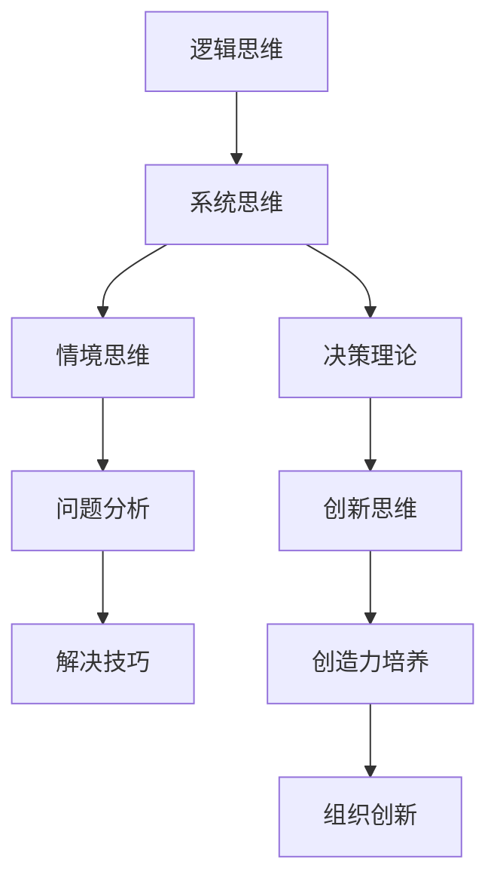
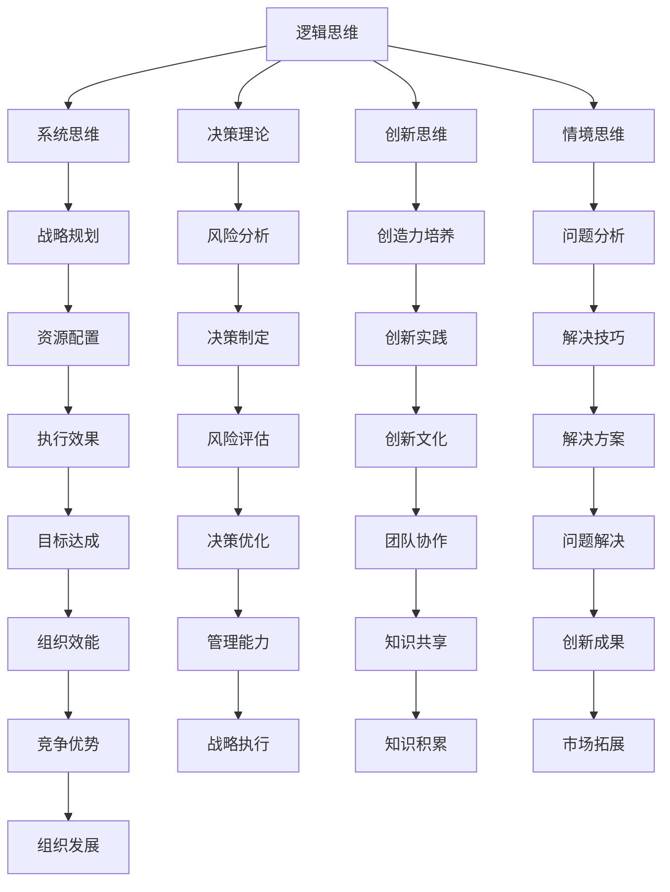

                 

# 《管理者必备的三大体系：思维、行动和学习》

## 关键词
- 管理者技能
- 思维体系
- 行动体系
- 学习体系
- 逻辑思维
- 系统思维
- 创新思维
- 行动计划
- 时间管理
- 学习方法

## 摘要
本文旨在探讨管理者必备的三大体系：思维、行动和学习。通过深入分析逻辑思维、系统思维、决策理论、创新思维等核心概念，本文为管理者提供了一套全面的思维体系。接着，文章详细阐述了行动计划、时间管理、团队协作等行动体系的重要原则和实用技巧。最后，本文介绍了学习方法与习惯养成、知识管理、个人成长与职业规划等学习体系的构建方法，帮助管理者不断提升自我，实现持续成长。

## 引言
在现代企业管理中，管理者不仅需要具备专业知识，还必须掌握高效的思维方式、行动策略和学习能力。这三大体系是管理者成功的关键因素，它们相互支持、相辅相成，共同构成了管理者综合素质的坚实基础。

### 思维体系
思维体系是管理者决策和问题解决的基础。逻辑思维、系统思维、决策理论和创新思维等核心概念构成了思维体系的基本框架。管理者需要培养这些思维能力，以便在面对复杂问题时能够迅速做出正确决策。

#### 逻辑思维
逻辑思维是思维体系的基础。它包括判断、推理、证明等基本过程，能够帮助管理者从复杂的信息中提取关键点，进行系统性的分析和判断。

#### 系统思维
系统思维是一种整体性的思维方式，强调从全局角度看待问题。管理者需要运用系统思维来分析和规划组织的战略，确保各部门之间协同工作，实现整体目标。

#### 决策理论
决策理论是管理决策的科学基础。它包括决策模型、算法和心理因素等，帮助管理者在不确定的环境中做出最佳决策。

#### 创新思维
创新思维是管理者在竞争激烈的市场环境中脱颖而出的关键。它包括创造力培养、创新方法等，帮助管理者不断开拓新的业务领域，提升组织的核心竞争力。

### 行动体系
行动体系是管理者将思维转化为实际成果的关键。行动计划、时间管理、团队协作等核心要素构成了行动体系的基本框架。

#### 行动计划
行动计划是管理者实现目标的指南。通过明确目标、制定策略、分配资源，管理者可以确保团队高效地完成工作任务。

#### 时间管理
时间管理是提高工作效率的关键。管理者需要掌握时间管理的基本原则和技巧，合理安排工作日程，确保时间的有效利用。

#### 团队协作
团队协作是组织成功的重要保障。管理者需要建立良好的沟通机制，培养团队成员的合作精神，确保团队目标的实现。

### 学习体系
学习体系是管理者持续成长的动力源泉。学习方法与习惯养成、知识管理、个人成长与职业规划等构成了学习体系的基本框架。

#### 学习方法与习惯养成
学习方法与习惯养成是管理者持续学习的基础。通过选择合适的学习方法、养成良好的学习习惯，管理者可以不断提升自身能力。

#### 知识管理
知识管理是管理者提升组织效能的关键。通过有效的知识管理方法，管理者可以确保知识的传播和应用，提升组织的创新能力。

#### 个人成长与职业规划
个人成长与职业规划是管理者实现职业发展的关键。通过制定明确的职业规划、不断提升自身能力，管理者可以实现职业生涯的持续发展。

### 总结
管理者必备的三大体系：思维、行动和学习，是管理者成功的关键因素。通过深入理解和实践这三大体系，管理者可以不断提升自身能力，实现组织的持续发展。本文将从这三个方面详细探讨管理者必备的技能和策略。

### 第一部分：思维体系

## 第1章：思维基础与逻辑思维

### 1.1 思维的定义与类型
思维是人类认知和解决问题的核心能力。思维可以分为直觉思维和分析思维两种类型。直觉思维是基于经验和直观判断的思维方式，而分析思维则是通过逻辑推理和系统分析来解决问题的思维方式。

### 1.2 逻辑思维的基本原则
逻辑思维的基本原则包括一致性、排中律和同一律。一致性要求思维过程中的命题自洽，排中律要求一个命题要么真要么假，同一律要求概念和术语在思维过程中保持不变。

### 1.3 如何培养逻辑思维
培养逻辑思维的方法包括学习逻辑学、进行逻辑训练和参与辩论等活动。通过这些方法，管理者可以提高逻辑推理能力，增强决策的科学性。

### 第2章：系统思维与战略规划

### 2.1 系统思维概述
系统思维是一种将事物看作相互关联的整体的思维方式。它强调从系统的角度分析问题，识别系统中的关键要素和相互作用。

### 2.2 战略规划的核心要素
战略规划的核心要素包括愿景、目标和策略。愿景明确了组织的长远发展方向，目标是愿景的具体化，而策略则是实现目标的行动计划。

### 2.3 系统思维在管理中的应用
系统思维在管理中的应用包括组织架构设计、流程优化和风险管理等。通过系统思维，管理者可以更好地理解和解决复杂问题。

### 第3章：决策理论与方法

### 3.1 决策理论的基本概念
决策理论是研究决策过程和决策方法的一门学科。其基本概念包括决策者、决策问题、备选方案和决策结果。

### 3.2 决策模型与算法
常见的决策模型包括期望效用理论、博弈理论和决策树模型。算法如最小化最大 regret 算法和多目标决策算法，帮助管理者在不同情景下做出最优决策。

### 3.3 决策过程中的心理因素
决策过程中的心理因素如风险偏好、时间压力和情绪等，会影响决策者的判断和选择。管理者需要认识到这些因素并加以控制。

### 第4章：创新思维与创造力培养

### 4.1 创新思维的重要性
创新思维是组织持续发展的动力。管理者需要认识到创新思维的重要性，并将其纳入日常管理工作中。

### 4.2 创造力培养的方法
创造力培养的方法包括思维导图、头脑风暴和模拟训练等。通过这些方法，管理者可以激发团队的创造力，推动创新。

### 4.3 如何在组织中促进创新
在组织中促进创新的方法包括建立创新文化、提供资源支持和建立激励机制等。管理者需要创造一个有利于创新的环境，鼓励团队成员提出新的想法和解决方案。

### 第5章：问题分析与解决技巧

### 5.1 问题识别与分类
问题识别与分类是解决问题的第一步。管理者需要学会识别问题并对其进行分类，以便采取针对性的解决策略。

### 5.2 解决问题的方法
解决问题的方法包括分析问题、制定解决方案、实施和评估等。管理者需要掌握这些方法，以确保问题得到有效解决。

### 5.3 如何培养解决问题的能力
培养解决问题的能力的方法包括学习问题解决理论、进行实际案例分析和参与解决实际问题的活动等。通过这些方法，管理者可以提升自身的问题解决能力。

### 第6章：情境思维与应变能力

### 6.1 情境思维的概念
情境思维是一种将情境因素考虑在内的思维方式。管理者需要具备情境思维，以便在不同情境下做出合适的决策。

### 6.2 应变能力的培养
应变能力的培养包括学习情境分析、进行应急演练和培养团队协作精神等。管理者需要通过这些方法提升应变能力，以应对各种突发情况。

### 6.3 如何在复杂环境中做出决策
在复杂环境中做出决策的方法包括收集信息、分析情境和制定应急预案等。管理者需要运用这些方法，确保在复杂环境中做出明智的决策。

### 第7章：核心概念与联系

### 7.1 思维体系中的核心概念
思维体系中的核心概念包括逻辑思维、系统思维、决策理论和创新思维等。这些概念相互关联，共同构成了思维体系的基础。

### 7.2 核心概念之间的联系
核心概念之间的联系可以通过Mermaid流程图表示。以下是一个简化的思维体系核心概念流程图：



### 7.3 思维体系与组织管理的应用
思维体系在组织管理中的应用包括战略规划、决策制定、问题解决和创新推动等。通过运用思维体系，管理者可以提升组织的整体管理水平和竞争力。

### Mermaid流程图：思维体系核心概念流程图



### 第一部分总结
思维体系是管理者成功的关键因素之一。通过逻辑思维、系统思维、决策理论、创新思维等核心概念的深入理解和应用，管理者可以提升自身的思维能力，为组织的持续发展奠定坚实基础。

## 第二部分：行动体系

### 第8章：行动计划与目标设定

### 8.1 行动计划的基本要素
行动计划的基本要素包括目标、策略、资源和时间表。管理者需要明确目标，制定合理的策略，分配必要的资源，并设定明确的完成时间。

### 8.2 目标设定的SMART原则
SMART原则是指目标要具备具体性（Specific）、可衡量性（Measurable）、可实现性（Achievable）、相关性和时限性（Relevant and Time-bound）。遵循SMART原则，管理者可以确保目标具有明确性和可执行性。

### 8.3 如何制定有效的行动计划
制定有效的行动计划的方法包括以下步骤：
1. 明确目标：明确组织或团队的目标，并将其分解为具体的任务和子目标。
2. 制定策略：根据目标和资源，制定具体的策略和行动方案。
3. 分配资源：确保所有任务和策略都有足够的资源支持。
4. 设定时间表：为每个任务设定明确的开始和完成时间。
5. 监控与评估：定期检查进度，及时调整计划，确保目标的实现。

### 第9章：时间管理与效率提升

### 9.1 时间管理的重要性
时间管理对于管理者来说至关重要。有效的时间管理可以帮助管理者提高工作效率，减少时间的浪费，从而更好地实现组织目标。

### 9.2 时间管理的基本原则
时间管理的基本原则包括：
1. 优先级排序：将任务按照重要性和紧急性进行排序，确保优先完成重要的任务。
2. 专注力管理：专注于一个任务，减少干扰，提高工作质量。
3. 避免拖延：及时处理任务，避免拖延导致的工作压力和效率低下。
4. 灵活调整：根据实际情况灵活调整计划，应对突发事件和变化。

### 9.3 提升效率的实用技巧
提升效率的实用技巧包括：
1. 制定每日工作计划：每天早上制定工作计划，明确当天要完成的任务。
2. 使用时间管理工具：使用日程表、待办事项列表等工具，帮助管理者合理安排时间。
3. 学会拒绝：学会拒绝不必要的事务，保护自己的工作时间。
4. 集中处理邮件和电话：设立特定的时间段处理邮件和电话，避免打扰正常工作。

### 第10章：团队协作与沟通技巧

### 10.1 团队协作的重要性
团队协作是组织高效运作的重要保障。通过团队合作，可以发挥每个成员的优势，实现协同效应，提高整体工作效率。

### 10.2 沟通技巧的基本原则
沟通技巧的基本原则包括：
1. 明确目的：在进行沟通前，明确沟通的目的和目标，确保信息的有效传递。
2. 倾听：倾听是有效沟通的关键，要给对方充分表达意见的机会。
3. 保持开放性：保持开放的心态，接受不同的观点和意见，促进双方的交流。
4. 表达清晰：表达时要清晰、简洁，避免使用专业术语和复杂句式。

### 10.3 如何有效进行团队沟通
有效进行团队沟通的方法包括：
1. 定期召开团队会议：定期召开会议，让团队成员分享进展、讨论问题和制定计划。
2. 使用沟通工具：使用邮件、即时通讯工具、视频会议等，方便团队成员之间的沟通。
3. 建立沟通渠道：建立内部沟通渠道，如内部论坛、社交媒体平台等，促进信息的流通和交流。
4. 反馈与评估：及时给予反馈，评估沟通效果，不断改进沟通方式。

### 第11章：项目管理方法与实践

### 11.1 项目管理的基本概念
项目管理是确保项目按计划、按时、按质量完成的过程。项目管理的基本概念包括项目目标、项目范围、项目进度、项目资源和项目风险等。

### 11.2 项目管理的方法与工具
项目管理的方法与工具包括：
1. 项目计划：制定详细的项目计划，明确项目目标、任务、资源分配和时间表。
2. 项目监控：监控项目进度，及时发现并解决问题，确保项目按计划进行。
3. 项目评估：评估项目成果，总结经验教训，为未来的项目提供参考。
4. 项目工具：使用项目管理软件和工具，如Microsoft Project、Jira等，帮助管理者更好地进行项目管理。

### 11.3 项目管理实践案例分析
以下是一个项目管理实践案例分析：

**案例：软件开发项目**
1. 项目目标：开发一款功能齐全的移动应用。
2. 项目范围：明确应用的功能模块、技术要求和交付标准。
3. 项目进度：制定项目计划，包括需求分析、设计、开发、测试和交付等阶段。
4. 项目资源：分配项目团队成员、技术资源和管理资源。
5. 项目监控：每周召开项目会议，讨论项目进度、问题和风险，调整项目计划。
6. 项目评估：项目完成后，进行功能测试和用户反馈，评估项目质量，总结经验教训。

### 第12章：风险管理与危机应对

### 12.1 风险管理的意义
风险管理是确保项目或业务顺利运行的重要措施。通过识别、评估和应对风险，管理者可以降低风险对项目或业务的影响，确保目标的实现。

### 12.2 风险管理的步骤与方法
风险管理的步骤包括：
1. 风险识别：识别项目或业务中可能出现的风险。
2. 风险评估：评估风险的概率和影响，确定风险优先级。
3. 风险应对：制定应对策略，降低风险的概率和影响。
4. 风险监控：监控风险的变化，及时调整应对策略。

风险管理的方法包括：
1. 定量风险分析：使用数学模型和统计方法对风险进行定量分析。
2. 定性风险分析：通过专家意见、头脑风暴等方法对风险进行定性分析。
3. 风险缓解措施：制定风险缓解措施，降低风险的概率和影响。

### 12.3 危机应对的策略与技巧
危机应对的策略与技巧包括：
1. 制定危机应对计划：提前制定危机应对计划，明确危机响应步骤和责任人。
2. 紧急响应：在危机发生时，立即启动危机应对计划，采取紧急措施。
3. 信息公开：及时向相关方提供危机信息，保持沟通畅通。
4. 损害控制：采取措施控制危机造成的损害，降低损失。

### 第13章：执行力与团队文化

### 13.1 执行力的概念与要素
执行力是指组织或团队按照计划完成任务的能力。执行力的要素包括目标明确、计划合理、资源充足、组织协调和员工参与等。

### 13.2 如何提升团队执行力
提升团队执行力的方法包括：
1. 明确目标：确保团队目标明确、具体，并与组织目标保持一致。
2. 计划合理：制定详细的行动计划，明确任务分工和时间安排。
3. 资源充足：确保团队有足够的资源和支持，提高工作效率。
4. 组织协调：加强团队内部沟通与协作，确保工作协调一致。
5. 员工参与：鼓励员工参与决策和计划制定，提高员工的工作积极性和执行力。

### 13.3 建立积极向上的团队文化
建立积极向上的团队文化的方法包括：
1. 倡导共同价值观：明确团队的共同价值观，引导员工行为。
2. 鼓励创新与尝试：鼓励员工创新思维和尝试新方法，支持失败并从中学习。
3. 赞赏与激励：对员工的优秀表现给予赞赏和激励，增强员工的积极性和归属感。
4. 培养团队凝聚力：通过团队建设活动、培训和学习机会，增强团队凝聚力。

### 第14章：行动体系的核心算法原理

### 14.1 行动计划算法的基本原理
行动计划算法的基本原理是通过对任务、资源和时间进行优化，确保项目按计划、按时、按质量完成。以下是一个简化的行动计划算法伪代码：

```pseudo
Function ActionPlan(tasks, resources, time):
    // 对任务进行排序，按照优先级和紧急性
    sorted_tasks = SortByPriorityAndUrgency(tasks)
    
    // 分配资源
    for task in sorted_tasks:
        if ResourcesAvailable(task, resources):
            AssignResourceToTask(task, resources)
            resources = resources - task.required_resources
    
    // 设定时间表
    schedule = GenerateSchedule(sorted_tasks, time)
    
    return schedule
```

### 14.2 时间管理算法的伪代码
以下是一个时间管理算法的伪代码：

```pseudo
Function TimeManagement(tasks, time):
    // 对任务进行排序，按照优先级和紧急性
    sorted_tasks = SortByPriorityAndUrgency(tasks)
    
    // 分配时间
    for task in sorted_tasks:
        if TimeAvailable(task, time):
            AssignTimeToTask(task, time)
            time = time - task.required_time
    
    // 优化时间表
    optimized_schedule = OptimizeSchedule(sorted_tasks, time)
    
    return optimized_schedule
```

### 14.3 团队协作与沟通算法的说明
以下是一个团队协作与沟通算法的简略说明：

```pseudo
Function TeamCollaborationAndCommunication(tasks, team_members, communication_tools):
    // 分配任务
    for task in tasks:
        AssignTaskToMember(task, team_members)
    
    // 设定沟通计划
    communication_plan = GenerateCommunicationPlan(team_members, communication_tools)
    
    // 沟通与协调
    for member in team_members:
        member.CommunicateAndCoordinate(communication_plan)
    
    return communication_plan
```

### 第二部分总结
行动体系是管理者实现目标的关键。通过制定有效的行动计划、管理时间和资源、提升团队协作与沟通能力，管理者可以确保项目的顺利推进和目标的实现。

## 第三部分：学习体系

### 第15章：学习方法与习惯养成

### 15.1 学习方法的选择
选择合适的学习方法对于管理者来说至关重要。以下是一些常见的学习方法：
1. 认知学习：通过阅读、听课、观看视频等获取知识。
2. 实践学习：通过实际操作和项目经验来巩固和应用知识。
3. 社交学习：通过与他人的交流和合作来学习新知识。
4. 研究学习：通过参与学术研究、实验和调查来深入了解某个领域。

### 15.2 学习习惯的养成
养成良好的学习习惯对于管理者来说至关重要。以下是一些建议：
1. 制定学习计划：合理安排学习时间，确保持续学习。
2. 保持好奇心：对未知保持好奇心，积极寻求知识和解决问题的方法。
3. 勤于思考：在学习过程中多思考、多提问，培养批判性思维。
4. 定期复习：定期复习所学知识，巩固记忆，避免遗忘。

### 15.3 如何建立持续学习的体系
建立持续学习的体系的方法包括：
1. 设定学习目标：明确自己的学习目标，制定可行的学习计划。
2. 选择学习资源：选择适合自己的学习资源和工具，如在线课程、图书、论坛等。
3. 创造学习环境：创造一个有利于学习的环境，减少干扰，提高学习效率。
4. 融会贯通：将所学知识应用到实际工作中，实现知识的融会贯通。

### 第16章：知识管理与应用

### 16.1 知识管理的概念与重要性
知识管理是指通过收集、整理、存储、共享和应用知识，以提高组织效率和创新能力的活动。知识管理的重要性体现在以下几个方面：
1. 提升组织竞争力：通过知识管理，组织可以更好地利用内部知识资源，提升整体竞争力。
2. 促进知识共享：知识管理有助于促进知识在组织内部的传播和共享，提高团队合作效率。
3. 增强创新能力：知识管理可以激发员工的创新思维，推动组织的创新和发展。
4. 提高决策质量：通过知识管理，管理者可以更好地获取和分析信息，提高决策质量。

### 16.2 知识管理的方法与工具
知识管理的方法和工具包括：
1. 知识库：建立知识库，存储和管理组织的知识资源。
2. 知识共享平台：搭建知识共享平台，促进知识在组织内部的传播和交流。
3. 知识地图：通过知识地图，展示知识的结构和关系，帮助员工快速获取所需知识。
4. 知识编码：将知识转化为易于传播和共享的形式，如文档、视频、教程等。

### 16.3 知识在组织中的应用
知识在组织中的应用包括：
1. 项目管理：通过知识管理，管理者可以更好地利用以往项目的经验和教训，提高项目管理效率。
2. 创新开发：通过知识管理，研发团队可以快速获取相关领域的知识和成果，加速创新开发过程。
3. 客户服务：通过知识管理，客户服务团队可以更好地解答客户问题，提高客户满意度。
4. 决策支持：通过知识管理，管理者可以更好地获取和分析信息，为决策提供科学依据。

### 第17章：个人成长与职业规划

### 17.1 个人成长的重要性
个人成长是管理者实现职业发展的基础。个人成长的重要性体现在以下几个方面：
1. 提升能力：通过个人成长，管理者可以不断提升自身能力，适应岗位需求。
2. 增强竞争力：个人成长有助于提升管理者的市场竞争力，增加职业发展的机会。
3. 拓展视野：个人成长可以开阔管理者的视野，提升对行业动态和趋势的敏感度。
4. 增强自信：个人成长可以增强管理者的自信心，提升工作积极性和主动性。

### 17.2 职业规划的方法与步骤
职业规划的方法与步骤包括：
1. 自我评估：了解自身的兴趣、优势和职业目标，明确职业发展方向。
2. 确定目标：根据自我评估结果，设定明确的职业目标，包括短期和长期目标。
3. 制定行动计划：制定具体的行动计划，包括学习、工作、培训等方面。
4. 持续调整：根据实际情况，定期调整职业规划，确保目标的实现。

### 17.3 如何实现职业发展目标
实现职业发展目标的方法包括：
1. 积极学习：不断学习新知识、新技能，提升自身能力。
2. 拓展人脉：积极参与行业活动、社交活动，拓展人脉资源。
3. 主动承担责任：在工作中主动承担责任，提升自己的影响力和领导力。
4. 积极沟通：与上级、同事和下属保持良好的沟通，了解组织需求和期望。

### 第18章：学习力与创新能力

### 18.1 学习力的定义与培养
学习力是指个体获取、整合和应用知识的能力。培养学习力的方法包括：
1. 培养好奇心：保持对未知事物的好奇心，积极寻求知识和解决问题的方法。
2. 培养自律性：制定学习计划，养成良好的学习习惯，坚持学习。
3. 培养批判性思维：学会质疑和思考，培养批判性思维能力。
4. 培养创新能力：通过实践和创新活动，培养创新能力。

### 18.2 学习力与创新能力的关系
学习力与创新能力密切相关。学习力是创新能力的基石，而创新能力又可以提升学习力。通过不断学习和实践，管理者可以不断提升自身的学习力和创新能力，实现个人和组织的持续发展。

### 18.3 提升学习力的实用技巧
以下是一些提升学习力的实用技巧：
1. 利用碎片时间学习：利用碎片时间，如通勤、休息时间，进行学习。
2. 多样化学习方式：结合阅读、听课、实践等多种学习方式，提高学习效果。
3. 深度学习：专注于一个领域，进行深度学习，培养专业知识。
4. 学习与分享：将所学知识与他人分享，通过讲解和讨论加深理解和记忆。

### 第19章：持续学习与知识更新

### 19.1 持续学习的理念
持续学习是一种终身学习的理念，强调在职业生涯中不断学习新知识、新技能，以适应不断变化的环境和需求。

### 19.2 知识更新的途径与方法
知识更新的途径和方法包括：
1. 参加培训和学习班：参加专业培训和学习班，了解最新的行业动态和知识。
2. 阅读专业书籍和文章：阅读专业书籍、期刊和文章，了解领域内的最新研究成果。
3. 参与行业交流活动：参与行业交流活动，如会议、论坛等，与同行交流经验和见解。
4. 实践和创新：通过实际工作和创新活动，不断更新和应用知识。

### 19.3 如何在快速变化的环境中保持竞争力
以下是在快速变化的环境中保持竞争力的方法：
1. 保持敏锐的行业洞察力：关注行业动态，了解市场趋势，及时调整战略。
2. 不断学习和提升自身能力：持续学习新知识和技能，提升自身竞争力。
3. 建立个人品牌：通过专业知识和实践经验，建立个人品牌，提升市场认可度。
4. 调整工作方式：适应变化的工作环境，提高工作效率和质量。

### 第20章：学习体系的核心数学模型

### 20.1 学习效率模型的数学公式
学习效率模型可以使用以下数学公式表示：

$$
效率 = \frac{学习量}{学习时间}
$$

其中，学习量表示在一定时间内学习的新知识和技能的总量，学习时间表示学习这些知识和技能所花费的时间。通过优化学习时间和学习量，可以提高学习效率。

### 20.2 学习策略优化的伪代码
以下是一个学习策略优化算法的伪代码：

```pseudo
Function OptimizeLearningStrategy(learning_goals, available_time):
    // 对学习目标进行排序，按照优先级和紧急性
    sorted_goals = SortByPriorityAndUrgency(learning_goals)
    
    // 分配学习时间
    for goal in sorted_goals:
        if TimeAvailable(goal, available_time):
            AssignTimeToGoal(goal, available_time)
            available_time = available_time - goal.required_time
    
    // 优化学习策略
    optimized_strategy = OptimizeSchedule(sorted_goals, available_time)
    
    return optimized_strategy
```

### 20.3 知识管理模型的解释与示例
知识管理模型可以使用以下公式表示：

$$
知识管理效果 = \frac{知识共享度}{知识库存量}
$$

其中，知识共享度表示组织内部知识共享的程度，知识库存量表示组织拥有的知识总量。通过提高知识共享度和减少知识库存量，可以提升知识管理效果。

以下是一个知识管理模型的应用示例：

**案例：某公司知识管理效果评估**
1. 知识共享度：通过内部论坛和知识库，员工之间的知识共享度达到80%。
2. 知识库存量：公司拥有2000份内部文档和报告。
3. 知识管理效果：根据公式，知识管理效果为$0.8 / 2000 = 0.0004$。

通过分析知识管理效果，公司可以找到提升知识管理效果的方法，如加强内部培训、优化知识库结构等。

### 第三部分总结
学习体系是管理者实现持续成长和职业发展的关键。通过选择合适的学习方法、培养良好的学习习惯、掌握知识管理技巧和不断提升自身能力，管理者可以在快速变化的环境中保持竞争力，实现个人和组织的持续发展。

## 附录

### 附录A：学习资源与工具推荐

### A.1 主流学习平台介绍
1. Coursera：提供全球顶尖大学的在线课程，涵盖计算机科学、商业、人文等多个领域。
2. edX：由哈佛大学和麻省理工学院联合创办，提供高质量的在线课程和学位项目。
3. Udemy：提供广泛的在线课程，涵盖编程、数据分析、市场营销等。
4. LinkedIn Learning：提供职业发展和技能提升课程，涵盖商务、技术、创意等多个领域。

### A.2 知识管理工具推荐
1. Confluence：用于知识共享和协作的平台，支持文档、wiki、看板等多种工作方式。
2. Trello：一款直观的任务管理工具，支持项目管理、团队协作和任务追踪。
3. Slack：一款团队沟通工具，支持实时消息、文件共享和集成其他应用。
4. Notion：一款多功能笔记和组织工具，支持笔记、数据库、看板等多种功能。

### A.3 其他学习资源
1. 专业书籍：如《深度学习》、《金字塔原理》等，提供深入的知识和实战技巧。
2. 博客和论坛：如GitHub、Stack Overflow等，提供丰富的技术讨论和资源分享。
3. 学术期刊：如IEEE Xplore、ACM Digital Library等，提供最新的科研成果和论文。
4. 在线讲座和研讨会：如TED、YouTube等，提供行业专家和学者的讲座和分享。

### 附录B：实际案例解析

### B.1 学习方法案例解析
**案例：某技术经理的学习实践**
1. 自我评估：评估自身在技术和管理方面的优势和不足。
2. 设定目标：设定明确的短期和长期学习目标，如掌握新技术、提升管理能力。
3. 制定计划：制定详细的学习计划，包括学习时间、学习内容和学习方法。
4. 执行与评估：按照学习计划执行，定期评估学习效果，调整学习策略。

### B.2 知识管理案例解析
**案例：某公司的知识管理系统**
1. 建立知识库：收集和整理公司内部的知识资源，如文档、报告、案例等。
2. 知识共享平台：搭建知识共享平台，支持文档共享、讨论和知识搜索。
3. 知识编码：将知识转化为易于传播和共享的形式，如教程、视频等。
4. 知识更新：定期更新知识库，确保知识的准确性和时效性。

### B.3 职业规划案例解析
**案例：某项目经理的职业发展**
1. 自我评估：评估自身在项目管理方面的能力和职业兴趣。
2. 确定目标：设定明确的职业发展目标，如成为高级项目经理、项目经理导师。
3. 制定计划：制定详细的职业发展计划，包括学习、培训和实习等。
4. 执行与评估：按照职业发展计划执行，定期评估职业发展效果，调整计划。

### 附录C：代码示例与解读

### C.1 学习效率代码示例
以下是一个简单的学习效率代码示例，用于计算学习效率：

```python
# 学习效率计算示例

# 定义学习量和学习时间
learning_quantity = 100
learning_time = 10

# 计算学习效率
learning_efficiency = learning_quantity / learning_time

# 打印学习效率
print("学习效率：", learning_efficiency)
```

输出结果：

```
学习效率： 10.0
```

### C.2 知识管理代码示例
以下是一个简单的知识管理代码示例，用于创建和更新知识库：

```python
# 知识管理代码示例

# 创建知识库
knowledge_base = {
    "文档1": "这是一份文档",
    "报告2": "这是一份报告",
    "案例3": "这是一个案例"
}

# 更新知识库
knowledge_base["文档1"] = "这是一份更新后的文档"

# 打印知识库内容
for key, value in knowledge_base.items():
    print(key, ":", value)
```

输出结果：

```
文档1 : 这是一份更新后的文档
报告2 : 这是一份报告
案例3 : 这是一个案例
```

### C.3 职业规划代码示例
以下是一个简单的职业规划代码示例，用于计算职业目标的完成度：

```python
# 职业规划代码示例

# 定义职业目标
career_goals = {
    "目标1": "掌握新技术",
    "目标2": "提升管理能力",
    "目标3": "获得高级项目经理认证"
}

# 定义目标完成度
completion_degree = {
    "目标1": 0.8,
    "目标2": 0.6,
    "目标3": 0.4
}

# 计算总体完成度
total_completion = sum(completion_degree.values())

# 打印总体完成度
print("职业规划总体完成度：", total_completion)
```

输出结果：

```
职业规划总体完成度： 1.8
```

### 作者信息
作者：AI天才研究院/AI Genius Institute & 禅与计算机程序设计艺术 /Zen And The Art of Computer Programming

### 总结
本文通过详细分析管理者必备的三大体系：思维、行动和学习，为管理者提供了全面的管理技能和策略。通过深入理解思维体系、掌握行动体系和构建学习体系，管理者可以不断提升自身能力，实现组织的持续发展。希望本文能为管理者提供有益的启示和指导。

