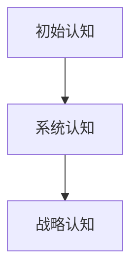
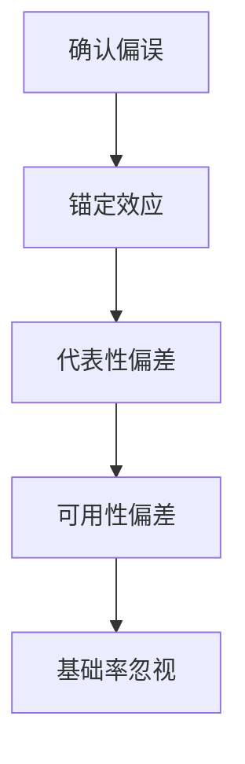
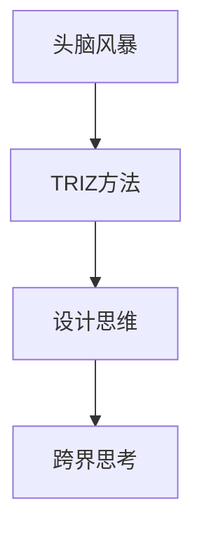
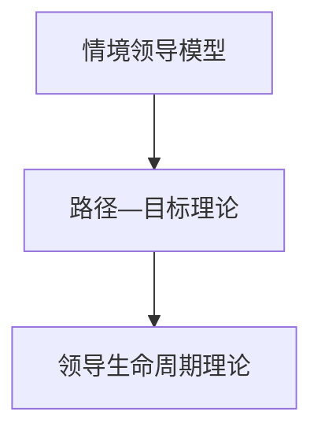
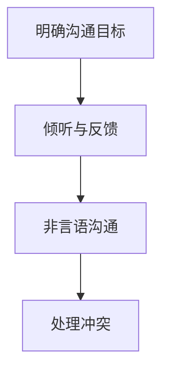
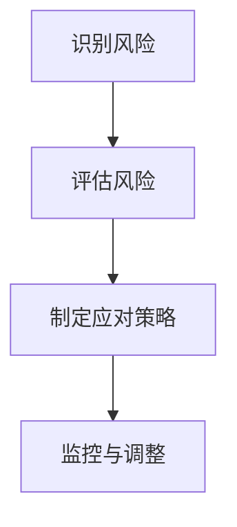
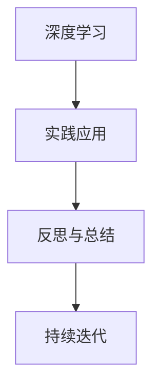
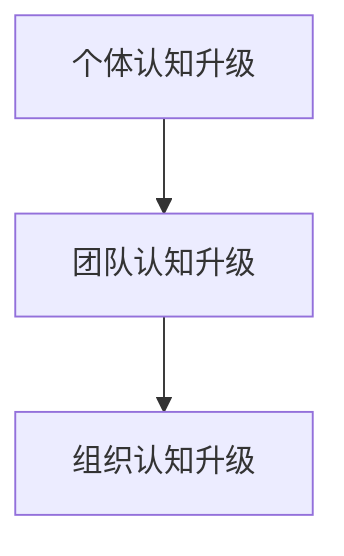

                 

# 《管理者的认知升级之路》

## 关键词

**管理思维，认知心理学，领导力，沟通技巧，决策，持续学习，组织效能**

## 摘要

本文旨在探讨管理者的认知升级之路，通过分析管理者的认知体系构建、技能提升以及组织效能等方面，帮助管理者实现认知的全面提升。文章首先介绍了管理者认知升级的重要性，随后深入探讨了管理者的思维模式、认知心理学、创新思维、领导力、沟通技巧、决策与风险管理、持续学习等内容。此外，文章还论述了组织文化与认知升级的关系，并提供了实际案例和认知升级工具与方法，为管理者提供全方位的认知提升路径。

## 第一部分：管理者的认知体系构建

### 第1章：管理者的思维模式

#### 1.1 管理者认知升级的重要性

在当今快速变化的世界，管理者所面临的挑战日益复杂，传统的管理思维模式已经无法满足日益变化的需求。因此，管理者必须进行认知升级，以适应新的管理环境和业务需求。认知升级不仅有助于提升管理者的决策能力，还能提高团队的整体绩效和组织的创新能力。

#### 1.2 传统管理思维与现代管理思维的比较

传统管理思维侧重于权威和层级，强调命令和控制。而现代管理思维则更加注重协作和赋能，强调灵活性和适应性。管理者需要认识到这两种管理思维的差异，并学会在不同场景下灵活运用。

#### 1.3 管理者认知的三个层次

1. **初始认知**：管理者对基本管理知识和技能的掌握。
2. **系统认知**：管理者对组织运作和业务流程的理解。
3. **战略认知**：管理者对行业趋势和市场变化的洞察。

**Mermaid流程图：管理者认知层次**



#### 1.4 管理者如何提升思维模式

1. **持续学习**：管理者需要不断学习新的知识和技能，以适应不断变化的环境。
2. **反思与总结**：管理者需要定期反思自己的管理实践，总结经验教训。
3. **跨界思考**：管理者需要具备跨学科的知识背景，以便更好地应对复杂问题。

### 第2章：认知心理学与管理

#### 2.1 认知心理学的核心概念

认知心理学研究人类思维、感知、记忆和问题解决等方面的心理过程。认知心理学的核心概念包括注意力、记忆、认知控制和问题解决等。

#### 2.2 认知偏差及其影响

认知偏差是指人们在信息处理过程中产生的系统性错误。常见的认知偏差包括确认偏误、锚定效应、代表性偏差、可用性偏差和基础率忽视等。

**Mermaid流程图：常见认知偏差**



#### 2.3 管理者如何利用认知心理学提升决策质量

1. **提高自我意识**：管理者需要认识到自己的认知偏差，并努力克服。
2. **多元化信息来源**：管理者需要收集来自多个渠道的信息，以减少认知偏差的影响。
3. **使用决策支持工具**：管理者可以借助决策支持工具，如预测模型和风险评估工具，以提高决策质量。

### 第3章：创新思维与管理者

#### 3.1 创新思维的重要性

创新思维是管理者成功的关键因素之一。在竞争激烈的市场环境中，创新能力可以帮助组织应对挑战，抓住市场机遇。

#### 3.2 创新思维的核心方法

1. **头脑风暴**：通过集体讨论，激发创意的产生。
2. **TRIZ方法**：一种系统性的创新方法，通过解决矛盾来推动创新。
3. **设计思维**：一种以人为本的创新方法，强调用户需求和体验。
4. **跨界思考**：通过跨学科的知识融合，激发新的创新思路。

**Mermaid流程图：创新思维方法**



#### 3.3 管理者如何培养创新思维

1. **鼓励试错**：管理者需要为团队成员提供试错的机会，鼓励他们勇于尝试。
2. **培养开放心态**：管理者需要具备开放的心态，接受不同的观点和建议。
3. **搭建创新平台**：管理者可以搭建创新平台，如创新实验室或内部创业项目，以激发员工的创新潜力。

## 第二部分：管理者的技能提升

### 第4章：领导力与影响力

#### 4.1 领导力的本质

领导力是指管理者通过激励、引导和影响团队成员，实现组织目标的能力。领导力不仅仅是职位赋予的权力，更是一种影响力。

#### 4.2 领导力模型及应用

1. **情境领导模型**：根据团队成员的不同成熟度，采取不同的领导风格。
2. **路径—目标理论**：关注如何帮助团队成员实现目标，并提供必要的支持和资源。
3. **领导生命周期理论**：根据下属的成熟度和工作环境，选择合适的领导风格。

**Mermaid流程图：领导力模型**



#### 4.3 管理者如何提升领导力和影响力

1. **建立信任**：管理者需要通过诚信和透明度建立信任。
2. **激发员工潜力**：管理者需要关注员工的发展需求，并提供成长机会。
3. **持续学习**：管理者需要不断学习新的管理知识和技能，以提高自身领导力。

### 第5章：沟通技巧与团队管理

#### 5.1 沟通的重要性

沟通是管理者实现目标的关键因素之一。有效的沟通可以减少误解和冲突，提高团队协作效率。

#### 5.2 沟通技巧的提升

1. **明确沟通目标**：在沟通前明确目标，确保信息传达的准确性。
2. **倾听与反馈**：积极倾听他人的意见，并提供有效的反馈。
3. **非言语沟通**：注重身体语言和表情的传递，以提高沟通效果。
4. **处理冲突**：学会有效地处理团队内部的冲突，维护团队和谐。

**Mermaid流程图：有效沟通流程**



#### 5.3 团队管理的艺术

团队管理是管理者的重要职责之一。管理者需要关注团队的整体表现，同时关注团队成员的个体需求。

- **伪代码：团队管理算法**

```python
def manage_team(team_members, goals):
    for member in team_members:
        set_clear_goals(member, goals)
    while not all_goals_met(goals):
        communicate_goals_to_team(team_members, goals)
        resolve_conflicts_among_team_members(team_members)
        adjust_management_strategy_if_needed(team_members, goals)
    return "Team goals achieved!"
```

#### 5.4 管理者如何打造高效团队

1. **明确团队目标**：确保团队成员对团队目标有清晰的认识。
2. **搭建有效的沟通渠道**：确保团队成员之间的信息流畅传递。
3. **提供必要的资源和支持**：确保团队成员能够顺利完成工作。
4. **激励与认可**：对团队成员的成就给予认可和激励。

### 第6章：决策与风险管理

#### 6.1 决策的类型与过程

决策分为战略决策和运营决策。决策过程包括问题识别、目标设定、方案评估、决策制定和执行监控等。

#### 6.2 决策制定的策略

1. **明确决策目标**：确保决策目标的明确和具体。
2. **收集相关信息**：确保决策过程中收集到的信息是准确和全面的。
3. **评估不同方案**：对不同的决策方案进行评估，选择最优方案。
4. **制定决策计划**：确保决策的执行过程有序进行。

**伪代码：决策制定算法**

```python
def make_decision(context, options, criteria):
    evaluate_options(options, criteria)
    select_best_option = max(options, key=lambda x: x['score'])
    implement_decision(select_best_option, context)
    monitor_results_and_learn(from_decision)
```

#### 6.3 风险管理的方法与工具

1. **识别风险**：通过风险评估工具，识别潜在的风险因素。
2. **评估风险**：对识别出的风险进行评估，确定其可能性和影响。
3. **制定应对策略**：根据风险的可能性和影响，制定相应的应对策略。
4. **监控与调整**：在风险发生时，及时监控并调整应对策略。

**Mermaid流程图：风险管理流程**



### 第7章：持续学习与自我发展

#### 7.1 管理者为何要持续学习

持续学习是管理者自我发展的基础，有助于提高管理者的专业素养和领导力。

#### 7.2 学习方法与工具

1. **深度学习**：通过深入学习和研究，掌握新的知识和技能。
2. **实践应用**：通过实际工作，将所学知识应用于实践。
3. **反思与总结**：通过反思和总结，不断提高自己的管理水平。
4. **持续迭代**：不断迭代自己的知识体系，以适应不断变化的环境。

**Mermaid流程图：学习策略**



#### 7.3 自我发展的路径与策略

1. **设定明确的目标**：明确自己的职业目标和学习目标。
2. **制定学习计划**：根据目标，制定详细的学习计划。
3. **寻找导师和榜样**：寻找有经验的导师和榜样，向他们学习。
4. **积极参与培训和学习活动**：积极参与各种培训和学习活动，提高自己的综合素质。

## 第三部分：认知升级与组织效能

### 第8章：组织文化与认知升级

#### 8.1 组织文化的定义与作用

组织文化是指组织内部共同的价值观、信念和行为准则。组织文化对员工的认知和行为产生深远影响，有助于提升组织的整体效能。

#### 8.2 认知升级对组织文化的影响

认知升级有助于构建积极向上的组织文化，促进员工之间的协作和创新，提高组织的竞争力。

#### 8.3 如何构建有利于认知升级的组织文化

1. **明确组织价值观**：组织需要明确自己的核心价值观，并将其融入到日常工作中。
2. **鼓励开放沟通**：组织应鼓励员工之间的开放沟通，建立良好的信息交流机制。
3. **提供培训和发展机会**：组织应提供丰富的培训和发展机会，帮助员工提升自身的认知能力。
4. **建立创新机制**：组织应建立创新机制，鼓励员工提出新的想法和解决方案。

### 第9章：认知升级与组织效能

#### 9.1 认知升级如何提升组织效能

认知升级有助于管理者更好地理解组织内外部环境，提高决策质量，增强团队协作能力，从而提升组织的整体效能。

#### 9.2 管理者如何推动组织认知升级

1. **树立榜样**：管理者应以身作则，不断提升自己的认知能力，为员工树立榜样。
2. **建立学习型组织**：管理者应推动组织建立学习型组织，鼓励员工不断学习和成长。
3. **提供资源和支持**：管理者应提供必要的资源和支持，帮助员工进行认知升级。
4. **建立反馈机制**：管理者应建立有效的反馈机制，及时发现和解决问题，促进认知升级。

**Mermaid流程图：组织认知升级路径**



#### 9.3 认知升级实践案例

通过分析成功企业的实践案例，管理者可以借鉴其认知升级的经验和做法，提升自身的认知能力和组织效能。

### 附录

#### 附录 A：认知升级工具与方法

- **A.1 学习资源推荐**：推荐相关书籍、论文和在线课程，帮助管理者进行认知升级。
- **A.2 认知升级工作坊设计**：提供认知升级工作坊的设计方案，帮助组织开展认知升级活动。
- **A.3 认知升级实践指南**：提供具体的认知升级实践指南，帮助管理者在实际工作中进行认知升级。

#### 附录 B：参考文献

- **B.1 相关书籍推荐**：推荐与管理认知、领导力、创新思维等相关书籍。
- **B.2 研究论文精选**：精选相关领域的研究论文，帮助管理者深入了解认知升级的理论和实践。
- **B.3 认知科学经典著作**：介绍认知科学领域的经典著作，帮助管理者了解认知科学的基本概念和原理。

## 作者

**作者：AI天才研究院/AI Genius Institute & 禅与计算机程序设计艺术 /Zen And The Art of Computer Programming**

