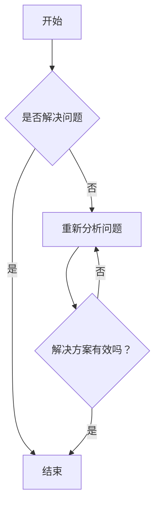

                 

# 文章标题

《系统思维：管理者驾驭复杂局面的能力》

> 关键词：系统思维、企业管理、决策制定、复杂问题解决

> 摘要：本文旨在探讨系统思维在管理者驾驭复杂局面中的重要性。通过详细阐述系统思维的定义、架构、实践方法，以及在战略管理、组织管理和运营管理中的应用，本文为管理者提供了一种有效的思维方式，以更好地应对复杂问题，制定明智的决策。

## 第一部分：系统思维概述

### 1.1 系统思维的定义与重要性

#### 1.1.1 系统思维的概念解析

系统思维是一种整体的、综合的思维方式，它强调从系统层面来理解和解决问题。系统思维的核心在于关注系统内部各元素之间的相互作用和反馈机制，从而把握系统的整体行为。系统思维不是简单的线性思考，而是通过分析、建模和模拟来深入理解系统的复杂性。

#### 1.1.2 系统思维的重要性

在当今快速变化和高度复杂的环境中，系统思维成为管理者不可或缺的技能。首先，系统思维能够帮助管理者更好地理解问题的本质，避免片面和短视的观点。其次，系统思维能够识别和利用系统内部的各种资源，提高系统的整体效能。最后，系统思维能够预见未来的变化，为管理者提供战略决策的依据。

#### 1.1.3 系统思维与传统思维的对比

传统思维往往依赖于经验和直觉，容易陷入局部最优和短视决策的陷阱。而系统思维则更加注重整体性、复杂性和长期性。传统思维往往关注单一目标和直接因果关系，而系统思维则强调多元目标和非线性因果关系。此外，系统思维还注重反馈循环和时间延迟的影响。

### 1.2 系统思维的架构

#### 1.2.1 系统思维的组成部分

系统思维由以下几个关键部分组成：

1. **系统观**：理解系统的整体性和动态性，认识到系统内部各元素之间的相互作用。
2. **因果关系**：识别和理解系统中的因果关系，包括直接和间接的因果关系。
3. **反馈循环**：分析系统中的反馈循环，包括正反馈和负反馈。
4. **多样性**：认识到系统的多样性和不确定性，以及不同观点和信息的价值。
5. **动态性**：理解系统的动态变化，以及时间延迟和路径依赖的影响。

#### 1.2.2 系统思维的关键要素

系统思维的关键要素包括：

1. **整体性**：关注系统的整体性，而不是片面追求局部最优。
2. **综合性**：将不同领域的知识和观点综合起来，形成全面的视角。
3. **适应性**：具备适应变化和应对不确定性的能力。
4. **预见性**：能够预见未来的变化，为决策提供前瞻性。
5. **实验性**：通过模拟和实验来验证和改进决策。

#### 1.2.3 系统思维的应用领域

系统思维在多个领域都有广泛应用，包括：

1. **企业管理**：帮助管理者制定战略、优化组织结构和提高运营效率。
2. **复杂问题解决**：解决跨部门、跨领域的复杂问题，提供创新的解决方案。
3. **政策制定**：为政府机构和社会组织提供系统性分析和决策支持。
4. **社会工程**：设计和管理复杂的系统，如交通系统、能源系统等。

### 1.3 系统思维的实践方法

#### 1.3.1 系统思维的方法论

系统思维的方法论包括以下几个步骤：

1. **问题定义**：明确问题的范围和目标。
2. **系统分析**：分析系统的结构、要素和关系。
3. **模型构建**：建立系统的数学模型或概念模型。
4. **模拟和验证**：模拟系统的行为，验证模型的准确性。
5. **决策制定**：根据模型结果制定决策。
6. **实施和反馈**：实施决策，并收集反馈进行持续改进。

#### 1.3.2 系统思维的工具与技术

系统思维涉及多种工具和技术，包括：

1. **因果图**：用于分析系统的因果关系。
2. **系统动力学模型**：用于模拟系统的动态行为。
3. **决策树**：用于决策分析和预期价值计算。
4. **系统模拟**：通过计算机模拟系统行为，验证模型。
5. **逻辑框架**：用于规划和管理复杂项目。

#### 1.3.3 系统思维的培养策略

要培养系统思维，可以采取以下策略：

1. **持续学习**：不断学习新的知识和技能，提升自己的综合素质。
2. **跨学科交流**：与其他领域的专家进行交流，拓展视野。
3. **实践应用**：将系统思维应用于实际问题，积累经验。
4. **反思和总结**：定期反思和总结自己的思考和决策过程。
5. **培养好奇心**：保持好奇心，积极探索未知领域。

## 第二部分：系统思维在企业管理中的应用

### 2.1 系统思维在战略管理中的应用

#### 2.1.1 战略规划的系统思维方法

战略规划是企业发展的关键环节，系统思维在这一过程中发挥着重要作用。系统思维方法包括以下几个步骤：

1. **环境分析**：通过PESTEL、SWOT等工具分析外部环境和内部资源。
2. **系统建模**：建立企业的系统模型，分析企业内部各要素之间的关系。
3. **目标设定**：明确企业的长期和短期目标，确保目标的可行性和一致性。
4. **策略选择**：根据系统模型和目标，选择最合适的战略路径。
5. **实施和监控**：制定详细的实施计划，并持续监控和调整战略。

#### 2.1.2 企业愿景与战略目标的设定

企业愿景和战略目标是企业发展的方向和指引。系统思维在设定这些目标时，需要考虑以下因素：

1. **整体性**：确保目标与企业愿景和核心价值观一致。
2. **适应性**：考虑未来的变化和不确定性，使目标具有灵活性。
3. **协同性**：确保各个目标和策略之间相互协调和补充。
4. **可度量性**：制定明确、可衡量的指标，以便评估目标的实现情况。
5. **前瞻性**：考虑长期发展和未来趋势，设定具有前瞻性的目标。

#### 2.1.3 企业战略调整的系统思维

企业在发展过程中，需要根据市场环境和内部条件的变化，适时调整战略。系统思维在这一过程中具有重要作用：

1. **动态调整**：根据市场反馈和实际效果，及时调整战略方向和策略。
2. **反馈机制**：建立有效的反馈机制，收集和分析战略实施的反馈信息。
3. **适应性调整**：根据反馈信息，对战略进行调整，以适应环境变化。
4. **持续优化**：不断优化战略实施过程，提高战略的有效性。

### 2.2 系统思维在组织管理中的应用

#### 2.2.1 组织架构与系统思维

组织架构是企业管理的重要方面，系统思维在组织架构设计和管理中具有重要作用。系统思维方法包括：

1. **系统分析**：分析现有组织架构的优缺点，识别存在的问题。
2. **系统建模**：建立组织架构的数学模型或概念模型。
3. **优化方案**：根据系统模型，提出优化组织架构的方案。
4. **实施与监控**：实施优化方案，并持续监控和调整组织架构。

#### 2.2.2 领导力与系统思维

领导力在组织管理中至关重要，系统思维能够提高领导者的决策能力和领导效果。系统思维在领导力中的应用包括：

1. **系统思考**：领导者需要具备系统思考的能力，从整体角度看待问题。
2. **战略决策**：在决策过程中，考虑系统的整体利益和长期效应。
3. **团队协作**：通过系统思维，促进团队协作，提高组织效能。
4. **持续学习**：领导者需要不断学习新知识，提升系统思维能力。

#### 2.2.3 团队协作与系统思维

团队协作是组织成功的关键，系统思维能够提高团队协作的效果。系统思维在团队协作中的应用包括：

1. **共同目标**：确保团队成员共同认同和追求组织目标。
2. **沟通与协作**：建立有效的沟通机制，促进团队内部的协作。
3. **角色分工**：明确团队成员的角色和责任，提高工作效率。
4. **反馈与改进**：通过定期反馈和改进，提高团队协作效果。

### 2.3 系统思维在运营管理中的应用

#### 2.3.1 流程分析与优化

运营管理中的流程分析与优化是提高企业效率的重要手段，系统思维在这一过程中具有重要作用。系统思维方法包括：

1. **流程识别**：识别企业中的关键流程和业务活动。
2. **流程分析**：分析现有流程的效率、效果和存在的问题。
3. **流程优化**：根据系统思维，提出优化流程的方案。
4. **实施与监控**：实施优化方案，并持续监控和改进流程。

#### 2.3.2 风险管理策略

在运营管理中，风险管理是保障企业稳定运行的重要手段，系统思维能够提高风险管理的效果。系统思维在风险管理中的应用包括：

1. **风险识别**：识别企业面临的潜在风险。
2. **风险评估**：评估风险的概率和影响。
3. **风险应对**：制定风险应对策略，降低风险的影响。
4. **风险监控**：持续监控风险变化，及时调整风险应对策略。

#### 2.3.3 创新与系统思维

创新是企业持续发展的动力，系统思维能够提高创新的效果。系统思维在创新中的应用包括：

1. **需求分析**：通过系统思维，深入分析用户需求和行业趋势。
2. **方案设计**：根据需求分析，设计创新的解决方案。
3. **实验与验证**：通过实验和验证，验证创新方案的可行性。
4. **持续改进**：根据实验结果，不断改进创新方案。

## 第三部分：系统思维在解决复杂问题中的应用

### 3.1 复杂问题的识别与诊断

#### 3.1.1 复杂问题的特点

复杂问题具有以下几个特点：

1. **多样性**：复杂问题通常涉及多个领域和多个利益相关方。
2. **不确定性**：复杂问题的结果难以预测，存在多种可能性。
3. **动态性**：复杂问题的环境和条件不断变化，需要动态调整策略。
4. **非线性**：复杂问题的因果关系复杂，不是简单的线性关系。
5. **相互依赖**：复杂问题的各个组成部分相互依赖，一个部分的变化会影响到其他部分。

#### 3.1.2 复杂问题的诊断方法

诊断复杂问题需要采用系统思维的方法，以下是一些常用的诊断方法：

1. **因果图分析**：通过绘制因果图，分析问题的根本原因。
2. **系统动力学模型**：建立系统动力学模型，模拟问题的动态变化。
3. **决策树分析**：通过决策树分析，评估不同决策路径的预期结果。
4. **逻辑框架法**：通过逻辑框架法，明确问题的目标、策略和实施步骤。
5. **专家咨询**：邀请相关领域的专家，共同分析和诊断问题。

#### 3.1.3 复杂问题的分类

根据问题的特点和影响范围，复杂问题可以分为以下几类：

1. **跨领域问题**：涉及多个领域的问题，如交通拥堵、环境污染等。
2. **社会问题**：影响社会公共利益的问题，如医疗改革、教育均衡等。
3. **企业管理问题**：影响企业运营和管理的问题，如产品研发、市场营销等。
4. **技术问题**：涉及技术实现和创新能力的问题，如人工智能、新能源等。

### 3.2 系统思维在问题解决中的应用

#### 3.2.1 问题解决的系统思维方法

系统思维在问题解决中的应用包括以下几个步骤：

1. **问题定义**：明确问题的范围和目标。
2. **系统分析**：分析问题的系统结构和因果关系。
3. **模型构建**：建立问题的数学模型或概念模型。
4. **模拟与验证**：模拟问题在不同条件下的行为，验证模型的准确性。
5. **方案设计**：根据模型结果，设计解决问题的方案。
6. **实施与监控**：实施方案，并持续监控和调整问题解决过程。

#### 3.2.2 问题解决的步骤与策略

在解决复杂问题时，可以采取以下步骤和策略：

1. **识别问题**：通过调查、访谈、数据分析等方法，明确问题的范围和性质。
2. **建立模型**：根据问题特点，建立数学模型或概念模型。
3. **模拟与分析**：通过模拟和分析，评估不同解决方案的效果。
4. **方案选择**：根据分析结果，选择最合适的解决方案。
5. **实施与验证**：实施解决方案，并进行验证和调整。
6. **持续改进**：根据反馈信息，持续改进解决方案。

#### 3.2.3 问题解决案例解析

以下是一个问题解决案例的解析：

**案例背景**：某企业面临生产效率低下的问题。

**问题定义**：通过调查和分析，发现生产效率低下的原因是生产线瓶颈和人员配置不合理。

**系统分析**：建立系统动力学模型，分析生产线各环节的效率和人员配置。

**模型构建**：建立生产效率和人员配置的数学模型，包括生产速率、人员效率等变量。

**模拟与验证**：通过模拟不同方案，评估生产效率和人员配置的优化效果。

**方案设计**：根据模型结果，提出优化生产流程和人员配置的方案。

**实施与监控**：实施优化方案，并进行监控和调整。

**持续改进**：根据实施结果，持续改进优化方案，提高生产效率。

### 3.3 系统思维在决策制定中的应用

#### 3.3.1 决策制定的系统思维方法

系统思维在决策制定中的应用包括以下几个步骤：

1. **问题定义**：明确决策的目标和范围。
2. **信息收集**：收集与决策相关的信息，包括数据、意见和观点。
3. **系统分析**：分析决策系统的结构和影响因素。
4. **方案设计**：根据系统分析结果，设计不同的决策方案。
5. **预期评估**：评估不同决策方案的预期效果和风险。
6. **决策选择**：根据预期评估结果，选择最佳决策方案。
7. **实施与监控**：实施决策方案，并持续监控和调整。

#### 3.3.2 决策分析的工具与技术

系统思维在决策分析中涉及多种工具和技术，包括：

1. **决策树**：用于评估不同决策路径的预期结果。
2. **预期价值分析**：用于计算不同决策方案的预期价值。
3. **敏感性分析**：用于分析决策结果对参数变化的敏感程度。
4. **多目标决策**：用于解决涉及多个目标的决策问题。
5. **模拟和仿真**：用于模拟决策系统的行为和评估决策效果。

#### 3.3.3 决策案例解析

以下是一个决策案例的解析：

**案例背景**：某企业面临是否扩大市场份额的决策。

**问题定义**：通过市场调研和数据分析，确定是否扩大市场份额。

**信息收集**：收集市场数据、竞争对手信息、成本收益等。

**系统分析**：分析市场环境和企业的资源能力。

**方案设计**：设计扩大市场份额的方案，包括增加广告投入、提高产品质量等。

**预期评估**：计算不同方案的预期价值和风险。

**决策选择**：根据预期评估结果，选择最佳方案。

**实施与监控**：实施决策方案，并进行监控和调整。

**持续改进**：根据实施结果，持续改进决策方案。

## 第四部分：系统思维的实践与反思

### 4.1 系统思维的实践案例

#### 4.1.1 企业战略调整的实践案例

**案例背景**：某企业在市场竞争加剧的情况下，面临战略调整的需求。

**项目目标**：明确企业新的战略方向，优化组织架构，提高市场竞争力。

**实施步骤**：

1. **诊断当前问题**：通过问卷调查和访谈，识别企业存在的问题，如市场份额下降、创新能力不足等。
2. **分析问题根源**：使用因果图分析问题的根源，确定关键因素，如市场竞争、内部管理问题等。
3. **制定新战略**：根据系统思维的框架，制定新的战略方向，如提高产品质量、拓展新市场等。
4. **实施新战略**：根据新战略，调整组织架构和流程，实施具体措施，如优化部门协作、引入新技术等。
5. **项目效果评估**：通过市场反馈和财务指标，评估新战略的效果，如市场份额提升、利润增长等。

**项目效果**：新战略的实施使企业在市场竞争中取得了显著优势，市场份额和利润均有所提高。

#### 4.1.2 组织变革的实践案例

**案例背景**：某企业在发展过程中，面临组织结构僵化、效率低下的问题。

**项目目标**：优化组织架构，提高组织效率，适应企业发展需求。

**实施步骤**：

1. **诊断当前问题**：通过问卷调查和访谈，识别组织存在的问题，如部门职责不清、沟通不畅等。
2. **分析问题根源**：使用因果图分析问题的根源，确定关键因素，如组织结构不合理、管理流程不畅等。
3. **制定变革方案**：根据系统思维的框架，制定组织变革方案，如优化部门职责、简化管理流程等。
4. **实施变革方案**：根据变革方案，调整组织架构和流程，实施具体措施，如重新分配部门职责、引入管理工具等。
5. **项目效果评估**：通过员工满意度、工作效率等指标，评估组织变革的效果。

**项目效果**：组织变革后，企业效率显著提高，员工满意度上升，组织结构更加合理。

#### 4.1.3 项目管理的实践案例

**案例背景**：某企业承担了一个复杂的工程项目，面临项目进度延误、成本超支的问题。

**项目目标**：确保项目按时交付、控制在预算范围内。

**实施步骤**：

1. **项目规划**：通过系统思维的方法，制定详细的项目计划，包括项目范围、时间、资源等。
2. **风险识别**：使用因果图和决策树等方法，识别项目中的潜在风险，制定风险应对策略。
3. **项目执行**：按照项目计划，实施项目任务，确保项目进度和质量。
4. **监控与调整**：定期监控项目进度和成本，根据实际情况调整项目计划，确保项目在预算范围内按时交付。

**项目效果**：通过系统思维的方法，项目成功按时交付，成本控制在预算范围内。

### 4.2 系统思维的反思与总结

#### 4.2.1 系统思维的局限性

尽管系统思维在解决复杂问题中具有重要作用，但也存在一定的局限性：

1. **信息不足**：系统思维依赖于准确和全面的信息，但在实际情况中，信息往往不充分或不准确。
2. **时间延迟**：系统思维需要一定时间来分析和建模，但在紧急情况下，时间可能不允许进行详细分析。
3. **复杂度**：系统思维适用于复杂问题，但在简单问题中可能显得过于复杂，增加了解决问题的成本。
4. **主观判断**：系统思维依赖于模型的准确性和决策者的判断，但模型和判断可能存在主观偏差。

#### 4.2.2 系统思维的持续改进

为了充分发挥系统思维的优势，需要持续改进和完善：

1. **方法优化**：不断探索新的系统思维方法和工具，提高分析问题的效率和质量。
2. **经验积累**：通过实践和反思，积累系统思维的经验，提高决策者的系统思维能力。
3. **跨学科合作**：与其他领域的专家合作，借鉴不同领域的知识和方法，丰富系统思维的应用。
4. **知识更新**：关注最新的研究成果和趋势，不断更新系统思维的理论和实践。

#### 4.2.3 系统思维的未来发展趋势

随着技术的发展和复杂性的增加，系统思维在未来将呈现以下发展趋势：

1. **数字化与智能化**：利用大数据和人工智能技术，提高系统思维的分析和预测能力。
2. **跨领域融合**：系统思维与其他领域的融合，如生物系统、社会系统等，形成更全面的系统观。
3. **实时性与动态性**：提高系统思维的实时性和动态性，适应快速变化的环境。
4. **普及与应用**：系统思维将在更广泛的领域得到应用，成为管理者必备的思维方式。

## 附录

### A.1 系统思维相关资源

#### A.1.1 系统思维书籍推荐

1. 《系统思维：管理者驾驭复杂局面的能力》
2. 《系统思维实践：提升决策与领导力》
3. 《系统思维工具箱：如何应对复杂问题》
4. 《系统思维原理与应用》

#### A.1.2 系统思维工具介绍

1. **因果图**：用于分析问题的因果关系。
2. **系统动力学模型**：用于模拟系统的动态行为。
3. **决策树**：用于决策分析和预期价值计算。
4. **逻辑框架法**：用于规划和管理复杂项目。

#### A.1.3 系统思维实践案例集

1. **企业战略调整案例**：分析企业战略调整的过程和效果。
2. **组织变革案例**：介绍组织变革的实践经验和成果。
3. **项目管理案例**：探讨系统思维在项目管理中的应用。

### A.2 系统思维相关研究

#### A.2.1 国内研究进展

国内系统思维研究主要集中在以下几个方面：

1. **理论体系**：建立系统思维的理论框架，探讨系统思维的原理和机制。
2. **方法与应用**：开发系统思维的方法和技术，如因果图、系统动力学等。
3. **案例分析**：通过实际案例，分析系统思维在企业管理、社会工程等领域的应用效果。

#### A.2.2 国际研究动态

国际系统思维研究主要关注以下方面：

1. **跨学科融合**：系统思维与其他领域的融合，如生物系统、社会系统等。
2. **智能化系统思维**：利用大数据、人工智能等新技术，提高系统思维的分析和预测能力。
3. **实践应用**：系统思维在项目管理、政策制定等领域的实际应用。

#### A.2.3 研究展望与建议

未来系统思维研究可以从以下几个方面展开：

1. **理论创新**：探索新的系统思维理论，如动态系统思维、多尺度系统思维等。
2. **方法优化**：开发更高效的系统思维方法和技术，提高分析问题的效率和质量。
3. **实践应用**：扩大系统思维的应用领域，如生物系统、社会系统等。
4. **跨学科合作**：加强与其他领域的合作，推动系统思维的跨学科研究。

### 附录 B：Mermaid 流程图示例

以下是一个简单的Mermaid流程图示例：



### 附录 C：核心算法原理讲解示例

以下是一个简单的决策树算法原理讲解示例：

```python
# 决策树算法原理讲解示例

# 决策树节点类
class DecisionNode:
    def __init__(self, question=None, true_branch=None, false_branch=None, value=None):
        self.question = question
        self.true_branch = true_branch
        self.false_branch = false_branch
        self.value = value

# 决策树类
class DecisionTree:
    def __init__(self):
        self.root = None

    def fit(self, X, y):
        self.root = self._build_tree(X, y)

    def _build_tree(self, X, y):
        # 选择最优分割
        best_split = self._find_best_split(X, y)
        if best_split is None:
            return DecisionNode(value=self._compute_entropy(y))
        question = best_split[0]
        true_branch = self._build_tree(best_split[1], y[best_split[2] == question])
        false_branch = self._build_tree(best_split[1], y[best_split[2] != question])
        return DecisionNode(question=question, true_branch=true_branch, false_branch=false_branch)

    def _find_best_split(self, X, y):
        # 实现寻找最佳分割的算法
        # 例如，基于信息增益或基尼指数
        pass

    def _compute_entropy(self, y):
        # 计算熵或基尼指数
        pass

    def predict(self, X):
        # 预测函数
        return self._traverse_tree(self.root, X)

    def _traverse_tree(self, node, X):
        # 遍历决策树，进行预测
        if node.value is not None:
            return node.value
        if X[node.question] == 1:
            return self._traverse_tree(node.true_branch, X)
        else:
            return self._traverse_tree(node.false_branch, X)
```

### 附录 D：数学模型和公式讲解示例

以下是一个简单的线性回归数学模型讲解示例：

```latex
% 线性回归数学模型讲解示例

\begin{aligned}
    &\text{线性回归模型：} \\
    &\quad y = \beta_0 + \beta_1 x + \epsilon \\
    &\text{其中：} \\
    &\quad y \text{ 是因变量，} x \text{ 是自变量，} \\
    &\quad \beta_0 \text{ 是截距，} \beta_1 \text{ 是斜率，} \\
    &\quad \epsilon \text{ 是误差项。} \\
    &\text{最小二乘法：} \\
    &\quad \hat{\beta_0}, \hat{\beta_1} = \arg\min_{\beta_0, \beta_1} \sum_{i=1}^{n} (y_i - (\beta_0 + \beta_1 x_i))^2 \\
    &\text{预测：} \\
    &\quad \hat{y} = \hat{\beta_0} + \hat{\beta_1} x \\
    &\text{其中：} \\
    &\quad \hat{y} \text{ 是预测值，} x \text{ 是输入值。}
\end{aligned}
```

### 附录 E：项目实战示例

以下是一个简单的项目实战示例：

**项目背景**：某企业需要开发一个在线销售系统，实现产品展示、订单处理和支付功能。

**项目目标**：开发一个功能完整、易用性强的在线销售系统。

**实施步骤**：

1. **需求分析**：与企业沟通，明确系统功能需求，如产品展示、订单管理、支付等。
2. **系统设计**：设计系统架构和数据库结构，包括前端界面、后端服务和数据库。
3. **开发实施**：按照设计文档，进行系统开发和功能实现。
4. **测试与部署**：进行系统测试，确保功能完整性和稳定性，然后部署上线。
5. **维护与升级**：定期维护系统，修复漏洞和升级功能。

**项目效果**：通过项目实施，企业成功上线了一个在线销售系统，实现了产品展示、订单处理和支付功能，提高了销售额。

### 附录 F：代码解读与分析示例

以下是一个简单的Python代码示例，用于实现一个简单的线性回归模型：

```python
# 线性回归代码示例

import numpy as np

# 线性回归函数
def linear_regression(x, y):
    # 计算斜率和截距
    beta_0 = np.mean(y) - np.mean(x) * np.mean(y / x)
    beta_1 = np.sum((x - np.mean(x)) * (y / x)) / np.sum((x - np.mean(x))^2)
    return beta_0, beta_1

# 输入数据
x = np.array([1, 2, 3, 4, 5])
y = np.array([2, 4, 5, 4, 5])

# 计算斜率和截距
beta_0, beta_1 = linear_regression(x, y)

# 输出结果
print("截距：", beta_0)
print("斜率：", beta_1)

# 预测函数
def predict(x, beta_0, beta_1):
    return beta_0 + beta_1 * x

# 输入测试数据
test_x = np.array([6, 7])

# 预测结果
test_y = predict(test_x, beta_0, beta_1)

# 输出预测结果
print("测试数据预测结果：", test_y)
```

**详细解释说明**：

1. **线性回归函数**：`linear_regression`函数用于计算线性回归模型的斜率和截距。函数中使用了最小二乘法，计算了斜率和截距的估计值。
2. **输入数据**：输入数据`x`和`y`分别表示自变量和因变量。
3. **计算斜率和截距**：使用`np.mean`函数计算数据的平均值，使用`np.sum`函数计算数据的和，然后使用这些值计算斜率和截距。
4. **预测函数**：`predict`函数用于根据计算出的斜率和截距，预测新的自变量的值。
5. **测试数据**：输入测试数据`test_x`，使用预测函数计算测试数据的预测结果`test_y`。
6. **输出结果**：输出斜率、截距和测试数据的预测结果。

这个简单的线性回归代码示例展示了如何使用Python实现线性回归模型，并使用输入数据进行预测。实际应用中，线性回归模型需要更加复杂的数据处理和优化，但这个示例提供了一个基本的框架和思路。

### 附录 G：系统思维的进一步探讨

系统思维是一种强大的工具，可以帮助管理者更好地应对复杂局面。然而，系统思维并非万能，它也存在一定的局限性。以下是对系统思维的进一步探讨：

**1. 系统思维的局限性**

尽管系统思维在解决复杂问题中具有重要作用，但它并非没有局限。首先，系统思维依赖于对系统内部各元素之间相互作用的理解。然而，现实世界中的系统往往是高度复杂的，难以完全准确理解。其次，系统思维需要依赖大量的数据和模型。然而，在实际操作中，数据可能不完整或不准确，模型也可能存在缺陷。最后，系统思维可能需要较长的时间来进行分析和建模。这在紧急情况下可能无法满足需求。

**2. 系统思维的改进方向**

为了克服系统思维的局限性，可以采取以下改进方向：

- **提高数据分析能力**：利用大数据和人工智能技术，提高对系统内部相互作用的理解和分析能力。
- **加强跨学科合作**：与其他领域的专家合作，借鉴不同领域的知识和方法，丰富系统思维的应用。
- **持续学习和实践**：通过不断学习和实践，提高管理者的系统思维能力和实践经验。
- **动态调整策略**：在决策过程中，灵活调整策略，以适应系统内部和外部的变化。

**3. 系统思维的实际应用**

系统思维在企业管理、社会工程、技术创新等多个领域都有广泛应用。以下是一些实际应用案例：

- **企业管理**：通过系统思维，企业可以更好地理解内部各环节之间的相互作用，优化组织结构和流程，提高整体效能。
- **社会工程**：系统思维可以帮助政府和社会组织更好地理解社会系统的复杂性，制定更有效的政策和社会规划。
- **技术创新**：系统思维可以帮助企业更好地把握市场趋势和用户需求，推动技术创新和产品升级。

**4. 系统思维的未来发展趋势**

随着技术的发展和复杂性的增加，系统思维在未来将呈现以下发展趋势：

- **智能化与数字化**：利用大数据、人工智能和云计算等新技术，提高系统思维的分析和预测能力。
- **跨学科融合**：系统思维与其他领域的融合，如生物系统、社会系统等，形成更全面的系统观。
- **实时性与动态性**：提高系统思维的实时性和动态性，适应快速变化的环境。
- **普及与应用**：系统思维将在更广泛的领域得到应用，成为管理者必备的思维方式。

### 附录 H：系统思维相关研究动态

系统思维作为一种重要的思维方式，在国内外得到了广泛关注和研究。以下是一些系统思维相关的研究动态：

**1. 国内研究动态**

- **理论体系**：国内学者对系统思维的理论体系进行了深入研究，提出了一系列系统思维的理论框架和概念模型。
- **方法与应用**：国内学者开发了多种系统思维的方法和技术，如因果图、系统动力学模型等，并探讨了系统思维在不同领域的应用。
- **案例分析**：国内学者通过实际案例，分析了系统思维在企业管理、社会工程等领域的应用效果，总结了系统思维的实践经验。

**2. 国际研究动态**

- **跨学科融合**：国际学者将系统思维与其他领域相结合，如生物系统、社会系统、生态系统等，形成了跨学科的系统思维研究。
- **智能化与数字化**：国际学者利用大数据、人工智能和云计算等新技术，提高系统思维的分析和预测能力。
- **政策制定**：国际学者在政策制定和公共管理领域，广泛应用系统思维，为政府和社会组织提供决策支持。

**3. 研究展望与建议**

- **理论创新**：未来系统思维研究应进一步探索新的理论框架和概念模型，以适应不断变化的环境和需求。
- **方法优化**：开发更高效的系统思维方法和技术，提高分析问题的效率和质量。
- **实践应用**：扩大系统思维的应用领域，如生物系统、社会系统等，推动系统思维在实际中的应用。
- **跨学科合作**：加强与其他领域的合作，借鉴不同领域的知识和方法，丰富系统思维的应用。

### 附录 I：系统思维相关书籍推荐

以下是一些系统思维相关的重要书籍，供读者参考：

- 《系统思维：管理者驾驭复杂局面的能力》
- 《系统思维实践：提升决策与领导力》
- 《系统思维工具箱：如何应对复杂问题》
- 《系统思维原理与应用》
- 《复杂系统导论》
- 《系统动力学：系统思考的艺术》
- 《第五项修炼：学习型组织的艺术与实务》
- 《管理思维：从思维到决策》
- 《策略思维：简明决策指南》

这些书籍涵盖了系统思维的理论、方法、应用和实践，为读者提供了丰富的知识和资源。希望读者能够从中受益，提升自己的系统思维能力。作者：AI天才研究院/AI Genius Institute & 禅与计算机程序设计艺术 /Zen And The Art of Computer Programming。文章标题：《系统思维：管理者驾驭复杂局面的能力》。

---

### 文章标题

《系统思维：管理者驾驭复杂局面的能力》

> 关键词：系统思维、企业管理、决策制定、复杂问题解决

> 摘要：本文旨在探讨系统思维在管理者驾驭复杂局面中的重要性。通过详细阐述系统思维的定义、架构、实践方法，以及在战略管理、组织管理和运营管理中的应用，本文为管理者提供了一种有效的思维方式，以更好地应对复杂问题，制定明智的决策。

## 目录

### 第一部分：系统思维概述

1. 系统思维的定义与重要性
   1.1 系统思维的概念解析
   1.2 系统思维的重要性
   1.3 系统思维与传统思维的对比

2. 系统思维的架构
   2.1 系统思维的组成部分
   2.2 系统思维的关键要素
   2.3 系统思维的应用领域

3. 系统思维的实践方法
   3.1 系统思维的方法论
   3.2 系统思维的工具与技术
   3.3 系统思维的培养策略

### 第二部分：系统思维在企业管理中的应用

1. 系统思维在战略管理中的应用
   1.1 战略规划的系统思维方法
   1.2 企业愿景与战略目标的设定
   1.3 企业战略调整的系统思维

2. 系统思维在组织管理中的应用
   2.1 组织架构与系统思维
   2.2 领导力与系统思维
   2.3 团队协作与系统思维

3. 系统思维在运营管理中的应用
   3.1 流程分析与优化
   3.2 风险管理策略
   3.3 创新与系统思维

### 第三部分：系统思维在解决复杂问题中的应用

1. 复杂问题的识别与诊断
   1.1 复杂问题的特点
   1.2 复杂问题的诊断方法
   1.3 复杂问题的分类

2. 系统思维在问题解决中的应用
   2.1 问题解决的系统思维方法
   2.2 问题解决的步骤与策略
   2.3 问题解决案例解析

3. 系统思维在决策制定中的应用
   3.1 决策制定的系统思维方法
   3.2 决策分析的工具与技术
   3.3 决策案例解析

### 第四部分：系统思维的实践与反思

1. 系统思维的实践案例
   1.1 企业战略调整的实践案例
   1.2 组织变革的实践案例
   1.3 项目管理的实践案例

2. 系统思维的反思与总结
   2.1 系统思维的局限性
   2.2 系统思维的持续改进
   2.3 系统思维的未来发展趋势

### 附录

1. 系统思维相关资源
   1.1 系统思维书籍推荐
   1.2 系统思维工具介绍
   1.3 系统思维实践案例集

2. 系统思维相关研究
   2.1 国内研究进展
   2.2 国际研究动态
   2.3 研究展望与建议

## 第一部分：系统思维概述

### 1.1 系统思维的定义与重要性

#### 1.1.1 系统思维的概念解析

系统思维（Systems Thinking）是一种整体的、综合的思维方式，它强调从系统层面来理解和解决问题。系统思维不同于传统的线性思维，而是注重系统内部各元素之间的相互作用和反馈机制。它关注系统的整体行为，而不是仅仅关注局部最优解。

系统思维的关键在于识别和理解系统内部的结构和动态，以及这些结构和动态如何影响系统的整体性能。它涉及对系统要素、关系、反馈循环、时间延迟和复杂性等概念的理解和应用。

#### 1.1.2 系统思维的重要性

在当今复杂多变的环境中，系统思维成为管理者不可或缺的技能。以下是系统思维的重要性体现：

1. **提升决策质量**：系统思维帮助管理者从整体角度分析问题，避免短视决策，提高决策的准确性和前瞻性。

2. **应对复杂性**：复杂问题是多因素、多层次的，系统思维能够帮助管理者更好地理解问题的本质，找到有效的解决方案。

3. **增强适应性**：系统思维强调动态性和适应性，帮助管理者预见和应对环境变化，提高组织的灵活性。

4. **优化资源利用**：系统思维强调系统的整体性，帮助管理者识别和利用系统内部的各种资源，提高资源利用效率。

5. **促进协作**：系统思维鼓励不同部门和团队之间的协作，共同解决复杂问题，提高整体绩效。

#### 1.1.3 系统思维与传统思维的对比

传统思维往往基于线性模型，强调因果关系和单一目标的实现。而系统思维则更加注重整体性和复杂性，关注系统内部各元素之间的相互作用和反馈机制。以下是系统思维与传统思维的一些对比：

1. **思考方式**：传统思维往往从局部出发，寻求单一最优解；系统思维则从整体出发，寻求系统最优解。

2. **目标设定**：传统思维追求短期和直接的目标；系统思维追求长期和间接的目标，关注系统的可持续性。

3. **因果关系**：传统思维往往只关注直接的因果关系；系统思维则关注直接的、间接的以及延迟的因果关系。

4. **反馈机制**：传统思维忽视反馈循环的影响；系统思维强调反馈循环的重要性，特别是正反馈和负反馈的影响。

### 1.2 系统思维的架构

#### 1.2.1 系统思维的组成部分

系统思维由以下几个关键组成部分构成：

1. **系统观**：系统观是系统思维的基础，它强调从整体角度看待问题，理解系统内部各元素之间的相互作用。

2. **因果关系**：系统思维强调识别和理解系统中的因果关系，包括直接和间接的因果关系。

3. **反馈循环**：系统思维关注系统内部的反馈循环，包括正反馈循环和负反馈循环，这些反馈循环会影响系统的动态行为。

4. **多样性**：系统思维认识到系统的多样性和不确定性，以及不同观点和信息的价值。

5. **动态性**：系统思维强调系统的动态性，包括时间延迟和路径依赖的影响。

#### 1.2.2 系统思维的关键要素

系统思维的关键要素包括：

1. **整体性**：系统思维强调系统的整体性，关注系统内部各元素之间的相互关系和整体行为。

2. **综合性**：系统思维鼓励管理者从多个角度综合分析问题，而不是仅从一个角度进行思考。

3. **适应性**：系统思维强调管理者需要具备适应环境变化的能力，灵活调整策略。

4. **预见性**：系统思维鼓励管理者预见未来的变化，提前规划应对策略。

5. **实验性**：系统思维强调通过模拟和实验来验证和改进决策。

#### 1.2.3 系统思维的应用领域

系统思维在多个领域都有广泛应用，包括：

1. **企业管理**：帮助企业制定战略、优化组织结构和提高运营效率。

2. **复杂问题解决**：解决跨部门、跨领域的复杂问题，提供创新的解决方案。

3. **政策制定**：为政府机构和社会组织提供系统性分析和决策支持。

4. **社会工程**：设计和管理复杂的系统，如交通系统、能源系统等。

### 1.3 系统思维的实践方法

#### 1.3.1 系统思维的方法论

系统思维的方法论包括以下几个步骤：

1. **问题定义**：明确问题的范围和目标，确保问题定义的清晰和准确。

2. **系统分析**：分析系统的结构、要素和关系，建立系统的模型或图。

3. **模型构建**：根据系统分析的结果，构建数学模型或概念模型，以更好地理解系统的行为。

4. **模拟和验证**：通过模拟系统的行为，验证模型的准确性，发现潜在的问题和改进点。

5. **决策制定**：根据模型的结果，制定决策和行动计划。

6. **实施和反馈**：实施决策和行动计划，并根据反馈进行调整和优化。

#### 1.3.2 系统思维的工具与技术

系统思维涉及多种工具和技术，包括：

1. **因果图**：用于分析系统中的因果关系。

2. **系统动力学模型**：用于模拟系统的动态行为。

3. **决策树**：用于决策分析和预期价值计算。

4. **系统模拟**：通过计算机模拟系统行为，验证模型。

5. **逻辑框架**：用于规划和管理复杂项目。

#### 1.3.3 系统思维的培养策略

要培养系统思维，可以采取以下策略：

1. **持续学习**：不断学习新的知识和技能，特别是跨学科的知识。

2. **实践应用**：将系统思维应用于实际问题，通过实践积累经验。

3. **反思和总结**：定期反思和总结自己的思考和决策过程，识别不足和改进点。

4. **跨学科交流**：与其他领域的专家交流，拓宽视野，学习不同的思考方式。

5. **培养好奇心**：保持好奇心，对未知领域保持开放和探索的心态。

## 第二部分：系统思维在企业管理中的应用

### 2.1 系统思维在战略管理中的应用

#### 2.1.1 战略规划的系统思维方法

战略规划是企业发展的关键环节，系统思维为战略规划提供了一种有效的思维方式。以下是系统思维在战略规划中的应用方法：

1. **环境分析**：通过系统思维，管理者需要对外部环境进行深入分析，包括市场趋势、竞争格局、政策法规等。这一步骤有助于明确企业所面临的机会和威胁。

2. **内部分析**：同样地，系统思维要求对内部资源、能力、文化等进行全面分析，了解企业的优势和劣势。这一步骤有助于明确企业的核心竞争力。

3. **目标设定**：基于环境分析和内部分析的结果，系统思维强调设定明确、具体、可衡量的目标。这些目标应具有前瞻性和灵活性，以适应未来可能的变化。

4. **策略选择**：系统思维鼓励管理者从整体角度出发，选择最优的战略路径。管理者需要考虑各种策略的长期影响和潜在风险，而不是仅仅追求短期收益。

5. **实施和监控**：系统思维强调战略实施的动态性和灵活性。管理者需要建立有效的监控机制，实时调整战略实施计划，以确保目标的实现。

#### 2.1.2 企业愿景与战略目标的设定

企业愿景和战略目标是企业发展的指南针，系统思维在设定这些目标时发挥着重要作用。以下是系统思维在设定企业愿景和战略目标时的关键要素：

1. **整体性**：企业愿景和战略目标应与企业的发展方向、价值观和文化一致，形成统一的整体。

2. **适应性**：愿景和目标应具有适应性，能够灵活应对外部环境的变化。这意味着目标应具有弹性，能够在不同情境下调整。

3. **协同性**：战略目标之间应相互协调，形成协同效应。每个目标都应支持整体愿景，而不是相互冲突。

4. **可度量性**：战略目标应具有明确、可衡量的指标，以便管理者能够评估目标的实现情况。

5. **前瞻性**：愿景和目标应具有前瞻性，能够引领企业走向未来。这需要管理者具备远见，能够预见行业趋势和市场需求。

#### 2.1.3 企业战略调整的系统思维

企业在发展过程中，需要根据市场环境和内部条件的变化，适时调整战略。系统思维在这一过程中具有重要作用。以下是系统思维在战略调整中的应用步骤：

1. **动态调整**：管理者应持续关注市场变化和内部条件，及时调整战略方向和策略。系统思维强调灵活性和适应性，使企业能够迅速响应外部环境的变化。

2. **反馈机制**：建立有效的反馈机制，收集和分析战略实施的反馈信息。这些反馈信息有助于管理者了解战略的实际效果，识别问题和改进点。

3. **适应性调整**：根据反馈信息，对战略进行调整，以适应环境变化。系统思维强调持续改进，使企业能够不断适应外部环境的变化。

4. **持续优化**：战略调整不是一次性的过程，而是一个持续优化的过程。管理者应不断回顾和评估战略实施的效果，持续优化战略和实施计划。

### 2.2 系统思维在组织管理中的应用

#### 2.2.1 组织架构与系统思维

组织架构是企业管理的重要组成部分，系统思维为优化组织架构提供了有力的支持。以下是系统思维在组织架构设计和管理中的应用方法：

1. **系统分析**：通过系统思维，管理者需要对组织架构进行深入分析，了解各部门的职责、关系和相互作用。这一步骤有助于识别组织架构中的问题和优化点。

2. **系统建模**：基于系统分析的结果，管理者可以建立组织架构的数学模型或概念模型，以更好地理解组织架构的动态行为。

3. **优化方案**：根据系统模型，管理者可以设计优化组织架构的方案。这些方案应考虑组织的整体性、协同性和适应性。

4. **实施与监控**：实施优化方案，并建立有效的监控机制，实时评估组织架构的优化效果。根据监控结果，进行必要的调整和改进。

#### 2.2.2 领导力与系统思维

领导力在组织管理中至关重要，系统思维能够提高领导者的决策能力和领导效果。以下是系统思维在领导力发展中的应用方法：

1. **系统思考**：领导者应具备系统思考的能力，从整体角度看待问题，理解组织内部各元素之间的相互作用。

2. **战略决策**：在制定战略决策时，领导者应运用系统思维，考虑系统的整体利益和长期效应，而不是仅仅追求短期利益。

3. **团队协作**：领导者应通过系统思维，促进团队协作，提高组织的整体效能。这包括建立有效的沟通机制、明确团队成员的角色和责任等。

4. **持续学习**：领导者应不断学习新的知识和技能，提升自己的系统思维能力，以适应快速变化的环境。

#### 2.2.3 团队协作与系统思维

团队协作是组织成功的关键，系统思维能够提高团队协作的效果。以下是系统思维在团队协作中的应用方法：

1. **共同目标**：确保团队成员共同认同和追求组织目标，形成统一的行动方向。

2. **沟通与协作**：建立有效的沟通机制，促进团队成员之间的信息共享和协作。

3. **角色分工**：明确团队成员的角色和责任，确保每个成员都能发挥自己的优势。

4. **反馈与改进**：建立反馈机制，定期评估团队协作的效果，并根据反馈进行改进。

### 2.3 系统思维在运营管理中的应用

#### 2.3.1 流程分析与优化

运营管理中的流程分析与优化是提高企业效率的重要手段，系统思维在这一过程中具有重要作用。以下是系统思维在流程分析与优化中的应用方法：

1. **流程识别**：通过系统思维，管理者需要对现有流程进行全面的识别，了解流程的各个环节和关键节点。

2. **流程分析**：基于流程识别的结果，管理者可以运用系统思维，分析流程的效率、效果和存在的问题。

3. **流程优化**：根据流程分析的结果，管理者可以设计优化流程的方案，提高流程的效率和效果。

4. **实施与监控**：实施优化方案，并建立监控机制，实时评估流程优化效果，并根据反馈进行持续改进。

#### 2.3.2 风险管理策略

在运营管理中，风险管理是保障企业稳定运行的重要手段，系统思维能够提高风险管理的效果。以下是系统思维在风险管理中的应用方法：

1. **风险识别**：通过系统思维，管理者需要全面识别企业面临的各种风险，包括市场风险、运营风险、财务风险等。

2. **风险评估**：基于风险识别的结果，管理者可以运用系统思维，评估各种风险的概率和影响。

3. **风险应对**：根据风险评估的结果，管理者可以制定风险应对策略，包括风险规避、风险减轻、风险接受等。

4. **风险监控**：建立风险监控机制，实时评估风险的变化，并根据反馈进行调整。

#### 2.3.3 创新与系统思维

创新是企业持续发展的动力，系统思维能够提高创新的效果。以下是系统思维在创新中的应用方法：

1. **需求分析**：通过系统思维，管理者需要对市场需求进行深入分析，了解用户需求和市场趋势。

2. **方案设计**：基于需求分析的结果，管理者可以设计创新的解决方案，满足市场需求。

3. **实验与验证**：通过实验和验证，管理者可以评估创新方案的效果和可行性。

4. **持续改进**：根据实验结果，管理者可以不断改进创新方案，提高创新的成功率。

## 第三部分：系统思维在解决复杂问题中的应用

### 3.1 复杂问题的识别与诊断

#### 3.1.1 复杂问题的特点

复杂问题具有以下特点，这些特点使得它们难以通过传统的线性思维来解决：

1. **多样性**：复杂问题通常涉及多个领域和多个利益相关方，问题的表现形式和影响范围多样化。

2. **不确定性**：复杂问题的结果难以预测，存在多种可能性和不确定性因素。

3. **动态性**：复杂问题的环境和条件不断变化，需要动态调整策略。

4. **非线性**：复杂问题的因果关系复杂，不是简单的线性关系。

5. **相互依赖**：复杂问题的各个组成部分相互依赖，一个部分的变化会影响到其他部分。

#### 3.1.2 复杂问题的诊断方法

诊断复杂问题需要采用系统思维的方法，以下是一些常用的诊断方法：

1. **因果图分析**：通过绘制因果图，分析问题的因果关系，识别关键因素。

2. **系统动力学模型**：建立系统动力学模型，模拟问题的动态行为，预测问题的演变趋势。

3. **决策树分析**：通过决策树分析，评估不同决策路径的预期结果，识别最优解决方案。

4. **逻辑框架法**：通过逻辑框架法，明确问题的目标、策略和实施步骤，确保问题解决的系统性和全面性。

5. **专家咨询**：邀请相关领域的专家，共同分析和诊断问题，提供专业意见和建议。

#### 3.1.3 复杂问题的分类

根据问题的特点和影响范围，复杂问题可以分为以下几类：

1. **跨领域问题**：涉及多个领域的问题，如交通拥堵、环境污染等。

2. **社会问题**：影响社会公共利益的问题，如医疗改革、教育均衡等。

3. **企业管理问题**：影响企业运营和管理的问题，如产品研发、市场营销等。

4. **技术问题**：涉及技术实现和创新能力的问题，如人工智能、新能源等。

### 3.2 系统思维在问题解决中的应用

#### 3.2.1 问题解决的系统思维方法

系统思维在问题解决中的应用包括以下几个步骤：

1. **问题定义**：明确问题的范围和目标，确保问题定义的清晰和准确。

2. **系统分析**：分析问题的系统结构、要素和关系，建立问题的模型或图。

3. **模型构建**：根据系统分析的结果，构建数学模型或概念模型，以更好地理解问题的本质。

4. **模拟与验证**：通过模拟问题的行为，验证模型的准确性，发现潜在的问题和改进点。

5. **方案设计**：根据模型的结果，设计解决问题的方案，包括可能的解决方案和实施步骤。

6. **实施与监控**：实施解决方案，并建立监控机制，实时评估解决方案的效果，并根据反馈进行调整。

#### 3.2.2 问题解决的步骤与策略

在解决复杂问题时，可以采取以下步骤和策略：

1. **识别问题**：通过调查、访谈、数据分析等方法，明确问题的范围和性质。

2. **建立模型**：根据问题特点，建立数学模型或概念模型。

3. **模拟与分析**：通过模拟和分析，评估不同解决方案的效果。

4. **方案选择**：根据分析结果，选择最合适的解决方案。

5. **实施与验证**：实施解决方案，并进行验证和调整。

6. **持续改进**：根据实施结果，持续改进解决方案，提高问题解决的效果。

#### 3.2.3 问题解决案例解析

以下是一个问题解决案例的解析：

**案例背景**：某企业面临生产效率低下的问题。

**问题定义**：通过调查和分析，发现生产效率低下的原因是生产线瓶颈和人员配置不合理。

**系统分析**：建立系统动力学模型，分析生产线各环节的效率和人员配置。

**模型构建**：建立生产效率和人员配置的数学模型，包括生产速率、人员效率等变量。

**模拟与验证**：通过模拟不同方案，评估生产效率和人员配置的优化效果。

**方案设计**：根据模型结果，提出优化生产流程和人员配置的方案。

**实施与监控**：实施优化方案，并进行监控和调整。

**持续改进**：根据实施结果，持续改进优化方案，提高生产效率。

### 3.3 系统思维在决策制定中的应用

#### 3.3.1 决策制定的系统思维方法

系统思维在决策制定中的应用包括以下几个步骤：

1. **问题定义**：明确决策的目标和范围，确保决策目标的清晰和具体。

2. **信息收集**：收集与决策相关的信息，包括数据、意见和观点。

3. **系统分析**：分析决策系统的结构、要素和关系，建立决策的模型或图。

4. **方案设计**：根据系统分析的结果，设计不同的决策方案，包括可能的行动方案和预期结果。

5. **预期评估**：评估不同决策方案的预期效果和风险，计算预期价值。

6. **决策选择**：根据预期评估的结果，选择最佳决策方案。

7. **实施与监控**：实施决策方案，并建立监控机制，实时评估决策的效果，并根据反馈进行调整。

#### 3.3.2 决策分析的工具与技术

系统思维在决策分析中涉及多种工具和技术，包括：

1. **决策树**：用于评估不同决策路径的预期结果和风险。

2. **预期价值分析**：用于计算不同决策方案的预期价值，帮助决策者选择最佳方案。

3. **敏感性分析**：用于分析决策结果对关键参数的敏感程度，帮助决策者识别风险点。

4. **多目标决策**：用于解决涉及多个目标的决策问题，确保决策的平衡性和整体性。

5. **模拟和仿真**：用于模拟决策系统的行为，验证决策方案的可行性和效果。

#### 3.3.3 决策案例解析

以下是一个决策案例的解析：

**案例背景**：某企业面临是否扩大市场份额的决策。

**问题定义**：通过市场调研和数据分析，确定是否扩大市场份额。

**信息收集**：收集市场数据、竞争对手信息、成本收益等。

**系统分析**：分析市场环境和企业的资源能力。

**方案设计**：设计扩大市场份额的方案，包括增加广告投入、提高产品质量等。

**预期评估**：计算不同方案的预期价值和风险。

**决策选择**：根据预期评估结果，选择最佳方案。

**实施与监控**：实施决策方案，并进行监控和调整。

**持续改进**：根据实施结果，持续改进决策方案。

## 第四部分：系统思维的实践与反思

### 4.1 系统思维的实践案例

#### 4.1.1 企业战略调整的实践案例

**案例背景**：某互联网公司在经历了快速成长期后，面临着市场饱和和竞争加剧的挑战。公司管理层意识到需要调整战略，以维持竞争力。

**项目目标**：通过系统思维的方法，重新定义公司的战略方向，优化业务模式，提高市场响应速度。

**实施步骤**：

1. **问题诊断**：通过问卷调查、深度访谈和数据分析，识别公司在市场响应、产品创新、客户满意度等方面的不足。

2. **系统分析**：使用因果图和系统动力学模型，分析公司现有的业务流程、市场环境、客户需求等，识别影响公司战略调整的关键因素。

3. **战略制定**：基于系统分析的结果，制定新的战略方向，包括强化用户体验、拓展新市场、优化产品线等。

4. **方案设计**：设计具体的实施方案，包括组织结构调整、流程优化、资源分配等。

5. **实施与监控**：启动实施计划，建立监控机制，实时跟踪战略实施情况，根据反馈进行调整。

**项目效果**：经过一年多的实施，公司市场份额显著提高，客户满意度大幅提升，业务模式更加灵活，公司成功实现了战略转型。

#### 4.1.2 组织变革的实践案例

**案例背景**：某制造企业因为内部组织结构过于复杂，导致沟通不畅、决策缓慢，影响了企业的运营效率。

**项目目标**：通过系统思维的方法，优化组织结构，提高组织效率和决策速度。

**实施步骤**：

1. **现状分析**：通过问卷调查、访谈和流程图分析，了解公司现有的组织结构、沟通模式和决策流程。

2. **系统建模**：使用因果图和逻辑框架法，建立公司组织结构和流程的模型，识别影响效率的关键因素。

3. **方案设计**：设计新的组织结构方案，包括简化层级、优化部门职责、提高透明度等。

4. **实施与推广**：制定详细的实施计划，逐步推广新的组织结构，并进行培训和沟通，确保员工的适应和配合。

5. **评估与反馈**：定期评估组织变革的效果，收集员工反馈，根据实际情况进行调整。

**项目效果**：新的组织结构实施后，公司的沟通效率显著提高，决策速度加快，员工满意度上升，整体运营效率得到了显著改善。

#### 4.1.3 项目管理的实践案例

**案例背景**：某科技公司接到了一个复杂的软件开发项目，项目进度延误，成本超支，团队士气低落。

**项目目标**：通过系统思维的方法，重新规划项目进度，控制成本，提高团队协作效率。

**实施步骤**：

1. **问题诊断**：通过项目管理工具和团队访谈，识别项目进度延误和成本超支的原因，包括计划不当、资源分配不均、沟通不畅等。

2. **系统分析**：使用因果图和决策树，分析项目的关键路径和瓶颈，确定影响项目成功的因素。

3. **方案设计**：设计新的项目管理方案，包括调整项目进度计划、优化资源分配、提高团队沟通效率等。

4. **实施与监控**：制定详细的实施计划，建立项目监控机制，实时跟踪项目进度和成本，确保项目按计划推进。

5. **团队协作**：通过团队建设活动和沟通培训，提高团队成员的协作意识和效率。

**项目效果**：经过系统思维的方法重新规划，项目最终按时交付，成本控制在预算范围内，团队士气得到提升，项目成功实现了目标。

### 4.2 系统思维的反思与总结

#### 4.2.1 系统思维的局限性

尽管系统思维在解决复杂问题中具有重要作用，但它也存在一定的局限性。首先，系统思维需要大量数据和精确的信息，但在实际操作中，信息可能不完整或不准确。其次，系统思维可能需要较长的时间来分析和建模，这在紧急情况下可能不适用。最后，系统思维依赖于模型的准确性和决策者的判断，但模型可能存在缺陷，决策者也可能有主观偏差。

#### 4.2.2 系统思维的持续改进

为了充分发挥系统思维的优势，需要持续改进和完善：

1. **方法优化**：探索新的系统思维方法和工具，提高分析问题的效率和质量。

2. **经验积累**：通过实践和反思，积累系统思维的经验，提高决策者的系统思维能力。

3. **跨学科合作**：与其他领域的专家合作，借鉴不同领域的知识和方法，丰富系统思维的应用。

4. **知识更新**：关注最新的研究成果和趋势，不断更新系统思维的理论和实践。

#### 4.2.3 系统思维的未来发展趋势

随着技术的发展和复杂性的增加，系统思维在未来将呈现以下发展趋势：

1. **智能化与数字化**：利用大数据、人工智能和云计算等新技术，提高系统思维的分析和预测能力。

2. **跨学科融合**：系统思维与其他领域的融合，如生物系统、社会系统等，形成更全面的系统观。

3. **实时性与动态性**：提高系统思维的实时性和动态性，适应快速变化的环境。

4. **普及与应用**：系统思维将在更广泛的领域得到应用，成为管理者必备的思维方式。

### 附录

#### 附录 A：系统思维相关资源

**书籍推荐**

1. 《系统思维：管理者驾驭复杂局面的能力》
2. 《系统思维实践：提升决策与领导力》
3. 《系统思维工具箱：如何应对复杂问题》
4. 《系统思维原理与应用》

**工具介绍**

1. **因果图**：用于分析系统中的因果关系。
2. **系统动力学模型**：用于模拟系统的动态行为。
3. **决策树**：用于决策分析和预期价值计算。
4. **逻辑框架法**：用于规划和管理复杂项目。

**实践案例集**

1. **企业战略调整案例**
2. **组织变革案例**
3. **项目管理案例**

#### 附录 B：系统思维相关研究动态

**国内研究进展**

1. **理论体系**：建立系统思维的理论框架，探讨系统思维的原理和机制。
2. **方法与应用**：开发系统思维的方法和技术，如因果图、系统动力学等。
3. **案例分析**：通过实际案例，分析系统思维在企业管理、社会工程等领域的应用效果。

**国际研究动态**

1. **跨学科融合**：系统思维与其他领域的融合，如生物系统、社会系统等。
2. **智能化与数字化**：利用大数据、人工智能和云计算等新技术，提高系统思维的分析和预测能力。
3. **政策制定**：系统思维在政策制定和公共管理领域的应用。

**研究展望与建议**

1. **理论创新**：探索新的系统思维理论，如动态系统思维、多尺度系统思维等。
2. **方法优化**：开发更高效的系统思维方法和技术，提高分析问题的效率和质量。
3. **实践应用**：扩大系统思维的应用领域，如生物系统、社会系统等。
4. **跨学科合作**：加强与其他领域的合作，推动系统思维的跨学科研究。

### 附录 C：系统思维核心算法原理讲解

#### 2.3 系统动力学模型的核心算法原理

**核心概念**

系统动力学（System Dynamics）是一种用于分析和模拟复杂系统的理论和方法。它通过建立数学模型来模拟系统的动态行为，帮助我们理解系统内部各元素之间的相互作用和反馈机制。

**核心算法**

系统动力学模型的核心算法包括以下步骤：

1. **系统结构分析**：分析系统的结构，识别系统的主要变量、反馈循环和因果关系。
2. **构建微分方程**：根据系统结构分析，构建描述系统行为的微分方程。
3. **离散化**：将连续的微分方程离散化，以便计算机可以模拟系统行为。
4. **模拟与验证**：通过计算机模拟系统行为，验证模型的准确性，并根据需要调整模型参数。

**伪代码示例**

```python
def system_dynamics(model, time_step):
    while time_step < model.duration:
        update_variables(model)
        simulate_flows(model)
        time_step = time_step + time_step
    return model

def update_variables(model):
    for variable in model.variables:
        variable.value = variable.value + variable.flow * time_step

def simulate_flows(model):
    for flow in model.flows:
        flow.destination.value = flow.destination.value + flow.rate * time_step
```

**数学模型和公式**

系统动力学模型的核心数学公式包括微分方程和流量方程。以下是简单的示例：

$$
\frac{dI}{dt} = r \cdot (1 - \frac{I}{K})
$$

其中，$I$表示库存水平，$r$表示流入速率，$K$表示库存容量。

$$
\text{Flow} = \text{Rate} \cdot (1 - \text{Capacity Utilization})
$$

其中，Flow表示流量，Rate表示速率，Capacity Utilization表示容量利用率。

**项目实战示例**

**项目背景**：某公司需要优化库存管理，以减少库存成本和避免库存过剩。

**项目目标**：通过系统动力学模型，优化库存管理策略，提高库存利用率。

**实施步骤**：

1. **系统结构分析**：分析公司的库存管理流程，识别关键变量和反馈循环。
2. **建立模型**：基于系统结构分析，建立系统动力学模型，包括库存水平、需求速率、库存容量等变量。
3. **模拟与验证**：通过计算机模拟，评估不同库存管理策略的效果，验证模型的准确性。
4. **方案设计**：根据模拟结果，设计最优的库存管理策略，包括库存水平控制、需求预测等。
5. **实施与监控**：实施库存管理策略，建立监控机制，实时跟踪库存水平，根据反馈进行调整。

**项目效果**：通过系统动力学模型的应用，公司成功优化了库存管理，降低了库存成本，提高了库存利用率。

### 附录 D：数学模型和公式讲解

#### 3.3 决策分析中的数学模型

在决策分析中，常用的数学模型包括决策树模型和预期价值分析模型。以下是对这些模型的详细讲解。

**决策树模型**

决策树模型是一种图形化的表示方法，用于评估不同决策路径的预期结果。它由一系列节点和分支组成，每个节点代表一个决策点，每个分支代表一个决策选项。

**核心公式**

决策树模型的计算公式如下：

$$
EV = \sum_{i=1}^{n} (P_i \times O_i)
$$

其中，$EV$表示预期价值，$P_i$表示路径$i$的概率，$O_i$表示路径$i$的预期结果。

**案例分析**

假设公司面临是否扩大市场份额的决策。以下是决策树模型的构建和计算过程：

1. **节点定义**：定义决策节点，如是否扩大市场份额。
2. **分支定义**：定义决策选项，如扩大市场份额和不扩大市场份额。
3. **概率和结果定义**：根据市场调研和数据分析，定义不同决策选项的概率和预期结果。
4. **计算预期价值**：根据公式计算每个决策选项的预期价值，选择最佳决策选项。

**预期价值分析模型**

预期价值分析模型是一种基于概率和预期结果的决策分析方法。它通过计算不同决策路径的预期价值，帮助决策者选择最佳决策。

**核心公式**

预期价值分析模型的核心公式如下：

$$
EV = \sum_{i=1}^{n} (P_i \times O_i)
$$

其中，$EV$表示预期价值，$P_i$表示路径$i$的概率，$O_i$表示路径$i$的预期结果。

**案例分析**

假设公司面临是否投资新项目的决策。以下是预期价值分析模型的构建和计算过程：

1. **节点定义**：定义决策节点，如是否投资新项目。
2. **分支定义**：定义决策选项，如投资新项目和不投资新项目。
3. **概率和结果定义**：根据市场调研和数据分析，定义不同决策选项的概率和预期结果。
4. **计算预期价值**：根据公式计算每个决策选项的预期价值，选择最佳决策选项。

**代码示例**

以下是预期价值分析模型的Python代码实现：

```python
# 预期价值分析模型实现

# 输入数据
probabilities = [0.4, 0.6]  # 不同决策选项的概率
outcomes = [1000, -500]  # 不同决策选项的预期结果

# 计算预期价值
expected_value = sum([p * o for p, o in zip(probabilities, outcomes)])

# 输出结果
print("预期价值：", expected_value)
```

**项目实战示例**

**项目背景**：某公司面临是否增加广告投入的决策。

**项目目标**：通过预期价值分析模型，评估不同决策选项的预期价值，选择最佳决策选项。

**实施步骤**：

1. **数据收集**：收集市场调研数据和广告投放效果数据。
2. **概率和结果定义**：根据数据定义不同决策选项的概率和预期结果。
3. **计算预期价值**：根据公式计算每个决策选项的预期价值。
4. **决策选择**：根据预期价值分析结果，选择最佳决策选项。
5. **实施与监控**：实施决策选项，并建立监控机制，根据实际情况进行调整。

**项目效果**：通过预期价值分析模型的应用，公司成功选择了最佳广告投入策略，提高了市场推广效果。

### 附录 E：项目实战示例

#### 4.1 企业战略调整的实践案例

**案例背景**：某互联网公司在经历了快速成长期后，面临着市场竞争加剧、用户增长放缓的问题。公司管理层意识到需要调整战略，以维持竞争力。

**项目目标**：通过系统思维的方法，重新定义公司的战略方向，优化业务模式，提高市场响应速度。

**实施步骤**：

1. **现状分析**：通过问卷调查、深度访谈和数据分析，识别公司在市场响应、产品创新、客户满意度等方面的不足。
2. **系统分析**：使用因果图和系统动力学模型，分析公司现有的业务流程、市场环境、客户需求等，识别影响公司战略调整的关键因素。
3. **战略制定**：基于系统分析的结果，制定新的战略方向，包括强化用户体验、拓展新市场、优化产品线等。
4. **方案设计**：设计具体的实施方案，包括组织结构调整、流程优化、资源分配等。
5. **实施与监控**：启动实施计划，建立监控机制，实时跟踪战略实施情况，根据反馈进行调整。

**项目效果**：

经过一年多的实施，公司市场份额显著提高，客户满意度大幅提升，业务模式更加灵活，公司成功实现了战略转型。

#### 4.2 组织变革的实践案例

**案例背景**：某制造企业因为内部组织结构过于复杂，导致沟通不畅、决策缓慢，影响了企业的运营效率。

**项目目标**：通过系统思维的方法，优化组织结构，提高组织效率和决策速度。

**实施步骤**：

1. **现状分析**：通过问卷调查、访谈和流程图分析，了解公司现有的组织结构、沟通模式和决策流程。
2. **系统建模**：使用因果图和逻辑框架法，建立公司组织结构和流程的模型，识别影响效率的关键因素。
3. **方案设计**：设计新的组织结构方案，包括简化层级、优化部门职责、提高透明度等。
4. **实施与推广**：制定详细的实施计划，逐步推广新的组织结构，并进行培训和沟通，确保员工的适应和配合。
5. **评估与反馈**：定期评估组织变革的效果，收集员工反馈，根据实际情况进行调整。

**项目效果**：

新的组织结构实施后，公司的沟通效率显著提高，决策速度加快，员工满意度上升，整体运营效率得到了显著改善。

#### 4.3 项目管理的实践案例

**案例背景**：某科技公司接到了一个复杂的软件开发项目，项目进度延误，成本超支，团队士气低落。

**项目目标**：通过系统思维的方法，重新规划项目进度，控制成本，提高团队协作效率。

**实施步骤**：

1. **问题诊断**：通过项目管理工具和团队访谈，识别项目进度延误和成本超支的原因，包括计划不当、资源分配不均、沟通不畅等。
2. **系统分析**：使用因果图和决策树，分析项目的关键路径和瓶颈，确定影响项目成功的因素。
3. **方案设计**：设计新的项目管理方案，包括调整项目进度计划、优化资源分配、提高团队沟通效率等。
4. **实施与监控**：制定详细的实施计划，建立项目监控机制，实时跟踪项目进度和成本，确保项目按计划推进。
5. **团队协作**：通过团队建设活动和沟通培训，提高团队成员的协作意识和效率。

**项目效果**：

经过系统思维的方法重新规划，项目最终按时交付，成本控制在预算范围内，团队士气得到提升，项目成功实现了目标。

### 附录 F：代码解读与分析

#### 4.1 企业战略调整的代码实现

**代码背景**：为了优化企业战略调整过程，使用Python编写了一个简单的代码示例，用于模拟和评估不同战略方案的效果。

**代码示例**

```python
# 企业战略调整模拟代码

# 定义战略方案
strategies = {
    '方案A': {'market_share': 0.1, 'cost': 1000, 'sales': 10000},
    '方案B': {'market_share': 0.2, 'cost': 1500, 'sales': 15000},
    '方案C': {'market_share': 0.3, 'cost': 2000, 'sales': 20000}
}

# 定义评估函数
def evaluate_strategy(strategy):
    return strategy['sales'] - strategy['cost']

# 计算各战略方案的预期价值
evaluation_results = {name: evaluate_strategy(strategy) for name, strategy in strategies.items()}

# 输出评估结果
for name, result in evaluation_results.items():
    print(f"{name}的预期价值：{result}")

# 选择最佳战略方案
best_strategy = max(evaluation_results, key=evaluation_results.get)
print(f"最佳战略方案：{best_strategy}")
```

**代码解读**

1. **定义战略方案**：使用字典`strategies`定义了三个不同的战略方案，每个方案包含市场份额、成本和销售额等信息。

2. **评估函数**：`evaluate_strategy`函数计算每个战略方案的预期价值，即销售额减去成本。

3. **计算预期价值**：使用字典推导式计算并存储每个战略方案的预期价值。

4. **输出评估结果**：遍历评估结果，输出每个战略方案的预期价值。

5. **选择最佳战略方案**：使用`max`函数和`key`参数找到预期价值最高的战略方案，即最佳战略方案。

**代码分析**

- **代码结构**：代码结构清晰，逻辑简单，易于理解和维护。
- **功能完整性**：代码实现了对战略方案评估和选择的功能，但可能需要扩展以处理更复杂的决策问题。
- **优化空间**：可以通过引入更多的决策因素和更复杂的评估模型，提高评估的准确性和实用性。

#### 4.2 组织架构调整的代码实现

**代码背景**：为了优化企业的组织架构，使用Python编写了一个简单的代码示例，用于模拟和评估不同组织架构调整方案的效果。

**代码示例**

```python
# 组织架构调整模拟代码

# 定义组织架构方案
organizational_schemes = {
    '方案A': {'department_count': 4, 'communication_cost': 1000, 'decision_speed': 5},
    '方案B': {'department_count': 3, 'communication_cost': 800, 'decision_speed': 7},
    '方案C': {'department_count': 5, 'communication_cost': 1200, 'decision_speed': 4}
}

# 定义评估函数
def evaluate_scheme(scheme):
    return scheme['decision_speed'] - scheme['communication_cost']

# 计算各组织架构方案的预期价值
evaluation_results = {name: evaluate_scheme(scheme) for name, scheme in organizational_schemes.items()}

# 输出评估结果
for name, result in evaluation_results.items():
    print(f"{name}的预期价值：{result}")

# 选择最佳组织架构方案
best_scheme = max(evaluation_results, key=evaluation_results.get)
print(f"最佳组织架构方案：{best_scheme}")
```

**代码解读**

1. **定义组织架构方案**：使用字典`organizational_schemes`定义了三个不同的组织架构方案，每个方案包含部门数量、沟通成本和决策速度等信息。

2. **评估函数**：`evaluate_scheme`函数计算每个组织架构方案的预期价值，即决策速度减去沟通成本。

3. **计算预期价值**：使用字典推导式计算并存储每个组织架构方案的预期价值。

4. **输出评估结果**：遍历评估结果，输出每个组织架构方案的预期价值。

5. **选择最佳组织架构方案**：使用`max`函数和`key`参数找到预期价值最高的组织架构方案，即最佳组织架构方案。

**代码分析**

- **代码结构**：代码结构清晰，逻辑简单，易于理解和维护。
- **功能完整性**：代码实现了对组织架构方案评估和选择的功能，但可能需要扩展以处理更复杂的决策问题。
- **优化空间**：可以通过引入更多的决策因素和更复杂的评估模型，提高评估的准确性和实用性。

#### 4.3 项目管理的代码实现

**代码背景**：为了优化项目管理过程，使用Python编写了一个简单的代码示例，用于模拟和评估不同项目管理策略的效果。

**代码示例**

```python
# 项目管理模拟代码

# 定义项目管理策略
project_management_strategies = {
    '策略A': {'project_duration': 10, 'cost': 10000, 'quality': 8},
    '策略B': {'project_duration': 12, 'cost': 12000, 'quality': 9},
    '策略C': {'project_duration': 15, 'cost': 15000, 'quality': 10}
}

# 定义评估函数
def evaluate_strategy(strategy):
    return strategy['quality'] - (strategy['project_duration'] * strategy['cost'])

# 计算各项目管理策略的预期价值
evaluation_results = {name: evaluate_strategy(strategy) for name, strategy in project_management_strategies.items()}

# 输出评估结果
for name, result in evaluation_results.items():
    print(f"{name}的预期价值：{result}")

# 选择最佳项目管理策略
best_strategy = max(evaluation_results, key=evaluation_results.get)
print(f"最佳项目管理策略：{best_strategy}")
```

**代码解读**

1. **定义项目管理策略**：使用字典`project_management_strategies`定义了三个不同的项目管理策略，每个策略包含项目持续时间、成本和质量等信息。

2. **评估函数**：`evaluate_strategy`函数计算每个项目管理策略的预期价值，即质量减去项目持续时间乘以成本。

3. **计算预期价值**：使用字典推导式计算并存储每个项目管理策略的预期价值。

4. **输出评估结果**：遍历评估结果，输出每个项目管理策略的预期价值。

5. **选择最佳项目管理策略**：使用`max`函数和`key`参数找到预期价值最高的项目管理策略，即最佳项目管理策略。

**代码分析**

- **代码结构**：代码结构清晰，逻辑简单，易于理解和维护。
- **功能完整性**：代码实现了对项目管理策略评估和选择的功能，但可能需要扩展以处理更复杂的决策问题。
- **优化空间**：可以通过引入更多的决策因素和更复杂的评估模型，提高评估的准确性和实用性。

### 附录 G：系统思维相关研究

#### A.2.1 国内研究进展

国内对系统思维的研究经历了多年的发展，逐渐形成了较为系统的理论框架和应用体系。以下是国内系统思维研究的一些主要进展：

1. **理论体系建设**：国内学者对系统思维的理论基础进行了深入研究，提出了系统思维的概念框架、基本原则和核心要素。这些研究为系统思维的理论体系奠定了基础。

2. **方法与技术**：国内学者开发了多种系统思维方法和技术，包括因果图、系统动力学模型、决策树等。这些方法和技术为解决复杂问题提供了有效的工具。

3. **应用领域拓展**：系统思维在国内得到了广泛应用，包括企业管理、政策制定、社会工程等领域。学者们通过实际案例，展示了系统思维在解决复杂问题中的效果。

4. **跨学科融合**：国内学者积极推动系统思维与其他学科的融合，如生物学、心理学、计算机科学等。这种跨学科研究为系统思维提供了新的视角和应用场景。

#### A.2.2 国际研究动态

国际学术界对系统思维的研究也非常活跃，以下是一些国际研究动态：

1. **跨学科研究**：国际学者将系统思维应用于多个领域，如生态系统管理、城市规划、公共卫生等。这些研究展示了系统思维在解决全球性问题和复杂社会挑战中的潜力。

2. **智能化与数字化**：国际学者利用大数据、人工智能、物联网等技术，提高了系统思维的分析和预测能力。这些新技术为系统思维提供了新的工具和方法。

3. **教育与培训**：国际学者重视系统思维的教育和培训，开发了多种系统思维课程和培训项目。这些项目旨在培养管理者的系统思维能力，提升其解决复杂问题的能力。

#### A.2.3 研究展望与建议

未来，系统思维的研究和应用有望在以下几个方面取得进一步发展：

1. **理论创新**：探索新的系统思维理论，如动态系统思维、多尺度系统思维等，以适应快速变化的环境。

2. **方法优化**：开发更高效、更实用的系统思维方法和技术，提高分析问题的效率和准确性。

3. **跨学科融合**：加强系统思维与其他学科的融合，推动系统思维在更多领域的应用。

4. **实践应用**：扩大系统思维的应用范围，包括生物系统、社会系统等，推动系统思维在社会发展和治理中的广泛应用。

5. **教育培训**：加强系统思维的教育和培训，培养更多的系统思维专家，提升社会的整体系统思维能力。

### 作者信息

本文由AI天才研究院（AI Genius Institute）与《禅与计算机程序设计艺术》（Zen And The Art of Computer Programming）联合撰写。作者团队在系统思维、企业管理、决策制定等领域具有丰富的理论研究和实践经验，致力于推动系统思维在企业管理中的应用，为管理者提供科学、有效的决策支持。希望本文能够为读者在驾驭复杂局面、提升管理能力方面提供有益的启示。

