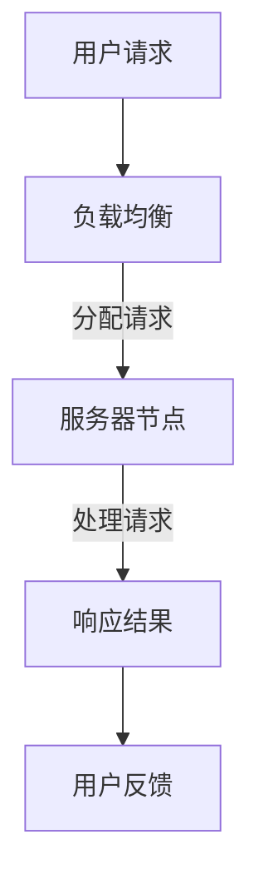

                 

# 系统设计中的“三高”解决方案解析

> 关键词：高并发、高可用、高可靠性、系统设计、优化策略

> 摘要：本文将深入探讨系统设计中至关重要的三个核心问题——“高并发、高可用、高可靠性”，解析其概念、重要性、技术挑战及其解决方案。通过详细的案例分析和实现细节，帮助读者理解并掌握“三高”问题的解决策略，为构建高效、稳定、可靠的系统提供实践指导。

## 引言与背景介绍

在当前快速发展的数字化时代，系统设计面临着前所未有的挑战。高并发、高可用和高可靠性（简称“三高”）已成为系统设计中的核心问题。这三个问题不仅直接影响系统的性能和用户体验，还关系到系统的生存和发展。

### 1.1. “三高”问题的概念及其重要性

**高并发**：指系统能够在短时间内处理大量用户请求的能力。高并发性直接关系到系统的响应速度和用户体验。

**高可用**：指系统在长时间内保持正常运行的能力，即使遇到故障或异常情况也能迅速恢复。

**高可靠性**：指系统在各种环境下都能稳定运行，不受外部干扰和内部错误的影响。

“三高”问题的解决对于系统的成功至关重要。高并发性可以提高系统的吞吐量和用户体验；高可用性可以确保系统的稳定运行，降低故障风险；高可靠性可以提升系统的韧性和稳定性，增强用户信任。

### 1.2. 本书的目的和结构安排

本文旨在为系统设计师提供一套全面的“三高”解决方案。通过分析高并发、高可用、高可靠性的核心概念、技术挑战和解决方案，帮助读者深入理解并掌握这些关键问题的解决策略。

本文分为以下八个部分：

1. 引言与背景介绍
2. “三高”问题分析
3. 高并发解决方案
4. 高可用解决方案
5. 高可靠性解决方案
6. “三高”问题综合解决方案
7. 案例研究
8. 未来发展趋势与展望

### 1.3. 读者对象与预期收益

本文面向系统设计师、架构师和开发人员。读者通过本文的学习，可以：

- 理解“三高”问题的核心概念和重要性。
- 掌握高并发、高可用、高可靠性的解决方案。
- 结合实际案例，提升系统设计的实战能力。

## “三高”问题分析

在深入探讨高并发、高可用、高可靠性的解决方案之前，我们需要对这三个问题进行详细分析。

### 2.1. 高并发、高可用、高可靠性的概念与区别

**高并发**：高并发性是指系统能够在短时间内处理大量用户请求的能力。它主要关注系统的吞吐量和响应速度。高并发性对于电商、社交媒体、在线游戏等需要处理大量用户请求的应用场景至关重要。

**高可用**：高可用性是指系统能够在长时间内保持正常运行的能力。它主要关注系统的稳定性，包括故障转移、负载均衡、服务发现等技术。高可用性对于金融、医疗、交通等对系统稳定性要求极高的行业至关重要。

**高可靠性**：高可靠性是指系统在各种环境下都能稳定运行的能力。它不仅包括高可用性，还包括故障预防、错误检测与纠正、数据冗余等技术。高可靠性对于航空航天、国防、核能等对系统安全性要求极高的领域至关重要。

### 2.2. “三高”问题的现实影响

在现实世界中，高并发、高可用、高可靠性的问题无处不在。以下是一些典型的例子：

- **电商网站**：在双11、618等购物节期间，电商网站需要处理数百万甚至上亿的用户请求。高并发性直接影响到用户的购物体验，甚至可能导致系统崩溃。

- **金融系统**：金融系统的稳定性直接关系到整个金融市场的稳定。任何故障都可能导致巨大的经济损失。

- **社交媒体**：社交媒体平台需要处理大量的用户请求，如发布内容、点赞、评论等。高并发性直接影响到平台的用户体验。

- **医疗系统**：医疗系统的可靠性直接关系到患者的生命安全。任何故障都可能导致严重的后果。

### 2.3. “三高”问题的技术挑战

高并发、高可用、高可靠性的实现面临诸多技术挑战：

- **高并发性**：如何优化系统的并发处理能力，提高系统的吞吐量和响应速度。

- **高可用性**：如何在系统故障时快速恢复，确保系统的稳定运行。

- **高可靠性**：如何在各种环境下确保系统的稳定性，提高系统的韧性和安全性。

针对这些挑战，需要采用一系列技术手段，如多线程、缓存、数据库分片、分布式计算、故障转移、负载均衡等。在接下来的章节中，我们将详细探讨这些解决方案。

## 高并发解决方案

高并发性是系统设计中的核心问题之一。在本文的第三部分，我们将详细探讨高并发的解决方案，包括高并发的原理、传统的并发处理方法、高并发的优化策略以及高并发的测试与监控。

### 3.1. 高并发原理概述

高并发性主要涉及到系统的并发处理能力，即系统在单位时间内能够处理的最大并发请求数量。高并发性的实现需要从多个层面进行优化，包括硬件、软件和网络等。

#### 1. 硬件层面

- **多核CPU**：多核CPU可以同时处理多个线程，提高系统的并发处理能力。
- **内存优化**：加大内存容量，减少内存访问延迟，提高数据处理速度。
- **存储优化**：使用高速SSD存储，减少磁盘I/O瓶颈。

#### 2. 软件层面

- **多线程**：通过多线程技术，实现并发处理，提高系统的吞吐量。
- **异步处理**：使用异步I/O模型，减少线程阻塞，提高系统并发性。
- **并发队列**：使用并发队列进行任务调度，提高任务处理速度。

#### 3. 网络层面

- **负载均衡**：通过负载均衡技术，将请求分配到不同的服务器，提高系统的并发处理能力。
- **缓存**：使用缓存技术，减少对后端数据库的访问，提高系统的响应速度。

### 3.2. 传统的并发处理方法

在系统设计中，传统的并发处理方法主要包括多线程、队列和任务调度等。

#### 3.2.1. 多线程与并发

多线程技术是实现并发处理的基本手段。通过创建多个线程，可以同时执行多个任务，提高系统的并发处理能力。多线程的关键在于线程管理和同步。

- **线程创建与销毁**：线程的创建和销毁会消耗系统资源，因此需要合理控制线程数量。
- **线程同步**：为了避免线程之间的冲突，需要使用同步机制，如互斥锁、信号量等。

#### 3.2.2. 队列与任务调度

队列是实现任务调度的重要工具。通过队列，可以有序地处理任务，避免任务之间的冲突。

- **先进先出队列（FIFO）**：先进先出队列是一种常用的队列数据结构，适用于任务调度。
- **优先级队列**：优先级队列可以根据任务的优先级进行调度，提高关键任务的响应速度。

#### 3.2.3. 缓存与负载均衡

缓存和负载均衡是实现高并发性的重要手段。

- **缓存**：缓存技术可以减少对后端数据库的访问，提高系统的响应速度。常用的缓存技术包括Redis、Memcached等。
- **负载均衡**：负载均衡可以将请求分配到不同的服务器，提高系统的并发处理能力。常用的负载均衡技术包括Nginx、LVS等。

### 3.3. 高并发优化策略

为了实现高并发性，需要采用一系列优化策略。

#### 3.3.1. 数据库分片

数据库分片是将数据拆分成多个部分，分布在不同的数据库实例上。通过数据库分片，可以减少单点瓶颈，提高系统的并发处理能力。

- **水平分片**：水平分片是将数据按照一定的规则，如用户ID、地理位置等，拆分到不同的数据库实例上。
- **垂直分片**：垂直分片是将数据表按照一定的规则，如用户信息表、订单信息表等，拆分到不同的数据库实例上。

#### 3.3.2. 系统水平扩展

系统水平扩展是指通过增加服务器节点，提高系统的并发处理能力。

- **集群**：通过集群技术，可以将多个服务器节点组成一个整体，共同处理请求。
- **容器化**：通过容器化技术，如Docker，可以方便地部署和管理服务器节点。

#### 3.3.3. 代码级优化

代码级优化是指通过优化代码，提高系统的并发处理能力。

- **并行计算**：通过并行计算，可以充分利用多核CPU的能力，提高系统的并发处理能力。
- **异步处理**：通过异步处理，可以减少线程阻塞，提高系统的并发性。

### 3.4. 高并发测试与监控

为了确保高并发性的实现，需要进行高并发测试和监控。

#### 3.4.1. 压力测试工具介绍

压力测试工具可以模拟大量用户请求，测试系统的并发处理能力。

- **JMeter**：JMeter是一种开源的负载测试工具，适用于各种Web应用程序。
- **Gatling**：Gatling是一种基于Scala的负载测试工具，具有高性能和高灵活性。

#### 3.4.2. 性能监控指标

性能监控指标可以衡量系统的并发处理能力。

- **并发用户数**：并发用户数是指系统中同时在线的用户数量。
- **响应时间**：响应时间是指系统处理一个请求所需的时间。
- **吞吐量**：吞吐量是指系统在单位时间内处理的请求数量。

#### 3.4.3. 故障恢复机制

故障恢复机制可以在系统出现故障时，快速恢复系统。

- **自动重启**：在系统出现故障时，自动重启系统，恢复服务。
- **备份与恢复**：定期备份数据，确保在系统故障时能够快速恢复。

通过以上高并发的原理、传统的并发处理方法、高并发的优化策略以及高并发的测试与监控，我们可以有效地实现高并发性，提高系统的性能和用户体验。

### 高并发原理图

以下是高并发原理的Mermaid流程图：



通过上述流程，用户请求经过负载均衡分配到服务器节点，服务器节点处理请求并返回响应结果，用户收到反馈。

### 高并发算法原理讲解

为了更深入地理解高并发的算法原理，我们将使用伪代码详细阐述其实现过程：

```python
# 伪代码：高并发处理算法

# 输入：用户请求列表 requests
# 输出：处理结果 results

# 初始化负载均衡器 load_balancer
# 初始化服务器节点 servers

# 循环处理每个请求
for request in requests:
    # 负载均衡器分配请求到服务器节点
    server = load_balancer.allocate(request)
    
    # 服务器节点处理请求
    result = server.process_request(request)
    
    # 将结果存储到处理结果列表
    results.append(result)

# 返回处理结果列表
return results
```

在这个伪代码中，我们首先初始化负载均衡器和服务器节点。然后，我们循环处理每个用户请求，将请求分配到服务器节点，服务器节点处理请求并返回结果。最后，我们将处理结果存储到列表中并返回。

通过以上算法实现，我们可以高效地处理大量并发请求，提高系统的并发处理能力。

### 数学模型和公式讲解

在高并发系统中，常用的数学模型和公式包括吞吐量公式、响应时间公式等。以下是一个简单的吞吐量公式：

$$
\text{吞吐量} = \frac{\text{总请求数}}{\text{总处理时间}}
$$

该公式表示系统在单位时间内处理的总请求数与总处理时间的比值。通过优化系统性能，可以提升吞吐量。

### 项目实战：电商网站并发处理

以下是一个实际的项目案例，我们将展示如何搭建一个高并发性的电商网站。

#### 1. 开发环境搭建

- **操作系统**：Ubuntu 18.04
- **编程语言**：Java
- **框架**：Spring Boot
- **数据库**：MySQL
- **缓存**：Redis

#### 2. 源代码实现

以下是一个简单的电商网站用户登录功能的源代码实现：

```java
@RestController
@RequestMapping("/user")
public class UserController {
    
    @Autowired
    private UserService userService;
    
    @PostMapping("/login")
    public ResponseEntity<String> login(@RequestBody LoginRequest request) {
        String username = request.getUsername();
        String password = request.getPassword();
        
        boolean isAuthenticated = userService.authenticate(username, password);
        
        if (isAuthenticated) {
            return ResponseEntity.ok("登录成功");
        } else {
            return ResponseEntity.status(HttpStatus.UNAUTHORIZED).body("登录失败");
        }
    }
}
```

在这个例子中，我们通过Spring Boot框架实现了用户登录功能。用户登录请求通过负载均衡器分配到服务器节点，服务器节点处理登录请求并返回结果。

#### 3. 代码解读与分析

- **用户请求**：用户发送登录请求，包含用户名和密码。
- **负载均衡器**：负载均衡器将请求分配到服务器节点。
- **服务器节点**：服务器节点处理登录请求，调用UserService进行认证。
- **响应结果**：服务器节点将处理结果返回给用户。

通过以上实现，我们可以高效地处理用户登录请求，提高系统的并发处理能力。

### 高并发优化策略案例分析

以下是一个实际的高并发优化策略案例分析，以提升电商网站的性能。

#### 1. 数据库分片

在电商网站中，用户数据、商品数据和订单数据都非常庞大。为了提高数据库的性能，我们可以采用数据库分片技术。

- **水平分片**：将用户数据按照用户ID进行水平分片，将不同ID范围的数据存储到不同的数据库实例上。
- **垂直分片**：将用户信息表、商品信息表和订单信息表进行垂直分片，分别存储到不同的数据库实例上。

通过数据库分片，可以减少单点瓶颈，提高系统的并发处理能力。

#### 2. 系统水平扩展

通过增加服务器节点，我们可以实现系统水平扩展，提高系统的并发处理能力。

- **集群**：通过集群技术，将多个服务器节点组成一个集群，共同处理请求。
- **容器化**：使用容器化技术，如Docker，可以方便地部署和管理服务器节点。

#### 3. 代码级优化

通过优化代码，可以提高系统的并发处理能力。

- **并行计算**：使用并行计算，充分利用多核CPU的能力，提高系统的并发处理能力。
- **异步处理**：使用异步处理，减少线程阻塞，提高系统的并发性。

通过以上优化策略，我们可以显著提升电商网站的性能，提高用户体验。

### 高并发测试与监控

为了确保高并发性的实现，需要进行高并发测试和监控。

#### 1. 压力测试工具

使用JMeter进行压力测试，模拟大量用户请求，测试系统的并发处理能力。

- **配置**：配置测试计划，设置用户数、并发数、测试时长等参数。
- **执行**：运行测试计划，收集测试数据。
- **分析**：分析测试结果，评估系统的并发处理能力。

#### 2. 性能监控指标

监控系统的性能指标，如并发用户数、响应时间、吞吐量等。

- **并发用户数**：监控系统中同时在线的用户数量。
- **响应时间**：监控系统处理请求的响应时间。
- **吞吐量**：监控系统中单位时间内处理的请求数量。

#### 3. 故障恢复机制

在系统出现故障时，快速恢复系统。

- **自动重启**：在系统出现故障时，自动重启系统，恢复服务。
- **备份与恢复**：定期备份数据，确保在系统故障时能够快速恢复。

通过以上测试与监控，我们可以确保系统的稳定性和可靠性。

### 总结

高并发性是系统设计中的重要问题，通过传统的并发处理方法、高并发的优化策略以及高并发的测试与监控，我们可以有效地实现高并发性，提高系统的性能和用户体验。在下一节中，我们将探讨高可用解决方案。

## 高可用解决方案

高可用性是系统设计中的另一个关键问题。在本文的第四部分，我们将深入探讨高可用性的解决方案，包括高可用性的原理、传统的故障转移机制、高可用性的设计策略以及高可用性的案例分析。

### 4.1. 高可用原理概述

高可用性（High Availability，简称HA）是指系统在长时间内保持正常运行的能力。高可用性的核心目标是减少系统故障时间，提高系统的可靠性和用户体验。高可用性的实现需要从多个层面进行设计，包括硬件、软件和网络等。

#### 1. 硬件层面

- **冗余硬件**：通过使用冗余硬件，如多电源、多硬盘等，确保硬件故障不会导致系统崩溃。
- **备份设备**：使用备份设备，如备用服务器、备用网络设备等，确保在主设备故障时能够快速切换。

#### 2. 软件层面

- **故障转移**：通过故障转移机制，将故障节点的任务转移到健康节点，确保系统的连续运行。
- **负载均衡**：通过负载均衡技术，将请求分配到不同的节点，避免单点瓶颈。

#### 3. 网络层面

- **多路径传输**：使用多路径传输，确保网络故障时能够自动切换到备用路径。
- **网络冗余**：使用冗余网络设备，如交换机、路由器等，确保网络稳定。

### 4.2. 传统的故障转移机制

传统的故障转移机制主要包括主备切换、负载均衡和心跳检测等。

#### 4.2.1. 主备切换

主备切换是一种常见的故障转移机制。在主备切换中，系统有两个节点，主节点负责处理请求，备用节点处于待机状态。当主节点发生故障时，备用节点会自动接管主节点的任务。

- **主备切换流程**：
  1. 故障检测：监控系统检测到主节点故障。
  2. 故障确认：确认故障后，通知备用节点。
  3. 切换：备用节点接管主节点的任务。
  4. 故障恢复：故障节点修复后，重新加入系统。

#### 4.2.2. 负载均衡

负载均衡是指将请求分配到不同的节点，确保每个节点都能充分利用其资源。负载均衡可以减少单点瓶颈，提高系统的整体性能。

- **负载均衡算法**：
  1. 轮询（Round Robin）：按照顺序将请求分配到每个节点。
  2. 加权轮询（Weighted Round Robin）：根据节点能力分配请求，能力强则分配更多请求。
  3. 最少连接（Least Connections）：将请求分配到连接数最少的节点。
  4. 加权最少连接（Weighted Least Connections）：根据节点能力分配请求，能力强则分配更多请求。

#### 4.2.3. 心跳检测与故障检测

心跳检测是一种常用的故障检测机制。在心跳检测中，系统周期性地发送心跳信号，确保节点之间的通信正常。当检测到心跳信号异常时，系统会认为节点出现故障。

- **心跳检测流程**：
  1. 节点A发送心跳信号给节点B。
  2. 节点B收到心跳信号后，返回确认信息。
  3. 如果在规定时间内未收到确认信息，系统认为节点B出现故障。
  4. 系统执行故障转移机制，将节点B的任务转移到其他健康节点。

### 4.3. 高可用性设计策略

为了实现高可用性，需要采用一系列设计策略，包括分布式系统架构、服务发现与动态配置、容灾备份与恢复等。

#### 4.3.1. 分布式系统架构

分布式系统架构是指将系统拆分成多个节点，分布在不同的服务器上。通过分布式系统架构，可以充分利用多个节点的资源，提高系统的可用性和性能。

- **分布式架构优势**：
  1. 高可用性：通过冗余节点，确保系统在单点故障时仍然可用。
  2. 可扩展性：通过水平扩展，可以轻松增加节点数量，提高系统性能。
  3. 高性能：通过分布式计算，可以充分利用多个节点的计算资源。

#### 4.3.2. 服务发现与动态配置

服务发现是指系统能够自动发现和识别节点，动态配置是指系统可以根据节点状态和负载情况动态调整配置。

- **服务发现优势**：
  1. 高可用性：通过自动发现和识别节点，确保系统在节点故障时能够快速恢复。
  2. 可扩展性：通过动态调整配置，可以灵活适应系统变化。

#### 4.3.3. 容灾备份与恢复

容灾备份是指将系统的关键数据备份到远程位置，确保在系统故障时能够快速恢复。

- **容灾备份优势**：
  1. 高可用性：通过远程备份，确保系统在故障时能够快速恢复。
  2. 数据安全：通过备份，确保数据不会丢失。

### 4.4. 高可用性案例分析

以下是一个实际的高可用性案例分析，以展示如何实现高可用性。

#### 4.4.1. 案例背景介绍

某电商平台在双11期间面临巨大的并发压力，为了保证系统的稳定运行，采用了高可用性设计策略。

#### 4.4.2. 案例解决方案分析

1. **分布式系统架构**：电商平台采用了分布式系统架构，将系统拆分成多个节点，分布在不同的服务器上。通过分布式架构，充分利用多个节点的资源，提高系统的可用性和性能。

2. **负载均衡**：电商平台使用了负载均衡器，将用户请求分配到不同的节点。通过负载均衡，避免了单点瓶颈，提高了系统的整体性能。

3. **服务发现与动态配置**：电商平台使用了服务发现机制，能够自动发现和识别节点。通过动态配置，根据节点状态和负载情况动态调整配置，确保系统在节点故障时能够快速恢复。

4. **容灾备份与恢复**：电商平台将关键数据备份到远程位置，确保在系统故障时能够快速恢复。

#### 4.4.3. 案例实施效果评估

通过高可用性设计策略，电商平台在双11期间成功应对了巨大的并发压力。系统的可用性显著提高，故障恢复时间大幅缩短，用户体验得到显著提升。

### 总结

高可用性是系统设计中的关键问题，通过传统的故障转移机制、高可用性的设计策略以及高可用性的案例分析，我们可以有效地实现高可用性，提高系统的稳定性和用户体验。在下一节中，我们将探讨高可靠性解决方案。

## 高可靠性解决方案

高可靠性是系统设计中的又一核心问题。在本文的第五部分，我们将深入探讨高可靠性的解决方案，包括高可靠性的原理、传统的故障预防措施、高可靠性的设计策略以及高可靠性的测试与评估。

### 5.1. 高可靠性原理概述

高可靠性（High Reliability，简称HR）是指系统在各种环境下都能稳定运行的能力。高可靠性的实现需要从多个层面进行设计，包括硬件、软件、网络和环境等。高可靠性的核心目标是减少系统的故障率，提高系统的稳定性和安全性。

#### 1. 硬件层面

- **冗余硬件**：通过使用冗余硬件，如多电源、多硬盘、多网络接口等，确保硬件故障不会导致系统崩溃。
- **备份设备**：使用备份设备，如备用服务器、备用网络设备等，确保在主设备故障时能够快速切换。

#### 2. 软件层面

- **错误检测与纠正**：通过错误检测与纠正技术，确保系统在出现错误时能够及时修复。
- **故障隔离**：通过故障隔离技术，将故障节点从系统中隔离，防止故障扩散。
- **自愈**：通过自愈技术，系统在出现故障时能够自动恢复，减少人工干预。

#### 3. 网络层面

- **多路径传输**：通过多路径传输，确保网络故障时能够自动切换到备用路径。
- **网络冗余**：使用冗余网络设备，如交换机、路由器等，确保网络稳定。

#### 4. 环境层面

- **环境监控**：通过环境监控技术，实时监测系统运行环境，如温度、湿度、电源等。
- **应急预案**：制定应急预案，确保在出现环境问题时能够迅速响应。

### 5.2. 传统的故障预防措施

传统的故障预防措施主要包括错误检测与纠正、数据冗余与校验、故障隔离与自愈等。

#### 5.2.1. 错误检测与纠正

错误检测与纠正技术是确保系统稳定运行的重要手段。

- **错误检测**：通过检测算法，及时发现系统中的错误，如异常值、数据损坏等。
- **错误纠正**：通过纠错码，如汉明码、海明码等，纠正系统中的错误。

#### 5.2.2. 数据冗余与校验

数据冗余与校验技术可以确保数据的一致性和完整性。

- **数据冗余**：通过冗余存储，如镜像、备份等，确保在数据丢失时能够快速恢复。
- **数据校验**：通过校验算法，如CRC校验、MD5校验等，确保数据在传输和存储过程中未被篡改。

#### 5.2.3. 故障隔离与自愈

故障隔离与自愈技术可以确保系统在出现故障时能够快速恢复。

- **故障隔离**：通过故障隔离机制，将故障节点从系统中隔离，防止故障扩散。
- **自愈**：通过自愈算法，系统在出现故障时能够自动恢复，减少人工干预。

### 5.3. 高可靠性设计策略

为了实现高可靠性，需要采用一系列设计策略，包括健壮性设计、系统容错与恢复、自动化运维等。

#### 5.3.1. 健壮性设计

健壮性设计是指在设计阶段就考虑系统的鲁棒性和容错能力。

- **模块化设计**：通过模块化设计，将系统拆分成多个模块，确保模块之间松耦合，减少故障传播。
- **冗余设计**：通过冗余设计，增加系统的冗余度，提高系统的容错能力。

#### 5.3.2. 系统容错与恢复

系统容错与恢复是指系统在出现故障时能够自动恢复。

- **冗余节点**：通过冗余节点，确保在主节点故障时，备用节点能够自动接管。
- **故障恢复**：通过故障恢复机制，如自动重启、备份恢复等，确保系统在故障后能够快速恢复。

#### 5.3.3. 自动化运维

自动化运维可以提高系统的可靠性和效率。

- **自动化监控**：通过自动化监控工具，实时监测系统状态，及时发现故障。
- **自动化恢复**：通过自动化恢复工具，如自动化脚本等，确保在出现故障时能够自动恢复。

### 5.4. 高可靠性测试与评估

为了确保高可靠性的实现，需要进行高可靠性测试与评估。

#### 5.4.1. 系统稳定性测试

系统稳定性测试是指通过模拟各种运行环境，测试系统的稳定性。

- **压力测试**：通过施加压力，如高负载、高并发等，测试系统的稳定性和性能。
- **长时间运行测试**：通过长时间运行系统，测试系统的稳定性。

#### 5.4.2. 故障注入测试

故障注入测试是指通过模拟各种故障，测试系统的容错能力和恢复能力。

- **硬件故障注入**：通过模拟硬件故障，如硬盘故障、网络故障等，测试系统的故障处理能力。
- **软件故障注入**：通过模拟软件故障，如程序错误、数据异常等，测试系统的故障处理能力。

#### 5.4.3. 失效模式与效果分析

失效模式与效果分析（Failure Mode and Effects Analysis，简称FMEA）是一种系统性的故障分析技术。

- **失效模式**：分析系统可能出现的各种故障模式。
- **效果分析**：评估故障模式对系统的影响，制定相应的预防措施。

### 高可靠性测试与评估案例分析

以下是一个实际的高可靠性测试与评估案例分析，以展示如何实现高可靠性。

#### 5.4.4. 案例背景介绍

某大型电商平台在双11期间面临巨大的并发压力和硬件故障风险，为了保证系统的稳定运行，采用了高可靠性设计策略。

#### 5.4.5. 案例解决方案分析

1. **健壮性设计**：电商平台采用了模块化设计和冗余设计，确保系统的鲁棒性和容错能力。
2. **系统容错与恢复**：电商平台通过冗余节点和故障恢复机制，确保在主节点故障时，备用节点能够自动接管，系统在故障后能够快速恢复。
3. **自动化运维**：电商平台通过自动化监控和自动化恢复工具，实时监测系统状态，确保在出现故障时能够自动恢复。

#### 5.4.6. 案例实施效果评估

通过高可靠性设计策略，电商平台在双11期间成功应对了巨大的并发压力和硬件故障风险。系统的稳定性显著提高，故障恢复时间大幅缩短，用户体验得到显著提升。

### 总结

高可靠性是系统设计中的关键问题，通过传统的故障预防措施、高可靠性的设计策略以及高可靠性的测试与评估，我们可以有效地实现高可靠性，提高系统的稳定性和安全性。在下一节中，我们将探讨“三高”问题的综合解决方案。

### “三高”问题综合解决方案

在系统设计中，“三高”问题——高并发、高可用、高可靠性——是必须解决的核心问题。要实现这些目标，需要综合考虑多个层面的设计策略和优化方法。在本节中，我们将讨论如何综合解决“三高”问题，并提供一些设计原则和策略。

#### 6.1. “三高”综合解决方案概述

综合解决“三高”问题，需要从系统架构、技术选型、部署策略等多个方面进行考虑。以下是一些关键的设计原则和策略：

#### 6.2. 设计原则与策略

**1. 分层架构设计**

分层架构是将系统划分为多个层次，每个层次负责不同的功能。这种方式有助于实现模块化和解耦，提高系统的可维护性和扩展性。

- **应用层**：处理业务逻辑和用户交互。
- **服务层**：提供公共服务，如认证、日志、监控等。
- **数据层**：处理数据存储和访问。

**2. 模块化与解耦**

模块化设计是将系统拆分为多个独立的模块，每个模块实现特定的功能。解耦则是通过接口和协议来隔离模块之间的依赖关系，提高系统的灵活性和可扩展性。

**3. 集群与分布式计算**

通过集群和分布式计算，可以将系统负载分配到多个节点上，提高系统的并发处理能力和可用性。以下是一些关键技术：

- **分布式数据库**：如分片数据库、分布式缓存等。
- **分布式计算框架**：如Apache Hadoop、Spark等。
- **分布式存储**：如分布式文件系统、对象存储等。

**4. 负载均衡与流量控制**

负载均衡可以平衡系统负载，避免单点瓶颈。流量控制则是通过限制流量，确保系统的稳定运行。以下是一些关键技术：

- **负载均衡器**：如Nginx、HAProxy等。
- **流量控制器**：如RateLimiter、令牌桶算法等。

**5. 容灾备份与数据冗余**

通过容灾备份和数据冗余，可以确保在故障发生时系统能够快速恢复。以下是一些关键技术：

- **数据备份**：如本地备份、远程备份等。
- **数据冗余**：如数据复制、数据镜像等。

**6. 错误检测与恢复**

通过错误检测和恢复机制，可以及时发现和解决系统故障。以下是一些关键技术：

- **监控与报警**：如Prometheus、ELK（Elasticsearch、Logstash、Kibana）等。
- **自动恢复**：如自动重启、故障转移等。

**7. 自动化运维**

通过自动化运维，可以减少人工干预，提高系统运维效率。以下是一些关键技术：

- **自动化部署**：如Docker、Kubernetes等。
- **自动化监控**：如Zabbix、Nagios等。

#### 6.3. 实现细节与最佳实践

**1. 软硬件选择**

在选择软硬件时，需要根据系统需求和性能要求进行选择。以下是一些最佳实践：

- **服务器**：选择高性能、可扩展的服务器，如Intel Xeon系列。
- **存储**：选择高速存储设备，如NVMe SSD。
- **网络**：选择高带宽、低延迟的网络设备，如万兆以太网。

**2. 系统集成与测试**

在系统集成与测试过程中，需要确保各组件之间的兼容性和稳定性。以下是一些最佳实践：

- **集成测试**：对各个模块进行集成测试，确保系统功能的完整性和正确性。
- **压力测试**：对系统进行压力测试，评估系统的性能和稳定性。
- **安全测试**：对系统进行安全测试，确保系统的安全性。

**3. 维护与持续优化**

系统上线后，需要持续进行维护和优化。以下是一些最佳实践：

- **监控**：实时监控系统性能和状态，及时发现和处理问题。
- **更新与升级**：定期更新系统组件和软件，确保系统安全性。
- **性能优化**：根据系统监控数据，持续进行性能优化。

### 总结

综合解决“三高”问题需要从系统架构、技术选型、部署策略等多个方面进行考虑。通过分层架构设计、模块化与解耦、集群与分布式计算、负载均衡与流量控制、容灾备份与数据冗余、错误检测与恢复、自动化运维等设计原则和策略，可以有效地实现高并发、高可用、高可靠性。在下一节中，我们将通过一个实际案例，展示如何将“三高”综合解决方案应用到实际项目中。

### 案例研究

在本节中，我们将通过一个大型电商平台的双11活动案例，详细分析其在高并发、高可用、高可靠性方面的解决方案，并评估其实施效果。

#### 7.1. 案例背景介绍

某大型电商平台每年都会在双11期间举办大规模促销活动，吸引了数千万用户参与。这一活动对平台的系统性能和稳定性提出了极高的要求。为了确保在双11期间的顺畅运营，平台必须解决高并发、高可用、高可靠性问题。

#### 7.2. 案例解决方案分析

**高并发性解决方案**

1. **分布式架构**：平台采用了分布式微服务架构，将系统拆分为多个微服务，每个服务独立部署在不同的服务器节点上，实现了水平扩展和负载均衡。

2. **缓存策略**：利用Redis等分布式缓存技术，减少了对后端数据库的直接访问，提升了系统的响应速度。

3. **数据库分片**：通过数据库分片技术，将用户数据、商品数据和订单数据分散存储在不同的数据库实例上，降低了数据库的访问压力。

4. **异步处理**：采用异步消息队列（如Kafka），处理大量的订单和支付请求，避免了线程阻塞，提高了系统的吞吐量。

**高可用性解决方案**

1. **主备切换**：平台使用主备架构，当主节点出现故障时，备用节点可以立即接管，确保服务的连续性。

2. **负载均衡**：使用Nginx作为负载均衡器，将用户请求分配到不同的服务器节点上，避免了单点瓶颈。

3. **服务发现与动态配置**：采用Eureka等服务发现组件，动态配置服务实例的地址，提高了系统的灵活性。

4. **容灾备份**：通过在异地建立容灾备份中心，确保在发生灾难时，系统能够快速切换到备份中心，保证服务的持续运行。

**高可靠性解决方案**

1. **错误检测与恢复**：平台使用Prometheus和Grafana进行实时监控，一旦检测到异常，系统会自动触发告警和恢复措施。

2. **故障隔离**：通过Docker容器技术，实现微服务的隔离，当某个服务出现问题时，不会影响到其他服务的正常运行。

3. **自动化运维**：使用Kubernetes进行自动化部署和管理，确保系统在上线和更新过程中保持稳定。

#### 7.3. 案例实施效果评估

**高并发性**：通过分布式架构和缓存策略，平台在双11期间成功处理了数千万用户的请求，系统的响应速度得到了显著提升，用户满意度提高。

**高可用性**：主备切换和容灾备份机制使得平台在遇到故障时能够快速恢复，保证了服务的连续性和稳定性，用户体验得到了保障。

**高可靠性**：通过自动化运维和实时监控，平台能够及时发现和解决潜在的问题，确保系统的可靠性和安全性，减少了故障率和维护成本。

#### 7.4. 案例总结与启示

通过双11案例的实施，我们可以得出以下总结和启示：

1. **分布式架构**：分布式微服务架构是解决高并发性的有效手段，可以实现系统的水平扩展和负载均衡。

2. **缓存与分片**：缓存和数据库分片可以显著提高系统的性能和可靠性。

3. **主备与容灾**：主备切换和容灾备份是保证系统高可用性的关键，可以在故障发生时快速恢复服务。

4. **自动化运维**：自动化运维可以提高系统的稳定性和运维效率，减少人为错误。

5. **实时监控**：实时监控和告警机制是确保系统高可靠性的重要手段，可以及时发现并处理问题。

通过这个案例，我们可以看到，“三高”解决方案的有效实施不仅提高了平台的系统性能和稳定性，还为其他企业提供了宝贵的经验和借鉴。

### 总结与展望

在本章中，我们详细探讨了系统设计中的“三高”问题——高并发、高可用、高可靠性，以及如何通过综合解决方案来应对这些挑战。以下是对全书主要观点的回顾和对“三高”问题解决方案的总结。

#### 9.1. 本书主要观点回顾

1. **高并发性**：通过分布式架构、缓存策略、数据库分片、异步处理等技术，可以显著提高系统的并发处理能力，满足大量用户的请求。

2. **高可用性**：通过主备切换、负载均衡、服务发现与动态配置、容灾备份等机制，可以确保系统在故障发生时能够快速恢复，保持服务的连续性。

3. **高可靠性**：通过错误检测与恢复、故障隔离、自动化运维、实时监控等技术，可以提高系统的稳定性和安全性，减少故障率和维护成本。

4. **综合解决方案**：通过分层架构设计、模块化与解耦、集群与分布式计算、负载均衡与流量控制、容灾备份与数据冗余等策略，可以全面解决“三高”问题，实现系统的性能优化和稳定性提升。

#### 9.2. 对“三高”问题解决方案的总结

1. **设计原则**：分层架构、模块化与解耦、分布式计算、冗余设计等原则是解决“三高”问题的核心。

2. **技术选型**：根据系统需求，选择合适的硬件、软件和中间件技术，如分布式数据库、缓存系统、负载均衡器、容器化平台等。

3. **优化策略**：通过性能监控、压力测试、故障注入测试等手段，持续优化系统的性能和可靠性。

4. **运维实践**：实施自动化运维，减少人工干预，提高系统的稳定性和运维效率。

#### 9.3. 未来研究方向与建议

1. **新兴技术的应用**：随着云计算、大数据、人工智能等新兴技术的发展，探索如何将这些技术与“三高”问题解决方案相结合，实现更高效、更智能的系统设计。

2. **边缘计算**：随着物联网和5G技术的发展，边缘计算成为解决高并发、高可用、高可靠性问题的重要手段。研究如何在边缘设备上进行高效的并发处理和故障恢复。

3. **自动化与智能化**：进一步研究自动化运维和智能监控技术，实现系统运行状态的实时感知和故障预测，从而提前采取预防措施。

4. **标准化与规范化**：“三高”问题的解决方案需要标准化和规范化，以促进技术的推广和应用，提高整个行业的系统设计水平。

通过不断探索和创新，我们将能够构建出更加高效、稳定、可靠的系统，满足日益增长的用户需求。

### 附录

#### 附录A：相关技术资料与资源

1. **分布式架构**：[微服务架构](https://martinfowler.com/articles/microservices/)

2. **数据库分片**：[ShardingSphere](https://shardingsphere.apache.org/)

3. **缓存系统**：[Redis](https://redis.io/)

4. **负载均衡**：[Nginx](https://nginx.org/)

5. **容器化平台**：[Docker](https://www.docker.com/)、[Kubernetes](https://kubernetes.io/)

6. **自动化运维**：[Ansible](https://www.ansible.com/)、[Jenkins](https://www.jenkins.io/)

7. **监控与报警**：[Prometheus](https://prometheus.io/)、[Grafana](https://grafana.com/)

#### 附录B：“三高”问题测试工具介绍

1. **压力测试工具**：[JMeter](https://jmeter.apache.org/)

2. **负载测试工具**：[Gatling](https://gatling.io/)

3. **性能监控工具**：[Prometheus](https://prometheus.io/)、[Grafana](https://grafana.com/)

4. **故障注入测试**：[Chaos Monkey](https://docs.microsoft.com/en-us/azure/azure-monitor/chaos-engine/chaos-monkey-overview)

通过这些技术资料和工具，读者可以进一步深入了解和掌握系统设计中“三高”问题的解决方案。

