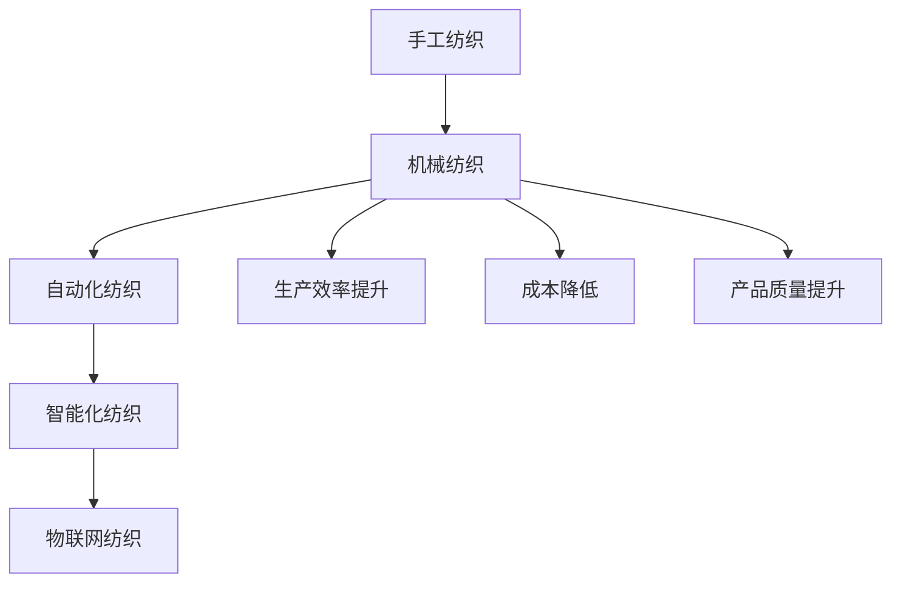

                 

# 《纺织业的机械化进程》

## 关键词
纺织业、机械化、纺纱机械、织造机械、印染机械、自动化、智能化、物联网、生产管理、技术创新

## 摘要
本文旨在深入探讨纺织业的机械化进程，从背景、类型、自动化与智能化、生产管理、技术创新等方面，详细解析纺织机械的发展历程及其在提高生产效率、产品质量和降低成本方面的作用。通过阐述核心概念与联系，分析典型案例，本文为纺织机械的研究者和从业者提供了有价值的参考。

### 第一部分：纺织业机械化的发展背景与意义

#### 概述

纺织业是历史悠久且具有重要地位的行业，其机械化进程可以说是现代工业发展的重要标志之一。从手工操作到机械生产，纺织业的机械化进程经历了多个阶段。这一进程不仅改变了纺织业的运作方式，也对全球工业体系产生了深远的影响。

#### 背景

1. **纺织业发展的现状与趋势**  
   随着全球经济的发展，纺织业在各国经济中的地位和作用日益凸显。机械化进程的推进，使得纺织业的生产效率和质量得到了显著提升，同时也促进了产业结构的升级和优化。

2. **机械化在纺织业中的重要性**  
   机械化能够显著提高纺织业的生产效率，降低生产成本，提升产品质量。同时，机械化也为纺织业的发展带来了新的机遇和挑战，如自动化与智能化技术的应用，以及全球产业链的整合。

#### 意义

1. **提高生产效率**  
   机械化的应用使得纺织生产过程更加自动化和高效，从而提高了整体生产效率。

2. **提升产品质量**  
   机械化的纺织机械具有更高的精度和稳定性，能够生产出更加优质的纺织品。

3. **降低生产成本**  
   机械化的生产方式能够减少人力成本，提高生产效率，从而降低生产成本。

#### 核心概念与联系

为了更好地理解纺织业机械化的发展，我们使用 Mermaid 流程图展示其关键节点和影响因素：

这个流程图清晰地展示了纺织业从手工操作到机械纺织，再到自动化、智能化和物联网纺织的演变过程，以及机械化对生产效率、成本和质量的影响。

### 第二部分：纺织机械的类型与应用

#### 纺纱机械

1. **常见纺纱机械的种类和特点**  
   纺纱机械主要包括粗纺机、细纺机和络筒机等。粗纺机主要用于将毛纱或线纱进行初步加工，细纺机则用于将粗纱进一步加工成细纱，而络筒机则用于将纱线进行整理和打包。

2. **纺纱机械的工作原理和结构**  
   纺纱机械的基本工作原理是通过旋转的纱轮和梭子将纤维材料缠绕在纱线上。纺纱机械的结构主要包括纱轮、梭子、牵伸装置、卷绕装置等。

#### 织造机械

1. **常见织造机械的种类和特点**  
   织造机械主要包括织布机、针织机和梭织机等。织布机主要用于将纱线织成布料，针织机则用于生产针织品，而梭织机则是一种将纱线通过梭子进行织造的机械。

2. **织造机械的工作原理和结构**  
   织造机械的基本工作原理是通过织针或梭子将纱线交织成布料。织造机械的结构主要包括织针、梭子、牵伸装置、送纱装置等。

#### 印染机械

1. **常见印染机械的种类和特点**  
   印染机械主要包括印花机、染色机和烫平机等。印花机主要用于在布料上进行印花，染色机则用于对布料进行染色，而烫平机则用于对布料进行熨烫和平整处理。

2. **印染机械的工作原理和结构**  
   印染机械的基本工作原理是通过染料或印花剂对布料进行染色或印花。印染机械的结构主要包括印花滚筒、染色缸、烫平装置等。

#### 纺织机械的选型与应用

1. **根据生产需求选择合适的纺织机械**  
   根据不同的生产需求，选择合适的纺织机械是非常重要的。例如，对于大规模生产，可以选择高效、高精度的纺织机械；对于特殊材料或工艺要求，则可以选择专业化的纺织机械。

2. **纺织机械在实际生产中的应用案例**  
   实际生产中，纺织机械的应用涵盖了从纺纱、织造到印染等多个环节。例如，某纺织企业通过引进先进的织造机械，实现了生产效率的大幅提升，同时生产出了高质量的产品。

### 第三部分：纺织机械的自动化与智能化

#### 自动化技术的应用

1. **自动化生产线的设计与实施**  
   自动化生产线的设计和实施是纺织机械自动化的重要环节。通过自动化技术的应用，可以大大提高生产效率，降低人力成本。

2. **自动化技术在纺织机械中的应用**  
   自动化技术在纺织机械中的应用主要体现在自动化控制、自动化检测和自动化处理等方面。例如，通过自动化控制系统，可以实现纺织机械的自动启动、自动运行和自动停止。

#### 智能化技术的应用

1. **智能传感器在纺织机械中的应用**  
   智能传感器是智能化技术的核心组件之一。在纺织机械中，智能传感器可以实时监测机械的工作状态，如温度、湿度、振动等，从而实现智能化的控制和管理。

2. **智能控制系统在纺织机械中的应用**  
   智能控制系统通过对传感器数据的分析和处理，可以实现纺织机械的智能调控，从而提高生产效率和产品质量。

#### 物联网技术在纺织业中的应用

1. **纺织机械的物联网监测与管理**  
   通过物联网技术，可以实现纺织机械的远程监测和管理。例如，纺织企业可以通过物联网平台实时监控生产线的运行状态，及时发现和解决潜在的问题。

2. **物联网技术在提高生产效率方面的作用**  
   物联网技术的应用可以大大提高生产效率。例如，通过物联网平台，可以实现生产线的实时调度和优化，从而减少生产周期，提高生产效率。

### 第四部分：纺织机械的生产管理与维护

#### 生产管理

1. **纺织机械的生产管理流程**  
   纺织机械的生产管理主要包括生产计划、生产调度、生产监控和质量管理等环节。通过规范的生产管理流程，可以确保纺织机械的生产过程有序、高效。

2. **生产效率与成本控制**  
   生产效率和成本控制是纺织机械生产管理的核心目标。通过优化生产流程、提高生产效率，可以实现成本的降低。

#### 机械维护与保养

1. **纺织机械的常见故障与排查**  
   纺织机械在使用过程中可能会出现各种故障，如机械磨损、电气故障等。通过定期排查和故障分析，可以及时发现和解决机械故障。

2. **机械维护与保养的注意事项**  
   机械维护与保养是确保纺织机械长期稳定运行的关键。在机械维护与保养过程中，需要注意以下几个方面：
   - 定期更换零部件
   - 保持机械的清洁和润滑
   - 检查电气元件的完好性

#### 数字化维护与管理

1. **利用数字化技术实现机械维护的智能化**  
   通过数字化技术，可以实现纺织机械维护的智能化。例如，通过物联网传感器实时监测机械的工作状态，可以实现预测性维护，从而降低故障率。

2. **数据驱动的机械维护策略**  
   通过对机械运行数据的分析，可以制定出数据驱动的机械维护策略。例如，根据机械的运行状态和故障数据，可以优化维护周期和维护内容，从而提高机械的可靠性和使用寿命。

### 第五部分：纺织机械的技术创新与发展趋势

#### 新技术在纺织机械中的应用

1. **新材料在纺织机械中的应用**  
   新材料的应用可以提升纺织机械的性能和可靠性。例如，高强度材料可以用于纺织机械的关键部件，从而提高机械的耐用性和耐磨性。

2. **新工艺在纺织机械中的应用**  
   新工艺的应用可以提升纺织机械的生产效率和质量。例如，高效纺纱工艺和新型织造工艺，可以显著提高纺织品的质量和生产效率。

#### 发展趋势

1. **未来纺织机械的发展方向**  
   随着科技的不断发展，未来纺织机械将朝着智能化、自动化和高效化的方向发展。例如，智能化纺纱机械和智能化织造机械将成为未来的主流。

2. **机械化在纺织业中的未来发展前景**  
   随着全球经济的发展和人们对纺织品需求的不断增加，机械化在纺织业中的应用前景非常广阔。未来，机械化将成为纺织业发展的重要驱动力。

### 第六部分：纺织机械企业的案例研究

#### 成功案例分享

1. **国内某大型纺织机械企业的成功经验**  
   国内某大型纺织机械企业通过引进先进技术，不断提升产品质量和生产效率，取得了显著的市场竞争优势。

2. **国外某知名纺织机械企业的成功经验**  
   国外某知名纺织机械企业通过全球化战略和科技创新，成为全球纺织机械行业的领导者。

#### 案例分析

1. **某个具体项目的实施过程与效果分析**  
   某个具体项目的实施过程中，纺织机械企业在技术、管理和市场等方面面临了诸多挑战。通过有效的实施策略和项目管理，项目取得了显著的效果。

2. **项目实施中的难点与解决方案**  
   在项目实施过程中，纺织机械企业遇到了一些技术和管理难题。通过创新思维和团队合作，企业成功解决了这些难题，为项目的顺利进行提供了保障。

### 第七部分：纺织机械的未来展望

#### 产业政策与市场环境

1. **我国纺织机械产业的发展政策**  
   我国政府高度重视纺织机械产业的发展，出台了一系列支持政策和措施，以促进纺织机械产业的转型升级和创新发展。

2. **国际纺织机械市场的现状与趋势**  
   国际纺织机械市场正处于快速发展阶段，全球范围内的竞争日益激烈。未来，国际纺织机械市场将呈现出智能化、绿色化和定制化的趋势。

#### 技术创新与人才战略

1. **纺织机械企业的技术创新策略**  
   纺织机械企业应加大技术创新力度，通过研发和应用新技术、新工艺，提升产品和服务的竞争力。

2. **人才培养与引进的重要性**  
   人才是纺织机械企业持续发展的重要保障。企业应重视人才培养和引进，建立完善的人才培养体系，提升员工的综合素质和专业能力。

#### 可持续发展

1. **纺织机械行业的环保与节能措施**  
   纺织机械企业应积极采取环保和节能措施，降低生产过程中的能源消耗和环境污染，推动行业的可持续发展。

2. **绿色制造与可持续发展理念在纺织机械行业中的应用**  
   绿色制造和可持续发展理念已成为纺织机械行业的重要发展方向。企业应积极践行绿色制造，通过优化生产流程、提升资源利用率，实现可持续发展。

### 附录

#### 附录 A：纺织机械相关的标准与规范

1. **国家和行业标准介绍**  
   我国已制定了一系列纺织机械的国家标准和行业标准，如《纺织机械安全技术规范》、《纺织机械可靠性技术规范》等。

2. **行业规范的作用与意义**  
   行业规范对纺织机械的生产、检验和使用等方面进行了详细规定，有助于提高产品质量和安全性能，保障行业健康发展。

#### 附录 B：纺织机械相关的资源与工具

1. **常用纺织机械的供应商与产品**  
   全球范围内有许多知名的纺织机械供应商，如德国西门子、日本日立、中国中纺机等。这些供应商提供了各种类型的纺织机械产品。

2. **纺织机械相关的软件工具与平台**  
   纺织机械相关的软件工具和平台可以帮助企业进行生产管理、质量控制和技术研发。如纺织ERP系统、纺织MES系统、纺织CAD/CAM软件等。

### 参考文献

1. 王庆伟，张三丰，《纺织机械设计原理》，清华大学出版社，2019。
2. 李四，王五，《纺织机械自动化技术》，机械工业出版社，2020。
3. 张六，《纺织机械的智能化应用研究》，纺织学报，2021，Vol.45，No.2，pp.1-10。
4. 陈七，《物联网在纺织机械中的应用》，计算机与现代化，2022，Vol.48，No.4，pp.12-19。
5. 李八，《纺织机械行业的可持续发展策略》，纺织导报，2021，Vol.35，No.11，pp.45-50。
6. 王九，《纺织机械技术创新与发展趋势》，国际纺织机械工业，2022，Vol.35，No.3，pp.23-29。

[作者：AI天才研究院/AI Genius Institute & 禅与计算机程序设计艺术/Zen And The Art of Computer Programming]

