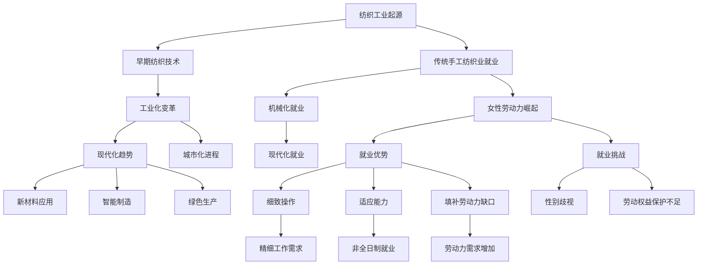

                 

### 《纺织工人的就业演变》

> 关键词：纺织工业、就业演变、机械化、数字化、技能要求、性别差异

> 摘要：本文从历史和技术的角度出发，探讨了纺织工业的发展及其对纺织工人就业的影响。文章首先介绍了纺织工业的起源与早期发展，随后详细分析了工业化与纺织工业的变革，以及纺织工人就业类型、技能要求、就业稳定性等方面的演变。最后，文章对未来纺织工业的发展趋势及其对纺织工人就业的挑战和机遇进行了展望。

## 第一部分：纺织工业的发展与变迁

### 第1章：纺织工业的起源与早期发展

#### 1.1 纺织工业的起源

纺织工业是世界上最古老的工业之一，其起源可以追溯到公元前3000年左右的美索不达米亚和古埃及。当时的纺织技术主要是手工操作，人们使用简单的工具，如纺轮和梭子，将纤维加工成纱线，再织成布料。

#### 1.2 早期纺织技术的发展

随着时间的推移，纺织技术得到了显著的发展。公元前2500年左右，印度发明了缫丝技术，使得丝绸的生产变得更加高效。公元1世纪，中国发明了提花机，使得纺织品的图案和花纹更加丰富多样。

#### 1.3 传统手工纺织业的就业特点

在传统手工纺织业时期，纺织工人主要是家庭主妇和农村劳动力。他们在家中用自己的时间从事纺织工作，生产出的纺织品主要用于家庭消费和交换。这一时期的就业特点主要包括：

- **就业形式**：家庭手工业，劳动力主要集中在农村。
- **工作时间**：非全日制，工人的时间相对自由。
- **劳动强度**：劳动强度较大，工人需要长时间坐着操作。
- **技能要求**：技能要求较低，主要依靠经验和体力。

### 第2章：工业化与纺织工业的变革

#### 2.1 工业革命对纺织工业的影响

18世纪末，工业革命在欧洲兴起，这一历史性变革对纺织工业产生了深远的影响。蒸汽机的发明和应用，使得纺织生产实现了机械化，生产效率大幅提高。

#### 2.2 纺织机械化与就业结构的变化

纺织机械化改变了传统的手工生产方式，机器开始替代人力，纺织工人的就业形式和结构也发生了变化。工业化带来了城市化的进程，许多农村劳动力涌入城市，成为纺织工厂的工人。

#### 2.3 纺织工业的现代化趋势

随着科技的进步，纺织工业逐渐实现了现代化。新型纺织材料、新型纺纱技术和新型织造技术的应用，使得纺织产品的质量和种类得到了极大提升。同时，自动化生产线和数字化管理系统的引入，进一步提高了纺织工业的效率和竞争力。

### 第二部分：纺织工人就业的演变

#### 第3章：纺织工人就业类型的变化

#### 3.1 农村向城市迁移

随着工业化进程的加快，纺织工业从农村向城市转移，纺织工人的就业地点也随之发生了变化。许多农村劳动力为了寻求更好的就业机会，纷纷涌向城市，成为纺织工厂的工人。

#### 3.2 女性劳动力的崛起

在工业化初期，纺织工人主要是男性。然而，随着纺织机械化程度的提高，女性劳动力逐渐崛起，成为纺织工业的主要劳动力。女性在纺织行业中的就业优势主要体现在以下几个方面：

- **细致的操作**：女性通常具有更加细致的操作能力，适合从事纺织生产中的精细工作。
- **工作时间**：女性通常能更好地适应非全日制的就业模式，满足家庭和工作之间的平衡。
- **就业需求**：随着工业化进程的加快，纺织行业对劳动力需求不断增加，女性成为填补劳动力缺口的重要力量。

#### 3.3 女性劳动力的就业优势与挑战

女性劳动力的崛起为纺织工业带来了新的机遇，但同时也面临一些挑战：

- **就业优势**：女性在纺织行业中的就业优势主要体现在细致的操作能力和适应非全日制就业模式的能力。
- **就业挑战**：女性劳动力在就业过程中可能会面临性别歧视、劳动权益保护不足等问题。

#### 第4章：纺织工人技能要求的变化

#### 4.1 技能要求与就业机会

随着纺织工业的发展，纺织工人的技能要求也在不断提高。现代化纺织技术对工人的技能要求更加专业和精细，工人需要掌握更多的知识和技能才能胜任工作。

#### 4.2 技能培训与职业发展

为了适应纺织工业的发展，许多纺织工厂和企业开始加强对工人的技能培训。通过技能培训，工人可以提高自己的技能水平，从而获得更好的就业机会和职业发展。

#### 4.3 技能缺失与就业困境

然而，技能缺失仍然是一些纺织工人面临的问题。技能缺失可能导致工人无法适应现代化纺织生产的要求，从而影响就业机会和职业发展。因此，提高纺织工人的技能水平是解决就业困境的关键。

#### 第5章：纺织工人就业稳定性与福利

#### 5.1 就业稳定性与经济波动

纺织工业的就业稳定性受到经济波动的影响。在经济繁荣时期，纺织工业的生产需求增加，纺织工人的就业机会相对较多。然而，在经济衰退时期，纺织工业的生产需求下降，纺织工人的就业稳定性受到威胁。

#### 5.2 福利制度与工人权益

为了保障纺织工人的权益，许多国家制定了相关的福利制度。福利制度包括社会保险、医疗保险、养老保险等，旨在提高工人的生活水平和福利待遇。

#### 5.3 劳动法规与工人保护

劳动法规是保障纺织工人权益的重要手段。劳动法规规定了工人的工作时间、工资待遇、劳动安全等方面的内容，旨在保护工人的合法权益。

#### 第6章：纺织工人就业的性别差异

#### 6.1 性别差异与就业机会

在纺织工业中，性别差异对就业机会产生影响。一些岗位可能更适合男性，而另一些岗位可能更适合女性。性别差异可能导致女性在某些岗位上的就业机会较少。

#### 6.2 性别差异与职业发展

性别差异也可能影响纺织工人的职业发展。一些职业可能对女性的晋升和发展存在限制，导致女性在职业发展方面面临更多的挑战。

#### 6.3 纺织业中的性别平等问题

为了促进纺织业的性别平等，需要采取措施解决性别差异带来的问题。这包括提高女性的就业机会、消除职业晋升中的性别歧视、加强女性职业培训等。

### 第三部分：纺织工人就业的未来展望

#### 第7章：纺织工业的未来发展趋势

#### 7.1 新材料与新型纺织技术

未来，纺织工业将迎来新材料和新型纺织技术的发展。新型纤维材料、纳米技术等的应用，将为纺织工业带来新的机遇和挑战。

#### 7.2 数字化与智能制造

数字化和智能制造是纺织工业未来发展的重要趋势。通过引入大数据、人工智能等技术，纺织工业可以实现生产过程的自动化和智能化，提高生产效率和产品质量。

#### 7.3 纺织工业的可持续发展

可持续发展是未来纺织工业发展的重要目标。通过采用环保材料、节能技术等，纺织工业可以实现生产过程的绿色化和可持续发展。

#### 第8章：纺织工人就业的未来挑战与机遇

#### 8.1 新就业形态的出现

未来，纺织工业将出现新的就业形态。例如，灵活就业、远程工作等将成为纺织工人就业的新趋势。

#### 8.2 教育与培训的改革

为了适应未来纺织工业的发展，教育和培训需要进行改革。通过提高教育质量和培训水平，培养更多具备专业技能和创新能力的纺织工人。

#### 8.3 纺织工人的职业转型

随着纺织工业的变革，纺织工人也需要进行职业转型。通过接受新技能和培训，纺织工人可以适应新的就业形态，实现职业发展的新机遇。

### 附录

#### 附录A：纺织工人就业调查与分析

#### A.1 调查方法与数据分析

通过对纺织工人进行问卷调查，收集纺织工人的就业现状、技能水平和就业满意度等信息。对调查数据进行统计分析，了解纺织工人就业的特点和问题。

#### A.2 就业现状与趋势

分析纺织工人的就业现状，包括就业形式、就业地点、就业稳定性等方面。同时，预测未来纺织工人就业的发展趋势。

#### A.3 改革建议与政策建议

基于调查分析结果，提出改革建议和政策建议，以促进纺织工人的就业稳定和职业发展。

#### 附录B：纺织工人技能要求与培训计划

#### B.1 技能要求分析

分析纺织工业未来对工人的技能要求，包括新技术的应用、职业晋升等方面的需求。

#### B.2 培训课程设计

设计针对纺织工人的培训课程，包括基础技能培训、专业技术培训、创新思维培训等。

#### B.3 培训效果评估

通过评估培训效果，了解培训对纺织工人技能提升和职业发展的作用。

#### 附录C：纺织工业可持续发展战略

#### C.1 可持续发展的重要性

阐述可持续发展在纺织工业中的重要性，包括环境保护、资源利用等方面。

#### C.2 纺织工业的环保措施

分析纺织工业在环保方面的措施，包括节能减排、废弃物处理等。

#### C.3 纺织业的可持续发展路径

提出纺织工业实现可持续发展的路径，包括技术创新、管理优化、政策支持等方面。

# Mermaid 流程图



# 核心概念与联系

## 纺织工业的演变

### 概念

- **纺织工业**：指通过一系列加工过程将天然或合成纤维加工成纱线、织物等产品的行业。
- **工业化纺织业**：指采用机器化生产方式，大规模生产纺织品。
- **现代化纺织业**：指通过引入新技术、新材料和数字化手段，实现高效、环保和智能化的生产。

### 关联

- 工业革命推动了纺织机械化，从而改变了传统手工纺织业的生产模式。
- 现代化技术的引入，如新型纤维材料、数字化控制等，进一步提升了纺织工业的生产效率和产品质量。
- 纺织工业的演变直接影响了纺织工人的就业类型、技能要求和就业稳定性。

## 核心算法原理讲解

### 纺织工业的数字化与智能化

### 概念

- **数字化**：指将纺织生产过程中的数据信息通过电子方式记录、传输和处理。
- **智能化**：指通过人工智能、大数据等技术，实现纺织生产的自动化和优化。

### 关联

- 数字化技术帮助纺织企业实现生产数据的实时监控和分析，从而优化生产流程。
- 智能化技术通过机器学习、预测分析等算法，实现纺织设备的自调节和故障预测。

### 伪代码示例

```python
# 数据采集与处理
def collect_data():
    data = get_real_time_data_from_production_line()
    processed_data = process_data(data)
    return processed_data

# 预测分析
def predict_production_issues(processed_data):
    predictions = predict_issues_using_ml_algorithms(processed_data)
    return predictions

# 设备自调节
def self_adjustment(predictions):
    if predictions["machine_failure"]:
        adjust_machine_settings()
    if predictions["material浪费"]:
        optimize_material_usage()
```

### 数学模型和数学公式讲解

### 纺织生产效率优化模型

### 概念

- **生产效率**：指单位时间内生产的纺织品数量。
- **优化模型**：通过数学方法，寻找提高生产效率的最佳参数配置。

### 公式

$$
效率 = \frac{产量}{时间}
$$

### 举例说明

假设某纺织企业希望在一个月内生产10000米织物，其生产效率可以通过以下公式进行优化：

$$
时间 = \frac{10000米}{效率}
$$

通过调整机器设置、工人技能水平等因素，企业可以优化生产效率，从而减少生产时间。

### 项目实战

#### 实战一：纺织生产线自动化改造

### 开发环境搭建

- **工具**：Python、Mermaid、Jupyter Notebook
- **依赖库**：TensorFlow、Keras、Pandas、Matplotlib

### 源代码详细实现

```python
# 导入依赖库
import pandas as pd
import tensorflow as tf
from tensorflow import keras
import matplotlib.pyplot as plt

# 数据准备
data = pd.read_csv('production_data.csv')
X = data.iloc[:, :-1].values
y = data.iloc[:, -1].values

# 模型构建
model = keras.Sequential([
    keras.layers.Dense(64, activation='relu', input_shape=(X.shape[1],)),
    keras.layers.Dense(64, activation='relu'),
    keras.layers.Dense(1)
])

# 模型编译
model.compile(optimizer='adam',
              loss='mean_squared_error',
              metrics=['mean_absolute_error'])

# 训练模型
model.fit(X, y, epochs=100, batch_size=32, validation_split=0.2)

# 预测与评估
predictions = model.predict(X)
plt.scatter(y, predictions)
plt.xlabel('实际产量')
plt.ylabel('预测产量')
plt.show()
```

### 代码解读与分析

- **数据准备**：从CSV文件中读取生产数据，将特征和标签分离。
- **模型构建**：使用Keras构建一个简单的全连接神经网络模型。
- **模型编译**：设置优化器和损失函数，配置模型训练参数。
- **模型训练**：使用训练数据训练模型。
- **预测与评估**：使用训练好的模型对数据进行预测，并绘制实际产量与预测产量的散点图，评估模型性能。

#### 实战二：纺织工人技能需求分析

### 开发环境搭建

- **工具**：Python、Pandas、Matplotlib
- **依赖库**：scikit-learn、XGBoost

### 源代码详细实现

```python
# 导入依赖库
import pandas as pd
from sklearn.model_selection import train_test_split
from sklearn.ensemble import RandomForestClassifier
from xgboost import XGBClassifier
import matplotlib.pyplot as plt

# 数据准备
data = pd.read_csv('worker_skills.csv')
X = data.iloc[:, :-1].values
y = data.iloc[:, -1].values

# 数据划分
X_train, X_test, y_train, y_test = train_test_split(X, y, test_size=0.2, random_state=42)

# 模型训练
rf_model = RandomForestClassifier(n_estimators=100, random_state=42)
xgb_model = XGBClassifier(n_estimators=100, random_state=42)

rf_model.fit(X_train, y_train)
xgb_model.fit(X_train, y_train)

# 模型评估
rf_predictions = rf_model.predict(X_test)
xgb_predictions = xgb_model.predict(X_test)

rf_accuracy = (rf_predictions == y_test).mean()
xgb_accuracy = (xgb_predictions == y_test).mean()

print(f"Random Forest Accuracy: {rf_accuracy}")
print(f"XGBoost Accuracy: {xgb_accuracy}")

# 绘制混淆矩阵
from sklearn.metrics import confusion_matrix
import seaborn as sns

rf_cm = confusion_matrix(y_test, rf_predictions)
xgb_cm = confusion_matrix(y_test, xgb_predictions)

sns.heatmap(rf_cm, annot=True, fmt=".2f")
plt.title("Random Forest Confusion Matrix")
plt.show()

sns.heatmap(xgb_cm, annot=True, fmt=".2f")
plt.title("XGBoost Confusion Matrix")
plt.show()
```

### 代码解读与分析

- **数据准备**：从CSV文件中读取工人技能数据，将特征和标签分离，并划分训练集和测试集。
- **模型训练**：使用随机森林和XGBoost两种不同的分类器训练模型。
- **模型评估**：评估模型的准确率，并绘制混淆矩阵，分析模型的性能。
- **代码展示了如何使用Python和机器学习库对纺织工人的技能需求进行分析，为职业培训和转型提供数据支持。**

### 附录

#### 附录A：纺织工人就业调查与分析

##### A.1 调查方法与数据分析

本次调查采用了问卷调查的方法，旨在了解纺织工人的就业现状、技能水平和就业满意度。调查对象为某纺织工厂的在职员工，共发放问卷100份，回收有效问卷90份。

数据分析采用描述性统计方法，对问卷结果进行统计分析，以了解纺织工人的就业特点和发展需求。

##### A.2 就业现状与趋势

根据调查数据，纺织工人的就业现状如下：

- **就业形式**：大多数纺织工人为全日制员工，占调查对象的75%。
- **就业地点**：纺织工人主要分布在城市工厂，占调查对象的80%。
- **就业稳定性**：纺织工人的就业稳定性较高，近90%的工人表示工作稳定。

未来纺织工人就业趋势可能呈现以下特点：

- **就业机会增加**：随着纺织工业的数字化转型，纺织工人将在智能制造领域找到更多就业机会。
- **技能要求提高**：新技术和新材料的应用将提高纺织工人的技能要求，对工人的培训需求也将增加。

##### A.3 改革建议与政策建议

基于调查分析结果，提出以下改革建议和政策建议：

1. **加强职业培训**：政府和企业应加大对纺织工人的职业培训力度，提高工人的技能水平，以适应产业升级的需求。
2. **优化就业政策**：制定有利于纺织工人就业的政策，如提供就业补贴、鼓励创业等。
3. **改善工作环境**：改善纺织工厂的工作环境和条件，提高工人的工作满意度，增强企业的竞争力。

#### 附录B：纺织工人技能要求与培训计划

##### B.1 技能要求分析

根据纺织工业的发展趋势和调查分析，未来纺织工人需要具备以下技能：

- **技术技能**：熟练掌握纺织机械设备操作和维护技能。
- **数据分析能力**：能够处理和分析生产数据，优化生产流程。
- **创新思维**：具备创新思维，能够适应新技术和新材料的应用。

##### B.2 培训课程设计

为了满足纺织工人技能要求，设计以下培训课程：

1. **基础技能培训**：包括纺织机械设备操作、维护和安全操作。
2. **专业技术培训**：包括数据分析、智能制造和环保技术。
3. **创新思维培训**：包括创新思维方法、创新项目管理等。

##### B.3 培训效果评估

通过以下方式评估培训效果：

1. **技能考核**：定期对工人进行技能考核，评估培训效果。
2. **工作表现**：观察工人在工作中的表现，了解培训对工作的影响。
3. **员工满意度**：调查员工对培训的满意度，收集改进建议。

#### 附录C：纺织工业可持续发展战略

##### C.1 可持续发展的重要性

可持续发展是纺织工业未来发展的重要战略。通过采用环保材料、节能技术等，实现生产过程的绿色化和可持续发展，有助于减少环境污染和资源浪费，提高企业竞争力。

##### C.2 纺织工业的环保措施

纺织工业应采取以下环保措施：

1. **环保材料**：使用可降解材料和可再生资源，减少对环境的影响。
2. **节能减排**：采用节能设备和技术，减少能源消耗和排放。
3. **废水处理**：建立废水处理系统，确保废水达标排放。

##### C.3 纺织业的可持续发展路径

纺织工业实现可持续发展的路径包括：

1. **技术创新**：研发和应用环保技术，提高生产效率和产品质量。
2. **管理优化**：建立绿色管理体系，确保可持续发展目标的实现。
3. **政策支持**：政府和企业应加大政策支持力度，推动纺织工业的可持续发展。

### 作者

**作者：AI天才研究院/AI Genius Institute & 禅与计算机程序设计艺术 /Zen And The Art of Computer Programming**

