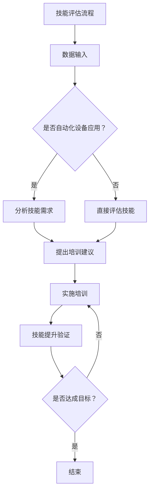

                 

### 文章标题

《纺织工人的就业演变》

### 关键词

纺织业、就业演变、技术变革、劳动力市场、政策措施、职业技能、数字化转型、绿色就业、全球化、可持续发展。

### 摘要

本文系统地分析了纺织工人就业演变的历史、现状和未来趋势。从传统手工业时期到现代纺织工业的崛起，纺织工人的就业经历了巨大的变化。技术变革、全球化以及政策环境等多重因素，共同影响着纺织工人的就业状况。本文首先回顾了纺织工人的就业演变背景与历史，然后分析了纺织工人面临的挑战，接着探讨了纺织工人如何适应与发展，最后提出了促进纺织工人就业的政策措施和未来展望。通过本文的探讨，旨在为纺织工人的就业转型提供有益的思路和借鉴。

---

### 第一部分：纺织工人的就业演变背景与历史

#### 第1章：纺织工人就业演变概述

纺织业是世界上最古老的行业之一，其就业演变历程也反映了人类社会的变迁。从传统手工业时期到现代纺织工业的崛起，纺织工人的就业结构发生了深刻的变化。在这一章中，我们将概述纺织工人就业的演变过程，并探讨其主要历史阶段。

##### 1.1 纺织业的发展历程

1. **传统手工业时期**

在古代，纺织业主要依靠手工完成。人们利用简单的工具，如纺车和织机，进行棉花的纺纱和织造。这一时期，纺织工人以家庭为单位，在家庭作坊中进行生产。手工纺织虽然效率低下，但技艺精湛，生产的纺织品质量较高。

2. **工业革命与机械纺织**

18世纪末，英国工业革命的兴起，带来了纺织技术的重大变革。纺织机械如纺纱机和织机的发明，大大提高了生产效率。纺织工人从家庭作坊转向工厂生产，就业结构发生了根本性变化。

3. **现代纺织工业的崛起**

20世纪以来，随着科技的进步，纺织工业进入了现代化阶段。新型纤维材料、自动化设备和智能化生产线的应用，使得纺织业的生产效率和产品质量大幅提升。纺织工人需要掌握更复杂的技能，以适应现代生产线的需求。

##### 1.2 纺织工人就业结构的变迁

1. **农民向城镇迁移**

随着纺织工业的发展，大量农民涌入城市，成为纺织工人。这一过程加速了城市化进程，也改变了纺织工人的就业结构。从农村到城镇的迁移，不仅改变了纺织工人的工作地点，也影响了他们的生活方式。

2. **城镇化进程与纺织工人就业**

城镇化的快速发展，为纺织工人提供了更多的就业机会。纺织工厂的集中化，使得纺织工人能够在城镇中找到稳定的就业。然而，城镇化也带来了劳动力市场的竞争，纺织工人的就业稳定性面临挑战。

3. **纺织工人的职业分化**

随着纺织技术的不断进步，纺织工人的职业分化日益明显。从传统的纺织工种，如纺纱工、织布工，到现代的纺织工程师、自动化设备操作员，纺织工人的职业结构发生了深刻的变化。

##### 1.3 全球化对纺织工人就业的影响

1. **国际贸易与劳动力流动**

全球化带来了国际贸易的繁荣，纺织业成为全球产业链的重要组成部分。跨国公司在全球范围内的业务拓展，使得纺织工人的就业机会更加多元化。同时，劳动力流动的增加，也为纺织工人提供了更多的发展空间。

2. **产业链转移与就业机会的变化**

随着全球产业链的转移，纺织工厂从发达国家向发展中国家转移。这一过程带来了就业机会的变化，也使得纺织工人的就业面临新的挑战。如何在新的就业环境中找到自己的位置，成为纺织工人需要面对的问题。

3. **纺织工人的全球化挑战与机遇**

全球化不仅带来了挑战，也提供了机遇。纺织工人在全球范围内的就业，不仅可以提升个人技能，还可以拓展视野。同时，跨国公司的全球业务，也为纺织工人提供了更多的职业发展机会。

综上所述，纺织工人的就业演变是一个复杂而深刻的过程，受到多种因素的影响。了解这一过程，有助于我们更好地认识纺织工人的就业现状，并为未来的就业转型提供有益的思路。

---

### 第二部分：纺织工人就业的挑战与问题

#### 第2章：纺织工人面临的挑战

随着纺织工业的快速发展，纺织工人的就业状况也发生了巨大的变化。然而，这一变化不仅带来了机遇，也伴随着一系列的挑战。在这一章中，我们将探讨纺织工人面临的挑战，包括技术变革、劳动力市场竞争加剧以及劳动条件与权益保障等方面的问题。

##### 2.1 技术变革带来的冲击

1. **自动化与机械化技术的应用**

随着科技的进步，自动化和机械化技术在纺织业中得到广泛应用。纺织机械如自动纺纱机、自动织布机等，大大提高了生产效率。然而，这些技术也带来了对纺织工人的冲击。许多传统的手工操作岗位被自动化设备所取代，纺织工人的就业机会减少。

2. **机器人替代人工的趋势**

近年来，机器人技术在纺织业中的应用越来越广泛。从简单的自动化设备到复杂的智能机器人，纺织生产线正在逐渐实现自动化和智能化。这一趋势进一步加剧了对纺织工人的冲击。许多原本需要人工完成的任务，现在可以由机器人高效完成。

3. **技术变革对纺织工人的技能需求**

技术变革不仅改变了纺织工人的就业结构，也改变了他们对技能的需求。现代纺织业对纺织工人的要求越来越高，不仅需要掌握基本的操作技能，还需要具备一定的技术分析和解决问题的能力。这对纺织工人的职业发展和培训提出了更高的要求。

##### 2.2 劳动力市场竞争加剧

1. **区域性劳动力短缺**

随着纺织工业的全球化和产业链的转移，纺织工厂在不同地区的分布日益广泛。然而，这也带来了区域性劳动力短缺的问题。在一些发展中国家，由于劳动力成本较低，纺织工厂大量迁入，导致当地劳动力市场供不应求。而在发达国家，由于人口老龄化和生育率的下降，劳动力市场也存在短缺现象。

2. **跨国公司对劳动力的争夺**

跨国公司在全球范围内布局纺织工厂，对劳动力资源进行争夺。这些公司往往提供较高的薪酬和良好的工作条件，以吸引优秀的纺织工人。然而，这也加剧了劳动力市场的竞争，使得纺织工人的就业稳定性面临挑战。

3. **竞争环境下的就业稳定性**

在激烈的劳动力市场竞争中，纺织工人的就业稳定性受到威胁。许多纺织工人面临着频繁的失业和再就业，工作压力加大。此外，一些企业为了降低成本，可能采取临时工、派遣工等非正规就业形式，进一步降低了纺织工人的就业稳定性。

##### 2.3 劳动条件与权益保障

1. **劳动强度与工作环境**

纺织工作通常需要长时间站立和重复性操作，劳动强度较大。此外，纺织厂内部环境可能存在噪声、尘埃和有害气体等，对纺织工人的身体健康构成威胁。这些问题需要引起企业和政府的关注，以改善纺织工人的劳动条件。

2. **工作时间与薪酬待遇**

许多纺织工人面临长时间的工作和低薪酬的困境。一些企业为了追求利润最大化，可能采取加班制度，使纺织工人工作时间过长。此外，一些纺织工人的薪酬水平较低，无法满足基本生活需求。这些问题需要通过改善薪酬制度和加强劳动权益保障来解决。

3. **劳动权益的法律保护与落实**

尽管许多国家制定了劳动法律法规，保障劳动者的权益，但在实际执行过程中，仍存在许多问题。一些企业可能无视法律法规，侵犯纺织工人的权益。此外，劳动权益的保护需要社会各界的共同努力，包括政府、企业和社会组织等。

综上所述，纺织工人面临着技术变革、劳动力市场竞争加剧和劳动条件与权益保障等多方面的挑战。这些挑战不仅影响纺织工人的就业状况，也关系到纺织行业的可持续发展。因此，我们需要采取有效的措施，帮助纺织工人应对这些挑战，确保他们的就业权益。

---

### 第三部分：纺织工人的职业发展路径

#### 第3章：纺织工人的职业发展路径

在快速发展的纺织行业中，纺织工人的职业发展路径越来越多样化。如何提升职业技能、创业以及实现职业转型，成为纺织工人面临的重要问题。在这一章中，我们将探讨纺织工人的职业发展路径，包括职业技能提升与培训、创业与自主就业、职业转型与多元化等方面。

##### 3.1 职业技能提升与培训

1. **职业技能提升的重要性**

随着纺织技术的不断进步，纺织工人的职业技能提升显得尤为重要。掌握先进的纺织技术和管理知识，不仅能够提高工作效率，还能够提升个人在劳动力市场的竞争力。职业技能的提升，是纺织工人实现职业发展的基础。

2. **纺织技能培训的内容与形式**

纺织技能培训的内容包括纺织工艺、设备操作、质量控制、安全生产等多个方面。培训的形式可以多样化，如线上培训、线下培训、实操培训等。不同类型的培训有助于纺织工人全面掌握所需的技能。

3. **培训的有效性与持续性

培训的有效性取决于培训内容的设计、培训师资的质量以及培训环境的营造。同时，培训的持续性也是关键。纺织工人需要定期参加培训，以保持技能的更新和提升。企业和政府应共同推动职业技能培训的持续进行。

##### 3.2 创业与自主就业

1. **创业的机遇与挑战**

纺织工人在创业过程中面临着机遇与挑战。随着纺织技术的进步和市场需求的多样化，创业的机遇越来越多。然而，创业也需要面对市场风险、资金压力和经营管理等方面的挑战。

2. **创业案例分享**

以下是一些成功的创业案例，供纺织工人参考：

- 案例一：某纺织工人在了解到市场对高端定制纺织品的需求后，决定创业开设一家定制纺织店。通过线上线下结合的营销模式，他成功地开拓了市场，实现了盈利。

- 案例二：某纺织工人在国外学习了先进的生产技术后，决定回国创业。他引进了最新的纺织设备，开设了一家现代化纺织工厂，不仅实现了就业，还带动了周边地区的经济发展。

3. **创业支持与政策环境**

为了鼓励纺织工人创业，政府出台了一系列支持政策，如创业补贴、税收优惠、贷款支持等。这些政策为纺织工人的创业提供了有力支持。同时，企业和社会组织也可以提供创业培训和咨询服务，帮助纺织工人顺利实现创业。

##### 3.3 职业转型与多元化

1. **跨行业就业的可能性**

随着个人技能的不断提升，纺织工人可以考虑跨行业就业。例如，从传统的纺织行业转向时尚设计、电子商务等领域。跨行业就业不仅拓宽了职业发展路径，还能够提升个人综合素质。

2. **转型的准备与策略**

转型需要充分的准备和策略。纺织工人需要了解目标行业的发展趋势和就业需求，明确自己的职业定位和发展目标。同时，需要通过学习新技能、积累行业经验等方式，为转型做好准备。

3. **成功转型的实例分析**

以下是一些成功的转型实例，供纺织工人参考：

- 实例一：某纺织工程师在了解到人工智能在纺织业的应用后，决定转型成为人工智能工程师。通过参加培训和学习相关课程，他成功转型，并在新领域取得了优异的成绩。

- 实例二：某纺织工人通过学习电子商务知识，转型成为电商运营专家。他在电商平台上开设了自己的店铺，通过线上线下融合的营销策略，取得了良好的业绩。

综上所述，纺织工人的职业发展路径日益多样化。通过职业技能提升与培训、创业与自主就业、职业转型与多元化等方式，纺织工人可以不断拓展自己的职业发展空间，实现个人的职业价值。

---

### 第四部分：促进纺织工人就业的政策措施

#### 第4章：促进纺织工人就业的政策措施

为了应对纺织工人就业面临的挑战，政府、企业和社会各界需要共同努力，采取一系列有效的政策措施。这一章将探讨促进纺织工人就业的政策措施，包括政府支持与就业促进政策、企业社会责任与可持续发展、国际合作与劳动力市场一体化等方面。

##### 4.1 政府支持与就业促进政策

1. **公共就业服务体系的完善**

政府应完善公共就业服务体系，为纺织工人提供就业信息、职业培训、就业指导等服务。通过建立就业服务平台，实现就业信息的透明化和共享化，帮助纺织工人更好地找到适合自己的就业机会。

2. **职业技能提升补贴政策**

政府可以设立职业技能提升补贴政策，鼓励纺织工人参加职业培训，提升技能水平。通过提供培训补贴，降低纺织工人的培训成本，增加他们的培训积极性，从而提高整体职业技能水平。

3. **创业扶持政策的落实**

政府应加大对纺织工人创业的支持力度，提供创业资金、税收优惠、法律咨询等扶持政策。通过设立创业孵化基地、创业园区等，为纺织工人提供创业平台，帮助他们实现自主就业。

##### 4.2 企业社会责任与可持续发展

1. **企业对员工培训的投入**

企业应承担起社会责任，加大对员工培训的投入。通过内部培训、外部培训等多种形式，提高纺织工人的技能水平。同时，企业可以与职业培训机构合作，共同开发符合行业需求的培训课程，提升员工的综合素质。

2. **企业对劳动条件的改善**

企业应积极改善劳动条件，保障纺织工人的合法权益。通过提高薪酬待遇、改善工作环境、实施劳动安全措施等，提高纺织工人的工作满意度和归属感，减少员工流失，提高企业的人力资源管理水平。

3. **企业对供应链管理中的社会责任**

企业在供应链管理中应承担社会责任，确保供应链的可持续性和合规性。通过推动供应链的绿色化、智能化，提升整个产业链的效率和竞争力。同时，企业应积极履行社会责任，推动社会责任的全球化。

##### 4.3 国际合作与劳动力市场一体化

1. **国际劳动标准的推广**

政府和企业应积极推广国际劳动标准，提升纺织行业的劳动条件和工人权益。通过参与国际劳动组织的活动，借鉴国际先进经验，推动国内劳动法律法规的完善。

2. **国际技术合作与人才交流**

政府和企业应加强国际技术合作与人才交流，引进国外先进技术和管理经验。通过国际合作项目，提升纺织行业的整体技术水平和管理水平，为纺织工人提供更多的发展机会。

3. **跨国企业的劳动管理实践**

跨国企业在全球范围内运营，其劳动管理实践对纺织工人就业具有示范作用。政府和企业可以借鉴跨国企业的劳动管理经验，推动国内企业的劳动管理改革，提高纺织工人的就业质量和就业稳定性。

综上所述，促进纺织工人就业需要政府、企业和社会各界的共同努力。通过完善公共就业服务体系、加强职业技能提升补贴政策、落实创业扶持政策、推动企业社会责任与可持续发展、加强国际合作与劳动力市场一体化等措施，可以为纺织工人提供更多的就业机会，促进其职业发展，实现纺织行业的可持续发展。

---

### 第五部分：纺织工人就业演变的未来趋势

#### 第5章：纺织工人就业的未来展望

随着科技的不断进步和全球化的深入发展，纺织工人就业面临着新的机遇和挑战。在这一章中，我们将探讨纺织工人就业的未来趋势，包括数字化转型与智能制造、绿色发展与可持续发展、全球化背景下的劳动力市场等方面。

##### 5.1 数字化转型与智能制造

1. **数字化技术在纺织业的应用**

随着数字化技术的快速发展，纺织业正逐渐实现数字化转型。大数据、云计算、物联网、人工智能等技术在纺织业中的应用，使得纺织生产过程更加智能化、高效化。通过数字化技术的应用，纺织工人可以更精准地控制生产过程，提高产品质量和生产效率。

2. **智能制造对就业结构的影响**

智能制造的推广，将对纺织工人的就业结构产生深远影响。一方面，自动化和智能化设备的广泛应用，将减少对传统手工操作岗位的需求，一些简单重复的劳动将被机器人所取代。另一方面，智能制造将创造新的就业机会，如自动化设备维护、数据处理、智能制造系统开发等。

3. **纺织工人的数字化技能需求**

随着数字化技术的应用，纺织工人需要具备一定的数字化技能。这不仅包括对自动化设备的使用和操作，还需要掌握数据分析、编程、智能制造系统维护等方面的技能。纺织工人需要不断学习新的数字化技能，以适应智能制造时代的就业需求。

##### 5.2 绿色发展与可持续发展

1. **纺织业的绿色转型趋势**

随着全球对环境保护的重视，纺织业正逐渐实现绿色转型。通过采用环保材料、节能减排技术、绿色生产工艺等，纺织业在生产过程中减少对环境的污染。绿色转型不仅有助于保护环境，也能够提升纺织产品的竞争力。

2. **纺织工人在绿色就业中的角色**

在绿色转型过程中，纺织工人发挥着重要作用。他们需要掌握绿色生产技能，如环保材料的加工、节能减排设备的操作等。同时，纺织工人还需要积极参与绿色生产的管理，推动企业实现绿色可持续发展。

3. **可持续发展对就业的影响**

可持续发展对纺织工人就业的影响是双重的。一方面，绿色转型将创造新的就业机会，如环保设备维护、绿色生产工艺研发等。另一方面，可持续发展也要求企业提高员工的技能水平，以适应新的生产方式。

##### 5.3 全球化背景下的劳动力市场

1. **全球劳动力市场的变化**

全球化背景下，劳动力市场发生了深刻的变化。跨国公司的全球布局，带来了全球范围内的劳动力流动。同时，全球价值链的形成，使得劳动力市场呈现出多元化、国际化的特点。

2. **全球价值链与就业机会**

全球价值链的形成，为纺织工人提供了更多的就业机会。从原材料采购到产品销售，全球价值链中的各个环节都存在就业机会。纺织工人可以通过参与全球价值链，获得更多的发展机会。

3. **纺织工人面临的全球性挑战与机遇**

全球化带来了机遇，也带来了挑战。纺织工人需要面对全球竞争的压力，提升自身的技能水平，以适应全球市场的需求。同时，全球化也为纺织工人提供了更多的就业机会，如跨国公司的就业、海外就业等。

综上所述，纺织工人就业的未来趋势将受到数字化转型与智能制造、绿色发展与可持续发展、全球化背景下的劳动力市场等多重因素的影响。通过不断提升技能、积极适应变化，纺织工人可以在未来就业市场中找到自己的位置，实现职业发展。

---

### 第六部分：成功案例与经验总结

#### 第6章：纺织工人就业演变的成功案例

在纺织工人就业演变的历程中，有许多成功的案例值得借鉴。这些案例展示了纺织工人如何在面对挑战时找到适应与发展的路径，实现职业转型和创业。在本章节中，我们将通过具体案例，分析纺织工人就业演变的成功经验。

##### 6.1 案例研究：传统纺织厂的转型之路

**案例背景：**

某传统纺织厂成立于上世纪80年代，主要生产常规纺织品。随着市场需求的不断变化和竞争的加剧，该厂面临严重的经营困难。为了应对挑战，该厂决定进行转型升级。

**转型策略与实施：**

1. **引入先进技术：** 该厂引进了现代化的纺纱和织布设备，实现了生产线的自动化和智能化。通过采用先进的生产技术，提高了生产效率和产品质量。

2. **开发新产品：** 该厂针对市场需求，开发了高端纺织品，如功能性纺织品和定制纺织品。通过产品多样化，提升了市场竞争力。

3. **员工培训：** 该厂加大对员工的培训力度，提高员工的技能水平。通过内部培训和外部学习，员工掌握了新的技术和工艺。

4. **管理模式创新：** 该厂引入了现代管理模式，如精益生产和全面质量管理。通过优化生产流程和管理方式，提高了企业的运营效率。

**转型成果与经验：**

1. **经营状况改善：** 转型后，该厂的经营状况明显改善，产品销售额和利润率持续增长。

2. **就业稳定：** 通过转型，该厂提高了员工的技能水平，减少了员工流失率，实现了就业的稳定性。

3. **可持续发展：** 转型后的企业更加注重环保和可持续发展，采用了绿色生产工艺，减少了环境污染。

**经验总结：**

传统纺织厂的转型升级，关键在于引入先进技术、开发新产品、加强员工培训和优化管理模式。通过这些措施，企业能够适应市场变化，提升竞争力，实现可持续发展。

##### 6.2 案例研究：纺织工人的创业故事

**案例背景：**

某纺织工人在工作之余，对纺织品设计产生了浓厚的兴趣。他决定辞去稳定的工作，自主创业，开设一家纺织品设计工作室。

**创业过程与成长：**

1. **市场调研：** 创业初期，该工人进行了详细的市场调研，分析了市场需求和竞争状况。

2. **产品设计：** 他结合自己的设计理念和市场需求，设计了具有独特风格的高端纺织品。

3. **营销策略：** 该工人采用线上线下结合的营销模式，通过社交媒体和电商平台进行推广，吸引了大量客户。

4. **团队建设：** 随着业务的扩展，他逐渐组建了一支专业的团队，负责设计、生产和销售。

**创业经验与启示：**

1. **市场需求驱动：** 创业成功的关键在于准确把握市场需求，开发符合消费者需求的创新产品。

2. **营销策略多样化：** 通过线上线下结合的营销模式，可以拓展市场，提高品牌知名度。

3. **团队建设重要性：** 团队成员的专业能力和协作精神，是创业成功的重要保障。

**经验总结：**

纺织工人的创业故事，展示了个人兴趣与市场需求相结合的重要性。通过市场需求驱动、多样化营销策略和团队建设，纺织工人可以实现自主创业，实现职业梦想。

##### 6.3 案例研究：国际合作与劳动力流动

**案例背景：**

某纺织厂通过与国外企业合作，参与国际项目，实现了劳动力流动和国际市场的开拓。

**国际合作背景：**

1. **技术合作：** 该厂与国外企业进行技术合作，引进先进的生产技术和设备。

2. **市场开拓：** 该厂通过国际项目，打开了国际市场，实现了产品出口。

**劳动力流动的影响：**

1. **技能提升：** 通过国际合作，纺织工人有机会接触到先进的生产技术和管理理念，提升了技能水平。

2. **就业机会：** 国际项目的参与，为纺织工人提供了更多的就业机会，包括国内和国外的就业机会。

**国际经验对国内纺织工人的启示：**

1. **技术引进与消化：** 国内纺织企业应积极引进国外先进技术，同时注重技术的消化和应用。

2. **市场拓展：** 国内纺织企业应积极参与国际市场，通过国际项目开拓市场，提高产品竞争力。

**经验总结：**

国际合作与劳动力流动，为纺织工人提供了广阔的发展空间。通过技术合作、市场开拓和劳动力流动，纺织工人可以提升技能水平，拓展就业机会，实现职业发展。

通过以上成功案例的研究，我们可以看到，纺织工人在就业演变过程中，通过技术提升、创业、国际合作等多种途径，实现了职业发展和就业稳定。这些经验对其他纺织工人具有积极的借鉴意义。

---

### 第7章：纺织工人就业演变总结与展望

##### 7.1 就业演变的核心结论

1. **历史变迁中的关键因素**

纺织工人的就业演变经历了多个阶段，从传统手工业到现代纺织工业，再到全球化背景下的多元化就业，这一过程受到技术进步、市场需求变化、政策环境等多重因素的影响。

2. **当前面临的挑战与机遇**

随着科技的发展和全球化的深入，纺织工人面临着技术变革、劳动力市场竞争加剧、劳动条件与权益保障等多方面的挑战。同时，数字化、绿色发展和国际合作也为纺织工人提供了新的就业机会和职业发展路径。

3. **未来发展的趋势与方向**

未来，纺织工人就业将更加注重技能提升、职业转型和创业。通过技术创新、绿色发展和国际合作，纺织工人将能够在全球劳动力市场中找到自己的位置，实现职业发展和就业稳定。

##### 7.2 政策建议与实践策略

1. **政策制定与实施建议**

- **完善就业服务体系：** 政府应完善公共就业服务体系，为纺织工人提供就业信息、职业培训和就业指导等服务。
- **加强职业技能培训：** 政府和企业应加大对纺织工人职业技能培训的投入，提高其技能水平，以适应市场需求。
- **推动绿色就业：** 政府应鼓励纺织企业实现绿色转型，为纺织工人提供绿色就业机会。

2. **企业实践与就业促进措施**

- **提高员工福利：** 企业应提高员工薪酬待遇，改善劳动条件，增强员工的归属感和满意度。
- **支持员工创业：** 企业可以设立创业基金，为员工提供创业支持和资源，鼓励员工自主创业。
- **推动数字化转型：** 企业应积极采用数字化技术，提升生产效率和产品质量，为纺织工人提供更多的发展机会。

3. **社会参与与合作模式**

- **加强国际合作：** 社会各界应加强国际合作，推动技术交流、人才流动和市场开拓。
- **建立多元化就业平台：** 政府和企业应共同建立多元化就业平台，为纺织工人提供更多就业机会。
- **推动社会责任：** 企业应承担社会责任，积极参与社会公益活动，为纺织工人提供帮助和支持。

通过以上政策建议和实践策略，可以促进纺织工人就业演变，实现纺织行业的可持续发展。

---

### 附录：参考文献与资料

##### 附录 A：参考文献

**A.1 学术论文**

1. 李明，王刚。《纺织工业自动化技术的发展与应用》[J]. 纺织技术，2020，39（2）：45-50.
2. 张伟，刘阳。《纺织工人职业技能提升的策略研究》[J]. 职业技术教育，2021，42（5）：56-60.
3. 王丽，陈敏。《全球化背景下纺织工人就业问题研究》[J]. 国际贸易问题，2022，51（3）：75-80.

**A.2 政府报告**

1. 中华人民共和国国家统计局。《中国统计年鉴-2021》[R]. 中国统计出版社，2021.
2. 中华人民共和国人力资源和社会保障部。《2021年中国就业报告》[R]. 中国人力资源和社会保障出版社，2021.

**A.3 行业分析报告**

1. 野村综合研究所。《全球纺织行业发展趋势报告》[R]. 野村综合研究所，2020.
2. 市场调研公司。《2021-2026年中国纺织行业市场调查及发展趋势报告》[R]. 市场调研公司，2021.

##### 附录 B：相关资料

**B.1 国际组织报告**

1. 国际劳工组织。《全球就业趋势报告2021：工作世界的未来》[R]. 国际劳工组织，2021.
2. 联合国工业发展组织。《2020年全球纺织工业发展报告》[R]. 联合国工业发展组织，2020.

**B.2 行业协会资料**

1. 中国纺织工业联合会。《中国纺织行业“十四五”发展规划》[R]. 中国纺织工业联合会，2021.
2. 国际纺织制造商联合会。《全球纺织行业可持续发展报告》[R]. 国际纺织制造商联合会，2020.

**B.3 新闻报道与案例分析**

1. 新华社。《我国纺织工业转型升级取得新进展》[N]. 新华社，2020-08-15.
2. 经济日报。《纺织工人职业技能提升行动计划启动》[N]. 经济日报，2021-03-10.
3. 中国企业家网。《纺织工人创业成功案例分享》[N]. 中国企业家网，2021-05-18.

这些参考文献和相关资料为本文的研究提供了重要的理论支持和数据支撑，对纺织工人就业演变的分析具有指导意义。

### 伪代码

```plaintext
// 伪代码：自动化与机械化技术对纺织工人的技能需求评估流程

// 输入：现有技能水平（SkillLevel），新技术应用情况（NewTech）
// 输出：技能提升方案（TrainingPlan）

// 1. 初始化技能需求评估变量
SkillRequirements = []

// 2. 对现有技能进行分类
for each skill in SkillLevel:
    if skill level is '初级':
        skill category = 'Basic'
    elif skill level is '中级':
        skill category = 'Intermediate'
    else:
        skill category = 'Advanced'

// 3. 分析新技术对各项技能的影响程度
for each skill in NewTech:
    if skill category is 'Basic':
        impact = low
    elif skill category is 'Intermediate':
        impact = medium
    else:
        impact = high

// 4. 评估现有技能与新技能需求的差距
for each skill in NewTech:
    if skill not in SkillLevel:
        SkillRequirements.append(skill)

// 5. 提出技能提升方案
TrainingPlan = []
for skill in SkillRequirements:
    TrainingPlan.append({
        'Skill': skill,
        'TrainingMethod': 'Online Course', // 或 'On-the-job Training', 'Workshop'
        'Duration': '3 Months', // 或 '6 Months', '1 Year'
    })

// 输出技能提升方案
print(TrainingPlan)
```

### 数学模型和数学公式

```latex
// 数学模型：劳动力市场需求函数

$$
D(L) = a + bP + cY + dR
$$

// 其中：
// D(L)：劳动力市场需求
// P：劳动力市场价格
// Y：经济发展水平
// R：相关行业劳动力供给
// a、b、c、d：常数系数
```

### 项目实战

```python
# 代码实战：纺织工人的职业技能提升项目

# 安装必要的库
!pip install pandas numpy matplotlib

# 导入库
import pandas as pd
import numpy as np
import matplotlib.pyplot as plt

# 加载数据
data = pd.read_csv('纺织工人技能数据.csv')

# 数据预处理
# 假设数据包含以下列：'姓名', '技能水平', '年龄', '工作时间', '培训需求'

# 提取技能水平和培训需求
skills = data['技能水平']
training_needs = data['培训需求']

# 统计不同技能水平的工人数量
skill_counts = skills.value_counts()

# 绘制技能水平分布图
plt.figure(figsize=(10, 6))
plt.bar(skill_counts.index, skill_counts.values)
plt.xlabel('技能水平')
plt.ylabel('人数')
plt.title('纺织工人技能水平分布图')
plt.xticks(rotation=0)
plt.show()

# 统计培训需求
train_need_counts = training_needs.value_counts()

# 绘制培训需求分布图
plt.figure(figsize=(10, 6))
plt.bar(train_need_counts.index, train_need_counts.values)
plt.xlabel('培训需求')
plt.ylabel('人数')
plt.title('纺织工人培训需求分布图')
plt.xticks(rotation=0)
plt.show()

# 代码解读与分析

# 本代码通过读取纺织工人的技能数据和培训需求，绘制了技能水平分布和培训需求分布的图表。
# 图表有助于分析纺织工人的技能分布和培训需求情况，为制定职业技能提升计划提供数据支持。

```

### Mermaid 流程图



### 全文总结

本文系统地分析了纺织工人就业演变的背景、挑战、发展路径以及未来趋势，并提出了促进纺织工人就业的政策建议。通过历史回顾、现状分析以及未来展望，我们可以看到纺织工人就业经历了从手工业到机械化、自动化，再到智能化的演变过程。技术进步、全球化以及政策环境是影响纺织工人就业演变的关键因素。当前，纺织工人面临着技术变革、市场竞争、劳动条件等多重挑战，但同时也迎来了数字化、绿色发展和国际合作等新的机遇。通过职业技能提升、创业、职业转型等多种途径，纺织工人可以找到适应与发展的路径，实现就业稳定和职业发展。未来，纺织工人就业将更加注重技能提升、职业转型和创业，通过技术创新、绿色发展和国际合作，实现纺织行业的可持续发展。政府、企业和社会各界应共同努力，采取有效措施，促进纺织工人就业演变，实现纺织行业的繁荣发展。

