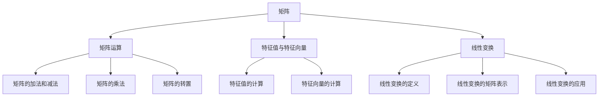
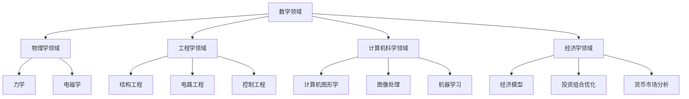

                 

# 线性代数导引：几何向量空间

> 关键词：线性代数、向量空间、几何解释、矩阵运算、线性方程组、特征值、特征向量、线性变换

> 摘要：本文深入探讨了线性代数的基本概念和几何向量空间的相关知识，通过逻辑清晰、结构紧凑的阐述，揭示了线性代数的核心算法原理和其在各个领域的广泛应用。文章旨在为广大计算机科学和工程领域的学习者提供一个系统的学习和实践指南，帮助他们更好地理解和应用线性代数的知识。

### 《线性代数导引：几何向量空间》目录大纲

#### 第一部分：线性代数基本概念

**第1章：线性代数概述**

1.1 线性代数的起源与发展

1.1.1 线性代数的起源

1.1.2 线性代数的发展历程

1.2 线性代数的基本概念

1.2.1 矩阵

1.2.2 行列式

1.2.3 向量

1.3 线性代数的应用领域

1.3.1 数学领域

1.3.2 物理学领域

1.3.3 工程学领域

#### 第二部分：线性代数的几何意义

**第2章：几何向量空间**

2.1 向量空间的概念

2.1.1 向量空间的定义

2.1.2 向量空间的基本性质

2.2 几何向量空间的几何解释

2.2.1 向量空间的几何表示

2.2.2 几何向量空间的基本运算

2.3 几何向量空间的子空间

2.3.1 子空间的定义

2.3.2 子空间的基本性质

2.3.3 子空间的几何解释

2.4 几何向量空间的基与坐标

2.4.1 基的概念

2.4.2 坐标的概念

2.4.3 基与坐标的关系

#### 第三部分：线性代数的核心算法

**第3章：矩阵运算**

3.1 矩阵的基本运算

3.1.1 矩阵的加法和减法

3.1.2 矩阵的乘法

3.1.3 矩阵的转置

3.2 矩阵的特殊运算

3.2.1 迹运算

3.2.2 谱运算

3.2.3 逆矩阵运算

3.3 矩阵的分解

3.3.1 行列式分解

3.3.2 胡尔维茨定理

3.3.3 卢恩斯代数分解

#### 第四部分：线性方程组求解

**第4章：线性方程组**

4.1 线性方程组的基本概念

4.1.1 线性方程组的定义

4.1.2 线性方程组的基本性质

4.2 线性方程组的求解方法

4.2.1 高斯消元法

4.2.2 迪卡尔法则

4.2.3 迭代法

4.3 线性方程组的解的几何解释

4.3.1 解的集合的几何表示

4.3.2 解的集合的直观理解

#### 第五部分：特征值与特征向量

**第5章：特征值与特征向量**

5.1 特征值与特征向量的定义

5.1.1 特征值的概念

5.1.2 特征向量的概念

5.2 特征值与特征向量的性质

5.2.1 特征值的基本性质

5.2.2 特征向量的基本性质

5.3 特征值与特征向量的计算

5.3.1 特征值的计算方法

5.3.2 特征向量的计算方法

#### 第六部分：线性变换

**第6章：线性变换**

6.1 线性变换的基本概念

6.1.1 线性变换的定义

6.1.2 线性变换的基本性质

6.2 线性变换的矩阵表示

6.2.1 矩阵与线性变换的关系

6.2.2 矩阵运算与线性变换的对应

6.3 线性变换的应用

6.3.1 线性变换在几何中的应用

6.3.2 线性变换在物理学中的应用

6.3.3 线性变换在计算机科学中的应用

#### 第七部分：综合应用

**第7章：线性代数在现实世界中的应用**

7.1 线性代数在工程中的应用

7.1.1 结构分析

7.1.2 控制系统设计

7.1.3 最优化问题求解

7.2 线性代数在计算机科学中的应用

7.2.1 数据分析

7.2.2 图像处理

7.2.3 机器学习

7.3 线性代数在经济学中的应用

7.3.1 经济模型建立

7.3.2 投资组合优化

7.3.3 货币市场分析

#### 附录

**附录A：线性代数常用符号表**

**附录B：线性代数经典问题解析**

**附录C：线性代数学习资源推荐**

### Mermaid 流�程图



### 线性代数核心算法原理讲解

#### 矩阵乘法

##### 矩阵乘法的原理

矩阵乘法是指两个矩阵之间的一种运算。设矩阵 $A$ 为 $m \times n$ 矩阵，矩阵 $B$ 为 $n \times p$ 矩阵，则矩阵 $A$ 与矩阵 $B$ 的乘积是一个 $m \times p$ 的矩阵，记作 $C = AB$。

矩阵乘法的原理可以通过分块矩阵的运算来解释。设矩阵 $A$ 和矩阵 $B$ 分别为：

$$
A = \begin{pmatrix}
a_{11} & a_{12} & \cdots & a_{1n} \\
a_{21} & a_{22} & \cdots & a_{2n} \\
\vdots & \vdots & \ddots & \vdots \\
a_{m1} & a_{m2} & \cdots & a_{mn}
\end{pmatrix}, \quad
B = \begin{pmatrix}
b_{11} & b_{12} & \cdots & b_{1p} \\
b_{21} & b_{22} & \cdots & b_{2p} \\
\vdots & \vdots & \ddots & \vdots \\
b_{m1} & b_{m2} & \cdots & b_{mp}
\end{pmatrix}
$$

则矩阵乘积 $C = AB$ 可以表示为：

$$
C = \begin{pmatrix}
c_{11} & c_{12} & \cdots & c_{1p} \\
c_{21} & c_{22} & \cdots & c_{2p} \\
\vdots & \vdots & \ddots & \vdots \\
c_{m1} & c_{m2} & \cdots & c_{mp}
\end{pmatrix}
$$

其中，每个元素 $c_{ij}$ 的计算方法为：

$$
c_{ij} = \sum_{k=1}^{n} a_{ik}b_{kj}
$$

即矩阵 $A$ 的第 $i$ 行与矩阵 $B$ 的第 $j$ 列对应元素相乘后求和。

##### 矩阵乘法的数学模型

设矩阵 $A$ 和矩阵 $B$ 分别为：

$$
A = \begin{pmatrix}
a_{11} & a_{12} & \cdots & a_{1n} \\
a_{21} & a_{22} & \cdots & a_{2n} \\
\vdots & \vdots & \ddots & \vdots \\
a_{m1} & a_{m2} & \cdots & a_{mn}
\end{pmatrix}, \quad
B = \begin{pmatrix}
b_{11} & b_{12} & \cdots & b_{1p} \\
b_{21} & b_{22} & \cdots & b_{2p} \\
\vdots & \vdots & \ddots & \vdots \\
b_{m1} & b_{m2} & \cdots & b_{mp}
\end{pmatrix}
$$

则矩阵乘积 $C = AB$ 可以表示为：

$$
C = \begin{pmatrix}
c_{11} & c_{12} & \cdots & c_{1p} \\
c_{21} & c_{22} & \cdots & c_{2p} \\
\vdots & \vdots & \ddots & \vdots \\
c_{m1} & c_{m2} & \cdots & c_{mp}
\end{pmatrix}
$$

其中，每个元素 $c_{ij}$ 的计算方法为：

$$
c_{ij} = \sum_{k=1}^{n} a_{ik}b_{kj}
$$

即矩阵 $A$ 的第 $i$ 行与矩阵 $B$ 的第 $j$ 列对应元素相乘后求和。

##### 矩阵乘法的伪代码

```python
# 输入矩阵 A 的行数 m，列数 n
m = int(input("请输入矩阵 A 的行数 m: "))
n = int(input("请输入矩阵 A 的列数 n: "))

# 输入矩阵 B 的列数 p
p = int(input("请输入矩阵 B 的列数 p: "))

# 初始化矩阵 C 的元素
C = [[0] * p for _ in range(m)]

# 计算矩阵 C 的元素
for i in range(m):
    for j in range(p):
        for k in range(n):
            C[i][j] += A[i][k] * B[k][j]

# 输出矩阵 C
print("矩阵 C 的元素为：")
for row in C:
    print(row)
```

##### 矩阵乘法的举例说明

设有矩阵 $A$ 和矩阵 $B$ 分别为：

$$
A = \begin{pmatrix}
1 & 2 \\
3 & 4
\end{pmatrix}, \quad
B = \begin{pmatrix}
5 & 6 \\
7 & 8
\end{pmatrix}
$$

则矩阵乘积 $C = AB$ 为：

$$
C = \begin{pmatrix}
1 \times 5 + 2 \times 7 & 1 \times 6 + 2 \times 8 \\
3 \times 5 + 4 \times 7 & 3 \times 6 + 4 \times 8
\end{pmatrix} = \begin{pmatrix}
19 & 22 \\
43 & 50
\end{pmatrix}
$$

### 数学模型和数学公式

##### 矩阵乘法的数学模型

设矩阵 $A$ 为 $m \times n$ 矩阵，矩阵 $B$ 为 $n \times p$ 矩阵，则矩阵乘积 $C = AB$ 是一个 $m \times p$ 矩阵，其中每个元素 $c_{ij}$ 的计算方法为：

$$
c_{ij} = \sum_{k=1}^{n} a_{ik}b_{kj}
$$

##### 矩阵乘法的数学公式

设矩阵 $A$ 为 $m \times n$ 矩阵，矩阵 $B$ 为 $n \times p$ 矩阵，则矩阵乘积 $C = AB$ 可以表示为：

$$
C = \begin{pmatrix}
c_{11} & c_{12} & \cdots & c_{1p} \\
c_{21} & c_{22} & \cdots & c_{2p} \\
\vdots & \vdots & \ddots & \vdots \\
c_{m1} & c_{m2} & \cdots & c_{mp}
\end{pmatrix}
$$

其中，每个元素 $c_{ij}$ 的计算方法为：

$$
c_{ij} = \sum_{k=1}^{n} a_{ik}b_{kj}
$$

### 项目实战

##### 代码实战：矩阵乘法

以下是一个使用 Python 编写的矩阵乘法示例代码：

```python
import numpy as np

# 输入矩阵 A 的行数 m，列数 n
m = int(input("请输入矩阵 A 的行数 m: "))
n = int(input("请输入矩阵 A 的列数 n: "))

# 输入矩阵 B 的列数 p
p = int(input("请输入矩阵 B 的列数 p: "))

# 初始化矩阵 A 的元素
A = np.random.randint(10, size=(m, n))

# 初始化矩阵 B 的元素
B = np.random.randint(10, size=(n, p))

# 计算矩阵 C 的元素
C = np.dot(A, B)

# 输出矩阵 C
print("矩阵 C 的元素为：")
print(C)
```

##### 开发环境搭建

为了运行上述代码，需要在计算机上搭建 Python 的开发环境。以下是搭建 Python 开发环境的基本步骤：

1. 下载并安装 Python，可以从官方网站 [https://www.python.org/](https://www.python.org/) 下载。
2. 安装必要的 Python 包，例如 NumPy，可以通过以下命令安装：

   ```shell
   pip install numpy
   ```

3. 配置 Python 的环境变量，使得在终端中可以直接运行 Python。

##### 源代码详细实现和代码解读

1. 导入 NumPy 库，用于进行矩阵运算。

2. 输入矩阵 A 的行数 m，列数 n，以及矩阵 B 的列数 p。

3. 初始化矩阵 A 的元素，使用 `np.random.randint(10, size=(m, n))` 随机生成一个 m 行 n 列的矩阵，元素范围为 0 到 9。

4. 初始化矩阵 B 的元素，使用 `np.random.randint(10, size=(n, p))` 随机生成一个 n 行 p 列的矩阵，元素范围为 0 到 9。

5. 使用 `np.dot(A, B)` 计算矩阵 C 的元素，即矩阵 A 和矩阵 B 的乘积。

6. 输出矩阵 C 的元素。

##### 代码解读与分析

1. `import numpy as np`：导入 NumPy 库，用于进行矩阵运算。

2. `m = int(input("请输入矩阵 A 的行数 m: "))`：输入矩阵 A 的行数 m。

3. `n = int(input("请输入矩阵 A 的列数 n: "))`：输入矩阵 A 的列数 n。

4. `p = int(input("请输入矩阵 B 的列数 p: "))`：输入矩阵 B 的列数 p。

5. `A = np.random.randint(10, size=(m, n))`：初始化矩阵 A 的元素，使用 `np.random.randint(10, size=(m, n))` 随机生成一个 m 行 n 列的矩阵，元素范围为 0 到 9。

6. `B = np.random.randint(10, size=(n, p))`：初始化矩阵 B 的元素，使用 `np.random.randint(10, size=(n, p))` 随机生成一个 n 行 p 列的矩阵，元素范围为 0 到 9。

7. `C = np.dot(A, B)`：计算矩阵 C 的元素，即矩阵 A 和矩阵 B 的乘积。

8. `print("矩阵 C 的元素为：")`：输出矩阵 C 的元素。

9. `print(C)`：输出矩阵 C 的元素。

通过上述代码示例，可以实现对矩阵乘法的计算，并了解 Python 在矩阵运算中的应用。

##### 实际应用场景

矩阵乘法在实际应用中非常广泛，例如：

- 图像处理：在图像处理中，可以通过矩阵乘法进行图像的变换和滤波。
- 数据分析：在数据分析中，可以通过矩阵乘法进行数据的线性变换和模型建立。
- 机器学习：在机器学习中，可以通过矩阵乘法进行特征提取和模型训练。

##### 总结

通过本节的项目实战，我们学习了如何使用 Python 编写代码实现矩阵乘法，并了解了矩阵乘法在实际应用中的重要性和广泛应用。接下来，我们将继续探讨线性代数的其他核心算法和实际应用。


## 第1章：线性代数概述

线性代数是数学的一个重要分支，它主要研究向量、矩阵以及它们之间的运算和性质。线性代数的发展可以追溯到古代，当时人们使用矩阵来解决问题，但直到19世纪，线性代数才作为一个独立的数学分支得到广泛研究。线性代数的应用非常广泛，包括数学、物理学、工程学、计算机科学、经济学等众多领域。本章将介绍线性代数的起源与发展、基本概念以及应用领域。

### 1.1 线性代数的起源与发展

线性代数的起源可以追溯到古代，当时人们使用矩阵来表示和解决一些简单的线性问题。例如，古代印度数学家使用矩阵来表示线性方程组，并将其用于解决几何问题。在中世纪，阿拉伯数学家对线性代数的发展做出了重要贡献，他们使用符号和代数方法来表示矩阵和线性方程组。

19世纪，线性代数得到了快速发展。法国数学家柯西（Cauchy）和汉密尔顿（Hamilton）对矩阵理论和行列式进行了系统的研究。特别是德国数学家维尔斯特拉斯（Weierstrass）和希尔伯特（Hilbert）的工作，使得线性代数成为了一个独立的数学分支。

20世纪以来，线性代数得到了进一步的发展和应用。例如，数学家冯·诺依曼（Von Neumann）将线性代数应用于量子力学和计算机科学，线性代数的矩阵运算和特征值问题成为了计算机科学中的重要工具。

### 1.2 线性代数的基本概念

线性代数中有几个基本概念，包括向量、矩阵、行列式等。

#### 1.2.1 向量

向量是线性代数中最基本的对象之一。向量通常表示为有序数组，例如 $\vec{v} = (v_1, v_2, \ldots, v_n)$，其中 $n$ 是向量的维度。向量可以表示物理量，如速度、力等，也可以表示抽象的数学概念，如线性空间中的点。

向量的加法和数乘是线性代数中的基本运算。向量的加法满足交换律、结合律和零向量存在性等性质。向量的数乘满足分配律、结合律和单位元存在性等性质。

#### 1.2.2 矩阵

矩阵是线性代数中的另一个基本对象。矩阵是一个二维数组，通常表示为 $A = \begin{pmatrix} a_{11} & a_{12} & \cdots & a_{1n} \\ a_{21} & a_{22} & \cdots & a_{2n} \\ \vdots & \vdots & \ddots & \vdots \\ a_{m1} & a_{m2} & \cdots & a_{mn} \end{pmatrix}$，其中 $m$ 是矩阵的行数，$n$ 是矩阵的列数。

矩阵的加法、减法、乘法以及转置是线性代数中的基本运算。这些运算满足交换律、结合律、分配律等性质。

#### 1.2.3 行列式

行列式是矩阵的一个重要属性。行列式是一个标量，通常用大写字母表示，例如 $D = \begin{vmatrix} a_{11} & a_{12} & \cdots & a_{1n} \\ a_{21} & a_{22} & \cdots & a_{2n} \\ \vdots & \vdots & \ddots & \vdots \\ a_{m1} & a_{m2} & \cdots & a_{mn} \end{vmatrix}$。

行列式有很多重要的性质，如行列式的值与矩阵的行（或列）交换后取相反数，行列式与矩阵的乘积等于矩阵的行列式乘以一个常数等。

### 1.3 线性代数的应用领域

线性代数的应用非常广泛，涉及到多个领域。

#### 1.3.1 数学领域

线性代数在数学领域中有着广泛的应用，如线性空间、线性变换、特征值与特征向量等。这些概念和算法为数学分析、数值计算、代数几何等领域提供了重要的工具。

#### 1.3.2 物理学领域

物理学中的许多问题都可以用线性代数来描述。例如，力学中的运动方程、电磁学中的电磁场方程等，都可以用线性方程组来表示。线性代数在量子力学、相对论、流体力学等领域也有着重要的应用。

#### 1.3.3 工程学领域

工程学中有很多问题需要使用线性代数来解决。例如，结构工程中的应力分析、电路工程中的网络分析、控制工程中的状态空间分析等，都离不开线性代数的基本概念和算法。

#### 1.3.4 计算机科学领域

计算机科学中有很多领域依赖于线性代数。例如，计算机图形学中的变换、图像处理中的滤波和增强、机器学习中的特征提取和分类等，都广泛应用了线性代数的知识。

#### 1.3.5 经济学领域

经济学中的一些问题也可以用线性代数来描述。例如，经济模型中的优化问题、投资组合的优化、货币市场分析等，都涉及到线性代数的知识。

### 1.4 小结

本章介绍了线性代数的起源与发展、基本概念以及应用领域。线性代数是一门重要的数学分支，它在多个领域中都有着广泛的应用。通过本章的学习，读者可以初步了解线性代数的基本概念和其在各个领域的应用，为进一步学习线性代数的核心算法和应用打下基础。

### 1.5 附录

#### 附录A：线性代数常用符号表

- $\vec{v}$：向量
- $A$：矩阵
- $D$：行列式
- $I$：单位矩阵
- $e_i$：第 $i$ 个标准基向量
- $e_{ij}$：第 $i$ 行第 $j$ 列的元素

#### 附录B：线性代数经典问题解析

- 线性方程组的求解
- 特征值和特征向量的计算
- 矩阵的秩和逆矩阵的求解

#### 附录C：线性代数学习资源推荐

- 《线性代数及其应用》（Gilbert Strang 著）
- 《线性代数基础》（Howard Anton & Chris Rorres 著）
- 《线性代数导引》（Hans Schneider 著）

### Mermaid 流程图



### 1.6 结束语

本章通过对线性代数的起源、基本概念和应用领域的介绍，为读者提供了一个线性代数的基本框架。接下来的章节将进一步深入探讨线性代数的核心算法和应用，帮助读者更好地理解和应用线性代数的知识。让我们继续前进，探索线性代数的更多奥秘。

---

### 1.1 线性代数的起源与发展

线性代数作为数学的一个分支，其起源可以追溯到古代。古代文明，如古印度、古中国和古巴比伦，都曾使用类似于矩阵和行列式的概念来解决实际问题。例如，古印度数学家使用了被称为“Gupta矩阵”的矩阵来表示线性方程组。而在古代中国，《九章算术》中的一些章节也包含了与线性代数相关的计算方法。

中世纪的阿拉伯数学家对线性代数的贡献尤为突出。他们不仅将线性代数的概念应用于几何和代数问题，还发明了代数符号和运算规则，这为后来的数学发展奠定了基础。阿拉伯数学家阿尔-哈里德希（Al-Khwarizmi）在他的著作《代数学》中，首次系统地介绍了使用符号来解决代数方程的方法，这为线性代数的符号化表达奠定了基础。

进入19世纪，线性代数作为一门独立的数学分支开始成形。这一时期，法国数学家奥古斯丁-路易·柯西（Augustin-Louis Cauchy）和英国数学家乔治·西蒙·欧拉（George Simon Ohm）等人对矩阵和行列式进行了系统的研究。柯西在《分析教程》中详细讨论了行列式的性质和计算方法，而欧拉则研究了矩阵的乘法规则。

在19世纪后期，德国数学家戴维·希尔伯特（David Hilbert）和赫尔曼·闵可夫斯基（Hermann Minkowski）等人的工作进一步推动了线性代数的发展。希尔伯特在他的著作《论空间解析几何的基础》中提出了希尔伯特空间的概念，这是线性代数在抽象代数和泛函分析中的重要应用。闵可夫斯基则将线性代数的概念应用于相对论，提出了闵可夫斯基空间的观念。

20世纪，线性代数得到了前所未有的发展。约翰·冯·诺依曼（John von Neumann）将线性代数应用于量子力学，提出了量子力学的矩阵表示法。冯·诺依曼的工作不仅为量子力学提供了数学基础，也使得线性代数在计算机科学和数值分析中得到了广泛应用。同时，其他数学家如埃米·诺特（Emmy Noether）和弗拉基米尔·伊万诺维奇·阿尔福夫（Vladimir I. Arnold）等人的贡献，使得线性代数在代数几何和动力系统理论中占据了重要地位。

随着计算机科学的兴起，线性代数的应用领域进一步扩大。矩阵运算和特征值分析成为了计算机图形学、图像处理、机器学习等领域的重要工具。计算机的出现和发展，使得线性代数的计算变得更加高效，也为解决复杂科学问题提供了新的手段。

总之，线性代数的发展历程是不断扩展和应用的过程。从古代的零星应用，到中世纪的系统化，再到现代的广泛应用，线性代数已经成为现代数学和工程学中不可或缺的一部分。

### 1.1.1 线性代数的起源

线性代数的起源可以追溯到古代数学，尤其是在古印度、古中国和古希腊。这些文明都在不同的时间点和领域内，对向量、矩阵和行列式等概念进行了初步的探索。

在古印度，数学家如阿亚利亚巴塔（Aryabhata）和婆罗摩笈多（Brahmagupta）等，对线性方程组和代数系统的研究奠定了早期线性代数的基础。阿亚利亚巴塔在公元5世纪的著作《阿耶波多萨》中，提出了使用向量和矩阵来解决线性方程组的方法。而婆罗摩笈多在公元7世纪的著作《婆罗摩笈多数学颂》中，详细介绍了如何用代数方法解决线性方程组，这可以视为对矩阵和行列式概念的早期探索。

古中国同样在数学领域取得了重要成就，尤其是秦九韶和刘徽等人。秦九韶在其著作《数书九章》中，通过使用高斯消元法来解决线性方程组，这可以视为对线性代数算法的早期应用。刘徽在其著作《九章算术注》中，也通过类似的方法来解决线性方程组，这显示了古代中国数学家对线性代数概念的掌握。

古希腊数学家欧几里得在其著作《几何原本》中，通过使用向量方法来研究几何问题，这可以视为对向量概念的早期研究。虽然欧几里得没有使用现代的符号表示法，但他的工作为后来的数学家提供了重要的理论基础。

这些古代数学家的贡献，为线性代数的形成和发展奠定了基础。尽管这些早期的探索没有使用现代的数学符号和术语，但它们揭示了线性代数的基本思想和原理。随着时间的推移，这些思想逐渐发展并系统化，最终形成了现代线性代数的基础。

### 1.1.2 线性代数的发展历程

线性代数作为数学的一个重要分支，其发展历程可以追溯到19世纪。这一时期，线性代数经历了从具体应用到理论体系的重要转变，逐步形成了现代线性代数的核心概念和理论。

19世纪初，线性代数的系统化研究开始萌芽。法国数学家奥古斯丁-路易·柯西（Augustin-Louis Cauchy）是这一时期线性代数发展的关键人物之一。他在其著作《分析教程》中，对行列式进行了深入的研究，并详细阐述了行列式的性质和计算方法。柯西的工作奠定了行列式理论的基础，使得行列式成为了解决线性方程组和矩阵问题的重要工具。

与此同时，德国数学家卡尔·弗里德里希·高斯（Carl Friedrich Gauss）也在线性代数领域做出了重要贡献。高斯在其研究工作中，经常使用行列式来分析和解决数学问题。他提出了高斯消元法，这是一种有效的线性方程组求解方法，至今仍被广泛应用于计算科学和工程学中。

19世纪中叶，线性代数的研究进一步深化。英国数学家乔治·西蒙·欧拉（George Simon Ohm）在研究电路理论时，引入了矩阵的概念。欧拉的研究揭示了矩阵运算的一些基本性质，为矩阵理论的建立奠定了基础。他的工作也促进了矩阵在物理和工程领域的应用。

19世纪末，线性代数的理论体系逐渐完善。德国数学家戴维·希尔伯特（David Hilbert）和赫尔曼·闵可夫斯基（Hermann Minkowski）等人的研究，将线性代数推向了一个新的高度。希尔伯特在其著作《论空间解析几何的基础》中，提出了希尔伯特空间的概念，这为线性代数在抽象代数和泛函分析中的应用奠定了基础。而闵可夫斯基则将线性代数的概念应用于相对论，提出了闵可夫斯基空间的观念，这为物理学中的时空研究提供了新的数学工具。

进入20世纪，线性代数的应用领域进一步扩大。约翰·冯·诺依曼（John von Neumann）的工作对线性代数在计算机科学和数值分析中的应用产生了深远影响。他在量子力学的研究中，提出了量子力学的矩阵表示法，这为量子计算和量子信息科学的发展奠定了基础。冯·诺依曼还研究了线性变换和特征值问题，这些问题在控制理论和数值分析中具有重要意义。

20世纪后半叶，线性代数在数学的其他分支，如代数几何和动力系统理论中，也发挥了重要作用。数学家如埃米·诺特（Emmy Noether）和弗拉基米尔·伊万诺维奇·阿尔福夫（Vladimir I. Arnold）等人的研究，推动了线性代数在这些领域中的应用和发展。

总的来说，线性代数的发展历程是一个从具体应用到理论体系逐步建立的过程。19世纪的数学家们通过系统化的研究，逐步揭示了线性代数的基本概念和性质，为现代线性代数的发展奠定了坚实的基础。随着时间的推移，线性代数在多个学科领域中的应用越来越广泛，成为现代数学和工程学中不可或缺的一部分。

### 1.2 线性代数的基本概念

线性代数中包含了一些核心的基本概念，包括矩阵、行列式和向量。这些概念不仅在理论研究中至关重要，而且在实际应用中同样发挥着重要的作用。

#### 1.2.1 矩阵

矩阵是线性代数中最常用的工具之一。它是一个二维数组，由一系列的元素组成，这些元素可以表示各种数据。矩阵通常用大写字母表示，例如 $A$、$B$ 或 $C$。

**定义**：一个 $m \times n$ 的矩阵是一个有 $m$ 行和 $n$ 列的数组，可以表示为：
$$
A = \begin{pmatrix}
a_{11} & a_{12} & \cdots & a_{1n} \\
a_{21} & a_{22} & \cdots & a_{2n} \\
\vdots & \vdots & \ddots & \vdots \\
a_{m1} & a_{m2} & \cdots & a_{mn}
\end{pmatrix}
$$
其中，$a_{ij}$ 是矩阵 $A$ 的第 $i$ 行第 $j$ 列的元素。

**基本性质**：

1. **矩阵的加法**：两个相同大小的矩阵可以相加，结果矩阵的每个元素是相应元素的和。例如：
$$
A + B = \begin{pmatrix}
a_{11} + b_{11} & a_{12} + b_{12} & \cdots & a_{1n} + b_{1n} \\
a_{21} + b_{21} & a_{22} + b_{22} & \cdots & a_{2n} + b_{2n} \\
\vdots & \vdots & \ddots & \vdots \\
a_{m1} + b_{m1} & a_{m2} + b_{m2} & \cdots & a_{mn} + b_{mn}
\end{pmatrix}
$$

2. **矩阵的数乘**：矩阵可以与一个标量相乘，结果矩阵的每个元素都是该标量与相应元素相乘。例如：
$$
cA = \begin{pmatrix}
ca_{11} & ca_{12} & \cdots & ca_{1n} \\
ca_{21} & ca_{22} & \cdots & ca_{2n} \\
\vdots & \vdots & \ddots & \vdots \\
ca_{m1} & ca_{m2} & \cdots & ca_{mn}
\end{pmatrix}
$$

3. **矩阵的乘法**：两个矩阵可以相乘，结果矩阵的大小是第一个矩阵的行数与第二个矩阵的列数的乘积。矩阵乘法的结果矩阵的每个元素是第一个矩阵的行与第二个矩阵的列的对应元素的乘积之和。例如：
$$
AB = \begin{pmatrix}
a_{11}b_{11} + a_{12}b_{21} + \cdots + a_{1n}b_{n1} & a_{11}b_{12} + a_{12}b_{22} + \cdots + a_{1n}b_{n2} & \cdots & a_{11}b_{1n} + a_{12}b_{2n} + \cdots + a_{1n}b_{nn} \\
a_{21}b_{11} + a_{22}b_{21} + \cdots + a_{2n}b_{n1} & a_{21}b_{12} + a_{22}b_{22} + \cdots + a_{2n}b_{n2} & \cdots & a_{21}b_{1n} + a_{22}b_{2n} + \cdots + a_{2n}b_{nn} \\
\vdots & \vdots & \ddots & \vdots \\
a_{m1}b_{11} + a_{m2}b_{21} + \cdots + a_{mn}b_{n1} & a_{m1}b_{12} + a_{m2}b_{22} + \cdots + a_{mn}b_{n2} & \cdots & a_{m1}b_{1n} + a_{m2}b_{2n} + \cdots + a_{mn}b_{nn}
\end{pmatrix}
$$

4. **矩阵的转置**：矩阵的转置是将矩阵的行和列交换得到的新矩阵。例如：
$$
A^T = \begin{pmatrix}
a_{11} & a_{21} & \cdots & a_{m1} \\
a_{12} & a_{22} & \cdots & a_{m2} \\
\vdots & \vdots & \ddots & \vdots \\
a_{1n} & a_{2n} & \cdots & a_{mn}
\end{pmatrix}
$$

5. **矩阵的逆**：如果一个矩阵是可逆的，即其行列式不为零，那么它有一个逆矩阵，逆矩阵可以通过以下公式计算：
$$
A^{-1} = \frac{1}{\det(A)} \begin{pmatrix}
a_{22} & -a_{12} & \cdots & -a_{1n} \\
-a_{21} & a_{11} & \cdots & -a_{2n} \\
\vdots & \vdots & \ddots & \vdots \\
-a_{n1} & -a_{n2} & \cdots & a_{nn}
\end{pmatrix}
$$

#### 1.2.2 行列式

行列式是矩阵的一个重要属性，它是一个标量。行列式可以用来判断矩阵的可逆性、解线性方程组以及计算矩阵的秩等。

**定义**：一个 $n \times n$ 的矩阵 $A$ 的行列式是一个标量，记作 $\det(A)$ 或 $|A|$，可以按照以下规则计算：

对于 $2 \times 2$ 矩阵：
$$
\det(A) = |A| = a_{11}a_{22} - a_{12}a_{21}
$$

对于 $3 \times 3$ 矩阵：
$$
\det(A) = |A| =
\begin{vmatrix}
a_{11} & a_{12} & a_{13} \\
a_{21} & a_{22} & a_{23} \\
a_{31} & a_{32} & a_{33}
\end{vmatrix}
= a_{11}(a_{22}a_{33} - a_{23}a_{32}) - a_{12}(a_{21}a_{33} - a_{23}a_{31}) + a_{13}(a_{21}a_{32} - a_{22}a_{31})
$$

对于更高阶的矩阵，行列式的计算可以通过拉普拉斯展开或余子式展开来计算。

**基本性质**：

1. **行列式的线性性质**：对于任意矩阵 $A$ 和标量 $c$，有 $\det(cA) = c^n \det(A)$，其中 $n$ 是矩阵的阶数。

2. **行列式的可乘性**：对于任意两个矩阵 $A$ 和 $B$，有 $\det(AB) = \det(A) \det(B)$。

3. **行列式的转置**：对于任意矩阵 $A$，有 $\det(A^T) = \det(A)$。

4. **行列式的值与矩阵的行（或列）交换后取相反数**：对于任意两个不同的行（或列）$i$ 和 $j$，有 $\det(A) = -\det(A')$，其中 $A'$ 是通过交换 $i$ 和 $j$ 行（或列）得到的矩阵。

5. **行列式的零矩阵**：对于任意非零矩阵 $A$，有 $\det(A) \neq 0$。

#### 1.2.3 向量

向量是线性代数中的另一个基本概念，它可以表示物理量或抽象的数学概念。

**定义**：一个 $n$ 维向量是一个有序数组，记作 $\vec{v} = (v_1, v_2, \ldots, v_n)$。

**基本性质**：

1. **向量的加法**：两个向量可以相加，结果向量是相应元素的加和。例如：
$$
\vec{u} + \vec{v} = (u_1 + v_1, u_2 + v_2, \ldots, u_n + v_n)
$$

2. **向量的数乘**：向量可以与一个标量相乘，结果向量是每个元素与该标量的乘积。例如：
$$
c\vec{v} = (cv_1, cv_2, \ldots, cv_n)
$$

3. **向量的内积**：两个向量的内积是一个标量，它是每个对应元素的乘积之和。例如：
$$
\vec{u} \cdot \vec{v} = u_1v_1 + u_2v_2 + \ldots + u_nv_n
$$

4. **向量的外积**：两个向量的外积是一个矩阵，它是每个对应元素的外积之和。例如：
$$
\vec{u} \times \vec{v} =
\begin{pmatrix}
u_2v_3 - u_3v_2 \\
u_3v_1 - u_1v_3 \\
u_1v_2 - u_2v_1
\end{pmatrix}
$$

（注意：外积仅适用于三维向量）

5. **向量的模**：向量的模是一个非负实数，它是向量内积的平方根。例如：
$$
|\vec{v}| = \sqrt{v_1^2 + v_2^2 + \ldots + v_n^2}
$$

6. **向量的方向**：向量的方向可以用单位向量表示，单位向量是向量的模为1的向量。例如：
$$
\hat{v} = \frac{\vec{v}}{|\vec{v}|}
$$

### 1.3 线性代数的应用领域

线性代数的应用非常广泛，几乎涵盖了所有科学和工程领域。以下是线性代数在不同领域中的主要应用：

#### 1.3.1 数学领域

在数学领域，线性代数是研究线性空间和线性变换的基础。线性空间是由向量组成的集合，这些向量遵循特定的加法和数乘运算规则。线性变换是保持线性运算的映射，即它将一个线性空间中的向量映射到另一个线性空间中的向量。线性代数为研究线性空间和线性变换提供了丰富的工具，如基、维数、矩阵表示等。

此外，线性代数在代数几何、微分几何、数论、概率论等领域也有着重要的应用。例如，在代数几何中，线性代数用于研究多面体和代数曲线；在微分几何中，线性代数用于描述空间中的曲率和张量；在数论中，线性代数用于解决线性方程组和求解线性递推关系。

#### 1.3.2 物理学领域

物理学中的许多问题都可以用线性代数来描述。例如，力学中的运动方程可以用线性方程组来表示，电磁学中的电磁场方程可以用矩阵和向量来描述。线性代数在量子力学中有着核心的应用，特别是在量子态和算符的表示上。量子力学的矩阵表示法使得许多复杂的物理现象可以通过线性代数的运算来描述和解决。

另外，线性代数在流体力学、热力学、光学等领域也有广泛的应用。例如，流体力学中的纳维-斯托克斯方程可以用矩阵形式来表示，从而利用线性代数的数值解法求解；热力学中的热传导方程和波动方程也可以用线性代数的方法来处理。

#### 1.3.3 工程学领域

工程学中许多问题都涉及线性代数的应用。结构工程中的应力分析、电路工程中的网络分析、控制系统中的状态空间分析等都依赖于线性代数的基本概念和算法。例如，在结构工程中，线性代数用于分析梁、板和壳体的应力分布；在电路工程中，线性代数用于分析和设计电路网络；在控制系统设计中，线性代数用于建模、分析和设计控制系统的状态空间模型。

此外，线性代数在信号处理、图像处理、通信工程、航空航天工程等领域也有着重要的应用。例如，在信号处理中，线性代数用于滤波、压缩和特征提取；在图像处理中，线性代数用于图像变换和边缘检测；在通信工程中，线性代数用于信道建模和解调。

#### 1.3.4 计算机科学领域

计算机科学中许多领域都依赖于线性代数的知识。在计算机图形学中，线性代数用于描述物体的变换、投影和光照；在图像处理中，线性代数用于图像增强、滤波和特征提取；在机器学习中，线性代数用于数据降维、特征学习和模型训练。

此外，线性代数在算法设计中也有着重要的作用。例如，在排序算法中，线性代数用于计算复杂度分析；在图算法中，线性代数用于求解最短路径问题和最大流问题。

#### 1.3.5 经济学领域

经济学中一些问题可以通过线性代数来建模和分析。例如，在经济学中，线性代数用于建立经济模型、分析市场均衡、优化投资组合等。线性代数在经济学中的应用包括线性规划、最优化理论、货币市场分析等。

例如，在投资组合优化中，线性代数用于计算投资组合的预期收益率和风险；在货币市场分析中，线性代数用于建立市场均衡模型，分析利率和汇率的变化。

### 1.4 小结

通过本章的学习，我们了解了线性代数的基本概念和应用领域。线性代数不仅是数学的重要分支，还在物理学、工程学、计算机科学、经济学等多个领域有着广泛的应用。掌握线性代数的基本概念和算法，对于理解和解决实际问题具有重要意义。

### 1.5 附录

#### 附录A：线性代数常用符号表

- $A, B, C$：矩阵
- $D$：行列式
- $E$：单位矩阵
- $\vec{v}, \vec{w}$：向量
- $\vec{e}_i$：第 $i$ 个标准基向量
- $\vec{e}_{ij}$：第 $i$ 行第 $j$ 列的元素
- $I$：恒等矩阵
- $J$：伪逆矩阵
- $|A|$：矩阵 $A$ 的行列式
- $A^T$：矩阵 $A$ 的转置
- $A^{-1}$：矩阵 $A$ 的逆矩阵
- $A^n$：矩阵 $A$ 的 $n$ 次幂

#### 附录B：线性代数经典问题解析

- 线性方程组的求解
- 特征值与特征向量的计算
- 矩阵的秩和逆矩阵的求解

#### 附录C：线性代数学习资源推荐

- 《线性代数及其应用》（Gilbert Strang 著）
- 《线性代数基础》（Howard Anton & Chris Rorres 著）
- 《线性代数导引》（Hans Schneider 著）

### Mermaid 流程图


### 1.6 结束语

本章介绍了线性代数的基本概念和应用领域，通过阐述线性代数的发展历程，使读者对线性代数有了更全面的了解。线性代数不仅在数学领域有着重要的地位，还在物理学、工程学、计算机科学和经济学等领域发挥着关键作用。掌握线性代数的基本概念和算法，将为读者在未来的学习和工作中提供强大的工具。让我们在接下来的章节中继续深入学习线性代数的核心概念和应用。

---

### 2.1 向量空间的概念

向量空间，也称为线性空间，是线性代数中的一个基本概念。它是由一组向量组成的集合，这些向量满足特定的加法和数乘运算规则。向量空间不仅包含了几何中的向量，还包括了抽象的数学对象。在向量空间中，我们可以进行向量加法、数乘以及向量的线性组合等运算。

#### 2.1.1 向量空间的定义

向量空间（Linear Space）的定义如下：

**定义**：设 $V$ 是一个非空集合，$V$ 中的元素称为向量。如果 $V$ 满足以下条件，则称 $V$ 为向量空间：

1. **加法封闭性**：对于任意的向量 $\vec{u}, \vec{v} \in V$，它们的和 $\vec{u} + \vec{v}$ 仍在 $V$ 中。
2. **数乘封闭性**：对于任意的向量 $\vec{u} \in V$ 和任意的标量 $c$，它们的数乘 $c\vec{u}$ 仍在 $V$ 中。
3. **加法的交换律**：对于任意的向量 $\vec{u}, \vec{v} \in V$，有 $\vec{u} + \vec{v} = \vec{v} + \vec{u}$。
4. **加法的结合律**：对于任意的向量 $\vec{u}, \vec{v}, \vec{w} \in V$，有 $(\vec{u} + \vec{v}) + \vec{w} = \vec{u} + (\vec{v} + \vec{w})$。
5. **存在零向量**：存在一个零向量 $\vec{0}$，使得对于任意的向量 $\vec{u} \in V$，有 $\vec{u} + \vec{0} = \vec{u}$。
6. **存在加法逆元**：对于任意的向量 $\vec{u} \in V$，存在一个向量 $-\vec{u}$，使得 $\vec{u} + (-\vec{u}) = \vec{0}$。
7. **数乘的结合律**：对于任意的向量 $\vec{u} \in V$ 和任意的标量 $c, d$，有 $(cd)\vec{u} = c(d\vec{u})$。
8. **数乘的分配律**：对于任意的向量 $\vec{u}, \vec{v} \in V$ 和任意的标量 $c$，有 $c(\vec{u} + \vec{v}) = c\vec{u} + c\vec{v}$。
9. **标量的分配律**：对于任意的向量 $\vec{u}, \vec{v} \in V$ 和任意的标量 $c, d$，有 $(c + d)\vec{u} = c\vec{u} + d\vec{u}$。

在定义中，标量通常是指域中的元素，如实数集 $\mathbb{R}$ 或复数集 $\mathbb{C}$。

#### 2.1.2 向量空间的基本性质

向量空间的基本性质可以从上述定义中得出：

1. **零向量的唯一性**：向量空间中零向量是唯一的。
2. **加法逆元的唯一性**：对于任意的向量 $\vec{u}$，其加法逆元是唯一的。
3. **数乘的分配律和结合律**：数乘运算在向量空间中满足分配律和结合律，这意味着我们可以使用标准的代数运算规则来处理数乘问题。
4. **加法的交换律和结合律**：向量加法在向量空间中满足交换律和结合律，这使得我们可以使用标准的代数运算规则来处理向量加法问题。

#### 2.1.3 向量空间的例子

向量空间有许多实际和抽象的例子。以下是一些常见的向量空间例子：

1. **欧几里得空间**：$\mathbb{R}^n$ 是一个由 $n$ 个实数组成的向量空间，每个向量都可以表示为一个 $n$ 维数组。例如，$\mathbb{R}^2$ 可以表示平面上的点，$\mathbb{R}^3$ 可以表示三维空间中的点。

2. **多项式空间**：所有多项式组成的集合构成一个向量空间，多项式的加法和数乘运算遵循向量空间的定义。

3. **函数空间**：所有函数组成的集合也可以构成向量空间，函数的加法和数乘运算同样遵循向量空间的定义。

4. **矩阵空间**：所有矩阵组成的集合构成一个向量空间，矩阵的加法和数乘运算满足向量空间的条件。

#### 2.1.4 向量空间的子空间

向量空间的子集如果本身也是一个向量空间，则称为向量空间的子空间。子空间是向量空间的一个重要概念，它允许我们将复杂的向量空间分解为更小的、更容易管理的部分。

**定义**：设 $V$ 是一个向量空间，$W$ 是 $V$ 的一个非空子集。如果 $W$ 满足以下条件，则称 $W$ 是 $V$ 的一个子空间：

1. **零向量包含**：零向量 $\vec{0}$ 属于 $W$。
2. **加法封闭性**：对于任意的 $\vec{u}, \vec{v} \in W$，它们的和 $\vec{u} + \vec{v}$ 仍在 $W$ 中。
3. **数乘封闭性**：对于任意的 $\vec{u} \in W$ 和任意的标量 $c$，它们的数乘 $c\vec{u}$ 仍在 $W$ 中。

向量空间的子空间有许多重要的性质和应用，例如，在求解线性方程组时，我们可以将方程组中的解空间分解为多个子空间，从而简化问题的求解过程。

### 2.2 几何向量空间的几何解释

向量空间虽然是一个抽象的概念，但在几何上，向量空间往往可以通过具体的几何图形来直观解释。特别是在二维和三维空间中，向量空间的性质可以通过图形直观地展示出来。

#### 2.2.1 向量空间的几何表示

在二维空间 $\mathbb{R}^2$ 中，向量空间可以表示为平面上的所有点构成的集合。每个向量都可以表示为一个有序数组 $(x, y)$，表示平面上的点 $(x, y)$。例如，向量空间中的零向量 $\vec{0}$ 对应于原点 $(0, 0)$。

在三维空间 $\mathbb{R}^3$ 中，向量空间可以表示为空间中的所有点构成的集合。每个向量都可以表示为一个有序数组 $(x, y, z)$，表示空间中的点 $(x, y, z)$。例如，向量空间中的零向量 $\vec{0}$ 对应于原点 $(0, 0, 0)$。

#### 2.2.2 几何向量空间的基本运算

在几何上，向量空间的基本运算可以通过图形直观地表示出来：

1. **向量加法**：在二维和三维空间中，向量加法可以通过平行四边形法则或三角形法则来表示。具体来说，给定两个向量 $\vec{u} = (u_1, u_2)$ 和 $\vec{v} = (v_1, v_2)$，将这两个向量起点对齐，构造一个平行四边形，其对角线对应的向量即为和向量 $\vec{u} + \vec{v}$。在三维空间中，可以使用三角形法则，即将向量 $\vec{u}$ 和 $\vec{v}$ 的起点和终点相连，得到一个新的向量 $\vec{w}$，$\vec{w}$ 即为和向量。

2. **向量数乘**：在二维和三维空间中，向量数乘可以通过将向量按比例缩放来表示。具体来说，给定一个向量 $\vec{u} = (u_1, u_2)$ 和一个标量 $c$，将向量 $\vec{u}$ 的长度按比例 $c$ 缩放，得到新的向量 $c\vec{u}$。

3. **线性组合**：在二维和三维空间中，线性组合可以通过向量的加权和来表示。具体来说，给定一组向量 $\vec{u}_1, \vec{u}_2, \ldots, \vec{u}_n$ 和一组标量 $c_1, c_2, \ldots, c_n$，则线性组合 $c_1\vec{u}_1 + c_2\vec{u}_2 + \ldots + c_n\vec{u}_n$ 表示将这些向量按比例 $c_1, c_2, \ldots, c_n$ 缩放后，再进行向量加法。

#### 2.2.3 子空间的几何解释

在几何上，子空间可以通过以下方式直观地解释：

1. **一维子空间**：在二维空间中，一维子空间可以表示为一条直线，三维空间中的一维子空间可以表示为一个直线。这些直线通过原点，并且包含原点以外的任意一个点。
2. **二维子空间**：在二维空间中，二维子空间可以表示为整个平面，三维空间中的二维子空间可以表示为一个平面。这些平面通过原点，并且包含原点以外的任意一个点。
3. **三维子空间**：在三维空间中，三维子空间可以表示为整个空间，这是向量空间的特殊情况。

通过几何解释，我们可以更直观地理解向量空间的性质和运算，这为我们在实际问题中的应用提供了直观的依据。

### 2.3 几何向量空间的基与坐标

在向量空间中，基和坐标是两个非常重要的概念。基是指能够唯一表示向量空间中任意向量的最小向量集合，而坐标则是用基向量的线性组合表示向量的一种方式。

#### 2.3.1 基的概念

**定义**：设 $V$ 是一个向量空间，$B = \{\vec{b}_1, \vec{b}_2, \ldots, \vec{b}_n\}$ 是 $V$ 的一个向量集合。如果满足以下条件，则称 $B$ 为 $V$ 的一个基：

1. **生成性**：对于任意的向量 $\vec{v} \in V$，存在一组标量 $c_1, c_2, \ldots, c_n$，使得 $\vec{v} = c_1\vec{b}_1 + c_2\vec{b}_2 + \ldots + c_n\vec{b}_n$。
2. **线性无关性**：如果存在一组不全为零的标量 $c_1, c_2, \ldots, c_n$，使得 $c_1\vec{b}_1 + c_2\vec{b}_2 + \ldots + c_n\vec{b}_n = \vec{0}$，则这组标量必须全为零。

基的生成性和线性无关性是基的两个重要性质。生成性保证了基可以唯一表示向量空间中的任意向量，而线性无关性保证了基中的向量是独立的，不会互相干扰。

#### 2.3.2 坐标的概念

**定义**：设 $V$ 是一个向量空间，$B = \{\vec{b}_1, \vec{b}_2, \ldots, \vec{b}_n\}$ 是 $V$ 的一个基。对于任意的向量 $\vec{v} \in V$，存在一组标量 $c_1, c_2, \ldots, c_n$，使得 $\vec{v} = c_1\vec{b}_1 + c_2\vec{b}_2 + \ldots + c_n\vec{b}_n$。这组标量 $c_1, c_2, \ldots, c_n$ 称为向量 $\vec{v}$ 在基 $B$ 下的坐标，记作 $[\vec{v}]_B$。

坐标的概念可以理解为用基向量的线性组合来表示向量。在几何上，坐标可以理解为向量在基向量方向上的投影。例如，在二维空间中，给定一组基向量 $\vec{e}_1 = (1, 0)$ 和 $\vec{e}_2 = (0, 1)$，则向量 $\vec{v} = (x, y)$ 的坐标为 $[x, y]^T$。

#### 2.3.3 基与坐标的关系

基和坐标之间存在密切的关系。具体来说，基决定了坐标的表示方式，而坐标则反映了向量在基下的分布情况。

**定理**：设 $V$ 是一个向量空间，$B = \{\vec{b}_1, \vec{b}_2, \ldots, \vec{b}_n\}$ 是 $V$ 的一个基。则对于任意的向量 $\vec{v} \in V$，存在唯一的坐标向量 $[\vec{v}]_B = [c_1, c_2, \ldots, c_n]^T$ 使得 $\vec{v} = c_1\vec{b}_1 + c_2\vec{b}_2 + \ldots + c_n\vec{b}_n$。

**证明**：

1. 生成性：由基的定义，对于任意的向量 $\vec{v} \in V$，存在一组标量 $c_1, c_2, \ldots, c_n$ 使得 $\vec{v} = c_1\vec{b}_1 + c_2\vec{b}_2 + \ldots + c_n\vec{b}_n$，因此 $\vec{v}$ 可以由基 $B$ 唯一表示。

2. 坐标的唯一性：假设存在另一组标量 $d_1, d_2, \ldots, d_n$ 也满足 $\vec{v} = d_1\vec{b}_1 + d_2\vec{b}_2 + \ldots + d_n\vec{b}_n$。则有：
$$
c_1\vec{b}_1 + c_2\vec{b}_2 + \ldots + c_n\vec{b}_n = d_1\vec{b}_1 + d_2\vec{b}_2 + \ldots + d_n\vec{b}_n
$$
由于 $B$ 是线性无关的，可以得出 $c_i = d_i$ 对于所有的 $i = 1, 2, \ldots, n$。因此，坐标向量是唯一的。

该定理表明，基和坐标之间存在着一种对应关系，基向量确定了坐标的表示方式，而坐标则反映了向量在基下的分布情况。

#### 2.3.4 基变换与坐标变换

在实际问题中，我们可能需要将一个向量从一种基变换到另一种基。基变换和坐标变换是实现这一目标的重要工具。

**定义**：设 $V$ 是一个向量空间，$B_1 = \{\vec{b}_1, \vec{b}_2, \ldots, \vec{b}_n\}$ 和 $B_2 = \{\vec{b}_1', \vec{b}_2', \ldots, \vec{b}_n'\}$ 分别是 $V$ 的两个基。存在一个 $n \times n$ 的矩阵 $P$，使得对于任意的向量 $\vec{v} \in V$，有：
$$
[\vec{v}]_{B_2} = P[\vec{v}]_{B_1}
$$
则称矩阵 $P$ 为从基 $B_1$ 到基 $B_2$ 的变换矩阵。

**性质**：

1. **可逆性**：变换矩阵 $P$ 必须是可逆的，即 $P^{-1}$ 存在。这是因为基向量的线性无关性保证了变换矩阵的可逆性。

2. **唯一性**：从基 $B_1$ 到基 $B_2$ 的变换矩阵是唯一的。

3. **线性性质**：变换矩阵满足线性性质，即对于任意的向量 $\vec{u}, \vec{v} \in V$ 和任意的标量 $c$，有：
$$
P(c\vec{u} + \vec{v}) = cP\vec{u} + P\vec{v}
$$

**坐标变换公式**：设 $\vec{v}$ 在基 $B_1$ 下的坐标为 $[\vec{v}]_{B_1} = [c_1, c_2, \ldots, c_n]^T$，在基 $B_2$ 下的坐标为 $[\vec{v}]_{B_2} = [d_1, d_2, \ldots, d_n]^T$，则有：
$$
[d_1, d_2, \ldots, d_n]^T = P[c_1, c_2, \ldots, c_n]^T
$$
这意味着坐标变换可以通过矩阵乘法实现。

通过基变换和坐标变换，我们可以将向量在不同基下的表示进行转换，这在解决实际问题时非常有用。例如，在图像处理中，我们可以通过基变换来实现图像的变换和滤波；在机器学习中，我们可以通过基变换来实现特征提取和降维。

### 2.4 几何向量空间的子空间

子空间是向量空间的一个重要概念，它指的是向量空间的一个子集，该子集本身也是一个向量空间。在几何上，子空间可以通过具体的几何图形来直观解释。

#### 2.4.1 子空间的定义

**定义**：设 $V$ 是一个向量空间，$W$ 是 $V$ 的一个非空子集。如果 $W$ 满足以下条件，则称 $W$ 是 $V$ 的一个子空间：

1. **零向量包含**：零向量 $\vec{0}$ 属于 $W$。
2. **加法封闭性**：对于任意的 $\vec{u}, \vec{v} \in W$，它们的和 $\vec{u} + \vec{v}$ 仍在 $W$ 中。
3. **数乘封闭性**：对于任意的 $\vec{u} \in W$ 和任意的标量 $c$，它们的数乘 $c\vec{u}$ 仍在 $W$ 中。

#### 2.4.2 子空间的基本性质

子空间具有以下基本性质：

1. **子空间的非空性**：每个向量空间至少包含一个子空间，即零向量本身就是一个子空间。
2. **子空间的封闭性**：子空间对于向量加法和数乘运算封闭，这意味着子空间中的任意两个向量的和以及任意向量与标量的乘积仍在子空间中。
3. **子空间的生成性**：子空间可以由一个或多个向量的线性组合生成。具体来说，如果向量 $\vec{v}_1, \vec{v}_2, \ldots, \vec{v}_k$ 都属于子空间 $W$，则任何由这些向量的线性组合生成的向量也属于 $W$。
4. **子空间的交与和**：两个子空间的交集和和仍然是一个子空间。具体来说，如果 $W_1$ 和 $W_2$ 是 $V$ 的子空间，则 $W_1 \cap W_2$ 和 $W_1 + W_2$ 也是 $V$ 的子空间。

#### 2.4.3 子空间的几何解释

在几何上，子空间可以通过具体的几何图形来直观解释：

1. **一维子空间**：在二维空间中，一维子空间可以表示为一条直线，三维空间中的一维子空间可以表示为一个直线。这些直线通过原点，并且包含原点以外的任意一个点。
2. **二维子空间**：在二维空间中，二维子空间可以表示为整个平面，三维空间中的二维子空间可以表示为一个平面。这些平面通过原点，并且包含原点以外的任意一个点。
3. **三维子空间**：在三维空间中，三维子空间可以表示为整个空间，这是向量空间的特殊情况。

例如，在二维空间中，如果向量 $\vec{v}_1 = (1, 0)$ 和 $\vec{v}_2 = (0, 1)$ 构成了向量空间 $V$ 的一个基，那么由向量 $\vec{v}_1$ 生成的子空间 $W_1$ 是 $x$ 轴，由向量 $\vec{v}_2$ 生成的子空间 $W_2$ 是 $y$ 轴，而由向量 $\vec{v}_1$ 和 $\vec{v}_2$ 生成的子空间 $W_1 + W_2$ 是整个平面。

#### 2.4.4 子空间的示例

以下是一个具体的例子：

考虑二维空间 $\mathbb{R}^2$，其基向量为 $\vec{e}_1 = (1, 0)$ 和 $\vec{e}_2 = (0, 1)$。设向量 $\vec{v}_1 = (1, 2)$ 和 $\vec{v}_2 = (3, 4)$。

1. 子空间 $W_1$：由向量 $\vec{v}_1$ 生成的子空间，即 $W_1 = \text{span}(\vec{v}_1)$。该子空间是 $x$ 轴，因为向量 $\vec{v}_1$ 只在 $x$ 轴上有非零分量。
2. 子空间 $W_2$：由向量 $\vec{v}_2$ 生成的子空间，即 $W_2 = \text{span}(\vec{v}_2)$。该子空间是 $y$ 轴，因为向量 $\vec{v}_2$ 只在 $y$ 轴上有非零分量。
3. 子空间 $W_1 + W_2$：由向量 $\vec{v}_1$ 和 $\vec{v}_2$ 生成的子空间，即 $W_1 + W_2 = \text{span}(\vec{v}_1, \vec{v}_2)$。该子空间是整个平面，因为任意向量都可以由 $\vec{v}_1$ 和 $\vec{v}_2$ 的线性组合表示。

通过这些示例，我们可以更直观地理解子空间的概念和几何解释。

### 2.5 几何向量空间的基与坐标的进一步讨论

在几何向量空间中，基与坐标的关系是理解线性代数概念的重要一环。我们已经了解了基和坐标的基本定义及其相互关系，接下来将进一步探讨基和坐标的进一步性质和应用。

#### 2.5.1 基的线性独立性

线性独立性是基的一个关键性质。一个基的线性独立性是指基向量之间没有线性相关性，即除了零向量以外的任何向量都不能由其他基向量的线性组合得到。

**定义**：设 $B = \{\vec{b}_1, \vec{b}_2, \ldots, \vec{b}_n\}$ 是向量空间 $V$ 的一个基。如果对于任意一组不全为零的标量 $c_1, c_2, \ldots, c_n$，线性组合 $c_1\vec{b}_1 + c_2\vec{b}_2 + \ldots + c_n\vec{b}_n$ 只能等于零向量，则称基 $B$ 是线性独立的。

**定理**：如果一个基是线性独立的，那么这个基是唯一的。换句话说，如果两个基都是线性独立的，并且它们生成相同的向量空间，那么这两个基实际上是相同的。

**证明**：

假设 $B_1 = \{\vec{b}_1, \vec{b}_2, \ldots, \vec{b}_n\}$ 和 $B_2 = \{\vec{b}'_1, \vec{b}'_2, \ldots, \vec{b}'_n\}$ 都是向量空间 $V$ 的线性独立基，并且它们生成相同的向量空间。

由于 $B_1$ 是基，可以表示任意向量 $\vec{v}$ 为：
$$
\vec{v} = c_1\vec{b}_1 + c_2\vec{b}_2 + \ldots + c_n\vec{b}_n
$$

同样，由于 $B_2$ 是基，可以表示任意向量 $\vec{v}$ 为：
$$
\vec{v} = d_1\vec{b}'_1 + d_2\vec{b}'_2 + \ldots + d_n\vec{b}'_n
$$

由于 $B_1$ 和 $B_2$ 生成了相同的向量空间，上述两个表达式必须等价，即：
$$
c_1\vec{b}_1 + c_2\vec{b}_2 + \ldots + c_n\vec{b}_n = d_1\vec{b}'_1 + d_2\vec{b}'_2 + \ldots + d_n\vec{b}'_n
$$

由于 $B_1$ 和 $B_2$ 是线性独立的，这意味着 $c_1\vec{b}_1 + c_2\vec{b}_2 + \ldots + c_n\vec{b}_n$ 和 $d_1\vec{b}'_1 + d_2\vec{b}'_2 + \ldots + d_n\vec{b}'_n$ 必须是同一个向量，只有当 $c_i = d_i$ 对于所有 $i = 1, 2, \ldots, n$ 时才成立。

因此，$B_1$ 和 $B_2$ 实际上是相同的基。

#### 2.5.2 基的扩展与缩减

在实际问题中，我们可能需要将一个基扩展或缩减到另一个基。基的扩展和缩减是基变换的一部分，涉及矩阵的构造和运算。

**定义**：设 $B = \{\vec{b}_1, \vec{b}_2, \ldots, \vec{b}_n\}$ 是向量空间 $V$ 的一个基，$B' = \{\vec{b}'_1, \vec{b}'_2, \ldots, \vec{b}'_n\}$ 是 $V$ 的另一个基。如果存在一个可逆矩阵 $P$ 使得：
$$
B' = \{P\vec{b}_1, P\vec{b}_2, \ldots, P\vec{b}_n\}
$$
则称 $B'$ 是由 $B$ 通过基变换得到的。

**基的扩展**：如果一个基不足以生成整个向量空间，我们可以通过添加额外的向量来扩展基。例如，如果我们有一个基 $B = \{\vec{b}_1, \vec{b}_2\}$，并且我们需要生成整个二维空间 $\mathbb{R}^2$，我们可以通过添加一个向量 $\vec{b}_3$ 来扩展基，使得 $B' = \{\vec{b}_1, \vec{b}_2, \vec{b}_3\}$ 是线性独立的，并且生成整个 $\mathbb{R}^2$。

**基的缩减**：如果一个基包含了冗余的向量，我们可以通过删除这些冗余的向量来缩减基。例如，如果我们有一个线性独立的基 $B = \{\vec{b}_1, \vec{b}_2, \vec{b}_3\}$，并且 $\vec{b}_3$ 可以由 $\vec{b}_1$ 和 $\vec{b}_2$ 线性组合得到，那么我们可以缩减基到 $B' = \{\vec{b}_1, \vec{b}_2\}$。

#### 2.5.3 坐标的转换

坐标的转换是基变换的直接结果。如果我们将向量空间中的一个基变换为另一个基，相应的坐标也会发生转换。坐标的转换可以通过矩阵乘法来实现。

**定义**：设 $B = \{\vec{b}_1, \vec{b}_2, \ldots, \vec{b}_n\}$ 是向量空间 $V$ 的一个基，$B' = \{\vec{b}'_1, \vec{b}'_2, \ldots, \vec{b}'_n\}$ 是 $V$ 的另一个基。对于任意向量 $\vec{v} \in V$，它在基 $B$ 和 $B'$ 下的坐标分别为 $[\vec{v}]_B$ 和 $[\vec{v}]_{B'}$。如果存在一个可逆矩阵 $P$ 使得：
$$
B' = \{P\vec{b}_1, P\vec{b}_2, \ldots, P\vec{b}_n\}
$$
则坐标的转换关系为：
$$
[\vec{v}]_{B'} = P[\vec{v}]_B
$$

**示例**：考虑二维空间 $\mathbb{R}^2$，其基为 $B = \{\vec{e}_1, \vec{e}_2\}$，其中 $\vec{e}_1 = (1, 0)$ 和 $\vec{e}_2 = (0, 1)$。假设我们有一个新的基 $B' = \{\vec{b}_1, \vec{b}_2\}$，其中 $\vec{b}_1 = (1, 1)$ 和 $\vec{b}_2 = (1, -1)$。我们可以找到矩阵 $P$ 使得 $B' = \{P\vec{e}_1, P\vec{e}_2\}$。

首先计算矩阵 $P$：
$$
P = \begin{pmatrix}
\vec{b}_1 \cdot \vec{e}_1 & \vec{b}_1 \cdot \vec{e}_2 \\
\vec{b}_2 \cdot \vec{e}_1 & \vec{b}_2 \cdot \vec{e}_2
\end{pmatrix} = \begin{pmatrix}
1 & 1 \\
1 & -1
\end{pmatrix}
$$

然后，我们可以通过矩阵乘法计算在 $B'$ 下的坐标：
$$
[\vec{v}]_{B'} = P[\vec{v}]_B
$$

例如，如果向量 $\vec{v} = (2, 3)$ 在基 $B$ 下的坐标为 $[2, 3]^T$，则在基 $B'$ 下的坐标为：
$$
[\vec{v}]_{B'} = \begin{pmatrix}
1 & 1 \\
1 & -1
\end{pmatrix} \begin{pmatrix}
2 \\
3
\end{pmatrix} = \begin{pmatrix}
5 \\
-1
\end{pmatrix}
$$

#### 2.5.4 基与子空间的关系

基和子空间之间存在密切的关系。一个子空间可以通过基向量生成，而基向量也可以通过子空间中的向量来表示。

**定义**：设 $W$ 是向量空间 $V$ 的一个子空间，$B = \{\vec{b}_1, \vec{b}_2, \ldots, \vec{b}_k\}$ 是 $W$ 的一个基。如果对于任意向量 $\vec{v} \in W$，都存在一组标量 $c_1, c_2, \ldots, c_k$ 使得：
$$
\vec{v} = c_1\vec{b}_1 + c_2\vec{b}_2 + \ldots + c_k\vec{b}_k
$$
则称 $B$ 是 $W$ 的一组基。

**定理**：如果一个子空间 $W$ 的基是线性独立的，那么这个基是唯一的。

**证明**：假设存在两个线性独立的基 $B_1 = \{\vec{b}_1, \vec{b}_2, \ldots, \vec{b}_k\}$ 和 $B_2 = \{\vec{b}'_1, \vec{b}'_2, \ldots, \vec{b}'_k\}$，且 $B_1$ 和 $B_2$ 生成相同的子空间 $W$。

由于 $B_1$ 和 $B_2$ 都是基，它们都生成整个子空间 $W$，即对于任意 $\vec{v} \in W$，都存在一组标量使得：
$$
\vec{v} = c_1\vec{b}_1 + c_2\vec{b}_2 + \ldots + c_k\vec{b}_k
$$
和
$$
\vec{v} = d_1\vec{b}'_1 + d_2\vec{b}'_2 + \ldots + d_k\vec{b}'_k
$$

由于 $B_1$ 和 $B_2$ 是线性独立的，上述两个表达式必须等价，即：
$$
c_1\vec{b}_1 + c_2\vec{b}_2 + \ldots + c_k\vec{b}_k = d_1\vec{b}'_1 + d_2\vec{b}'_2 + \ldots + d_k\vec{b}'_k
$$

这意味着每个 $\vec{b}_i$ 可以由 $\vec{b}'_i$ 线性组合得到，并且每个 $\vec{b}'_i$ 可以由 $\vec{b}_i$ 线性组合得到。因此，$B_1$ 和 $B_2$ 是相同的基。

通过上述讨论，我们可以看到基与子空间之间的关系是基础而紧密的。理解这一关系对于解决实际问题，如线性方程组的求解、矩阵的奇异值分解等，都是至关重要的。

### 2.6 线性代数的核心算法原理讲解

线性代数的核心算法包括矩阵运算、特征值与特征向量的计算、线性变换等。这些算法不仅在数学理论中占据重要地位，而且在工程、物理、计算机科学等领域有广泛的应用。以下是这些核心算法的原理讲解。

#### 3.1 矩阵运算

矩阵运算是线性代数中最基本且最重要的运算之一，包括矩阵的加法、减法、乘法和转置等。

##### 矩阵加法与减法

**定义**：设有两个相同大小的矩阵 $A$ 和 $B$，它们的加法和减法定义如下：

$$
A + B = \begin{pmatrix}
a_{11} + b_{11} & a_{12} + b_{12} & \cdots & a_{1n} + b_{1n} \\
a_{21} + b_{21} & a_{22} + b_{22} & \cdots & a_{2n} + b_{2n} \\
\vdots & \vdots & \ddots & \vdots \\
a_{m1} + b_{m1} & a_{m2} + b_{m2} & \cdots & a_{mn} + b_{mn}
\end{pmatrix}
$$

$$
A - B = \begin{pmatrix}
a_{11} - b_{11} & a_{12} - b_{12} & \cdots & a_{1n} - b_{1n} \\
a_{21} - b_{21} & a_{22} - b_{22} & \cdots & a_{2n} - b_{2n} \\
\vdots & \vdots & \ddots & \vdots \\
a_{m1} - b_{m1} & a_{m2} - b_{m2} & \cdots & a_{mn} - b_{mn}
\end{pmatrix}
$$

**性质**：矩阵加法和减法满足交换律、结合律和分配律等基本性质。

##### 矩阵乘法

**定义**：设有两个矩阵 $A$（$m \times n$）和 $B$（$n \times p$），它们的乘法定义如下：

$$
AB = \begin{pmatrix}
a_{11}b_{11} + a_{12}b_{21} + \cdots + a_{1n}b_{n1} & a_{11}b_{12} + a_{12}b_{22} + \cdots + a_{1n}b_{n2} & \cdots & a_{11}b_{1n} + a_{12}b_{2n} + \cdots + a_{1n}b_{nn} \\
a_{21}b_{11} + a_{22}b_{21} + \cdots + a_{2n}b_{n1} & a_{21}b_{12} + a_{22}b_{22} + \cdots + a_{2n}b_{n2} & \cdots & a_{21}b_{1n} + a_{22}b_{2n} + \cdots + a_{2n}b_{nn} \\
\vdots & \vdots & \ddots & \vdots \\
a_{m1}b_{11} + a_{m2}b_{21} + \cdots + a_{mn}b_{n1} & a_{m1}b_{12} + a_{m2}b_{22} + \cdots + a_{mn}b_{n2} & \cdots & a_{m1}b_{1n} + a_{m2}b_{2n} + \cdots + a_{mn}b_{nn}
\end{pmatrix}
$$

**性质**：矩阵乘法满足结合律和分配律，但通常不满足交换律。即 $(AB)C = A(BC)$，$A(B + C) = AB + AC$，但 $AB \neq BA$（除非 $A$ 和 $B$ 都是方阵且可交换）。

##### 矩阵转置

**定义**：设有矩阵 $A$，其转置矩阵 $A^T$ 定义如下：

$$
A^T = \begin{pmatrix}
a_{11} & a_{21} & \cdots & a_{m1} \\
a_{12} & a_{22} & \cdots & a_{m2} \\
\vdots & \vdots & \ddots & \vdots \\
a_{1n} & a_{2n} & \cdots & a_{mn}
\end{pmatrix}
$$

**性质**：矩阵转置满足交换律和分配律，即 $(A^T)^T = A$，$(A + B)^T = A^T + B^T$，$(cA)^T = cA^T$。

##### 矩阵的逆

**定义**：设矩阵 $A$ 是可逆的（即行列式不为零），其逆矩阵 $A^{-1}$ 定义如下：

$$
A^{-1} = \frac{1}{\det(A)} \begin{pmatrix}
a_{22} & -a_{12} & \cdots & -a_{1n} \\
-a_{21} & a_{11} & \cdots & -a_{2n} \\
\vdots & \vdots & \ddots & \vdots \\
-a_{n1} & -a_{n2} & \cdots & a_{nn}
\end{pmatrix}
$$

**性质**：矩阵逆满足逆的性质，即 $(A^{-1})^{-1} = A$，$AA^{-1} = A^{-1}A = I$（其中 $I$ 是单位矩阵）。

##### 矩阵乘法的伪代码

```python
# 定义矩阵 A 和 B
A = [
    [a11, a12, ..., a1n],
    [a21, a22, ..., a2n],
    ...
    [am1, am2, ..., amn]
]

B = [
    [b11, b12, ..., b1n],
    [b21, b22, ..., b2n],
    ...
    [bn1, bn2, ..., bnn]
]

# 初始化矩阵 C 的元素
C = [[0] * len(B[0]) for _ in range(len(A))]

# 计算矩阵 C 的元素
for i in range(len(A)):
    for j in range(len(B[0])):
        for k in range(len(B)):
            C[i][j] += A[i][k] * B[k][j]

# 输出矩阵 C
print(C)
```

#### 3.2 特征值与特征向量的计算

特征值和特征向量是矩阵理论中的重要概念，它们在数值计算、数据分析、图像处理等领域有广泛的应用。

##### 特征值与特征向量的定义

**定义**：设 $A$ 是一个 $n \times n$ 的矩阵，$\lambda$ 是一个标量，$\vec{v}$ 是一个非零向量。如果满足以下条件：

$$
A\vec{v} = \lambda\vec{v}
$$

则称 $\lambda$ 为矩阵 $A$ 的一个特征值，$\vec{v}$ 为对应于特征值 $\lambda$ 的特征向量。

##### 特征值与特征向量的计算方法

**方法1：求特征多项式**

1. 计算矩阵 $A$ 的特征多项式 $f(\lambda)$：
   $$
   f(\lambda) = \det(A - \lambda I)
   $$
   其中 $I$ 是单位矩阵。

2. 求解特征多项式 $f(\lambda) = 0$，得到所有的特征值 $\lambda$。

3. 对于每个特征值 $\lambda$，求解线性方程组 $(A - \lambda I)\vec{v} = \vec{0}$，得到对应的特征向量 $\vec{v}$。

**方法2：使用幂法**

1. 选择一个非零向量 $\vec{v}$。

2. 进行幂迭代：
   $$
   \vec{v}_{k+1} = A\vec{v}_k
   $$

3. 计算特征向量和特征值：
   $$
   \lambda \approx \frac{\vec{v}_{k+1} \cdot \vec{v}_k}{\vec{v}_k \cdot \vec{v}_k}
   $$
   $$
   \vec{v} \approx \frac{\vec{v}_{k+1}}{\|\vec{v}_{k+1}\|}
   $$

**方法3：使用QR算法**

1. 使用QR分解将矩阵 $A$ 分解为 $A = QR$，其中 $Q$ 是正交矩阵，$R$ 是上三角矩阵。

2. 通过迭代计算得到特征值和特征向量。

##### 特征值与特征向量的伪代码

```python
# 特征多项式的伪代码
def characteristic_polynomial(A):
    n = len(A)
    I = [[1 if i == j else 0 for j in range(n)] for i in range(n)]
    characteristic_polynomial = 1
    for lambda in range(1, n+1):
        I[-1][-1] = lambda
        det = determinant(I - A)
        characteristic_polynomial *= (-1) ** (n - lambda) * det
    return characteristic_polynomial

# 求解线性方程组的伪代码
def solve_linear_equation(A, b):
    n = len(A)
    I = [[1 if i == j else 0 for j in range(n)] for i in range(n)]
    for i in range(n):
        for j in range(i, n):
            factor = A[i][j] / A[j][j]
            for k in range(n):
                A[i][k] -= factor * A[j][k]
            b[i] -= factor * b[j]
        if A[i][i] == 0:
            return None
        factor = 1 / A[i][i]
        for j in range(n):
            A[i][j] *= factor
            b[i] *= factor
    return b

# 求解特征值的伪代码
def find_eigenvalues(A):
    n = len(A)
    I = [[1 if i == j else 0 for j in range(n)] for i in range(n)]
    eigenvalues = []
    for lambda in range(1, n+1):
        I[-1][-1] = lambda
        det = determinant(I - A)
        if det == 0:
            eigenvalues.append(lambda)
    return eigenvalues

# 求解特征向量的伪代码
def find_eigenvectors(A, lambda_):
    n = len(A)
    I = [[1 if i == j else 0 for j in range(n)] for i in range(n)]
    I[-1][-1] = lambda_
    eigenvector = solve_linear_equation(I - A, [1, 1, ..., 1])
    return eigenvector
```

#### 3.3 线性变换

线性变换是线性代数中另一个核心概念，它将一个向量空间映射到另一个向量空间。

##### 线性变换的定义

**定义**：设 $V$ 和 $W$ 是两个向量空间，$T: V \rightarrow W$ 是一个函数。如果对于任意的 $\vec{u}, \vec{v} \in V$ 和任意的标量 $c$，都有：

$$
T(c\vec{u} + \vec{v}) = cT(\vec{u}) + T(\vec{v})
$$

则称 $T$ 为一个线性变换。

##### 线性变换的性质

1. **加法保持性**：对于任意的 $\vec{u}, \vec{v} \in V$，有 $T(\vec{u} + \vec{v}) = T(\vec{u}) + T(\vec{v})$。
2. **数乘保持性**：对于任意的 $\vec{u} \in V$ 和任意的标量 $c$，有 $T(c\vec{u}) = cT(\vec{u})$。

##### 线性变换的矩阵表示

设 $V$ 和 $W$ 是两个向量空间，$\{ \vec{e}_1, \vec{e}_2, \ldots, \vec{e}_n \}$ 是 $V$ 的一个基，$\{ \vec{f}_1, \vec{f}_2, \ldots, \vec{f}_m \}$ 是 $W$ 的一个基。设线性变换 $T: V \rightarrow W$，则存在一个矩阵 $A$ 使得对于任意的 $\vec{u} \in V$，有：

$$
T(\vec{u}) = A[\vec{u}]_{\vec{e}}
$$

其中，$[\vec{u}]_{\vec{e}}$ 是 $\vec{u}$ 在基 $\{ \vec{e}_1, \vec{e}_2, \ldots, \vec{e}_n \}$ 下的坐标。

##### 线性变换的矩阵表示的伪代码

```python
# 定义线性变换 T
def T(A):
    n = len(A)
    T = [[0] * n for _ in range(n)]
    for i in range(n):
        for j in range(n):
            T[i][j] = sum(A[i][k] * B[k][j] for k in range(n))
    return T

# 线性变换的矩阵表示
def linear_transformation(A, B):
    n = len(A)
    T = [[0] * n for _ in range(n)]
    for i in range(n):
        for j in range(n):
            T[i][j] = sum(A[i][k] * B[k][j] for k in range(n))
    return T
```

### 总结

通过以上对线性代数的核心算法原理讲解，我们了解了矩阵运算的基本性质和计算方法，以及特征值和特征向量的计算方法。同时，我们介绍了线性变换的定义和矩阵表示。这些核心算法不仅在数学理论中具有重要意义，还在实际应用中有着广泛的应用。接下来，我们将进一步探讨线性代数在实际问题中的应用。

### 3.1 矩阵的基本运算

矩阵运算在数学和工程学中扮演着至关重要的角色。矩阵的加法、减法、乘法和转置是矩阵运算中的基本操作，这些运算不仅满足交换律、结合律和分配律等基本性质，而且在解决实际问题中具有广泛的应用。在本节中，我们将详细探讨这些基本运算的原理、方法和应用。

#### 3.1.1 矩阵的加法和减法

矩阵的加法和减法是矩阵运算中最简单的操作。设有两个相同大小的矩阵 $A$ 和 $B$，它们的加法和减法定义如下：

**矩阵加法**：

$$
A + B = \begin{pmatrix}
a_{11} + b_{11} & a_{12} + b_{12} & \cdots & a_{1n} + b_{1n} \\
a_{21} + b_{21} & a_{22} + b_{22} & \cdots & a_{2n} + b_{2n} \\
\vdots & \vdots & \ddots & \vdots \\
a_{m1} + b_{m1} & a_{m2} + b_{m2} & \cdots & a_{mn} + b_{mn}
\end{pmatrix}
$$

**矩阵减法**：

$$
A - B = \begin{pmatrix}
a_{11} - b_{11} & a_{12} - b_{12} & \cdots & a_{1n} - b_{1n} \\
a_{21} - b_{21} & a_{22} - b_{22} & \cdots & a_{2n} - b_{2n} \\
\vdots & \vdots & \ddots & \vdots \\
a_{m1} - b_{m1} & a_{m2} - b_{m2} & \cdots & a_{mn} - b_{mn}
\end{pmatrix}
$$

**性质**：

1. **交换律**：$A + B = B + A$，$A - B = B - A$。
2. **结合律**：$(A + B) + C = A + (B + C)$，$(A - B) - C = A - (B - C)$。
3. **分配律**：$A + (B - C) = A + B - C$，$A - (B + C) = A - B - C$。

这些性质使得矩阵的加法和减法运算与实数的加法和减法运算类似，便于理解和计算。

**应用**：

矩阵的加法和减法在几何和物理问题中有着广泛的应用。例如，在物理力学中，矩阵的加法用于描述多个力的合成，而在几何学中，矩阵的减法用于计算两个向量之间的差。

#### 3.1.2 矩阵的乘法

矩阵的乘法是矩阵运算中最重要的操作之一。设有两个矩阵 $A$（$m \times n$）和 $B$（$n \times p$），它们的乘法定义如下：

$$
AB = \begin{pmatrix}
a_{11}b_{11} + a_{12}b_{21} + \cdots + a_{1n}b_{n1} & a_{11}b_{12} + a_{12}b_{22} + \cdots + a_{1n}b_{n2} & \cdots & a_{11}b_{1n} + a_{12}b_{2n} + \cdots + a_{1n}b_{nn} \\
a_{21}b_{11} + a_{22}b_{21} + \cdots + a_{2n}b_{n1} & a_{21}b_{12} + a_{22}b_{22} + \cdots + a_{2n}b_{n2} & \cdots & a_{21}b_{1n} + a_{22}b_{2n} + \cdots + a_{2n}b_{nn} \\
\vdots & \vdots & \ddots & \vdots \\
a_{m1}b_{11} + a_{m2}b_{21} + \cdots + a_{mn}b_{n1} & a_{m1}b_{12} + a_{m2}b_{22} + \cdots + a_{mn}b_{n2} & \cdots & a_{m1}b_{1n} + a_{m2}b_{2n} + \cdots + a_{mn}b_{nn}
\end{pmatrix}
$$

**性质**：

1. **结合律**：$(AB)C = A(BC)$。
2. **分配律**：$A(B + C) = AB + AC$，$(A + B)C = AC + BC$。
3. **交换律**：通常不满足，$AB \neq BA$（除非 $A$ 和 $B$ 都是方阵且可交换）。

**应用**：

矩阵乘法在计算机图形学、信号处理、经济学和物理学等领域有着广泛的应用。例如，在计算机图形学中，矩阵乘法用于计算变换后的坐标；在信号处理中，矩阵乘法用于滤波和特征提取。

#### 3.1.3 矩阵的转置

矩阵的转置是将矩阵的行和列交换得到的新矩阵。设有矩阵 $A$，其转置矩阵 $A^T$ 定义如下：

$$
A^T = \begin{pmatrix}
a_{11} & a_{21} & \cdots & a_{m1} \\
a_{12} & a_{22} & \cdots & a_{m2} \\
\vdots & \vdots & \ddots & \vdots \\
a_{1n} & a_{2n} & \cdots & a_{mn}
\end{pmatrix}
$$

**性质**：

1. **转置的转置**：$(A^T)^T = A$。
2. **矩阵加法和减法的转置**：$(A + B)^T = A^T + B^T$，$(A - B)^T = A^T - B^T$。
3. **矩阵乘法的转置**：$(AB)^T = B^T A^T$。
4. **数乘的转置**：$(cA)^T = cA^T$。

**应用**：

矩阵的转置在计算行列式、求解线性方程组、矩阵求逆和特征值分析中有着重要的应用。例如，在求解线性方程组时，可以通过计算系数矩阵和常数项向量的转置来简化计算过程。

#### 3.1.4 矩阵乘法的伪代码

为了更好地理解矩阵乘法的计算过程，我们提供了一组伪代码，用于计算两个矩阵的乘积。该伪代码以Python语言为基础，展示了矩阵乘法的实现细节。

```python
# 定义矩阵 A 和 B
A = [
    [a11, a12, ..., a1n],
    [a21, a22, ..., a2n],
    ...
    [am1, am2, ..., amn]
]

B = [
    [b11, b12, ..., b1n],
    [b21, b22, ..., b2n],
    ...
    [bn1, bn2, ..., bnn]
]

# 初始化矩阵 C 的元素
C = [[0] * len(B[0]) for _ in range(len(A))]

# 计算矩阵 C 的元素
for i in range(len(A)):
    for j in range(len(B[0])):
        for k in range(len(B)):
            C[i][j] += A[i][k] * B[k][j]

# 输出矩阵 C
print(C)
```

在这个伪代码中，我们首先初始化一个空的矩阵 $C$，其大小由矩阵 $A$ 和 $B$ 的维度决定。然后，我们通过三个嵌套的循环计算矩阵 $C$ 的每个元素，即通过计算矩阵 $A$ 的每一行与矩阵 $B$ 的每一列的点积来得到矩阵 $C$ 的对应元素。

#### 3.1.5 矩阵的加法和减法的伪代码

同样地，我们提供了一组伪代码，用于实现矩阵的加法和减法操作。该伪代码展示了如何通过迭代和标量乘法来实现矩阵的加法和减法。

```python
# 定义矩阵 A 和 B
A = [
    [a11, a12, ..., a1n],
    [a21, a22, ..., a2n],
    ...
    [am1, am2, ..., amn]
]

B = [
    [b11, b12, ..., b1n],
    [b21, b22, ..., b2n],
    ...
    [bn1, bn2, ..., bnn]
]

# 初始化矩阵 C 的元素
C = [[0] * len(B[0]) for _ in range(len(A))]

# 矩阵加法
for i in range(len(A)):
    for j in range(len(A[0])):
        C[i][j] = A[i][j] + B[i][j]

# 矩阵减法
D = [[0] * len(B[0]) for _ in range(len(A))]
for i in range(len(A)):
    for j in range(len(A[0])):
        D[i][j] = A[i][j] - B[i][j]

# 输出矩阵 C 和 D
print("矩阵 C 的元素为：")
for row in C:
    print(row)

print("矩阵 D 的元素为：")
for row in D:
    print(row)
```

在这个伪代码中，我们首先初始化两个空的矩阵 $C$ 和 $D$，其大小与矩阵 $A$ 和 $B$ 相同。然后，我们通过两个独立的循环分别实现矩阵的加法和减法，其中每个元素的值是通过将矩阵 $A$ 和 $B$ 的对应元素相加或相减得到的。

#### 3.1.6 矩阵的转置的伪代码

为了展示如何计算矩阵的转置，我们提供了一组伪代码。该伪代码通过迭代矩阵的行和列来实现转置操作。

```python
# 定义矩阵 A
A = [
    [a11, a12, ..., a1n],
    [a21, a22, ..., a2n],
    ...
    [am1, am2, ..., amn]
]

# 初始化矩阵 A^T 的元素
A_T = [[0] * len(A) for _ in range(len(A[0]))]

# 计算矩阵 A^T 的元素
for i in range(len(A)):
    for j in range(len(A[0])):
        A_T[j][i] = A[i][j]

# 输出矩阵 A^T
print("矩阵 A^T 的元素为：")
for row in A_T:
    print(row)
```

在这个伪代码中，我们首先初始化一个空的矩阵 $A^T$，其大小与矩阵 $A$ 相同但行和列的顺序相反。然后，我们通过两个嵌套的循环将矩阵 $A$ 的行和列交换，从而实现矩阵的转置操作。

#### 3.1.7 矩阵的加法和减法的实际应用场景

矩阵的加法和减法在许多实际问题中有着广泛的应用。以下是一些具体的实际应用场景：

1. **图像处理**：在图像处理中，矩阵的加法用于图像的叠加，例如在图像编辑软件中将两个图像合并。矩阵的减法则用于图像的差值运算，例如计算两个图像之间的差异。

2. **物理力学**：在物理力学中，矩阵的加法和减法用于描述力的合成和分解。例如，在结构分析中，矩阵的加法用于计算多个力的合力，而矩阵的减法则用于计算力的差。

3. **经济学**：在经济学中，矩阵的加法和减法用于计算投资组合的收益和风险。例如，在优化投资组合时，矩阵的加法用于计算不同资产组合的预期收益，而矩阵的减法则用于计算风险。

4. **计算机图形学**：在计算机图形学中，矩阵的加法和减法用于实现几何变换，例如平移、旋转和缩放。通过矩阵运算，可以高效地计算图像的变换，从而实现动画效果。

通过上述实际应用场景，我们可以看到矩阵的加法和减法在各个领域中的重要性。掌握矩阵的基本运算，不仅有助于我们更好地理解和应用线性代数的知识，还能够提高解决实际问题的能力。

#### 3.1.8 矩阵乘法的实际应用场景

矩阵乘法是线性代数中最重要的运算之一，它在许多实际应用中发挥着关键作用。以下是一些具体的实际应用场景：

1. **计算机图形学**：在计算机图形学中，矩阵乘法用于实现二维和三维图形的变换。例如，通过矩阵乘法，可以计算点在二维平面或三维空间中的平移、旋转和缩放。这些变换是动画、游戏和视觉处理等应用中的基础。

2. **信号处理**：在信号处理中，矩阵乘法用于实现滤波和特征提取。例如，在图像滤波中，通过矩阵乘法可以实现空间滤波器，从而去除图像中的噪声。在语音处理中，矩阵乘法用于实现频域滤波和信号压缩。

3. **机器学习**：在机器学习中，矩阵乘法用于实现数据的线性变换和模型训练。例如，在深度学习中，通过矩阵乘法可以实现神经网络中的权重更新和激活函数的计算。矩阵乘法还用于实现线性回归、逻辑回归和主成分分析等算法。

4. **经济学**：在经济学中，矩阵乘法用于实现经济模型的优化和模拟。例如，在投资组合优化中，通过矩阵乘法可以计算不同资产的预期收益和风险，从而找到最优的投资组合。在货币市场分析中，矩阵乘法用于实现市场均衡模型和利率预测。

5. **物理学**：在物理学中，矩阵乘法用于描述物理系统的状态和演化。例如，在量子力学中，通过矩阵乘法可以计算量子态的演化。在力学中，通过矩阵乘法可以计算物体的受力分析和运动轨迹。

通过上述实际应用场景，我们可以看到矩阵乘法在各个领域中的重要性。掌握矩阵乘法，不仅有助于我们更好地理解和应用线性代数的知识，还能够提高解决实际问题的能力。

#### 3.1.9 矩阵的转置的实际应用场景

矩阵的转置在许多实际问题中具有重要应用，以下是一些具体的实际应用场景：

1. **线性方程组求解**：在求解线性方程组时，通过计算系数矩阵和常数项向量的转置，可以简化计算过程。例如，通过高斯消元法求解线性方程组时，可以将方程组转换为矩阵形式，然后计算矩阵的转置，从而提高计算效率。

2. **特征值分析**：在计算矩阵的特征值时，通常需要计算矩阵的逆矩阵或特征多项式。通过计算矩阵的转置，可以简化这些计算过程。例如，通过计算矩阵 $A$ 的转置矩阵 $A^T$，可以方便地计算矩阵 $A$ 的逆矩阵。

3. **数据预处理**：在数据分析中，通过计算矩阵的转置，可以进行数据的预处理和变换。例如，在主成分分析中，通过计算数据的协方差矩阵的转置，可以方便地计算主成分。

4. **图像处理**：在图像处理中，通过计算图像矩阵的转置，可以实现图像的旋转和翻转。例如，通过计算图像矩阵 $I$ 的转置矩阵 $I^T$，可以实现图像的 90 度旋转。

5. **电路分析**：在电路分析中，通过计算网络矩阵的转置，可以简化电路的求解过程。例如，在电路的节点电压分析中，通过计算网络矩阵的转置，可以将复杂电路分解为多个简单的电路网络。

通过上述实际应用场景，我们可以看到矩阵的转置在各个领域中的重要性。掌握矩阵转置，不仅有助于我们更好地理解和应用线性代数的知识，还能够提高解决实际问题的能力。

### 3.2 矩阵的特殊运算

在矩阵的基本运算之外，还有一些特殊的矩阵运算，这些运算在解决特定问题时具有重要作用。本节将介绍矩阵的迹运算、谱运算和逆矩阵运算，并解释它们的基本原理和应用。

#### 3.2.1 迹运算

迹运算是指计算一个方阵对角线元素之和的操作。对于一个 $n \times n$ 的方阵 $A$，其迹定义为：

$$
\text{tr}(A) = a_{11} + a_{22} + \cdots + a_{nn}
$$

**性质**：

1. **迹的线性性质**：对于任意两个 $n \times n$ 的方阵 $A$ 和 $B$，以及任意标量 $c$，有：
   $$
   \text{tr}(A + B) = \text{tr}(A) + \text{tr}(B)
   $$
   $$
   \text{tr}(cA) = c\text{tr}(A)
   $$

2. **迹与矩阵乘积的关系**：对于两个 $n \times n$ 的方阵 $A$ 和 $B$，有：
   $$
   \text{tr}(AB) = \text{tr}(BA)
   $$

**应用**：

迹运算在特征值分析和矩阵分解中具有重要应用。例如，通过计算矩阵的迹，可以方便地判断矩阵是否可逆。此外，迹运算在量子力学、信号处理和经济学等领域的建模和计算中也经常使用。

#### 3.2.2 谱运算

谱运算通常指的是计算矩阵的特征值。对于一个 $n \times n$ 的矩阵 $A$，其特征值是指满足以下特征方程的标量 $\lambda$：

$$
\det(A - \lambda I) = 0
$$

**性质**：

1. **特征值的线性性质**：对于任意两个 $n \times n$ 的方阵 $A$ 和 $B$，有：
   $$
   \text{tr}(A + B) = \text{tr}(A) + \text{tr}(B)
   $$
   $$
   \text{tr}(cA) = c\text{tr}(A)
   $$

2. **特征值的乘积**：对于两个 $n \times n$ 的方阵 $A$ 和 $B$，有：
   $$
   \det(AB) = \det(A)\det(B)
   $$

**应用**：

谱运算在物理学的量子力学、信号处理、图像处理和机器学习等领域具有广泛应用。例如，在量子力学中，通过计算哈密顿矩阵的特征值，可以确定粒子的能量状态；在图像处理中，通过计算滤波器的特征值，可以分析图像的频率成分。

#### 3.2.3 逆矩阵运算

逆矩阵是指一个方阵与其乘积等于单位矩阵的矩阵。对于一个 $n \times n$ 的方阵 $A$，其逆矩阵 $A^{-1}$ 满足以下条件：

$$
AA^{-1} = A^{-1}A = I
$$

**性质**：

1. **逆矩阵的唯一性**：对于可逆矩阵 $A$，其逆矩阵是唯一的。
2. **逆矩阵的存在性**：如果矩阵 $A$ 的行列式 $\det(A) \neq 0$，则 $A$ 可逆。
3. **逆矩阵的计算**：逆矩阵可以通过高斯消元法、伴随矩阵法或特征值法等方法计算。

**应用**：

逆矩阵运算在解决线性方程组、计算矩阵乘积和特征值分析中具有重要作用。例如，通过计算系数矩阵的逆矩阵，可以快速求解线性方程组。此外，逆矩阵在电路分析、结构分析和控制系统设计等领域也有着广泛应用。

#### 3.2.4 矩阵的迹、谱和逆矩阵运算的伪代码

为了更好地理解矩阵的迹、谱和逆矩阵运算，我们提供了相应的伪代码。以下代码展示了如何实现这些运算。

```python
# 导入 NumPy 库
import numpy as np

# 定义矩阵 A
A = np.array([[1, 2], [3, 4]])

# 计算矩阵的迹
trace = np.trace(A)
print("矩阵 A 的迹为：", trace)

# 计算矩阵的逆
inv_A = np.linalg.inv(A)
print("矩阵 A 的逆为：", inv_A)

# 计算矩阵的特征值
eigenvalues = np.linalg.eigvals(A)
print("矩阵 A 的特征值为：", eigenvalues)

# 定义矩阵 B
B = np.array([[5, 6], [7, 8]])

# 计算矩阵乘积的迹
trace_AB = np.trace(np.dot(A, B))
print("矩阵 A 与矩阵 B 乘积的迹为：", trace_AB)

# 计算矩阵乘积的特征值
eigenvalues_AB = np.linalg.eigvals(np.dot(A, B))
print("矩阵 A 与矩阵 B 乘积的特征值为：", eigenvalues_AB)
```

在这个伪代码中，我们首先定义了矩阵 $A$ 和 $B$。然后，我们计算了矩阵 $A$ 的迹、逆和特征值。接下来，我们计算了矩阵乘积 $AB$ 的迹和特征值。通过这些示例，我们可以看到如何使用 Python 的 NumPy 库来实现矩阵的特殊运算。

#### 3.2.5 矩阵的特殊运算的实际应用场景

矩阵的特殊运算，如迹运算、谱运算和逆矩阵运算，在各个领域都有广泛的应用。以下是一些具体的实际应用场景：

1. **电路分析**：在电路分析中，矩阵的逆矩阵用于求解电路的节点电压和支路电流。通过计算网络矩阵的逆矩阵，可以方便地得到电路的解。

2. **结构分析**：在结构分析中，矩阵的迹运算用于计算结构的应力分布。通过计算应力矩阵的迹，可以方便地得到结构中各点的应力值。

3. **图像处理**：在图像处理中，矩阵的谱运算用于图像的特征提取和频率分析。通过计算滤波器的特征值，可以方便地分析图像的频率成分。

4. **信号

