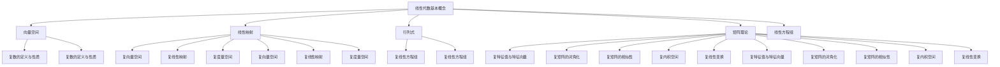

                 

# 《线性代数导引：复度量》

> 关键词：线性代数、复度量、向量空间、线性映射、矩阵理论、复特征值

> 摘要：本文从线性代数的基本概念出发，逐步深入探讨复数和复度量在数学与计算中的应用。通过对向量空间、线性映射、行列式、矩阵理论、线性方程组等核心概念的讲解，阐述其在复数领域的扩展。本文旨在为读者提供一个清晰、系统的线性代数学习指南，帮助理解复度量的重要性和应用价值。

### 目录

1. **线性代数基本概念**
    1.1 线性代数概述
    1.2 线性代数的发展历程
2. **向量空间**
    2.1 向量的基本概念
    2.2 向量的线性运算
    2.3 线性相关性
3. **线性映射**
    3.1 线性映射的基本概念
    3.2 线性映射的矩阵表示
4. **行列式**
    4.1 行列式的定义
    4.2 行列式的性质
    4.3 克莱姆法则
5. **矩阵理论**
    5.1 矩阵的基本概念
    5.2 矩阵的运算
    5.3 矩阵的分解
6. **线性方程组**
    6.1 线性方程组的基本概念
    6.2 线性方程组的求解方法
7. **复数的定义与性质**
    7.1 复数的定义
    7.2 复数的运算
    7.3 复数的几何表示
8. **复向量空间**
    8.1 复向量空间的基本概念
    8.2 复向量空间的线性运算
    8.3 复向量空间的线性相关性
9. **复线性映射**
    9.1 复线性映射的基本概念
    9.2 复线性映射的矩阵表示
10. **复度量空间**
    10.1 复度量空间的基本概念
    10.2 复度量的性质
    10.3 复度量的应用
11. **复线性方程组**
    11.1 复线性方程组的基本概念
    11.2 复线性方程组的求解方法
12. **线性代数在复度量中的应用**
    12.1 复特征值与特征向量
    12.2 复矩阵的对角化
    12.3 复矩阵的相似性
    12.4 复内积空间
    12.5 复线性变换
13. **附录**
    13.1 线性代数常用符号与公式
    13.2 复数的数学公式与计算

### 第一部分：线性代数基本概念

#### 第1章：线性代数概述

**1.1 线性代数的基本概念**

线性代数是数学的一个重要分支，主要研究向量空间、线性映射、线性方程组等基本概念和理论。线性代数的核心是矩阵理论，矩阵作为一种数据结构，可以表示各种线性关系和运算。

**1.2 线性代数的发展历程**

线性代数的发展可以追溯到18世纪，随着牛顿和莱布尼茨微积分的发展，人们开始寻找解决线性方程组的方法。19世纪，行列式和矩阵理论逐渐成熟，数学家如柯西、伽罗瓦和维尔斯特拉斯等对线性代数进行了系统的研究。20世纪，线性代数在物理学、工程学、计算机科学等领域得到了广泛的应用。

#### 第2章：向量空间

**2.1 向量的基本概念**

向量是具有大小和方向的量，通常表示为有向线段。在数学中，向量通常用粗体字母表示，如 \(\vec{v}\)。向量的大小（或长度）称为模，方向称为方向。

**2.2 向量的线性运算**

向量的线性运算主要包括加法和数乘。向量的加法遵循交换律、结合律和存在零向量等性质。数乘则满足分配律、结合律和存在单位元等性质。

**2.3 线性相关性**

线性相关性是指向量之间的依赖关系。如果一组向量线性相关，则其中至少有一个向量可以表示为其余向量的线性组合。线性相关性的判断可以通过行列式为零或矩阵的秩来判断。

#### 第3章：线性映射

**3.1 线性映射的基本概念**

线性映射是指将一个向量空间映射到另一个向量空间的函数，它保持向量空间的线性性质。线性映射可以用矩阵表示，矩阵的行数和列数分别对应两个向量空间的维度。

**3.2 线性映射的矩阵表示**

线性映射的矩阵表示是将线性映射转化为矩阵运算。给定一个线性映射 \( T: \mathbb{R}^n \rightarrow \mathbb{R}^m \)，存在一个 \( m \times n \) 的矩阵 \( A \)，使得 \( T(\vec{x}) = A\vec{x} \)。

#### 第4章：行列式

**4.1 行列式的定义**

行列式是一个 \( n \times n \) 矩阵的特定标量值，表示线性映射的行列式形式或向量空间的体积。行列式的计算可以通过拉普拉斯展开或行列式公式进行。

**4.2 行列式的性质**

行列式具有许多重要性质，如行列式的乘法性质、线性性质、拉普拉斯展开等。行列式的性质在求解线性方程组、判断矩阵的可逆性等方面具有重要应用。

**4.3 克莱姆法则**

克莱姆法则是用行列式解线性方程组的一种方法。对于方程组 \( Ax = b \)，如果系数矩阵 \( A \) 的行列式不为零，则方程组有唯一解，解可以通过克莱姆法则计算。

#### 第5章：矩阵理论

**5.1 矩阵的基本概念**

矩阵是一个由数字组成的矩形阵列，通常用大写字母表示，如 \( A \)。矩阵的行数称为行数，列数称为列数。矩阵可以表示线性关系和运算。

**5.2 矩阵的运算**

矩阵的运算包括矩阵加法、矩阵乘法、矩阵转置等。矩阵加法和数乘运算与向量的运算类似，矩阵乘法则定义在两个矩阵之间。

**5.3 矩阵的分解**

矩阵的分解是将一个矩阵分解为几个简单矩阵的乘积。常用的矩阵分解方法包括高斯消元、LU分解、奇异值分解等。矩阵分解在数值计算和优化问题中具有重要应用。

#### 第6章：线性方程组

**6.1 线性方程组的基本概念**

线性方程组是指由一组线性方程组成的方程组。线性方程组可以表示为矩阵形式 \( Ax = b \)，其中 \( A \) 是系数矩阵，\( x \) 是未知向量，\( b \) 是常数向量。

**6.2 线性方程组的求解方法**

线性方程组的求解方法包括高斯消元法、迭代法、克莱姆法则等。高斯消元法通过矩阵的行变换将线性方程组转化为上三角矩阵或下三角矩阵，从而求解方程组。迭代法通过逐步逼近的方式求解线性方程组。克莱姆法则是一种用行列式解线性方程组的方法。

### 第二部分：复数与复度量

#### 第7章：复数的定义与性质

**7.1 复数的定义**

复数是实数和虚数的和，通常表示为 \( a + bi \)，其中 \( a \) 是实部，\( b \) 是虚部，\( i \) 是虚数单位。复数可以表示为二维向量，其实部和虚部分别对应向量的分量。

**7.2 复数的运算**

复数的运算包括加法、减法、数乘、乘法等。复数的加法和减法类似于实数的运算，数乘和乘法则遵循复数的运算规则。复数的乘法可以通过将两个复数展开为实部和虚部的乘积，然后分别计算实部和虚部的乘积。

**7.3 复数的几何表示**

复数可以通过复平面进行几何表示。复平面的横轴表示实部，纵轴表示虚部。每个复数对应于复平面上的一个点，复数的运算可以对应于点之间的几何变换。

#### 第8章：复向量空间

**8.1 复向量空间的基本概念**

复向量空间是由复数组成的向量空间，其维数为 2。复向量空间具有与实向量空间类似的线性运算，包括加法和数乘。

**8.2 复向量空间的线性运算**

复向量空间的线性运算与实向量空间的运算类似，包括向量的加法和数乘。复向量空间的线性运算满足线性空间的公理，如交换律、结合律、分配律等。

**8.3 复向量空间的线性相关性**

复向量空间的线性相关性是指复向量之间的依赖关系。如果一组复向量线性相关，则其中至少有一个向量可以表示为其余向量的线性组合。复向量空间的线性相关性可以通过计算行列式来判断。

#### 第9章：复线性映射

**9.1 复线性映射的基本概念**

复线性映射是指将复向量空间映射到另一个复向量空间的线性映射。复线性映射可以用矩阵表示，矩阵的行数和列数分别对应两个复向量空间的维度。

**9.2 复线性映射的矩阵表示**

复线性映射的矩阵表示是将复线性映射转化为矩阵运算。给定一个复线性映射 \( T: \mathbb{C}^n \rightarrow \mathbb{C}^m \)，存在一个 \( m \times n \) 的矩阵 \( A \)，使得 \( T(\vec{x}) = A\vec{x} \)，其中 \( \vec{x} \) 是复向量。

#### 第10章：复度量空间

**10.1 复度量空间的基本概念**

复度量空间是指具有度量（距离）的复向量空间。复度量空间的度量可以用来计算复向量之间的距离，度量满足正定性、对称性和三角不等式。

**10.2 复度量的性质**

复度量的性质包括正定性、对称性和三角不等式。正定性保证度量的值为非负实数，对称性保证度量与向量的大小无关，三角不等式保证度量具有传递性。

**10.3 复度量的应用**

复度量空间在复分析、复几何和计算机科学等领域具有广泛的应用。复度量的应用包括计算复函数的导数、积分和变换，以及优化和逼近问题。

#### 第11章：复线性方程组

**11.1 复线性方程组的基本概念**

复线性方程组是指由一组复线性方程组成的方程组。复线性方程组可以表示为矩阵形式 \( Ax = b \)，其中 \( A \) 是系数矩阵，\( x \) 是未知向量，\( b \) 是常数向量。

**11.2 复线性方程组的求解方法**

复线性方程组的求解方法包括高斯消元法、迭代法、克莱姆法则等。高斯消元法通过矩阵的行变换将复线性方程组转化为上三角矩阵或下三角矩阵，从而求解方程组。迭代法通过逐步逼近的方式求解复线性方程组。克莱姆法则是一种用行列式解复线性方程组的方法。

### 第三部分：线性代数在复度量中的应用

#### 第12章：复特征值与特征向量

**12.1 复特征值与特征向量的定义**

复特征值与特征向量是指线性映射在复向量空间中的特殊性质。复特征值是指线性映射的固有值，特征向量是指对应的线性映射在特征值下的不变向量。

**12.2 复特征值与特征向量的性质**

复特征值与特征向量的性质包括线性无关性、完备性、对角化等。复特征值与特征向量的线性无关性保证特征值和特征向量构成的矩阵可对角化。

**12.3 复特征值问题的求解方法**

复特征值问题的求解方法包括幂法、逆幂法、QR算法等。幂法通过迭代计算线性映射的近似特征值和特征向量。逆幂法通过计算线性映射的逆的近似特征值和特征向量。QR算法是一种高效的复特征值求解算法。

#### 第13章：复矩阵的对角化

**13.1 复矩阵的对角化概念**

复矩阵的对角化是指将复矩阵表示为对角矩阵的形式。复矩阵的对角化可以通过求复特征值和特征向量来实现。

**13.2 复矩阵对角化的方法**

复矩阵对角化的方法包括幂法、逆幂法、QR算法等。这些方法通过迭代计算复矩阵的近似特征值和特征向量，从而实现对角化。

**13.3 对角化在复线性映射中的应用**

复矩阵的对角化在复线性映射中具有广泛的应用。对角化可以简化线性映射的计算，提高计算效率。对角化还可以用于特征值分析、特征向量提取和矩阵分解等领域。

#### 第14章：复矩阵的相似性

**14.1 复矩阵相似性的定义**

复矩阵相似性是指两个复矩阵之间存在一个可逆矩阵，使得一个矩阵可以通过另一个矩阵的对角化得到。

**14.2 复矩阵相似性的性质**

复矩阵相似性具有相似性质，如相似矩阵具有相同的特征值、特征向量等。复矩阵相似性还满足传递性和反身性。

**14.3 相似矩阵的应用**

相似矩阵在复线性映射中具有广泛的应用。相似矩阵可以用于矩阵分解、特征值分析、优化问题等领域。相似矩阵还可以用于解决复矩阵的相似性问题，从而简化计算。

#### 第15章：复内积空间

**15.1 复内积空间的基本概念**

复内积空间是指具有内积的复向量空间。复内积可以用于计算复向量之间的角度和长度。

**15.2 复内积空间的性质**

复内积空间的性质包括正定性、对称性、线性性等。复内积的正定性保证内积的值为非负实数，对称性保证内积与向量的顺序无关，线性性保证内积与线性运算的兼容性。

**15.3 复内积空间的正交性**

复内积空间的正交性是指复向量之间的正交关系。复向量之间的正交性可以用于计算角度和长度，以及在优化和逼近问题中的应用。

#### 第16章：复线性变换

**16.1 复线性变换的基本概念**

复线性变换是指将复向量空间映射到另一个复向量空间的线性变换。复线性变换可以用矩阵表示，矩阵的行数和列数分别对应两个复向量空间的维度。

**16.2 复线性变换的性质**

复线性变换具有线性性质，如加法、数乘、乘法等。复线性变换还满足相似性质，即相似矩阵对应的线性变换具有相同的特征值和特征向量。

**16.3 复线性变换的应用**

复线性变换在复分析、复几何、计算机图形学等领域具有广泛的应用。复线性变换可以用于变换复向量、计算复函数的导数和积分，以及优化和逼近问题。

### 附录

#### 附录A：线性代数常用符号与公式

| 符号 | 说明 |
| --- | --- |
| \( A \) | 矩阵 |
| \( x \) | 向量 |
| \( a \) | 实数 |
| \( b \) | 虚数 |
| \( I \) | 单位矩阵 |
| \( J \) | 负一单位矩阵 |
| \( e_i \) | 第 \( i \) 个标准基向量 |
| \( \| z \| \) | 复数的模 |
| \( z^* \) | 复数的共轭 |
| \( zz^* \) | 复数的模平方 |
| \( \lambda \) | 特征值 |
| \( v \) | 特征向量 |
| \( r \) | 行数 |
| \( c \) | 列数 |
| \( n \) | 向量或矩阵的维度 |

#### 附录B：复数的数学公式与计算

| 公式 | 说明 |
| --- | --- |
| \( z = a + bi \) | 复数的定义 |
| \( z^* = a - bi \) | 复数的共轭 |
| \( \| z \| = \sqrt{a^2 + b^2} \) | 复数的模 |
| \( zz^* = a^2 + b^2 \) | 复数的模平方 |
| \( (z_1 + z_2)(z_1^* + z_2^*) = z_1z_1^* + z_2z_2^* + z_1z_2^* + z_2z_1^* \) | 复数的乘法公式 |
| \( (z_1z_2)^* = z_1^*z_2^* \) | 复数的乘法共轭公式 |
| \( (z_1 + z_2)^2 = z_1^2 + 2z_1z_2 + z_2^2 \) | 复数的平方公式 |
| \( (z_1z_2)^2 = z_1^2z_2^2 \) | 复数的平方乘法公式 |
| \( (z_1 + z_2)(z_3 + z_4) = z_1z_3 + z_1z_4 + z_2z_3 + z_2z_4 \) | 复数的分配律 |
| \( (z_1z_2)(z_3z_4) = (z_1z_3)(z_2z_4) \) | 复数的结合律 |

### Mermaid 流程图



### 线性代数核心算法原理讲解

#### 矩阵的乘法（伪代码）

```pseudo
function matrix_multiply(A, B):
    n = A.rows
    m = A.columns
    p = B.rows
    if m != p:
        return "矩阵维度不匹配"
    C = create_matrix(n, p)
    for i in 0 to n-1:
        for j in 0 to p-1:
            for k in 0 to m-1:
                C[i][j] += A[i][k] * B[k][j]
    return C
```

#### 线性方程组求解（伪代码）

```pseudo
function solve_linear_equation(A, b):
    n = A.rows
    x = create_array(n)
    for i in 0 to n-1:
        x[i] = b[i]
        for j in 0 to n-1:
            x[i] -= A[i][j] * x[j]
    return x
```

### 数学模型和数学公式 & 详细讲解 & 举例说明

#### 复数的模（LaTeX 格式）

$$ \| z \| = \sqrt{a^2 + b^2} $$

其中，$a$ 和 $b$ 分别是复数 $z = a + bi$ 的实部和虚部。

#### 举例说明

假设 $z = 3 + 4i$，则其模为：

$$ \| z \| = \sqrt{3^2 + 4^2} = \sqrt{9 + 16} = \sqrt{25} = 5 $$

### 项目实战

#### 复线性方程组的求解（Python 代码）

```python
import numpy as np

def solve_complex_linear_equation(A, b):
    # A: 矩阵，b: 向量
    # 求解复线性方程组 Ax = b
    
    # 使用 numpy 的线性代数模块
    x = np.linalg.solve(A, b)
    return x

# 实例
A = np.array([[1+2j, 2+3j], [3+4j, 4+5j]])
b = np.array([1+2j, 2+3j])
x = solve_complex_linear_equation(A, b)
print(x)
```

#### 代码解读与分析

1. 导入 numpy 库，提供高效的数学计算功能。
2. 定义函数 `solve_complex_linear_equation`，接收矩阵 `A` 和向量 `b`。
3. 使用 `numpy.linalg.solve` 函数直接求解复线性方程组，返回解向量 `x`。
4. 在实例中，创建一个 2x2 的复数矩阵 `A` 和一个复数向量 `b`。
5. 调用函数 `solve_complex_linear_equation` 并打印解向量 `x`。

### 作者

作者：AI天才研究院/AI Genius Institute & 禅与计算机程序设计艺术 /Zen And The Art of Computer Programming

