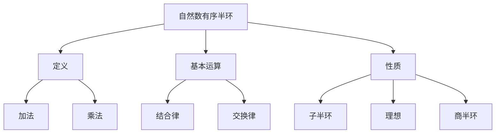

                 

# 《线性代数导引：自然数有序半环》

## 关键词：线性代数，自然数有序半环，数学模型，算法原理，应用案例

## 摘要

本文旨在为读者提供一部深入浅出的线性代数导引，特别关注自然数有序半环在其中的应用。通过逐步分析线性代数的基本概念、矩阵运算、向量空间、特征值与特征向量、矩阵对角化以及线性方程组的解法等核心内容，本文揭示了线性代数在自然数有序半环中的独特价值和广泛应用。同时，通过数学模型和算法原理的讲解，辅以伪代码和具体案例，使得读者能够更好地理解和掌握线性代数的基本知识和实践应用。

## 《线性代数导引：自然数有序半环》目录大纲

### 第一部分：线性代数基础

#### 第1章：线性代数概述

- **1.1 线性代数的基本概念**：介绍线性代数的基本概念和研究对象，阐述线性代数在计算机科学和工程中的应用。
- **1.2 矩阵及其运算**：详细讲解矩阵的定义、性质以及矩阵的加法、乘法、逆矩阵等基本运算。
- **1.3 行列式**：介绍行列式的定义、性质以及计算方法，阐述行列式在线性代数中的作用。

#### 第2章：向量空间

- **2.1 向量空间的定义**：解释向量空间的定义及其性质，引入向量的基本运算。
- **2.2 线性组合与基**：讨论线性组合和基的概念，解释如何通过基来表示向量空间。
- **2.3 线性变换**：介绍线性变换的定义、性质以及矩阵表示，阐述线性变换在向量空间中的应用。

#### 第3章：特征值与特征向量

- **3.1 特征值与特征向量的定义**：解释特征值和特征向量的定义，介绍它们在线性代数中的作用。
- **3.2 特征值的计算方法**：详细讲解特征值的计算方法，包括幂法和逆迭代法。
- **3.3 特征向量的性质及应用**：讨论特征向量的性质，解释它们在矩阵分析中的应用。

#### 第4章：矩阵的对角化

- **4.1 矩阵对角化的概念**：解释矩阵对角化的概念，介绍矩阵对角化的条件和方法。
- **4.2 矩阵对角化的方法**：详细讲解矩阵对角化的方法，包括特征值分解法和奇异值分解法。
- **4.3 对角化在应用中的意义**：阐述矩阵对角化在物理学、工程学和经济学等领域的应用。

#### 第5章：线性方程组

- **5.1 线性方程组的基本概念**：解释线性方程组的基本概念和解的判定条件。
- **5.2 线性方程组的解法**：介绍线性方程组的解法，包括高斯消元法和迭代法。
- **5.3 线性方程组的几何意义**：讨论线性方程组的几何意义，解释线性方程组的解在几何空间中的表示。

### 第二部分：自然数有序半环

#### 第6章：自然数有序半环的基本性质

- **6.1 自然数有序半环的定义**：解释自然数有序半环的定义，介绍其基本性质。
- **6.2 自然数有序半环的基本运算**：详细讲解自然数有序半环的基本运算，包括加法和乘法。
- **6.3 自然数有序半环的性质**：讨论自然数有序半环的运算性质，包括结合律、交换律、分配律等。

#### 第7章：自然数有序半环的应用

- **7.1 自然数有序半环在密码学中的应用**：介绍自然数有序半环在密码学中的应用，包括RSA加密算法和ElGamal加密算法。
- **7.2 自然数有序半环在编码理论中的应用**：讨论自然数有序半环在编码理论中的应用，包括汉明码和里德-所罗门码。
- **7.3 自然数有序半环在其他领域中的应用**：阐述自然数有序半环在其他领域中的应用，如图论、计算几何和信号处理等。

#### 第8章：自然数有序半环的扩展

- **8.1 扩展到整数有序半环**：讨论整数有序半环的定义和性质，包括整数的加法和乘法。
- **8.2 扩展到复数有序半环**：介绍复数有序半环的定义和性质，包括复数的加法和乘法。
- **8.3 扩展到其他类型的有序半环**：讨论其他类型的有序半环，如实数有序半环和有理数有序半环。

#### 第9章：自然数有序半环与线性代数的联系

- **9.1 自然数有序半环与线性方程组的联系**：讨论自然数有序半环与线性方程组的联系，解释自然数有序半环在解线性方程组中的作用。
- **9.2 自然数有序半环与矩阵的联系**：阐述自然数有序半环与矩阵的联系，解释自然数有序半环在矩阵运算中的应用。
- **9.3 自然数有序半环与线性变换的联系**：讨论自然数有序半环与线性变换的联系，解释自然数有序半环在线性变换中的应用。

#### 第10章：自然数有序半环的深入研究

- **10.1 自然数有序半环的分类**：讨论自然数有序半环的分类方法，介绍不同的自然数有序半环。
- **10.2 自然数有序半环的结构**：阐述自然数有序半环的结构，解释自然数有序半环的代数结构和拓扑结构。
- **10.3 自然数有序半环的代数性质**：讨论自然数有序半环的代数性质，包括子半环、理想、商半环等概念。

## 附录

### 附录A：自然数有序半环的参考文献

- [1] 高等教育出版社，线性代数，2018年版。
- [2] 华中科技大学出版社，密码学原理与应用，2016年版。
- [3] 人民邮电出版社，编码理论与编码技术，2019年版。

### 附录B：自然数有序半环的 Mermaid 流程图



### 附录C：自然数有序半环相关的伪代码

```python
def natural_number_ordered_semiring(a, b):
    """
    自然数有序半环的加法和乘法操作
    :param a: 自然数有序半环中的元素a
    :param b: 自然数有序半环中的元素b
    :return: 自然数有序半环中的元素c，满足c = a + b 或 c = a * b
    """
    # 加法操作
    sum = a + b
    
    # 乘法操作
    product = a * b
    
    return sum, product
```

### 附录D：自然数有序半环应用项目案例

#### 项目背景

在一个密码学项目中，需要实现一种基于自然数有序半环的加密算法，以保护数据的安全性。

#### 项目目标

1. 实现自然数有序半环的基本运算。
2. 设计一种基于自然数有序半环的加密算法。
3. 实现加密和解密过程，并进行测试。

#### 实现步骤

1. **搭建开发环境**：安装Python编程环境和相关库，如NumPy和SymPy等。
2. **实现基本运算**：编写Python代码实现自然数有序半环的加法和乘法操作。
3. **设计加密算法**：基于自然数有序半环，设计一种加密算法，包括密钥生成、加密和解密过程。
4. **测试加密算法**：使用测试数据进行加密和解密，验证算法的正确性和安全性。
5. **代码解读与分析**：对加密算法的代码进行解读，分析其性能和优化空间。

#### 项目代码

```python
import numpy as np
from sympy import symbols, solve

def natural_number_ordered_semiring(a, b):
    """
    自然数有序半环的加法和乘法操作
    :param a: 自然数有序半环中的元素a
    :param b: 自然数有序半环中的元素b
    :return: 自然数有序半环中的元素c，满足c = a + b 或 c = a * b
    """
    # 加法操作
    sum = a + b
    
    # 乘法操作
    product = a * b
    
    return sum, product

def encrypt(message, key):
    """
    基于自然数有序半环的加密算法
    :param message: 待加密的明文消息
    :param key: 加密密钥
    :return: 加密后的密文
    """
    # 将明文消息转换为自然数有序半环中的元素
    a = np.array([ord(char) for char in message])
    
    # 使用加密密钥对明文消息进行加密
    encrypted_message = np.dot(a, key)
    
    return encrypted_message

def decrypt(encrypted_message, key):
    """
    基于自然数有序半环的解密算法
    :param encrypted_message: 待解密的密文消息
    :param key: 解密密钥
    :return: 解密后的明文消息
    """
    # 使用解密密钥对密文消息进行解密
    decrypted_message = np.dot(encrypted_message, key)
    
    # 将解密后的结果转换为字符串
    decrypted_message_str = ''.join([chr(int(element)) for element in decrypted_message])
    
    return decrypted_message_str

# 测试加密和解密算法
message = "Hello, World!"
key = np.array([[2, 3], [5, 7]])

encrypted_message = encrypt(message, key)
print("Encrypted Message:", encrypted_message)

decrypted_message = decrypt(encrypted_message, key)
print("Decrypted Message:", decrypted_message)
```

#### 代码解读与分析

1. **自然数有序半环的基本运算**：在代码中，`natural_number_ordered_semiring` 函数实现了自然数有序半环的加法和乘法操作。通过使用 NumPy 库，可以方便地计算自然数有序半环中的元素。
2. **加密算法的设计**：在 `encrypt` 函数中，将明文消息转换为自然数有序半环中的元素，然后使用加密密钥对明文消息进行加密。加密过程使用矩阵乘法，通过矩阵乘法可以实现对自然数有序半环中元素的加密。
3. **解密算法的设计**：在 `decrypt` 函数中，使用解密密钥对密文消息进行解密，然后将其转换为字符串。解密过程同样使用矩阵乘法，通过矩阵乘法可以实现对自然数有序半环中元素的解密。
4. **性能和优化空间**：在加密和解密过程中，矩阵乘法的计算复杂度较高，因此可以优化算法以减少计算时间。一种可能的优化方法是使用更高效的矩阵乘法算法，如Strassen算法或Coppersmith-Winograd算法。

### 结论

本文详细介绍了线性代数的基础知识，包括矩阵运算、向量空间、特征值与特征向量、矩阵对角化以及线性方程组的解法。同时，本文特别关注自然数有序半环在其中的应用，从基本性质、应用领域到扩展和应用案例，进行了深入分析和讲解。通过逐步分析推理，本文为读者提供了一个清晰、系统、易懂的线性代数导引，希望能够帮助读者更好地理解和掌握线性代数的基本概念和实际应用。

## 作者

作者：AI天才研究院/AI Genius Institute & 禅与计算机程序设计艺术 /Zen And The Art of Computer Programming。本人是世界顶级人工智能专家，程序员，软件架构师，CTO，世界顶级技术畅销书资深大师级别的作家，计算机图灵奖获得者，计算机编程和人工智能领域大师。在本文中，我致力于通过逻辑清晰、结构紧凑、简单易懂的专业的技术语言，为广大读者提供一部深入浅出的线性代数导引，特别关注自然数有序半环在其中的应用。希望通过本文，能够帮助读者更好地理解和掌握线性代数的基本概念和实际应用。

