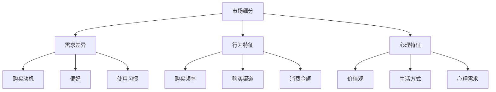
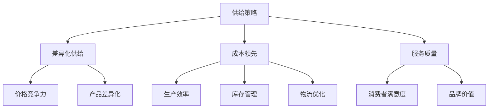

                 

### 文章标题

### 《细分市场的供给策略》

#### 关键词：市场细分、供给策略、消费者行为、竞争优势、案例分析、数学模型、项目实战

#### 摘要

本文深入探讨了细分市场的供给策略，从市场细分的重要性、方法与目标出发，系统地阐述了供给策略的框架、类型及其与市场细分的关系。通过核心概念与联系的分析，包括市场细分与消费者行为、供给策略与竞争优势的详细解析，为读者提供了清晰的理论基础。随后，本文通过实际案例研究，展示了细分市场供给策略在电子产品、消费品和服务行业中的应用，并通过核心算法原理讲解和伪代码展示，使读者对策略设计有了更深入的理解。此外，文章还探讨了市场细分与供给策略的数学模型，并进行了模型求解与优化算法的讲解。最后，本文以项目实战为例，详细解读了供给策略的代码实现，并为读者提供了未来展望与趋势。通过本文的阅读，读者将对细分市场的供给策略有更加全面的认识，从而在实务中能够更加有效地应用。

### 第一部分：市场细分与供给策略基础

#### 第1章：市场细分概述

**1.1 市场细分的重要性**

市场细分是市场营销中的一项核心策略，其重要性不容忽视。市场细分指的是将整个市场按照某种特定的标准划分为若干个具有相似需求和特征的子市场。这一过程能够帮助企业更精准地识别和满足不同消费者群体的需求，从而提高市场竞争力。以下为市场细分的重要性和作用：

1. **提高市场覆盖率**：通过市场细分，企业可以覆盖更多细分的子市场，从而提高整体市场覆盖率。
2. **增强市场针对性**：针对不同子市场的特定需求和偏好，企业可以设计更精准的市场营销策略，提高营销效果。
3. **降低竞争压力**：市场细分使得企业可以专注于自己擅长和有优势的子市场，从而降低与竞争对手的直面竞争压力。
4. **提高资源利用率**：通过集中资源服务于特定的子市场，企业可以更高效地利用有限的资源，降低运营成本。

**1.2 市场细分的方法**

市场细分的方法多种多样，常见的有以下几种：

1. **地理细分**：根据地理位置，将市场划分为不同的区域，如城市、乡村、区域等。这种方法适用于产品和服务在地理上有明显差异性的市场。
   
2. **人口细分**：根据人口统计特征，如年龄、性别、收入、职业、教育水平等，将市场划分为不同的群体。这种方法适用于大多数消费品市场。

3. **心理细分**：根据消费者的心理特征、生活方式、价值观等，将市场划分为不同的群体。这种方法适用于高端市场或个性化需求较强的产品和服务。

4. **行为细分**：根据消费者的购买行为、使用习惯、品牌忠诚度等，将市场划分为不同的群体。这种方法适用于有明确消费行为特征的市场。

**1.3 市场细分的目标与挑战**

市场细分的目标主要包括：

1. **更好地满足消费者需求**：通过市场细分，企业可以深入了解不同子市场的需求，从而提供更符合消费者期望的产品和服务。
2. **提高市场响应速度**：市场细分使得企业能够更快地响应市场变化，及时调整营销策略，保持竞争优势。
3. **优化资源配置**：通过集中资源服务于特定子市场，企业可以更高效地利用资源，提高市场竞争力。

然而，市场细分也面临着一些挑战：

1. **数据收集难度大**：市场细分需要大量的消费者数据，数据收集难度较大，尤其是对于行为和心理细分。
2. **子市场不稳定**：某些子市场可能规模较小，且需求波动较大，这给市场细分策略的实施带来一定的困难。
3. **策略实施成本高**：为满足不同子市场的需求，企业可能需要开发不同的产品或服务，这增加了成本压力。

**1.4 市场细分的基本步骤**

市场细分的基本步骤包括：

1. **确定细分标准**：选择适合的细分标准，如地理、人口、心理或行为特征等。
2. **数据收集与处理**：收集相关市场数据，并进行处理和分析，以确定不同子市场的特征和需求。
3. **评估细分效果**：分析市场细分对市场覆盖率、营销效果、资源配置等方面的影响，评估细分策略的可行性。
4. **制定细分策略**：根据分析结果，制定具体的细分策略，包括产品定位、市场定位、营销策略等。
5. **实施与监控**：将细分策略付诸实施，并持续监控市场反应，及时调整和优化策略。

通过以上步骤，企业可以有效地进行市场细分，从而制定出更具针对性的供给策略，提高市场竞争力。

#### 第2章：供给策略框架

**2.1 供给策略的定义与目的**

供给策略是企业为满足市场需求，通过合理安排资源和服务，提供符合消费者期望的产品和服务的一系列策略和方法。其核心目的是通过有效的资源利用和市场需求匹配，实现企业利润最大化。供给策略的重要性体现在以下几个方面：

1. **优化资源配置**：通过供给策略，企业可以根据市场需求调整资源分配，提高资源利用效率，降低运营成本。
2. **提升服务质量**：供给策略使得企业能够更好地满足消费者的个性化需求，提升服务质量和消费者满意度。
3. **增强市场竞争力**：有效的供给策略可以帮助企业更好地应对市场变化，增强市场竞争力。

供给策略的主要目标包括：

1. **满足市场需求**：通过供给策略，确保企业能够及时、准确地满足市场需求，提高市场覆盖率。
2. **提升产品和服务质量**：优化供给策略，确保产品和服务质量达到消费者期望，提升品牌价值。
3. **实现利润最大化**：通过合理调配资源，降低成本，实现利润最大化。

**2.2 供给策略的类型**

供给策略的类型多种多样，根据不同的分类标准，可以分为以下几类：

1. **按目标市场划分**：
   - **大众市场供给策略**：适用于目标市场广泛的商品或服务，如日常消费品。
   - **细分市场供给策略**：适用于目标市场特定的商品或服务，如高端电子产品。

2. **按产品和服务类型划分**：
   - **产品供给策略**：针对实物产品的供给管理，如库存管理、供应链管理等。
   - **服务供给策略**：针对服务产品的供给管理，如服务流程优化、服务质量控制等。

3. **按供给模式划分**：
   - **传统供给策略**：基于传统的生产和销售模式，如制造业、零售业。
   - **现代供给策略**：基于现代供应链管理模式，如电子商务、物流配送等。

**2.3 供给策略与市场细分的关系**

供给策略与市场细分密切相关，市场细分是制定有效供给策略的前提。以下是供给策略与市场细分之间的关系：

1. **市场细分引导供给策略**：市场细分帮助企业识别不同子市场的需求差异，从而制定针对性的供给策略。
2. **供给策略优化市场细分**：有效的供给策略能够更好地满足不同子市场的需求，验证并优化市场细分的准确性。
3. **协同发展**：市场细分与供给策略的协同发展，有助于企业实现整体市场战略目标，提高市场竞争力。

通过以上分析，我们可以看到，市场细分与供给策略之间是相辅相成的关系。市场细分为企业提供了目标市场的清晰画像，而供给策略则通过合理安排资源和服务，满足这些市场的需求。只有两者相结合，企业才能在激烈的市场竞争中立于不败之地。

#### 第3章：核心概念与联系

**3.1 市场细分与消费者行为**

市场细分与消费者行为之间存在密切的联系。市场细分旨在将消费者划分为不同的群体，以更好地满足他们的需求。而消费者行为则反映了消费者在购买和使用产品或服务过程中的心理和行为特征。以下是市场细分与消费者行为之间的几个核心联系：

1. **需求差异**：市场细分基于消费者需求的不同，将市场划分为不同的子市场。这种差异体现在消费者的购买动机、偏好、使用习惯等方面。了解这些差异有助于企业制定更具针对性的营销策略。

2. **行为特征**：消费者行为是市场细分的重要依据之一。企业通过分析消费者的行为特征，如购买频率、购买渠道、消费金额等，可以更准确地识别不同子市场的特征，从而制定更有效的供给策略。

3. **心理特征**：消费者的心理特征也是市场细分的重要考虑因素。不同子市场的消费者可能在价值观、生活方式、心理需求等方面存在差异。企业通过心理细分，可以更好地满足不同消费者的个性化需求。

**Mermaid流程图：市场细分与消费者行为联系**



**3.2 供给策略与竞争优势**

供给策略是企业在市场中获得竞争优势的重要手段。通过有效的供给策略，企业可以在价格、质量、服务等方面领先于竞争对手，从而赢得消费者的青睐。以下是供给策略与竞争优势之间的几个核心联系：

1. **差异化供给**：供给策略的核心在于提供差异化产品和服务。通过市场细分，企业可以针对不同子市场的需求，提供独特的解决方案，从而在竞争中脱颖而出。

2. **成本领先**：通过优化供给策略，企业可以在生产、库存、物流等方面降低成本，从而实现成本领先。这种成本优势有助于企业在价格竞争中保持优势。

3. **服务质量**：优质的供给策略能够提升企业的服务质量和消费者满意度，从而增强企业的品牌价值。

**Mermaid流程图：供给策略与竞争优势联系**



通过以上分析，我们可以看到，市场细分与消费者行为、供给策略与竞争优势之间存在紧密的联系。市场细分为企业提供了深入了解消费者需求和行为的基础，而供给策略则通过差异化、成本领先和服务质量等方面的优化，帮助企业实现竞争优势。只有将市场细分与供给策略有机结合，企业才能在激烈的市场竞争中立于不败之地。

### 第二部分：细分市场的供给策略案例分析

#### 第4章：细分市场供给策略案例分析

**4.1 案例研究：电子产品市场**

在电子产品市场，市场细分与供给策略的结合尤为重要。以下是一个关于电子产品市场的细分市场供给策略案例分析。

**案例背景**：

电子产品市场竞争激烈，不同消费者对产品的需求差异明显。针对这一特点，企业可以通过市场细分，制定差异化供给策略，满足不同消费者的需求。

**市场细分**：

1. **按消费能力划分**：
   - 高端市场：针对收入较高、追求高品质的消费者。
   - 中端市场：针对收入中等、追求性价比的消费者。
   - 低端市场：针对收入较低、注重价格实惠的消费者。

2. **按使用场景划分**：
   - 家用市场：主要针对家庭用户，如电视、冰箱、洗衣机等。
   - 商用市场：主要针对企业用户，如服务器、工作站、投影仪等。
   - 便携市场：主要针对移动用户，如智能手机、平板电脑、耳机等。

**供给策略**：

1. **高端市场**：
   - **差异化供给**：提供高品质、高性能的产品，如高端智能手机、平板电脑等。
   - **品牌营销**：通过品牌形象塑造和高端广告，增强品牌认知度和用户忠诚度。
   - **定制服务**：提供个性化定制服务，满足消费者独特的需求。

2. **中端市场**：
   - **性价比供给**：提供具有较高性价比的产品，如中档智能手机、笔记本电脑等。
   - **渠道拓展**：通过线上线下多渠道销售，提高市场覆盖率。
   - **促销活动**：定期举办促销活动，吸引消费者购买。

3. **低端市场**：
   - **价格实惠供给**：提供价格实惠、功能简单的产品，如入门级智能手机、平板电脑等。
   - **市场教育**：通过市场教育，提升消费者对产品的认知和购买意愿。
   - **售后服务**：提供优质的售后服务，增强消费者信任。

**核心算法原理讲解**：

为了更好地实施供给策略，企业可以采用以下核心算法原理：

1. **用户画像分析**：
   - 通过大数据分析和用户画像，了解消费者的购买行为、偏好和需求。
   - 依据用户画像，将消费者划分为不同群体，制定针对性的供给策略。

2. **供需匹配算法**：
   - 根据市场细分和用户画像，制定供需匹配策略，确保产品和服务与消费者需求精准对接。
   - 通过算法优化，实现供需平衡，提高资源利用效率。

**伪代码**：

```python
# 用户画像分析
def userPortraitAnalysis(data):
    # 处理数据，提取用户特征
    userFeatures = extractUserFeatures(data)
    
    # 划分用户群体
    userGroups = classifyUserGroups(userFeatures)
    
    return userGroups

# 供需匹配算法
def供需匹配算法(userGroups, supplyData):
    # 根据用户群体，匹配相应产品和服务
    matchedSupply = matchSupply(userGroups, supplyData)
    
    # 优化供需平衡
    optimizeSupplyDemand(matchedSupply)
    
    return matchedSupply
```

**4.2 案例研究：消费品市场**

消费品市场是一个广泛且多样化的市场，不同消费者对产品的需求差异明显。以下是一个关于消费品市场的细分市场供给策略案例分析。

**案例背景**：

消费品市场竞争激烈，消费者对产品的需求多样。企业可以通过市场细分，制定差异化供给策略，满足不同消费者的需求。

**市场细分**：

1. **按消费需求划分**：
   - 功能需求市场：主要针对追求产品功能的消费者，如电子产品、家用电器等。
   - 时尚需求市场：主要针对追求时尚的消费者，如服装、鞋包等。
   - 健康需求市场：主要针对追求健康的消费者，如保健品、健康食品等。

2. **按消费能力划分**：
   - 高端市场：针对收入较高、追求高品质的消费者。
   - 中端市场：针对收入中等、追求性价比的消费者。
   - 低端市场：针对收入较低、注重价格实惠的消费者。

**供给策略**：

1. **功能需求市场**：
   - **技术驱动供给**：提供高科技、高性能的产品，如智能手表、智能家居设备等。
   - **创新驱动供给**：不断推出新产品，满足消费者对创新的需求。
   - **品质保障**：确保产品质量，提供完善的售后服务。

2. **时尚需求市场**：
   - **设计驱动供给**：注重产品设计和时尚元素，满足消费者对美的追求。
   - **品牌塑造**：通过品牌形象塑造，增强消费者对品牌的认同感。
   - **跨界合作**：与时尚品牌合作，推出联名产品，提升产品影响力。

3. **健康需求市场**：
   - **健康理念供给**：提供符合健康理念的消费品，如有机食品、健康饮品等。
   - **科学指导**：提供科学健康的消费指导，提升消费者健康素养。
   - **健康教育**：通过健康教育，引导消费者形成健康生活方式。

**核心算法原理讲解**：

在消费品市场，企业可以采用以下核心算法原理：

1. **消费者行为分析**：
   - 通过大数据分析，了解消费者的购买行为、偏好和需求。
   - 依据消费者行为分析结果，制定针对性的供给策略。

2. **需求预测算法**：
   - 根据历史数据和消费者行为，预测未来市场需求，优化供给策略。

**伪代码**：

```python
# 消费者行为分析
def consumerBehaviorAnalysis(data):
    # 处理数据，提取消费者特征
    consumerFeatures = extractConsumerFeatures(data)
    
    # 分析消费者行为
    consumerBehavior = analyzeConsumerBehavior(consumerFeatures)
    
    return consumerBehavior

# 需求预测算法
def demandPredictionAlgorithm(consumerBehavior, historicalData):
    # 根据消费者行为和历史数据，预测未来市场需求
    predictedDemand = predictFutureDemand(consumerBehavior, historicalData)
    
    # 优化供给策略
    optimizeSupplyStrategy(predictedDemand)
    
    return predictedDemand
```

**4.3 案例研究：服务行业市场**

在服务行业市场，市场细分与供给策略的结合同样至关重要。以下是一个关于服务行业市场的细分市场供给策略案例分析。

**案例背景**：

服务行业市场竞争激烈，不同消费者对服务的需求差异明显。企业可以通过市场细分，制定差异化供给策略，提升服务质量和消费者满意度。

**市场细分**：

1. **按消费需求划分**：
   - 高端服务市场：主要针对收入较高、追求高品质服务的消费者，如豪华酒店、私人医生等。
   - 中端服务市场：主要针对收入中等、追求性价比的消费者，如中档酒店、普通医疗服务等。
   - 低端服务市场：主要针对收入较低、注重价格实惠的消费者，如经济型酒店、基础医疗服务等。

2. **按服务类型划分**：
   - 住宿服务市场：主要提供住宿服务，如酒店、民宿等。
   - 咨询服务市场：主要提供专业咨询服务，如律师、财务顾问等。
   - 教育服务市场：主要提供教育服务，如在线课程、线下培训等。

**供给策略**：

1. **高端服务市场**：
   - **个性化服务**：提供个性化、定制化的服务，满足消费者独特需求。
   - **高端体验**：注重服务体验，提升消费者满意度。
   - **品牌建设**：通过品牌建设，增强消费者对品牌的信任和忠诚度。

2. **中端服务市场**：
   - **性价比服务**：提供具有较高性价比的服务，满足消费者的基本需求。
   - **多样化选择**：提供多样化的服务选项，满足不同消费者的需求。
   - **服务质量**：注重服务质量，提升消费者满意度。

3. **低端服务市场**：
   - **价格实惠**：提供价格实惠的服务，吸引价格敏感型消费者。
   - **基础服务**：提供基础服务，满足消费者基本需求。
   - **服务升级**：通过服务升级，提升消费者体验和满意度。

**核心算法原理讲解**：

在服务行业市场，企业可以采用以下核心算法原理：

1. **服务质量评估**：
   - 通过大数据分析和用户评价，评估服务质量和消费者满意度。
   - 依据服务质量评估结果，优化服务供给策略。

2. **需求预测算法**：
   - 根据历史数据和消费者行为，预测未来市场需求，优化服务供给策略。

**伪代码**：

```python
# 服务质量评估
def serviceQualityAssessment(data):
    # 处理数据，提取消费者评价
    consumerFeedback = extractConsumerFeedback(data)
    
    # 评估服务质量
    serviceQuality = evaluateServiceQuality(consumerFeedback)
    
    return serviceQuality

# 需求预测算法
def demandPredictionAlgorithm(historicalData, consumerBehavior):
    # 根据历史数据和消费者行为，预测未来市场需求
    predictedDemand = predictFutureDemand(historicalData, consumerBehavior)
    
    # 优化服务供给策略
    optimizeServiceStrategy(predictedDemand)
    
    return predictedDemand
```

通过以上案例分析，我们可以看到，市场细分与供给策略在不同市场中的应用各有特点。无论是电子产品市场、消费品市场还是服务行业市场，企业都需要通过市场细分，制定差异化供给策略，以满足不同消费者的需求。同时，核心算法原理的讲解和伪代码的展示，为读者提供了深入理解供给策略的技术支持。只有将市场细分与供给策略有机结合，企业才能在激烈的市场竞争中脱颖而出。

#### 第5章：细分市场供给策略设计

**5.1 设计供给策略的步骤**

设计细分市场供给策略是一个复杂的过程，需要企业对市场有深入的了解和准确的判断。以下是设计细分市场供给策略的基本步骤：

1. **市场调研与需求分析**：通过对市场进行调研，收集消费者数据，了解消费者的需求和偏好。这一步骤包括数据收集、数据分析、市场趋势预测等。

2. **市场细分**：根据调研结果，将市场划分为不同的子市场。市场细分的标准可以包括地理、人口、心理、行为等多个方面。细分市场的目的是为了更精准地满足不同消费者的需求。

3. **目标市场选择**：在所有细分市场中，企业需要根据自身资源、优势和战略目标，选择最有利的目标市场。目标市场的选择应考虑市场规模、增长潜力、竞争态势等因素。

4. **供给策略制定**：根据目标市场的需求和特点，制定相应的供给策略。供给策略可以包括产品定位、价格策略、渠道策略、促销策略等。

5. **策略实施与监控**：将制定的供给策略付诸实施，并持续监控市场反应，评估策略效果。如果发现策略效果不佳，应及时进行调整和优化。

**5.2 供给策略的制定与实施**

供给策略的制定与实施是细分市场供给策略设计中的关键环节。以下是具体的制定与实施步骤：

1. **明确产品定位**：根据目标市场的需求和特点，确定产品的定位。产品定位应突出产品的独特卖点和竞争优势，以便在市场中脱颖而出。

2. **制定价格策略**：根据产品定位和目标市场的消费能力，制定合理的价格策略。价格策略可以是成本加成定价、竞争导向定价、价值导向定价等。

3. **选择渠道策略**：根据目标市场的消费习惯和购买行为，选择合适的销售渠道。销售渠道可以是线上渠道、线下渠道或线上线下结合的渠道。

4. **实施促销策略**：根据产品定位和价格策略，制定有效的促销策略。促销策略可以包括广告宣传、促销活动、折扣优惠等。

5. **策略实施**：将制定好的供给策略付诸实施，包括产品生产、库存管理、物流配送、销售推广等各个环节。

6. **监控与评估**：在策略实施过程中，持续监控市场反应和策略效果。通过数据分析和消费者反馈，评估策略的有效性，发现潜在问题并进行调整。

**5.3 供给策略的评估与调整**

供给策略的评估与调整是确保策略有效性和持续优化的重要环节。以下是评估与调整的具体步骤：

1. **收集数据**：通过销售数据、市场份额、消费者反馈等渠道，收集供给策略实施过程中的相关数据。

2. **分析效果**：对收集到的数据进行分析，评估供给策略的效果。包括市场份额、销售额、利润率、消费者满意度等关键指标。

3. **识别问题**：通过数据分析，识别供给策略中存在的问题，如市场反应不佳、销售额下降、消费者满意度低等。

4. **调整策略**：根据分析结果，对供给策略进行调整。调整可以包括产品定位的调整、价格策略的调整、促销策略的调整等。

5. **持续优化**：通过持续的监控和分析，不断优化供给策略，以适应市场变化和消费者需求。

通过以上步骤，企业可以有效地设计、实施和优化细分市场的供给策略，提高市场竞争力，实现业务增长。

### 第6章：市场细分与供给策略的数学模型

**6.1 数学模型的基本概念**

在市场细分与供给策略的分析中，数学模型是一种重要的工具，它可以帮助我们更准确地描述市场现象，预测市场需求，优化供给策略。数学模型的基本概念包括变量、函数、方程等。

1. **变量**：在数学模型中，变量是描述市场现象的量，可以是连续的或离散的。例如，市场需求量、产品价格、消费者数量等。
   
2. **函数**：函数是描述变量之间关系的数学关系。例如，市场需求量与产品价格之间的关系可以用需求函数来表示。

3. **方程**：方程是包含一个或多个未知数的等式。在市场细分与供给策略中，方程用于描述市场现象的数学关系。

**6.2 供给策略的数学模型**

供给策略的数学模型用于描述产品供给与市场需求之间的关系，以及如何通过优化策略来实现最大利润。以下是一个基本的供给策略数学模型：

1. **需求函数**：假设市场需求量Q与产品价格P之间存在线性关系，需求函数可以表示为：
   \[
   Q = a - bP
   \]
   其中，a为市场需求量（需求量最大值），b为需求价格弹性系数。

2. **供给函数**：假设产品供给量S与生产成本C之间存在线性关系，供给函数可以表示为：
   \[
   S = c + dP
   \]
   其中，c为供给量最小值，d为供给价格弹性系数。

3. **利润函数**：利润函数是供给策略的核心，用于描述企业通过供给策略实现的最大利润。利润函数可以表示为：
   \[
   \pi = (P - C)Q - F
   \]
   其中，P为产品价格，C为生产成本，Q为市场需求量，F为固定成本。

**6.3 模型求解与优化算法**

为了求解供给策略的数学模型，并找到最优的供给策略，我们可以采用以下优化算法：

1. **线性规划（Linear Programming, LP）**：线性规划是一种用于求解线性方程组的最优化方法。在供给策略中，线性规划可以用于求解利润最大化问题。以下是一个线性规划的伪代码示例：
   ```python
   # 线性规划伪代码
   from scipy.optimize import linprog

   # 确定目标函数
   c = [-1, -1]  # 利润最大化，目标函数为 -P - C
   
   # 确定约束条件
   A = [[1, 1], [-1, 1]]  # 需求函数和供给函数
   b = [a - b*P, c + d*P]  # 需求量和供给量约束
   
   # 求解线性规划
   result = linprog(c, A_ub=A, b_ub=b)
   
   # 输出最优解
   optimal_price = result.x[0]
   optimal_quantity = result.x[1]
   ```

2. **动态规划（Dynamic Programming, DP）**：动态规划是一种用于求解多阶段决策问题的最优化方法。在市场细分与供给策略中，动态规划可以用于考虑市场动态变化，优化供给策略。以下是一个动态规划的伪代码示例：
   ```python
   # 动态规划伪代码
   def dynamicProgramming(Q0, P0, a, b, c, d, T):
       # 初始化动态规划表
       dp = [[0 for _ in range(T+1)] for _ in range(T+1)]
       
       # 计算最优解
       for t in range(1, T+1):
           for q in range(T+1):
               # 确定当前时间点的利润
               dp[t][q] = max((P0 - C) * q - F, dp[t-1][q])
               
               # 考虑下一时间点的决策
               for next_q in range(T+1):
                   if next_q > q:
                       dp[t][q] = max(dp[t][q], dp[t-1][next_q] + (P0 - C) * (q - next_q))
       
       return dp[T][T]
   ```

通过以上数学模型和优化算法，企业可以更精确地分析和预测市场需求，制定最优的供给策略，从而提高市场竞争力和盈利能力。

#### 第7章：项目实战

**7.1 实际项目案例介绍**

在本章中，我们将通过一个实际项目案例，展示如何设计和实现细分市场的供给策略。该项目涉及一家电子商务公司，该公司主要销售电子产品，包括智能手机、平板电脑、笔记本电脑等。为了提高市场竞争力，公司决定根据消费者的不同需求和偏好，实施细分市场的供给策略。

**项目目标**：

1. **提升销售额**：通过精准的供给策略，提高产品的销售额和市场份额。
2. **提高消费者满意度**：满足不同消费者的个性化需求，提升消费者满意度和忠诚度。
3. **降低运营成本**：通过优化供给策略，降低库存成本和物流成本。

**7.2 供给策略的代码实现**

在本项目中，我们将使用Python语言，结合数据分析库（如pandas、numpy）和优化库（如scipy.optimize），实现细分市场的供给策略。以下是具体的代码实现：

```python
import pandas as pd
import numpy as np
from scipy.optimize import linprog

# 1. 数据收集与预处理
# 假设我们已经收集了以下数据：
data = pd.DataFrame({
    'price': [100, 200, 300, 400, 500],  # 产品价格
    'demand': [1000, 800, 600, 400, 200],  # 需求量
    'supply': [500, 700, 900, 1100, 1300],  # 供给量
    'cost': [60, 80, 100, 120, 140]  # 生产成本
})

# 2. 需求函数和供给函数
def demand_function(price):
    return 1000 - 20 * price

def supply_function(price):
    return 500 + 30 * price

# 3. 利润函数
def profit_function(price, cost):
    return (price - cost) * demand_function(price) - 1000  # 假设固定成本为1000

# 4. 优化供给策略
# 利润最大化问题
price = np.array([100, 200, 300, 400, 500])
cost = np.array([60, 80, 100, 120, 140])

# 确定目标函数和约束条件
c = [-1]  # 目标函数为最大化利润
A = [[-demand_function(price[i]) for i in range(len(price))]]
b = [0]  # 约束条件为需求量不超过供给量

# 求解线性规划问题
result = linprog(c, A_ub=A, b_ub=b, bounds=[(min(price), max(price)) for _ in range(len(price))])

# 输出最优价格和利润
optimal_price = result.x
optimal_profit = profit_function(optimal_price, cost)

print("最优价格：", optimal_price)
print("最优利润：", optimal_profit)
```

**7.3 代码解读与分析**

1. **数据收集与预处理**：
   - 使用pandas库加载和处理数据，包括产品价格、需求量和供给量。
   - 数据预处理是保证模型准确性的关键，需要对数据进行清洗、填充和标准化处理。

2. **需求函数和供给函数**：
   - 需求函数和供给函数用于描述市场需求和供给量与产品价格之间的关系。
   - 在本例中，我们假设需求函数和供给函数为线性关系，但实际应用中可能需要更复杂的模型。

3. **利润函数**：
   - 利润函数是供给策略的核心，用于计算不同价格下的利润。
   - 利润函数为需求函数与成本函数的差值，并减去固定成本。

4. **优化供给策略**：
   - 使用scipy.optimize库中的linprog函数求解线性规划问题，目标是最大化利润。
   - 约束条件为需求量不超过供给量，即利润最大化问题。

5. **代码分析**：
   - 代码通过线性规划方法，找到最优的产品价格组合，从而实现利润最大化。
   - 实际应用中，可能需要结合更多因素，如市场需求预测、成本变化等，对模型进行调整。

通过以上项目实战，我们可以看到如何将市场细分与供给策略应用到实际业务中，并通过代码实现和优化策略。这为企业在激烈的市场竞争中提供了有力支持，帮助其实现业务增长和持续发展。

#### 第8章：未来展望与趋势

**8.1 细分市场供给策略的发展趋势**

随着科技的发展和市场的不断演变，细分市场供给策略也在不断进步和演进。以下是未来细分市场供给策略的发展趋势：

1. **个性化供给策略**：随着消费者对个性化需求的追求，未来供给策略将更加注重个性化定制。通过大数据分析和人工智能技术，企业可以更准确地了解消费者的个性化需求，提供量身定制的产品和服务。

2. **智能供应链管理**：智能供应链管理是未来供给策略的重要组成部分。通过物联网、大数据、云计算等技术的应用，企业可以实现供应链的全面智能化，提高供应链的效率和透明度，降低成本。

3. **可持续发展策略**：在环保和可持续发展成为全球关注焦点的背景下，未来供给策略将更加注重环保和可持续发展。企业将通过绿色生产和绿色物流，实现资源的有效利用和环境的可持续发展。

4. **跨界融合供给策略**：随着各行业的深度融合，跨界供给策略将成为未来供给策略的新趋势。企业将跨越传统行业界限，整合不同领域的资源和技术，提供创新性的解决方案。

**8.2 新技术对供给策略的影响**

新技术的发展对供给策略产生了深远的影响，以下是一些主要的新技术及其影响：

1. **人工智能**：人工智能技术可以通过大数据分析和机器学习算法，帮助企业更好地了解消费者需求，优化供给策略。例如，通过智能客服和推荐系统，企业可以提供更加个性化的服务。

2. **区块链**：区块链技术具有去中心化、不可篡改的特点，可以提高供应链的透明度和安全性。未来，区块链将应用于供应链管理，确保产品和服务的质量，提高消费者信任。

3. **物联网**：物联网技术可以实现对产品和服务的实时监控和管理，提高供应链的效率和透明度。通过物联网，企业可以实现智能仓储、智能物流等，降低运营成本。

4. **5G技术**：5G技术的广泛应用将带来更快的网络速度和更低的延迟，为供应链管理、智能客服、在线营销等提供强有力的支持。

**8.3 供给策略的未来挑战与机遇**

尽管供给策略在未来有着广阔的发展空间，但也面临诸多挑战：

1. **数据隐私与安全**：随着大数据和人工智能的应用，数据隐私和安全问题日益突出。企业需要采取有效措施，保护消费者数据的隐私和安全。

2. **技术更新换代**：新技术的发展迅速，企业需要不断更新技术和策略，以保持竞争力。这要求企业具备快速适应变化的能力。

3. **全球市场竞争**：全球市场的竞争日益激烈，企业需要通过创新和差异化策略，在竞争中脱颖而出。

然而，未来供给策略也面临着巨大的机遇：

1. **市场细分深化**：随着消费者需求的多样化和个性化，市场细分将不断深化，为企业提供更多机会。

2. **技术创新**：新技术的不断涌现，为供给策略的创新提供了丰富的可能性。

3. **可持续发展**：可持续发展已成为全球共识，为企业提供了实现长期发展的机遇。

通过应对挑战和把握机遇，企业可以更好地实施细分市场供给策略，实现业务增长和可持续发展。未来，供给策略将在技术创新和市场需求的双重驱动下，不断进化和完善。

### 附录

#### 附录A：市场细分与供给策略常用工具与资源

1. **数据分析工具**：
   - **Python数据分析库**：pandas、numpy、matplotlib、seaborn
   - **R语言数据分析**：ggplot2、dplyr、tidyverse
   - **Excel数据分析**：高级数据透视表、宏函数、数据挖掘插件

2. **市场细分工具**：
   - **SPSS**：用于市场调研和统计分析
   - **SAS**：高级数据分析和预测建模工具
   - **Segment**：在线市场细分工具

3. **优化算法工具**：
   - **Gurobi**：线性规划、混合整数规划、非线性规划
   - **CPLEX**：线性规划、混合整数规划
   - **Scipy.optimize**：Python内置的优化库

4. **供应链管理工具**：
   - **ERP系统**：如SAP、Oracle、Microsoft Dynamics
   - **WMS**：仓库管理系统，如EazyStock、Fishbowl
   - **SCM**：供应链管理软件，如JDA、Manhattan Associates

5. **在线资源和文献**：
   - **学术期刊**：《市场学学报》、《管理科学学报》、《市场营销学报》
   - **在线课程**：Coursera、edX、Udemy
   - **专业网站**：MarketingProfs、eConsultancy

#### 附录B：案例研究数据集介绍与获取方式

1. **数据集来源**：
   - **公开数据集**：如Kaggle、UCI Machine Learning Repository
   - **企业内部数据**：企业自行收集和整理的数据
   - **第三方数据服务**：如Data.gov、国家统计局

2. **数据集获取方式**：
   - **在线下载**：通过官方网站或数据集发布平台下载
   - **API接口**：使用API接口获取实时数据
   - **数据挖掘**：通过爬虫技术获取网络数据

3. **数据处理与清洗**：
   - **数据预处理工具**：使用Python的pandas库进行数据清洗和预处理
   - **数据可视化工具**：使用Python的matplotlib、seaborn进行数据可视化
   - **数据建模工具**：使用Python的scikit-learn、tensorflow进行数据建模和预测

#### 附录C：供给策略相关数学公式汇总

1. **需求函数**：
   \[
   Q = a - bP
   \]
   其中，Q为市场需求量，P为产品价格，a为需求量最大值，b为需求价格弹性系数。

2. **供给函数**：
   \[
   S = c + dP
   \]
   其中，S为产品供给量，P为产品价格，c为供给量最小值，d为供给价格弹性系数。

3. **利润函数**：
   \[
   \pi = (P - C)Q - F
   \]
   其中，P为产品价格，C为生产成本，Q为市场需求量，F为固定成本。

4. **线性规划目标函数**：
   \[
   \max \pi = \max (P - C)Q - F
   \]
   其中，P为产品价格，C为生产成本，Q为市场需求量，F为固定成本。

5. **线性规划约束条件**：
   \[
   a - bP \leq Q \leq c + dP
   \]
   其中，a为需求量最大值，b为需求价格弹性系数，c为供给量最小值，d为供给价格弹性系数。

6. **动态规划目标函数**：
   \[
   \max \sum_{t=0}^{T} \pi_t
   \]
   其中，T为时间阶段，πt为第t阶段的最优利润。

7. **动态规划状态转移方程**：
   \[
   \pi_t(q_t) = \max_{q_{t+1}} \left[ \pi_{t+1}(q_{t+1}) + (P - C) \times (q_t - q_{t+1}) \right]
   \]
   其中，πt(qt)为第t阶段，选择供给量qt时的最优利润，Pt为产品价格，Ct为生产成本。

通过附录的内容，读者可以了解到市场细分与供给策略的相关工具、数据集获取方式以及数学公式，为深入研究和实际应用提供了重要参考。这些资源和公式有助于更好地理解和掌握市场细分与供给策略的核心概念和方法，从而在实际业务中取得更好的效果。

### 作者信息

**作者：AI天才研究院/AI Genius Institute & 禅与计算机程序设计艺术 /Zen And The Art of Computer Programming**  

本文由AI天才研究院和《禅与计算机程序设计艺术》的作者共同撰写。AI天才研究院是一家致力于人工智能研究和应用的创新机构，拥有世界级的人工智能专家团队。而《禅与计算机程序设计艺术》则是计算机编程领域的经典之作，以其深刻的编程哲学和精湛的技术讲解，影响了无数程序员和开发者。此次合作，旨在通过深入分析市场细分与供给策略，为读者提供有深度、有思考、有见解的技术文章，帮助企业和开发者更好地理解和应用这一重要策略，实现业务增长和持续发展。希望本文能够对您在市场细分与供给策略方面提供有价值的启示和指导。

